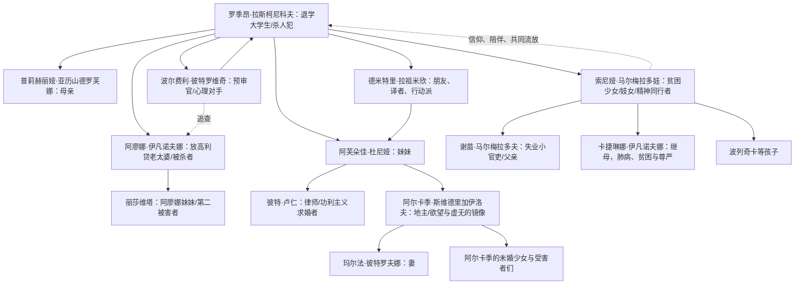

# 罪与罚

> 本文以人民文学出版社《罪与罚》（名著名译丛书，2016 年 10 月第 1 次印刷；据苏联国家文学出版社 1970 年“世界文学丛书”版译出）为底本。译者朱海观、王汶。正文按 EPUB 的“第一部—第六部—尾声”顺序梳理；章节小标题为本文拟题，不冒充原书标题。引文均为短句，用于定位情节和分析。

## 一、整体理解：一桩谋杀如何变成灵魂的审判

### 背景介绍：作者、时代与作品地位

陀思妥耶夫斯基（1821—1881）是俄国十九世纪现实主义作家，代表作还有《白痴》《群魔》《卡拉马佐夫兄弟》。他早年参加彼得拉舍夫斯基小组，1849 年被捕并经历死刑前的戏剧性赦免，后在西伯利亚服苦役、服兵役；这种对贫困、惩罚、信仰和极端心理的亲身经验，构成《罪与罚》的精神背景。小说 1866 年在《俄国公报》连载，迅速成为世界文学中的心理小说典范：它把侦探式犯罪叙事、社会现实主义和意识流般的内心独白结合起来，影响了现代小说、犯罪文学与存在主义思想。

故事发生在 1860 年代改革后的圣彼得堡。城市拥挤、炎热、酒馆密集，失业、债务、高利贷、卖淫和官僚制度交织。书中叙述把彼得堡写成一种“闷热、肮脏、使人窒息”的精神气候：拉斯柯尼科夫住在“像个衣柜”的小屋里，穷困使他与人群隔绝；马尔美拉多夫一家、索尼娅、失业者和街头醉汉，则让贫困不再是抽象统计，而是身体、房租、棺材和面包的问题。

### 全局摘要：主人公、故事与讽刺对象

主人公罗季昂·罗曼诺维奇·拉斯柯尼科夫是退学的穷大学生，聪明、骄傲、敏感而自我隔绝。他提出“人分为平凡人与非凡人”的理论：后者为实现更高目标，可以越过法律，甚至“有权杀人”。他以摆脱贫困、解救母亲和妹妹、验证自我为名，杀死放高利贷的老太婆阿廖娜·伊凡诺夫娜；老太婆的妹妹丽莎维塔意外出现，他又将她杀死。警方没有立即掌握证据，但预审官波尔费利通过心理较量逼近真相。拉斯柯尼科夫在梦魇、发热、羞耻和自我辩护中崩解，索尼娅以贫困中的牺牲和《圣经》拉撒路故事召唤他承认罪行。他最终自首，被判流放西伯利亚；尾声中，在索尼娅的陪伴下，他才开始接受“新生”。

通俗地说，这不是“警察抓凶手”的故事，而是一个人发现自己无法把别人当作“虱子”来处理的故事。小说讽刺以理性、功利或宏大目标为名的暴力：贫困制度制造绝望，高利贷把弱者商品化，“非凡人”理论把杀人美化为历史特权，官僚和舆论又把人简化成案卷。作品并不把基督教救赎写成廉价答案，而是让忏悔、服刑、共同生活和漫长劳动成为重建人格的过程。

### 人物关系图

### 全书的五条主线

1. **理论线**：从“非凡人”假说，到现实中的两次杀人，再到理论破产。
2. **心理线**：预谋的冷静—犯罪后的发热与梦魇—否认与自曝—认罪后的漫长复原。
3. **贫困线**：拉斯柯尼科夫、马尔梅拉多夫、索尼娅和丽莎维塔都被城市经济逼到边缘。
4. **侦查线**：证据不足的案件依靠波尔费利的谈话、诱导和等待逐渐收拢。
5. **救赎线**：索尼娅的同情、拉撒路故事、十字架、自首与西伯利亚劳动，构成开放式“新生”。

## 二、分章节解读（按 EPUB 实际顺序）

| 章节 | 本文拟题 | 核心内容 |
| --- | --- | --- |
| 前言 | 血与泪的社会悲剧 | 说明小说写贫困大学生犯罪及道德、良心的惩罚，强调心理剖析。 |
| 第一部1 | 衣柜般的小屋 | 拉斯柯尼科夫在酷热与欠租中出门，酝酿“那件事”。 |
| 第一部2 | 酒馆里的马尔梅拉多夫 | 失业小官吏讲述家庭困境，索尼娅为家卖身；贫困成为犯罪的社会背景。 |
| 第一部3 | 母亲的信与杜尼娅婚事 | 他得知妹妹将嫁给卢仁，决心阻止以牺牲换取家庭生存的婚姻。 |
| 第一部4 | 梦见被打死的马 | 童年梦中小马被活活打死，显示他对暴力的厌恶与“理论”之间的裂缝。 |
| 第一部5 | 偶然听见的谈话 | 他听到学生与军官谈论杀死老太婆“有益社会”，把偶然巧合解释为天意。 |
| 第一部6 | 抵押品与计划 | 回忆老太婆住址、门锁和丽莎维塔的习惯，谋杀变成可执行步骤。 |
| 第一部7 | 斧头、两具尸体 | 他杀死阿廖娜，丽莎维塔突然回家又被杀；抢来的物品未被使用。 |
| 第二部1 | 犯罪后的清晨 | 发热、藏匿赃物、听到警察谈论欠租；心理恐惧先于法律证据。 |
| 第二部2 | 医生与朋友 | 佐西莫夫、拉祖米欣照看他；他在报纸上看到谋杀消息，几近崩溃。 |
| 第二部3 | 警局的偶遇 | 因欠房租被叫去警局，偶然听到案情，差点暴露。 |
| 第二部4 | 卢仁的第一次亮相 | 卢仁以“理性、独立”为名要求杜尼娅顺从，拉斯柯尼科夫与他冲突。 |
| 第二部5 | 马尔梅拉多夫之死 | 酒鬼父亲被马车撞死，拉斯柯尼科夫拿出仅有的钱帮助其家人。 |
| 第二部6 | 旧梦与新闻 | 梦见老太婆、回到案发现场；报纸和街谈让现实不断刺入意识。 |
| 第二部7 | 葬礼前的混乱 | 卡捷琳娜病情恶化、家庭濒临破产；索尼娅与拉斯柯尼科夫关系加深。 |
| 第三部1 | 与母亲妹妹重逢 | 杜尼娅与母亲抵达彼得堡，家庭团聚被秘密和争吵笼罩。 |
| 第三部2 | 拉祖米欣的可靠 | 朋友承担实际照料，成为拉斯柯尼科夫无法彻底拒绝的人性纽带。 |
| 第三部3 | 理论公开化 | 拉祖米欣谈到他写过的文章，拉斯柯尼科夫解释“平凡人与非凡人”。 |
| 第三部4 | 卢仁的条件 | 卢仁要求杜尼娅与哥哥断绝来往，婚姻显出控制和算计。 |
| 第三部5 | 波尔费利的试探 | 预审官谈抵押品、心理学和“自首”，把案件转成与嫌疑人的对话。 |
| 第三部6 | 梦魇与自我辩护 | 拉斯柯尼科夫在发热、恍惚中回到犯罪现场，理论开始失去力量。 |
| 第四部1 | 索尼娅的房间 | 贫困少女的住处像“十字路口”，她与拉斯柯尼科夫建立复杂信任。 |
| 第四部2 | 卢仁的体面 | 卢仁以慈善和体面包装自利，准备在葬礼上展示自己的“正义”。 |
| 第四部3 | 斯维德里加伊洛夫出现 | 他讲述亡妻、幽灵和欲望，成为拉斯柯尼科夫的黑暗镜像。 |
| 第四部4 | 杜尼娅的拒绝 | 杜尼娅拒绝卢仁的控制；拉祖米欣的诚实与卢仁的算计形成对照。 |
| 第四部5 | 葬礼与诬陷 | 卢仁把钱塞进索尼娅口袋，诬陷她偷窃，企图拆散杜尼娅与哥哥。 |
| 第四部6 | 索尼娅读《拉撒路》 | 她请求拉斯柯尼科夫读《圣经》，复活故事成为认罪与新生伏笔。 |
| 第五部1 | 卢仁的破产 | 诬陷被揭穿，卢仁的“理性道德”暴露为报复性操纵。 |
| 第五部2 | 卡捷琳娜的末日舞会 | 她带孩子上街唱歌，贫困、尊严与疯狂同时爆裂。 |
| 第五部3 | 拉斯柯尼科夫的自白 | 他向索尼娅承认杀人，称自己想证明“不是虱子”；索尼娅劝他去十字路口认罪。 |
| 第五部4 | 诬陷者的崩溃 | 真相扩大，索尼娅洗清嫌疑；拉斯柯尼科夫的秘密再也无法独占。 |
| 第五部5 | 卡捷琳娜之死 | 她在街头咳血而亡，索尼娅承担孤儿；斯维德里加伊洛夫暗中提供钱。 |
| 第六部1 | 波尔费利的最后谈话 | 预审官说明自己相信拉斯柯尼科夫是凶手，却等待他主动选择。 |
| 第六部2 | 卢仁之后的余波 | 拉祖米欣、杜尼娅和索尼娅共同面对善后，家庭关系重新排列。 |
| 第六部3 | 斯维德里加伊洛夫的秘密 | 他透露听见拉斯柯尼科夫自白，既想救杜尼娅又沉溺欲望。 |
| 第六部4 | 黑暗镜像的自毁 | 斯维德里加伊洛夫资助孤儿、安排婚事后自杀，证明虚无无法靠金钱填补。 |
| 第六部5 | 杜尼娅与枪 | 他把杜尼娅诱入空屋，她拒绝以爱情换自由；枪响成为其道德失败的终点。 |
| 第六部6 | 母亲的最后告别 | 拉斯柯尼科夫探望母亲，母亲隐约知道真相；家庭告别转向自首。 |
| 第六部7 | 十字路口 | 他在索尼娅注视下到警局，先犹豫后返回，最终承认杀人。 |
| 第六部8 | 法庭与判决前夕 | 供词、证物与心理证词汇合；他被判八年苦役。 |
| 尾声1 | 西伯利亚的九个月 | 认罪并不等于悔悟，他仍认为自己只是“判断失误”，索尼娅随行。 |
| 尾声2 | 拉撒路之后 | 病中梦见全世界被“新思想”毁灭；读《圣经》、流泪和爱使他开始真正悔悟。 |

## 三、人物性格与关系：理论如何穿过每个人的身体

### 拉斯柯尼科夫：骄傲的分裂者

他聪明、富有同情心又极端孤独：会把钱给马尔梅拉多夫一家，也会把陌生人视为“虱子”。他的“非凡人”理论不是纯哲学，而是贫困、屈辱和自恋共同制造的防御。犯罪前他反复计算门锁、斧头和时间，犯罪后却在发热中忘记藏匿细节；这说明理性只是表层，身体和良心早已拒绝执行理论。尾声中他迟迟不肯承认罪的性质，真正的转折不是判刑，而是“他第一次流泪拥抱索尼娅”。

### 索尼娅：被迫牺牲者与主动的见证人

索尼娅因家庭饥饿走上街头，却没有把自己的牺牲转化成优越感。她柔弱、羞怯，同时具有惊人的道德坚定：面对卢仁的诬陷不报复，面对拉斯柯尼科夫的理论不争辩，只要求他“到十字路口去，向大地鞠躬”。她不是抽象圣女，而是被贫困伤害、仍选择陪伴的人。她携带《新约》去西伯利亚，使救赎成为共同劳动，而非神迹。

### 波尔费利：以心理学代替刑讯的侦查者

波尔费利爱抽烟、说话绕弯，故意显得不确定；实际上他准确把握嫌疑人的自尊和恐惧。他不急于逮捕，而是让拉斯柯尼科夫在谈论理论时暴露自己。其“我给您两天、三天，您自己会来”的判断，把法律程序变成道德选择。波尔费利并非纯粹善人，他也操纵对话；但他相信承认罪行对人格有意义，这使他区别于只追求定罪率的官僚。

### 拉祖米欣：反理论的日常行动

拉祖米欣贫穷、鲁莽、热情，靠翻译和劳动解决问题。他不懂宏大理论，却能在朋友发烧时找医生、在杜尼娅受辱时站出来。与拉斯柯尼科夫相比，他把“人”当作具体关系而非抽象类别。最终他与杜尼娅结婚并照料母亲，构成一种不耀眼但可持续的伦理生活。

### 杜尼娅与卢仁：婚姻中的自主与功利

杜尼娅坚强、有判断力，愿意为家庭牺牲却不接受被购买。卢仁把“独立女性”变成“欠我人情的妻子”，要求她与哥哥断绝关系，并在索尼娅身上布置诬陷。杜尼娅拒绝他，说明真正的独立不是经济口号，而是保留拒绝的权利。

### 斯维德里加伊洛夫：没有救赎方向的自由

他有钱、幽默、慷慨，能为孤儿付钱，也可能侵犯弱者；他相信欲望是一种自然事实，因此不受道德约束。他听见拉斯柯尼科夫的秘密后，仿佛站在另一条“非凡人”道路上：不需要理论，也不需要借口。杜尼娅拒绝他、自杀前为孩子安排生活，显示偶然善行不能自动产生悔悟。

### 马尔梅拉多夫一家与两位被害者

马尔梅拉多夫沉溺酒精却有自我认识；卡捷琳娜在肺病、贫困和贵族尊严之间挣扎；孩子们让贫困具象化。阿廖娜是放高利贷者，冷酷、吝啬，却也只是城市经济关系中的一个节点；丽莎维塔沉默、善良、受支配，她的意外死亡击穿拉斯柯尼科夫“只杀一个有害老太婆”的算式。小说因此拒绝把被害者分成“值得死”和“不值得死”。

## 四、按文章顺序归纳叙事：阶段、名场面与伏笔

### 阶段一：理论尚未落地（第一部）

第一部从“像个衣柜”的陋室开始。拉斯柯尼科夫躲避女房东，表面是欠租，深层是他不愿面对任何具体的人。酒馆里马尔梅拉多夫说“我去求的不是怜悯，而是同情”，把贫困者的尊严和羞耻摆在读者面前；他回家后被女儿索尼娅卖身救济，构成拉斯柯尼科夫后来与索尼娅相认的情感伏笔。梦中小马被打死，他哭喊“那是我的小马！”——这场梦先证明他有同情心，再让现实中的斧头显得不可思议。偶然听见“杀死老太婆，拿她的钱去帮助千百个人”的谈话，以及得知丽莎维塔恰好外出，形成他自我欺骗的“天意”。第一部结尾两次斧击和丽莎维塔的出现，回收了所有准备细节，也留下“未使用赃物”这一心理证据。

### 阶段二：逃脱法律却逃不脱身体（第二部）

犯罪后的清晨，他把物品塞进墙洞，后来又转移到石头下；他越想“消灭罪证”，越暴露恐惧。警局里有人谈论“老太婆案”，他因听见脚步和笑声几乎晕倒；警方没有证据，身体却先行招供。马尔梅拉多夫被马车撞死的场面是另一种“城市谋杀”：贫困和酒精共同夺走生命。拉斯柯尼科夫把钱交给卡捷琳娜，说明同情并未消失，但善举无法抵消理论造成的裂缝。梦见老太婆在笑、回到案发房间，是后文他在索尼娅面前承认“我杀的是自己”的伏笔。

### 阶段三：理论被迫说出口（第三、四部）

家庭重逢、卢仁的婚事和波尔费利的谈话，把私人关系变成思想法庭。拉祖米欣发现拉斯柯尼科夫旧文章，后者解释“非凡人有权越过障碍”；这段自我阐释正是文本让理论接受现实检验的时刻。波尔费利不说“我有证据”，而谈“您会不会去自首”，把侦查转向良知。索尼娅的房间、黑十字架和《拉撒路》阅读构成核心伏笔：她请他读“拉撒路已经在坟墓里四天”，而他尚未准备从自己的坟墓出来。卢仁在葬礼上把钱放入索尼娅口袋，诬陷情节揭示“体面”也能制造罪；斯维德里加伊洛夫听见秘密，则把拉斯柯尼科夫可能走向的另一条道路提前具象化。

### 阶段四：自白与他人受难交织（第五部）

卡捷琳娜穿着破旧衣服带孩子上街唱歌，喊着“我们是贵族人家”，尊严与疯狂同时出现。拉斯柯尼科夫在索尼娅房间说出：“我不是为了钱……我只是想知道，我是不是像所有人一样的虱子。”这句自白回收第一部的理论，却立即被索尼娅反驳：问题不在他是不是“非凡”，而在他是否承认杀人。她让他到十字路口亲吻大地，要求公开承担人与人的关系。卡捷琳娜在街上咳血而死，索尼娅收养孩子；斯维德里加伊洛夫提供钱，证明善行可以来自复杂动机，却不能替代悔罪。

### 阶段五：法律判决与精神判决（第六部、尾声）

波尔费利最后一次来访，明确说自己“相信您就是凶手”，但仍给他时间；这不是宽恕，而是把最后一步留给主体。斯维德里加伊洛夫给杜尼娅留下钱、安排孤儿后自杀，黑暗镜像在枪声中闭合。拉斯柯尼科夫探望母亲，母亲把他当作“最聪明、最善良的孩子”，家庭的爱使他无法继续把自己当作历史英雄。警局门口他一度离开，想到索尼娅又折返；自首是反复犹豫后的行动，不是戏剧性顿悟。尾声中他在西伯利亚仍认为自己只是“没有成功”，说明法律惩罚先于道德觉醒。大病后的梦境写“全世界被一种可怕的新思想传染”，与他早先的个人理论相互对应；索尼娅送来的《新约》、共同劳动和第一次流泪，才让“复活”从象征变成可能。

## 五、剧情分析与细节回顾

### 1. “非凡人理论”是自尊的防御机制

拉斯柯尼科夫把拿破仑式历史人物当作模型，声称他们可以为更高目标流血。但他真正想证明的不是理论正确，而是自己不再受贫困、房租和母亲牺牲支配。杀人后他没有使用钱财，反而把物品藏起来，表明动机从未真正是经济。理论是把羞耻转译成优越感的语言；当丽莎维塔被杀，具体的、无辜的生命击穿了抽象算式。

### 2. “罪”有三层，“罚”也有三层

- **法律层**：斧杀两人、藏匿赃物，最终判八年苦役。
- **心理层**：发热、梦魇、孤独、强迫性回到现场；他在无人指控时已经受罚。
- **关系与存在层**：把他人降格为工具后，他失去与母亲、妹妹、朋友和自己的联系；索尼娅的陪伴让他重新进入共同体。

### 3. 梦境是被压抑的证词

小马梦暴露童年的同情；老太婆笑梦暴露犯罪后的羞耻；西伯利亚“新思想瘟疫”梦则把个人理论扩大为社会灾难。梦不是神秘预言，而是理性无法承认的事实以形象返回。

### 4. 彼得堡空间与心理空间同构

低矮房间、狭窄楼梯、酒馆和警局构成“闷热迷宫”；索尼娅的房间虽贫穷，却有十字架和《圣经》，成为可以说真话的空间；西伯利亚开阔、寒冷，反而给他第一次持续劳动和关系重建的可能。空间转换对应心理从封闭到开放。

### 5. 侦查不是证据竞赛，而是等待主体承认

波尔费利掌握的硬证据有限：抵押品、现场痕迹、拉斯柯尼科夫异常行为都不足以独立定罪。他通过谈论文章、假设性案例、突然拜访，让嫌疑人不断回到“我是否有权杀人”的问题。小说因此把侦探叙事改写成伦理对话：真正的“破案”发生在自首时。

### 6. 索尼娅与斯维德里加伊洛夫是两种回应苦难的镜像

索尼娅承受苦难却仍承认他人的主体性；斯维德里加伊洛夫拥有资源却把他人当作欲望对象。前者以共同承担走向未来，后者以金钱、偶然善举和自杀结束一切。两人都不是纯洁的象征，而是拉斯柯尼科夫可能选择的两条道路。

### 7. 文学解析：复调、反英雄与开放结局

小说让警察、妓女、官吏、大学生、商人和宗教信徒各自发言，没有单一叙述者替他们裁决；这形成巴赫金所谓“复调”效果。主人公不是完成式英雄，而是不断自我反驳的反英雄。尾声只写“新生的开始”，不写他是否彻底成为善人，保留道德改变的时间性，也避免把苦役浪漫化。

## 六、读后感悟：承认自己属于“人”

《罪与罚》最刺痛人的地方，是它不允许读者把拉斯柯尼科夫简单归类为怪物。他确实杀了人，也确实帮助过陌生人；他既有同情心，又能用理论关闭同情心。我们在现实中也可能用“效率、集体利益、规则例外”把具体的人变成数字。小说提醒：一旦把自己想象成可以凌驾他人的“例外”，惩罚就已经开始——它表现为失眠、隔绝、无法接受爱，而不必等到法庭宣判。

索尼娅的力量不在于替他辩护，而在于坚持事实：你杀了人，你必须承认；同时，你仍然可以重新成为人。这个矛盾构成作品的伦理核心：责任与希望必须同时存在。拉祖米欣告诉我们，抵抗虚无不一定靠宏大理论，先把朋友送进医院、替孩子找住处、认真工作，也是一种道德实践。尾声的“新生”不是洗白，而是愿意在漫长时间里学习与他人共同生活。

## 七、文本依据、版本与核验说明

1. **主要文本**：用户提供 EPUB《罪与罚（名著名译丛书）》，人民文学出版社，2016 年 10 月，ISBN 978-7-02-011582-2；元数据显示译者朱海观、王汶、据苏联国家文学出版社 1970 年版译出。已核对 `content.opf`、`toc.ncx`、前言、正文 6 部 39 章、尾声及封面。
2. **作者与作品背景补充**：参考 Encyclopaedia Britannica 的陀思妥耶夫斯基、Crime and Punishment 条目（访问日期 2026-08-24；页面有反爬限制，未将其内容当作正文证据），并以通行文学史常识交叉核对；社会地位判断以作品长期世界文学经典地位为限，不虚构具体销量。
3. **引文原则**：只使用 EPUB 中可定位的短句或短语；情节概述、人物分析与文学判断均与对应部、章相连，未把影视改编内容混入。
4. **封面资源**：从 EPUB 的 `OEBPS/Image00013.jpg`（OPF 标注 `cover-image`）提取为 [`crime-and-punishment-cover.jpg`](/assets/images/crime-and-punishment-cover.jpg)。
