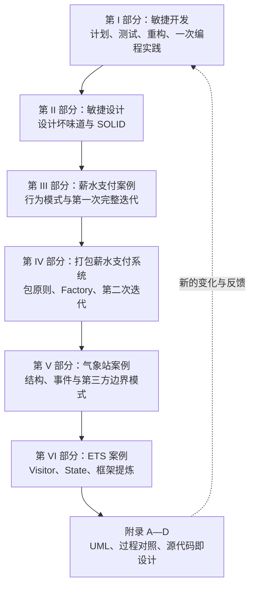

# 敏捷软件开发：原则、模式与实践

> 本文精读 Robert C. Martin 的 *Agile Software Development: Principles, Patterns, and Practices* 中文版。原书案例主要使用 20 世纪末至 21 世纪初的 Java/C++、JUnit 3、JDBC 与 UML 表示法。下文把“原书内容”“版本对照”“当前补充”分开：前者忠实还原论证，后两者不冒充原文。核验日期为 2026-08-09。

## 先看全局：这本书到底在解决什么

### 从官方表述到通俗解释

书的起点是《敏捷软件开发宣言》。原文列出四组价值选择，并以一句很容易被漏掉的限定收束：

> “虽然右项也有价值，但是我们认为左项具有更大的价值。”

因此，敏捷并不等于不要流程、文档、合同或计划，而是在发生冲突时，优先选择人员协作、可工作的软件、客户合作和响应变化。Martin 接着把这一价值观落实为一条完整技术链：短周期计划让需求反馈更快；测试让修改可验证；重构让设计持续保持可修改；SOLID 原则判断依赖是否健康；设计模式复用已验证的依赖结构；真实案例再检验这些原则是否真的有用。

用普通话说：软件最昂贵的不是第一次写出来，而是需求不断变化后仍能安全地改。大而全的前期设计企图提前消灭不确定性，常常只把错误推迟到集成阶段。本书的办法是缩短“提出假设—写代码—测试—交付—获得反馈”的距离，并让每次反馈都能反过来修正计划和设计。

### 六部分是一条递进的反馈链



这不是“先把原则背完，再给模式找例子”的目录。第 6 章先用保龄球计分展示设计如何从测试中长出来；第 18、19 章把前面的原则投入薪水支付系统；第 22 章又推翻一部分过度打包。作者在用章节结构亲自演示：设计结论必须接受代码和变化的检验。

### 与常见开发方式的区别

| 维度 | 阶段式、预测型流程 | 本书的敏捷/XP | Scrum、Kanban 与持续交付中的常见做法 |
| --- | --- | --- | --- |
| 计划 | 先固定范围、成本和日期 | 发布计划与迭代计划分层，按实际速度重算 | Scrum 用 Sprint/Backlog；Kanban 管流动；持续交付进一步缩小批量 |
| 需求 | 前期规格尽量完备，变更走审批 | 故事卡只是会谈提示，由客户持续排序 | 常配合产品发现、验收示例、指标与用户反馈 |
| 进度证据 | 文档阶段、完成百分比 | 通过验收测试的可工作软件 | 可部署增量、交付频率、前置时间与质量信号 |
| 设计 | 先冻结总体与详细设计 | 简单设计，在测试保护下持续重构 | 常保留必要架构决策，同时用演进式架构验证风险 |
| 测试 | 编码完成后集中验证 | 测试先行，单元测试与验收测试共同驱动 | 单元、集成、契约、端到端测试分层进入流水线 |
| 团队 | 按分析、设计、编码、测试交接 | 跨职能协作、结对、集体所有权 | 强调自主团队、代码评审/结对、可观测性与运维反馈 |
| 适应变化 | 变化意味着偏离计划 | 变化是新的信息，计划和设计都可调整 | 通过小批量、特性开关、渐进发布降低变更风险 |

本书相较重型流程的优势不是“速度永远更快”，而是更早暴露错误，并把一次大赌注拆成许多可回退的小赌注。它也不是 Scrum 或 DevOps 的替代品：XP 更具体地回答程序员每天怎样写代码；Scrum 主要组织产品与团队节奏；Kanban 管理流动；持续交付把可部署性、基础设施和运行反馈接到开发循环上。

## 逐章导航：30 章和 4 个附录没有缺席

| 章节 | 标题 | 核心内容 | 书中给出的解法 |
| --- | --- | --- | --- |
| 第 1 章 | 敏捷实践 | 宣言价值观与 12 条原则 | 以频繁交付和持续合作替代僵化控制 |
| 第 2 章 | 极限编程概述 | XP 实践是互相支撑的系统 | 小发布、结对、测试、重构、持续集成协同工作 |
| 第 3 章 | 计划 | 不确定条件下如何承诺 | 故事点、速度、发布计划和迭代计划分层修正 |
| 第 4 章 | 测试 | 如何让修改可验证 | 测试先行，兼用单元测试和验收测试 |
| 第 5 章 | 重构 | 代码能工作但越来越难改 | 在测试保护下小步改善结构与表达 |
| 第 6 章 | 一次编程实践 | 预想设计与真实反馈的冲突 | 用保龄球计分的结对实录展示测试—重构循环 |
| 第 7 章 | 什么是敏捷设计 | 软件为何腐化 | 识别七种坏味道，用原则持续清理依赖 |
| 第 8 章 | 单一职责原则 | 一个类受多类变化牵引 | 每个类只保留一个变化原因 |
| 第 9 章 | 开放—封闭原则 | 增加功能总要修改稳定代码 | 对扩展开放，对修改封闭；以抽象隔离变化 |
| 第 10 章 | Liskov 替换原则 | 继承在语法正确时仍会破坏行为 | 让子类型遵守基类型契约 |
| 第 11 章 | 依赖倒置原则 | 业务策略被具体设施绑架 | 高、低层共同依赖抽象，细节反向实现策略接口 |
| 第 12 章 | 接口隔离原则 | 胖接口让无关客户被迫重编译/变化 | 按客户角色拆接口，必要时用委托适配 |
| 第 13 章 | Command 与 Active Object | 请求的发送、执行、撤销和调度耦合 | 把行为封装为对象，再用队列调度至完成 |
| 第 14 章 | Template Method 与 Strategy | 通用算法和可变步骤混在一起 | 分别以继承或委托分离稳定骨架与变化 |
| 第 15 章 | Facade 与 Mediator | 子系统接口混乱、对象协作成网 | 用外观统一边界，或由中介者协调对象 |
| 第 16 章 | Singleton 与 Monostate | 如何表达唯一实例/唯一状态 | 分别保证结构唯一或行为共享；同时比较代价 |
| 第 17 章 | Null Object | 到处判空污染业务流程 | 用遵守接口的“什么也不做”对象表示缺省行为 |
| 第 18 章 | 薪水支付：第一次迭代开始 | 从需求到初步对象模型 | 用例驱动，组合分类、周期、支付方式与隶属关系 |
| 第 19 章 | 薪水支付：实现 | 初步模型能否经受完整业务 | 以测试先行逐交易、逐工资类型实现并修正模型 |
| 第 20 章 | 包的设计原则 | 类怎样形成可发布、可维护组件 | REP/CRP/CCP 管内聚，ADP/SDP/SAP 管依赖 |
| 第 21 章 | Factory | 创建具体对象泄漏依赖 | 集中对象族创建，同时保留抽象边界 |
| 第 22 章 | 薪水支付案例（第 2 部分） | 包结构和数据库细节如何演进 | 用包度量与工厂重组，再删掉不值成本的分层 |
| 第 23 章 | Composite | 单个对象和对象组需要统一处理 | 让叶子与组合实现共同接口 |
| 第 24 章 | Observer | 时间源与多个显示/趋势模块耦合 | 通过订阅通知建立一对多依赖 |
| 第 25 章 | Abstract Server、Adapter、Bridge | 客户、第三方接口和两条变化轴互相牵制 | 客户拥有抽象；适配不兼容接口；桥接独立变化维度 |
| 第 26 章 | Proxy 与 Stairway to Heaven | 领域对象被第三方持久化 API 污染 | 代理隔离数据库；多继承阶梯复用持久化机制 |
| 第 27 章 | 气象站案例 | 同一软件适配两代硬件且保存历史 | 接口、工厂、Observer、Bridge、Proxy 按风险逐步加入 |
| 第 28 章 | Visitor | 稳定对象结构需要不断增加新操作 | 双分派访问者，并比较 Acyclic Visitor 等变体 |
| 第 29 章 | State | 状态—事件组合散落在条件分支中 | 状态转换表、State 对象或状态机生成器集中规则 |
| 第 30 章 | ETS 框架 | 从一个应用臆测框架导致失败 | 从四个真实应用中反复提取已证实的复用点 |
| 附录 A | UML 表示法 I：CGI 示例 | 不同抽象层次的 UML 怎样交流 | 课程登记案例串起用例、领域、组件、顺序和类图 |
| 附录 B | UML 表示法 II：统计多路复用器 | 实时并发协议如何表示 | 状态、活动、协作图揭示中断、线程和竞争条件 |
| 附录 C | 两个公司的讽刺小品 | 阶段门与敏捷团队的结果差异 | 并排叙事展示小步交付与文档合规的反馈差异 |
| 附录 D | 源代码就是设计 | 编码究竟是制造还是设计 | 把编译视作制造，把代码、测试和调试视作设计活动 |

## 第一阶段：用短反馈控制开发（第 I 部分）

### 第 1 章　敏捷实践：价值观必须变成行为

本章先解释重型流程为何出现：团队害怕重复过去的失败，于是不断增加表单、评审和控制；但流程越重，响应越慢，结果又产生新的失败。2001 年敏捷联盟提出四项价值和 12 条原则，核心不是反秩序，而是把“可工作的软件”和“经常交付”作为事实检验。

作者强调早期且持续地交付有价值的软件、欢迎后期需求变化、业务人员与开发者每天合作、围绕有动力的人组建项目、保持可持续节奏、追求技术卓越，并定期反省和调整。宏观计划可以粗，临近迭代才细化；越远的未来，不确定性越高，过细计划越像虚假的精确。

- **Agile（敏捷）**：感知变化后，以较低成本改变方向的能力，不是单纯“做得快”。
- **迭代**：固定短周期内完成一小批可验证工作，并用结果修正下一周期。
- **增量**：每次交付增加一块可使用能力；迭代强调学习循环，增量强调产品增长，两者相关但不相同。

> 当前补充：12 条原则仍可作为检查表，但“工作软件”不能排除安全、隐私、可观测性和运维能力；这些也是产品可工作的一部分。

### 第 2 章　极限编程概述：实践要成套理解

极限编程（XP）把有效做法推向高频：客户作为团队成员；用户故事与验收测试描述需求；短迭代、小版本、集体所有权、持续集成、可持续速度、开放工作空间；程序员以结对、测试先行、重构和简单设计完成代码。书中特别提醒，这些实践相互支撑：没有自动测试，重构风险高；没有持续集成，集体所有权容易制造冲突；没有客户反馈，小版本只会更快地产生错误方向。

简单设计在书中满足三条优先标准：通过全部测试；没有重复；表达程序员意图，并尽可能少用类和方法。它不是“先随便写”，而是不为未经证实的变化付款。

- **XP（Extreme Programming）**：Extreme Programming，极限编程，一套聚焦软件开发现场的敏捷方法。
- **用户故事**：客户可理解的一小块行为描述，是会谈的索引而非完整合同。
- **持续集成**：成员频繁把小改动合入共同主线，并由自动构建和测试立即验证。

局限是 XP 对客户可得性、团队纪律与测试基础要求很高。分布式团队不必照搬“开放工作空间”，可以用视频结对、共享白板、短分支和自动流水线保持同一种反馈目标。

### 第 3 章　计划：承诺的是可调整预测，不是故事点产量

发布计划从客户写故事开始。开发者只估技术成本，不替客户决定价值；客户按价值与风险排序。故事以相对点数估计，团队可先做 **Spike**（探针实验）探索未知，再以一轮实际完成的点数得到速度。书中的典型发布跨度为 2～4 个月、迭代约 2 周；一旦迭代开始，不随意塞入新故事。迭代中点检查，结束时只统计真正完成的故事，再用这一速度重算日期或范围。

```text
下一迭代可选工作量 ≈ 上一迭代真正完成的故事点
发布日期预测 ≈ 剩余故事点 ÷ 近期稳定速度
```

- **故事点**：对工作量、复杂性和不确定性的相对估计单位，不是工时。
- **Velocity（速度）**：团队在一个迭代内完成且验收通过的点数，是局部预测工具。
- **Spike**：为回答技术问题而做的限时实验，产物是知识而非生产功能。

> 纠正性补充：不同团队的点数标尺不同，不能横向排名，也不应把“提高速度”设为绩效指标。那会诱导膨胀估算、拆假故事，破坏速度作为预测信号的作用。

### 第 4 章　测试：验证、设计和文档是同一个反馈面

书把测试分为程序员编写的单元测试与客户定义的验收测试。测试先行迫使开发者先站在调用者角度思考 API，也迫使代码可隔离、可替换，因此测试不只是检查，还会改善设计。Wumpus 游戏示例从房间连接与移动规则开始；薪水支付示例用替身隔离数据库。验收测试从系统外部描述输入输出，甚至反过来促成以 XML 输入/输出为边界的架构。

按书中“先测试、再实现”的节奏，可用今天的 JUnit 5 写成：

```java
@Test
void rolls_spare_and_adds_next_roll_as_bonus() {
    Game game = new Game();
    game.roll(5);
    game.roll(5);
    game.roll(3);
    rollMany(game, 17, 0);

    assertEquals(16, game.score());
}
```

- **TDD（Test-Driven Development）**：测试驱动开发，常概括为红灯—绿灯—重构。
- **单元测试**：快速验证一个小行为单元，通常隔离慢速或不稳定的外部依赖。
- **验收测试**：从业务视角证明一个故事达到可接受条件，可由 API、界面或领域接口执行。
- **测试替身**：代替真实协作者的对象；Stub 提供固定数据，Spy 记录调用，Mock 验证交互，Fake 提供简化实现。

测试的边界同样重要：只验证 Mock 调用会把测试绑定实现细节；端到端测试太多又会慢且脆。现代项目通常以快速单元测试为主体，按风险加入集成、契约与少量端到端测试。

### 第 5 章　重构：先保持行为，再改变结构

作者采用 Fowler 的定义：重构是在不改变外部可观察行为的前提下改变内部结构。一个模块同时承担三件事：运行其功能、容纳变化、向读者交流意图。代码“能跑”只满足第一件事。

素数筛示例先有测试，再逐步重命名含糊变量、提取方法、缩小职责。每一步都很小，运行全部测试后才继续。其思想可压缩为：

```text
发现坏味道 → 做一个最小结构修改 → 运行测试 → 保持绿色 → 再走一步
```

- **Refactoring（重构）**：不改变外部行为的结构改善，与新增功能、修缺陷在意图上不同。
- **坏味道**：提示设计可能有问题的可观察症状，不是机械等同于缺陷。
- **安全网**：能快速发现行为回归的一组自动测试。

局限在于：缺乏测试、并发时序、数据库迁移、公开 API 和性能敏感代码会扩大“行为不变”的范围。先补特征测试、建立性能基线，把架构迁移拆为可兼容步骤，比一次大重写安全。

### 第 6 章　一次编程实践：保龄球计分如何推翻预想 UML

这一章是两位程序员的结对实录。他们起初画出 `Game—Frame—Throw`，看起来很符合现实名词；但逐个写出全失、全中、补中等测试后，发现 `Frame` 和 `Throw` 并没有独立职责，数组加少量计分逻辑更简单。设计不是把现实名词逐一变成类，而是找到能表达当前行为、容纳当前变化的最小结构。

书中计分核心可概括为：

```java
for (int frame = 0; frame < 10; frame++) {
    if (isStrike()) score += 10 + strikeBonus();
    else if (isSpare()) score += 10 + spareBonus();
    else score += sumOfBallsInFrame();
}
```

每个分支都不是预先一次写完，而由失败测试逐步逼出。UML 在这里是短暂的思考草图，代码和测试才是能执行的证据。

- **结对编程**：两人共同完成同一工作，一个关注当前输入，一个审视方向与缺陷，并频繁交换角色。
- **涌现式设计**：设计随可验证事实逐步形成，不等于没有方向或拒绝架构。

## 第二阶段：让设计在变化下仍然柔软（第 II 部分）

### 第 7 章　什么是敏捷设计：先看腐化症状

作者把设计理解为源代码结构本身，并列出七个症状：

- **僵化性（Rigidity）**：一个改动迫使许多模块跟着改。
- **脆弱性（Fragility）**：修改一处，表面无关处出错。
- **牢固性（Immobility）**：有用模块无法从原系统中抽出复用。
- **黏滞性（Viscosity）**：做错比做对更容易，例如绕过缓慢构建流程。
- **不必要的复杂性**：为未发生的变化提前搭扩展点。
- **不必要的重复**：同一知识散落多处，修改容易不一致。
- **晦涩性（Opacity）**：读者难以看出意图。

Copy 程序原先让高层复制逻辑直接依赖键盘和打印机；当输入设备变化时，大量条件分支出现。把读取和写入抽象成高层需要的接口后，设备细节反过来依赖这些接口。这为随后五项 SOLID 原则建立问题背景。原则不是一次性“设计阶段”的门禁，而是发现症状后指导重构的方向。

### 第 8 章　SRP：职责就是变化原因

原书定义非常精确：

> “就一个类而言，应该仅有一个引起它变化的原因。”

SRP 不是“一类只做一件小事”，而是把受不同角色、不同时间、不同业务规则驱动的变化分开。`Rectangle` 同时服务计算几何与图形界面，会让部署几何程序也依赖 GUI；`Employee` 同时计算薪资和持久化，会把业务规则与数据库节奏绑在一起。分开后，变化只影响相应边界。

- **SRP（Single Responsibility Principle）**：单一职责原则。
- **职责**：某个参与者对系统提出的一类变化原因，而不是方法数量。
- **内聚**：同一模块中元素围绕共同变化和目标聚合的程度。

不要看到两个方法就拆类。书中也强调，若两个变化轴在实际环境总是一起变化，拆分只会增加无用复杂度。先寻找真实的变化来源，再划边界。

### 第 9 章　OCP：用已发生的变化选择抽象

> “软件实体（类、模块、函数等等）应该是可以扩展的，但是不可修改的。”

Shape 示例先用类型字段和 `switch` 绘图，每增加一种形状都要修改稳定分支；让每个形状实现 `draw()` 后，主循环对新形状封闭。Template Method 和 Strategy 都是 OCP 的常见机制：稳定策略依赖抽象，可变细节在派生类或组合对象中扩展。

```java
interface Shape { void draw(); }

void drawAll(List<Shape> shapes) {
    shapes.forEach(Shape::draw);
}
```

- **OCP（Open-Closed Principle）**：开放—封闭原则，对扩展开放、对修改封闭。
- **抽象**：忽略不相关细节后形成的稳定协议，不等同于 `abstract` 关键字。

软件不可能对所有变化封闭。作者的关键告诫是“拒绝不成熟的抽象和抽象本身一样重要”。先让第一次变化穿过系统，观察其轴线；若同类变化再次发生，再建立边界，通常比凭想象造插件系统更可靠。

### 第 10 章　LSP：继承首先是一份行为契约

Liskov 替换原则要求：使用基类型的程序在换成其子类型后仍然正确。正方形在数学上是矩形，但可变 `Rectangle` 允许分别设置宽、高；`Square` 若强制二者同步，就破坏调用者“设宽不改高”的假设。语法上的 `extends` 无法保证行为上的可替换。

- **LSP（Liskov Substitution Principle）**：里氏替换原则。
- **前置条件**：调用前必须满足的条件；子类型不能要求更强。
- **后置条件**：调用后承诺成立的条件；子类型不能给得更弱。
- **不变式**：对象在可观察稳定状态持续满足的规则。

运行时判断具体类型、退化重写为空操作、派生类突然抛出基类未承诺的异常，都是危险信号。书中 `PersistentSet` 也表明：为了复用实现而宣称“持久集合是一种集合”，若契约不一致，应提取共同抽象或使用组合。测试正是把隐含契约变成可执行规格的一种方式。

### 第 11 章　DIP：让策略拥有接口

原书给出两句话：高层模块不应依赖低层模块，二者都应依赖抽象；抽象不应依赖细节，细节应依赖抽象。`Button` 不应直接控制 `Lamp`，而应调用由高层开关策略需要的 `ButtonServer`；灯、熔炉等设备实现这一接口。源码依赖因此从策略指向抽象、从细节反向指回抽象。

- **DIP（Dependency Inversion Principle）**：依赖倒置原则，讨论源码依赖方向。
- **DI（Dependency Injection）**：依赖注入，把协作者从外部传入，是实现 DIP 的一种技术，不等同于 DIP。
- **控制反转（IoC）**：框架或外部协调者掌握调用/创建流程的宽泛概念。

```java
final class Regulator {
    private final Thermometer sensor;
    private final Heater heater;

    Regulator(Thermometer sensor, Heater heater) {
        this.sensor = sensor;
        this.heater = heater;
    }
}
```

书也比较 C++ 模板：它能倒置源码依赖，但具体类型在编译期固定。今天应根据变化频率选择构造器注入、泛型或模块边界；不要为了“所有类都可替换”而为纯数据值对象制造接口。

### 第 12 章　ISP：接口由客户需要塑形

> 不应该强迫客户依赖于它们不用的方法。

`Door` 增加超时功能后，普通门被迫依赖计时方法。书给出两种拆法：让适配器以委托连接 `TimedDoor` 与 `TimerClient`；或让一个类实现多个小接口。ATM 示例进一步按不同交易拆分 UI 接口，使一次存款界面变化不会迫使全部交易重新依赖。

- **ISP（Interface Segregation Principle）**：接口隔离原则。
- **胖接口**：为多类客户混合了大量无关操作的协议。
- **角色接口**：从某一类客户的使用视角定义的最小能力集合。

过度隔离同样会失败：数百个只含一个方法的接口让导航和装配比变更本身更难。合理粒度看客户是否独立变化、部署和测试，而不是追求方法数最少。

## 第三阶段：在薪水支付系统中检验原则与行为模式（第 III 部分）

### 第 13 章　Command 与 Active Object：把“做什么”变成数据

Command 将行为、参数与目标封装成对象。设备控制例子统一 `do()`；事务例子把验证与执行在物理和时间上解耦；保存已执行命令及逆操作即可形成撤销栈。它适用于菜单动作、任务队列、审计日志和事务入口，但每个简单调用都建命令类会增加样板代码。

Active Object 把命令放入队列，由调度循环逐个执行至完成。书中模型是协作式、非阻塞的 run-to-completion：命令若未完成，主动让出并重新排队。它减少“一任务一线程”的栈成本，却不能保证精确顺序，任何命令也不能长时间阻塞。

- **Command**：命令模式，把请求封装为具有统一执行协议的对象。
- **Active Object**：主动对象模式，通过队列与调度器将方法调用和执行时机解耦。
- **Run-to-completion**：一次任务运行到明确让出点或结束，中间不被同一事件循环并发重入。

> 当前补充：今天可用 `Executor`、消息队列、Actor 或事件循环实现类似调度。书中的轮询循环不是并发问题的通用解，阻塞 I/O、背压、取消和失败传播必须单独设计。

### 第 14 章　Template Method 与 Strategy：继承和委托的取舍

两种模式都把通用算法与可变细节分开。Template Method 在基类写算法骨架，派生类重写步骤；Strategy 把可变算法作为对象传给上下文。前者结构紧凑，但细节与骨架被继承绑定；后者多一个对象和转发，却能运行时替换，也能让同一策略服务多个上下文。

```java
abstract class Application {
    final void run() { init(); idle(); cleanup(); }
    protected abstract void init();
    protected abstract void idle();
    protected abstract void cleanup();
}
```

- **Template Method**：模板方法模式，以继承固定算法顺序、开放局部步骤。
- **Strategy**：策略模式，以组合封装可替换算法。
- **委托**：一个对象把工作转交给协作者，保持调用方与具体算法分离。

选择标准不是“组合永远胜于继承”。算法骨架稳定、变体紧密相关且无独立复用需求时，模板方法直接；变化需要组合、测试替换或运行时选择时，策略更灵活。

### 第 15 章　Facade 与 Mediator：一个管边界，一个管协作

Facade 从子系统上方提供宽而稳定的入口。书中数据库外观隐藏 `java.sql` 的连接、语句和结果集，使业务代码只看所需操作。Mediator 则在一组同级对象之间隐藏协调政策；`QuickEntryMediator` 连接文本框与列表，使控件不互相知道。

- **Facade**：外观模式，为复杂子系统提供简化且面向客户的入口。
- **Mediator**：中介者模式，集中同级对象间的交互规则。

外观应保持“边界政策”，不要成长为包含全部业务的上帝服务；中介者若承接所有事件也会变成新的耦合中心。把规则按用例或工作流拆分，并让领域对象继续拥有自身不变式。

### 第 16 章　Singleton 与 Monostate：唯一性常常是隐藏的全局依赖

Singleton 保证结构上只有一个实例，并通过静态入口取得它；Monostate 允许创建多个外观实例，但字段全为静态，因此行为上共享同一状态。前者能看见对象身份，后者让客户像使用普通对象一样使用共享状态。书中坦率指出：若只是需要一个对象，创建一个并传下去往往最简单。

- **Singleton**：单例模式，限制实例数量并提供全局访问点。
- **Monostate**：单态模式，多个对象共享一份静态状态。
- **全局状态**：可从广泛范围读写且生命周期不受局部所有者控制的状态。

> 版本纠正：书中经典延迟初始化写法在并发下不安全；加锁只能解决创建竞争，不能解决隐藏依赖、测试污染和生命周期失控。现代代码优先由组合根创建普通对象并注入；确有进程唯一语义时，再由语言安全初始化、容器作用域或枚举单例表达。

### 第 17 章　Null Object：把“没有行为”纳入多态

反复出现 `if (employee.getAffiliation() != null)` 时，可提供遵守 `Affiliation` 接口、扣款恒为零的 `NoAffiliation`。客户无须分支，默认对象仍满足契约，这同时支持 OCP 与 LSP。

- **Null Object**：空对象模式，用合法的中性行为对象替代 `null`。
- **中性元素**：参与运算但不改变结果的值，例如加法的 0；好的空对象通常具有这种性质。

它不能掩盖错误。“用户不存在”“查询失败”“尚未加载”若业务含义不同，统一成空对象会丢信息。今天可用 `Optional` 表达可能缺席，用显式 Result/异常表达失败；只有缺席确实等于无动作时才用空对象。

### 第 18 章　薪水支付第一次迭代：先从用例找变化轴

需求覆盖三类员工：时薪员工周五发薪且超 8 小时有加班费；月薪员工在月末最后工作日发薪；销售员工隔周周五发薪并计算佣金。支付可邮寄、财务暂存或直接转账；工会会员还可能扣会费与服务费；系统每天执行一次发薪处理。

作者把需求拆为增加/删除员工、登记工时卡、销售凭条、服务费、修改员工信息和发薪等用例，而不是先设计数据库表。数据库是可替换的细节，用例才说明系统必须做什么。不到一小时的讨论形成初步组合：

```text
Employee
 ├─ PaymentClassification  时薪/月薪/佣金计算
 ├─ PaymentSchedule        每周/月末/隔周日期规则
 ├─ PaymentMethod          邮寄/暂存/转账
 └─ Affiliation            工会会费与服务费
```

最重要的决定是不用 `HourlyEmployee`、`SalariedEmployee` 子类：员工会改变分类，分类是可替换策略，不是永久身份。隶属关系最初用 Null Object，后来需求又推动它改为集合，这恰好说明图只是当前假设。

- **用例**：从参与者目标出发描述系统行为，不规定内部类结构。
- **Payment Classification**：薪资分类，决定总收入如何计算。
- **Affiliation**：隶属关系，代表工会等外部组织导致的扣款规则。

### 第 19 章　薪水支付实现：让测试逐项否决错误设计

本章不是展示一个“完美架构”，而是约 3300 行代码的测试驱动过程快照。所有系统操作实现为 Transaction 命令；增加不同员工复用 AddEmployee 的 Template Method；`PayrollDatabase` 是数据访问 Facade。工时卡、销售凭条和服务费交易逐个由失败测试推动出来，修改姓名、地址、类型、支付方式和工会身份形成另一组交易层次。

发薪时，`PaydayTransaction` 为应发员工创建 `Paycheck`，其中携带支付周期起止日期；分类对象算总额，隶属对象算扣款，支付方式处理净额。把周期放入支票对象，避免分类、周期和隶属对象彼此知道。主循环只依赖 `TransactionSource`，输入来源仍可替换。

```java
double gross = classification.calculatePay(paycheck);
double deductions = affiliation.calculateDeductions(paycheck);
paycheck.setNetPay(gross - deductions);
method.pay(paycheck);
```

数据库一直推迟到业务行为稳定后，关系库、对象库和平面文件都仍可选择。代码反馈也修改了最初 UML，这比图的数量更重要。

- **Transaction Script/Command**：把一个系统操作封装成可独立执行的入口对象。
- **Paycheck**：工资支票/结算结果，同时承载本次支付周期的上下文。
- **持久化边界**：领域规则与存储技术之间的接口和映射位置。

> 版本纠正：书中 `GpayrollDatabase` 全局变量和旧式 JUnit 是时代产物。当前实现应把仓储通过构造器注入用例，测试用内存实现，生产环境再接关系数据库；这保留书中“数据库是细节”的意图，却避免共享测试状态。

## 第四阶段：从类上升到可发布组件（第 IV 部分）

### 第 20 章　包的设计原则：内聚、稳定与抽象的平衡

类组织成包，不只为了命名整齐，还关系到谁一起发布、复用、修改和部署。前三条是包内聚原则：

- **REP（Reuse/Release Equivalence Principle）**：复用等价于发布；能被复用的粒度也应有版本、发布说明和兼容承诺。
- **CRP（Common Reuse Principle）**：共同复用原则；不要迫使客户依赖它不使用的类。
- **CCP（Common Closure Principle）**：共同封闭原则；因同一原因、在同一时间变化的类放在一起，是包级 SRP。

REP/CCP 倾向把类聚拢，CRP 倾向拆小，具体取舍随开发期、稳定期和复用需求变化。后三条处理包之间的依赖：

- **ADP（Acyclic Dependencies Principle）**：无环依赖原则，包依赖图不应有环；可借 DIP 打断环。
- **SDP（Stable Dependencies Principle）**：稳定依赖原则，依赖应指向更稳定的包。
- **SAP（Stable Abstractions Principle）**：稳定抽象原则，包越稳定，越应由抽象提供扩展能力。

作者给出可计算但不能机械崇拜的度量：

```text
Ca = 依赖本包的外部类数（传入耦合）
Ce = 本包依赖的外部类数（传出耦合）
I  = Ce / (Ca + Ce)                 不稳定度，0 稳定，1 不稳定
A  = Na / N                         抽象度
D  = |A + I - 1|                    到主序列 A + I = 1 的距离
```

接近 `(A=0,I=0)` 的具体且稳定包处于“痛苦区”，难以修改；接近 `(1,1)` 的抽象且无人依赖包处于“无用区”。D 偏大只提示值得查看，不能证明设计错误。

> 当前补充：书中用“每周构建”解释依赖环的历史背景，今天持续集成已把周期缩到分钟或小时，但环仍会导致独立测试、发布、所有权和故障隔离困难。度量更适合模块/组件趋势检查，绝不应成为团队 KPI。

### 第 21 章　Factory：把具体创建集中在变化边界

Factory 让客户只依赖产品接口，由创建者选择具体族。薪水支付可用工厂创建数据库实现，测试则创建内存对象；气象站可按硬件版本创建传感器工具包。收益是具体类名和构造顺序集中，代价是多一层间接与配置错误。

- **Factory Method**：由可重写方法决定创建哪种产品。
- **Abstract Factory**：以一组相关创建方法生产相互匹配的对象族。
- **组合根**：应用启动时集中组装对象图的位置，是现代项目放置创建策略的常见边界。

书中的字符串类名工厂失去类型安全。今天可使用枚举到构造函数的映射、服务发现或依赖注入容器；若只有一个实现且没有替换需求，直接 `new` 最清楚。工厂是隔离变化的工具，不是每个构造器的仪式包装。

### 第 22 章　薪水支付第二部分：连“正确原则”也要接受简化

作者按 CCP/REP 重新划分薪资领域、事务、数据库接口等包，标记公开/私有类，计算稳定度和抽象度，再加入工厂隔离创建。随后却发现一些包过碎、依赖路径过长，便重新合并。这个反转是本章的真正结论：包图不能在类出现前自顶向下冻结，它要随真实的复用单位、团队边界和变化频率演进。

实际使用时可以这样审查：

1. 先让当前用例以最简单结构工作。
2. 标出总一起修改、总一起复用的类。
3. 检查依赖环和稳定方向，而不是追求漂亮分数。
4. 只有独立发布/所有权/复用带来收益时才拆包。
5. 构建和测试反馈表明间接层无价值时，果断合并。

- **包/组件**：一组可共同编译、发布或部署的代码；Java package 只是其中一种物理机制。
- **包依赖图**：以包为节点、源码依赖为有向边的图。

## 第五阶段：围绕硬件、事件和第三方 API 建边界（第 V 部分）

### 第 23 章　Composite：单体和集合共享协议

Composite 让叶子与容器实现同一接口。书中命令组合可把多个命令当一个命令执行；传感器可以维持一对一关系，却把若干操作组合在另一端，从而避免客户区分单个和列表。

```java
interface Command { void execute(); }

final class CompositeCommand implements Command {
    private final List<Command> children;
    public void execute() { children.forEach(Command::execute); }
}
```

- **Composite**：组合模式，以树结构表示部分—整体，并统一操作。
- **Leaf（叶子）**：不包含子节点的基本对象。

并非所有集合都是 Composite。若叶子与组合的合法操作不同，强行统一会产生空实现或运行时异常，违反 LSP。只有客户确实想一视同仁时才值得使用。

### 第 24 章　Observer：通过测试从直接调用演进到发布订阅

气象/时钟例子起初让时间源直接调用显示器；第二个消费者出现后，测试推动抽出 Observer。Subject 保存订阅者，事件发生时通知；Observer 再从 Subject 拉取所需状态。作者对比推送全部数据与只推事件后拉取：推送耦合事件载荷，拉取可能重复访问且要求读一致快照。

- **Observer**：观察者模式，建立一对多订阅关系，状态变化时通知依赖者。
- **Subject/Observable**：被观察者，管理订阅及事件发布。
- **Push/Pull**：通知携带数据称推，观察者收到信号后查询称拉。

Observer 支持 OCP、DIP 与 ISP，但过用会形成难追踪的隐式调用链。当前事件总线还要明确同步/异步、顺序、重试、幂等、退订、背压和错误处理；进程内 Observer 不自动等于可靠消息系统。

### 第 25 章　Abstract Server、Adapter、Bridge：三种不同的隔离

Abstract Server 是 DIP 的结构化表达：客户定义自己需要的服务接口，服务端实现它。Adapter 在现有第三方类型不兼容时翻译接口，把丑陋调用限制在边界。Bridge 则把两个都需要独立变化的维度拆开，例如连接策略与调制解调器硬件各有层次，通过组合相连，避免继承笛卡尔积。

| 模式 | 主要问题 | 依赖结果 | 典型时机 |
| --- | --- | --- | --- |
| Abstract Server | 高层客户不应知道低层服务 | 接口由客户侧拥有 | 能控制边界双方设计时 |
| Adapter | 已有接口与客户需要不兼容 | 翻译并隔离第三方细节 | 接入遗留库/厂商 SDK 时 |
| Bridge | 两个维度都独立扩展 | 抽象层次与实现层次组合 | 两条变化轴已被事实证明时 |

- **HAL（Hardware Abstraction Layer）**：硬件抽象层，把设备寄存器、驱动或厂商 SDK 隔离在稳定端口之后。
- **笛卡尔积爆炸**：两个继承维度组合导致类数近似相乘。

不要一开始就搭 Bridge。只有连接方式与硬件种类确实分别变化，双层结构的成本才会被抵消。

### 第 26 章　Proxy 与 Stairway to Heaven：隔离第三方持久化

购物车领域对象若直接持有 JDBC 连接、SQL 与结果集，业务测试会被数据库拖慢。Proxy 保持领域接口，数据库代理在访问时加载/保存，客户看见的是领域对象而非持久化 API。隔离很彻底，但接口、内存实现、数据库实现和映射代码成倍增加，代理也容易成为变化热点。

Stairway to Heaven 利用 C++ 多继承：领域继承体系与持久化继承体系像两段楼梯在具体类会合，从而复用第三方机制。它高度依赖 C++ 类型与布局能力，并不适合直接移植到 Java。

- **Proxy**：代理模式，以相同接口控制对真实对象的访问。
- **Lazy Loading**：延迟加载，直到真正访问时才取数据。
- **Stairway to Heaven**：通过多继承连接领域层次与基础设施层次的模式。

书的建议很克制：先用 Facade，只有领域确实需要透明对象语义时再重构为 Proxy。今天常用 Ports and Adapters/Repository 隔离存储，让 ORM 映射停留在基础设施侧；延迟加载要防 N+1 查询、隐藏 I/O 和事务边界泄漏。

### 第 27 章　气象站：模式应由风险和发布计划拉动

Nimbus 需要让同一套 Java 软件运行在昂贵的 WeatherStation 1.0 与未来低成本 2.0 硬件上。作者先以传感器接口和测试替身隔离硬件，再用工具包工厂创建正确设备族；Observer 分开显示、趋势与报警；Bridge 分开业务抽象和硬件实现；保存 24 小时历史数据的需求出现后，才讨论 Proxy 和包依赖。对于变化风险很低的位置，作者明确停止增加 Factory。

本章在“结论”后仍有不能略过的三节：

1. **需求概述**：采样、显示、趋势、报警、远程命令与持久历史。
2. **参与者和用例**：技术人员、传感器与外部系统如何交互。
3. **三次发布计划**：先验证操作系统/JVM/硬件接口等高风险，再扩展功能。

这说明模式选择与计划不是两张皮：高风险技术被放进早期增量，架构假设尽快接受真实平台检验。

- **Toolkit/Abstract Factory**：工具包/抽象工厂，创建相互匹配的一族硬件对象。
- **NVRAM**：Non-Volatile Random-Access Memory，非易失性随机存储器，断电仍保存数据。

> 版本对照：Java 1.2、JNI、早期 JVM 与原生序列化细节具有历史性。今天更稳妥的是稳定 HAL/端口、显式版本化数据格式、仿真器与真机 CI；长期数据不要依赖语言原生对象序列化。

## 第六阶段：从状态与访问操作中提炼框架（第 VI 部分）

### 第 28 章　Visitor：对象结构稳定、操作频繁增加时才划算

经典 Visitor 用双分派：元素调用 `visitor.visit(this)`，最终同时按访问者和元素具体类型选择方法。BOM（物料清单）结构的零件种类较稳定，却不断增加成本统计、零件计数等操作，适合把新操作集中到访问者，避免修改每个零件类。

```java
interface Part { void accept(PartVisitor visitor); }
interface PartVisitor {
    void visit(PiecePart part);
    void visit(Assembly part);
}
```

书还比较三个亲属：Acyclic Visitor 拆小访问接口以消除依赖环，但依靠类型转换且更慢；Decorator 通过包裹动态叠加行为；Extension Object 按名字取得扩展对象，最灵活也更复杂。

- **Visitor**：访问者模式，把作用于对象结构的操作移到独立对象。
- **Double Dispatch（双分派）**：方法选择同时取决于两个对象的运行时类型。
- **Acyclic Visitor**：无环访问者，以多个小访问接口打破元素层次对总 Visitor 的依赖。

Visitor 的反面成本是：每新增一种元素，都要修改所有访问者。因此元素层次频繁变化时应让操作留在对象内，或用模式匹配/函数式折叠等更简单方案。硬实时场景也要警惕类型转换和不可预测分派成本。

### 第 29 章　State：先把状态—事件矩阵写完整

旋转门只有 Locked/Unlocked 两状态，却要响应 Coin/Pass 两事件。状态转换图（STD）直观，状态转换表（STT）则强迫团队填写每个状态—事件组合，最容易暴露遗漏。书比较四种实现：

| 实现 | 优点 | 代价与适用边界 |
| --- | --- | --- |
| 嵌套 `switch` | 直接、快速、集中 | 状态多时臃肿，规则和动作混合 |
| 解释型转换表 | 规则数据化、运行时可换 | 查表和错误检查复杂、较慢 |
| State 模式 | 每个状态封装行为，易按状态扩展 | 类多，整体转换逻辑分散 |
| SMC 生成器 | DSL 集中描述，生成一致类 | 引入生成链与调试跳转成本 |

- **FSM（Finite State Machine）**：有限状态机，由有限状态、事件、转移与动作组成。
- **STD/STT**：State Transition Diagram/Table，状态转换图/表。
- **SMC（State Machine Compiler）**：状态机编译器，从描述文件生成实现代码。

状态模式不是条件分支的自动升级。两三个稳定状态用枚举和表驱动 reducer 可能更清楚；并行状态、层次状态和超时很多时，可考虑 statechart 或生成器，并用模型级测试覆盖所有组合。

### 第 30 章　ETS：框架不是先知，而是重复成功后的沉淀

ETS 为建筑师考试自动出题、交付并评分，包含 15 个 vignette（情境题应用）。第一支团队先从唯一应用预测通用框架，写出约 6 万行代码，却把应用特有细节混入框架；期限压力下，所谓复用反而拖慢交付。

重建时，团队并行演进四个真实情境题。只有在至少四个应用中成功复用的代码才进入框架，原先的架构设计应用被直接丢弃重写。评分流程以 Template Method 复用；界面事件和任务工作流用 FSM/State，并由 SMC 生成状态类；Taskmaster 框架协调题目流程。框架后来约 7.5 万行，每个应用只需约 4000 行样板和平均 6000 行专用代码，团队保持每周交付。

- **Framework（框架）**：控制应用骨架并提供扩展点的复用结构，通常遵循好莱坞原则“不要调用我，我来调用你”。
- **Vignette**：围绕一个专业情境组织的考试应用。
- **Extractive reuse**：从多个已工作的具体实现中提取共同点，而非预先猜测共同点。

这个案例不是说“至少四次”是普遍定律，而是给出证据门槛：一个例子不足以区分本质与偶然。当前做平台工程、内部框架或微服务模板时，同样应先记录真实重复、变化差异和维护收益，再提取最小公共核心。

## 收束原书：四个附录补上的边界

### 附录 A　UML 表示法 I：课程登记 CGI 示例

附录从课程登记系统识别登记者、登记处人员和学生，写查看课程、登记、邮件通知、出席与付款状态等用例，并解释 `include` 用于提取重复步骤、`extend` 用于可选变化。系统边界图用于和利益相关者交流功能，不是软件结构图。

随后建立 `CourseCatalog`、`Course`、`Session` 等领域模型。作者反复警告：领域中的概念类型不必一一映射为代码类。设计阶段再用组件图表示 HTML、CGI 与模板，以数据库接口层倒置存储依赖，最后用包图、类图、顺序图和静态对象关系细化实现。

- **Actor（参与者）**：系统边界外与系统交互的角色，可能是人也可能是外部系统。
- **Domain Model（领域模型）**：用于理解问题术语及关系的概念模型，不是数据库表或代码类清单。
- **Sequence Diagram（顺序图）**：按时间从上到下表示对象间消息顺序。

“Martin 文档第一定律”被表述为：直到迫切需要且意义重大时才编制文档。这不是禁止文档，而是要求每幅图有明确读者和决策用途。

### 附录 B　UML 表示法 II：统计多路复用器

统计多路复用器让多个串行数据流共享一条通信线路。案例从输入/输出中断服务程序和环形缓冲区开始，用类图表达结构、状态图表达 `Get/Put` 行为，再用活动图描述带流水线与捎带确认的滑动窗口协议。线程、定时器、适配器的初始化由协作图表现。

最后，ACK 到达与重传超时可能互相竞争；图帮助团队列出时序，但说明文字仍不可少。作者直言“图很少能够独立说明问题”，这与附录 A 的轻量文档观一致。

- **ISR（Interrupt Service Routine）**：中断服务例程，硬件事件触发的短小处理代码。
- **Ring Buffer**：环形缓冲区，用固定数组首尾相接地协调生产与消费。
- **Race Condition（竞争条件）**：结果依赖不可预测事件先后顺序的并发缺陷。
- **Piggybacking（捎带确认）**：把确认信息附在反向数据帧中，减少独立 ACK。

### 附录 C　两个公司的讽刺小品

附录把 Rufus 公司与 Rupert 工业并排书写。前者以分析完成百分比、阶段冻结、模板争论、代码行数和评估认证制造“可管理”的表象；市场变化仍不断穿透冻结文档，设计与实现被迫扭曲。后者让客户按商业价值排故事，开发者逐项估计并立刻写测试和代码；每轮给客户演示，根据真实速度删减范围，反而更早得到可用系统。

它是讽刺叙事，不是严谨对照实验。应提取的机制是：哪一方更早获得真实反馈、允许谁做优先级决定、用什么证明进度，而不是把任何文档、审计或阶段检查一律视为坏事。受监管项目也可迭代交付，只需把证据生成纳入完成定义。

### 附录 D　源代码就是设计

Jack Reeves 的论文提出：编程不是按图制造软件，而是在设计软件；编译器和链接器才把设计低成本制造成机器中的比特。因此编码、测试和调试都是设计及验证活动。高级图、结构图、PDL 等可以辅助交流，却不能取代实际运行的设计。软件构建便宜、复杂度却高，所以构建—测试循环比企图在纸上证明一切更经济。

后记又修正了容易被极端化的理解：架构错误在大型项目中可能导致昂贵重写，顶层设计仍重要；从代码反推架构很痛苦，关键关系和理由需要少量人工维护的图与文字。准确结论应是：

```text
代码是可执行、最权威的详细设计；
架构决策、问题背景和难以从代码读出的关系仍需辅助文档；
二者必须随构建与测试反馈一起演进。
```

- **PDL（Program Design Language）**：程序设计语言/结构化伪代码，用接近代码的形式描述详细设计。
- **辅助文档**：记录问题空间知识、架构意图和关键关系，但不应与源代码长期背离。

## 可以动手复现的现代环境

原书没有提供面向今天工具链的完整搭建流程。以下环境不改写原书结论，只提供可重复练习 SOLID、TDD 与重构的最小工程。本文选择 Java 21 LTS 和 Maven，不声称它们是唯一或“最新”选择。

### 1. 安装并确认工具

安装一个 Java 21 JDK 与 Maven 3.9 系列，然后在终端确认：

```bash
java -version
javac -version
mvn -version
git --version
```

四条命令都应正常输出；`mvn -version` 显示的 Java home 应指向 JDK 21。Windows 可在“系统属性—环境变量”中设置 `JAVA_HOME`，并把 `%JAVA_HOME%\bin` 加入 `Path`。

### 2. 建立 Maven 项目

```text
agile-practice/
├─ pom.xml
└─ src/
   ├─ main/java/example/Game.java
   └─ test/java/example/GameTest.java
```

`pom.xml` 使用 JUnit Jupiter；版本集中为一个属性，便于未来升级：

```xml
<project xmlns="http://maven.apache.org/POM/4.0.0"
         xmlns:xsi="http://www.w3.org/2001/XMLSchema-instance"
         xsi:schemaLocation="http://maven.apache.org/POM/4.0.0 https://maven.apache.org/xsd/maven-4.0.0.xsd">
  <modelVersion>4.0.0</modelVersion>
  <groupId>example</groupId>
  <artifactId>agile-practice</artifactId>
  <version>1.0-SNAPSHOT</version>
  <properties>
    <maven.compiler.release>21</maven.compiler.release>
    <project.build.sourceEncoding>UTF-8</project.build.sourceEncoding>
    <junit.version>5.11.4</junit.version>
  </properties>
  <dependencies>
    <dependency>
      <groupId>org.junit.jupiter</groupId>
      <artifactId>junit-jupiter</artifactId>
      <version>${junit.version}</version>
      <scope>test</scope>
    </dependency>
  </dependencies>
  <build>
    <plugins>
      <plugin>
        <groupId>org.apache.maven.plugins</groupId>
        <artifactId>maven-surefire-plugin</artifactId>
        <version>3.5.2</version>
      </plugin>
    </plugins>
  </build>
</project>
```

这里固定的是可复现示例版本；实际项目应通过依赖更新工具和发布说明评估升级，不要复制后永久不管。

### 3. 按红—绿—重构练习

先只写一个失败测试：全失得 0 分。运行：

```bash
mvn test
```

再写刚好让它通过的实现；依次加入全一分、补中、全中和完美局测试。每次只完成一个行为，绿灯后消除重复并重命名。提交应小而可解释：

```bash
git init
git add .
git commit -m "test: score a gutter game"
```

### 4. 把反馈接入持续集成

在任意 CI 平台配置“检出代码—安装 JDK 21—执行 `mvn --batch-mode test`”。合并请求必须通过测试；后续再按风险加入格式检查、静态分析、依赖漏洞扫描、集成测试和打包。实践目标不是堆工具，而是让每个变更在数分钟内得到可信反馈。

## 把 2002 年的思想放进今天

### 仍然锋利的部分

1. **反馈控制设计**：测试与小发布把需求和结构错误尽早显形。
2. **依赖方向比类图更重要**：SOLID 的共同主题是让高层政策不受细节绑架。
3. **模式必须有变化背景**：书里几乎每个模式都从一个具体失败结构长出。
4. **框架从复用中提取**：ETS 对平台工程、共享库和“统一中台”仍是有效警告。
5. **文档服务决策**：用例、图和架构说明用于交流难以从代码直接读取的知识。

### 需要更新语境的部分

| 原书语境 | 今天的延伸 | 不变的设计目的 |
| --- | --- | --- |
| JUnit 3、手写 TestSuite | JUnit 5、自动发现、CI 流水线 | 快速且独立地验证行为 |
| Java `Vector`、裸类型 | 泛型集合、不可变值、records（按需） | 缩小状态和类型错误 |
| 全局 PayrollDatabase | 构造器注入、Repository/Port | 让业务不依赖存储细节 |
| Java 原生序列化/NVRAM | 显式 schema、版本迁移、稳定存储协议 | 数据生命周期独立于对象实现 |
| Active Object 轮询 | Executor、Actor、事件循环、队列 | 解耦提交与执行并控制并发 |
| 包级发布讨论 | 模块、库、服务、容器与平台组件 | 复用粒度与发布粒度一致 |
| 手画 UML 为主 | 轻量图、架构决策记录、代码生成视图 | 只记录有读者、有决策价值的信息 |

### 一条可执行的项目路线

```text
选一个最高价值且能端到端完成的故事
  → 用具体示例写验收条件
  → 拆成可在短周期完成的任务
  → 测试先行实现最小行为
  → 观察重复、耦合与七类坏味道
  → 用 SOLID 判断依赖方向
  → 只有同类变化再次出现时引入模式
  → 合入主线并自动验证
  → 交付给真实用户，重排下一批工作
```

局限也必须正视：小步反馈不能自动解决错误产品战略；TDD 不能代替安全威胁建模、容量试验或用户研究；涌现式设计不能成为忽略跨团队协议、数据迁移和高代价架构约束的借口。好的现代实践是在可逆决策上保持简单，在不可逆或代价高的风险上提前实验和记录。

## 最后的理解：敏捷是一套纠错系统

这本书表面横跨过程、SOLID、模式、UML 和三个案例，真正统一它们的是纠错：计划用真实速度纠正承诺，测试用失败纠正实现，重构用坏味道纠正结构，原则用变化方向纠正依赖，模式用历史经验纠正常见结构，发布则用用户反馈纠正产品假设。

因此，读完后最不该做的是把 SOLID 和模式变成新的合规清单。更好的做法是保留短反馈、清楚的依赖方向与足够的测试，在事实出现时做最小而准确的抽象。代码是当前设计，测试是可执行契约，少量文档保存代码说不出的原因；三者共同变化，才是本书所说的敏捷设计。

## 版本与取证说明

- 主要文本依据：Robert C. Martin，《敏捷软件开发：原则、模式与实践》中文扫描版，全书 6 部分、30 章、附录 A—D。
- 章节顺序、案例要求、公式和作者结论均按原书核对；代码仅保留短小结构或按原例意图重写，避免大段复制。
- “当前补充”“版本纠正”用于解释 2026 年工程环境，与原书论述明确分隔。
- 封面从所提供书籍文件中提取并压缩为站点资源；本文不提供原书文件或大段受版权保护文本。
