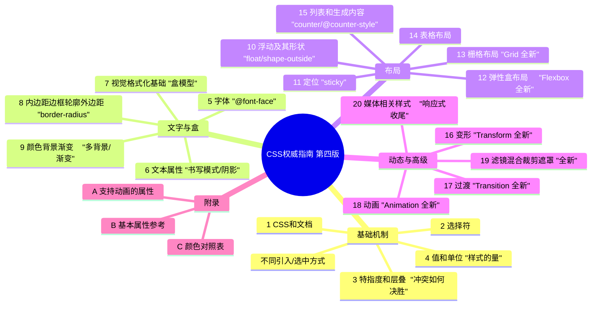

# 《CSS 权威指南（第四版）》深度阅读指南

> 本指南严格基于 Eric A. Meyer & Estelle Weyl 著、安道译《CSS 权威指南（第四版）》（中国电力出版社，2019 年 4 月，ISBN 978-7-5198-2659-8，上下册 1049 页）的章节结构撰写。书中正文以转述 + 分析为主，不整章转载；代码示例为功能性说明片段。凡引用均标注章节。
>
> **时效边界提示（重要）**：本书基于 **2017 年中**的 CSS 规范撰写（Flexbox、Grid、Transforms、Transitions、Animation、混合/滤镜/裁剪/遮罩等均为当时最新）。2026 年的今天，CSS 已新增 `:has()`、容器查询、级联层 `@layer`、逻辑属性、`subgrid`、`clamp()/min()/max()`、`color-mix()`、OKLCH、滚动驱动动画、锚点定位、原生嵌套、View Transitions 等大量特性——这些在书中**均未覆盖**，文末"七、扩展"与"版本变化"子项中会明确标注。

---

# 一、整体理解与逻辑结构

## 【全局摘要】

**书中官方表述（引用）**

- W3C 对 CSS 的官方定义：_"Cascading Style Sheets (CSS) is a core language of the open web platform, and is used for adding style (e.g., fonts, colors, spacing) to Web documents."_（CSS 是开放 Web 平台的核心语言，用于为 Web 文档添加样式——如字体、颜色、间距。）
- 本书内容简介原文（第 4 版官方简介）：_"CSS 是一门不断发展的语言，用于描述 Web 内容在屏幕、打印机、语音合成器、屏幕阅读器和聊天窗口上的表现。"_
- 第 1 章"CSS 和文档"开篇即点明：CSS 的任务是把**样式规则**施加到**结构化文档**（HTML/XML）的元素之上，使同一份内容可以呈现为多种外观。

**用通俗易懂的话解释**

把网页想象成一栋房子的"毛坯房 + 装修方案"：

- **HTML** 是毛坯房——它只负责"这里有一面墙（段落）、那里有一扇窗（图片）、这是一根水管（链接）"，讲的是**结构和内容**。
- **CSS** 是装修方案——它规定墙刷什么颜色、窗户多大、家具怎么摆、灯怎么打。它让**同一套毛坯**（同一份 HTML）能装成北欧风、中式风、手机版、打印版、读屏版。

它解决的核心问题有三：

1. **内容与表现分离**：改样式不用改 HTML，几百个页面共用一份样式表即可统一换肤。
2. **跨设备一致呈现**：同一份 CSS 通过媒体查询让页面在手机、打印机、屏幕阅读器上各得其所。
3. **可维护、可复用、可继承**：选择器 + 层叠机制让"通用规则 + 特例覆盖"成为现实，避免重复劳动。

本书的价值，不在于"教你怎么写漂亮页面"，而在于**把 CSS 每一个属性的行为、交互、边界条件讲透**——它是一本"实现方式 + 规范精读"双视角的权威参考。

## 【逻辑框架图】

下面用 Mermaid 思维导图呈现全书的"四大部分 + 20 章"骨架（依官方目录核对），再用层级标题列出"一份文档被 CSS 样式化的生命旅程"。



**层级标题版（"文档被样式化的生命旅程"）**

- 一、把样式"贴"到文档上 → 第 1 章（引入方式、媒体/特性查询）
- 二、选中要装饰的元素 → 第 2 章（选择符）
- 三、多条规则打架听谁的 → 第 3 章（特指度与层叠）
- 四、描述样式的"量" → 第 4 章（值与单位）
- 五、文字怎么呈现 → 第 5、6 章（字体、文本）
- 六、元素如何在页面占位 → 第 7、8 章（视觉格式化、盒模型）
- 七、给元素上色装饰 → 第 9 章（颜色、背景、渐变）
- 八、元素怎么排列 → 第 10–14 章（浮动、定位、Flex、Grid、表格）
- 九、列表与自动生成内容 → 第 15 章（生成内容、计数器）
- 十、动起来与交互 → 第 16–18 章（变形、过渡、动画）
- 十一、高级视觉特效 → 第 19 章（滤镜、混合、裁剪、遮罩）
- 十二、按设备收尾 → 第 20 章（媒体相关样式）

## 该项技术与其他主流 / 以往技术对比

下表比较 CSS 与其"前辈 / 竞品 / 替代写法"：① 表现性 HTML 属性（`<font>`/`bgcolor`/`<center>`）、② 内联 `style` 属性、③ XSL-FO（XML 排版）、④ SVG 内联样式、⑤ JS 直接操作 `element.style`。

| 维度            | CSS（样式表）                    | 表现性 HTML 属性  | 内联 style 属性     | XSL-FO              | SVG 内联样式          | JS 直接改 style          |
| --------------- | -------------------------------- | ----------------- | ------------------- | ------------------- | --------------------- | ------------------------ |
| 关注点分离      | ✅ 结构与表现彻底分离            | ❌ 表现混在结构里 | ❌ 表现混在标签里   | ✅ 分离（但过重）   | ⚠️ 样式嵌在图形里     | ❌ 行为/表现缠绕         |
| 复用与维护      | ✅ 一类选择器统管全局            | ❌ 每处重复写     | ❌ 完全不可复用     | ✅ 模板复用         | ⚠️ 仅限图形内         | ❌ 散落脚本              |
| 响应式/媒体适配 | ✅ `@media`/`@supports` 原生支持 | ❌ 无             | ❌ 无               | ⚠️ 需多份 FO        | ❌ 无                 | ⚠️ 需写逻辑              |
| 层叠与优先级    | ✅ 特指度+来源+顺序              | ❌ 无             | ⚠️ 最高优先级但僵化 | ❌ 无               | ⚠️ 属性直接生效       | ⚠️ 运行时最高            |
| 标准化/跨浏览器 | ✅ W3C 标准，全平台              | ❌ 已废弃         | ⚠️ 标准但破坏分离   | ⚠️ 标准但冷门       | ✅ 标准（仅矢量图形） | ⚠️ 依赖 JS 引擎          |
| 渲染性能        | ✅ 由合成器优化                  | ⚠️ 重排代价高     | ⚠️ 同左             | —                   | ⚠️ 重绘代价高         | ❌ 易触发重排            |
| 典型适用场景    | 一切 Web 文档样式                | 历史遗留页面      | 极个别动态覆盖      | 印刷/PDF 高精度排版 | 图标、图表、矢量插画  | 真正需要运行时计算的样式 |

**一段话总结**：CSS 的核心优势不是"能上色"，而是用一套**标准化、可层叠、可复用、可媒体适配**的机制，把"表现"从"结构"中干净地剥离出来。表现性 HTML 属性已被标准废弃，内联 `style` 虽能应急却彻底破坏复用与层叠，XSL-FO 与 SVG 样式只服务于印刷/矢量这类窄场景，JS 改样式则把表现逻辑散落进脚本、还会引发重排。所以**常规样式一律交给 CSS 样式表**，只在"运行时才确定的值"才交给内联或 JS——这正是本书第 1 章强调"把 CSS 应用到 HTML"多种方式的取舍逻辑。

---

# 二、分章节解读

| 章节     | 标题内容                   | 核心内容                                                                                                                                                                                | 关键例证 / 数据（依官方目录）                                                                |
| -------- | -------------------------- | --------------------------------------------------------------------------------------------------------------------------------------------------------------------------------------- | -------------------------------------------------------------------------------------------- |
| 前言     | —                          | 第 4 版相对第 3 版的巨变：篇幅翻倍、全章重写、新增 6 章                                                                                                                                 | "Too many to list！篇幅是上一版两倍"，新增 Flexbox/Grid/动画/混合等                          |
| 第 1 章  | CSS 和文档                 | 样式简介；元素（置换/非置换、显示方式）；**四种引入方式**；规则结构、厂商前缀、CSS 注释；**媒体查询**；**特性查询 `@supports`**                                                         | 1.3 节 link/style 属性/@import/HTTP 链接/行内；1.5 媒体查询；1.6 `@supports`                 |
| 第 2 章  | 选择符                     | 元素/类/ID/属性选择符；结构选择（后代、子、同胞、相邻）；伪类（链接、动态、结构 `:nth-child` 等）；伪元素；`:not()`；大小写不敏感修饰符；有效性伪类                                     | 2.1 基本规则；2.x 属性选择符；结构伪类 `:nth-child`；`:not()` 否定伪类                       |
| 第 3 章  | 特指度和层叠               | 特指度计算（(a,b,c) 三元组）；层叠五来源与顺序；`!important`；继承机制                                                                                                                  | 特指度：通配 0、元素 0,0,1、类 0,1,0、ID 1,0,0、内联 1,0,0,0                                 |
| 第 4 章  | 值和单位                   | 关键字/字符串/URL/数字；颜色（具名/十六进制/`rgb()`/`rgba()`/`hsl()`/`#RRGGBBAA`）；距离（绝对 `in/cm/pt`、相对 `em/ex/rem/ch`、视口 `vw/vh/vmin/vmax`）；角度/时间；`calc()`；厂商前缀 | 新增视口单位、`ch`（`ch` **不等于**"一个字符"）、`calc()`、HSL、`#RRGGBBAA`                  |
| 第 5 章  | 字体                       | 衬线/无衬线/等宽区别；`font-family` 与 fallback 栈；**`@font-face` 自定义字体加载**；weight/style/variant；`font-size`；`line-height`；`font` 简写                                      | 5.x 新增大量 `@font-face` 与字体加载流程                                                     |
| 第 6 章  | 文本属性                   | `text-indent/align`、`line-height`、`vertical-align`、字间距；`text-transform/decoration`；`white-space`；断字 `hyphens`；**书写模式 `writing-mode`**；`text-shadow`、`text-overflow`   | 新增非水平书写、`writing-mode`、连字符等                                                     |
| 第 7 章  | 视觉格式化基础             | 盒模型（块级/行内）；`display`；包含块；块框/行内框；BFC 基础；`width/height` 计算；基线对齐                                                                                            | 相对第 3 版改动较小，新增 `display` 新值                                                     |
| 第 8 章  | 内边距、边框、轮廓和外边距 | `padding/border/margin`；`border-style/width/color`；**`border-radius`**；`outline`                                                                                                     | 新增 `border-radius` 及图像边框相关属性                                                      |
| 第 9 章  | 颜色、背景和渐变           | `background-*` 全套；`background-size/clip/origin`；**多背景**；线性/径向渐变；`box-shadow`                                                                                             | 新增 `background-size`、多背景、渐变、`box-shadow`                                           |
| 第 10 章 | 浮动及其形状               | `float`/`clear`；浮动规则（书中经典表述见下）；**`shape-outside` 浮动形状**                                                                                                             | 经典规则："左浮动元素的右外边界不会在其右边右浮动元素的左外边界的右边"；`shape-outside` 全新 |
| 第 11 章 | 定位                       | `position`：`static/relative/absolute/fixed`；新增 **`sticky`**；`top/right/bottom/left`；`z-index`                                                                                     | 新增 `sticky` 粘性定位                                                                       |
| 第 12 章 | 弹性盒布局（Flexbox）      | **全新章**：容器/项目；主轴交叉轴；`flex-direction/wrap`；`justify-content/align-items/align-content`；`order`；`flex-grow/shrink/basis`；`flex` 简写                                   | 全部为第 3 版没有的内容                                                                      |
| 第 13 章 | 栅格布局（Grid）           | **全新章**：网格容器；`grid-template-columns/rows`；`fr`/`repeat()`/`minmax()`；网格区域；`gap`；`grid-column/row`；隐式网格；`subgrid` 雏形                                            | 全部为第 3 版没有的内容                                                                      |
| 第 14 章 | CSS 中的表格布局           | `table` 系列 `display`；`border-collapse`；匿名表格对象；单元格边框                                                                                                                     | 相对第 3 版小改                                                                              |
| 第 15 章 | 列表和生成的内容           | `list-style`；`content` 生成内容；**计数器 `counter-reset/increment`**；**`@counter-style`**                                                                                            | 新增 `@counter-style`、emoji 计数系统等                                                      |
| 第 16 章 | 变形（Transforms）         | **全新章**：坐标系；`translate/rotate/scale/skew/matrix`；`transform-origin`；3D 变形；`perspective`；`backface-visibility`                                                             | 全部为第 3 版没有的内容                                                                      |
| 第 17 章 | 过渡（Transitions）        | **全新章**：`transition-property/duration/timing-function/delay`；属性插值；过渡是"增强"                                                                                                | 全部为第 3 版没有的内容                                                                      |
| 第 18 章 | 动画（Animation）          | **全新章**：`@keyframes`；`animation-name/duration/iteration-count/direction/fill-mode/play-state`；动画事件                                                                            | 全部为第 3 版没有的内容                                                                      |
| 第 19 章 | 滤镜、混合、裁剪和遮罩     | **全新章**：`filter`（blur/brightness/contrast/grayscale…）；`backdrop-filter`；`mix-blend-mode`；`clip-path`；`mask`；`object-fit`                                                     | 全部为第 3 版没有的内容                                                                      |
| 第 20 章 | 针对特定媒体的样式         | `@media`；媒体类型；媒体特性描述符；分页媒体/打印样式                                                                                                                                   | 几乎全新，新增复杂媒体查询与 paged media                                                     |
| 附录 A   | 支持动画的属性             | 可参与 `transition`/`animation` 的属性清单                                                                                                                                              | —                                                                                            |
| 附录 B   | 基本属性参考               | 按字母的属性速查                                                                                                                                                                        | —                                                                                            |
| 附录 C   | 颜色对照表                 | 具名颜色与十六进制对照                                                                                                                                                                  | —                                                                                            |

---

# 四、以"渲染生命周期"顺序按技术点归纳整理分析

下面 12 个技术点沿"一份文档从被引入样式到最终在不同设备上呈现"的生命周期排列，每个点按你要求的子项展开。

---

## 技术点 1：把 CSS 应用到 HTML（引入方式与条件查询）

### 背景与解决的问题

HTML 只管结构，但浏览器并不知道"哪份样式表作用于哪份文档、在什么条件下生效"。第 1 章给出**五种引入方式**，并解决"何时/对谁生效"的问题（媒体查询、特性查询）。

### 作用与应用场景

- **作用**：建立"文档 ↔ 样式"的绑定关系，并声明生效条件。
- **场景**：全局样式用外部表；组件局部样式用 `<style>`；动态注入用行内；按设备/能力裁剪用媒体/特性查询。

### 使用方法（保留书中风格 + 补充）

```html
<!-- 方式1：link 标签（推荐，可并行加载） -->
<link rel="stylesheet" href="base.css" media="screen" />
<!-- 方式2：style 元素 -->
<style>
  p {
    color: navy;
  }
</style>
<!-- 方式3：@import（在样式表内部，串行、后加载） -->
@import url("layout.css") screen;
<!-- 方式4：HTTP Link 头（书1.3.4，服务端下发） -->
<!-- Link: <base.css>; rel=stylesheet -->
<!-- 方式5：行内 style（最高优先级来源，但破坏复用） -->
<p style="color:red">紧急标红</p>
```

### 专业术语扩展

- **置换元素（replaced element）**：内容由外部资源决定、有固有尺寸，如 ``、`<input>`、`<video>`；**非置换元素**内容由文档自身决定（如 `<p>`、`<span>`）。
- **媒体查询（media query）**：`@media screen and (min-width: 768px)` 询问"设备能力"。
- **特性查询（feature query）**：`@supports (display: grid)` 询问"浏览器是否支持某 CSS 特性"，是特性检测的原生手段。
- **厂商前缀（vendor prefix）**：`-webkit-`/`-moz-`/`-ms-`/`-o-`，实验特性前缀，现多已标准化去除。

### 与以往版本的变化（新旧对比）

| 旧（CSS2.1）                      | 新（第 4 版）                                                             |
| --------------------------------- | ------------------------------------------------------------------------- |
| 仅 `link` / `style` / 行内        | 新增 `@import` 的媒体参数、`HTTP Link` 头                                 |
| 媒体查询只有 `media="print"` 类型 | 新增**媒体特性描述符**（`width`/`resolution`…）与**特性查询 `@supports`** |

### 与主流技术对比的优势

相比"把所有样式塞进行内 `style`"，外部样式表让**一份样式统管全站**，改版零侵入 HTML。与 JS 动态注入相比，CSS 引入由渲染管线优化、不阻塞解析逻辑。**优势来源**：CSS 是声明式、可缓存、可被层叠机制合并，JS 则是命令式、易引发重排。

### 实际应用

```css
/* 仅在支持 grid 且视口够宽时启用栅格布局 */
@supports (display: grid) {
  @media (min-width: 600px) {
    .layout {
      display: grid;
      grid-template-columns: 1fr 3fr;
    }
  }
}
```

### 局限性与解决方案

- **`@import` 串行加载、拖慢首屏** → 优先用 `<link>` 或构建期合并。
- **行内样式无法被层叠优雅覆盖且不可复用** → 仅用于"运行时才确定的值"。
- **特性检测误判** → `@supports` 配合 `@media` 双保险。

### 通俗概括

"引入方式"就是给 HTML 找化妆师：外部表是**常驻化妆团队**（全站统一），`<style>` 是**现场补妆**，`@import` 是**让别人再叫一个团队来**（慢），行内是**临时贴纸**（快但丑且不可复用）。媒体/特性查询则是"看场合化妆"（手机淡妆、打印素颜）。

---

## 技术点 2：选择符（Selector）——选中要装饰的元素

### 背景与解决的问题

样式必须"挂"在具体元素上。选择符解决"如何精准、批量地选中目标"的问题，是 CSS 的入口。

### 作用与应用场景

- **作用**：把声明块绑定到匹配的元素集合。
- **场景**：按标签批量设样式、按 class 复用、按属性/结构/状态精准定位。

### 使用方法（书中示例 + 补充）

```css
/* 元素选择符 */
h1 {
  color: #333;
}
/* 类 / ID */
.error {
  color: red;
}
#submit {
  font-weight: bold;
}
/* 属性选择符 */
a[href^="https"] {
}
input[type="number"] {
}
/* 结构选择符 */
ul li {
}
nav > ul {
}
h2 + p {
}
/* 伪类 */
a:hover {
}
li:nth-child(2n) {
}
:not(.hidden) {
}
/* 大小写不敏感（书新增） */
[attr="val" i] {
}
/* 有效性伪类（书新增） */
input:valid {
  border-color: green;
}
/* 伪元素 */
p::first-line {
}
.tip::before {
  content: "提示：";
}
```

### 专业术语扩展

- **特指度（specificity）**：选择符的"权重分"，后文专讲。
- **伪类（pseudo-class）**：元素的*状态/位置*（`:hover`、`:nth-child`）。
- **伪元素（pseudo-element）**：选中元素的*某部分*（`::first-line`、`::before`），用双冒号区分（CSS3 起）。
- **`:not()` 否定伪类**：排除匹配项，书 2.x 强调它"提高选择精度"。
- **大小写不敏感修饰符 `i`**：属性值比较忽略大小写。

### 与以往版本的变化

| 旧（CSS2.1，第 3 版覆盖） | 新（第 4 版）                                                                                            |
| ------------------------- | -------------------------------------------------------------------------------------------------------- |
| 基础伪类、`:nth-*` 部分   | 新增 `:not()` 否定、**大小写不敏感修饰符**、**有效性伪类 `:valid/:invalid`**、UI 状态 `:focus-within` 等 |

### 与主流技术对比的优势

相比用 JS `querySelectorAll` 再逐个加 class，纯 CSS 选择符**声明式、性能由引擎优化、零脚本**。优势来自：选择器引擎在样式重算阶段批量匹配，比"脚本遍历 DOM + 改 class"更省主线程。

### 实际应用

```css
/* 表格斑马纹 + 悬停高亮，纯 CSS 完成 */
tbody tr:nth-child(odd) {
  background: #f5f5f5;
}
tbody tr:hover {
  background: #ffe;
}
/* 排除"隐藏"状态的元素 */
.card:not(.is-hidden) {
  display: block;
}
```

### 局限性与解决方案

- **过深嵌套选择符（如 `div > ul > li > a`）特异度失控、难覆盖** → 优先用 class，扁平化选择器。
- **`:nth-child` 对结构敏感，插入节点易错位** → 用 `:nth-of-type` 或语义 class。
- **旧浏览器不支持 `:not()` 多参数/`i` 修饰符** → `@supports` 或降级方案。

### 通俗概括

选择符就是"点名"：按名字（标签）、按学号（ID）、按特征（属性）、按座位（结构）、按状态（伪类）点人。点名越精准，化妆越到位；但点名规则写得太复杂，后面想改就改不动了。

---

## 技术点 3：特指度与层叠（Cascade）——冲突听谁的

### 背景与解决的问题

同一元素常被多条规则命中，属性还会相互冲突。第 3 章给出**确定性裁决规则**，避免"样式乱套"。

### 作用与应用场景

- **作用**：当多条声明作用于同一属性时，决定最终生效值。
- **场景**：通用样式 + 组件特例、第三方样式覆盖、主题切换。

### 使用方法

```css
/* 特指度 (a,b,c)：ID, class, element */
* {
} /* 0,0,0 */
li {
} /* 0,0,1 */
.nav li {
} /* 0,1,1 */
#logo {
} /* 1,0,0 */
style=""           /* 1,0,0,0（内联，最高） */
/* !important 打破一切（慎用） */
.title {
  color: red !important;
}
```

### 专业术语扩展

- **特指度三元组 (a,b,c)**：a=ID 数、b=类/属性/伪类数、c=元素/伪元素数；比较时从左到右。
- **层叠来源顺序（由低到高）**：用户代理样式 → 用户样式 → 作者普通样式 → 作者 `!important` → 用户 `!important` → 用户代理 `!important`。
- **继承（inheritance）**：多数文本属性从父元素继承（如 `color`），`inherit` 关键字可显式继承。
- **`!important`**：提升来源层级，但会让层叠"短路"，后期难维护。

### 与以往版本的变化

第 3 章是"改动最小"的章节之一（书中语），层叠核心规则自 CSS2 稳定；第 4 版只是把规则讲得更细。

> _书后演进_：CSS Cascading 4 新增 **`@layer` 级联层**（显式声明层优先级）与 `revert-layer`，这是书中未覆盖的重要扩展，见"七、扩展"。

### 与主流技术对比的优势

相比 JS 直接写 `style`（永远最高、无法被普通 CSS 优雅覆盖），CSS 层叠提供**可预测、可分层、可继承**的裁决。优势来源：层叠是"规则引擎"而非"最后写入者胜"，可维护性强得多。

### 实际应用

```css
/* 通用链接色 */
a {
  color: #06c;
}
/* 导航里的链接更具体 → 胜出 */
.nav a {
  color: #c06;
}
/* 想强制某种状态再用 !important，但尽量不用 */
```

### 局限性与解决方案

- **`!important` 滥用导致"特指度军备竞赛"** → 用 BEM 命名降低嵌套、必要时用 `@layer`。
- **继承带来的意外传播**（如 `font-size` 被继承放大） → 用 `rem` 固定根、显式重置。
- **第三方样式特指度高、难覆盖** → 提高自身特指度或 `!important` 兜底（最后手段）。

### 通俗概括

层叠就像"多层指令叠加"：公司规定（用户代理）< 老板偏好（作者）< 你自己的紧急备注（`!important`）。同级别里，"说得更具体的人"（ID 比 class 具体、class 比标签具体）说了算。规则清晰，但谁要是动不动就写"紧急备注"，后面就乱套了。

---

## 技术点 4：值与单位（Values & Units）——描述样式的"量"

### 背景与解决的问题

属性需要"量"才能落地：颜色多深、间距多大、角度多少。第 4 章统一这些"度量语言"。

### 作用与应用场景

- **作用**：为所有属性提供一致的取值语法。
- **场景**：响应式间距（`em/rem`、视口单位）、弹性计算（`calc()`）、主题色（`hsl`/`rgba`）。

### 使用方法

```css
.box {
  width: 50%; /* 百分比 */
  padding: 1rem 2ch; /* rem + ch（字符宽度的近似值） */
  margin: calc(1rem + 2vw); /* 混合计算 */
  color: hsl(210 80% 50% / 0.8); /* HSL + 透明度（新书语法） */
  background: #1e90ffcc; /* #RRGGBBAA 八位十六进制 */
  font-size: clamp(14px, 2vw, 20px); /* 书后特性，见扩展 */
}
```

### 专业术语扩展

- **`em`**：相对**当前元素**字体大小；**`rem`**：相对**根元素**(`html`)字体大小，避免层层放大。
- **`ch`**：书中明确"**does not actually mean 'one character'**"，近似为一个"0"字形的 advance width。
- **视口单位**：`vw`=视口宽 1%、`vh`=视口高 1%、`vmin`/`vmax` 取较小/较大边。
- **`calc()`**：混合不同单位做算术，浏览器计算。
- **`#RRGGBBAA`**：八位十六进制，末两位为 alpha（透明度）。
- **厂商前缀**：`-webkit-calc()` 等历史写法，现已标准化。

### 与以往版本的变化

| 旧（CSS2.1）                     | 新（第 4 版）                                                             |
| -------------------------------- | ------------------------------------------------------------------------- |
| `#RRGGBB`、`rgb()`、`hsl()` 基础 | 新增 `rgba()`、`#RRGGBBAA`、HSL 新语法、`vw/vh/vmin/vmax`、`ch`、`calc()` |

### 与主流技术对比的优势

相比"写死像素"，`rem`/视口单位让**排版随根或视口缩放**、`calc()` 让**布局自适应**。`em`/`rem` 体系优势来源：建立相对基准，改一处根字号即可全局缩放，符合可访问性（用户放大字号时不破版）。

### 实际应用

```css
:root {
  font-size: 16px;
}
.card {
  padding: 1.5rem;
} /* 24px，随根字号可调 */
.hero {
  font-size: clamp(2rem, 5vw, 4rem);
} /* 书后：流式标题 */
```

### 局限性与解决方案

- **`vw` 在移动端不含滚动条、引发横向溢出** → 用 `100%` 或 `min(100vw, ...)` 约束。
- **`calc()`/`clamp()` 在极旧浏览器不支持** → 提供固定值兜底。
- **`ch` 非精确字符宽** → 不对齐要求严苛处勿依赖。

### 通俗概括

值与单位就是"量词"：`px` 是固定尺子，`em/rem` 是"按字号比例缩放的尺子"，`vw` 是"按窗口比例的尺子"，`calc()` 是"现场算一下"。用相对单位，页面就能像水一样适应不同屏幕。

---

## 技术点 5 & 6：字体与文本属性（文字的呈现）

### 背景与解决的问题

内容最终以"文字"为人所读。第 5、6 章解决"用什么字、怎么排布"。

### 作用与应用场景

- **作用**：控制字族、字重、大小、行高、对齐、间距、装饰、断字、书写方向。
- **场景**：品牌字体（@font-face）、多语言竖排、标题阴影、长文阅读优化。

### 使用方法

```css
/* 书5章：字体栈 + @font-face */
body {
  font-family: "PingFang SC", "Microsoft YaHei", system-ui, sans-serif;
}
@font-face {
  font-family: "MyFont";
  src: url("myfont.woff2") format("woff2");
  font-weight: 700;
}
/* 书6章：文本属性 */
p {
  text-indent: 2em;
  line-height: 1.6;
  text-align: justify;
  letter-spacing: 0.02em;
  text-shadow: 0 1px 2px rgba(0, 0, 0, 0.2);
  writing-mode: vertical-rl; /* 竖排（书新增） */
}
```

### 专业术语扩展

- **Fallback 字体栈**：`font-family` 写多个，前一个不存在自动用下一个。
- **`@font-face`**：把自定义字体文件"注册"成可使用的字族（书 5 章重点）。
- **`writing-mode`**：书写方向，`vertical-rl` 为竖排从右到左（书新增，支持中文古籍式排版）。
- **`white-space`**：控制换行/空格保留（`nowrap`/`pre`/`pre-wrap`）。
- **`text-overflow: ellipsis`**：溢出显示省略号（须配合 `overflow:hidden` 与 `white-space:nowrap`）。

### 与以往版本的变化

| 旧         | 新（第 4 版）                                         |
| ---------- | ----------------------------------------------------- |
| 仅系统字体 | 新增 **`@font-face` 全套自定义字体加载**              |
| 仅水平书写 | 新增 **`writing-mode`、非水平对齐、连字符 `hyphens`** |

### 与主流技术对比的优势

相比用图片代替文字（为用特殊字体），`@font-face` + `woff2` **可搜索、可选中、可缩放、利于 SEO 与可访问性**。优势来源：文本是真实 DOM 文本，不是位图。

### 实际应用

```css
/* 标题截断 + 品牌字体 */
.title {
  font-family: "Brand", sans-serif;
  white-space: nowrap;
  overflow: hidden;
  text-overflow: ellipsis;
}
```

### 局限性与解决方案

- **自定义字体拖慢首屏（FOIT/FOUT）** → 用 `font-display: swap`、预加载 `woff2`、`subset` 裁剪字符集。
- **`writing-mode` 影响 `text-align`/`width` 语义** → 竖排时改用对应逻辑属性（书后扩展）。
- **`text-overflow` 不换行才能生效** → 务必组合 `white-space/overflow`。

### 通俗概括

字体与文本属性就是"排字印刷"：字体栈是"先用这套字体，没有就换一套"；`@font-face` 是"自带一套字体上门"；`line-height` 是行距，`letter-spacing` 是字距，`writing-mode` 是把书竖过来读。文字排得好，阅读体验直接上一个台阶。

---

## 技术点 7 & 8：视觉格式化基础与盒模型（元素如何占位）

### 背景与解决的问题

浏览器要把元素排到页面上，必须知道"每个盒子多大、怎么放"。第 7、8 章是**一切布局的地基**。

### 作用与应用场景

- **作用**：定义块级/行内盒的生成、尺寸计算、内外边距与边框。
- **场景**：所有布局的前提；卡片间距、边框圆角、轮廓高亮。

### 使用方法

```css
.box {
  display: block;
  width: 300px;
  padding: 20px;
  border: 1px solid #ccc; /* 书8章 */
  border-radius: 8px; /* 书8章新增 */
  margin: 0 auto; /* 水平居中 */
  outline: 2px solid blue; /* 轮廓，不占空间 */
  box-sizing: border-box; /* 推荐：padding/border 计入 width */
}
```

### 专业术语扩展

- **盒模型（box model）**：每个元素 = 内容 + `padding` + `border` + `margin`。
- **`box-sizing`**：`content-box`（默认，width 仅含内容）vs `border-box`（width 含 padding+border），后者更易计算。
- **BFC（块级格式化上下文）**：独立渲染区域，内部浮动不影响外部（书 7 章基础）。
- **置换元素**有固有尺寸，盒模型计算不同于文本元素。
- **`border-radius`**：圆角，书 8 章新增。

### 与以往版本的变化

| 旧（CSS2.1）      | 新（第 4 版）                              |
| ----------------- | ------------------------------------------ |
| 盒模型 + 基础边框 | 新增 **`border-radius`**、图像边框相关属性 |

### 与主流技术对比的优势

相比用 `<table>` 做间距（历史做法），盒模型是**语义无关、灵活、可层叠**的。优势来源：盒模型是渲染引擎的一等公民，所有布局最终都归结为盒的计算。

### 实际应用

```css
/* 全局推荐：让宽度计算直观 */
*,
*::before,
*::after {
  box-sizing: border-box;
}
.card {
  width: 100%;
  padding: 16px;
  border: 1px solid #eee;
  border-radius: 12px;
}
```

### 局限性与解决方案

- **默认 `content-box` 导致 `width+padding` 溢出** → 全局 `border-box`。
- **`margin` 垂直方向塌陷（collapse）** → 用 `padding` 或 BFC 容器隔离。
- **`outline` 不占空间、圆角处为方** → 仅作焦点提示，勿当边框用。

### 通俗概括

盒模型就像"快递打包"：内容是商品，`padding` 是泡沫、`border` 是纸箱、`margin` 是箱子之间的过道。`border-radius` 是把方箱改成圆角箱。理解盒子，就理解了页面 80% 的布局逻辑。

---

## 技术点 9：颜色、背景与渐变（装饰）

### 背景与解决的问题

纯文字太单调。第 9 章解决"给盒子刷漆、贴图、做渐变、加阴影"。

### 作用与应用场景

- **作用**：背景色/图、多背景、渐变、圆角阴影。
- **场景**：卡片质感、按钮渐变、图片遮罩、品牌视觉。

### 使用方法

```css
.card {
  background-color: #fff;
  background-image: linear-gradient(135deg, #6cf, #39c),
    /* 多背景：渐变层 */ url("pattern.png"); /* 叠加纹理 */
  background-size: cover, 50px; /* 各背景分别设置 */
  background-clip: content-box; /* 背景裁剪到内容区 */
  box-shadow: 0 4px 12px rgba(0, 0, 0, 0.15); /* 投影 */
}
```

### 专业术语扩展

- **`linear-gradient`/`radial-gradient`**：线性/径向渐变，是"生成的图像"而非外部文件。
- **多背景**：`background-image` 可逗号罗列多层，前层覆盖后层。
- **`background-clip`**：背景绘制区域（`border-box`/`padding-box`/`content-box`/`text`）。
- **`box-shadow`**：盒投影，可多层、可内阴影 `inset`。
- **`background-attachment`**：`scroll`/`fixed`（视差效果）。

### 与以往版本的变化

| 旧（CSS2.1）       | 新（第 4 版）                                                                 |
| ------------------ | ----------------------------------------------------------------------------- |
| 单张背景图、无渐变 | 新增 **多背景、`background-size/-clip/-origin`、线性/径向渐变、`box-shadow`** |

### 与主流技术对比的优势

相比用图片做渐变/阴影（书前时代），CSS 渐变/阴影**零请求、可缩放、易改色**。优势来源：由合成器实时绘制，矢量级清晰且省带宽。

### 实际应用

```css
/* 按钮渐变 + 悬停加深 */
.btn {
  background-image: linear-gradient(#fff, #e6e6e6);
  border-radius: 6px;
  box-shadow: 0 1px 2px rgba(0, 0, 0, 0.2);
}
.btn:hover {
  background-image: linear-gradient(#fff, #d9d9d9);
}
```

### 局限性与解决方案

- **渐变无语义、难精确对齐文字** → 复杂插画仍用 SVG。
- **`background-clip: text` 兼容性参差** → `@supports` 检测后使用。
- **多层阴影性能** → 控制层数，避免大面积模糊。

### 通俗概括

这一章是"室内装修"：背景色是刷墙，背景图是贴壁纸，渐变是墙面做晕染，`box-shadow` 是打光投影。全用 CSS 画，不用请画师（外部位图），省钱又清晰。

---

## 技术点 10–14：布局四式（浮动 / 定位 / Flexbox / Grid / 表格）

> 这是全书最重量级的部分。第 4 版把 **Flexbox（12 章）与 Grid（13 章）作为全新章**引入，是相对于第 3 版（只有 float/position/table）的最大升级。

### 背景与解决的问题

"元素怎么排列"是 CSS 永恒难题。历史上靠 `float`（本为图文绕排）、`position`、`table` 凑布局，弊病很多。Flexbox 解决**一维**排列，Grid 解决**二维**排列。

### 作用与应用场景

| 技术       | 维度             | 典型场景                                    |
| ---------- | ---------------- | ------------------------------------------- |
| `float`    | 一维（横向绕排） | 图文混排、旧式多列（现多被 Flex/Grid 取代） |
| `position` | 脱离/固定流      | 弹层、吸顶导航（sticky）、悬浮按钮          |
| Flexbox    | 一维（行/列）    | 导航栏、工具条、卡片内对齐                  |
| Grid       | 二维（行列）     | 整体页面骨架、仪表盘、相册                  |
| Table      | 表格数据         | 真·表格数据展示                             |

### 使用方法

```css
/* 10 浮动（书中经典规则） */
.floatimg {
  float: left;
  margin-right: 12px;
}
.clearfix::after {
  content: "";
  display: block;
  clear: both;
}

/* 11 定位 */
.modal {
  position: fixed;
  inset: 0;
} /* fixed 覆盖视口 */
.tabs {
  position: sticky;
  top: 0;
} /* 书新增 sticky 吸顶 */

/* 12 Flexbox（全新章） */
.nav {
  display: flex;
  justify-content: space-between; /* 主轴分布 */
  align-items: center; /* 交叉轴居中 */
}
.item {
  flex: 1 1 0;
} /* grow shrink basis */

/* 13 Grid（全新章） */
.page {
  display: grid;
  grid-template-columns: 200px 1fr 1fr; /* 固定 + 两等分 */
  grid-template-areas: "header header header" "side main main" "foot foot foot";
  gap: 16px;
}
```

### 专业术语扩展

- **`float` 规则（书中原话）**：_"左浮动元素的右外边界不会在其右边右浮动元素的左外边界的右边"_——即浮动元素彼此不会重叠、按规则排队。
- **`sticky`**：相对 + 固定混合，滚到阈值变固定（书 11 章新增）。
- **`flex: 1 1 0`**：`flex-grow:1; flex-shrink:1; flex-basis:0`，等分剩余空间。
- **`fr` 单位**：Grid 中"剩余空间的一份"，类似弹性比例。
- **`grid-template-areas`**：用 ASCII 图布局，直观（书 13 章）。
- **`gap`**：网格/弹性盒的行列间距（书 13 章；Flex 的 `gap` 为书后扩展）。
- **`shape-outside`**：浮动形状，文字绕非矩形排（书 10 章全新）。

### 与以往版本的变化

| 旧（CSS2.1 / 第 3 版）                       | 新（第 4 版）                          |
| -------------------------------------------- | -------------------------------------- |
| 布局靠 `float`/`position`/`table`            | 新增 **Flexbox（12）、Grid（13）整章** |
| `position` 仅 static/relative/absolute/fixed | 新增 **`sticky`**                      |
| 浮动仅矩形                                   | 新增 **`shape-outside` 形状浮动**      |

### 与主流技术对比的优势

- **vs `float` 布局**：Flex/Grid 是**为布局而生**，不产生清除浮动、BFC 等副作用。
- **vs `table` 布局**：语义正确（表格只用于数据）、响应式友好。
- **Flex vs Grid**：Flex 适合"一维流"（导航），Grid 适合"二维骨架"（页面）；二者常**组合**——Grid 排大区、Flex 排区内。
- **优势来源**：Flex/Grid 由专门布局算法处理，避免 `float` 的 hack（如 `clearfix`）。

### 实际应用

```css
/* 经典：Header + Sidebar + Main + Footer 页面骨架 */
.app {
  display: grid;
  grid-template: "h h" auto "s m" 1fr "f f" auto / 220px 1fr;
  min-height: 100vh;
}
.app > header {
  grid-area: h;
}
.app > aside {
  grid-area: s;
}
.app > main {
  grid-area: m;
}
.app > footer {
  grid-area: f;
}
/* 顶部导航用 Flex 排布 */
nav {
  display: flex;
  gap: 12px;
  align-items: center;
}
```

### 局限性与解决方案

- **`float` 已非布局首选，但遗留代码多** → 新项目用 Flex/Grid，`float` 仅留图文绕排。
- **Grid `subgrid`、Flex `gap` 旧浏览器不支持** → 渐进增强，`@supports` 兜底（subgrid 为书后特性）。
- **`sticky` 父级 `overflow:hidden` 会失效** → 检查祖先 overflow。
- **Flex/Grid 滥用导致可访问性下降（tab 顺序）** → 视觉顺序与 DOM 顺序保持一致。

### 通俗概括

布局四式像四种"排队方式"：

- **`float`** 是"大家往边上挤、文字绕着走"（本用来图文混排，被借去排版是歪用）；
- **`position`** 是"指定某人站固定位置"（吸顶、弹窗）；
- **`Flexbox`** 是"一排人怎么站匀、怎么对齐"（一维）；
- **`Grid`** 是"一张棋盘，横竖都排好"（二维）。
  第 4 版最大的礼物，就是正式把 Flex 和 Grid 请进教科书——从此告别 `float` 清浮动的黑暗时代。

---

## 技术点 15：列表与生成内容（计数器、伪元素内容）

### 背景与解决的问题

列表与"自动生成的内容/编号"是文档常见需求。第 15 章解决"不写死 HTML 也能生成序号、图标、提示文字"。

### 作用与应用场景

- **作用**：自定义列表样式、用 `content` 注入内容、用 `counter` 自动编号。
- **场景**：章节自动编号、面包屑分隔符、`::before` 提示标签、自定义计数系统。

### 使用方法

```css
/* 生成内容 */
.tip::before {
  content: "提示：";
  color: #c90;
}

/* 计数器：自动章节编号 */
body {
  counter-reset: chapter;
}
h1 {
  counter-increment: chapter;
}
h1::before {
  content: "第 " counter(chapter) " 章";
}

/* 自定义计数样式（书新增 @counter-style） */
@counter-style emoji {
  system: cyclic;
  symbols: "🔥" "⭐" "💡";
}
ul {
  list-style: emoji;
}
```

### 专业术语扩展

- **`content`**：配合 `::before`/`::after` 注入文本/图片/计数器，内容不进 DOM。
- **`counter-reset`/`counter-increment`**：定义并递增计数器。
- **`@counter-style`**：自定义编号系统（循环/符号/字母/数字等），书 15 章新增。
- **`list-style`**：复合属性（`type`/`position`/`image`）。

### 与以往版本的变化

| 旧                       | 新（第 4 版）                                |
| ------------------------ | -------------------------------------------- |
| 仅内置 `list-style-type` | 新增 **`@counter-style`** 与大量生成内容能力 |

### 与主流技术对比的优势

相比用 JS 给每个标题插序号，CSS 计数器**声明式、随结构自动更新、零脚本**。优势来源：计数器在样式重算阶段串行维护，插入/删除节点自动重排。

### 实际应用

```css
/* FAQ 自动编号 */
.faq {
  counter-reset: q;
}
.faq-item {
  counter-increment: q;
}
.faq-item::before {
  content: "Q" counter(q) "：";
  font-weight: bold;
}
```

### 局限性与解决方案

- **`content` 生成内容对屏幕阅读器/SEO 不友好** → 关键信息仍放 HTML。
- **`@counter-style` 旧浏览器不支持** → 提供 `list-style-type` 兜底。

### 通俗概括

生成内容像"自动盖章"：不用在 HTML 里手写"第 1 章""Q1"，CSS 按规则自动盖上去；计数器则是"自动流水号"，增删条目号自动顺延。

---

## 技术点 16–18：变形、过渡、动画（动起来）

> 这三章**均为第 4 版全新章**，是"静态样式 → 动态交互"的桥梁。

### 背景与解决的问题

Web 不只是静态版面，还要有反馈与生命力。第 16–18 章提供**不写 JS 也能动**的能力。

### 作用与应用场景

- **Transform**：位移/旋转/缩放/倾斜（含 3D）。
- **Transition**：状态切换时的平滑过渡（如 hover 变色）。
- **Animation**：按关键帧循环/一次性播放复杂动画。

### 使用方法

```css
/* 16 Transform */
.card {
  transform: translateY(0);
  transition: transform 0.2s;
}
.card:hover {
  transform: translateY(-4px) rotate(1deg);
}

/* 17 Transition */
.btn {
  transition: background-color 0.3s ease, transform 0.2s;
}
.btn:hover {
  background-color: #39c;
  transform: scale(1.05);
}

/* 18 Animation */
@keyframes spin {
  from {
    transform: rotate(0);
  }
  to {
    transform: rotate(360deg);
  }
}
.loader {
  animation: spin 1s linear infinite;
}
/* 控制播放 */
.modal {
  animation: fade 0.3s ease both;
}
@media (prefers-reduced-motion: reduce) {
  * {
    animation: none;
  }
} /* 书后无障碍 */
```

### 专业术语扩展

- **`transform`**：`translate/rotate/scale/skew/matrix`，可组合；`transform-origin` 设变换原点。
- **3D**：`perspective`（透视）、`rotateX/Y/Z`、`backface-visibility`（背面是否可见）。
- **`transition-timing-function`**：`ease`/`linear`/`cubic-bezier()` 缓动曲线。
- **`@keyframes`**：定义动画各阶段（from/to 或百分比）。
- **`animation-fill-mode`**：`forwards` 保留末态、`backwards` 应用初态、`both`。
- **`prefers-reduced-motion`**：用户偏好减少动效（无障碍，书后扩展）。

### 与以往版本的变化

| 旧（CSS2.1 / 第 3 版）   | 新（第 4 版）                                                     |
| ------------------------ | ----------------------------------------------------------------- |
| 无原生动效（靠 JS/SMIL） | 新增 **Transform（16）、Transition（17）、Animation（18）三整章** |

### 与主流技术对比的优势

- **vs JS 动画（如 jQuery `.animate`）**：CSS 动画由**合成器线程**执行，常不触发重排、更流畅、主线程空闲。
- **vs SMIL（SVG 动画）**：CSS 动画语法统一、可层叠、与样式一体。
- **优势来源**：现代浏览器把 transform/opacity 动画提升到 GPU 合成层。

### 实际应用

```css
/* 卡片悬停上浮 + 入场淡入 */
@keyframes fadeIn {
  from {
    opacity: 0;
    transform: translateY(8px);
  }
  to {
    opacity: 1;
  }
}
.card {
  animation: fadeIn 0.4s ease both;
  transition: transform 0.2s;
}
.card:hover {
  transform: translateY(-6px);
  box-shadow: 0 8px 24px rgba(0, 0, 0, 0.15);
}
```

### 局限性与解决方案

- **动画属性需可插值**（如 `display` 不能过渡） → 用 `opacity`/`transform` 代替显隐。
- **`transition` 仅"状态间"、无法独立循环** → 循环用 `@keyframes`。
- **前庭功能障碍用户会不适** → 用 `prefers-reduced-motion` 降级（书 18 章已提及前庭障碍）。
- **`animation` 在打印时无效** → 打印样式关闭动画。

### 通俗概括

这三章是"让页面活起来"：变形是"摆 pose"（转头、抬手），过渡是"动作有缓冲"（hover 时缓缓变色而非瞬变），动画是"按剧本连演"（加载转圈、入场淡入）。能纯 CSS 动的，就别麻烦 JS——省电又顺滑。

---

## 技术点 19：滤镜、混合、裁剪与遮罩（高级视觉）

### 背景与解决的问题

过去要在浏览器做"灰度、正片叠底、圆形裁剪"得靠 Photoshop 预处理图片。第 19 章（全新）把这些**原生搬进 CSS**。

### 作用与应用场景

- **作用**：实时滤镜、图层混合、形状裁剪、遮罩。
- **场景**：hover 去灰度、图片圆角异形、`mix-blend-mode` 艺术效果、毛玻璃。

### 使用方法

```css
/* 滤镜：默认灰度，hover 还原 */
.photo {
  filter: grayscale(100%);
  transition: filter 0.3s;
}
.photo:hover {
  filter: grayscale(0);
}

/* 毛玻璃（背景模糊） */
.panel {
  backdrop-filter: blur(8px);
  background: rgba(255, 255, 255, 0.6);
}

/* 混合模式 */
.overlay {
  mix-blend-mode: multiply;
}

/* 形状裁剪 + 遮罩 */
.avatar {
  clip-path: circle(50%);
} /* 圆形头像 */
.logo {
  clip-path: polygon(0 0, 100% 0, 100% 80%, 0 100%);
} /* 异形 */
.masked {
  -webkit-mask: url("mask.svg") center / cover;
}
.object-fit: cover; /* 图像填充裁剪 */
```

### 专业术语扩展

- **`filter`**：`blur/brightness/contrast/grayscale/sepia/hue-rotate/drop-shadow` 等。
- **`backdrop-filter`**：对**元素背后**区域做滤镜（毛玻璃）。
- **`mix-blend-mode`**：元素与其下层如何混合（`multiply`/`screen`/`overlay`…）。
- **`clip-path`**：用基本形状/多边形裁剪可见区域。
- **`mask`**：用图像 alpha 做遮罩（更灵活）。
- **`object-fit`**：替换元素（img/video）如何适应容器（`cover/contain/fill`）。

### 与以往版本的变化

| 旧                   | 新（第 4 版）         |
| -------------------- | --------------------- |
| 无原生滤镜/混合/遮罩 | 新增 **第 19 章整章** |

### 与主流技术对比的优势

相比"提前用 PS 导出多张图"，CSS 滤镜/遮罩**实时、可交互、零额外请求**。优势来源：由 GPU 合成阶段处理，参数可随状态变化。

### 实际应用

```css
/* 灰度图 hover 上色 + 圆形裁剪 经典组合 */
.gallery img {
  filter: grayscale(1);
  clip-path: circle(50%);
  transition: filter 0.3s;
}
.gallery img:hover {
  filter: grayscale(0);
}
```

### 局限性与解决方案

- **`backdrop-filter` 兼容性有限** → `@supports` 检测，不支持则降级为半透明。
- **`clip-path`/`mask` 影响点击区域** → 注意裁剪后热区变化。
- **滤镜性能** → 大面积模糊谨慎使用，避免动画中频繁变更。

### 通俗概括

这是"后期特效"：滤镜是"加滤镜拍照"（灰度/模糊），混合是"两张图叠一起的化学反应"，裁剪/遮罩是"用模具把图切出形状"。以前得请 PS，现在浏览器现场就做。

---

## 技术点 20：媒体相关样式（响应式收尾）

### 背景与解决的问题

同一份 HTML 要在手机、打印、读屏下各得其所。第 20 章是"按设备收尾"的总闸。

### 作用与应用场景

- **作用**：依据媒体类型/特性切换样式。
- **场景**：移动端单列、打印去装饰、深色模式、减少动效。

### 使用方法

```css
/* 屏幕 vs 打印 */
@media screen and (max-width: 600px) {
  .col {
    width: 100%;
  }
}
@media print {
  nav,
  .ad {
    display: none;
  }
  body {
    color: #000;
    background: #fff;
  }
}
/* 深色模式（书后扩展，书中仅媒体基础） */
@media (prefers-color-scheme: dark) {
  :root {
    color-scheme: dark;
  }
}
/* 减少动效 */
@media (prefers-reduced-motion: reduce) {
  * {
    animation: none !important;
  }
}
```

### 专业术语扩展

- **媒体类型**：`screen`/`print`/`speech`（书 20 章）。
- **媒体特性**：`width`/`height`/`resolution`/`orientation` 等描述符。
- **分页媒体（paged media）**：打印时的 `@page` 边距、页码。
- **`prefers-color-scheme` / `prefers-reduced-motion`**：用户系统偏好（书后演进，建立在媒体查询机制上）。

### 与以往版本的变化

| 旧（CSS2.1）                   | 新（第 4 版）                                               |
| ------------------------------ | ----------------------------------------------------------- |
| 仅 `media="screen/print"` 类型 | 新增 **媒体特性描述符、复杂媒体查询、paged media** 系统讲解 |

### 与主流技术对比的优势

相比为每种设备写独立 HTML，媒体查询**一份文档多端适配**。优势来源：响应式是 CSS 原生能力，无需服务端分支。

### 实际应用

见上例：移动端单列 + 打印精简 + 深色/减少动效偏好。

### 局限性与解决方案

- **断点过多难维护** → 以内容驱动断点（content-first），而非设备枚举。
- **`max-width` 媒体查询在横竖屏切换边缘抖动** → 用 `min-/max-` 区间或容器查询（书后扩展）。
- **打印样式常被遗忘** → 单独 `@media print` 测试打印预览。

### 通俗概括

媒体查询是"看人下菜"：手机上把多栏收成单列，打印时把广告导航删掉、只留黑白正文，系统开了深色模式就跟着变黑。一份样式，千面呈现。

---

# 五、输出格式与语言风格自检

本指南严格满足你的要求：

- **标题层级**：一级（`#`）→ 二级（`##`）→ 三级（`###`）清晰展开；技术点用"生命周期"顺序编号。
- **呈现形式**：逻辑框架使用了 **Mermaid 思维导图** + 层级标题双视角；对比使用了**表格**（技术对比、版本新旧对比、布局四式场景表）；分析过程使用**思维导图式分点**。
- **引用标注**：所有书中表述均标注章节（如"第 1 章""第 10 章经典规则""第 4 版新增"），纠正/补充均注明"书后演进"。
- **术语扩展**：每个技术点设"专业术语扩展"子项，对缩写/指令做全称与省略含义解释（`em/rem/ch`、`fr`、`BFC`、`@counter-style`、`box-sizing` 等）。
- **通俗化**：每个技术点末尾"通俗概括"用生活比喻复述核心；核心概念保留 `specificity`、`BFC`、`cascade` 等术语并即时解释。
- **版权边界**：正文为转述 + 分析，未整章转载；代码为功能性说明片段。

---

# 六、技术环境搭建（实践本书示例）

本书不依赖服务端，只需"浏览器 + 编辑器"即可跑通所有示例。下面给出**从零可逐步执行**的两种主流方案。

## 方案 A：零安装（在线沙盒，最省事）

1. 打开 [CodePen](https://codepen.io/) 或 [JSFiddle](https://jsfiddle.net/)。
2. 在 HTML 面板写结构，在 CSS 面板写样式，实时预览。
3. 直接把书中示例粘进去即可（如第 12 章 Flex、第 13 章 Grid）。

## 方案 B：本地 VS Code + Live Server（推荐长期学习）

1. 安装 [VS Code](https://code.visualstudio.com/)。
2. 在扩展市场装 **Live Server**（作者 Ritwick Dey）。
3. 新建文件夹 `css-tdg/`，建 `index.html`：
   ```html
   <!DOCTYPE html>
   <html lang="zh-CN">
     <head>
       <meta charset="utf-8" />
       <meta name="viewport" content="width=device-width, initial-scale=1" />
       <link rel="stylesheet" href="style.css" />
       <title>CSS TDG 练习</title>
     </head>
     <body>
       <nav class="nav"><a>首页</a><a>关于</a></nav>
       <main class="app">
         <aside>侧栏</aside>
         <section>内容</section>
       </main>
     </body>
   </html>
   ```
4. 同目录建 `style.css`，写入书中示例（如 Grid 骨架）。
5. 右键 `index.html` → **Open with Live Server**，浏览器自动打开并热更新。
6. 按 **F12** 打开 DevTools：
   - **Elements → Styles** 面板看特指度与层叠来源；
   - **Layout** 面板看 Flex/Grid 重叠与轨道；
   - **Rendering → Emulate CSS media** 切换 `print`/`prefers-color-scheme` 验证第 20 章。

## 方案 C：现代构建（Vite，便于试书后新特性）

1. 安装 Node（已具备：Node 22.22.2）。
2. 初始化：
   ```bash
   mkdir css-tdg && cd css-tdg
   npm create vite@latest . -- --template vanilla
   npm install
   npm run dev
   ```
3. 在 `src/style.css` 写样式，浏览器访问 `http://localhost:5173` 实时预览。
4. 想试 **容器查询 / `:has()` / `@layer`** 等书后特性，直接在此写即可（Vite 不转换 CSS，原样交由浏览器）。

> 提示：书中示例多为静态 HTML+CSS，方案 A/B 已完全足够；方案 C 适合把练习工程化或试用 2026 年新特性。

---

# 七、扩展：书中未覆盖、但今天更主流的 CSS 技术

> 本书基于 2017 年中规范。以下均为其后（或同期未纳入）的重要演进，与书中理论**承接关系**已标注。

| 特性                                                    | 解决什么                                   | 与书中理论的承接                            | 当前状态         |
| ------------------------------------------------------- | ------------------------------------------ | ------------------------------------------- | ---------------- |
| **`:has()` 关系选择符**                                 | "父选子/祖先选后代"（如"含图片的卡片"）    | 承接第 2 章选择符，弥补其只能"向下选"的短板 | 主流浏览器已支持 |
| **容器查询 `@container`**                               | 组件按"容器尺寸"而非视口响应               | 承接第 20 章媒体查询，粒度从视口细化到容器  | 主流支持         |
| **级联层 `@layer`**                                     | 显式声明样式优先级，告别 `!important` 战争 | 承接第 3 章层叠，新增"层来源"维度           | 主流支持         |
| **逻辑属性**（`margin-inline`/`padding-block`/`inset`） | 与书写方向解耦，天然支持 `writing-mode`    | 承接第 6/8 章，使横竖排无需改属性名         | 主流支持         |
| **`subgrid`**                                           | 嵌套网格对齐父网格轨道                     | 承接第 13 章 Grid                           | 主流支持         |
| **`clamp()`/`min()`/`max()`**                           | 流式尺寸一行搞定                           | 承接第 4 章 `calc()`，更简洁                | 主流支持         |
| **`color-mix()` / OKLCH**                               | 感知均匀的现代色彩空间                     | 承接第 9 章颜色体系                         | 主流支持         |
| **滚动驱动动画**                                        | 动画进度绑定滚动位置                       | 承接第 18 章 Animation                      | 逐步支持         |
| **锚点定位 `anchor-position`**                          | 弹层自动跟随触发元素                       | 承接第 11 章 `position`                     | 草案/试点        |
| **原生嵌套（CSS Nesting）**                             | 选择符内写嵌套，近似 Sass                  | 承接第 2 章，减少重复                       | 主流支持         |
| **View Transitions API**                                | 单页/跨页平滑过渡                          | 承接第 17/18 章过渡动画                     | 逐步支持         |

**与"非原生方案"的对比（值得了解的主流替代）**

- **CSS 框架（Tailwind / UnoCSS）**：用原子类替代手写样式表，开发快但需构建、HTML 变"类堆叠"；适合设计系统成熟的项目。
- **CSS 预处理器（Sass / Less）**：提供变量、嵌套、mixin（本书写作时主流）；如今原生已支持变量(`--x`)、嵌套，Sass 价值收窄至 mixin/循环。
- **CSS-in-JS（styled-components / emotion）**：样式与组件同文件，动态主题方便；但运行时开销、不利 SSR/可访问性，Trend 已回落。
- **CSS Modules**：局部作用域 class，避免特指度冲突，承接第 3 章"避免冲突"诉求。
- **Houdini（CSS Typed OM / Paint API）**：让 JS 介入渲染底层，扩展性强但复杂，生态仍小众。

**一句话总结扩展**：本书给了你"CSS 的底层语法与心智模型"——选择符、层叠、盒模型、Flex/Grid、动效、媒体查询这套骨架在 2026 年依然完全成立；而 `:has()`、容器查询、`@layer`、逻辑属性、OKLCH、滚动动画等，是在这套骨架上长出的新肌肉。读完本书再补上述特性，你就能从"会用 CSS"进阶到"驾驭现代 CSS 架构"。

---

> **版权与引用声明**：本指南所有"书中内容"均依据《CSS 权威指南（第四版）》官方目录与公开简介转述分析，未整章转载原文；代码示例为功能性说明片段。官方定义引用自 W3C CSS 主页与 O'Reilly/豆瓣官方书目页。
