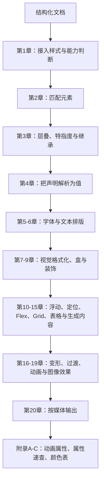

# 《CSS 权威指南（第四版）》深度阅读教程

> **版本依据**：Eric A. Meyer、Estelle Weyl 著，安道译，中国电力出版社 2019 年 4 月第一版，ISBN 978-7-5198-2659-8，上下册正文 1049 页。英文原版由 O'Reilly Media 于 2018 年出版。本文逐项核对了本地 PDF 的版权页、前言、目录、正文和附录。
>
> **作者纠正**：Matt Frisbie 不是本书作者。PDF 版权页、封面和 CIP 数据均署名 Eric A. Meyer 与 Estelle Weyl。
>
> **时间边界**：原书于 2017 年中完成主体写作，部分内容写到 2017 年末。文中“原书”表示对指定版本的转述；“现代补充”表示截至 **2026-08-10** 的后续演进。二者不会混写成同一时代的结论。

## 一、从全书看 CSS：把结构变成可控的呈现

### CSS 的背景、定义和真正作用

第 1 章用一句很直接的话定义本书的对象：

> “层叠样式表（Cascading Style Sheet，CSS）是一个强大的工具，能影响一个或一组文档的表现。”

原书随后解释了 CSS 出现的历史动机：早期浏览器允许**用户**调整标题的字体、字号和颜色，文档作者却只能标记“这是标题、段落或预格式文本”。CSS 的目标是提供一种简单、声明式而且有优先级的样式语言，让作者与用户都能影响最终呈现。这里的“层叠”，就是多个来源的样式可以组合，并按一套确定规则决胜。

通俗地说，HTML 回答“内容是什么”，CSS 回答“它应该怎样占位、怎样被看见、在何种设备上怎样变化”。CSS 解决的不是单纯的上色问题，而是四类系统问题：

- **表现与内容分离**：同一份 HTML 可以服务屏幕、打印、语音等不同输出。
- **批量复用**：一个选择符能影响一组元素，一份外部样式表能服务多个页面。
- **冲突可计算**：来源、重要性、特指度和源码顺序共同决定唯一结果。
- **布局可适应**：盒模型、Flexbox、Grid 和媒体查询把固定画布变成随内容与环境变化的界面。

原书强调 CSS3 之后规范改为模块化演进，因此不存在一份囊括一切的“CSS3 总规范”，也不宜把今天的 CSS 简称为“CSS4”。选择器、颜色、网格等模块拥有各自的级别和成熟度；学习时应掌握稳定的模型，再按模块追踪新特性。

### 全书逻辑框架



这条主线也可以理解为浏览器处理样式时的一连串问题：

1. 样式从哪里来、在什么条件下生效？
2. 哪些规则匹配当前元素？
3. 同一属性有多个候选声明时谁获胜？
4. 指定值如何换算成可计算、可使用、最终实际值？
5. 字形、行盒、块盒和布局轨道如何生成？
6. 背景、边框、变形、滤镜和动画如何绘制与合成？
7. 屏幕、打印或用户偏好改变时，哪些规则需要重新计算？

### 与表现性 HTML、脚本布局和工具链的区别

| 维度 | 原生 CSS | 表现性 HTML / 行内样式 | JavaScript 直接改样式 | Sass 等预处理器 | Tailwind 等工具类框架 |
| --- | --- | --- | --- | --- | --- |
| 核心职责 | 声明文档如何呈现 | 把表现混入标记 | 在运行时命令式修改状态 | 构建时生成 CSS | 用预定义类组合 CSS |
| 复用方式 | 选择符、继承、自定义属性 | 基本靠复制 | 函数和组件逻辑 | 变量、mixin、循环 | 工具类和设计令牌 |
| 冲突模型 | 浏览器原生层叠 | 行内声明权重高且难治理 | 取决于写入时机和生成规则 | 输出后仍服从层叠 | 输出后仍服从层叠 |
| 响应式 | `@media`、`@container` | 无完整机制 | 监听环境后手工切换 | 最终仍生成媒体查询 | 通过变体生成媒体查询 |
| 运行成本 | 浏览器原生样式系统 | 浏览器原生，但维护成本高 | 可能增加脚本、布局抖动 | 构建期成本 | 构建期与类名管理成本 |
| 适合场景 | 所有 Web 呈现的底层 | 少量真正动态的单值 | 值必须由运行时状态计算 | 大型样式工程的抽象 | 设计系统明确、强调交付速度 |

结论是：Sass、CSS Modules、CSS-in-JS 或 Tailwind 都没有替代 CSS 的语义与渲染模型，它们只是在“怎样组织或生成 CSS”上提供工程选择。无论使用哪种上层工具，选择器、层叠、盒模型、格式化上下文和布局算法仍然是排错的最终依据。

## 二、前言、20 章与附录的知识地图

| 单元 | 原书标题 | 核心内容 | 要解决的问题与方法 |
| --- | --- | --- | --- |
| 前言 | 前言 | 读者边界、第四版范围、属性值句法、示例代码 | 教读者读懂 `<length>`、`\|`、`&&`、`?`、`#` 等规范记法，并说明示例来源 |
| 第 1 章 | CSS 和文档 | 元素类型、样式接入、规则结构、媒体与特性查询 | 把样式可靠地绑定到文档，并按设备或实现能力启用规则 |
| 第 2 章 | 选择符 | 元素、类、ID、属性、结构、伪类、伪元素 | 精确描述“哪些元素进入规则的作用域” |
| 第 3 章 | 特指度和层叠 | 特指度、继承、来源、重要性、顺序 | 以确定算法解决多个声明冲突 |
| 第 4 章 | 值和单位 | 文本值、数字、长度、颜色、角度、时间、位置、自定义值 | 把抽象声明表达成可计算的量 |
| 第 5 章 | 字体 | 字体族、`@font-face`、字重、字号、字形、变体与匹配 | 在可用字体资源中选择具体字形并控制回退 |
| 第 6 章 | 文本属性 | 缩进、对齐、行高、间距、装饰、空白、断词、书写模式 | 控制字形排成行、行排成段的方式 |
| 第 7 章 | 视觉格式化基础 | 元素框、容纳块、块级与行内格式化、`display` | 解释元素为何得到某种尺寸、位置和基线 |
| 第 8 章 | 内边距、边框、轮廓和外边距 | 盒的四层外围、圆角、图像边框、外边距折叠 | 控制内容周围的空间与边界，并理解盒尺寸 |
| 第 9 章 | 颜色、背景和渐变 | 前景色、多背景、定位、裁剪、渐变、阴影 | 在不改变文档结构的前提下完成视觉装饰 |
| 第 10 章 | 浮动及其形状 | 浮动规则、清除、`shape-outside` | 让行内内容环绕对象，并控制环绕轮廓 |
| 第 11 章 | 定位 | 静态、相对、绝对、固定、粘滞、偏移与层叠 | 让元素相对正确的容纳块脱离或偏移常规流 |
| 第 12 章 | 弹性盒布局 | 轴、换行、对齐、弹性增长与收缩、排序 | 在一个维度上分配剩余空间并对齐项目 |
| 第 13 章 | 栅格布局 | 轨道、线、区域、隐式网格、自动放置、对齐 | 在二维行列系统中建立页面或组件布局 |
| 第 14 章 | CSS 中的表格布局 | 表格对象、边框模型、尺寸与对齐 | 解释真正表格数据的专用格式化算法 |
| 第 15 章 | 列表和生成的内容 | 标记、`content`、计数器、`@counter-style` | 自动生成标记、编号和辅助呈现内容 |
| 第 16 章 | 变形 | 2D/3D 坐标、变形函数、原点、透视 | 不重新安排常规流就移动、旋转、缩放或倾斜视觉结果 |
| 第 17 章 | 过渡 | 属性、时长、缓动、延迟、反向过渡 | 在两个状态值之间自动插值 |
| 第 18 章 | 动画 | 关键帧、播放参数、事件、优先顺序、无障碍 | 创建多阶段、可重复和可控制的时间序列 |
| 第 19 章 | 滤镜、混合、裁剪和遮罩 | 滤镜、混合模式、裁剪、蒙版、对象适配 | 改变像素、限定可见区域并合成图层 |
| 第 20 章 | 针对特定媒体的样式 | 复杂媒体查询、分页媒体、打印属性 | 让同一文档适配屏幕、打印和不同输出能力 |
| 附录 A | 支持动画的属性 | 可插值属性及其值类型 | 判断某属性是否能参与过渡或动画 |
| 附录 B | 基本属性参考 | 常用属性的字母序速查 | 从教程切换到日常查表 |
| 附录 C | 颜色对照表 | 具名色、RGB、HSL、十六进制 | 校对标准具名色及等价值 |

## 三、沿样式渲染链逐章精读

### 阶段 0：先学会读 CSS 规范

#### 前言：属性值句法不是装饰，而是精确语法

原书假定读者了解 HTML，但不要求其他前置知识。第四版相对上一版扩充到约两倍篇幅，新增或重写 Flexbox、Grid、变形、过渡、动画、滤镜与媒体样式。前言最值得先掌握的是属性值定义的读法：

- `<color>`：尖括号表示一种值类型，不是要求输入尖括号。
- `A | B`：二选一；`A || B`：至少选一个，顺序不限；`A && B`：两者都要，顺序不限。
- `?`、`*`、`+`：分别表示零或一次、零或多次、一次或多次。
- `#`：一次或多次，重复项用逗号分隔。
- `{m,n}`：至少出现 `m` 次，最多出现 `n` 次。
- `[...]!`：组内至少有一项必须出现。

例如 `[ <length> | thick | thin ]{1,4}` 表示取 1～4 个值，每个值可以是长度、`thick` 或 `thin`。它解释了为何四边属性能写成一、二、三或四个值。

原书示例的官方仓库是 [meyerweb/csstdg4figs](https://github.com/meyerweb/csstdg4figs)。本文只保留短小、可独立理解的改写示例，不复制大段正文。

### 阶段 1：规则进入文档、匹配元素并完成决胜

#### 第 1 章：CSS 和文档——先确定样式从哪里来

本章依次讨论 Web 样式的来历、元素分类、五种接入方式、样式表内部结构、媒体查询和特性查询。它解决的是渲染链的入口问题。

**元素和显示角色。** 原书先区分置换元素与非置换元素：`img`、表单控件等置换元素的内容和固有尺寸来自文档外部；段落、标题等非置换元素由文档内容生成。块级与行内则描述元素参与格式化的方式，不等于 HTML 元素的永久身份；CSS 可以通过 `display` 改变它。

**样式的五个入口。** 外部 `<link>` 便于缓存和复用；`<style>` 适合页面内规则；`@import` 在 CSS 内继续加载样式；HTTP `Link` 响应头能关联样式表，但 Web 实践中少见；`style` 属性只作用于当前元素。常规项目优先外链，不要把 `@import` 误解成模块系统，也不要让大量行内样式破坏复用。

```html
<link rel="stylesheet" href="base.css" media="screen" />
<style>
  .notice { color: firebrick; }
</style>
<p class="notice" style="font-weight: 700">需要注意</p>
```

```css
/* 原书机制的最小改写示例 */
@import url("print.css") print;

@supports (display: grid) {
  .page { display: grid; }
}

@media (min-width: 48rem) {
  .page { grid-template-columns: 16rem 1fr; }
}
```

**规则内部。** 规则集由选择符与声明块组成，声明由属性和值组成。注释采用 `/* ... */`，空白通常被折叠。书中还讨论 `-webkit-`、`-moz-` 等厂商前缀：它们曾用于实验实现，不能只写带前缀版本；今天应先写标准属性，由构建工具根据目标浏览器补前缀。

- **CSS**：Cascading Style Sheets，层叠样式表。
- **UA**：User Agent，用户代理，通常指浏览器或其他文档呈现器。
- **Replaced element**：置换元素，内容由外部对象替换元素自身内容框。
- **Media query**：媒体查询，检测输出环境；**feature query**：特性查询，检测某段 CSS 句法是否受支持。

**边界与现代补充。** `@supports` 只证明浏览器能解析属性和值，不保证实现没有缺陷；媒体查询描述视口或设备，组件级适配更适合后来的容器查询。加载关键 CSS 时，`@import` 可能延后发现依赖；首屏资源通常用 `<link>`。

#### 第 2 章：选择符——把声明绑定到正确元素

本章从元素选择符和声明开始，经过群组、类与 ID、属性选择、文档结构、伪类，最后到伪元素。选择符不是“查找 DOM 后执行一次”，而是一个持续成立的匹配条件；DOM 或状态改变时，浏览器会重新评估受影响的元素。

```css
article h2 { color: #334155; }          /* 后代 */
nav > a { padding-inline: .75rem; }     /* 子元素 */
h2 + p { margin-block-start: 0; }       /* 紧邻同胞 */
h2 ~ p { max-width: 70ch; }             /* 后续同胞 */
a[href^="https://"] { font-weight: 600; }
input[type="email" i]:invalid { border-color: crimson; }
li:nth-child(2n) { background: #f4f4f5; }
.tip::before { content: "提示："; }
```

**2.1～2.4：基础、群组、类/ID 与属性。** `h1, h2` 是选择符列表，任一无效选择符在旧式解析规则下可能使整组失效。类可以复用并组合，ID 在文档中应唯一且特指度高，因此组件样式通常用类。属性选择符既能判断存在，也能用 `=`、`~=`、`|=`、`^=`、`$=`、`*=` 比较完整值、词、语言前缀、开头、结尾或子串；`i` 标志表示 ASCII 范围内不区分大小写。

**2.5：结构关系。** 空格、`>`、`+`、`~` 分别表达后代、子、紧邻同胞和后续同胞。选择符由右向左匹配是常见实现思路，但不应据此做夸张的“选择器性能优化”；先保证作用域和可维护性。

**2.6：伪类。** 结构伪类用树中位置匹配，动态伪类描述链接、悬停和焦点，UI 状态伪类描述启用、选中、有效性等状态；`:target` 对应 URL 片段，`:lang()` 匹配语言，`:not()` 排除条件。交互样式不能只写 `:hover`，键盘用户还需要 `:focus-visible` 等焦点反馈。

**2.7：伪元素。** `::first-letter`、`::first-line` 只允许有限属性；`::before`、`::after` 生成匿名样式框。`content` 生成的关键文本可能无法稳定进入可访问性树，因此业务含义仍应写在 HTML 中。

- **Pseudo-class**：伪类，匹配元素状态或关系，例如 `:hover`。
- **Pseudo-element**：伪元素，选择元素的抽象部分或生成框，例如 `::before`。
- **Combinator**：组合符，表达选择符之间的结构关系。

**现代补充。** `:is()` 便于合并分支，特指度取参数中最高者；`:where()` 的特指度恒为零，适合可覆盖的默认规则；`:has()` 能依据相对选择符匹配祖先或前置元素。它们扩展了第 2 章的模型，却没有改变“匹配后进入层叠”的下一步。

#### 第 3 章：特指度和层叠——同一属性最终听谁的

选择器匹配只产生候选声明。本章通过特指度、继承与层叠解释怎样从候选中选出结果。

**特指度。** 可以把权重写成四列：行内样式；ID；类、属性和伪类；类型和伪元素。各列独立比较，不要把它错误换算成十进制“100 分”。通用选择符与组合符本身不增加权重。

| 选择符 | 示意特指度 |
| --- | --- |
| `*` | `0-0-0` |
| `p::first-line` | `0-0-2` |
| `.note[data-kind]` | `0-2-0` |
| `#main .note` | `1-1-0` |
| `style="..."` | 独立的行内列 |

**继承。** 继承是“父元素的计算值传给子元素”，不是“子元素匹配了父规则”。文本相关属性多会继承，边框、外边距等通常不会。`inherit` 强制继承；`initial` 回到规范初始值；现代的 `unset` 对可继承属性表现为 `inherit`，否则表现为 `initial`；`revert` 则回滚当前来源或层。

**层叠决策。** 先按来源和重要性筛选，再比较层叠上下文中的顺序与特指度，最后才看源码先后。原书的核心次序仍有价值，但现代 CSS 已加入动画、过渡和级联层等维度。特别要记住：用户的重要声明能够压过作者的重要声明，这是可访问性设计的一部分。

```css
/* 现代补充：显式管理层，比抬高选择符更可控 */
@layer reset, base, components, utilities;

@layer components {
  .button { color: white; background: royalblue; }
}

@layer utilities {
  .text-red { color: crimson; }
}
```

- **Specificity**：特指度，只在同一层叠优先级内比较选择器权重。
- **Cascade**：层叠，合并不同来源和规则的完整决胜算法。
- **Inheritance**：继承，把父元素某属性的计算值传给子元素。

**常见失败。** 不断增加 ID、嵌套和 `!important` 会制造无法覆盖的规则。解决顺序应是：确认声明是否匹配和有效，检查来源/层/重要性，再看特指度和顺序；用 DevTools 的 Computed/Styles 面板而不是猜。

### 阶段 2：把指定值转换成可布局、可绘制的数据

#### 第 4 章：值和单位——CSS 的类型系统

本章按关键字与字符串、数字与百分数、距离、计算值、属性值、颜色、角度、时间/频率、位置和自定义值展开。不同属性接受不同值类型；解析成功不代表最终一定按字面值使用。

```css
:root {
  --space: 1rem;                    /* 4.10 自定义值 */
}

.card {
  inline-size: calc(100% - 2 * var(--space));
  color: hsl(215 28% 17%);
  transform: rotate(.125turn);
  transition-duration: 180ms;
  background-position: right 1rem bottom 2rem;
}
```

**文本值与 URL。** 关键字不能随意加引号；字符串要处理引号和转义；`url()` 的相对地址通常相对于样式表，而不是 HTML。标识符受 CSS 转义规则约束。

**数值、百分数与弹性值。** `<integer>` 与 `<number>` 不同。百分数的基准由属性定义，不能一概说“相对父元素”；例如宽度百分数常取容纳块宽度，而 `line-height: 120%` 根据元素自身字号计算。Grid 的 `fr` 是弹性份额，不是普通长度。

**长度。** `px` 是 CSS 像素，不保证等于一个硬件像素；`em` 相对当前元素字号，`rem` 相对根元素字号；`ch` 近似当前字体中数字 0 的进距，不等于任意汉字宽度；`vw`、`vh` 等相对视口。印刷用 `pt`、`in` 等绝对单位在屏幕上通过 CSS 参考像素换算。

**值的阶段。** 声明中的值先是 specified value（指定值），经层叠和继承得到 computed value（计算值），结合布局环境成为 used value（使用值），设备取整后成为 actual value（实际值）。例如 `width: 50%` 在不知道容纳块尺寸时不能立刻化成像素。

**颜色与透明度。** 原书覆盖具名色、十六进制、RGB/RGBa、HSL/HSLa 和 `transparent`、`currentColor`。`currentColor` 取当前元素 `color` 的计算值，适合让边框、SVG 图形随文本色变化。

- **CSS pixel**：CSS 参考像素，是角度与设备条件下的抽象单位。
- **DPI / DPPX**：dots per inch / dots per CSS pixel，分辨率单位。
- **Custom property**：自定义属性，如 `--space`；其值按 token 保存，通过 `var()` 代入，并参与继承。

**纠正与现代补充。** 原书把自定义属性视为成书末期的新特性；今天应同时掌握 `var(--x, fallback)` 的回退语法和注册自定义属性的 `@property`。现代值函数还有 `min()`、`max()`、`clamp()`，颜色空间扩展到 Lab、LCH、OKLab、OKLCH 以及 `color-mix()`。使用视口高度时，可根据移动浏览器 UI 选择 `svh`、`lvh`、`dvh`，避免传统 `100vh` 的遮挡或跳动。

### 阶段 3：先塑造文字，再生成元素框

#### 第 5 章：字体——从候选字体到具体字形

本章不是字体清单，而是一套匹配算法：浏览器根据字体族、字重、字形、拉伸、变体和可用字符，从本地或下载资源中选择字形。

**5.1 字体族。** `font-family` 是有序回退列表。含空格的族名建议加引号，最后提供 `serif`、`sans-serif`、`monospace` 等通用族。回退可以发生在单个字符层面，因此一行文本可能由多种字体拼成。

```css
body {
  font-family: "Noto Sans CJK SC", "Microsoft YaHei", sans-serif;
}

code {
  font-family: "JetBrains Mono", Consolas, monospace;
}
```

**5.2 `@font-face`。** 它定义一个可参与匹配的字体面，而不是立即把所有文本切换到该字体。`font-family` 与 `src` 是核心描述符，`local()` 可先查本地字体，`format()` 提示资源格式。字重、字形等描述符必须与文件实际包含的字形一致，否则浏览器可能合成粗体或斜体。

```css
@font-face {
  font-family: "Article Sans";
  src: url("/fonts/article-sans.woff2") format("woff2");
  font-style: normal;
  font-weight: 100 900;
  font-display: swap; /* 现代补充 */
}
```

**5.3～5.12 的匹配维度。** `font-weight` 控制字重，数值并不保证每档都有独立字体；`font-size` 决定 em 方框尺度而非可见字形的精确高度；`font-style` 选择 italic/oblique；`font-stretch` 选择宽窄变体；`font-kerning` 与 `font-feature-settings` 影响字距与 OpenType 特性；`font-variant-*` 控制小型大写、数字样式和连字；`font` 简写会重置未写出的字体子属性，使用前要清楚副作用。

- **Glyph**：字形，字符的具体可视形状。
- **Typeface / font family**：一套具有共同设计的字体族；**font face** 是其中特定字重、字形、宽度的成员。
- **FOUT / FOIT**：Flash of Unstyled Text / Flash of Invisible Text，Web 字体加载时的样式闪烁或不可见文本。

**局限与实践。** 下载字体增加网络和渲染成本；只保留使用的字符、优先 WOFF2、合理预加载，并设置与回退字体接近的度量。原书未系统覆盖可变字体；现代可变字体能在单个文件内提供连续的字重、宽度等轴，但仍要为不支持或缺字情况保留回退。

#### 第 6 章：文本属性——字形怎样排成行和段落

字体决定“用什么字形”，文本属性决定“这些字形如何在行盒中排列”。本章按缩进和行内对齐、行高与纵向对齐、字词间距、大小写转换、装饰、渲染、阴影、空白、换行/断字和书写模式展开。

```css
.article {
  max-inline-size: 68ch;
  line-height: 1.75;
  text-align: start;
  overflow-wrap: anywhere;
  hyphens: auto;
}

.article p + p { text-indent: 2em; }
.price { font-variant-numeric: tabular-nums; }
.vertical { writing-mode: vertical-rl; }
```

**6.1～6.3：对齐、行高与间距。** `text-align` 排列行盒中的行内内容；`start/end` 比 `left/right` 更能适应书写方向。无单位 `line-height: 1.5` 继承的是比例，通常比 `150%` 更安全。`vertical-align` 主要作用于行内级元素和表格单元格，不是通用的“垂直居中”属性。`word-spacing` 和 `letter-spacing` 调整词间与字符间额外间隔，但两端对齐还可能由 UA 进一步分配空间。

**6.4～6.7：转换、装饰和阴影。** `text-transform` 改变呈现，不应代替正确文本；`text-decoration` 的线型、颜色和位置可独立控制；`text-shadow` 可叠加多层，但过重阴影降低可读性。`text-rendering` 多为给 UA 的提示，不要依赖它修复字体质量。

**6.8～6.10：空白、断行和书写模式。** `white-space` 同时影响空白折叠和换行；`overflow-wrap` 允许长 token 断开，`word-break` 调整一般断词规则，`hyphens` 控制连字符。`writing-mode` 改变块流方向，`direction` 与 Unicode 双向算法相关；不要仅为视觉对齐滥用 `direction`。

- **Inline axis / block axis**：行内轴与块轴，随书写模式变化，而非永远等于水平/垂直。
- **Leading**：行距概念；CSS 中行高与字形框的差值通常在上下各分一半。
- **Bidi**：Bidirectional Text，双向文本排版算法。

**现代补充。** 逻辑属性与 `inline-size`、`margin-block` 等把第 6 章书写模式真正延伸到布局。文本截断的 `text-overflow: ellipsis` 只产生视觉省略，仍要保证完整内容可访问；多行截断不应成为重要内容的唯一入口。

#### 第 7 章：视觉格式化基础——尺寸与位置为何会这样算

这是全书最重要的原理章之一。它从元素框与容纳块出发，分别推导块级和行内格式化，最后讨论 `display` 的其他值和计算值。

**7.1 元素框和容纳块。** 每个元素可能生成一个或多个框。盒的尺寸不只由 `width` 决定，还涉及内边距、边框、外边距、`box-sizing`、最小/最大约束和容纳块。容纳块是百分数与定位计算的参照，不一定就是 DOM 父元素的内容框。

**7.2 块级格式化。** 常规流中的块框通常在块轴依次排列。水平方向的 `auto` 会参与“七项之和等于容纳块宽度”的约束；负外边距允许超出正常边界。纵向 `height: auto` 通常由内容决定，百分比高度只有在参照高度可确定时才容易按预期解析。置换元素还受固有宽高与比例影响。

```css
*, *::before, *::after { box-sizing: border-box; }

.panel {
  width: min(100%, 70rem);
  margin-inline: auto;
}
```

**7.3 行内格式化。** 文本和行内框被收集进行盒，行盒高度由其中的行内框、行高与基线关系共同决定。行内非置换元素的垂直内边距和边框可以绘制到行盒外，却通常不增加行盒高度；这正是很多“文字把边框挤乱”的根源。`inline-block` 对外参与行内布局，对内建立块格式化。

- **Containing block**：容纳块，尺寸和偏移的参照矩形。
- **Normal flow**：常规流，未浮动、未绝对定位内容的基本排布。
- **Line box / baseline**：行盒与基线，行内内容排版的关键抽象。
- **BFC**：Block Formatting Context，块级格式化上下文；它隔离浮动、外边距等部分布局行为。

**纠正与现代补充。** 原书讨论的 `display` 多为单关键字。现代规范把外部显示类型和内部布局类型分开理解，例如 `inline flex`。`display: contents` 让元素自身不生成框，但历史上存在可访问性实现问题，使用前应实测目标浏览器和辅助技术。需要显式建立独立格式化上下文时，`display: flow-root` 比伪元素清除浮动更直白。

#### 第 8 章：内边距、边框、轮廓和外边距——盒的外围四层

本章从基本元素框依次讲内边距、边框、轮廓和外边距。核心不是记简写，而是区分它们是否占布局空间、是否承载背景、是否可能折叠。

```css
.card {
  padding: 1rem 1.25rem;
  border: 1px solid color-mix(in srgb, currentColor 20%, transparent);
  border-radius: .75rem;
  margin-block: 1.5rem;
}

.card:focus-visible {
  outline: 3px solid Highlight;
  outline-offset: 3px;
}
```

**8.2 内边距。** 一至四值按上、右、下、左展开；两个值为块轴/行内轴成对，三个值中左右相同。百分比内边距在原书模型中即使是上下边，也通常相对容纳块宽度计算，这是常见误判。内边距不能为负。

**8.3 边框。** 每边都有样式、宽度和颜色；若样式为 `none`，可见宽度为零。`border-radius` 的水平/垂直半径可用斜线分隔；半径过大时浏览器按比例缩放，避免重叠。`border-image` 把源图按九宫格切片并铺到边框区域，适合特殊装饰，不适合替代语义内容。

**8.4 轮廓。** `outline` 绘制在边框之外，通常不占空间，也不要求沿圆角逐边绘制。它是焦点可见性的关键工具；除非提供同等清晰的替代，不能对焦点元素简单 `outline: none`。

**8.5 外边距。** 外边距透明且可为负。常规流块盒的相邻块轴外边距可能折叠：结果不是简单相加，正负值按规则合并。Flex、Grid 项目之间的外边距不发生传统块外边距折叠。

- **Margin collapsing**：外边距折叠，相邻块轴外边距合并为一个间距。
- **Box sizing**：`content-box` 让声明宽度只控制内容盒；`border-box` 让声明宽度包含内边距和边框。

#### 第 9 章：颜色、背景和渐变——绘制盒的底层装饰

本章先说明 `color` 作为前景色还会影响边框和表单等对象，再完整拆解背景层、渐变和 `box-shadow`。

```css
.hero {
  color: white;
  background:
    linear-gradient(135deg, rgb(15 23 42 / .88), rgb(30 64 175 / .55)),
    url("hero.webp") center / cover no-repeat;
  box-shadow: 0 1rem 3rem rgb(15 23 42 / .25);
}
```

**9.1 颜色。** `color` 会继承，并成为很多属性的 `currentColor` 来源。原生表单控件对颜色的接受程度曾不一致，今天仍应跨平台检查高对比度与强制颜色模式。

**9.2 背景。** 每层背景都有图像、位置、尺寸、重复、起始定位框和裁剪框；第一层写在最上面，背景色只在最底层。`background-origin` 决定定位基准，`background-clip` 决定绘制边界，二者不能混为一谈。`background-attachment: fixed` 的参照和移动端性能都有实现边界。

**9.3 渐变。** 线性与径向渐变都是生成的 `<image>`，不是颜色，因此能用于 `background-image`、蒙版等接受图像的属性。色标可以带位置，缺省位置由算法分配；循环渐变重复最后一个周期。渐变没有固有尺寸，通常填满背景定位区域。

**9.4 阴影。** `box-shadow` 不参与布局，可用逗号叠加；`inset` 把外投影变成内投影。过大的模糊半径和多层阴影会扩大绘制区域，在滚动列表中可能成为性能热点。

- **Color stop**：色标，渐变中的颜色与位置节点。
- **Painting order**：绘制顺序；背景、边框、内容和轮廓按各自阶段叠放。

**现代补充。** `aspect-ratio` 常与 `object-fit` 或背景媒体一起稳定占位；宽色域设备可使用 `color(display-p3 ...)`，感知调整可使用 OKLCH。任何现代颜色都应根据项目兼容策略提供可接受的回退，并用对比度而非主观“看起来清楚”判断可读性。

### 阶段 4：选择合适的布局算法

#### 第 10 章：浮动及其形状——让内容环绕，而不是搭整页骨架

本章按浮动元素的基本规则、清除浮动、形状定义、透明图像和形状外边距展开。理解浮动仍有价值，因为新闻式图文环绕、遗留布局和 BFC 行为都依赖它。

```css
.portrait {
  float: inline-start;
  inline-size: 10rem;
  margin: 0 1rem 1rem 0;
  shape-outside: circle(45%);
  shape-margin: .5rem;
}

.article::after {
  content: "";
  display: block;
  clear: both;
}
```

**10.1 浮动。** 浮动框先按常规位置生成，再向行内起边或终边移动，直到接触容纳块或其他浮动；后续行盒缩短以避开它。浮动会生成块级框，并可能从父元素的常规流高度计算中“伸出去”。文本内容通常避让浮动，但背景和边框可能画到浮动下方，因而出现看似重叠。

**10.2 清除。** `clear` 增加清除间距，使框的边界移到相关浮动下方。现代容器更适合用 `display: flow-root` 建立 BFC 来包住内部浮动，避免 clearfix 伪元素。

**10.3 形状。** `shape-outside` 只影响浮动周围的行盒，不会改变元素自身的点击区域或裁剪外观。形状可来自 `circle()`、`ellipse()`、`polygon()`、盒边界或图像 alpha 通道；要裁出相同外观还需 `clip-path`。

- **Float**：浮动，把框移到一侧并让行内内容环绕。
- **Clearance**：清除间距，为避开此前浮动而增加的间距。

**局限。** 浮动本来服务环绕，拿它做多栏布局会依赖清除、等高伪装和宽度算术。新布局应优先 Flexbox 或 Grid；保留浮动给真正的媒体环绕。

#### 第 11 章：定位——先找对容纳块，再谈偏移

本章从定位类型和容纳块开始，讨论偏移、宽高约束、溢出、可见性、绝对定位方程、固定、相对和粘滞定位。

```css
.card { position: relative; }

.badge {
  position: absolute;
  inset-block-start: .5rem;
  inset-inline-end: .5rem;
}

.toolbar {
  position: sticky;
  inset-block-start: 0;
  z-index: 10;
}
```

**11.1～11.3：类型、偏移和尺寸。** `static` 不接受定位偏移；`relative` 保留原位置所占空间，只把绘制框偏移；`absolute` 脱离常规流，相对其定位容纳块求解；`fixed` 通常相对视口；`sticky` 在常规流位置与限定滚动范围内的固定位置之间切换。`top/right/bottom/left` 的现代逻辑等价物是 `inset-block-*` 与 `inset-inline-*`。

**11.4～11.6：溢出与绝对定位。** `overflow` 决定内容超出内边距框时是否可见、裁剪或滚动。绝对定位元素的尺寸和位置由两侧偏移、外边距、边框、内边距与宽高共同构成约束；出现多个 `auto` 时按置换/非置换元素和静态位置规则求解。只写 `position: absolute` 而不理解容纳块，是弹层“飞到页面角落”的根因。

**11.7～11.9：固定、相对和粘滞。** 祖先的变形、滤镜等可能为 fixed 元素建立新的容纳块，使它不再相对视口。`sticky` 必须至少设置一个相关轴偏移，还会受最近滚动容器、容器尺寸和可滚动空间约束；“sticky 失效”常是祖先 `overflow` 或高度条件造成的。

- **Stacking context**：层叠上下文，独立的 z 轴排序单元；`z-index` 不能跨越祖先上下文任意比较。
- **Static position**：静态位置，元素若留在常规流时本应处于的位置。

**现代补充。** `inset` 简写降低四边偏移重复；锚点定位可把弹层与触发元素关联，但要按目标浏览器兼容策略使用。弹窗、菜单还涉及焦点管理、遮挡、翻转和可访问性，不能只靠绝对定位完成。

#### 第 12 章：弹性盒布局——在一个主轴上分配空间

本章从弹性容器与方向讲起，依次覆盖换行、流向、主轴/交叉轴对齐、弹性项目的最小尺寸、`flex-grow`、`flex-shrink`、`flex-basis`、简写与 `order`。

```css
.toolbar {
  display: flex;
  flex-wrap: wrap;
  gap: .75rem;
  align-items: center;
}

.toolbar .search {
  flex: 1 1 18rem;
  min-inline-size: 0;
}
```

**12.1～12.5：容器、方向与换行。** Flexbox 是一维模型：每一行独立沿主轴分配空间。`flex-direction` 决定主轴方向，`flex-wrap` 决定是否多行，`flex-flow` 合并二者。主轴/交叉轴由书写模式和方向共同决定，不能永远翻译成“水平/垂直”。

**12.6～12.8：对齐。** `justify-content` 分配主轴剩余空间；`align-items` 给所有项目设交叉轴默认对齐；`align-self` 覆盖单项；`align-content` 只在交叉轴有额外空间且存在多行时分配各行。`gap` 是今天比项目外边距更清晰的项目间距方案。

**12.9～12.15：弹性计算。** 先确定 `flex-basis`，再把正自由空间按 grow 因子分配，或把负自由空间按 shrink 因子与基准尺寸的乘积收缩。`flex: 1` 的展开语义容易被简化理解；需要精确行为时明确写 `flex: 1 1 0%` 或 `flex: 1 1 auto`。项目默认的自动最小尺寸可能不肯缩到内容以下，长文本溢出时常需 `min-width: 0`（或逻辑属性）。

**12.16 排序。** `order` 只改视觉顺序，不改变 DOM、键盘焦点与读屏顺序；它适合小幅视觉调整，不应修复错误的文档结构。

- **Main axis / cross axis**：主轴与交叉轴。
- **Flex base size**：弹性基准尺寸，分配自由空间前的起点。
- **Free space**：容器主轴空间减去项目外部尺寸后的剩余量，可正可负。

#### 第 13 章：栅格布局——显式描述二维关系

Grid 同时控制行与列。章节依次讲栅格容器、放置栅格线、固定/弹性/内容适配轨道、重复线与区域、附加元素、隐式网格、自动放置、间距、对齐和分层排序。

```css
.layout {
  display: grid;
  grid-template-columns: minmax(14rem, 1fr) minmax(0, 3fr);
  gap: 1.5rem;
}

.gallery {
  display: grid;
  grid-template-columns: repeat(auto-fit, minmax(min(100%, 16rem), 1fr));
  gap: 1rem;
}
```

**13.1～13.3：容器、线和轨道。** `grid-template-columns/rows` 创建显式轨道；数字线、命名线和命名区域提供放置坐标。`fr` 分配可用空间，`minmax()` 给轨道设上下界，`repeat()` 生成重复模式。`auto-fit` 会折叠空轨道，`auto-fill` 保留它们，二者在空间充足且项目不足时差异明显。

**13.4～13.7：放置与隐式网格。** 项目可按线号、跨度或区域放置。超出显式网格时会创建隐式轨道，由 `grid-auto-rows/columns` 定尺寸；未指定位置的项目按自动放置算法填入，`dense` 可回填空洞，却可能让视觉顺序偏离 DOM 顺序。

**13.8～13.10：间距、对齐与分层。** `gap` 位于轨道之间，不在容器外沿增加同等空白。`justify/align-items` 对齐项目自身，`justify/align-content` 对齐整个轨道集合。项目可以重叠，绘制顺序受文档顺序与 `z-index` 等影响。

- **Grid line / track / cell / area**：网格线、轨道、单元格与由多个单元格组成的区域。
- **Explicit / implicit grid**：模板直接创建的显式网格与自动扩展的隐式网格。

**原书时点纠正。** 书中把 `subgrid` 视为尚不成熟、可能不起作用的特性，这是 2017 年的准确时点描述，不是今天的用法结论。现代 `subgrid` 允许嵌套网格沿用父级轨道，适合多张卡片内部字段跨卡对齐。使用它时仍需设计无支持环境的可接受布局。

#### 第 14 章：CSS 中的表格布局——专为二维数据关联设计

本章讨论表格的视觉排布、表格相关 `display` 值、匿名表格对象、绘制层与表题，随后比较分离/折叠边框模型，最后解释表格宽高与对齐。

```css
table {
  width: 100%;
  border-collapse: collapse;
  table-layout: fixed;
}

th, td {
  border: 1px solid #d4d4d8;
  padding: .625rem;
  text-align: start;
  overflow-wrap: anywhere;
}
```

**14.1 表格对象。** 表格由 table、行组、行、列组、列和单元格等对象组成；缺失的包装对象可由匿名表格对象补齐。CSS 表格模型以行为主导，这解释了为何列样式能力相对有限。`caption-side` 控制表题位置，但语义仍来自 `<caption>`。

**14.2 边框。** `border-collapse: separate` 保留单元格各自边框并使用 `border-spacing`；`collapse` 会解决相邻边框冲突，只绘制胜出的边框。两种模型不是单纯“有没有双线”的视觉开关，尺寸算法也不同。

**14.3 尺寸。** 自动表格布局会查看内容再分配列宽，结果质量高但可能需要更多测量；固定布局主要依据表格宽度、列或首行信息，更可预测。单元格的 `vertical-align` 在表格上下文中确实控制单元格内容对齐，这与普通块元素不同。

**边界。** 表格标记适合具有行列关系的数据，不应用于页面排版；反过来，也不要为了“响应式”把真正的数据表全部改成失去表头关联的 `div`。窄屏可用横向滚动、优先列、分组或独立详情视图保留语义。

#### 第 15 章：列表和生成的内容——让编号成为样式系统的一部分

章节先讲列表类型、图像、标记位置和布局，再讲 `content`、计数器，最后用 `@counter-style` 定义固定、循环、符号、字母、数字、累加与扩展计数系统。

```css
.tutorial { counter-reset: section; }

.tutorial h2 {
  counter-increment: section;
}

.tutorial h2::before {
  content: counter(section) ". ";
}

@counter-style circled {
  system: fixed;
  symbols: ❶ ❷ ❸ ❹ ❺;
  suffix: " ";
}

ol { list-style: circled; }
```

**15.1 列表。** `list-style-type` 选择标记系统，`list-style-image` 提供图像，`list-style-position` 决定 marker 在主块框外还是行内。简写会重置省略子属性。现代 `::marker` 可以直接设置标记的颜色、字体和部分内容，通常优于移除标记后用伪元素手工模拟。

**15.2 生成内容。** `content` 可插入字符串、属性值、引号和计数器。`counter-reset` 建立或重置计数器，`counter-increment` 增减，`counter()`/`counters()` 输出单层或嵌套编号。生成内容是表现层；合同条款、按钮名称等不可缺失的语义文本不能只存在于伪元素。

**15.3 计数样式。** `@counter-style` 把“怎样把整数表示成标记”抽象出来。`system` 选择算法，`symbols` 提供符号，`prefix/suffix` 加前后缀，`range` 限定范围，`fallback` 指定无法表示时的回退。发音描述符涉及语音呈现，但实际辅助技术支持必须验证。

- **Marker box**：列表项目的标记框。
- **Generated content**：由 CSS 创建的呈现内容，不等同于 DOM 文本节点。

### 阶段 5：在布局结果之上变形、插值和合成

#### 第 16 章：变形——改变坐标，不重新参加常规流

本章从坐标系开始，讲 2D/3D 变形函数，再讲原点、变形样式、透视与背面可见性。

```css
.card {
  transform-origin: center;
  transition: transform 180ms ease-out;
}

.card:hover {
  transform: translateY(-.25rem) scale(1.02) rotate(.25deg);
}

.scene { perspective: 50rem; }
.cube { transform-style: preserve-3d; }
```

**16.1 坐标系。** CSS 二维坐标通常以元素左上方向为起点，x 向右、y 向下；3D 再加入 z 轴。坐标会受书写、变形与参考框影响，矩阵是多个基础变形的统一表示。

**16.2 变形函数。** `translate` 移动，`scale` 缩放，`rotate` 旋转，`skew` 倾斜，`matrix` 直接给变换矩阵；3D 版本加入 z 分量。函数从右向左组合可理解为矩阵相乘，顺序不同结果通常不同：先旋转再平移与先平移再旋转不等价。

**16.3 其他属性。** `transform-origin` 移动变形原点；`transform-style: preserve-3d` 让后代保留 3D 空间；`perspective` 在父元素上提供观察距离，而 `perspective()` 函数只参与当前变形列表；`backface-visibility` 控制背面是否绘制。

- **Transform reference box**：百分比平移、原点等计算所用的参考框。
- **Matrix**：矩阵，把平移、缩放、旋转等统一成坐标变换。

**局限。** 变形改变视觉位置，通常不改变常规流为元素预留的空间；放大内容可能遮挡邻居，缩小也不会自动回收空位。变形还能创建层叠上下文和新的定位容纳块，影响 `z-index` 与 fixed 后代。动画性能上经常优先 `transform` 和 `opacity`，但“必定走 GPU”不是规范保证，过度提升合成层也会消耗内存。

#### 第 17 章：过渡——让两个状态之间自动插值

章节依次定义可过渡属性、持续时间、缓动、延迟和简写，再讨论反向过渡、可动画值与渐进增强。

```css
.button {
  background: royalblue;
  transform: translateY(0);
  transition:
    background-color 120ms linear,
    transform 180ms cubic-bezier(.2, .8, .2, 1);
}

.button:hover {
  background: midnightblue;
  transform: translateY(-2px);
}
```

**触发模型。** 过渡不是独立时间线，而是属性的计算值从旧状态变到新状态时生成插值。`transition-property` 选属性，`duration` 给时长，`timing-function` 映射进度，`delay` 推迟开始。多个列表长度不一致时会循环匹配，而不是报错。

**反向与中断。** 悬停结束时可以从当前中间值平滑退回；在过渡尚未完成时再次改变目标，浏览器会依据当前状态和反向缩短等规则生成新过渡。并非所有属性都能逐值插值，离散属性通常在某个时点跳变。

- **Interpolation**：插值，在起值与终值之间计算中间值。
- **Easing function**：缓动函数，把线性时间映射为视觉进度。

**实践边界。** 不要写 `transition: all` 作为默认，它会让未来新增属性也意外过渡，并增加排错范围。焦点、展开等状态不能只依赖动画传递含义；在减少动态偏好下应弱化非必要运动。

#### 第 18 章：动画——用关键帧描述多阶段时间线

本章从关键帧定义、缺省起终帧、重复属性与脚本编辑讲起，继而覆盖名称、时长、次数、方向、延迟、事件、缓动、填充、播放状态、简写、层叠顺序、健康风险和打印行为。

```css
@keyframes pulse {
  0%, 100% { transform: scale(1); opacity: 1; }
  50% { transform: scale(.96); opacity: .7; }
}

.status--loading {
  animation: pulse 900ms ease-in-out infinite;
}

@media (prefers-reduced-motion: reduce) {
  .status--loading { animation: none; }
}
```

**18.1～18.3：关键帧。** `from/to` 等价于 `0%/100%`。某属性未在每个关键帧出现时，浏览器会在相邻已定义帧之间插值；不能动画的声明不会让整个规则失效。关键帧规则可以通过 CSSOM 被脚本读取和修改。

**18.4～18.5：播放参数。** `animation-name` 关联关键帧，`duration` 定义单次周期，`iteration-count` 控制次数，`direction` 控制正反向，`delay` 可为负以从周期中间开始，`fill-mode` 控制播放前后是否应用端点样式，`play-state` 暂停或继续。简写中名称与关键字可能歧义，复杂动画适合拆开写。

**18.6：层叠。** 动画产生的值参与层叠，但作者 `!important` 声明能压过动画；CSS 过渡处在更高的动态优先位置。`display: none` 会影响动画生成与事件，不适合作为所有进出场效果的直接开关。

**18.7～18.9：健康、事件与打印。** 原书专门提醒闪烁可能诱发癫痫，运动也可能引发前庭不适。`animationstart`、`animationiteration`、`animationend` 允许脚本观察时间线，但业务状态不能只等事件才成立。打印通常呈现某一静态状态，关键内容不能依赖动画阶段。

- **Keyframe**：关键帧，时间线特定进度上的属性集合。
- **Fill mode**：填充模式，控制动画有效区间之外采用何种关键帧样式。

**现代补充。** Web Animations API 可用脚本创建和控制与 CSS 动画同类的时间效果；滚动驱动动画把进度绑定滚动时间线。二者仍需遵守减少动态偏好，并避免用动画替代状态语义。

#### 第 19 章：滤镜、混合、裁剪和遮罩——在像素与可见区域层面处理

本章依次讲 CSS/SVG 滤镜、元素与背景混合、裁剪、蒙版、蒙版边框，以及置换内容的填充与定位。

```css
.photo {
  filter: saturate(.85) contrast(1.08);
  clip-path: inset(0 round 1rem);
}

.title {
  mix-blend-mode: difference;
  color: white;
}

.avatar {
  inline-size: 8rem;
  aspect-ratio: 1;
  object-fit: cover;
  object-position: 50% 30%;
}
```

**19.1 滤镜。** `blur()`、`drop-shadow()`、`grayscale()`、`hue-rotate()`、`brightness()`、`contrast()`、`saturate()` 等按书写顺序串联，前一步输出成为后一步输入。`url()` 可引用 SVG 滤镜。滤镜常创建新的合成和层叠边界，大范围模糊成本尤其高。

**19.2～19.3 混合。** `mix-blend-mode` 把元素与背后像素混合，`background-blend-mode` 混合多层背景。正片叠底、滤色、叠加等来自图像合成领域；结果取决于背后内容，因此文字对比度可能随页面变化。`isolation: isolate` 可建立独立混合组，限制影响范围。

**19.4 裁剪。** `clip-path` 通过基本形状、几何盒或 SVG 路径限定可见区域。裁剪是二值边界：区域内显示，外部隐藏。它通常不改变布局占位；复杂路径的点击测试与可访问性仍需实测。

**19.5 蒙版。** 蒙版用 alpha 或亮度提供连续透明度，可有多层并控制尺寸、重复、位置、裁剪与合成。它比裁剪柔和，也更昂贵。蒙版边框与图像边框类似，但控制透明度。

**19.6 对象适配。** `object-fit` 控制置换内容如何适应内容盒：`contain` 完整显示但可能留空，`cover` 填满并可能裁切；`object-position` 决定对齐。它们不作用于 CSS 背景，背景使用 `background-size/position`。

- **Compositing**：合成，把多个图层组合成最终像素。
- **Clipping / masking**：裁剪提供硬边界，遮罩提供连续透明度。

### 阶段 6：为输出环境生成最后一种呈现

#### 第 20 章：针对特定媒体的样式——同一内容，多种输出

第 1 章已经介绍媒体查询语法，本章把它用于屏幕与分页媒体，重点覆盖复杂查询、页面框、分页控制、孤行寡行和打印相关属性。

```css
@media (width >= 48rem) {
  .article-layout { grid-template-columns: 16rem minmax(0, 1fr); }
}

@media print {
  nav, .advertisement { display: none; }
  a[href]::after { content: " (" attr(href) ")"; }
  article { break-inside: avoid; }
}

@page {
  margin: 18mm;
}
```

**20.1 基本与复杂媒体查询。** 媒体类型与媒体特性用 `and` 组合，多个查询以逗号表示“或”；`not` 否定整个查询。现代范围语法 `width >= 48rem` 比 `min-width` 更接近数学表达，但兼容基线不明确时可继续使用传统形式。断点应由内容何时拥挤决定，而不是枚举设备品牌。

**分页媒体。** `@page` 描述页面盒；`break-before/after/inside` 控制分页机会；`orphans`、`widows` 控制段落页尾/页首最少行数。浏览器打印实现对页边距盒、页码等高级功能支持并不完全一致，发布前必须在实际打印引擎中预览。

**现代补充。** `prefers-color-scheme`、`prefers-reduced-motion`、`forced-colors` 等媒体特性尊重用户环境；它们不是设备探测。容器查询把条件从视口推进到组件容器：当组件可能出现在侧栏、主栏或弹窗时，按容器尺寸通常比全局断点更稳健。

- **Paged media**：分页媒体，把连续文档分成离散页面。
- **Media feature**：媒体特性，描述输出环境或用户偏好的可查询条件。

### 阶段 7：把附录当作排错工具，而不是背诵材料

#### 附录 A：支持动画的属性

附录按成书时规范列出可动画属性。判断不能停在“是/否”：长度通常可插值，颜色可在色彩空间中插值，阴影和列表需要结构可配对，部分属性是离散变化。新属性不断加入，因此附录适合解释原书示例，今天则应再核对相应属性规范的 animation type。

#### 附录 B：基本属性参考

这是字母序速查，适合确认属性的初始值、适用元素、继承性、百分比基准和动画类型。排错时“百分比相对什么”与“是否继承”往往比记住取值名称更关键。

#### 附录 C：颜色对照表

附录给出标准具名色与 RGB、HSL、十六进制等价形式。具名色方便示例和调试，设计系统则更适合使用语义令牌，例如 `--color-danger`，从而把“用途”与具体色值解耦。需要注意原书 OCR 文本中的 `0/O`、`1/l` 易混，代码不可从扫描文本盲目复制。

## 四、从零搭建可验证的 CSS 实验环境

CSS 本身不需要编译器。最可靠的学习环境是“一个 HTML 文件 + 一个 CSS 文件 + 浏览器开发者工具”；Vite 只是为自动刷新和工程目录提供便利。

### 方案一：零依赖静态实验

1. 新建目录 `css-definitive-guide-lab`。
2. 在目录中创建 `index.html`：

```html
<!doctype html>
<html lang="zh-CN">
  <head>
    <meta charset="UTF-8" />
    <meta name="viewport" content="width=device-width, initial-scale=1" />
    <title>CSS 权威指南实验</title>
    <link rel="stylesheet" href="style.css" />
  </head>
  <body>
    <main class="layout">
      <aside class="sidebar">目录</aside>
      <article class="card">
        <h1>CSS 实验</h1>
        <p>调整视口、打印预览并检查计算样式。</p>
      </article>
    </main>
  </body>
</html>
```

3. 创建 `style.css`：

```css
:root {
  color-scheme: light dark;
  font-family: system-ui, sans-serif;
}

* { box-sizing: border-box; }

body {
  margin: 0;
  padding: 1rem;
  background: Canvas;
  color: CanvasText;
}

.layout {
  display: grid;
  grid-template-columns: minmax(12rem, 1fr) minmax(0, 3fr);
  gap: 1rem;
  max-width: 72rem;
  margin-inline: auto;
}

.card {
  padding: 1rem;
  border: 1px solid GrayText;
  border-radius: .75rem;
}

@media (width < 40rem) {
  .layout { grid-template-columns: 1fr; }
}

@media print {
  .sidebar { display: none; }
  .layout { display: block; }
}
```

4. 双击打开 `index.html`。静态样式、选择符、布局、过渡和动画无需 HTTP 服务即可运行。
5. 按 `F12` 打开开发者工具：
   - 在 **Elements / Styles** 中查看哪些规则被覆盖以及特指度来源；
   - 在 **Computed** 中查看计算值；
   - 在 **Layout** 中查看 Grid/Flex 轨道；
   - 在渲染工具中模拟打印、深色模式和减少动态偏好。
6. 每次实验只改变一个变量，并记录“指定值—计算值—布局结果”，这比一次粘贴整页样式更容易理解算法。

### 方案二：使用 Vite 获得自动刷新

1. 从 [Node.js 官方网站](https://nodejs.org/) 安装当前维护中的 LTS 版本。
2. 在终端执行：

```bash
npm create vite@latest css-definitive-guide-lab -- --template vanilla
cd css-definitive-guide-lab
npm install
npm run dev
```

3. 按终端显示的本地地址打开页面。
4. 把实验样式写入项目生成的 CSS 文件。Vite 默认不会替你理解层叠或布局；最终行为仍由浏览器 CSS 引擎决定。
5. 完成后执行生产构建：

```bash
npm run build
npm run preview
```

`build` 用于检查资源引用与生产打包，`preview` 用于本地预览产物。若只是学习原书，不安装 Sass、PostCSS 或框架，能减少额外转换层造成的干扰。

## 五、从第四版继续走向现代 CSS

下表不是把“新”自动等同于“更好”，而是说明新模块解决了原书哪些明确限制。支持状况会随浏览器更新，生产使用前应按项目的浏览器范围核对兼容数据。

| 现代能力 | 承接原书章节 | 解决的新问题 | 使用判断 |
| --- | --- | --- | --- |
| `:is()`、`:where()`、`:has()` | 第 2～3 章 | 复杂分支、零特指度默认值、关系选择 | 能减少辅助类和脚本，但要控制匹配范围与特指度 |
| `@layer` | 第 3 章 | 明确 reset、组件、工具类的层叠顺序 | 适合大型样式系统，比堆 ID/`!important` 可预测 |
| `@property` | 第 4、17、18 章 | 为自定义属性声明类型、初始值和继承行为 | 需要自定义属性插值或严格类型时使用 |
| `min()`、`max()`、`clamp()` | 第 4 章 | 流式尺寸与上下界 | 常能替代一组只为尺寸插值的媒体查询 |
| 逻辑属性 | 第 6～11 章 | 布局与书写方向解耦 | 国际化和组件库优先使用，注意团队命名一致性 |
| 容器查询 | 第 13、20 章 | 组件按自身可用空间响应 | 可复用组件优于全局视口断点；先定义查询容器 |
| `subgrid` | 第 13 章 | 嵌套内容沿用父网格轨道 | 跨卡片字段对齐很强，简单组件不必强用 |
| 原生 CSS 嵌套 | 第 2 章 | 减少重复父选择符 | 不要借嵌套制造过深选择器和过高特指度 |
| OKLCH、`color-mix()` | 第 4、9 章 | 感知更均匀的颜色调整与派生 | 设计令牌和主题系统受益，仍要检查色域与对比度 |
| 滚动驱动动画 | 第 18 章 | 让动画进度绑定滚动而非计时器 | 适合渐进增强，必须尊重减少动态偏好 |
| View Transitions | 第 17～18 章 | 页面或视图状态之间的视觉连续性 | 属于增强层，导航与状态切换不能依赖动画才可用 |
| 锚点定位 | 第 11 章 | 弹层相对锚点定位和回退摆放 | 规范与实现仍在演进，生产前严格核对目标浏览器 |

### 原生 CSS 与常见工程方案怎样配合

- **Sass/Less**：适合复杂 mixin、循环和构建期计算；原生变量、嵌套和颜色函数已覆盖一部分需求，但不是所有构建期能力。
- **CSS Modules**：构建时生成局部类名，解决命名碰撞；它不改变属性继承、特指度和运行时层叠。
- **Tailwind/UnoCSS**：把设计令牌映射成工具类，组合速度快；需要控制生成量、类名可读性和动态拼接。
- **CSS-in-JS**：适合样式与组件状态深度绑定的系统；应评估运行时成本、SSR、缓存和调试体验。编译期方案与运行时方案不能混为一类。
- **Web Components + Shadow DOM**：提供样式封装边界；主题穿透需要自定义属性、`::part()` 等显式接口。

真正可迁移的能力仍是本书主线：先判断匹配与层叠，再判断值的基准，接着识别格式化上下文和容纳块，最后才检查绘制、合成与媒体条件。工具会变化，这套诊断顺序不会轻易过时。

## 六、全书收束：一套可重复的 CSS 排错顺序

遇到“样式没生效”时，按下列顺序检查，几乎能覆盖全书：

1. **资源是否进入文档**：URL、`<link>`、媒体条件和网络响应是否正确。
2. **声明是否有效**：属性名、值类型、单位、浏览器解析和 `@supports` 条件是否成立。
3. **选择器是否匹配**：类名、属性、结构、状态与伪元素是否符合预期。
4. **层叠是否获胜**：来源、重要性、级联层、特指度和源码顺序谁压过了谁。
5. **继承与值基准是否正确**：百分比、`em/rem`、自定义属性和初始值相对什么计算。
6. **格式化上下文是否正确**：块、行内、BFC、Flex、Grid、表格或定位中的哪套算法在工作。
7. **容纳块与约束是否正确**：宽高、最小尺寸、`auto`、溢出和定位参照是否可确定。
8. **绘制与合成是否遮挡**：背景层、层叠上下文、`z-index`、变形、滤镜、裁剪和透明度。
9. **环境条件是否变化**：视口、容器、打印、颜色方案、减少动态和强制颜色模式。
10. **可访问性是否仍成立**：焦点、DOM 顺序、文本语义、对比度和运动风险。

学完第四版，读者获得的不是一串属性记忆，而是解释“浏览器为什么这样画”的模型。现代 CSS 的新模块大多是在这套模型上增加新的匹配条件、值类型、布局约束或合成能力。

## 七、依据与延伸阅读

### 指定版本

- Eric A. Meyer、Estelle Weyl：《CSS 权威指南（第四版）》，安道译，中国电力出版社，2019，ISBN 978-7-5198-2659-8。
- Eric A. Meyer、Estelle Weyl：*CSS: The Definitive Guide, 4th Edition*，O'Reilly Media，2018，ISBN 978-1-449-39319-9。
- [第四版配套示例仓库](https://github.com/meyerweb/csstdg4figs)。

### 规范与当前资料

- [W3C：CSS Snapshot](https://www.w3.org/TR/CSS/)，用于理解 CSS 模块的整体状态。
- [CSS Cascading and Inheritance Level 5](https://www.w3.org/TR/css-cascade-5/)，级联层与现代层叠模型。
- [Selectors Level 4](https://www.w3.org/TR/selectors-4/)，`:is()`、`:where()`、`:has()` 等选择器。
- [CSS Containment Level 3](https://www.w3.org/TR/css-contain-3/)，容器查询与容器单位。
- [CSS Grid Layout Level 2](https://www.w3.org/TR/css-grid-2/)，`subgrid`。
- [CSS Values and Units Level 4](https://www.w3.org/TR/css-values-4/)，现代值函数与视口单位。
- [CSS Color Level 5](https://www.w3.org/TR/css-color-5/)，现代颜色函数与颜色混合。
- [CSS Scroll-driven Animations](https://www.w3.org/TR/scroll-animations-1/)，滚动时间线。
- [CSS Anchor Positioning](https://www.w3.org/TR/css-anchor-position-1/)，锚点定位。
- [MDN：CSS](https://developer.mozilla.org/docs/Web/CSS)，适合逐属性核对语法、示例与兼容性。

> 本文对原书内容采用短引文与转述；代码均为教学所需的最小示例或基于书中机制的改写。涉及书后特性之处均已标为现代补充，不能反向视为作者在 2017 年已经给出的结论。
