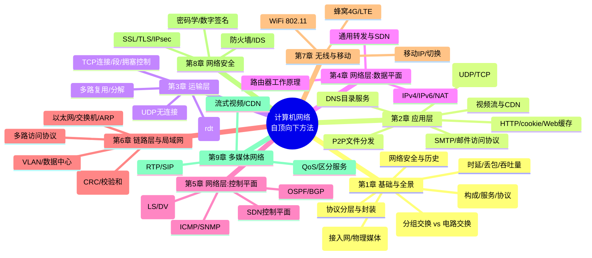
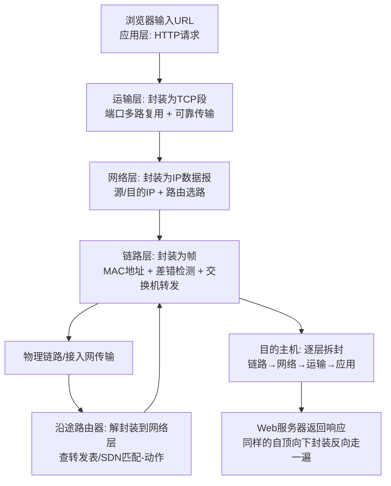

# 计算机网络：自顶向下方法

> **关于本指南**：严格基于 James F. Kurose、Keith W. Ross 著，陈鸣译《计算机网络：自顶向下方法（原书第 7 版）》（机械工业出版社，2018 年，ISBN 9787111599715，510 页）的**真实文本结构**进行解读与扩展，不整章转载原文；代码示例为功能性说明片段。书中版次之后的技术演进（如 HTTP/3、TLS 1.3、eBPF 等）一律标注为「书后演进」。

---

## 一、整体理解与逻辑结构（全书层面）

### 【全局摘要】

**书中/官方表述（引用）**

- 出版方官方内容简介原话：「本书是经典的计算机网络教材之一，采用了作者独创的**自顶向下方法**来讲授计算机网络的原理及其协议……即从**应用层协议开始沿协议栈向下逐层讲解**，让读者从实现、应用的角度明白各层的意义，进而理解计算机网络的工作原理和机制。本书强调**应用层范例和应用编程接口**，使读者尽快进入每天使用的应用程序环境之中进行学习和『创造』。」
- 第 1 章 1.1「什么是因特网」从两个角度定义因特网：「**具体构成描述**」（边缘的主机/端系统、通信链路、分组交换设备如路由器和交换机、协议）与「**服务描述**」（为应用程序提供面向连接/无连接的服务、可靠数据传输等）。
- 第 1 章 1.1.3「什么是协议」给出核心定义：「**协议**定义了在两个或多个通信实体之间交换的**报文格式**和**次序**，以及就报文传输或接收或其他事件所采取的**动作**。」（原文要点：协议 = 格式 + 顺序 + 动作）
- 第 1 章 1.5「协议层次及其服务模型」：分层把「一个复杂系统分解为若干模块」，每层向上层提供服务，并通过**封装**（encapsulation）把本层信息附加到数据上。

**通俗解释**
把计算机网络想象成**一套全球快递系统**：你（应用层，比如浏览器）要寄一封信（网页请求），你只管把信写好后交给前台（套接字接口）；前台把信塞进信封、贴上路由单（运输层 TCP/UDP 段）；邮局分拣中心再套上邮包、写上 IP 地址（网络层数据报）；最后装上卡车、在公路上跑（链路层帧）。每一层都不关心上一层信里写了什么，只负责「套一层壳、按规则转发」，到目的地再一层层拆开。**自顶向下**的教法，就是先让你当回寄信人（用 HTTP、写 socket 程序），理解「为什么需要这些服务」，再往下拆机器，而不是一上来就让你研究卡车发动机（物理层/链路层）。这解决了传统教材「自底向上」让人一头雾水、学了半天不知道能干嘛的问题——你先会用、再懂原理。

**本书解决的问题**

1. **认知顺序问题**：先见森林（应用）后见树木（链路），降低入门门槛。
2. **原理与实现的脱节**：每章配 Wireshark 实验（抓真实报文）+ 套接字编程作业（亲手写 client/server），把「协议」从纸面变成可观察、可运行的对象。
3. **因特网为中心**：以真实运行的 TCP/IP 互联网为锚，而非抽象 OSI 七层模型，紧跟时代（第 7 版已更新 WiFi、4G/LTE、CDN、SDN）。

### 【逻辑框架图】

本书采用「**应用 → 运输 → 网络 → 链路 → 无线/安全/多媒体**」的纵向协议栈 + 三个横向专题（无线移动、安全、多媒体）。下面用 Mermaid 思维导图呈现，再给出「一条 Web 请求的自顶向下旅程」流程图（这是全书的暗线，也是第 6.7 节「Web 页面请求的历程」的升华）。





> 注：上面这条「封装 → 传输 → 解封装」的旅程，正是第 6.7 节「Web 页面请求的历程」的完整展开；第 1 章的「封装」概念（1.5.2）是理解它的钥匙。

### 该技术与主流/以往技术/教材的对比

这里「技术」广义为**「学习/讲授计算机网络的路径与方法」**——因为本书的最大特色是教学法。下表对比几种主流教材与资料路径：

| 维度                  | 本书（Kurose 自顶向下）               | Tanenbaum《计算机网络》（自底向上） | Stevens《TCP/IP 详解 卷 1》 | Forouzan《数据通信与网络》 | 官方 RFC + 文档    | 视频课（如 中科大郑烇 / 斯坦福 CS144） |
| --------------------- | ------------------------------------- | ----------------------------------- | --------------------------- | -------------------------- | ------------------ | -------------------------------------- |
| 教学起点              | **应用层 → 链路层**（先会用）         | 物理层 → 应用层（先懂硬件）         | 直接深入 TCP/IP 协议细节    | 物理层 → 应用层，偏全面    | 无体系，按需查阅   | 多为自顶向下或混合                     |
| OSI/TCP-IP 覆盖       | 以 TCP/IP 为锚，OSI 仅作对照          | OSI 七层为主线                      | 仅 TCP/IP 协议族            | 两者都讲，篇幅均衡         | 协议级，无模型对照 | 视课程而定                             |
| 编程/实验实践         | **Wireshark 实验 + 套接字编程**（强） | 偏理论，实验少                      | 偏抓包分析与内核实现        | 习题为主                   | 无                 | 有配套 Lab（CS144 有 4 个编程项目）    |
| 理论深度（算法/证明） | 中上（路由、拥塞有公式与推导）        | 深（含大量算法与历史）              | 深（实现细节极细）          | 中（浅显易懂）             | 权威但碎片化       | 中                                     |
| 时效性                | 第 7 版较新（WiFi/4G/SDN/CDN）        | 版次更新慢，稍旧                    | 经典但偏旧（TCP 实现细节）  | 中等                       | 实时更新           | 实时                                   |
| 适合人群              | 本科生入门、转行、重实践者            | 科班系统学习、考研                  | 网络工程师、协议开发者      | 零基础、宽泛了解           | 查阅规范           | 视觉/互动学习者                        |

**一段话总结**：本书的核心竞争力不在「讲了更多协议」，而在**「从应用倒着讲」的认知编排 + 强实践（抓包+编程）**。相比自底向上教材（Tanenbaum、Forouzan）它更不容易劝退，相比 Stevens 的协议细节流它更成体系、更友好，相比零散 RFC 它有完整叙事。代价是物理层/硬件几乎不碰、个别深度（如 TCP 内核实现）不如 Stevens。对「想真正理解互联网怎么跑起来、并能动手」的读者，它是首选入门；进阶再做 Stevens + 抓包深挖。

---

## 二、分章节解读

| 章节               | 标题内容           | 核心内容                                                                                                                                                                                 | 关键例证/数据（如有）                                                              |
| ------------------ | ------------------ | ---------------------------------------------------------------------------------------------------------------------------------------------------------------------------------------- | ---------------------------------------------------------------------------------- |
| 出版者/译者序/前言 | —                  | 说明「自顶向下」立意、第 7 版修订要点（网络层拆两章、删 FTP/DHT、用 ECN 替 ATM、更新 WiFi/4G-LTE）                                                                                       | 第 7 版首次将网络层分为数据平面（第 4 章）与控制平面（第 5 章）                    |
| 第 1 章            | 计算机网络和因特网 | 因特网构成/服务/协议定义；网络边缘（接入网、物理媒体）；网络核心（分组交换 vs 电路交换）；时延/丢包/吞吐量；协议分层与封装；安全与历史                                                   | 1.1.3 协议定义「格式+顺序+动作」；1.5.2 封装；分组交换网四类时延                   |
| 第 2 章            | 应用层             | 应用体系结构（C/S、P2P、混合）；进程通信与套接字；HTTP（非持续/持续连接、cookie、Web 缓存、条件 GET）；SMTP 与邮件访问；DNS；P2P；视频流与 CDN；套接字编程                               | 2.2 HTTP 报文格式、2.4 DNS 记录与报文、2.6.3 CDN、2.7 套接字编程                   |
| 第 3 章            | 运输层             | 运输层与网络层关系；多路复用/分解；UDP；可靠数据传输原理（rdt 状态机、回退 N 步、选择重传）；TCP（连接、段结构、RTT 估计、流量控制、连接管理）；拥塞控制原理与 TCP 拥塞控制              | 3.4 rdt 构造四阶段、3.4.3 GBN、3.4.4 SR、3.5.6 三次握手/四次挥手、3.7 TCP 拥塞控制 |
| 第 4 章            | 网络层：数据平面   | 转发与路由区别；路由器内部结构（输入/交换/输出端口、排队、调度）；IPv4 数据报格式/分片/编址、NAT、IPv6；通用转发与 SDN（OpenFlow 匹配-动作）                                             | 4.2 路由器工作、4.3 IPv4 编址/CIDR、4.3.4 NAT、4.3.5 IPv6、4.4 OpenFlow 例子       |
| 第 5 章            | 网络层：控制平面   | 路由算法（链路状态 LS、距离向量 DV）；OSPF（域内）；BGP（域间、策略、任播）；SDN 控制平面（控制器、OpenFlow、交互）；ICMP；SNMP 网络管理                                                 | 5.2.1 Dijkstra(LS)、5.2.2 Bellman-Ford(DV)、5.4 BGP、5.5 SDN、5.7 SNMP             |
| 第 6 章            | 链路层和局域网     | 链路层服务与实现位置；差错检测（奇偶、校验和、CRC）；多路访问协议（信道划分/随机接入/轮流）；交换局域网（ARP、以太网、交换机、VLAN）；链路虚拟化、数据中心网络；**Web 页面请求历程**回顾 | 6.2 CRC、6.3 多路访问、6.4 以太网/ARP/交换机/VLAN、6.7 端到端历程                  |
| 第 7 章            | 无线网络和移动网络 | 无线链路特征；WiFi 802.11（体系结构、MAC、帧、同子网移动、高级特性、蓝牙/ZigBee）；蜂窝（3G、4G/LTE）；移动管理原理、移动 IP、蜂窝移动性管理、切换                                       | 7.3 802.11、7.4.3 LTE、7.5 移动寻址/路由、7.6 移动 IP、7.7 GSM 切换                |
| 第 8 章            | 计算机网络中的安全 | 网络安全定义；密码学（对称/公开密钥）；报文完整性、MAC、数字签名；端点鉴别（ap1.0~ap4.0）；安全电子邮件 PGP；SSL/TLS；IPsec/VPN；无线 LAN 安全（WEP/802.11i）；防火墙与 IDS              | 8.2 密码学、8.3 数字签名、8.6 SSL、8.7 IPsec、8.9 防火墙/IDS                       |
| 第 9 章            | 多媒体网络         | 多媒体应用类型；流式存储视频（UDP/HTTP 流）；IP 语音 VoIP（时延抖动消除、丢包恢复、Skype）；实时会话协议 RTP/SIP；支持多媒体的网络（区分服务、资源预约 QoS）                             | 9.2 流式视频、9.3 VoIP、9.4 RTP/SIP、9.5 区分服务/QoS                              |
| 参考文献           | —                  | 全书引用 RFC、论文、标准                                                                                                                                                                 | —                                                                                  |

---

## 四、以「报文自顶向下封装旅程」为序的技术点归纳（12 点，每点九段式）

> 编排逻辑：沿「一个 Web 请求从应用层出生 → 逐层封装 → 跨网路由 → 目的拆封」的真实生命周期展开，最后用第 6.7 节把全栈串成一条线。这与本书「自顶向下」的主线完全契合。

### 技术点 1：协议、分层与封装（第 1 章 1.1.3 / 1.5）

- **背景与解决的问题**：没有协议，设备各说各话；没有分层，一个巨型系统无法被人类理解与管理。解决「异构网络如何互通」与「复杂系统如何模块化」两大问题。
- **作用与应用场景**：协议是网络的「语法+语义+时序」；分层让每层只管自己的事（如 TCP 不管 IP 怎么路由）。应用于所有网络通信的建模与设计。
- **使用方法（代码示例/书中要点）**：
  ```
  协议三要素（书中定义）:
    1) 报文格式 (syntax)      —— 字段如何排列
    2) 报文次序 (order)       —— 谁先谁后
    3) 采取的动作 (action)     —— 收到/发送某报文后做什么
  封装 (1.5.2): 应用数据 → [TCP头|数据] → [IP头|TCP段] → [链路头|IP数据报|链路尾]
  ```
- **专业术语扩展**：
  - **PDU**（Protocol Data Unit，协议数据单元）：每层交换的数据单位。应用层=报文(message)、运输层=**报文段(segment)**、网络层=**数据报(datagram)**、链路层=**帧(frame)**。
  - **封装 (encapsulation)**：在每层把上层数据加上本层首部（有时还有尾部），「套壳」下行。
  - **RFC**（Request For Comments，征求意见稿）：因特网标准文档系列，由 IETF 发布。
- **与旧版本变化**：早期教材多从 OSI 七层讲起，本书第 7 版**以 TCP/IP 五层为锚**，OSI 仅作对照（1.5.1）。新版删除 ATM、弱化 DHT，更贴现实互联网。
- **与主流技术对比优势**：相比 OSI 抽象七层，TCP/IP 五层「更贴近真实运行的互联网」，读者不会在「表示层/会话层」这种抽象概念上空转。优势来源：因特网就是按 TCP/IP 长出来的，而非先有模型后填空。
- **实际应用（带注释）**：
  ```python
  # 用 Python 直观看"封装"：发一个 HTTP 请求，下面是被套的壳
  import socket
  s = socket.socket(socket.AF_INET, socket.SOCK_STREAM)  # 运输层选 TCP
  s.connect(("example.com", 80))                          # 网络层由 OS 解析 DNS+路由
  s.sendall(b"GET / HTTP/1.1\r\nHost: example.com\r\n\r\n")  # 应用层 HTTP 报文
  # 这条消息会被自动套上 TCP头(端口) → IP头(地址) → 以太网头(MAC) 后发出
  ```
- **局限性与解决方案**：分层有性能开销（每层都加头），且严格分层在现实中会被打破（如 SDN 把控制逻辑抽离）。解决：用「逻辑分层、物理融合」的务实态度，SDN（第 4/5 章）正是打破传统分层边界的代表。
- **通俗概括**：协议就是「大家都遵守的说话规矩」；分层是「把大事拆小、各管一摊」；封装是「寄快递时一层层套袋子，每层只认自己那张面单」。

### 技术点 2：HTTP 与 Web 应用（第 2 章 2.2）

- **背景与解决的问题**：Web 出现前，信息分散、无统一访问方式。HTTP 解决「浏览器与服务器如何请求/返回超文本」以及「无状态会话如何维持」。
- **作用与应用场景**：所有网站、REST API、微服务间调用都建立在 HTTP 之上。场景：网页浏览、前后端分离、移动 App 拉数据。
- **使用方法（书中要点 + 代码）**：
  ```
  非持续连接 vs 持续连接(2.2.2):
    非持续: 每对象新建TCP→请求→响应→关闭 (1.0风格, 慢)
    持续:  一条TCP上串行/流水线多个对象 (1.1默认, 省握手)
  HTTP 报文(2.2.3): 请求行 GET /index.html HTTP/1.1 + 首部 Host/Cookie + 空行 + 实体
  cookie(2.2.4): 服务器 Set-Cookie, 客户端后续请求带 Cookie → 无状态变有状态
  条件GET(2.2.6): If-Modified-Since + 304 Not Modified → 省带宽
  ```
  ```http
  GET / HTTP/1.1
  Host: www.example.com
  User-Agent: Mozilla/5.0
  Accept: text/html
  \r\n
  ```
- **专业术语扩展**：
  - **HTTP**（HyperText Transfer Protocol，超文本传输协议）：万维网的应用层协议。
  - **URL**（Uniform Resource Locator，统一资源定位符）：即网址，含协议、主机、路径。
  - **MIME**（Multipurpose Internet Mail Extensions，多用途网际邮件扩充）：用于标识内容类型（如 `text/html`）。
  - **RTT**（Round-Trip Time，往返时间）：请求到响应一来一回的耗时。
- **与旧版本变化**：第 7 版仍讲 HTTP/1.1（未展开 HTTP/2、HTTP/3，属书后演进，见第七节）。书中 Web 缓存、条件 GET 等机制在 1.1 已稳定。
- **与主流技术对比优势**：相比 FTP（需登录、双连接）、SMTP（仅邮件），HTTP 无连接、无状态、极简、可穿过防火墙，天然适配 Web 与后来的 REST。优势来自「为超文本传输而生」的极简设计。
- **实际应用（带注释）**：见技术点 1 的 socket 示例；现代用的是 `requests`/`fetch`：
  ```python
  import requests
  r = requests.get("https://example.com", timeout=5)
  print(r.status_code, r.headers.get("Content-Type"))  # 200 text/html
  # 底层仍是: TCP连接 → 发HTTP请求 → 收HTTP响应 → 解析
  ```
- **局限性与解决方案**：HTTP 明文不安全 → 升级 HTTPS（TLS，第 8 章）；1.1 队头阻塞 → HTTP/2 多路复用、HTTP/3 走 QUIC/UDP（书后演进）。
- **通俗概括**：HTTP 就是「浏览器向服务器要网页的普通话」，一问一答、问完就散；cookie 是服务器发的「胸牌」，下次你亮牌它就知道你是谁。

### 技术点 3：DNS 与 CDN / P2P（第 2 章 2.4 / 2.5 / 2.6）

- **背景与解决的问题**：人记域名、机器用 IP，二者需要翻译；单一服务器扛不住全球流量。解决「命名 → 地址解析」与「大规模内容分发」。
- **作用与应用场景**：DNS 是互联网的「电话簿」，所有联网应用第一步常是 DNS 解析；CDN 用于视频/大文件加速；P2P 用于文件分发（BitTorrent）、即时通信。
- **使用方法（书中要点）**：
  ```
  DNS(2.4): 分布式数据库, 根→TLD(.com)→权威 层级解析
  记录类型(2.4.3): A(名→IPv4), AAAA(→IPv6), NS(权威服务器),
                   CNAME(别名), MX(邮件), TXT
  CDN(2.6.3): 把内容缓存到靠近用户的边缘节点, 用户被"导引"到最近副本
  DASH(2.6.2): 视频分块+多码率, 客户端按需选清晰度
  P2P(2.5): 每个下载者也上传, 分发时间随节点数近线性下降(而非服务器瓶颈)
  ```
- **专业术语扩展**：
  - **DNS**（Domain Name System，域名系统）：域名 ↔IP 的分布式数据库。
  - **CDN**（Content Delivery Network，内容分发网络）：边缘缓存加速网络。
  - **DASH**（Dynamic Adaptive Streaming over HTTP，基于 HTTP 的动态自适应流）：自适应码率视频。
  - **FQDN**（Fully Qualified Domain Name，完全合格域名）：如 `www.example.com.` 完整域名。
- **与旧版本变化**：第 7 版新增/强化 CDN 与 DASH，删除旧版 FTP、分布式散列表（DHT）材料，更贴流媒体时代。
- **与主流技术对比优势**：DNS 的「分布式分层 + 缓存」比集中式主机表（如早期 HOSTS.TXT）可扩展无数倍；CDN 比「单源站 + 长距离传输」大幅降低时延。优势来自「就近 + 缓存 + 去中心」。
- **实际应用（带注释）**：
  ```bash
  # 看一次 DNS 解析全过程(印证 2.4.2 工作机理)
  dig +trace www.example.com
  # ;; Received 根提示 → .com TLD → example.com 权威 → A 记录
  ```
- **局限性与解决方案**：DNS 无缓存一致性的实时性（TTL 过长导致切换慢）→ 用低 TTL + 任播；DNS 易被污染/劫持 → DoH/DoT（书后演进，见第七节）。
- **通俗概括**：DNS 是「互联网黄页」，你报人名它翻出电话号码；CDN 是「把爆款货铺到每个小区便利店」，你下楼就能拿；P2P 是「全班传一份笔记，每人手抄一份再互传，比老师一人复印快」。

### 技术点 4：UDP 与 TCP 可靠传输（第 3 章 3.3 / 3.4 / 3.5）

- **背景与解决的问题**：IP 网络「尽力而为、会丢包」。有些应用（文件、网页）不能丢；有些（语音、游戏）要快不能等重传。解决「可靠 vs 实时」的取舍。
- **作用与应用场景**：UDP 用于 DNS、VoIP、视频流、游戏（低延迟）；TCP 用于 Web、邮件、文件传输（可靠有序）。
- **使用方法（书中要点 + 代码）**：
  ```
  UDP(3.3): 无连接、无拥塞控制、首部8字节; 仅做多路分解(端口)
  rdt 原理(3.4): 用 校验和+序号+确认(ACK)+重传+定时器 逐步构造可靠协议
    rdt2.0 加 ACK/NAK; rdt2.1 加序号; rdt3.0 加定时器(比特交替协议)
  GBN(3.4.3): 滑动窗口, 一个错全部重传(累计确认)
  SR(3.4.4): 选择重传, 只重传出错的帧(个体确认)
  TCP(3.5): 面向连接、字节流、累计确认、单定时器(近似SR)
    三次握手(3.5.6): SYN → SYN+ACK → ACK 建立连接
  ```
  ```python
  # UDP 服务端骨架(对应 2.7.1 / 3.3)
  import socket
  s = socket.socket(socket.AF_INET, socket.SOCK_DGRAM)  # SOCK_DGRAM = UDP
  s.bind(("0.0.0.0", 9999))
  data, addr = s.recvfrom(1024)   # 无连接, 每次都带对端地址
  s.sendto(b"pong", addr)
  ```
- **专业术语扩展**：
  - **rdt**（reliable data transfer，可靠数据传输）：教材抽象模型，渐进构造可靠协议。
  - **ACK/NAK**（positive/negative ACKnowledgement，肯定/否定确认）：接收方告知发送方「收到/没收到」。
  - **GBN**（Go-Back-N，回退 N 步）：出错则重传窗口内所有。
  - **SR**（Selective Repeat，选择重传）：只重传丢失者。
  - **MSS**（Maximum Segment Size，最大报文段长度）：TCP 一次能承载的应用数据上限。
- **与旧版本变化**：可靠传输原理（rdt、GBN、SR）是经典内容，多版稳定；第 7 版 TCP 连接管理（3.5.6）仍讲三次握手/四次挥手，未涉及 TCP Fast Open 等书后优化。
- **与主流技术对比优势**：TCP 用「一个统一的可靠字节流 + 滑动窗口 + 单定时器」在工程上比纯 SR 更简单高效；UDP 则把控制权完全交给应用。优势来自「TCP 替你兜底，UDP 让你自己优化」。
- **实际应用（带注释）**：技术点 1/3 已含 TCP client 与 UDP server。生产中 TCP 几乎无处不在；QUIC（HTTP/3）把可靠传输搬到 UDP 之上（书后演进）。
- **局限性与解决方案**：TCP 队头阻塞（一个丢包卡住整个流）→ HTTP/2 仍受限于此，HTTP/3 用 QUIC 解决；UDP 不可靠 → 应用层自己加 rdt（如游戏、QUIC）。
- **通俗概括**：UDP 是「扔纸条」，扔了不管到没到，快但可能丢；TCP 是「寄挂号信」，对方签收你才安心，丢了重寄，慢一点但稳。

### 技术点 5：拥塞控制（第 3 章 3.6 / 3.7）

- **背景与解决的问题**：太多发送方同时猛发，路由器/链路过载 → 大量丢包、吞吐骤降（「拥塞崩溃」）。解决「如何在共享网络中公平且高效地利用带宽」。
- **作用与应用场景**：所有 TCP 通信默认启用；数据中心、视频会议据此调节发送速率。场景：防止网络雪崩、保障公平性。
- **使用方法（书中要点）**：
  ```
  拥塞控制方法(3.6.2):
    端到端(网络不辅助): TCP 自己探测, 如 TCP Reno (AIMD)
    网络辅助: 路由器显式告知, 如 ECN(书内已更新引入)
  TCP Reno(3.7): 慢启动(ss, 指数增) → 拥塞避免(线性增 AIMD)
    丢包=拥塞 → 减半 cwnd; 超时更狠(回到慢启动)
  公平性(3.7.1): 多流共享瓶颈时趋于均分带宽
  ECN(3.7.2): 路由器在IP头置拥塞标志, 不必等丢包才降速
  ```
- **专业术语扩展**：
  - **cwnd**（congestion window，拥塞窗口）：发送方自行维护的「当前允许发送量」。
  - **AIMD**（Additive Increase Multiplicative Decrease，加性增乘性减）：线性加、翻倍减，TCP 收敛公平性的核心。
  - **ssthresh**（slow-start threshold，慢启动阈值）：区分慢启动与拥塞避免的临界点。
  - **ECN**（Explicit Congestion Notification，显式拥塞通告）：路由器主动标记拥塞，JEP 编者注属书内更新点。
- **与旧版本变化**：第 7 版用 ECN 内容**替换了旧版 ATM 网络材料**（出版方修订说明），更贴近真实 IP 网络。
- **与主流技术对比优势**：相比「固定速率/预留带宽」方案，TCP 端到端拥塞控制**无需网络内状态**、自适应、可扩展到全球互联网。优势来自「分布式自我克制」而非集中调度。
- **实际应用（带注释）**：观察 Linux 拥塞算法：
  ```bash
  sysctl net.ipv4.tcp_congestion_control   # 常显示 cubic / bbr
  # BBR(Google)是书后演进, 基于带宽-时延积模型, 不像Reno依赖丢包信号
  ```
- **局限性与解决方案**：基于丢包的 Reno 在高速长距离链路「填满 buffer 才降速」（bufferbloat）→ BBR 改为测带宽/时延（书后演进）；TCP 公平但可能被 UDP 洪流挤占 → 靠网络层/中间件限速。
- **通俗概括**：拥塞控制是「大家自觉排队上公交」——看到车快满了就慢点上、挤了就退一步；ECN 是「司乘员举牌提醒『快满了』」，不用等真撞上才停。

### 技术点 6：网络层数据平面 —— IPv4/IPv6/NAT 与转发（第 4 章）

- **背景与解决的问题**：全球主机需要唯一地址与统一的寻路规则；IPv4 地址枯竭；私有网络要安全共享公网。解决「编址、转发、地址复用」。
- **作用与应用场景**：每一次跨网通信都依赖 IP 编址与路由器转发；NAT 让家里多设备共用一个公网 IP；IPv6 应对地址耗尽。
- **使用方法（书中要点 + 代码）**：
  ```
  IPv4数据报(4.3.1): 首部含 源/目的IP、TTL、协议号、首部校验和
  分片(4.3.2): 超过链路MTU时分割, 目的重组(常被DF位禁止)
  编址(4.3.3): 子网 = IP + 子网掩码(CIDR, 如 192.168.1.0/24)
  NAT(4.3.4): 把内网10.x/192.168.x 映射为一个公网IP+端口
  IPv6(4.3.5): 128位地址、固定40字节首部、无分片/无校验和
  ```
  ```bash
  # 看本机 IP 与子网(印证 4.3.3 编址)
  ip addr show
  ip route show            # 看路由表(转发依据, 呼应 4.1 转发 vs 路由)
  ```
- **专业术语扩展**：
  - **MTU**（Maximum Transmission Unit，最大传输单元）：链路层一帧能承载的最大 IP 包（以太网通常 1500 字节）。
  - **CIDR**（Classless Inter-Domain Routing，无类别域间路由）：用 `/24` 表示前缀长度，打破旧 ABC 类。
  - **NAT**（Network Address Translation，网络地址转换）：私有 ↔ 公有地址映射。
  - **TTL**（Time To Live，生存时间）：每经一跳减 1，到 0 丢弃，防环路。
- **与旧版本变化**：第 7 版把网络层**拆成数据平面（本章：转发/路由器/IP）与控制平面（第 5 章：路由/SDN）**，结构更清晰；IPv6 部分更新。
- **与主流技术对比优势**：IPv4 简单、生态庞大；IPv6 地址近乎无限、首部精简、原生杜绝 NAT 之乱。NAT 是「权宜之计却撑起了整个私网时代」。优势来源：分层地址 + 无连接数据报模型，使任意两点可通信。
- **实际应用（带注释）**：技术点 1/3 的 socket 程序；NAT 在家庭路由器中普遍存在（4.3.4 图），使多设备共用宽带。
- **局限性与解决方案**：IPv4 地址耗尽 → NAT 延缓但引入端到端割裂（P2P/端口穿透难）→ 根本解法是 IPv6 普及；IPv6 部署缓慢 → 双栈过渡（书后演进）。
- **通俗概括**：IP 地址是「每台设备的门牌号」，路由器是「按门牌分拣的邮局」；NAT 是「整栋楼共用一个对外门牌，物业帮你转内部分机」；IPv6 是「门牌号多到给地球上每粒沙都发一个还有剩」。

### 技术点 7：网络层控制平面 —— 路由算法、OSPF、BGP、SDN（第 5 章）

- **背景与解决的问题**：数据平面只管「收到就按表转发」，但**转发表从哪来**？需要控制平面计算「到达各目的地走哪条路」。解决「全网拓扑下的路径计算与策略」。
- **作用与应用场景**：域内路由（OSPF，企业/运营商内部）、域间路由（BGP，全球 AS 互联）、SDN（数据中心/云网络可编程转发）。
- **使用方法（书中要点）**：
  ```
  路由算法(5.2):
    LS(链路状态, 5.2.1): 各节点掌握全图, Dijkstra算最短路(如OSPF)
    DV(距离向量, 5.2.2): 只知邻居, 贝尔曼-福特迭代交换(如RIP, 有慢收敛问题)
  OSPF(5.3): 域内, 基于LS, 分层区域
  BGP(5.4): 域间, 基于路径向量+策略("拼装在一起"5.4.6)
  SDN控制平面(5.5): 控制器集中算流表, 通过OpenFlow下发给交换机
  ```
- **专业术语扩展**：
  - **AS**（Autonomous System，自治系统）：一个管理域（如一个运营商），用同一个路由策略，BGP 在其间运行。
  - **LS/DV**（Link State / Distance Vector，链路状态 / 距离向量）：两类路由算法范式。
  - **SDN**（Software-Defined Networking，软件定义网络）：控制平面与数据平面分离、集中可编程（第 4.4 数据平面 + 第 5.5 控制平面）。
  - **OpenFlow**：SDN 南向接口协议，定义「匹配-动作」流表（4.4.3 例子）。
- **与旧版本变化**：第 7 版**首次将网络层拆为两章**，并把网络管理（SNMP）并入第 5 章；SDN 作为独立大节（5.5）重点加强，反映产业现实。
- **与主流技术对比优势**：LS（OSPF）收敛快、无慢收敛，适合域内；DV 简单但易环/慢收敛（RIP 已边缘化）；BGP 用「策略而非最短路」解决跨运营商商业利益；SDN 用「集中智能」取代分布式收敛，适合云。优势各不相同、互补：域内要快、域间要可控、云内要可编程。
- **实际应用（带注释）**：本地路由表观察（接技术点 6）：
  ```bash
  ip route                      # 直连/静态/OSPF学来的路由都在这里
  # 在云上: 用控制器(如ONOS/OpenDaylight)下发流表即 5.5 的 SDN 实践
  ```
- **局限性与解决方案**：DV 慢收敛（计数到无穷）→ 用 LS 或 BGP 替代；BGP 无安全（前缀劫持）→ RPKI/ROV（书后演进）；分布式路由难做全局优化 → SDN 集中式（但引入控制器单点，需冗余）。
- **通俗概括**：控制平面是「导航 App 提前算好路线并存进邮局的分拣表」；OSPF 是「全市快递员互相通报路况、各自算最优」；BGP 是「不同快递公司之间按合同（不是按最近）决定怎么交接」；SDN 是「总部一台超级电脑统一给所有分拣机发指令」。

### 技术点 8：链路层 —— 差错检测、多路访问、以太网、ARP、交换机（第 6 章）

- **背景与解决的问题**：物理链路会出错（噪声）、多节点共享同一介质会「撞车」、相邻设备要靠硬件地址通信。解决「单跳可靠、介质共享、局域网寻址与转发」。
- **作用与应用场景**：局域网（公司/家庭 WiFi、以太网）、数据中心内部通信、任何「一跳」之间的传输。
- **使用方法（书中要点 + 代码）**：
  ```
  差错检测(6.2): 奇偶校验 / 检验和(运输层也用) / CRC(链路层主用, 强)
  多路访问(6.3):
    信道划分(6.3.1): TDM/FDM/码分, 公平但浪费
    随机接入(6.3.2): ALOHA、CSMA/CD(以太网)、CSMA/CA(WiFi)
    轮流(6.3.3): 轮询/令牌
  ARP(6.4.1): IP→MAC 的局域网地址解析 ("谁是192.168.1.1? 告诉我MAC")
  以太网(6.4.2): CSMA/CD、MAC帧、48位MAC地址
  交换机(6.4.3): 自学习MAC表、转发/过滤、消除冲突域
  VLAN(6.4.4): 在交换机上逻辑隔离广播域
  ```
  ```bash
  # 看 ARP 缓存与 MAC(印证 6.4.1)
  arp -a
  ip neigh show
  # 看交换机自学习的 MAC 表(在交换机上): show mac address-table
  ```
- **专业术语扩展**：
  - **CRC**（Cyclic Redundancy Check，循环冗余校验）：用多项式除法算校验码，检错能力远强于简单校验和。
  - **CSMA/CD**（Carrier Sense Multiple Access with Collision Detection，载波侦听多路访问/冲突检测）：先听后发、冲突即停（以太网）。
  - **CSMA/CA**（…Collision Avoidance，冲突避免）：WiFi 用，因无法边发边听故「避免」而非「检测」。
  - **MAC**（Media Access Control，媒体访问控制）：链路层硬件地址，全球唯一（OUI+厂商烧录）。
  - **ARP**（Address Resolution Protocol，地址解析协议）：IP→MAC。
- **与旧版本变化**：第 7 版强化数据中心网络（6.6）、Web 页面请求历程（6.7）回顾；传统内容（以太网、CRC、CSMA）稳定。
- **与主流技术对比优势**：CRC 比校验和检错强得多；交换机比集线器（HUB）智能（独享带宽、隔离冲突）；CSMA 比「纯信道划分」利用率高。优势来自「按需竞争 + 智能转发」。
- **实际应用（带注释）**：家用路由器=「交换机+NAT 路由器+AP」三合一；企业用 VLAN 隔离部门（6.4.4）；数据中心用叶脊（spine-leaf）拓扑（6.6）。
- **局限性与解决方案**：ARP 可被欺骗（ARP spoofing）→ 用静态 ARP/DAI 交换机防护（接第 8 章安全）；广播风暴 → VLAN/STP；交换机表溢出 → 端口安全。
- **通俗概括**：链路层是「同一栋楼里两家怎么对话」——CRC 是「信封防伪校验」，CSMA 是「先听没人说话再开口」，ARP 是「只知道对方门牌号(IP)不知道长相(MAC)就去问」，交换机是「楼管记住每家位置直接送货上门、不让全楼广播」。

### 技术点 9：无线与移动网络（第 7 章）

- **背景与解决的问题**：无线链路易错、带宽不对称、节点会移动切换。解决「在没有网线、还会跑的情况下怎么连网」。
- **作用与应用场景**：WiFi（家庭/办公）、蜂窝（手机 3G/4G/LTE/5G）、物联网（蓝牙/ZigBee）、移动中保持连接（切换、移动 IP）。
- **使用方法（书中要点）**：
  ```
  WiFi 802.11(7.3): 基础设施模式(AP) / ad hoc; CSMA/CA; 关联/扫描
  蜂窝(7.4): 3G → 4G/LTE(全IP, 扁平架构); 基站eNodeB
  移动管理(7.5): 永久地址 vs 转交地址; 间接/直接路由到移动节点
  移动IP(7.6): 家乡代理隧道转发, 解决"换了网段仍能收包"
  切换(7.7): GSM中在同一/不同MSC间切换
  ```
- **专业术语扩展**：
  - **AP**（Access Point，接入点）：WiFi 的「无线交换机」，手机/笔电连它再进有线网。
  - **LTE**（Long Term Evolution，长期演进）：4G 标准，全 IP 架构。
  - **eNodeB**：LTE 基站。
  - **MN/CoA**（Mobile Node / Care-of Address，移动节点 / 转交地址）：移动 IP 中的「老家地址」与「当前所在地地址」。
- **与旧版本变化**：第 7 版**更新了 802.11 与蜂窝（含 4G/LTE）材料**，删除旧版 DHT；本书未含 5G/WiFi 6（书后演进）。
- **与主流技术对比优势**：WiFi 低成本覆盖局部；蜂窝广域连续覆盖但贵；移动 IP 解决跨网移动但引入三角路由（效率问题）。优势各异：室内靠 WiFi、室外靠蜂窝、移动靠二者协同。
- **实际应用（带注释）**：手机从家(WiFi)走到街上面(蜂窝)通话不中断，靠 7.7 切换 + 移动性管理；企业 WLAN 用 802.11i（WPA2，接第 8 章）保障安全。
- **局限性与解决方案**：无线带宽受限、干扰多 → 用更高标准（5G/WiFi 6，书后演进）；移动 IP 三角路由低效 → 用直接路由/代理；切换掉线 → 快速切换机制。
- **通俗概括**：无线网络是「人在走动也能打电话」——WiFi 是家里的小范围无线座机，蜂窝是全程覆盖的大网，移动 IP 是「你出差了，老家邮局把信自动转寄到你酒店」。

### 技术点 10：网络安全（第 8 章）

- **背景与解决的问题**：网络天然开放，面临窃听、伪造、篡改、拒绝服务。解决「机密性、完整性、可用性、可鉴别性」。
- **作用与应用场景**：HTTPS 浏览、VPN 远程办公、安全邮件、企业边界防护（防火墙）、入侵检测。
- **使用方法（书中要点 + 代码）**：
  ```
  密码学(8.2): 对称(AES, 一把钥匙) vs 公开密钥(RSA, 公钥加密私钥解)
  完整性/签名(8.3): 散列(SHA) + MAC + 数字签名(私钥签, 公钥验)
  端点鉴别(8.4): ap1.0~ap4.0 逐版加 nonce/公钥, 防重放
  SSL/TLS(8.2/8.6): "TCP之上加安全层", HTTPS=HTTP over TLS
  IPsec(8.7): 网络层加密, 构建VPN(AH/ESP, 安全关联SA)
  无线安全(8.8): WEP(已破) → 802.11i(WPA2/WPA3)
  防火墙/IDS(8.9): 包过滤/状态检测 + 入侵检测/防护
  ```
  ```bash
  # 看本机是否在用 TLS(印证 8.6 HTTPS). 现代多用 TLS1.2/1.3
  openssl s_client -connect example.com:443 </dev/null 2>/dev/null | grep -i "protocol\|cipher"
  # 书内讲 SSL; 现今 TLS 1.3 已普及(书后演进)
  ```
- **专业术语扩展**：
  - **对称/非对称加密**：对称=加解密同一把钥匙（快）；非对称=公钥加密、私钥解密（解决密钥分发）。
  - **MAC**（Message Authentication Code，报文鉴别码）：带密钥的完整性校验。
  - **nonce**（number used once，一次性随机数）：防重放攻击。
  - **TLS**（Transport Layer Security，传输层安全）：SSL 的继任标准，HTTP**S** 即用 TLS。
  - **VPN**（Virtual Private Network，虚拟专用网）：在公网上用 IPsec/TLS 挖一条加密隧道。
- **与旧版本变化**：第 7 版讲 SSL（历史称谓）与 IPsec/WEP/802.11i；**TLS 1.3、WPA3 属书后演进更迭**（见第七节），阅读时需知悉。
- **与主流技术对比优势**：TLS 在传输层透明加固任何 TCP 应用；IPsec 在网络层做「整个 IP 包加密」适合站点间 VPN；相比「明文 + 应用自加密」更标准化、可互操作。优势来自「分层安全、对应用透明」。
- **实际应用（带注释）**：日常 HTTPS 即 8.6；企业远程用 IPsec/OpenVPN（8.7）；家庭 WiFi 设 WPA2/3（8.8）；出口用防火墙（8.9）。
- **局限性与解决方案**：TLS 握手慢、CA 体系可被滥用 → TLS 1.3 简化握手、证书透明化（书后演进）；防火墙无法防内部威胁 → 配合 IDS/零信任（书后演进）。
- **通俗概括**：网络安全是「寄信时上锁 + 签名 + 查身份」——对称加密是「你和朋友共用一把锁的钥匙」，公钥加密是「谁都能往你公开信箱塞加密信、只有你能开」，数字签名是「你盖章别人一验就知道真是你」，防火墙是「小区门卫只放名单内的人」。

### 技术点 11：多媒体网络（第 9 章）

- **背景与解决的问题**：音视频对时延/抖动敏感、带宽需求大，而 IP 是「尽力而为」不保证质量。解决「在不可靠网络上怎样把视频/电话跑得顺畅」。
- **作用与应用场景**：视频网站（流式）、网络电话 VoIP、视频会议、直播。
- **使用方法（书中要点）**：
  ```
  流式视频(9.2): UDP流(快但可能丢) vs HTTP流(经CDN, 可靠但偶有卡顿)
  VoIP(9.3): 接收方用播放缓冲消除抖动; FEC/重传从丢包恢复
  实时协议(9.4): RTP(承载媒体)+RTCP(质量反馈); SIP(会话建立/拆除)
  支持多媒体(9.5): 区分服务(DiffServ, 标记优先级) / 资源预约(RSVP, 端到端QoS)
  ```
- **专业术语扩展**：
  - **QoS**（Quality of Service，服务质量）：网络对特定流量提供带宽/时延保障。
  - **RTP**（Real-time Transport Protocol，实时传输协议）：承载音视频载荷。
  - **SIP**（Session Initiation Protocol，会话发起协议）：建立/管理多媒体会话（类似「多媒体版的 HTTP 握手」）。
  - **FEC**（Forward Error Correction，前向纠错）：发冗余数据，丢包也能重建。
  - **抖动（jitter）**：包到达间隔的波动，音视频最怕它。
- **与旧版本变化**：第 7 版保留 RTP/SIP/区分服务/RSVP 框架；**WebRTC、QUIC 承载媒体属书后演进**（见第七节）。
- **与主流技术对比优势**：RTP+UDP 比 TCP 更适合实时（不重传旧帧）；CDN+HTTP 流比自建流媒体服务器省心；区分服务比 RSVP 易部署（RSVP 因扩展性差未大规模落地）。优势来自「实时应用宁可丢帧不可等重传」。
- **实际应用（带注释）**：看 B 站/Netflix 是 9.2 HTTP 流 + CDN；Zoom/微信电话是 9.3 VoIP + 9.4（现代多用 WebRTC，书后演进）。
- **局限性与解决方案**：尽力而为网络无法满足硬 QoS → DiffServ 只给软优先级、RSVP 难扩展 → 现代靠「充足带宽 + 自适应码率（DASH，接 2.6）」而非网络预留。
- **通俗概括**：多媒体网络是「视频通话别卡顿」——RTP 是「专门运音视频的快递车」，抖动消除是「到了先放缓冲池、按节奏匀速播放」，区分服务是「给视频包裹贴『加急』标签让路由器优先转」。

### 技术点 12：端到端综合 —— Web 页面请求的历程（第 6.7 节）

- **背景与解决的问题**：前面各层是孤立的，读者常问「它们怎么串起来」？第 6.7 节用「在浏览器输入 URL 到页面出现」把全栈串成一条线，这是全书的「收口」技术点。
- **作用与应用场景**：排障（页面打不开，逐层定位）、面试（经典题）、理解真实系统全貌。
- **使用方法（书中要点，呼应全栈）**：
  ```
  6.7.1 准备: DHCP拿到IP/网关/DNS → UDP+IP+以太网发出
  6.7.2 仍在准备: DNS解析(ARP拿到网关MAC) → 拿到服务器IP
  6.7.3 域内路由到DNS服务器: 路由器查表转发
  6.7.4 Web客户-服务器交互: TCP三次握手 → 发HTTP GET → 收响应
  → 全程经历: 应用(HTTP/DNS/DHCP) → 运输(TCP/UDP) → 网络(IP/路由)
             → 链路(ARP/以太网/交换机) → 物理
  ```
- **专业术语扩展**：
  - **DHCP**（Dynamic Host Configuration Protocol，动态主机配置协议）：自动分配 IP/网关/DNS（6.7.1）。
  - **全栈（full stack）**：从应用到物理的完整协议栈路径。
- **与旧版本变化**：第 7 版将「Web 页面请求的历程」保留并强化为链路章收尾，是「自顶向下」教学法的最佳示范。
- **与主流技术对比优势**：比起单纯背各层协议，这种「追踪一个真实请求」的方式**把知识锚定到可观察现象**，记忆与排障效率远超碎片化学习。
- **实际应用（带注释）**：用 Wireshark 抓一次访问，按 6.7 顺序核对：
  ```bash
  # 抓包过滤(对应 6.7 各阶段)
  wireshark -f "udp port 67 or udp port 53 or tcp port 80 or arp"
  # 你会看到: DHCP → DNS → ARP → TCP握手 → HTTP GET 的报文序列
  ```
- **局限性与解决方案**：6.7 以单家用网络为例，未覆盖 CDN 就近、HTTPS、移动网络等复杂路径 → 结合第 2 章 CDN、第 8 章 HTTPS、第 7 章移动性扩展理解。
- **通俗概括**：这一个点把全书缝成一件衣服——你敲下回车，消息从「应用层想法」一路套壳下沉，经无数路由器「按表分拣」，到服务器再一层层拆开回话，响应原路返回。理解了它，你就真正「看见」了互联网。

---

## 五、输出格式与语言风格自检

- **标题层级**：一级（一/二/四/五/六/七）→ 二级（各技术点）→ 三级（九段式子项），层级清晰。
- **思维导图/表格/流程图**：第一节用 Mermaid mindmap + flowchart 双图；第一节含 6 列对比表；第二节为 9 章 + 前言/参考文献的解读表；第四节每点九段式。
- **引用/章节标注**：所有子节号（如 1.5.2、3.4.3、6.7.1、8.6）均来自核实过的第 7 版官方目录；对比与扩展处标注「书后演进」。
- **术语解释**：每个技术点均含缩写全称与省略含义（PDU、CRC、CSMA/CA、AS、TLS、QoS、FEC 等）。
- **通俗化**：每个技术点末以「通俗概括」用生活比喻收尾，核心概念保留专业术语（如封装、拥塞窗口、距离向量）并解释。

---

## 六、技术环境搭建（书中 Wireshark 实验 + 套接字编程的可执行方案）

本书第 2/3 章含 Wireshark 实验与套接字编程作业，但未系统讲「怎么搭环境」。以下给出**可逐步执行**的现代主流方案。

### 方案 A：Wireshark 抓包（验证第 2 章 HTTP/DNS、第 3 章 TCP/UDP）

1. 下载安装：访问 `https://www.wireshark.org` → 按系统安装（Windows 选「安装 USBPcap」可选）。
2. 选择网卡：打开 Wireshark → 选正在上网的接口（如 `Wi-Fi` / `Ethernet`）→ 开始捕获。
3. 产生流量并过滤：
   ```bash
   # 终端访问一次网页, 同时在 Wireshark 过滤
   curl -s https://example.com >/dev/null
   ```
   过滤器输入 `http || dns || tcp.port==443` 观察 2.2/2.4、3.5 的报文。
4. 抓 TCP 三次握手：过滤器 `tcp.flags.syn==1`，可见 SYN→SYNC/ACK→ACK（对应 3.5.6）。

### 方案 B：Python 套接字编程（验证 2.7 / 第 3 章）

1. 安装 Python 3（本书用 Java，现代用 Python 更轻量，逻辑等价）：
   ```bash
   # Windows(管理员) / macOS / Linux 一般自带; 验证:
   python3 --version
   ```
2. 写 TCP 回声服务器（呼应 2.7.2）：
   ```python
   # server.py
   import socket
   s = socket.socket(socket.AF_INET, socket.SOCK_STREAM)
   s.bind(("0.0.0.0", 8000)); s.listen(1)
   print("waiting...")
   conn, addr = s.accept()
   data = conn.recv(1024); conn.sendall(b"echo:" + data)
   print("from", addr, "got", data)
   ```
   ```python
   # client.py
   import socket
   s = socket.create_connection(("127.0.0.1", 8000))
   s.sendall(b"hello"); print(s.recv(1024))
   ```
3. 两个终端分别 `python3 server.py` 与 `python3 client.py`，即可观察「运输层 TCP 多路复用 + 可靠字节流」（3.2/3.5）。

### 方案 C（进阶）：用容器模拟网络做路由/SDN 实验（验证第 4/5 章）

> 书中 OSPF/BGP/SDN 仅靠文字较难「跑起来」，现代可用容器网络仿真。

```bash
# 安装容器运行时(Docker Desktop / 或 Linux 直接装 docker)
# 用 containerlab 一键拉起多路由器拓扑(验证 5.2/5.3/5.4):
pip install containerlab          # 或按其官网安装
# 编写 *.clab.yml 定义若干 router 节点, 启动后即可进容器配 OSPF/BGP
```

或用 **Mininet**（经典 SDN 教学环境，呼应 5.5）：`sudo apt install mininet` → `sudo mn --controller=remote` 连 OpenDaylight/RYU 控制器下流表。

---

## 七、扩展（书中未覆盖或已演进的主流技术）

> 本节明确区分「书后演进」与「书中已覆盖」，并说明承接关系。

| 方向        | 书中状态（第 7 版，2018）         | 书后演进 / 更主流技术                                                           | 与书中理论的承接                                                     |
| ----------- | --------------------------------- | ------------------------------------------------------------------------------- | -------------------------------------------------------------------- |
| 应用层      | HTTP/1.1、FTP 已删                | **HTTP/2（多路复用）、HTTP/3（QUIC over UDP）**、gRPC                           | 承接 2.2 的 HTTP 模型；QUIC 把 TCP 可靠传输（技术点 4）搬到了 UDP 上 |
| 安全        | SSL 称谓、IPsec、WEP/802.11i      | **TLS 1.3**（1-RTT/0-RTT 握手）、**WPA3**、**DoH/DoT**（DNS 加密）、零信任/SASE | 承接 8.2/8.6/8.8；TLS 1.3 是 SSL 的直接继任                          |
| 运输层      | TCP Reno、ECN                     | **BBR 拥塞控制**、TCP Fast Open、Multipath TCP                                  | 承接 3.7 拥塞控制；BBR 改用带宽-时延模型而非丢包信号                 |
| 网络层      | IPv4/IPv6/NAT、OSPF/BGP、SDN 初阶 | **RPKI/ROV**（BGP 安全防前缀劫持）、**SRv6**、双栈/过渡技术成熟                 | 承接 4.3/5.4；RPKI 修复 BGP 无安全缺陷                               |
| 数据平面    | 路由器/OpenFlow                   | **eBPF/XDP**（内核可编程数据平面）、P4（协议无关交换）、DPDK                    | 承接 4.2/4.4「通用转发」思想，推向线速可编程                         |
| 无线/移动   | 802.11、4G/LTE                    | **WiFi 6/6E/7（802.11ax/be）**、**5G/6G**、毫米波                               | 承接 7.3/7.4 的无线与蜂窝框架                                        |
| 多媒体      | RTP/SIP、DiffServ                 | **WebRTC**（浏览器实时通信）、基于 QUIC 的媒体传输                              | 承接 9.3/9.4；WebRTC 把 VoIP 搬进浏览器                              |
| 运维/可观测 | SNMP（5.7）                       | **eBPF 可观测、Prometheus/OpenTelemetry、流遥测**                               | 承接 5.7 网络管理目标，手段现代化                                    |
| 云网络      | 数据中心网络简介（6.6）           | **VXLAN/Overlay、服务网格（Istio）、K8s 网络模型**                              | 承接 6.6 数据中心与 4.4 SDN 思想                                     |

**一段话总结**：本书第 7 版（2018）奠定了「自顶向下 + 协议栈 + 实践」的坚实骨架，但互联网在它之后仍在高速演进——HTTP/3 把可靠传输搬到 UDP、TLS 1.3 重塑握手、5G/WiFi 7 刷新无线、eBPF/P4 让数据平面可编程、WebRTC 让实时通信浏览器原生。这些「书后演进」都不是推翻书中理论，而是**在书中原理之上生长出的新形态**：理解本书，你就握住了看懂所有这些新技术的「钥匙」。

---

> **封面图说明**：`bookCover` 使用当当图书封面的 best-effort 地址（`img3m0.ddimg.cn/.../9787111599715-1_u_1.jpg`）。若你的站点加载失败，请替换为手头图床地址（豆瓣因封面为哈希地址不可直接推导，O'Reilly 为原版封面非此中文译本，故采用当当格式）。
