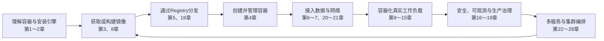
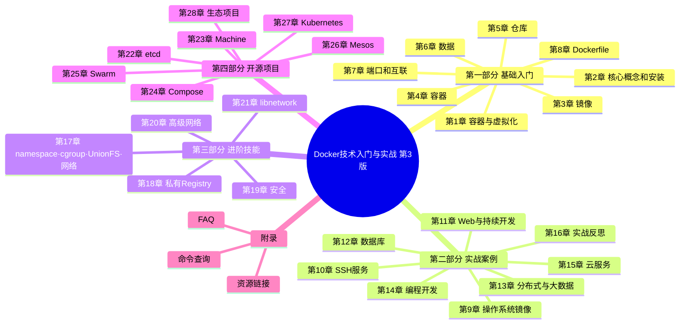
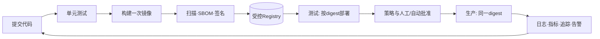
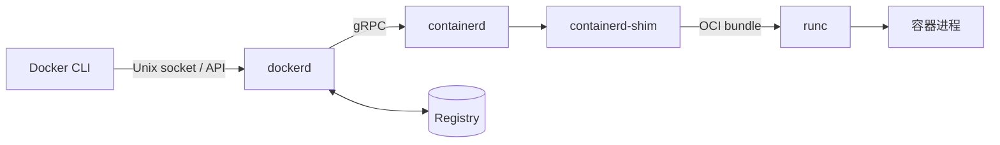
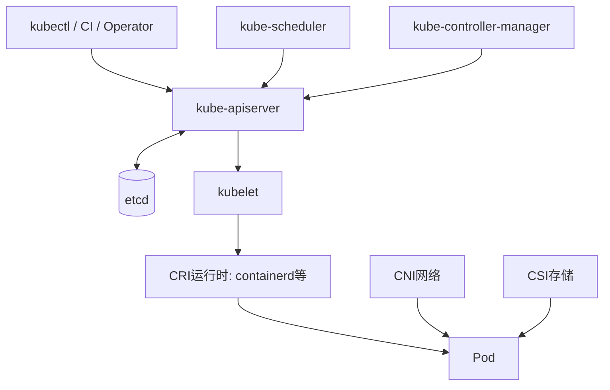

# 《Docker技术入门与实战（第3版）》：从镜像构建到生产编排

> **书目信息**：杨保华、戴王剑、曹亚仑编著，机械工业出版社，2018 年 9 月第 3 版第 1 次印刷，ISBN 978-7-111-60852-3。封面说明本版“基于 Docker 最新 18.x 系列版本”，全书共 424 个 PDF 扫描页、正文 28 章和 3 个附录。
>
> **文本依据**：本文逐页核对用户提供的扫描版 PDF。`【原书】`表示第 3 版直接论述或对其代码做了必要的 OCR、空格和标点修复；`【2026 校订】`来自 2026-08-09 核验的 Docker、Kubernetes、etcd、Apache 等官方资料；`【实践补充】`是为了让示例今天仍可执行而新增的做法。三者不相互冒充。
>
> **阅读提醒**：原书处在 Docker 18.x、Compose V1、etcd v2 API 与 Kubernetes 1.9 左右的技术现场。它关于镜像、容器、Registry、namespace、cgroup 和声明式编排的主线仍然成立，但安装源、命令拼写、基础镜像版本、网络连接方式和生态项目状态必须结合校订阅读。

## 一、全书在解决什么问题

### 1.1 从作者的定义到一个可操作的理解

原书第 1 章先把 Docker 放进虚拟化演进史：从大型机虚拟化，到 Xen、KVM 代表的虚拟机，再到操作系统级容器。作者给出的项目定义很简洁：

> “Docker 是基于 Go 语言实现的开源容器项目。”（第 1.1 节）

但本书真正关心的不是实现语言，而是 Docker 对应用生命周期的重新包装：

> Docker 的构想是实现“Build, Ship and Run Any App, Anywhere”，即管理应用的封装、分发、部署、运行生命周期，达到应用组件级别的“一次封装，到处运行”。（第 1.1 节，排版修复）

内容简介把全书目标表述为：从 Docker 基本原理开始，讲解 Docker 的构建与操作，帮助开发和运维人员快速部署 Docker 应用；四部分依次是基础入门、实战案例、进阶技能和开源项目。

通俗地说，Docker 把“程序 + 运行时依赖 + 默认启动方式”封装成镜像，把镜像启动后的隔离进程称为容器，再通过 Registry 分发镜像。过去迁移一个 LAMP 应用，需要在新主机重新安装、配置和调试 Linux、Apache、MySQL、PHP；容器化后，交付的是经过测试的镜像和外部配置，目标主机只负责按同样方式运行它。

它解决的不是“如何虚拟出另一台电脑”，而是四个更贴近日常交付的问题：

- **环境漂移**：开发、测试、生产从同一镜像启动，减少“我的机器能跑”。
- **分发成本**：镜像分层、内容寻址和 Registry 让应用像代码一样拉取、标记和推送。
- **资源效率**：容器共享宿主机内核，不必为每个应用启动完整 Guest OS。
- **协作边界**：开发维护镜像和启动契约，平台侧维护计算、网络、存储、安全与调度策略。

这个承诺有边界：“到处运行”并不代表任意 CPU 架构、操作系统内核和设备能力都可互换；共享内核也意味着容器隔离通常弱于独立虚拟机。第 19 章自己强调，容器隔离“只是相对的”，不能把容器当作天然安全边界。

### 1.2 四部分其实是一条应用交付链





### 1.3 容器、虚拟机、进程管理和轻量虚拟机怎么选

| 维度 | Docker/OCI 容器 | KVM/VMware 虚拟机 | systemd 直接运行进程 | Firecracker/Kata 等轻量 VM |
| --- | --- | --- | --- | --- |
| 隔离层次 | 操作系统级，进程共享宿主内核 | 硬件级，每个 VM 有 Guest OS | 主要是进程权限与服务管理 | 以 VM 边界承载容器工作负载 |
| 交付物 | 分层 OCI 镜像 | 磁盘镜像/虚拟设备定义 | 二进制、包和配置 | 容器镜像 + 微型 VM 运行时 |
| 启动与密度 | 通常秒级或更快、密度高 | 通常较慢、内存开销大 | 最快、额外开销最低 | 介于容器与传统 VM 之间 |
| 内核兼容 | 依赖宿主内核与 CPU 架构 | 可运行不同 Guest 内核 | 完全依赖宿主 | Guest 内核提供额外兼容与隔离 |
| 安全边界 | 需叠加最小权限、seccomp、LSM 等 | 通常更强，仍需补丁和配置 | 最弱，应用直接面对宿主 | 强于共享内核容器，开销也更高 |
| 可移植与回滚 | Registry、digest、分层缓存很方便 | 镜像大，但环境封装完整 | 易出现依赖与配置漂移 | 兼顾镜像工作流和 VM 隔离 |
| 典型场景 | 微服务、CI、批处理、开发环境 | 多租户、异构 OS、传统整机应用 | 少量稳定的宿主级守护进程 | 不可信工作负载、Serverless 沙箱 |

原书表 1-1 强调容器“秒级、接近原生、MB 级、密度高”，虚拟机“分钟级、GB 级、完全隔离”。这个方向正确，但具体数字不是保证：镜像体积、应用初始化、页缓存、I/O 和安全措施都会改变结果。真正的优势不是单一跑分，而是**把轻量隔离、可重复镜像和统一生命周期 API 合成一条工作流**。需要不同内核或更强租户隔离时，虚拟机仍是合理答案；二者也常叠加使用——在云 VM 中运行容器集群。

## 二、28 章与附录导读

| 顺序 | 标题 | 核心内容 | 本章给出的解决思路 |
| --- | --- | --- | --- |
| 第3版前言 | 容器计算生态的成熟 | 第 3 版围绕 Docker 18.x 更新核心技术与生态项目 | 用新版容器栈连接开发、平台与开源生态 |
| 第1章 | 初识 Docker 与容器 | 容器历史、Docker 定位、价值、与虚拟机比较 | 用操作系统级隔离和镜像工作流改善应用交付 |
| 第2章 | 核心概念与安装配置 | 镜像、容器、仓库；Linux/macOS/Windows 安装 | 用三个对象建立从构建到运行的最小模型 |
| 第3章 | 使用 Docker 镜像 | pull、inspect、search、rm、commit、save/load、push | 管理可复用、可迁移的应用模板 |
| 第4章 | 操作 Docker 容器 | create/run/start/stop/exec/export/inspect/update | 覆盖容器从创建到销毁的生命周期 |
| 第5章 | 访问 Docker 仓库 | Docker Hub、第三方市场、私有 Registry | 集中存储和分发镜像 |
| 第6章 | Docker 数据管理 | 数据卷、数据卷容器、备份和恢复 | 把重要数据移出容器可写层 |
| 第7章 | 端口映射与容器互联 | `-p`/`-P`、容器链接 | 让外部访问服务并让容器互相发现 |
| 第8章 | 使用 Dockerfile 创建镜像 | 指令、构建上下文、多阶段构建、最佳实践 | 把环境构建过程变成可审查的代码 |
| 第9章 | 操作系统 | BusyBox、Alpine、Debian/Ubuntu、CentOS/Fedora | 选择精简且合适的基础镜像 |
| 第10章 | 为镜像添加 SSH 服务 | `commit` 与 Dockerfile 两种构建法 | 演示系统容器的远程管理，同时引出单进程争议 |
| 第11章 | Web 服务与应用 | Apache、Nginx、Tomcat、Jetty、LAMP、GitLab | 容器化中间件和持续开发工具 |
| 第12章 | 数据库应用 | MySQL、Oracle XE、MongoDB、Redis、Cassandra | 通过卷和配置运行有状态服务 |
| 第13章 | 分布式与大数据 | Hadoop、Spark、Storm、Elasticsearch | 快速搭建复杂的多节点实验环境 |
| 第14章 | 编程开发 | C/C++、Java、Python/Flask、Node.js、Go | 用官方镜像隔离语言工具链 |
| 第15章 | 容器与云服务 | AWS、GCP、Azure、国内云与容器云 | 把镜像交付与云资源弹性结合 |
| 第16章 | 容器实战思考 | 成功原因、研发视角、容器化流程、生产边界 | 用镜像贯穿开发、测试和生产，但拒绝“银弹” |
| 第17章 | 核心实现技术 | 架构、namespace、cgroup、UnionFS、虚拟网络 | 解释容器的隔离、限额、分层和连通原理 |
| 第18章 | 配置私有仓库 | Registry、TLS、认证、配置、批量管理、通知 | 建立企业内部可信镜像分发中心 |
| 第19章 | 安全防护与配置 | 隔离、资源、capability、daemon 防护、扫描 | 分层减权、检测和响应，而非相信默认隔离 |
| 第20章 | 高级网络功能 | DNS、访问控制、iptables、网桥、OVS、veth | 从 Linux 网络原语理解端口映射和自定义拓扑 |
| 第21章 | libnetwork 插件化网络 | CNM、network 命令、跨主机网络 | 用驱动和标准模型替代一次性网络脚本 |
| 第22章 | Etcd——高可用的键值数据库 | v2 API、CRUD、watch、集群配置 | 为配置、选主和服务发现保存一致状态 |
| 第23章 | Docker 三剑客之 Machine | 创建、配置和管理远程 Docker 主机 | 自动化主机供应；今天应改用 IaC 工具 |
| 第24章 | Docker 三剑客之 Compose | YAML 模型、命令、变量、Web 和 Spark 案例 | 在单机声明并启动多容器应用 |
| 第25章 | Docker 三剑客之 Swarm | manager/worker、service、滚动更新 | 用 Docker Engine 内置能力管理集群期望状态 |
| 第26章 | Mesos——优秀的集群资源调度平台 | Mesos、ZooKeeper、Marathon、资源 offer | 两级调度共享集群资源；项目现已退役 |
| 第27章 | Kubernetes——生产级容器集群平台 | Pod、Service、Volume、控制器、组件、kubectl、网络 | 用声明式 API 和控制循环管理应用期望状态 |
| 第28章 | 其他相关项目 | CI、UI、SDK、网络、日志、标准和轻量 VM | 展示容器生态如何补齐生产能力 |
| 附录A | 常见问题总结 | 镜像、容器、仓库、配置、虚拟化、网络 FAQ | 将高频故障映射到命令和底层对象 |
| 附录B | Docker 命令查询 | 客户端、资源管理和 `dockerd` 参数 | 作为 Docker 18.x 的命令索引使用 |
| 附录C | 参考资源链接 | 官网、文档、OCI、实践与社区入口 | 建立继续学习的一手资料路径 |

## 三、沿应用生命周期连续精读

### 阶段一：建立容器模型并装好引擎

#### 第1章：Docker 把容器从内核能力变成应用交付产品

本章先说明容器不是 Docker 发明的：`chroot`、FreeBSD Jail、Solaris Containers、OpenVZ、LXC 已经逐步形成文件视图、资源和进程隔离。Docker 的贡献是补上易用性：容器管理工具、分层镜像、Registry 和统一 API。第 16 章把这句话说得更直接——前人走了九十九步，Docker 用覆盖应用全生命周期的简单工作流迈出最后一步。

原书用 LAMP 迁移解释痛点：若应用直接依赖操作系统，换服务器就要重新安装、配置、测试；镜像把这些前置条件固化，容器把应用与平台解耦。它进一步总结更快交付、更高资源利用率、更轻松迁移和更简单更新四项优势。

- **LXC（Linux Containers）**：早期 Linux 容器用户态工具集合；Docker 早期依赖它，后来转向 libcontainer/runc。
- **VMM（Virtual Machine Monitor）/Hypervisor**：创建和管理虚拟机的监控层。
- **DevOps（Development + Operations）**：用自动化、反馈和共同责任缩短从代码到运行服务的周期，不等于购买某个工具。
- **OCI（Open Container Initiative）**：定义镜像和运行时等开放规范，让镜像与运行时不被单一产品锁定。

【纠正·第 1 章】书中“性能提高 1～2 个数量级”“单机数千容器”属于特定测试或极简实例，不能外推为生产承诺。容器的主要收益是少一个 Guest OS 和统一交付；应用本身、存储、网络、日志与安全开销仍然存在。

#### 第2章：镜像、容器、仓库组成最小闭环

作者用三个对象搭建全书词汇表：镜像是只读模板；容器是镜像创建出的运行实例，并在顶部增加可写层；仓库保存同一类镜像的多个标签，Registry 服务器承载多个仓库。可类比为：镜像是类或安装包，容器是运行对象，Registry 是发布制品的服务端。

最小工作流今天仍然有效：

```bash
# 拉取不可变版本；生产中最好进一步固定 digest
docker pull nginx:1.29-alpine

# 创建并后台运行，宿主 8080 映射到容器 80
docker run -d --name web -p 8080:80 nginx:1.29-alpine

docker ps
docker logs web
docker rm -f web
```

原书分别讲 Ubuntu、CentOS、macOS 和 Windows，并推荐 Linux 稳定版；书中使用 `apt-key`、`apt-transport-https`、Docker for Mac/Windows 的旧命名和 18.03 输出。

【2026 校订】官方 Ubuntu 文档已改用 `/etc/apt/keyrings/docker.asc` 与 `docker.sources`，安装包包括 `docker-ce`、`docker-ce-cli`、`containerd.io`、`docker-buildx-plugin`、`docker-compose-plugin`。官方当前列出的受支持 Ubuntu 包括 22.04、24.04、25.10、26.04；便利脚本只建议测试和开发使用。完整步骤见本文第四部分。

### 阶段二：构建、运行、持久化并分发单个容器

#### 第3章：镜像的身份不是标签，而是内容

本章覆盖镜像获取、查看、搜索、删除、创建、导出/载入和上传。几个容易混淆的动作应成对理解：

| 目的 | 命令 | 保留什么 | 常见用途 |
| --- | --- | --- | --- |
| Registry 拉取/推送 | `docker pull` / `docker push` | 镜像层、配置、仓库身份 | 团队和环境间分发 |
| 文件备份/恢复镜像 | `docker save` / `docker load` | 一个或多个完整镜像与标签 | 离线传输 |
| 导出/导入容器文件系统 | `docker export` / `docker import` | 扁平化文件系统，不保留原镜像历史 | 特殊迁移，不适合常规发布 |
| 从容器差异生成镜像 | `docker commit` | 当前可写层变化 | 调试快照；不利于审查和复现 |

```bash
# 【原书命令，现代对象式写法】
docker image pull ubuntu:18.04
docker image inspect ubuntu:18.04
docker image save -o ubuntu_18.04.tar ubuntu:18.04
docker image load -i ubuntu_18.04.tar

# 找出悬空层并清理；执行前先检查
docker image ls --filter dangling=true
docker image prune
```

- **tag（标签）**：可移动的人类可读引用，例如 `app:1.4`；同名标签可以重新指向新内容。
- **digest（摘要）**：由内容计算的不可变标识，例如 `sha256:...`；追求可重复部署时应固定 digest。
- **dangling image**：没有标签引用的镜像层，不等于所有“未使用镜像”。

局限在于：`latest` 只是普通默认标签，不表示语义上的最新或安全；`docker search` 的热度也不等于可信。生产镜像应记录来源、digest、SBOM 和签名，并由漏洞扫描与准入策略守门。

#### 第4章：把容器当作有状态的进程对象管理

容器生命周期可写成：`create → start → running → pause/unpause → stop/kill → exited → rm`。`docker run` 等价于创建后启动；容器的主进程（PID 1）退出，容器即停止。

```bash
# 创建但不启动
docker create --name demo --memory 256m --cpus 0.5 nginx:1.29-alpine
docker start demo

# 观察、进入、复制文件
docker stats demo
docker exec -it demo sh
docker cp demo:/etc/nginx/nginx.conf ./nginx.conf

# 优雅停止；超时后才强制终止
docker stop --time 20 demo
docker rm demo
```

`attach` 连接主进程的标准流，可能把信号直接传给 PID 1；`exec` 在现有容器创建新进程，更适合诊断。`stop` 先发终止信号并等待，`kill` 默认立即发送 `SIGKILL`。容器删除会丢失可写层，所以第 6 章必须紧随其后。

【原书建议】生产环境应设置合理资源限制和重启策略，并在容器之外提供负载均衡与故障切换。今天还要补充健康检查、只读根文件系统、日志限额和优雅终止时间；“自动重启”只能恢复进程，不能修复错误配置、坏数据或依赖故障。

#### 第5章：Registry 是镜像供应链的中心

仓库（repository）是一组相关镜像，Registry 是提供存储与分发 API 的服务。完整名称通常是：

```text
registry.example.com/team/payment:1.4.2
└──── registry ────┘ └ repository ┘ └tag┘
```

```bash
docker login registry.example.com
docker tag payment:1.4.2 registry.example.com/team/payment:1.4.2
docker push registry.example.com/team/payment:1.4.2
```

本章用 `registry:2` 搭建最小私库，第 18 章再加入 TLS、Basic Auth、配置和通知。原书也介绍 Docker Hub 自动构建和国内第三方市场。核心判断仍然有效：公共仓库适合公开制品，企业内部镜像应进入受控私库。

风险不只在“能否拉取”：还包括标签覆盖、凭证泄露、恶意基础镜像、旧依赖和 Registry 单点。至少应启用 TLS、最小权限、不可变标签或 digest、扫描、审计、备份和异地恢复；规模化场景可使用 Harbor 等带项目权限、复制、扫描和策略能力的上层产品。

#### 第6章：容器可以重建，数据必须独立设计

本章用数据卷、数据卷容器和 `tar` 演示共享、备份、恢复。最重要的模型是：**容器可写层跟随容器；卷拥有独立生命周期**。

```bash
docker volume create dbdata

docker run -d --name db \
  --mount type=volume,src=dbdata,dst=/var/lib/mysql \
  -e MYSQL_ROOT_PASSWORD='change-me' mysql:8.4

# 只读挂载更适合消费配置或静态数据
docker run --rm \
  --mount type=volume,src=dbdata,dst=/data,readonly \
  alpine:3.22 ls -la /data
```

- **volume**：由 Docker 管理的持久数据存储，适合数据库和服务状态。
- **bind mount**：把宿主确定路径映射进容器，适合开发源码和必须由宿主直接管理的文件，但耦合主机目录结构。
- **tmpfs**：仅存在内存，容器停止后消失，适合短期敏感数据或缓存。
- **data volume container**：专门提供 `--volumes-from` 的容器；是原书时代常见模式，今天通常改用命名卷。

【2026 校订】Docker 官方把 volume 定义为“由 Docker 创建和管理的持久数据存储”，并称其为容器持久数据的首选机制；`--mount` 比 `-v` 更显式。书中的“数据卷容器”不是必要中间层，直接创建命名卷更清楚。

备份不能只打包目录：数据库需保证一致性，常见方法是逻辑备份、文件系统快照或先短暂停写；备份还必须异机保存并定期演练恢复。RAID 解决设备故障，不等于备份。

#### 第7章：端口发布与服务发现是两件事

`EXPOSE` 只声明镜像预期监听端口，不会自动对宿主开放；`-p` 才创建宿主到容器的发布规则，`-P` 为所有声明端口分配随机宿主端口。

```bash
docker network create app-net
docker run -d --name db --network app-net postgres:17
docker run -d --name api --network app-net -p 127.0.0.1:8080:8080 my-api:1.0

# api 可通过 DNS 名 db 访问数据库；外部只可从本机 8080 进入 api
```

原书后半章使用 `--link` 建立容器关联。它会注入主机名和环境变量，关系是静态、有方向且难以维护。

【纠正·第 7 章】Docker 官方已把 `--link` 列为 legacy。用户自定义 bridge 自动提供容器名 DNS、更好的隔离和动态接入；默认 `bridge` 本身也被官方称为 legacy detail。现代项目应创建自定义网络或由 Compose 自动创建网络。

- **NAT（Network Address Translation）**：把宿主地址/端口转换到容器地址/端口。
- **DNS（Domain Name System）**：这里负责把服务名解析为容器 IP，避免硬编码易变化地址。
- **SDN（Software-Defined Networking）**：把网络控制逻辑从设备转发中抽离，以软件统一配置。
- **NFV（Network Functions Virtualization）**：用软件实例实现防火墙、负载均衡等网络功能。

#### 第8章：Dockerfile 把环境构建变成可审查的代码

Dockerfile 由基础镜像、维护信息、构建指令和启动指令组成。以下根据原书 Nginx 示例做排版修复，并把已经 EOL 的 Ubuntu 版本替换为当前示意值：

```dockerfile
# 【原书示例的现代化改写】
FROM ubuntu:24.04

LABEL org.opencontainers.image.title="nginx-demo"

RUN apt-get update \
    && apt-get install -y --no-install-recommends nginx \
    && rm -rf /var/lib/apt/lists/*

RUN printf '\ndaemon off;\n' >> /etc/nginx/nginx.conf
EXPOSE 80 443
CMD ["nginx"]
```

```bash
docker build -t nginx-demo:1.0 .
docker run --rm -p 8080:80 nginx-demo:1.0
```

最容易混淆的指令：

- `RUN` 在**构建时**生成新层；`CMD`/`ENTRYPOINT` 定义**容器启动时**的命令。
- `COPY` 只复制本地构建上下文；`ADD` 还有自动解压本地 tar、读取 URL 等额外语义，普通复制优先 `COPY`。
- `ARG` 只面向构建过程且不适合保存秘密；`ENV` 进入镜像配置并影响运行时。
- `CMD` 提供可覆盖的默认参数；`ENTRYPOINT` 更适合固定可执行程序，两者可组合。

原书已经介绍多步骤创建（multi-stage build），这是缩小镜像和分离编译/运行依赖的关键：

```dockerfile
FROM golang:1.25 AS build
WORKDIR /src
COPY go.mod go.sum ./
RUN go mod download
COPY . .
RUN CGO_ENABLED=0 go build -trimpath -o /out/server ./cmd/server

FROM gcr.io/distroless/static-debian12:nonroot
COPY --from=build /out/server /server
USER nonroot:nonroot
ENTRYPOINT ["/server"]
```

高质量构建还要做到：固定基础镜像版本/digest；用 `.dockerignore` 缩小上下文；合并相关 `RUN` 并清缓存；非 root 运行；不把密钥写进层；利用 BuildKit secret/cache mount；为镜像生成 SBOM 并持续扫描。层数不是唯一目标，可读性、缓存命中、补丁能力和最小攻击面需要一起权衡。

### 阶段三：把操作系统、服务和开发工具装进容器

#### 第9章：基础镜像不是越小越好，而是越合适越好

本章依次演示 BusyBox、Alpine、Debian/Ubuntu、CentOS/Fedora。作者的选择原则是：官方镜像通常精简，适合作为基础；第三方镜像可能方便，但质量需要判断。

| 镜像家族 | 特点 | 适用场景 | 常见代价 |
| --- | --- | --- | --- |
| BusyBox | 把许多 Unix 工具压进单个可执行文件 | 网络/挂载测试、极简辅助容器 | 工具行为和完整发行版有差异 |
| Alpine | 小、以 musl libc 和 BusyBox 为核心 | 对 musl 兼容良好的服务、工具镜像 | 原生扩展、glibc 假设、调试体验可能踩坑 |
| Debian/Ubuntu | glibc 生态完整、软件丰富 | 通用应用、需要 apt 生态的构建 | 体积通常更大，必须及时更新 |
| RHEL 系 | 企业生态、rpm/dnf 工具链 | 与 RHEL 生产体系一致的应用 | 原书 CentOS/Fedora 标签与今天生命周期不同 |
| distroless/scratch | 仅保留运行必需文件 | 静态编译或依赖明确的生产服务 | 容器内几乎无法交互调试 |

```bash
docker run --rm busybox:1.37 echo hello
docker run --rm alpine:3.22 cat /etc/alpine-release
docker run --rm ubuntu:24.04 cat /etc/os-release
```

【2026 校订】原书的 Debian Jessie、Ubuntu 16.04/18.04 和旧 CentOS 标签已不适合作为新项目默认值。选择镜像时应同时看维护周期、CPU 架构、libc、签名、漏洞、软件源与团队排障能力。小镜像减少传输和部分攻击面，却不会自动消除应用漏洞；若为兼容性额外安装大量包，Alpine 甚至可能不再更小。

#### 第10章：SSH 示例的真正价值是划清应用容器与系统容器

本章分别用 `docker commit` 和 Dockerfile 创建带 SSH 服务的 Ubuntu 镜像，映射 22 端口后远程登录。它最后主动呈现争论：应用容器强调一个职责并通过 `docker exec`、日志和编排系统管理；系统容器希望像小型操作系统那样允许管理员登录。

【原书方法的核心步骤】是安装 `openssh-server`、创建运行目录、设置认证、暴露 22 端口并启动 `sshd`。这能帮助理解端口、进程和镜像构建，但不应成为普通 Web/后台服务的默认模板。

```bash
# 应用容器的临时诊断通常不需要 sshd
docker exec -it api sh
docker logs --since 10m api
docker inspect api
```

SSH 会增加常驻进程、账户、密钥、端口与补丁面，而且鼓励进入容器手改，导致运行状态偏离镜像。生产诊断应优先使用结构化日志、指标、追踪、只读调试容器或 Kubernetes ephemeral container。确实要运行“系统容器”时，应明确它的 init、用户、密钥轮换、审计和升级责任，而不是把应用容器偷偷变成虚拟机。

- **sshd**：OpenSSH 服务端守护进程。
- **PID 1**：容器命名空间中的首进程，负责接收信号并收割孤儿/僵尸子进程；普通应用需要正确处理这一角色。
- **immutable infrastructure**：通过重建和替换制品变更环境，而不是登录服务器原地修改。

#### 第11章：Web 中间件展示“无状态服务优先容器化”

本章从 Apache、Nginx、Tomcat、Jetty 到 LAMP，再延伸到持续开发与 GitLab。作者指出中间件适合容器化：需要批量部署；剥离配置、日志和代码目录后可写层增长少；又容易通过负载均衡组成集群。

原书 Apache 官方镜像示例非常接近今天的写法：

```dockerfile
FROM httpd:2.4
COPY ./public-html/ /usr/local/apache2/htdocs/
```

```bash
docker build -t static-site:1.0 .
docker run -d --name site -p 8080:80 static-site:1.0
```

在更完整的 Web 服务中，应把四类数据分开：应用代码进入不可变镜像；非敏感配置由环境变量或配置文件挂载；密码/令牌由 secret 系统注入；访问日志输出到 stdout/stderr，由平台采集。不要把数据库文件、上传文件和关键日志留在可写层。

【纠正·第 11 章】书中很多容器通过脚本同时启动 SSH、Web 和其他服务，这是教学时代的常见写法。现代微服务通常把不同生命周期的进程拆为不同容器；若 Nginx 与应用必须强耦合，可用同一 Pod/任务组，但仍分别管理进程、健康检查和资源。

#### 第12章：数据库可以容器化，但持久化不是唯一难题

本章覆盖关系型 MySQL/Oracle XE 与 NoSQL MongoDB、Redis、Cassandra。作者明确建议把数据库文件映射到宿主或卷，以减少可写层代价并实现持久化。

下面是把书中 MySQL 思路改成更安全的 Compose 片段；密码从环境文件读取只是入门做法，生产应使用 secrets：

```yaml
services:
  db:
    image: mysql:8.4
    environment:
      MYSQL_ROOT_PASSWORD: ${MYSQL_ROOT_PASSWORD:?set it in .env}
      MYSQL_DATABASE: app
    volumes:
      - mysql-data:/var/lib/mysql
    healthcheck:
      test: ["CMD", "mysqladmin", "ping", "-h", "localhost"]
      interval: 10s
      timeout: 5s
      retries: 10

volumes:
  mysql-data:
```

有状态服务还需要回答：写入一致性如何保证？备份和时间点恢复是否演练？升级能否跨数据格式？节点身份、拓扑、IOPS、延迟和故障域怎样安排？因此“能启动官方镜像”只是第一步。开发、测试和单节点服务很适合容器；关键生产数据库可由成熟 Operator/托管数据库管理，或保留在 VM/物理机，取决于团队能力而不是潮流。

- **SQL（Structured Query Language）**：关系数据库查询语言；“SQL 数据库”通常强调表、关系和事务。
- **NoSQL（Not Only SQL）**：键值、文档、列族等非关系模型的统称，不等于没有结构或事务。
- **RPO/RTO**：可接受的数据丢失窗口/恢复时长，是备份架构的业务目标。

#### 第13章：容器让分布式系统易于复现，但不会消除分布式复杂性

Hadoop、Spark、Storm、Elasticsearch 的共同点是：依赖多角色、多端口和一致配置，手工搭实验集群成本高。原书用镜像和容器快速创建节点，展示容器在教学、集成测试和临时计算集群中的价值。

容器适合封装二进制和配置，Compose/Kubernetes 适合声明节点关系；但集群仍要处理数据复制、选主、分区、背压、拓扑、JVM/堆外内存、磁盘水位和滚动升级。把多个进程放进容器并不自动得到高可用。

【2026 校订】Storm 在实时流处理中的行业热度已明显让位于 Flink、Kafka Streams 等方案；Elasticsearch 镜像、许可、JVM 参数和引导检查也已多次变化。原书命令适合理解部署结构，实际安装必须以目标版本官方文档为准。不要把旧 `latest` 标签和旧默认密码带入生产。

一个可迁移的实验原则是：

1. 固定每个组件版本和配置；
2. 为角色使用稳定服务名，不写死容器 IP；
3. 把数据、检查点和日志显式挂载；
4. 注入故障并验证恢复，而不只验证“进程都起来了”；
5. 实验结束可一键销毁，但数据是否销毁必须单独确认。

#### 第14章：把编译器和 SDK 也当作项目依赖

本章覆盖 C/C++、Java、Python（官方镜像、PyPy、Flask）、JavaScript/Node.js 和 Go。核心价值是：开发者不用污染主机就能切换工具链，CI 与本地也能从同一构建镜像开始。

```bash
# 临时运行不同语言工具链
docker run --rm -v "$PWD:/work" -w /work python:3.13 python app.py
docker run --rm -v "$PWD:/work" -w /work node:24 npm test
docker run --rm -v "$PWD:/work" -w /work golang:1.25 go test ./...
```

这类 bind mount 示例适合开发，却要留意宿主文件所有权、缓存目录和依赖下载凭证。CI 中应把工具链镜像固定到版本/digest，缓存应是可丢弃加速层，秘密通过 CI secret 或 BuildKit secret 注入。

【实践补充】现代开发还可用 Dev Container 规范描述编辑器、扩展、端口和启动任务；它解决“交互式开发环境”，Dockerfile 解决“制品构建”，Compose 解决“多服务依赖”，三者职责不同。

#### 第15章：容器与云结合后，交付物和基础设施可以分别演进

原书逐一介绍 AWS、Google Cloud Platform、Azure、腾讯云、阿里云、华为云、UCloud，以及阿里云容器服务、时速云等容器云。作者总结三项收益：持续交付更快、服务器资源利用更高、应用迁移和扩展更方便。

八年后的结构更清晰：

- **IaaS + Docker Engine**：团队管理 VM、引擎、网络、补丁与备份，自由度高、运维责任也最大。
- **托管 Kubernetes**：云厂商管理部分控制平面，团队仍管理工作负载、节点策略、网络、存储和成本。
- **Serverless Container**：提交镜像和资源参数，平台按请求或任务运行，减少集群管理但有平台约束。
- **PaaS**：提交代码或镜像，平台进一步管理路由、伸缩、证书和运行时。

“镜像可移植”不等于云无关：负载均衡、IAM、对象存储、数据库、日志和网络策略常带有厂商语义。应把真正需要可移植的应用契约与有意采用的托管服务分别记录，而不是为了抽象而拒绝所有云能力。

【纠正·第 15 章】书中的产品入口、截图和 Docker Cloud 等服务属于 2018 年状态，不能作为今天采购依据。选择服务时应重新核验区域、SLA、版本、镜像仓库、网络、数据合规、退出成本和价格。

### 阶段四：让镜像贯穿研发流程，而不是成为新的手工作业

#### 第16章：容器成功在工作流，生产成功在工程纪律

这是全书承上启下的一章。作者认为 Docker 成功的核心是易用性：把早已存在的 cgroup、namespace、分层文件系统包装成拉取、打包、运行和维护的一致流程；Dockerfile/Compose 文件又成为开发与运维共同维护的可读契约。

原书对传统流程的批评是：开发、测试、生产三个环境和开发、测试、运维三个团队之间存在大量人工交接，环境不一致让同一工作重复多次。容器化流程把基础镜像和 Dockerfile 提前定义，测试拿到的是与开发相同的镜像，生产再部署同一制品。



书中已经警告“不要把容器当作银弹”，并把 12-factor 无状态应用视为平滑迁移对象，对传统数据库、有状态应用和高网络吞吐应用持谨慎态度。今天需要把这个判断再细化：有状态服务并非天然不能容器化，但它们需要稳定身份、持久卷、拓扑、备份、恢复和升级控制器，收益与团队成熟度必须覆盖额外复杂性。

一个生产镜像应满足：可重复构建、版本可追溯、以 digest 晋级而非各环境重建、非 root、只读优先、资源限制、健康检查、优雅退出、结构化可观测、漏洞修补 SLA、备份恢复演练。容器只是这些实践的载体，不会自动提供它们。

### 阶段五：下钻运行时、供应链、安全与网络

#### 第17章：namespace 隔离视图，cgroup 分配资源，分层文件系统承载镜像

本章给出 Docker 18.x 的基本调用链：客户端通过 REST API 访问 `dockerd`，后者调用 `containerd`，再由 `runc` 按 OCI 规范创建容器；`containerd-shim` 让容器进程与上层守护进程解耦。Registry 则在另一侧提供镜像分发 API。



不要把四个内核/运行时概念混成“容器技术”：

1. **namespace 决定看见什么**。PID 隔离进程编号，IPC 隔离消息队列/共享内存，NET 提供独立网卡、路由、端口和防火墙视图，MNT 隔离挂载树，UTS 隔离主机名，USER 映射用户与权限。现代内核还包括 cgroup/time 等 namespace。
2. **cgroup 决定能用多少**。对 CPU、内存、PIDs、I/O 等进行统计、权重、上限和控制，避免一个容器拖垮主机。
3. **capability/seccomp/LSM 决定能做什么系统操作**。namespace 不是权限系统，资源限额也不是访问控制。
4. **联合/分层文件系统决定文件如何组合**。只读镜像层叠加为 rootfs，容器顶部是可写层；修改已有文件时发生 copy-on-write。

原书手工网络实验很有教学价值：用 `--net=none` 启动容器，取容器 PID，把 `/proc/$pid/ns/net` 链接到 `/var/run/netns`，创建 veth pair，一端接 `docker0`，另一端移入容器 namespace，再配置地址与默认路由。这揭示了默认 bridge 的实质：

```text
容器 eth0 ←→ veth pair ←→ Linux bridge ←→ iptables/nftables/NAT ←→ 外部网络
```

- **veth pair（virtual Ethernet pair）**：成对虚拟网卡，一端收到的帧从另一端出现，常用于连接 namespace。
- **rootfs**：进程看到的根文件系统，不等于独立磁盘。
- **copy-on-write（写时复制）**：共享只读层，首次修改时把内容复制到可写层。
- **gRPC**：基于 HTTP/2 和接口定义的远程调用框架，containerd 暴露此类 API。
- **runc**：OCI Runtime Specification 的参考实现之一，负责创建 namespaces、cgroups、挂载并启动进程。

【2026 校订】原书展示的是 cgroup v1 文件树和 AUFS/Device Mapper 时代。现代主流 Linux 大量使用统一层级的 cgroup v2，控制文件名与语义不同；Docker Linux 默认存储驱动通常是 `overlay2`，新安装也在演进到 containerd image store。排障时先以 `docker info`、`mount` 和 `/sys/fs/cgroup` 的实际输出确认，不要照抄旧路径。

另外，直接把 `dockerd` 暴露到无 TLS 的 TCP 端口相当危险；访问 Docker socket 通常具有近似 root 的主机控制能力。远程管理应使用 SSH context 或双向 TLS，并限制授权面。

#### 第18章：私有 Registry 必须像生产数据库一样运营

第 5 章只搭最小 Registry，本章增加两种部署方式、TLS、访问认证、配置文件、批量脚本和 webhook 通知。一个最小的 TLS 私库示意如下：

```yaml
services:
  registry:
    image: registry:2
    restart: unless-stopped
    ports:
      - "5000:5000"
    environment:
      REGISTRY_HTTP_TLS_CERTIFICATE: /certs/domain.crt
      REGISTRY_HTTP_TLS_KEY: /certs/domain.key
      REGISTRY_AUTH: htpasswd
      REGISTRY_AUTH_HTPASSWD_REALM: Registry Realm
      REGISTRY_AUTH_HTPASSWD_PATH: /auth/htpasswd
    volumes:
      - registry-data:/var/lib/registry
      - ./certs:/certs:ro
      - ./auth:/auth:ro

volumes:
  registry-data:
```

原书提醒私库的性能与稳定性会影响整个开发部署流程，建议负载均衡、容错和 HTTPS；这个判断至今重要。但复制多个实例前要确认后端对象存储、一致配置、上传状态、垃圾回收和负载均衡行为，不能把本地目录简单复制成“高可用”。

通知系统可在 push/delete manifest 等事件发生时调用外部服务，适合触发扫描、索引和部署流水线。接收端必须验证来源、幂等处理、重试并持久化事件，否则一次网络抖动就会让供应链状态分叉。

【实践补充】裸 Registry API 解决存储与分发，不完整解决组织权限、漏洞扫描、镜像复制、保留策略、签名和审计。企业常在其上使用 Harbor 或云厂商 Registry。无论产品如何，恢复演练、不可变引用和凭证轮换都不可省略。

#### 第19章：容器安全是一组互相补位的控制

本章从 namespace、cgroup、Linux capability、Docker daemon 防护和第三方扫描讲安全，最后给出最重要的结论：容器隔离只是相对的，技术控制还必须配合流程、监控和响应。

按攻击路径组织防护比堆工具更清楚：

| 风险面 | 控制措施 | 失效时的后果 |
| --- | --- | --- |
| 镜像供应链 | 可信基础镜像、digest、SBOM、签名、扫描、准入 | 恶意或脆弱代码进入环境 |
| 运行身份 | 非 root、USER namespace/rootless、禁特权、减少 capability | 容器进程获得不必要的内核权限 |
| 系统调用 | 默认 seccomp、AppArmor/SELinux、只读根文件系统 | 漏洞可调用高风险内核接口或改写系统 |
| 资源耗尽 | memory/CPU/PIDs/I/O 限制 | 邻居和宿主被 OOM、fork bomb 或 I/O 挤占 |
| 网络 | 最小端口、独立网络、NetworkPolicy/防火墙、mTLS | 横向移动和数据外泄 |
| daemon/socket | 不挂载 Docker socket、SSH/mTLS、授权插件、审计 | 容器直接控制宿主或其他容器 |
| 秘密 | secret manager、短期凭证、轮换、不进镜像/环境转储 | 凭证被层历史、日志或 inspect 泄露 |

```yaml
# Compose 中的最小权限示意
services:
  api:
    image: registry.example.com/app/api@sha256:REPLACE_ME
    read_only: true
    user: "10001:10001"
    cap_drop: ["ALL"]
    security_opt:
      - no-new-privileges:true
    tmpfs:
      - /tmp:size=64m,mode=1777
    pids_limit: 200
```

- **capability**：把传统 root 全权拆为多项能力；`CAP_SYS_ADMIN` 范围尤其广，不应随意添加。
- **seccomp（secure computing mode）**：过滤进程可调用的系统调用。
- **LSM（Linux Security Modules）**：SELinux、AppArmor 等强制访问控制框架。
- **rootless**：daemon 和容器不以宿主 root 运行，降低部分逃逸后果，但功能和性能有边界。
- **CVE（Common Vulnerabilities and Exposures）**：公开漏洞编号；扫描发现 CVE 不等于自动判断可利用性和业务风险。

【纠正·第 19 章】书中的 Docker Bench 与 Clair 仍有历史价值，但扫描器不是一次性通关证书。镜像构建后可能出现新 CVE，运行环境也可能与扫描清单不同；需要持续重扫、修补时限、例外审批和运行时监测。

#### 第20章：从 Linux 网络栈理解 Docker 的“魔法”

本章讲 daemon 网络参数、DNS/主机名、容器访问控制、端口映射的 iptables 实现、默认与自定义网桥、Open vSwitch 和点到点连接。

`-p 8080:80` 背后至少包含监听地址、DNAT/转发、回包连接跟踪和可能的 userland proxy。一个常被忽略的安全边界是绑定地址：

```bash
# 对所有接口开放
docker run -p 8080:80 nginx

# 只允许宿主本机访问
docker run -p 127.0.0.1:8080:80 nginx
```

Docker 官方 2026 Ubuntu 安装文档特别警告：发布容器端口可能绕过 ufw/firewalld 的预期规则；自定义过滤应放在 `DOCKER-USER` 链，并理解 Docker 对 iptables/ip6tables 的管理。不要看到 `ufw deny 8080` 就假设端口一定不可达，应从外部主机实测。

原书的 OVS 和 veth 实验适合学习拓扑，但手工改 iptables/网桥容易与 daemon 自动规则冲突。生产环境应把期望状态交给一种明确控制面：Docker network、CNI 插件或平台 SDN，而不是同时由脚本、daemon 和运维手改。

- **DNAT/SNAT**：修改目标/源地址的网络地址转换。
- **conntrack**：内核连接跟踪，为 NAT 和有状态防火墙维护流状态。
- **OVS（Open vSwitch）**：可编程虚拟交换机，支持 VLAN、隧道、OpenFlow 等。
- **MTU（Maximum Transmission Unit）**：单个链路帧可承载的最大三层包；overlay 额外封装会降低有效 MTU。

#### 第21章：libnetwork 用模型和驱动统一容器网络

原书从 Docker 1.7 后的 libnetwork 讲起，核心是 CNM（Container Network Model）：

- **Sandbox**：容器的网络栈/网络命名空间。
- **Endpoint**：把 Sandbox 接入某个 Network 的接口。
- **Network**：允许一组 Endpoint 互通的逻辑网络。
- **Driver**：实现 bridge、overlay、macvlan 等网络行为。

```bash
docker network create --driver bridge app-net
docker run -d --name redis --network app-net redis:8
docker run --rm --network app-net busybox nslookup redis
docker network inspect app-net
```

本章还构建跨主机网络。今天要区分两套边界：Docker Engine/Swarm 仍使用 libnetwork/CNM；Kubernetes 通常通过 CNI（Container Network Interface）插件配置 Pod 网络。二者都把网络实现插件化，但对象模型和调用契约不同，不能把 CNM 驱动配置直接当成 Kubernetes CNI 配置。

跨主机网络的局限来自封装开销、MTU、路由规模、加密、策略和故障定位。选择 overlay、BGP 路由或云 VPC 原生模式时，应以规模、性能、地址管理和可观测能力衡量，而不是只看“能 ping 通”。

### 阶段六：从单机多服务走向集群控制面

#### 第22章：etcd 保存的是控制面的真相，不是任意业务大数据

原书把 etcd 描述为 CoreOS 团队发起的高可用键值数据库，演示 v2 HTTP API 的 CRUD、目录、TTL、watch、成员和集群参数，并与 ZooKeeper 比较。其关键能力是基于一致性协议维护小而关键的状态，适合服务发现、配置和选主。

```bash
# 【2026 实践补充：etcdctl v3】
export ETCDCTL_API=3
etcdctl --endpoints=https://etcd-1:2379 \
  --cacert=ca.crt --cert=client.crt --key=client.key \
  put /apps/payment/config '{"logLevel":"info"}'

etcdctl --endpoints=https://etcd-1:2379 \
  --cacert=ca.crt --cert=client.crt --key=client.key \
  get /apps/payment/config
```

- **Raft**：通过领导者、日志复制和多数派提交实现一致状态机的共识算法。
- **lease（租约）**：为键绑定可续期的生命周期，适合临时注册和锁。
- **watch**：从某个修订版本持续观察键变化，客户端必须处理断线和历史压缩。
- **quorum（法定多数）**：多数成员可用才可安全提交；三节点容忍一个故障，五节点容忍两个。

【纠正·第 22 章】书中 `curl` 的 `/v2/keys` 接口不应再作为新系统教程。2026 官方文档主线是 etcd 3.6 和 v3 API。etcd 不适合保存大对象、高吞吐日志或无界队列；慢磁盘和长暂停会直接影响控制面。必须配置 TLS、定期快照、异机备份、压缩/碎片整理，并实际演练从快照恢复。

#### 第23章：Docker Machine 体现了主机自动化，也已经完成历史使命

Machine 用统一驱动在 VirtualBox、云平台或远程主机上创建 Docker Engine，设置证书与 `DOCKER_HOST` 环境变量。原书认为它比手工安装多个 Docker 主机更快、更不易出错，并建议也可考虑 Ansible。

典型旧工作流是：

```bash
# 【原书时代，不建议新项目采用】
docker-machine create --driver virtualbox dev
eval "$(docker-machine env dev)"
docker info
```

【2026 校订】Docker Machine GitHub 仓库于 2025-07-18 被所有者归档并设为只读。今天按目标选择替代方案：本地使用 Docker Desktop/Colima/Lima；云主机用 Terraform/OpenTofu；主机配置用 cloud-init、Ansible；远程连接已有 Engine 用 Docker Context；集群节点供应由托管 Kubernetes 或 Cluster API 等工具负责。

本章仍有可迁移价值：**基础设施应可重复供应，连接信息不应靠人工复制，主机差异应进入版本控制**。淘汰的是具体工具，不是自动化目标。

#### 第24章：Compose 是多容器应用的可执行说明书

本章最详细地讲 Compose 模板、命令、环境变量，并用 Web 负载均衡和 Spark 集群演示。Compose 的价值是把服务、镜像、构建、命令、端口、网络、卷和依赖关系集中到 YAML。

```yaml
services:
  web:
    build: ./web
    ports:
      - "8080:8080"
    environment:
      DATABASE_URL: postgres://app:${DB_PASSWORD}@db:5432/app
    depends_on:
      db:
        condition: service_healthy
    networks: [frontend, backend]

  db:
    image: postgres:17
    environment:
      POSTGRES_USER: app
      POSTGRES_PASSWORD: ${DB_PASSWORD:?required}
      POSTGRES_DB: app
    volumes:
      - pgdata:/var/lib/postgresql/data
    healthcheck:
      test: ["CMD-SHELL", "pg_isready -U app -d app"]
      interval: 5s
      timeout: 3s
      retries: 20
    networks: [backend]

networks:
  frontend:
  backend:

volumes:
  pgdata:
```

```bash
docker compose config       # 展开变量并检查最终模型
docker compose up -d --build
docker compose ps
docker compose logs -f web
docker compose down         # 默认保留命名卷
# docker compose down -v    # 会删除卷；确认数据不要后再执行
```

【2026 校订】原书使用 Python 实现的 `docker-compose` V1 和顶层 `version:`。官方现在推荐 Docker CLI 插件，命令是空格形式 `docker compose`；Linux 仓库包名为 `docker-compose-plugin`。现代 Compose Specification 通常不再需要 `version:`。

`depends_on` 只表达启动依赖，配合健康条件也不等于业务就绪和故障恢复；应用仍应重试依赖连接。Compose 适合本地开发、CI、单机或简单服务器；跨主机调度、自愈、滚动升级和细粒度策略应交给 Swarm/Kubernetes 等编排器。

#### 第25章：Swarm 用服务期望状态管理一组 Docker Engine

原书介绍 Docker 1.12 后内置的 Swarm mode：manager 通过 Raft 维护集群状态，worker 执行 task，service 声明镜像、副本、网络、更新和回滚策略。管理器不断把实际副本数拉回期望值。

```bash
# manager
docker swarm init --advertise-addr 10.0.0.10

docker service create \
  --name web \
  --replicas 3 \
  --publish published=80,target=80 \
  nginx:1.29-alpine

docker service update \
  --image nginx:1.29-alpine \
  --update-parallelism 1 \
  --update-delay 10s \
  web

docker service ps web
```

- **manager/worker**：前者维护期望状态并调度，后者运行任务；manager 也可配置为不承载业务。
- **service/task**：service 是声明，task 是一次具体容器执行槽位。
- **overlay network**：跨主机逻辑二层网络，Swarm 管理地址和服务发现。
- **routing mesh**：任一节点接收发布端口流量，再路由到实际 task。

【2026 校订】Docker 官方当前仍把 Swarm mode 内置在 Engine，并明确区分已不再积极开发的 Classic Swarm。它适合希望保持 Docker 原生体验且需求相对简单的团队；Kubernetes 生态、扩展对象和托管服务更丰富，但复杂度也更高。选择应基于规模、生态集成、团队能力和运维成本，而不是把“功能更多”等同于“更适合”。

#### 第26章：Mesos 的两级调度思想仍值得读，项目本身已经退役

Mesos 把集群 CPU、内存等抽象成资源池：master 向 framework scheduler 发出 resource offer，framework 决定接受哪些资源并启动任务；Marathon 提供长运行服务管理，ZooKeeper 支持 master 高可用。两级调度让不同计算框架共享同一集群。

- **resource offer**：master 把某 agent 可用资源提议给 framework，而不是直接替应用做全部调度决策。
- **framework**：由 scheduler 和 executor 等构成的 Mesos 应用框架，如早期 Spark、Marathon。
- **two-level scheduling**：平台分资源、框架选任务的两级决策模型。

【纠正·第 26 章】Apache 官方已把 Mesos 放入 Apache Attic；Attic 表示项目到达生命周期终点。不要按原书编译和新建生产 Mesos 集群。历史系统应制定迁移和知识保全计划；新项目通常评估 Kubernetes、Nomad、云批处理或专用数据平台。

本章值得保留的不是命令，而是调度问题：资源所有权在哪一层？全局公平与应用局部性如何平衡？调度器故障是否影响已运行任务？这些问题同样存在于现代平台。

#### 第27章：Kubernetes 用 API 对象和控制循环管理期望状态

这是原书开源项目部分篇幅最长的一章，依次讲简介、核心概念、资源对象、控制器、快速体验、etcd/API Server/Scheduler/Controller Manager/Kubelet/Kube-proxy、kubectl 和网络。

最小心智模型：用户向 API Server 提交对象；对象持久化到 etcd；控制器发现“实际状态 ≠ 期望状态”并创建/修复资源；调度器为未绑定 Pod 选择节点；kubelet 在节点调用容器运行时；网络和存储插件提供连通与卷。



原书 Pod 示例经 API 版本和格式修复后如下：

```yaml
apiVersion: v1
kind: Pod
metadata:
  name: nginx-test
spec:
  containers:
    - name: nginx
      image: nginx:1.29-alpine
      ports:
        - containerPort: 80
```

生产通常不直接管理裸 Pod，而用 Deployment 等控制器：

```yaml
apiVersion: apps/v1
kind: Deployment
metadata:
  name: web
spec:
  replicas: 3
  selector:
    matchLabels: { app: web }
  template:
    metadata:
      labels: { app: web }
    spec:
      containers:
        - name: web
          image: nginx:1.29-alpine
          resources:
            requests: { cpu: 100m, memory: 64Mi }
            limits: { memory: 128Mi }
          readinessProbe:
            httpGet: { path: /, port: 80 }
          livenessProbe:
            httpGet: { path: /, port: 80 }
```

- **Pod**：共享网络和部分存储的最小调度单元，不是永久主机。
- **Service**：为一组动态 Pod 提供稳定虚拟地址和发现入口。
- **Deployment/StatefulSet/DaemonSet**：分别管理无状态副本、有稳定身份的副本、每节点副本。
- **reconciliation（调谐）**：控制器持续比较期望与实际并采取动作，不是只执行一次脚本。
- **CRI/CNI/CSI**：容器运行时、网络、存储接口，把 Kubernetes 与具体实现解耦。

【2026 校订】原书围绕 Kubernetes 1.8/1.9，包含已废弃 API、直接使用 Docker 的旧架构和早期 Flannel 描述。现代 Kubernetes 已移除 dockershim，常通过 CRI 调用 containerd/CRI-O；Deployment 使用 `apps/v1`。任何清单都应针对目标集群版本运行 server-side validation，并阅读弃用说明。Kubernetes 解决调度与调谐，不自动解决应用架构、数据一致性、安全、成本和可观测性。

#### 第28章：生态项目的名字会更替，能力地图更稳定

本章按能力介绍 Drone/Jenkins 等持续集成，Portainer/Panamax/Seagull 等容器管理，SDK，Pipework/Flannel/Weave/Calico 网络，日志代理，OCI 标准和轻量虚拟化。个别项目已停更或定位变化，但能力缺口仍然存在：

| 能力 | 原书代表 | 今天阅读时应关注 |
| --- | --- | --- |
| CI/CD | Drone、Jenkins | 制品一次构建、供应链证明、渐进发布 |
| 管理界面 | Portainer、Panamax、Seagull | RBAC、审计、多集群、策略而非只看 UI |
| 网络 | Pipework、Flannel、Weave、Calico | CNI、NetworkPolicy、eBPF、加密与可观测 |
| 日志 | Logspout 等 | stdout 采集、结构化字段、保留与敏感数据 |
| 标准 | OCI | Image/Runtime/Distribution 规范与兼容性测试 |
| 强隔离 | Hyper、轻量 VM 思路 | Kata Containers、Firecracker、gVisor 等不同边界 |

作者认为 Docker 在云计算和 DevOps 中的“杀手级应用”来自生态协作。今天应把项目名换成能力问题来评估：谁构建并证明镜像？谁分发？谁调度？谁提供网络/存储？谁执行策略？谁收集遥测？谁负责升级和灾备？这样即使工具退役，架构判断仍可迁移。

### 阶段七：把附录当作排障索引，而不是静态答案

#### 附录A：FAQ 的问题仍好，部分答案需要换代

附录 A 按镜像、容器、仓库、配置、虚拟化和网络整理常见问题，涉及批量备份镜像、清理、PID/IP 查询、资源限制、Registry/Repository/Index 区别、daemon 配置和 namespace 排障。

几条今天仍值得保留的诊断命令：

```bash
docker image ls
docker container ls -a
docker inspect --format '{{.State.Pid}}' <container>
docker system df -v
docker image ls --filter dangling=true
docker container ls -a --filter status=exited
```

执行清理前要逐项查看对象。`docker system prune --volumes` 会扩大到卷，可能删除尚未被容器引用但仍有业务价值的数据；不能把 FAQ 中的批量 `rmi -f` 当作日常维护脚本。

【纠正·附录 A】以下旧答案不可直接照搬：用 AUFS `graph` 目录解释所有镜像存储；用 `-g` 改 Docker 根目录；靠复制整个 `/var/lib/docker` 在不同版本/驱动之间迁移；认为固定容器 IP 只能手工改 namespace；为 HTTP 代理只编辑旧 `/etc/default/docker`。今天应优先使用 `daemon.json`/systemd drop-in、`data-root`、用户自定义网络/IPAM、Registry 重新拉取镜像和应用级数据备份。

#### 附录B：命令表要通过本机帮助与官方 reference 二次确认

附录 B 区分 `docker` 客户端和 `dockerd` 服务端，列出 container/image/network/node/plugin/secret/service/stack/swarm/system/trust/volume 等管理命令，以及 TLS、存储、网络、日志和运行时参数。它准确展示了 Docker 18.x 的对象式 CLI 结构。

```bash
docker --help
docker container --help
docker image --help
docker network --help
docker volume --help
dockerd --help
docker version
docker info
```

参数会随版本、操作系统和实验特性变化。教程应解释对象与风险，参数全集交给当前 CLI reference；尤其不要只为“命令能连上”就把 daemon 监听到 `0.0.0.0`，也不要随意切换存储驱动或直接操作 `/var/lib/docker` 内部文件。

#### 附录C：优先沿官方入口继续学习

原书列出 Docker 官网、博客、文档、Hub、Moby、OCI、SDK/API、Dockerfile 实践、社区等入口。部分旧 URL 路径和 IRC/Freenode 社区已经变化，本文末尾给出 2026-08-09 可访问或已核验的一手来源。

## 四、2026 年可执行的环境搭建与验证

> 本节是`【2026 实践补充】`，根据 2026-08-09 下载的 Docker 官方 Ubuntu 安装页与 Compose 插件页整理。命令没有在本文所在 Windows 主机上实际安装执行；应在新建的受支持 Ubuntu 64 位主机中运行。官方当前示例版本为 Docker CE 29.7.2，但本文不把补丁号硬编码为系统要求。

### 4.1 准备一台受支持的 Ubuntu

官方当前列出 Ubuntu 22.04 LTS、24.04 LTS、25.10、26.04 LTS，并支持 amd64、armhf、arm64、s390x、ppc64le。生产优先选仍在维护的 LTS。若已有系统包 `docker.io`、旧 Compose、单独 `containerd`/`runc`，先识别冲突：

```bash
sudo apt remove $(dpkg --get-selections \
  docker.io docker-compose docker-compose-v2 docker-doc \
  docker-buildx podman-docker containerd runc | cut -f1)
```

该命令不会自动删除 `/var/lib/docker` 中已有镜像、容器、卷和网络。若机器已有业务，先备份并制定迁移计划，不能把“卸载包”误当成“无损升级已经完成”。

### 4.2 添加 keyring 和官方 apt 仓库

```bash
sudo apt update
sudo apt install -y ca-certificates curl
sudo install -m 0755 -d /etc/apt/keyrings
sudo curl -fsSL https://download.docker.com/linux/ubuntu/gpg \
  -o /etc/apt/keyrings/docker.asc
sudo chmod a+r /etc/apt/keyrings/docker.asc

sudo tee /etc/apt/sources.list.d/docker.sources >/dev/null <<EOF
Types: deb
URIs: https://download.docker.com/linux/ubuntu
Suites: $(. /etc/os-release && echo "${UBUNTU_CODENAME:-$VERSION_CODENAME}")
Components: stable
Architectures: $(dpkg --print-architecture)
Signed-By: /etc/apt/keyrings/docker.asc
EOF

sudo apt update
```

这替代原书已过时的 `apt-key add` 和手写 `xenial`/`bionic` 源。若企业通过代理或内部镜像站安装，应由平台团队分发并校验同一 GPG 信任链。

### 4.3 安装 Engine、containerd、Buildx 和 Compose

```bash
sudo apt install -y \
  docker-ce docker-ce-cli containerd.io \
  docker-buildx-plugin docker-compose-plugin

sudo systemctl enable --now docker
sudo systemctl status docker --no-pager
sudo docker run --rm hello-world
sudo docker version
sudo docker info
docker compose version
```

开发机可按官方 Linux post-install 文档把用户加入 `docker` 组，但要明确：能访问 Docker socket 通常就能挂载宿主目录、启动特权容器，权限接近 root。共享服务器优先使用 rootless 模式、受控远程上下文或集群平台，而不是把所有人加入 `docker` 组。

### 4.4 部署一个带健康检查、网络和卷的完整示例

创建目录并保存前文第 24 章的 `compose.yaml`，再创建只供本机开发使用的 `.env`：

```dotenv
DB_PASSWORD=replace-with-a-long-random-development-password
```

`.env` 必须加入 `.gitignore`；生产秘密不要用明文文件交付。验证流程：

```bash
docker compose config
docker compose build --pull
docker compose up -d
docker compose ps
docker compose logs --tail 100 web db
curl --fail http://127.0.0.1:8080/

# 查看实际网络、卷和资源
docker network ls
docker volume ls
docker system df

# 销毁容器和网络，保留数据库卷
docker compose down
```

若最后明确要清除实验数据，先用 `docker volume ls` 和 `docker volume inspect` 确认目标，再执行 `docker compose down -v`。卷删除通常不可由 Docker 恢复。

### 4.5 最小生产检查单

- 镜像固定版本和 digest，来源可信，有 SBOM、扫描和签名/证明。
- 容器非 root、无 `privileged`、默认丢弃 capability、只读根文件系统优先。
- CPU、内存、PID 和日志大小有限额，退出信号和停止窗口经过测试。
- 只发布必要端口；从外部网络验证防火墙，特别检查 ufw 与 Docker 规则交互。
- 配置与 secret 分离；不在 Dockerfile、镜像层、Git、环境转储中保存密钥。
- 卷有一致性备份、异机副本、RPO/RTO 和恢复演练。
- Registry 有 TLS、RBAC、审计、保留/垃圾回收策略和灾备。
- 服务有 readiness/liveness/业务探针、结构化日志、指标、追踪和告警责任人。
- 引擎、内核、基础镜像和依赖有补丁节奏；升级先在同构环境验证。

## 五、从 Docker 18.x 迁移到现代容器栈

| 原书对象/做法 | 2018 年语境 | 2026 年建议 | 迁移理由 |
| --- | --- | --- | --- |
| `apt-key` + 固定发行版代号 | 官方安装常见 | keyring + `.sources` | 现代 apt 信任和源配置方式 |
| `docker-compose` V1 | 独立 Python 工具 | `docker compose` 插件 | 官方当前安装与维护主线 |
| `--link` | 容器互联方式 | 用户自定义 network + DNS | link 已列为 legacy，动态性和隔离更差 |
| 数据卷容器 | `--volumes-from` 共享 | 命名卷/CSI/存储服务 | 生命周期和所有权更明确 |
| `commit` 定制镜像 | 快速保存容器状态 | Dockerfile + BuildKit + CI | 可审查、可重复、可扫描 |
| AUFS/cgroup v1 路径 | 主流实现之一 | `overlay2`/实际驱动 + cgroup v2 | 内核与默认实现变化 |
| etcd v2 HTTP API | 书中命令主线 | etcd v3 API / `etcdctl` | 新系统与官方文档主线 |
| Docker Machine | 多主机供应工具 | Terraform/OpenTofu、Ansible、Context | 仓库已归档只读 |
| Mesos/Marathon | 重要集群平台 | Kubernetes/Nomad/云批处理等 | Mesos 已进入 Apache Attic |
| K8s 1.9 + dockershim | Docker 直接集成 | CRI + containerd/CRI-O、稳定 API | dockershim 已移除，API 已演进 |
| 进入容器 SSH 维护 | 系统容器场景 | exec/ephemeral debug + 可观测性 + 重建 | 减少漂移、端口和凭证面 |

### 5.1 类似或互补技术

| 技术 | 与 Docker 的关系 | 优势 | 边界/适用判断 |
| --- | --- | --- | --- |
| Podman | 无守护进程、OCI 兼容的容器 CLI/引擎 | rootless 与 systemd 集成友好 | CLI 相似不代表 Compose/网络/插件完全等价 |
| containerd + nerdctl | 更接近 Kubernetes 常见运行时 | 与 OCI/CRI 生态贴近，减少 Docker daemon 层 | 开发者体验和扩展能力需自行组合 |
| Buildah/BuildKit | 镜像构建工具 | rootless、缓存、并行、多平台、secret mount | 只负责构建，不替代运行/编排 |
| Kubernetes | 集群编排控制面 | 声明式 API、控制器生态、托管服务丰富 | 学习和运维成本高，小系统未必划算 |
| Nomad | 通用工作负载调度器 | 架构相对简洁，可调度容器和非容器任务 | 生态与托管覆盖不同于 Kubernetes |
| Kata Containers/Firecracker/gVisor | 强化运行隔离 | 降低共享宿主内核的风险 | 启动、兼容、性能和运维成本更高 |
| Nix/Guix | 可重复环境与包构建 | 对依赖图和构建复现控制细 | 不提供容器的网络、进程和资源隔离全套模型 |

不必把这些技术理解为“谁淘汰 Docker”。现代流水线常是 BuildKit 构建 OCI 镜像，Registry 分发，containerd 运行，Kubernetes 编排，CNI/CSI 提供网络和存储，安全工具验证供应链。Docker Desktop/Engine 则继续提供很好的开发和单机体验。

## 六、全书结论：真正可迁移的是对象、契约和控制循环

这本书最有价值的地方，是把 2018 年容器世界几乎完整地串成一条链：镜像描述交付物，容器承载进程，Registry 分发制品，卷保存状态，网络连接服务，Dockerfile 固化构建，Compose 描述单机应用，Swarm/Kubernetes 把期望状态扩展到集群；namespace、cgroup、分层文件系统又解释了这一切为什么成立。

其中很多项目和命令已经变化，但三条判断没有过时：

1. **应用制品必须可重复**：同一经验证 digest 从测试晋级生产，不在环境中现场拼装。
2. **状态必须显式拥有**：容器可替换，数据、配置、秘密、身份和观测记录各有独立生命周期。
3. **生产依赖持续调谐**：安全、健康、容量、升级和恢复不是一次部署脚本，而是不断把实际状态拉回目标状态的过程。

掌握这三条，再回看书中的 Docker Machine、Mesos 或旧 K8s API，就不会把教程读成命令考古：工具会退役，围绕构建、分发、运行、联网、持久化、安全和调度的问题仍会不断重现。

## 七、文本与校订来源

### 指定版本

- 杨保华、戴王剑、曹亚仑：《Docker技术入门与实战（第3版）》，机械工业出版社，2018，ISBN 978-7-111-60852-3。本文以用户提供的 424 页扫描版 PDF 为事实主线。

### 2026-08-09 核验的一手资料

- [Docker Engine：Ubuntu 安装](https://docs.docker.com/engine/install/ubuntu/)
- [Docker Volumes](https://docs.docker.com/engine/storage/volumes/)
- [Docker Bridge network driver](https://docs.docker.com/engine/network/drivers/bridge/)
- [安装 Docker Compose 插件](https://docs.docker.com/compose/install/linux/)
- [Docker Swarm mode](https://docs.docker.com/engine/swarm/)
- [Docker Machine GitHub 归档仓库](https://github.com/docker/machine)
- [etcd 3.6 文档](https://etcd.io/docs/v3.6/)
- [Apache Mesos—Apache Attic](https://attic.apache.org/projects/mesos.html)
- [Kubernetes Concepts](https://kubernetes.io/docs/concepts/overview/)
- [Open Container Initiative](https://opencontainers.org/)

> 文中的版本号示例用于说明固定版本的重要性，不构成长期“最新版”承诺。实际部署前应再次查看目标项目的支持矩阵、发布说明和安全公告。
