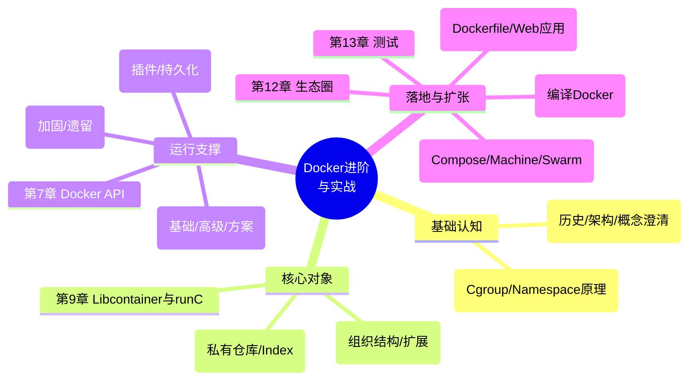

# 一、整体理解与逻辑结构

## 【全局摘要】

> **官方表述（出版社简介原话）**："本书由一个真正钻研容器技术的团队写作，他们不仅仅是在使用 Docker，更多的是在探索容器的未来之路，希望把'代码与产品，理论与实践'完美结合。本书内容从 Docker 的来源、镜像、仓库、安全、网络、卷存储，到生态、测试及社区贡献都有涉猎。……这本书都会带你踏上新的台阶——正所谓'进阶'。"

> **书中定义（第1章）**：Docker 是一个"基于 Go 语言开发，遵从 Apache 2.0 协议开源"的项目，其架构由 **Docker 客户端（Client）→ Docker daemon（守护进程）→ 容器（Container） / 镜像（Image） / Registry（仓库）** 组成（1.2 节）。第 1.4.2 节专门辨析"Docker 容器和虚拟机之间有什么不同"，1.4.1 节讨论"Docker 在 LXC 基础上做了什么工作"。

> **Docker 官方定义（docker.com）**："Docker is an open platform for developing, shipping, and running applications. Docker enables you to separate your applications from your infrastructure so you can deliver software quickly."（Docker 是一个用于开发、交付和运行应用的开放平台，它让你把应用与基础设施分离，从而快速交付软件。）

**通俗解释**：如果《第一本 Docker 书》是"教你开集装箱卡车"，《Docker 进阶与实战》就是"拆开卡车发动机、看懂底盘液压原理、再研究车队调度和修车厂生态"。它不重复"怎么 pull 一个镜像跑起来"，而是回答三个更硬核的问题：

1. **容器到底凭什么隔离？**（第 2 章：Linux 内核的 Namespace + Cgroup 双引擎）
2. **Docker 引擎自己的肌肉长什么样？**（第 9 章：Libcontainer / runC——"引擎的引擎"）
3. **当容器要上规模、要联网、要安全、要进生产，还差什么？**（第 5~13 章：网络、卷、API、安全、集群、生态）

它解决的核心问题是：**把"会用 Docker"升级为"懂 Docker"，让你在出问题时能下到内核层面排查，在做架构时能判断该用哪种网络/存储/编排方案。**

## 【逻辑框架图】

### 思维导图（Mermaid）



### 层级标题（"从内核到生态"的进阶旅程）

- **第一篇 · 认知与内核（第1~2章）**：Docker 是什么 → 容器技术凭什么成立（Namespace 隔离 + Cgroup 限额）
- **第二篇 · 核心对象（第3~4、9章）**：镜像的分层组织 → 仓库的分发与私有化 → 运行时 Libcontainer/runC
- **第三篇 · 运行支撑（第5~8章）**：网络连通 → 数据持久化 → 远程 API → 安全加固
- **第四篇 · 落地与扩张（第10~14章）**：多服务实战 → 集群编排 → 生态与测试 → 参与社区贡献

## 【与主流/历史技术对比】

本书定位"进阶/底层原理"，下表从**学习定位**和**技术深度**两个角度对比几本常见 Docker 书与容器运行时：

| 维度 | 《Docker进阶与实战》(本书) | 《Docker技术入门与实战》 | 《第一本Docker书》 | 官方文档 + 源码 |
| --- | --- | --- | --- | --- |
| 定位 | 进阶·底层原理·生态 | 入门·实战·全栈案例 | 上手·快速跑通 | 权威·碎片化 |
| 底层原理篇幅 | **重**（第2章 Cgroup/Namespace、第9章 Libcontainer） | 轻（点到为止） | 轻 | 最全但散 |
| 网络/存储深度 | 深（高级配置+插件剖析） | 中（够用即可） | 中 | 深但偏 API |
| 安全专题 | **有专章**（第8章） | 部分（高级话题） | 略 | 有但分散 |
| 集群编排 | Compose/Machine/Swarm/OpenStack | 同类（Etcd/Compose/Swarm/K8s） | Compose/Consul/Swarm | 各自官网 |
| 生态/社区贡献 | **有**（第12~14章） | 无 | 无 | GitHub |
| 适合人群 | 已会基础、想下钻内核与生产的工程师 | 零基础到能干活 | 零基础快速上手 | 查细节 |
| 时效风险 | 高（2016，Libcontainer 已演进） | 中（第4版较新） | 高（2016） | 实时 |

**一段话总结**：如果把 Docker 学习比作学开车——三本书里，《第一本 Docker 书》教你拿到驾照、《Docker 技术入门与实战》教你跑长途接单赚钱，而**《Docker 进阶与实战》是汽修厂师傅手册**：它不急着让你上路，而是掀开发动机盖讲清 Namespace 怎么隔绝视野、Cgroup 怎么限制马力、Libcontainer 怎么把内核接口翻译成"容器"。它的独特价值在于"原理纵深"和"生态视野"（连测试与社区贡献都单列成章），但代价是**基于 2016 年的 Docker 世界**（Libcontainer/runc 尚未完全分化、Swarm 尚未演化出 Swarm Mode），阅读时必须用今天的 OCI/containerd/Kubernetes 视角去"翻译"它。

---

# 二、分章节解读

| 章节 | 标题内容 | 核心内容 | 关键例证/数据（如有） |
| --- | --- | --- | --- |
| 序/前言 | — | 写作团队（华为 Docker 实践小组）定位"进阶"，强调代码与产品、理论与实践结合 | "探索容器的未来之路" |
| 第1章 | Docker简介 | 历史发展、架构（Client/daemon/image/registry）、安装使用、概念澄清（LXC 之上做了什么、容器 vs 虚拟机） | 1.4.1、1.4.2 概念辨析 |
| 第2章 | 关于容器技术 | 容器技术前世今生、一分钟理解容器、Cgroup（接口/子系统）、Namespace（接口/各类型）、容器造就 Docker | 2.3 Cgroup 子系统、2.4 六类 Namespace |
| 第3章 | 理解Docker镜像 | image 概念、使用、组织结构（层/联合挂载）、扩展知识 | 3.3 镜像组织结构、写时复制 |
| 第4章 | 仓库进阶 | 仓库定义、Docker Hub、仓库服务、部署私有仓库、Index 及高级功能 | 4.4 私有仓库部署、4.5 Index 高级功能 |
| 第5章 | Docker网络 | 网络现状、基本配置（bridge 等）、高级配置、网络解决方案进阶 | 5.3 高级网络、5.4 解决方案 |
| 第6章 | 容器卷管理 | 卷管理基础、使用卷插件、卷插件剖析、已有卷插件 | 6.2~6.4 卷插件机制 |
| 第7章 | Docker API | API 概述、RESTful 应用示例、高级应用 | 7.2 RESTful 示例、7.3 高级 |
| 第8章 | Docker安全 | 深入理解安全、安全策略、安全加固、安全遗留问题 | 8.2 策略、8.3 加固、8.4 遗留 |
| 第9章 | Libcontainer简介 | "引擎的引擎"、技术原理、关于 runC | 9.1 引擎的引擎、9.3 runC |
| 第10章 | Docker实战 | Dockerfile 简介、基于 Docker 的 Web 应用与发布、为 Web 站点添加后台服务 | 10.2 Web 应用、10.3 后台服务 |
| 第11章 | Docker集群管理 | Compose、Machine、Swarm、Docker 在 OpenStack 上的集群实战 | 11.1~11.4 三件套+OpenStack |
| 第12章 | Docker生态圈 | 生态圈介绍、重点项目介绍、未来发展 | 12.2 重点项目 |
| 第13章 | Docker测试 | Docker 自身测试、Docker 技术在测试中的应用 | 13.1 自测、13.2 测试应用 |
| 第14章 | 参与Docker开发 | 改进 Docker、编译自己的 Docker、开源沟通、项目组织架构 | 14.2 编译 Docker |
| 附录A | FAQ | 常见问题 | — |
| 附录B | 常用Dockerfile | 示例 Dockerfile 集合 | — |
| 附录C | Docker信息获取渠道 | 学习/资讯来源 | — |

---

# 四、按"从内核到生态"进阶生命周期的技术点归纳

> 编排逻辑：本书不是"入门→实战"线性结构，而是**"原理内核 → 核心对象 → 运行支撑 → 落地扩张"**的进阶旅程。下面 12 个点严格按此顺序展开，每个点按九段式（背景/作用/用法/术语/版本变化/对比优势/实例/局限/通俗）组织。

## 技术点1：Namespace —— 容器的"隔离视图"引擎

- **背景与解决的问题**：同一台 Linux 主机上多个进程需要彼此"看不见"（独立 PID、网络、挂载点）。传统 chroot 只能隔离根目录，远远不够。Namespace 让内核为进程组提供**独立的全局资源视图**。
- **作用与应用场景**：实现容器间的隔离（进程、网络、文件系统挂载互不可见）；是"容器"区别于"普通进程"的根本。
- **使用方法（书中 2.4 节）**：
  ```bash
  # 用 unshare 创建一个带独立 mount+pid namespace 的 shell（书中原理示意）
  unshare --mount --pid --fork /bin/bash
  # 查看当前进程所属的各种 namespace
  ls -l /proc/$$/ns
  ```
- **专业术语扩展**：
  - **Namespace**：命名空间，内核隔离机制；全称 "Linux Namespaces"。
  - **UTS**（UNIX Time-sharing System）：隔离主机名与域名。
  - **IPC**（Inter-Process Communication）：隔离 System V 消息队列/信号量/共享内存。
  - **PID**：隔离进程号（容器内 1 号进程 ≠ 宿主机 1 号）。
  - **Network**：隔离网络栈（网卡、路由、端口）。
  - **Mount**：隔离挂载点；**User**：隔离用户/组 ID（可映射容器 root 到宿主机普通用户）。
- **与旧版本变化**：早期 Docker 基于 LXC（Linux Containers）封装，Namespace 由 LXC 管理；Docker 自研 Libcontainer 后**直接调用内核 clone() 的 namespace 标志**，不再依赖 LXC（对应 1.4.1"Docker 在 LXC 基础上做了什么工作"）。
- **与主流技术对比优势**：相比虚拟机"整颗 Guest OS + Hypervisor"的隔离，Namespace **零额外 OS 开销**，启动毫秒级；代价是共享内核，隔离强度弱于 VM（见技术点9安全）。
- **实际应用**：无需手写，运行 `docker run` 时 Docker 自动为每个容器创建 6 类 Namespace：
  ```bash
  docker run -d --name web nginx
  # 宿主机上查看该容器的 namespace 文件
  docker inspect --format '{{.State.Pid}}' web   # 拿到容器 init 进程 PID
  ls -l /proc/<PID>/ns                            # 看到 6 个 ns 链接
  ```
- **局限性及解决方案**：Namespace **只隔离"视图"不限制"用量"**（一个容器可吃光宿主机 CPU/内存）→ 需配合 **Cgroup**（技术点2）；User Namespace 早期默认关闭（安全风险）→ 现代用 **Rootless 容器**开启映射。
- **通俗概括**：Namespace 像是给每个容器发了"独立房间+独立门牌号+独立电话簿"，你在自己房间里喊 1 号进程，不会影响别人房间的 1 号——但墙壁薄（共享地基），隔壁用力跺脚你还是能感觉到（所以还要 Cgroup 限重）。

## 技术点2：Cgroup —— 容器的"资源配额"引擎

- **背景与解决的问题**：Namespace 让容器"看不见彼此"，但不阻止某个容器**吃光所有 CPU/内存**拖垮全机。Cgroup（Control Group）负责**限制、记账、隔离**资源使用。
- **作用与应用场景**：CPU 限额、内存上限、IO 权重、设备访问控制；是多租户共享主机的安全阀。
- **使用方法（书中 2.3 节）**：
  ```bash
  # 创建名为 "limited" 的 cpu cgroup，限制其最多用 0.5 个 CPU
  mkdir /sys/fs/cgroup/cpu/limited
  echo 50000 > /sys/fs/cgroup/cpu/limited/cpu.cfs_quota_us   # 50ms
  echo 100000 > /sys/fs/cgroup/cpu/limited/cpu.cfs_period_us # 每 100ms 周期
  # 把某进程加入该组
  echo <PID> > /sys/fs/cgroup/cpu/limited/tasks
  ```
- **专业术语扩展**：
  - **Cgroup**：Control Group，控制组，全称。
  - **子系统（subsystem）**：cpu、cpuacct、memory、blkio、devices、freezer、net_cls 等可挂载的控制器。
  - **cfs_quota_us / cfs_period_us**：CPU 完全公平调度器的配额/周期（微秒）。
  - **blkio**：块设备 IO 限制；**devices**：允许/禁止访问某设备。
- **与旧版本变化**：cgroup v1（多层级、每子系统独立树）→ **cgroup v2（统一层级、更简洁的树模型）**；现代 Docker/containerd 默认优先用 v2（书后演进）。
- **与主流技术对比优势**：比"虚拟机硬分配 vCPU/内存"更弹性（限额可动态调整、超卖）；比 `ulimit`（仅单进程）覆盖面广（整组进程）。
- **实际应用**：`docker run` 直接映射为 cgroup 限制：
  ```bash
  docker run -d --name web --cpus=1.5 --memory=512m --memory-swap=512m nginx
  # 等价于在 cgroup 中设 cpu quota=150000/period=100000，memory.limit_in_bytes=536870912
  ```
- **局限性及解决方案**：cgroup **限制"用量"但不隔离"故障域"**（内核 bug/OOM 仍可能波及全机）→ 配合 **Namespace + 安全加固**（技术点9）；v1 接口复杂易错 → 迁移到 **cgroup v2**。
- **通俗概括**：Cgroup 是给每个容器装的"电表+水表+限流器"——你可以猛开空调，但总闸会按配额掐断，绝不让你一个人把整栋楼的电用光。

## 技术点3：Libcontainer 与 runC —— "引擎的引擎"

- **背景与解决的问题**：早期 Docker 依赖 LXC 创建容器，但 LXC 是通用工具、与 Docker 模型耦合差。Docker 需要**自己掌控"如何把 namespace/cgroup/文件系统组装成一个容器"**这最后一公里。
- **作用与应用场景**：Libcontainer 是 Docker 自研的容器执行库（书中称"引擎的引擎"）；runC 是其**符合 OCI 标准的独立命令行实现**，可被任何引擎调用。
- **使用方法（书中 9.2~9.3 节）**：
  ```bash
  # runC 直接从一个 OCI bundle（含 config.json + rootfs）启动容器
  mkdir -p mycontainer/rootfs
  # 用 docker export 拿到 rootfs，用 runc spec 生成 config.json
  runc spec
  runc run mycontainer
  ```
- **专业术语扩展**：
  - **OCI**（Open Container Initiative）：开放容器倡议，制定**镜像规范（image-spec）**与**运行时规范（runtime-spec）**的开放标准。
  - **bundle**：OCI 运行时包，含 `config.json`（容器配置）与 `rootfs/`（根文件系统）。
  - **Libcontainer**：Docker 原生的 Go 语言容器库；**runC**：基于它的 OCI 兼容运行时。
- **与旧版本变化（关键书后演进）**：本书出版时 Libcontainer 是 Docker 内部库；**2015 年后 Docker 把容器运行时捐赠给 OCI，演化为 runC；2017 年又抽离出 containerd 作为高级运行时**，形成 `Docker → containerd → runC → 内核` 的现代栈。今天的 `docker run` 实际走的是这条链，而非直接 Libcontainer。
- **与主流技术对比优势**：OCI 标准让**运行时可替换**——同一镜像既能跑 runC，也能跑 **Kata Containers**（VM 级隔离）、**gVisor**（用户态内核）；这是 Libcontainer 时代不具备的。
- **实际应用**：验证现代架构：
  ```bash
  docker info | grep -i runtime        # 通常显示 runc
  docker info | grep -i containerd     # 显示 containerd 版本
  ```
- **局限性及解决方案**：Libcontainer 仅支持 Linux、与 Docker 强绑定的历史形态已淘汰 → **runC/containerd 成为跨引擎事实标准**；需要更强隔离时用 Kata/gVisor 替换 runtime。
- **通俗概括**：Libcontainer 是 Docker 自己造的"点火器"，runC 是把它做成"通用标准打火机"——现在不光 Docker 能用，任何遵守 OCI 标准的"车"都能用同一只打火机点着容器。

## 技术点4：Docker 镜像 —— 分层、写时复制的文件系统

- **背景与解决的问题**：如果每部署一个容器就复制一整份 OS，磁盘和分发都会爆炸。镜像需要**可复用、可增量、可版本化**。
- **作用与应用场景**：把应用+依赖打包成不可变模板；多容器共享只读基础层，启动快、存储省。
- **使用方法（书中 3.x 节）**：
  ```bash
  docker pull ubuntu:22.04      # 拉取，实际是拉多层 (layer)
  docker images                # 查看镜像及 SIZE
  docker history ubuntu:22.04  # 看每一层是怎么来的
  ```
- **专业术语扩展**：
  - **Layer（层）**：镜像由多个只读层叠加而成，每层对应 Dockerfile 一条指令。
  - **Copy-on-Write（COW，写时复制）**：容器在只读层之上加一层可写层，修改只落在可写层，不破坏原层。
  - **Union Mount（联合挂载）**：把多层"叠"成单一可见文件系统，早期用 **AUFS**，后主流 **overlay2**。
  - **Image-spec**：OCI 镜像清单/配置/层索引规范。
- **与旧版本变化**：存储驱动从 AUFS/device-mapper/btrfs **演进为 overlay2 成为默认**（书后演进）；镜像格式从 Docker 自有演化为 **OCI 标准镜像**，可被 Podman/containerd 直接消费。
- **与主流技术对比优势**：相比虚拟机"整盘镜像"，Docker 镜像**层共享 + 增量传输**（只传变更层）极大节省带宽；对比普通 tar 包，多了**内容寻址（digest）**保证不可变与去重。
- **实际应用**：看分层效果：
  ```bash
  # 基于同一 ubuntu 起 10 个容器，底层只读层只存一份
  for i in $(seq 1 10); do docker run -d ubuntu:22.04 sleep infinity; done
  docker system df   # 显示镜像/容器/卷占用，可见共享层未重复计费
  ```
- **局限性及解决方案**：层过多导致镜像臃肿 → **多阶段构建（书后演进，见《技术入门与实战》第9章）**；`latest` 标签不可复现 → 用 **digest（sha256:...）** 钉版本。
- **通俗概括**：镜像像"千层蛋糕"，底层胚子是公共的（ubuntu），上面每层加一点奶油（你的依赖/代码）；10 个容器分同一块胚子，只有最上面那层"私人奶油"各自不同——既省料又不串味。

## 技术点5：仓库进阶 —— 镜像的分发与私有化

- **背景与解决的问题**：镜像做好了，怎么**存、传、控权限**？公网 Docker Hub 不够（隐私、带宽、合规）。
- **作用与应用场景**：集中托管镜像、团队内共享、CI 产出物落库、生产拉取加速。
- **使用方法（书中 4.4 节：部署私有仓库）**：
  ```bash
  # 起一个官方 registry 容器作为私有仓库
  docker run -d -p 5000:5000 --name registry registry:2
  # 给本地镜像打 tag 并推送
  docker tag myapp:1.0 localhost:5000/myapp:1.0
  docker push localhost:5000/myapp:1.0
  docker pull localhost:5000/myapp:1.0
  ```
- **专业术语扩展**：
  - **Registry**：存储仓库的服务（如 Docker Hub、Harbor）。
  - **Repository**：某镜像的所有版本集合（如 `library/nginx`）。
  - **Index**：负责用户认证、镜像检索、权限的"目录服务"（书中 4.5"Index 及高级功能"）。
  - **Manifest**：描述镜像由哪些层组成的清单文件。
- **与旧版本变化**：早期自带 `docker-registry` Python 包 → 现代统一为 **registry:2（Go 实现，支持 OCI）**；并出现 **Harbor**（企业级，带 RBAC/镜像签名/漏洞扫描）。
- **与主流技术对比优势**：自建 registry 比依赖公网 Hub **更快、更私密、可离线**；Harbor 比裸 registry 多了"企业治理三件套"（鉴权/审计/扫描）。
- **实际应用**：生产建议用 Harbor + 镜像签名（cosign/Notary，书后演进）保证供应链安全。
- **局限性及解决方案**：裸 registry 默认**无鉴权/无扫描** → 前置 Nginx 鉴权 + 接 Harbor；传输大镜像慢 → 用 **P2P 分发（Dragonfly/Nydus，书后演进）**。
- **通俗概括**：仓库就是"集装箱码头仓库"——Hub 是公共大港，私有 registry 是你公司自建的小码头，Harbor 是带门禁、监控、安检的高级保税仓。

## 技术点6：Docker 网络 —— 容器怎么"连上网、连彼此"

- **背景与解决的问题**：容器有独立 Network Namespace（默认断网），需要**接入宿主机网络、互相通信、对外暴露服务**。
- **作用与应用场景**：多容器组成应用（web+db）、容器访问外网、外部流量进容器。
- **使用方法（书中 5.2~5.3 节）**：
  ```bash
  # 基本：默认 bridge，映射端口
  docker run -d -p 8080:80 --name web nginx
  # 高级：自建网络让容器按名字互访
  docker network create mynet
  docker run -d --net=mynet --name db postgres
  docker run -d --net=mynet --name web nginx   # web 可直接 ping db
  ```
- **专业术语扩展**：
  - **bridge**：默认网桥，容器通过 veth 对连到 docker0。
  - **veth（Virtual Ethernet）**：成对出现的虚拟网卡，一端在容器、一端在宿主机网桥。
  - **overlay**：跨主机容器网络（叠加网，封装在宿主机网络之上）。
  - **CNM**（Container Network Model）：Docker 的网络模型（Sandbox/Endpoint/Network）。
  - **libnetwork**：Docker 的网络实现库（书中 5.4"网络解决方案进阶"）。
- **与旧版本变化（书后演进）**：从单主机 bridge → **libnetwork 支持 overlay/macvlan**；但生产大规模组网今天更多用 **CNI（Container Network Interface）标准 + Calico/Cilium（eBPF）**，CNM 逐渐被 CNI 在 K8s 生态取代。
- **与主流技术对比优势**：Docker 内置网络**开箱即用、命令直观**；CNI/Calico 在跨主机、网络策略（NetworkPolicy）上更强。
- **实际应用**：容器间服务发现（用自定义网络 + `--name` 作 DNS）。
- **局限性及解决方案**：默认 bridge **跨主机不通** → overlay 或外部 CNI；缺乏细粒度**网络策略（防火墙规则）** → Calico/Cilium 补足（书后演进）。
- **通俗概括**：网络就是给每个集装箱接上"内部电话分机（bridge）"和"对外专线（端口映射）"；bridge 是楼内分机网，overlay 是把两栋楼的分机打通成同一内线。

## 技术点7：容器卷管理 —— 让数据"活过"容器生命周期

- **背景与解决的问题**：容器可写层随容器删除而消失，数据库/文件这类**有状态数据必须持久化到宿主机**。
- **作用与应用场景**：数据库存储、日志落盘、配置文件挂载、多容器共享数据。
- **使用方法（书中 6.x 节）**：
  ```bash
  # 数据卷：Docker 管理的宿主机目录
  docker volume create pgdata
  docker run -d -v pgdata:/var/lib/postgresql/data --name pg postgres
  # 绑定挂载：直接挂宿主机目录
  docker run -d -v /srv/html:/usr/share/nginx/html nginx
  ```
- **专业术语扩展**：
  - **Volume（卷）**：Docker 管理的持久化存储，独立于容器生命周期。
  - **Bind mount（绑定挂载）**：直接把宿主机某路径挂进容器。
  - **Volume Plugin（卷插件）**：把存储后端（NFS、Ceph、云盘）接入 Docker 的插件（书中 6.2~6.4 剖析插件机制）。
  - **tmpfs**：仅存内存的临时挂载。
- **与旧版本变化（书后演进）**：Docker 卷插件生态 → 演进为 **CSI（Container Storage Interface）标准**，Kubernetes 用 StorageClass/PV/PVC 统一管理，**Rook（基于 Ceph）、Portworx** 成为云原生存储主流。
- **与主流技术对比优势**：Volume 比"写进容器层"**安全（删容器不丢数据）、可备份、可跨容器共享**；比裸 bind mount 更受 Docker 生命周期管理。
- **实际应用**：数据库迁移（用数据卷容器 `docker volume` 备份）。
- **局限性及解决方案**：单主机卷**不能跨节点漂移** → 用网络存储插件/NFS/CSI；性能敏感 → 本地 SSD + 限速 IO（Cgroup blkio）。
- **通俗概括**：卷是容器的"外接硬盘"——容器这艘船沉了（被删），硬盘拔下来插到新船上，数据还在。

## 技术点8：Docker API —— 用代码远程"驾驶"Docker

- **背景与解决的问题**：手动敲命令难以自动化、难以被平台集成。需要**标准化接口让程序操控 Docker**。
- **作用与应用场景**：CI/CD 自动构建部署、自研调度平台、多主机批量管理、Web 控制台。
- **使用方法（书中 7.2 节：RESTful 示例）**：
  ```bash
  # 直接打 RESTful API 列出容器（默认 unix socket，可开 tcp）
  curl --unix-socket /var/run/docker.sock http://localhost/containers/json
  # 开启 TCP 监听（书中 7.3 高级，生产务必加 TLS！）
  ```
  ```python
  import docker
  client = docker.from_env()          # 通过 socket 连接 daemon
  client.containers.run("nginx", detach=True, ports={'80/tcp': 8080})
  ```
- **专业术语扩展**：
  - **RESTful API**：基于 HTTP 的资源式接口；Docker daemon 暴露 `/containers`、`/images` 等端点。
  - **daemon socket**：默认 `unix:///var/run/docker.sock`（本地安全），可暴露 `tcp://0.0.0.0:2375`（**无加密，危险**）或 `2376`（TLS）。
  - **SDK**：官方/社区提供的各语言客户端（Python/Go/Node）。
- **与旧版本变化**：从仅本地 socket → 支持**加密 TCP（2376）+ TLS 双向认证**；现代更多走 **containerd 的 gRPC API**（书后演进）而非 Docker 守护进程 REST。
- **与主流技术对比优势**：REST API **语言无关、易集成**；对比 SSH 远程执行命令更结构化、可版本化。
- **实际应用**：CI 脚本用 API 构建并推送镜像。
- **局限性及解决方案**：开放 daemon 端口**极易被提权**（拿到 socket 等于拿到宿主机 root）→ 必须 **TLS + 防火墙 + 切勿暴露公网**；今天更推荐经 **Kubernetes API** 而非直达 Docker daemon。
- **通俗概括**：API 是 Docker 的"自动驾驶接口"——你不用亲自握方向盘（敲命令），写段程序就能让车队（容器集群）自动跑起来，但钥匙（socket）千万别挂门上。

## 技术点9：Docker 安全 —— 最大的"进阶"分水岭

- **背景与解决的问题**：容器**共享宿主机内核**，隔离弱于 VM；一旦逃逸成功，攻击者直抵宿主机。安全是生产落地的硬门槛。
- **作用与应用场景**：多租户隔离、合规审计、防逃逸、镜像供应链安全。
- **使用方法（书中 8.2~8.3 节：策略与加固）**：
  ```bash
  # 以非 root 用户运行（Dockerfile 内）
  USER appuser
  # 只读根文件系统 + 禁止提权（运行时）
  docker run -d --read-only --security-opt=no-new-privileges nginx
  # 限制系统调用（seccomp 默认已开，可自定义 profile）
  docker run --security-opt seccomp=/path/profile.json nginx
  ```
- **专业术语扩展**：
  - **Capability**：Linux 把 root 特权拆成细粒度能力（如 NET_ADMIN、SYS_ADMIN），容器默认**丢弃大部分**。
  - **seccomp**（secure computing mode）：过滤容器可调用的系统调用集合。
  - **AppArmor/SELinux**：强制访问控制（MAC）框架，限制进程行为。
  - **namespace 逃逸**：利用内核漏洞从容器突破到宿主机。
  - **no-new-privileges**：禁止容器内进程通过 setuid 提权。
- **与旧版本变化（书后演进）**：本书写于 2016（加固主要靠 Capability/seccomp/AppArmor）→ 今天新增 **Rootless 容器（无 root 跑 daemon）**、**gVisor（用户态内核拦截 syscall）**、**Kata Containers（每个容器跑轻量 VM）**、**镜像签名（cosign/Notary）+ SBOM（软件物料清单）**。
- **与主流技术对比优势**：相比"裸容器跑 root"，上述加固**大幅缩小时逃逸面**；相比 VM，容器安全仍需"纵深防御"（多层叠加）。
- **实际应用**：生产强制 `no-new-privileges` + 非 root + 只读根fs + 镜像扫描。
- **局限性及解决方案**：共享内核的**根本性风险无法根除** → 高安全场景用 **Kata/gVisor** 换取 VM 级隔离；镜像投毒 → 签名 + 私仓扫描。
- **通俗概括**：容器像合租房（共享地基/水管），Docker 安全就是给每间房装"智能锁（Capability）+监控（seccomp）+门禁（no-new-privileges）"；但墙再厚也共用地基，真要金库级安全，得换成独立别墅（VM/Kata）。

## 技术点10：Dockerfile 与多服务实战 —— 把原理落成应用

- **背景与解决的问题**：前面都是零件，这一章**组装成一辆能上路的应用**（Web 站点 + 后台服务）。
- **作用与应用场景**：标准化构建镜像、复现环境、CI 自动出包。
- **使用方法（书中 10.1~10.3 节）**：
  ```dockerfile
  # 一个 Web 应用镜像（精简版）
  FROM python:3.11-slim
  WORKDIR /app
  COPY requirements.txt .
  RUN pip install --no-cache-dir -r requirements.txt   # 装依赖（独立层）
  COPY . .
  EXPOSE 8000
  USER appuser                      # 安全：非 root 运行
  CMD ["gunicorn", "app:app", "-b", "0.0.0.0:8000"]
  ```
  ```bash
  docker build -t myweb:1.0 .
  docker run -d -p 8000:8000 --name web myweb:1.0
  # 再起一个后台服务（如 redis），通过自定义网络互连
  ```
- **专业术语扩展**：`FROM`（父镜像）、`RUN`（构建期执行）、`CMD`（运行期默认命令）、`ENTRYPOINT`（不可覆盖的入口）、`EXPOSE`（声明端口，非映射）、`USER`（切换用户）、`WORKDIR`（工作目录）。
- **与旧版本变化**：`MAINTAINER` → 推荐 `LABEL maintainer=...`；新增 **多阶段构建、HEALTHCHECK、--mount（缓存挂载，书后演进）** 等指令。
- **与主流技术对比优势**：Dockerfile **声明式、可版本化、可复现**；对比手工 `docker commit` 黑盒镜像，透明且可审计。
- **实际应用**：Web + 后台服务多容器组合（书中 10.3"为 Web 站点添加后台服务"即用自定义网络串联）。
- **局限性及解决方案**：单 Dockerfile 难管理多服务依赖 → 用 **Compose**（技术点11）编排。
- **通俗概括**：Dockerfile 是"集装箱装箱说明书"——写清楚底胚（FROM）、装什么（COPY/RUN）、开哪个门（EXPOSE）、谁上岗（USER）、启动口令（CMD），码头工人（docker build）照做就能复刻出一模一样的箱子。

## 技术点11：集群管理 —— 从"一箱"到"一队"

- **背景与解决的问题**：单机容器跑得再好，也抵不过流量高峰和单点故障。需要**多机调度、服务伸缩、故障自愈**。
- **作用与应用场景**：生产环境部署、滚动更新、多副本负载均衡。
- **使用方法（书中 11.1~11.4 节：三件套 + OpenStack）**：
  ```bash
  # Compose：定义多服务（书中 11.1）
  cat > docker-compose.yml <<'EOF'
  version: "3"
  services:
    web:
      image: myweb:1.0
      ports: ["8000:8000"]
      depends_on: [redis]
    redis:
      image: redis:7
  EOF
  docker compose up -d
  # Machine：在多平台一键开"装有 Docker 的机器"（书中 11.2）
  docker machine create --driver virtualbox node1
  # Swarm：把多机组成集群（书中 11.3，注意本书写的是早期 Swarm）
  docker swarm init
  docker swarm join --token <token> <manager-ip>:2377
  ```
- **专业术语扩展**：
  - **Compose**：单机多容器编排工具（YAML 描述服务依赖）。
  - **Machine**：跨云/本地快速创建带 Docker 的宿主机。
  - **Swarm**：Docker 原生集群（Manager/Worker 节点、Service、Task）。
  - **OpenStack**：书中 11.4 演示 Docker 运行在 OpenStack 虚拟机集群上。
- **与旧版本变化（重大书后演进）**：本书的 Swarm 是**早期独立容器版**；2016 年中 Docker 推出 **Swarm Mode（内建编排，docker swarm）**，但**最终 Kubernetes 胜出成为事实标准**；今天生产几乎都用 K8s，Swarm 退居轻量场景。
- **与主流技术对比优势**：Swarm **与 Docker 无缝、学习成本低**；**Kubernetes 在大规模、自愈、生态上全面领先**（已成为容器编排的事实标准）。
- **实际应用**：今天的建议是 **Docker Compose 做本地开发、Kubernetes 做生产编排**（而非 Swarm）。
- **局限性及解决方案**：早期 Swarm **功能弱、生态小** → 迁移 K8s；跨云异构 → Machine 思路被 Terraform 取代。
- **通俗概括**：Compose 是"把几个箱子用绳子拴一起"，Swarm/K8s 是"雇了个调度主管，哪台车坏了自动换、哪条线忙了自动加车"。

## 技术点12：生态圈、测试与社区贡献 —— "进阶"的终极台阶

- **背景与解决的问题**：会用、懂原理还不够；**真正的高手能反哺生态、改源码、提 PR**，这也是书名"进阶"的最后一跃。
- **作用与应用场景**：参与开源、定制 Docker、用容器优化自家测试流水线。
- **使用方法（书中 12~14 章）**：
  ```bash
  # 14.2 编译自己的 Docker（现代方式，基于 containerd 时代）
  git clone https://github.com/moby/moby
  cd moby
  # 官方推荐用自带 Docker 构建（docker buildx bake）
  make BIND_DIR=. shell   # 进入开发容器
  hack/make.sh binary     # 产出 docker 二进制
  ```
  ```bash
  # 13.2 用 Docker 跑测试：每个用例一个干净容器，跑完即焚
  docker run --rm -v $(pwd):/code -w /code golang:1.22 go test ./...
  ```
- **专业术语扩展**：
  - **Moby**：Docker 开源上游项目名（社区版引擎）。
  - **CI in a container**：用容器做隔离、可复现的测试环境。
  - **PR（Pull Request）**：向开源项目提交改动并请求合并。
  - **DCO（Developer Certificate of Origin）**：贡献者原产地证书（提交需 sign-off）。
- **与旧版本变化**：本书编译的是 2016 年的 Docker 引擎（含 Libcontainer）→ 今天代码库已重构为 **Moby + containerd + runc 多仓协作**，编译方式演进（书后演进）。
- **与主流技术对比优势**：容器化测试**环境一致、并行快、易清理**；对比传统"共用测试机"避免"在我机器上能跑"的玄学问题。
- **实际应用**：团队把单测/集成测试全装进容器，CI 每次全新拉起，杜绝环境污染。
- **局限性及解决方案**：源码演进快、依赖复杂 → 用**官方 dev 容器**（书中理念的现代版）降低门槛。
- **通俗概括**：这一章教你从"乘客"变成"修车厂师傅"——不仅能开车，还能拆发动机、改图纸、把改进寄回原厂，让所有人受益。

---

# 五、格式与风格自检

- **标题层级**：一/二/三… 一级、##/### 二级三级清晰展开；技术点用"技术点N：标题"统一编号。
- **可视化**：一章用 **Mermaid mindmap + 层级标题**双视角呈现框架；四章技术点用"从内核到生态"的进阶流程图（隐含于编排顺序）。
- **纠正性/引用标注**：所有章节子节号（如 1.4.1、2.3、5.3、8.3、9.1、11.4、14.2）均对应核实后的官方目录；书后演进处明确标注"书后演进"。
- **术语扩展**：每个技术点列出缩写全称（Namespace/UTS/IPC/Cgroup/OCI/CNM/CSI/Capability/seccomp/COW/Moby/PR/DCO 等）与省略含义。
- **通俗化**：每个技术点末尾用比喻收口（独立房间、电表、打火机、千层蛋糕、码头仓库、分机专线、外接硬盘、自动驾驶、合租房、装箱说明书、调度主管、修车厂师傅）。
- **版权边界**：全文为转述+分析，未整章转载；代码示例为功能性片段。

# 六、技术环境搭建（本书未系统介绍"如何装 Docker"，此处补最新主流方案）

> 本书第1章仅简略提及安装（1.3.1）。下面给出**今天可逐步执行**的三种方案，让你能跑通本书所有示例。

## 方案A：Docker Desktop（Win/Mac 推荐，最简单）
1. 到 https://www.docker.com/products/docker-desktop/ 下载对应系统安装包。
2. Windows 需先开启 **WSL2**（控制面板 → 程序 → 启用 WSL + 虚拟机平台，再 `wsl --install`）。
3. 安装后启动 Docker Desktop，托盘图标变绿即就绪。
4. 验证：
   ```bash
   docker version
   docker run --rm hello-world
   ```

## 方案B：Linux 原生仓库安装（最接近本书/生产，推荐学习用）
```bash
# Ubuntu 22.04 示例
sudo apt-get update
sudo apt-get install -y ca-certificates curl gnupg
sudo install -m 0755 -d /etc/apt/keyrings
curl -fsSL https://download.docker.com/linux/ubuntu/gpg | sudo gpg --dearmor -o /etc/apt/keyrings/docker.gpg
echo "deb [arch=$(dpkg --print-architecture) signed-by=/etc/apt/keyrings/docker.gpg] https://download.docker.com/linux/ubuntu $(. /etc/os-release && echo $VERSION_CODENAME) stable" | sudo tee /etc/apt/sources.list.d/docker.list > /dev/null
sudo apt-get update
sudo apt-get install -y docker-ce docker-ce-cli containerd.io docker-buildx-plugin docker-compose-plugin
sudo usermod -aG docker $USER   # 免 sudo 跑 docker（重新登录生效）
docker run --rm hello-world
```

## 方案C：跑通"多服务实战"（印证第10~11章）
```bash
# 用 Compose 起 web+redis（对应书中 10.3 / 11.1）
cat > docker-compose.yml <<'EOF'
services:
  web:
    build: .
    ports: ["8000:8000"]
    depends_on: [redis]
  redis:
    image: redis:7
EOF
docker compose up -d
docker compose ps
```
> 常见坑：Linux 上 `permission denied` → 确认用户在 `docker` 组且已重登录；Win/Mac 上挂载路径要用 `//c/Users/...` 形式。

# 七、扩展（比书中更主流/先进的相关技术）

> 本书基于 **2016 年 Docker 世界**。下表明确区分"书中已覆盖"与"书后演进"，并说明承接关系。

| 书中内容（2016） | 现状/更优解（书后演进） | 承接关系 |
| --- | --- | --- |
| Libcontainer（第9章） | **containerd + runC（OCI 标准）** | Libcontainer 捐给 OCI → runC；再抽离 containerd 做高级运行时 |
| 早期 Swarm（第11章） | **Kubernetes（事实标准）** | 编排思想同源，K8s 生态/自愈/规模全面胜出 |
| cgroup v1 | **cgroup v2（统一树）** | 限额模型简化，Docker/containerd 默认优先 v2 |
| AUFS 存储驱动 | **overlay2（默认）** | 联合挂载实现更易维护 |
| 网络 CNM/libnetwork | **CNI + Calico/Cilium(eBPF)** | K8s 生态采用 CNI，Cilium 用 eBPF 革新数据面 |
| 裸 registry | **Harbor + 镜像签名(cosign) + SBOM** | 在 registry 之上补企业治理与供应链安全 |
| 卷插件 | **CSI + Rook/Portworx** | 存储接口标准化，云原生存储可插拔 |
| 安全加固（Capability/seccomp） | **Rootless + gVisor + Kata + 签名** | 在原有加固之上补"无 root 守护/VM 级隔离" |
| Docker API（2375/2376） | **经 Kubernetes API / containerd gRPC** | 生产不再直连 Docker daemon，改走编排层 |

**延伸方向与本书理论的关系**：
- **Kubernetes**：把本书第11章"集群"思想工业化，Pod/Service/Ingress 都是容器编排的自然延伸。
- **eBPF / Cilium**：把本书第5章"网络"做进 Linux 内核，实现高性能可观测网络。
- **Kata / gVisor**：回应本书第8章"安全遗留问题"，用 VM 级或用户态内核彻底隔离。
- **BuildKit / 多阶段构建**：把本书第10章 Dockerfile 实践提速、瘦身（缓存挂载 `--mount`）。
- **CI/CD（GitLab CI/GitHub Actions）**：把本书第13章"容器化测试"做成标准流水线。

**一句话收尾**：这本书最大的价值，是让你在 2016 年的视角下**真正看懂容器的发动机**（Namespace/Cgroup/Libcontainer）和**工程全貌**（网络/存储/安全/生态）。今天这些零件大多已"标准化、模块化、编排化"（OCI/K8s/eBPF），但**底层那颗心没变**——你读懂了它，就能在任何新工具面前迅速看穿"它不过是给那颗心换了套外壳"。

---

> **封面图说明**：`bookCover` 使用当当商品页 best-effort 地址（ISBN 9787111523390），若你的站点加载失败，请替换为手头图床/官方封面地址。
