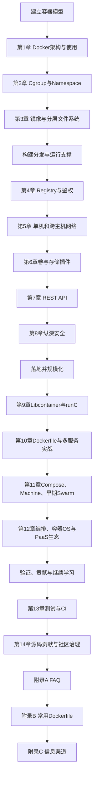
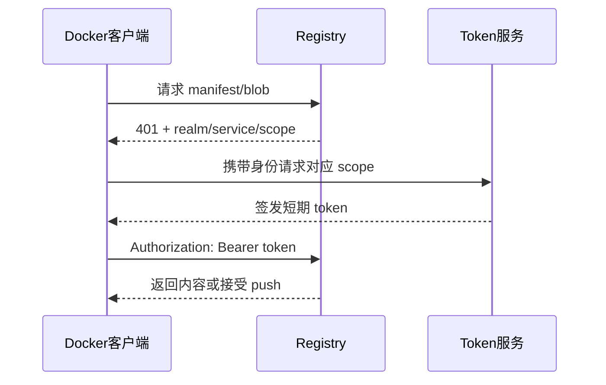
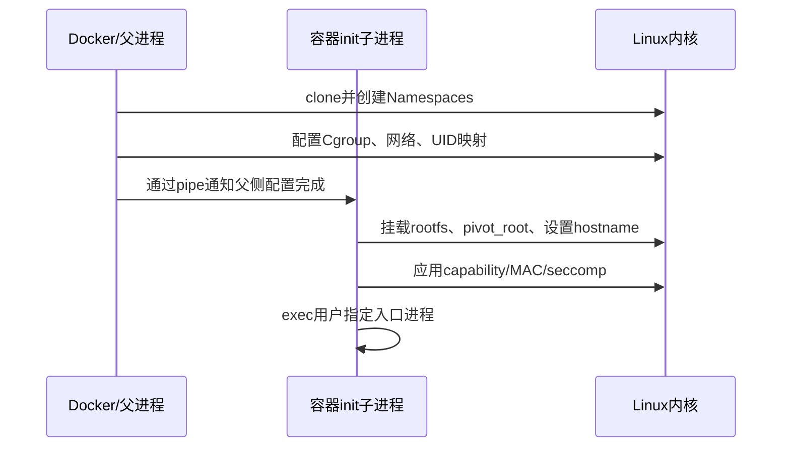

# 阅读说明：一本 Docker 1.8 时代的书，怎样用于 2026 年

《Docker进阶与实战》由华为 Docker 实践小组编写，机械工业出版社 2016 年 2 月出版（ISBN 978-7-111-52339-0）。作者在前言中明确说明：

> “本书的内容和代码都是基于 Docker 1.8 版本的。”

这句话决定了本文的读法：底层原理仍有价值，命令和生态现状却不能原样照搬。本文依据本地扫描版 266 个 PDF 页面逐页 OCR，按照原书第 1～14 章、附录 A～C 的顺序精读；短引文用于确认作者观点，代码只保留理解机制所需的片段。OCR 容易把 `l`、`I`、破折号和空格识别错，命令均结合上下文校正，但不凭 OCR 猜测缺失内容。

全文使用三种标记，避免把 2015 年的事实和今天混在一起：

- **原书观点**：转述 Docker 1.8 时的架构、命令与案例。
- **版本校正（截至 2026-08-09）**：指出已废弃、已改名或语义有误之处。
- **现代实践**：为了让读者能动手而补充的 Docker Engine、BuildKit、OCI、containerd、Compose v2 与 Kubernetes 用法，不冒充原书内容。

扫描版证据范围如下：前置内容为 PDF 1～12 页；第 1～14 章分别为 13～22、23～39、40～52、53～82、83～110、111～119、120～143、144～166、167～181、182～196、197～208、209～223、224～241、242～254 页；附录 A、B、C 为 255～258、259～261、262～264 页。

# 一、从“容器引擎”到应用交付：全书整体理解

## Docker 要解决的核心问题

书中把 Docker 定义为：

> “一个开源的容器引擎，可以方便地对容器进行管理。”

它还用 `Build, Ship and Run` 概括镜像生命周期：构建应用和依赖，把同一个镜像分发到仓库，再在目标主机运行。用通俗的话说，Docker 把“程序、依赖、默认配置和启动方式”做成带版本的标准包。开发机、测试机、生产机不必分别手工拼装环境，只要宿主机提供兼容的容器运行能力，同一个镜像就能以近似相同的方式启动。

Docker 解决的不是“把整个机器搬走”，而是以下工程问题：

- 环境漂移：开发、测试、生产安装的库版本和配置不同。
- 交付不可复现：部署依赖口头文档和人工步骤。
- 资源利用率低：为每个应用准备完整虚拟机，启动慢、内存开销大。
- 软件分发割裂：构建物、依赖、启动参数没有统一格式和仓库。
- 生命周期自动化困难：创建、启动、停止、升级、回滚缺少统一 API。

容器并不模拟硬件。Linux 内核用 Namespace 划分“看得见什么”，用 Cgroup 限制“能用多少”，用 rootfs 提供独立文件树；Docker 再把镜像、网络、卷、仓库和 API 组织成可用的产品。书中最有生命力的等式正是：

> 容器 = Cgroup + Namespace + rootfs + 容器引擎（用户态工具）

## 全书逻辑框架

作者说“章节划分则以功能模块为粒度，对每一个重要的模块进行了深入分析和讲解”。全书可以重组为四个连续阶段，但阶段内部严格保持原章节顺序：



这条主线不是简单的命令手册：第 1～3 章解释容器为何成立；第 4～8 章解决镜像怎样安全地流动和运行；第 9～12 章进入低层运行时、应用组合和集群；第 13～14 章把 Docker 反过来用于测试和 Docker 自身开发。

## Docker 与虚拟机、LXC、Podman、Kubernetes 的边界

| 技术 | 抽象与隔离边界 | 镜像/交付能力 | 编排能力 | 主要优势 | 主要局限 |
| --- | --- | --- | --- | --- | --- |
| 虚拟机 | Hypervisor 虚拟硬件，每台 VM 有独立内核 | 通常分发整机镜像 | 依赖 OpenStack、vSphere 等 | 隔离强，可运行不同内核/操作系统 | 镜像大，启动和资源开销较高 |
| LXC/LXCFS | Linux 系统容器，共享宿主内核 | 更偏“轻量系统”管理 | 不提供完整应用编排 | 接近完整 Linux 用户空间，适合系统容器 | 应用镜像工作流和仓库体验不如 Docker 一体化 |
| Docker Engine | Linux 容器；Desktop 上通过轻量 VM 提供 Linux 内核 | Dockerfile、OCI 镜像、Registry、BuildKit | Compose 管单机应用；Swarm mode 可管集群 | 开发体验统一、生态成熟、开箱即用 | daemon/socket 权限大；共享内核不是 VM 级边界 |
| Podman | 无中心 daemon，支持 rootless，兼容 OCI | Containerfile/OCI 镜像与 Registry | Pod、Quadlet；也可接 Kubernetes 工作流 | daemonless、rootless 与 systemd 集成自然 | 与 Docker 周边工具并非处处完全兼容 |
| Kubernetes | 以 Pod 为最小调度单元，通过 CRI 对接运行时 | 消费 OCI 镜像，本身不负责镜像构建 | 声明式调度、自愈、扩缩、滚动发布 | 大规模生产编排与生态标准 | 学习、运维和控制面复杂度高 |

结论是：Docker 不是“更轻的虚拟机”，Kubernetes 也不是“更大的 Docker”。VM 提供硬件级边界，Docker 提供应用构建与容器生命周期，Kubernetes 管理跨节点的期望状态。它们经常叠加使用：云主机或 VM 承载节点，Docker/BuildKit 构建 OCI 镜像，Kubernetes 通过 containerd 和 runC 运行镜像。

# 二、14 章与 3 个附录的内容地图

| 章节 | 标题 | 核心内容 | 该部分处理的问题与方案 |
| --- | --- | --- | --- |
| 序与前言 | 为什么写“进阶与实战” | 以功能模块深入原理，版本基线为 Docker 1.8 | 从入门命令进入镜像、网络、安全、源码和生态 |
| 第1章 | Docker简介 | 历史、C/S 架构、组件、安装、Docker 与 LXC/VM 的关系 | 用镜像和 Registry 统一构建、分发、运行 |
| 第2章 | 关于容器技术 | 容器历史、Cgroup、Namespace、rootfs | Namespace 隔离视图，Cgroup 管资源，引擎管生命周期 |
| 第3章 | 理解Docker镜像 | Build/Ship/Run、分层、联合挂载、COW、版本管理 | 把运行环境封装成可复用、可分发、可追踪的只读层 |
| 第4章 | 仓库进阶 | Hub、Registry v2、API、鉴权、私仓、Index | 用内容存储、manifest、TLS 与 token 服务安全分发镜像 |
| 第5章 | Docker网络 | bridge/host/none/container、OVS、VXLAN、Weave、Flannel | 用 netns、veth、网桥、NAT 和隧道连接容器 |
| 第6章 | 容器卷管理 | 数据卷、卷插件、插件协议与案例 | 把持久数据移出容器可写层，并接入外部存储 |
| 第7章 | Docker API | REST、Engine/Registry/Hub API、自动化案例 | 用版本化接口代替人工 CLI，串起构建、推送、部署 |
| 第8章 | Docker安全 | 容器/镜像/daemon 风险，MAC、seccomp、capability | 以最小权限、资源限制、可信镜像和审计做纵深防御 |
| 第9章 | Libcontainer简介 | 容器创建过程、setns、CRIU、runC、OCI | 把内核原语封装为可调用的低层容器运行时 |
| 第10章 | Docker实战 | Dockerfile、HTTPS Tomcat、后台多服务、Compose | 把镜像、网络和服务依赖组合成可部署应用 |
| 第11章 | Docker集群管理 | Compose、Machine、早期独立 Swarm、OpenStack | 创建节点、发现节点并按过滤器和策略调度容器 |
| 第12章 | Docker生态圈 | 编排、容器 OS、PaaS、插件、OCI | 梳理单机引擎之上的平台化分工与标准化方向 |
| 第13章 | Docker测试 | Docker 自测、容器化测试、Jenkins CI | 用一次性、可复现环境隔离构建和测试污染 |
| 第14章 | 参与Docker开发 | Issue、PR、DCO、编译、社区沟通、治理 | 建立可审查的开源贡献流程，用容器统一开发环境 |
| 附录A | FAQ | 许可、平台、数据、连接、多进程、安全等 16 问 | 汇总当时常见误区；多数操作需按现代版本校正 |
| 附录B | 常用Dockerfile | 早期 dockerfile GitHub 组织中的语言与服务镜像 | 通过可复用基础镜像减少重复构建工作 |
| 附录C | Docker信息获取渠道 | GitHub、文档、邮件列表、IRC、Stack Overflow | 告诉读者如何跟进快速变化的项目，但很多链接已迁移 |

# 三、按原书讲解顺序精读

## 阶段一：建立“容器—镜像—引擎”的心智模型

### 第1章 Docker简介：先认识产品边界

#### 1.1 引言：历史、动机与架构

##### 1.1.1 Docker 的历史和发展

原书从 dotCloud 内部项目讲起：Docker 早期借助 LXC 提供容器能力，2013 年开源后迅速形成镜像、Hub 和工具生态。它走红不是因为发明了容器，而是把 Linux 已有隔离原语包装成开发者可理解的应用交付流程。

需要区分两层历史：chroot、Namespace、Cgroup 等内核机制早已存在；Docker 的贡献是稳定的镜像格式、Dockerfile、Registry、CLI/API 和默认约定。也正因为上层体验成功，后来才有 OCI 将镜像与运行时规范中立化。

##### 1.1.2 Docker 的架构介绍

书中的 Docker 是典型 C/S（Client/Server）结构：CLI 客户端向 daemon 发请求，daemon 管镜像、容器、网络和卷，并与 Registry 交换镜像。逻辑链如下：

```text
docker CLI ── REST/Unix socket ──> Docker daemon
                                      ├─ images / containers
                                      ├─ networks / volumes
                                      └─ registry client
```

现代 Engine 仍保持相似的 API 外观，但执行链已经拆分：

```text
Docker CLI → dockerd → containerd → containerd-shim → runc → Linux kernel
                  └→ BuildKit（构建）
```

`dockerd` 负责高层对象与 API；`containerd` 管镜像传输、快照和容器任务；shim 让容器不必绑定 containerd 进程；runC 根据 OCI runtime-spec 创建低层容器。理解这条链，能避免把 runC、containerd 和 Docker 当成同一层工具。

#### 1.2 功能和组件

- **Docker Client**：把 `docker run` 等命令转换成 Engine API 请求；客户端和 daemon 可以不在同一台机器。
- **Docker daemon**：书中称后台守护进程，拥有广泛宿主权限，负责对象生命周期。
- **Container**：镜像的一个运行实例，加上可写层、进程、Namespace、Cgroup 和挂载配置。
- **Image**：只读分层文件系统及其配置，不是运行中的“迷你虚拟机”。
- **Registry**：按名称、标签和摘要存储并分发镜像内容；Docker Hub 是公共托管服务，不等于 Registry 协议本身。

一次 `docker run nginx` 实际包含“本地查镜像 → 必要时 pull → 创建容器配置 → 准备 rootfs/网络/Cgroup → 启动入口进程”。CLI 的简洁把这些步骤折叠成一条命令，但排障时必须把它们重新拆开。

#### 1.3 安装和使用

原书的 Ubuntu 安装方式是 `apt-get install docker.io`，并以 Docker 1.8 命令演示 `pull`、`run`、`ps`、`stop`、`rm`。它能说明基本生命周期，却不应作为今天安装 Docker CE 的步骤。现代可执行安装见本文第四部分。

最小生命周期仍然成立：

```bash
docker pull nginx:alpine
docker run --name demo -d -p 8080:80 nginx:alpine
docker ps
docker logs demo
docker stop demo
docker rm demo
```

生产中不要只写漂移的 `latest`；应记录明确标签，关键部署进一步锁定 `image@sha256:<digest>`。标签是可移动别名，digest 才是内容身份。

#### 1.4 概念澄清

##### 1.4.1 Docker 在 LXC 基础上做了什么

原书总结的增量包括跨主机部署、应用中心、自动构建、版本管理、组件复用、镜像共享及周边工具。这里的要点不是“Docker 比 LXC 隔离更强”，而是 Docker 把容器变成了应用交付单元。

版本校正：Docker 早期使用 LXC，书中版本已转向 Libcontainer；今天默认低层路径是 containerd + runC。LXC 仍是独立项目，偏系统容器，不能说被 Docker “替代”。

##### 1.4.2 Docker 容器与虚拟机的差异

容器共享宿主内核，启动通常更快、密度更高；VM 通过虚拟硬件运行独立内核，能承载不同内核并提供更清楚的安全边界。两者互补：可把多个容器运行在 VM 节点中，用 VM 隔离租户或故障域，用容器提高应用交付效率。

#### 1.5 小结

第 1 章建立的是产品地图：客户端发请求、daemon 管对象、镜像经 Registry 分发、容器是运行实例。后续章节分别拆开这些黑盒。

### 第2章 关于容器技术：隔离与限制不是一回事

#### 2.1 前世今生

原书沿 chroot、`pivot_root`、Linux-VServer、Virtuozzo/OpenVZ，再到 Cgroup/Namespace 和 Docker，说明容器是 Linux 隔离技术长期演进的结果。`chroot` 只改变进程看到的根目录，不隔离 PID、网络和资源，不能单独构成安全容器；`pivot_root` 能切换挂载树的根，适合容器初始化阶段。

#### 2.2 一分钟理解容器

书中的公式可拆成四个问题：

1. Namespace：进程能看到哪些 PID、网卡、挂载点、主机名和用户编号？
2. Cgroup：进程能用多少 CPU、内存和 I/O，怎样统计？
3. rootfs：进程从哪个文件树加载程序、库和配置？
4. 容器引擎：谁组合配置、创建进程、接网络、收日志、处理停止和删除？

通俗地说，Namespace 是房间的墙，Cgroup 是水电表，rootfs 是房间内的家具，引擎是物业。只有墙而没有水电表，住户仍可耗尽整栋楼资源；只有限额而没有墙，住户又能看到邻居。

#### 2.3 Cgroup：限制和核算资源

Cgroup 是 Control Group 的缩写。原书基于 cgroup v1，按控制器分别挂载层级，并介绍：

- `cpu` / `cpuacct`：CPU 调度权重、配额与用量核算。
- `cpuset`：绑定 CPU 核和 NUMA 内存节点。
- `memory`：内存及交换空间限制、统计和 OOM 行为。
- `blkio`：块设备 I/O 权重或限速。
- `devices`：允许或拒绝访问设备节点。
- `freezer`：冻结和恢复任务。
- `net_cls` / `net_prio`：给网络包分类或设置优先级。
- `hugetlb`、`perf_event`：大页和性能事件控制。

原书通过 cgroupfs 建目录、写控制文件来展示机制。这适合学习，不适合在 systemd 管理的现代主机上绕开系统管理器直接操作。现代 Linux 普遍采用 cgroup v2 的统一层级，控制文件如 `cpu.max`、`memory.max`，并改善委托和跨控制器一致性。Docker 参数把差异封装起来：

```bash
# 最多使用 1.5 个 CPU；内存上限 512 MiB
docker run --rm --cpus=1.5 --memory=512m alpine sh -c 'cat /sys/fs/cgroup/memory.max 2>/dev/null || true'

# CPU 权重是竞争时的相对份额，不是硬上限
docker run --rm --cpu-shares=512 alpine true
```

限制内存时要同时考虑应用自身堆大小、页缓存和 swap；上限过紧会触发 OOM kill。`--privileged` 会放开设备与大量安全限制，不能作为“权限不够”的通用修复。

#### 2.4 Namespace：为同一内核制造不同视图

原书列出六类 Namespace：

- **Mount namespace**：隔离挂载点；`pivot_root`、只读挂载和传播属性都在此层发生。
- **UTS namespace**：隔离 hostname/domain name。UTS 是 UNIX Time-sharing System 的历史名称。
- **IPC namespace**：隔离 System V IPC 和 POSIX 消息队列；IPC 即 Inter-Process Communication。
- **PID namespace**：隔离进程编号；容器内 PID 1 负责回收孤儿进程，信号处理也有特殊语义。
- **Network namespace**：隔离网卡、地址、路由、防火墙和端口；新建 netns 通常只有未启用的 loopback。
- **User namespace**：映射 UID/GID，让容器内 root 对应宿主机非特权用户。

Linux 后续还增加了 **Cgroup namespace**（虚拟化进程看到的 cgroup 路径）和 **Time namespace**（隔离部分时钟偏移）。Namespace 类型增加不代表 Docker 必然对每一种都提供独立 CLI 选项。

书中解释了三个关键系统调用：

- `clone()`：创建进程时通过 `CLONE_NEW*` 标志创建/加入新的 Namespace。
- `unshare()`：让当前进程脱离某些共享上下文，创建新的 Namespace。
- `setns()`：让当前线程加入已有 Namespace；`docker exec` 的底层思想与此相关。

可用只读命令观察容器与宿主的 Namespace inode：

```bash
docker run -d --name ns-demo alpine sleep 300
pid=$(docker inspect -f '{{.State.Pid}}' ns-demo)
sudo ls -l /proc/$pid/ns
docker exec ns-demo ps
docker rm -f ns-demo
```

不要把 Namespace 当安全沙箱的全部。容器仍共享内核，内核漏洞、危险 capability、设备和 Docker socket 都可能跨过这堵“墙”。

#### 2.5 容器造就 Docker

本节把内核能力重新接回产品：Docker 选择镜像作为 rootfs，调用运行时配置 Namespace/Cgroup，再提供网络、仓库和 API。书中还认为容器与微服务的小进程、快速部署、独立升级相契合；这很准确，但“一个容器一个关注点”不等于绝对只能有一个 OS 进程，主进程也可以合理管理工作进程。

#### 2.6 小结

第 2 章的核心判断是：隔离、限额、文件系统和生命周期缺一不可。容器是多个内核机制的组合，不是一项单独的“容器技术开关”。

### 第3章 理解Docker镜像：可复现交付的核心

#### 3.1 镜像概念与要解决的问题

如果只打包应用二进制，目标机仍可能缺少动态库、解释器和配置；如果复制整台 VM，体积和启动成本又很高。镜像用只读分层 rootfs 加运行配置折中：共同基础层可以复用，不同应用只传输新增层。

名称通常写成：

```text
[registry-host[:port]/][namespace/]repository[:tag][@digest]
```

例如 `registry.example.com/team/api:1.4@sha256:...`。原书围绕 layer ID、image ID 和旧 JSON 元数据解释镜像；现代 OCI 镜像以 manifest、config 和 blob 组成内容寻址图，摘要由内容计算，更适合去重与完整性校验。

#### 3.2 Build、Ship、Run 生命周期

原书按三阶段列出命令：

- Build：`pull`、`import`、`load`、`build`、`commit` 获取或生成镜像。
- Ship：`push`、`save`、`export` 在 Registry 或文件间搬运。
- Run：`run` 从镜像创建并启动容器。

其中两组命令容易混淆：

```bash
# 保留镜像配置、标签和层，适合镜像离线搬运
docker image save -o app.tar example/app:1.0
docker image load -i app.tar

# 只导出容器当下 rootfs；历史、层和大部分配置会丢失
docker container export app-container -o rootfs.tar
docker image import rootfs.tar example/app:flattened
```

`docker commit` 能把容器可写层变成镜像，但过程不透明，难以审查和重现。除现场取证或调试快照外，应优先把步骤写进 Dockerfile。

#### 3.3 镜像的组织结构

镜像的只读层按父子关系叠加，容器启动时在顶部增加可写层；运行配置还包含入口命令、环境变量、工作目录和用户等。现代 OCI 视角下：

- **manifest**：选择某个平台镜像，并列出 config 与 layer digest。
- **image config**：记录运行配置和 layer 的 diff ID/历史。
- **blob**：按 digest 存储的压缩层或配置内容。
- **image index**：把 amd64、arm64 等多平台 manifest 组织在同一名称下。

#### 3.4 联合挂载、写时复制与 Git 式管理

Union mount 把多个目录呈现成一个文件树；COW（Copy-on-Write，写时复制）表示读共享下层，第一次修改时把文件复制到可写层。删除下层文件并不会改写下层，而是在上层生成 whiteout 标记“不可见”。因此：

- 多个容器可以共享只读镜像层，节省空间。
- 容器写入频繁数据库数据会增加可写层开销，应使用 volume。
- 在后续 Dockerfile 层执行 `rm secret`，秘密仍可能存在于前一层 tar 中。

安全构建应让秘密根本不进入 layer：

```dockerfile
# syntax=docker/dockerfile:1
FROM alpine:3.22
RUN --mount=type=secret,id=npmrc,target=/root/.npmrc \
    test -s /root/.npmrc && echo 'use secret without copying it into a layer'
```

```bash
DOCKER_BUILDKIT=1 docker build --secret id=npmrc,src="$HOME/.npmrc" -t demo .
```

上例中的 `$HOME` 是用户在自己终端执行时的环境变量；构建器只临时挂载该文件。CI 中应改用密钥管理系统提供的临时凭据。

原书把镜像层类比 Git 的提交历史，这有助于理解不可变版本，但两者并不相同：Git 追踪文件快照和内容对象，OCI layer 记录文件系统 diff；镜像标签也不像受保护的 Git commit，可以被重新指向。

#### 3.5 旧目录布局与现代存储实现

原书检查 `/var/lib/docker/graph`、`repositories-overlay` 等 Docker 1.8 内部路径。这些是实现细节，现代 Engine 的 graphdriver、snapshotter 和 containerd image store 布局都已变化，不能写脚本直接读写。应使用：

```bash
docker info
docker image inspect nginx:alpine
docker system df
docker history --no-trunc nginx:alpine
```

不要手动修改 `/var/lib/docker`；迁移数据根目录需停止服务、备份并按官方 daemon 配置操作。

#### 3.6 局限、签名与小结

原书指出镜像加密困难、元数据和层可能膨胀、构建后不可原地修改，并介绍当时的 Notary 签名方向。不可变性既是限制也是优势：修复漏洞不是登录容器打补丁，而是更新基础镜像、重新构建、扫描、签名并替换部署。

现代链路通常是 `Dockerfile → BuildKit/buildx → OCI image → Registry → digest pin → 签名/证明 → 部署`。多阶段构建减少运行镜像中的编译器和源码，SBOM（Software Bill of Materials，软件物料清单）帮助定位依赖风险，cosign/Notary v2 生态用于供应链验证。

## 阶段二：让镜像可分发，让容器可连接、可持久、可控制

### 第4章 仓库进阶：镜像不是一个大文件

#### 4.1 什么是仓库

Repository 是同名镜像的一组版本，Registry 是提供镜像存储和分发 API 的服务。原书还强调 Index：它负责用户、鉴权、镜像元数据、活动和 Web 页面，再把实际层数据交给 Registry。现代产品常把这些能力组合在一起，但概念仍应分开。

一次 pull 不是下载单一压缩包，而是：解析名称和认证挑战、获取 manifest、按 digest 检查本地是否已有 blob、只下载缺失层、验证摘要、解包成快照。正是内容寻址和共享 blob，让多个镜像可以复用基础层。

#### 4.2 Docker Hub

原书介绍 Hub 的官方镜像、用户仓库、组织、自动构建和 Webhook。今天使用公共镜像时仍应检查：

- 是否为 Docker Official Image 或经组织验证的发布者。
- 标签对应的发行版、架构、生命周期和更新策略。
- 是否提供 digest、签名/证明、Dockerfile 和漏洞修复记录。
- 拉取限额、许可和供应链风险是否满足生产要求。

不要因为镜像能 pull 就默认可信；公共仓库解决的是分发，不自动解决来源可信和依赖安全。

#### 4.3 Registry、API 与鉴权

原书正处于 Registry v1 向 v2 迁移期，详细说明 v2 的 blob、manifest、REST API、token/JWT 鉴权和存储后端。v1 API 已废弃，今天应以 OCI Distribution Specification 和兼容的 Registry HTTP API v2 为准。

典型 Bearer token 流程是：



这里的 scope 应最小化，例如只授予某仓库 `pull`，不要把整个 Registry 的 push/delete 权限交给 CI。JWT 是 JSON Web Token；它可以携带签名声明，但“用了 JWT”并不自动等于安全，仍要验证签名、受众、期限和授权范围。

#### 4.4 部署私有仓库

原书用 `registry:2.0`，以前置 Nginx、TLS 和 Basic Auth 搭建私仓。以下现代最小实验只适用于本机学习：

```bash
docker run -d --restart=always --name registry -p 127.0.0.1:5000:5000 registry:2
docker tag alpine:3.22 localhost:5000/lab/alpine:3.22
docker push localhost:5000/lab/alpine:3.22
docker pull localhost:5000/lab/alpine:3.22
```

生产私仓必须使用受信 TLS、认证授权、持久存储、备份、审计和垃圾回收策略。Harbor 等企业 Registry 在 Distribution 之上增加 RBAC、项目隔离、复制、漏洞扫描、配额和审计，更适合团队使用。

原书命令中的 `docker login -p password` 会把秘密暴露给进程列表或 shell 历史，`-e` 参数也已移除。CI 应使用最小权限短期 token：

```bash
printf '%s' "$REGISTRY_TOKEN" | docker login registry.example.com \
  --username ci-bot --password-stdin
```

`--insecure-registry` 会允许不受信或明文链路，只适合隔离实验网络。企业环境应把签发 Registry 证书的 CA 安装到信任目录，而不是关闭验证。

#### 4.5 Index 与高级功能

原书把 Index 拆成控制单元、认证模块、数据库、健康检查和日志，并讨论事件通知、镜像删除和多后端存储。这个分解仍是设计 Registry 平台的好方法：

- 控制面保存账户、项目、权限、策略和审计，数据面保存 blob。
- Webhook 应验证来源、去重并可重试，不能假定“一次事件只送一次”。
- 删除 manifest 后，未引用 blob 通常还需垃圾回收才真正释放空间。
- 对象存储提高扩展性，却引入一致性、延迟、生命周期和跨区域成本。
- 高可用部署必须共享存储或保证内容一致，并共享鉴权密钥和配置。

#### 4.6 小结

第 4 章揭示了 Ship 的真实含义：以 manifest 描述镜像，以 digest 标识 blob，以认证服务决定谁能读写。现代补充是在“能分发”之上加入扫描、SBOM、签名、证明和策略准入。

### 第5章 Docker网络：从 netns 到跨主机覆盖网

#### 5.1 网络现状与模型

原书引入 CNM（Container Network Model）：

- **Sandbox**：容器的网络栈，包括接口、路由和 DNS 等，通常对应一个 network namespace。
- **Endpoint**：把 Sandbox 接到某个 Network 的端点。
- **Network**：一组可通信端点形成的逻辑网络。

当时的驱动包括 bridge、host、null/none、remote 和 overlay。CNM 是 Docker 的网络模型；CNI（Container Network Interface）是后来云原生编排器广泛采用的插件接口，两者不能混称。

#### 5.2 基本网络配置

四种原书模式的边界如下：

| 模式 | 网络 Namespace | 典型用途 | 代价/风险 |
| --- | --- | --- | --- |
| bridge | 独立 netns，经 veth 接网桥，再 NAT 出站 | 普通单机容器 | 端口需映射，默认 bridge 的发现体验较旧 |
| host | 与宿主共享网络栈 | 对延迟敏感或需大量端口的受控服务 | 端口冲突，网络隔离显著减弱 |
| none | 独立 netns，但不自动配置外部接口 | 自行组网、强隔离任务 | 必须手工接入网络 |
| container | 共享另一个容器的网络 Namespace | sidecar/紧耦合辅助进程 | 生命周期耦合，共享端口空间 |

端口发布通常通过 DNAT 与防火墙规则把宿主端口转到容器地址：

```bash
docker network create app-net
docker run -d --name db --network app-net postgres:17
docker run -d --name web --network app-net -p 127.0.0.1:8080:80 nginx:alpine
```

用户自定义 bridge 提供内置 DNS，`web` 可按服务名 `db` 解析。只绑定 `127.0.0.1` 表示端口不直接监听所有宿主接口；是否能被外部访问还受宿主路由和防火墙影响。

- **veth（virtual Ethernet pair）**：成对虚拟网卡，一端放容器 netns，一端接宿主网桥。
- **bridge**：二层转发设备；Docker 默认会创建或管理相应网桥。
- **NAT/DNAT**：地址转换/目的地址转换，用于出站共享宿主地址和入站端口发布。
- **IPAM（IP Address Management）**：地址池、子网和地址分配管理。

原书的 `--link` 通过 `/etc/hosts` 和环境变量传播连接信息，现已是 legacy。应用应加入同一用户定义网络，使用 DNS 名称和显式配置；不要依赖链接注入的动态环境变量。

#### 5.3 高级配置：OVS、VLAN 与 VXLAN 实验

本章最有价值的实战，是用 OVS（Open vSwitch）、veth、VLAN tag 和 VXLAN 构造“两台宿主、两个相互隔离子网”。其目标不是推荐今天手工维护这套命令，而是证明 Docker 网络没有魔法：

1. 把容器的 network namespace 暴露出来。
2. 创建 veth pair，把一端移入容器，另一端接 OVS。
3. 为端口加 VLAN 标签，隔离租户二层网络。
4. 在两台宿主的 OVS 间建 VXLAN 隧道，把二层帧封装进三层网络。
5. 配置地址、路由并验证同网可达、异网隔离。

VLAN 在同一二层基础设施中打标签；VXLAN（Virtual eXtensible LAN）用 UDP 封装二层帧，VNI 提供更大的逻辑网络编号空间。手工实验很适合学习数据路径，却缺少控制面、密钥轮换、故障收敛、MTU 计算和策略治理。

#### 5.4 Weave、Flannel 与 SocketPlane

- **Weave**：当时以易用的跨主机虚拟网络和可选加密见长，早期实现包含用户态路由；原书指出服务发现和 IPAM 仍不完整。
- **Flannel**：通过 etcd 为每台宿主分配子网，再封装转发；它后来常作为早期 Kubernetes 的简单 Pod 网络，重点是连通而非复杂网络策略。
- **SocketPlane**：组合 OVS、VXLAN 和 Consul，后来被 Docker 收购并融入 libnetwork；原项目和书中命令已经失去现行操作价值。

现代跨主机选择取决于平台。Docker Swarm mode 可用 overlay network；Kubernetes 使用 CNI 插件，Calico 强于路由与策略，Cilium 以 eBPF 数据面、可观测性和身份策略见长。eBPF 并非“天然更安全或永远更快”，仍需看内核版本、功能开启、回退路径和运维能力。

#### 5.5 网络局限与小结

常见故障不是“容器网络坏了”这么笼统，而是 DNS、路由、NAT、防火墙、MTU 或策略中的某一层：

```bash
docker network inspect app-net
docker exec web cat /etc/resolv.conf
docker exec web ip route
docker port web
```

发行版可能用 iptables-nft 兼容层或不同防火墙后端，不能假设所有规则都只存在传统 iptables 表。跨主机封装还会减少有效 MTU，配置错误会出现小包通、大包丢的现象。第 5 章的结论是先画清数据路径，再定位哪一跳失效。

### 第6章 容器卷管理：把状态移出可写层

#### 6.1 卷基础

容器停止不会自动丢失可写层，**删除容器**才会删除该容器的可写层；但把重要数据留在可写层依然难备份、迁移和复用。原书介绍数据卷、bind mount、数据卷容器与 `--volumes-from`，核心目标是让数据生命周期独立于容器。

现代 Docker 主要使用三类挂载：

| 类型 | 数据位置与管理者 | 适用场景 | 注意点 |
| --- | --- | --- | --- |
| named volume | Docker 管理宿主位置 | 数据库数据、应用持久目录 | 易迁移容器，但仍需独立备份 |
| bind mount | 用户指定宿主路径 | 源码开发、显式配置、宿主文件 | 与宿主目录结构和权限强耦合 |
| tmpfs | 宿主内存 | 临时敏感数据、缓存 | 重启即失，受内存限制影响 |

优先使用语义更清楚的 `--mount`：

```bash
docker volume create pgdata
docker run -d --name pg \
  --mount type=volume,src=pgdata,dst=/var/lib/postgresql/data \
  -e POSTGRES_PASSWORD_FILE=/run/secrets/db_password \
  postgres:17

docker run --rm \
  --mount type=bind,src="$(pwd)",dst=/workspace,readonly \
  -w /workspace alpine:3.22 ls
```

第二个命令依赖类 Unix shell 的 `$(pwd)`；PowerShell 应传入 `${PWD}` 对应的实际路径。不要把数据库密码直接提交在 Compose 文件或镜像层中。

#### 6.2 卷插件

原书指出 Docker 1.8 的本地卷能力缺少完整生命周期管理，于是引入 volume plugin。插件让引擎按名字请求外部存储，驱动负责创建、挂载、返回宿主挂载路径和卸载。

书中的旧 REST 协议包括 `Activate`、`Create`、`Mount`、`Path`、`Unmount`、`Remove`。调用关系可理解为：Docker 管“容器需要哪个卷”，插件管“怎样在宿主取得这个卷”。分工失误会造成重复挂载、引用计数错误或卷被提前删除。

#### 6.3 插件剖析

原书通过 Unix socket、`.spec` 或 `.json` 文件做插件发现，并分析请求/响应。工程上要特别考虑：

- `Create`、`Mount` 等接口需要幂等，重试不应重复创建存储。
- `Mount` 可能是慢操作，错误要区分暂时失败和永久失败。
- 多容器共享读写需要后端文件系统支持相应一致性语义。
- 卷删除应检查引用，避免“容器删了顺手删生产数据”。
- 插件进程和 socket 自身属于宿主高权限攻击面。

#### 6.4 已有插件与现代演进

原书列举 Convoy、Flocker、GlusterFS、Keywhiz、REX-Ray 等早期方案。这些名字反映了当时对跨主机卷、分布式存储和 secret 注入的探索，不能当作 2026 年默认选型清单。

Docker 单机仍可使用 volume driver；Kubernetes 则以 CSI（Container Storage Interface）统一外部存储，配合 StorageClass、PV（PersistentVolume）和 PVC（PersistentVolumeClaim）表达供给与申请。CSI 标准化的是控制/挂载接口，不替代 Ceph、云盘或 NFS 等真实存储。

#### 6.5 备份、一致性与小结

原书用辅助容器加 `tar` 备份卷。这对静态文件可用，对运行中的数据库不保证事务一致性：写入可能跨多个文件和 WAL，打包时刻并非一个原子快照。正确方案是数据库原生备份/停写，或存储快照配合应用 quiesce，并实际演练恢复。

第 6 章的判断标准不是“数据是否在宿主磁盘”，而是数据所有权、故障域、一致性、备份、恢复和跨节点调度能否闭环。

### 第7章 Docker API：自动化的权力边界

#### 7.1 REST 思想与 API 分类

REST 强调以资源为中心、使用 HTTP 方法表达操作、请求尽量无状态。原书把接口分成 Remote API（今天通常称 Engine API）、Registry API 和 Hub API：Engine 管本机对象，Registry 管镜像内容，Hub 的账户/自动构建属于托管平台能力。

同名对象在不同 API 中不是一回事：Engine 的 `/images` 是 daemon 视角，Registry 的 manifests/blobs 是服务端分发视角，不能把路径混用。

#### 7.2 基本 API 示例

Unix socket 上的最小只读调用：

```bash
curl --unix-socket /var/run/docker.sock \
  http://localhost/version

curl --unix-socket /var/run/docker.sock \
  http://localhost/containers/json
```

Engine API 有版本协商和 `/v1.xx/` 路径。自动化程序应使用官方/成熟 SDK，显式处理超时、流式响应、错误码和版本兼容，而不是解析 CLI 的人类可读文本。

Python SDK 示例：

```python
import docker

client = docker.from_env()
container = client.containers.run(
    "nginx:alpine",
    detach=True,
    ports={"80/tcp": ("127.0.0.1", 8080)},
    read_only=True,
)
print(container.id)
```

#### 7.3 高级场景：Build、Ship、Run 自动化

原书用 Python 2 Hello World 服务串起 Dockerfile 构建、API push 到 Registry、远端 pull 和 run。这个案例的价值是把交付链看成状态机，而不是 Python 2 代码本身。现代实现应使用 Python 3、BuildKit 和短期 Registry 凭据，并记录最终 digest：

```bash
docker buildx build --platform linux/amd64,linux/arm64 \
  -t registry.example.com/lab/hello:1.0 --push .
docker buildx imagetools inspect registry.example.com/lab/hello:1.0
```

自动化必须等 push 完成并校验 digest，再更新部署；只看到 HTTP 202 或启动构建请求不等于制品已经可用。

#### 7.4 Socket、2375 与远程访问安全

能访问 Docker socket 的进程通常可以挂载宿主根目录、启动 privileged 容器或控制其他容器，效果接近宿主 root。把 `/var/run/docker.sock` 挂进普通 Web 容器，等于把主机管理钥匙交给该应用。

- 不要把未加密的 TCP 2375 暴露到局域网或公网。
- 需要远程管理时，优先使用 `docker context` 通过 SSH，或严格配置双向 TLS 的 2376。
- API 代理只能暴露必需方法，并做强认证、授权、审计和请求限制。
- CI 更适合使用隔离 builder、rootless BuildKit 或受控远程构建服务。

#### 7.5 小结

API 把 CLI 能力交给程序，也把 daemon 的高权限交给凭据持有者。第 7 章真正的进阶点是：自动化不仅要“调用成功”，还要考虑版本、幂等、异步状态、最小权限和审计。

### 第8章 Docker安全：共享内核下的纵深防御

#### 8.1 三个攻击面

原书从容器、镜像、daemon 三层分析安全：

1. 容器运行时：共享内核，危险系统调用、capability、设备或挂载可能导致逃逸和横向移动。
2. 镜像供应链：恶意基础镜像、陈旧依赖、构建秘密和不可追踪来源会进入生产。
3. daemon/控制面：Docker socket、远程 API、插件和宿主配置一旦失守，影响所有容器。

原书的警句至今适用：

> “容器的隔离能力不是万能的，应对才是王道。”

#### 8.2 安全策略

原书逐项讨论 Cgroup、ulimit、网络隔离、容器与 VM 组合、镜像签名、日志审计、监控、文件系统保护、capability、SELinux、AppArmor、seccomp 与 grsecurity。它们构成“预防—限制—发现—恢复”而非单一开关。

- **Capability**：把传统 root 权力拆成 `CAP_NET_BIND_SERVICE`、`CAP_SYS_ADMIN` 等细粒度能力。`CAP_SYS_ADMIN` 范围极广，应视作高风险。
- **seccomp（secure computing mode）**：按系统调用过滤内核入口；Docker 有默认 profile，但不是内核漏洞的万能补丁。
- **SELinux/AppArmor**：MAC（Mandatory Access Control，强制访问控制）策略，限制进程能访问的对象和行为。
- **ulimit**：限制打开文件数、进程数等进程资源；与 Cgroup 解决的问题有重叠但不相同。
- **audit/logging**：记录谁构建、谁推送、谁部署、容器做了什么，以支持追踪而非只收集 stdout。

#### 8.3 加固方法

一个更接近生产基线的示例：

```bash
docker run --rm \
  --user 65532:65532 \
  --read-only \
  --tmpfs /tmp:rw,noexec,nosuid,size=64m \
  --cap-drop=ALL \
  --security-opt=no-new-privileges:true \
  --pids-limit=200 \
  --memory=256m --cpus=1 \
  --network=none \
  example/job@sha256:<verified-digest>
```

这不是可复制到所有应用的固定模板：监听低端口可能需添加最小 capability，写缓存需要单独可写挂载，联网任务不能用 `none`。正确做法是从零权限开始，根据实测增加，而不是先 `--privileged` 再期望外围防火墙兜底。

Dockerfile 也要从构建阶段收紧：

```dockerfile
FROM golang:1.25-alpine AS build
WORKDIR /src
COPY go.mod go.sum ./
RUN go mod download
COPY . .
RUN CGO_ENABLED=0 go build -trimpath -o /out/app ./cmd/app

FROM gcr.io/distroless/static-debian12:nonroot
COPY --from=build /out/app /app
USER nonroot:nonroot
ENTRYPOINT ["/app"]
```

多阶段构建移除了编译器；非 root 用户减少运行权限；但 distroless 会降低现场调试便利，需要可观测性和专用 debug 流程补偿。

#### 8.4 原书遗留问题的今天

| Docker 1.8 时的遗留项 | 2026 年状态与边界 |
| --- | --- |
| User namespace 尚未支持 | Engine 已有 `userns-remap`；兼容 bind mount 权限仍需规划 UID/GID |
| daemon 必须以 root 运行 | Rootless mode 已可用，但低端口、cgroup、存储驱动和某些网络功能受环境约束 |
| daemon 重启影响容器 | `live-restore` 可减少 daemon 不可用时对运行容器的影响，不等于完整 HA |
| 磁盘配额薄弱 | 存储驱动/文件系统可提供部分配额；volume 容量仍由后端治理 |
| 网络 I/O 难精细限制 | tc、CNI 策略、eBPF 等能力更丰富，但 Docker CLI 没有把一切都抽象成简单参数 |
| 镜像签名仍在探索 | cosign、OCI artifact、Notary v2/Notation 与供应链证明更成熟，组织仍需实施验证策略 |

高风险多租户或不可信代码不能只靠默认容器。可以增加 gVisor 用户态内核、Kata Containers 轻量 VM，或直接使用 VM/沙箱服务；隔离增强通常以兼容性、性能和运维复杂度为代价。

#### 8.5 小结

安全是从源码到运行的链条：固定并验证来源、在 BuildKit 中保护秘密、生成/保存 SBOM、扫描和签名、以非 root 和最小 capability 运行、限制资源与网络、保护 socket、收集审计并快速重建。任一单点都不能替代整条链。

## 阶段三：进入运行时、应用实战与集群

### 第9章 Libcontainer简介：引擎下面还有引擎

#### 9.1 “引擎的引擎”

原书把 Libcontainer 称为“引擎的引擎”：Docker 不再把 LXC 命令当唯一后端，而是用 Go 库直接组合 Linux Namespace、Cgroup、capability、挂载和安全配置。它提供运行、暂停/恢复、销毁、发送信号、查询状态/统计、修改配置以及借助 CRIU checkpoint/restore 等能力。

这层抽象的价值在于把“如何创建 Linux 容器”从镜像下载、网络 IPAM、卷管理和 REST API 中分离。低层运行时只接收已准备好的 rootfs 和进程配置，不替 Docker 做完整平台管理。

#### 9.2 技术原理：一个容器怎样被创建

原书给出的过程可以整理为：



父子进程必须同步，因为 user namespace ID mapping、网络设备移动和部分 cgroup 设置需要由容器外的父进程完成；子进程若过早 `exec`，会在半配置状态运行。真实实现随版本变化，但“准备配置—创建隔离进程—父侧配置—子侧切根和降权—exec”仍是理解 OCI runtime 的正确骨架。

`docker exec` 不是在镜像里再开一个容器，而是让新进程加入目标容器已有的 Namespace/Cgroup，再执行命令。它共享该容器的故障和权限边界，不应当作安全的远程登录替代品。

- **rootfs（root filesystem）**：提供给容器进程的根文件系统目录。
- **init process**：容器 Namespace 中的 PID 1；需正确转发信号、回收僵尸进程。
- **CRIU（Checkpoint/Restore In Userspace）**：在用户态保存进程树、内存和部分内核对象，再尝试恢复；受内核、设备和网络状态兼容性限制。
- **OCI runtime bundle**：包含 `config.json` 与 rootfs 的低层运行输入，不等于可分发镜像。

#### 9.3 runC 与 OCI

原书记录 nsinit/Libcontainer 演化为 runC，并把 runC 看作将要交给中立标准组织的通用运行时。这个方向已经实现：runC 是 OCI runtime-spec 的参考性低层运行时实现之一，OCI 还维护 image-spec 和 distribution-spec。

可以用 runC 理解边界，但不建议普通应用绕过 Engine：

```text
OCI image（分发格式）
   ↓ pull/unpack，由 Engine 或 containerd 完成
OCI runtime bundle（rootfs + config.json）
   ↓ runc create/start
Linux 进程与 Namespaces/Cgroups
```

runC 不负责构建 Dockerfile、分配业务网络、管理 Registry 账户或提供 Compose。containerd 是更高层的容器运行时守护进程，管理内容、快照、任务与插件；CRI 是 Kubernetes 对容器运行时的接口。三者分层，正是书中“引擎的引擎”思想的现代结果。

#### 9.4 小结

第 9 章把 `docker run` 从一个命令还原为内核操作序列，并提前看到了运行时标准化。今天读它应把 Libcontainer 的具体 API 当历史，把父子同步、切根、降权、exec 和低层/高层职责分离当核心。

### 第10章 Docker实战：把零件组装成应用

#### 10.1 Dockerfile

##### 10.1.1 构建流程与指令

原书从 Hub 拉基础镜像，在本地通过 Dockerfile 构建，再 push 和部署，介绍了 `FROM`、`MAINTAINER`、`RUN`、`EXPOSE`、`CMD`、`ENTRYPOINT`、`VOLUME`、`ENV`、`ADD`、`COPY`。关键语义如下：

| 指令 | 发生阶段 | 准确理解 |
| --- | --- | --- |
| `FROM` | 构建 | 选择基础；多个 `FROM` 在现代 Dockerfile 中定义多阶段构建 |
| `RUN` | 构建 | 生成新的文件系统层；安装后应在同一层清缓存 |
| `COPY` | 构建 | 从构建上下文或前一阶段复制文件，通常优先于 `ADD` |
| `ADD` | 构建 | 另有本地 tar 自动解包、URL 等语义，容易产生意外，应按需使用 |
| `ENV` | 构建并进入镜像配置 | 默认环境变量会被后续镜像和容器继承，不适合秘密 |
| `EXPOSE` | 镜像元数据 | 声明监听端口，不会自动发布宿主端口 |
| `ENTRYPOINT` | 运行 | 容器主要可执行入口，推荐 JSON/exec form |
| `CMD` | 运行 | 默认命令或 `ENTRYPOINT` 的默认参数，可被运行参数覆盖 |
| `VOLUME` | 镜像元数据 | 声明挂载点；实际命名、驱动和备份应在运行/编排层决定 |

版本校正：`MAINTAINER` 已弃用，改为 OCI 风格 label，如 `LABEL org.opencontainers.image.authors="team@example.com"`。原书对“多个 FROM”含义不够清楚；现代多阶段构建会从每个 `FROM` 开始新阶段，并通过 `COPY --from=` 选择制品。

##### 10.1.2 缓存与可复现构建

Dockerfile 指令顺序决定缓存复用。先复制依赖清单并安装，再复制频繁变化的源码，可以避免每改一行代码就重装全部依赖：

```dockerfile
# syntax=docker/dockerfile:1
FROM node:24-alpine AS build
WORKDIR /app
COPY package.json package-lock.json ./
RUN --mount=type=cache,target=/root/.npm npm ci
COPY . .
RUN npm run build

FROM nginx:alpine
COPY --from=build /app/dist/ /usr/share/nginx/html/
EXPOSE 80
```

构建上下文还应有 `.dockerignore`，排除 `.git`、本地依赖、测试输出和秘密。固定基础镜像 tag 能提高可控性，固定 digest 能保证字节身份；同时要用自动更新工具主动接收安全修复，否则“完全可复现”会变成“永远复现旧漏洞”。

#### 10.2 HTTPS Tomcat Web 实战

原书案例先准备证书和 Tomcat 配置，再用 Dockerfile 制作 HTTPS Web 镜像；它还比较把站点文件 `COPY` 进镜像和开发时 bind mount 两种方式。

其设计问题在今天更容易看清：

- 证书私钥不应烘焙进镜像层或提交仓库；运行时由 secret/证书管理系统挂载。
- TLS 通常在 Nginx、Envoy、Ingress 或云负载均衡器终止，应用容器保持简单；端到端合规需求除外。
- 开发 bind mount 便于热更新，生产制品应不可变，不能依赖宿主随意变化的源码目录。
- 证书需要续期、轮换和吊销流程，能成功启动 HTTPS 只是第一步。

#### 10.3 为 Web 站点添加后台服务

##### 10.3.1 多组件设计

原书把系统拆为 Tomcat Web、`bkservice`、认证服务和 MySQL，通过 REST 交互。这说明容器边界应围绕独立部署、扩缩和故障边界划分，而不是把所有进程塞进一台“万能容器”。但拆分也增加超时、重试、服务发现、凭据和数据一致性问题。

##### 10.3.2 用 Compose 表达依赖

原书使用早期 Compose 文件和 `links`。现代 Compose Specification 可写为：

```yaml
services:
  web:
    build: ./web
    ports:
      - "127.0.0.1:8080:8080"
    environment:
      AUTH_URL: http://auth:8080
      DB_HOST: db
    depends_on:
      db:
        condition: service_healthy
    networks: [front, back]

  auth:
    build: ./auth
    networks: [back]

  db:
    image: postgres:17
    environment:
      POSTGRES_PASSWORD_FILE: /run/secrets/db_password
    secrets: [db_password]
    volumes: [dbdata:/var/lib/postgresql/data]
    healthcheck:
      test: ["CMD-SHELL", "pg_isready -U postgres"]
      interval: 5s
      timeout: 3s
      retries: 20
    networks: [back]

networks:
  front: {}
  back:
    internal: true

volumes:
  dbdata: {}

secrets:
  db_password:
    file: ./secrets/db_password.txt
```

```bash
docker compose config
docker compose up -d --build
docker compose ps
docker compose logs -f web
docker compose down
```

`depends_on` 控制启动依赖，并不自动保证业务完全可用；健康检查能改善顺序，应用自身仍需超时与重试。服务名在 Compose 网络中通过 DNS 解析，不再需要 `links`。

##### 10.3.3 明确纠正原书命令说明

原书 10.3.3 对 `docker-compose rm` 有将其解释为删除镜像的表述，这是不准确的：该命令删除停止的服务**容器**，不删除服务镜像。现代清理要明确对象：

```bash
docker compose down                 # 删除项目容器和默认网络
docker compose down --volumes       # 还删除命名卷，会丢数据，谨慎
docker image rm example/web:1.0     # 删除指定本地镜像
```

#### 10.4 小结

第 10 章完成从单镜像到多服务应用的闭环。现代实践的重点是声明式 Dockerfile/Compose、不可变制品、运行时秘密、健康检查和最小网络，而不是用 `commit`、links 或镜像内私钥快速拼出能跑的演示。

### 第11章 Docker集群管理：先辨认是哪一代 Swarm

#### 11.1 Compose

原书再次介绍 Compose，因为它在集群实战中负责描述 WordPress 等多容器应用。Compose 解决的是“这一组服务怎样一起配置和启动”，默认不提供跨节点调度、控制面高可用或自动故障迁移。

现代 Compose v2 集成到 Docker CLI，命令是 `docker compose`；旧 Python 实现使用 `docker-compose`。Compose Specification 已不要求旧式顶层 `version:` 字段。它非常适合本地开发、单机部署和 CI 集成环境，但不是 Kubernetes 的等价替代。

#### 11.2 Machine

Docker Machine 通过驱动在 VirtualBox、OpenStack 或云平台创建 VM、安装 Engine 并设置客户端环境。它解决的是“先得到装好 Docker 的主机”，而不是调度容器。

版本校正：Docker Machine 已进入归档/停止维护状态，不应设计新的生产体系依赖它。今天常用 Terraform 创建基础设施、cloud-init 初始化节点、Ansible 配置系统，或者直接使用云托管 Kubernetes/容器服务。Machine 留下的正确思想是把基础设施创建自动化并纳入版本控制。

#### 11.3 早期独立 Swarm

书中讲的是 **standalone/classic Swarm**：单独运行 `swarm manage`/`swarm join` 容器，通过 discovery 找节点，对客户端暴露近似单一 Docker API。它包含三类核心问题：

- **Discovery**：节点怎样注册和发现，当时可用 token、Consul 等。
- **Scheduler**：先用过滤器排除不合适节点，再用 random、spread 或 binpack 选择节点。
- **Leadership**：多个 manager 怎样确定领导者并避免冲突。

过滤器可能按节点标签、资源、端口、依赖和亲和性筛选；`spread` 尽量分散，`binpack` 尽量填满少数节点。二者分别偏向故障分散和资源整合，没有在所有负载下都最优的策略。

**重要版本校正**：书中不是后来集成进 Engine 的 Swarm mode。现代命令：

```bash
docker swarm init --advertise-addr <manager-ip>
docker swarm join --token <worker-token> <manager-ip>:2377
docker service create --name web --replicas 3 --publish 8080:80 nginx:alpine
```

只能用于说明后来的 Swarm mode，不能标为原书示例。Swarm mode 内置 Raft 管理状态、service/task、overlay 网络、滚动更新和 secret，架构已经不同。

#### 11.4 OpenStack 实战

原书组合 Machine、OpenStack、Consul、独立 Swarm 和 Compose：Machine 创建云主机，Consul 做发现，节点执行 `swarm join`，manager 调度，再部署 WordPress。它展示了从 IaaS 到应用的完整链路，也暴露了工具拼接成本：凭据、网络、安全组、节点初始化、发现服务、调度器和应用定义分散在不同层。

若按现代方式实现同一目标，可选两条路线：

1. 小规模：Terraform 创建 VM，cloud-init 安装 Engine，初始化 Swarm mode，以 stack/service 部署。
2. 中大型：Terraform 创建节点或托管集群，Kubernetes 声明 Deployment、Service、Ingress、Secret 和 PVC，由 CSI/CNI 对接基础设施。

不要把 OpenStack 与 Docker 视为竞争技术：OpenStack 管计算、网络、存储等 IaaS 资源，容器编排器运行在这些资源之上。

#### 11.5 小结

第 11 章的持久价值是把集群问题拆成节点供应、发现、调度、领导选举和应用定义。具体答案已经从 Machine + classic Swarm 大幅迁移；简单集群仍可选 Swarm mode，大规模和生态集成通常选择 Kubernetes。

### 第12章 Docker生态圈：标准化比“大一统产品”更持久

#### 12.1 生态分层

原书把生态划分为编排、容器 OS、PaaS，以及网络、存储、安全、CI/CD、监控等方向。这说明 Docker 从一开始就不可能独自解决所有生产问题：引擎只管理节点内对象，平台还需要期望状态、身份、策略、持久化、观测与发布。

现代技术地图可以压缩成：

```text
源码 → BuildKit/buildx → OCI镜像/制品 → Registry
                                  ↓
Kubernetes API → CRI → containerd/CRI-O → OCI runtime → Linux内核
        ├→ CNI：网络/策略
        ├→ CSI：持久存储
        ├→ Gateway/Ingress：入口
        └→ OpenTelemetry/Prometheus：可观测性
```

#### 12.2 编排系统

原书比较 Swarm、Kubernetes、Mesos/Marathon，聚焦服务发现、集群管理、调度、健康检查和期望状态。这五个问题仍是编排器的主线。

原书使用当时 Kubernetes 术语：Master、Minion、ReplicationController、`kubecfg`。现代对应关系为：

| 原书术语/对象 | 现代常见术语/对象 | 说明 |
| --- | --- | --- |
| Master | control plane | 包含 API server、scheduler、controller manager、etcd 等角色 |
| Minion | node | 运行 kubelet、容器运行时与网络代理/数据面 |
| kubecfg | kubectl | 命令行客户端 |
| ReplicationController | Deployment + ReplicaSet | Deployment 管滚动发布，ReplicaSet 维持副本 |
| Pod | Pod | 仍是共享网络与部分存储的最小调度单元 |
| Service | Service | 为一组 Pod 提供稳定发现和虚拟入口 |

Kubernetes 成为大规模云原生编排主流，不表示每个 Compose 应用都必须迁移。只有当跨节点自愈、滚动发布、弹性、策略和平台 API 的价值超过控制面复杂度时，迁移才合理。

#### 12.3 容器操作系统

原书介绍 CoreOS、RancherOS、Snappy Ubuntu Core、Photon、Atomic Host 和 Nano Server，目标都是缩小宿主、原子升级、减少漂移。具体项目多数已经终止、改名或转型：CoreOS Container Linux 结束后，其理念延续到 Fedora CoreOS；Atomic Host 路线并入其他不可变系统；RancherOS 1.x 不应作为新部署基础。

现代选型更重视：自动更新与回滚、只读/不可变根、SELinux、安全公告、内核与 cgroup v2 支持、云平台集成和生命周期。Talos Linux、Fedora CoreOS、Flatcar 等代表不同取舍；通用 Ubuntu/RHEL 节点配合严格配置仍很常见。

#### 12.4 PaaS 与云服务

原书讨论 AWS ECS、Google 容器服务/GKE、Azure 和其他 PaaS，反映出“用户只提交镜像，由平台负责机器和调度”的方向。今天可按控制权分层：

- 托管 Kubernetes：用户仍管理 Kubernetes 对象，云厂商托管部分控制面。
- 托管容器任务/服务：用户主要给镜像、资源和网络配置，平台隐藏节点。
- Serverless/FaaS：进一步隐藏长期服务和实例，按事件/请求运行。

抽象越高，运维越少，但平台约束、调试方式、冷启动和成本模型越重要。不存在脱离负载特征的“最先进即最好”。

#### 12.5 未来、插件与 OCI

原书讨论 Docker 公司的生态计划、插件化、ETP（Engine Technology Partner）以及 OCI 的未来。回看这部分，最准的预测不是某家公司包揽全栈，而是接口和中立规范会成为协作边界。

OCI 的 runtime-spec、image-spec、distribution-spec 已让构建器、Registry 和运行时可以独立演进；CNI、CSI、CRI 又分别标准化网络、存储和 Kubernetes 运行时接入。标准不会消除实现差异，但降低了单一厂商格式锁定。

#### 12.6 小结

第 12 章应当读成一张“问题—接口—实现”地图。许多原书项目已经退场，问题却仍在：谁构建制品、谁分发、谁调度、谁提供网络和存储、谁执行安全策略。成熟架构以清楚接口组合工具，而不是堆砌所有热门名词。

## 阶段四：验证系统、参与开发、持续获取信息

### 第13章 Docker测试：用容器验证容器，也验证应用

#### 13.1 Docker 自身的测试

##### 13.1.1 单元测试与集成测试

Docker Engine 主要以 Go 编写，原书介绍 Go `testing`/`go test` 单元测试、集成测试以及 docker-py 测试。单元测试验证可隔离函数和包；集成测试真正创建镜像、容器、网络或调用 daemon，覆盖组件间行为，成本更高、失败原因也更复杂。

原书的 `make test` 会先构建测试镜像，再在容器内编译并运行完整测试。这个“用项目自身描述测试环境”的做法消除了宿主依赖差异：

```text
源码 + Dockerfile/构建脚本
        ↓
固定的测试镜像
        ↓
一次性测试容器
        ↓
单元/集成结果与日志
```

具体目录、目标和命令随 Moby 仓库重构而变化。今天贡献代码必须以仓库当前 `CONTRIBUTING.md`、Makefile 和 CI 配置为准，不能复制书中的 `integration-cli` 或 `hack/make.sh` 路径后假设仍存在。

##### 13.1.2 用例筛选、文档与其他测试套

原书说明可以单独执行单元/集成测试并按名称筛选，以缩短开发反馈；同时强调测试文档和其他套件。筛选提高迭代速度，但提交前仍需覆盖受影响平台和完整 CI，因为容器引擎行为与内核、存储驱动、网络和安全模块有关。

原书还介绍华为 OCT 测试框架：用 JSON 描述资源、部署、执行命令和日志收集，由测试引擎调度。这体现了测试基础设施即代码：测试的环境、步骤、期望结果和证据都应机器可读，而不是依赖测试人员记忆。

#### 13.2 用 Docker 做应用测试

##### 13.2.1 它解决什么问题

原书列出四个非常实际的痛点：开发/测试/运维环境不一致，测试不充分，Bug 难复现，持续集成机被长期任务污染。容器的解决方式是为每个测试创建接近生产依赖的干净环境，执行后销毁。

它带来的具体改变包括：依赖镜像可复用；集成测试可同时启动数据库、缓存和消息队列；Dockerfile 成为环境文档；客户故障可连同镜像和输入复现；不同分支能并行测试而不共享全局依赖。

一个现代 Compose 测试入口：

```yaml
services:
  test:
    build:
      context: .
      target: test
    command: ["go", "test", "./..."]
    depends_on:
      db:
        condition: service_healthy

  db:
    image: postgres:17
    environment:
      POSTGRES_PASSWORD: test-only
    healthcheck:
      test: ["CMD-SHELL", "pg_isready -U postgres"]
      interval: 2s
      timeout: 2s
      retries: 30
```

```bash
docker compose up --build --abort-on-container-exit --exit-code-from test
docker compose down --volumes
```

这里删除测试卷是有意清理一次性数据，绝不能把同一命令对准生产 Compose 项目。

##### 13.2.2 边界和陷阱

原书明确指出，需要特定宿主内核、内核模块或嵌入式硬件模拟的测试不适合普通容器。还应补充：

- 同一宿主上的容器不能验证不同内核版本的真实行为，需 VM/裸机矩阵。
- Docker Desktop 的 Linux 容器运行在 VM 中，文件系统和网络性能不同于原生 Linux。
- 把宿主 Docker socket 挂入测试容器会扩大权限；privileged Docker-in-Docker 也有显著风险。
- 数据库“端口已打开”不等于 schema 已迁移或业务已就绪，健康探针要验证真实依赖。
- 容器内通过的测试不等于部署配置通过，还需镜像扫描、策略校验和目标平台端到端测试。

Testcontainers 可以由测试代码按需启动依赖并自动回收；BuildKit/buildx 可提供隔离构建。如何选择 socket、DinD、远程 builder，要依据租户信任、缓存需求和 CI 执行器隔离，而不是只看配置是否简单。

#### 13.3 Jenkins 与 Docker 持续集成

原书以 GitLab、Jenkins 和 Docker 组合：代码提交触发 Jenkins，构建镜像、运行测试、收集结果，再交付镜像。现代 Jenkins Pipeline、GitLab CI 或 GitHub Actions 实现细节不同，制品链的约束相同：

1. checkout 固定 commit，记录源码身份。
2. 使用 BuildKit 构建，秘密用 secret mount，不写 `ARG`/layer。
3. 运行单元、集成与静态检查，失败即停止。
4. 推送不可变 digest，生成 SBOM/来源证明并扫描。
5. 通过独立部署凭据提升环境，保留审批和审计。
6. 在目标环境按 digest 验证、发布、观测并支持回滚。

测试镜像和生产镜像可以共享多阶段构建的早期阶段，但生产最终阶段不应包含测试工具、编译器和 CI 凭据。

#### 13.4 小结

第 13 章把 Docker 的“环境一致”能力反用于软件质量。容器让环境可复现，不会自动让断言正确、覆盖充分或数据可靠；测试设计仍是核心。

### 第14章 参与Docker开发：从用户到贡献者

#### 14.1 改进 Docker

##### 14.1.1 报告问题

原书要求报告前搜索重复问题，并提供问题描述、`docker version`、`docker info`、`uname -a`、主机环境、复现步骤、实际结果、期望结果和附加信息。这套信息结构至今有效，因为容器问题高度依赖版本、内核、存储和网络。

可复用的 Issue 骨架：

```markdown
### Description
一句话描述可观察的问题。

### Reproduce
1. 最小配置或 Dockerfile
2. 精确命令
3. 可重复次数

### Expected / Actual
期望结果与实际结果（不要只写“不工作”）。

### Environment
- docker version
- docker info（删除 Registry 凭据、主机名等敏感信息）
- uname -a / OS / filesystem / cgroup version

### Logs
最短且完整的相关日志、时间戳和错误链。
```

原书提到 GordonTheTurtle 机器人自动检查 Issue/PR；具体机器人和模板会变，以当前仓库表单为准。安全漏洞不要公开 Issue，应按照项目当前 `SECURITY.md` 的私密渠道报告；原书邮件/URL 可能迁移。

##### 14.1.2 提交补丁

原书的流程是 fork `docker/docker`、clone、添加 upstream、从 master 切分支、同时修改代码/测试/文档、`gofmt`、写 commit、添加 `Signed-off-by`、push 后发 PR，再经过 design/code/docs/merge 标签与 Maintainer LGTM。

今天开源 Engine 上游是 `moby/moby`，不能再使用书中的 `github.com/docker/docker` 路径。一个通用现代 Git 流程是：

```bash
git clone https://github.com/<account>/moby.git
cd moby
git remote add upstream https://github.com/moby/moby.git
git fetch upstream
git switch -c fix-clear-description upstream/master

# 修改代码、测试与文档后，运行仓库当前要求的检查
git add <files>
git commit -s -m "Fix clear description of behavior"
git push -u origin fix-clear-description
```

`-s` 添加 DCO（Developer Certificate of Origin）要求的 `Signed-off-by`，表示贡献者有权按项目许可提交该改动；它不是 GPG 加密签名，也不等于版权转让。是否必须 DCO、commit 格式和测试目标，都应读取目标仓库当前贡献指南。

原书示例用了 `git push -f`，不应成为默认习惯。普通更新直接 push；确实重写自己 PR 分支历史时用 `--force-with-lease`，避免覆盖远端他人新提交。也不要用 “+1” 噪声回复替代 GitHub reaction 或补充可复现证据。

#### 14.2 编译自己的 Docker

##### 14.2.1 使用 make 工具

原书执行 `make binary`：Makefile 先构建包含依赖的镜像，再启动容器编译源码。它的深层思想是自举式开发环境——Docker 用 Docker 构建自己，使编译依赖与宿主解耦。

##### 14.2.2 手动启动容器编译

原书使用 `dockercore/docker` 镜像、privileged 容器、源码 bind mount 和 `./hack/make.sh binary`，产物位于 `bundles/<version>/binary/`。它还建议挂载 `vendor/src` 保持第三方包一致。所有这些镜像名、GOPATH 路径和产物目录都是 Docker 1.8 时代实现细节，今天不应照抄。

##### 14.2.3 动态链接与 experimental 构建

原书为 devicemapper 的 udev sync 介绍 `dynbinary`、`DOCKER_BUILDTAGS` 中的 SELinux/btrfs 标签，并用环境变量启用 experimental 特性。这一节反映出二进制链接、存储驱动和安全模块会影响构建；具体 devicemapper/dockerinit 架构已经过时。

##### 14.2.4 测试与编译边界

原书要求修改后跑测试，并说明容器化编译适合开发，但旧开发镜像依赖可能与源码不匹配，不宜直接产出生产二进制。这条警告今天仍重要：只有仓库当前 CI 支持的工具链、可追踪依赖、发布流程和签名产物，才构成可靠发布。

现代操作不在文章里硬编码可能迅速变化的 Moby make target。应执行：

```bash
git clone https://github.com/moby/moby.git
cd moby
less CONTRIBUTING.md
make help
```

然后按该 commit 的贡献指南选择构建和测试目标。Moby、containerd、runC 已是多个仓库；若修改低层 runtime，测试入口很可能不在 Moby 仓库。

#### 14.3 开源沟通和交流

##### 14.3.1 渠道

原书列邮件列表、Freenode IRC 和 GitHub。Freenode 已不再是书中那套默认 Docker 社区入口，旧 Google Group 也可能归档。当前渠道应从目标仓库 README、`CONTRIBUTING.md`、GitHub Discussions/Issues 和 Docker Community 页面进入，避免从多年旧博客复制群组链接。

##### 14.3.2 沟通建议

作者给出“自信、尊重、语言”三条建议：大胆提出可讨论的 idea，尊重文化差异和 Maintainer 决定，不因英文不完美而停止交流。进一步可操作化为：先给事实和最小复现；区分“我不喜欢”和“它违反了哪条约束”；收到拒绝时总结技术原因；不要私聊催促志愿维护者；争议聚焦设计，不评价个人。

#### 14.4 Docker项目的组织架构

##### 14.4.1 当时的管理模型

原书把法律框架和管理模型分开，并描述 Solomon Hykes 担任 BDFL（Benevolent Dictator For Life，仁慈的终身独裁者）：所有项目变化最终通过 Pull Request 表达，任何人可创建和讨论，能否合并取决于影响范围和责任人。

这段历史不应被写成 2026 年 Docker/Moby 的现行组织事实。公司、项目拆分、Maintainer 和治理规则会变；可靠依据是当前仓库 `GOVERNANCE.md`、MAINTAINERS/OWNERS 文件、基金会章程和贡献指南。

##### 14.4.2 当时的组织角色

原书列 BDFL/首席架构师、首席 Maintainer、核心 Maintainer、子系统 Maintainer、首席运营官、运营人员、社区经理和社区监管者；子系统包括文档、Libcontainer、Registry、build tools、Remote API、Swarm、Machine、Compose、builder。它表达的是责任分层：架构决策、代码质量、子系统路线、发布运营和社区秩序分别有人负责。

现代开源项目也需要 ownership，但不应凭职位名猜权限。PR 是否可合并，取决于 CODEOWNERS、CI、review 规则、维护者共识与治理文档，而不是原书的 `0-needs-triage` 到 `4-needs-merge` 标签。

#### 14.5 小结

第 14 章给出完整贡献闭环：提供高质量问题证据、小步提交代码/测试/文档、在可复现环境验证、尊重治理流程。工具和组织已经变化，这套协作纪律仍适用于 Moby、containerd、runC 和绝大多数开源项目。

### 附录A FAQ：16 个旧问题的现代答案

| 编号 | 原书问题/结论 | 截至 2026 年的校正 |
| --- | --- | --- |
| 1 | Docker 是否免费 | Moby 等组件开源；Docker Desktop、Hub 和企业产品有各自许可/订阅条款，不能用“全部完全免费”概括 |
| 2 | 开源许可证 | Moby 主要使用 Apache License 2.0；具体组件和镜像依赖需逐项看 LICENSE |
| 3 | Mac/Windows 能否运行 | Docker Desktop 通过 Linux VM/WSL2 运行 Linux 容器；Windows 也有 Windows container，原书“Engine 只能在 Linux”已不完整 |
| 4 | 支持哪些平台 | 原书 Ubuntu 12.04、CentOS 7 等清单已过期；以 Docker 官方当前安装矩阵和发行版生命周期为准 |
| 5 | 容器退出是否丢数据 | `stop` 不删除可写层，`rm` 会删除；持久数据应用 volume/bind，并建立备份恢复 |
| 6 | 容器扩展性如何 | 轻量和快速启动利于扩展，但规模化还依赖编排、状态存储、网络、配额和控制面 |
| 7 | 容器怎样连接 | `--link`/ambassador pattern 已过时；用用户定义网络 DNS，跨节点用 overlay 或编排器网络 |
| 8 | 一个容器怎样运行多进程 | 可用正确的 init/supervisor，但优先按共同生命周期划分；“一个容器一个关注点”比死守一个进程更准确 |
| 9 | 怎样上报安全问题 | 查看目标项目当前 `SECURITY.md`/官方安全页面，使用私密报告渠道，勿公开零日细节 |
| 10 | 为什么需要 DCO | `Signed-off-by` 声明贡献来源和授权，不是密码学签名；以仓库当前政策为准 |
| 11 | 系统库还是打包依赖 | 需平衡可移植性与安全更新；固定来源、最小化依赖、生成 SBOM 并持续重建扫描 |
| 12 | 是否设 `DEBIAN_FRONTEND=noninteractive` | 不应持久化为 `ENV`；仅在单个 `RUN` 命令临时设置，并明确 apt 配置和清理缓存 |
| 13 | 私仓自签名 TLS 报错 | 安装内部 CA 和正确 SAN 证书；不要把 `--insecure-registry` 当生产方案 |
| 14 | daemon 重启后 devicemapper busy | 这是旧 devicemapper 场景；先按当前 storage driver、mount 和 daemon 日志诊断，勿盲目 `umount` 内部目录 |
| 15 | attach 后怎样退出 | 默认 detach keys 是 `Ctrl-p Ctrl-q`；`Ctrl-c` 发送的信号取决于 TTY、attach 和主进程处理，并不总是原书所称 SIGKILL |
| 16 | 怎样改镜像/容器存储路径 | 旧 `-g/--graph` 已被 `data-root` 取代；停止服务、备份并按 daemon 配置迁移，不用软链投机 |

附录中关于 `DEBIAN_FRONTEND` 的正确局部写法：

```dockerfile
RUN apt-get update \
 && DEBIAN_FRONTEND=noninteractive apt-get install -y --no-install-recommends ca-certificates \
 && rm -rf /var/lib/apt/lists/*
```

### 附录B 常用Dockerfile：从社区样例到官方镜像

原书列 `github.com/dockerfile` 组织中的 Ubuntu、Go、Java、Node.js、Python、Ruby、Dart、Nginx、Elasticsearch、RabbitMQ、HAProxy、MySQL、MongoDB、Redis 等 Dockerfile。它的主张是借可信的自动构建工程复用语言环境和服务。

具体组织和很多项目版本已经失效。现代应优先从 Docker Official Images、上游项目官方 Registry 或组织认证发布者选择基础镜像，并反向检查 Dockerfile、标签政策、支持架构与安全更新。不要随便复制一个十年前的 Dockerfile：它可能使用停止维护的 OS、明文下载、无校验安装和 root 用户。

一个基础镜像评审清单：

- 发布者和源码能否验证，镜像是否可按 digest 固定。
- OS/语言版本是否仍受支持，漏洞修复是否会重建标签。
- 是否有多架构 manifest，目标平台是否真的测试过。
- 运行用户、入口、证书、时区、locale 是否符合应用需求。
- 镜像体积之外，更要看依赖数量、调试需求和供应链证据。

### 附录C Docker信息获取渠道：只信仍由项目维护的入口

原书列 `docker/docker` GitHub、旧 master 文档站、Google Groups、Freenode IRC、Stack Overflow 和 Twitter。现在应从以下权威入口开始：Docker Docs、Moby GitHub、OCI 官方站、containerd/runC GitHub、Kubernetes Docs。Stack Overflow 适合寻找思路，但答案必须与当前版本文档和本地 `docker version/info` 交叉核验。

快速变化的技术不要只记命令。先确认组件名称和版本，再查看对应 release note、迁移指南、API 版本和仓库贡献说明，这比收藏一串会失效的链接更可靠。

# 四、2026 年可执行的学习环境

原书第 1 章只简要安装 Docker。下面用官方仓库安装当前 Docker Engine、Buildx 和 Compose 插件，并跑通镜像、网络、卷、构建与 Compose。命令面向仍在 Docker 支持矩阵中的 Ubuntu 发行版；若使用 EOL 版本，应先升级系统而不是修改仓库地址强装。

## 4.1 Ubuntu：安装官方 Docker Engine

### 步骤一：删除冲突包

发行版自带的 `docker.io`、旧 `docker-compose`、`podman-docker` 或单独的 `containerd/runc` 可能与官方包冲突。下面只卸载包，不自动删除 `/var/lib/docker` 中已有数据；在已有生产主机操作前仍应备份：

```bash
for pkg in docker.io docker-doc docker-compose docker-compose-v2 podman-docker containerd runc; do
  sudo apt-get remove -y "$pkg"
done
```

全新学习机如果提示某包未安装，可以忽略。

### 步骤二：添加 Docker 官方 APT 仓库

```bash
sudo apt-get update
sudo apt-get install -y ca-certificates curl
sudo install -m 0755 -d /etc/apt/keyrings
sudo curl -fsSL https://download.docker.com/linux/ubuntu/gpg \
  -o /etc/apt/keyrings/docker.asc
sudo chmod a+r /etc/apt/keyrings/docker.asc

sudo tee /etc/apt/sources.list.d/docker.sources >/dev/null <<EOF
Types: deb
URIs: https://download.docker.com/linux/ubuntu
Suites: $(. /etc/os-release && echo "${UBUNTU_CODENAME:-$VERSION_CODENAME}")
Components: stable
Architectures: $(dpkg --print-architecture)
Signed-By: /etc/apt/keyrings/docker.asc
EOF

sudo apt-get update
```

这里使用 `.sources` 格式和 ASCII-armored key，不再使用已弃用的 `apt-key`。执行前应从 Docker 官方 Ubuntu 安装页再次比对，仓库安装细节可能调整。

### 步骤三：安装 Engine、containerd、Buildx 和 Compose v2

```bash
sudo apt-get install -y \
  docker-ce docker-ce-cli containerd.io \
  docker-buildx-plugin docker-compose-plugin

sudo systemctl status docker --no-pager
sudo docker run --rm hello-world
```

`hello-world` 成功说明客户端能连接 daemon、Registry 可访问、镜像能下载并创建容器。它不验证生产防火墙、持久存储和安全策略。

### 步骤四：选择 rootful 用户授权或 rootless mode

最简单的免 `sudo` 方式是把用户加入 `docker` 组：

```bash
sudo usermod -aG docker "$USER"
newgrp docker
docker version
```

**安全提醒**：`docker` 组基本拥有宿主 root 等价权限，因为成员能启动挂载宿主文件系统的容器。多用户机器应优先评估 Docker Rootless mode，并按官方 rootless 文档安装 `uidmap`、配置 subuid/subgid 和用户服务。Rootless 降低 daemon/root 风险，但网络、低端口、资源控制、overlay 存储等能力取决于内核和发行版。

### 步骤五：确认主机能力

```bash
docker version
docker info
docker buildx version
docker compose version

# 查看 cgroup 版本；输出 cgroup2fs 表示 v2
stat -fc %T /sys/fs/cgroup
```

保存 `docker version` 的客户端/服务端版本和 `docker info` 的 Storage Driver、Cgroup Driver/Version。它们是后续复现实验和报告 Issue 的基础证据。

## 4.2 Windows 11：WSL2 + Docker Desktop

1. 在管理员 PowerShell 执行 `wsl --install`，按提示重启；再用 `wsl --status` 检查 WSL2。
2. 从 Docker 官方网站下载并安装 Docker Desktop，选择 WSL2 backend。
3. 在 Docker Desktop 的 WSL Integration 中只启用需要的发行版。
4. 在 WSL 发行版终端执行 `docker version`、`docker run --rm hello-world`。
5. 项目源码放在 WSL 的 Linux 文件系统中，通常比从 `/mnt/c` 做大量小文件 bind mount 性能更稳定。

Docker Desktop 不是“Windows 内核直接运行 Linux 容器”，而是通过 WSL2/VM 提供 Linux 内核。Windows container 又是另一种镜像/内核兼容体系，不能运行普通 Linux 镜像。

## 4.3 跑通本书的五个核心机制

新建一个空的实验目录，创建以下 `Dockerfile`：

```dockerfile
FROM python:3.13-alpine
WORKDIR /app
RUN addgroup -S app && adduser -S -G app app
COPY --chown=app:app server.py ./
USER app
EXPOSE 8000
CMD ["python", "server.py"]
```

创建 `server.py`：

```python
from http.server import BaseHTTPRequestHandler, HTTPServer
from pathlib import Path

DATA = Path("/data/count.txt")

class Handler(BaseHTTPRequestHandler):
    def do_GET(self):
        count = int(DATA.read_text() if DATA.exists() else "0") + 1
        DATA.parent.mkdir(parents=True, exist_ok=True)
        DATA.write_text(str(count))
        body = f"container={self.server.server_name}, count={count}\n".encode()
        self.send_response(200)
        self.send_header("Content-Type", "text/plain; charset=utf-8")
        self.send_header("Content-Length", str(len(body)))
        self.end_headers()
        self.wfile.write(body)

HTTPServer(("0.0.0.0", 8000), Handler).serve_forever()
```

创建 `compose.yaml`：

```yaml
services:
  web:
    build: .
    ports:
      - "127.0.0.1:8000:8000"
    read_only: true
    tmpfs:
      - /tmp
    volumes:
      - counter:/data
    security_opt:
      - no-new-privileges:true
    cap_drop:
      - ALL
    deploy:
      resources:
        limits:
          cpus: "0.50"
          memory: 128M

volumes:
  counter: {}
```

依次执行：

```bash
# Build：观察分层构建和缓存
docker compose build

# Run/Network：启动并把端口只发布到本机
docker compose up -d
curl http://127.0.0.1:8000
curl http://127.0.0.1:8000

# Volume：重建容器后计数仍在
docker compose up -d --force-recreate
curl http://127.0.0.1:8000

# API/观测：检查真实配置和资源
docker compose ps
docker compose logs web
docker inspect "$(docker compose ps -q web)"

# 清理容器和网络；保留卷可继续验证
docker compose down

# 确认不再需要实验数据后才删除卷
docker compose down --volumes
```

若 `read_only` 导致应用写入失败，应给确实需要的目录单独 volume/tmpfs，而不是删除只读约束。若运行平台不支持 Compose 的某个资源字段，用 `docker inspect` 核对限制是否真正生效，不能只凭 YAML 存在就认为已实施。

## 4.4 生产前最低检查清单

- 镜像来自可验证源码，固定 digest，持续重建、扫描并保留 SBOM/证明。
- 构建秘密只通过 BuildKit secret/SSH mount，运行秘密由 secret manager 注入。
- 进程使用非 root、只读 rootfs、最小 capability、`no-new-privileges` 与默认/收紧的 seccomp/MAC。
- CPU、内存、PID、日志大小都有边界；应用正确处理 SIGTERM 并在宽限期内退出。
- 端口只发布到需要的接口，服务划分网络，数据库不直接暴露公网。
- 持久数据有一致性备份、异地副本和定期恢复演练，不把 volume 当备份。
- Docker socket/API 不给普通业务容器；远程控制使用 SSH context 或 mTLS 与审计。
- 升级前在同内核、存储驱动和 cgroup 模式的预生产环境验证。

# 五、从本书迁移到现代云原生的判断

## 5.1 技术承接关系

| 原书技术/做法 | 现代承接或替代 | 是否应迁移 | 判断理由 |
| --- | --- | --- | --- |
| Libcontainer API | runC + OCI runtime-spec；上层为 containerd | 是 | 标准与代码结构已经改变，原书 API 只用于理解历史 |
| Registry v1 | Distribution v2 / OCI Distribution | 必须 | v1 已废弃，manifest/blob 与鉴权模型已变化 |
| AUFS/旧 graph 目录 | overlay2 或 containerd image store/snapshotter | 是 | 内部布局不可依赖，具体驱动按发行版支持选 |
| `--link` | 用户定义网络 DNS / Compose service name | 是 | links 为 legacy，扩展和动态发现能力有限 |
| 手工 OVS/VXLAN | Swarm overlay 或 Kubernetes CNI | 生产应迁移 | 手工数据面缺少控制、策略和故障治理 |
| 数据卷容器/`--volumes-from` | named volume；集群用 CSI/PV/PVC | 通常是 | 生命周期和调度语义更清楚 |
| 明文 2375 API | SSH context 或 2376 mTLS | 必须 | 未保护 daemon 等价暴露宿主控制权 |
| Notary 早期设计 | cosign/Notation、OCI artifact、策略验证 | 依供应链要求 | 不只签名，还需身份、证明、SBOM 和准入闭环 |
| 旧 Compose YAML + links | Compose Specification + `docker compose` | 是 | Compose v2 已成为当前 CLI 路径 |
| Docker Machine | Terraform/cloud-init/Ansible/托管服务 | 新系统应迁移 | Machine 已归档，不再适合新增生产依赖 |
| classic Swarm | Swarm mode 或 Kubernetes | 必须辨析后选择 | classic Swarm 与内置 Swarm mode 架构不同 |
| CoreOS/RancherOS 1.x 等 | Fedora CoreOS、Flatcar、Talos 或受支持通用 OS | 是 | 多个原项目已结束或转型 |
| Jenkins 中 privileged DinD | 隔离 BuildKit、受控 remote builder、按需 Testcontainers | 建议 | 减少特权和共享 daemon 的横向风险 |

## 5.2 Docker、Podman、Swarm mode、Kubernetes 怎么选

- 个人开发和团队本地环境：Docker Desktop/Engine + Compose 生态最省心；偏 Linux/systemd/rootless 可评估 Podman + Quadlet。
- 单机长期服务：Compose v2 足够时不要先引入 Kubernetes；同时要自行解决备份、升级、监控和宿主故障。
- 少量节点、团队已熟悉 Docker：Swarm mode 部署简单，需接受生态和扩展性较小。
- 多团队、多集群、声明式平台和丰富策略：Kubernetes 更合适，但要预算控制面、网络、存储、升级和平台工程成本。
- 不可信多租户/强隔离：在编排之上评估 gVisor、Kata 或 VM 边界，而非仅切换 Docker/Podman CLI。

真正的迁移单位是镜像格式、运行配置、网络/存储语义和运维流程，不是把 `docker run` 机械翻译成 YAML。先识别应用状态、健康、权限、依赖和 SLO，再选择平台。

## 5.3 本书哪些知识仍值得深入

最值得保留的是第 2 章的内核原语、第 3 章分层/COW、第 5 章网络数据路径、第 8 章共享内核风险、第 9 章低层创建流程、第 13 章可复现测试。最需要“只读历史”的是具体内部目录、旧 Registry v1、links、Machine、classic Swarm、旧容器 OS 和 Docker 1.8 编译命令。

# 六、术语速查

- **API（Application Programming Interface）**：应用程序接口。Docker Engine API 用 HTTP/Unix socket 管理对象。
- **BDFL（Benevolent Dictator For Life）**：仁慈的终身独裁者，一种历史开源治理角色，不代表现行 Moby 治理。
- **Blob（Binary Large Object）**：Registry 中按 digest 存储的层或配置内容。
- **BuildKit**：现代 Docker 构建后端，支持并行构建、远程缓存、secret/SSH mount、多平台和证明。
- **Cgroup（Control Group）**：Linux 资源分组、限制和核算机制；v2 使用统一层级。
- **CNI（Container Network Interface）**：容器网络插件接口，广泛用于 Kubernetes。
- **CNM（Container Network Model）**：Docker 的 Sandbox/Endpoint/Network 网络模型。
- **Compose**：用 Compose Specification 定义多容器应用；现代 CLI 是 `docker compose`。
- **COW（Copy-on-Write）**：写时复制；共享只读层，修改时复制到上层。
- **CRI（Container Runtime Interface）**：Kubernetes kubelet 对接 containerd、CRI-O 等运行时的接口。
- **CRIU（Checkpoint/Restore In Userspace）**：用户态进程检查点/恢复工具。
- **CSI（Container Storage Interface）**：编排系统对接块/文件存储的标准接口。
- **Daemon**：后台守护进程；`dockerd` 暴露高层 Engine API。
- **DCO（Developer Certificate of Origin）**：贡献来源声明，通常通过 `Signed-off-by` 表示。
- **Digest**：对内容计算的密码学摘要；镜像 digest 比可移动 tag 更能固定身份。
- **DNAT（Destination Network Address Translation）**：目的地址转换，常用于把宿主端口转到容器。
- **eBPF（extended Berkeley Packet Filter）**：Linux 内核可验证程序机制，用于网络、安全和可观测性等。
- **Endpoint**：CNM 中连接 Sandbox 与 Network 的端点。
- **Hypervisor**：虚拟机监控器，提供虚拟硬件并运行独立来宾内核。
- **IPC（Inter-Process Communication）**：进程间通信；IPC namespace 隔离部分 IPC 对象。
- **IPAM（IP Address Management）**：IP 地址池与分配管理。
- **JWT（JSON Web Token）**：紧凑的签名声明格式，Registry token 服务可用它承载授权。
- **Layer**：镜像文件系统差异层；不可把层内删除等同于擦除历史内容。
- **MAC（Mandatory Access Control）**：强制访问控制，如 SELinux、AppArmor。
- **Manifest**：描述镜像 config、layers、media type 和平台内容的对象。
- **Namespace**：Linux 内核隔离资源视图的机制，包括 Mount、PID、Network、UTS、IPC、User 等。
- **OCI（Open Container Initiative）**：制定 runtime、image、distribution 等开放容器规范的组织。
- **OOM（Out of Memory）**：内存耗尽；超过 cgroup 限制可能触发内核终止进程。
- **OverlayFS**：Linux 联合文件系统，常用于容器镜像分层与快照。
- **PaaS（Platform as a Service）**：平台即服务，隐藏部分基础设施和运行管理。
- **PID 1**：PID namespace 中的第一个进程，具有特殊信号语义并负责回收孤儿进程。
- **PR（Pull Request）**：请求把一个 Git 分支的改动审查并合入目标仓库。
- **RBAC（Role-Based Access Control）**：基于角色的访问控制，常用于 Registry/集群授权。
- **Registry**：实现镜像/OCI 制品存储和分发接口的服务；Repository 是其中同名制品集合。
- **REST（Representational State Transfer）**：以资源、无状态请求和统一接口为核心的架构风格。
- **Rootfs**：容器进程看到的根文件系统。
- **Rootless**：daemon/容器不依赖宿主 root 身份运行的模式，通常借助 user namespace。
- **runC**：实现 OCI runtime-spec 的低层容器运行时。
- **Sandbox**：CNM 中容器网络栈的抽象，通常对应 network namespace。
- **SBOM（Software Bill of Materials）**：列出软件组件、版本和关系的软件物料清单。
- **seccomp（secure computing mode）**：Linux 系统调用过滤机制。
- **Snapshotter**：containerd 中准备和管理容器文件系统快照的组件。
- **Tag**：镜像名称的可移动版本别名，如 `:1.0`；不能提供不可变身份保证。
- **UTS（UNIX Time-sharing System）namespace**：隔离 hostname 和 NIS domain name。
- **veth（Virtual Ethernet pair）**：成对虚拟网卡，常用于连接容器 netns 与宿主网络。
- **VLAN（Virtual Local Area Network）**：通过二层标签划分广播域。
- **Volume**：独立于容器可写层的数据挂载；仍需备份和容量治理。
- **VXLAN（Virtual eXtensible LAN）**：在 UDP 上封装二层帧的覆盖网络技术。
- **Whiteout**：上层用来遮蔽下层文件的标记，并不从下层物理删除内容。

# 七、来源与核验说明

## 7.1 原书证据

- 华为 Docker 实践小组：《Docker进阶与实战》，机械工业出版社，2016 年 2 月第 1 版，ISBN 978-7-111-52339-0。
- 主要作者名单来自版权页：邓广兴、胡科平、胡欣蔚、黄强、雷继棠、李泽帆、凌发科、刘华、孙远、谢可杨、杨书奎、张伟、张文涛、邹钰。
- 本文按扫描版 PDF 页级 OCR 复核；目录、短引、命令含义均回到对应页上下文确认。封面取自该扫描件首页并作为本地站点资源保存。

## 7.2 现代版本的一手资料（核验日期：2026-08-09）

- [Docker Engine：Ubuntu 安装](https://docs.docker.com/engine/install/ubuntu/)
- [Docker Engine 安全](https://docs.docker.com/engine/security/)
- [Docker Rootless mode](https://docs.docker.com/engine/security/rootless/)
- [Docker 运行时资源与 cgroup 指标](https://docs.docker.com/engine/containers/runmetrics/)
- [Docker 存储驱动](https://docs.docker.com/engine/storage/drivers/)
- [Docker Engine API](https://docs.docker.com/reference/api/engine/)
- [Docker Build secrets](https://docs.docker.com/build/building/secrets/)
- [Docker Compose](https://docs.docker.com/compose/)
- [Docker Swarm mode](https://docs.docker.com/engine/swarm/)
- [OCI 官方站与规范入口](https://opencontainers.org/)
- [containerd 项目](https://github.com/containerd/containerd)
- [runC 项目](https://github.com/opencontainers/runc)
- [Moby 贡献指南](https://github.com/moby/moby/blob/master/CONTRIBUTING.md)
- [Kubernetes 组件与现代术语](https://kubernetes.io/docs/concepts/overview/components/)

动态文档可能在本文发布后变化。执行安装、改 daemon 配置、启用 rootless、开放远程 API 或参与源码贡献前，应以目标版本的官方文档和 release notes 再核对一次。
