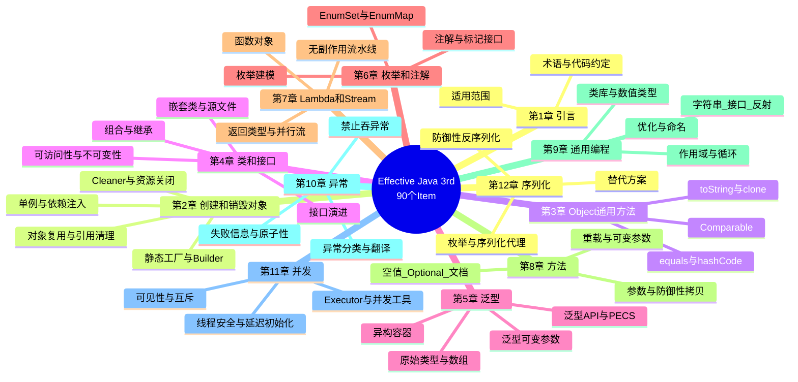
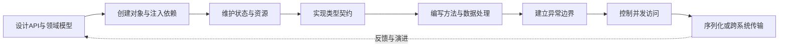

# 《Effective Java（第 3 版）》深度阅读

> **书目信息**：Joshua Bloch, *Effective Java, Third Edition*, Addison-Wesley Professional, 2018，ISBN `978-0-13-468599-1`。
>
> **文本边界**：本文逐条核对指定 PDF `Effective-Java-3rd-LaTex-Pattern.pdf`。该文件标注生成于 2018-02-27，是 `sjsdfg & jianshu` 整理的中文社区译校版，不是出版社正式中文版；其正文覆盖全部 90 个 Item。为避免把译文问题当作作者原意，关键术语同时保留英文，短引文按该 PDF 转录并在必要处校正明显错字。
>
> **时效边界**：第三版以 Java 7、8、9 为主要时代背景。下文用 `【原书】` 标出书中结论，用 `【书后演进】` 标出 JDK 10 至 JDK 21 的补充；后者不是作者在第三版中的原话。

## 一、全书到底在解决什么问题

### 1.1 官方表述、技术背景与通俗解释

作者在英文版前言中对目标的概括是：

> “This book is designed to help you make the most effective use of the Java programming language and its fundamental libraries.”

即：本书旨在帮助开发者更有效地使用 Java 语言及其基础类库。它不是 Java 语法教程，也不是设计模式目录，而是一组关于**语言机制、类库契约和 API 设计取舍**的工程准则。

指定 PDF 的 Item 1 从 Java 最常见的动作“创建对象”切入：

> “一个类可以为其客户端提供静态工厂方法，而不是公共构造方法。提供静态工厂方法而不是公共构造方法有优点也有缺点。”

这段话体现了全书的方法：不把某种写法绝对化，而是先说明机制，再分析收益、代价和使用边界。Item 67 又给出一条贯穿全书的性能原则：

> “要努力编写好的程序而不是快的程序。”

这里的“好”不是抽象审美，而是接口清晰、不变量可靠、错误尽早暴露、共享状态受控、失败可诊断。好的结构也往往更容易优化，因为模块边界允许替换实现，而不必破坏调用方。

通俗地说，Java 语法只回答“这段代码能不能编译”；《Effective Java》继续追问：

- 对象应该怎样被创建，调用者才不容易传错参数？
- 一个类怎样保护自己的状态，几年后仍能安全演进？
- 泛型、枚举、Lambda、Stream 和异常应该在什么边界使用？
- 多线程下“看起来没问题”的代码为什么会失效？
- 为什么实现 `Serializable` 会把内部实现永久变成外部契约？

全书的作用可以压缩为一句话：**把 Java 的语言能力变成可长期维护的设计约束，把许多运行期事故提前变成编译期错误或清晰的 API 决策。**

### 1.2 全书逻辑框架



全书的章节顺序其实是一条由内向外的设计链：先决定对象如何诞生，再规定对象相等与排序的契约；随后设计类型边界、行为表达和方法接口；最后处理运行时失败、并发访问与跨进程数据边界。

### 1.3 与其他学习和治理手段的差异

| 对比对象 | 主要回答的问题 | 优势 | 局限 | 与本书的关系 |
| --- | --- | --- | --- | --- |
| Java 语法/API 教程 | 关键字和类库怎样使用 | 系统入门、覆盖面广 | 很少讨论长期设计代价 | 先会写，再用本书判断“怎样写更稳健” |
| 设计模式书 | 可复用的对象协作结构是什么 | 提供跨语言设计词汇 | 容易脱离具体语言机制 | 本书只在确有收益时使用 Builder、策略、代理等模式 |
| 团队代码规范 | 命名、格式和禁用项如何统一 | 可自动检查，团队一致 | 规则常缺少机制解释 | 可将本书结论转化为团队规则，但不能机械照搬 |
| 静态分析工具 | 哪些代码可能有缺陷 | 自动、持续、可进入 CI | 无法替代 API 和领域建模决策 | Error Prone、SpotBugs、NullAway 可执行部分 Item |
| 框架最佳实践 | Spring/JPA 等具体框架怎样用 | 贴近业务交付 | 生命周期和代理机制可能与普通 Java 不同 | 应先理解本书原则，再处理框架例外 |
| 《Effective Java》 | 如何利用 Java 机制设计可靠程序 | 语言契约与工程取舍结合，规则可追溯 | 不是完整架构方法，且第三版停在 Java 9 | 作为日常编码与代码评审的决策手册 |

与“永远用某种写法”的规范不同，本书最有价值之处是说明**何时成立、为什么成立、何时例外**。例如，组合通常优于继承，但专为继承设计且文档化的类仍可继承；Stream 通常擅长纯数据变换，但复杂控制流继续使用循环会更清楚。

## 二、逐章解读：12 章如何组成一套设计方法

| 章节 | 标题与 Item | 本章核心 | 主要问题与书中方案 |
| --- | --- | --- | --- |
| 第 1 章 | 引言 | 交代目标、范围、术语和示例约定 | 不教语法，专注 Java 语言与基础类库的有效用法 |
| 第 2 章 | 创建和销毁对象（1—9） | 控制构造、依赖、复用和资源终止 | 用静态工厂、Builder、依赖注入和 `try-with-resources`；清除过期引用，不依赖终结机制 |
| 第 3 章 | 所有对象都共有的方法（10—14） | 遵守 `Object` 与排序契约 | 联动实现 `equals/hashCode`，提供有用的 `toString`，谨慎 `clone`，正确实现 `Comparable` |
| 第 4 章 | 类和接口（15—25） | 封装不变量并控制继承和演进 | 最小化可访问性与可变性，组合优于继承，接口只定义类型，优先静态成员类 |
| 第 5 章 | 泛型（26—33） | 把类型错误提前到编译期 | 拒绝原始类型，消除警告，列表优于数组，用 PECS 设计灵活 API |
| 第 6 章 | 枚举和注解（34—41） | 用类型系统表达有限集合与元数据 | 枚举替代整数常量，`EnumSet/EnumMap` 替代位域和序数索引，注解替代命名模式 |
| 第 7 章 | Lambda 和 Stream（42—48） | 用函数对象表达行为，用流水线处理数据 | Lambda 保持简短，优先标准函数式接口，Stream 函数应无副作用，谨慎并行 |
| 第 8 章 | 方法（49—56） | 让 API 在参数、返回值和文档上不易误用 | 尽早校验、防御性拷贝、避免含混重载，返回空集合而非 `null`，谨慎使用 `Optional` |
| 第 9 章 | 通用编程（57—68） | 提升普通实现代码的正确性和清晰度 | 缩小作用域、使用类库和接口、选对数值/字符串类型、测量后优化、遵守命名约定 |
| 第 10 章 | 异常（69—77） | 建立可恢复、可诊断的失败边界 | 异常不用作控制流；按可恢复性分类，翻译底层异常，维持失败原子性，禁止吞异常 |
| 第 11 章 | 并发（78—84） | 控制共享可变状态与线程协作 | 同步既保证互斥也保证可见性；优先任务、Executor 和并发工具，文档化线程安全 |
| 第 12 章 | 序列化（85—90） | 防守不可信字节流和脆弱持久化契约 | 优先替代 Java 原生序列化；不得不用时防御性读取，枚举保持实例控制，优先序列化代理 |

### 2.1 90 个 Item 速查表

下面不是把标题换一种说法，而是为每条建议补出“它在防什么”。标题以指定 PDF 为准，少量术语按 Java 通行译法校正。

| Item | 原书建议 | 工程含义 |
| ---: | --- | --- |
| 1 | 考虑用静态工厂方法代替构造器 | 用名字表达构造语义，并允许缓存、复用或返回子类型 |
| 2 | 构造器参数过多时考虑 Builder | 避免伸缩构造器难读和 JavaBeans 的中间不一致状态 |
| 3 | 用私有构造器或枚举类型强化 Singleton | 阻止额外实例；枚举还能天然处理序列化 |
| 4 | 用私有构造器执行非实例化 | 工具类明确拒绝被实例化和继承 |
| 5 | 依赖注入优于硬连接资源 | 依赖从外部传入，提升灵活性、复用性和可测试性 |
| 6 | 避免创建不必要的对象 | 复用不可变对象和昂贵对象，但不以对象池替代清晰设计 |
| 7 | 消除过期对象引用 | 自管理内存的容器、缓存和监听器最容易发生逻辑泄漏 |
| 8 | 避免 Finalizer 和 Cleaner | 回收时机不确定、性能差且存在安全问题，只能作非关键安全网 |
| 9 | `try-with-resources` 优于 `try-finally` | 正确关闭多个资源，并保留首要异常和受抑制异常 |
| 10 | 重写 `equals` 时遵守通用约定 | 保持自反、对称、传递、一致和非空，警惕继承破坏等价关系 |
| 11 | 重写 `equals` 时总要重写 `hashCode` | 相等对象必须具有相同散列值，否则散列表行为错误 |
| 12 | 始终重写 `toString` | 让日志、调试器和异常信息展示对象的有用状态 |
| 13 | 谨慎重写 `clone` | `Cloneable` 契约脆弱，通常用拷贝构造器/工厂更清晰 |
| 14 | 考虑实现 `Comparable` | 为有自然顺序的值类提供可靠排序，并保持比较契约 |
| 15 | 使类和成员的可访问性最小化 | 隐藏实现细节，缩小受兼容性约束和被误用的表面积 |
| 16 | 公有类使用访问方法而非公有字段 | 保留校验、同步和表示变化的能力；常量是例外 |
| 17 | 最小化可变性 | 不可变对象简单、可共享且天然线程安全 |
| 18 | 组合优于继承 | 避免跨包继承泄露父类实现细节，用转发包装获得复用 |
| 19 | 要么为继承设计并文档化，要么禁止继承 | 说明自用方法、构造期调用等继承契约，否则用 `final` |
| 20 | 接口优于抽象类 | 允许多实现、多继承类型和 mixin；骨架实现可辅助复用 |
| 21 | 为后代设计接口 | 默认方法不能自动维持所有既有实现的不变量，上线前必须测试 |
| 22 | 接口只用于定义类型 | 常量接口泄露实现细节，应使用类、枚举或静态导入 |
| 23 | 类层次结构优于标签类 | 每个变体单独建模，消除无关字段、分支和非法状态 |
| 24 | 优先静态成员类 | 不需要外围实例时切断隐式引用，避免额外空间和泄漏 |
| 25 | 一个源文件只定义一个顶级类 | 避免编译顺序改变程序含义 |
| 26 | 不要使用原始类型 | 保留泛型的编译期安全，`List<?>` 才是未知元素类型 |
| 27 | 消除非受检警告 | 逐条证明安全性；无法消除时最小范围使用 `@SuppressWarnings` 并说明原因 |
| 28 | 列表优于数组 | 数组协变且运行期检查，泛型不变且编译期检查 |
| 29 | 优先考虑泛型 | 让容器和算法调用方无需强转并更早发现错误 |
| 30 | 优先使用泛型方法 | 让同一算法在保持类型安全的前提下适配多种类型 |
| 31 | 用有界通配符提高 API 灵活性 | 遵循 PECS：生产者 `extends`，消费者 `super` |
| 32 | 谨慎结合泛型与可变参数 | 泛型可变参数可能污染堆；仅在证明安全时用 `@SafeVarargs` |
| 33 | 优先类型安全的异构容器 | 以类型令牌 `Class<T>` 作为键，在同一容器保存不同类型值 |
| 34 | 枚举优于整型常量 | 获得命名空间、类型安全、遍历和可附加行为的实例 |
| 35 | 实例字段优于序数 | `ordinal()` 只服务于 `EnumSet/EnumMap` 等内部结构，不承载业务值 |
| 36 | `EnumSet` 优于位字段 | 保留位运算性能，同时得到类型安全和集合 API |
| 37 | `EnumMap` 优于序数索引 | 让键的含义显式，避免数组下标与枚举顺序耦合 |
| 38 | 用接口模拟可扩展枚举 | 枚举本身不可扩展，操作码等场景可让多个枚举实现同一接口 |
| 39 | 注解优于命名模式 | 编译器和工具可验证元数据，避免名称拼写驱动行为 |
| 40 | 坚持使用 `@Override` | 让编译器捕获“以为重写、实际重载”的错误 |
| 41 | 用标记接口定义类型 | 当标记应参与类型检查时，接口优于只提供元数据的注解 |
| 42 | Lambda 优于匿名类 | 函数式接口的简短行为更清楚，但不要让 Lambda 承担长逻辑 |
| 43 | 方法引用优于 Lambda | 在确实更短、更清楚时直接命名已有行为 |
| 44 | 优先标准函数式接口 | 复用 `Function`、`Predicate`、`Consumer`、`Supplier` 及基本类型特化 |
| 45 | 谨慎使用 Stream | 数据变换适合流，复杂控制流、异常或状态更新常更适合循环 |
| 46 | Stream 中优先无副作用函数 | 流水线只做转换，收集结果交给 Collector，避免修改外部状态 |
| 47 | 返回类型优先 `Collection` 而非 `Stream` | 公共 API 尽量同时支持迭代和流；超大/惰性序列另行判断 |
| 48 | 谨慎使用并行 Stream | 只有源易拆分、计算足够大且函数无干扰时，测量后才并行 |
| 49 | 检查参数有效性 | 在错误发生处尽早失败，并在公开 API 文档中写清约束 |
| 50 | 必要时进行防御性拷贝 | 在校验前复制可变输入，返回时也不泄露内部可变对象 |
| 51 | 仔细设计方法签名 | 名称易懂、参数不宜过多，优先接口参数，慎用 `boolean` 开关 |
| 52 | 谨慎使用重载 | 重载在编译期选择，重写在运行期分派；避免同一实参匹配多个重载 |
| 53 | 谨慎使用可变参数 | 每次调用会创建数组；要求至少一个参数时显式声明首参数 |
| 54 | 返回空集合或数组，不返回 `null` | 调用方无需额外分支，也不会因此有明显性能损失 |
| 55 | 谨慎返回 `Optional` | 只用于“可能无结果”的返回值，不用于字段、参数、集合元素或装箱基本类型 |
| 56 | 为公开 API 编写文档注释 | 说明前置/后置条件、副作用、线程安全、异常和泛型参数 |
| 57 | 最小化局部变量作用域 | 在首次使用处声明并初始化，让错误状态存在得更短 |
| 58 | `for-each` 优于传统 `for` | 消除索引/迭代器噪声；并行迭代、过滤删除等情况例外 |
| 59 | 了解并使用类库 | 复用专家实现，获得正确性、性能、维护和版本演进收益 |
| 60 | 精确答案避免 `float/double` | 金额等十进制精确计算使用 `BigDecimal` 或缩放整数 |
| 61 | 基本类型优于包装类型 | 避免身份比较、空拆箱和无意装箱性能成本 |
| 62 | 有更合适类型时避免字符串 | 能用枚举、值类或能力类型表达的概念不要退化成无约束文本 |
| 63 | 当心字符串连接性能 | 循环拼接使用 `StringBuilder`，避免二次方时间和临时对象 |
| 64 | 通过接口引用对象 | 降低实现耦合，使替换实现只影响构造位置 |
| 65 | 接口优于反射 | 反射失去编译期检查且冗长；未知类可反射创建后转为已知接口 |
| 66 | 谨慎使用本地方法 | JNI 增加可移植性、安全、调试和内存风险，不再是常规性能捷径 |
| 67 | 谨慎优化 | 先设计清晰 API，再用基准和剖析器定位真实瓶颈 |
| 68 | 遵守通用命名约定 | 让代码符合 Java 生态预期，减少认知和工具成本 |
| 69 | 异常只用于异常情况 | 不把异常当循环终止或普通分支，避免慢、脆弱和掩盖错误 |
| 70 | 可恢复情况用受检异常，编程错误用运行时异常 | 异常类型应告诉调用方是否需要且能够恢复 |
| 71 | 避免不必要的受检异常 | 调用方无法有效恢复时，强制捕获只会制造样板和吞异常 |
| 72 | 优先使用标准异常 | 复用熟悉语义，如 `IllegalArgumentException`、`IllegalStateException` |
| 73 | 抛出与抽象相对应的异常 | 用异常翻译隔离底层实现；需要诊断时保留 cause |
| 74 | 为方法抛出的异常建立文档 | `@throws` 说明条件，受检和未受检异常都应记录 |
| 75 | 失败消息包含可捕获信息 | 写入参与失败的参数和状态值，不泄露密码等敏感信息 |
| 76 | 努力保持失败原子性 | 失败后对象应保持调用前状态，可用校验、临时副本或恢复代码实现 |
| 77 | 不要忽略异常 | 空 `catch` 会丢失故障证据；确需忽略时说明原因并恰当命名变量 |
| 78 | 同步访问共享可变数据 | 同步既是互斥，也保证线程间变更可见；优先不共享或不可变 |
| 79 | 避免过度同步 | 不在同步区调用可覆盖方法或外部代码，缩小锁范围 |
| 80 | Executor、Task、Stream 优于直接创建线程 | 分离任务与执行机制，便于控制队列、并发度和生命周期 |
| 81 | 并发工具优于 `wait/notify` | 优先用并发集合、协调器和阻塞队列；必须使用时始终在循环中 `wait` |
| 82 | 文档说明线程安全性 | 明确不可变、无条件线程安全、有条件线程安全、非线程安全等等级 |
| 83 | 谨慎使用延迟初始化 | 通常正常初始化更好；确需性能优化时使用正确惯用法 |
| 84 | 不依赖线程调度器 | 正确程序不应依赖优先级或 `yield`；减少可运行线程并合理分工 |
| 85 | 优先选择 Java 序列化替代方案 | 不可信反序列化是远程执行、拒绝服务和数据破坏入口 |
| 86 | 非常谨慎地实现 `Serializable` | 它冻结表示、扩大攻击面、影响继承并增加测试负担 |
| 87 | 考虑自定义序列化形式 | 默认形式绑定物理结构；序列化形式应描述逻辑数据 |
| 88 | 防御性编写 `readObject` | 把它当公开构造器：校验、拷贝且不调用可覆盖方法 |
| 89 | 实例控制优先枚举而非 `readResolve` | 枚举单例更简单，可抵御额外实例和序列化技巧 |
| 90 | 考虑用序列化代理代替序列化实例 | 先反序列化简单代理，再经正常构造路径恢复并验证对象 |

## 三、按软件生命周期重组 90 条规则

原书按语言主题分章，实际写项目时更自然的顺序是：先设计公共边界，再构造和维护对象，随后实现行为，最后处理失败、并发和跨进程数据。



### 3.1 API 与领域模型：先让错误的用法难以表达

对应 Item：1、2、5、15—23、34—41、49—56、64。

#### 背景与作用

API 一旦公开，调用代码就会依赖它。最昂贵的错误往往不是某行实现写错，而是接口允许调用方构造非法状态、混淆参数或依赖具体实现。本书的共同解法是：**把约束编码进类型、构造入口和可见性中。**

Item 1 的最小示例清楚展示了静态工厂可以复用实例：

```java
public static Boolean valueOf(boolean b) {
    return b ? Boolean.TRUE : Boolean.FALSE;
}
```

它相对构造器有五项主要优势：有名字；不必每次创建新对象；可返回声明类型的子类型；返回类型可由参数决定；方法存在时返回类甚至可以尚未加载。主要代价是：若不提供可访问构造器，类不能被常规继承；静态工厂在 API 文档中不如构造器醒目。

当可选参数较多时，Item 2 比较了伸缩构造器、JavaBeans 和 Builder。下面保留书中 `NutritionFacts` 示例的核心结构：

```java
public class NutritionFacts {
    private final int servingSize;
    private final int servings;
    private final int calories;

    public static class Builder {
        private final int servingSize;
        private final int servings;
        private int calories = 0;

        public Builder(int servingSize, int servings) {
            this.servingSize = servingSize;
            this.servings = servings;
        }

        public Builder calories(int value) {
            calories = value;
            return this;
        }

        public NutritionFacts build() {
            return new NutritionFacts(this);
        }
    }

    private NutritionFacts(Builder builder) {
        servingSize = builder.servingSize;
        servings = builder.servings;
        calories = builder.calories;
    }
}

NutritionFacts cola = new NutritionFacts.Builder(240, 8)
        .calories(100)
        .build();
```

Builder 同时保留了命名参数般的可读性和一次构造完成的不变量；代价是先创建 Builder，并增加代码量。只有四五个参数且不会继续增长时，静态工厂或清晰构造器可能更简单。

#### 领域建模：消灭非法状态

Item 23 用“标签类”说明坏模型：一个 `Figure` 同时保存圆形半径和矩形长宽，再以 `shape` 分支决定哪些字段有效。类层次让每个子类型只拥有自己的状态。今天还可使用封闭层次表达有限变体：

```java
// 【书后演进：Java 17】sealed 限定合法实现集合
sealed interface Shape permits Circle, Rectangle {
    double area();
}

record Circle(double radius) implements Shape {
    Circle {
        if (radius < 0) throw new IllegalArgumentException("radius: " + radius);
    }

    @Override public double area() {
        return Math.PI * radius * radius;
    }
}

record Rectangle(double width, double height) implements Shape {
    @Override public double area() {
        return width * height;
    }
}
```

`record` 自动生成访问器、`equals`、`hashCode` 和 `toString`，但它不自动保证业务不变量；紧凑构造器仍需校验。`sealed` 也没有推翻 Item 19：开放继承仍需明确契约，只是有限层次更容易穷举和维护。

#### 方法边界的实际检查清单

- 名称应表达动作；同一类避免只有参数顺序不同的重载（Item 51、52）。
- 参数超过四个时考虑参数对象或 Builder，但不要为简单方法制造无意义 DTO（Item 51）。
- 在方法开头校验普通参数；构造器接收可变对象时应**先拷贝再校验**，防止检查与复制之间被其他线程修改（Item 49、50）。
- 返回空集合而不是 `null`；返回共享空数组时要保证不会泄露可变内部状态（Item 54）。
- `Optional<T>` 主要作为无法返回结果的方法返回类型；集合本身已能表达空，不要返回 `Optional<List<T>>`（Item 55）。
- 公共 API 文档写清前置条件、后置条件、副作用、异常和线程安全，不要只复述方法名（Item 56、82）。

#### 术语

- **API（Application Programming Interface）**：应用程序编程接口；这里包括公开类型、方法、字段、异常和行为契约。
- **Invariant（不变量）**：对象在所有可观察时刻都必须成立的条件，例如结束时间不得早于开始时间。
- **Static Factory Method（静态工厂方法）**：返回实例的静态方法，不等同于 GoF 的 Factory Method 模式。
- **Builder**：分步骤收集构造参数，最终一次性创建目标对象的模式。
- **Dependency Injection，DI（依赖注入）**：对象不在内部写死依赖，而由构造器、工厂或框架提供。
- **Mixin（混入）**：类型除主要职责外提供的可选能力，例如 `Comparable`。
- **Marker Interface（标记接口）**：没有方法、只通过类型关系表达属性的接口，如 `Serializable`。

#### 局限与框架例外

JPA 实体、Jackson、依赖注入容器或代理框架有时需要无参构造器、非 `final` 类或 Bean 访问器。这不是本书原则失效，而是框架加入了额外协议。处理方式是缩小例外：构造器可设为 `protected`，把可变实体限制在持久化边界，向业务层映射为不可变值对象，并用集成测试确认代理和序列化行为。

### 3.2 对象出生、使用与终止：生命周期必须由代码明确管理

对应 Item：3—9、17、24。

#### 依赖与实例控制

Item 5 的核心不是“必须使用 DI 框架”，而是不要在类里硬编码资源。一本词典检查器若把某个 `Lexicon` 写成静态常量，就无法切换语言或测试替身。构造器注入已经足够：

```java
public final class SpellChecker {
    private final Lexicon dictionary;

    public SpellChecker(Lexicon dictionary) {
        this.dictionary = Objects.requireNonNull(dictionary);
    }
}
```

需要每次创建资源时，可注入 `Supplier<? extends Resource>`。`Supplier` 是供应者函数，不接收参数并返回对象；`? extends` 允许工厂返回资源子类型。

Singleton 适合无状态服务或唯一协调器，但全局状态会妨碍测试。Item 3 给出的枚举方式最简洁：

```java
public enum Elvis {
    INSTANCE;

    public void leaveTheBuilding() { /* ... */ }
}
```

如果实例必须继承枚举以外的父类，枚举方式不适用；通常应重新确认是否真的需要继承和全局唯一。

#### 资源终止：GC 不等于资源管理

垃圾收集器只管理 Java 堆内存，不保证及时释放文件描述符、Socket、数据库连接或本地句柄。Item 8 的结论非常明确：Finalizer/Cleaner 的执行时间不可预测，可能导致性能、安全和可用性问题；Cleaner 最多作为非关键资源的安全网。

Item 9 的标准写法是：

```java
static String firstLineOfFile(String path, String defaultValue) {
    try (BufferedReader reader = new BufferedReader(new FileReader(path))) {
        return reader.readLine();
    } catch (IOException e) {
        return defaultValue;
    }
}
```

多个资源按声明的逆序关闭。若业务代码和 `close()` 都抛出异常，业务异常保留为主异常，关闭异常可通过 `getSuppressed()` 检查；这比嵌套 `finally` 更利于诊断。

#### 内存泄漏的三类高风险点

Item 7 不是要求把所有不用的字段都设为 `null`。正常对象离开作用域后，GC 自会处理。真正高风险的是：

1. 类自己管理内存，如数组实现的栈；弹出元素后应清空对应槽位。
2. 缓存没有明确淘汰策略；可按生命周期选 `WeakHashMap`，或由后台任务/访问时清理。
3. 监听器和回调注册后没有注销；必要时使用弱引用，但更重要的是提供明确关闭协议。

```java
public Object pop() {
    if (size == 0) throw new EmptyStackException();
    Object result = elements[--size];
    elements[size] = null; // 释放过期引用
    return result;
}
```

#### 术语

- **GC（Garbage Collection）**：垃圾收集，回收不可达的堆对象；不等于确定性释放外部资源。
- **Obsolete Reference（过期引用）**：程序逻辑上已不再需要、但仍被可达对象保存的引用。
- **Finalizer**：旧式 `finalize()` 终结机制；执行不确定，已不应承担资源关闭。
- **Cleaner**：Java 9 提供的清理注册机制，风险小于 Finalizer，但仍不是确定性关闭方案。
- **`AutoCloseable`**：声明 `close()` 的资源协议，使对象可进入 `try-with-resources`。
- **Suppressed Exception（受抑制异常）**：资源关闭阶段发生、附着在主异常上的次要异常。

#### 书后变化

Java 9 改进了 `try-with-resources`，已初始化的 effectively final 变量可直接写入 `try (resource)`。Finalization 在后续 JDK 中被标记为废弃并计划移除，但不论运行在哪个版本，核心原则不变：**资源所有权必须显式、关闭必须确定。**

### 3.3 值语义与对象契约：集合正确性的地基

对应 Item：10—14、17、50、60—62。

#### `equals`、`hashCode`、排序必须成套思考

若类的每个实例本来就代表唯一身份，或超类已有合适实现，就不必重写 `equals`。值类需要逻辑相等时，必须满足：

- 自反性：`x.equals(x)` 为真。
- 对称性：`x.equals(y)` 与 `y.equals(x)` 一致。
- 传递性：`x=y` 且 `y=z`，则 `x=z`。
- 一致性：对象未变化时结果稳定。
- 非空性：`x.equals(null)` 为假。

Item 10 用 `Point`/`ColorPoint` 说明一个根本限制：**无法在扩展可实例化类并增加值组件的同时，仍完美保留 `equals` 契约。** 与其在 `instanceof` 和 `getClass()` 之间制造对称性或里氏替换冲突，不如组合一个 `Point` 并提供视图方法。

```java
@Override public boolean equals(Object object) {
    if (object == this) return true;
    if (!(object instanceof PhoneNumber other)) return false;
    return areaCode == other.areaCode
            && prefix == other.prefix
            && lineNum == other.lineNum;
}

@Override public int hashCode() {
    int result = Short.hashCode(areaCode);
    result = 31 * result + Short.hashCode(prefix);
    return 31 * result + Short.hashCode(lineNum);
}
```

上例的模式变量 `other` 是 `【书后演进：Java 16】` 写法；第三版原代码需要显式强转。`Objects.hash(...)` 更短，但因可变参数数组和装箱可能更慢，性能敏感值对象可使用手写散列。

实现 `Comparable` 时，不要用减法比较整数，因为可能溢出；应使用基本类型 `compare` 方法或比较器构造方法：

```java
private static final Comparator<PhoneNumber> COMPARATOR =
        Comparator.comparingInt((PhoneNumber p) -> p.areaCode)
                .thenComparingInt(p -> p.prefix)
                .thenComparingInt(p -> p.lineNum);

@Override public int compareTo(PhoneNumber phoneNumber) {
    return COMPARATOR.compare(this, phoneNumber);
}
```

还要记录自然顺序是否与 `equals` 一致。`BigDecimal("1.0")` 与 `BigDecimal("1.00")` 比较值为 0，但 `equals` 为假，因此 `HashSet` 与 `TreeSet` 对它们的“重复”判断不同。

#### 不可变对象的构造规则

Item 17 给出五条原则：不提供改变状态的方法；类不可扩展；字段为 `final`；字段为 `private`；确保可变组件不被外部访问。不可变对象可以自由共享、作为其他对象的组件，并天然具备线程安全性。

局限是多阶段构造或每次细小变化都会产生新对象；此时可在内部使用可变伴生类，例如 `StringBuilder` 服务于 `String`。不要因为“不可变”就缓存所有实例，缓存本身需要生命周期策略。

#### 精确数值与领域类型

`float` 和 `double` 使用二进制浮点，不能精确表示多数十进制小数。货币计算使用 `BigDecimal` 或最小货币单位的整数：

```java
BigDecimal price = new BigDecimal("1.10"); // 字符串构造，避免先产生二进制误差
BigDecimal total = price.multiply(BigDecimal.valueOf(3));
```

“避免字符串”并不意味着少用文本，而是不要让字符串冒充有规则的类型。电话号码、货币、权限、类名和 SQL 片段各有不同约束；值类、枚举和接口能让编译器参与验证。

#### 术语

- **Value Object（值对象）**：身份由值而非对象地址决定的对象。
- **Equivalence Relation（等价关系）**：满足自反、对称、传递的关系，是 `equals` 契约的数学基础。
- **Natural Ordering（自然顺序）**：类型通过 `Comparable` 给出的默认排序。
- **Defensive Copy（防御性拷贝）**：在输入和输出边界复制可变对象，避免外部引用破坏内部状态。
- **Binary Floating Point（二进制浮点）**：以二进制近似表示实数，适合科学计算，不适合精确十进制金额。

### 3.4 封装、组合与继承：让类型可以安全演进

对应 Item：15—25、64、65。

#### 为什么组合通常更稳健

Item 18 的经典反例是继承 `HashSet` 后重写 `add` 和 `addAll` 做计数：如果父类 `addAll` 内部调用 `add`，一次批量添加会被重复计数。这种错误来自对父类实现细节的依赖。

组合与转发把依赖限制在公开契约：

```java
public class InstrumentedSet<E> extends ForwardingSet<E> {
    private int addCount = 0;

    public InstrumentedSet(Set<E> set) {
        super(set);
    }

    @Override public boolean add(E element) {
        addCount++;
        return super.add(element);
    }

    @Override public boolean addAll(Collection<? extends E> elements) {
        addCount += elements.size();
        return super.addAll(elements);
    }
}
```

`ForwardingSet` 是把 `Set` 方法转发给被包装对象的可复用类。包装不适合回调框架中依赖对象自引用的场景：被包装对象把 `this` 交给外部时，回调可能绕过包装层，这被称为 SELF problem。

#### 继承什么时候成立

继承适用于真正的 is-a 关系，且父类明确为继承设计。Item 19 要求文档说明可覆盖方法之间的自用关系，并通过测试验证子类。构造器不得调用可覆盖方法，因为子类字段尚未初始化。

接口比抽象类灵活，但默认方法并非给接口演进开了“安全后门”。Item 21 以 Java 8 `Collection.removeIf` 为例：默认实现可能破坏某些同步包装类的不变量。发布接口前仍需测试多个实现；已发布接口新增默认方法时要评估每个实现。

#### 可访问性与模块

可访问性越小，未来可修改空间越大。公开静态 `final` 数组依然可变，不能作为常量暴露；应返回不可变视图或防御性副本。Java 9 模块系统增加了模块级导出边界，但模块内部的封装不能替代类级可见性设计。

#### 术语

- **Encapsulation（封装）**：隐藏表示和实现决策，只暴露稳定契约。
- **Inheritance（继承）**：子类复用并扩展父类实现；这里特指实现继承，而非接口类型继承。
- **Composition（组合）**：对象持有另一个对象并通过其公开接口协作。
- **Forwarding（转发）**：包装类把方法调用委托给内部对象。
- **Skeletal Implementation（骨架实现）**：接口配套的抽象类，提供大部分通用实现，如 `AbstractList`。
- **Default Method（默认方法）**：接口中带实现的方法，Java 8 引入，主要用于接口演进和行为组合。

### 3.5 泛型、枚举和注解：让编译器证明更多事情

对应 Item：26—41。

#### 泛型解决什么问题

原始类型 `List` 允许任何对象进入容器，错误直到取值强转时才出现；`List<String>` 把错误移到插入点。若确实不知道元素类型，使用 `List<?>`：它能安全读取为 `Object`，但除 `null` 外不能随意写入。

数组与泛型的差异是本章难点：

| 特性 | 数组 | 泛型集合 |
| --- | --- | --- |
| 类型关系 | 协变：`Sub[]` 是 `Super[]` | 不变：`List<Sub>` 不是 `List<Super>` |
| 类型检查 | 运行期，可能 `ArrayStoreException` | 编译期 |
| 类型信息 | 具体化（reified） | 擦除（erasure） |
| 与可变参数组合 | 原生机制 | 可能产生堆污染警告 |

PECS 是最重要的 API 设计口诀：`Producer Extends, Consumer Super`。若参数只生产 `T`，用 `? extends T`；若只消费 `T`，用 `? super T`。

```java
public static <E> Set<E> union(
        Set<? extends E> first,
        Set<? extends E> second) {
    Set<E> result = new HashSet<>(first);
    result.addAll(second);
    return result;
}
```

返回类型不要使用通配符，否则调用者被迫继续处理通配符。若调用方需要考虑通配符，通常是 API 应继续优化的信号。

#### 泛型可变参数与堆污染

可变参数会创建数组，而泛型元素类型运行期被擦除，因此 `List<String>...` 可能被当作 `Object[]` 写入其他类型。只有方法不向数组写入任何值、也不把数组暴露给不受信任代码时，才可标注 `@SafeVarargs`。Java 9 把该注解扩展到私有实例方法。

#### 枚举是在定义完整类型

Item 34 的枚举不是“更漂亮的整数常量”。每个枚举常量都是受控实例，可带字段、方法和常量特定行为：

```java
public enum Operation {
    PLUS("+")  { public double apply(double x, double y) { return x + y; } },
    MINUS("-") { public double apply(double x, double y) { return x - y; } },
    TIMES("*") { public double apply(double x, double y) { return x * y; } },
    DIVIDE("/"){ public double apply(double x, double y) { return x / y; } };

    private final String symbol;

    Operation(String symbol) { this.symbol = symbol; }
    public abstract double apply(double x, double y);
}
```

业务代码不要持久化 `ordinal()`：在枚举中间插入常量就会改变序数。用显式字段保存协议码。多个枚举值的集合用 `EnumSet`，枚举到值的映射用 `EnumMap`；二者内部紧凑，但对外仍是类型安全的集合接口。

#### 注解、标记接口怎样选择

Item 39 用测试框架说明注解优于方法名约定：`@Test` 可被工具发现和验证，拼错方法名不会悄悄漏测。标记接口则能限制参数类型，并在编译期参与重载解析。只需要运行期元数据、标记适用于类以外的元素，或框架以反射消费时，注解更合适。

#### 术语

- **Raw Type（原始类型）**：省略泛型参数的旧兼容写法，如 `List`。
- **Type Erasure（类型擦除）**：Java 泛型主要在编译期生效，运行期擦除多数类型参数信息。
- **PECS**：Producer Extends, Consumer Super，有界通配符选择原则。
- **Heap Pollution（堆污染）**：参数化类型变量引用了不属于该类型的对象。
- **Type Token（类型令牌）**：运行期表示类型的对象，常见为 `Class<T>`。
- **EnumSet / EnumMap**：专为枚举键优化的集合，分别表示集合和映射。
- **Annotation（注解）**：可供编译器、工具或运行期读取的结构化元数据。

### 3.6 Lambda 与 Stream：行为是值，流水线应保持纯净

对应 Item：42—48。

#### 从匿名类到函数对象

Lambda 适合函数式接口，即只有一个抽象方法的接口。它省略类型和样板，但也没有名称和独立文档，因此作者建议保持简短；逻辑超过几行时，提取为命名方法通常更清楚。

```java
// Lambda
Collections.sort(words, (first, second) ->
        Integer.compare(first.length(), second.length()));

// 方法引用与比较器构造方法表达意图更直接
words.sort(Comparator.comparingInt(String::length));
```

优先标准函数式接口能与类库协作。注意基本类型特化，如 `IntPredicate`、`LongBinaryOperator`，可避免装箱。若接口名称能表达重要领域契约，或需要多个抽象方法，就应定义自己的接口。

#### Stream 适合什么、不适合什么

Stream 是元素序列上的计算流水线；中间操作惰性执行，终止操作触发计算。它擅长筛选、映射、分组、归约，不擅长需要修改多个局部变量、提前跳出多层逻辑、细粒度异常处理的流程。

Item 46 的频率表例子展示了副作用与 Collector 的差异：

```java
Map<String, Long> frequency = words.stream()
        .collect(Collectors.groupingBy(
                String::toLowerCase,
                Collectors.counting()));
```

流水线中的函数不依赖也不修改外部可变状态，才能安全推理并有机会并行。`forEach` 主要用于报告结果，不应承担核心归约。

#### 返回 `Collection` 还是 `Stream`

第三版建议公共 API 优先返回 `Collection`，因为调用者既可 `for-each`，也可 `.stream()`。但如果序列巨大、无限、一次性或天然惰性，物化集合会浪费内存，此时 `Stream` 或 `Iterable` 更合适，并应文档化资源关闭和重复消费限制。

#### 并行流不是免费加速

Item 48 的判断条件包括：

- 数据源易于精确拆分，如 `ArrayList`、数组、`IntStream.range`；`LinkedList` 和 `Stream.iterate` 较差。
- 中间操作无干扰、无状态，终止操作适合归约。
- 每个元素计算量足够大，能够覆盖线程调度和合并成本。
- 修改前后用真实工作负载测量，并验证结果正确性。

并行流默认使用公共 ForkJoinPool，可能和进程内其他任务争用。Web 服务中随手加 `.parallel()` 可能降低整体吞吐量；这是局部基准无法发现的系统级代价。

#### 术语

- **Functional Interface（函数式接口）**：只有一个抽象方法、可作为 Lambda 目标类型的接口。
- **Function Object（函数对象）**：把行为封装为可传递的对象。
- **Stream Pipeline（流流水线）**：数据源、中间操作和终止操作组成的计算链。
- **Side Effect（副作用）**：除返回结果外对外部状态的可观察修改。
- **Reduction（归约）**：把元素序列组合成一个结果，如求和、分组或收集。
- **Fork/Join**：递归拆分任务并合并结果的并行执行框架。

### 3.7 普通实现代码：清晰优先，性能必须由证据驱动

对应 Item：57—68。

#### 从小作用域到稳定抽象

局部变量在首次使用处声明并初始化，循环变量限制在循环内。`for-each` 避免索引和迭代器变量，但需要删除元素、并行遍历多个集合或原地替换时，应选择迭代器、索引或集合 API。

“了解并使用类库”不是偷懒，而是复用经过审查、优化并持续维护的实现。例如随机整数不应手写 `Math.abs(random.nextInt()) % n`：`MIN_VALUE` 的绝对值仍为负，模运算还有偏差。应使用 `Random.nextInt(bound)`；并发场景使用 `ThreadLocalRandom`，可拆分并行计算使用 `SplittableRandom`。

通过接口声明变量可以推迟实现选择：

```java
Set<String> names = new LinkedHashSet<>();
// 若顺序不再需要，只需在构造位置替换实现
```

如果依赖实现类特有能力，就应诚实地使用实现类型；不要为了形式上的“面向接口”频繁强转。

#### 反射、本地方法与优化

反射可在编译期未知类名时加载实现，但应尽早把对象转换为编译期已知接口。反射调用冗长、异常处理复杂、失去类型检查，也常阻碍重构工具。

JNI（Java Native Interface）适合访问平台特有设施、已有本地库或极少数经测量的性能热点。现代 JVM 优化已很成熟，普通计算不应因猜测而下沉到 C/C++；跨边界调用、内存安全、部署和调试成本都很高。

Item 67 的完整方法论是：

1. 设计清晰的信息隐藏边界，避免 API 强迫低效实现。
2. 完成系统后测量性能，找到真正瓶颈。
3. 检查算法选择，再考虑局部优化。
4. 每次修改后重新测量；优化可能无效甚至变慢。

微基准可用 JMH（Java Microbenchmark Harness），不要用单次 `System.nanoTime()` 猜测，因为 JIT 预热、常量折叠、逃逸分析和 GC 会严重干扰结果。

#### 术语

- **JNI（Java Native Interface）**：Java 与本地二进制代码互操作的接口。
- **Reflection（反射）**：运行期检查并调用类、构造器、方法和字段的机制。
- **JIT（Just-In-Time Compilation）**：即时编译，JVM 在运行期把热点字节码编译为机器码。
- **JMH（Java Microbenchmark Harness）**：OpenJDK 提供的 Java 微基准工具框架。
- **Profiling（性能剖析）**：采集 CPU、内存、锁、I/O 等运行数据以定位瓶颈。

### 3.8 异常：把失败变成清晰、可恢复、可诊断的契约

对应 Item：69—77。

#### 异常不是控制流

Item 69 展示了用 `ArrayIndexOutOfBoundsException` 终止循环的反例。它比正常边界检查难读、可能更慢，并会把循环体内真正的越界错误误当作正常结束。正常情况用返回值、状态方法或迭代协议表达；异常保留给方法无法正常完成的情况。

#### 受检异常还是运行时异常

判断标准不是“业务异常都受检”，而是调用者是否**能够且应该恢复**：

- 受检异常：调用者可以采取替代路径、重试或提示用户修正。
- 运行时异常：前置条件被破坏、对象状态错误或程序存在缺陷。
- `Error`：JVM 资源不足等严重情况，应用通常不应捕获。

受检异常若只迫使每层写 `catch` 再包装，说明抽象可能不合适。可通过状态查询方法、返回 `Optional`，或在调用方无法恢复时改用运行时异常；但不要为了“代码短”丢失可恢复语义。

#### 异常翻译与失败原子性

底层异常泄露会让上层 API 绑定实现。高层捕获底层异常并抛出符合自身抽象的异常，同时保留 cause：

```java
try {
    return repository.load(id);
} catch (SQLException cause) {
    throw new OrderLoadException("orderId=" + id, cause);
}
```

消息应包含所有有助于捕获失败的信息，但不要写密码、令牌或完整个人数据。失败后对象最好保持原状态。常见办法是先校验、在临时副本上计算、调整操作顺序，或提供恢复代码。不可变对象天然更容易满足失败原子性。

#### 绝不能空 `catch`

只有非常少的情况允许忽略异常，例如关闭只读输入流；即便如此也应注释原因，并把变量命名为 `ignored`。日志后继续抛出可能造成重复日志，边界层应统一决定记录还是转换。

#### 术语

- **Checked Exception（受检异常）**：编译器要求捕获或声明的异常。
- **Unchecked Exception（非受检异常）**：`RuntimeException` 及其子类，编译器不强制处理。
- **Exception Translation（异常翻译）**：把底层异常转换成与当前抽象一致的异常。
- **Exception Chaining（异常链）**：把底层异常作为 cause 保留，兼顾抽象与诊断。
- **Failure Atomicity（失败原子性）**：方法失败后对象仍保持调用前的有效状态。

### 3.9 并发：首选不共享，其次用高层工具，最后才手写同步

对应 Item：17、46、48、78—84。

#### `synchronized` 同时解决两件事

同步不仅阻止两个线程同时执行临界区，还保证一个线程的写入对另一个线程可见。Item 78 的停止线程反例中，未同步的布尔字段可能被 JIT 提升出循环，工作线程永远看不到变化。

只需要可见性时，`volatile` 可用：

```java
public final class StoppableTask implements Runnable {
    private volatile boolean stopRequested;

    public void requestStop() {
        stopRequested = true;
    }

    @Override public void run() {
        while (!stopRequested) {
            // 执行一小段可终止工作
        }
    }
}
```

但 `volatile` 不保证复合操作原子性，`nextSerialNumber++` 仍有竞态。计数器用 `AtomicLong`，复合状态用锁或重新设计为消息传递/不可变快照。

#### 为什么不能在锁内调用外部代码

可覆盖方法、回调和用户提供函数都属于外来方法。它们可能耗时、重入、获得其他锁或修改集合，从而造成死锁和状态损坏。Item 79 建议在锁内完成最小状态变更，把通知目标复制到快照后在锁外回调。

#### 任务与执行策略分离

不要为每个请求直接 `new Thread`。Executor 把“做什么”与“在哪些线程、按什么队列策略执行”分离：

```java
ExecutorService executor = Executors.newFixedThreadPool(8);
try {
    Future<Result> future = executor.submit(() -> compute());
    Result result = future.get();
} finally {
    executor.shutdown();
}
```

生产系统需明确队列是否有界、拒绝策略、任务超时、线程命名和关闭流程。`Executors.newFixedThreadPool` 使用无界队列，在流量不可控时可能积压内存，应根据负载直接配置 `ThreadPoolExecutor`。

并发集合把多个操作合并为原子操作。例如缓存用 `ConcurrentHashMap.computeIfAbsent`，不要先 `get` 再 `put` 制造检查后行动竞态。线程协调优先 `CountDownLatch`、`Semaphore`、`BlockingQueue`、`Phaser`，而非裸 `wait/notify`。

#### 【书后演进：Java 21】虚拟线程改变了什么

虚拟线程大幅降低“一个阻塞任务一个线程”的成本，适合大量以阻塞 I/O 为主、彼此独立的任务：

```java
try (ExecutorService executor = Executors.newVirtualThreadPerTaskExecutor()) {
    Future<String> first = executor.submit(() -> fetchFirst());
    Future<String> second = executor.submit(() -> fetchSecond());
    System.out.println(first.get() + second.get());
}
```

它强化而非推翻 Item 80 的“任务优于线程”：开发者提交任务，由执行器管理线程。它没有消除数据竞争、锁顺序、事务连接上限或外部服务容量。不要用固定大小虚拟线程池做限流；对稀缺资源使用 `Semaphore` 或连接池显式限制并发。

#### 线程安全文档

公开类应说明自己属于哪一类：不可变、无条件线程安全、有条件线程安全、非线程安全、线程对立。若调用方需要持有某把锁完成复合操作，必须说明锁对象和调用顺序，否则“每个方法都同步”仍不足以正确使用。

#### 术语

- **Mutual Exclusion（互斥）**：同一时间只有一个线程进入受保护临界区。
- **Visibility（可见性）**：一个线程对共享变量的写入何时能被另一个线程观察到。
- **Atomicity（原子性）**：操作不可被观察到中间状态。
- **Race Condition（竞态条件）**：结果依赖不可控的线程交错顺序。
- **Liveness（活性）**：程序持续取得进展的性质；死锁、活锁、饥饿都会破坏活性。
- **Executor**：接收任务并控制线程、队列和调度策略的执行框架。
- **Virtual Thread（虚拟线程）**：由 JVM 调度的轻量线程，Java 21 正式提供，主要提高阻塞式并发的可扩展性。

### 3.10 序列化与系统边界：输入数据始终是不可信的

对应 Item：50、62、85—90。

#### 为什么作者把序列化放在最后警告

Java 原生序列化能绕过普通构造器，直接恢复对象图。实现 `Serializable` 不只是加一个标记：类的私有表示变成序列化形式，内部字段被兼容性约束，反序列化入口也扩大攻击面。

Item 85 建议优先使用跨平台、可审查的数据表示，例如 JSON 或 Protocol Buffers，并通过正常构造器建立领域对象。格式替代不自动等于安全：仍需限制大小、深度、类型、数字范围和未知字段。

```java
// 边界 DTO 与领域构造分开，反序列化后仍走正常校验
public record PeriodDto(Instant start, Instant end) {
    Period toDomain() {
        return new Period(start, end);
    }
}
```

#### 不得不用原生序列化时

- 明确并固定 `serialVersionUID`，但不要误以为它提供安全性。
- `readObject` 像公有构造器一样校验每个不变量，并防御性复制可变组件。
- 在对象完全构造前不调用可覆盖方法。
- 对单例使用枚举；`readResolve` 容易因引用类型字段被攻击。
- 重要不变量优先序列化代理。
- 对不可信数据使用 JEP 290 对象输入过滤器，并在入口处设置白名单、深度、引用数和数组大小限制。

#### 序列化代理的思想

代理类只保存外围类的逻辑状态。序列化时 `writeReplace` 返回代理；反序列化时代理的 `readResolve` 调用外围类正常构造器。这样，不变量只维护一处：

```java
private static class SerializationProxy implements Serializable {
    private final Date start;
    private final Date end;

    SerializationProxy(Period period) {
        this.start = period.start;
        this.end = period.end;
    }

    private Object readResolve() {
        return new Period(start, end);
    }
}

private Object writeReplace() {
    return new SerializationProxy(this);
}

private void readObject(ObjectInputStream stream)
        throws InvalidObjectException {
    throw new InvalidObjectException("Proxy required");
}
```

局限是不能用于可由客户端扩展的类，也不适合某些含环的对象图，并有额外开销。若数据要长期存储或跨语言通信，显式 schema 的协议通常更合适。

#### 方案比较

| 方案 | 可读性 | 跨语言 | Schema/兼容性 | 主要风险与场景 |
| --- | --- | --- | --- | --- |
| Java 原生序列化 | 低 | 差 | 与类实现强耦合 | 仅可信、封闭、遗留 Java 系统；反序列化攻击面大 |
| JSON | 高 | 好 | 默认较弱，可配 JSON Schema | Web API、配置；需严格校验类型和大小 |
| Protocol Buffers | 低 | 好 | 字段号驱动，演进规则明确 | 内部 RPC、事件；不要复用或改变既有字段号语义 |
| Avro | 中 | 好 | Schema 演进和数据平台支持强 | 数据管道、消息和存储 |
| 数据库显式映射 | 查询友好 | 语言无关 | 由迁移脚本管理 | 长期业务状态；对象模型与表模型需隔离 |

#### 术语

- **Serialization（序列化）**：把内存对象编码为可存储或传输的数据。
- **Deserialization（反序列化）**：从外部数据重建对象；本质上是一个输入解析和对象构造入口。
- **`serialVersionUID`**：Java 序列化版本标识，用于兼容性检查，不是安全校验。
- **Serialization Proxy（序列化代理）**：用简单逻辑表示替代直接序列化真实对象的模式。
- **Object Input Filter（对象输入过滤器）**：限制反序列化类型、深度、引用数和数组长度的安全机制。
- **Schema（模式）**：数据字段、类型、约束和演进规则的显式定义。

## 四、第三版之后：哪些原则变化了，哪些反而更重要

| 第三版所处能力 | JDK 21 中的演进 | 对原书结论的影响 |
| --- | --- | --- |
| 普通类手写值语义 | Record（Java 16） | 减少 Item 10—12 的样板；业务不变量、防御性拷贝仍需设计 |
| 开放类层次 | Sealed Class（Java 17） | Item 23 的有限层次更容易表达，Item 19 的继承契约仍成立 |
| `instanceof` 后强转 | 模式匹配 `instanceof`（Java 16） | `equals` 更简洁，不改变等价关系契约 |
| 传统 `switch` | Switch 表达式及模式匹配（Java 14/21） | 枚举/封闭层次穷举更清晰；不要依赖枚举序数 |
| 平台线程池 | 虚拟线程（Java 21） | 阻塞任务的线程成本显著下降；Item 78、79、81、82 的共享状态规则不变 |
| Java 9 反序列化过滤 | 上下文特定过滤器（JEP 415，Java 17） | 进一步落实 Item 85 的默认拒绝思想，但最优方案仍是避免不可信原生反序列化 |
| Java 9 集合工厂 | `List.of`、`Set.of`、`Map.of` 已广泛使用 | 更容易返回不含 `null` 的不可修改集合；它们不等同于深度不可变 |
| 匿名类/普通 DTO | Record、Lambda、方法引用 | 样板更少，但过长 Lambda、泄露可变组件仍违反原书原则 |

有几条看似“旧”的建议在现代 Java 中更重要：框架和注解增加了隐式行为，要求更清楚的 API 边界；云服务放大了并发和资源泄漏；供应链与反序列化攻击使输入防御成为默认要求。新语法减少了样板，却没有替开发者决定等价性、不变量、所有权和失败语义。

## 五、可复现的 JDK 21 阅读与实验环境

原书不是环境搭建教程。以下以 Windows PowerShell 和 JDK 21 LTS 为基线，可以逐条运行书中示例并启用更严格检查。

### 5.1 安装并确认 JDK

安装 Eclipse Temurin、Microsoft Build of OpenJDK、Oracle JDK 等任一 JDK 21 发行版。确认 `JAVA_HOME` 指向 JDK 根目录，`Path` 包含其 `bin` 目录，然后重新打开 PowerShell：

```powershell
java -version
javac -version
jshell --version
```

三条命令都应显示主版本 `21`。如果 `java` 与 `javac` 来自不同目录，先执行 `Get-Command java,javac` 检查路径，避免只安装 JRE 或残留旧版本。

### 5.2 创建最小实验目录

```powershell
New-Item -ItemType Directory -Path .\effective-java-lab
Set-Location .\effective-java-lab
New-Item -ItemType Directory -Path .\src
```

在 `src\Money.java` 中写入：

```java
import java.math.BigDecimal;
import java.util.Currency;
import java.util.Objects;

public record Money(BigDecimal amount, Currency currency)
        implements Comparable<Money> {
    public Money {
        Objects.requireNonNull(amount, "amount");
        Objects.requireNonNull(currency, "currency");
    }

    @Override public int compareTo(Money other) {
        if (!currency.equals(other.currency)) {
            throw new IllegalArgumentException("different currencies");
        }
        return amount.compareTo(other.amount);
    }

    public static void main(String[] args) {
        Money price = new Money(new BigDecimal("19.90"), Currency.getInstance("CNY"));
        System.out.println(price);
    }
}
```

编译时开启全部 lint，并运行断言：

```powershell
New-Item -ItemType Directory -Path .\out
javac -Xlint:all -Werror -d .\out .\src\Money.java
java -ea -cp .\out Money
```

`-Xlint:all` 开启原始类型、非受检转换、序列化等警告；`-Werror` 把警告视为错误，适合实验和 CI，但遗留项目应先逐类清理，避免用大范围 `@SuppressWarnings` 让构建“变绿”。`-ea` 开启断言；公开方法参数校验不能依赖断言，因为生产环境可能关闭它。

### 5.3 用 JShell 快速验证语言契约

```powershell
jshell
```

进入后可验证浮点和 `BigDecimal` 行为：

```java
0.1 + 0.2
new java.math.BigDecimal("0.1").add(new java.math.BigDecimal("0.2"))
new java.math.BigDecimal("1.0").equals(new java.math.BigDecimal("1.00"))
new java.math.BigDecimal("1.0").compareTo(new java.math.BigDecimal("1.00"))
/exit
```

这四个结果分别说明二进制浮点误差，以及 `BigDecimal.equals` 与自然顺序不一致的边界。阅读本书时，优先把契约写成小测试，而不是只记结论。

### 5.4 推荐的项目级质量门禁

| 工具 | 对应主题 | 用法定位 |
| --- | --- | --- |
| 编译器 `-Xlint:all` | Item 27、32、56、86 | 首道门禁，发现泛型、可变参数、废弃 API 和序列化问题 |
| Error Prone | Item 10、52、61、69 等 | 编译期检查常见 Java API 误用 |
| SpotBugs | Item 7、9、78、88 等 | 字节码级缺陷模式扫描 |
| NullAway / Checker Framework | Item 49、54、55 | 让空值约束进入静态类型检查 |
| JUnit 5 + AssertJ | 契约和边界条件 | 验证 `equals/hashCode`、异常、不可变性和并发行为 |
| JMH | Item 6、48、63、67 | 可靠测量微观性能，不替代端到端压测 |
| Java Flight Recorder / JDK Mission Control | Item 7、67、79 | 低开销观察分配、GC、锁和 CPU 热点 |

## 六、超出原书的现代实践扩展

这些工具和语言能力不是《Effective Java》第三版的替代品，而是把书中的原则做成更强的自动反馈：

- **Record + Sealed Type + Pattern Matching**：更紧凑地表达值对象和有限状态，但仍需定义验证、相等和序列化边界。
- **虚拟线程**：让同步阻塞式代码获得更高并发可扩展性；容量控制、超时、取消和共享状态仍需显式设计。
- **ArchUnit**：把“领域层不能依赖基础设施层”“公共 API 不暴露实现类”等边界写成可执行测试。
- **NullAway / Checker Framework**：补足 Java 原生空安全的不足，减少 Item 49、54、55 相关错误。
- **不可变集合**：JDK `List.of` 适合小型不可修改集合；Guava Immutable Collections 提供更完整的构建和复制 API。两者都是浅不可变，元素本身仍可能可变。
- **显式数据协议**：外部 API 使用 JSON Schema/OpenAPI，内部高吞吐通信使用 Protobuf/Avro，比 Java 原生序列化更可审查、更易跨语言演进。
- **JSpecify**：逐步统一 Java 空值注解语义；落地时需确认编译器和分析工具支持程度。

## 七、把本书用于代码评审：一张可执行清单

### 类型与 API

- 调用者能否构造非法状态？能否用枚举、值类、Builder 或封闭层次消除？
- 可见性是否已经最小？公共字段或数组是否泄露了表示？
- 参数/返回类型是否面向接口？通配符是否遵循 PECS？
- `Optional` 是否只用于适合的返回值，而非到处传播？
- 公共方法是否写明失败条件、线程安全和资源所有权？

### 对象与资源

- 值类的 `equals/hashCode/compareTo` 是否彼此一致并经过测试？
- 可变输入和输出是否需要防御性拷贝？
- 资源是否由 `try-with-resources` 确定关闭？
- 缓存、监听器、自管理数组是否有明确淘汰/注销/清槽策略？

### 实现与错误

- Stream 是否真的比循环清楚？流水线函数是否无副作用？
- 是否复用了标准类库，数值类型是否符合精度需求？
- 优化是否有基准或剖析证据？
- 异常是否与当前抽象一致，消息是否可诊断且不泄密？
- 失败后对象是否仍有效？是否存在空 `catch`？

### 并发与数据边界

- 能否先消除共享可变状态？否则可见性、原子性和锁顺序是否明确？
- 是否优先使用 Executor、并发集合和协调器？线程池队列是否有容量策略？
- 回调或可覆盖方法是否在锁外执行？
- 外部输入是否限制大小、深度、类型和耗时？
- 是否能避免 Java 原生反序列化？不能避免时是否有过滤器、校验和序列化代理？

## 八、结论：不要背 90 条，要识别 5 个反复出现的思想

1. **用类型系统消灭错误状态**：泛型、枚举、接口、值类和有限层次都在让编译器承担验证。
2. **保护不变量和所有权**：不可变性、防御性拷贝、最小可见性和显式资源关闭是一组相互支撑的措施。
3. **依赖稳定契约，不依赖实现细节**：组合、接口、异常翻译、显式序列化格式都在隔离变化。
4. **共享可变状态是复杂度放大器**：先不共享，再用高层并发工具，最后才写底层同步。
5. **性能和便利不能靠猜**：使用成熟类库、保持结构清晰、测量真实瓶颈，并把外部输入默认视为不可信。

《Effective Java》的 90 条建议并非 90 条互不相关的戒律。它们反复指向同一个目标：**让正确用法自然、错误用法困难、失败位置接近原因、实现变化不扩散到系统其他部分。** 新版 Java 可以让代码更短，却不会替代这些设计判断。

## 参考资料

1. Joshua Bloch, *Effective Java, Third Edition*, Addison-Wesley Professional, 2018, ISBN `978-0-13-468599-1`。
2. 指定阅读材料：`Effective-Java-3rd-LaTex-Pattern.pdf`，`sjsdfg & jianshu` 社区译校，文件内标注日期 2018-02-27。
3. *Java Language Specification, Java SE 21 Edition*。
4. *Java Platform, Standard Edition 21 API Specification*。
5. JEP 290: Filter Incoming Serialization Data；JEP 415: Context-Specific Deserialization Filters。
6. JEP 395: Records；JEP 409: Sealed Classes；JEP 441: Pattern Matching for switch；JEP 444: Virtual Threads。
