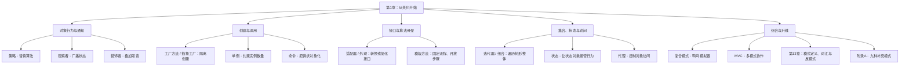
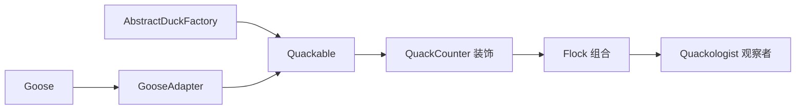

# 《Head First 设计模式》：从识别变化到组合模式

> **文本依据**：Eric Freeman、Elisabeth Freeman、Kathy Sierra、Bert Bates 著，O'Reilly Taiwan 公司译、UMLChina 改编，中国电力出版社 2007 年 9 月第 1 版，ISBN `978-7-5083-5393-7`。英文原版 *Head First Design Patterns* 出版于 2004 年。本文页码均指该简体中文版印刷页码。
>
> **内容边界**：原 EPUB 是 640 页扫描版。本文以目录、章首页、模式定义、设计原则和案例代码页为一手依据。短引文保留原文措辞；代码是按原书案例压缩后的教学性改写，不是逐页转录。`2026 校订`用于指出 Java API 和工程实践的版本变化，不冒充作者观点。

## 一、全书在解决什么问题

### 设计模式不是现成代码，而是可复用的设计经验

第 13 章给出的正式定义很短：

> “模式是在某情境（context）下，针对某问题的某种解决方案。”（第 13 章，p.579）

书中继续解释：情境是模式会反复出现的场合；问题既包括要达到的目标，也包括当时的约束；解决方案不是一段可复制粘贴的代码，而是能在不同实现中复用的通用设计。第 1 章又强调，设计模式的价值高于某个具体库，因为它告诉开发者“如何组织类和对象以解决某种问题”（p.29）。

通俗地说，模式像一张经过验证的结构草图。它不会替你盖房子，却会告诉你：当变化从某个方向反复袭来时，哪些职责应拆开、对象之间应怎样协作、依赖应该指向哪里。它主要解决四类问题：

- 需求变化迫使大量类一起修改，例如每加一种鸭子飞行方式就改遍继承树。
- 对象彼此知道太多，改动一个对象会沿调用链扩散。
- 创建、调用、遍历、状态转换等职责与业务逻辑纠缠。
- 团队能看见坏味道，却缺少简洁、共享的设计词汇来讨论方案。

设计模式不是为了消灭变化，而是把变化限制在少数明确的位置。全书反复使用的动作可以压缩为：**找出变化 → 封装变化 → 面向稳定接口组合对象 → 让协作关系保持松耦合**。

### 全书逻辑框架



这不是按 GoF 的“创建型、结构型、行为型”分类写成的字典。作者每次先制造一个真实设计压力，再让模式从重构过程里出现；到第 13 章才回头定义“模式”和“模式类目”。这种顺序使读者先理解**为什么**，再记住**叫什么**。

### 与其他设计手段的区别

| 方法 | 复用的对象 | 适合解决什么 | 优势 | 主要风险 |
| --- | --- | --- | --- | --- |
| 复制代码或条件分支 | 具体实现 | 一次性、局部且稳定的问题 | 直接、成本低 | 变化会产生重复和分支爆炸 |
| 类继承 | 类型和默认实现 | 稳定的“是一个”关系 | 编译期约束强，便于复用模板 | 子类与父类紧耦合，组合不灵活 |
| 函数、Lambda、回调 | 一段行为 | 小粒度策略、事件处理 | 轻量，样板代码少 | 不能单独表达复杂对象协议和生命周期 |
| 框架或类库 | 可运行实现 | 某个技术领域的通用能力 | 开箱即用，节省开发量 | 受框架边界约束；只会调用 API 不等于理解设计 |
| 设计原则 | 判断方向 | 评审方案和约束依赖 | 跨语言、适用面广 | 过于抽象，不能直接给出协作结构 |
| 设计模式 | 情境、问题、对象职责与协作方案 | 反复出现的设计问题 | 兼顾结构、意图和共享词汇 | 可能被机械套用，制造不必要的类 |

结论是：模式不替代继承、函数或框架，而是解释这些机制应怎样组合。现代 Java 用 Lambda 写策略、用 Spring 发布事件、用 JDK 代理生成代理类，表面代码变短了，背后的依赖方向仍是本书讨论的问题。

## 二、十四个学习单元速览

| 章节 | 原书标题 | 核心内容 | 本章给出的解决方案 |
| --- | --- | --- | --- |
| 引子 | 让你的大脑来学设计模式 | 说明图像、故事、练习与冗余线索的学习方法 | 主动预测、练习并把模式应用到自己的问题 |
| 第 1 章 | 欢迎来到设计模式世界：设计模式入门 | 鸭子继承树无法容纳持续变化的飞行和叫声 | 策略模式；封装变化、面向接口、组合优于继承 |
| 第 2 章 | 让你的对象知悉现况：观察者模式 | 气象数据变化后要通知数量不定的显示板 | 主题维护观察者集合，通过统一接口更新 |
| 第 3 章 | 装饰对象：装饰者模式 | 饮料与调料的子类组合数量爆炸 | 用同一组件接口逐层包装并动态增加职责 |
| 第 4 章 | 烘烤 OO 的精华：工厂模式 | 比萨店直接 `new` 具体产品，创建细节污染业务 | 工厂方法推迟实例化；抽象工厂创建产品族 |
| 第 5 章 | 独一无二的对象：单件模式 | 某些协调资源必须只有一个实例 | 私有构造器、受控静态入口，并讨论线程安全 |
| 第 6 章 | 封装调用：命令模式 | 遥控器不应依赖灯、门、音响的具体方法 | 把请求封装为命令对象，支持撤销、队列和日志 |
| 第 7 章 | 随遇而安：适配器与外观模式 | 已有类接口不兼容；复杂子系统难用 | 适配器转换接口；外观提供统一的高层入口 |
| 第 8 章 | 封装算法：模板方法模式 | 咖啡和茶的流程重复，但少数步骤不同 | 父类固定算法骨架，子类实现变化步骤和钩子 |
| 第 9 章 | 管理良好的集合：迭代器与组合模式 | 菜单内部结构不同，客户端又要统一遍历树形菜单 | 迭代器隐藏遍历；组合统一叶节点与容器 |
| 第 10 章 | 事物的状态：状态模式 | 糖果机的条件分支随状态和动作形成笛卡尔积 | 每个状态对象封装该状态下的行为与转换 |
| 第 11 章 | 控制对象访问：代理模式 | 远程、昂贵或受保护对象不能让客户端直接访问 | 用同接口替身控制远程、虚拟和保护访问 |
| 第 12 章 | 模式中的模式：复合模式 | 一个系统往往需要多个模式一起工作 | 鸭鸣模拟器组合适配器、装饰者、抽象工厂、组合、迭代器、观察者；再分析 MVC |
| 第 13 章 | 真实世界中的模式：与设计模式相处 | 会背类图仍不会选择模式，也容易过度设计 | 从情境和约束出发，保持简单，共享词汇并识别反模式 |
| 附录 A | 剩下的模式 | 补足未展开的九种 GoF 模式 | 桥接、生成器、责任链、蝇量、解释器、中介者、备忘录、原型、访问者 |

## 三、沿书中顺序掌握模式

### 第 1 章：策略模式，把变化的行为从对象中取出

#### 从鸭子继承树暴露出来的问题

最初的 `Duck` 把 `fly()`、`quack()` 写进父类。新增橡皮鸭后，继承来的飞行行为明显错误；把方法改为接口又会迫使大量子类重复实现。真正变化的不是“鸭子身份”，而是飞行和叫声这两组行为。

书中在 p.10 明确要求“分开变化和不会变化的部分”，随后给出三条贯穿全书的原则：

> “针对接口编程，而不是针对实现编程。”（p.11）
>
> “多用组合，少用继承。”（p.23）

策略模式的正式定义是：它定义算法族，分别封装起来，使其可以互相替换，并让算法的变化独立于使用算法的客户（p.24）。这里的“算法”不必是数学计算，也可以是一种定价、路由、验证或重试行为。

```java
// 按原书 SimUDuck 案例压缩改写
interface FlyBehavior { void fly(); }

final class FlyWithWings implements FlyBehavior {
    public void fly() { System.out.println("I'm flying"); }
}

abstract class Duck {
    private FlyBehavior flyBehavior;

    protected Duck(FlyBehavior flyBehavior) {
        this.flyBehavior = flyBehavior;
    }

    void performFly() { flyBehavior.fly(); }
    void setFlyBehavior(FlyBehavior behavior) { this.flyBehavior = behavior; }
}
```

调用者只依赖 `FlyBehavior`，所以可在运行期把受伤后的飞行方式切换为 `FlyNoWay`。实际工程中的折扣计算、文件存储后端、支付路由、压缩算法都符合相同结构。Java 8 以后，只有一个方法的策略可以直接写成 Lambda：`duck.setFlyBehavior(() -> log.info("no fly"));`。

- **OO**：Object-Oriented，面向对象。
- **策略（Strategy）**：可替换的一组行为实现；重点是相同协议，不是一定要有很多类。
- **组合（Composition）**：一个对象持有并委托给另一个对象，表达“有一个”。
- **接口编程**：依赖稳定抽象；原书说明它也可以由抽象类表达，并不局限于 Java `interface` 关键字。

**局限与处理**：策略会增加对象数量，客户还可能需要知道如何选择策略。只有一个稳定实现时先保持简单；策略选择复杂时交给配置、工厂或依赖注入容器，但不要让容器掩盖业务规则。

### 第 2 章：观察者模式，让状态变化跨对象传播

#### 气象站为什么不能直接调用每块显示板

WeatherData 收到新数据后，要更新当前状况、统计和预报显示板，未来还会出现第三方显示板。若在 `measurementsChanged()` 中硬编码每个显示对象，发布者会知道所有订阅者的具体类型。

观察者模式定义对象之间的一对多依赖：一个对象状态改变时，所有依赖者都会收到通知并自动更新（p.51）。主题只知道 `Observer` 接口，观察者可在运行期注册或退出，这就是书中“为交互对象之间的松耦合设计而努力”的含义（p.53）。

```java
// 按原书 Weather Station 案例压缩改写；采用书中的 push 方向
interface Observer { void update(float temp, float humidity); }

final class WeatherData {
    private final List<Observer> observers = new ArrayList<>();
    void register(Observer observer) { observers.add(observer); }
    void remove(Observer observer) { observers.remove(observer); }

    void measurementsChanged(float temp, float humidity) {
        List.copyOf(observers).forEach(o -> o.update(temp, humidity));
    }
}
```

- **Subject / 主题**：持有状态并管理订阅关系的发布者。
- **Observer / 观察者**：接收变化通知的统一接口。
- **Push**：主题把数据随通知推给观察者；新增字段会扩大接口。
- **Pull**：只通知“发生变化”，观察者按需从主题拉取数据；耦合面通常更小。
- **JDK**：Java Development Kit。原书展示 `java.util.Observable` / `Observer`，二者自 Java 9 起已弃用。

**2026 校订**：进程内事件可使用 `Flow.Publisher`、响应式流或框架事件总线；跨服务通知通常依靠 Kafka、RabbitMQ 等消息系统。它们补充了背压、持久化和失败重试，但仍需处理观察者模式没有保证的顺序、重复消息、异常隔离和取消订阅。发布者与订阅者“类型上松耦合”不代表“业务上没有依赖”。

### 第 3 章：装饰者模式，在运行期叠加职责

#### 星巴兹咖啡的子类爆炸

如果为每种饮料与牛奶、摩卡、豆浆、奶泡的组合都建一个子类，组合数会迅速失控；若在基类中放多个布尔字段，新增调料仍要修改基类。书中由此引出开放-关闭原则：

> “类应该对扩展开放，对修改关闭。”（第 3 章，p.86）

装饰者与被装饰对象实现相同接口，内部保存一个组件，再在委托前后增加行为。其定义强调“动态地将责任附加到对象上”，并把它视为扩展功能的继承替代方案（p.91）。

```java
// 按原书 Starbuzz 案例压缩改写
interface Beverage { String description(); double cost(); }

record Espresso() implements Beverage {
    public String description() { return "Espresso"; }
    public double cost() { return 1.99; }
}

record Mocha(Beverage beverage) implements Beverage {
    public String description() { return beverage.description() + ", Mocha"; }
    public double cost() { return beverage.cost() + 0.20; }
}

Beverage order = new Mocha(new Mocha(new Espresso()));
```

Java I/O 是书中的真实案例：`BufferedInputStream(new FileInputStream(path))` 逐层增加缓冲等职责。HTTP 中间件、日志增强、缓存、压缩、权限检查也常用同一思想。

- **Component**：组件共同接口。
- **Concrete Component**：被包装的基础对象。
- **Decorator**：既实现组件接口，又持有组件引用的包装者。
- **透明装饰**：客户只按组件接口使用，不关心外层具体类型。

**局限与处理**：多层包装会带来大量小对象，调试堆栈和身份判断变复杂；依赖具体组件类型的客户也会破坏透明性。为常见组合提供命名工厂，用组合测试验证顺序，不要让装饰器偷偷改变接口契约。

### 第 4 章：工厂方法与抽象工厂，隔离对象创建

#### `new` 本身没有错，问题是变化的具体类型散落各处

比萨店的 `orderPizza()` 包含选择口味、创建、准备、烘烤、切片、装盒。各地分店流程相同，但产品和原料不同。若用 `if/switch + new`，业务流程会直接依赖所有具体产品。

```java
// 工厂方法：稳定流程在父类，创建决定留给子类
abstract class PizzaStore {
    final Pizza order(String type) {
        Pizza pizza = create(type);       // 工厂方法
        pizza.prepare(); pizza.bake(); pizza.cut(); pizza.box();
        return pizza;
    }
    protected abstract Pizza create(String type);
}

final class ChicagoStore extends PizzaStore {
    protected Pizza create(String type) {
        return switch (type) {
            case "cheese" -> new ChicagoCheesePizza();
            default -> throw new IllegalArgumentException(type);
        };
    }
}
```

工厂方法定义一个创建对象的接口，但由子类决定实例化哪一个类，把实例化推迟到子类（p.134）。抽象工厂则提供一个接口，用来创建相关或相互依赖的对象家族，而不指定具体类（p.156）。在原料案例里，纽约工厂生产一整套纽约风味的面团、酱料和奶酪，保证产品族彼此匹配。

```java
interface IngredientFactory {
    Dough dough(); Sauce sauce(); Cheese cheese();
}

final class NyIngredientFactory implements IngredientFactory {
    public Dough dough() { return new ThinCrustDough(); }
    public Sauce sauce() { return new MarinaraSauce(); }
    public Cheese cheese() { return new ReggianoCheese(); }
}
```

本章的依赖倒置原则是“要依赖抽象，不要依赖具体类”（p.139）。它比“多用接口”更严格：高层流程和低层实现都围绕抽象协作。

- **Factory Method**：通常靠继承覆盖一个创建方法，一次创建一种产品。
- **Abstract Factory**：通常靠对象组合提供多个创建方法，创建一致的产品族。
- **DIP**：Dependency Inversion Principle，依赖倒置原则。
- **IoC / DI**：控制反转 / 依赖注入。容器可替代部分手写工厂，但创建边界与生命周期仍需设计。

**局限与处理**：工厂会增加接口和类型；抽象工厂新增“产品种类”时尤其昂贵，因为所有具体工厂都要改。产品只有一个实现且创建简单时直接构造更清楚；创建涉及环境选择、一致性或复杂生命周期时再引入工厂。

### 第 5 章：单件模式，约束实例与访问入口

#### “只有一个”比类图看起来更难

单件模式保证一个类只有一个实例，并提供全局访问点（p.177）。私有构造器阻止客户随意创建，静态方法负责第一次实例化。书中的巧克力锅炉说明，第二个实例会破坏“已装满、已煮沸”等设备状态。

```java
// 现代 Java 中简洁且可序列化安全的写法
enum ChocolateBoiler {
    INSTANCE;
    private boolean empty = true;
    synchronized void fill() {
        if (empty) empty = false;
    }
}
```

- **延迟实例化（Lazy Initialization）**：首次使用时才创建。
- **双重检查锁（Double-Checked Locking）**：原书讨论的性能优化；字段必须为 `volatile` 才能保证正确发布。
- **JVM**：Java Virtual Machine。单例范围通常是一个类加载器，不天然是“整个集群一个”。
- **全局访问点**：任何调用者都能取得同一实例；便利也意味着隐式依赖。

**2026 校订与局限**：依赖注入容器里的 singleton 往往是“容器级单例”；微服务多副本中仍有多个实例。集群唯一任务需要数据库约束、租约或分布式锁。业务服务不要仅为省掉参数传递就做单例，它会隐藏依赖、污染测试。Java 中无状态服务优先交给容器管理；真正的语言级单例可用 `enum`。

### 第 6 章：命令模式，把“做什么”变成对象

#### 遥控器不应该理解每台家电的 API

遥控器只有统一的插槽和按钮，厂商类却分别暴露 `on()`、`open()`、`setInputChannel()`。命令对象在调用者与接收者之间翻译：调用者只执行 `execute()`，接收者才知道真正动作。

命令模式把请求封装成对象，从而可用不同请求、队列或日志参数化其他对象，并支持可撤销操作（p.206）。

```java
interface Command { void execute(); void undo(); }

record LightOnCommand(Light light) implements Command {
    public void execute() { light.on(); }
    public void undo() { light.off(); }
}

final class RemoteSlot {
    private Command command;
    void set(Command command) { this.command = command; }
    void press() { command.execute(); }
    void undo() { command.undo(); }
}
```

宏命令把多个命令组合起来；队列只消费 `Command`，不必知道任务类型；日志记录可重放的命令以恢复状态。数据库迁移、编辑器撤销、作业调度和事务补偿都常见这种结构。

- **Invoker / 调用者**：触发命令，如遥控器按钮。
- **Receiver / 接收者**：真正完成动作，如电灯。
- **NoCommand / 空对象**：什么也不做的命令，可去掉反复的空值判断。
- **Party 模式**：原书对宏命令的趣味称呼，不是 GoF 的独立模式。
- **撤销（Undo）**：保存执行前必要状态，执行逆操作；不等于数据库事务回滚。

**局限与处理**：每个动作一个类会产生样板代码，Lambda 可用于不需要撤销状态的简单命令。命令日志必须考虑幂等、版本兼容和敏感数据；跨服务失败通常需要 Saga/补偿事务，而不是天真地调用 `undo()`。

### 第 7 章：适配器与外观，一个转换接口，一个简化入口

#### 适配器：让已有对象符合客户期待

原书用火鸡冒充鸭子：客户需要 `Duck`，已有对象却是 `Turkey`。适配器持有火鸡并实现鸭子接口，将一次鸭子飞行转换为多次火鸡短飞。

适配器模式把一个类的接口转换成客户期望的另一个接口，使原本接口不兼容的类可以合作（p.243）。

```java
record TurkeyAdapter(Turkey turkey) implements Duck {
    public void quack() { turkey.gobble(); }
    public void fly() {
        for (int i = 0; i < 5; i++) turkey.fly();
    }
}
```

#### 外观：为复杂子系统给出一条常用路径

家庭影院播放电影要依次操作灯、屏幕、功放、投影仪、播放器。`HomeTheaterFacade.watchMovie()` 把常用协作流程收进一个高层入口，同时不禁止高级客户直接使用子系统。

外观模式为子系统中的一组接口提供统一接口，并定义更高层接口以使子系统更容易使用（p.264）。书中紧接着提出最少知识原则：“只和你的密友谈话”（p.265），即对象不应沿着长链条了解陌生对象内部。

- **Adapter**：目标是兼容，通常保留原有语义并转换协议。
- **Facade**：目标是易用和降耦，给子系统提供较粗粒度入口。
- **Target / Adaptee**：客户期待的目标接口 / 已存在但接口不兼容的对象。
- **Law of Demeter**：迪米特法则，是最少知识原则的常见名称。

**局限与处理**：适配器若必须伪造目标语义，可能出现信息丢失；外观若承载所有业务会膨胀为“上帝对象”。把协议差异留在适配层，把跨对象用例编排留在应用服务；外观不应吞掉底层重要错误。

### 第 8 章：模板方法，稳定算法骨架，开放少数步骤

#### 咖啡与茶为何不该复制整段流程

两者都要烧水、冲泡、倒杯、加配料，只有冲泡与配料不同。模板方法把流程顺序固定在父类，将变化步骤定义为抽象方法，还可用“钩子”让子类选择性参与。

模板方法在一个方法中定义算法骨架，把某些步骤延迟到子类；子类可以重新定义步骤，却不改变算法结构（p.289）。

```java
abstract class CaffeineBeverage {
    final void prepareRecipe() {
        boilWater(); brew(); pourInCup();
        if (wantsCondiments()) addCondiments();
    }
    abstract void brew();
    abstract void addCondiments();
    boolean wantsCondiments() { return true; } // hook
    private void boilWater() {}
    private void pourInCup() {}
}
```

本章的“好莱坞原则”是“别调用我们，我们会调用你”（p.296）：高层组件控制流程，在恰当时机调用低层扩展点。`Arrays.sort()` 依赖对象的比较协议，Swing/Applet 生命周期也体现这种反向控制，不过 Applet 已退出现代 Java。

- **Template Method**：通常标为 `final` 的算法骨架方法。
- **Primitive Operation**：子类必须实现的基本步骤。
- **Hook / 钩子**：默认实现通常为空或返回默认值，子类可选覆盖。
- **IoC**：Inversion of Control，控制反转；框架调用应用代码，而非应用控制全流程。

**与策略的差别**：模板方法靠继承复用完整流程，策略靠组合替换完整算法。前者能强制步骤顺序，后者运行期更灵活。继承层次变深或需要同时替换多个步骤组合时，改用策略或把每步建模为可组合函数。

### 第 9 章：迭代器与组合，把不同集合和树形结构统一起来

#### 先隐藏遍历，再统一“部分与整体”

煎饼屋菜单用 `ArrayList`，餐厅菜单用数组。服务员若分别写两套循环，就暴露了集合内部结构。迭代器提供统一的 `hasNext()/next()`，让集合负责生产遍历器，客户只面向遍历协议。

迭代器模式提供顺序访问聚合对象元素的方法，而不暴露其内部表示（p.336）。书中由此强调单一责任：一个类改变的原因应只有一个（p.339）。集合负责存储，迭代器负责遍历。

```java
interface Menu { Iterator<MenuItem> createIterator(); }

void print(Menu menu) {
    menu.createIterator().forEachRemaining(System.out::println);
}
```

需求随后升级为菜单中包含子菜单。组合模式将对象组织成树，统一处理叶节点 `MenuItem` 与组合节点 `Menu`。它允许客户以一致方式处理单个对象和对象组合（p.356）。

```java
sealed interface MenuComponent permits Menu, MenuItem { void print(); }

final class Menu implements MenuComponent {
    private final List<MenuComponent> children = new ArrayList<>();
    void add(MenuComponent child) { children.add(child); }
    public void print() { children.forEach(MenuComponent::print); }
}

record MenuItem(String name, boolean vegetarian) implements MenuComponent {
    public void print() { System.out.println(name); }
}
```

- **Aggregate / 聚合**：包含一组元素的对象。
- **Iterator / 迭代器**：保存遍历位置并逐项返回元素。
- **Composite / 组合节点**：拥有子节点的容器。
- **Leaf / 叶节点**：没有子节点的原子对象。
- **内部 / 外部迭代**：集合控制遍历（如 Stream）/ 客户显式推进迭代器。

**局限与处理**：统一接口可能迫使叶节点实现没有意义的 `add/remove`。现代 Java 可用更小接口、密封类型和访问者区分能力。迭代期间修改集合会触发快速失败或并发问题；明确快照、一致性和线程模型。

### 第 10 章：状态模式，让对象把当前状态变成协作者

#### 条件分支为什么会失控

糖果机有“无币、已投币、售出、售罄”等状态，也有“投币、退币、转柄、发糖”等动作。把二者写成嵌套 `if/switch` 后，每新增状态都要修改每个动作；“赢家发两颗糖”的需求让问题更明显。

状态模式允许对象在内部状态改变时改变行为，看起来像修改了自己的类（p.410）。上下文把动作委托给当前 `State`，状态对象决定是否转换到下一状态。

```java
interface State { void insertQuarter(); void turnCrank(); }

final class GumballMachine {
    final State noQuarter = new NoQuarterState(this);
    final State hasQuarter = new HasQuarterState(this);
    State state = noQuarter;
    void setState(State next) { state = next; }
    void insertQuarter() { state.insertQuarter(); }
    void turnCrank() { state.turnCrank(); }
}
```

状态与策略类图相似，意图不同：策略通常由客户选择可替换算法；状态由上下文或状态对象依据运行过程转换，整组状态共同描述生命周期（p.411）。订单、工作流、连接协议、审批单都适合显式状态机。

- **Context / 上下文**：对外提供业务接口并持有当前状态。
- **Concrete State**：封装某一状态允许的行为和转换。
- **FSM**：Finite-State Machine，有限状态机；状态和事件有限，转换规则明确。
- **状态转换表**：用“当前状态 × 事件 → 新状态/动作”检查遗漏。

**局限与处理**：类数量增加，转换逻辑可能分散到多个状态对象。状态少且稳定时 `switch` 更直白；涉及持久化、超时、并发和人工任务时，应使用状态机/工作流引擎，并通过乐观锁防止重复转换。

### 第 11 章：代理模式，在客户与真实对象之间控制访问

#### 同一接口背后可以是远程对象、延迟对象或受保护对象

书中先通过 RMI 远程监控糖果机，再用虚拟代理延迟加载 CD 封面，最后用 Java 动态代理实现“本人可改兴趣、不能改自己评分”的保护规则。

代理模式为另一个对象提供替身或占位符，以控制对这个对象的访问（p.460）。客户与代理都依赖 `Subject`，代理决定何时创建、是否允许、怎样转发到 `RealSubject`。

```java
// JDK 动态保护代理的核心形状
InvocationHandler handler = (proxy, method, args) -> {
    if (method.getName().equals("setHotOrNotRating"))
        throw new IllegalAccessException("cannot rate yourself");
    return method.invoke(person, args);
};

PersonBean owner = (PersonBean) Proxy.newProxyInstance(
    PersonBean.class.getClassLoader(),
    new Class<?>[]{PersonBean.class}, handler);
```

- **远程代理**：代表另一个地址空间中的对象，负责通信和序列化。
- **虚拟代理**：延迟创建昂贵对象，在等待时提供占位行为。
- **保护代理**：基于调用者或方法控制访问。
- **RMI**：Remote Method Invocation，Java 远程方法调用。原书使用 `rmic`、stub/skeleton 等旧流程。
- **Dynamic Proxy**：运行期生成实现指定接口的代理对象。

**2026 校订**：现代分布式调用常用 HTTP/gRPC 客户端；JDK 动态代理仍要求接口，字节码代理可代理普通类。远程代理无法消除网络失败，接口看似本地也必须暴露超时、重试、取消和幂等语义。AOP 权限代理不能替代服务端授权检查。

### 第 12 章：复合模式与 MVC，让多个模式协同解决系统问题

#### 鸭鸣模拟器：不是把模式堆在一起

本章把前面学到的模式逐步加入同一模拟器：鹅通过**适配器**成为鸭；叫声计数由**装饰者**增加；不同类型的鸭由**抽象工厂**创建；鸭群由**组合**组织并用**迭代器**遍历；研究员通过**观察者**监听叫声。只有这些模式形成稳定、反复出现的协作方案时，才叫复合模式，而不是任意模式的集合。



#### MVC：模型、视图、控制器怎样分工

书中的 DJ 节拍器案例把 MVC 拆成三个角色：

- **Model** 管理数据、状态和业务逻辑；用观察者通知视图和控制器。
- **View** 呈现模型；组合 GUI 组件，并将用户动作交给控制器。
- **Controller** 解释用户输入，用策略式角色改变模型或选择视图。

视图与控制器之间还会用到策略，显示组件内部大量使用组合，模型通知使用观察者。书中随后讨论 Web 的 Model 2：请求进入控制器，控制器调用模型并选择视图。这是 MVC 的服务器端变体，不应把“Controller-Service-Repository 三层命名”误认为完整 MVC。

- **Compound Pattern / 复合模式**：两个以上模式组合成可重复使用的通用问题解决方案。
- **MVC**：Model-View-Controller，模型-视图-控制器。
- **Model 2**：以 Servlet 作为前端控制器、JSP 作为视图的早期 Java Web 架构称呼。
- **AOP**：Aspect-Oriented Programming，面向切面编程；可用于横切职责，但不是本章复合模式本身。

**局限与处理**：模式数量不是质量指标。复合后必须还能说清每个角色解决的具体变化。现代前端状态管理、MVVM、Clean Architecture 会重新划分边界，但“状态由谁拥有、输入由谁解释、变化怎样通知视图”仍是同一组问题。

### 第 13 章：与模式相处，重点是判断而不是背诵

本章直到此处才正式定义模式，是为了阻止读者只背类图。书中指出，一个解决方案要称为模式，必须对应反复出现的问题，要有名字，并以规范方式说明意图、动机、适用场合、结构和后果（pp.579-583）。

#### 使用模式前的判断顺序

1. 写清当前情境、目标和约束，而不是先写模式名。
2. 找最简单可工作的方案。第 13 章明确要求保持简单（KISS），不要为使用模式而使用模式（p.594）。
3. 识别真正会变化的轴，以及变化扩散到哪些客户。
4. 对照模式的意图和适用性，再权衡新增间接层的成本。
5. 在设计文档中说明与经典模式的差异，让团队共享准确词汇。
6. 用测试验证协作契约，并在问题消失后敢于移除不再需要的结构。

书中把共享词汇称为设计模式最大的优点之一：一个模式名可以同时传达对象关系、职责、动机和工作方式（p.599）。但词汇也可能被滥用，例如把普通包装类都叫装饰者，或把任何全局对象都叫单例。

#### 模式、反模式与框架

反模式描述一个看似合理、实际会带来麻烦的坏方案，并说明为什么有吸引力、长期后果和可替代方案（p.606）。框架则是可执行的半成品系统，模式是框架内部和团队头脑中的设计知识；一个框架可以同时实现很多模式。

- **GoF**：Gang of Four，“四人组”，即 Erich Gamma、Richard Helm、Ralph Johnson、John Vlissides。
- **Pattern Catalog**：模式类目，以固定格式记录多个模式及其关系。
- **KISS**：Keep It Simple，保持简单。
- **Anti-Pattern**：反模式，对反复出现但有害方案的结构化总结。
- **模式后果**：采用模式带来的收益、代价和新约束，是选型时不能省略的部分。

### 附录 A：九种“剩下的模式”

附录说明这些同样是成熟、正式的 GoF 模式，只是没有像前十二章那样详细展开（附录 A 章首页，p.611）。按书中顺序如下：

| 模式 | 书中要解决的问题 | 结构要点 | 常见应用与限制 |
| --- | --- | --- | --- |
| 桥接 Bridge | 抽象和实现都要独立变化 | 抽象持有实现接口，将两条继承轴拆开 | 多平台驱动；初期类型较多 |
| 生成器 Builder | 复杂对象的构建步骤相同，表示不同 | Director 编排步骤，Builder 逐步产出 | SQL/文档/不可变对象；简单对象不必使用 |
| 责任链 Chain of Responsibility | 发送者不知道哪个对象处理请求 | 处理者持有后继，处理或继续传递 | 过滤器、审批链；要防止请求无人处理 |
| 蝇量 Flyweight | 大量细粒度对象造成内存压力 | 共享内在状态，外在状态由客户传入 | 字形、地图点位；状态拆分会增加调用复杂度 |
| 解释器 Interpreter | 有一门简单语言需要反复解释 | 每条语法规则一个表达式类，递归解释 | 小型 DSL；复杂语法应使用成熟解析器 |
| 中介者 Mediator | 对象互相引用形成网状耦合 | 交互集中到中介者，对象只通知中介者 | UI 协调；中介者可能膨胀 |
| 备忘录 Memento | 需要恢复对象先前状态 | Originator 生成快照，Caretaker 保存但不窥视 | 编辑器历史；快照可能占用大量内存 |
| 原型 Prototype | 创建实例昂贵或类型运行期才确定 | 通过复制原型创建新对象 | 模板、游戏对象；深浅拷贝语义必须明确 |
| 访问者 Visitor | 稳定对象结构上要频繁增加新操作 | 元素接受访问者，形成双重分派 | AST 分析；新增元素类型会修改所有访问者 |

附录不是“次要模式清单”。它们只是教学篇幅较短。选择时仍应回到第 13 章的情境、问题、约束和后果，而不是看见关键字就套类图。

## 四、把全书原则串成一条设计链

| 原则 | 首次集中出现 | 它在控制哪种变化 |
| --- | --- | --- |
| 封装变化 | 第 1 章 | 把频繁变化行为从稳定对象身份中移开 |
| 针对接口编程，而非实现 | 第 1 章 | 阻止高层客户绑定具体类型 |
| 多用组合，少用继承 | 第 1 章 | 让行为能独立替换并在运行期组合 |
| 为交互对象的松耦合而设计 | 第 2 章 | 主题不依赖具体观察者 |
| 对扩展开放，对修改关闭 | 第 3 章 | 通过新增包装扩展职责，不反复改核心 |
| 依赖抽象，不依赖具体类 | 第 4 章 | 让高层流程和低层实现共同依赖契约 |
| 最少知识，只和密友谈话 | 第 7 章 | 限制对象导航和调用链的知识范围 |
| 好莱坞原则 | 第 8 章 | 由高层流程在需要时调用扩展点 |
| 一个类只有一个改变理由 | 第 9 章 | 把存储、遍历等不同责任分开 |

这些原则不是九条互不相干的口号。它们共同控制**依赖方向和变化传播**：先识别变化，再为变化建立抽象；优先用组合连接对象；只暴露客户真正需要的接口；最后检查一个改动是否仍会跨越多个职责。

## 五、用现代 Java 跑通示例

原书示例基于 2004 年前后的 Java，今天无需复刻旧 JDK。下面用 JDK 21 LTS 和 Maven 建一个最小练习项目。

### 1. 安装并确认工具

Windows 可执行：

```powershell
winget install EclipseAdoptium.Temurin.21.JDK
winget install Apache.Maven
java -version
mvn -version
```

macOS 可执行 `brew install openjdk@21 maven`；Ubuntu 可执行 `sudo apt install openjdk-21-jdk maven`。确认 `java -version` 显示 21。

### 2. 创建 Maven 项目

```bash
mvn archetype:generate \
  -DgroupId=dev.cunyanger.patterns \
  -DartifactId=head-first-patterns \
  -DarchetypeArtifactId=maven-archetype-quickstart \
  -DinteractiveMode=false
cd head-first-patterns
```

在 `pom.xml` 的 `<properties>` 中设置：

```xml
<maven.compiler.release>21</maven.compiler.release>
<project.build.sourceEncoding>UTF-8</project.build.sourceEncoding>
```

### 3. 按问题组织代码和测试

不要建一个装满 23 个空类图的项目。建议每个案例一个包：

```text
src/main/java/dev/cunyanger/patterns/
  ducks/       # Strategy
  weather/     # Observer
  starbuzz/    # Decorator
  pizza/       # Factory Method + Abstract Factory
  remote/      # Command
  menu/        # Iterator + Composite
  gumball/     # State + Proxy
```

每完成一章先写一个行为测试，例如策略切换后输出发生变化、撤销恢复前态、无币状态不能出糖。运行：

```bash
mvn test
mvn package
```

设计模式测试的重点不是“用了某个类名”，而是协作契约：能否替换实现、通知能否取消、装饰顺序是否正确、状态是否只允许合法转换。

## 六、2004 年后的技术变化：哪些被替代，哪些没有

| 原书技术或写法 | 现代选择 | 仍然有效的模式知识 |
| --- | --- | --- |
| 大量匿名类实现策略/命令 | Lambda、方法引用、函数式接口 | 把行为当作可替换依赖 |
| `java.util.Observable` | `Flow`、响应式流、框架事件、消息队列 | 发布者与订阅者解耦，处理订阅生命周期 |
| 手写简单工厂/服务定位 | 构造器注入、DI 容器、模块系统 | 创建与使用分离，依赖指向抽象 |
| 同步懒汉式单例 | `enum`、初始化持有者、容器作用域 | 明确实例范围和共享状态风险 |
| RMI 与手工 stub | HTTP、gRPC、声明式客户端 | 远程代理必须显式处理网络语义 |
| Swing / Applet MVC 示例 | Web MVC、MVVM、单向数据流、组件状态管理 | 分离状态、呈现与输入解释 |
| 手写外部迭代器 | `Iterable`、Stream、响应式管道 | 隐藏集合表示并控制遍历职责 |
| 手写 Visitor 遍历语法树 | 编译器框架、模式匹配、密封类 | 在稳定结构上集中增加操作 |

更现代不等于不需要模式。语言和框架把许多模式压缩成 API 或语法后，开发者更需要辨认其边界。例如 Spring 的单例作用域不是集群单例，事件总线不会自动保证业务一致性，声明式 HTTP 客户端也不会让远程调用变成本地调用。

## 七、从这本书得到一套可执行的评审方法

面对新设计时，可以用下面七问代替“这里能用什么模式”：

1. 哪部分最可能变化，变化频率和来源是什么？
2. 当前变化会迫使哪些不相关对象一起修改？
3. 能否先用一个小接口把稳定协议与变化实现分开？
4. 这里真的是“是一个”，还是“有一个”更合适？
5. 谁创建对象、谁拥有状态、谁触发动作、谁只应收到通知？
6. 新增的间接层是否换来了可验证的替换、隔离或复用能力？
7. 有没有更简单的方案，删除模式后当前需求仍能清楚完成吗？

全书最值得保留的不是 23 张类图，而是一种克制的设计习惯：从具体问题出发，准确命名变化，用最小的抽象控制依赖；当模式的成本超过它隔离的变化时，就回到简单方案。这也正是第 13 章“用模式思考，而不是为模式而设计”的落点。
