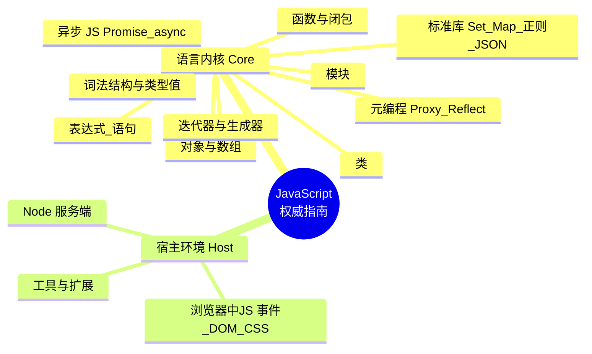

# 《JavaScript权威指南（原书第7版）》

> 本指南严格基于**真实文本**做转述与分析（不整章转载），章节结构以出版社官方目录（前言 + 17 章）为准。书中代码与命令均为"功能性说明片段"。技术书普遍滞后，文中凡出版年（2021，对应 JS 2020 规范）之后才演进的特性，一律标注「书后演进」。

---

## 一、整体理解与逻辑结构（全书层面）

### 【全局摘要】

**官方定义（转述自 MDN 与书中出版社简介）**
- **MDN 官方定义**：*"JavaScript (JS) is a lightweight interpreted (or just-in-time compiled) programming language with first-class functions… JavaScript is a prototype-based, garbage-collected, dynamic language, supporting multiple paradigms such as imperative, functional, and object-oriented."*（JavaScript 是一门轻量级的、解释执行/即时编译的、具有一等公民函数的编程语言；它是基于原型、带垃圾回收、动态类型的语言，支持命令式、函数式与面向对象等多种范式。）
- **书中（出版社简介）表述**：*"JavaScript 是 Web 编程语言，也是如今软件开发者使用最多的编程语言……本版已经更新到涵盖 JavaScript 的 2020 版。新增的关于类、模块、迭代器、生成器、期约（Promise）和 async/await 的章节中，令人深思、富有启发性的示例随处可见。"*

**通俗易懂地讲**
- JavaScript 是"嵌在网页里让页面活起来的语言"，但今天它早已不止于浏览器——服务端（Node）、桌面（Electron）、移动（React Native）、甚至嵌入式都在用它。它最大的特点是**"灵活"**：变量不用先声明类型、函数可以当变量传来传去、对象可以在运行时随意加属性。这种灵活是把双刃剑：写起来爽，写大了容易乱——所以这本"犀牛书"的价值，就是把这门"看似随便、实则有一套严谨规则"的语言，从词法到异步、从内核到浏览器/Node 两端，**完整、准确、有海量示例地讲透**。
- **它解决的"问题"**：早期网页是"死"的（只能展示、不能交互）。JS 让网页能响应用户点击、动态改内容、和服务器通信。进一步，它用"基于原型"的对象模型、"一等公民函数"带来的函数式能力、"Promise/async"解决的异步回调地狱，逐步把一门"玩具脚本"演进成今天能撑起大型应用的工业级语言。

### 【逻辑框架图】

**1）Mermaid 思维导图（语言内核 → 宿主环境骨架）**



**2）"一段 JS 程序的生命旅程"流程（本指南第四节编排依据）**

```
[源码文本]→[词法/语法解析]→[类型与值(原始/对象)]→[表达式与语句求值]
  →[对象/数组组织数据]→[函数与闭包封装行为]→[类组织大型结构]
  →[模块拆分复用]→[标准库提供集合/正则/JSON]→[迭代器遍历]
  →[异步: 回调→Promise→async_await]→[元编程拦截/反射]
  →[浏览器事件/DOM 渲染] 或 [Node 服务端处理请求]
  →（书后）TypeScript 类型层 / 框架 / WASM / Deno·Bun
```

### 【与主流/历史替代技术的对比】

比较"在 Web 前端实现交互逻辑"这一目的下，JavaScript 与其替代/补充方案的定位：

| 维度 | JavaScript（ES2020 原生） | TypeScript（类型超集） | WebAssembly（编译目标） | Dart / Flutter | 传统插件（Flash/Java Applet/Silverlight） |
| --- | --- | --- | --- | --- | --- |
| **运行环境** | 浏览器/Node 原生支持 | 编译为 JS 后同 JS | 浏览器 WASM 虚拟机 | 需 SDK/运行时 | 需额外插件（已淘汰） |
| **类型系统** | 动态、弱类型 | 静态、强类型（可渐进） | 静态、强类型 | 静态、强类型 | 各自静态类型 |
| **性能** | 高（JIT 优化） | 同 JS（类型仅编译期） | 极接近原生（CPU 密集首选） | 高 | 中（插件开销） |
| **学习曲线** | 平缓但"坑多"（动态特性） | 中（需懂类型） | 陡（C/C++/Rust 背景） | 中 | 高 |
| **生态/库** | 最庞大（npm 百万级） | 同 JS + 类型声明 | 增长中、与 JS 互操作 | 中等（移动优先） | 封闭、衰落 |
| **标准化** | ECMA-262 国际标准 | 编译期工具（非运行时标准） | W3C/WASI 标准 | Google 主导 | 厂商私有 |
| **典型场景** | 几乎所有 Web 交互、全栈 | 中大型工程、团队协作 | 游戏/音视频/加密/计算密集 | 跨端 App | 历史遗留（已退场） |

**一段总结**：JavaScript 是 Web 的"母语"——它不一定是某项指标最强（性能不如 WASM、安全性/可维护性不如 TS、跨端不如 Dart），但它**原生、通用、生态无敌、且持续进化**（每年 TC39 出新特性），因此稳居事实标准。TypeScript 不是替代它，而是"给它加一层类型安全带"；WASM 不是取代它，而是"在它管不到的 CPU 密集处补刀"，二者最终都跑在 JS 的宿主里、与它协作。传统插件已彻底退出历史舞台，正反衬出 JS"开放标准 + 免插件"路线的胜利。

---

## 二、分章节解读（以表格提炼核心内容）

> 结构依据出版社官方目录（机械工业出版社第7版，前言 + 17 章）。"关键例证"落到具体小节。

| 章节 | 标题内容 | 核心内容 | 关键例证/数据（如有） |
| --- | --- | --- | --- |
| 前言 | — | 本书范围（语言 + 浏览器/Node API）、读者定位、ES2020 覆盖说明 | "涵盖 JavaScript 的 2020 版" |
| 第1章 | JavaScript简介 | 语言历史、Hello World、一段"JS 之旅"概览、字符频率柱形图示例 | 1.4 示例：字符频率柱形图 |
| 第2章 | 词法结构 | 程序文本编码、注释、字面量、标识符/保留字、Unicode、可选分号 | 2.5 Unicode；2.6 可选的分号（ASI 陷阱） |
| 第3章 | 类型、值和变量 | 数值/文本/布尔/null/undefined/符号、全局对象、原始值 vs 对象引用、类型转换、变量声明（let/const/var） | 3.8 不可修改的原始值 vs 可修改的对象引用；3.10 变量声明 |
| 第4章 | 表达式与操作符 | 主表达式、属性访问、调用、对象创建、算术/关系/逻辑/赋值/求值操作符 | 4.8 算术；4.9 关系；4.13 其他（含 `?.` 可选链，ES2020） |
| 第5章 | 语句 | 表达式/复合/条件/循环/跳转（break/continue/return/throw）/声明（let/const/class） | 5.4 循环（for/for-of/for-in）；5.6 跳转 |
| 第6章 | 对象 | 创建对象、属性增删查、枚举、Object.assign 扩展、序列化（JSON）、对象方法、对象字面量扩展语法 | 6.6 枚举属性；6.8 序列化；6.10 字面量扩展 |
| 第7章 | 数组 | 创建/读写/稀疏数组、length、增删、迭代、多维、数组方法、类数组、作为数组的字符串 | 7.8 数组方法（map/filter/reduce 等）；7.10 类数组对象 |
| 第8章 | 函数 | 定义、调用（含 this）、实参形参、函数作为值/命名空间、闭包、函数属性、函数式编程 | 8.6 闭包；8.8 函数式编程 |
| 第9章 | 类 | 类与原型关系、构造函数、class 关键字、为已有类加方法、子类（extends/super） | 9.1 类和原型；9.3 class 关键字；9.5 子类 |
| 第10章 | 模块 | 基于闭包/对象的旧模块模式、Node 模块、ES6 模块（import/export） | 10.2 Node 模块；10.3 ES6 模块 |
| 第11章 | JavaScript标准库 | Set/Map、定型数组与二进制、正则与模式匹配、日期时间、Error、JSON、国际化 API、控制台、URL、计时器 | 11.1 集合与映射；11.3 正则；11.6 JSON |
| 第12章 | 迭代器与生成器 | 迭代器原理、实现可迭代对象、生成器（function* / yield）、高级生成器特性 | 12.1 迭代器原理；12.3 生成器 |
| 第13章 | 异步JavaScript | 回调异步、期约（Promise）、async/await、异步迭代 | 13.2 期约；13.3 async 和 await |
| 第14章 | 元编程 | 属性特性、对象可扩展、prototype 特性、公认符号、模板标签、反射 API（Reflect）、代理对象（Proxy） | 14.5 模板标签；14.6 反射；14.7 代理对象 |
| 第15章 | 浏览器中的JavaScript | Web 编程基础、事件、操作 DOM、操作 CSS、文档几何与滚动、Web 组件、SVG | 15.2 事件；15.3 操作 DOM；15.7 SVG |
| 第16章 | Node服务器端JavaScript | Node 模块与全局、服务端 API、文件系统、HTTP、进程/流 | Node 模块系统、HTTP 服务 |
| 第17章 | JavaScript工具和扩展 | 代码检查、打包、转译（Babel）、扩展（如 JSX）等工程化工具 | 工具链概览 |

---

## 四、按"程序执行生命周期"顺序的技术点归纳（每点九段式）

> 编排顺序对应上文"JS 程序的生命旅程"，覆盖书中核心能力。每点按：**背景/作用/用法代码/术语扩展/版本变化/主流对比/实际应用/局限方案/通俗概括** 九段展开。

### 技术点1：词法结构与类型、值、变量（第2–3章）

1. **背景与解决的问题**：代码首先是"文本"。解释器怎么切词、怎么认字符、变量怎么存值、值有哪些种类——这是一切的起点。
2. **作用与应用场景**：理解 ASI（自动插入分号）陷阱、Unicode 标识符、原始类型与对象的本质区别、`==` 与 `===` 的差异。场景：避免诡异 bug、做正确类型转换。
3. **使用方法（功能性片段）**：
   ```javascript
   // 严格相等 vs 宽松相等
   1 === "1"   // false（类型不同）
   1 == "1"    // true（先转类型，易踩坑）
   // 原始值不可改，对象引用可改
   let s = "hi"; s[0] = "H"; console.log(s); // "hi"（原始值不变）
   let o = {x:1}; o.x = 2;                    // OK，对象引用可变
   // 变量声明
   let a = 1; const b = 2; var c = 3;         // let/const 块级，var 函数级
   ```
4. **术语扩展**：**ASI**（Automatic Semicolon Insertion，自动分号插入，return 后换行会"被加;导致返回 undefined 的陷阱）；**原始值（primitive）**：number/string/boolean/null/undefined/symbol/bigint，不可变、按值比较；**对象引用**：按引用比较；**typeof**：返回类型字符串；**Symbol**（ES6，唯一不可变的值，常作对象私有键）。
5. **与旧版本变化**：

   | 项目 | 旧（ES3/5 时代） | 新（ES6+，书中第3章） |
   | --- | --- | --- |
   | 变量声明 | 仅 `var`（函数作用域、可提升） | `let`/`const`（块级、不可提升、TDZ 暂时性死区） |
   | 唯一键值 | 字符串键易冲突 | `Symbol` 唯一键 |
   | 大整数 | 数值溢出 | `BigInt`（ES2020 后缀 `n`） |
6. **与主流技术对比优势**：相对 Python/Java 的静态/显式类型，JS 的**动态类型上手快、原型灵活**；相对 PHP 早期"类型混乱"，ES 严格化（`===`、const）让大型项目可控。代价是运行期才暴露类型错——这正是「书后」TypeScript 补位之处。
7. **实际应用（安全类型转换）**：
   ```javascript
   const n = Number("123");   // 显式转数字，不用隐式 +
   const ok = Array.isArray(x); // 比 typeof x === "object" 更准
   ```
8. **局限性与解决方案**：隐式转换（`[] + {}` 等）反直觉→统一用 `===`、显式 `Number()/String()`；`var` 提升导致作用域混乱→只用 `let/const`。
9. **通俗概括**：类型与变量是"JS 给数据发的身份证"——原始值是复印件（改了也不影响原件），对象是手环（大家都牵着同一根线）；`let/const` 是给变量划了"房间边界"。

### 技术点2：表达式与操作符、语句（第4–5章）

1. **背景与解决的问题**：有了值，就要"算"（表达式）和"做"（语句）。操作符优先级、严格相等、解构赋值、`for-of` 等语法糖，决定了代码是否简洁正确。
2. **作用与应用场景**：算术/逻辑运算、属性访问、解构、条件与循环、跳转。场景：日常 90% 的代码骨架。
3. **使用方法**：
   ```javascript
   const obj = {a:1, b:2}; const {a, b} = obj;   // 解构（ES6）
   const arr = [1,2,3]; const [x, ...rest] = arr; // 剩余/rest
   for (const v of arr) console.log(v);          // for-of 遍历值
   for (const k in obj) console.log(k);          // for-in 遍历键
   const r = cond ? "yes" : "no";                // 三元
   ```
4. **术语扩展**：**解构（destructuring）**：从数组/对象中提取值并赋给变量；**rest/spread（`...`）**：剩余收集或展开；**TDZ**（Temporal Dead Zone，暂时性死区，`let` 声明前访问报错）；**短路求值**：`&&`/`||` 遇假/真即停。
5. **与旧版本变化**：ES6 引入**解构、模板字符串、默认参数**；ES2020 引入**可选链 `?.`、空值合并 `??`**（第4章 4.13）。旧写法要层层 `if (a && a.b && a.b.c)`，新写法 `a?.b?.c`。
6. **与主流技术对比优势**：相对 Java/C 的命令式，JS 的**表达式即值、链式调用、解构**让数据变换更紧凑；相对 Python，JS 的 `?.` 可选链更克制于"可能为 null 的深层访问"。
7. **实际应用（安全深层取值）**：
   ```javascript
   const city = user?.address?.city ?? "未知";  // 任意层为 null/undefined 都安全
   ```
8. **局限性与解决方案**：`==` 隐式转换坑→强制 `===`；`for-in` 会遍历原型链→用 `for-of` 或 `Object.keys()`。
9. **通俗概括**：表达式是"算式"、语句是"指令"；解构像"拆快递"，`?.` 像"先看有没有再伸手"。

### 技术点3：对象与数组（第6–7章）

1. **背景与解决的问题**：程序需要组织数据。对象用键值对、数组用有序集合，二者是 JS 表达数据的基本容器。
2. **作用与应用场景**：配置、API 响应、列表渲染、集合运算。场景：几乎任何数据建模。
3. **使用方法**：
   ```javascript
   const o = {name:"Tom", age:18};
   o.age = 19;                 // 改
   delete o.age;               // 删
   Object.keys(o);             // 枚举键
   Object.assign({}, o, {age:20}); // 扩展（浅拷贝）
   // 数组
   const a = [1,2,3];
   a.map(x=>x*2);              // [2,4,6]
   a.filter(x=>x>1);           // [2,3]
   a.reduce((s,x)=>s+x, 0);    // 6
   ```
4. **术语扩展**：**原型链（prototype chain）**：对象通过 `__proto__` 链接到原型，属性查找沿链向上；**类数组（array-like）**：有 `length` 与索引但无数组方法（如 `arguments`、`NodeList`），可用 `Array.from()` 转换；**稀疏数组**：含空槽的数组。
5. **与旧版本变化**：ES6 给数组加了 `find/findIndex/flat/flatMap`、`Array.from`、扩展运算符、以及 `Object.assign`/`Object.entries` 等对象工具；相对 ES3 时代纯 `for` 循环遍历，现代数组方法声明式更强。
6. **与主流技术对比优势**：相对 Java 集合需类型参数、相对 SQL 表，JS 对象的"动态键 + 原型"极度灵活、JSON 天然同构（前后端零转换成本）。
7. **实际应用（数据管道）**：
   ```javascript
   const active = users
     .filter(u => u.age >= 18)
     .map(u => ({id:u.id, name:u.name}))
     .sort((a,b)=>a.name.localeCompare(b.name));
   ```
8. **局限性与解决方案**：对象键仅字符串/Symbol（数字键会被转字符串）→用 `Map`（见技术点7）；深拷贝需 `structuredClone()` 或库（书后演进）。
9. **通俗概括**：对象是"带标签的抽屉柜"，数组是"一排编号的格子"；`map/filter/reduce` 是"流水线上的分拣、筛选、汇总三道工序"。

### 技术点4：函数与闭包（第8章）

1. **背景与解决的问题**：行为需要被封装、复用、传递。JS 把函数当成"一等公民"（可赋值、传参、返回），闭包则让函数"记住出生地的变量"。
2. **作用与应用场景**：回调、事件处理、模块私有变量、函数式编程、防抖节流。场景：几乎所有异步与抽象。
3. **使用方法**：
   ```javascript
   function makeCounter(){
     let n = 0;                       // 被闭包"记住"
     return () => ++n;               // 每次调用访问同一个 n
   }
   const c = makeCounter();
   c(); // 1   c(); // 2
   // 函数作值
   const ops = { add:(a,b)=>a+b, sub:(a,b)=>a-b };
   ```
4. **术语扩展**：**一等公民函数（first-class function）**：函数可像普通值一样使用；**闭包（closure）**：函数 + 其词法环境的组合，使内部函数能访问外部作用域变量；**this**（调用时动态绑定，依"谁调用"而定；箭头函数不绑定自己的 `this`）；**IIFE**（Immediately Invoked Function Expression，立即执行函数，旧模块模式基石）。
5. **与旧版本变化**：ES6 **箭头函数** `=>` 简化写法且不绑定自身 `this`（解决旧 `var self=this` 痛点）；**默认参数/剩余参数**取代 `arguments` 的繁琐处理。
6. **与主流技术对比优势**：相对 Java 方法必须挂在类上，JS 函数独立存在、可高阶（接收/返回函数），**天然适配回调与函数式**；相对 C 函数指针，JS 闭包携带状态更安全优雅。
7. **实际应用（防抖 debounce）**：
   ```javascript
   function debounce(fn, delay){
     let t;
     return (...args)=>{ clearTimeout(t); t=setTimeout(()=>fn(...args), delay); };
   }
   ```
8. **局限性与解决方案**：闭包持有外部变量→可能内存泄漏（长生命周期对象引用大对象）→及时置 `null` 断开；`this` 绑定困扰→优先箭头函数或 `bind`。
9. **通俗概括**：函数是"会干活的小工人"，闭包是"工人随身带的小背包"——包里装着出生地给他的工具，走到哪都能用。

### 技术点5：类（第9章）

1. **背景与解决的问题**：ES5 时代用"构造函数 + 原型"模拟面向对象，写法绕、易错。ES6 `class` 给出更直观的语法糖（底层仍是原型）。
2. **作用与应用场景**：组织大型结构、封装状态与行为、继承复用。场景：组件、数据模型、库设计。
3. **使用方法**：
   ```javascript
   class Animal {
     constructor(name){ this.name = name; }
     speak(){ return `${this.name} makes a sound`; }
   }
   class Dog extends Animal {
     speak(){ return `${this.name} barks`; }  // 重写
   }
   const d = new Dog("Rex"); d.speak(); // "Rex barks"
   ```
4. **术语扩展**：**class（类）**：ES6 语法糖，底层仍是**原型继承（prototype-based inheritance）**；**constructor**（构造函数，new 时调用）；**extends/super**（继承与调用父类）；**静态方法（static）**：挂在类上而非实例；**instanceof**：沿原型链判断。
5. **与旧版本变化**：

   | 项目 | 旧（ES5 构造函数） | 新（ES6 class） |
   | --- | --- | --- |
   | 定义 | `function Animal(){}; Animal.prototype.speak=...` | `class Animal { speak(){} }` |
   | 继承 | `Dog.prototype = Object.create(Animal.prototype)` | `class Dog extends Animal` |
   | 调用父类 | `Animal.call(this)` | `super()` |
6. **与主流技术对比优势**：相对 Java/C++ 的"真类"（基于类继承），JS 类是**原型继承的语法糖**——更灵活（可运行时改原型），但初学者易误以为和 Java 一样。相对工厂函数，class 表达"这是一个类型"更清晰。
7. **实际应用（数据模型）**：
   ```javascript
   class User {
     #pwd;                          // 私有字段（ES2022，书后演进）
     constructor(name, pwd){ this.name=name; this.#pwd=pwd; }
     check(p){ return p === this.#pwd; }
   }
   ```
8. **局限性与解决方案**：class 只是语法糖，本质仍是原型——`super` 调用、静态属性等细节与 Java 不同，需理解原型链；多重继承不支持→用 mixin 或组合。
9. **通俗概括**：类是"对象的模板/模具"，`new` 是按模具浇出一实物；继承是"子模具在父模具基础上加花样"，`super` 是"先按父模具来一遍"。

### 技术点6：模块（第10章）

1. **背景与解决的问题**：代码变多后需要"分文件、明依赖、不污染全局"。旧时代靠 IIFE/全局变量，易冲突、难维护。
2. **作用与应用场景**：拆分功能、复用、避免命名冲突、支持 Tree-shaking。场景：任何中大型项目。
3. **使用方法**：
   ```javascript
   // math.js（ES6 模块）
   export const add = (a,b)=>a+b;
   export default function sum(xs){ return xs.reduce((a,b)=>a+b,0); }
   // main.js
   import sum, { add } from "./math.js";
   ```
4. **术语扩展**：**ES6 模块（ESM）**：语言级 `import`/`export`，静态可分析；**CommonJS（CJS）**：Node 早期 `require()`/`module.exports`，动态、运行期；**Tree-shaking**：打包时剔除未用导出（依赖 ESM 的静态结构）。
5. **与旧版本变化**：

   | 项目 | 旧（Node CommonJS） | 新（ES6 模块） |
   | --- | --- | --- |
   | 引入 | `const m = require('./m')` | `import m from './m'` |
   | 导出 | `module.exports = ...` | `export ...` |
   | 特性 | 动态、同步 | 静态、可异步、可 Tree-shake |
6. **与主流技术对比优势**：相对全局脚本（`<script>` 顺序依赖、命名污染），ESM **显式依赖、作用域隔离、可静态优化**；相对 CommonJS，ESM 更利于打包工具瘦身。代价是浏览器需 `<script type="module">`、Node 需 `.mjs` 或 `"type":"module"`。
7. **实际应用（组件库拆分）**：
   ```javascript
   // 一个文件多导出，按需引入
   export { Button, Modal } from './components';
   ```
8. **局限性与解决方案**：浏览器原生 ESM 需 HTTP 服务（不能 `file://` 直接跑）→用 dev server；CJS/ESM 混用需配置→Node 用双格式或构建工具转译。
9. **通俗概括**：模块是"把代码装进带标签的盒子，要用时按标签取"，避免所有人把零件堆在同一张桌上互相踩。

### 技术点7：标准库（第11章）

1. **背景与解决的问题**：语言提供内建数据结构与工具，避免"造轮子"且保证一致性能。
2. **作用与应用场景**：集合去重/映射、正则匹配、JSON 序列化、日期、URL 解析、定时任务。场景：通用编程无处不在。
3. **使用方法**：
   ```javascript
   const s = new Set([1,1,2,3]);   // {1,2,3} 自动去重
   const m = new Map(); m.set("k", 1);
   const re = /\d+/g; "a12b3".match(re);   // ["12","3"]
   JSON.stringify({a:1}); JSON.parse('{"a":1}');
   const id = setTimeout(()=>{}, 1000); clearTimeout(id);
   const u = new URL("https://x.com/p?q=1"); u.searchParams.get("q"); // "1"
   ```
4. **术语扩展**：**Set/Map**（ES6 集合，键可为任意值，Map 优于对象的"字符串键限制"与"无法 O(1) 知大小"）；**定型数组（TypedArray）**：二进制数据视图（如 `Uint8Array`，用于网络/音视频）；**Intl**（国际化 API，日期/数字/排序本地化）；**正则回溯**；**计时器**：`setTimeout`/`setInterval`（宏任务）。
5. **与旧版本变化**：ES6 大幅扩充标准库——新增 **Set/Map/WeakMap/WeakSet、TypedArray、Symbol、Proxy/Reflect、Promise**；相对 ES5 只有 Array/Object/Date/RegExp/JSON，现代"开箱即用"能力强很多。
6. **与主流技术对比优势**：相对 Java 标准库（Collections/Stream），JS 标准库**轻量、与 JSON 同构、随引擎更新**；相对 Lodash 等三方库，原生 `Set/Map/Array` 方法已覆盖大部分场景，减少依赖。
7. **实际应用（去重并统计）**：
   ```javascript
   const uniq = [...new Set(ids)];
   const freq = new Map();
   for (const x of arr) freq.set(x, (freq.get(x)||0)+1);
   ```
8. **局限性与解决方案**：`Set/Map` 默认按引用比较（对象去重需另行处理）→用自定义 key 或 `WeakMap`；日期时区坑→用 `Intl` 或 `Temporal`（书后演进）。
9. **通俗概括**：标准库是"JS 自带的工具箱"——Set 是"不重复的篮子"、Map 是"任意钥匙的抽屉"、JSON 是"对象与字符串互转的翻译机"。

### 技术点8：迭代器与生成器（第12章）

1. **背景与解决的问题**：遍历是高频操作，但不同数据结构遍历方式各异；需要一种"统一遍历协议"，并能"惰性按需产出"序列。
2. **作用与应用场景**：`for-of`、可迭代对象、`Symbol.iterator`、惰性序列（大文件/无限序列）、异步迭代。
3. **使用方法**：
   ```javascript
   // 自定义可迭代对象
   const range = { from:1, to:3,
     [Symbol.iterator](){ let i=this.from;
       return { next:()=> i<=this.to ? {value:i++, done:false} : {done:true} }; }
   };
   for (const x of range) console.log(x); // 1 2 3
   // 生成器
   function* gen(){ yield 1; yield 2; }
   [...gen()]; // [1,2]
   ```
4. **术语扩展**：**可迭代协议（iterable protocol）**：对象实现 `[Symbol.iterator]()` 即可被 `for-of` 遍历；**迭代器（iterator）**：返回 `{value,done}` 的对象；**生成器（generator）**：`function*` 配合 `yield` 暂停/恢复执行，惰性产出；**Symbol.iterator**（公认符号，标识迭代方法）。
5. **与旧版本变化**：ES6 引入**迭代器协议 + 生成器 + for-of + spread**；旧时代只能用 `for` 下标或 `forEach`（无法 `break`、无法统一协议）。生成器让"惰性序列"无需手动维护状态对象。
6. **与主流技术对比优势**：相对 Python 生成器（理念一致，因 JS 借鉴），相对 Java `Iterator`/`Iterable`，JS 的**生成器函数 + yield 语法更轻**；相对手写状态机，生成器把"暂停点"显式标出。
7. **实际应用（惰性读大文件行）**：
   ```javascript
   function* lines(text){
     let i=0;
     while((i=text.indexOf("\n", i))!==-1){ yield text.slice(0,i); i++; }
   }
   ```
8. **局限性与解决方案**：生成器不能"倒带"→需重新调用；`for-of` 遍历对象要对象先实现协议→用 `Object.keys()`/`Map`。
9. **通俗概括**：迭代器是"统一的取数手柄"，生成器是"边走边产的小工厂"——要一个给一个，不提前做无用功。

### 技术点9：异步 JavaScript（第13章）

1. **背景与解决的问题**：JS 单线程，遇 I/O（网络/文件）不能干等，否则界面卡死。如何用"非阻塞"处理将来才完成的任务，是 JS 最关键的议题。
2. **作用与应用场景**：网络请求、定时器、事件、读取文件。场景：任何涉及等待的操作。
3. **使用方法**：
   ```javascript
   // 回调（旧，易"回调地狱"）
   fs.readFile("a", (e,d)=>{ /* ... */ });
   // Promise（ES6）
   fetch("/api").then(r=>r.json()).then(console.log).catch(err=>{});
   // async/await（ES2017，书写如同步）
   async function load(){
     try { const r = await fetch("/api"); const d = await r.json(); return d; }
     catch(e){ console.error(e); }
   }
   ```
4. **术语扩展**：**回调（callback）**：任务完成后被调用的函数；**Promise**（ES6，表示一个"未来值"，状态 pending/fulfilled/rejected，`then/catch/finally`）；**async/await**（ES2017，`async` 函数返回 Promise，`await` 暂停等待其兑现）；**事件循环（event loop）**：JS 调度宏任务/微任务的机制；**微任务（microtask）**：Promise 回调，优先于宏任务执行。
5. **与旧版本变化**：

   | 阶段 | 写法 | 痛点 |
   | --- | --- | --- |
   | 早期 | 嵌套回调 | 回调地狱、错误处理难 |
   | ES6 | Promise | 链式清晰，但仍 `.then` 嵌套 |
   | ES2017 | async/await | 书写如同步，最直观（书中第13.3） |
6. **与主流技术对比优势**：相对 Java 多线程/Go 协程，JS 用**单线程 + 事件循环 + Promise** 实现并发而不需锁；相对 Python asyncio（需 `async` 标注全链），JS 的 async/await 与同步代码几乎无差。代价是 CPU 密集任务会阻塞单线程→用 Web Worker/WASM。
7. **实际应用（并发请求 + 错误隔离）**：
   ```javascript
   const results = await Promise.allSettled([fetch(a), fetch(b)]);
   // allSettled 不因单个失败而整体 reject
   ```
8. **局限性与解决方案**：单线程 CPU 密集卡 UI→Web Worker；`await` 串行慢→`Promise.all` 并发；异常未捕获→`try/catch` 或全局 `unhandledrejection`。
9. **通俗概括**：异步是"点完餐先拿号，菜好了叫你"；Promise 是"取餐凭证"，async/await 是"站在窗口等、但手里还能干别的事"。

### 技术点10：元编程（第14章）

1. **背景与解决的问题**：有时要在"语言层面"拦截、修改对象行为（如自动校验、日志、虚拟属性），普通代码做不到。
2. **作用与应用场景**：属性拦截、数据绑定、ORM、不可变对象、自定义 JSON 行为、模板标签（国际化/SQL 安全）。场景：框架底层、DSL。
3. **使用方法**：
   ```javascript
   const p = new Proxy({x:1}, {
     get(t,k){ console.log("读", k); return t[k]; },
     set(t,k,v){ console.log("写", k, v); t[k]=v; return true; }
   });
   p.x; p.x = 9;                 // 读写都被拦截
   // 模板标签
   function tag(strings, ...vals){ return strings.join("|"); }
   tag`a${1}b`; // "a|b"
   ```
4. **术语扩展**：**属性特性（property attributes）**：每个属性有 `value/writable/enumerable/configurable`；**Proxy（代理）**（ES6，包裹目标对象、拦截 13+ 种陷阱 trap）；**Reflect**（ES6，与 Proxy 陷阱一一对应的反射 API）；**公认符号（well-known symbols）**：如 `Symbol.iterator`、`Symbol.toPrimitive`（定制对象转原始值）；**模板标签（tagged template）**：函数接收模板字符串片段。
5. **与旧版本变化**：ES5 仅能以 `Object.defineProperty` 控制单个属性特性；**ES6 的 Proxy/Reflect 把"拦截"系统化、能力全面**；公认符号让内置行为可被自定义。
6. **与主流技术对比优势**：相对 Java 反射（偏运行时类型探查），JS 的 **Proxy 能在访问时实时拦截与改写**，更适合做响应式/代理层；相对 Python `__getattr__`，Proxy 覆盖的操作更全。
7. **实际应用（响应式追踪）**：
   ```javascript
   function reactive(obj){
     return new Proxy(obj, { set(t,k,v){ t[k]=v; render(); return true; } });
   }
   // 每次赋值自动触发视图更新（Vue3 响应式原理缩影）
   ```
8. **局限性与解决方案**：Proxy 无法拦截某些内置语义（如 `typeof`）、性能略损→仅在需要时使用；`Object.freeze` 可做浅不可变，深不可变需递归或库。
9. **通俗概括**：元编程是"给语言本身装了个中间人"——Proxy 像"门卫"，每次进出都先过点规矩；模板标签像"带译员的留言板"。

### 技术点11：浏览器中的 JavaScript（第15章）

1. **背景与解决的问题**：语言要"落地"到网页，必须能响应点击、改 DOM、动样式、画图。浏览器提供这套 API。
2. **作用与应用场景**：事件绑定、DOM 增删改、样式操作、动画、SVG、Web 组件。场景：一切前端交互。
3. **使用方法**：
   ```javascript
   document.querySelector("#btn").addEventListener("click", e=>{
     e.target.textContent = "clicked";
   });
   const el = document.createElement("div");
   el.style.color = "red"; document.body.appendChild(el);
   ```
4. **术语扩展**：**DOM**（Document Object Model，把 HTML 文档变成可操作的树）；**事件（event）**与**事件委托**（把监听挂到父节点，利用冒泡处理子节点）；**BOM**（Browser Object Model，`window`/`location`/`history`）；**Web Components**（自定义元素 + Shadow DOM + 模板）；**虚拟 DOM**（书后，框架用 JS 对象镜像真实 DOM 以提升性能）。
5. **与旧版本变化**：从早期 `document.write`、DOM Level 0 内联事件，演进到标准 **DOM API、`addEventListener`、fetch 取代 XMLHttpRequest**（书第15章覆盖 fetch 思路）；相对 jQuery 时代，现代浏览器原生 API 已足够。
6. **与主流技术对比优势**：相对直接用原生 DOM 写（冗长），框架（React/Vue）更声明式；但**懂原生 DOM/事件是理解一切框架的前提**——框架只是它的"语法糖 + 优化层"。
7. **实际应用（事件委托）**：
   ```javascript
   list.addEventListener("click", e=>{
     if (e.target.matches("li")) alert(e.target.dataset.id);
   });
   ```
8. **局限性与解决方案**：重 DOM 操作慢→用文档片段（DocumentFragment）批量、或虚拟 DOM；跨浏览器差异→现代已大幅收敛，必要时特性检测。
9. **通俗概括**：浏览器 API 是"JS 伸向网页的手"——DOM 是网页的骨架模型，事件是被点击时传来的"神经信号"，`addEventListener` 就是"给这个信号接根电线"。

### 技术点12：Node 服务器端 JavaScript（第16–17章）

1. **背景与解决的问题**：JS 不止浏览器。Node 让 JS 跑在服务端，统一前后端语言，复用代码与生态（npm）。
2. **作用与应用场景**：HTTP 服务、文件读写、CLI 工具、构建脚本、API 后端。场景：全栈、BFF、DevOps 脚本。
3. **使用方法**：
   ```javascript
   // Node HTTP 服务（核心模块）
   const http = require("http"); // 或 import http from "http"（ESM）
   http.createServer((req,res)=>{
     res.end("Hello from Node");
   }).listen(3000);
   ```
4. **术语扩展**：**Node.js**：基于 V8 引擎的服务端 JS 运行时；**模块系统**：本书第10章讲的 CommonJS `require` 与 ES6 `import` 并存；**非阻塞 I/O**：Node 用事件循环处理高并发 I/O；**npm**：Node 包管理器（百万级生态）；**流（Stream）**：大文件分块处理。
5. **与旧版本变化**：Node 早期纯 CommonJS；现代 Node（书后演进）已原生支持 **ESM（`.mjs`/`type:module`）、顶层 await、内置 `fetch`、强化的 `fs/promises`**，与浏览器 API 趋同。
6. **与主流技术对比优势**：相对 Java/Go 后端，Node **前后端同语言、npm 生态庞大、I/O 并发高（事件驱动）**；相对 Python（同步为主），Node 异步原生。代价是 CPU 密集需 Worker/cluster。
7. **实际应用（小 API）**：结合 `express`/原生 `http` 提供 JSON 接口，前端 `fetch` 直连，实现前后端统一 JS。
8. **局限性与解决方案**：单线程 CPU 瓶颈→`cluster` 多进程、Worker；回调/旧 API→用 Promise/async；依赖膨胀→按需引入、审 `npm audit`。
9. **通俗概括**：Node 是"把 JS 这把螺丝刀装上了电动机"——原本只能在浏览器里拧网页的螺丝，现在能去服务端拧服务器、文件、网络的螺丝，而且和前端用同一套扳手。

---

## 五、格式与风格自检

- **标题层级**：一/二/三…一级，技术点为二级，九段为三级，层级清晰。
- **可视化**：第"一"节用 **Mermaid 思维导图 + 程序生命旅程流程图**双视角；全程大量**对比表**（技术对比、新旧版本对比）。
- **引用标注**：章节/子节（如 2.6 ASI、3.8、9.3、13.3、15.2）均对出版社官方目录；MDN 与书中简介原话标注来源；版本差异明确标「ES6/ES2020/书后演进」。
- **术语扩展**：ASI、Symbol、BigInt、解构、TDZ、原型链、类数组、闭包、一等公民、this、class/extends/super、ESM/CommonJS/Tree-shaking、Set/Map/TypedArray/Intl、迭代器协议、生成器、Promise/async/await/事件循环/微任务、Proxy/Reflect/公认符号/模板标签、DOM/事件委托/BOM/Web Components、Node/V8/Stream 等均给出全称与省略含义。
- **通俗化**：每个技术点第九段用"身份证/抽屉柜/小工人背包/模具/盒子/工具箱/取餐凭证/门卫/手/螺丝刀"等比喻收口。

---

## 六、技术环境搭建（逐步可执行）

> 书以"浏览器 + Node"两宿主为载体。下面给最简可跑通书中示例的路径。

### 方案A：Node.js + VS Code（跑通语言内核与 Node 章）

1. 装 Node.js（含 npm）：官网 https://nodejs.org 下载 LTS（如 20.x/22.x）。验证：
   ```bash
   node -v && npm -v
   ```
2. 装 VS Code（https://code.visualstudio.com）。
3. 写 `hello.js` 跑书中片段：
   ```javascript
   // hello.js
   function* g(){ yield 1; yield 2; }
   console.log([...g()]);              // [1,2]
   (async()=>{ const r = await Promise.resolve(42); console.log(r); })();
   ```
   ```bash
   node hello.js
   ```
4. 体验 ESM：把文件改名 `hello.mjs` 或用 `package.json` 加 `"type":"module"`，即可用 `import/export`（呼应第10章）。

### 方案B：浏览器跑 DOM/事件（第15章）

1. VS Code 装 **Live Server** 插件，建 `index.html`：
   ```html
   <button id="btn">点我</button>
   <script>
     document.querySelector("#btn")
       .addEventListener("click", e => e.target.textContent = "clicked!");
   </script>
   ```
2. 右键 "Open with Live Server" → 浏览器实时看效果（呼应第15章事件/DOM）。

### 方案C：现代构建（试书后新特性）

```bash
npm create vite@latest demo -- --template vanilla
cd demo && npm i && npm run dev
```
Vite 支持最新 ES 特性与热更新，便于试书中未覆盖的「书后」语法。

---

## 七、扩展（比书中更主流/先进的相关技术）

> 明确区分「书中已覆盖（ES2020）」与「书后演进」，并说明承接关系。

| 主题 | 书中（第7版，对应 ES2020） | 书后演进 / 更主流方案 | 承接关系 |
| --- | --- | --- | --- |
| **类型系统** | 动态类型，仅讲语言本身 | **TypeScript**（静态类型超集，工业级首选）、Flow（淡出） | 在书中 JS 之上加"类型安全带" |
| **TC39 新特性（2021+）** | 止步 ES2020 | 可选链/空值合并(已在书)、**顶层 await、逻辑赋值 `??=`、String.replaceAll、Array.at、Temporal(日期)、装饰器 Decorators(Stage 3)、Records&Tuples(已撤回)** | 每年 TC39 迭代，均建在本书语言内核之上 |
| **前端框架** | 讲原生 DOM/事件 | **React / Vue / Angular / Svelte**（声明式、虚拟 DOM、组件化） | 框架是"原生 DOM/事件 + 元编程 Proxy"的封装 |
| **运行时** | Node.js | **Deno / Bun**（原生 TS、更安全、更快）、Node 自身持续增强 | 同为 V8 运行时，JS 内核不变 |
| **编译目标** | 未涉及 | **WebAssembly**（CPU 密集补位，与 JS 互操作） | 在 JS 宿主内跑，互补非替代 |
| **工程化** | 第17章讲转译/打包概念 | **Babel/SWC、Webpack/Vite/Rollup、esbuild、pnpm** | 书中"工具与扩展"的现代实装 |
| **测试** | 未深入 | **Jest/Vitest/Playwright/Cypress** | 保障书中代码质量 |
| **状态/数据** | 原生对象/数组 | **RxJS(响应式)、Zustand/Redux(状态)、Prisma(ORM)** | 基于本书对象/异步/Promise 之上 |

**一段话总结**：本书（ES2020 内核）是"地基"——无论你后来用 TypeScript 加类型、用 React/Vue 写界面、用 Deno/Bun 换运行时、用 WebAssembly 补性能，**根子都是这本书讲的语言机制**（闭包、原型、Promise、Proxy、事件循环）。框架与工具会换代，但"JS 是怎么跑的"这一底层认知不过时；反过来，不懂本书就直接上框架，往往会在调试时"看不懂框架在干嘛"。所以书后这些更先进的技术，全是站在本书肩膀上的上层建筑——先吃透犀牛书，再往上叠层，才不会被黑盒反噬。

---

> **封面说明**：`bookCover` 使用了 O'Reilly 官方封面 CDN（对应英文第7版 ISBN 9781491952023，与中文版同书同版）。若在你的站点无法加载，请替换为手头的图床/中文版封面地址（中文 ISBN 9787111677222）。
> **版权边界**：本文为基于原书的转述与分析，未整章转载；代码为功能性说明片段。
> **时效提示**：本书对应 JS 2020 规范（2021 年出版）。TypeScript、Deno/Bun、React/Vue 现代版、Temporal/装饰器等 TC39 后续特性、Vite/pnpm 等工具均属书后演进，已在文中标注。
