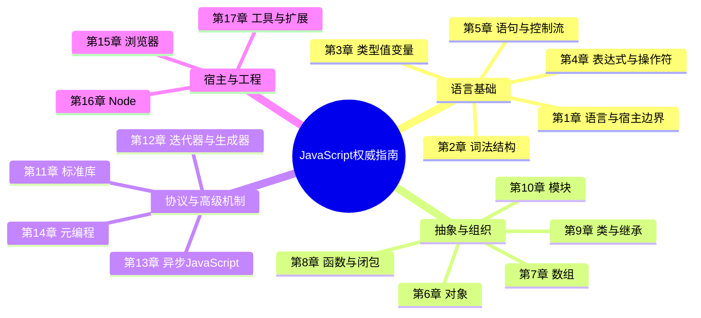
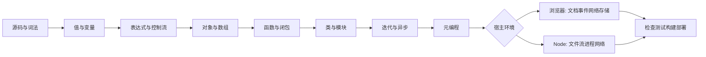

# 《JavaScript权威指南（原书第7版）》深度阅读

> **书目信息**：David Flanagan, *JavaScript: The Definitive Guide, Seventh Edition*；李松峰译；机械工业出版社，2021；ISBN 978-7-111-67722-2。原作者前言落款为2020年3月，正文覆盖到ES2020。
>
> **文本依据**：本文逐章核对本地第7版中文PDF（前言、17章正文及小结），并用题目提供的第6版AZW3核对版本变化。引用均标注章或小节；代码只保留解释机制所需的短片段。`【原书】`表示原书观点或示例，`【版本对照】`表示第6版与第7版对比，`【书后补充】`表示2021年后规范或工程实践，三者不混写。
>
> **阅读边界**：JavaScript语言由ECMAScript规范定义，DOM、`fetch()`、存储等由浏览器宿主提供，文件、进程、流等由Node宿主提供。看到一个API时，先判断它属于语言、标准库还是宿主，这是读懂本书最重要的分界线。

## 一、全书解决的核心问题

### 1.1 作者怎样定义JavaScript与本书

第1章开篇给出的定位很直接：

> “JavaScript是Web编程语言。”（第1章）

作者随即把这个定义扩展到现代应用范围：所有现代浏览器都带有JavaScript解释器，而Node让浏览器之外的JavaScript编程成为可能。对语言性质，书中的表述是：

> “JavaScript是一门高级、动态、解释型编程语言，非常适合面向对象和函数式编程风格。”（第1章）

这里的“解释型”是书中的语言定位，不等于现代引擎只能逐行解释；V8、SpiderMonkey等实现通常还会做即时编译与运行时优化。“变量是无类型的”也不是“值没有类型”，而是变量不固定绑定某一种类型，值仍有数值、字符串、对象等明确类别。

前言则界定了本书范围：

> “本书介绍JavaScript语言和由浏览器及Node实现的JavaScript API。”（前言）

所以它不是一份框架教程，也不只是一部语法字典。它要回答三个层次的问题：

1. **语言怎样表达计算**：文本如何被识别，值怎样表示，表达式和语句如何改变程序状态。
2. **大型程序怎样组织**：对象、闭包、类、模块、迭代协议与异步抽象如何控制复杂度。
3. **语言怎样与现实世界交互**：浏览器如何提供文档、事件、网络和存储，Node如何提供文件、流、进程和服务器能力。

通俗地说，JavaScript最初解决的是“网页怎样响应人和网络”的问题；发展到ES6以后，它还要解决“大型软件怎样分层、复用和并发等待”的问题。本书的价值不在罗列语法，而在解释这些机制之间如何接力。

### 1.2 语言、标准库与宿主环境

【原书，第1章】核心语言只定义操作数值、文本、数组、集合和映射等所需的最小API，不包含输入和输出。输入输出、联网、存储和图形由宿主环境承担。

| 层次 | 典型能力 | 书中位置 | 常见误判 |
| --- | --- | --- | --- |
| ECMAScript语言 | 词法、类型、表达式、对象、函数、类、模块、迭代、期约 | 第2～14章 | 把JavaScript等同于浏览器脚本 |
| ECMAScript标准库 | `Array`、`Map`、`Set`、`RegExp`、`JSON`、`Intl`、`Proxy` | 第11、14章 | 以为所有内置对象都由浏览器提供 |
| 浏览器宿主 | `document`、事件、`fetch()`、Canvas、Web Storage、Worker | 第15章 | 以为Node中天然存在DOM |
| Node宿主 | `Buffer`、文件、流、进程、HTTP、工作线程 | 第16章 | 以为这些API属于语言标准 |
| 工程工具 | ESLint、Prettier、Jest、npm、打包器、Babel、JSX、Flow | 第17章 | 把构建工具输出当作运行时特性 |

这个分层还能解释“为什么同一段JavaScript换个地方就不能运行”：语法相同，不代表宿主能力相同。`Array.prototype.map()`在浏览器和Node中都能使用；`document.querySelector()`只有存在DOM的宿主才有；`node:fs`则需要Node。

### 1.3 全书逻辑框架



作者在1.5节明确说全书采取“自底向上”的解释方式：先讲注释、标识符、变量和类型，再讲表达式、语句、对象和函数，最后上升到类和模块。把它转换成一段程序的生命周期，就是：



### 1.4 与历史方案和主流技术的比较

这些技术并不全是互斥替代品。比较的意义是确定它们各自位于哪一层。

| 维度 | 现代JavaScript | 第6版时代的ES5 | TypeScript | WebAssembly | Java / C# |
| --- | --- | --- | --- | --- | --- |
| 浏览器执行 | 原生支持，无需插件 | 原生支持，但缺少类、模块、期约等标准抽象 | 先擦除类型并编译为JavaScript | 浏览器可加载，通常由JavaScript协调Web API | 通常不在浏览器直接执行 |
| 类型 | 动态类型，错误多在运行时暴露 | 同左，且工程约束更少 | 渐进式静态类型，编译期发现大量接口错误 | 静态、低层类型 | 静态名义类型为主 |
| 对象模型 | 原型继承，`class`是其上层语法 | 构造函数加原型 | 沿用JavaScript运行时模型 | 线性内存，不直接拥有DOM对象模型 | 类继承与接口体系成熟 |
| 模块 | 标准ES模块，静态依赖图 | 依赖闭包、AMD或CommonJS等约定 | 输出ES模块或其他目标格式 | 模块负责计算导出，需宿主胶水 | 自有包与模块系统 |
| 异步 | Promise、`async/await`、异步迭代 | 回调和事件为主 | 与JavaScript相同并增加类型 | 本身不是Web事件模型 | 线程、任务或future体系 |
| 优势 | Web原生、部署广、函数与对象灵活、生态庞大 | 兼容旧环境 | 大型团队的接口约束和重构能力更强 | CPU密集、可移植的低层计算 | 强工具链、服务端与企业生态成熟 |
| 主要代价 | 隐式转换、动态类型、历史兼容包袱 | 模块化和异步可读性较差 | 仍须理解JavaScript语义，类型不在运行时保留 | 不能直接替代DOM与多数应用逻辑 | Web交付链更重，前端仍常需JavaScript |

结论不是“JavaScript在所有维度最好”，而是它是Web平台的原生协调语言。TypeScript给它增加编译期约束，WebAssembly承接计算密集部分，Java/C#等适合另一类服务端约束；它们更多是分工协作而非零和替代。

## 二、17章各自完成了哪一步

| 章节 | 标题 | 核心内容 | 这一章解决的问题与方案 |
| --- | --- | --- | --- |
| 前言 | 阅读范围与资料边界 | 语言、浏览器API、Node API；参考资料改用MDN与Node文档 | 纸质API参考会迅速过时，因此第7版专注原理和重要API，把即时查询交给在线文档 |
| 第1章 | JavaScript简介 | 历史、语言定位、宿主环境、快速语法巡礼、字符频率柱形图 | 建立全景认知；用一个真实Node程序展示类型、类、映射、迭代和I/O如何协作 |
| 第2章 | 词法结构 | 大小写、空白、注释、字面量、标识符、Unicode、可选分号 | 解决“源码如何被正确分词”；重点防范ASI和Unicode同形不同码导致的隐蔽错误 |
| 第3章 | 类型、值和变量 | 原始类型、对象、转换、相等性、作用域、`let`/`const`/`var`、解构 | 解决“数据如何表示与命名”；用明确类型转换和块级声明降低动态语言的不确定性 |
| 第4章 | 表达式与操作符 | 属性访问、调用、创建、算术、关系、逻辑、赋值、`eval`、`?.`等 | 解决“值如何计算”；通过优先级、短路规则和可选链精确描述求值过程 |
| 第5章 | 语句 | 条件、循环、跳转、异常、严格模式、声明 | 解决“程序怎样改变状态与转移控制”；用结构化控制流和异常传播组织执行路径 |
| 第6章 | 对象 | 创建、原型、属性查询/设置/删除/枚举、复制、序列化、字面量扩展 | 解决“具名数据与行为如何组合”；原型链负责共享，属性特性负责控制可见性和可写性 |
| 第7章 | 数组 | 索引、稀疏数组、长度、迭代、变换、类数组、字符串 | 解决“有序集合怎样高效处理”；以迭代方法代替手工索引循环，区分稀疏槽位和`undefined` |
| 第8章 | 函数 | 定义与调用、参数、`this`、闭包、高阶函数、函数属性和方法 | 解决“行为怎样封装和组合”；一等函数支持回调，闭包保存词法环境，高阶函数抽象算法 |
| 第9章 | 类 | 原型、构造函数、`class`、子类、组合与继承 | 解决“同类对象如何共享行为”；`class`把原型约定标准化，`extends`/`super`表达继承关系 |
| 第10章 | 模块 | 闭包模块、Node模块、ES模块 | 解决“代码如何跨文件隐藏和复用”；导入导出形成显式边界，ES模块提供可静态分析的依赖图 |
| 第11章 | JavaScript标准库 | Map/Set、定型数组、正则、日期、Error、JSON、Intl、URL、计时器 | 解决通用数据结构和协议问题；优先复用标准对象而不是自行实现基础轮子 |
| 第12章 | 迭代器与生成器 | 迭代协议、可迭代对象、`function*`、`yield`、`yield*` | 解决“生产者如何与消费者解耦”；统一`for/of`、展开和解构的数据消费协议 |
| 第13章 | 异步JavaScript | 回调、Promise、`async/await`、异步迭代 | 解决“等待期间不阻塞且保持可读”；Promise表示未来结果，`await`恢复顺序化表达，异步迭代处理值流 |
| 第14章 | 元编程 | 属性描述符、对象完整性、符号、标签模板、Reflect、Proxy | 解决“代码如何观察或改变对象基础行为”；反射把操作函数化，代理为操作设置陷阱且受不变式约束 |
| 第15章 | 浏览器中的JavaScript | 脚本加载、事件、DOM/CSS、图形、网络、存储、安全、Worker | 解决“语言怎样驱动网页”；浏览器对象模型把用户、文档、网络与JavaScript连接起来 |
| 第16章 | Node服务器端JavaScript | Node模型、Buffer、EventEmitter、流、进程、文件、HTTP、子进程、Worker | 解决“浏览器外怎样做系统I/O”；默认异步API和流式背压支持I/O密集服务 |
| 第17章 | JavaScript工具和扩展 | ESLint、Prettier、Jest、npm、打包、Babel、JSX、Flow | 解决“多人项目怎样保持一致并交付”；把规范检查、格式化、测试、依赖和兼容转换自动化 |

## 三、第6版到第7版：不是简单增补

题目提供的第6版出版于2012年，以ES5和HTML5为最新基线。第7版出版于2021年，以ES5为兼容基线，但主体讲到ES2020。两版相隔的不只是若干语法，而是JavaScript从浏览器脚本走向通用工程语言的阶段变化。

| 方面 | 第6版 | 第7版 | 阅读结论 |
| --- | --- | --- | --- |
| 结构 | 22章、4部分，后两部分是核心和客户端参考手册 | 前言加17章，不再附完整参考手册 | 原理留在书中，易变的API细节转向MDN与Node在线文档 |
| 语言基线 | ES3/ES5，ES5仍在浏览器落地 | ES5作为兼容基线，重点覆盖ES6～ES2020 | `let`、`const`、类、模块、Promise、迭代器等已从扩展变为主线 |
| 类与模块 | 构造函数、原型、闭包模块为主 | 独立的类章和模块章 | 新语法没有消灭原型，而是给原型机制增加一致表述 |
| 异步 | 事件和回调；Node 0.4的异步I/O | Promise、`async/await`、异步迭代；现代Node独立成章 | 从“传回调”升级为可组合的未来值和异步值流 |
| 浏览器 | Window、DOM、CSS、事件、XHR、jQuery各自成章 | 合并为现代浏览器一章，覆盖`fetch`、Web组件、Worker等 | 原生Web API成熟后，jQuery不再是理解浏览器的必经层 |
| 服务端 | 简短介绍Rhino与Node 0.4 | 系统介绍Buffer、流、文件、HTTP、子进程、Worker | Node从新兴宿主变成正式的服务端平台 |
| 工程化 | 非主线 | ESLint、Prettier、Jest、npm、打包、Babel、JSX、Flow | 语言知识之外，质量与交付流程成为必修内容 |
| 已退出主线 | E4X、Rhino、早期移动事件、jQuery参考 | 不再作为核心章节 | 旧内容有历史价值，但不应作为新项目默认方案 |

第7版前言还解释了为什么删除参考部分：在线资料可以更快提供最新API。这个决定恰好说明“权威指南”的长期价值应落在语义、模型和边界，而不是冻结某个年份的接口清单。

## 四、沿程序生命周期吃透关键机制

### 4.1 源码阶段：词法、Unicode、ASI与严格模式（第2、5章）

#### 为什么先学这些规则

解释器看到的不是“意图”，而是字符和记号。第2章把词法结构定义为语言的最低级语法：它规定名字、注释和语句怎样分隔。许多看似运行时的问题，其实在源码被分词时已经决定。

#### 书中规则与用法

JavaScript区分大小写；程序文本使用Unicode；多行注释不能嵌套。分号虽然常可省略，但ASI（自动分号插入）只会在特定语法条件下发生，并不是简单的“换行等于分号”。

```javascript
// 【原书规则，第2.6节】换行会让 return 在这里结束。
function answer() {
  return
  42;
}

answer(); // undefined

// 不以分号结尾时，以 ( 或 [ 开头的下一行可能接到前一行。
let x = 1
[x].forEach(console.log); // 可能被解析成前一表达式的延续
```

工程上可以选择始终写分号，也可以采用无分号风格，但必须交给格式化器统一，不能依赖“看起来像两句”。模块和类的代码自动处于严格模式；脚本可用`"use strict"`显式进入严格模式。

#### 术语

- **Token（记号）**：词法分析识别出的最小语法单位，如标识符、关键字和操作符。
- **Unicode**：统一字符编码标准。书中提醒，同一个视觉字符可能有不同码点序列，比较前可用`normalize()`归一化数据。
- **ASI（Automatic Semicolon Insertion）**：自动分号插入。`return`、`throw`、`yield`、`break`、`continue`后的换行尤其危险。
- **Strict Mode（严格模式）**：ES5引入的受限执行模式，禁止部分历史缺陷并把静默失败改成异常。

#### 局限与处理

- JavaScript必须向后兼容，早期错误很难删除；用严格模式、ES模块、ESLint和测试缩小风险面。
- Unicode标识符合法但可能妨碍审查或产生同形字风险；业务标识符通常保持ASCII，用户文本在边界处规范化。
- 自动格式化只能统一外观，不能替代对ASI规则的理解。

一句话理解：这一阶段是在确定“代码到底被读成了什么”，连句子都断错，后面的业务逻辑就无从谈起。

### 4.2 值进入程序：类型、转换、变量与作用域（第3章）

#### 数据模型解决什么问题

程序通过操作值工作。JavaScript把类型分为原始类型和对象类型；原始值不可修改，对象是可修改的引用值。动态类型让一个变量能先后引用不同类型的值，灵活性高，但类型错误更晚暴露。

```javascript
// 【原书要点，第3.8～3.10节】
let text = "hello";
text[0] = "H";             // 字符串原始值不被修改

const point = { x: 1 };
point.x = 2;                // const限制绑定，不冻结对象

const sameValue = null == undefined;  // true：发生宽松相等规则
const sameType = null === undefined;  // false：不做类型转换
```

推荐默认使用`const`，只有需要重新绑定时才用`let`。`var`具有函数作用域、声明提升和可重复声明等历史语义，新代码一般不需要它。注意，`let`和`const`声明也会被纳入词法环境，但在声明求值前处于TDZ，不能把它们粗略理解为“完全不提升”。

#### 术语

- **Primitive（原始值）**：`undefined`、`null`、布尔值、数值、字符串、符号和BigInt；它们按值比较且自身不可修改。
- **Object（对象）**：属性的集合，按引用共享和比较；数组与函数也是特殊对象。
- **Dynamic Typing（动态类型）**：类型属于运行时的值，变量不预先固定类型。
- **Coercion（强制类型转换）**：运算符隐式把值转换到另一类型；`==`和`+`最容易触发意外转换。
- **TDZ（Temporal Dead Zone，暂时性死区）**：块级绑定创建后到声明执行前不可访问的区间。
- **BigInt**：ES2020大整数类型，字面量以`n`结尾；不能与普通`Number`直接混算。
- **Symbol（符号）**：ES6新增的唯一原始值，常用于避免属性名冲突和定义协议。

#### 版本与实践

| 问题 | ES5常见写法 | 第7版主线 | 实际选择 |
| --- | --- | --- | --- |
| 声明 | `var count = 0` | `let`、`const` | 默认`const`，重新绑定才用`let` |
| 大整数 | `Number`可能越过安全整数范围 | `123n` | 金额常用最小货币单位或十进制定点库，不盲用浮点数 |
| 唯一属性键 | 约定字符串前缀 | `Symbol()` | 公共数据仍优先清晰字符串键 |
| 类型可靠性 | 运行时检查 | 语言仍为动态类型 | 大型项目可叠加TypeScript，但运行时输入仍需校验 |

一句话理解：变量像标签，值才是货物；`const`锁住的是标签与货物的绑定，不是把对象货物冻住。

### 4.3 计算与决策：表达式、语句、循环和异常（第4、5章）

表达式产生值，语句让事情发生。操作符优先级、短路求值、属性访问和调用构成计算；条件、循环、跳转和异常构成控制流。

```javascript
const city = user?.address?.city ?? "未知";

for (const value of values) {       // 可迭代对象的值
  if (!Number.isFinite(value)) continue;
  total += value;
}

try {
  return JSON.parse(input);
} catch (error) {
  throw new SyntaxError("配置不是合法JSON", { cause: error }); // cause为书后特性
}
```

`?.`只在左侧为`null`或`undefined`时短路；`??`也只把这两个值视为缺失，所以不会错误覆盖`0`、`false`或空字符串。`for/in`枚举对象的可枚举字符串属性，可能包含继承属性；`for/of`消费可迭代对象的值，两者不能混用。

#### 术语

- **Expression（表达式）**：求值后产生一个值的语法片段。
- **Statement（语句）**：执行动作或改变控制流的完整单元。
- **Short-circuit Evaluation（短路求值）**：结果已确定后不再求值右操作数。
- **Optional Chaining（可选链）**：`?.`安全访问可能为空的属性、元素或调用。
- **Nullish Coalescing（空值合并）**：`??`只为空值提供默认值。
- **Exception Propagation（异常传播）**：当前层未捕获的异常沿调用栈向上传递，直到处理程序或宿主。

局限在于表达式过度嵌套会把控制流藏起来，异常也不应承担普通分支。复杂判断拆成有名字的函数；只捕获能够处理的异常，补充上下文后保留原始原因。

一句话理解：表达式负责“算出什么”，语句负责“下一步做什么”，异常负责“正常路线走不通时交给谁”。

### 4.4 建模数据：对象、属性、原型与数组（第6、7章）

#### 对象模型的核心

对象是属性的无序集合，每个对象都关联一个原型。查询自有属性失败后，会沿原型链查找继承属性。数组则为有序、整数索引数据提供专门行为，`length`不是普通的计数缓存，而与索引属性联动。

```javascript
// 【原书机制，第6章】以指定原型创建对象。
const prototype = { describe() { return `${this.x},${this.y}`; } };
const point = Object.create(prototype);
point.x = 2;
point.y = 3;

Object.hasOwn(point, "x");          // true（Object.hasOwn为书后补充）
"describe" in point;                // true，包含继承属性

const doubled = [1, 2, 3]
  .filter(x => x > 1)
  .map(x => x * 2);                  // [4, 6]
```

复制对象时要警惕“浅复制”：展开语法和`Object.assign()`只复制一层可枚举自有属性；访问器会被取值，嵌套对象仍共享引用。JSON只表达有限数据模型，不能保留函数、原型、`undefined`、符号、循环引用或完整数值语义。

#### 术语

- **Own Property（自有属性）**：直接定义在对象自身的属性。
- **Inherited Property（继承属性）**：通过原型链查询到的属性。
- **Prototype Chain（原型链）**：对象到原型、再到原型的原型的查找链。
- **Property Descriptor（属性描述符）**：属性的`value`/`writable`/`enumerable`/`configurable`或访问器配置。
- **Sparse Array（稀疏数组）**：某些索引根本不存在的数组；空槽不等同于值为`undefined`的元素。
- **Array-like Object（类数组对象）**：有整数属性和`length`，但不一定有数组原型方法的对象。
- **Shallow Copy（浅复制）**：只复制顶层属性，内部引用继续共享。

#### 选择与局限

| 需求 | 首选 | 原因 |
| --- | --- | --- |
| 固定字段的记录 | 普通对象 | 字段语义清楚，字面量简洁 |
| 任意类型键、频繁增删 | `Map` | 不与原型属性冲突，键不限字符串 |
| 去重和成员检测 | `Set` | 直接表达集合语义 |
| 有序同类数据 | `Array` | 迭代与变换方法丰富 |
| 二进制缓冲 | 定型数组/`ArrayBuffer` | 明确元素宽度与底层内存布局 |

不要为“继承代码复用”随意修改内置对象原型；不要用`for/in`遍历数组；面对不可信JSON，仍要做结构校验，因为解析成功不等于业务数据合法。

一句话理解：对象是按名字取物的柜子，数组是按顺序取物的货架，原型是柜子找不到时会去查询的公共说明书。

### 4.5 封装行为：函数、调用方式、`this`与闭包（第8章）

JavaScript函数是一等值：能赋给变量、放进对象、作为参数传入，也能作为结果返回。由此产生回调、高阶函数和函数式编程。闭包则让函数在离开定义位置后仍能访问其词法作用域。

```javascript
// 【原书思想，第8.6节】私有状态由闭包保存。
function counter() {
  let n = 0;
  return () => ++n;
}

const next = counter();
next(); // 1
next(); // 2

const calculator = {
  factor: 2,
  scale(values) {
    return values.map(value => value * this.factor);
  }
};
```

`this`不由函数定义位置决定，而由调用形式决定：方法调用、普通函数调用、构造函数调用、`call`/`apply`间接调用各有绑定规则。箭头函数没有自己的`this`和`arguments`，而是捕获外层绑定，因此适合回调，但不适合作为需要动态接收者的方法。

#### 术语

- **First-class Function（一等函数）**：函数可以像其他值一样存储、传递和返回。
- **Closure（闭包）**：函数与其定义时词法环境的组合。
- **Lexical Scope（词法作用域）**：名字解析由源码嵌套位置决定。
- **Higher-order Function（高阶函数）**：接收函数或返回函数的函数。
- **Receiver（接收者）**：方法调用中位于点号左侧、用于绑定`this`的对象。
- **Rest Parameter（剩余参数）**：`...args`把剩余实参收集为真正数组，优于旧式`arguments`。

闭包不会自动泄漏，但只要闭包仍可达，被捕获对象就可能无法回收。长期事件监听器要及时移除；不要在循环中无意捕获巨大状态。函数式写法也不是链越长越好，中间数组和隐藏副作用都会降低可读性或性能。

一句话理解：函数是可以搬运的行为，闭包是它随身携带的定义现场，`this`则是调用那一刻分配给它的工作对象。

### 4.6 组织同类对象：类、原型继承与组合（第9章）

第9章先讲类和原型，再讲构造函数，最后讲`class`，这个顺序刻意说明：JavaScript类建立在原型机制上，`class`不是另一套对象模型。

```javascript
// 【原书风格，第9章】
class Point {
  constructor(x, y) {
    this.x = x;
    this.y = y;
  }

  distance() {
    return Math.hypot(this.x, this.y);
  }
}

class ColorPoint extends Point {
  constructor(x, y, color) {
    super(x, y);
    this.color = color;
  }
}
```

类声明体自动处于严格模式，方法定义在原型上供实例共享。子类构造函数必须在使用`this`前调用`super()`。继承表达“是一种”关系；如果只是想复用行为，组合通常更松耦合。

#### 术语

- **Class（类）**：共享原型方法的一组对象的抽象定义。
- **Constructor（构造函数）**：通过`new`初始化实例的函数或类方法。
- **Instance（实例）**：其原型链与某个类原型关联的对象。
- **Subclass（子类）**：通过`extends`继承父类行为的类。
- **`super`**：访问父类构造函数或父类方法的特殊语法。
- **Composition（组合）**：把多个小对象的能力组装起来，而不是建立深继承层次。

【书后补充】公有/私有实例字段、私有方法和静态初始化块在ES2022标准化，第7版正文不能作为这些特性的完整参考。私有字段使用`#name`语法，是语言强制的封装，不等同于下划线命名约定。

一句话理解：`class`给原型继承装上了统一仪表盘，但发动机仍是原型链；能用组合表达时，不必堆高继承树。

### 4.7 跨文件协作：闭包模块、CommonJS与ES模块（第10章）

模块解决名字冲突、实现隐藏、显式依赖和独立测试。第10章先展示基于对象和闭包的旧模块，再介绍Node模块和ES6模块，反映了模块从约定走向语言标准的过程。

```javascript
// stats.js：ES模块
export function mean(values) {
  return values.reduce((sum, value) => sum + value, 0) / values.length;
}

// report.js
import { mean } from "./stats.js";
console.log(mean([2, 4, 6]));
```

ES模块导入导出具有静态结构，绑定是“活的”，而不是简单复制当时的值。浏览器模块脚本默认像`defer`一样在文档解析后执行；Node如何解释`.js`取决于包配置，现代项目通常在`package.json`中声明`"type": "module"`。

#### 术语

- **Module（模块）**：拥有独立作用域并显式导入、导出能力的代码单元。
- **ESM（ECMAScript Modules）**：标准`import`/`export`模块系统。
- **CommonJS**：Node早期采用的`require()`与`module.exports`模块约定。
- **Live Binding（活绑定）**：导入方观察导出绑定的后续变化，但不能给导入名重新赋值。
- **Dependency Graph（依赖图）**：模块及其静态依赖构成的有向图。
- **Tree Shaking**：构建工具依据静态导入导出移除未使用代码的优化。

循环依赖虽然可能运行，但初始化顺序难推理；副作用模块也会削弱可测试性。把边界设计成单向依赖，入口负责组装，核心模块尽量不在导入时执行外部I/O。

一句话理解：模块不是把文件切小，而是给代码之间的关系签合同：谁提供什么，谁依赖什么，都写在边界上。

### 4.8 使用标准库：集合、二进制、正则、JSON与国际化（第11章）

第11章把常用基础设施集中起来。正确选择标准数据结构，通常比手写算法更可靠。

```javascript
const frequencies = new Map();
for (const char of text) {
  frequencies.set(char, (frequencies.get(char) ?? 0) + 1);
}

const unique = new Set(["js", "web", "js"]); // js, web
const bytes = new Uint8Array([0, 127, 255]);
const payload = JSON.stringify({ language: "JavaScript" });
const price = new Intl.NumberFormat("zh-CN", {
  style: "currency",
  currency: "CNY"
}).format(128);
```

#### 术语

- **Map（映射）**：键到值的关联集合，键可以是任意值。
- **Set（集合）**：不重复值的集合，适合成员检测和去重。
- **Typed Array（定型数组）**：以固定数值类型解释`ArrayBuffer`内存的视图。
- **Regular Expression（正则表达式）**：描述文本模式的语言；要关注回溯成本和输入规模。
- **JSON（JavaScript Object Notation）**：与语言无关的数据交换格式，不是完整JavaScript对象序列化。
- **Intl（Internationalization API）**：由区域规则驱动的数字、日期和文本比较API。
- **URL API**：结构化解析与构造URL，优于手工拼接字符串。

正则适合局部文本模式，不适合解析任意嵌套语言；处理用户正则或复杂回溯时要防ReDoS。`Date`的时区和日历模型容易出错，存储时间点通常使用UTC时间戳，显示时再用`Intl`本地化。

一句话理解：标准库是一组经过统一约定的容器和工具，选对数据结构，程序意图会直接写在类型名字里。

### 4.9 统一消费数据：迭代器与生成器（第12章）

迭代协议把“数据怎样产生”和“数据怎样消费”解耦。`for/of`、展开语法、数组解构等都依赖可迭代协议。生成器用暂停和恢复的函数体降低手写状态机的复杂度。

```javascript
// 【根据第12.3节短例整理】
function* oneDigitPrimes() {
  yield 2;
  yield 3;
  yield 5;
  yield 7;
}

const primes = [...oneDigitPrimes()]; // [2, 3, 5, 7]

class Range {
  constructor(from, to) {
    this.from = from;
    this.to = to;
  }

  *[Symbol.iterator]() {
    for (let x = Math.ceil(this.from); x <= this.to; x++) yield x;
  }
}
```

调用生成器函数不会立即执行函数体，而是返回同时也是迭代器的生成器对象。每次`next()`把函数推进到下一个`yield`。迭代结果通常形如`{ value, done }`。

#### 术语

- **Iterable（可迭代对象）**：实现`[Symbol.iterator]()`并能创建迭代器的对象。
- **Iterator（迭代器）**：具有`next()`方法、逐次返回迭代结果的对象。
- **Iterator Result（迭代结果）**：包含`value`与`done`的对象。
- **Generator（生成器）**：由`function*`创建、可暂停和恢复的特殊函数。
- **`yield`**：暂停生成器并产出一个值。
- **`yield*`**：委托给另一个可迭代对象继续产出。
- **Lazy Evaluation（惰性求值）**：只在消费者请求时计算下一个值。

惰性序列可以避免一次性分配全部数据，但它通常只能消费一次，也可能持有资源。自定义迭代器需要考虑提前退出时的清理，必要时实现`return()`；无限序列必须由消费者显式限制。

一句话理解：迭代器像统一插头，消费者只会问“下一个是什么”，不必知道数据来自数组、文件还是按需计算。

### 4.10 等待而不阻塞：回调、Promise、`async/await`与异步迭代（第13章）

第13章先解释现实程序为何异步：浏览器等待用户和网络，服务器等待客户端请求。回调能表达“完成后做什么”，但多步依赖、错误传播和并行组合会迅速复杂。Promise把未来结果变成可组合对象，`async/await`再把Promise流程写成接近顺序代码的形式。

```javascript
// 【原书第13.2～13.3节思想；补上HTTP状态检查】
async function getJSON(url, signal) {
  const response = await fetch(url, { signal });
  if (!response.ok) {
    throw new Error(`HTTP ${response.status}`);
  }
  return response.json();
}

const controller = new AbortController();

try {
  const [profile, orders] = await Promise.all([
    getJSON("/api/profile", controller.signal),
    getJSON("/api/orders", controller.signal)
  ]);
  render({ profile, orders });
} catch (error) {
  showError(error);
}
```

书中强调，`fetch()`兑现后只代表收到了响应对象，响应体的`json()`或`text()`仍返回Promise。还要补充一个常见误区：`fetch()`遇到404/500通常不会自动拒绝，必须检查`response.ok`。

异步迭代把多次、随时间到达的值统一到`for await/of`：

```javascript
for await (const chunk of readableStream) {
  consume(chunk);
}
```

#### 术语

- **Callback（回调）**：异步操作完成时由宿主或库调用的函数。
- **Promise（期约）**：表示尚未完成操作最终结果的对象，状态只能从待定变为兑现或拒绝。
- **Fulfilled / Rejected（兑现/拒绝）**：Promise完成的两种结果。
- **`async` Function（异步函数）**：总是返回Promise的函数。
- **`await`**：暂停当前异步函数，待Promise落定后以结果恢复；不会阻塞整个线程。
- **Microtask（微任务）**：Promise反应通常进入微任务队列，在当前任务栈清空后、下一个任务前执行。
- **Async Iterable（异步可迭代对象）**：通过`Symbol.asyncIterator`产生异步迭代器，其`next()`返回Promise。
- **Cancellation（取消）**：Promise本身没有通用取消状态，Web API通常借助`AbortController`传播取消信号。

#### 局限与方案

- 顺序写多个独立`await`会意外串行；先创建Promise，再用`Promise.all()`并行等待。
- `Promise.all()`快速失败但不会自动取消其他操作；资源敏感任务要显式传递取消信号。
- 忘记`await`或不处理拒绝会产生悬空任务；入口层统一捕获并记录上下文。
- `async/await`改善控制流，但不会自动解决竞态、超时、幂等和背压。

一句话理解：Promise是未来结果的凭证，`await`只是把“凭证兑现后继续”写得像普通顺序代码，等待期间运行时仍可处理别的事件。

### 4.11 改写对象基本行为：描述符、符号、Reflect与Proxy（第14章）

元编程是“让程序观察或操作程序自身结构”。属性描述符控制属性能否写、枚举、删除；公认符号让对象接入语言协议；Reflect把语法级操作变成函数；Proxy允许拦截这些基础操作。

```javascript
const target = { price: 100 };

const guarded = new Proxy(target, {
  set(object, key, value, receiver) {
    if (key === "price" && (!Number.isFinite(value) || value < 0)) {
      throw new RangeError("price必须是非负有限数");
    }
    return Reflect.set(object, key, value, receiver);
  }
});

guarded.price = 128;
// guarded.price = -1; // RangeError
```

第14章称Proxy是ES6以后最强大的元编程特性之一，但也强调代理必须遵守对象不变式。例如目标上不可写且不可配置的属性，`get`陷阱不能凭空报告另一个值。

#### 术语

- **Metaprogramming（元编程）**：把程序结构或语言操作本身作为数据处理。
- **Property Attribute（属性特性）**：描述属性值、可写性、可枚举性和可配置性的内部状态。
- **Well-known Symbol（公认符号）**：如`Symbol.iterator`，由语言在特定操作中主动查找的协议键。
- **Reflect（反射API）**：把属性访问、构造、调用等基础操作映射为函数。
- **Proxy（代理）**：把对目标对象的基础操作转发给处理器陷阱的包装对象。
- **Trap（陷阱）**：代理处理器中的`get`、`set`、`ownKeys`等拦截方法。
- **Invariant（不变式）**：代理结果必须遵守的对象模型一致性约束。

Proxy会改变普通对象操作的成本和可预测性，不应只为语法炫技。验证外部输入时，显式解析器通常比深层代理更清晰；私密数据也不能仅靠代理保护，因为持有原目标引用的代码可绕过代理。

一句话理解：Reflect是把语言动作做成按钮，Proxy是在按钮前加一道可编程门禁，但门禁不能违反整栋楼的结构规则。

### 4.12 浏览器生命周期：加载、事件、DOM、网络、存储和安全（第15章）

#### 从加载到事件驱动

第15章把浏览器程序分为两个阶段：先加载文档并执行脚本，再进入由事件驱动的异步阶段。普通脚本可能阻塞HTML解析；`defer`延迟到文档解析后并保持顺序；`async`下载完成即尽快执行，顺序不可预测；模块脚本默认具有类似`defer`的行为。

```html
<button id="load">加载</button>
<output id="result"></output>

<script type="module">
  const button = document.querySelector("#load");
  const output = document.querySelector("#result");

  button.addEventListener("click", async () => {
    const response = await fetch("/api/message");
    const { message } = await response.json();
    output.textContent = message; // 文本写入，不把外部内容解释为HTML
  });
</script>
```

优先使用`addEventListener()`，因为事件处理程序属性每类事件通常只能保存一个处理器。大量同类子元素可用事件冒泡做委托。更新页面时，`textContent`适合不可信文本；把用户输入交给`innerHTML`会扩大XSS风险。

#### 浏览器能力分组

| 生命周期环节 | 书中API | 典型用途 | 关键边界 |
| --- | --- | --- | --- |
| 加载 | `script`、`async`、`defer`、模块 | 控制下载、解析与执行顺序 | 不假设异步脚本顺序 |
| 输入 | 事件对象、冒泡、监听器 | 点击、键盘、状态变化 | 移除长期监听器，避免重复注册 |
| 文档 | DOM查询、创建、插入、删除 | 更新结构与文本 | 批量修改，避免无意义布局抖动 |
| 样式与图形 | CSS类、SVG、Canvas、Audio | 呈现、可视化、媒体 | SVG保留对象树；Canvas通常需重绘 |
| 网络 | `fetch`、SSE、WebSocket | 请求响应与实时通信 | 同源策略、CORS、状态与取消 |
| 存储 | Web Storage、IndexedDB、Cookie | 偏好、离线数据、会话 | 容量、来源、生命周期和敏感数据 |
| 并行 | Worker、消息传递 | 把CPU任务移出主线程 | 无共享DOM，数据通过消息传递 |

#### 术语

- **DOM（Document Object Model，文档对象模型）**：把HTML/XML表示成可查询和修改的节点树。
- **Event Bubbling（事件冒泡）**：事件从目标向祖先传播的阶段，可用于事件委托。
- **DOMContentLoaded**：文档已解析、延迟脚本已运行后的生命周期事件，不等于所有图片等资源已加载。
- **Same-origin Policy（同源策略）**：以协议、主机和端口约束不同来源文档的访问。
- **CORS（Cross-Origin Resource Sharing，跨源资源共享）**：服务器通过响应头允许特定跨源请求的机制。
- **XSS（Cross-site Scripting，跨站脚本）**：不可信内容被当作页面代码执行的漏洞类别。
- **SVG（Scalable Vector Graphics，可伸缩矢量图形）**：以元素树描述矢量图形。
- **Canvas（画布）**：通过即时绘图API修改像素表面的图形机制。
- **Web Worker（Web工作线程）**：在后台线程运行脚本并通过消息与主线程通信。

浏览器的安全沙箱限制文件和系统能力，但不等于应用天然安全。DOM注入、跨源配置、令牌存储和第三方脚本仍需威胁建模。性能问题也应先测量：框架并不会自动消除昂贵布局或主线程长任务。

一句话理解：浏览器把脚本放进一个受限工作间，DOM是可操作的页面模型，事件是外界送来的消息，网络和存储则都有来源与权限边界。

### 4.13 Node生命周期：事件、Buffer、流、文件、进程与服务器（第16章）

Node让JavaScript获得操作系统能力。第16章的主线不是“把浏览器API搬到服务器”，而是默认异步I/O、事件、Buffer和流如何配合。

```javascript
// 【现代ESM写法；对应第16.8节HTTP服务器】
import { createServer } from "node:http";

const server = createServer((request, response) => {
  if (request.url === "/health") {
    response.writeHead(200, { "content-type": "application/json" });
    response.end(JSON.stringify({ status: "ok" }));
    return;
  }

  response.writeHead(404);
  response.end();
});

server.listen(3000, "127.0.0.1");
```

大文件不应先全部读入内存再发送，流让数据分块经过管道，并通过背压协调生产者与消费者：

```javascript
import { createReadStream } from "node:fs";
import { createGzip } from "node:zlib";
import { pipeline } from "node:stream/promises";

await pipeline(
  createReadStream("access.log"),
  createGzip(),
  process.stdout
);
```

#### 术语

- **Node.js**：基于V8的JavaScript运行时，为文件、网络、进程等系统能力提供API。
- **EventEmitter（事件发射器）**：Node中发布和订阅命名事件的基础模式。
- **Buffer（缓冲区）**：Node处理字节序列的类型，与文本字符串语义不同。
- **Stream（流）**：分块读取、写入或转换数据的抽象。
- **Backpressure（背压）**：消费者跟不上生产者时反馈减速，防止内存无界增长。
- **Process（进程）**：拥有独立地址空间和系统资源的程序实例。
- **Child Process（子进程）**：由当前Node进程启动的外部进程。
- **Worker Thread（工作线程）**：用于CPU密集JavaScript任务的同进程线程。

Node适合大量等待I/O的服务，但主事件循环上的CPU密集计算会阻塞所有请求。短任务优化算法，重任务使用工作线程、子进程或外部计算服务。网络服务器还必须补齐超时、请求体大小限制、优雅停机、日志和输入验证，示例服务器只说明机制，不是生产模板。

一句话理解：Node的强项是让一个线程高效协调许多正在等待的I/O；流负责分批搬运，背压负责别让上游把仓库塞爆。

### 4.14 交付阶段：检查、格式化、测试、依赖、打包与转译（第17章）

语言能运行不代表项目可维护。第17章把工具分成不同职责：ESLint发现可疑代码，Prettier统一格式，Jest验证行为，npm管理依赖，打包器处理资源与模块，Babel转换语法，JSX和Flow属于语言扩展。

```text
源码
  -> 静态检查与格式化
  -> 单元/集成/端到端测试
  -> 依赖解析与打包
  -> 必要的语法转译
  -> 浏览器或Node运行
```

#### 术语

- **Lint（静态检查）**：不运行程序，通过语法树和规则发现错误模式。
- **Formatter（格式化器）**：自动统一排版，不负责证明业务正确。
- **Unit Test（单元测试）**：隔离验证小单元的输入输出和边界。
- **Package Manager（包管理器）**：解析、安装并锁定项目依赖。
- **Bundler（打包器）**：分析依赖图并生成部署产物。
- **Transpiler（转译器）**：把一种源码形式转换为另一种同层级语言形式，例如新JavaScript到旧目标语法。
- **JSX**：在JavaScript中表达类似XML标记的语法扩展，需要工具转换。
- **Flow**：第17章介绍的静态类型检查器；现代新项目更常选择TypeScript。

工具链的局限是复杂度和供应链风险。只引入解决实际问题的工具；提交锁文件；持续审计依赖；CI运行与本地相同的检查。转译能处理语法，不保证目标环境拥有新API，缺失API仍需polyfill或替代实现。

一句话理解：工具链是交付流水线，各工具只负责一道工序；把所有工具叫“编译器”会掩盖它们不同的责任。

## 五、可复现的现代学习环境

原书第1章建议用浏览器开发者工具或Node交互环境实验。下面在此基础上给出2026年仍适用的完整步骤。本文写作环境已验证Node `v24.11.1`、npm `11.6.2`可用；新安装时选择Node 24 LTS系列即可，不必追逐Current版本。

### 5.1 安装并验证Node

1. 从Node官网下载安装Node 24 LTS，Windows安装器保持“添加到PATH”选项。
2. 关闭并重新打开PowerShell，使PATH刷新。
3. 验证运行时和包管理器：

```powershell
node --version
npm --version
```

4. 输入`node`进入REPL，执行`1 + 2`，输入`.exit`退出。

### 5.2 建立语言与Node练习项目

```powershell
New-Item -ItemType Directory js-definitive-lab
Set-Location js-definitive-lab
npm init -y
npm pkg set type=module
New-Item index.js
```

在`index.js`中写入：

```javascript
const words = ["module", "promise", "iterator", "promise"];
const counts = new Map();

for (const word of words) {
  counts.set(word, (counts.get(word) ?? 0) + 1);
}

console.log(Object.fromEntries(counts));
```

运行：

```powershell
node index.js
```

预期输出包含`module: 1`、`promise: 2`和`iterator: 1`。调试时可运行`node --inspect-brk index.js`，再用Chrome访问`chrome://inspect`连接。

### 5.3 建立浏览器练习项目

直接双击HTML适合最小示例，但模块、`fetch()`和安全策略通常需要HTTP服务器。用Vite建立项目：

```powershell
npm create vite@latest browser-lab -- --template vanilla
Set-Location browser-lab
npm install
npm run dev
```

终端会显示本地URL，通常为`http://localhost:5173/`。打开浏览器开发者工具，使用：

- **Console**观察日志和异常。
- **Sources**设置断点并检查作用域、闭包和调用栈。
- **Network**检查请求状态、响应头和时间线。
- **Performance**定位长任务、布局和绘制成本。
- **Application**检查Storage、Cookie、缓存和Worker。

### 5.4 增加质量检查与测试

```powershell
npm install --save-dev eslint prettier vitest
npx eslint --init
```

在`package.json`的`scripts`中配置`lint`、`format`和`test`后，固定执行：

```powershell
npm run lint
npm run test
npm run build
```

不要跳过初始化向导中对浏览器/Node、模块类型和框架的选择，它们决定全局变量和语法规则。Jest是原书第17章的选择；对Vite项目，Vitest与构建配置共享更自然，属于【书后补充】。

## 六、书后演进与相邻技术

这些内容用于判断第7版哪些地基仍有效、哪些上层工具已经变化，不属于原书正文。

| 方向 | 2021年后变化 | 与本书的承接关系 | 何时采用 |
| --- | --- | --- | --- |
| JavaScript标准 | 类字段/私有字段、顶层`await`、`Object.hasOwn()`、数组按副本变换、集合新方法等陆续标准化 | 仍建立在对象、类、模块和迭代协议之上 | 先查目标运行时兼容性，必要时转译或降级 |
| TypeScript | 已成为大型前端和Node项目的主流静态类型层 | 类型会被擦除，闭包、原型、`this`、Promise仍按本书语义运行 | 团队协作、公共接口多、重构频繁的项目 |
| 前端框架 | React、Vue、Angular、Svelte等提供声明式组件和状态更新 | 最终仍落到DOM、事件、模块、异步和构建工具 | 复杂交互与组件复用；简单页面不必为框架付费 |
| 运行时 | Node持续现代化，Deno与Bun提供不同安全、工具和性能取向 | 核心语言相同，宿主API与兼容策略不同 | 根据部署生态、npm兼容性和运维约束选型 |
| WebAssembly | 浏览器与服务端的可移植低层计算目标 | 适合与JavaScript协作，不直接替代DOM和大多数业务编排 | 编解码、图像、科学计算等CPU密集模块 |
| 测试 | Vitest、Playwright等成为常用选择 | 单元测试承接第17章；端到端测试补足真实浏览器行为 | UI流程、跨浏览器和网络交互需要真实验证时 |
| 日期时间 | Temporal方向用于弥补`Date`模型缺陷 | 不改变第11章对时间点、格式化和时区问题的认识 | 使用前确认目标环境是否原生支持，或采用成熟polyfill/库 |

最值得增加的不是某个框架清单，而是两层防线：用TypeScript约束开发期接口，用运行时schema校验网络、文件和用户输入。静态类型不能证明外部数据真实，运行时校验也不能替代编译期重构能力。

## 七、阅读结论

这本书的主线可以压缩成一句话：**JavaScript用动态值和一等函数表达计算，用原型、类和模块组织复杂度，用迭代协议与Promise组织随时间到达的数据，再由浏览器或Node把这些语言机制连接到现实世界。**

第7版最经得起时间检验的内容是边界和模型：原始值与引用、属性与原型、调用方式与`this`、闭包、模块活绑定、迭代协议、Promise解决过程、代理不变式、语言与宿主的分工。具体框架和工具会换代，但这些机制决定了框架报错时你能否继续向下追踪。

建议按依赖关系阅读，而不是硬性逐页推进：第2～8章打牢语言内核；第9～10章学习组织代码；第12～14章掌握协议与异步；然后根据工作方向选择第15章浏览器或第16章Node，最后用第17章建立可持续的工程反馈。读到难点可以按作者在1.5节的建议先跳过，形成整体认识后再回来，因为这门语言的特性本来就彼此交叉引用。

> **时效说明**：原书覆盖到ES2020，2021年后的内容均已标为“书后补充”。部署前应以ECMAScript规范、MDN兼容性数据和当前Node文档复核具体API。
>
> **版权说明**：本文为基于原书的分析性读书笔记，只引用必要短句和机制性代码片段，不替代原书。
