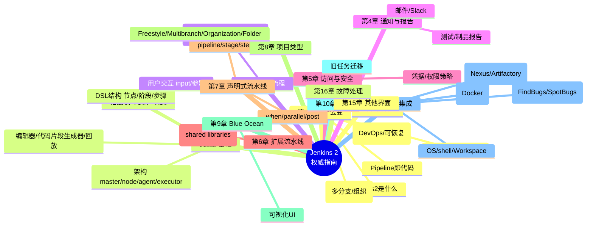
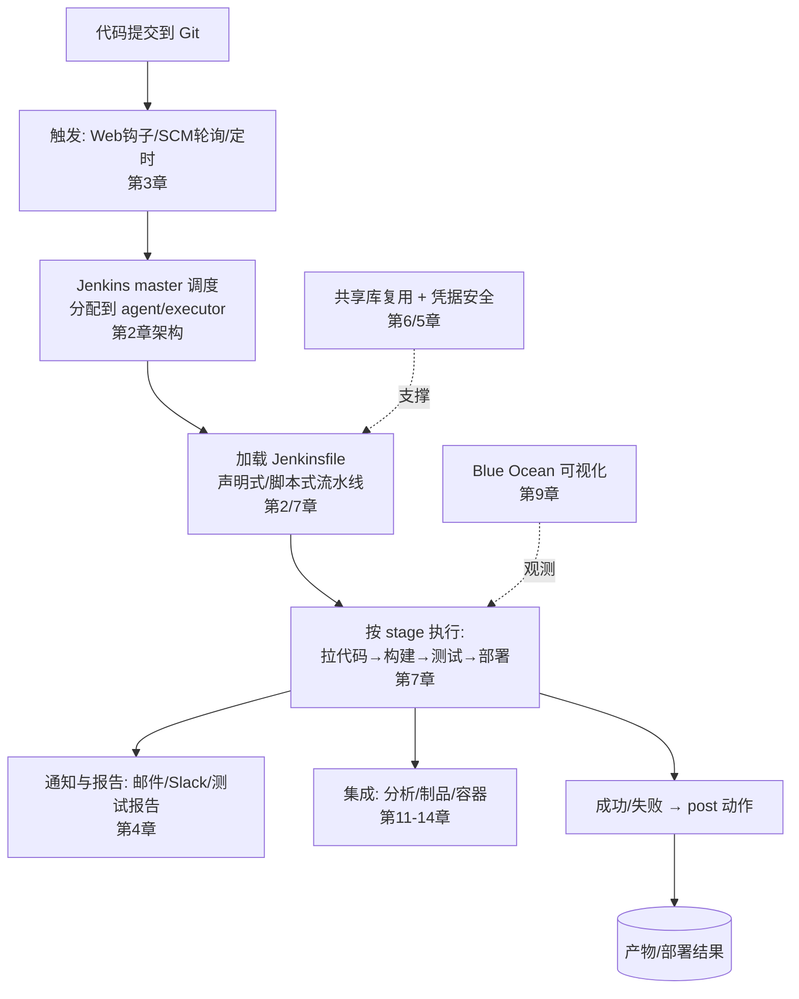

# Jenkins 2 权威指南 · 深度阅读指南

> **关于本指南**：严格基于 Brent Laster 著《Jenkins 2 权威指南》（中文版：电子工业出版社，2019，ISBN 978-7-121-35763-3，原版 O'Reilly 2018 _Jenkins 2: Up and Running_）的**真实文本结构**进行解读与扩展，不整章转载原文；代码示例为功能性说明片段。书中版次（Jenkins 2.x，2018）之后的技术演进（如 GitHub Actions、Tekton、JCasC 等）一律标注为「书后演进」。

---

## 一、整体理解与逻辑结构（全书层面）

### 【全局摘要】

**书中 / 官方表述（引用）**

- 出版社官方内容简介原话：「设计、实现并且执行具有一定**灵活性、可控性以及易于维护性**的持续交付流水线，对于以前版本的 Jenkins 来说是不可能实现的……作者 Brent Laster 向你展示了 **Jenkins 2 与这个流行的开源自动化平台基于 Web 的传统版本有着很大的不同**。」
- 原版副标题点题：「_Evolve Your Deployment Pipeline for Next-Generation Automation_（为下一代自动化演进你的部署流水线）」。
- 第 1 章「Jenkins 2 是什么」：Jenkins 2 的核心区别是**对流水线（pipeline）作为任务和 Jenkinsfile 的原生支持**，区别于传统仅 Web 配置的自由风格项目（freestyle）；提供**脚本式（Scripted）**与**声明式（Declarative）**两套流水线语法。
- 官方定义（Jenkins 官网）：「**Jenkins is a self-contained, open source automation server** which can be used to automate all sorts of tasks such as building, testing, and deploying software. Jenkins can also be **extended via its plugin architecture** to automate nearly any task.」

**通俗解释**
把 Jenkins 想象成**一个不知疲倦的"软件流水线工厂"**：你每次提交代码，它就自动「拉代码 → 编译 → 跑测试 → 打包 → 部署」。传统 Jenkins 像「每个工位都靠人工在网页上点鼠标配置」，而 **Jenkins 2 的革命是把整条流水线写成一份代码文件（Jenkinsfile）**，存进 Git，像管理源码一样管理你的构建流程——可版本化、可评审、可复用、可恢复。本书解决的问题就是：**为什么要从"点鼠标"升级到"写代码"，以及怎么写、怎么管好这条代码化的流水线**。它把 Jenkins 从一个「Web 配置工具」变成了「持续交付（CD）自动化中枢」。

**本书解决的问题**

1. **范式升级**：从自由风格项目（Web-only）迁移到 Pipeline as Code（声明式/脚本式），让流水线可维护、可复用、可恢复。
2. **复杂度治理**：用共享库（shared libraries）、文件夹/多分支项目类型，管理多团队、多分支的复杂流水线。
3. **DevOps 落地**：集成通知、安全、容器、制品、分析工具，把 Jenkins 嵌进完整的 DevOps 工具链。

### 【逻辑框架图】

本书以「**流水线即代码**」为主线，从「为何变」→「基础概念」→「运行流程」→「协作/安全」→「扩展/共享」→「声明式深化」→「项目类型/界面」→「集成与排障」展开。下面用 Mermaid 思维导图 + 「一条流水线的生命周期」流程图呈现。





> 注：上面这条「提交 → 触发 → 调度 → 执行流水线 → 通知/集成」的旅程，正是本书暗线。第 1 章说明「为什么需要它」，第 2~3 章讲「怎么跑起来」，第 4~5 章讲「协作与安全」，第 6~9 章讲「规模化与体验」，第 11~14 章讲「融入工具链」。

### 该技术与主流 CI/CD 工具的对比

这里「技术」指 **Jenkins 2 这类"流水线即代码自动化服务器"** 相对于其他主流 CI/CD 方案。下表对比：

| 维度         | Jenkins 2（本书）                             | GitLab CI                | GitHub Actions            | Travis CI / CircleCI         | TeamCity / Bamboo                  | Tekton / Argo（云原生，书后演进） |
| ------------ | --------------------------------------------- | ------------------------ | ------------------------- | ---------------------------- | ---------------------------------- | --------------------------------- |
| 流水线即代码 | **Jenkinsfile（声明式/脚本式）**，极灵活      | `.gitlab-ci.yml`         | `.github/workflows/*.yml` | `.travis.yml` / `config.yml` | Kotlin DSL / UI                    | YAML + CRD（K8s 原生）            |
| 插件生态     | **海量（1800+ 插件）**，万能但需维护          | 中（内置为主）           | 丰富 Marketplace          | 中                           | 中（商用插件）                     | 少（靠 K8s 生态）                 |
| 分布式/agent | **master/agent/executor 成熟模型**（第 2 章） | Runner 模型              | Runner（托管/自托管）     | 托管容器                     | Agent 网格                         | 每步即 Pod                        |
| 声明式支持   | **有（第 7 章，本书重点）**                   | YAML 天然声明            | YAML 声明                 | YAML                         | 有                                 | 声明                              |
| 容器集成     | Docker 插件/agent（第 14 章）                 | 原生                     | 原生（容器步骤）          | 原生                         | 需配置                             | **原生（K8s）**                   |
| 学习曲线     | 陡（概念多、插件杂）                          | 中                       | 平缓                      | 平缓                         | 中                                 | 陡（需 K8s）                      |
| 开源/商业    | **开源免费**（CloudBees 商业支持）            | 开源核心+商业            | 免费额度+商业             | 商业（有免费层）             | 商业                               | 开源（CNCF）                      |
| 适用规模     | 小 → 超大皆可，企业首选                       | 中大型（尤 GitLab 用户） | 中（GitHub 生态）         | 中小型                       | 中大型（JetBrains/Atlassian 用户） | 云原生/K8s 原生                   |

**一段话总结**：Jenkins 2 的核心优势是**「极致灵活 + 庞大插件生态 + 成熟分布式架构 + Pipeline as Code」**，使它成为企业级 CI/CD 的「瑞士军刀」，尤其适合需要高度定制化、多分支/多项目治理的复杂场景。代价是**学习曲线陡、插件与版本治理负担重**。相比云原生后起之秀（GitLab CI、GitHub Actions、Tekton），Jenkins 更「重」但更「全能」；后者更「轻」更「原生」却受平台绑定或场景限制。本书恰是帮你把 Jenkins 2 用对、用好的钥匙——理解它，你既能驾驭传统企业 Jenkins，也能看懂书后演进的云原生 CI 在解决什么。

---

## 二、分章节解读

| 章节          | 标题内容            | 核心内容                                                                                                                                                                      | 关键例证/数据（如有）                                             |
| ------------- | ------------------- | ----------------------------------------------------------------------------------------------------------------------------------------------------------------------------- | ----------------------------------------------------------------- |
| 前言/关于作者 | —                   | 本书定位：Jenkins 2 实用指南，面向构建管理员、开发、测试等；原书作者为中文版作序                                                                                              | 原书名 _Jenkins 2: Up and Running_                                |
| 第 1 章       | Jenkins 2 简介      | Jenkins 2 是什么；Jenkinsfile；声明式流水线；Blue Ocean；全新任务类型（多分支/组织）；转变动因（DevOps、可恢复性、可配置性、共享工作空间、流水线源管理、兼容性）              | 强调「流水线作为任务」「与传统 Web 版不同」                       |
| 第 2 章       | 基础知识            | 语法（脚本式 vs 声明式及如何选择）；系统架构（master/node/agent/executor）；结构（Jenkins DSL：节点/阶段/步骤）；支持环境（建流水线项目、编辑器、代码片段生成器、运行、回放） | 架构四要素 master/node/agent/executor；DSL 三层次 node/stage/step |
| 第 3 章       | 流水线执行流程      | 触发任务（构建后触发、周期构建、GitHub 钩子、SCM 轮询、静默期、远程触发）；用户交互（input、参数）                                                                            | 钩子触发、SCM 轮询、input 等待人工确认                            |
| 第 4 章       | 通知与报告          | 构建结果通知（邮件、IM 等）、测试/静态分析报告的展示                                                                                                                          | 通知机制与报告发布                                                |
| 第 5 章       | 访问与安全          | 认证与授权策略；凭据（credentials）与权限管理；安全性最佳实践                                                                                                                 | 访问控制、凭据存储                                                |
| 第 6 章       | 扩展你的流水线      | 共享流水线库（shared pipeline libraries）的结构、编码与用法，跨项目复用代码                                                                                                   | 共享库是规模化关键                                                |
| 第 7 章       | 声明式流水线        | 声明式语法深入：pipeline/stage/steps、when 条件、parallel 并行、post 后置动作                                                                                                 | 声明式是本书推荐默认语法                                          |
| 第 8 章       | 理解项目类型        | 自由风格、流水线、多分支流水线（Multibranch）、组织（Organization）、文件夹（Folder）等类型及适用                                                                             | 多分支/组织项目自动按分支建任务                                   |
| 第 9 章       | Blue Ocean 用户界面 | 新一代可视化 UI，流水线及其阶段/状态的图形化呈现与创建                                                                                                                        | 可视化降低上手门槛                                                |
| 第 10 章      | 转换                | 现有传统任务/流水线迁移到 Jenkins 2（转换工具与策略）                                                                                                                         | 旧 freestyle → pipeline 迁移                                      |
| 第 11 章      | 操作系统环境集成    | 在流水线中利用底层 OS：shell、工作空间（workspace）、环境变量、文件操作                                                                                                       | agent 上的 shell 步骤                                             |
| 第 12 章      | 集成分析工具        | 接入静态分析/质量工具（如 FindBugs/SpotBugs 等）并把结果可视化                                                                                                                | 质量门禁前置                                                      |
| 第 13 章      | 集成制品管理        | 归档构建产物，对接制品仓库（如 Nexus/Artifactory），发布测试报告                                                                                                              | 依赖与制品管理                                                    |
| 第 14 章      | 集成容器            | 利用 Docker 等容器技术：在 agent 中跑容器、用容器做构建环境                                                                                                                   | 容器化构建/部署                                                   |
| 第 15 章      | 其他界面            | 除 Blue Ocean 外的其他交互方式/API                                                                                                                                            | REST API 等                                                       |
| 第 16 章      | 故障处理            | 常见故障排查、日志与诊断方法                                                                                                                                                  | 排障方法论                                                        |
| 关于译者/封面 | —                   | 译者团队介绍（含 Jenkins 社区核心成员）                                                                                                                                       | —                                                                 |

---

## 四、以「CI/CD 自动化交付生命周期」为序的技术点归纳（12 点，每点九段式）

> 编排逻辑：沿「为何要 Jenkins 2 → 架构与语法 → 跑起第一条流水线 → 触发执行 → 协作通知 → 安全 → 规模化共享 → 声明式深化 → 项目类型 → 可视化 → 融入工具链 → 迁移与排障」的真实生命周期展开。

### 技术点 1：Jenkins 2 的范式转变——Pipeline as Code（第 1 章）

- **背景与解决的问题**：传统 Jenkins 用网页表单配置自由风格项目，**配置无法版本化、不可复用、迁移难、易随服务器丢失**。解决「构建流程的可维护性、可恢复性、可审计性」。
- **作用与应用场景**：把整条 CI/CD 流水线写成 `Jenkinsfile` 存进 Git，适用于任何需要「流程即代码、团队协作评审、断点恢复」的软件交付。
- **使用方法（书中要点 + 代码）**：
  ```
  核心转变(第1章):
    - 流水线(pipeline)成为一等公民的任务类型
    - 用 Jenkinsfile 定义, 存于代码仓库(与源码同版本管理)
    - 支持 脚本式(Scripted) 与 声明式(Declarative) 两种语法
    - 新项目类型: Multibranch(多分支)/Organization(组织)/Folder(文件夹)
  ```
  ```groovy
  // Jenkinsfile (声明式, 最基础骨架, 对应第2/7章)
  pipeline {
      agent any
      stages {
          stage('Build') { steps { sh 'make' } }
          stage('Test')  { steps { sh 'make test' } }
      }
  }
  ```
- **专业术语扩展**：
  - **Pipeline as Code（流水线即代码）**：用代码文件定义构建流程，而非 UI 点击。
  - **Jenkinsfile**：存放流水线定义的文本文件，通常置于仓库根目录。
  - **DSL**（Domain Specific Language，领域特定语言）：Jenkins 提供的流水线脚本语言（基于 Groovy）。
  - **Freestyle（自由风格项目）**：传统 Web 配置式任务，本书视作「旧范式」。
- **与旧版本变化**：传统 Jenkins（1.x）→ Jenkins 2 的**根本差异**就是原生支持流水线任务与 Jenkinsfile（第 1 章明确定义）。旧版也能用插件勉强做 pipeline，但 2.x 将其提升为核心、并引入声明式语法与 Blue Ocean。
- **与主流技术对比优势**：相比 GitLab CI / GitHub Actions 的 YAML，Jenkins 的 **Groovy DSL 更强大（可写循环/条件/函数）**，且共享库机制让复杂逻辑可复用。优势来自「图灵完备的脚本能力 + 插件生态」。
- **实际应用（带注释）**：见上方 Jenkinsfile；把它提交到 Git 仓库，在 Jenkins 建「流水线」项目指向该仓库，即完成「流程即代码」入门。
- **局限性与解决方案**：Groovy 灵活但易写出难维护的「流水线意大利面」→ 用**声明式语法 + 共享库**（第 6/7 章）约束结构、抽公共逻辑；Jenkinsfile 语法错误只能运行时暴露 → 用片段生成器（第 2 章）与回放（replay）快速验证。
- **通俗概括**：传统 Jenkins 像「每个工位靠人记步骤」，Jenkins 2 像「把操作步骤写成一份 SOP 文件存进 Git，谁都能看、能改、能回滚」——这就是 Pipeline as Code，让构建流程变得像代码一样靠谱。

### 技术点 2：系统架构——Master / Node / Agent / Executor（第 2 章）

- **背景与解决的问题**：单机跑所有构建会「挤爆、慢、无法异构」。解决「分布式执行、资源隔离、按需扩容」。
- **作用与应用场景**：大型团队用 master 统一调度、多个 agent（Windows/Linux/特定环境）并行执行任务；CI 并发度 = executor 数量。
- **使用方法（书中要点）**：
  ```
  架构四要素(第2章):
    master(主节点): 调度中心, 管理UI/API/任务分配, 不直接跑构建(生产建议)
    node(节点): 接入Jenkins的机器统称
    agent(代理节点): 实际执行构建的节点(通过 agent 指令指定)
    executor(执行器): 节点上可并行运行的"槽位", 决定并发数
  创建节点: 在 管理Jenkins→管理节点 添加, 配凭据/标签/工作目录
  ```
  ```groovy
  pipeline {
      agent { label 'linux && docker' }   // 指定到带标签的 agent 上跑
      stages { stage('X'){ steps{ sh 'uname -a' } } }
  }
  ```
- **专业术语扩展**：
  - **Master（主节点）**：控制面，负责任务调度与状态管理。
  - **Agent / Node（代理/节点）**：工作面，真正执行构建的机器。
  - **Executor（执行器）**：节点上的并行执行槽，一个 executor 同一时刻跑一个任务。
  - **Label（标签）**：给 agent 打的标记（如 `linux`、`docker`），用于精准调度。
- **与旧版本变化**：架构模型在 2.x 延续并强化（agent 成为流水线 DSL 的一等指令）；容器化 agent（第 14 章）让「按需起干净环境」成为常态。
- **与主流技术对比优势**：相比 GitHub Actions/Travis 的「托管 Runner」黑盒，Jenkins 的 **master/agent 模型让你完全掌控异构环境和并发策略**；相比 TeamCity agent grid 也类似，但 Jenkins 开源免费。优势来自「自建可控 + 标签精细调度」。
- **实际应用（带注释）**：生产建议 master 不跑业务构建，只调度；按需挂 Windows agent 编 .NET、Linux agent 编 Java、Mac agent 打包 iOS（用 label 区分）。
- **局限性与解决方案**：agent 多了运维负担（升级、证书）→ 用**容器/Pod 模板**（第 14 章）或 Kubernetes plugin 动态起 agent，避免长期养机器；master 成单点 → 高可用方案（active-passive，书后演进）。
- **通俗概括**：master 是「包工头」（派活），agent 是「工人」（干活），executor 是「工人手里的工具位」（决定同时能干几件），label 是「工种标签」（「找个会 docker 的工人」）。

### 技术点 3：流水线语法——脚本式 vs 声明式（第 2 章 / 第 7 章）

- **背景与解决的问题**：早期只有脚本式（纯 Groovy，灵活但门槛高、易乱）；声明式是 2.x 新增，用固定结构约束流水线、降低出错。解决「灵活性与可维护性的权衡」。
- **作用与应用场景**：简单/规范流程用声明式（推荐默认）；需要复杂逻辑/动态生成用脚本式。
- **使用方法（书中要点 + 代码）**：
  ```
  两种语法(第2章):
    脚本式(Scripted): node { ... } 包 Groovy 代码, 灵活
    声明式(Declarative): pipeline { agent/stages/steps } 结构固定, 易校验
  选择建议: 优先声明式, 复杂部分用 script{} 块内嵌
  ```
  ```groovy
  // 声明式(推荐)
  pipeline {
      agent any
      stages {
          stage('Build') { steps { sh 'mvn package' } }
          stage('Test')  { steps { sh 'mvn test' } }
      }
      post { success { echo 'OK' } failure { echo 'FAIL' } }
  }
  ```
  ```groovy
  // 脚本式(灵活但旧式)
  node('linux') {
      stage('Build') { sh 'mvn package' }
      stage('Test')  { sh 'mvn test' }
  }
  ```
- **专业术语扩展**：
  - **Declarative Pipeline（声明式流水线）**：用 `pipeline{}` 固定结构，强制 `agent/stages/steps`。
  - **Scripted Pipeline（脚本式流水线）**：基于 Groovy 的旧式，以 `node{}` 组织。
  - **stage / step（阶段 / 步骤）**：流水线被切成若干 stage，每 stage 内含若干 step（最小执行单元）。
  - **post**：声明式里定义构建后动作（success/failure/always）。
- **与旧版本变化**：声明式是 **Jenkins 2 新增**语法（第 1/7 章重点），旧版只有脚本式；现今社区默认推荐声明式。
- **与主流技术对比优势**：声明式比 GitLab CI / GitHub Actions 的纯 YAML **多了「结构校验 + 片段生成器」**，比脚本式**更安全可控**。优势来自「在灵活(Groovy)与规范(固定结构)间取平衡」。
- **实际应用（带注释）**：团队规范「一律声明式 + 公共逻辑进共享库」，仅在个别动态场景用 `script{}` 逃生舱。
- **局限性与解决方案**：声明式不能写任意 Groovy（受限）→ 用 `script{}` 块或共享库突破；复杂条件编排难 → `when` + `parallel` 组合（第 7 章）。
- **通俗概括**：脚本式像「白纸写散文，自由但易跑题」；声明式像「填表格，格式固定、不易错、机器能先校验」。本书建议：新手填表（声明式），高手必要时在表格里加备注（script 块）。

### 技术点 4：流水线执行——触发、参数与人工交互（第 3 章）

- **背景与解决的问题**：流水线不能只靠手动点「立即构建」。解决「何时跑、带什么参数跑、跑到一半要不要人确认」。
- **作用与应用场景**：代码推送自动构建（钩子）、定时夜间构建、按参数选环境部署、发布前人工审批。
- **使用方法（书中要点 + 代码）**：
  ```
  触发方式(第3章):
    - 其他项目构建后构建(build after)
    - 周期构建(cron, 如 每晚2点 H 2 * * *)
    - GitHub钩子(GitHub hook trigger for GITScm polling)
    - SCM轮询(poll SCM, 定时查仓库变化)
    - 静默期(quiet period)
    - 远程触发(remote trigger, 带 token 的 URL)
  用户交互: input(等待人工输入/确认), parameters(参数化)
  ```
  ```groovy
  pipeline {
      agent any
      parameters {
          string(name: 'ENV', defaultValue: 'staging', description: '部署环境')
      }
      triggers { cron('H 2 * * *') }     // 每日凌晨构建
      stages {
          stage('Deploy') {
              steps {
                  input message: '确认部署到生产?', ok: '是的'
                  sh "deploy.sh ${params.ENV}"
              }
          }
      }
  }
  ```
- **专业术语扩展**：
  - **Webhook（钩子）**：代码平台（GitHub/GitLab）在事件发生时主动 POST 通知 Jenkins。
  - **SCM Poll（SCM 轮询）**：Jenkins 定时去拉仓库看有无变化（比钩子省配置但耗资源）。
  - **input**：流水线中「暂停等待人工确认/输入」的步骤。
  - **cron**：类 Unix 定时表达式（`H` 为 Jenkins 哈希错峰，避免整点挤兑）。
- **与旧版本变化**：触发机制在 2.x 与流水线深度整合（声明式 `triggers{}` 块）；多分支项目的「按分支自动建任务」让钩子按分支精准触发（第 8 章）。
- **与主流技术对比优势**：Jenkins 触发最全（钩子/轮询/远程/cron/上下游），且能**在流水线中途 `input` 卡人工审批**（发布门禁），比多数 SaaS CI 的「触发即全自动」更适合强管控场景。
- **实际应用（带注释）**：生产发布流水线常用 `input` 在部署生产前弹审批；`parameters` 让同一流水线部署到不同环境（staging/prod）。
- **局限性与解决方案**：`input` 卡太久会占 executor（资源浪费）→ 配合 `timeout` 设超时放弃；轮询耗资源 → 优先用 webhook。
- **通俗概括**：触发就是「啥时候开工」——钩子是「仓库一变立马叫你」，轮询是「每隔一会去瞄一眼」，cron 是「定时闹钟」；input 是「关键步骤前先拍板人签字」。

### 技术点 5：通知与报告（第 4 章）

- **背景与解决的问题**：构建结果和测试数据需要**主动告知人**、**可视化呈现**，否则团队看不见质量。解决「反馈闭环」。
- **作用与应用场景**：失败发邮件/Slack、展示单元测试覆盖率与静态扫描结果、JUnit 测试趋势图。
- **使用方法（书中要点 + 代码）**：
  ```
  通知(第4章): 邮件(email)、即时消息(如 Slack/钉钉插件)、构建状态图标
  报告: 测试报告(junit)、静态分析、覆盖率, 在UI展示历史趋势
  ```
  ```groovy
  pipeline {
      agent any
      stages {
          stage('Test') { steps { sh 'mvn test' } }
      }
      post {
          always {
              junit 'target/surefire-reports/*.xml'   // 收集测试报告
              emailext subject: '构建结果',
                       body: '${BUILD_STATUS}',
                       to: 'team@example.com'           // 邮件通知
          }
          failure { slackSend channel: '#ci', message: '构建挂了!' }
      }
  }
  ```
- **专业术语扩展**：
  - **junit 步驟**：把 JUnit 格式 XML 结果发布到 Jenkins，生成趋势图。
  - **emailext**：Email Extension 插件提供的增强邮件通知。
  - **Slack Send / 钉钉**：通过插件把消息推到 IM。
- **与旧版本变化**：2.x 把通知/报告作为流水线原生步骤（`post` 内调用），比旧版在 Job 配置页勾选更灵活、可版本化。
- **与主流技术对比优势**：Jenkins 通知渠道最丰富（插件多），且报告与**历史趋势/质量门禁**深度集成；优于 SaaS CI 仅给「通过/失败」状态。
- **实际应用（带注释）**：把测试报告、覆盖率、扫描结果都 `post` 出去，团队在 Jenkins 看板一眼看清每次构建质量。
- **局限性与解决方案**：通知太多变噪声 → 用「仅失败/仅关键分支通知」「@提及负责人」降噪；报告格式不兼容 → 用对应格式化插件转成 JUnit。
- **通俗概括**：通知是「干完活喊一声」（成功报喜、失败报警），报告是「把成绩单贴墙上」（测试过没过、覆盖多少，一眼可见）。

### 技术点 6：访问与安全——认证、授权与凭据（第 5 章）

- **背景与解决的问题**：CI 系统掌握代码、密钥、部署权限，**一旦被入侵后果严重**。解决「谁能登、能做什么、密钥怎么存」。
- **作用与应用场景**：企业多团队权限隔离、凭据（DB 密码/API Token）安全管理、合规审计。
- **使用方法（书中要点 + 代码）**：
  ```
  认证/授权(第5章): 用户认证(内部/LDAP/SSO), 授权策略(如 Matrix/Role-Based)
  凭据(credentials): 在凭据 store 存 密码/Token/SSH Key, 流水线用变量引用
  ```
  ```groovy
  pipeline {
      agent any
      environment {
          // 从凭据 store 注入, 不在脚本里写明文!
          DB_PASS = credentials('db-prod-secret')
      }
      stages {
          stage('Deploy') { steps { sh 'deploy --password $DB_PASS' } }
      }
  }
  ```
- **专业术语扩展**：
  - **Credentials（凭据）**：Jenkins 加密存储的密码/Token/密钥，运行时注入环境变量。
  - **RBAC**（Role-Based Access Control，基于角色的访问控制）：按角色授权。
  - **Matrix Authorization**：细粒度矩阵授权策略（用户 × 权限）。
  - **SSO**（Single Sign-On，单点登录）：对接企业统一登录。
- **与旧版本变化**：2.x 强化凭据管理与项目级权限；现今还有 **JCasC（Configuration as Code，书后演进）** 把安全配置也代码化。
- **与主流技术对比优势**：Jenkins 凭据系统成熟、与上千插件打通；相比手写明文/ env 文件，安全得多。优势来自「集中加密 + 运行时注入 + 与插件生态集成」。
- **实际应用（带注释）**：所有密钥进凭据 store，Jenkinsfile 只引用 ID；用 Role-Based 策略让「前端组只能看前端项目」。
- **局限性与解决方案**：凭据误提交到日志 → 用凭据屏蔽（credentials 绑定变量自动马赛克）；权限混乱 → 用文件夹（Folder）做项目级隔离 + 角色策略。
- **通俗概括**：安全是「门禁 + 保险柜」——认证是「刷卡进门」，授权是「你只能进自己部门」，凭据是「密码锁在保险柜、用时才取、不写墙上」。

### 技术点 7：共享流水线库（Shared Libraries，第 6 章）

- **背景与解决的问题**：多个项目复制粘贴同一段流水线脚本 → **重复、难维护、易分歧**。解决「流水线代码的复用与治理」。
- **作用与应用场景**：企业内统一「构建/测试/部署标准步骤」，各项目只需 `call 标准库`，像调函数。
- **使用方法（书中要点 + 代码）**：
  ```
  共享库(第6章): 结构约定
    vars/    -> 全局可调的"步骤" (如 myDeploy.groovy 提供 myDeploy())
    src/     -> 普通 Groovy 类(业务逻辑)
    resources/ -> 静态资源
  在 管理Jenkins→配置系统→Global Pipeline Libraries 注册, 流水线用 @Library 引用
  ```
  ```groovy
  // vars/myDeploy.groovy (共享库内)
  def call(String env) {
      sh "deploy.sh ${env}"
  }
  ```
  ```groovy
  // 业务 Jenkinsfile
  @Library('corp-lib') _
  pipeline {
      agent any
      stages {
          stage('Deploy') { steps { myDeploy('staging') } }  // 调用共享库
      }
  }
  ```
- **专业术语扩展**：
  - **Shared Library（共享库）**：存放可复用流水线代码的独立 Git 仓库。
  - **vars/（目录）**：定义可在 Jenkinsfile 直接调用的全局步骤（Groovy 脚本）。
  - **@Library 注解**：在 Jenkinsfile 顶部引用已注册共享库。
- **与旧版本变化**：共享库是 **Jenkins 2 为规模化而引入的关键机制**（第 6 章专章），旧版无此一等公民能力。
- **与主流技术对比优势**：类似 GitLab CI 的 `include`、GitHub Actions 的 reusable workflows，但 Jenkins 共享库用 **Groovy 函数 + 面向对象 `src/`**，能力更强。优势来自「真正的编程语言级复用」。
- **实际应用（带注释）**：公司建 `corp-lib`，内含 `buildJava()`/`deployK8s()`/`notify()`，所有微服务 Jenkinsfile 三行调用，统一标准、一处改全员生效。
- **局限性与解决方案**：共享库版本错配引发诡异失败 → 引用时**锁版本**（`@Library('corp-lib@v2')`）；库过大变黑盒 → 写单测 + 文档 + code review。
- **通俗概括**：共享库是「公司内部的流水线函数库」——把常用动作写成标准零件，各项目像拼乐高一样调用，避免每个人重新发明轮子。

### 技术点 8：声明式流水线深化——stage / when / parallel / post（第 7 章）

- **背景与解决的问题**：基础声明式只够「顺序跑」。真实流程要**条件跳过、并行提速、分级后置处理**。解决「复杂流程的结构化表达」。
- **作用与应用场景**：不同分支走不同部署、多模块并行构建、成功/失败分别处理。
- **使用方法（书中要点 + 代码）**：
  ```
  声明式高级(第7章):
    when   -> 条件执行某 stage (如 branch == 'main')
    parallel -> 多个 stage 并发
    post   -> 构建后按状态动作(success/failure/always/changed)
    options/parameters/triggers -> 流水线级配置
  ```
  ```groovy
  pipeline {
      agent any
      stages {
          stage('Build') { steps { sh 'make' } }
          stage('Parallel Tests') {
              parallel {
                  stage('Unit')  { steps { sh 'make unit' } }
                  stage('Integ') { steps { sh 'make integ' } }
              }
          }
          stage('Deploy') {
              when { branch 'main' }      // 仅 main 分支部署
              steps { sh 'deploy-prod' }
          }
      }
      post {
          success { slackSend message: '上线成功 🎉' }
          failure { slackSend message: '失败，速查' }
      }
  }
  ```
- **专业术语扩展**：
  - **when**：声明式条件指令，决定 stage 是否执行。
  - **parallel**：并行执行多个 stage，缩短总时长。
  - **post**：构建生命周期末的钩子，按结果分支处理。
  - **options**：流水线/阶段级选项（如 `timeout`、`retry`）。
- **与旧版本变化**：这些指令是 **声明式语法（2.x 新增）专属**，脚本式需手写逻辑实现等价效果。
- **与主流技术对比优势**：声明式的 `when/parallel/post` 让复杂流程**仍保持声明清晰、可静态校验**；对比纯脚本式或 YAML，可读性更好、新人易上手。
- **实际应用（带注释）**：用 `parallel` 把「单元/集成/端到端」测试并发跑，CI 时间减半；用 `when branch` 保证只有主干才允许生产部署。
- **局限性与解决方案**：`parallel` 内某分支失败默认不阻断其它（看配置）→ 用 `failFast: true`；条件过复杂 → 抽共享库或用 `script{}`。
- **通俗概括**：`when` 是「看情况才做这步」，`parallel` 是「几件事同时干、省时间」，`post` 是「干完统一收尾（成则报喜、败则报警）」。

### 技术点 9：项目类型——多分支 / 组织 / 文件夹（第 8 章）

- **背景与解决的问题**：一个仓库多分支、一个组织多仓库，若每分支/每仓库手建任务会**爆炸式增长、易遗漏**。解决「按分支/仓库自动生成与管理流水线」。
- **作用与应用场景**：GitHub PR 自动建预览流水线、monorepo 多服务分目录建任务、同一组织所有仓库统一 CI。
- **使用方法（书中要点）**：
  ```
  项目类型(第8章):
    Freestyle       : 传统 Web 配置(旧)
    Pipeline        : 单流水线项目
    Multibranch     : 扫分支, 每分支按各自 Jenkinsfile 自动建任务(含 PR)
    Organization    : 对 GitHub/Bitbucket 组织下所有仓库/分支自动建
    Folder          : 逻辑分组/权限隔离容器
  ```
  ```groovy
  // Multibranch 项目只需在仓库根放 Jenkinsfile, Jenkins 自动为各分支建任务
  // 典型: feature 分支建预览, main 分支跑完整部署
  ```
- **专业术语扩展**：
  - **Multibranch Pipeline（多分支流水线）**：按分支自动创建/销毁子任务。
  - **Organization Folder（组织文件夹）**：对一整个代码托管组织自动扫描建项目。
  - **Folder（文件夹）**：项目与权限的逻辑容器。
  - **PR（Pull Request，拉取请求）**：代码合并前的评审单元，常触发预览构建。
- **与旧版本变化**：多分支/组织类型是 **Jenkins 2 的标志性新类型**（第 1/8 章），让「按分支/仓库自动治理」成为核心能力。
- **与主流技术对比优势**：多分支原生支持「分支级预览 + PR 状态回写」，理念与 GitHub Actions 的 `pull_request` 触发一致；Jenkins 胜在**对自托管、复杂分支策略更可控**。
- **实际应用（带注释）**：研发提 PR → Multibranch 自动跑测试并把结果回写到 GitHub 检查项；合入 main → 触发生产部署 stage。
- **局限性与解决方案**：分支/仓库过多时扫描慢、任务海量 → 用 Folder 分组 + 限制并发扫描；敏感仓库扫描需凭据 → 配组织级凭据。
- **通俗概括**：多分支项目像「自动照相机」——仓库每多一个分支，它自动给你拍一张对应的流水线照片；合并不用了就自动撤掉，懒人福音。

### 技术点 10：Blue Ocean 可视化界面（第 9 章）

- **背景与解决的问题**：传统 Jenkins UI 对流水线**状态/阶段不直观**、新人难懂。解决「流水线可视化与易用性」。
- **作用与应用场景**：看板展示各 stage 实时状态、失败点一目了然、图形化创建流水线。
- **使用方法（书中要点）**：
  ```
  Blue Ocean(第9章): 独立 UI 插件, 进入 /blue 路径
    - 流水线及其 stage 的图形化时间线
    - 失败步骤高亮、日志就近查看
    - 可视化创建/编辑流水线
  ```
- **专业术语扩展**：
  - **Blue Ocean**：Jenkins 的新一代可视化界面（插件），强调「流水线优先」的 UX。
  - **Pipeline Graph（流水线图）**：把 stage 画成可视化节点与时间线。
- **与旧版本变化**：Blue Ocean 是 **Jenkins 2 时代推出**的现代 UI（第 1/9 章），旧版只有经典「列表+控制台输出」页面。
- **与主流技术对比优势**：类比 GitLab CI / GitHub Actions 原生美观的流水线视图；Jenkins 经典 UI 偏弱，Blue Ocean 补齐了「可视化」短板。优势是**对复杂多 stage 流水线的可读性提升明显**。
- **实际应用（带注释）**：团队用 Blue Ocean 作「CI 大屏」投到墙上，红绿状态一眼可见；新人用其图形编辑器上手写 Jenkinsfile。
- **局限性与解决方案**：Blue Ocean 功能覆盖不全（部分高级配置仍回经典 UI）→ 二者互补使用；**书后述 Blue Ocean 后续发展放缓，官方重心转向更轻量方案（书后演进）**。
- **通俗概括**：Blue Ocean 是「给流水线装了大屏仪表盘」——哪步在跑、哪步红了、卡在哪，一张图全看见，不用再去翻长长控制台日志。

### 技术点 11：集成——OS(shell) / 分析工具 / 制品 / 容器（第 11~14 章）

- **背景与解决的问题**：流水线要真正交付，必须接住「编译环境、质量门禁、产物管理、运行载体」。解决「Jenkins 与工具链的最后一公里」。
- **作用与应用场景**：调 shell 跑命令、接静态扫描卡质量、归档/发布制品、用 Docker 做干净构建环境。
- **使用方法（书中要点 + 代码）**：
  ```
  OS集成(11): sh(Unix)/bat(Windows)步骤, workspace/环境变量/文件
  分析(12): 接 FindBugs/SpotBugs 等, 结果可视化, 设质量门禁
  制品(13): archiveArtifacts 归档, 对接 Nexus/Artifactory 发布
  容器(14): Docker 插件 / agent 用 docker, 容器化构建与部署
  ```
  ```groovy
  pipeline {
      agent { docker { image 'maven:3.9' } }   // 用容器当构建环境(第14章)
      stages {
          stage('Build') {
              steps {
                  sh 'mvn package'                       // OS集成(11)
                  archiveArtifacts artifacts: 'target/*.jar'  // 制品(13)
              }
          }
          stage('Scan') {
              steps { sh 'mvn spotbugs:check' }          // 分析工具(12)
              // 结果在UI展示, 不达标则失败=质量门禁
          }
      }
  }
  ```
- **专业术语扩展**：
  - **workspace（工作空间）**：agent 上该任务专属的源码与构建目录。
  - **archiveArtifacts（归档制品）**：把产物存到 Jenkins 供下载/后续阶段用。
  - **SpotBugs**（原 FindBugs）：Java 静态缺陷分析工具。
  - **Nexus / Artifactory**：制品仓库（存 jar/docker 镜像等）。
- **与旧版本变化**：容器集成（Docker）是 **2.x 重点强化**（第 14 章），让「构建环境容器化」成为主流实践，旧版多依赖裸机 agent。
- **与主流技术对比优势**：Jenkins 靠插件几乎能接**任意**工具（分析/制品/容器），生态无敌；对比 SaaS CI 的「内置有限集成」，Jenkins 更开放但需自行接线。
- **实际应用（带注释）**：用 `agent { docker }` 保证每次构建环境一致（避免「我机器能跑」）；SpotBugs 卡质量；jar 归档 + 推 Nexus 供部署阶段拉取。
- **局限性与解决方案**：插件版本兼容坑多 → 锁定插件版本、用 JCasC 固化（书后演进）；容器镜像拉取慢 → 用私有镜像缓存/registry 镜像。
- **通俗概括**：集成就是「Jenkins 不是孤岛」——它调用 shell 干脏活、拉静态扫描当质检员、把成品存进仓库当保险柜、用 Docker 当标准化车间，把整条工具链串成一条龙。

### 技术点 12：转换（迁移）与故障处理（第 10 / 16 章）

- **背景与解决的问题**：大量旧 freestyle 任务如何迁到流水线？构建挂了怎么查？解决「存量改造 + 排障」。
- **作用与应用场景**：企业 legacy Jenkins 现代化、日常 CI 失败定位。
- **使用方法（书中要点）**：
  ```
  转换(10): 用工具/策略把旧 freestyle/旧pipeline 迁到声明式 Jenkinsfile
  故障处理(16): 看构建日志、系统日志、节点状态、凭据/权限、插件冲突
  ```
  ```bash
  # 排障常用入口(第16章精神)
  # 1) 构建 Console Output —— 大多数错误首查
  # 2) 管理Jenkins → 系统日志 / 节点状态
  # 3) 清除 workspace 重跑(排除脏环境)
  ```
- **专业术语扩展**：
  - **Conversion（转换）**：旧任务向 Pipeline as Code 的迁移。
  - **Console Output（控制台输出）**：单构建的原始日志，排障第一现场。
  - **Workspace 清理**：删除构建目录排除环境残留问题。
- **与旧版本变化**：2.x 提供「转换工具 + 声明式」降低迁移成本（第 10 章），旧版无此平滑路径。
- **与主流技术对比优势**：Jenkins 迁移有**社区经验 + 转换工具 + 共享库**兜底，比从零换平台更平滑；但历史包袱也最重。
- **实际应用（带注释）**：把 freestyle 的「构建/测试/部署」步骤逐段翻译成 Jenkinsfile stage；卡住时先读 Console Output、再查节点/凭据/插件。
- **局限性与解决方案**：迁移工作量大 → 分批、先新项目后旧、用共享库减负；排障难定位 → 加 `echo`/日志、用 Blue Ocean 看失败点（第 9 章）。
- **通俗概括**：转换是「老厂房改造图纸成新流水线」，故障处理是「流水线罢工了，先翻控制台日志这张病历、再查机器/钥匙/零件（节点/凭据/插件）」。

---

## 五、输出格式与语言风格自检

- **标题层级**：一级（一/二/四/五/六/七）→ 二级（各技术点）→ 三级（九段式子项），层级清晰。
- **思维导图/表格/流程图**：第一节 Mermaid mindmap + flowchart 双图；含 8 列 CI/CD 对比表；第二节 16 章 + 前言/附录解读表；第四节每点九段式。
- **引用/章节标注**：所有章节/子节号（第 1 章 Jenkinsfile、第 2 章 master/node/agent/executor、第 3 章触发、第 7 章声明式、第 8 章项目类型、第 11~14 章集成等）来自核实过的中文版目录；对比与扩展处标注「书后演进」。
- **术语解释**：每个技术点含缩写全称（DSL、SCM、RBAC、SSO、PR、OS、CI/CD 等）与省略含义。
- **通俗化**：每个技术点末以「通俗概括」用生活比喻收尾，核心概念保留专业术语（Pipeline as Code、agent、共享库等）并解释。

---

## 六、技术环境搭建（按当前主流方案，可逐步执行）

本书未系统讲「怎么装 Jenkins」。以下是**现代主流、可逐步跑通**的方案（涵盖第 2 章架构与第 7 章第一条 Jenkinsfile）。

### 方案 A：Docker 一键起 Jenkins（最快验证）

```bash
# 1) 拉取 LTS 镜像并启动(映射 8080 网页端口、50000 agent 端口)
docker run -d --name jenkins \
  -p 8080:8080 -p 50000:50000 \
  -v jenkins_home:/var/jenkins_home \
  jenkins/jenkins:lts

# 2) 查看初始管理员密码(首次解锁用)
docker logs jenkins 2>&1 | grep -A1 "initialAdminPassword"

# 3) 浏览器打开 http://localhost:8080  → 输密码 → 装推荐插件 → 建管理员
```

### 方案 B：本机/服务器直接安装（Linux）

```bash
# 方式一: 官方仓库(以 Debian/Ubuntu 为例)
sudo wget -O /usr/share/keyrings/jenkins-keyring.asc \
  https://pkg.jenkins.io/debian-stable/jenkins.io-2023.key
echo "deb [signed-by=/usr/share/keyrings/jenkins-keyring.asc] https://pkg.jenkins.io/debian-stable binary/" \
  | sudo tee /etc/apt/sources.list.d/jenkins.list
sudo apt-get update && sudo apt-get install -y jenkins

# 方式二: 直接跑 war 包(需本机有 JDK 17+)
java -jar jenkins.war --httpPort=8080
```

### 方案 C：跑通第一条流水线（印证第 2/7 章）

1. 新建「流水线（Pipeline）」项目，定义里选「Pipeline script from SCM」指向你的 Git 仓库。
2. 仓库根目录放 `Jenkinsfile`（用技术点 3 的声明式骨架）。
3. 点「立即构建」→ 在 Blue Ocean（第 9 章，`/blue`）或经典 UI 看 stage 执行。
4. 配一个 agent 节点（印证第 2 章 master/agent）：`管理Jenkins → 管理节点 → 新建节点`，给标签 `linux`，后续 Jenkinsfile 用 `agent { label 'linux' }` 调度。

> 进阶（书后演进）：用 **Jenkins Configuration as Code (JCasC)** 把「插件列表/凭据/节点/安全」全写成 `jenkins.yaml`，容器启动即自动配置，告别手动点鼠标（呼应本书「一切即代码」理念）。

---

## 七、扩展（书中未覆盖或已演进的主流技术）

> 本节明确区分「书后演进」与「书中已覆盖」，并说明承接关系。

| 方向       | 书中状态（Jenkins 2.x，2018）   | 书后演进 / 更主流技术                                          | 与书中理论的承接                                                     |
| ---------- | ------------------------------- | -------------------------------------------------------------- | -------------------------------------------------------------------- |
| 托管 CI    | 主要讲自托管 Jenkins            | **GitHub Actions（2019）、GitLab CI** 成主流 SaaS CI           | 同样「流水线即代码(YAML)」，理念同源；Jenkins 更可控                 |
| 云原生 CI  | 容器集成初阶（第 14 章 Docker） | **Tekton、Argo Workflows/Events**（K8s 原生 CRD）              | 把「stage 即 Pod、流水线即 K8s 对象」，是 Jenkins agent 容器化的极致 |
| 配置即代码 | 手动 UI 配置为主                | **JCasC（Jenkins Configuration as Code）** 标准化              | 把第 5 章安全/节点配置也「代码化」，延伸 Pipeline as Code            |
| 声明式地位 | 已推荐（第 7 章）               | 现今**声明式 + 共享库成绝对主流**，脚本式退居特殊场景          | 书中方向完全正确，现今更强化                                         |
| GitOps     | 未涉及                          | **Argo CD / Flux**：以 Git 为唯一事实源自动同步部署            | 是「Pipeline as Code + 部署自动化」理念的云原生延伸                  |
| 安全演进   | 凭据/授权（第 5 章）            | **凭据屏蔽强化、OWASP、定期安全告警**；近年 Jenkins 多次曝 CVE | 书中安全原则仍适用，需持续打补丁                                     |
| Blue Ocean | 重点介绍（第 9 章）             | 官方后续**重心放缓**，更轻量 UI/可视化方案兴起                 | 理念（可视化）被各平台吸收                                           |
| 版本现状   | Jenkins 2.x (2018)              | 现今 **LTS 2.4xx**，插件生态持续演进，CloudBees 商业化支持     | 架构与 DSL 核心稳定，本书知识仍有效                                  |

**一段话总结**：本书（2018）奠定了「**Pipeline as Code + 声明式 + 共享库 + 容器集成**」的现代 Jenkins 使用范式，至今仍是正确主线。但 CI/CD 领域在它之后明显「云原生化」：GitHub Actions/GitLab CI 抢走大量标准化场景，Tekton/Argo 把流水线搬进 Kubernetes，JCasC 把「一切即代码」贯彻到底，GitOps 让部署也以 Git 为真理。这些**不是推翻本书，而是把它倡导的理念推向新形态**——理解 Jenkins 2 的 master/agent、Jenkinsfile、共享库与声明式，你就握住了看懂所有现代 CI/CD 的「通用语法」。

---

> **封面图说明**：`bookCover` 使用当当图书封面的 best-effort 地址（`img3m0.ddimg.cn/.../9787121357633-1_u_1.jpg`）。若你的站点加载失败，请替换为手头图床地址（豆瓣封面为哈希地址不可直接推导，故采用当当格式）。
