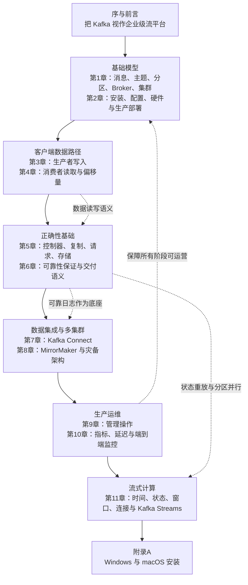
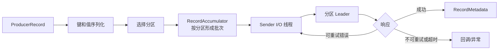
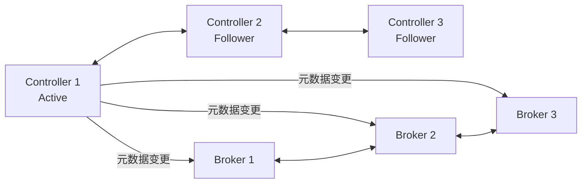
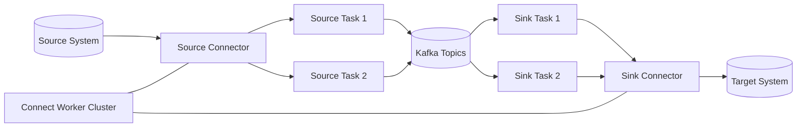
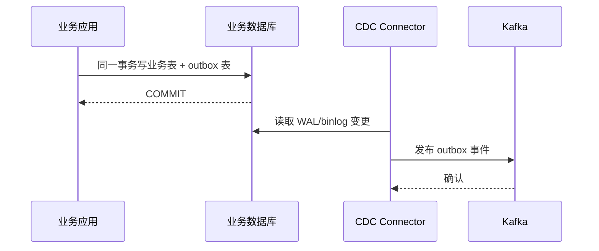

# 《Kafka 权威指南》深度阅读：从分布式日志到事件流平台

> **书目信息**：Neha Narkhede、Gwen Shapira、Todd Palino 著，薛命灯译，《Kafka 权威指南》，人民邮电出版社 2018 年 1 月第 1 版，ISBN `978-7-115-47327-1`。英文原版 *Kafka: The Definitive Guide* 由 O'Reilly Media 于 2017 年出版。本文的一手文本是题目提供的 238 页 PDF，正文由序、前言、第 1～11 章和附录 A 构成。
>
> **版本边界**：原书以 Kafka `0.10.x` 为主要背景。O'Reilly 已在 2021 年出版第 2 版，作者阵容调整为 Gwen Shapira、Todd Palino、Rajini Sivaram 和 Krit Petty，并新增程序化管理、Exactly-Once 与安全等内容。本文仍以用户指定的中文版第一版为主线；**【原书】**表示 PDF 直接提出的观点，**【第二版补充】**表示新版扩展方向，**【当前补充】**表示截至 2026-09-19 依据 Apache Kafka 官方文档核验的实践，**【纠正】**表示原书已经过时或边界需要收紧的内容。
>
> **当前基线**：Apache Kafka 官方下载页显示，当前稳定版本为 `4.3.1`，发布于 2026-06-25。Kafka 4.x 已移除 ZooKeeper 模式，只支持 KRaft；Broker、Connect 与命令行工具至少需要 Java 17，客户端和 Kafka Streams 至少需要 Java 11。本文的现代示例以 Kafka 4.3.1 为准。
>
> **代码说明**：为避免大段复制受版权保护的内容，只保留原书中具有教学价值的短小结构，并把旧 API 改写成当前可用形式。未实际启动 Kafka 集群的示例不会声称已经运行验证。

## 一、先看全局：Kafka 解决的不是“排队”，而是持续流动的数据

### 1. 作者怎样定义 Kafka

【原书，序】给出了比“消息队列”更准确的定义：

> “我们认为 Kafka 是一个流平台：在这个平台上可以发布和订阅数据流，并把它们保存起来、进行处理。”

【原书，第 1 章】又从实现角度把 Kafka 称为“分布式提交日志”或“分布式流平台”。数据库的提交日志通过按顺序记录变化来恢复状态；Kafka 把这个思路扩展到集群：事件被追加到分区日志，保留一段时间或长期保留，多个消费者可以按各自进度重复读取。

通俗地说，Kafka 像一条可回放的企业数据传送带：

- 生产者只负责把事件写入约定的主题，不需要知道谁会消费。
- 消费者自己记录读取位置，一个事件被某个消费者读过，并不妨碍其他消费者再读。
- 分区把一条大日志拆成可并行处理的多条有序日志。
- 副本让单个节点故障时数据仍然可用。
- 保留策略使事件可以重放，系统能重建状态、补算结果或增加新的下游。
- Connect 负责系统间搬运数据，Streams 负责持续处理数据。

因此，Kafka 解决的核心不是“把任务暂存到队列”这么单一，而是企业中大量数据源和数据消费者之间的耦合问题：生产速度与消费速度不同、下游数量不断增加、历史数据需要回放、单机无法承载吞吐量、机器故障不能导致事件消失。

### 2. 全书的知识路径



这条路线先回答“Kafka 是什么”，再沿一条事件的生命周期展开：事件怎样被序列化和分区、怎样复制和提交、消费者怎样记录进度、数据怎样流向外部系统、怎样跨集群、怎样被监控，最后怎样变成有状态的流式计算结果。

### 3. Kafka 与常见消息及数据平台的差异

| 技术 | 核心抽象 | 消费之后的数据 | 顺序与并行 | 强项 | 主要代价或边界 |
| --- | --- | --- | --- | --- | --- |
| Kafka | 分区化追加日志、事件流 | 按保留策略存在，与是否消费解耦 | 分区内有序，分区数决定消费组并行上限 | 高吞吐、回放、多订阅者、数据管道、流处理 | 分区设计和容量规划复杂；不是任意查询数据库 |
| RabbitMQ | Exchange、Queue、Binding | 通常在确认后从队列移除 | 单队列可有序，多消费者会分摊消息 | 灵活路由、任务队列、请求削峰、低延迟投递 | 长期保留和大规模历史重放不是主要设计目标 |
| RocketMQ | Topic、MessageQueue、消费组 | 支持保留与重试 | 队列内有序，可并行消费 | 事务消息、延迟消息、业务消息治理和国内生态 | 跨生态通用连接器与流处理集成需按场景评估 |
| Apache Pulsar | Topic + BookKeeper 分段存储 | 按保留与积压策略保存 | 分区主题并行，订阅模式丰富 | 计算存储分离、多租户、原生跨地域复制 | 组件更多，部署与故障诊断链路更长 |
| Redpanda | Kafka API 兼容日志平台 | 与 Kafka 类似 | 与 Kafka 客户端模型接近 | 单一 C++ 二进制、较低运维表面积 | Kafka 兼容度、生态插件和特性边界需逐项验证 |
| 传统 ETL/数据仓库 | 定时抽取和批处理任务 | 结果通常进入目标表或文件 | 以作业并行为主 | 大规模离线分析、复杂批量转换 | 数据新鲜度较低，源和目标容易形成点对点耦合 |
| Hadoop 批处理 | 文件与批量计算 | 长期文件存储 | 按任务拆分 | 超大规模离线计算 | 不适合持续低延迟事件处理 |

Kafka 的优势来自“日志”而不是“队列”三个字：写入是顺序追加，消费者位置与消息生命周期分离，历史记录可重放，分区可以独立复制和并行处理。代价是用户必须主动设计键、分区、保留时间、交付语义和故障处理。任务分发优先看 RabbitMQ/RocketMQ；超大规模多租户与跨地域能力可评估 Pulsar；需要事件回放、数据集成和流处理统一底座时，Kafka 才最能发挥价值。

## 二、章节地图：每章解决数据链路中的什么问题

| 顺序 | 原书标题 | 核心内容 | 解决问题的思路 |
| --- | --- | --- | --- |
| 序 | Kafka 为什么出现 | LinkedIn 的持续数据流需求；消息系统、Hadoop、ETL 的能力交汇 | 用可存储、可订阅、可处理的流平台统一数据流 |
| 前言 | 读者、范围与学习方法 | 开发、运维、数据架构三类读者；API、部署、内部原理与权衡 | 不只学习配置项，还要理解设计选择的原因和代价 |
| 第 1 章 | 初识 Kafka | 发布订阅、消息与批次、模式、主题、分区、客户端、集群、多集群 | 用分区日志解耦多个生产者和多个消费者 |
| 第 2 章 | 安装 Kafka | Java、ZooKeeper、Broker 配置、硬件、操作系统和生产部署 | 从磁盘、页缓存、网络、复制和故障域规划集群 |
| 第 3 章 | Kafka 生产者——向 Kafka 写入数据 | 发送流程、确认、批处理、压缩、序列化和分区 | 在吞吐量、延迟、顺序和持久性之间配置生产者 |
| 第 4 章 | Kafka 消费者——从 Kafka 读取数据 | 消费组、再均衡、轮询、偏移量提交、反序列化 | 用消费组扩展处理能力，用偏移量控制重复与丢失 |
| 第 5 章 | 深入 Kafka | 集群成员、控制器、复制、请求处理、日志段、索引和清理 | 解释 Broker 为什么能高吞吐并在节点故障后恢复 |
| 第 6 章 | 可靠的数据传递 | 保证、复制系数、ISR、确认、重试、提交和验证 | 把 Broker、生产者、消费者配置组合成端到端可靠性 |
| 第 7 章 | 构建数据管道 | 数据集成要求、ETL/ELT、Connect Worker、Connector 和 Task | 用标准运行时和连接器代替大量点对点同步程序 |
| 第 8 章 | 跨集群数据镜像 | Hub-Spoke、双活、主备、延展集群、MirrorMaker | 在多地域、灾备和迁移中明确延迟、冲突、RPO/RTO |
| 第 9 章 | 管理 Kafka | 主题、消费组、配置、分区副本、控制台工具和 ACL | 通过可审计的管理命令维护集群元数据与数据布局 |
| 第 10 章 | 监控 Kafka | Broker、JVM、OS、客户端、消费延迟和端到端探测 | 同时观察资源、请求、复制、客户端和业务数据新鲜度 |
| 第 11 章 | 流式处理 | 时间、状态、流表二元性、窗口、连接、重处理、Streams | 将可回放日志转化为持续更新的状态和业务结果 |
| 附录 A | 在其他操作系统上安装 Kafka | Windows、WSL、本地 Java 与 macOS/Homebrew | 为学习环境提供跨平台入口；当前更适合用容器或 WSL2 |

## 三、沿事件生命周期连续精读

### 第一阶段：先建立分区日志模型

#### 第 1 章　初识 Kafka：从点对点连接走向共享事件日志

##### 1.1 发布订阅为什么能够降低连接复杂度

【原书】从度量指标系统演进讲起：一个应用向一个仪表盘直连很简单；当生产者和分析、告警、存储等消费者不断增加，连接数量会迅速膨胀，每套日志、指标、行为数据又重复建设自己的队列。发布订阅系统在双方之间加入 Broker，生产者按类别发布，消费者按类别订阅，把 `生产者 × 消费者` 的连接关系收敛成双方各自连接平台。

这种解耦包含三个维度：

- **空间解耦**：生产者不知道消费者的地址和数量。
- **时间解耦**：消费者可以晚于生产者上线，只要数据仍在保留期内。
- **速率解耦**：消费者暂时变慢时，积压留在日志中，而不是迫使生产者同步等待每个下游。

但解耦不代表没有契约。主题名称、消息键、Schema、事件语义和兼容规则构成新的数据契约；缺少治理只会把代码耦合变成难以发现的数据耦合。

##### 1.2 消息、批次与 Schema

Kafka Broker 把键和值视为字节数组，不理解其中是订单、日志还是 JSON。生产者负责序列化，消费者负责反序列化。消息键通常承担两项职责：决定分区，以及标识压缩日志中的业务实体。

批次把同一主题、同一分区的多条记录一起压缩和发送。批次越大，系统调用、网络报文和压缩开销越低，但消息等待成批的时间越长。这是 Kafka 贯穿全书的第一组权衡：**吞吐量来自批处理，低延迟来自尽快发送。**

原书推荐 Avro，因为 Schema 与数据分离，支持强类型和兼容演进。今天也常用 Protobuf 或 JSON Schema。关键不在格式名称，而在建立注册中心和兼容策略：

- 向后兼容：新消费者能够读取旧数据。
- 向前兼容：旧消费者能够忽略或处理新数据。
- 完全兼容：两个方向都成立。
- 禁止随意修改字段含义；类型兼容不等于业务语义兼容。

##### 1.3 主题、分区、顺序与扩展性

主题是逻辑数据流，分区是物理并行和复制单位。记录只追加到分区尾部，并获得单调递增的偏移量。

```text
orders
├─ partition-0: offset 0 -> 1 -> 2 -> ...
├─ partition-1: offset 0 -> 1 -> 2 -> ...
└─ partition-2: offset 0 -> 1 -> 2 -> ...
```

必须牢牢记住：

- Kafka 只保证**单个分区内**的记录顺序，不保证主题全局顺序。
- 相同业务键需要稳定映射到同一分区，才能获得该实体的顺序。
- 消费组内，一个分区在同一时刻只能交给一个消费者成员，因此分区数是并行度上限。
- 增加分区会改变默认哈希映射，依赖键顺序的主题不能随意扩分区。

实际设计时，应先估算目标吞吐量、单分区可承载吞吐量、消费者并行数、保留容量和未来增长，再决定分区数。不要把“分区越多越好”当原则：每个分区都会增加文件、索引、元数据、选主和恢复成本。

##### 1.4 生产者、消费者、Broker 与集群

生产者选择主题和分区并写入记录；消费者订阅主题并跟踪偏移量；Broker 保存分区日志并处理请求；集群把分区和副本分散到多台 Broker。

同一主题可以被多个消费组独立读取：`fraud-detection` 处理反欺诈，`data-warehouse` 写入湖仓，`notification` 发送通知，它们互不争抢进度。同一消费组内部则是竞争关系，共同瓜分分区工作量。

分区副本中有一个 Leader，传统模型下生产和消费请求由 Leader 处理，Follower 拉取 Leader 数据。Leader 故障时，从同步副本集合中选出新 Leader。第 5～6 章会说明“同步”与“已提交”的严格含义。

##### 1.5 保留、压缩与重放

Kafka 的消息不会因为某个消费者确认而立即删除。删除型保留策略按时间或空间清理旧日志段；压缩型策略保留每个键的最新值，并通过墓碑记录表达删除。

两种策略对应不同问题：

| 策略 | 保留的是什么 | 典型场景 |
| --- | --- | --- |
| `delete` | 时间或容量窗口内的完整事件历史 | 行为流、日志、订单事件、指标 |
| `compact` | 每个键的最新状态，清理是异步的 | CDC、缓存重建、状态 Changelog |
| `compact,delete` | 最新状态加有限时间历史 | 需要重建状态但不想永久保留旧版本 |

压缩不等于每个键在磁盘上永远只剩一条记录；Cleaner 在后台异步合并日志段，短时间内仍可能看到旧值。消费者必须能够处理重复和墓碑。

##### 1.6 多集群

原书提出数据类型隔离、安全隔离和多数据中心灾备，并使用 MirrorMaker 做集群间复制。重要边界是：同一集群内部的副本复制与不同集群之间的镜像不是一回事。前者服务于分区高可用，后者服务于地域、组织、迁移和灾备。

##### 1.7 数据生态与 Kafka 的起源

原书把 Kafka 放在数据生态的中心：活动追踪、日志、指标、消息、数据库变更和流处理都可以围绕统一事件流连接。Kafka 最初来自 LinkedIn，因为传统消息系统、日志聚合和 ETL 工具都无法同时满足持续数据流、高吞吐、长时间保留和多消费者回放。项目在 2011 年开源并进入 Apache；名称来自作家 Franz Kafka。这个故事的技术意义是：Kafka 不是先设计一个通用队列再寻找场景，而是从大规模数据管道的真实约束中长出来的。

##### 本章术语

- **Broker**：接收、保存并提供 Kafka 记录的服务器进程。
- **Topic（主题）**：事件流的逻辑名称。
- **Partition（分区）**：有序追加日志，也是扩展、复制和并行处理的基本单位。
- **Offset（偏移量）**：记录在某个分区内的位置，不是跨分区全局 ID。
- **Consumer Group（消费组）**：共同分担主题分区的一组消费者。
- **Schema**：消息字段、类型与演进规则组成的数据契约。
- **Log Compaction（日志压缩）**：按键保留最新值的后台清理机制，不是普通压缩算法。
- **POC（Proof of Concept）**：概念验证，用于确认方案可行，不等于生产设计。

#### 第 2 章　安装 Kafka：容量、故障域和操作系统比“能启动”更重要

##### 2.1 原书安装路径与今天的分界线

【原书】安装链路是 Java → ZooKeeper → Kafka Broker，并通过 `zookeeper.connect`、`broker.id`、`log.dirs` 等参数组成集群。这准确反映了 Kafka 0.10.x 的架构。

【纠正，第 2 章】Kafka 4.x 已彻底移除 ZooKeeper 模式。当前集群使用 **KRaft（Kafka Raft Metadata mode）**：Controller Quorum 通过 Raft 元数据日志管理 Broker、主题、分区、副本和 ACL。旧的 `zookeeper.connect` 不再存在，节点使用 `node.id`、`process.roles`、`controller.quorum.*` 等配置。ZooKeeper 集群必须先迁移到 KRaft，才能升级到 Kafka 4.x。

```text
原书 0.10.x：Client -> Broker -> ZooKeeper 元数据/控制器选举
当前 4.3.x：Client -> Broker；Broker/Controller -> KRaft 元数据日志
```

##### 2.2 Broker 与主题的关键配置

| 关注点 | 原书配置 | 当前理解 |
| --- | --- | --- |
| 节点身份 | `broker.id` | KRaft 使用 `node.id`，同一集群唯一 |
| 数据目录 | `log.dirs` | 仍然有效；一个分区的日志段位于一个目录，目录规划需考虑磁盘故障 |
| 自动建主题 | `auto.create.topics.enable` | 生产环境通常关闭，避免拼写错误意外创建低副本主题 |
| 默认分区 | `num.partitions` | 只影响自动创建或未显式指定的主题；不能代替容量设计 |
| 数据保留 | `log.retention.ms/bytes` | 满足任一删除条件即可清理已封闭日志段 |
| 日志段 | `log.segment.bytes/ms` | 影响清理粒度、索引数量、文件句柄和恢复成本 |
| 消息大小 | `message.max.bytes` | 必须与生产者 `max.request.size`、消费者/副本拉取上限协调 |
| 机架信息 | `broker.rack` | 让副本跨机架或可用区分布，防止相关故障同时击穿副本 |

##### 2.3 硬件与容量规划

原书把磁盘吞吐量、容量、内存、网络和 CPU 作为五个决策维度，这个框架今天仍然有效：

- **磁盘**：Kafka 顺序追加友好，但复制恢复、消费者回放和日志清理会形成并发 I/O。SSD 降低尾延迟，容量型盘降低单位存储成本。
- **页缓存**：Kafka 大量依赖操作系统 Page Cache，因此不要把全部内存分配给 JVM 堆，也不要让其他进程争抢缓存。
- **网络**：入口流量要乘复制系数，出口还要叠加多个消费组、跨集群复制和副本恢复。
- **CPU**：压缩、TLS、校验和与大量连接会消耗 CPU；压缩比更高不一定整体成本更低。
- **容量**：粗略估算为 `每日入口量 × 保留天数 × 复制系数 × 安全系数`，还要给再分配、恢复和突发流量留余量。

例如每天写入 2 TB、保留 7 天、复制系数 3，并预留 30% 空间：

```text
2 TB × 7 × 3 × 1.3 ≈ 54.6 TB
```

这只是数据盘起点，还未计算索引、内部主题、跨集群副本和未来增长。

##### 2.4 操作系统与生产环境

【原书】建议避免频繁 Swap、使用 XFS、挂载 `noatime`、根据实测调节脏页和 TCP 缓冲区，并把 Broker 分散到不同机架。原则仍有价值，但书中的具体 `sysctl` 数字不能直接复制：内核版本、磁盘、云网络和容器限制都已变化，必须先压测再调整。

当前更稳妥的原则是：

- 使用支持的 Linux 与 Java 版本，固定镜像和依赖版本。
- 让 Broker 使用独立磁盘或明确的 IOPS/吞吐量配额。
- 把 JVM 堆、直接内存、页缓存和容器限制一起规划。
- 生产集群至少跨三个故障域布置副本与 Controller，多数派不能集中在一个故障域。
- 监控磁盘使用率、I/O 等待、网络饱和、请求队列、ISR 和垃圾回收，而不是先入为主地修改内核参数。
- 执行滚动升级、滚动重启和副本重分配演练。

##### 2.5 本章局限与修订

- 原书中的 AWS `m4/r3/i2/d2` 实例已经是历史型号，今天应按持续磁盘吞吐、突发积分、网络上限和跨可用区费用选型。
- CMS 垃圾收集器已经移除；现代 Java 通常以 G1 为基线，也可按延迟目标评估 ZGC，但不能脱离真实负载调参。
- 原书建议共享 ZooKeeper 的内容不再适用于 Kafka 4.x。
- 单节点适合开发，不代表生产集群；生产环境不能用复制系数 1 和单 Controller。

##### 本章术语

- **KRaft**：Kafka 自己基于 Raft 实现的元数据共识模式，用于替代 ZooKeeper。
- **Controller Quorum**：管理集群元数据的一组 KRaft Controller，依赖多数派存活。
- **Page Cache**：操作系统用空闲内存缓存文件页的机制，Kafka 读性能的重要来源。
- **IOPS**：Input/Output Operations Per Second，每秒输入输出操作数。
- **Failure Domain（故障域）**：可能一起失效的一组资源，如磁盘、机架、可用区或地域。
- **RPO**：Recovery Point Objective，可接受的数据丢失时间窗口。
- **RTO**：Recovery Time Objective，可接受的业务恢复时间。

### 第二阶段：让事件可靠地写入和读出

#### 第 3 章　Kafka 生产者：在吞吐、延迟、顺序与持久性之间取舍

##### 3.1 一条记录的发送路径

【原书】把生产者内部流程概括为：



`send()` 通常只把记录放入客户端缓冲区，真正的网络发送由后台线程完成。因此“方法已经返回”不等于“Broker 已持久接收”。应用必须通过 Future、回调、指标和错误处理明确知道交付结果。

##### 3.2 当前 Java 生产者最小示例

下面保留原书同步/异步发送思路，改用当前 API 和显式可靠性配置：

```java
import java.nio.charset.StandardCharsets;
import java.util.Properties;
import org.apache.kafka.clients.producer.*;
import org.apache.kafka.common.serialization.StringSerializer;

Properties props = new Properties();
props.put(ProducerConfig.BOOTSTRAP_SERVERS_CONFIG, "localhost:9092");
props.put(ProducerConfig.KEY_SERIALIZER_CLASS_CONFIG, StringSerializer.class);
props.put(ProducerConfig.VALUE_SERIALIZER_CLASS_CONFIG, StringSerializer.class);
props.put(ProducerConfig.ACKS_CONFIG, "all");
props.put(ProducerConfig.ENABLE_IDEMPOTENCE_CONFIG, true);
props.put(ProducerConfig.COMPRESSION_TYPE_CONFIG, "zstd");
props.put(ProducerConfig.CLIENT_ID_CONFIG, "order-api");

try (KafkaProducer<String, String> producer = new KafkaProducer<>(props)) {
    ProducerRecord<String, String> record =
        new ProducerRecord<>("orders", "order-1001", "{\"status\":\"CREATED\"}");

    record.headers().add("event-type", "OrderCreated".getBytes(StandardCharsets.UTF_8));

    producer.send(record, (metadata, error) -> {
        if (error != null) {
            // 生产中应进入告警、重试补偿或本地可靠存储，不能只打印日志
            error.printStackTrace();
            return;
        }
        System.out.printf("topic=%s partition=%d offset=%d%n",
            metadata.topic(), metadata.partition(), metadata.offset());
    });

    producer.flush();
}
```

同一个 `KafkaProducer` 是线程安全的，通常应复用实例，而不是每发送一条消息就创建一次。`flush()` 适合关闭或检查点，不应在每条消息后调用，否则批处理优势会消失。

##### 3.3 三种发送方式

| 方式 | 原书写法 | 能知道 Broker 结果吗 | 适用场景 |
| --- | --- | --- | --- |
| 发送并忘记 | `producer.send(record)` 后忽略 Future | 只能捕捉发送前部分错误 | 可容忍丢失的低价值遥测；生产中仍应监控错误率 |
| 同步发送 | `producer.send(record).get()` | 能，但当前线程阻塞 | 管理脚本、低吞吐控制消息、需要立即确认的流程 |
| 异步发送 | `send(record, callback)` | 能，且可并发形成批次 | 大多数高吞吐业务生产者 |

异步发送并不等于不可靠；忽略回调和最终失败才是不可靠。常见做法是异步发送、限制在途请求，通过回调记录业务键和错误类型，并由 `delivery.timeout.ms` 统一限定一次发送的总生命期。

##### 3.4 最重要的生产者配置

| 配置 | 原书背景 | Kafka 4.3.1 的重点 |
| --- | --- | --- |
| `acks` | `0/1/all` 决定确认强度 | 当前默认 `all`；要与 `min.insync.replicas` 一起理解 |
| `enable.idempotence` | 0.10.x 尚不能避免重试重复 | 当前无冲突配置时默认启用，要求 `acks=all`、重试大于 0、在途请求不超过 5 |
| `retries` | 建议覆盖故障恢复时间 | 当前默认接近无限重试，由 `delivery.timeout.ms` 控制总时限 |
| `delivery.timeout.ms` | 原书尚未作为主轴 | 包含排队、重试和请求时间，是业务侧更易理解的发送截止时间 |
| `batch.size` | 每个分区批次的目标大小 | 批次不足不会强行等满；需要结合消息大小和负载观察 |
| `linger.ms` | 原书默认 0 | Kafka 4.0 起默认 5 ms，以更好批处理换取通常相近或更低的实际延迟 |
| `compression.type` | gzip、snappy、lz4 | 当前还支持 zstd；应测 CPU、网络和实际压缩率 |
| `buffer.memory` | 发送速度超过网络时形成背压 | 缓冲耗尽后最多阻塞 `max.block.ms`，不能把它当无限队列 |
| `max.in.flight.requests.per.connection` | 重试时可能乱序 | 开启幂等后允许不超过 5 且保持顺序；关闭幂等时仍有乱序风险 |
| `client.id` | 日志和配额标识 | 应稳定标识应用/实例类型，便于指标、配额与审计 |

##### 3.5 键、分区与热点

原书强调：指定分区时分区器不再选择；未指定分区但有键时，通常对键做稳定哈希；无键记录由默认策略分配。现代客户端对无键记录采用粘性批处理思路，让一段时间内的记录集中到某个分区形成更完整的批次，再切换分区，以提升压缩和吞吐。

业务键的选择会同时影响顺序和负载：

- 用 `orderId`：同一订单事件有序，通常分布均匀。
- 用 `tenantId`：同一租户有序，但大租户可能制造热点。
- 用固定常量：获得全局顺序，却把整个主题压到一个分区，失去横向扩展。
- 随机键：负载均衡，但实体事件无法保证顺序。

热点解决方案包括细化键、在键中加入桶编号、拆分超大租户主题，或在下游重新聚合。任何方案都会改变顺序语义，必须由业务明确接受。

##### 3.6 序列化与 Schema 演进

原书用自定义 `CustomerSerializer` 说明 `Serializer` 接口，又明确建议采用 Avro 等标准格式，因为手写二进制布局会把生产者和消费者紧密绑定：字段长度、字符集和顺序稍有变化就无法兼容。

现代事件契约至少应包含：

- 稳定的事件类型、版本和业务主键。
- 事件发生时间与生产时间，而不是只依赖 Broker 时间。
- Schema 注册、兼容检查和所有者。
- 敏感字段分级、脱敏与最小权限。
- 失败消息的可追踪标识，例如 `trace-id`、`correlation-id`。

##### 3.7 幂等生产与事务的边界

幂等生产者利用 Producer ID 和分区序列号，让 Broker 识别同一会话内的重试批次，防止它们重复写入。它解决的是“客户端重试造成 Kafka 分区内重复”，不是任意业务副作用的全局幂等。

事务生产者可以原子写多个分区，并把消费偏移量与输出记录放入同一 Kafka 事务：

```java
props.put(ProducerConfig.TRANSACTIONAL_ID_CONFIG, "payment-enricher-1");

try (KafkaProducer<String, String> producer = new KafkaProducer<>(props)) {
    producer.initTransactions();
    producer.beginTransaction();
    try {
        producer.send(new ProducerRecord<>("payment-approved", "p-1", "approved"));
        // consume-transform-produce 场景还可 sendOffsetsToTransaction(...)
        producer.commitTransaction();
    } catch (Exception e) {
        producer.abortTransaction();
        throw e;
    }
}
```

事务不能自动把 Kafka 与 MySQL、支付网关或邮件系统变成一个原子事务。跨系统仍要使用事务发件箱（Transactional Outbox）、CDC、幂等键、去重表或补偿流程。

##### 本章术语

- **RecordAccumulator**：生产者按主题分区缓存记录并形成批次的组件。
- **Serializer**：把键或值对象转成字节数组的接口。
- **Partitioner**：在未指定分区时选择目标分区的策略。
- **Idempotence（幂等）**：同一操作重复执行不会继续改变最终结果。
- **In-flight Request**：已发送但尚未收到响应的请求。
- **Zstandard/Zstd**：兼顾压缩率和速度的压缩算法。
- **Transactional Outbox**：业务数据与待发送事件先写入同一数据库事务，再由 CDC 或转发器可靠发布。

#### 第 4 章　Kafka 消费者：偏移量提交决定重复还是丢失

##### 4.1 消费组和再均衡

一个消费组会完整消费订阅主题，但组内成员瓜分分区。若 6 个分区只有 3 个消费者，每个消费者大约处理 2 个分区；若有 8 个消费者，则至少 2 个空闲。增加消费者不能突破分区数上限。

成员加入、离开、订阅变化或分区数量变化时，协调器重新分配分区，这就是 Rebalance。原书描述的停顿式再均衡在大型消费组中可能造成明显暂停。后来 Kafka 引入 Cooperative Sticky Assignor，尽量增量撤销和转移分区；Kafka 4.x 还提供新的 `consumer` Group Protocol，把更多心跳与分配控制移到 Broker。当前客户端 `group.protocol` 默认仍是 `classic`，迁移前要验证 Broker、客户端和分配策略兼容性。

##### 4.2 当前消费者循环

```java
import java.time.Duration;
import java.util.List;
import java.util.Properties;
import org.apache.kafka.clients.consumer.*;
import org.apache.kafka.common.errors.WakeupException;
import org.apache.kafka.common.serialization.StringDeserializer;

Properties props = new Properties();
props.put(ConsumerConfig.BOOTSTRAP_SERVERS_CONFIG, "localhost:9092");
props.put(ConsumerConfig.GROUP_ID_CONFIG, "order-indexer");
props.put(ConsumerConfig.KEY_DESERIALIZER_CLASS_CONFIG, StringDeserializer.class);
props.put(ConsumerConfig.VALUE_DESERIALIZER_CLASS_CONFIG, StringDeserializer.class);
props.put(ConsumerConfig.ENABLE_AUTO_COMMIT_CONFIG, false);
props.put(ConsumerConfig.AUTO_OFFSET_RESET_CONFIG, "earliest");
props.put(ConsumerConfig.ISOLATION_LEVEL_CONFIG, "read_committed");

KafkaConsumer<String, String> consumer = new KafkaConsumer<>(props);
Runtime.getRuntime().addShutdownHook(new Thread(consumer::wakeup));

try {
    consumer.subscribe(List.of("orders"));
    while (true) {
        ConsumerRecords<String, String> records =
            consumer.poll(Duration.ofSeconds(1));

        for (ConsumerRecord<String, String> record : records) {
            process(record); // 成功处理之后才能推进相应偏移量
        }
        consumer.commitSync();
    }
} catch (WakeupException expectedOnShutdown) {
    // 正常退出路径
} finally {
    consumer.close();
}
```

`KafkaConsumer` 不是线程安全的，除了 `wakeup()` 外，不应从多个线程并发调用。需要并行时，优先使用多个消费者实例；若把处理移交线程池，必须自己管理每个分区的完成位置、暂停/恢复和提交顺序。

##### 4.3 `poll()` 不只是“拿消息”

轮询还承担加入消费组、获取分配、维持协议进度和触发自动提交等职责。处理时间超过 `max.poll.interval.ms` 时，协调器会认为成员不能正常工作并重新分配分区。解决办法不是盲目增大超时，而是：

- 用 `max.poll.records` 限制每批记录数。
- 优化单条处理时间或做有界并行。
- 对暂时不能处理的分区调用 `pause()`，但仍持续 `poll()`。
- 将超长任务从 Kafka 消费语义中拆出去，写入专用任务系统。

##### 4.4 提交的是“下一条要读的位置”

假设已成功处理偏移量 `0..41`，应提交 `42`。Kafka 保存的是恢复时下一条记录的位置，而不是最后一条已处理记录本身。

```text
处理成功：0 ... 41
提交位置：42
重启恢复：从 42 开始
```

提交时机决定交付语义：

| 顺序 | 故障结果 | 语义 |
| --- | --- | --- |
| 先提交偏移量，再处理业务 | 提交后崩溃会跳过未处理记录 | 至多一次，可能丢失 |
| 先处理业务，再提交偏移量 | 处理后、提交前崩溃会再次处理 | 至少一次，可能重复 |
| Kafka 事务中原子写结果与偏移量 | Kafka 内部读-处理-写链路可避免重复结果 | Kafka 范围内恰好一次 |
| 外部数据库事务同时保存业务结果与源偏移量 | 可对该数据库写入实现原子恢复 | 依赖目标库和业务设计 |

##### 4.5 自动、同步和异步提交

- `enable.auto.commit=true`：方便，但提交的是最近一次轮询返回记录的位置。处理与轮询解耦时尤其危险。
- `commitSync()`：等待 Broker 响应并对可恢复错误重试，适合关闭前和关键检查点。
- `commitAsync()`：不阻塞吞吐，但旧提交的回调可能晚于新提交返回，不能无条件重试旧偏移量。
- 常见组合：正常循环异步提交，关闭或分区撤销时同步提交最后确认完成的位置。

若一批记录只处理了一部分，应构造 `Map<TopicPartition, OffsetAndMetadata>`，逐分区提交实际完成位置，不能直接提交本次 `poll()` 的最大位置。

##### 4.6 再均衡监听与手动分配

原书使用 `ConsumerRebalanceListener` 在分区被撤销前提交偏移量、清理本地状态，在获得新分区时恢复状态或调用 `seek()`。今天这一模式仍重要，尤其适用于批量写数据库、有状态处理和外部偏移量存储。

`subscribe()` 让消费组自动分配分区；`assign()` 则由应用明确指定分区，不加入自动再均衡。后者适合审计回放、修复工具和固定分区任务，但主题新增分区时应用不会自动接管。

##### 4.7 失败、重试和死信主题

Kafka 提交的是连续偏移量，不支持像传统队列那样任意确认第 31 条却保留第 30 条未确认。某条记录失败时有三种常见策略：

1. 暂停该分区，在本地有限重试，成功后继续。
2. 将失败记录和错误上下文写入重试主题，按延迟级别逐步重试。
3. 超过次数后写入 DLT（Dead Letter Topic），由人工或修复任务处理。

无论哪种方式，都要避免无限快速重试拖垮外部系统；DLT 也不能成为无人负责的垃圾场。

##### 4.8 当前偏移量重置选项

原书只有 `earliest` 和 `latest`。Kafka 4.3.1 还支持：

- `none`：没有有效偏移量时直接抛错，适合不允许静默跳数据的系统。
- `by_duration:<ISO-8601-duration>`：从当前时间向前一段时长对应的位置开始，例如按最近若干小时恢复。

`latest` 对新消费组意味着只看启动后的数据，很容易被误解为“从最后一条已有记录开始”。生产消费组应显式配置并记录选择原因。

##### 4.9 反序列化与旧消费者 API

生产端使用什么格式，消费端就必须使用匹配的反序列化器和 Schema。原书通过手写 `CustomerDeserializer` 说明字节解析过程，同时明确指出自定义二进制格式脆弱，推荐 Avro、Protobuf、Thrift 或 JSON 等标准格式。今天还应把无法反序列化的记录视为数据质量事件：记录原始字节或安全摘要、Schema ID、主题分区偏移量和异常，再转入隔离主题，不能让一条坏记录无限阻塞整个分区。

原书最后介绍 `SimpleConsumer` 和依赖 ZooKeeper 的高级消费者，只是为了说明历史演进。它们早已不应使用；当前统一使用 `org.apache.kafka.clients.consumer.KafkaConsumer` 或基于它构建的框架。

##### 4.10 Exactly-Once 的真实边界

消费者使用 `isolation.level=read_committed` 时，只返回已提交事务中的记录，并停在 Last Stable Offset 之前。它与事务生产者和 `sendOffsetsToTransaction` 组合，可以让 Kafka 输入、Kafka 输出和消费偏移量原子提交。

但如果处理逻辑调用了支付、HTTP、邮件或普通数据库，Kafka 无法撤销那些副作用。实际系统仍应以“至少一次 + 幂等业务处理”为默认心智模型：用事件 ID、唯一索引、状态机版本或条件更新识别重复。

##### 本章术语

- **Group Coordinator**：管理消费组成员、心跳、分配和偏移量的 Broker 端组件。
- **Rebalance**：消费组成员与分区所有权重新分配的过程。
- **ISR**：In-Sync Replicas，同步副本集合；不要与消费者状态混淆。
- **Commit Offset**：保存消费组恢复位置，不代表任意外部业务已成功。
- **Seek**：把消费者在指定分区的读取位置移动到某个偏移量。
- **DLT/DLQ**：Dead Letter Topic/Queue，保存超过重试策略仍无法处理的记录。
- **LSO**：Last Stable Offset，事务消费者在 `read_committed` 下可见的稳定边界。

### 第三阶段：理解 Broker 内部机制与可靠性交付

#### 第 5 章　深入 Kafka：复制、请求和日志存储怎样协同

##### 5.1 控制平面：从 ZooKeeper Controller 到 KRaft Quorum

【原书】Kafka 0.10.x 通过 ZooKeeper 临时节点维护 Broker 成员关系：第一个成功创建 `/controller` 节点的 Broker 成为 Controller，Controller 负责分区 Leader 选举和副本状态变化，并用递增的 Controller Epoch 防止旧 Controller 的命令产生“脑裂”。

【纠正，第 5 章】Kafka 4.x 不再使用这套机制。当前架构把集群元数据写入 KRaft 元数据日志：

- Controller 节点组成 Raft Quorum，选出的 Active Controller 处理元数据变更。
- Follower Controller 复制元数据日志，可在 Active Controller 故障后接任。
- Broker 向 Controller 注册并获取元数据增量，不再读取 ZooKeeper。
- Epoch/任期仍用于隔离旧 Leader，但承载机制已变为 Raft 日志和 Quorum。
- 节点可配置为纯 Broker、纯 Controller，开发环境也可使用合并角色；生产环境通常分离角色以隔离负载和故障。



生产环境至少需要 3 个 Controller 才能容忍 1 个 Controller 故障；5 个可容忍 2 个，但会增加共识开销。Controller Quorum 失去多数派后，现有数据面可能短暂继续服务，但无法安全完成依赖元数据的操作，不能把它视作可长期运行状态。

##### 5.2 分区复制、Leader 与 ISR

每个分区有一个 Leader 和若干 Follower。生产请求首先到达 Leader，Follower 使用复制 Fetch 请求追赶 Leader。ISR 是当前足够及时的副本集合，只有满足同步条件的副本才有资格在正常选举中成为新 Leader。

三个位置容易混淆：

- **LEO（Log End Offset）**：某个副本日志末端的下一位置，各副本可能不同。
- **High Watermark（高水位）**：已经安全复制、可被普通消费者读取的边界。
- **LSO（Last Stable Offset）**：事务场景下第一个未完成事务之前的位置；`read_committed` 最多读到这里。

仅仅“Leader 已写入页缓存”不代表记录对消费者可见。Kafka 的持久性主要来自多副本确认，而不是每条记录都同步 `fsync`。若 ISR 缩小，`acks=all` 的含义也会变弱，所以必须配合 `min.insync.replicas`。

##### 5.3 请求处理与客户端路由

Kafka 使用基于 TCP 的二进制协议。请求头包含 API Key、协议版本、Correlation ID 和 Client ID。客户端先连接任意 Bootstrap Broker 获取元数据，再把生产、拉取等请求发送到目标分区的 Leader；收到“不是 Leader”类错误时刷新元数据并重试。

Broker 的处理路径大体是：

```text
Socket Acceptor
  -> Network Processor 读取请求
  -> Request Queue
  -> I/O Handler 处理日志/元数据
  -> Response Queue
  -> Network Processor 返回响应
```

原书所称的“炼狱（purgatory）”用于等待条件满足的延迟操作，例如等待足够副本确认的生产请求或等待积累足够数据的 Fetch 请求。现代实现细节持续演进，但“网络线程与请求处理线程分离、未满足条件的请求异步等待”这一思想仍有效。

##### 5.4 拉取模型为什么适合 Kafka

消费者和 Follower 都主动 Fetch。客户端可用 `fetch.min.bytes` 和等待时间告诉 Broker：“积累到一定数据再返回，但最长不要超过指定时间。”这样在吞吐与延迟之间做批量化权衡，并把消费速率掌握在消费者手中。

Kafka 读取可利用操作系统 Page Cache 和零复制路径，减少数据在内核态与用户态之间反复拷贝。这里的“零复制”不是完全没有任何复制，而是避免 Broker 应用层额外搬运消息字节。TLS、压缩转换和不同平台会影响具体路径，性能结论应以实测为准。

##### 5.5 日志段、索引和清理

分区不是一个无限增长的单文件，而是一组日志段：

```text
orders-0/
├─ 00000000000000000000.log
├─ 00000000000000000000.index
├─ 00000000000000000000.timeindex
├─ 00000000000001000000.log
├─ 00000000000001000000.index
└─ 00000000000001000000.timeindex
```

- `.log` 保存 Record Batch。
- Offset Index 是稀疏索引，定位接近目标偏移量的位置后再顺序扫描。
- Time Index 支持按时间查找近似偏移量。
- 活跃段持续追加，封闭段才便于删除或压缩。
- 日志段大小和滚动时间会影响文件数、清理粒度、恢复速度和低流量主题的实际保留时间。

压缩主题以键为单位保留最新状态。墓碑是键存在、值为 `null` 的记录，表示删除该键；墓碑也只保留一段时间，以便各消费者观察删除事件。

##### 5.6 原书机制中今天仍适用与已经变化的部分

| 主题 | 原书 | 当前状态 |
| --- | --- | --- |
| 成员与 Controller | ZooKeeper 临时节点与 Watch | KRaft Controller Quorum 和元数据日志 |
| 副本角色 | Leader/Follower、ISR | 核心模型仍适用 |
| 客户端元数据路由 | 连接任意 Broker 后定位 Leader | 仍适用，协议版本持续演进 |
| 请求线程模型 | 网络线程、请求队列、I/O 线程 | 总体思想仍适用，内部实现不可依赖 |
| 日志段与稀疏索引 | `.log`、Offset Index、清理 | 仍是理解存储行为的基础 |
| 跨版本工具直连 ZooKeeper | 很多管理脚本直接操作 ZooKeeper | 已移除，应通过 Admin API/`--bootstrap-server` |

##### 本章术语

- **Raft**：通过 Leader、日志复制和多数派提交实现一致性的共识算法。
- **Quorum**：达成有效决定所需的法定多数节点集合。
- **Epoch/Term**：标识领导任期的单调递增编号，用于拒绝旧领导命令。
- **ISR**：In-Sync Replicas，保持同步、可参与正常 Leader 选举的副本集合。
- **LEO**：Log End Offset，副本日志末端位置。
- **High Watermark**：已提交并对消费者可见的数据上界。
- **Zero Copy**：尽量绕过应用层字节复制，把文件页直接送入网络通道的 I/O 优化。
- **Sparse Index（稀疏索引）**：不为每条记录建索引，而是在有限间隔记录位置以节省空间。

#### 第 6 章　可靠的数据传递：不要只配置一个 `acks=all`

##### 6.1 Kafka 明确承诺了什么

【原书】列出四条基础保证：

- 同一生产者写入同一分区时，后写记录获得更大的偏移量。
- 记录写入所有同步副本后才算已提交。
- 只要仍有一个包含已提交记录的副本存活，已提交记录就不会丢失。
- 消费者只读取已提交记录。

这些保证有前提条件。若允许非同步副本当选 Leader、生产者只等待 Leader、复制系数为 1，或消费者在处理前提交偏移量，端到端结果仍可能丢失。可靠性是 Broker、主题、生产者、消费者和外部系统共同组成的属性。

##### 6.2 三个 Broker/主题配置形成的约束

1. **复制系数**：副本越多，可容忍的节点故障越多，同时磁盘和网络成本按副本数增长。
2. **`unclean.leader.election.enable`**：允许落后副本当 Leader 可以恢复可用性，但会截断未复制的数据。
3. **`min.insync.replicas`**：配合 `acks=all`，规定写入成功至少需要多少个同步副本。

一个常见生产基线是复制系数 3、`min.insync.replicas=2`、关闭非同步 Leader 选举：允许一台副本节点故障后继续写；再坏一台时宁愿拒绝写入，也不让唯一副本继续接受“看似成功但无法容灾”的数据。

【纠正，第 6 章 6.3.1】原书称 Kafka 默认复制系数为 3，这不能作为 Apache Kafka 的通用默认值。当前 `default.replication.factor` 默认仍为 1；生产主题必须在创建模板或平台策略中显式使用合适的复制系数。内部主题可能有各自的复制配置，不能反推普通主题默认值。

【纠正，第 6 章 6.3.2】原书背景中 `unclean.leader.election.enable` 默认值为 `true`。当前默认值为 `false`，体现了 Kafka 后续版本更偏向数据一致性而非在落后副本上强行恢复可用性。

##### 6.3 三种交付语义

| 语义 | 典型做法 | 故障时表现 | 适用情况 |
| --- | --- | --- | --- |
| At-most-once 至多一次 | 先提交进度再处理，或不重试 | 不重复，但可能丢失 | 可丢失遥测、非关键采样 |
| At-least-once 至少一次 | 成功处理后提交，生产者可靠重试 | 不轻易丢失，但可能重复 | 大多数业务事件，配合幂等消费者 |
| Exactly-once 恰好一次 | 幂等生产、Kafka 事务、`read_committed` | Kafka 读写链路中避免重复可见结果 | Kafka Streams 或 Kafka-to-Kafka 处理 |

“恰好一次”更准确地说是 **Exactly-Once Processing Semantics**：同一输入对 Kafka 状态和 Kafka 输出只产生一次可见效果。它不意味着世界上任何副作用只发生一次。

##### 6.4 生产者可靠性组合

当前推荐从以下基线开始，再按业务延迟和吞吐目标压测：

```properties
acks=all
enable.idempotence=true
delivery.timeout.ms=120000
max.in.flight.requests.per.connection=5
```

主题侧同时设置：

```properties
min.insync.replicas=2
```

即便如此，应用仍必须处理：序列化失败、鉴权失败、消息过大、缓冲耗尽、最终超时和不可恢复错误。错误回调中不能无边界递归调用 `send()`；应把失败事件和业务键交给有界补偿机制。

##### 6.5 消费者可靠性组合

最可靠的默认思路是：关闭自动提交，只在业务成功后提交；失败记录暂停、重试或转移；再均衡前提交已确认位置；外部写入必须幂等。

下面用数据库唯一键抵御重复：

```sql
CREATE TABLE processed_event (
    event_id      VARCHAR(64) PRIMARY KEY,
    processed_at  TIMESTAMP NOT NULL DEFAULT CURRENT_TIMESTAMP
);
```

```text
数据库事务：
1. INSERT processed_event(event_id)
2. 若主键冲突，说明已处理，直接结束
3. 更新业务表
4. COMMIT
5. Kafka 提交偏移量
```

如果数据库事务在第 4 步成功、Kafka 提交在第 5 步前失败，记录会再次投递，但唯一键让业务更新不再重复。这里实现的是业务效果幂等，不是让 Kafka 永不重复投递。

##### 6.6 可靠性必须通过故障实验验证

原书建议用可验证生产者/消费者测试 Leader 选举、Controller 选举、滚动重启和非同步副本。今天仍应保留这套思想，并扩展为自动化集成测试：

- 杀死分区 Leader，观察发送失败率、恢复时间和重复记录。
- 断开 Broker 网络，观察 ISR、`min.insync.replicas` 和客户端超时。
- 在处理完成与提交偏移量之间终止消费者，验证幂等处理。
- 让下游数据库变慢或不可用，验证暂停、重试、DLT 和积压恢复。
- 滚动升级 Broker 与客户端，验证协议兼容。
- 对 MirrorMaker 进行地域断网和恢复演练，测量 RPO/RTO。

测试结果要落到可观测指标：生产错误率、重试率、ISR 变化、Under-Replicated Partitions、消费延迟、端到端事件年龄和数据对账差异。

##### 6.7 常见误区

- `acks=all` 不是“所有配置副本都确认”，而是当前 ISR 中满足条件的副本确认。
- Broker 返回成功不代表外部消费者已经处理。
- 关闭自动提交不自动获得至少一次；如果代码在处理前手动提交，一样会丢。
- 消费延迟为 0 不代表没有丢数据，只代表提交位置追上日志末端。
- Exactly-Once 不能取代业务幂等、对账和补偿。

##### 本章术语

- **At-most-once**：一条记录最多产生一次处理，允许丢失。
- **At-least-once**：保证不轻易丢失，故障恢复时允许重复。
- **Exactly-once Semantics（EOS）**：在定义的事务边界内，每条输入只产生一次可见结果。
- **Unclean Leader Election**：允许不在 ISR 中的落后副本成为 Leader。
- **Fencing**：通过 Epoch 或事务身份阻止旧生产者、旧 Controller 等继续写入。
- **Chaos Testing**：主动注入节点、网络、磁盘等故障，验证系统真实恢复能力。

### 第四阶段：把 Kafka 变成组织的数据连接层

#### 第 7 章　构建数据管道：Connect 解决的是重复造轮子

##### 7.1 一条合格数据管道要满足什么

原书按八个维度评估数据管道：及时性、可靠性、吞吐量、数据格式、转换、安全性、故障处理能力、耦合性与灵活性。它们比“能否把 MySQL 数据写到 Kafka”更重要。

Kafka 在管道中充当持久缓冲区：源端可以持续写，目标端按自己速度追赶；新目标系统可以从历史偏移量开始回放，不要求源系统重新导出；多个下游共享同一事实流，避免每对系统建设一条专线。

##### 7.2 ETL 与 ELT 的取舍

- **ETL（Extract-Transform-Load）**：进入目标前转换，能减少目标计算和存储，但可能过早丢弃字段，限制未来需求。
- **ELT（Extract-Load-Transform）**：尽量高保真地保存原始事件，再由下游按用途转换，灵活但成本更高。

实践中常采用分层：原始层保留可审计事件，标准层完成 Schema 对齐和敏感信息处理，服务层生成面向具体场景的聚合结果。不要让 Connect SMT 承担复杂业务逻辑；复杂转换更适合 Kafka Streams、Flink 或仓库计算。

##### 7.3 何时使用客户端 API，何时使用 Connect

| 需求 | 推荐方式 | 原因 |
| --- | --- | --- |
| 自有业务应用发布/消费事件 | Producer/Consumer API | 业务代码直接控制事务、键和错误语义 |
| 数据库、对象存储、搜索引擎等通用系统接入 | Kafka Connect | 已提供配置、任务调度、偏移量、扩缩和 REST 管理 |
| 没有现成连接器，但目标是通用外部系统 | 开发 Connect Connector | 复用 Worker 运行时，不重复实现运维能力 |
| 复杂事件转换、聚合、连接 | Streams/Flink 等 | Connect 的职责是搬运，不是通用计算引擎 |

##### 7.4 Connect 的运行模型



- **Worker**：运行 Connect Runtime 的进程，分为 Standalone 和 Distributed 模式。
- **Connector**：描述如何与源或目标系统交互，并规划任务。
- **Task**：实际并行搬运数据的最小执行单元。
- **Converter**：在 Connect Data 与 Kafka 字节之间转换，如 JSON、Avro、Protobuf。
- **SMT**：Single Message Transform，对单条记录做轻量改名、过滤或路由。

生产环境通常使用 Distributed 模式；配置、偏移量和状态保存在内部 Kafka 主题中，Worker 故障后任务会重新分配。

##### 7.5 一个现代 Sink Connector 配置示意

```json
{
  "name": "orders-search-sink",
  "config": {
    "connector.class": "com.example.SearchSinkConnector",
    "topics": "orders-enriched",
    "tasks.max": "4",
    "key.converter": "org.apache.kafka.connect.storage.StringConverter",
    "value.converter": "io.confluent.connect.avro.AvroConverter",
    "value.converter.schema.registry.url": "http://schema-registry:8081",
    "errors.tolerance": "all",
    "errors.deadletterqueue.topic.name": "connect-orders-dlt",
    "errors.deadletterqueue.context.headers.enable": "true",
    "errors.log.enable": "true"
  }
}
```

这只是运行时配置示意，连接器类、许可证和 Exactly-Once 能力取决于具体实现。配置 `errors.tolerance=all` 不能替代告警；否则连接器可能表面“正常”，实际持续把数据送入死信主题。

##### 7.6 CDC 与事务发件箱

直接在业务事务之后调用 Producer 会出现“双写”问题：数据库提交成功而 Kafka 发送失败，或 Kafka 成功而数据库回滚。更稳妥的模式是：



这种方式把原子性问题收缩到数据库事务，再由 Debezium 等 CDC 工具发布。它仍可能重复，因此事件 ID 和消费者幂等不可缺少。

##### 7.7 Exactly-Once 的 Connect 边界

原书认为 Connect 可以帮助构建仅一次管道，但不能据此推断所有连接器都端到端 Exactly-Once。当前 Kafka Connect 支持 Source Connector 的 Exactly-Once 基础设施，具体连接器还必须正确实现；Sink 端能否不重不漏取决于目标系统事务、幂等写入和连接器设计。评审连接器时应逐项确认：

- 偏移量何时保存，失败后从哪里恢复。
- 目标写入是否幂等或事务化。
- Task 重启、再均衡和超时会不会重复写。
- Schema 变化和坏数据怎样隔离。

##### 本章术语

- **Kafka Connect**：Kafka 的标准数据集成运行时与 Connector API。
- **Source/Sink**：数据源与数据目的地。
- **CDC**：Change Data Capture，读取数据库事务日志并输出行级变化。
- **SMT**：Single Message Transform，对单条 Connect Record 做轻量转换。
- **ETL/ELT**：提取、转换、加载三个阶段的不同排列。
- **Backpressure（背压）**：下游变慢时限制或延迟上游继续发送的机制。

#### 第 8 章　跨集群数据镜像：复制数据容易，切换业务很难

##### 8.1 为什么需要多个集群

原书列出区域汇聚、灾难恢复和云迁移三类场景。今天还常见数据主权、生产与测试隔离、多云退出策略和并购系统整合。使用多集群之前要先问：单集群跨可用区是否已满足需求？多集群会引入主题配置同步、消费位点转换、冲突处理、重复数据和独立运维成本。

##### 8.2 四种多集群架构

| 架构 | 数据方向 | 优点 | 难点 |
| --- | --- | --- | --- |
| Hub-and-Spoke | 多个边缘集群汇聚中心 | 单向、易理解，适合全局分析 | 边缘间不能自然共享数据，中心可能成为瓶颈 |
| Active-Active | 双向或多向复制 | 就近访问、地域自治、资源都在工作 | 循环复制、写冲突、读己之写和全局顺序 |
| Active-Standby | 主集群复制到灾备集群 | 简单、适合灾备 | 资源闲置；异步复制决定 RPO 不为零 |
| Stretch Cluster | 一个集群跨故障域 | 同一日志和同步复制，无位点转换 | 对网络延迟和稳定性要求高，不能替代地域级灾备 |

Active-Active 的难点不是把记录复制两遍，而是业务冲突。两个地域同时修改同一账户、库存或用户资料，需要明确单写主地域、版本向量、Last-Write-Wins、业务合并或人工仲裁，Kafka 不会替业务决定哪个事件正确。

##### 8.3 灾备必须明确 RPO 和 RTO

- **RPO** 由复制延迟、未发送缓冲和故障时源集群状态决定。异步镜像无法承诺零数据丢失。
- **RTO** 不只取决于 Kafka 启动，还包括 DNS/服务发现切换、凭据、ACL、客户端重连、消费位点转换、依赖系统和人工决策。
- 计划内切换可先停写、等待复制追平再切换；非计划故障通常无法做到这一点。
- 恢复原主集群前要决定清空重建、反向同步还是冲突合并，不能直接双向复制并期待自动收敛。

##### 8.4 从 MirrorMaker 1 到 MirrorMaker 2

【原书】MirrorMaker 1 是消费者加生产者：从源集群消费，写入目标集群，成功后再提交源偏移量。它能做到至少一次，但主题配置、偏移量映射、扩缩和再均衡都需要大量人工处理。

【当前补充】Kafka 4.x 已移除原始 MirrorMaker 1，使用基于 Kafka Connect 的 MirrorMaker 2（MM2）。它通过 MirrorSourceConnector、MirrorCheckpointConnector 和 MirrorHeartbeatConnector 提供：

- 复制主题数据和部分主题配置。
- 保持分区关系并自动发现新主题、分区。
- 复制消费组信息与偏移量检查点，辅助应用跨集群迁移。
- 复制 ACL，并提供跨集群延迟等指标。
- 使用 Connect Worker 横向扩展和故障转移。

一个最小的单向复制配置轮廓如下：

```properties
clusters = primary, disaster-recovery

primary.bootstrap.servers = primary-kafka:9092
disaster-recovery.bootstrap.servers = dr-kafka:9092

primary->disaster-recovery.enabled = true
primary->disaster-recovery.topics = orders.*,payments.*
primary->disaster-recovery.groups = order-service.*,payment-service.*

replication.factor = 3
checkpoints.topic.replication.factor = 3
heartbeats.topic.replication.factor = 3
offset-syncs.topic.replication.factor = 3
```

默认复制策略通常给远程主题增加源集群前缀，例如 `primary.orders.created`，用于表达来源并阻止循环。修改为 Identity Replication Policy 虽能保持同名主题，但会加大 Active-Active 循环和冲突风险。

##### 8.5 远程读优于远程写

原书建议把 MirrorMaker 放在目标数据中心，让消费者跨广域网读取源集群，再在本地写目标集群。理由是网络中断时，消费停止但源数据仍在保留期内；若先在源端消费、再远程生产，错误处理稍有不慎就可能在中间丢失数据。当前官方文档仍把“从远程消费、向本地生产”列为最佳实践。

这不是绝对规则。安全、出口费用、网络拓扑和托管服务限制可能改变部署位置，但必须保证：目标写入确认之前不推进源进度，缓存是有界且可恢复的，断网恢复后能够追平积压。

##### 8.6 多集群监控与演练

至少监控：

- `replication-latency-ms` 及其最大值/平均值。
- 消费组 Checkpoint 延迟和偏移量转换结果。
- 源主题与远程主题的记录数量、时间戳和业务对账。
- Connector/Task 状态、重启次数、错误率和 DLT。
- 广域网吞吐、丢包、TLS 错误和出口成本。

只看偏移量差并不可靠，因为源目标偏移量并不要求相等。最可信的是带业务 ID 或校验信息的端到端 Canary，再配合定期真实切换演练。

##### 8.7 原书中的其他复制方案怎样看

原书还介绍了 Uber uReplicator 与 Confluent Replicator。uReplicator 用 Apache Helix 管理分区分配，主要解决 MirrorMaker 1 在大规模主题下的长时间再均衡；早期 Confluent Replicator 则借助 Connect 改善配置同步和集群管理。它们反映了 MM1 的真实缺陷，也预示了后来 MM2 采用 Connect 运行时、自动发现和集中管理的方向。今天选型应优先从 Apache MM2、托管服务原生复制和厂商受支持方案中评估，不宜仅因原书提及就新建 MM1/uReplicator 部署。

##### 本章术语

- **MirrorMaker 2（MM2）**：基于 Kafka Connect 的跨集群复制框架。
- **Geo-replication**：跨数据中心或地域复制事件、配置和消费进度。
- **Active-Active**：多个站点同时对外服务并可能同时写入。
- **Active-Standby**：一个站点服务，另一个站点等待接管。
- **Checkpoint**：记录源消费组偏移量及其目标集群映射的检查点。
- **Canary**：定期发送并验证的探测事件，用于测量端到端可用性和延迟。

### 第五阶段：让集群可以安全管理和持续观察

#### 第 9 章　管理 Kafka：从直连 ZooKeeper 脚本转向 Admin API

##### 9.1 原书管理命令的历史位置

【原书】大量命令使用 `--zookeeper`，因为当时脚本直接读写 ZooKeeper 元数据，工具版本还必须尽量与 Broker 匹配。今天这些命令不能原样照抄。

【纠正，第 9 章】当前管理工具通过 `--bootstrap-server` 连接 Broker，Broker 再与 KRaft 控制平面协作。生产平台还应优先使用 AdminClient、GitOps 或受控管理服务，避免运维人员在终端里执行不可审计的临时操作。

##### 9.2 主题管理的当前命令

```bash
# 创建主题：3 个分区；本地单节点实验只能使用副本 1
bin/kafka-topics.sh \
  --bootstrap-server localhost:9092 \
  --create \
  --topic orders \
  --partitions 3 \
  --replication-factor 1

# 查看主题和副本布局
bin/kafka-topics.sh \
  --bootstrap-server localhost:9092 \
  --describe \
  --topic orders

# 增加分区，不能减少分区
bin/kafka-topics.sh \
  --bootstrap-server localhost:9092 \
  --alter \
  --topic orders \
  --partitions 6

# 删除主题：不可逆，执行前必须确认数据保留与下游依赖
bin/kafka-topics.sh \
  --bootstrap-server localhost:9092 \
  --delete \
  --topic orders
```

增加分区不会自动重写旧数据，也会改变默认键哈希到分区的映射。若系统依赖同一键的完整历史顺序，应在上线前留足分区，或设计可演进的显式分区策略。

##### 9.3 消费组与偏移量管理

```bash
# 列出消费组
bin/kafka-consumer-groups.sh \
  --bootstrap-server localhost:9092 \
  --list

# 查看组内成员、分区、已提交位置和 Lag
bin/kafka-consumer-groups.sh \
  --bootstrap-server localhost:9092 \
  --describe \
  --group order-indexer

# 预览把 orders 的消费位置重置到两小时前
bin/kafka-consumer-groups.sh \
  --bootstrap-server localhost:9092 \
  --group order-indexer \
  --topic orders \
  --reset-offsets \
  --to-datetime 2026-09-19T08:00:00.000 \
  --dry-run
```

确认结果后才能把 `--dry-run` 改成 `--execute`。重置前通常需要停止消费组，记录原偏移量，并确认输出系统能否承受重放和重复。偏移量重置是数据修复操作，不是普通查询。

##### 9.4 动态配置

```bash
# 修改主题保留时间为 3 天
bin/kafka-configs.sh \
  --bootstrap-server localhost:9092 \
  --alter \
  --entity-type topics \
  --entity-name orders \
  --add-config retention.ms=259200000

# 查看主题覆盖配置
bin/kafka-configs.sh \
  --bootstrap-server localhost:9092 \
  --describe \
  --entity-type topics \
  --entity-name orders
```

配置分三层：Broker 默认、主题/客户端覆盖、应用客户端配置。排障时必须先确认最终生效值，而不是只看某个配置文件。生产系统应把主题定义、分区、副本、保留、压缩和权限放入版本控制，由自动化流程执行并审计差异。

##### 9.5 分区重分配与 Leader 均衡

扩容 Broker 后，Kafka 不会自动把所有旧分区均匀搬到新节点。需要生成和执行副本重分配计划，并限制迁移流量，避免复制占满磁盘和网络。操作前后应比较：

- 每台 Broker 的 Leader 数、分区数和数据量。
- 各机架/可用区的副本分布。
- Under-Replicated Partitions 与 ISR 收缩。
- 客户端请求延迟、网络和磁盘利用率。

副本重分配不是纯元数据操作，它会复制真实数据。大主题迁移可能持续数小时，必须支持暂停、限流、回滚判断和容量预留。

##### 9.6 ACL 与安全管理

原书指出当时很多集群管理操作还缺少完整授权。【当前补充】Kafka 已提供 TLS、SASL、ACL 和 Authorizer。管理命令通过 `--command-config` 指定安全客户端配置：

```properties
security.protocol=SASL_SSL
sasl.mechanism=SCRAM-SHA-512
sasl.jaas.config=org.apache.kafka.common.security.scram.ScramLoginModule required \
  username="ops-admin" password="${KAFKA_ADMIN_PASSWORD}";
ssl.truststore.location=/etc/kafka/secrets/truststore.p12
ssl.truststore.password=${TRUSTSTORE_PASSWORD}
```

不要把真实密码提交到仓库。应使用 Secret Manager、Kubernetes Secret、Vault 或 Kafka 的配置提供者机制注入，并把管理主体与业务生产/消费主体分开。

##### 9.7 安全操作清单

执行删除主题、缩短保留期、重置偏移量、重分配副本或修改 ACL 前：

1. 确认目标集群、主题和消费组，防止连接错环境。
2. 保存当前配置、偏移量和副本布局。
3. 使用 `--dry-run`、`--describe` 或 Admin API 校验影响范围。
4. 明确回滚是否可能；删除数据通常不可恢复。
5. 在低峰执行并实时观察 ISR、延迟、磁盘和错误率。
6. 记录操作人、工单、命令、开始结束时间和结果。

##### 本章术语

- **AdminClient**：以 API 方式管理主题、配置、ACL、消费组和副本的 Kafka 客户端。
- **ACL**：Access Control List，基于主体、资源和操作的访问控制规则。
- **Reassignment**：把分区副本移动到另一组 Broker 的过程。
- **Preferred Leader**：副本列表中期望承担 Leader 的副本，用于保持 Leader 负载均衡。
- **Dry Run**：只计算和展示变更，不实际执行。
- **GitOps**：用版本控制中的声明式配置驱动并审计基础设施变更。

#### 第 10 章　监控 Kafka：Lag 只是结果，不是根因

##### 10.1 四层监控模型

原书依次讨论 Broker、JVM、操作系统、生产者、消费者、配额、消费延迟和端到端探测。可把它们整理成四层：

| 层次 | 要回答的问题 | 代表信号 |
| --- | --- | --- |
| 资源层 | 机器是否接近极限 | 磁盘使用/延迟、I/O Wait、网络、CPU、内存、文件句柄 |
| Kafka 集群层 | 分区和副本是否健康 | Offline Partitions、Under-Replicated Partitions、ISR 收缩、Controller 状态、请求队列 |
| 客户端层 | 生产和消费是否顺畅 | 发送错误/重试、请求延迟、批次、消费 Lag、再均衡、提交延迟 |
| 业务端到端层 | 真实事件是否准时完整到达 | 事件年龄、Canary 延迟、记录对账、丢失/重复业务指标 |

只看 CPU 和 JVM 不能知道消息是否流动；只看 Lag 也不能知道是生产突增、消费者变慢、分区倾斜、下游故障还是频繁再均衡。

##### 10.2 Broker 关键健康指标

- **Offline Partitions**：应为 0；非 0 表示没有可用 Leader。
- **Under-Replicated Partitions**：正常稳定期应为 0；持续非 0 表示副本追赶失败。
- **ISR Shrink/Expand**：偶发扩缩可以恢复，持续收缩说明网络、磁盘、GC 或节点故障。
- **Request Handler/Network Processor Idle**：接近 0 表示线程池饱和。
- **Produce/Fetch 请求延迟与错误率**：区分排队、Local、Remote 等阶段，定位 Broker 还是副本等待。
- **磁盘空间和使用增长率**：不能只看当前百分比，应预测何时耗尽。
- **KRaft Controller Quorum**：观察 Active Controller、元数据日志进度、选举和多数派健康。

原书把 `UnderReplicatedPartitions` 视为最关键的告警之一，这个判断仍然成立；但短暂滚动重启时它会自然升高，告警要结合持续时间、影响分区数和变更窗口。

##### 10.3 生产者指标

- `record-error-rate`：最终发送失败，通常应告警。
- `record-retry-rate`：重试本身可以发生，但突增说明集群或网络不稳定。
- `request-latency-avg/max`：发送请求延迟。
- `record-queue-time-avg`：记录在客户端缓冲区等待时间。
- `buffer-available-bytes` / Buffer Exhaustion：是否出现客户端背压。
- `batch-size-avg`、`records-per-request-avg`：批处理效率。
- `produce-throttle-time-avg`：是否被 Broker 配额限流。

指标必须按 `client.id`、主题和实例聚合。若所有实例共用无意义的默认 Client ID，很难定位哪个应用制造了流量或错误。

##### 10.4 消费者指标与 Lag

Lag 通常表示日志末端位置减去消费组已提交位置。它有三个局限：

1. 以“条数”计量，不同消息大小和处理成本差异很大。
2. 消费者已处理但尚未提交时，Lag 会高估积压。
3. 消费者提前提交但业务尚未完成时，Lag 会显示健康却可能丢失处理。

所以要同时观察：

- 分区 Lag、总 Lag、Lag 增长速度。
- 最老未处理事件的年龄，即 Time Lag。
- `records-consumed-rate`、Fetch 延迟和吞吐量。
- Rebalance 次数、分配分区数、Heartbeat/Commit 延迟。
- 下游调用延迟、错误率和线程池队列。

对“每小时 100 条”的主题和“每秒 10 万条”的主题使用同一个 Lag 阈值没有意义。更可靠的告警是“积压持续增长 10 分钟且最老事件超过业务 SLA”。

##### 10.5 JVM、操作系统与容器

原书介绍 JMX、GC、日志、磁盘、CPU 和网络。现代部署还要关注容器限制：

- JVM 看到的内存限制是否与容器 Cgroup 一致。
- 堆外内存、线程栈、内存映射和 Page Cache 是否留有空间。
- Pod 被驱逐或重启是否造成大规模 Leader 迁移。
- Persistent Volume 的吞吐和延迟是否达到承诺。
- Kubernetes 反亲和、PodDisruptionBudget 和拓扑分布是否真正跨故障域。

Kafka Broker 不适合只用 CPU 指标自动水平扩容。新增 Broker 不会立刻接管旧分区数据，扩容还必须配合分区重分配与容量计划。

##### 10.6 端到端监控

原书推荐 Kafka Monitor：持续生产一条横跨 Broker 的测试流，再消费并测量整体延迟。今天仍应建设类似 Synthetic Monitoring：

```text
Canary Producer
  -> 指定测试主题
  -> Kafka 复制与存储
  -> Canary Consumer
  -> 校验 event_id、时间戳、顺序和内容
  -> 上报端到端延迟与缺失
```

对于关键链路，应再加入业务对账：源数据库产生多少事件、Kafka 收到多少、目标写入多少。Canary 证明“测试事件能通过”，对账证明“真实业务事件数量与状态一致”。

##### 10.7 当前可观测技术栈

常见组合是 JMX Exporter 暴露 Kafka 指标，Prometheus 采集，Grafana 展示与告警；日志进入集中日志系统；应用侧使用 OpenTelemetry 传播 Trace Context，并把 `traceparent` 或业务关联 ID 放入 Record Header。

Kafka Broker 自身不是典型的逐消息分布式追踪系统，不应为每条高吞吐消息强行生成昂贵 Span。更实用的策略是采样、在业务边界创建 Span、记录主题/分区/偏移量属性，并用事件 ID 做日志关联。

##### 本章术语

- **JMX**：Java Management Extensions，Java 应用暴露管理和指标信息的机制。
- **Lag**：消费组已提交位置与日志末端之间的差距。
- **Time Lag**：最老待处理事件相对当前时间的年龄。
- **Saturation（饱和度）**：资源已经接近最大处理能力的程度。
- **Synthetic Monitoring**：主动生成探测请求或事件验证完整链路。
- **SLA/SLO**：服务等级协议/目标；告警阈值应服务于业务目标，而非只看基础设施数字。

### 第六阶段：从传递事件走向持续计算

#### 第 11 章　流式处理：时间、状态和重放才是难点

##### 11.1 什么是流式处理

【原书】把数据流定义为无边界、持续增长的数据集，并归纳三个属性：有序、不可变、可重放。流式处理就是持续读取一个或多个无边界事件流，处理并生成结果，而不是每天启动一次批作业读一批数据后退出。

Kafka 对流处理的价值不只在低延迟。真正关键的是输入可持久保存和重放：代码修复、规则更新或模型升级后，可以用新应用从旧偏移量重新计算，而不是祈祷在线处理从未出错。

##### 11.2 三种时间

| 时间 | 含义 | 适合用途 |
| --- | --- | --- |
| Event Time | 业务事件真正发生的时间 | 窗口统计、乱序处理、业务审计 |
| Log Append Time | Broker 接收并写入日志的时间 | 无可靠事件时间时的近似值、平台观测 |
| Processing Time | 应用实际处理记录的时间 | 运行时性能观测，不适合作为稳定业务窗口依据 |

网络中断后补发两小时前的设备事件时，Processing Time 是现在，Event Time 是两小时前。若窗口使用 Processing Time，结果会落入错误时间段。事件时间必须由数据契约明确时区、精度和可信来源。

##### 11.3 状态、流与表

单条 `map/filter` 可以无状态处理；计数、聚合、去重、Join 和窗口都需要跨事件状态。状态可以保存在本地嵌入式存储，也可以在外部数据库；前者快但要解决恢复和迁移，后者共享方便但增加远程延迟和一致性问题。

原书对流表二元性的解释非常重要：

- 流是一系列变化，如 `用户 42 把城市改为上海`。
- 表是把所有变化按键折叠后的当前状态，如 `用户 42 当前城市=上海`。
- 表的变更日志可以还原成流；重放流可以物化成表。

Kafka Streams 的 `KStream` 表示独立事件流，`KTable` 表示按键更新的 Changelog 语义。把普通事件错误地当 KTable 会覆盖历史，把更新流错误地当独立事件又会重复计数。

##### 11.4 时间窗口与迟到事件

- **Tumbling Window**：窗口不重叠，如每 5 分钟一个固定统计段。
- **Hopping Window**：固定大小并按较小步长前移，窗口互相重叠。
- **Sliding Window**：围绕事件差值形成滑动匹配，常用于流流 Join。
- **Session Window**：按活动间隔聚合，一个用户沉默超过阈值后会话结束。
- **Grace Period**：窗口结束后仍允许迟到事件更新结果的时间。

允许迟到越久，结果越完整，但状态保留越多、结果更新越晚。业务必须决定：三分钟后到达的支付事件要修正报表，还是进入补算流程？不存在一个适合所有场景的窗口配置。

##### 11.5 原书的七种处理模式

1. 单事件 `map/filter`：格式转换、路由、数据清洗。
2. 本地状态：按键统计和移动聚合。
3. 多阶段处理与重分区：先局部聚合，再全局 Top N。
4. 流表 Join：用 CDC 物化用户信息，在本地填充点击事件。
5. 流流 Join：在时间窗口内关联搜索和点击。
6. 乱序事件：按 Event Time、窗口和 Grace 更新结果。
7. 重新处理：新旧应用并行计算，验证后切换输出。

这些模式今天仍是 Kafka Streams、Flink 和 Beam 等框架的共同基础。

##### 11.6 当前 Kafka Streams 字数统计示例

原书示例使用旧版 `StreamsConfig.KEY_SERDE_CLASS_CONFIG` 和早期 DSL。下面是现代写法：

```java
import java.util.Arrays;
import java.util.Locale;
import java.util.Properties;
import org.apache.kafka.common.serialization.Serdes;
import org.apache.kafka.streams.*;
import org.apache.kafka.streams.kstream.*;

Properties props = new Properties();
props.put(StreamsConfig.APPLICATION_ID_CONFIG, "word-count-v2");
props.put(StreamsConfig.BOOTSTRAP_SERVERS_CONFIG, "localhost:9092");
props.put(StreamsConfig.PROCESSING_GUARANTEE_CONFIG, StreamsConfig.EXACTLY_ONCE_V2);

StreamsBuilder builder = new StreamsBuilder();

KStream<String, String> lines = builder.stream(
    "text-lines",
    Consumed.with(Serdes.String(), Serdes.String())
);

KTable<String, Long> counts = lines
    .flatMapValues(line -> Arrays.asList(
        line.toLowerCase(Locale.ROOT).split("\\W+")
    ))
    .filter((key, word) -> !word.isBlank())
    .groupBy((key, word) -> word, Grouped.with(Serdes.String(), Serdes.String()))
    .count(Materialized.as("word-count-store"));

counts.toStream().to(
    "word-counts",
    Produced.with(Serdes.String(), Serdes.Long())
);

KafkaStreams streams = new KafkaStreams(builder.build(), props);
Runtime.getRuntime().addShutdownHook(new Thread(streams::close));
streams.start();
```

`application.id` 同时决定消费组、内部主题和状态目录命名，升级拓扑时不能随意修改。开启 `exactly_once_v2` 会用 Kafka 事务协调输入偏移量、状态 Changelog 和输出主题，但仍不覆盖外部 HTTP 或数据库副作用。

##### 11.7 状态存储、Changelog 与故障恢复

Kafka Streams 把输入分区拆成 Task，Task 是并行和状态所有权单位。状态通常保存在本地 RocksDB，并把变化写入 Kafka Changelog Topic。实例故障后，其他实例接管 Task，通过 Changelog 重建状态。

扩展能力仍由输入分区数约束：增加线程或实例超过 Task 数不会继续提升并行度。Join 两侧需要兼容的分区数和分区键；`groupBy` 改变键时会创建 Repartition Topic，引入额外网络、存储和延迟。

生产应用应规划：

- State Store 大小、磁盘与恢复时间。
- Standby Replica 是否值得用额外资源换取更快接管。
- Changelog 和 Repartition Topic 的副本、保留与权限。
- 拓扑升级时状态兼容、应用 ID 和内部主题迁移。

##### 11.8 Kafka Streams、Flink 与 Spark Structured Streaming

| 维度 | Kafka Streams | Apache Flink | Spark Structured Streaming |
| --- | --- | --- | --- |
| 部署模型 | 嵌入普通 Java 应用，无独立计算集群 | 独立分布式运行时 | 依赖 Spark 集群运行时 |
| Kafka 集成 | 最自然，状态与事务深度结合 | 很强，也支持大量其他 Source/Sink | 与湖仓、批处理和 SQL 生态结合紧密 |
| 状态与事件时间 | 适合围绕 Kafka 的中等复杂度流处理 | 大状态、复杂事件时间、低延迟和高级算子更强 | 统一批流、分析与微批/连续处理 |
| 运维成本 | 应用团队可自行部署，但实例和状态仍需治理 | 平台复杂度更高 | 已有 Spark 平台时增量成本较低 |
| 适合场景 | Kafka-to-Kafka 微服务、聚合、Join、物化视图 | 大规模实时计算、复杂窗口、CEP、多源异构 | 湖仓实时 ETL、SQL 分析、批流统一 |

原书没有把 Streams 宣传成所有流处理的唯一答案，而是要求根据摄取、低延迟、异步微服务和实时分析场景选择框架。这个判断今天仍然比单纯比较吞吐基准更有价值。

##### 本章术语

- **Unbounded Dataset**：没有预先结束位置、持续增长的数据集。
- **Event Time**：事件在业务世界中发生的时间。
- **State Store**：流处理任务维护聚合、Join 或去重状态的存储。
- **KStream/KTable**：独立事件流与按键更新表的两种语义抽象。
- **Materialization（物化）**：把变化流应用成可查询的当前状态。
- **Repartition**：为新的键重新分发记录，通常会产生内部主题。
- **Changelog**：记录状态变化、用于恢复本地状态的日志。
- **DAG**：Directed Acyclic Graph，有向无环图，表示处理拓扑。

#### 附录 A　Windows 与 macOS 安装：保留学习目的，替换过时路径

【原书】推荐 Windows 10 使用早期 WSL，或安装本地 Java 8 后运行 Windows 批处理脚本；macOS 可用 Homebrew 安装 Kafka 0.10.2 和 ZooKeeper。这些步骤反映了 2017 年环境。

【当前补充】今天不应再安装 Java 7、Oracle JDK 8 和 ZooKeeper 来学习 Kafka 4.x。Windows 开发优先选择：

1. Docker Desktop + 官方 Kafka 镜像，最容易复现。
2. WSL2 内运行 Linux 版 Kafka，适合理解脚本和文件布局。
3. Testcontainers，在 Java 集成测试中按需启动隔离 Kafka。

macOS 同样优先用 Docker；若通过 Homebrew 安装，应检查公式提供的 Kafka 版本和 KRaft 配置，不要照抄原书的 `zkServer start`。

## 四、当前可执行的 Kafka 4.3.1 实验环境

以下步骤用于本地学习，不是生产拓扑。单节点只能设置副本 1，无法验证真正的副本容灾。

### 1. 准备工具

Windows 安装 Docker Desktop，并启用 WSL2 Backend。确认命令可用：

```powershell
docker version
docker compose version
```

为实验创建一个空目录，例如：

```powershell
New-Item -ItemType Directory -Path D:\kafka-lab
Set-Location D:\kafka-lab
```

### 2. 创建单节点 KRaft Compose

新建 `compose.yaml`：

```yaml
services:
  kafka:
    image: apache/kafka:4.3.1
    container_name: kafka
    hostname: kafka
    ports:
      - "9092:9092"
    environment:
      KAFKA_NODE_ID: 1
      KAFKA_PROCESS_ROLES: broker,controller
      KAFKA_LISTENER_SECURITY_PROTOCOL_MAP: CONTROLLER:PLAINTEXT,INTERNAL:PLAINTEXT,EXTERNAL:PLAINTEXT
      KAFKA_LISTENERS: CONTROLLER://:9093,INTERNAL://:19092,EXTERNAL://:9092
      KAFKA_ADVERTISED_LISTENERS: INTERNAL://kafka:19092,EXTERNAL://localhost:9092
      KAFKA_INTER_BROKER_LISTENER_NAME: INTERNAL
      KAFKA_CONTROLLER_LISTENER_NAMES: CONTROLLER
      KAFKA_CONTROLLER_QUORUM_VOTERS: 1@kafka:9093
      KAFKA_OFFSETS_TOPIC_REPLICATION_FACTOR: 1
      KAFKA_TRANSACTION_STATE_LOG_REPLICATION_FACTOR: 1
      KAFKA_TRANSACTION_STATE_LOG_MIN_ISR: 1
      KAFKA_GROUP_INITIAL_REBALANCE_DELAY_MS: 0
      KAFKA_NUM_PARTITIONS: 3
      CLUSTER_ID: MkU3OEVBNTcwNTJENDM2Qk
    volumes:
      - kafka-data:/var/lib/kafka/data

volumes:
  kafka-data:
```

这里同时配置内部地址 `kafka:19092` 和宿主机地址 `localhost:9092`，避免把容器内外地址混为一谈。PLAINTEXT 只适合本地实验。

### 3. 启动并检查

```powershell
docker compose up -d
docker compose ps
docker logs kafka
```

日志中出现 Broker 启动完成后，创建主题：

```powershell
docker exec kafka /opt/kafka/bin/kafka-topics.sh `
  --bootstrap-server localhost:9092 `
  --create `
  --topic orders `
  --partitions 3 `
  --replication-factor 1
```

查看主题：

```powershell
docker exec kafka /opt/kafka/bin/kafka-topics.sh `
  --bootstrap-server localhost:9092 `
  --describe `
  --topic orders
```

### 4. 生产和消费测试

打开一个 PowerShell 窗口启动消费者：

```powershell
docker exec -it kafka /opt/kafka/bin/kafka-console-consumer.sh `
  --bootstrap-server localhost:9092 `
  --topic orders `
  --from-beginning `
  --group order-demo
```

再打开一个窗口启动生产者：

```powershell
docker exec -it kafka /opt/kafka/bin/kafka-console-producer.sh `
  --bootstrap-server localhost:9092 `
  --topic orders `
  --property parse.key=true `
  --property key.separator=:
```

逐行输入：

```text
order-1:{"status":"CREATED"}
order-1:{"status":"PAID"}
order-2:{"status":"CREATED"}
```

相同键通常进入同一分区，因此 `order-1` 的两个事件可获得分区内顺序。

### 5. 查看消费组

```powershell
docker exec kafka /opt/kafka/bin/kafka-consumer-groups.sh `
  --bootstrap-server localhost:9092 `
  --describe `
  --group order-demo
```

观察 `CURRENT-OFFSET`、`LOG-END-OFFSET` 和 `LAG`。消费者正在运行时，部分位置可能尚未提交；先区分“已拉取”“已处理”和“已提交”。

### 6. Java 客户端依赖

Maven 项目加入与目标集群兼容的客户端：

```xml
<dependency>
  <groupId>org.apache.kafka</groupId>
  <artifactId>kafka-clients</artifactId>
  <version>4.3.1</version>
</dependency>
```

Broker 与客户端不要求永远完全同版本，但升级前应查看兼容矩阵和弃用 API。生产应用不要因为 Broker 升级就未经测试地同步升级所有客户端。

### 7. 停止与清理

保留数据卷：

```powershell
docker compose down
```

连同实验数据卷一起删除：

```powershell
docker compose down -v
```

`-v` 会删除本实验的 Kafka 数据，属于不可恢复操作，只应在确认目录和项目后执行。

### 8. 从单节点走向生产

生产环境至少还需要：

- 独立的 3 或 5 节点 Controller Quorum。
- 多 Broker、跨机架/可用区副本和足够的 `min.insync.replicas`。
- TLS/SASL、ACL、密钥轮换和审计。
- 容量、保留、备份/灾备、滚动升级和故障演练。
- Prometheus/JMX、日志、Lag、端到端 Canary 和业务对账。
- 主题与权限声明式管理，禁止随意自动创建主题。

在 Kubernetes 上自建时可评估 Strimzi Operator；若团队没有 7×24 Kafka 运维能力，可优先评估云厂商托管 Kafka 或 Confluent Cloud，把精力放到数据契约和业务语义上。

## 五、从第一版到 Kafka 4.3.1：哪些知识必须更新

| 主题 | 原书 0.10.x | 第二版/后续演进 | Kafka 4.3.1 当前实践 |
| --- | --- | --- | --- |
| 集群元数据 | ZooKeeper、Broker Controller | KRaft 逐步成熟 | 只支持 KRaft，ZooKeeper 模式已移除 |
| 生产可靠性 | 重试可能重复，书中称 Kafka 尚无完整 Exactly-Once | 0.11 引入幂等生产者和事务；第二版单列 EOS | 幂等默认启用；Kafka 范围内使用事务和 `read_committed` |
| Producer 默认值 | `acks`、`linger` 和重试以旧版为背景 | 默认值逐步强化可靠性 | `acks=all`，`linger.ms=5`，重试受 `delivery.timeout.ms` 约束 |
| 记录能力 | 时间戳刚引入，Header 尚未普及 | Header、事务批次、Zstd 等成熟 | Header 用于追踪和元数据；Zstd 可选 |
| 消费组 | Classic Protocol，停顿式再均衡 | Cooperative Sticky、静态成员等 | 可选新 Consumer Group Protocol，迁移需兼容性验证 |
| 管理方式 | 大量工具直接连 ZooKeeper | AdminClient 成熟 | CLI 与 AdminClient 通过 Broker/KRaft，使用 `--bootstrap-server` |
| 跨集群 | MirrorMaker 1 | 第二版介绍 MM2 | MM1 已移除，使用 Connect-based MM2 |
| 数据集成 | Connect 较早期 | 错误处理、DLQ、更多连接器 | Source EOS 基础设施更成熟，但端到端能力仍取决于连接器和目标系统 |
| 安全 | 原书管理授权仍在完善 | 第二版增加独立安全章节 | TLS、SASL、ACL、配额与审计应成为生产基线 |
| Java | Java 7/8、CMS | 新 Java 与客户端 API | Broker/Connect/工具至少 Java 17；客户端/Streams 至少 Java 11 |
| Mirror/工具 API | `poll(long)`、旧 Formatter 和脚本参数 | 多轮弃用 | `poll(Duration)`；Kafka 4.0 清理大量弃用 API 与旧工具参数 |

第一版最有价值的并不是命令，而是模型：分区日志、批处理、拉取、偏移量、ISR、时间与状态。命令、默认值和控制平面会变化，模型能帮助读者判断新版本为什么这样变化。

## 六、Kafka 之外的选择与互补技术

### 1. 什么时候不该选 Kafka

- 每天只有极少量任务，核心需求是复杂路由、单消息确认和优先级队列：RabbitMQ 更直接。
- 强依赖事务消息、延迟等级和国内云生态：可评估 RocketMQ。
- 需要海量租户、存储计算分离和内建跨地域复制，并能承担 BookKeeper 等组件：可评估 Pulsar。
- 已有成熟云平台，希望减少 Broker 运维：选择托管 Kafka，而不是自建所有控制面。
- 需求本质是可查询业务状态：应使用数据库；Kafka 不是用主键任意查询和多表事务的替代品。
- 需求是超长定时任务、人工审批和可视化工作流：应使用工作流引擎，不要把每一步都伪装成 Kafka 消息。

### 2. 常见互补技术

| 目标 | 技术 | 与 Kafka 的关系 |
| --- | --- | --- |
| 数据契约 | Avro/Protobuf/JSON Schema + Schema Registry | 管理消息兼容性，避免生产消费双方暗中耦合 |
| 数据库变更流 | Debezium | 读取数据库日志，经 Connect 发布 CDC 事件 |
| 大规模流计算 | Apache Flink | 以 Kafka 为输入输出，承担复杂状态、窗口和多流 Join |
| 搜索与分析 | OpenSearch/Elasticsearch、ClickHouse、湖仓 | Kafka 负责传递和回放，目标系统负责查询 |
| Kubernetes 运维 | Strimzi | 用 Operator 管理 Kafka、Connect、Topic 与用户 |
| 指标与告警 | JMX Exporter、Prometheus、Grafana | 采集 Broker、Connect、Streams 和客户端指标 |
| 分布式追踪 | OpenTelemetry | 在业务边界传播 Trace Context，关联异步链路 |
| 工作流与补偿 | Temporal、Camunda 等 | 管理长事务、超时、补偿和人工步骤，Kafka 可承载事件 |

## 七、把全书落到架构评审：一份可执行检查表

### 1. 事件与主题

- 这是不可变业务事件、状态快照，还是临时任务？
- 主题名称、所有者、Schema、兼容策略和敏感等级是否明确？
- 业务键是什么？同一键是否必须有序？是否存在热点键？
- 分区数怎样从吞吐量和消费者并行度推导？未来能否安全扩分区？
- 使用 `delete`、`compact` 还是组合策略？保留期能否覆盖最长故障和重放需求？

### 2. 可靠性

- 复制系数、`min.insync.replicas` 和 `acks` 是否形成一致的故障容忍目标？
- 是否显式启用幂等生产？发送最终失败怎样补偿？
- 消费者在处理前还是处理后提交？重复处理是否安全？
- Exactly-Once 的边界是否只覆盖 Kafka，外部副作用怎样幂等？
- 是否演练 Leader 故障、Broker 滚动重启、网络分区和下游不可用？

### 3. 数据管道和多集群

- 使用客户端、Connect 还是流处理框架，职责是否清晰？
- Connector 的偏移量、重试、DLT、Schema 和目标幂等能力是否验证？
- 灾备 RPO/RTO 是多少？消费组如何切换？DNS、ACL 和凭据是否同步？
- Active-Active 冲突由谁解决，是否有单写区域或版本规则？
- 是否定期执行真实切换，而不只是确认 MirrorMaker 进程存活？

### 4. 运维与安全

- 主题、配置和 ACL 是否声明式管理并经过评审？
- 客户端是否使用稳定 `client.id`，是否有生产/消费配额？
- 是否监控 Offline/Under-Replicated Partitions、ISR、请求延迟、磁盘趋势和 Controller Quorum？
- 是否同时监控记录 Lag、时间 Lag、端到端 Canary 和业务对账？
- TLS/SASL、最小权限、Secret 轮换和审计是否覆盖 Broker、Connect、Streams 与 MM2？

## 八、全书总结

《Kafka 权威指南》第一版最重要的贡献，是把 Kafka 从“更快的消息队列”还原为可持久、可回放、可分区和可复制的事件日志。第 1～4 章建立数据读写模型，第 5～6 章说明正确性来自多组件协作，第 7～8 章把日志扩展成数据连接层，第 9～10 章回答怎样运营它，第 11 章最终把日志转化为持续计算和状态。

读完后应形成三个判断：

1. Kafka 的吞吐量来自顺序追加、批处理、压缩、页缓存和分区并行，而不是某个神奇参数。
2. Kafka 的可靠性不是一个开关，而是复制、ISR、确认、重试、偏移量、事务与业务幂等共同形成的链条。
3. Kafka 的真正价值是让事实事件能够被多个系统独立消费并在需要时重放；如果没有事件契约、所有权、监控和故障演练，高吞吐只会更快地传播错误。

原书命令属于 Kafka 0.10.x，但这些判断仍然适用于 Kafka 4.3.1。学习时应保留其架构推理，替换 ZooKeeper、旧客户端 API、MirrorMaker 1 和旧默认值。

## 九、来源与核验范围

- Neha Narkhede、Gwen Shapira、Todd Palino：《Kafka 权威指南》，人民邮电出版社，2018 年第 1 版。本文章节顺序、原书观点和短引文来自题目提供 PDF。
- [Apache Kafka 4.3.1 下载页](https://kafka.apache.org/community/downloads/)：核验当前稳定版本、发布日期和官方 Docker 镜像。
- [Apache Kafka 4.3 升级说明](https://kafka.apache.org/43/getting-started/upgrade/)：核验 Kafka 4.x 移除 ZooKeeper、Java 版本、API 清理、`linger.ms` 默认变化和 MirrorMaker 1 移除。
- [KRaft 与 ZooKeeper 差异](https://kafka.apache.org/43/getting-started/zk2kraft/) 与 [KRaft 运维文档](https://kafka.apache.org/43/operations/kraft/)：核验当前控制平面与迁移边界。
- [Producer 配置](https://kafka.apache.org/43/configuration/producer-configs/)：核验 `acks`、幂等、重试、在途请求和超时语义。
- [Consumer 配置](https://kafka.apache.org/43/configuration/consumer-configs/)：核验 Group Protocol、偏移量重置和事务隔离级别。
- [Kafka Geo-Replication](https://kafka.apache.org/43/operations/geo-replication-cross-cluster-data-mirroring/)：核验 MirrorMaker 2 的能力、复制流、部署和监控建议。
- O'Reilly：*Kafka: The Definitive Guide, 2nd Edition*，2021。用于确认第二版的版本对照方向，不替代第一版正文证据。

所有“当前”结论核验日期为 2026-09-19。Kafka 版本、默认配置和兼容要求仍会变化，部署时应再次查阅目标版本的官方文档。
