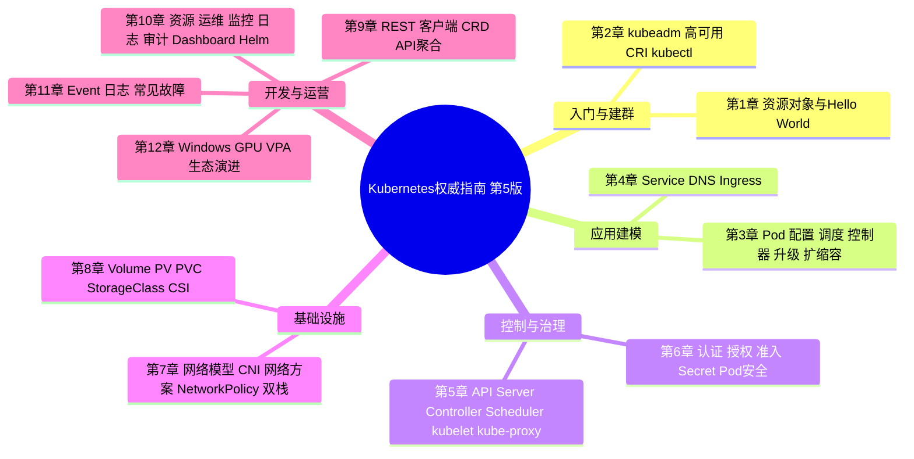
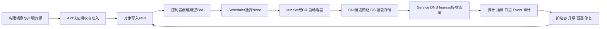
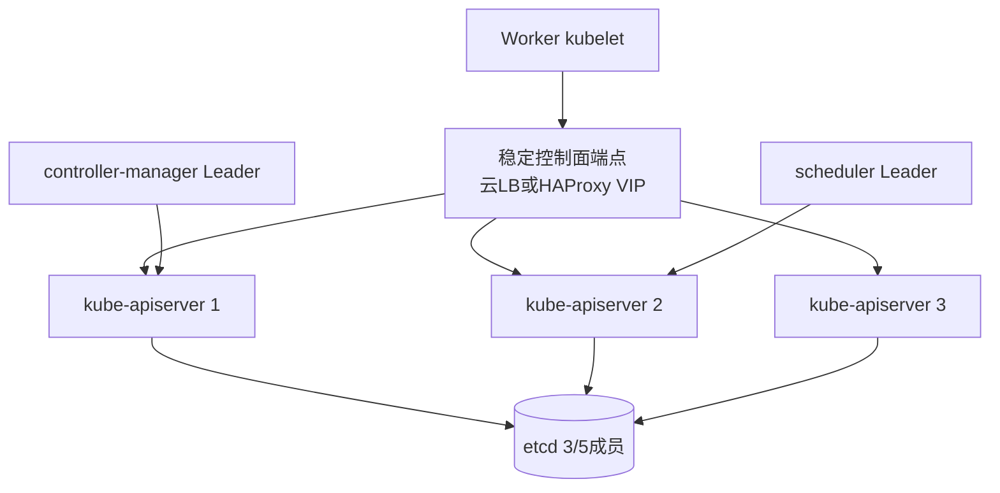
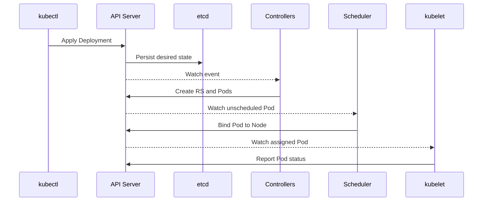
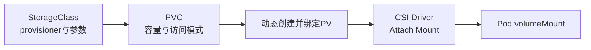
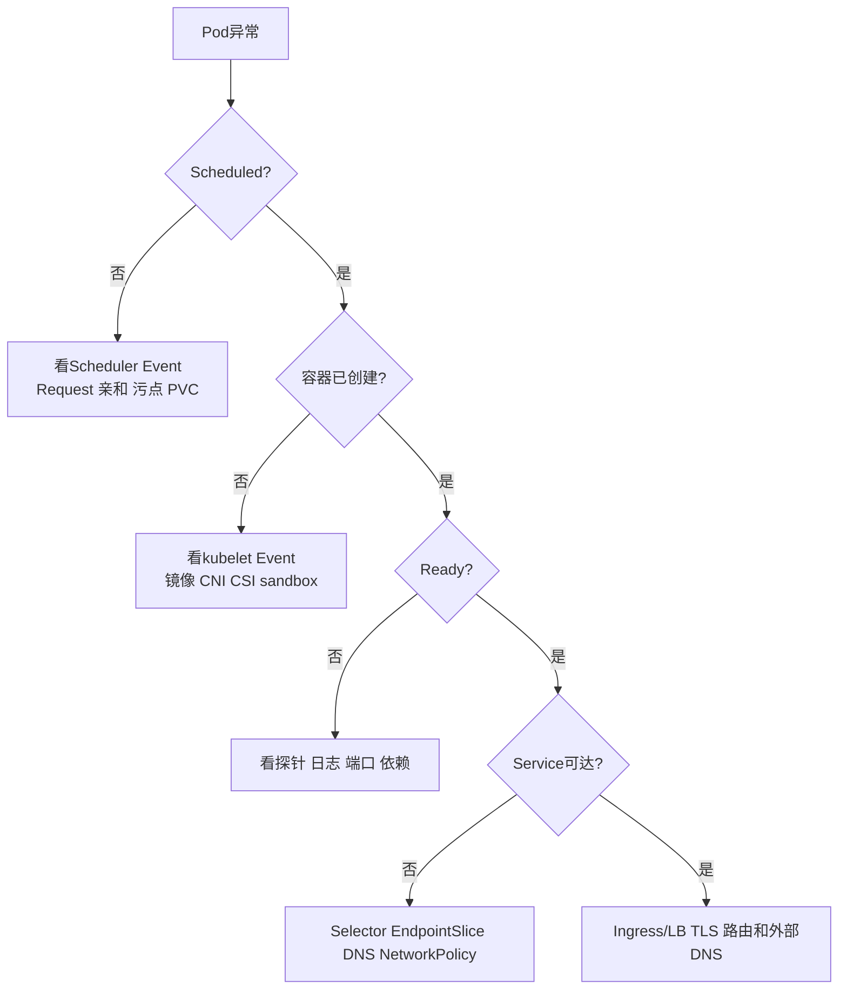

# 《Kubernetes 权威指南》第 5 版深度阅读

> **文本与版本边界**：本文依据龚正、吴治辉、闫健勇所著《Kubernetes 权威指南：从 Docker 到 Kubernetes 实践全接触（第 5 版）》全文整理。电子工业出版社 2021 年 6 月出版，ISBN `978-7-121-40998-1`。版权页标注全书约 141 万字；正文共 12 章，明确覆盖 Kubernetes 1.0 ～ 1.19 的主要特性。
>
> **标注规则**：`【原书】`表示书中明确论述或案例，`【原书示例整理】`表示 PDF 中代码页为图片，本文依据紧邻正文对字段的逐项解释恢复为可读代码，`【纠正】`表示对错误或过时内容的校正，`【书外扩展】`表示为现代实践补充。历史内容不会被静默改写成作者观点。

---

## 一、全书解决的核心问题

### 1.1 官方定义与全局摘要

版权页后的内容简介给出了全书最准确的技术定义：

> “Kubernetes 是由谷歌开源的容器集群管理系统，为容器化应用提供了资源调度、部署运行、服务发现、扩缩容等一整套功能。”

内容简介还用一句话概括其设计思想：

> “一切以服务（Service）为中心，一切围绕服务运转。”

第 1 章进一步把 Kubernetes 定义为源于 Google Borg 经验、基于容器技术的分布式架构方案，是容器云和云原生生态的基础平台。作者强调它对语言和框架没有侵入性：Java、Go、C++、Python 等应用都可以映射为 Service，通过标准网络协议交互。

通俗地说，Docker 解决了“如何把一个应用及其依赖装进标准箱子”，Kubernetes 继续解决“成千上万个箱子应该放到哪些机器、坏了怎么办、怎么被找到、怎么升级、怎么扩容、如何限制权限和资源”。它把大量人工运维动作变成资源对象和控制循环：用户声明“我要 3 个副本”，系统持续比较实际状态与期望状态，并自动补齐差异。

本书解决的问题可归纳为六层：

1. **应用建模**：用 Pod、Deployment、StatefulSet、Job 等表达不同工作负载。
2. **服务连接**：用 Service、DNS、Ingress 隔离易变的 Pod 地址。
3. **自动控制**：用 Scheduler 和 Controller 完成放置、副本维持、升级、恢复与扩缩容。
4. **基础设施抽象**：通过 CRI、CNI、CSI 分别解耦运行时、网络和存储。
5. **平台治理**：用认证、RBAC、准入、配额、网络策略和安全上下文建立多租户边界。
6. **持续运营**：用 Event、日志、指标、审计、Helm、备份和排障流程维持生产集群。

### 1.2 全书篇章框架



从资源生命周期看，全书不是 12 个孤立专题，而是一条连续链路：



### 1.3 与传统和同类平台的比较

> Docker Compose、Swarm、Nomad、OpenStack 和托管 Kubernetes 的横向信息属于书外比较，用于说明 Kubernetes 的技术边界。

| 维度           | Kubernetes                             | Docker Compose         | Docker Swarm       | HashiCorp Nomad                  | OpenStack/传统虚拟机编排     | 托管 Kubernetes                    |
| -------------- | -------------------------------------- | ---------------------- | ------------------ | -------------------------------- | ---------------------------- | ---------------------------------- |
| 管理对象       | Pod、Service、声明式 API 和可扩展资源  | 单机多容器应用         | Service/Task       | Job/Allocation，支持多类工作负载 | VM、网络、块存储等 IaaS 资源 | Kubernetes API，控制面由云厂商维护 |
| 调度与自愈     | 调度框架、控制循环、探针、驱逐、优先级 | 无集群调度             | 内置调度与副本恢复 | 调度简单直接、单二进制           | 以虚拟机生命周期为中心       | 与上游 Kubernetes 基本一致         |
| 服务发现与入口 | Service、CoreDNS、Ingress/Gateway      | Compose 网络 DNS       | Routing Mesh       | 原生服务注册较弱，常配 Consul    | 依赖独立 LB/DNS              | 常与云 LB、DNS、IAM 集成           |
| 存储抽象       | PV/PVC/StorageClass/CSI                | Volume                 | Volume 能力有限    | CSI                              | Cinder/Manila 等 VM 级存储   | 云盘 CSI 和托管存储集成            |
| 扩展性         | CRD、Controller、Operator、Admission   | 很少                   | 有限               | 插件和生态较轻                   | OpenStack API/驱动           | 可扩展，但受云服务边界影响         |
| 学习与运维成本 | 高，组件和对象关系复杂                 | 低                     | 较低               | 中等                             | 高，侧重 IaaS                | 降低控制面负担，但仍需治理工作负载 |
| 适用规模       | 从开发集群到大型多租户平台             | 本地开发、CI、小型单机 | 简单容器集群       | 追求简洁或混合工作负载           | 强隔离 VM 与完整私有云       | 希望减少 etcd/控制面运维的生产团队 |

Kubernetes 的突出优势是**声明式 API + 控制器模式 + 标准扩展接口**。它不是只把容器“跑起来”，而是把部署、网络、存储、安全和运营都变为可组合的资源模型。代价也来自同一套机制：对象多、控制链长、故障可能跨越 API、调度、节点、网络和存储。小型单机系统使用 Compose 往往更直接；需要轻量混合调度时 Nomad 可能更简洁；缺少控制面运维能力时，托管 Kubernetes 通常比自建更合理。

---

## 二、十二章逐章解读

| 章节     | 章节主题                     | 本章的核心内容                                                                                                                         | 问题与解决路径                                                                                          |
| -------- | ---------------------------- | -------------------------------------------------------------------------------------------------------------------------------------- | ------------------------------------------------------------------------------------------------------- |
| 前言     | 从 Borg 经验到云原生基础设施 | 说明第 1 版始于 2016 年，第 5 版覆盖 1.19；给出入门、安装、原理、开发、网络存储和运维的路线                                            | 建议搭建真实环境动手验证，而不是只记资源定义                                                            |
| 第 1 章  | Kubernetes 入门              | Kubernetes 的定位；MySQL+Tomcat 示例；资源对象分类；Cluster、控制节点、Node、Pod、Label、Deployment、Service、ConfigMap、Secret、PV 等 | 用 Deployment 维持副本，用 Service 隔离 Pod IP 变化，从一个两层 Web 应用串起对象关系                    |
| 第 2 章  | 安装配置指南                 | 系统要求、kubeadm、二进制高可用控制面、私有镜像库、版本升级、CRI、kubectl                                                              | 测试环境用 kubeadm 快速建群；生产示例用 3 控制节点、etcd、HAProxy+Keepalived；CRI 解耦 kubelet 与运行时 |
| 第 3 章  | 深入掌握 Pod                 | Pod 定义、多容器、静态 Pod、共享 Volume、ConfigMap、Downward API、生命周期与探针；调度、Init Container、滚动升级、HPA、StatefulSet     | 依据应用形态选择 Deployment/DaemonSet/Job/StatefulSet；通过亲和、污点、优先级和拓扑分布表达调度约束     |
| 第 4 章  | 深入掌握 Service             | ClusterIP/NodePort/外部服务/Headless、EndpointSlice、CoreDNS、NodeLocal DNS、Pod DNS、Ingress 和 TLS                                   | Service 提供稳定入口并屏蔽后端变化；CoreDNS 完成名字发现；Ingress Controller 把七层规则落实到代理       |
| 第 5 章  | 核心组件运行机制             | API Server 的 REST、List-Watch、版本转换；Controller Manager；Scheduler Framework；kubelet、CRI、RuntimeClass；kube-proxy 三代模式     | 通过“期望状态—实际状态”控制循环解释自愈；通过事件监听让组件松耦合；IPVS 改善大规模 Service 转发         |
| 第 6 章  | 集群安全机制                 | 证书、Bearer Token、OIDC、认证代理；ABAC/Webhook/RBAC；Admission Control；ServiceAccount、Secret、PodSecurityPolicy、SecurityContext   | 请求依次经过认证、授权、准入；RBAC 实施最小权限；安全上下文限制容器特权、用户、能力与文件系统           |
| 第 7 章  | 网络原理                     | IP-per-Pod 模型；namespace、veth、bridge、Netfilter；Docker 网络；Pod/Service 数据路径；CNI；Flannel、OVS、Calico；NetworkPolicy；双栈 | CNI 插件实现扁平互通；kube-proxy 实现 Service 虚拟网络；NetworkPolicy 以标签表达东西向隔离              |
| 第 8 章  | 存储原理和应用               | Volume、PV/PVC 生命周期、访问模式和回收策略；StorageClass 动态供应；GlusterFS/Heketi 实战；CSI 架构与迁移                              | PV 把供应方细节与使用方申请分开；StorageClass 自动创建 PV；CSI 将存储驱动移出 Kubernetes 主仓库         |
| 第 9 章  | Kubernetes 开发指南          | REST 与 Kubernetes API；Fabric8 Java 客户端；API Group/Version；CRD、API Aggregation、Metrics Server                                   | 用客户端库而非拼接 HTTP 操作资源；简单扩展用 CRD+Controller，完整自定义 API 行为可用聚合 API Server     |
| 第 10 章 | Kubernetes 运维管理          | Node 隔离、Label、Namespace、Request/Limit/QoS/Quota、驱逐、PDB、Metrics Server、Prometheus/Grafana、EFK、审计、Dashboard、Helm        | 先划分租户和资源预算，再监控、审计和打包发布；主动维护用 PDB 保留可用副本，压力驱逐按 QoS 和优先级决策  |
| 第 11 章 | Trouble Shooting             | Event、容器日志、systemd 服务日志、常见失败和社区求助                                                                                  | 从对象状态和 Event 开始，向容器日志、节点组件日志逐层下钻，避免一开始就在所有节点盲查                   |
| 第 12 章 | 开发中的新功能               | Windows Worker、GPU Device Plugin、VPA、CNCF 生态和 SIG 开发模式                                                                       | 异构节点用 OS/架构标签和调度隔离；GPU 作为扩展资源；VPA 依据历史用量建议或调整 Request                  |

---

## 三、沿 Kubernetes 生命周期掌握关键技术

### 3.1 建模起点：从容器到 Pod、Deployment 与 Service【第 1 章】

#### 为什么不能只管理容器

单个容器没有表达“这两个进程必须共用网络和存储”“永远保持三个副本”“这个地址应长期不变”的能力。Kubernetes 因此把容器包装为 Pod，把副本和升级交给 Controller，把稳定访问交给 Service。

原书第 1.3 节用 MySQL 与 Tomcat 留言板贯穿入门：MySQL Deployment 保持一个数据库 Pod，MySQL Service 暴露 3306；Tomcat Deployment 通过服务名访问数据库，Web Service 以 NodePort `30001` 暴露到集群外。

【原书示例整理，并更新为稳定 API】核心关系可以缩减为：

```yaml
apiVersion: apps/v1
kind: Deployment
metadata:
  name: myweb
spec:
  replicas: 2
  selector:
    matchLabels:
      app: myweb
  template:
    metadata:
      labels:
        app: myweb
    spec:
      containers:
        - name: tomcat
          image: kubeguide/tomcat-app:v1
          ports:
            - containerPort: 8080
---
apiVersion: v1
kind: Service
metadata:
  name: myweb
spec:
  selector:
    app: myweb
  ports:
    - port: 8080
      targetPort: 8080
      nodePort: 30001
  type: NodePort
```

这里最重要的不是 YAML 语法，而是松耦合关系：Deployment 的 selector 匹配 Pod template 的 label，Service 再以相同 label 找到后端。Pod 名称和 IP 都可以变化，Service 的名字与 ClusterIP 提供稳定契约。

#### 基本术语

- **Container**：由镜像启动的隔离进程，不等同轻量虚拟机。
- **Pod**：Kubernetes 最小调度单元；同一 Pod 的容器共享网络命名空间，可通过 `localhost` 通信，并可共享 Volume。
- **Pause container**：持有 Pod 网络命名空间等基础资源的沙箱容器；业务容器加入该沙箱。
- **Label / Selector**：键值标签及其选择条件，是 Controller、Service 与 Pod 建立松耦合关联的基础。
- **Annotation**：供工具和控制器记录非筛选性元数据，不应承担 Label 的选择职责。
- **Deployment**：管理无状态 Pod 的声明式工作负载控制器，底层维护 ReplicaSet，支持滚动升级和回滚。
- **Service**：一组后端 Pod 的稳定网络入口和发现名称。
- **desired state / actual state**：用户声明的期望状态与集群观测到的实际状态；控制器持续让二者收敛。

#### 版本边界、局限和正确用法

原书仍大量讲解 ReplicationController（RC），但同时明确官方建议用 Deployment 管理 ReplicaSet，而非直接操作底层 RS。现代无状态应用应默认使用 Deployment。裸 Pod 缺少副本自愈和声明式升级，只适合短期实验；静态 Pod 由 kubelet 直接管理，适合控制面等节点级组件，不适合作为普通应用部署方式。

通俗理解：容器是一个演员，Pod 是必须共同登台的小组，Deployment 是始终保证演员数量和版本的舞台监督，Service 是观众永远使用的固定入口。

### 3.2 集群诞生：控制面、kubeadm、高可用与 CRI【第 2 章】

#### 原书部署路线及其架构意义

第 2 章给出两条路线：

- kubeadm 快速安装，用于学习和标准化引导；
- Kubernetes 1.19 二进制安装，构建 3 控制节点、启用 CA 认证，并用 HAProxy+Keepalived 暴露 API Server VIP。

生产架构中的关键不是逐条复制 systemd 参数，而是理解故障域：etcd 要有奇数成员形成多数派；API Server 可横向扩展；Scheduler 和 Controller Manager 通过 leader election 保持单活协调；Worker 应通过稳定的控制面端点访问 API Server。



#### CRI 解耦运行时

书中第 2.6 节把 CRI 定义为 kubelet 与容器运行时之间的 gRPC 插件接口，主要包含 `RuntimeService` 和 `ImageService`。这使 kubelet 不必为 Docker、containerd、CRI-O 等逐个内置实现。

- **CRI**：Container Runtime Interface，容器运行时接口。
- **CNI**：Container Network Interface，容器网络接口；负责给 Pod 沙箱接通网络。
- **CSI**：Container Storage Interface，容器存储接口；负责卷的供应、挂载与卸载。
- **kubeadm**：引导集群的官方工具，不负责安装所有后续运维组件。
- **etcd**：强一致键值数据库，保存 Kubernetes API 对象，是控制面最关键的持久状态。
- **control plane**：控制面。原书使用 `Master`，现代文档和命令更常使用 control plane。

【纠正，对应 2.2、2.3、2.6】书中以 CentOS 7、Docker 和 Kubernetes 1.19 为环境，相关仓库、镜像、kubeadm 配置版本及服务参数不能照搬。内置 Docker 集成 dockershim 已在 Kubernetes 1.24 移除；现在应使用实现 CRI 的 containerd、CRI-O，或额外的 `cri-dockerd` 适配 Docker Engine。

#### 安装的现实边界

自建控制面意味着自己负责证书轮换、etcd 快照与恢复、跨可用区延迟、版本偏差、CNI/CSI 升级和灾难演练。组织若没有明确的基础设施学习或合规要求，托管 Kubernetes 可以减少控制面负担。kubeadm 解决“如何正确引导”，不自动解决“如何长期运营”。

### 3.3 声明与注入：ConfigMap、Secret、Downward API【第 3、6 章】

#### 配置与镜像分离

第 3.5 节明确提出最佳实践：应用所需配置应与程序分离，使同一镜像能在不同环境复用。ConfigMap 可通过环境变量、命令行参数或 Volume 文件注入；Downward API 将 Pod 名称、Namespace、Label、资源 Request/Limit 等自身信息暴露给容器。

```yaml
apiVersion: v1
kind: ConfigMap
metadata:
  name: app-config
data:
  LOG_LEVEL: info
  app.yaml: |
    featureEnabled: true
---
apiVersion: v1
kind: Secret
metadata:
  name: db-credentials
type: Opaque
stringData:
  username: app
  password: change-me
---
apiVersion: v1
kind: Pod
metadata:
  name: config-demo
spec:
  containers:
    - name: app
      image: example/app:1.0
      envFrom:
        - configMapRef:
            name: app-config
      env:
        - name: POD_NAME
          valueFrom:
            fieldRef:
              fieldPath: metadata.name
        - name: DB_PASSWORD
          valueFrom:
            secretKeyRef:
              name: db-credentials
              key: password
```

#### 术语、限制与安全纠正

- **ConfigMap**：保存非敏感配置的 namespaced API 对象。
- **Secret**：保存敏感字节数据的 API 对象；`data` 是 Base64 编码，`stringData` 由 API Server 转换为 `data`。
- **Downward API**：把 Kubernetes 已知的 Pod/容器元数据向下暴露给容器。
- **Projected Volume**：把 Secret、ConfigMap、ServiceAccount Token 等多个来源投射到同一目录。
- **immutable configuration**：不可变 ConfigMap/Secret，适合降低 watch 压力并防止意外修改；变更时创建新名称和滚动更新引用者。

【纠正，对应 1.4.3、6.5】原书写到 Kubernetes 1.7 以后 Secret 数据“可以以加密形式保存”。必须补充：Secret 的 Base64 **不是加密**；etcd 静态加密需要 API Server 的 EncryptionConfiguration 显式启用，传输还要依赖 TLS，访问面依赖 RBAC。更严格场景应结合外部密钥管理、Secrets Store CSI Driver 或专门的 secret manager。

环境变量在进程启动后不会自动更新；Volume 形式的 ConfigMap/Secret 通常会延迟刷新，但使用 `subPath` 挂载时不会获得自动更新。应用是否热加载配置也必须明确。简单说，ConfigMap 是“外置说明书”，Secret 是“权限受控的敏感说明书”，但把纸张折成 Base64 并没有给它上锁。

### 3.4 Pod 运行：探针、控制器、调度、升级与扩缩容【第 3 章】

#### 三种探针回答三个不同问题

【原书】第 3.8 节区分 Exec、TCP、HTTP 三类检查动作，并讲解 Liveness、Readiness、Startup 三类探针。现代整理示例：

```yaml
containers:
  - name: api
    image: example/api:2.0
    ports:
      - containerPort: 8080
    startupProbe:
      httpGet:
        path: /startup
        port: 8080
      periodSeconds: 10
      failureThreshold: 30
    readinessProbe:
      httpGet:
        path: /ready
        port: 8080
      periodSeconds: 5
      failureThreshold: 2
    livenessProbe:
      httpGet:
        path: /live
        port: 8080
      periodSeconds: 10
      failureThreshold: 3
```

- **Startup Probe**：应用是否完成启动；成功前会抑制 liveness/readiness，适合慢启动程序。
- **Readiness Probe**：是否可以接收流量；失败时从 Service Endpoint 移除，不重启容器。
- **Liveness Probe**：进程是否陷入不可恢复状态；连续失败触发重启。
- **Readiness Gate**：让外部 Controller 给 Pod 增加自定义就绪条件。

三者不能共用一个“深度依赖检查”：如果数据库短时不可用就让 liveness 失败，所有 Pod 可能一起重启，反而放大故障。存活检查应浅，就绪检查可以体现接流能力，启动检查只覆盖初始化窗口。

#### 工作负载控制器的选择

| 工作负载        | 控制器      | 书中用途                                   | 关键限制                                 |
| --------------- | ----------- | ------------------------------------------ | ---------------------------------------- |
| 无状态常驻服务  | Deployment  | 副本、滚动升级、回滚                       | Pod 身份与本地磁盘不可依赖               |
| 每节点一个代理  | DaemonSet   | 日志、监控、网络 Agent                     | 节点加入即部署，要设置容忍和资源预算     |
| 一次性/并行任务 | Job         | 批处理                                     | 必须设计幂等、重试和完成判定             |
| 定时任务        | CronJob     | 周期批处理                                 | 并发策略、错过调度和时区需明确           |
| 有状态集群      | StatefulSet | 固定序号、稳定网络名、PVC 绑定             | 不会自动理解数据库成员变更和备份语义     |
| 复杂有状态软件  | Operator    | 书中指出通过自定义 Controller 编码运维知识 | 开发与升级成本高，错误控制器可能扩大故障 |

#### 调度不是指定一台机器

```yaml
spec:
  topologySpreadConstraints:
    - maxSkew: 1
      topologyKey: topology.kubernetes.io/zone
      whenUnsatisfiable: DoNotSchedule
      labelSelector:
        matchLabels:
          app: api
  affinity:
    nodeAffinity:
      requiredDuringSchedulingIgnoredDuringExecution:
        nodeSelectorTerms:
          - matchExpressions:
              - key: workload.example.com/tier
                operator: In
                values: [general]
```

- **nodeSelector**：按 Node Label 的简单硬选择。
- **Node Affinity**：支持集合表达式、硬约束和带权软偏好。
- **Pod Affinity/Anti-Affinity**：依据其他 Pod Label 决定靠近或分散。
- **Taint/Toleration**：Node 排斥 Pod，Pod 的 toleration 表示能够容忍，但不保证会调度过去。
- **Priority/Preemption**：高优先级 Pod 在资源不足时可能抢占低优先级 Pod。
- **Topology Spread Constraint**：按 zone、hostname 等拓扑域控制副本偏斜，直接表达容灾分布。

原书预测 NodeSelector 最终会被废弃，但它至今仍是简单且稳定的能力；应把这句话视为 2021 年的趋势判断，而不是已发生事实。调度约束越多，越容易形成无解的 Pending Pod，应以最少硬约束、更多软偏好为原则。

#### 滚动更新与自动扩缩容

Deployment 的 `maxSurge` 决定升级时可超出期望副本的数量，`maxUnavailable` 决定允许不可用的数量。滚动发布安全与否还取决于 readiness、`terminationGracePeriodSeconds`、`preStop`、连接排空和容量冗余。

【原书】HPA 从 Metrics Server 获取 CPU/内存，从 custom/external metrics API 获取应用或外部指标。现代示例采用 `autoscaling/v2`：

```yaml
apiVersion: autoscaling/v2
kind: HorizontalPodAutoscaler
metadata:
  name: api
spec:
  scaleTargetRef:
    apiVersion: apps/v1
    kind: Deployment
    name: api
  minReplicas: 2
  maxReplicas: 20
  metrics:
    - type: Resource
      resource:
        name: cpu
        target:
          type: Utilization
          averageUtilization: 65
  behavior:
    scaleDown:
      stabilizationWindowSeconds: 300
```

HPA 的 CPU utilization 以 Request 为分母，没有合理 Request 就没有可靠含义。VPA 修改 Request 可能需要重建 Pod，HPA 与 VPA 同时控制同一资源指标会相互干扰；队列消费者更适合按积压量扩缩。扩容也受镜像拉取、节点容量、初始化时间和下游承载能力限制。

### 3.5 服务被发现：Service、CoreDNS、EndpointSlice 与 Ingress【第 4 章】

#### 稳定入口如何屏蔽 Pod 变化

第 4 章把 Service 称为 Kubernetes 实现微服务的核心概念。Selector 找到 Pod，控制器生成 Endpoint/EndpointSlice，kube-proxy 或其他数据面把 ClusterIP 流量转发到后端。

```yaml
apiVersion: v1
kind: Service
metadata:
  name: api
spec:
  selector:
    app: api
  ports:
    - name: http
      port: 80
      targetPort: 8080
```

同 Namespace 内用 `api`，跨 Namespace 用 `api.team-a`，完整域名通常为 `api.team-a.svc.cluster.local`。Headless Service 设置 `clusterIP: None`，DNS 直接返回后端地址，适合 StatefulSet 的稳定成员发现或客户端自选后端。

- **ClusterIP**：集群内部虚拟服务地址。
- **NodePort**：在每个节点开放端口并转发到 Service；适合基础接入，不是完整七层网关。
- **LoadBalancer**：请求云控制器或实现方创建外部负载均衡器。
- **ExternalName**：以 DNS CNAME 把 Service 映射到外部名称，不产生代理数据面。
- **EndpointSlice**：对后端端点分片并携带拓扑信息，改善大规模 Endpoint 对象的容量和更新成本。
- **CoreDNS**：默认集群 DNS，通过插件链完成 Kubernetes 服务发现和上游解析。
- **NodeLocal DNSCache**：每节点缓存 DNS，减少集中 DNS 服务和 conntrack 压力。

#### Ingress 是规则，不是代理进程

原书第 4.6 节先部署 NGINX Ingress Controller，再创建 Ingress，并强调 Controller 持续监听 API Server 的 Ingress 变化后生成转发配置。稳定 API 示例：

```yaml
apiVersion: networking.k8s.io/v1
kind: Ingress
metadata:
  name: mywebsite
spec:
  ingressClassName: nginx
  tls:
    - hosts: [mywebsite.example.com]
      secretName: mywebsite-tls
  rules:
    - host: mywebsite.example.com
      http:
        paths:
          - path: /demo
            pathType: Prefix
            backend:
              service:
                name: myweb
                port:
                  number: 8080
```

【版本变化】书中已介绍 Kubernetes 1.19 的 `networking.k8s.io/v1`、`pathType` 和 `IngressClass`，这是第五版很有价值的更新。更旧的 `extensions/v1beta1`/`networking.k8s.io/v1beta1` Ingress 已删除，后端字段从 `serviceName/servicePort` 改为 `service.name/service.port`。

Ingress API 只描述有限 HTTP(S) 路由，重写、认证、限流等通常依赖 Controller 注解，形成实现方锁定。Gateway API 用 GatewayClass、Gateway、HTTPRoute 等拆分基础设施和应用职责，是现代扩展方向，但属于书外内容。

### 3.6 控制面原理：API、List-Watch、Controller 与 Scheduler【第 5 章】

#### API Server 是总线，不是所有工作的执行者

原书对 API Server 的原话是：

> “成为集群内各个功能模块之间数据交互和通信的中心枢纽，是整个系统的数据总线和数据中心。”

典型创建流程如下：

1. 客户端提交 Deployment，API Server 完成认证、授权、准入和校验并写入 etcd。
2. Deployment Controller watch 到对象，创建 ReplicaSet。
3. ReplicaSet Controller 创建未绑定节点的 Pod。
4. Scheduler watch 到 Pod，过滤和评分后写入 `spec.nodeName`/Binding。
5. 目标 Node 的 kubelet watch 到 Pod，经 CRI 拉镜像、建沙箱并启动容器。
6. EndpointSlice Controller 根据 Service selector 和 Ready Pod 更新后端。



- **REST**：Representational State Transfer，以资源、统一接口、无状态等约束组织 Web API 的架构风格。
- **List-Watch**：先列出当前对象和 `resourceVersion`，再从该版本持续监听变化。
- **reconciliation loop**：协调循环，反复观察、比较并采取动作，不依赖一次性命令必然成功。
- **Controller**：针对某类资源运行协调逻辑的控制器。
- **Scheduler Framework**：把调度拆成 QueueSort、Filter、Score、Reserve、Permit、Bind 等扩展点的框架。
- **Server-Side Apply**：API Server 跟踪字段所有者并合并声明，冲突时显式报告。

#### kubelet 和 kube-proxy 的边界

kubelet 负责本节点 Pod 全生命周期、探针和状态上报；它不负责跨节点调度。kube-proxy 监听 Service/EndpointSlice，落实服务转发规则。原书按用户态代理、iptables、IPVS 讲述三代实现，清楚展示了数据面从“每包经过进程”到“内核规则转发”的演化。

控制器的优势是能处理短暂失败和最终一致，局限是异步：`kubectl apply` 成功只表示对象被 API 接受，不代表容器已 Ready。排障时必须沿 OwnerReference、Condition、Event 和各控制器职责逐层定位。

### 3.7 API 请求的安全链：认证、授权、准入与运行时限制【第 6 章】

#### 四道边界

```text
TLS连接 → Authentication → Authorization → Admission → 写入etcd
             你是谁            能做什么          这个对象是否合规
```

原书讲解 X.509 客户端证书、Bearer Token、OIDC 和认证代理；授权部分比较 ABAC、Webhook、RBAC；准入部分覆盖内置插件和 Admission Webhook；工作负载安全则由 ServiceAccount、Secret、SecurityContext 和当时的 PodSecurityPolicy 组成。

最小 RBAC 示例：

```yaml
apiVersion: rbac.authorization.k8s.io/v1
kind: Role
metadata:
  name: pod-reader
  namespace: team-a
rules:
  - apiGroups: [""]
    resources: ["pods", "pods/log"]
    verbs: ["get", "list", "watch"]
---
apiVersion: rbac.authorization.k8s.io/v1
kind: RoleBinding
metadata:
  name: read-pods
  namespace: team-a
subjects:
  - kind: ServiceAccount
    name: observer
    namespace: team-a
roleRef:
  apiGroup: rbac.authorization.k8s.io
  kind: Role
  name: pod-reader
```

- **Authentication**：验证调用者身份。
- **Authorization**：针对 user/group、verb、resource、namespace 等判断是否允许操作。
- **RBAC**：Role-Based Access Control，基于角色的访问控制。
- **Admission Controller**：授权后、持久化前修改或拒绝对象的准入控制器。
- **ServiceAccount**：Pod 内进程使用的 Kubernetes 身份，不是人类账号。
- **SecurityContext**：Pod/Container 的 UID、GID、capability、seccomp、只读根文件系统等运行安全设置。
- **OIDC**：OpenID Connect，基于 OAuth 2.0 的身份层，可把外部 IdP 接入 API Server。

#### PSP 已退出，思想并未退出

【纠正，对应 6.6】PodSecurityPolicy 在原书的 1.19 时代为 Beta，后来已废弃并在 Kubernetes 1.25 删除。现代内置方案是 Pod Security Admission 按 Namespace 标签执行 Privileged、Baseline、Restricted 标准；复杂策略可使用 ValidatingAdmissionPolicy、Kyverno 或 OPA Gatekeeper。

```yaml
apiVersion: v1
kind: Namespace
metadata:
  name: team-a
  labels:
    pod-security.kubernetes.io/enforce: restricted
    pod-security.kubernetes.io/audit: restricted
    pod-security.kubernetes.io/warn: restricted
```

工作负载本身仍应设置 `runAsNonRoot`、`allowPrivilegeEscalation: false`、只读根文件系统、删除多余 Linux capabilities 和合适的 seccomp profile。Namespace 不是强安全边界，默认 ServiceAccount token、节点权限、网络和存储也要一起治理。

### 3.8 Pod 获得网络：namespace、CNI、Service 数据面与 NetworkPolicy【第 7 章】

#### 原书的网络原则

第 7.1 节给出精确原则：

> “每个 Pod 都拥有一个独立的 IP 地址，并假定所有 Pod 都在一个可以直接连通的、扁平的网络空间中。”

同一 Pod 的容器共享网络命名空间；同节点 Pod 通常通过 veth 与桥或 eBPF 数据面连接；跨节点可用路由或 VXLAN/IP-in-IP 等隧道；Service 则在 Pod 网络之上提供虚拟入口。

```text
容器 eth0
   │
 veth pair
   │
节点网络数据面 ── 路由/隧道/eBPF ── 另一节点 ── 目标Pod
   │
Service规则：ClusterIP → 一个EndpointSlice后端
```

- **network namespace**：独立的网卡、地址、路由、端口与 netfilter 视图。
- **veth pair**：成对虚拟以太网设备，一端收到的包从另一端出现，用于连接命名空间。
- **bridge**：二层软件交换设备。
- **Netfilter**：Linux 内核包处理钩子框架，iptables/nftables 在其上配置规则。
- **overlay/underlay**：在现有网络上封装出的虚拟网络 / 直接使用底层路由可达性的网络。
- **CNI**：kubelet/运行时在创建和删除 Pod 沙箱时调用的网络插件规范。
- **BGP**：Border Gateway Protocol；Calico 可用它分发 Pod 路由。
- **IPVS**：IP Virtual Server，内核四层负载均衡能力，书中称第三代 kube-proxy 模式。

#### NetworkPolicy 是声明，还需要实现者

```yaml
apiVersion: networking.k8s.io/v1
kind: NetworkPolicy
metadata:
  name: api-only-from-web
  namespace: team-a
spec:
  podSelector:
    matchLabels:
      app: api
  policyTypes: [Ingress, Egress]
  ingress:
    - from:
        - podSelector:
            matchLabels:
              app: web
      ports:
        - protocol: TCP
          port: 8080
  egress:
    - to:
        - namespaceSelector:
            matchLabels:
              kubernetes.io/metadata.name: data
      ports:
        - protocol: TCP
          port: 5432
```

只有 CNI 插件实现 NetworkPolicy 时，创建对象才会产生隔离效果；Flannel 单独部署通常不负责完整策略执行，Calico、Cilium 等可以。策略是 allow-list 语义，选中 Pod 后未允许的对应方向流量被拒绝。生产落地常从观测开始，再逐 Namespace 建立 default-deny、DNS egress 和必要白名单，避免一次切断所有依赖。

【时效说明】原书花大量篇幅解释 Docker bridge、Open vSwitch、Flannel 与 Calico，这些原理仍有价值；现代数据面还广泛采用 eBPF，能够减少长 iptables 链并整合网络、策略和可观测性。选择 CNI 时应比较封装开销、底层路由条件、NetworkPolicy 语义、双栈、加密、运维工具和升级路径，而不是只看吞吐基准。

### 3.9 数据跨越 Pod：Volume、PV/PVC、StorageClass 与 CSI【第 8 章】

#### 从“目录挂载”到声明式供应

容器可写层随容器重建而变化，同 Pod 的 `emptyDir` 随 Pod 删除而消失。第 8 章用 PV/PVC 将“管理员或驱动提供什么”与“应用申请什么”解耦：



```yaml
apiVersion: v1
kind: PersistentVolumeClaim
metadata:
  name: database-data
spec:
  accessModes: [ReadWriteOnce]
  storageClassName: fast-block
  resources:
    requests:
      storage: 20Gi
---
apiVersion: apps/v1
kind: StatefulSet
metadata:
  name: database
spec:
  serviceName: database
  replicas: 1
  selector:
    matchLabels:
      app: database
  template:
    metadata:
      labels:
        app: database
    spec:
      containers:
        - name: db
          image: example/database:1.0
          volumeMounts:
            - name: data
              mountPath: /var/lib/database
  volumeClaimTemplates:
    - metadata:
        name: data
      spec:
        accessModes: [ReadWriteOnce]
        storageClassName: fast-block
        resources:
          requests:
            storage: 20Gi
```

- **PV**：PersistentVolume，集群级持久卷资源及后端存储的抽象。
- **PVC**：PersistentVolumeClaim，命名空间内用户对容量、访问模式、存储类的申请。
- **StorageClass**：动态供应模板，声明 provisioner、参数、回收和绑定策略。
- **access mode**：RWO/ROX/RWX/RWOP 等访问语义；它描述后端能力，不等同数据库并发一致性。
- **reclaim policy**：PVC/PV 释放后的 Delete 或 Retain 策略。
- **CSI**：厂商中立的存储插件接口，把驱动从 Kubernetes 主代码库解耦。
- **VolumeSnapshot**：CSI 快照 API；快照不是天然一致的数据库备份，仍需应用冻结或日志协同。

#### 历史方案与现代边界

【原书】8.3 用 GlusterFS+Heketi 完整演示 StorageClass 动态供应；真正可迁移的知识是 PVC 触发 provisioner、绑定 PV、挂载进 Pod 的过程。

【纠正，对应 8.3】GlusterFS in-tree volume 插件已移除，Heketi 项目也已归档，不能把该章命令作为新集群方案。应选择仍受支持的 CSI Driver，例如云盘 CSI、Ceph RBD/CephFS、Longhorn 或企业存储方案，并验证升级、拓扑、快照、扩容与灾难恢复。

【原书前瞻】8.4 对 in-tree 插件紧耦合问题的分析仍然准确：驱动随 Kubernetes 二进制发布会拖慢双方迭代，因此 CSI 外置控制器和 Node 插件是正确方向。今天应优先使用 CSI，而不是继续新增 in-tree 配置。

存储最常被误解为“PVC Bound 就安全”。Bound 只证明资源匹配，不证明有备份、跨区恢复、性能达标或应用一致性。对数据库要同时设计备份恢复演练、拓扑约束、扩容、故障切换和数据校验。

### 3.10 扩展平台：客户端、CRD、Controller 与聚合 API【第 9 章】

#### API Group 与版本演进

第 9 章先讲 REST，再分析 Core Group `/api/v1` 与命名 API Group `/apis/<group>/<version>`，并以 Fabric8 Java Client 进行 CRUD、watch 等操作。使用官方或成熟客户端库的优势是处理认证、序列化、watch 重连和资源版本，而不是手写脆弱 HTTP。

- **GVK**：Group-Version-Kind，标识对象的 API 组、版本和类型。
- **GVR**：Group-Version-Resource，标识 REST 资源路径，resource 通常是复数小写。
- **CRD**：CustomResourceDefinition，自定义资源类型的结构和版本。
- **Custom Resource**：CRD 的具体实例，只保存声明数据。
- **Operator**：把领域运维知识写入 Controller，以 CR 管理复杂应用生命周期。
- **API Aggregation**：API Server 把某 API Group 路径代理到扩展 API Server；Metrics API 是典型应用。
- **OpenAPI schema**：定义字段结构、类型、必填项和校验规则，也支撑客户端发现和字段裁剪。

【版本校正】原书围绕 `apiextensions.k8s.io/v1beta1` 的时代展开，并已建议 CRD 使用 `versions` 和 OpenAPI v3 schema。现代稳定定义必须使用 `apiextensions.k8s.io/v1`：

```yaml
apiVersion: apiextensions.k8s.io/v1
kind: CustomResourceDefinition
metadata:
  name: backups.platform.example.com
spec:
  group: platform.example.com
  scope: Namespaced
  names:
    plural: backups
    singular: backup
    kind: Backup
    shortNames: [bk]
  versions:
    - name: v1
      served: true
      storage: true
      schema:
        openAPIV3Schema:
          type: object
          properties:
            spec:
              type: object
              required: [target]
              properties:
                target:
                  type: string
            status:
              type: object
              x-kubernetes-preserve-unknown-fields: true
      subresources:
        status: {}
```

CRD 只创建 API，不会自动执行备份；还必须有 Controller watch `Backup`，创建 Job、更新 status、处理重试、删除和幂等。控制器应使用 finalizer 谨慎清理外部资源，避免 finalizer 逻辑故障让对象永远卡在 Terminating。

简单 CRD+Controller 易于部署和复用 Kubernetes 认证、RBAC、存储；需要自定义存储、特殊协议或完整 API Server 行为时才考虑 Aggregated API Server。平台扩展的风险是把错误自动化：必须定义状态机、超时、速率限制、升级兼容和灾难恢复。

### 3.11 运营集群：资源、公平性、可观测性、审计与 Helm【第 10 章】

#### Request、Limit、QoS 和配额是一套系统

Scheduler 依据 Request 放置 Pod，kubelet/运行时通过 cgroup 落实部分 Limit；QoS 在节点资源紧张和 OOM 时影响驱逐优先级。原书第 10.4 节把它们与 LimitRange、ResourceQuota 串联，是生产治理的核心。

```yaml
apiVersion: v1
kind: ResourceQuota
metadata:
  name: team-budget
  namespace: team-a
spec:
  hard:
    requests.cpu: "8"
    requests.memory: 16Gi
    limits.cpu: "16"
    limits.memory: 32Gi
    pods: "50"
---
apiVersion: v1
kind: LimitRange
metadata:
  name: container-defaults
  namespace: team-a
spec:
  limits:
    - type: Container
      defaultRequest:
        cpu: 100m
        memory: 128Mi
      default:
        cpu: 500m
        memory: 512Mi
```

- **Request**：调度和资源保障的基准，不是预留一块永不共享的物理 CPU。
- **Limit**：允许使用上限；CPU 通常被节流，内存超限会触发 OOM kill。
- **QoS**：Guaranteed、Burstable、BestEffort，依据 Request/Limit 组合自动分类。
- **LimitRange**：为 Namespace 内对象设置默认值、最小值、最大值或比例。
- **ResourceQuota**：限制 Namespace 汇总资源和对象数量。
- **eviction**：节点资源不足时 kubelet 按信号和优先级回收资源、驱逐 Pod。
- **PDB**：PodDisruptionBudget，限制自愿中断期间同时不可用的副本数量，不阻止节点故障等非自愿中断。

```yaml
apiVersion: policy/v1
kind: PodDisruptionBudget
metadata:
  name: api
spec:
  minAvailable: 2
  selector:
    matchLabels:
      app: api
```

PDB 不能创造容量；只有两个副本却要求 `minAvailable: 2` 会阻塞 drain。维护前应同时检查副本、跨节点/跨区分布、readiness 和优雅退出。

#### 指标、日志和审计的分工

原书从 Heapster 的退出讲到 Metrics Server，再搭建 Prometheus+node_exporter+Grafana 和 Fluentd+Elasticsearch+Kibana，并介绍 API Server Audit Policy。

| 信号             | 书中组件                                     | 适合回答                                      | 不应承担                             |
| ---------------- | -------------------------------------------- | --------------------------------------------- | ------------------------------------ |
| Resource Metrics | Metrics Server                               | HPA、VPA、`kubectl top` 所需 CPU/内存近实时值 | 长期监控和告警                       |
| Metrics          | Prometheus/Grafana                           | 趋势、SLO、容量、告警                         | 单个请求的完整上下文                 |
| Logs             | stdout/stderr、Fluentd、Elasticsearch/Kibana | 错误细节、业务事件、跨节点检索                | 精确低成本聚合统计                   |
| Events           | Kubernetes Event                             | 调度、拉镜像、挂载、探针等近期状态变化        | 长期可靠审计，Event 有保留期且会聚合 |
| Audit            | API Server Audit Log                         | 谁在何时对哪个资源做了什么                    | 容器内业务行为                       |

【时效说明】EFK 架构思想仍有效，但具体版本、Elasticsearch 安全设置和索引配置已经变化；也可选择 OpenSearch、Loki 或托管日志。Metrics Server 仍不是 Prometheus 的替代品。

#### Helm v3 的正确位置

书中同时解释 Helm v2/Tiller 和 Helm v3，并明确 v3 去除 Tiller、把 API 操作放回客户端，权限遵循调用者 kubeconfig/RBAC。新项目只使用 Helm v3。

Helm 是 Kubernetes YAML 的打包、模板化和 release 管理工具，不是 Operator：它擅长安装和升级一组资源，不会持续理解数据库主从、备份和应用内部状态。Chart 应固定依赖、校验 values、渲染后审查，并避免在模板中隐藏过多业务逻辑。

### 3.12 故障发生后：从对象事实到组件日志【第 11 章】

#### 原书的三层排障方法

第 11 章给出一条很实用的顺序：先看对象状态和 Event；再进容器或看容器日志；最后对全局问题联合分析 API Server、Scheduler、Controller Manager、kubelet、kube-proxy 日志。

```bash
# 1. 看期望状态、实际状态、Condition 和近期 Event
kubectl get pod -n team-a -o wide
kubectl describe pod api-xxxxx -n team-a
kubectl get events -n team-a --sort-by=.lastTimestamp

# 2. 看应用、上一个已崩溃实例和多容器中的指定容器
kubectl logs api-xxxxx -n team-a -c api
kubectl logs api-xxxxx -n team-a -c api --previous

# 3. 验证服务选择器、EndpointSlice、DNS 与网络
kubectl get svc,endpointslice -n team-a
kubectl exec -n team-a deploy/debug -- nslookup api.team-a.svc.cluster.local

# 4. 节点和组件层
kubectl describe node worker-1
journalctl -u kubelet --since '30 min ago'
```



- **Condition**：对象当前关键状态及原因，比单一 Phase 更有诊断价值。
- **Event**：组件针对对象记录的近期事件；重复事件可能被合并。
- **CrashLoopBackOff**：容器反复退出后的退避状态，是现象而非根因。
- **ImagePullBackOff**：镜像拉取失败后的退避，检查名称、凭据、仓库和网络。
- **Pending**：Pod 尚未完成调度或必要资源准备，常见原因是资源、约束和 PVC。
- **ephemeral container**：临时调试容器，可注入运行中 Pod 协助诊断，属于原书之后日渐成熟的能力。

不要在原因未知时反复删除 Pod：控制器只会重建相同配置，且可能抹掉现场。先保存 YAML、describe、Event、日志、节点状态和时间线，再决定回滚、隔离节点或重启。排障本质是沿控制链寻找“期望状态在哪一步没有变成实际状态”。

### 3.13 异构与资源适配：Windows、GPU、VPA 与社区演进【第 12 章】

第 12 章体现了 Kubernetes 从 Linux 容器平台向异构基础设施扩展：Windows Server Worker、GPU Device Plugin、Vertical Pod Autoscaler，以及 CNCF、SIG 驱动的社区路线。

- **Windows Node**：运行 Windows 容器的 Worker；控制面仍运行在 Linux，Pod 需按 `kubernetes.io/os: windows` 调度，并遵守宿主机/镜像版本兼容。
- **Device Plugin**：kubelet 插件机制，把 GPU 等厂商资源注册为扩展资源，例如 `nvidia.com/gpu`。
- **VPA**：Vertical Pod Autoscaler，依据历史用量给出或应用 CPU/内存 Request 建议。
- **HPA/VPA/Cluster Autoscaler**：分别改变副本数、单 Pod 资源申请和节点数，作用层级不同。
- **CNCF**：Cloud Native Computing Foundation，云原生计算基金会。
- **SIG**：Special Interest Group，围绕某领域维护设计、代码和文档的特别兴趣小组。

GPU 申请示意：

```yaml
resources:
  limits:
    nvidia.com/gpu: 1
```

这要求节点安装驱动并部署对应 device plugin。GPU 资源通常不可超卖、不可按小数申请，除非采用厂商提供的切分/共享机制。调度成功也不保证数据管道、显存和拓扑达到性能要求。

VPA 并非“自动调大就结束”：推荐模式可先只观察建议；自动更新可能重建 Pod；与 HPA 同时基于 CPU/内存会形成反馈竞争；StatefulSet 和单副本服务还要考虑中断。原书把这些列为发展中的能力是准确的，生产启用必须以 PDB、副本、维护窗口和回滚保护。

---

## 四、可复现的现代本地实验环境

原书的 CentOS 7 + Docker + kubeadm 1.19 环境具有明显版本依赖。下面使用【书外扩展】的 Docker + kind 构建一次性本地集群，目标是验证书中最核心的 Deployment、Service、探针、滚动更新和故障自愈。kind 用容器模拟 Node，适合学习和 CI，不代表生产高可用部署。

### 4.1 安装并检查前置工具

安装 Docker Desktop 或 Docker Engine，然后安装当前稳定版 `kubectl` 与 `kind`。确认：

```bash
docker version
kubectl version --client
kind version
```

### 4.2 创建双 Worker 集群

创建 `kind-cluster.yaml`：

```yaml
kind: Cluster
apiVersion: kind.x-k8s.io/v1alpha4
nodes:
  - role: control-plane
  - role: worker
  - role: worker
```

执行：

```bash
kind create cluster --name guide-lab --config kind-cluster.yaml
kubectl cluster-info --context kind-guide-lab
kubectl get nodes -o wide
```

三个节点都应最终进入 `Ready`。若失败，先用 `kind export logs --name guide-lab` 保存诊断信息。

### 4.3 部署可观察的 Web 应用

创建 `web.yaml`：

```yaml
apiVersion: apps/v1
kind: Deployment
metadata:
  name: web
spec:
  replicas: 3
  selector:
    matchLabels:
      app: web
  template:
    metadata:
      labels:
        app: web
    spec:
      topologySpreadConstraints:
        - maxSkew: 1
          topologyKey: kubernetes.io/hostname
          whenUnsatisfiable: ScheduleAnyway
          labelSelector:
            matchLabels:
              app: web
      containers:
        - name: web
          image: nginx:stable-alpine
          ports:
            - containerPort: 80
          resources:
            requests:
              cpu: 50m
              memory: 32Mi
            limits:
              cpu: 250m
              memory: 128Mi
          readinessProbe:
            httpGet:
              path: /
              port: 80
            initialDelaySeconds: 2
            periodSeconds: 3
          livenessProbe:
            httpGet:
              path: /
              port: 80
            initialDelaySeconds: 10
            periodSeconds: 10
---
apiVersion: v1
kind: Service
metadata:
  name: web
spec:
  selector:
    app: web
  ports:
    - port: 80
      targetPort: 80
```

应用并验证：

```bash
kubectl apply -f web.yaml
kubectl rollout status deployment/web
kubectl get pod -l app=web -o wide
kubectl get service web
kubectl get endpointslice -l kubernetes.io/service-name=web
```

### 4.4 验证服务、自愈与升级

```bash
# 本机端口转发到 Service
kubectl port-forward service/web 8080:80
# 另一个终端访问
curl http://127.0.0.1:8080/

# 删除一个 Pod，观察 Deployment 自动补齐
kubectl get pod -l app=web
kubectl delete pod <上一步列出的任意一个Pod名称>
kubectl get pod -l app=web -w

# 修改镜像并观察滚动更新；示例采用确定的兼容标签
kubectl set image deployment/web web=nginx:alpine
kubectl rollout status deployment/web
kubectl rollout history deployment/web

# 回滚
kubectl rollout undo deployment/web
kubectl rollout status deployment/web
```

`kubectl apply` 成功后还必须等待 rollout；删除 Pod 后新名称体现“实例可替换”；Service 的 ClusterIP 未变体现“入口稳定”。这三点正是第 1、3、4 章的主干。

### 4.5 清理实验环境

```bash
kind delete cluster --name guide-lab
```

本实验没有覆盖生产所需的多控制面、etcd 备份、真实 LoadBalancer、持久存储、证书和监控。生产部署应选择托管 Kubernetes，或按实际网络、存储、故障域和升级支持矩阵设计 kubeadm 集群，不能把 kind 当作生产方案。

---

## 五、第五版内容的纠正与时效索引

| 对应章节   | 书中版本语境                                             | 现代校正或迁移方向                                                                                           |
| ---------- | -------------------------------------------------------- | ------------------------------------------------------------------------------------------------------------ |
| 1.4.2      | 控制节点称 Master，Worker 曾称 Minion                    | 现代术语为 control plane/worker node；旧名称只用于理解历史配置                                               |
| 1.4.3、6.5 | Secret 可加密保存，示例容易让人把 Base64 当保护          | Base64 不是加密；显式开启 etcd encryption at rest，并结合 RBAC、KMS/外部 Secret 系统                         |
| 2.2 ～ 2.6 | CentOS 7、Docker、1.19 kubeadm 与二进制参数              | CentOS 7 已结束生命周期；dockershim 在 1.24 移除，使用 containerd/CRI-O 或 cri-dockerd                       |
| 3.9        | 大量 RC/直接 ReplicaSet 示例，并预测 NodeSelector 被弃用 | 默认以 Deployment 管理 RS；RC 仅作历史理解；NodeSelector 仍可用于简单硬选择                                  |
| 4.2.9      | EndpointSlice 处于 `discovery.k8s.io/v1beta1` 阶段       | 使用稳定的 `discovery.k8s.io/v1`；客户端优先 watch EndpointSlice 而非庞大 Endpoints                          |
| 4.6        | 同时讨论旧 Ingress 字段与 1.19 稳定 API                  | 只使用 `networking.k8s.io/v1`、`pathType`、`ingressClassName` 和新版 service backend；进一步评估 Gateway API |
| 5.1.1      | 提及 API Server 本地 8080 `--insecure-port`              | 不安全端口已移除；只通过 TLS secure port 访问 API Server                                                     |
| 5.5        | 用户态、iptables、IPVS 三代 kube-proxy                   | 原理仍有效；现代环境还可能使用 nftables 或由 eBPF CNI 替代部分 kube-proxy 数据面                             |
| 6.6        | PodSecurityPolicy 是 Beta 主方案                         | PSP 已在 1.25 删除；迁移到 Pod Security Admission/Standards 或策略引擎                                       |
| 8.3        | GlusterFS+Heketi 是动态供应完整实战                      | GlusterFS in-tree 插件已移除、Heketi 已归档；选择受支持 CSI 驱动                                             |
| 8.4        | CSI Migration 是发展中能力                               | 主流云存储已迁向 CSI；新环境不应依赖废弃 in-tree 驱动                                                        |
| 9.4        | CRD 示例包含 `apiextensions.k8s.io/v1beta1`              | v1beta1 在 1.22 删除；使用 `apiextensions.k8s.io/v1`，提供结构化 schema 和版本转换策略                       |
| 10.7       | 叙述 Heapster 迁移到 Metrics Server                      | Heapster 已退出；Metrics Server 只服务资源指标 API，长期观测另建 Prometheus 等系统                           |
| 10.11      | 同时介绍 Helm v2/Tiller 与 v3                            | 新部署只使用 Helm v3；Tiller 架构仅用于迁移旧 release                                                        |
| 第 12 章   | Windows Server 2019、Docker EE 与旧 Flannel 脚本         | Windows 容器具有严格 OS build/运行时/CNI 兼容矩阵，应按目标 Kubernetes 版本官方支持表部署                    |

这本书的最大时效风险不在理念，而在“命令和 API 看起来仍然熟悉”。Kubernetes 会长期保留声明式控制、Pod、Service、CRI/CNI/CSI 等思想，但 Beta API、feature gate、镜像地址、组件参数和插件生命周期变化很快。任何生产 YAML 都应先执行服务端 dry-run、schema 校验和版本升级检查。

---

## 六、超出本书的现代技术方向

| 本书主题           | 可继续研究的方向                                                       | 带来的能力                                      | 引入的代价                         |
| ------------------ | ---------------------------------------------------------------------- | ----------------------------------------------- | ---------------------------------- |
| Ingress            | Kubernetes Gateway API                                                 | 角色分离、可移植路由、HTTP/TCP/TLS 等更丰富模型 | Controller 支持度和迁移成本        |
| iptables/IPVS 网络 | Cilium/eBPF 数据面                                                     | 网络、策略、负载均衡与可观测性整合              | 内核要求、诊断方式和团队学习成本   |
| 手写 YAML/Helm     | Kustomize、GitOps（Argo CD/Flux）                                      | 声明版本化、持续对账、审计和回滚                | 多环境目录、Secret 和变更审批治理  |
| PSP                | Pod Security Admission、Kyverno、Gatekeeper、ValidatingAdmissionPolicy | 从基线安全到组织自定义策略                      | 策略冲突、例外管理和准入可用性风险 |
| GlusterFS/Heketi   | CSI 生态、Ceph Rook、云盘 CSI、Longhorn                                | 解耦驱动、快照、扩容和拓扑感知                  | 存储系统本身仍需专业运维           |
| 手工有状态部署     | Operator Framework、Kubebuilder                                        | 把备份、成员变更、升级等领域知识自动化          | Controller 代码质量决定故障半径    |
| HPA/VPA            | KEDA、事件驱动扩缩容、Cluster Autoscaler                               | 按队列和外部事件扩副本，并联动节点容量          | 指标延迟、冷启动和反馈振荡         |
| 自建组件监控       | kube-prometheus-stack、OpenTelemetry                                   | 标准化指标、告警和跨服务追踪                    | 指标基数、存储和采样成本           |
| 单集群手工运维     | 托管 Kubernetes、多集群管理、Cluster API                               | 降低控制面负担或声明式管理集群生命周期          | 云锁定、网络身份和跨集群一致性     |

这些技术不是“Kubernetes 的替代品”，而是围绕 Kubernetes API 补齐控制、交付、策略和可观测性的生态。若真正需要更轻的编排平台，则应重新评估 Docker Compose、Nomad 或托管容器服务，而不是在一个小应用上堆叠完整 Kubernetes 平台。

---

## 七、全书结论

《Kubernetes 权威指南》第 5 版的价值有两层。第一层是广度：从第一个 Deployment 一直深入 API Server、Scheduler、Linux 网络、CSI、CRD、监控和故障诊断，读者能看到一个 Pod 从声明到运行的完整链路。第二层是设计思想：Label 形成松耦合关系，Service 隔离地址变化，控制器用持续协调代替一次性脚本，CRI/CNI/CSI 用标准接口隔离基础设施实现。

需要带着版本意识阅读：书中目标是 Kubernetes 1.19，PSP、dockershim、GlusterFS/Heketi、旧 Beta API 和部分组件参数已经退出。但它对 Pod/Service 关系、List-Watch、调度、网络模型、PV/PVC 生命周期以及逐层排障的解释依然构成扎实基础。

用最平实的话总结：**Kubernetes 不是一个“帮你运行 Docker 命令”的工具，而是一套让系统不断兑现声明的控制机制。学会它，不是记住最多的 YAML 字段，而是能沿着 API → Controller → Scheduler → kubelet → CRI/CNI/CSI → Service 的链路，解释每一个状态为什么出现，以及下一步该在哪里找证据。**
