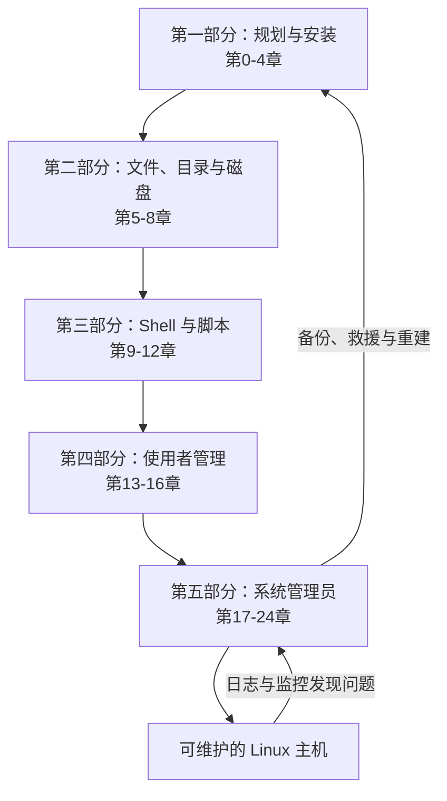

# 《鸟哥的 Linux 私房菜：基础学习篇（第四版）》深度阅读

> 本文的一手来源是用户提供的《鸟哥的 Linux 私房菜——基础学习篇（第四版）》EPUB。文件元数据标注作者为鸟哥、出版日期为 2016-01-25、ISBN 为 `9789863478652`，正文以 CentOS 7.x 为练习环境。EPUB 没有稳定页码，引用统一定位到章、节；短引文保留原书措辞，其余均为归纳。文中的“2026 补充”用于说明书后版本变化，不属于原书内容。

## 一、先看全局：本书究竟在教什么

### Linux、发行版与 Shell 的准确关系

第 1 章把 Linux 的范围说得很清楚：严格地说，Linux 指的是 **Linux kernel（内核）**；用户日常安装的 CentOS、Ubuntu、Debian 等则是 **Linux distribution（Linux 发行版）**，它把内核、GNU 工具、软件包、安装程序和维护机制组合成可直接使用的操作系统。

第 10.1.1 节进一步解释了用户如何操作内核：

> “我们必须要通过‘Shell’将我们输入的指令与 Kernel 沟通，好让 Kernel 可以控制硬件来正确无误的工作。”

因此，本书实际同时教授三层能力：

1. **内核与硬件层**：CPU、内存、磁盘、驱动、进程、启动和内核模块如何工作。
2. **发行版管理层**：CentOS 如何安装、组织目录、管理账号、服务、日志、软件包和系统配置。
3. **用户交互层**：如何通过 Bash、命令行工具、正则表达式和 Shell Script 把管理动作变成可重复流程。

EPUB 元数据中的内容简介给出了官方范围：本书“划分为五大部分”，涵盖“Linux 的规划与安装，认识 Linux 文件、目录与磁盘格式，学习 Shell 与 Shell Scripts，Linux 使用者管理与 Linux 系统管理员”；第四版加入了 CentOS 7.x、GPT、XFS、systemd、日志格式更新、grub2 和 `nmcli` 等内容。

通俗地说，这不是一本只让人背 `ls`、`cd`、`grep` 的命令手册，而是在回答一个更完整的问题：**怎样把一台只有硬件的机器变成可安装、可操作、可共享、可自动化、可诊断、可恢复的 Linux 主机。** 它解决的是新手知识碎片化的问题，也建立了遇到故障时从权限、进程、日志、服务、存储到启动链逐层排查的思维。

### 五大部分如何形成一条管理闭环



```text
学习建议
├─ 第 0～4 章：认识硬件与 Linux，规划磁盘，安装并学会求助
├─ 第 5～8 章：掌握权限、目录、文件系统、压缩与备份
├─ 第 9～12 章：用 vim 编辑，用 Bash、管线、正则和脚本自动化
├─ 第 13～16 章：治理账号、ACL、Quota、RAID/LVM、任务、进程与 SELinux
└─ 第 17～24 章：管理服务、日志、启动、备份、软件、图形系统与内核
```

这种顺序有明确因果关系：没有磁盘规划就无法可靠安装；不知道目录与权限就无法安全地改配置；不会 Shell 与文本处理就难以批量管理；没有账号、进程和 SELinux 的知识就不能安全运行服务；不了解日志、启动和备份，就无法把“能运行”提升为“可维护”。

### Linux 与相邻技术路线的差异

| 比较对象 | 核心管理模型 | 本书所学 Linux 的相对优势 | 需要付出的代价 |
| --- | --- | --- | --- |
| 传统 Unix | 多用户、进程、文件和小工具组合，是 Linux 的思想来源 | Linux 内核与 GNU 生态开放，硬件覆盖广，发行版和软件仓库丰富 | 不同发行版的工具、路径和发布节奏并不完全一致 |
| BSD 系统 | 内核与基本用户空间由同一项目整体发布 | Linux 发行版选择更多，云、容器和商业驱动生态更大 | BSD 的基系统一致性通常更强，Linux 更容易出现发行版差异 |
| Windows Server | GUI、PowerShell、注册表、NTFS ACL、AD 构成主要管理体系 | 文本配置和小工具容易通过 SSH、脚本及版本控制批量复现，最小安装资源占用低 | 学习曲线陡；权限、服务、网络通常要理解多个层次 |
| macOS | Unix 用户空间加 Apple 专有桌面与管理框架 | Linux 更适合服务器、嵌入式和自由定制，内核及发行版不受单一硬件厂商限制 | 桌面软硬件一体化体验通常不如 macOS 集中统一 |
| 只学习容器/Kubernetes | 把应用封装和调度抽象到 OS 之上 | 本书知识能解释容器底层的进程、namespace 之外仍共享的内核、权限、挂载和节点故障 | 先学主机系统比直接使用托管平台更慢，但排障能力更扎实 |

Linux 的优势不是某一条命令更短，而是它把“文件、进程、权限、文本流和可组合工具”组织成相对统一的管理模型。这个模型很适合远程管理、自动化和服务器场景；它的局限也很现实：发行版差异、命令选项复杂，以及错误的 root 操作可能立即影响整台主机。本书通过反复解释原理和练习来降低这些风险。

## 二、逐章解读：25 章各自解决什么问题

| 章节 | 标题 | 核心内容 | 本章给出的解决路径 |
| --- | --- | --- | --- |
| 学习建议 | Linux 的学习曲线，一个老人家的建议 | 学习心态、基本学习流程、架站步骤与基础安全 | 先理解基础和网络，再架站；从日志与错误信息找答案，不急于追逐图形工具 |
| 第 0 章 | 计算机概论 | CPU、内存、总线、存储、数据表示、程序与操作系统 | 用“输入、运算、控制、存储、输出”建立硬件模型，理解软件最终必须由 CPU 执行 |
| 第 1 章 | Linux 是什么与如何学习 | Unix/Linux 历史、GNU/GPL、内核、发行版、应用与学习方法 | 区分 kernel 与 distribution；用实际操作、文档、错误日志和网络资料持续学习 |
| 第 2 章 | 主机规划与磁盘分区 | 硬件兼容、设备文件、MBR/GPT、BIOS/UEFI、目录树与挂载 | 先按用途估算服务和数据，再决定分区、文件系统、启动模式与安装介质 |
| 第 3 章 | 安装 CentOS 7.x | 练习机规划、Anaconda 安装、XFS、LVM、多重开机 | 先固定实验机参数，再按步骤安装；多系统时先规划各系统的 boot loader 控制权 |
| 第 4 章 | 首次登陆与线上求助 | 终端、命令语法、`man`、`info`、nano、同步与关机 | 不知道参数时先读本机手册；关机前观察使用者与进程并让缓存数据写回磁盘 |
| 第 5 章 | Linux 的文件权限与目录配置 | owner/group/others、rwx、`chmod`、`chown`、FHS | 用身份和三组权限控制访问，用 FHS 判断配置、程序、可变数据应放在哪里 |
| 第 6 章 | Linux 文件与目录管理 | 路径、复制移动删除、内容查看、时间、隐藏属性、搜索 | 组合 `cp`、`mv`、`rm`、`less`、`find` 等完成日常维护，并用目录 `x` 权限解释访问失败 |
| 第 7 章 | Linux 磁盘与文件系统管理 | inode/block/superblock、XFS、挂载、`fstab`、swap、链接 | 分区后创建文件系统，再挂载到目录树；用 UUID 持久化挂载，用 `df`/`du` 定位空间问题 |
| 第 8 章 | 文件与文件系统的压缩、打包与备份 | gzip/bzip2/xz、tar、xfsdump/xfsrestore、dd、光盘映像 | 区分“打包”和“压缩”；按文件或文件系统选择备份工具，并实际验证还原 |
| 第 9 章 | vim 程序编辑器 | 一般、编辑、命令行三种模式，搜索替换、区块、多文件、配置 | 先掌握模式切换和保存退出，再学习搜索、替换与多窗口来安全修改系统配置 |
| 第 10 章 | 认识与学习 BASH | Shell、变量、环境、别名、历史、重定向、管线 | 让小命令通过标准输入输出连接，把人工操作转成可保存、可组合的文本流程 |
| 第 11 章 | 正则表达式与文件格式化处理 | BRE/ERE、grep、sed、awk、printf、cut、排序与比较 | 用模式匹配筛选行，用 sed 修改流，用 awk 按字段计算和生成报表 |
| 第 12 章 | 学习 Shell Scripts | shebang、参数、`test`、条件、循环、函数、`sh -x` | 把验证过的命令写成脚本，通过退出状态、分支、循环与调试处理重复工作 |
| 第 13 章 | Linux 帐号管理与 ACL 权限设置 | UID/GID、passwd/shadow/group、useradd、ACL、su/sudo、PAM | 账号文件保存身份，命令维护账号，ACL 补足传统三组权限，PAM 统一认证流程 |
| 第 14 章 | 磁盘配额与进阶文件系统管理 | XFS Quota、软件 RAID、LVM、快照 | Quota 限制个人/群组用量；RAID 在多盘间提供性能或冗余；LVM 抽象容量以便伸缩 |
| 第 15 章 | 例行性工作调度（crontab） | `at`、`cron`、系统 crontab、anacron | 一次任务交给 at，周期任务交给 cron，错过执行时刻的系统任务由 anacron 补做 |
| 第 16 章 | 程序管理与 SELinux 初探 | fork/exec、job control、ps/top、信号、nice、`/proc`、MAC | 观察资源和父子关系后再发信号；用 SELinux 类型与策略限制服务越权，而非直接关闭它 |
| 第 17 章 | 认识系统服务（daemons） | daemon、systemd unit、target、service、socket、timer | 用 `systemctl` 统一启停和开机策略，用 unit 依赖描述服务关系，用 timer 承接定时任务 |
| 第 18 章 | 认识与分析登录文件 | rsyslog、facility/priority、logrotate、journald、logwatch | 从 `/var/log` 与 journal 还原事件，再轮替和压缩旧日志，必要时集中到日志服务器 |
| 第 19 章 | 开机流程、模块管理与 Loader | BIOS/MBR/GRUB2、kernel、initramfs、systemd、模块、救援 | 沿启动链定位失败阶段；用 `modprobe` 管模块，用 GRUB2 菜单和救援环境修复系统 |
| 第 20 章 | 基础系统设置与备份策略 | 网络、时间、语言、硬件信息、完整/累积/差异备份、灾难恢复 | 先定义关键数据、RPO 与介质，再选择备份频率和工具；恢复演练是策略的一部分 |
| 第 21 章 | 软件安装：源代码与 Tarball | gcc、函数库、make/Makefile、configure、动态链接、校验 | 配置、编译、安装并记录路径；用校验值确认来源，用 `ldconfig` 管理动态库缓存 |
| 第 22 章 | 软件安装 RPM、SRPM 与 YUM | RPM 数据库、依赖、查询/校验、SRPM、YUM 仓库 | RPM 提供可查询和卸载的安装记录，YUM 从仓库解析依赖，SRPM 保留重新构建能力 |
| 第 23 章 | X Window 设置介绍 | X Server/Client、Window Manager、Display Manager、Xorg | 分清硬件显示服务与 GUI 应用，依据日志、显卡驱动和 Xorg 配置定位图形故障 |
| 第 24 章 | Linux 核心编译与管理 | 源码、配置、bzImage、module、initramfs、GRUB2 | 只有新硬件、裁剪、嵌入式等明确需求才自编内核；保留旧内核作为可回退启动项 |

> 纠正说明：EPUB 的第 21 章目录把第一节写成“20.1”，正文标题同样如此，这是原电子书编号问题，不应据此把该节归入第 20 章。原稿中部分二级节号也与 EPUB 不符，本文均以 EPUB 的 NCX 目录为准。

## 四、沿一台 Linux 主机的生命周期重组技术点

### 阶段一：从硬件需求到可登录系统（第 0～4 章）

#### 为什么安装之前必须先规划

第 0 章先讲硬件，是为了让后续的容量、性能和兼容性判断有依据。CPU 架构决定可运行的机器码，内存保存执行中的程序与数据，磁盘负责持久化；操作系统则管理硬件并为应用提供接口。第 2 章因此要求先回答主机用途：是桌面、文件服务器还是高负载计算节点？服务不同，CPU、内存、磁盘吞吐、网络和备份需求就不同。

磁盘规划的关键不是“分得越多越专业”，而是让易增长、需隔离、需独立备份的数据有合适边界。原书练习环境以 `/boot`、`/`、swap，并在 LVM 中安排根目录等空间。现代云主机或个人实验机可以简化，但仍要知道 `/var` 日志或数据库写满时可能拖累根文件系统。

```bash
# 原书第 2、7 章使用的观察与分区工具
lsblk
blkid
parted /dev/vda print
gdisk /dev/vda
```

- **CPU**：Central Processing Unit，中央处理器，执行指令并控制运算。
- **RAM**：Random Access Memory，随机存取内存；断电后内容消失。
- **MBR**：Master Boot Record，主引导记录。传统分区表空间小，常见限制为四个主分区和约 2 TiB 磁盘。
- **GPT**：GUID Partition Table，GUID 分区表。支持更大磁盘、更多分区，并保存冗余表头。
- **BIOS**：Basic Input/Output System，传统固件接口。
- **UEFI**：Unified Extensible Firmware Interface，现代固件接口，通常与 GPT 和 EFI System Partition 配合。
- **mount point**：挂载点，把一个文件系统接入 Linux 单一目录树的位置，不等同于 Windows 盘符。

#### 安装、首次登录与自助排错

第 3 章用 CentOS 7 的 Anaconda 安装器完成语言、时间、软件、网络、磁盘和账号设置。第 4 章随即把重点从“点安装界面”转到命令行：命令通常由 `command [-options] parameter1 ...` 组成；大小写不同；过长命令可用反斜线换行；`Tab` 补全可减少拼写错误。

```bash
man date           # 查本机手册；/word 搜索，n 跳到下一处，q 退出
info coreutils     # 阅读带节点结构的 GNU 文档
type cd            # 判断命令是 shell 内建、别名还是外部程序
date --help        # 快速查看选项
sync               # 将缓存中的数据写回磁盘
shutdown -h now    # 原书环境的正确关机方式之一
```

书中反复强调先看错误信息、`man` 和日志。其优势是文档与当前系统版本匹配；局限是手册更像参考资料，不总能给出完整教程。实际排障可按“命令是否存在 → 参数是否正确 → 权限是否足够 → 文件/设备是否存在 → 日志如何记录”逐层检查。

**版本变化**：原书以 CentOS 7、XFS、GRUB2、systemd 为第四版的新环境。CentOS 7 已于 2024-06-30 结束维护；2026 年练习建议使用 Rocky Linux 9 或 AlmaLinux 9。它们仍保留 RHEL 系的目录、systemd、SELinux、XFS 和 RPM 体系，但包管理入口以 DNF 为主。

通俗地说，这一阶段是在“动工前看图纸”：硬件是材料，分区是房间规划，安装器负责施工，`man` 和日志则是随机器交付的维修手册。

### 阶段二：建立文件、目录与权限模型（第 5～6 章）

#### `rwx` 不是三个孤立开关

原书第 5 章用 `ls -l` 的十个字符解释文件类型及 owner、group、others 三组权限。对普通文件，`r` 是读内容，`w` 是修改内容，`x` 是把它作为程序执行；对目录，`r` 是读取文件名列表，`w` 是修改目录项，`x` 是进入目录并访问其中已知名称。删除文件依赖的是**父目录的 `w+x`**，不是文件自身的 `w`，这是权限排错最容易混淆的地方。

```bash
ls -ld /srv/project
chgrp project /srv/project
chmod 2770 /srv/project

# 第 6 章练习中的搜索思路：同时满足大小范围并执行 ls
find /etc -size +50k -a -size -60k -exec ls -l {} \;
```

`2770` 中的 `2` 是目录 SGID：成员在该目录新建的文件会继承目录群组。配合合适的 `umask`，它能解决团队目录中新文件群组不一致的问题。

- **owner/group/others**：文件拥有者、所属群组、其他人，是传统自主访问控制的三类主体。
- **SUID**：Set User ID，仅对可执行二进制程序有效；执行期间取得程序拥有者的有效身份。
- **SGID**：Set Group ID；用于可执行文件时影响有效群组，用于目录时让新项目继承目录群组。
- **SBIT / sticky bit**：黏着位。用于共享目录时，通常只允许文件拥有者、目录拥有者或 root 删除条目，`/tmp` 是典型场景。
- **umask**：创建文件/目录时要移除的权限掩码，不是最终权限值。
- **FHS**：Filesystem Hierarchy Standard，文件系统层次标准。例如 `/etc` 放主机配置，`/var` 放持续变化的数据，`/home` 放普通用户数据。
- **atime/mtime/ctime**：访问时间、内容修改时间、inode 状态修改时间；`ctime` 不是创建时间。
- **chattr/lsattr**：设置和观察文件系统扩展属性，例如 `+a` 只许追加、`+i` 禁止更改。

#### ACL 何时才需要

传统权限只能表达一个 owner、一个 group 和 others。当需要“文件仍归 alice，但额外让 bob 只读”时，第 13 章的 ACL 更合适：

```bash
setfacl -m u:bob:r-- report.txt
getfacl report.txt
setfacl -x u:bob report.txt
```

ACL 的有效权限还受 **mask** 项约束；只看到某条用户 ACL 为 `rwx`，不代表最终一定是 `rwx`。团队共享优先使用群组和 SGID，只有超出三组模型时再增加 ACL，否则权限来源会变得难以审计。

**局限与处理**：`rm -rf`、递归 `chown`、宽泛的 `chmod 777` 都可能扩大事故范围。操作前先用 `pwd`、`ls -ld`、`find ... -print` 确认目标；需要共享时设计群组，不用“所有人可写”代替权限模型。

通俗地说，文件权限不是文件上的一把锁，而是“身份、文件权限、父目录权限、ACL 和 SELinux”共同组成的一串门禁检查。

### 阶段三：让数据可存、可扩、可还原（第 7、8、14、20 章）

#### 从分区到文件系统再到挂载

第 7.1.2 节给出文件系统的三个核心结构：

> “权限与属性放置到 inode 中，至于实际数据则放置到 data block 区块中。另外，还有一个超级区块（superblock）会记录整个文件系统的整体信息。”

这解释了为什么文件名不在 inode 中：目录的数据块保存“文件名 → inode 号”的对应关系；hard link 只是增加一个指向同一 inode 的名称，而 symbolic link 是内容为目标路径的独立文件。Linux 通过 VFS 给 XFS、Ext4 等文件系统提供统一调用接口。

```bash
# 典型的新盘流程，设备名必须按实际 lsblk 结果替换
gdisk /dev/vdb
mkfs.xfs /dev/vdb1
mkdir -p /srv/data
mount /dev/vdb1 /srv/data
df -hT
du -sh /srv/data/*
blkid /dev/vdb1
```

持久挂载应优先使用 UUID，并先验证：

```ini
# /etc/fstab
UUID=<blkid输出的UUID>  /srv/data  xfs  defaults  0  0
```

```bash
mount -a       # 无输出不等于万无一失，还要核对 findmnt/df
findmnt /srv/data
```

- **filesystem**：文件系统，组织和访问持久数据的格式及实现；一个可挂载对象不必等于一个磁盘分区。
- **superblock**：记录文件系统总体状态、容量和结构参数的元数据。
- **inode**：保存文件类型、权限、拥有者、时间和数据块索引等元数据，不保存文件名。
- **data block**：存放文件内容；对目录而言存放目录项。
- **VFS**：Virtual File System，虚拟文件系统，内核对不同文件系统提供的统一抽象层。
- **journal**：日志式文件系统先记录关键元数据变更，以缩短异常断电后的检查和恢复时间；它不等同于业务数据备份。
- **swap**：交换空间，内存压力下暂存不活跃页面，也可能用于休眠；不能替代足够的 RAM。

#### 压缩、打包和备份是三件事

第 8 章区分单文件压缩和 `tar` 打包。`gzip`、`bzip2`、`xz` 的时间/压缩率不同；`tar` 先把多文件和元数据打成一个归档，再选择压缩算法。

```bash
# 原书第 8 章给出的 xz 归档操作形式
tar -Jcv -f etc.tar.xz /etc
tar -Jtv -f etc.tar.xz
mkdir -p /tmp/etc-restore
tar -Jxv -f etc.tar.xz -C /tmp/etc-restore
```

第 14 章再处理容量治理：Quota 按用户或群组限制块数/文件数；软件 RAID 把多盘组合为性能或冗余阵列；LVM 在物理存储和文件系统之间增加 PV、VG、LV 抽象，使容量更易扩展。

```bash
pvcreate /dev/vdb1 /dev/vdc1
vgcreate vgdata /dev/vdb1 /dev/vdc1
lvcreate -L 20G -n lvapp vgdata
mkfs.xfs /dev/vgdata/lvapp

# 扩展 XFS：先扩 LV，再在线扩文件系统
lvextend -L +10G /dev/vgdata/lvapp
xfs_growfs /srv/app
```

- **Quota**：磁盘配额；soft limit 可在宽限期内暂时超过，hard limit 不可超过。
- **RAID**：Redundant Array of Independent Disks，独立磁盘冗余阵列。RAID 0 提升吞吐但无冗余；RAID 1 镜像；RAID 5 用分布式校验容忍一盘失效。
- **LVM**：Logical Volume Manager，逻辑卷管理器。
- **PV/VG/LV/PE**：Physical Volume、Volume Group、Logical Volume、Physical Extent，即物理卷、卷组、逻辑卷和分配基本单位。
- **snapshot**：快照，记录某一时点的数据视图；依赖原存储且会消耗空间，不是异地备份。
- **RPO/RTO**：Recovery Point Objective / Recovery Time Objective，可接受的数据丢失窗口与恢复耗时目标，属于“2026 补充”的灾备术语。

第 20 章强调备份策略要先于工具：确定关键文件、介质、完整或关键备份、频率与还原方式。完整备份之后，累积备份只保存上次任意备份后的变化，恢复要串联多个集合；差异备份保存上次完整备份后的全部变化，占用较大但恢复链更短。`/etc`、`/home`、`/var/spool/mail`、`/boot`、`/root` 是书中列出的典型关键数据，但数据库还必须使用一致性快照或数据库原生备份。

**局限与处理**：RAID 解决磁盘失效，不解决误删、勒索或机房灾害；LVM snapshot 也不是长期备份。采用至少两种介质并保留异机/异地副本，定期在隔离目录实际还原。没有还原演练的备份，只是“尚未验证的副本”。

### 阶段四：从交互编辑到文本流水线（第 9～11 章）

#### vim 的模式为何有价值

vim 把移动/操作与输入文字分开：一般模式负责导航、删除、复制；编辑模式输入文字；命令行模式保存、退出、搜索替换和设置。这使大量编辑动作可以由短命令组合，但初学者最常见的问题也是“不知道当前在哪个模式”。

```vim
i                 " 从光标处进入编辑模式
Esc               " 回一般模式
/PermitRootLogin  " 向下搜索
:set number       " 显示行号
:%s/old/new/gc    " 全文替换且逐项确认
:wq               " 保存并退出
:q!               " 放弃修改退出
```

修改系统配置前可先备份，修改后用对应程序提供的语法检查，而不是仅相信编辑器保存成功。例如 OpenSSH 可运行 `sshd -t`，Nginx 可运行 `nginx -t`。

#### Bash 如何把工具接成流水线

第 10 章称 Bash 是命令行和主机维护的重要基础。Shell 负责解析变量、通配符、重定向、管线和命令替换，再启动外部程序或执行内建命令。

```bash
name='VBird'
export PATH="${PATH}:/opt/tools/bin"

# stdout 覆盖写入；stderr 追加到另一个文件
find /etc -name '*.conf' >files.txt 2>>errors.log

# 前一个命令的标准输出成为后一个命令的标准输入
last | cut -d ' ' -f 1 | sort | uniq -c | sort -nr
```

- **Shell**：操作系统的人机接口；狭义上指 Bash 等命令解释器，广义也可以包括图形界面。
- **Bash**：Bourne Again SHell，GNU 项目的 Shell，兼容并扩展传统 Bourne shell。
- **stdin/stdout/stderr**：标准输入、标准输出、标准错误，对应文件描述符 0、1、2。
- **pipe**：管线 `|`，传递的是前一进程的标准输出，不会自动传递标准错误。
- **redirection**：重定向，改变输入输出的来源或目的地；`>` 覆盖，`>>` 追加。
- **environment variable**：环境变量，由父进程传给子进程；普通 shell 变量只有 `export` 后才进入环境。
- **glob**：Shell 通配符扩展，如 `*`、`?`、`[]`；它与正则表达式不是同一语法。

#### 正则、grep、sed、awk 如何分工

第 11 章强调正则只是表示文本模式的方法，必须由支持它的工具解释。grep 选择行，sed 适合以行为单位删除、替换，awk 适合按字段取值、运算和格式化。

```bash
# BRE：找出非注释且非空的配置行
grep -v '^#' /etc/rsyslog.conf | grep -v '^$'

# ERE：匹配 root 或 mail 开头的行
grep -E '^(root|mail):' /etc/passwd

# sed 只显示第 5 到 10 行
sed -n '5,10p' /etc/passwd

# awk 以冒号分字段，打印账号和 UID
awk -F: '{printf "%-16s %s\n", $1, $3}' /etc/passwd
```

- **BRE/ERE**：Basic / Extended Regular Expression，基础/扩展正则；ERE 原生支持 `+`、`?`、`|`、`()` 等。
- **grep**：Global Regular Expression Print，按模式筛选文本行。
- **sed**：Stream Editor，流编辑器。
- **awk**：字段处理语言，名称来自 Aho、Weinberger、Kernighan 三位作者姓氏首字母。
- **locale**：语言与地区环境，会影响字符范围、排序和某些正则结果；需要字节级稳定结果时常临时设置 `LC_ALL=C`。

**局限与处理**：Shell 对空格、换行和通配符敏感，变量通常应写成 `"$var"`；不要用正则解析具有正式语法的 JSON、XML、YAML，应改用 `jq`、XML 解析器或 `yq`。一条管线适合清晰的文本转换，复杂状态和错误恢复应转向 Python 等结构化语言。

通俗地说，vim 是工作台，Bash 是传送带，grep/sed/awk 是各自只做一道工序的机器。Unix 风格的力量来自组合，而不是每个工具包办一切。

### 阶段五：把重复操作变成脚本和计划任务（第 12、15、17 章）

Shell Script 的第一价值是可重复，第二价值才是“省时间”。原书要求首行声明解释器，说明脚本用途和版本，使用退出状态连接命令，并通过 `test`、条件和循环控制流程。

```bash
#!/bin/bash
# 每日归档示例：结构对应第 12 章的变量、判断和返回值知识

src=/srv/data
dst=/srv/backup
today=$(date +%Y%m%d)

if [ ! -d "$src" ]; then
  echo "source directory does not exist: $src" >&2
  exit 1
fi

mkdir -p "$dst" || exit 2
tar -Jcf "${dst}/data-${today}.tar.xz" "$src"
exit $?
```

```bash
bash -n backup.sh   # 2026 补充：只检查 Bash 语法
bash -x backup.sh   # 对应原书 sh -x 思路：显示展开后的执行轨迹
```

- **shebang**：`#!` 开头的解释器路径，内核据此启动脚本解释器。
- **exit status**：退出状态，0 表示成功，非 0 表示不同错误；`$?` 保存上一条命令状态。
- **test / `[ ]`**：条件测试；方括号本质上也是命令，参数两侧必须留空格。
- **positional parameter**：位置参数，`$0` 是脚本名，`$1` 起是调用参数，`$#` 是参数数目，`$@` 是参数列表。
- **cron**：周期性任务调度服务；个人任务由 `crontab -e` 维护。
- **anacron**：对未持续开机的主机补做错过的日/周/月系统任务，不追求分钟级执行时刻。
- **systemd timer**：第 17.4 节介绍的 systemd 定时单元，可通过 unit 依赖、状态与 journal 统一管理。

```text
# 分 时 日 月 周 命令；每天 02:30 执行
30 2 * * * /usr/local/sbin/backup.sh >>/var/log/backup.log 2>&1
```

`at` 适合只执行一次的未来任务，cron 适合固定周期，anacron 适合可能关机的机器补做系统任务，systemd timer 适合已经由 systemd 管理且需要依赖关系、随机延迟或统一日志的服务。不要在 cron 中假设交互式 Shell 的 `PATH` 和环境变量，命令尽量写绝对路径，并明确保存输出。

**版本与安全边界**：`set -euo pipefail`、ShellCheck 是有价值的现代补充，但 `set -e` 有细微语义，不能替代显式错误处理。密码不应直接出现在脚本、命令行或 Git 中；批量账号示例应使用受控的初始凭据流程，而不是硬编码同一个口令。

### 阶段六：治理身份、资源和存储配额（第 13～14 章）

Linux 判断权限时使用 UID/GID 数字，用户名只是便于人阅读的映射。`/etc/passwd` 保存账号基本字段，密码哈希在权限更严格的 `/etc/shadow`，群组映射位于 `/etc/group` 和 `/etc/gshadow`。这解释了复制磁盘或 NFS 共享中“用户名相同但权限不对”的问题：真正需要一致的是数字 ID。

```bash
useradd -m -s /bin/bash alice
passwd alice
usermod -aG project alice
id alice
chage -l alice

su - alice
sudo -l
```

- **UID/GID**：User ID / Group ID，用户和群组的数字标识；UID 0 是 root。
- **shadow password**：把密码哈希和老化字段从公开可读的 passwd 文件移到仅特权读取的 shadow 文件。
- **PAM**：Pluggable Authentication Modules，可插拔认证模块，让 login、sudo、sshd 等复用认证和账号策略。
- **su**：Substitute User / Switch User，切换身份；`su -` 同时加载目标用户的登录环境。
- **sudo**：按策略让获授权用户以其他身份执行特定命令，并留下审计记录。
- **ACL**：Access Control List，访问控制列表，为特定用户/群组增加细粒度权限。

Quota 同时限制空间块数和 inode/文件数量，适合教学主机、邮件服务、共享空间。原书的 CentOS 7 重点是 XFS 原生 Quota；它必须在挂载时启用相关选项，不能仅运行 `edquota` 就凭空生效。LVM 与 RAID 的角色也不能混淆：LVM 解决容量组织和伸缩，RAID 解决多盘布局与一定程度的故障容忍。

**与集中身份方案比较**：本地账号简单、故障域小，适合单机；机器数量增加后，逐台同步 UID、SSH key 和离职权限不可持续，应使用 FreeIPA/LDAP/SSSD 或云身份方案。无论是否集中化，最小权限、独立普通账号、受控 sudo 都比共享 root 密码更可审计。

### 阶段七：观察进程并用 SELinux 限制损害（第 16 章）

原书区分 program 与 process：程序是磁盘上的可执行文件，进程是程序被载入内存后，连同身份、资源和 PID 形成的运行实体。Linux 常通过 fork 复制进程，再用 exec 载入另一个程序；父子关系可由 `pstree` 观察。

```bash
ps aux
ps -lA
top
pstree -p
vmstat 1 5

kill -TERM 1234   # 先请求程序正常结束
kill -KILL 1234   # 只有无法退出时才强制终止
nice -n 10 long-job
renice 5 -p 1234
```

- **PID/PPID**：Process ID / Parent Process ID，进程号和父进程号。
- **fork/exec**：创建子进程并替换其程序映像的典型组合。
- **foreground/background**：前景进程占用当前终端交互；背景进程可由 `&`、`jobs`、`fg`、`bg` 管理。
- **signal**：异步通知机制。SIGTERM（15）允许程序清理；SIGKILL（9）不可捕获，会立即终止。
- **nice**：用户可调整的调度友好值；不是 CPU 百分比保证。
- **daemon**：常驻后台、提供系统或网络服务的进程。
- **`/proc`**：内核提供的虚拟文件系统，暴露进程和系统状态，不占用普通磁盘文件的数据空间。

传统 `rwx` 属于 DAC（Discretionary Access Control，自主访问控制）。第 16.5 节介绍 SELinux 的 MAC（Mandatory Access Control，强制访问控制）：主体与对象带安全上下文，策略还要允许对应类型间的操作。即使 Unix 权限允许，SELinux 仍可拒绝被攻破的服务读取不属于其职责的数据。

```bash
getenforce
ls -Z /var/www/html
ps -eZ | grep httpd
ausearch -m AVC -ts recent
restorecon -Rv /var/www/html
```

- **SELinux**：Security-Enhanced Linux，安全增强型 Linux。
- **security context**：常见形式为 `user:role:type:level`；日常服务排错最常关注 type。
- **enforcing/permissive/disabled**：执行策略、只记录不阻止、完全停用。disabled 与 permissive 不等价。
- **AVC**：Access Vector Cache，SELinux 访问判定与拒绝日志常见关键字。

**局限与正确排错**：不要把 `setenforce 0` 当修复。先看服务自身日志和 Unix 权限，再查 AVC；如果文件标签偏离默认值，用 `restorecon` 恢复；服务确实需要非默认行为时，优先使用已有 boolean 或持久化 `semanage fcontext` 规则。自动生成本地策略应经过审查，否则可能把攻击路径永久放行。

### 阶段八：把进程变成受控服务，并让日志可追踪（第 17～18 章）

CentOS 7 从 SysV init 转向 systemd，是第四版最重要的变化之一。systemd 把服务、socket、挂载、路径、计时器和启动目标统一表示为 unit，并依据依赖关系并行启动。

| 任务 | SysV/CentOS 6 | systemd/CentOS 7+ |
| --- | --- | --- |
| 启停服务 | `service httpd start/stop` | `systemctl start/stop httpd` |
| 开机启用 | `chkconfig httpd on` | `systemctl enable httpd` |
| 运行级别 | `/etc/inittab`、`runlevel` | `target`、`systemctl get-default` |
| 自定义服务 | `/etc/init.d/` 脚本 | `/etc/systemd/system/*.service` |
| 定时任务 | cron/anacron | cron 或 `.timer` unit |

```bash
systemctl status sshd
systemctl enable --now sshd
systemctl list-unit-files --type=service
systemctl get-default
systemctl daemon-reload
```

```ini
# /etc/systemd/system/report.service
[Unit]
Description=Generate daily report
After=network-online.target

[Service]
Type=oneshot
ExecStart=/usr/local/sbin/report.sh
User=report
Group=report
```

管理员自定义 unit 应放 `/etc/systemd/system/`，发行版提供的 unit 在 `/usr/lib/systemd/system/`；不要直接修改后者，否则软件升级可能覆盖。`After=` 只表达顺序，不自动建立“必须启动”的依赖，必要时还要使用 `Wants=` 或 `Requires=`。

第 18 章把日志描述为事件的“何时、何地、何人、何事”。rsyslog 接收并按 facility/priority 规则写入传统日志，logrotate 定期轮替、压缩和清理；systemd-journald 收集结构化 journal，可按 unit、时间和启动批次过滤。

```bash
journalctl -u sshd
journalctl -b -1             # 上一次启动
journalctl --since today -p warning
tail -F /var/log/messages
logrotate -d /etc/logrotate.conf
```

- **unit**：systemd 的管理对象，如 `.service`、`.socket`、`.target`、`.timer`。
- **target**：一组 unit 的同步目标，取代传统 runlevel 的主要使用方式。
- **journald**：systemd 的日志收集服务，保留字段索引，可按 unit/PID/boot 查询。
- **rsyslog**：兼容 syslog 的日志处理服务，可过滤、落盘和转发远端。
- **facility/priority**：消息来源类别与严重级别。
- **logrotate**：根据大小或周期轮替日志，并控制保留、压缩及服务重开文件。

**局限与处理**：日志本身也会写满磁盘，必须设置保留上限并监控 `/var`；只保存在故障主机上的日志可能随主机一起丢失，重要环境应远端集中。排障时以时间线关联应用、systemd、内核和 SELinux 日志，而不是只盯一条 error。

### 阶段九：理解启动链，保留救援和回退能力（第 19、24 章）

原书给出的启动主线是：

```text
BIOS/固件 → MBR/启动设备 → boot loader（GRUB2）
→ kernel + initramfs → systemd → target 与各项服务
```

在 UEFI 主机上，固件通常从 EFI System Partition 加载 EFI 程序，不再依赖传统 MBR 中的 446-byte boot code，但“固件 → 引导器 → 内核 → initramfs → PID 1”的逻辑仍成立。

```bash
uname -r
lsmod
modinfo xfs
modprobe <module_name>
journalctl -k -b
cat /proc/cmdline
grub2-mkconfig -o /boot/grub2/grub.cfg   # BIOS 路径示例，UEFI 路径依发行版而定
```

- **boot loader**：引导加载器，提供菜单、载入内核并传递参数，也可把控制权交给其他引导器。
- **GRUB2**：GRand Unified Bootloader 2，原书采用的多系统引导器。
- **kernel image**：可启动的内核映像，RHEL 系通常位于 `/boot/vmlinuz-*`。
- **initramfs**：initial RAM filesystem，启动早期的临时根文件系统，提供挂载真实根文件系统所需驱动和脚本。
- **kernel module**：可在运行时装卸的内核功能或驱动，通常位于 `/lib/modules/$(uname -r)/`。
- **dracut**：RHEL 系生成 initramfs 的工具；属于原书启动管理语境中的实用组件。

第 24 章明确提醒普通用户通常不需要自行编译内核。发行版内核提供安全更新、兼容配置和包管理记录；只有需要新功能、裁剪体积、特殊硬件或嵌入式移植时，手工配置与编译才合理。

```bash
# 原书给出的典型编译阶段，不能直接当作所有新内核的通用安装脚本
make mrproper
make menuconfig
make bzImage
make modules
make modules_install
```

**局限与恢复原则**：GRUB 配置应通过生成工具维护，不直接把生成后的 `grub.cfg` 当长期手工配置；升级内核后保留至少一个可启动旧内核。忘记 root 密码或根文件系统损坏时，可从 GRUB/安装介质进入救援环境，但具体参数随发行版和 SELinux 设置变化。涉及 `chroot`、重建 initramfs 或重装引导器前，先确认 BIOS/UEFI 模式、真实根分区和 `/boot`/ESP 挂载位置。

通俗地说，启动链像接力赛。屏幕停在哪一棒，就检查那一棒的输入：固件是否找到设备、GRUB 是否找到内核、initramfs 是否找到根盘、systemd 哪个 unit 失败。

### 阶段十：管理软件的来源、依赖与可追溯性（第 21～22 章）

源码是文本，必须经预处理、编译、汇编和链接成为可执行程序。函数库让程序复用已有能力；静态库常为 `.a`，动态共享库常为 `.so`。`make` 根据 Makefile 的目标和依赖，只重建需要更新的部分。

```bash
# 传统 Tarball 常见流程，实际项目须先读 README/INSTALL
tar -xf package.tar.xz
cd package
./configure --prefix=/usr/local
make
make check
sudo make install

ldd /usr/local/bin/example
ldconfig -p
sha256sum package.tar.xz
```

RPM 则把预编译文件、版本、依赖、脚本和文件清单放入标准软件包，并把安装状态记录到 RPM 数据库。YUM 在 RPM 之上使用仓库元数据解决依赖；SRPM 保存源代码和 spec，可按发行版规则重新构建。

```bash
rpm -q bash
rpm -ql bash
rpm -qf /usr/bin/bash
rpm -V bash
yum repolist
yum install <package>
```

- **GCC**：GNU Compiler Collection，GNU 编译器套件。
- **Makefile**：描述构建目标、依赖与命令的文件；`make` 不是编译器。
- **linker**：链接器，把对象文件与函数库解析为程序或共享库。
- **ABI**：Application Binary Interface，应用二进制接口；预编译包必须匹配架构和相关 ABI。
- **RPM**：原称 Red Hat Package Manager，现常解释为 RPM Package Manager；既指包格式也指底层管理工具。
- **SRPM**：Source RPM，含源代码、补丁与 spec，不是可直接运行的二进制包。
- **YUM**：Yellowdog Updater, Modified，基于仓库管理 RPM 依赖。
- **DNF**：Dandified YUM，现代 RHEL 系的主要包管理器，属于 2026 补充。

**选择原则**：优先使用发行版签名仓库，因为升级、漏洞修复、查询和卸载都可追踪；确需定制编译时，用 RPM spec、容器构建或 `/usr/local` 独立前缀管理，不要让 `make install` 无记录地覆盖系统文件。下载后的散列只能证明文件与给定散列一致，若散列来自同一不可信页面仍不能证明发布者身份；现代环境还应验证仓库签名或上游签名。

### 阶段十一：图形系统是可替换的用户空间组件（第 23 章）

X Window System 采用看似“反向”的 client/server 命名：**X Server** 在用户面前控制显示、键盘和鼠标；**X Client** 是请求绘图的应用。Window Manager 管理窗口位置、边框和重叠，Display Manager 管理图形登录，桌面环境再把它们整合为完整体验。

```bash
echo "$DISPLAY"
startx
systemctl get-default
systemctl isolate graphical.target
```

- **X11**：X Window System 第 11 版协议族。
- **Xorg**：主流 X Server 实现，原书配置重点位于 `/etc/X11/xorg.conf` 与 `xorg.conf.d/`。
- **Window Manager**：窗口管理器，负责窗口布局、焦点和装饰。
- **Display Manager**：显示管理器，提供图形登录并启动会话。
- **DISPLAY**：X Client 用来定位显示服务器和屏幕的环境变量，如 `:0`。

X 的网络透明性和成熟兼容性是优势，安全模型、撕裂和现代显示需求则推动了 Wayland。**2026 补充**：GNOME、KDE 等现代桌面普遍优先使用 Wayland 合成器，XWayland 为旧 X11 应用提供兼容。服务器最小安装通常不需要图形栈；远程管理也优先使用 SSH，而不是暴露未加保护的 X 服务。

## 五、可复现的现代练习环境

原书安装界面已过时，但核心实验仍适合 RHEL 兼容发行版。以下选择 **Rocky Linux 9 最新 9.x 最小安装版**：它比 CentOS 7 安全、仍使用 systemd、SELinux、RPM/DNF 和 XFS，与书中技术路径接近。WSL 或 Docker 只能覆盖部分章节，无法完整练习分区、GRUB、内核和真实 systemd 启动。

### 1. 准备虚拟机

1. 从 Rocky Linux 官方站下载 9.x Minimal ISO，并同时下载官网提供的 `CHECKSUM`。
2. 在 Windows PowerShell 中校验：

   ```powershell
   Get-FileHash .\Rocky-9-*-x86_64-minimal.iso -Algorithm SHA256
   ```

3. 将输出与官方 SHA-256 比对。校验通过后再挂载 ISO。
4. 在 Hyper-V、VMware Workstation 或 VirtualBox 新建一台 UEFI 虚拟机：2 个 vCPU、4 GiB RAM、40 GiB 动态磁盘、NAT 网络。
5. 再添加一块 10 GiB 空白虚拟盘，供第 7、14 章练习；不要对宿主机真实磁盘执行分区命令。

### 2. 安装 Rocky Linux

1. 从 ISO 启动，选择 `Install Rocky Linux 9`。
2. 选择语言、时区和键盘；打开网络并记录 DHCP 地址。
3. `Software Selection` 选择 `Minimal Install`。
4. `Installation Destination` 只勾选 40 GiB 系统盘。初学者可选自动分区；想复现原书则选自定义，建立 EFI System Partition、`/boot`、LVM 中的 `/` 和 swap。
5. 创建普通用户并授予管理员权限。root 可设置强密码，但日常使用普通用户加 sudo。
6. 完成安装、移除 ISO、重启并登录。

### 3. 首次更新与工具安装

```bash
sudo dnf upgrade --refresh -y
sudo dnf install -y vim-enhanced bash-completion man-pages \
  tar xz rsync lvm2 mdadm quota git policycoreutils-python-utils
sudo systemctl enable --now chronyd
sudo reboot
```

重启后记录实验基线：

```bash
cat /etc/os-release
uname -r
lsblk -f
findmnt
getenforce
systemctl --failed
journalctl -b -p warning
```

### 4. 建立非破坏性实验区

```bash
mkdir -p ~/linux-lab/{files,scripts,backup}
cd ~/linux-lab
printf 'alpha:10\nbeta:20\ngamma:30\n' > files/sample.txt
cp files/sample.txt backup/sample.txt.orig
```

先在 `~/linux-lab` 练习 `cp`、`mv`、`chmod`、grep/sed/awk、tar 和脚本。涉及 `gdisk`、`mkfs`、LVM、RAID 的练习只使用新增的 10 GiB 虚拟盘，并在每一步用 `lsblk` 核对设备名。

### 5. 按章节验收环境

```bash
man bash                         # 第4章：本机文档
stat ~/linux-lab/files/sample.txt # 第5-6章：权限与时间
df -hT                          # 第7章：文件系统
tar -Jcf ~/linux-lab/backup/files.tar.xz ~/linux-lab/files # 第8章
awk -F: '{print $1}' /etc/passwd | head # 第11章
systemctl list-timers           # 第15、17章
ps -ef | head                   # 第16章
journalctl -b --no-pager | tail # 第18章
rpm -qf /usr/bin/bash           # 第22章
```

### WSL 与容器的适用边界

WSL2 适合第 4～13 章的命令、权限、Shell 与文本练习，现代 WSL 可启用 systemd；但其启动链、内核和磁盘设备由 Windows/WSL 管理，不适合完整复现第 2、3、7、19、24 章。Rocky/Alma 容器适合 Bash、RPM/DNF 和文本处理，但通常没有完整 PID 1、GRUB、独立内核，也不能把容器内 root 等同于普通虚拟机 root。

## 六、第四版知识在 2026 年如何迁移

| 原书技术语境 | 2026 年常见方案 | 不变的底层知识 | 迁移时的注意点 |
| --- | --- | --- | --- |
| CentOS 7（已 EOL） | Rocky/AlmaLinux 9、RHEL 9/10、CentOS Stream，或 Ubuntu/Debian | 进程、权限、挂载、Shell、TCP/IP | 发行生命周期和仓库命令不同；不要继续把 CentOS 7 暴露到生产网络 |
| YUM | DNF（RHEL 系），APT（Debian 系） | 软件包、依赖、仓库、签名 | `yum` 常是兼容入口；自动化中应明确目标发行版 |
| iptables 规则思路 | firewalld + nftables | 包过滤、状态、端口、区域/策略 | 不要同时用多个前端修改规则而不理解最终 nftables ruleset |
| Xorg/X11 | Wayland + XWayland | 图形栈仍分应用、合成器/显示服务和驱动 | 远程显示、输入注入、显卡排错方法与 X11 有明显差异 |
| 单机手敲配置 | Ansible、镜像构建、cloud-init | 命令、配置文件、幂等结果 | 自动化前必须先理解单机命令的副作用和验证方式 |
| 本地进程与 systemd | Podman/Docker、Kubernetes | 进程、cgroup、权限、网络、挂载、日志 | 容器共享宿主机内核；节点层排障仍依赖本书知识 |
| 本地 passwd/group | FreeIPA/LDAP/SSSD、云 IAM | UID/GID、认证、授权、最小权限 | 集中身份不能替代主机 sudo、文件权限和服务隔离 |
| 单机日志 | journald/rsyslog + Loki/ELK/OpenSearch | 时间线、严重级别、事件关联 | 集中采集要处理时钟同步、敏感字段、保留成本和访问控制 |
| 手工备份到另一目录 | 快照 + 对象存储 + 不可变/异地副本 | 完整、增量、差异、RPO/RTO、恢复演练 | 同盘副本和 RAID 仍不是备份；必须测试恢复 |

更现代不等于可以跳过本书。Podman 容器最终仍是受 namespace、cgroup、capability、SELinux 和挂载约束的 Linux 进程；Kubernetes 节点仍由 systemd 启动服务、由内核调度进程、由文件系统保存数据、由 journal 提供故障线索。真正需要更新的是具体发行版、命令入口和安全默认值，而不是文件、进程、权限、文本流、日志和恢复这些基本模型。

## 七、阅读与实践建议

第一遍按原书顺序完成第 0～12 章，目标是能独立安装虚拟机、读手册、解释权限、挂载新盘，并写出有判断和退出状态的脚本。第二遍学习第 13～20 章，每一章都制造一个可恢复故障：ACL mask 限制、磁盘空间不足、失败的 service、日志轮替、错误的非关键挂载项，再沿日志和状态修复。第 21～24 章不必追求背下内核编译选项，重点是理解“软件从哪里来、系统如何知道它安装了什么、启动如何回退”。

可以用一个贯穿式实验检验是否真正读懂：创建 `project` 群组和共享目录，用 SGID/ACL 控制两名用户；为数据建立 LVM 逻辑卷并挂载；写脚本归档目录，用 systemd timer 执行；故意让脚本失败，通过 `systemctl status` 和 `journalctl` 定位；最后从备份还原并核对权限、拥有者和 SELinux 标签。它把文件、身份、存储、脚本、服务、日志和恢复连接成了本书真正想建立的系统管理能力。

> 版权说明：本文只保留用于分析的少量原文短引和功能性命令片段，没有整章转载。书中命令基于 CentOS 7，任何分区、格式化、删除、账号和引导操作都应先在可回滚虚拟机中验证。
