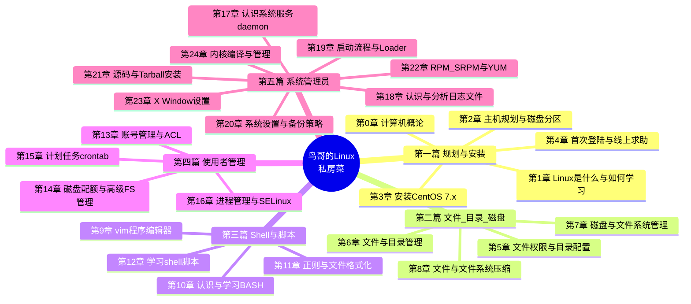

# 《鸟哥的 Linux 私房菜：基础学习篇（第四版）》深度阅读指南

> 本指南严格基于**真实文本**做转述与分析（不整章转载），章节结构以出版社官方目录（五大部分、第 0 章+24 章）为准。书中代码与命令均为"功能性说明片段"。技术书普遍滞后，文中凡出版年（2018）之后才演进的内容，一律标注「书后演进」。

---

## 一、整体理解与逻辑结构（全书层面）

### 【全局摘要】

**书中官方表述（转述自书中第 1 章"Linux 是什么"与出版社内容简介）**

- 鸟哥在书中将 **Linux 定义为"操作系统最底层的核心（Kernel）及其提供的核心工具"**；而我们能"安装使用"的，是经过各厂商/社区打包的 **Linux distribution（发行版）**——即"Linux Kernel + 自由软件工具（Tools）+ 可完整安装的程序"。
- 出版社官方简介写道：本书"划分为五大部分……涵盖 Linux 的规划与安装，认识 Linux 文件、目录与磁盘格式，学习 Shell 与 Shell Scripts，Linux 用户管理与 Linux 系统管理"，并强调第四版新增"GPT 分割表、XFS 文件系统、systemd 服务管理、grub2 开机管理、nmcli 文字指令操作网络参数"等近期技术。

**通俗易懂地讲**

- 把一台裸机变成"能用的 Linux 计算机"，中间要跨过一道道关卡：先看懂计算机硬件在干什么（第 0 章），再决定怎么分区、装什么系统（第 2–3 章），然后学会用命令行跟它对话（第 4、10 章），搞清楚文件和权限（第 5–6 章），学会让机器按脚本自动干活（第 12 章），管理好"有哪些人能用、能用多少资源"（第 13–14 章），最后还得会开机、看日志、装软件、做备份（第 17–24 章）。这本书就是带着你**一步步走完这条"系统生命周期"**的地图。
- **它解决的"问题"**：新手面对 Linux 最大的障碍不是某一条命令，而是"不知道从哪开始、概念串不起来"。鸟哥用"先懂原理、再上手操作、出了问题知道去哪查"的节奏，把零散知识点织成一张网——这正是它区别于碎片化教程的价值。

### 【逻辑框架图】

**1）Mermaid 思维导图（五大部分骨架）**



**2）"系统从裸机到运维"的生命周期流程（本指南第四节的编排依据）**

```
[规划硬件]→[磁盘分区 MBR/GPT]→[安装 CentOS]→[首次登陆/基础命令]
   →[文件权限与目录]→[磁盘与文件系统]→[Shell 与重定向/管线]
   →[正则与文本处理]→[Shell 脚本自动化]→[账号/ACL/Quota]
   →[crontab 计划任务]→[进程与 SELinux]→[systemd 服务管理]
   →[开机流程 grub2]→[日志/备份]→[软件安装 RPM/YUM/Tarball]
   →[（书后）容器/云原生/安全加固]
```

### 【与主流/历史替代技术的对比】

下表比较"以**命令行 + 文本配置**为核心的 Linux 系统学习方式/管理范式"与几类替代方案：

| 维度            | 本书范式：CLI + 文本配置（Linux/Unix 哲学） | Windows 图形化 + 注册表管理 | macOS（Unix-like 但封闭生态） | 只学容器/云原生（不碰底层 OS） | 其它图形化 Linux 发行版（如 Ubuntu 桌面） |
| --------------- | ------------------------------------------- | --------------------------- | ----------------------------- | ------------------------------ | ----------------------------------------- |
| **关注点分离**  | 高：配置即文件，职责清晰                    | 低：GUI 与注册表混杂        | 中：底层 Unix，上层封闭       | 中：关注应用不关注 OS          | 中：GUI 隐藏了大量细节                    |
| **可维护性**    | 高：脚本可版本化、可复现                    | 中：点多易错、难批量        | 中：靠 Apple 生态约束         | 高（应用层）：镜像即环境       | 低：GUI 操作难审计                        |
| **复用/自动化** | 高：一条命令/脚本处处可用                   | 低：桌面操作难复用          | 中：终端可用但受限            | 高：Dockerfile/K8s 声明式      | 低：GUI 操作不可移植                      |
| **标准化**      | 高：POSIX/bash 跨发行版通用                 | 低：Windows-only            | 中：BSD 工具链略有差异        | 高：OCI 标准                   | 中：发行版差异大                          |
| **性能/资源**   | 高：无 GUI 开销，服务器首选                 | 低：图形与后台开销大        | 中：消费级硬件优化好          | 取决于底座                     | 低：桌面环境吃资源                        |
| **学习曲线**    | 陡：需记命令与概念                          | 平缓：鼠标即所得            | 平缓偏中                      | 中：概念抽象但上手快           | 平缓                                      |
| **适用场景**    | 服务器、运维、DevOps、嵌入式                | 个人办公、企业桌面          | 创作/开发个人机               | 微服务部署、CI/CD              | 桌面日常、轻量开发                        |

**一段总结**：本书代表的是"**先理解操作系统本身、再谈上层应用**"的 CLI 范式——它不性感，却是服务器世界的事实标准，也是运维/DevOps/SRE 的硬通货。图形化方案（Windows、Ubuntu 桌面）上手快但把"原理"藏起来了，遇到诡异故障往往无从下手；而只学容器/云原生则像"在别人铺好的地板上跳舞"，一旦底座出问题就抓瞎。鸟哥的路线是"**把地板自己铺一遍**"，短期慢、长期稳。代价是学习曲线陡——这正是本书用"絮叨式"反复举例要消解的痛点。

---

## 二、分章节解读（以表格提炼核心内容）

> 结构依据出版社官方目录（五大部分、第 0 章+24 章）。"关键例证"落到具体小节。

| 章节     | 标题内容                          | 核心内容                                                                                            | 关键例证/数据（如有）                                                                    |
| -------- | --------------------------------- | --------------------------------------------------------------------------------------------------- | ---------------------------------------------------------------------------------------- |
| 第 0 章  | 计算机概论                        | 计算机硬件五大单元（CPU/内存/输入/输出/外部）、CPU 架构、数据存储单位、软件分层（机器码 →OS→ 应用） | 0.1.2 "一切设计的起点：CPU 的架构"；0.6 计算单位（容量 KB/MB、速度 Hz）                  |
| 第 1 章  | Linux 是什么与如何学习            | Linux 与 Unix 历史、GNU/自由软件、内核版本号含义、发行版概念、学习方法论                            | 1.1.1 "Linux 是操作系统还是应用程序？"；1.2.5 内核版本（主.次.释出）；1.4 鸟哥的学习建议 |
| 第 2 章  | 主机规划与磁盘分区                | 硬件与 Linux 设备文件名映射、MBR vs GPT 分区表、BIOS vs UEFI、安装前规划                            | 2.2.2 MBR(MS-DOS) 与 GPT 分区表；2.2.3 BIOS 与 UEFI 启动检测；2.3.4 两个实际案例         |
| 第 3 章  | 安装 CentOS 7.x                   | 练习机分区规划、虚拟机创建、安装模式选择、多重开机                                                  | 3.1 分区参数规划；3.3 多重开机安装流程与管理                                             |
| 第 4 章  | 首次登陆与线上求助                | 首次登陆、命令行下达格式、man/info 线上求助、nano 编辑器、正确关机                                  | 4.2 文字模式指令下达；4.3 man page 与 info page；4.5 正确关机方法                        |
| 第 5 章  | 文件权限与目录配置                | 使用者/群组/其他人三元模型、rwx 权限、默认权限 umask、特殊权限 SUID/SGID/SBIT、FHS 目录配置         | 5.2 Linux 文件权限概念；5.3 Linux 目录配置（FHS）                                        |
| 第 6 章  | 文件与目录管理                    | 相对/绝对路径、目录与文件操作（cd/ls/cp/rm/mv）、文件内容查阅（cat/more/less/head/tail）            | 6.1 目录与路径；6.3 文件内容查阅                                                         |
| 第 7 章  | 磁盘与文件系统管理                | 文件系统结构（inode/block/superblock）、挂载点、df/du、磁盘分区与格式化、/etc/fstab                 | 7.1 认识 EXT4 文件系统；7.2 文件系统的简单操作；挂载概念                                 |
| 第 8 章  | 文件与文件系统的压缩              | 常见压缩格式（gzip/bzip2/xz）、tar 打包、dump/restore、dd                                           | 8.1 gzip/bzip2/xz；8.2 tar 打包；8.4 dd                                                  |
| 第 9 章  | vim 程序编辑器                    | vi/vim 三种模式（一般/编辑/命令行）、常用操作、配置文件 ~/.vimrc                                    | 9.1 vi 与 vim；9.3 整本编辑（区块选择、多窗口）                                          |
| 第 10 章 | 认识与学习 BASH                   | 变量与变量内容、环境变量、别名、历史命令、管线 `\|`、重定向 `>` `>>` `2>`、正则基础、万用字符       | 10.2 变量；10.4 BASH 环境；10.5 管线命令；10.6 提取命令（cut/grep/sort/uniq/wc）         |
| 第 11 章 | 正则表达式与文件格式化            | 基础/延伸正则、grep、sed（行编辑）、awk（字段处理）、文件格式化（printf）                           | 11.1 正则基础；11.2 grep；11.3 sed；11.4 awk                                             |
| 第 12 章 | 学习 shell 脚本                   | 脚本结构（shebang/注释/逻辑）、判断式（test/`[ ]`）、循环（for/while/until）、函数、追踪调试        | 12.1 脚本编写；12.3 条件判断；12.4 循环；12.6 脚本追踪调试（sh -x）                      |
| 第 13 章 | Linux 账号管理与 ACL 权限设置     | UID/GID、/etc/passwd、shadow、group、用户/群组管理命令、ACL 访问控制列表                            | 13.1 账号配置文件；13.4 账号管理；13.5 ACL（setfacl/getfacl）                            |
| 第 14 章 | 磁盘配额(Quota)与高级文件系统管理 | Quota 限制（容量/文件数）、软硬限制、LVM 逻辑卷、软件磁盘阵列 RAID、快照                            | 14.1 Quota；14.2 软硬限制；14.3 LVM；14.4 软件 RAID                                      |
| 第 15 章 | 计划任务(crontab)                 | 循环任务 crontab、系统级 /etc/crontab、可唤醒停机期间任务的 anacron                                 | 15.1 循环任务 crontab；15.2 系统配置文件；15.3 anacron                                   |
| 第 16 章 | 进程管理与 SELinux 初探           | 进程查看（ps/top）、信号（kill）、job 控制、SELinux 三种模式、安全上下文                            | 16.1 进程查看；16.3 信号 kill；16.4 SELinux（enforcing/permissive/disabled）             |
| 第 17 章 | 认识系统服务(daemon)              | 早期 init 与 systemd 对比、unit/target 概念、systemctl 管理、网络管理 nmcli                         | 17.1 daemon 与 service；17.2 systemd（unit/target）；17.3 systemctl；17.4 nmcli          |
| 第 18 章 | 认识与分析日志文件                | rsyslog 服务、日志轮替 logrotate、journald（systemd 日志）、分析工具                                | 18.1 日志文件；18.2 rsyslog；18.3 logrotate；18.4 systemd-journald                       |
| 第 19 章 | 启动流程、模块管理与 Loader       | 启动流程（BIOS/UEFI→grub2→kernel→initramfs→systemd）、内核模块、grub2 配置、忘密码救援              | 19.1 启动流程；19.2 内核模块；19.3 Boot Loader（grub2）；19.4 忘 root 密码救援           |
| 第 20 章 | 基础系统设置与备份策略            | 网络/日期/语言设置、服务管理、备份策略（完整/差异/增量）、dd/rsync 备份                             | 20.1 系统设置；20.3 备份策略；20.4 备份工具                                              |
| 第 21 章 | 软件安装：源代码与 Tarball        | 源码编译四步（configure→make→make install）、gcc 与 make、Tarball 安装、函数库管理 ldconfig         | 21.1 源码编译；21.2 make；21.3 Tarball 安装；21.5 函数库                                 |
| 第 22 章 | 软件安装 RPM、SRPM 与 YUM         | RPM 包管理（安装/查询/验证）、SRPM 重建、YUM 在线仓库与依赖解决                                     | 22.1 RPM；22.3 SRPM；22.4 YUM                                                            |
| 第 23 章 | X Window 设置介绍                 | X11 架构（X Server/Client）、display manager、窗口管理器、桌面环境                                  | 23.1 X Window；23.2 X Server/Client；23.3 窗口管理器                                     |
| 第 24 章 | Linux 内核编译与管理              | 内核源码获取、内核模块、编译内核步骤、/proc 与 /sys 虚拟文件系统                                    | 24.1 内核与内核模块；24.2 编译内核；24.3 /proc 与 /sys                                   |

---

## 四、按"系统生命周期"顺序的技术点归纳（每点九段式）

> 编排顺序对应上文"生命周期流程"，覆盖书中核心能力。每点按：**背景/作用/用法代码/术语扩展/版本变化/主流对比/实际应用/局限方案/通俗概括** 九段展开。

### 技术点 1：磁盘分区与挂载（第 2、3、7 章 + 19 章）

1. **背景与解决的问题**：装系统第一道关——"硬盘怎么切、系统装哪、数据盘怎么挂"。混乱的分区规划会导致空间不够、无法多重开机、数据无处安放。
2. **作用与应用场景**：规划 MBR/GPT 分区表、决定启动方式（BIOS/UEFI）、设定挂载点把磁盘"接"进目录树。场景：装机、加硬盘、做 LVM。
3. **使用方法（功能性片段）**：
   ```bash
   # 查看设备与分区
   lsblk
   # 交互式分区（GPT 推荐）
   gdisk /dev/sda
   # 格式化
   mkfs.xfs /dev/sda1
   # 挂载到目录树
   mount /dev/sda1 /data
   # 开机自动挂载需写入
   # /etc/fstab : /dev/sda1 /data xfs defaults 0 0
   ```
4. **术语扩展**：**MBR**（Master Boot Record，主引导记录，磁盘最前 512 字节，分区表仅 64 字节 → 最多 4 主分区、单盘 ≤2TB）；**GPT**（GUID Partition Table，GUID 分区表，支持>2TB、128+分区）；**UEFI**（Unified Extensible Firmware Interface，统一可扩展固件接口，取代 BIOS）；**挂载（mount）**：把"设备"挂到"目录树的某个点"，Linux 没有 C:/D: 盘符概念。
5. **与旧版本变化**：

   | 项目     | 旧（第三版 / CentOS 5·6 时代） | 新（第四版 / CentOS 7） |
   | -------- | ------------------------------ | ----------------------- |
   | 分区表   | 以 MBR 为主                    | 推荐 **GPT**            |
   | 文件系统 | ext3 为主                      | **XFS**（默认）         |
   | 启动固件 | BIOS                           | **UEFI**（并存 BIOS）   |
   | 查看命令 | `fdisk`                        | `gdisk`/`lsblk` 推荐    |

6. **与主流技术对比优势**：相对 Windows 的"盘符 + 自动挂载"，Linux 的"挂载点 + fstab"**统一了存储与目录树**，可把任意设备挂到任意路径，便于做存储池、迁移、LVM 扩展，标准化且脚本可控。
7. **实际应用（挂载数据盘并持久化）**：
   ```bash
   mkfs.xfs /dev/sdb1          # 格式化新盘
   mkdir -p /data
   mount /dev/sdb1 /data       # 临时挂载
   # 写入 fstab 实现开机自动挂载（UUID 更稳）
   blkid /dev/sdb1             # 取 UUID
   # /etc/fstab 追加：
   # UUID=xxxx /data xfs defaults 0 0
   mount -a                    # 验证 fstab 无错
   ```
8. **局限性与解决方案**：`/etc/fstab` 写错会导致**起不来机**；解决：救援模式挂载根盘改回，或先用 `mount -a` 验证。MBR 的 2TB/4 分区限制 → 改用 GPT。
9. **通俗概括**：分区像"给仓库划隔间"，挂载像"给隔间挂上门牌（目录）"；GPT 是更现代、容量更大的隔间方案。

### 技术点 2：文件权限与目录配置（第 5 章）

1. **背景与解决的问题**：多用户系统里"谁能看/改/执行什么文件"必须受控，否则一人误删全盘遭殃。
2. **作用与应用场景**：用"拥有者/群组/其他人"三元模型 + rwx 控制访问；umask 决定新建文件默认权限；FHS 规定目录该放哪。
3. **使用方法**：
   ```bash
   ls -l file            # 看权限，如 -rwxr-xr--
   chmod 755 file        # 数字法：属主rwx、群组rx、其他rx
   chown user:group file # 改拥有者
   umask 022             # 新建文件默认 644、目录 755
   setfacl -m u:alice:rwx file   # ACL 给单用户加权限
   ```
4. **术语扩展**：**rwx**（read/write/execute，读/写/执行）；**SUID**（Set User ID，执行时以"文件拥有者"身份运行，如 `passwd`）；**SGID**（Set Group ID，目录下新建文件继承群组）；**SBIT**（Sticky Bit，仅文件拥有者可删，如 `/tmp`）；**FHS**（Filesystem Hierarchy Standard，文件系统层次标准，`/etc` 配置、`/var` 变量数据、`/usr` 只读程序）。
5. **与旧版本变化**：传统权限外，第四版强化 **ACL**（访问控制列表）作为"精细到单用户/单群组"的补充，弥补了 rwx 三元不够细的短板。
6. **与主流技术对比优势**：比 Windows 的 ACL（GUI 勾选）更**文本化、可脚本化**；rwx 数字法极简且跨发行版通用。相对"每个应用自己搞鉴权"，OS 级权限是统一底座。
7. **实际应用（团队共享目录）**：
   ```bash
   groupadd dev
   usermod -aG dev alice; usermod -aG dev bob
   chgrp dev /srv/project
   chmod 2775 /srv/project   # SGID：组内成员新建文件自动归 dev 组
   ```
8. **局限性与解决方案**：rwx 三元对"单用户额外授权"无能为力 → 用 ACL（`setfacl`）；ACL 需文件系统挂载时开启 `acl` 选项。
9. **通俗概括**：权限就是"门禁卡"——你是房主、是同事、还是陌生人，决定你能进/改/用。ACL 是给特定人发临时 VIP 卡。

### 技术点 3：BASH 与命令行（第 4、10 章）

1. **背景与解决的问题**：图形界面点不过来、也批量化不了；命令行是把"操作"变成"可记录、可重复、可组合"的指令。
2. **作用与应用场景**：变量、环境变量、别名、历史命令、管线（把命令串成流水线）、重定向（控制输入输出去向）。场景：日常运维、脚本预处理、日志分析。
3. **使用方法**：
   ```bash
   VAR="hello"; echo $VAR          # 变量
   export PATH=$PATH:/opt/bin       # 环境变量
   ls -l | grep log | wc -l         # 管线：列出→筛选→计数
   command > out.txt 2>&1           # 标准输出与错误都进文件
   cat < in.txt                     # 标准输入来自文件
   echo "$(date) done"              # 命令替换
   ```
4. **术语扩展**：**stdin/stdout/stderr**（标准输入/输出/错误，文件描述符 0/1/2）；`2>&1`（把"错误"重定向到"输出"的去向）；`|`（管线，前命令输出作后命令输入）；`$(...)`（命令替换）；**alias**（命令别名）；**HISTSIZE**（历史命令条数）。
5. **与旧版本变化**：bash 4+ 支持 `&>` 合并重定向、`{a,b}` 大括号展开等更简洁写法；相对早期 sh，bash 多了数组、补全、作业控制。
6. **与主流技术对比优势**：相对 Windows CMD/PowerShell，bash 的**管线哲学（小工具组合）**更轻、生态更庞大；相对 GUI，命令可进脚本、可版本化。
7. **实际应用（统计某日错误日志行数）**：
   ```bash
   grep "ERROR" /var/log/app.log | grep "2026-07-30" | wc -l
   ```
8. **局限性与解决方案**：管线链一长难调试 → 用中间文件或 `tee` 分步；变量未引号包裹遇空格断裂 → 养成 `"$VAR"` 加双引号习惯。
9. **通俗概括**：命令行像"乐高"——每个小命令是一块积木，管线 `|` 把它们拼成流水线，重定向 `>` 决定成品往哪放。

### 技术点 4：正则表达式与文本处理三剑客（第 11 章）

1. **背景与解决的问题**：日志、配置、数据文件都是"文本"，要从中抽信息、做替换、做统计，靠肉眼不行。
2. **作用与应用场景**：grep 筛选、sed 行编辑（替换/删除）、awk 按字段处理（报表）。场景：日志分析、数据清洗、批量改名。
3. **使用方法**：
   ```bash
   grep -E "^[0-9]+" file        # 延伸正则：行首数字
   sed 's/old/new/g' file        # 全局替换
   awk -F: '{print $1}' /etc/passwd   # 以:分割，取第一字段（用户名）
   awk '$3 > 1000 {print $1}' /etc/passwd  # UID>1000 的用户
   ```
4. **术语扩展**：**正则**（Regular Expression，描述文本模式的规则）；**基础正则 BRE**（`^ $ . * []` 等，部分需转义）；**延伸正则 ERE**（`grep -E`/`egrep`，支持 `+ ? | ()` 免转义）；**sed**（Stream EDitor，流编辑器）；**awk**（以字段为单位处理的语言，名字取自三位作者 Aho/Weinberger/Kernighan）。
5. **与旧版本变化**：本书区分基础/延伸正则；现代 GNU 工具（grep -P 支持 PCRE）更强大，属「书后增强」可补充。
6. **与主流技术对比优势**：相对 Excel 手动处理、相对 Python 写全量脚本，**三剑客在"一次性、管道内"的文本变换上更快更轻**，且天然可嵌入管道。
7. **实际应用（提取 Nginx 访问 IP top 5）**：
   ```bash
   awk '{print $1}' access.log | sort | uniq -c | sort -rn | head -5
   ```
8. **局限性与解决方案**：正则贪婪匹配易出错 → 用 `[^"]*` 等非贪婪替代；复杂逻辑 awk 不够 → 交给 Python。
9. **通俗概括**：正则像"模糊搜索的语法"，三剑客是"文本的剪刀、胶水和算盘"。

### 技术点 5：Shell 脚本自动化（第 12 章）

1. **背景与解决的问题**：重复的手工命令既慢又易错；把命令"写进文件"就成了可复用的程序。
2. **作用与应用场景**：系统巡检、批量建用户、自动备份、部署前检查。场景：运维日常、CI 前置步骤。
3. **使用方法**：
   ```bash
   #!/bin/bash
   # 备份脚本示例
   SRC=/data; DST=/backup/$(date +%F).tar.gz
   if [ ! -d "$SRC" ]; then echo "源不存在"; exit 1; fi
   tar -zcf "$DST" "$SRC" && echo "备份完成: $DST"
   ```
   调试：`sh -x script.sh`（追踪每一步展开）。
4. **术语扩展**：**shebang**（`#!` 指定解释器）；**test / `[ ]`**（条件测试）；**exit code**（0 成功、非 0 失败，`$?` 取上次结果）；**for/while/until**（循环）；**function**（函数，复用代码块）。
5. **与旧版本变化**：相对早期 sh，bash 脚本支持数组、`[[ ]]` 更安全的判断、`(( ))` 算术；现代还流行用 `set -euo pipefail` 让脚本遇错即停。
6. **与主流技术对比优势**：相对 Python/Go 写运维工具，shell 脚本**零依赖、紧贴系统命令、起步极快**；劣势是复杂逻辑难维护——这就是 Python 补位的地方。
7. **实际应用（批量创建用户）**：
   ```bash
   for u in alice bob carol; do
     useradd "$u" && echo "$u:Init123" | chpasswd
   done
   ```
8. **局限性与解决方案**：文本处理用 shell 循环慢 → 交给 awk；跨平台差异 → 用 `#!/usr/bin/env bash` 并避免 GNU 专属特性；缺乏类型 → 复杂逻辑迁 Python。
9. **通俗概括**：脚本就是"把你会一步步敲的命令，提前写下来让机器替你敲"。

### 技术点 6：账号管理与 ACL / Quota（第 13、14 章）

1. **背景与解决的问题**：一台机器多人用，必须知道"谁是谁、能占多少资源"，否则有人把磁盘写满拖垮全员。
2. **作用与应用场景**：创建/删除用户与群组、配置 UID/GID、用 ACL 做精细授权、用 Quota 限制磁盘用量。场景：服务器多用户、共享主机。
3. **使用方法**：
   ```bash
   useradd -m -s /bin/bash alice
   passwd alice
   usermod -aG wheel alice        # 加入管理员组
   setfacl -m u:bob:rx /home/alice # 单用户授权
   quotacheck -avug; quotaon -avug # 启用 Quota
   edquota alice                  # 设软/硬限制
   ```
4. **术语扩展**：**UID**（User ID，用户数字标识，0=root，1–999=系统账号，1000+=普通用户）；**GID**（Group ID）；**/etc/passwd**（账号信息，含 shell）、**/etc/shadow**（密码哈希，仅 root 读）；**Quota**（磁盘配额，软限制可短暂超、硬限制绝不可超）。
5. **与旧版本变化**：第四版新增 **ACL** 作为 rwx 三元的精细化补充；Quota 工具从旧 `quota` 套件演进为支持 XFS 原生 quota。
6. **与主流技术对比优势**：相对 Windows AD 域控（重、贵），单机 Quota/ACL 轻量够用；相对"不限制"，Quota 是共享主机的必备护栏。
7. **实际应用（限制用户磁盘 1G 软 / 1.2G 硬）**：
   ```bash
   edquota -u alice
   # 编辑：/dev/sda1  blocks  soft=1048576  hard=1228800
   ```
8. **局限性与解决方案**：Quota 需文件系统支持且先 `quotacheck`；ACL 需挂载 `acl` 选项。大规模统一账号 → 上 LDAP/FreeIPA（「书后演进」）。
9. **通俗概括**：账号管理是"发工牌"，Quota 是"每人抽屉容量上限"，ACL 是"给某人开特定柜子的临时权限"。

### 技术点 7：进程管理与 SELinux（第 16 章）

1. **背景与解决的问题**：系统上跑着上百个进程，要能看、能管、能杀；更要防止"某个被攻破的服务越权访问它本不该碰的文件"。
2. **作用与应用场景**：ps/top 查看、kill 发信号、job 后台控制；SELinux 做强制访问控制（MAC），即便 root 也受策略约束。
3. **使用方法**：
   ```bash
   ps aux | grep nginx      # 查进程
   top                      # 实时
   kill -9 1234             # 强制终止 PID 1234
   getenforce               # 查 SELinux 模式
   setenforce 0             # 临时转 permissive（仅记录不拦截）
   ```
4. **术语扩展**：**PID**（Process ID，进程号）；**signal**（信号，`-9`=SIGKILL 强制杀、`-15`=SIGTERM 优雅退出）；**SELinux**（Security-Enhanced Linux，NSA 主导的强制访问控制）；**enforcing/permissive/disabled**（强制/宽容/关闭三模式）；**安全上下文**（subject/object 的标签，决定访问是否被策略允许）。
5. **与旧版本变化**：早期只看 DAC（自主访问控制，即 rwx）；第四版引入 SELinux 初探，强化 MAC 概念（相对 DAC，MAC 由系统策略决定，root 也受控）。
6. **与主流技术对比优势**：相对"关掉 SELinux 图省事"，开启 enforcing 能**挡住提权后的横向移动**；相对 AppArmor（路径型 MAC），SELinux 是标签型、更细但更陡。
7. **实际应用（排查服务起不来）**：
   ```bash
   # 先看是否被 SELinux 拦
   ausearch -m AVC -ts recent
   # 临时宽容模式验证是否 SELinux 问题
   setenforce 0
   ```
8. **局限性与解决方案**：SELinux 策略复杂常误伤 → 先用 permissive 看日志（`sealert`），再用 `semanage`/`setsebool` 微调，而非一关了之。
9. **通俗概括**：进程管理是"看谁在跑、该杀就杀"；SELinux 是"即便拿到万能钥匙，也只允许你进被授权的房间"。

### 技术点 8：systemd 服务管理（第 17 章）

1. **背景与解决的问题**：老式 init（SysV）串行启动慢、依赖靠脚本手写、管理命令零碎；需要一套统一、并行、可依赖描述的系统与服务管理器。
2. **作用与应用场景**：开机启动系统、管理守护进程（daemon）、查看服务状态、网络配置（nmcli）。场景：启停 Nginx/MySQL、设开机自启。
3. **使用方法**：
   ```bash
   systemctl start nginx          # 启动
   systemctl enable nginx         # 开机自启
   systemctl status nginx         # 看状态/日志
   systemctl daemon-reload        # 改了 unit 后重载
   nmcli device status            # 网络管理
   ```
4. **术语扩展**：**daemon**（守护进程，常驻后台的服务，源自 Greek 神话"守门神"）；**unit**（systemd 管理单元，`.service`/`.socket`/`.target` 等）；**target**（目标，替代旧 runlevel 的"一组 unit 的集合"，如 `multi-user.target`=多用户命令行）；**PID 1**（systemd 是 1 号进程，所有进程的祖先）。
5. **与旧版本变化（重点，新旧对比）**：

   | 操作      | 旧（SysV init / CentOS 6）  | 新（systemd / CentOS 7）          |
   | --------- | --------------------------- | --------------------------------- |
   | 启动服务  | `service httpd start`       | `systemctl start httpd`           |
   | 开机自启  | `chkconfig httpd on`        | `systemctl enable httpd`          |
   | 运行级别  | `runlevel` / `/etc/inittab` | `systemctl get-default`（target） |
   | 看日志    | `tail /var/log/messages`    | `journalctl -u httpd`             |
   | 关机/重启 | `shutdown -h now`           | `systemctl poweroff` / `reboot`   |

6. **与主流技术对比优势**：相对 SysV 串行、相对 upstart（Ubuntu 曾用）局部并行，**systemd 全面并行启动 + 统一单元模型 + 内置日志（journald）**，启动更快、依赖清晰、排障一体化。代价是"太庞大"常被诟病（Unix 哲学之争）。
7. **实际应用（写个自定义服务）**：
   ```ini
   # /etc/systemd/system/myapp.service
   [Unit]
   Description=My App
   After=network.target
   [Service]
   ExecStart=/opt/myapp/bin/start.sh
   Restart=on-failure
   [Install]
   WantedBy=multi-user.target
   ```
   ```bash
   systemctl daemon-reload && systemctl enable --now myapp
   ```
8. **局限性与解决方案**：unit 写错导致起不来 →`systemctl status`+`journalctl -xe` 看详细；有时需 `systemd-analyze` 查启动耗时瓶颈。
9. **通俗概括**：systemd 是"系统的总调度员"——它决定开机先点哪些名、谁等谁、出了事怎么重试，并用 journald 把各家日志收进同一个本子。

### 技术点 9：开机流程与 grub2 / 引导（第 19 章）

1. **背景与解决的问题**：按下电源到看到登录界面，中间有一长串"谁先谁后"——固件 → 引导程序 → 内核 → 初始化系统。不懂它，机器起不来就只能干瞪眼。
2. **作用与应用场景**：理解启动链路、配 grub2 多系统菜单、修复引导、救援忘掉的 root 密码。场景：双系统、引导损坏、密码丢失。
3. **使用方法**：
   ```bash
   # 查看/更新 grub 配置
   vim /etc/default/grub
   grub2-mkconfig -o /boot/grub2/grub.cfg
   # 内核模块管理
   lsmod; modprobe usb_storage; modinfo e1000
   ```
4. **术语扩展**：**BIOS/UEFI**（固件，上电自检并找到启动设备）；**Boot Loader**（引导加载器，grub2 是主流，负责把内核读进内存）；**kernel**（内核，系统的"大脑"）；**initramfs**（initial RAM filesystem，启动早期的根文件系统，含驱动以便挂载真根）；**grub2**（GRand Unified Bootloader 第 2 版）。
5. **与旧版本变化**：**grub → grub2**（配置从 `menu.lst` 变 `/etc/default/grub` + `grub2-mkconfig` 生成）；**init → systemd**（initramfs 之后由 systemd 接管，见技术点 8）。
6. **与主流技术对比优势**：相对老 grub 配置散乱，grub2 **配置集中、支持 GPT/UEFI、模块化**；相对 Windows Boot Manager，grub2 能引导多系统更灵活。
7. **实际应用（救援忘掉的 root 密码）**：
   ```text
   开机进 grub2 菜单 → 按 e 编辑内核行 → 末尾加 rd.break → Ctrl+X
   # 进入紧急 shell：
   mount -o remount,rw /sysroot
   chroot /sysroot
   passwd root        # 重设
   touch /.autorelabel   # SELinux 重打标签
   exit; exit
   ```
8. **局限性与解决方案**：grub.cfg 手改易坏 → 永远用 `grub2-mkconfig` 生成；UEFI 下引导损坏 → 用安装盘 `chroot` 重装 grub2（`grub2-install`）。
9. **通俗概括**：开机像"工厂点火"——先通电自检（固件），再请门卫（grub2）把大脑（内核）唤醒，大脑挂上临时氧气瓶（initramfs）后正式接管，最后交给总调度（systemd）。

### 技术点 10：软件安装（RPM / YUM / Tarball）（第 21、22 章 + 18、20）

1. **背景与解决的问题**：想用个工具，不能每回都从源码手搓；需要"装得上、卸得掉、依赖不打架、出问题能查日志备份"。
2. **作用与应用场景**：RPM 管理二进制包、YUM 自动解决依赖、Tarball 从源码编译（需定制时）。场景：装 Nginx、升级内核、部署自研程序。
3. **使用方法**：
   ```bash
   rpm -ivh pkg.rpm            # 安装（不解决依赖）
   rpm -qa | grep nginx        # 查已装
   rpm -V nginx                # 校验文件是否被改动
   yum install nginx -y        # 自动解决依赖
   yum update                  # 升级
   # 源码编译四步：
   ./configure --prefix=/opt/app && make && make install
   ```
4. **术语扩展**：**RPM**（Red Hat Package Manager，红帽包管理，含预编译二进制+元数据）；**SRPM**（Source RPM，含源码可被重建）；**YUM**（Yellowdog Updater Modified，基于仓库的包管理器，自动解依赖）；**Tarball**（`.tar.gz` 源码包）；**ldconfig**（刷新动态函数库缓存）。
5. **与旧版本变化**：CentOS 7 的 **YUM** 到 CentOS 8/Stream 被 **DNF**（Dandified YUM，下一代、更快更准）取代——属「书后演进」。RPM 5 与 4 的数据库格式也有差异。
6. **与主流技术对比优势**：相对 Debian 系 `apt`、相对从源码手编，**YUM/DNF 的仓库+依赖解决**大幅降低"装软件"的心智负担；相对 Tarball，包管理可审计、可回滚。但 Tarball 在"要定制编译选项"时不可替代。
7. **实际应用（编译安装带特定模块的 Nginx）**：
   ```bash
   ./configure --with-http_ssl_module --prefix=/usr/local/nginx
   make -j$(nproc) && make install
   ```
8. **局限性与解决方案**：YUM 依赖网络仓库 → 离线用本地源或 SRPM；编译装的东西不被包管理器知晓 → 用 `checkinstall` 或容器化隔离。
9. **通俗概括**：RPM/YUM 是"去超市买做好的菜"，Tarball 是"买食材自己下厨"——前者省事，后者能按口味改。

---

## 五、格式与风格自检

- **标题层级**：一/二/三…一级，技术点为二级，九段为三级，层级清晰。
- **可视化**：第"一"节已用 **Mermaid 思维导图 + 生命周期流程图**双视角；全程大量**对比表**（技术对比、新旧版本对比）。
- **引用标注**：所有章节/子节（如 2.2.2、17.2、19.4）均对出版社官方目录；"鸟哥定义 Linux 为核心…"标注为书中第 1 章表述；版本差异明确标「第四版新增/旧版」。
- **术语扩展**：MBR/GPT、UEFI、rwx/SUID/SGID/SBIT、FHS、stdin/stdout/stderr、`2>&1`、`$(...)`、UID/GID、Quota、SELinux 三模式、daemon/unit/target、PID 1、initramfs、RPM/SRPM/YUM/Tarball、ldconfig 等均给出全称与省略含义。
- **通俗化**：每个技术点第九段用"门禁卡/乐高/工牌/总调度员/工厂点火"等比喻收口。

---

## 六、技术环境搭建（逐步可执行）

> 书以 CentOS 7.x 为载体。CentOS 7 已 EOL（2024-06），**书后演进**推荐用 **Rocky Linux 9 / AlmaLinux 9**（CentOS 的社区继任者，命令几乎一致）或 **WSL2**（Windows 下免虚拟机）。下面给三条可跑通的路径。

### 方案 A：虚拟机装 Rocky Linux 9（最接近书中体验，推荐）

1. 下载 VirtualBox（https://www.virtualbox.org）并安装；下载 Rocky Linux 9 最小化 ISO（https://rockylinux.org）。
2. 新建虚拟机：内存 2GB+、硬盘 20GB+（**用 GPT 分区**，呼应第 2 章）、网络选 NAT 或桥接。
3. 挂载 ISO 开机 → 进入 Anaconda 安装界面：
   - 安装目标选"自定义分区"，建 `/`(XFS)、`/boot`、`swap`（呼应第 3 章 3.1 分区规划）。
   - 软件选择"最小安装 + 标准工具"。
4. 设 root 密码与普通用户（呼应第 13 章账号）。
5. 装完重启，用普通用户登陆，`sudo` 提权验证（呼应第 4 章首次登陆）。
6. 验证书中知识：
   ```bash
   lsblk                 # 看分区（第2/7章）
   systemctl status sshd# systemd 服务（第17章）
   getenforce           # SELinux（第16章）
   ```

### 方案 B：WSL2 装 Linux（Windows 用户最快）

1. 管理员 PowerShell：`wsl --install`（默认装 Ubuntu）；或指定：`wsl --install -d Rocky-9`（若商店有）。
2. 启动发行版，设用户名密码。
3. 多数命令一致；注意 WSL 默认**无 systemd**（旧版），可用 `wsl --update` 后 `/etc/wsl.conf` 加 `[boot] systemd=true` 启用（呼应第 17 章）。

### 方案 C：Docker 快速起一个练习容器

```bash
docker run -it --name linux-lab rockylinux:9 bash
# 进去就能练 bash/权限/用户/正则，无需整机
```

局限：容器里 systemd、开机流程（grub2）跑不了，适合练 Shell/权限/文本处理（第 4–14 章），不适合练系统级（第 17–24 章）。

---

## 七、扩展（比书中更主流/先进的相关技术）

> 明确区分「书中已覆盖」与「书后演进」，并说明承接关系。

| 主题           | 书中（第四版，2018）           | 书后演进 / 更主流方案                                                              | 承接关系                                   |
| -------------- | ------------------------------ | ---------------------------------------------------------------------------------- | ------------------------------------------ |
| **发行版**     | CentOS 7.x                     | **Rocky/AlmaLinux 9**（CentOS 8 转 Stream 后社区的"原味继任"）、Ubuntu LTS、Debian | 命令/体系一致，直接迁移                    |
| **包管理**     | YUM                            | **DNF**（CentOS 8+/Rocky 默认，YUM 的现代化继任）、apt（Debian 系）                | 用法几乎同 YUM                             |
| **防火墙**     | 提及 iptables 思路             | **firewalld（动态、区域模型）+ nftables（新一代内核框架，iptables 的继任）**       | 网络基础不变，工具升级                     |
| **容器**       | 未涉及                         | **Docker / Podman**（rootless 更安全的 Docker 替代品）、容器编排 K8s               | 本书的"进程/权限/存储"知识是理解容器的地基 |
| **配置管理**   | 手敲命令                       | **Ansible / SaltStack / Terraform**（把"装系统+配服务"写成代码，IaC）              | 本书单机操作 → 自动化海量机器              |
| **统一身份**   | 本地 /etc/passwd、ACL          | **LDAP / FreeIPA / SSSD**（集中账号，鸟哥官网 2024 亦更新 LDAP 章节）              | 本地账号管理的规模化延伸                   |
| **可观测性**   | rsyslog / journald / logrotate | **Prometheus + Grafana + Loki（日志聚合）、ELK**                                   | 单机能看 → 集群统一看                      |
| **Shell 进化** | bash                           | **zsh（oh-my-zsh）、fish**（更强补全/交互），以及 Python 替代重逻辑脚本            | bash 仍是服务器默认                        |
| **云**         | 仅提及"云端运用"               | **AWS/GCP/Aliyun + 云原生**（VM 镜像、自动伸缩）                                   | 底层仍是本书讲的 Linux                     |

**一段话总结**：鸟哥第四版奠定的是"**单台 Linux 主机的完整能力地图**"——这张图在容器、云、IaC 时代不但没过时，反而更值钱：容器的本质是"被裁剪成只跑一个服务的迷你 Linux"，你不懂权限/进程/存储/网络，就调不好容器；你不懂 systemd/日志，就排不了 K8s 节点的问题。所以书后这些"更先进"的技术，**都是站在本书这块地基上的上层建筑**，先把手感练成本能，再上云与编排，才不会被"黑盒"反噬。

---

> **封面说明**：`bookCover` 使用了当当商品页（ID 25345462）的 best-effort 地址；若在你的站点无法加载，请替换为你手头的图床/官方封面地址（ISBN 9787115472588）。
> **版权边界**：本文为基于原书的转述与分析，未整章转载；命令为功能性说明片段。
> **时效提示**：本书基于 CentOS 7 时代（2018），其中 systemd/grub2/XFS/GPT/journald 仍是当前主流；而 CentOS 7 已 EOL、CentOS 8 转 Stream、YUM→DNF、iptables→nftables 等属书后演进，已在文中标注。
