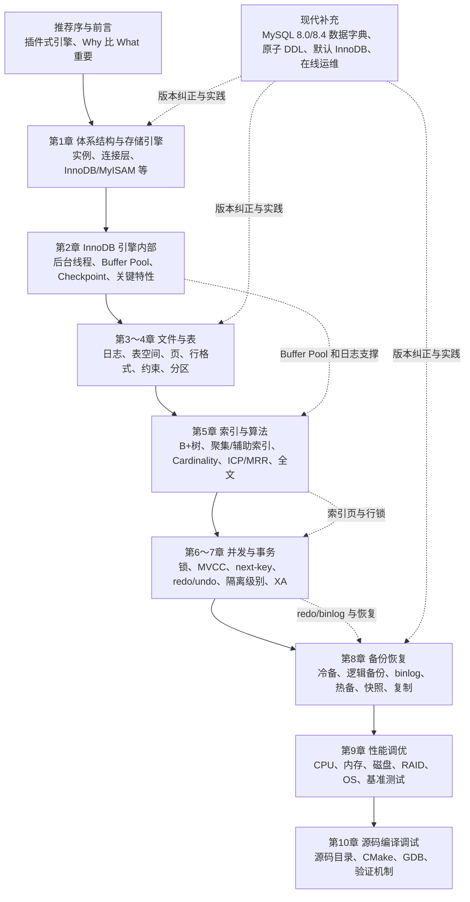

# 《MySQL技术内幕：InnoDB存储引擎（第2版）》深度阅读：从页、索引到事务恢复

> **书目信息**：姜承尧著，《MySQL技术内幕：InnoDB存储引擎（第2版）》，机械工业出版社 2013 年纸版；题目提供的 MOBI 元数据标注为 2013-05-29 电子版，ISBN `978-7-111-42206-8`。正文以该 MOBI 的推荐序、前言和第 1～10 章为依据。
>
> **版本边界**：原书围绕 MySQL 5.6 与 InnoDB 1.2.x 展开，重点是当时的表空间、页结构、redo/undo、next-key locking、在线索引、全文检索和源代码。文中“【原书】”表示 MOBI 直接讨论的内容，“【当前补充】”表示 MySQL 8.0/8.4 文档和实践，“【纠正】”表示 `.frm`、查询缓存、默认认证方式等已经变化的地方。
>
> **阅读方法**：这不是 SQL 入门或配置手册，而是一篇把 SQL 现象连接到 InnoDB 内部机制的教程。代码示例是短小改写，不声称未实际运行的生产压测结果。

## 一、先看全局：InnoDB 把一次 SQL 变成什么

### 1. 原书如何定义 MySQL 与 InnoDB

【原书，前言】指出：“MySQL 数据库独有的插件式存储引擎架构使其和其他任何数据库都不同。不同的存储引擎有着完全不同的功能，而 InnoDB 存储引擎的存在使得 MySQL 数据库跃入企业级数据库领域。”作者还强调“任何时候 Why 都比 What 重要”，希望读者通过源码和体系结构理解功能，而不是相信数据库“神话”。

【原书，第 1 章】区分了两个经常混淆的概念：数据库是磁盘上的文件集合，实例是后台线程和共享内存组成的运行体；真正操作数据文件的是实例。InnoDB 则是 MySQL 中提供 ACID 事务、行级锁、MVCC、外键和崩溃恢复的事务型存储引擎。

通俗地说，一条 `UPDATE` 并不是“改一下表文件”这么简单：SQL 先经过 MySQL 连接层和优化器，定位到 InnoDB 的聚集索引页；修改先进入 Buffer Pool，并生成 redo/undo；锁和 MVCC 决定并发事务看到什么；提交时通过日志和 group commit 保证崩溃后可恢复；后台线程再把脏页刷回表空间。理解这条链路，才能解释为什么索引、长事务、刷盘策略和磁盘延迟会共同决定性能。

### 2. 全书逻辑框架



全书可以沿着“SQL 请求—页内定位—并发修改—日志提交—后台刷盘—备份恢复”的生命周期阅读：第 1～4 章回答数据在哪里，第 5 章回答怎样找到它，第 6～7 章回答并发时如何保持正确，第 8～9 章回答如何恢复和优化，第 10 章则把所有结论落到源代码。

### 3. InnoDB 与其他存储方案比较

| 方案 | 组织方式 | 事务与并发 | 典型优点 | 主要边界 |
| --- | --- | --- | --- | --- |
| InnoDB | 聚集索引表、Buffer Pool、redo/undo | ACID、MVCC、行锁、next-key | OLTP、崩溃恢复、并发写、生态成熟 | 二级索引回表成本、页分裂和锁等待需治理 |
| MyISAM | 数据文件与索引文件分离 | 表级锁，无完整事务 | 结构简单、读多写少时开销低 | 崩溃恢复、并发写和事务能力弱；现代 MySQL 不再默认 |
| PostgreSQL heap + index | 堆表与多种索引 | MVCC、丰富 SQL、扩展性强 | 复杂查询、类型和扩展能力 | 运维与生态取舍不同，不是 InnoDB 的直接替换 |
| RocksDB/LSM 引擎 | 日志结构合并树 | 以键值写入和 compaction 为主 | 写吞吐、顺序写、可嵌入 | 复杂事务、范围扫描和运维模型不同 |
| MongoDB WiredTiger | 文档与 B 树/缓存 | 文档级/多文档事务 | 文档模型、水平扩展 | 关系约束和 SQL 生态不同 |
| 分布式 NewSQL | 分片、共识、副本 | 分布式事务或共识 | 横向扩展、跨节点容错 | 网络延迟、成本和事务范围更复杂 |

InnoDB 的关键优势不是“所有场景都最快”，而是把行级并发、事务原子性、物理日志和 MySQL 生态组合成一个可恢复的 OLTP 引擎。它要求使用者理解主键、页、索引和事务边界；如果工作负载是分析型大扫描、海量时序写入或跨地域强一致，应评估专门的列式、LSM 或分布式数据库。

## 二、分章节地图

| 章节 | 标题内容 | 核心内容 | 问题与解决思路 |
| --- | --- | --- | --- |
| 推荐序/前言 | 为什么需要理解 InnoDB | 插件式引擎、Why 比 What 重要、第 1/2 版差异 | 从源码和机制而非传言做判断 |
| 第 1 章 | MySQL 体系结构和存储引擎 | 数据库/实例、连接层、引擎比较 | 用分层架构解释 SQL 到存储的路径 |
| 第 2 章 | InnoDB 存储引擎 | 后台线程、内存、Checkpoint、Master Thread、关键特性 | 用 Buffer Pool、日志和后台线程协调吞吐与恢复 |
| 第 3 章 | 文件 | 参数、错误/慢查询/二进制日志、表空间、redo | 找到配置、诊断、数据和日志的物理位置 |
| 第 4 章 | 表 | 表空间、段/区/页/行、行格式、约束、视图、分区 | 将逻辑表映射到页和文件，控制存储布局 |
| 第 5 章 | 索引与算法 | B+树、聚集/辅助索引、统计信息、MRR/ICP、全文 | 用有序页减少磁盘访问，同时控制索引代价 |
| 第 6 章 | 锁 | lock/latch、行锁、gap/next-key、死锁 | 在并发读写中避免脏读、幻读和丢失更新 |
| 第 7 章 | 事务 | ACID、redo/undo/purge、group commit、隔离级别、XA | 用日志和 MVCC 实现原子提交与崩溃恢复 |
| 第 8 章 | 备份与恢复 | 冷备、mysqldump、binlog、XtraBackup、快照、复制 | 在 RPO/RTO 约束下恢复数据 |
| 第 9 章 | 性能调优 | CPU、内存、磁盘、RAID、OS、基准测试 | 将瓶颈定位到资源和工作负载，而非盲目加索引 |
| 第 10 章 | 源码编译和调试 | 源码结构、编译、Windows/Linux/CMake 调试 | 用可重复实验验证内部机制 |

## 三、沿一次事务生命周期逐章精读

### 第一阶段：请求进入实例并定位存储结构

#### 第 1 章　MySQL 体系结构和存储引擎

##### 1.1 数据库、实例与分层结构

数据库（database）是物理文件集合，实例（instance）是进程、后台线程和共享内存。MySQL 是单进程多线程模型：连接线程、后台刷新/清理线程共享 Buffer Pool 和其他内存结构。配置文件（`my.cnf`/`my.ini`）决定 `datadir`、端口、内存和日志路径；同一参数在后读取的配置中覆盖前面的值。

##### 1.2 MySQL 体系结构

客户端通过连接层进入 SQL 层，SQL 层负责解析、权限、优化和执行计划，再调用可插拔存储引擎。引擎接口使同一 SQL 可以落到 InnoDB、MyISAM、Memory 等不同实现，但事务、锁、索引和文件语义由引擎决定。

```text
客户端协议 -> 连接/认证 -> SQL 解析与优化 -> handler 接口
                                      -> InnoDB Buffer Pool/索引/日志
```

##### 1.3 引擎比较与连接方式

原书逐一介绍 InnoDB、MyISAM、NDB、Memory、Archive、Federated、Maria 等引擎。InnoDB 支持 ACID、行级锁、MVCC、外键和一致性非锁定读；MyISAM 结构简单但主要是表锁；NDB 面向集群，不能简单当作 InnoDB 替代。连接可以使用 TCP/IP、Windows 命名管道/共享内存或 Unix 域套接字，套接字省去 TCP 协议栈，适合同机连接。

- **术语**：OLTP（Online Transaction Processing，在线事务处理）；OLAP（Online Analytical Processing，在线分析处理）；handler 是 MySQL SQL 层调用存储引擎的接口；GA（Generally Available，正式发布）。
- **当前补充**：MySQL 8.0 默认且几乎所有通用场景都使用 InnoDB；NDB Cluster 是独立产品路线。现代部署应优先使用 TCP/TLS 或 Unix socket，并用 `performance_schema`/`sys` 观察连接和等待。
- **应用判断**：先确定事务、并发写和恢复要求，再选引擎；不要因为某个简单查询在 MyISAM 上快就替换 InnoDB。

#### 第 2 章　InnoDB 存储引擎：内存、线程与恢复底座

##### 2.1 体系架构与后台线程

InnoDB 的核心内存是 Buffer Pool，用于缓存数据页、索引页、undo 页和 Change Buffer 等；后台线程负责 Master Thread、IO Thread、Purge Thread、Page Cleaner 等工作。前台线程把修改写进内存并产生日志，后台线程再批量刷新，借此把随机小写转化为可调度的 I/O。

```text
SQL 修改 -> Buffer Pool 中的页变脏
        -> 生成 redo/undo
        -> log buffer -> redo log
        -> checkpoint 后刷脏页到 tablespace
```

##### 2.2 Checkpoint 与 Master Thread

LSN（Log Sequence Number）表示日志流位置；脏页最老修改对应的 LSN 与当前 LSN 之差形成 checkpoint age。Checkpoint 不能无限延后，否则 redo 空间耗尽；也不能每次提交都刷所有页，否则吞吐下降。原书比较了 1.0.x、1.2.x 前后 Master Thread 的工作方式：周期性刷新、合并写入和后台清理逐渐从“固定每秒任务”转向更细粒度的调度。

##### 2.3 关键特性

- **Change Buffer（原 insert buffer）**：二级索引页不在 Buffer Pool 时，先记录变更，未来页读入时合并，减少随机 I/O；唯一索引或热点页不能无条件使用。
- **Doublewrite Buffer**：先把完整页写入连续区域，再写入数据文件，防止部分页写（partial page write）导致页损坏；恢复时用双写副本修复。
- **Adaptive Hash Index（AHI）**：根据访问模式自动在 B+树之上建立哈希索引，适合稳定的等值热点，不保证所有查询都受益。
- **异步 I/O**：把读写请求提交给操作系统或原生 AIO，减少线程同步等待。
- **刷新邻接页**：一次刷新同一范围的相邻脏页，降低磁盘寻道，但在 SSD 或随机写场景需要重新评估。

```sql
SHOW ENGINE INNODB STATUS\G
SHOW GLOBAL STATUS LIKE 'Innodb_buffer_pool%';
SHOW VARIABLES LIKE 'innodb_buffer_pool_size';
```

##### 2.4 启动、关闭与恢复

正常关闭会刷新脏页并写入干净状态；崩溃重启时 InnoDB 从 checkpoint 开始扫描 redo，把已提交修改重放，把未完成事务通过 undo 回滚。`innodb_fast_shutdown` 会改变关闭时清理程度，升级或迁移前不能只追求最快关闭。

- **术语**：Buffer Pool 是页缓存；LSN 是日志序列号；checkpoint 是保证恢复起点的日志/脏页边界；AIO 是 Asynchronous I/O；COW 是 Copy-on-Write。
- **当前补充**：现代 MySQL 8.0 使用多个后台 page cleaner 和独立 undo tablespace；参数名称、默认值和刷盘算法已经变化。不要按原书固定的线程数量或阈值直接配置生产环境。
- **局限**：Buffer Pool 只能缓存热点页，无法消除全表扫描；Change Buffer、AHI 和邻接刷新都可能在特定工作负载下适得其反，必须用指标和压测验证。

### 第二阶段：从文件和页理解一行数据

#### 第 3 章　文件：参数、日志和表空间的物理边界

##### 3.1 参数与日志文件

参数文件定义 `datadir`、端口、Buffer Pool、redo、binlog 和线程等；错误日志记录启动、崩溃和恢复信息；慢查询日志记录超过阈值的语句；查询日志（general log）记录所有请求，调试有用但生产开销大；二进制日志（binlog）记录改变数据的事件，用于复制和时间点恢复。

```sql
SHOW VARIABLES LIKE 'datadir';
SHOW VARIABLES LIKE 'log_bin';
SHOW VARIABLES LIKE 'slow_query_log%';
SHOW BINARY LOGS;
```

##### 3.2 InnoDB 文件

原书介绍共享表空间（`ibdata`）、独立表空间（`.ibd`）、redo 日志、`.frm` 表结构文件、socket 和 pid 文件。表空间保存段、区、页和 undo 等物理结构；redo 日志用于崩溃恢复，binlog 则属于 MySQL 层，服务于复制和逻辑恢复，两者不能混为一谈。

- **当前纠正**：MySQL 8.0 使用事务数据字典，`.frm` 文件已移除；redo 文件布局、undo tablespace、临时表空间和数据字典表均与 5.6 不同。备份时应使用官方工具或逻辑接口，不要直接复制单个 `.ibd` 代替完整备份。
- **术语**：`datadir` 是数据目录；binlog 是逻辑变更日志；redo 是引擎物理恢复日志；socket 是 Unix 域套接字文件；pid 保存实例进程号。
- **诊断方法**：先查 `SHOW VARIABLES` 和错误日志确认真实路径，再查看文件大小、磁盘延迟和权限；不要仅凭默认目录猜测。

#### 第 4 章　表：索引组织、页结构、约束与分区

##### 4.1 索引组织表与主键

InnoDB 表按主键顺序组织，主键 B+树叶子节点直接保存整行记录，因此称为索引组织表（Index-Organized Table）。没有显式主键时，InnoDB 会优先选择第一个 `UNIQUE NOT NULL` 索引；若没有，则生成隐藏的 6 字节行标识。主键过长会复制到每个二级索引叶子节点，因此应使用稳定、短、递增性较好的键。

```sql
CREATE TABLE orders (
  id BIGINT UNSIGNED NOT NULL AUTO_INCREMENT,
  user_id BIGINT UNSIGNED NOT NULL,
  created_at DATETIME(6) NOT NULL,
  PRIMARY KEY (id),
  KEY idx_user_time (user_id, created_at)
) ENGINE=InnoDB;
```

##### 4.2 表空间、段、区、页和行

表空间由段（segment）组成，段由区（extent，通常 64 个连续页）组成，页（page，默认 16 KiB）是 I/O 和 Buffer Pool 的基本单位，行记录存储在页内。页太小会增加树高和 I/O，太大则放大随机读和碎片；原书以 16 KiB 为主要背景，现代版本允许特定页大小配置但必须在实例初始化时决定。

##### 4.3 行格式与溢出

Compact 格式用变长字段长度列表和 NULL 位图减少开销；Redundant 是兼容旧版本的格式；Compressed/Dynamic 通过溢出页和压缩处理长字段。长 `VARCHAR`、`TEXT`、`BLOB` 可能只在聚集索引页保存前缀，其余放在溢出页，导致一次查询需要额外 I/O。`CHAR` 在多字节字符集下的实际存储也不能简单按字符数估算。

##### 4.4 数据页结构

页包含 File Header、Page Header、Infimum/Supremum 伪记录、用户记录、空闲空间、Page Directory 和 File Trailer。Page Directory 为页内二分查找提供槽位；File Trailer 校验页是否完整写入。理解页结构可以解释页分裂、碎片、记录重排和部分页写保护。

##### 4.5 约束、视图和分区

原书区分数据完整性、索引和约束，讨论 `ENUM`/`SET`、触发器、外键和视图；MySQL 传统视图是逻辑查询，不是自动刷新的物化视图。分区可按 RANGE、LIST、HASH、KEY 组织并支持子分区，分区裁剪能减少扫描，但分区键、唯一键和跨分区查询有严格限制。

```sql
CREATE TABLE events (
  id BIGINT NOT NULL,
  happened_at DATE NOT NULL,
  payload JSON,
  PRIMARY KEY (id, happened_at)
) ENGINE=InnoDB
PARTITION BY RANGE COLUMNS (happened_at) (
  PARTITION p2025 VALUES LESS THAN ('2026-01-01'),
  PARTITION pmax VALUES LESS THAN (MAXVALUE)
);
```

- **当前纠正**：MySQL 8.0 已移除通用表级查询缓存，分区实现也基本收敛到 InnoDB；分区不是“自动加速”，只有查询条件能触发裁剪、分区维护成本可接受时才有价值。
- **术语**：IOT 是索引组织表；extent 是连续页组；overflow page 是长列溢出页；partition pruning 是优化器排除不相关分区。
- **局限**：长行、宽主键、大量二级索引会放大页分裂和写放大；设计表结构时应估算一行大小、索引宽度和热点插入位置。

### 第三阶段：用索引和算法找到记录

#### 第 5 章　索引与算法：B+树、统计信息和全文检索

##### 5.1 B+树与页访问

B+树的“B”代表 Balanced，不是 Binary。内部节点保存键和子页指针，叶子节点保存记录（聚集索引）或主键值（二级索引），叶子通过链表连接，适合范围扫描。查找不是直接得到行，而是先定位页，再把页读入 Buffer Pool，在页内通过 Page Directory/二分查找定位记录。

插入可能在页满时分裂，删除可能产生合并或空洞；随机主键比递增主键更容易造成页分裂和缓存抖动。二级索引回表意味着先查二级叶子拿主键，再查聚集索引取整行。

##### 5.2 聚集索引、辅助索引与覆盖索引

聚集索引的叶子是整行数据；辅助索引叶子包含索引列和主键。联合索引按从左到右的列序组织，`(a,b,c)` 能高效支持 `a` 或 `a,b` 的前缀条件，但跳过 `a` 通常不能充分利用排序。覆盖索引让查询所需列全部在索引叶子中，避免回表。

```sql
CREATE INDEX idx_user_status_time
  ON orders(user_id, status, created_at);

EXPLAIN ANALYZE
SELECT created_at FROM orders
WHERE user_id = 42 AND status = 'PAID'
ORDER BY created_at DESC LIMIT 20;
```

##### 5.3 Cardinality、MRR 和 ICP

Cardinality 是索引列不同值数量的估计，优化器用它判断选择性和连接顺序；InnoDB 通过采样索引页估算统计信息，因此统计值可能随数据分布变化。MRR（Multi-Range Read）把二级索引得到的主键按物理位置排序后批量回表，减少随机 I/O；ICP（Index Condition Pushdown）把部分过滤条件下推到存储引擎，减少回表记录。

```sql
ANALYZE TABLE orders;
EXPLAIN FORMAT=JSON SELECT ...;
```

优化器可能因为返回行比例高、函数包裹索引列、隐式类型转换或统计信息失真而放弃索引。索引提示（`USE INDEX`、`FORCE INDEX`）只能在验证计划后谨慎使用，不能代替更新统计和修正 SQL。

##### 5.4 哈希、自适应哈希和全文

InnoDB 的哈希算法用于内部查找和自适应哈希索引，不是用户可手工创建的通用索引。全文索引通过倒排索引把词映射到文档位置，涉及分词、停用词、布尔/自然语言模式；原书介绍了 5.6 InnoDB Full-Text 的实现与限制。

- **术语**：selectivity 是条件过滤比例；covering index 是覆盖索引；MRR 是多范围读；ICP 是索引条件下推；inverted index 是倒排索引。
- **当前补充**：MySQL 8.0 默认支持 descending index、隐藏索引、直方图和更丰富的 `EXPLAIN ANALYZE`；全文解析器和 `ngram` 适用于中文但需按语言特征配置。
- **索引原则**：索引服务于真实查询模式；每增加一个索引都会增加写入、redo、Buffer Pool 和备份成本。用慢查询、实际执行计划和线上分布验证，而不是只看字段基数。

### 第四阶段：并发读写与事务提交

#### 第 6 章　锁：lock、latch 与 next-key locking

##### 6.1 lock 与 latch

`lock` 面向事务之间的共享数据访问，生命周期可以跨语句；`latch`（mutex/rwlock）保护 Buffer Pool、页结构等内存临界区，持有时间应很短，通常没有事务级死锁检测。把两者混为一谈会误判锁等待来源。

##### 6.2 一致性读与锁定读

普通 `SELECT` 在 MVCC 下读取快照，称为一致性非锁定读；`SELECT ... FOR UPDATE` 或 `LOCK IN SHARE MODE`（现代写法为 `FOR SHARE`）读取最新版本并加锁。锁粒度受索引访问路径影响：没有合适索引时，范围条件可能锁住大量记录。

```sql
START TRANSACTION;
SELECT stock FROM inventory WHERE sku = 'A' FOR UPDATE;
UPDATE inventory SET stock = stock - 1 WHERE sku = 'A' AND stock > 0;
COMMIT;
```

##### 6.3 记录锁、间隙锁和 next-key

记录锁锁住索引记录；间隙锁锁住两个索引值之间的区间；next-key lock 是记录锁加其前间隙，用于在可重复读隔离级别下防止幻读。插入意向锁允许不同事务在同一间隙的不同位置插入，但仍需等待冲突的间隙/记录锁。自增长锁和外键检查也会引入额外等待。

```sql
-- 事务 A
SET TRANSACTION ISOLATION LEVEL REPEATABLE READ;
SELECT * FROM orders WHERE id BETWEEN 10 AND 20 FOR UPDATE;
-- 事务 B 在范围内插入，可能等待 A 的 next-key lock
```

##### 6.4 锁问题与死锁

脏读、不可重复读、丢失更新和幻读是不同并发异常。InnoDB 通过 MVCC、行锁和 next-key 组合处理；死锁检测会选择一个事务回滚，应用必须捕获错误并重试。统一更新顺序、缩短事务、为条件建立索引可以降低死锁概率。

- **术语**：MVCC（Multi-Version Concurrency Control，多版本并发控制）；record lock 是记录锁；gap lock 是间隙锁；next-key lock 是记录+间隙；deadlock 是事务互相等待形成环。
- **当前补充**：MySQL 8.0 默认仍为 `REPEATABLE READ`，可用 `performance_schema.data_locks`、`data_lock_waits` 和 `SHOW ENGINE INNODB STATUS` 诊断；隔离级别、优化器计划和索引变化会改变锁范围。
- **纠正**：原书强调 InnoDB 不需要传统的锁升级；这不等于“不会锁很多行”。一次范围扫描、缺索引更新或外键检查仍可能造成大范围阻塞。

#### 第 7 章　事务：redo、undo、purge 与 ACID

##### 7.1 ACID 和事务边界

原子性保证一组修改要么全部生效、要么全部回滚；一致性依赖约束和应用不变量；隔离性由锁/MVCC 和隔离级别提供；持久性由 redo、刷盘策略和存储设备共同决定。InnoDB 默认隔离级别在原书和现代 MySQL 中通常是 `REPEATABLE READ`，但任何部署都应显式核对。

```sql
START TRANSACTION;
UPDATE accounts SET balance = balance - 100 WHERE id = 1;
UPDATE accounts SET balance = balance + 100 WHERE id = 2;
COMMIT;
```

##### 7.2 redo、undo、purge 和 group commit

redo 记录页的物理变化，先于脏页落盘，崩溃恢复时重放；undo 保存旧版本和回滚信息，使事务回滚和一致性读成为可能；purge 在线清理不再被任何快照需要的旧版本。group commit 把多个事务的日志刷盘和 binlog 同步合并，降低 fsync 次数。

```text
修改页 -> 写 undo（旧版本）+ redo（新修改）
提交   -> redo/binlog 按两阶段提交协调
恢复   -> redo 重放，再依据事务状态处理未完成修改
```

##### 7.3 隔离、XA 与坏习惯

`READ UNCOMMITTED` 允许脏读，`READ COMMITTED` 每次语句读取新快照，`REPEATABLE READ` 在事务内保持一致视图并用 next-key 防幻读，`SERIALIZABLE` 把读也变成更强锁定。XA/内部 XA 协调 InnoDB redo 与 MySQL binlog，保证崩溃时两者状态一致，但跨服务分布式事务仍需谨慎评估。

避免在循环中每行提交、依赖自动提交完成业务事务、用应用层“自动回滚”掩盖异常以及开启长事务。长事务会保留旧版本、阻塞 purge、扩大 undo 和锁持有时间。

- **术语**：redo 是物理重做日志；undo 是回滚/旧版本日志；purge 是清理旧版本；group commit 是批量提交；XA 是 X/Open 分布式事务协议；两阶段提交是 prepare/commit 协调流程。
- **当前补充**：MySQL 8.0 的 undo tablespace、redo 容量和并行 purge 参数与 5.6 不同；使用 `INNODB_TRX`、`INNODB_METRICS` 和 Performance Schema 观察长事务，不要照搬旧阈值。
- **应用建议**：事务只包住必要读写；按固定顺序更新资源；捕获死锁/锁等待后指数退避重试；把外部 RPC 移出数据库事务或使用可靠消息/补偿。

### 第五阶段：备份、恢复与可观测性能

#### 第 8 章　备份与恢复：从 RPO/RTO 反推方案

##### 8.1 备份类型

热备在运行中进行，影响小；冷备停库后复制物理文件，简单但停机；温备通常需要全局读锁或短暂限制写入。逻辑备份（SQL/文本）便于迁移和查看，但恢复慢；裸文件/物理备份恢复快，但依赖版本、页大小和文件完整性。

##### 8.2 逻辑、物理与 binlog

```bash
mysqldump --single-transaction --routines --triggers appdb > appdb.sql
mysql appdb < appdb.sql
mysqlbinlog --start-datetime='2026-09-19 10:00:00' binlog.000123 \
  | mysql appdb
```

`--single-transaction` 适合 InnoDB，通过一致性快照减少锁；`SELECT ... INTO OUTFILE`/`LOAD DATA` 适合大批量文本交换，但要处理 `secure_file_priv`、字符集和转义。binlog 备份支持增量和时间点恢复，必须与全量备份、GTID/位点和校验记录配套。

##### 8.3 热备、快照与复制

原书介绍 ibbackup、XtraBackup、增量备份、LVM/存储快照以及“快照 + 复制”的架构。现代环境可使用 Percona XtraBackup、MySQL Enterprise Backup、云厂商物理备份或存储快照；复制是高可用和读扩展手段，但副本延迟和误删会被同步传播，不能替代独立备份。

- **术语**：RPO（Recovery Point Objective，可接受的数据丢失窗口）；RTO（Recovery Time Objective，可接受的恢复时间）；PITR（Point-in-Time Recovery，时间点恢复）；GTID（Global Transaction Identifier，全局事务标识）。
- **当前纠正**：原书中的 `ibbackup` 已不是通用开源工具；备份工具必须匹配 MySQL 版本、操作系统、加密和云存储策略。不要直接复制正在运行实例的数据目录就声称完成热备。
- **恢复演练**：至少验证“备份可读、能启动临时实例、能恢复到目标时间、应用连接和权限正常”，并记录实际恢复时长。

#### 第 9 章　性能调优：先识别工作负载和瓶颈

##### 9.1 CPU 与内存

OLTP 的特点是并发高、事务短、查询多走索引；OLAP 则是复杂扫描和聚合。CPU 选型要观察单核延迟、核数和频率，不能只看总核数。内存优先给 Buffer Pool，但必须为连接、排序、临时表、OS 页缓存和后台线程预留空间；`max_connections` 乘以每连接缓冲区可能造成内存爆炸。

##### 9.2 磁盘、RAID、文件系统

机械盘受寻道和旋转延迟影响，SSD 提供更低随机 I/O 但仍需关注写放大、寿命和 fsync 延迟。RAID 0/1/5/10 在容量、冗余和写性能间取舍；RAID Write Back 需要电池/持久化缓存，否则断电可能破坏 redo 和数据。文件系统、挂载参数、IO scheduler 和 `fsync` 行为应通过基准测试验证，不能只凭经验切换。

##### 9.3 基准测试与诊断

原书介绍 sysbench、mysql-tpcc 等工具。基准必须使用接近生产的数据分布、并发、读写比例、事务大小和持久化策略；否则“快”没有意义。

```sql
EXPLAIN ANALYZE SELECT ...;
SHOW ENGINE INNODB STATUS\G
SELECT * FROM sys.schema_table_statistics_with_buffer;
SELECT * FROM performance_schema.events_statements_summary_by_digest
ORDER BY SUM_TIMER_WAIT DESC LIMIT 10;
```

- **术语**：RAID（Redundant Array of Independent Disks）；IOPS 是每秒 I/O 操作数；throughput 是吞吐量；latency 是延迟；sysbench 是可脚本化基准工具。
- **当前补充**：MySQL 8.0 的 `sys` schema、Performance Schema、`EXPLAIN ANALYZE`、直方图和资源组比原书时代更适合定位瓶颈；先区分 CPU、锁、Buffer Pool miss、磁盘 fsync 和网络延迟。
- **优化原则**：先优化访问路径和事务边界，再调 Buffer Pool、redo、线程和 RAID；每次只改变一个变量并保存回归结果。

### 第六阶段：把机制落到源码验证

#### 第 10 章　InnoDB 源代码的编译和调试

本章强调开源源码是理解“为什么”的实验材料。原书介绍获取 MySQL 源码、目录结构、MySQL 5.1 在 Windows/Linux 下调试以及 CMake 编译方式。读者可以从 SQL 现象定位到 handler、InnoDB 模块、页/日志/锁实现，再用断点和日志验证假设。

现代 MySQL 源码编译示例（仅作学习入口，具体依赖按目标版本调整）：

```bash
git clone https://github.com/mysql/mysql-server.git
cd mysql-server
mkdir build && cd build
cmake .. -DWITH_DEBUG=1 -DDOWNLOAD_BOOST=1 \
  -DWITH_BOOST=$HOME/boost
cmake --build . -j$(nproc)
```

调试思路：

1. 用最小表和单条 SQL 重现现象，例如一个二级索引回表或两个事务互锁。
2. 通过 `EXPLAIN`、`SHOW ENGINE INNODB STATUS`、Performance Schema 记录外部证据。
3. 在 `row_search_mvcc`、锁管理、B+树页分裂、redo 写入等路径设置断点或 trace。
4. 改变一个变量（索引、隔离级别、事务顺序或页大小）并比较日志和页状态。

- **术语**：CMake 是跨平台构建系统；GDB 是 GNU 调试器；debug build 是保留符号和断言的调试构建；handler 是 SQL 层到引擎的适配接口。
- **当前纠正**：MySQL 5.1/5.6 的目录、编译器和 CMake 选项不能直接套到 MySQL 8.0/8.4；官方源码、构建依赖和许可证须以目标版本仓库说明为准。
- **安全边界**：不要在生产实例加载自行编译的服务端；源码实验应使用隔离数据目录和测试数据。

## 四、当前可执行的 MySQL 8.4 学习环境

下面使用官方 `mysql:8.4` 镜像演示表、索引、事务、锁和日志观察。8.4 是现代 LTS 线之一；部署前仍应核对官方镜像标签和组织的支持矩阵。

### 1. 启动容器

```powershell
docker volume create mysql-innodb-data
docker run --name mysql-innodb-lab -d `
  -p 3306:3306 `
  -e MYSQL_ROOT_PASSWORD=ChangeMe_123! `
  -v mysql-innodb-data:/var/lib/mysql `
  mysql:8.4
```

### 2. 创建测试表并查看执行计划

```powershell
docker exec -it mysql-innodb-lab mysql -uroot -pChangeMe_123! -e `
  "CREATE DATABASE lab; USE lab; CREATE TABLE orders (id BIGINT PRIMARY KEY AUTO_INCREMENT, user_id BIGINT NOT NULL, status VARCHAR(16) NOT NULL, created_at DATETIME NOT NULL, amount DECIMAL(10,2) NOT NULL, KEY idx_user_time(user_id,created_at)) ENGINE=InnoDB; INSERT INTO orders(user_id,status,created_at,amount) VALUES (42,'PAID',NOW(),19.90); EXPLAIN ANALYZE SELECT created_at FROM orders WHERE user_id=42 ORDER BY created_at DESC LIMIT 10;"
```

### 3. 观察事务和锁

打开两个终端分别执行：

```sql
-- 会话 A
START TRANSACTION;
SELECT * FROM orders WHERE id = 1 FOR UPDATE;

-- 会话 B：观察等待
START TRANSACTION;
UPDATE orders SET amount = amount + 1 WHERE id = 1;
```

第三个终端查看：

```sql
SELECT * FROM performance_schema.data_lock_waits;
SHOW ENGINE INNODB STATUS\G
```

实验结束执行 `COMMIT` 或 `ROLLBACK`。不要在共享开发实例使用简单密码；示例密码只用于本地容器。

### 4. 清理实验环境

```powershell
docker rm -f mysql-innodb-lab
docker volume rm mysql-innodb-data
```

删除卷会永久删除实验数据，生产环境不得照抄。

## 五、从 MySQL 5.6/InnoDB 1.2 到 MySQL 8.0/8.4 的关键变化

| 原书背景 | 现代变化 | 阅读和迁移建议 |
| --- | --- | --- |
| `.frm` 保存表定义 | 8.0 使用事务数据字典，`.frm` 移除 | 用 `SHOW CREATE TABLE`、字典视图和官方备份工具，不直接解析 `.frm` |
| InnoDB 默认文件和日志布局 | redo/undo、数据字典、临时表空间持续演进 | 以目标版本变量和启动检查为准 |
| `utf8` 常被当作完整 UTF-8 | 现代默认字符集通常为 `utf8mb4` | 明确字符集、排序规则和索引字节长度 |
| 查询缓存和旧优化器行为 | 查询缓存已移除，优化器增加直方图、EXPLAIN ANALYZE | 重新采集统计、观察真实执行计划 |
| `ALTER TABLE` 多数复制表 | 8.0 原子 DDL、在线 DDL 能力增强 | 仍需评估锁、临时空间和元数据锁 |
| 5.6 全文和分区实现 | InnoDB 全文、分区、DDL 与字典更成熟 | 不把历史限制当作现代默认，查看目标版本手册 |
| `mysql_native_password` 常见 | 新版本认证插件和安全默认持续变化 | 使用 `caching_sha2_password`/TLS 等目标版本推荐方案 |
| 传统复制位点 | GTID、并行复制、组复制/InnoDB Cluster 生态 | 根据 RPO/RTO 选择异步复制或共识方案 |

## 六、实践中的设计与故障清单

- **主键**：是否短、稳定、能控制插入热点？二级索引是否承受了过长主键复制？
- **索引**：是否用真实查询设计联合索引？是否检查回表、覆盖、统计信息和写放大？
- **事务**：事务是否足够短？是否在固定顺序更新资源？是否处理死锁、锁等待和重试？
- **日志**：redo、binlog、AOF 类比不能混淆；是否设置了可接受的 fsync、保留和归档策略？
- **备份**：是否同时具备全量、增量/binlog 和恢复演练？能否达到目标 RPO/RTO？
- **表设计**：长行、JSON/TEXT、分区和外键是否经过页大小、溢出页和 DDL 评估？
- **性能**：是否先定位 CPU、锁、Buffer Pool、磁盘和网络瓶颈，再调参数？
- **版本**：是否验证目标 MySQL 8.0/8.4 的默认值、认证、DDL、字符集和客户端兼容性？

## 七、总结：为什么必须理解 InnoDB 的内部实现

这本书最有价值的地方，是把看似独立的主题串成一个闭环：表按主键组织成 B+树页，Buffer Pool 缓存这些页，锁和 MVCC 管理并发版本，redo/undo 保证提交与回滚，后台线程和 checkpoint 把内存修改安全地刷回文件，备份和 binlog 再把故障恢复扩展到实例之外。性能问题往往不是某一个参数造成的，而是访问路径、事务长度、页布局、日志刷盘和硬件延迟的叠加结果。

读完后面对一条慢 SQL，可以依次问：它是否走对了索引？需要回表多少页？是否被锁或元数据锁阻塞？事务是否保留旧版本？redo/checkpoint 或磁盘 fsync 是否成为瓶颈？备份和恢复是否会改变方案？这种从 Why 出发的排查方法，比背诵某一版源码字段更能适应 MySQL 的持续演进。

## 八、来源与核验范围

- 姜承尧：《MySQL技术内幕：InnoDB存储引擎（第2版）》，机械工业出版社；本文以题目提供 MOBI 的前言、目录、第 1～10 章为原书依据。
- [MySQL 8.4 Reference Manual](https://dev.mysql.com/doc/refman/8.4/en/)：核对 InnoDB、事务、锁、备份、分区、复制和配置。
- [InnoDB Storage Engine](https://dev.mysql.com/doc/refman/8.4/en/innodb-storage-engine.html)：核对现代 InnoDB 架构与特性。
- [MySQL 8.0 Data Dictionary](https://dev.mysql.com/doc/refman/8.4/en/data-dictionary.html)：核对 `.frm` 移除和事务数据字典。
- [MySQL 8.4 Backup and Recovery](https://dev.mysql.com/doc/refman/8.4/en/backup-and-recovery.html)：核对逻辑、物理、binlog 和恢复流程。
- [MySQL Source Code](https://github.com/mysql/mysql-server)：用于现代源码构建入口和版本对照。

原书内容以 MySQL 5.6 为事实主线；所有现代补充均应在部署时再次对照目标 MySQL 版本、发行版和客户端驱动文档。
