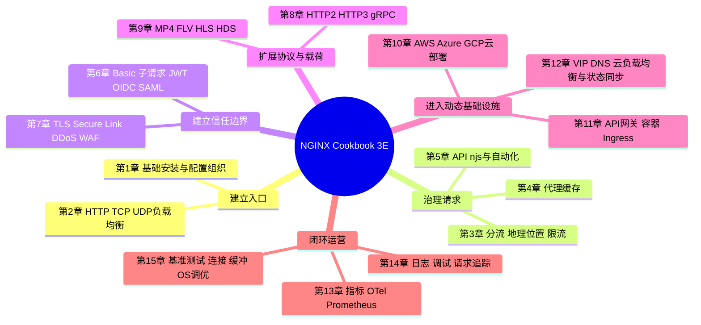

# 《NGINX Cookbook》第三版深度阅读

> **版本边界**：本文依据 Derek DeJonghe 所著 _NGINX Cookbook: Advanced Recipes for High-Performance Load Balancing, Third Edition_ 全文整理。该版由 O'Reilly 于 2024 年 2 月出版，ISBN `978-1-098-15843-9`，正文 15 章、175 页。第一版为 2020 年 11 月，第二版为 2022 年 5 月。
>
> **阅读方法**：原书每个配方都按 `Problem → Solution → Discussion → See Also` 展开。下文保留关键功能性配置，但不整段转载叙述；`【原书】`表示对正文配方的转述，`【纠正】`表示对书中错误或过时内容的校正，`【书外扩展】`表示为了今天实践而补充的内容。

---

## 一、从全书看 NGINX 的应用交付体系

### 1.1 官方定位与全局摘要

封底对 NGINX 的定位是：

> "NGINX is one of the most widely used web servers available today, in part because of its capabilities as a load balancer and reverse proxy server for HTTP and other network protocols."

即：**NGINX 是广泛使用的 Web 服务器，同时凭借对 HTTP 及其他网络协议的负载均衡和反向代理能力，成为应用交付入口。**

前言对本书目标的原文概括是：

> "The NGINX Cookbook aims to provide easy-to-follow examples of real-world problems in application delivery."

这句话界定了本书并非“指令大全”，而是一本**应用交付问题的配方集**。作者从安装和静态文件服务起步，依次处理负载均衡、流量控制、缓存、自动化、认证和安全，再进入 HTTP/3、媒体、云、容器、高可用、监控、故障诊断与性能调优。

通俗地说，NGINX 位于客户端与业务服务之间，像一个同时具备“接待、分流、安检、加速和记录”能力的入口：

- 请求多时，把流量分到多台后端，解决单机容量与单点故障问题；
- 请求危险或不合规时，在到达应用前完成 TLS、认证、限速与 WAF 检查；
- 内容重复时，从缓存直接响应，减少后端计算与网络开销；
- 后端动态变化时，通过 DNS、API、模板或容器编排更新路由；
- 出现故障时，用指标、日志和分布式追踪回答“慢在哪里、错在哪里”。

本书的中心命题可以压缩为一句话：**把 NGINX 从一台静态 Web 服务器，逐层组合成可编程、可扩缩、可防护、可观测的应用交付平台。**

### 1.2 全书逻辑框架



从请求生命周期观察，15 章实际构成一个闭环：


### 1.3 与同类技术的区别

> 下表中 NGINX Open Source 与 NGINX Plus 的差异来自全书各配方；Apache、HAProxy、Envoy 和云负载均衡部分是为理解定位而作的书外横向比较。

| 维度           | NGINX Open Source                         | NGINX Plus                                            | Apache HTTP Server                    | HAProxy                   | Envoy                        | 公有云托管负载均衡                   |
| -------------- | ----------------------------------------- | ----------------------------------------------------- | ------------------------------------- | ------------------------- | ---------------------------- | ------------------------------------ |
| 核心定位       | Web 服务、反向代理、四/七层负载均衡、缓存 | 在开源版上增加主动健康检查、API、状态共享、商业支持等 | 通用 Web 服务器，模块与动态内容生态深 | 专注四/七层代理与负载均衡 | 面向动态服务的云原生数据平面 | 免运维的区域级/全球级流量入口        |
| 静态文件与缓存 | 原生且成熟                                | 同左，另有缓存清除 API                                | 强，但高并发模型和配置取舍不同        | 不是主要用途              | 不是主要用途                 | 通常依赖对象存储/CDN                 |
| L4 与 L7       | `stream` + `http`                         | 同左并增强                                            | 主要是 L7                             | 两者都强                  | 两者都强                     | 取决于 NLB/ALB 产品类型              |
| 健康检查       | 请求触发的被动检查                        | 主动检查、响应内容匹配、slow start                    | 可借助代理模块                        | 开源版主动检查能力丰富    | 主动检查与控制面联动         | 平台原生主动检查                     |
| 动态配置       | reload、DNS 解析、外部模板                | API、key-value、zone sync                             | graceful reload                       | Runtime API               | xDS 动态控制面               | 云 API/声明式资源                    |
| 可编程能力     | 模块、njs；也可采用 OpenResty/Lua         | njs、API、商业模块                                    | C/DSO、脚本模块                       | Lua 等扩展有限            | 原生过滤器、Wasm             | 平台规则，定制度受限                 |
| 云原生适配     | 容器、Ingress Controller                  | 官方商业能力与 NGINX Ingress Controller               | 较少作为云原生流量控制面              | 可用于 Ingress            | 服务网格常用数据平面         | 与本云伸缩、可用区深度集成           |
| 运维责任       | 用户维护实例、升级、HA、观测              | 用户维护，厂商提供支持和增强功能                      | 用户维护                              | 用户维护                  | 用户还需管理控制面           | 云厂商维护数据面，用户承担费用和锁定 |

NGINX 的优势不是每一个单项都绝对领先，而是**在一个事件驱动服务器中同时提供静态服务、代理、缓存、流量治理和安全控制**。相比只做负载均衡的产品，它更像应用交付“多用工具”；相比云托管入口，它更可移植、规则更细；相比 Envoy，它的静态配置和单机运维更直接。代价则是：开源版动态控制和深度监控较弱，复杂微服务环境中的配置同步、服务发现和证书治理需要外部系统或 NGINX Plus。

---

## 二、15 章逐章提炼

| 章节     | 主题                               | 核心内容                                                                                                  | 本章解决方案与关键边界                                                                                              |
| -------- | ---------------------------------- | --------------------------------------------------------------------------------------------------------- | ------------------------------------------------------------------------------------------------------------------- |
| 前言     | 面向真实应用交付问题的配方集       | 说明读者需要理解 n-tier、微服务、TCP、UDP、HTTP，并给出从负载均衡到运维的阅读顺序                         | 不要求顺序阅读；可把配方映射到现实故障或架构需求                                                                    |
| 第 1 章  | Basics                             | Debian/Ubuntu 与 YUM 安装、NGINX Plus 安装、`nginx -t/-s`、关键目录、`include`、静态文件                  | 先用官方软件仓库获得可更新的软件包，再以拆分配置降低大型配置的维护成本                                              |
| 第 2 章  | High-Performance Load Balancing    | HTTP、TCP、UDP 负载均衡；轮询、最少连接、最少时间、hash、random；会话保持、连接排空、健康检查、slow start | `http` 在 OSI 第 7 层理解 HTTP，`stream` 在第 4 层转发 TCP/UDP；主动检查、sticky、slow start 等多项能力仅 Plus 提供 |
| 第 3 章  | Traffic Management                 | `split_clients` A/B 测试、GeoIP/GeoIP2、国家限制、真实客户端地址、连接/请求/带宽限制                      | 以变量和共享内存区实现稳定分桶与限流；真实 IP 只能信任明确的前置代理                                                |
| 第 4 章  | Massively Scalable Content Caching | 缓存目录与共享元数据区、cache key、锁、stale、bypass、purge、slice                                        | 用锁避免缓存击穿，用 stale 在上游故障时降级；清除 API 为 Plus 能力，错误 key 可能造成跨用户数据泄漏                 |
| 第 5 章  | Programmability and Automation     | Plus API、key-value、njs、Lua/Perl、Ansible、Chef、Consul Template                                        | 把手工配置转成 API 或声明式自动化；njs 适合代理层轻量逻辑，不等同完整应用运行时                                     |
| 第 6 章  | Authentication                     | HTTP Basic、认证子请求、JWT/JWK/JWKS、OIDC SSO、SAML 服务提供者                                           | 在入口拒绝未认证请求，减少后端负担；JWT/OIDC/SAML 的原生高级配方主要依赖 Plus 和 njs 模块                           |
| 第 7 章  | Security Controls                  | IP/CORS、客户端及上游 TLS、Secure Link、HTTPS/HSTS、国家限制、`satisfy`、动态 DDoS 缓解、App Protect WAF  | 强调纵深防御；加密客户端链路不代表上游链路已验证，WAF 也不能替代应用安全编码                                        |
| 第 8 章  | HTTP/2 and HTTP/3 (QUIC)           | HTTP/2、基于 QUIC/UDP 的 HTTP/3、gRPC 终止/路由/负载均衡                                                  | 同端口同时监听 TCP 与 QUIC 并用 `Alt-Svc` 宣告 h3；gRPC 依据 package/service URI 路由                               |
| 第 9 章  | Sophisticated Media Streaming      | MP4/FLV、Plus 的 HLS/HDS、带宽限制                                                                        | 用伪流或分片降低大媒体交付成本；HDS、FLV 已具有明显时代局限                                                         |
| 第 10 章 | Cloud Deployments                  | 自动置备、Azure VM、GCP 镜像、无云 LB 路由、“负载均衡器三明治”、动态伸缩、Google App Engine 代理          | 比较启动时配置、全烘焙和半烘焙镜像；云环境优先让平台 LB 负责入口 HA，让 NGINX 负责高级 L7 能力                      |
| 第 11 章 | Containers/Microservices           | NGINX API 网关、DNS SRV、官方镜像与 Dockerfile、Plus 镜像、环境变量、NGINX Ingress Controller             | 用路径、方法、认证、限流组合 API 契约；容器构建时固化软件，启动时注入环境配置                                       |
| 第 12 章 | High-Availability Deployment Modes | Keepalived/VIP、DNS 轮询、AWS NLB、Plus 配置同步、zone sync 状态共享                                      | 裸机可用 VRRP 漂移 VIP；公有云通常不允许这种 IP 操作，应改用云 LB；“配置同步”和“运行状态同步”是两件事               |
| 第 13 章 | Advanced Activity Monitoring       | `stub_status`、Plus Dashboard/API、OpenTelemetry、Prometheus Exporter                                     | 开源状态页指标少但关键；Plus API 粒度更深；OTel 把 NGINX span 接入全链路追踪并可采样                                |
| 第 14 章 | Debugging and Troubleshooting      | access/error log、Syslog、配置调试、请求追踪                                                              | 用 `$request_time` 与 `$upstream_response_time` 区分入口和上游耗时；集中日志解决多节点时间线拼接问题                |
| 第 15 章 | Performance Tuning                 | 可重复压测、浏览器缓存、客户端/上游 keepalive、响应和日志缓冲、OS 参数                                    | 采用“基线 → 单项修改 → 重测”的瓶颈驱动方法；作者明确反对脱离指标的盲目调参                                          |

---

## 三、按应用交付生命周期归纳技术点

### 3.1 准备阶段：安装、配置拆分与变更验证【第 1 章】

#### 为什么从软件仓库和配置组织开始

应用入口最怕两个问题：版本无法持续更新，以及一次错误配置让全部流量中断。第 1 章因此没有从复杂算法切入，而是先解决软件来源、文件位置、验证和模块化配置。

【原书，配方 1.1、1.4、1.6】Debian/Ubuntu 的基本流程为：

```bash
# 添加书中给出的 NGINX 官方仓库后安装
sudo apt update
sudo apt install nginx

# 验证构建参数、配置语法，再平滑加载
nginx -V
sudo nginx -t
sudo nginx -s reload
```

将主配置保持简洁，把虚拟主机和四层代理分别包含进来：

```nginx
http {
    include /etc/nginx/conf.d/*.conf;
}

stream {
    # stream 不能放进默认位于 http 上下文的 conf.d
    include /etc/nginx/stream.conf.d/*.conf;
}
```

最小静态站点配置：

```nginx
server {
    listen 80;
    server_name example.com;

    location / {
        root /usr/share/nginx/html;
        index index.html;
    }
}
```

#### 术语与指令

- **APT**：Advanced Package Tool，Debian/Ubuntu 的包管理体系。
- **YUM/DNF**：RPM 系发行版的软件包管理工具；新发行版通常以 DNF 为底层实现。
- **main/http/server/location/stream context**：NGINX 指令的作用域；放错上下文会导致 `nginx -t` 失败。
- **reload**：主进程读取新配置并启动新 worker，旧 worker 处理完已有连接后退出，区别于直接停机重启。
- **include**：在当前位置载入其他配置文件；它解决组织问题，不改变被包含内容应处的上下文。

#### 实践判断、限制与通俗解释

配置应进入版本控制，发布前至少执行 `nginx -t`，再 reload 并做端点探测。语法验证只能证明“能解析”，不能证明路由、证书、上游或权限正确，因此生产发布仍需冒烟测试和回滚版本。通俗地说，`nginx -t` 像检查配方有没有错字，而健康探测才是在确认做出的菜能不能吃。

### 3.2 接入阶段：HTTP、TCP、UDP 负载均衡【第 2 章】

#### 背景、作用与选择层级

作者把高可用的基础定义为横向扩展：运行同一系统的多个副本，再把负载分散。NGINX 同时支持 HTTP、TCP、UDP，解决 Web、数据库只读副本、NTP、DNS、VoIP 等不同协议的入口分流。

```nginx
# 【原书，配方 2.1】HTTP 七层负载均衡
upstream backend {
    server 10.10.12.45:80 weight=1;
    server app.example.com:80 weight=2;
    server spare.example.com:80 backup;
}

server {
    location / {
        proxy_pass http://backend;
    }
}
```

```nginx
# 【原书，配方 2.2、2.3】stream 位于 main 层，与 http 平级
stream {
    upstream mysql_read {
        server read1.example.com:3306 weight=5;
        server read2.example.com:3306;
        server 10.10.12.34:3306 backup;
    }

    server {
        listen 3306;
        proxy_pass mysql_read;
    }

    upstream ntp {
        server ntp1.example.com:123 weight=2;
        server ntp2.example.com:123;
    }

    server {
        listen 123 udp;
        proxy_pass ntp;
    }
}
```

`http` 理解主机名、URI、Header、Cookie 等第 7 层语义；`stream` 默认只处理第 4 层连接和数据报。因此需要按路径认证、缓存、改 Header 时选 `http`，只需透明转发数据库或自定义 TCP 协议时选 `stream`。

#### 算法不是“越高级越好”

| 算法       | 书中指令                            | 适用情况                     | 主要风险                                      |
| ---------- | ----------------------------------- | ---------------------------- | --------------------------------------------- |
| 加权轮询   | 默认；`weight`                      | 请求成本接近、服务器规格不同 | 慢请求会让连接堆积                            |
| 最少连接   | `least_conn`                        | 请求耗时差异明显             | 连接数少不等于响应快                          |
| 最少时间   | `least_time header/last_byte`，Plus | 同时考虑连接数与历史响应时间 | 只在 Plus；长任务会扭曲平均值                 |
| IP Hash    | `ip_hash`                           | 依据客户端 IP 保持会话       | NAT 后大量用户可能落到同一节点                |
| 通用 Hash  | `hash key consistent`               | 缓存亲和、用业务变量稳定路由 | 节点变化会重映射；`consistent` 只能减少重映射 |
| Random Two | `random two least_conn` 等          | 大型池中用低成本近似最优选择 | 小型池收益有限                                |

#### 有状态会话、故障摘除和恢复

书中给出三种 Plus 会话保持方法：`sticky cookie` 由 NGINX 设置 Cookie，`sticky learn` 从请求/响应学习会话，`sticky route` 依据路由标记选择节点。更理想的应用架构仍是把状态放入共享数据层；粘性会话是兼容有状态应用的手段，不是消除单点的魔法。

```nginx
# 开源版可用的被动健康检查
upstream backend {
    zone backend 64k;
    server app1.example.com max_fails=3 fail_timeout=10s;
    server app2.example.com max_fails=3 fail_timeout=10s;
}

# Plus 主动探测示意
location / {
    proxy_pass http://backend;
    health_check interval=2s fails=2 passes=2 uri=/healthz;
}
```

- **upstream**：被代理请求的目标服务器池。
- **passive health check**：真实请求失败后累计失败次数并暂时摘除节点；开源版可用。
- **active health check**：不等待用户请求，定时主动探测上游；原书明确为 Plus 能力。
- **connection draining**：节点退出时不接收新会话，但让既有会话自然完成；Plus 配方 2.8。
- **slow start**：恢复节点逐渐增加权重，避免冷缓存或初始化中的服务被瞬时压垮；Plus 配方 2.11，且不能与 hash、IP hash、random 同用。

局限在于 NGINX 看到的是代理层信号：端口可连不代表业务正确，HTTP 200 也可能是“带错误信息的成功响应”。健康端点应检查关键依赖但保持轻量，并区分存活、就绪与深度诊断。简单说，负载均衡不是“平均分”，而是“把下一次工作交给当前最合适且确实能工作的节点”。

### 3.3 分类与节流：A/B、GeoIP、真实 IP、限速【第 3 章】

#### 稳定分桶和灰度发布

【原书，配方 3.1】`split_clients` 对输入字符串做 hash，再按百分比稳定映射。只要输入不变，同一客户端通常保持同一组：

```nginx
split_clients "${remote_addr}AAA" $variant {
    20.0% backendv2;
    *     backendv1;
}

location / {
    proxy_pass http://$variant;
}
```

它适合 A/B 测试、金丝雀发布和逐步切流。以 `$remote_addr` 分桶容易受 NAT、移动网络换 IP 影响；登录业务更适合稳定用户 ID 或由可信应用设置的 Cookie。实验分析还必须记录分组变量，否则只能切流，无法计算转化差异。

#### 地理位置与真实客户端

GeoIP2 把 IP 映射为国家、城市、经纬度等变量，可用于日志、路由、合规限制或内容本地化。书中已经警告旧 GeoIP 数据库不再维护，并介绍 `.mmdb` 格式的 GeoIP2 动态模块。

```nginx
load_module modules/ngx_http_geoip2_module.so;

http {
    geoip2 /etc/maxmind-country.mmdb {
        auto_reload 5m;
        $geoip2_country_code source=$remote_addr country iso_code;
    }

    map $geoip2_country_code $blocked_country {
        default 1;
        US      0;
    }
}
```

【纠正，对应配方 3.2】书中的旧 `geolite.maxmind.com/...GeoIP.dat.gz` 下载地址和 GeoIP Legacy 数据库不可再作为部署步骤。应使用 MaxMind GeoLite2/GeoIP2 的 `.mmdb` 数据库、账户和许可流程，并建立自动更新与许可合规机制。

位于 CDN 或云 LB 后时，连接来源是代理而非用户。必须只信任自己的代理网段：

```nginx
set_real_ip_from 10.0.0.0/8;
real_ip_header X-Forwarded-For;
real_ip_recursive on;
```

若无边界地信任 `X-Forwarded-For`，客户端可以伪造 IP，绕过按 IP 的认证、限流和审计。

#### 三种“慢下来”

```nginx
limit_conn_zone $binary_remote_addr zone=per_ip_conn:10m;
limit_req_zone  $binary_remote_addr zone=per_ip_rate:10m rate=10r/s;

server {
    limit_conn per_ip_conn 20;
    limit_req zone=per_ip_rate burst=20 nodelay;

    location /downloads/ {
        limit_rate_after 10m;
        limit_rate 1m;
    }
}
```

- **connection limiting**：限制同时打开的连接数，保护长连接或下载服务。
- **request rate limiting**：按时间限制请求速率；`burst` 是突发队列容量，`nodelay` 让允许的突发立即通过。
- **bandwidth limiting**：限制每个请求的传输字节率，控制大文件占用。
- **shared memory zone**：多个 worker 共享计数状态的内存区；容量不足会导致新状态无法记录。

限制键要与威胁模型一致：公网 NAT 下只按 IP 可能误伤整家公司；API 通常可按 API key、用户或租户限流。NGINX 的本地共享区也不是跨节点全局配额，严格的全局计费要借助集中式网关或配额服务。

### 3.4 响应阶段：缓存命中、击穿保护与故障降级【第 4 章】

#### 缓存由“磁盘正文 + 内存索引”组成

【原书，配方 4.1】`proxy_cache_path` 在 `http` 中定义磁盘位置和共享元数据区，`proxy_cache` 在具体代理位置启用该区。原书示例名称前后出现 `main_content` 与 `CACHE` 不一致；实际配置必须使用同一个 zone 名称：

```nginx
proxy_cache_path /var/nginx/cache
    keys_zone=main_content:60m
    levels=1:2
    inactive=3h
    max_size=20g
    min_free=500m;

server {
    location / {
        proxy_cache main_content;
        proxy_pass http://backend;
    }
}
```

`keys_zone` 存 key 和元数据，不存响应正文；正文落在 `proxy_cache_path`。`inactive=3h` 是“三小时未被访问则可淘汰”，不是固定 TTL。

#### key、锁、stale、bypass 和 slice

```nginx
# 【原书，配方 4.2】动态页面必须把真正影响响应的维度纳入 key
proxy_cache_key "$host$request_uri$cookie_user";

# 【原书，配方 4.3】同一冷 key 只允许一个请求回源填充
proxy_cache_lock on;
proxy_cache_lock_age 10s;
proxy_cache_lock_timeout 3s;

# 【原书，配方 4.4】上游故障或更新中可返回旧缓存
proxy_cache_use_stale error timeout invalid_header updating
    http_500 http_502 http_503 http_504 http_403 http_404 http_429;
```

- **cache key**：决定两个请求能否共用响应的身份字符串。漏掉用户、语言或权限维度会串数据；加入随机 token 又会让命中率归零。
- **cache stampede / 缓存击穿**：热门 key 失效时，大量并发同时回源；`proxy_cache_lock` 将填充者收敛为一个。
- **stale cache**：已过期但仍存在的响应；故障时返回它，以新鲜度换可用性。
- **cache bypass**：满足条件时不从缓存读取，常用于管理员刷新、已登录请求或调试。
- **cache purge**：按 key 删除缓存；本书配方 4.6 使用 NGINX Plus 清除能力。
- **cache slice**：把大文件按 byte range 切片缓存，让局部请求和并发填充更高效。

实际应用中，商品详情可以缓存几十秒并启用 `updating` stale，支付结果则不应共享缓存。为便于验证，可添加 `$upstream_cache_status` 响应头或日志字段，观察 `MISS/HIT/BYPASS/STALE/UPDATING`。缓存最大的局限不是容量，而是正确性：先画清数据隔离和失效规则，再谈命中率。

### 3.5 变更阶段：API、key-value、njs 与配置自动化【第 5 章】

#### 从 reload 到运行时控制

NGINX Plus API 可读取状态并修改 upstream；key-value store 可把外部状态映射成 NGINX 变量。配方 5.2 用它构建动态 IP blocklist：

```bash
# 向名为 blocklist 的 key-value zone 加入本机地址
curl -X POST -H 'Content-Type: application/json' \
  -d '{"127.0.0.1":"1"}' \
  http://127.0.0.1/api/9/http/keyvals/blocklist

# PATCH null 删除该 key
curl -X PATCH -H 'Content-Type: application/json' \
  -d '{"127.0.0.1":null}' \
  http://127.0.0.1/api/9/http/keyvals/blocklist
```

API 写入口必须限制到管理网络并认证，绝不能直接暴露公网。Plus R16 起 key-value 可在集群间同步；R19 的 `type=ip` 支持 CIDR，`type=prefix` 支持前缀匹配。

#### 在代理路径中嵌入轻量逻辑

【原书，配方 5.3】njs 用 JavaScript 从 Bearer JWT 中读出 subject 和 issuer：

```javascript
function jwt(data) {
  const parts = data
    .split(".")
    .slice(0, 2)
    .map((v) => Buffer.from(v, "base64url").toString())
    .map(JSON.parse);
  return { headers: parts[0], payload: parts[1] };
}

function jwtPayloadSubject(r) {
  return jwt(r.headersIn.Authorization.slice(7)).payload.sub;
}

export default { jwtPayloadSubject };
```

```nginx
load_module modules/ngx_http_js_module.so;

http {
    js_path /etc/nginx/njs/;
    js_import main from jwt.js;
    js_set $jwt_subject main.jwtPayloadSubject;
}
```

【纠正，对应配方 5.3】这段代码只是 Base64URL **解码 payload**，没有校验签名、`exp`、`nbf`、`aud` 或 `iss`，不能作为认证结论。书中第 6 章的 `auth_jwt`、认证子请求或成熟 OIDC 方案才承担验证。

#### 自动化工具的分工

| 工具            | 本书用途                               | 最合适的职责                                 |
| --------------- | -------------------------------------- | -------------------------------------------- |
| Ansible         | 安装 NGINX、模板化配置、分发并 reload  | 无代理的声明式主机配置                       |
| Chef            | 以 cookbook/resource 维护服务器状态    | 已采用 Chef 生态的大规模主机管理             |
| Consul Template | 监听 Consul 状态，重渲染 upstream 配置 | 服务发现到静态配置的桥梁                     |
| NGINX Plus API  | 查询指标、运行时改 upstream/key-value  | 低延迟、受控的动态变化                       |
| njs/Lua         | 请求或响应路径上的自定义逻辑           | 小而确定的边缘逻辑；Lua 生态常见于 OpenResty |

自定义逻辑处在所有请求的热路径上，CPU 密集、阻塞 I/O 或无界脚本会放大到全站延迟。最佳实践是让 NGINX 做快速判定，把复杂业务留给独立服务。通俗地说，自动化让“人改一台机器”变成“系统声明所有机器应该是什么样”，njs 则让门口能做少量计算，但不要把整个业务搬到门卫室。

### 3.6 建立身份：Basic、认证子请求、JWT、OIDC 与 SAML【第 6 章】

#### 由简单到联合身份

```nginx
# 【原书，配方 6.1】Basic Authentication
location / {
    auth_basic "Private site";
    auth_basic_user_file conf.d/passwd;
}
```

Basic 把 `username:password` 做 Base64 编码，并非加密，所以必须置于 HTTPS 内。它适合内部工具或临时保护，不能替代带账户生命周期、多因素认证和审计的业务身份系统。

已有认证服务时，配方 6.2 用子请求把决策外包：

```nginx
location /private/ {
    auth_request /auth;
    auth_request_set $auth_status $upstream_status;
    proxy_pass http://backend;
}

location = /auth {
    internal;
    proxy_pass http://auth-server;
    proxy_pass_request_body off;
    proxy_set_header Content-Length "";
    proxy_set_header X-Original-URI $request_uri;
}
```

认证服务返回 2xx 即放行，401/403 原样拒绝。关闭 body 转发减少开销，`internal` 防止客户端直接调用内部认证位置。认证服务因此成为关键依赖，应有短超时、容量规划和明确的故障策略。

```nginx
# 【原书，配方 6.3】NGINX Plus 本地验证 JWS
location /api/ {
    auth_jwt "api";
    auth_jwt_key_file conf/keys.json;
    proxy_pass http://backend;
}
```

- **JWT**：JSON Web Token，点分三段的令牌容器；签名型 JWS 不等于加密。
- **JWK/JWKS**：JSON Web Key / JSON Web Key Set，表示单个或一组密码学公钥。
- **OIDC**：OpenID Connect，建立在 OAuth 2.0 上的身份层；配方 6.5~6.7 用 Plus+njs 处理登录和 JWKS 获取缓存。
- **SAML**：Security Assertion Markup Language，企业联合身份常用 XML 协议；配方 6.8 把 NGINX Plus 配成 Service Provider。
- **IdP/SP**：Identity Provider / Service Provider，签发身份断言的一方与消费断言、提供服务的一方。

JWT 本地验证省掉每请求认证回源，但撤销和密钥轮换更复杂；子请求实时性强，却增加一次网络调用；SAML 适合传统企业 SSO，OIDC 更贴近现代 Web/API。身份验证回答“你是谁”，授权还要回答“你能做什么”，二者不能混为一谈。

### 3.7 防护阶段：访问控制、端到端 TLS、Secure Link、DDoS 与 WAF【第 7 章】

#### 纵深防御而非单一开关

第 7 章从 IP allow/deny、CORS、TLS、签名链接一路叠加到动态 DDoS blocklist 和 App Protect WAF。其逻辑是：每层减少一类攻击面，但任何一层都不能宣称“已经安全”。

```nginx
server {
    listen 443 ssl;
    ssl_protocols TLSv1.2 TLSv1.3;
    ssl_certificate /etc/nginx/ssl/example.crt;
    ssl_certificate_key /etc/nginx/ssl/example.key;
    ssl_session_cache shared:SSL:10m;
    ssl_session_timeout 10m;

    add_header Strict-Transport-Security "max-age=31536000" always;

    location / {
        proxy_pass https://upstream.example.com;
        proxy_ssl_verify on;
        proxy_ssl_trusted_certificate /etc/nginx/ssl/ca-chain.pem;
        proxy_ssl_verify_depth 2;
        proxy_ssl_protocols TLSv1.2 TLSv1.3;
    }
}
```

【纠正，对应配方 7.3】原书写道 NGINX `1.23.4 and later` 的默认协议包含 TLSv1/TLSv1.1/TLSv1.2/TLSv1.3；官方指令文档对应的默认值实际已是 `TLSv1.2 TLSv1.3`。生产环境仍应显式声明协议并以部署版本的 `nginx -V`、OpenSSL 能力和安全基线验证，不能依赖书中默认值描述。

只把 `proxy_pass` 改成 `https://` 并不会自动验证上游身份；书中配方 7.5 特别指出默认不验证上游证书，因此 `proxy_ssl_verify on` 和可信 CA 链是端到端安全的关键。

#### 签名链接与应用层防护

Secure Link 通过 secret、URI 和可选过期时间生成摘要，适合临时下载、防盗链和有时效的媒体 URL。它防止链接被任意修改或长期复用，但 URL 仍可能在有效期内被分享，且 secret 轮换要兼容已签发链接。

- **CORS**：Cross-Origin Resource Sharing，浏览器决定跨源读取是否被允许的响应头机制；它不是服务器端认证。
- **HSTS**：HTTP Strict Transport Security，浏览器在有效期内只以 HTTPS 访问；错误地对尚未完成 HTTPS 覆盖的域启用长 `max-age` 会锁死访问。
- **Secure Link**：基于摘要校验 URL 完整性和有效期的 NGINX 模块。
- **DDoS**：Distributed Denial of Service，分布式拒绝服务；第 7 章把限速、key-value blocklist 与 Plus API 组合成动态应用层缓解。
- **WAF**：Web Application Firewall，Web 应用防火墙；本书 App Protect WAF 为需安装和授权的商业模块，不是 NGINX 开源版自带功能。
- **`satisfy any`**：多个访问模块任一成功即可放行；`all` 则要求全部成功。宽松组合前必须画出授权逻辑。

WAF 可阻挡已知模式和协议异常，无法修复越权、业务逻辑漏洞或泄露的凭据。真正的防护闭环还包括应用修复、密钥管理、上游校验、补丁、日志和演练。

### 3.8 协议协商与媒体交付：HTTP/2、HTTP/3、gRPC【第 8~9 章】

#### 从 TCP 多路复用到 QUIC

```nginx
# 【原书，配方 8.1】HTTP/2
server {
    listen 443 ssl;
    http2 on;
    ssl_certificate server.crt;
    ssl_certificate_key server.key;
}
```

```nginx
# 【原书，配方 8.2】同一 443 端口保留 TCP 回退并开启 UDP/QUIC
server {
    listen 443 quic reuseport;
    listen 443 ssl;
    ssl_protocols TLSv1.3;
    ssl_certificate certs/example.com.crt;
    ssl_certificate_key certs/example.com.key;

    location / {
        add_header Alt-Svc 'h3=":$server_port"; ma=86400';
    }
}
```

HTTP/2 在一条 TCP 连接上多路复用多个流，但 TCP 丢包仍可能阻塞所有流；HTTP/3 把 HTTP 映射到 QUIC/UDP，每个流独立恢复，并把 TLS 1.3 纳入协议。客户端通常第一次先走 HTTP/1.1/2，从 `Alt-Svc` 得知 h3，随后尝试 UDP；因此防火墙、NAT 和云安全组也必须开放 UDP 443。

原书指出从 NGINX Open Source 1.25.2 / Plus R30 起，HTTP/3 模块成为默认模块，并通过 OpenSSL Compatibility Layer 降低替代 TLS 库的构建负担。

#### gRPC 与 URI 路由

```nginx
upstream grpcservers {
    server backend1.local:50051;
    server backend2.local:50051;
}

server {
    listen 443 ssl;
    http2 on;
    ssl_certificate server.crt;
    ssl_certificate_key server.key;

    location /mypackage.Service/ {
        grpc_pass grpcs://grpcservers;
    }
}
```

- **ALPN**：Application-Layer Protocol Negotiation，在 TLS 握手中协商 HTTP/1.1、h2 等应用协议。
- **QUIC**：最初为 Quick UDP Internet Connections，现为 IETF 标准传输协议；HTTP/3 运行其上。
- **head-of-line blocking**：队头阻塞，前面的丢失数据阻碍后续数据交付。
- **gRPC**：基于 HTTP/2 和 Protocol Buffers 的远程过程调用框架；NGINX 可按 package/service/method 路由。
- **HLS/HDS**：HTTP Live Streaming / HTTP Dynamic Streaming，前者仍广泛使用，后者属于 Adobe Flash 时代方案。

【纠正，对应第 8 章配方间差异】配方 8.1 使用新版 `http2 on;`，但配方 8.3 后段仍出现旧式 `listen 443 ssl http2`。新部署应采用独立 `http2 on;` 并用目标版本执行 `nginx -t`。

【时效说明，对应第 9 章】MP4 byte-range、HLS 仍有现实意义；FLV 和 HDS 已是遗留兼容场景，不应作为新媒体平台的首选。现代大规模点播通常还会采用对象存储、CDN、HLS/DASH 和转码流水线，而不是让单个 NGINX 节点承担全部媒体处理。

### 3.9 交付到动态基础设施：云、容器、API 网关与 Ingress【第 10~11 章】

#### 云主机镜像的三个策略

| 策略       | 第 10 章定义                            | 优点                 | 代价                         |
| ---------- | --------------------------------------- | -------------------- | ---------------------------- |
| 启动时置备 | 从通用系统镜像启动，再运行脚本/配置管理 | 灵活、镜像少         | 启动慢，依赖仓库和脚本可靠性 |
| 全烘焙镜像 | 软件与环境配置都写入 AMI/机器镜像       | 启动快、实例一致     | 镜像数量和环境差异难管理     |
| 半烘焙镜像 | 软件预装，环境变量和上游在启动时注入    | 在速度与灵活性间平衡 | 仍需可靠的 bootstrap         |

作者建议用 Packer 自动构建镜像，用 Ansible/Chef 声明服务器状态，用 AWS UserData 或云启动脚本注入环境差异。云控制台按钮会变化，但“镜像不可变、环境配置后置”的原则更稳定。

“负载均衡器三明治”是云 LB → NGINX → 应用：云 LB 提供跨可用区入口和伸缩，NGINX 提供复杂 L7 路由、缓存、限流与认证。多一层会增加费用、一次网络跳转和诊断复杂度，所以只有在确实需要 NGINX 能力时采用。

#### 容器与 API 网关

本书第 11 章把前 10 章能力重新组合成 API 网关：统一 JSON 错误、路径路由、方法白名单、API key、认证与按 key 限流。

```nginx
upstream service_1 {
    server 10.0.0.12:80;
    server 10.0.0.13:80;
}

server {
    listen 443 ssl;
    server_name api.company.com;
    default_type application/json;
    proxy_intercept_errors on;

    error_page 404 = @not_found;
    location @not_found {
        return 404 '{"status":404,"message":"Resource not found"}\n';
    }

    location /api/service_1/object {
        limit_except GET PUT { deny all; }
        proxy_pass http://service_1;
    }
}
```

原书使用 `rewrite ... last` 跳到内部服务 location，可复用公共策略；实际编写时要特别测试 `proxy_pass` 是否保留或去掉 URI 前缀。带不带尾部 `/` 会改变上游 URI，这是 API 网关最常见的路由陷阱之一。

容器把包和依赖从“部署时安装”移到“构建时固化”，实现同一镜像多环境运行。环境变量不能直接出现在任意 NGINX 指令中，官方容器常用模板加 `envsubst` 在启动时生成配置；敏感值应使用 secrets 挂载，而非烘焙进镜像或公开环境变量。

- **API Gateway**：API 统一入口，执行认证、授权、协议/路径转换、路由、限流与观测。
- **SRV record**：DNS Service 记录，包含服务端口、优先级和权重；第 11 章用 Plus 从 SRV 发现上游。
- **OCI image**：Open Container Initiative 镜像规范；NGINX 官方镜像遵循容器镜像分层模型。
- **Ingress**：Kubernetes 中描述集群外 HTTP(S) 到 Service 路由的 API 对象。
- **Ingress Controller**：监听 Ingress/Service 等资源并实际配置代理的数据面控制器。

【辨析，对应配方 11.7】书中产品是 **NGINX Ingress Controller from NGINX/F5**。它与 Kubernetes 社区维护、名称相近的 **ingress-nginx** 不是同一个项目，镜像、注解、CRD、支持范围和发布节奏不能混用。

### 3.10 高可用阶段：VIP、DNS、云 LB、配置与状态同步【第 12 章】

#### 不同环境需要不同故障转移机制

裸机或能控制二层/三层地址的虚拟机可用 Keepalived + VRRP：主节点发送 heartbeat，备节点连续收不到通告后接管 virtual IP。原书 `nginx-ha-keepalived` 配方还用脚本检查 NGINX 进程并支持手工 failover。

```text
客户端 → 虚拟 IP → 当前主 NGINX
                   └─ VRRP heartbeat ─→ 备用 NGINX
故障后：虚拟 IP 漂移到备用节点
```

书中明确指出该方案常不适用于公有云，因为云 IP 由平台控制，不能靠本机系统调用漂移。在 AWS 中应把 NGINX Auto Scaling Group 放在 NLB target group 后；类似原则也适用于其他云。

DNS 多 A 记录能分流，却不是即时故障切换：解析器和客户端缓存受 TTL 影响，移除坏 IP 后仍可能有流量到达。应配合 DNS 健康检查，先摘流、再 connection draining、最后停机。

#### 两种同步不可混淆

- **configuration synchronization**：把 `nginx.conf`、证书等文件从主节点同步到 peers；第 12 章使用 Plus `nginx-sync` 和 SSH。
- **zone synchronization**：用 `zone_sync` 在 Plus 节点间同步运行状态，例如 sticky learn、限流和 key-value 状态。
- **VRRP**：Virtual Router Redundancy Protocol，虚拟路由冗余协议，负责 VIP 主备选举，不同步 NGINX 配置。
- **NLB/ALB**：AWS Network/Application Load Balancer，分别偏第 4 层与第 7 层托管入口。
- **availability zone**：云区域内相互隔离的可用区；跨区部署用来避免单机房故障。

配置同步不能替代版本控制和发布流水线，运行状态同步也不能替代业务数据库。高可用的真实检验是演练：停止进程、隔离网络、下线可用区，测量失败请求数和恢复时间，而不是看到两台机器都在运行就宣布完成。

### 3.11 运行阶段：指标、日志与分布式追踪【第 13~14 章】

#### 三类信号回答不同问题

| 信号    | 本书入口                                     | 最擅长回答                       |
| ------- | -------------------------------------------- | -------------------------------- |
| Metrics | `stub_status`、Plus API、Prometheus Exporter | 是否异常、何时开始、影响多大     |
| Logs    | `access_log`、`error_log`、Syslog            | 哪个请求、状态码、上游、错误细节 |
| Traces  | NGINX OTel 模块、请求 ID                     | 一次请求跨多个服务慢在哪里       |

开源版最小状态端点：

```nginx
location = /stub_status {
    stub_status;
    allow 127.0.0.1;
    allow 10.0.0.0/8;
    deny all;
}
```

`stub_status` 提供 active connections、accepts、handled、requests、reading、writing、waiting。它看不到每个 upstream 的详细状态；Plus Dashboard/API 能提供服务器池、缓存和 zone 的更深指标。

【原书，配方 13.4】OTel 模块可继承并向上游传播 trace context，还能用 `split_clients` 采样：

```nginx
load_module modules/ngx_otel_module.so;

http {
    otel_exporter {
        endpoint localhost:4317;
    }

    split_clients "$otel_trace_id" $ratio_sampler {
        10% on;
        *   off;
    }

    server {
        location / {
            otel_trace $ratio_sampler;
            otel_trace_context propagate;
            proxy_pass http://backend;
        }
    }
}
```

- **OpenTelemetry/OTel**：统一生成、传播和导出 metrics、logs、traces 的标准与工具集合。
- **span**：一次操作的时间片；多个有父子关系的 span 组成 trace。
- **traceparent/tracestate**：W3C Trace Context 标准请求头，用于跨服务传递追踪身份和厂商状态。
- **sampling**：只记录部分请求以控制成本；抽样会漏掉低频问题，错误请求可采用更高采样率。
- **Prometheus Exporter**：把 NGINX 状态转成 Prometheus 可抓取指标的适配器。

#### 用时间字段定位“谁慢”

```nginx
log_format json_combined escape=json
  '{"time":"$time_iso8601",'
  '"request_id":"$request_id",'
  '"remote_addr":"$remote_addr",'
  '"request":"$request",'
  '"status":$status,'
  '"request_time":$request_time,'
  '"upstream_status":"$upstream_status",'
  '"upstream_time":"$upstream_response_time"}';

access_log /var/log/nginx/access.log json_combined buffer=32k flush=1m;
error_log  /var/log/nginx/error.log warn;
```

`$request_time` 是 NGINX 观察到的完整请求时间，`$upstream_response_time` 是上游阶段耗时；前者高而后者低，问题可能在客户端上传/下载、限速或 NGINX 队列；二者都高，更可能是上游。多个重试值会以逗号分隔，不能只按单个数字解析。

Syslog 可集中多节点日志，但 UDP 514 可能丢包；关键审计日志要选择可靠传输、落盘缓冲和访问控制。`debug` error log 需要 `--with-debug` 构建，且数据量巨大，只应定点、短时启用。可观测性不是“多打日志”，而是让指标发现异常、trace 缩小路径、日志给出证据。

### 3.12 优化阶段：用基线驱动连接、缓冲和内核调优【第 15 章】

作者把性能调优描述为反复的瓶颈驱动过程：建立可重复负载，记录基线，只改一个变量，复测并判断收益，再寻找下一个瓶颈。JMeter、Locust、Gatling 都只是产生一致负载的工具，关键是请求分布、数据规模、预热、并发爬升和指标必须接近生产。

```nginx
# 客户端连接复用
http {
    keepalive_requests 320;
    keepalive_timeout 300s;
}

# 【原书，配方 15.4】上游空闲连接池按 worker 计算
upstream backend {
    server 10.0.0.42;
    server 10.0.2.56;
    keepalive 32;
}

server {
    location / {
        proxy_http_version 1.1;
        proxy_set_header Connection "";
        proxy_pass http://backend;
    }
}
```

```nginx
# 【原书，配方 15.5】响应缓冲必须按响应体和并发测量
proxy_buffering on;
proxy_buffer_size 8k;
proxy_buffers 8 32k;
proxy_busy_buffers_size 64k;
```

上游 keepalive 的 `32` 是**每个 worker 的最大空闲连接数**，不是总连接上限；配得过大可能占满应用连接池。buffer 过小会写临时文件，过大则以并发倍数吃掉内存；SSE/流式响应通常要关闭代理缓冲。

第 15 章要求同时检查三层上限：

1. NGINX 的 `worker_connections` 与 `worker_rlimit_nofile`；
2. 进程/用户的 file descriptor limit；
3. 内核的 accept queue、系统文件句柄和 ephemeral port 范围。

【纠正，对应配方 15.7】原书把系统文件句柄参数写成 `sys.fs.file_max`，Linux sysctl 正确键名是 `fs.file-max`。此外，把临时端口简单设成 `1024 65535` 可能与本机监听服务冲突；应先检查 `net.ipv4.ip_local_port_range`、保留端口与连接状态，再基于耗尽证据调整。

性能技巧的局限是会转移瓶颈：更长 keepalive 减少握手却占用连接，更大缓存减少回源却占磁盘，更大 buffer 减少 I/O 却占内存。通俗地说，调优不是把所有旋钮拧到最大，而是先找到最窄的管道，只把这一段扩到刚好满足目标。

---

## 四、可复现的本地实验环境

原书分别介绍包管理器、官方容器镜像和 Dockerfile。下面把这些配方组合成一个可逐步验证的开源版实验；这是【书外扩展】，不依赖 NGINX Plus 商业功能。

### 4.1 前置条件与目录

安装 Docker Desktop（Windows/macOS）或 Docker Engine + Compose plugin（Linux），确认：

```bash
docker version
docker compose version
```

创建目录：

```text
nginx-lab/
├── compose.yaml
└── nginx.conf
```

### 4.2 编写两个后端和一个 NGINX 入口

`compose.yaml`：

```yaml
services:
  app1:
    image: traefik/whoami:latest
    networks: [lab]

  app2:
    image: traefik/whoami:latest
    networks: [lab]

  nginx:
    image: nginx:stable-alpine
    ports:
      - "8080:80"
    volumes:
      - ./nginx.conf:/etc/nginx/nginx.conf:ro
    depends_on:
      - app1
      - app2
    networks: [lab]

networks:
  lab: {}
```

`nginx.conf`：

```nginx
events {}

http {
    log_format main '$remote_addr $status $request_time '
                    '$upstream_addr $upstream_status $upstream_response_time';
    access_log /var/log/nginx/access.log main;

    limit_req_zone $binary_remote_addr zone=api_rate:10m rate=5r/s;

    upstream backend {
        least_conn;
        server app1:80 max_fails=2 fail_timeout=5s;
        server app2:80 max_fails=2 fail_timeout=5s;
        keepalive 16;
    }

    server {
        listen 80;

        location = /stub_status {
            stub_status;
        }

        location / {
            limit_req zone=api_rate burst=10;
            proxy_http_version 1.1;
            proxy_set_header Connection "";
            proxy_set_header Host $host;
            proxy_set_header X-Forwarded-For $proxy_add_x_forwarded_for;
            proxy_pass http://backend;
        }
    }
}
```

### 4.3 启动、验证、观察故障转移

```bash
# 先让容器内 NGINX 验证配置
docker compose run --rm nginx nginx -t

# 启动
docker compose up -d

# 多请求几次，Hostname 应在两个 whoami 容器之间变化
curl http://localhost:8080/
curl http://localhost:8080/

# 查看基础连接统计和访问日志
curl http://localhost:8080/stub_status
docker compose logs nginx

# 停掉一个后端，继续请求以观察被动失败与剩余节点接管
docker compose stop app1
curl http://localhost:8080/

# 恢复并再次检查
docker compose start app1
docker compose exec nginx nginx -t
docker compose exec nginx nginx -s reload
```

实验刻意不加入 TLS、缓存和认证，便于先观察负载均衡。下一步应一次只增加一项：先为 `/stub_status` 加 IP 限制，再增加缓存及 `$upstream_cache_status`，最后用本地 CA 或测试证书验证 HTTPS。不要把开放的状态端点、`latest` 标签或示例限流值原样用于生产。

---

## 五、纠正性分析与版本时效索引

| 对应章节  | 原书内容或隐含风险                                            | 校正后的理解                                                            |
| --------- | ------------------------------------------------------------- | ----------------------------------------------------------------------- |
| 3.2       | 同时展示 GeoIP Legacy 下载命令，正文也提示旧库不再维护        | 新部署只采用 GeoIP2 `.mmdb` 与合规更新流程；旧 URL 不可执行             |
| 4.1       | 示例定义 `keys_zone=main_content`，随后写 `proxy_cache CACHE` | zone 名必须一致，否则配置无法引用已定义缓存区                           |
| 5.3       | njs 示例读取 JWT `sub/iss`                                    | 解码不等于验签，更不等于完成认证                                        |
| 7.3       | 对 1.23.4+ 默认 TLS 协议的描述包含 TLS 1.0/1.1                | 官方默认已转为 TLS 1.2/1.3；仍应显式配置并按版本验证                    |
| 8.1/8.3   | 一处使用 `http2 on`，另一处仍有 `listen ... http2`            | 新配置统一采用独立 `http2 on;`，避免弃用语法                            |
| 第 9 章   | FLV、HDS 与现代 HLS 并列                                      | 前两者主要是遗留格式；新系统优先 HLS/DASH + CDN                         |
| 10.2/10.3 | Azure/GCP 控制台逐按钮步骤                                    | UI 易变，保留架构意图；生产应转为 Terraform/Packer 等 IaC               |
| 11.7      | 名称容易让读者联想到 ingress-nginx                            | F5 NGINX Ingress Controller 与社区 ingress-nginx 是两个项目             |
| 13.5      | Prometheus Exporter 示例固定为 `0.8.0`                        | 这是书中当时版本；部署应固定经过验证的新版本，而非照搬或使用浮动标签    |
| 15.7      | `sys.fs.file_max`                                             | 正确 Linux sysctl 键为 `fs.file-max`；临时端口范围也不能无依据扩到 1024 |

这些校正不削弱本书的核心价值：配方背后的架构原则仍然有效。需要警惕的是，把“2024 年可运行的一条命令”误当成永久接口。版本号、仓库 URL、云控制台和安全默认值都必须回到实际安装版本的官方文档验证。

---

## 六、书外扩展：什么时候选择其他技术

| 场景                          | 更值得评估的技术                   | 相比直接使用 NGINX 的理由                   | 仍可能保留 NGINX 的位置                                      |
| ----------------------------- | ---------------------------------- | ------------------------------------------- | ------------------------------------------------------------ |
| 只做极致 TCP/HTTP 负载均衡    | HAProxy                            | 开源版健康检查、运行时管理和 LB 指标更集中  | 静态文件、缓存或已有 NGINX 配置层                            |
| 大规模动态微服务/服务网格     | Envoy + Istio/Gateway API          | xDS 动态控制、细粒度遥测、服务网格生态      | 集群边缘、静态资源或迁移兼容层                               |
| Kubernetes 自动证书和简单路由 | Traefik、Caddy 或 Gateway API 实现 | 声明式发现与自动 HTTPS 上手更直接           | 复杂 rewrite、缓存、已有运维体系                             |
| 可编程 API 网关               | Kong、Apache APISIX                | 插件、开发者/消费者、密钥、配额管理更产品化 | Kong/APISIX 的底层或外层静态入口；Kong 与 OpenResty 同源生态 |
| 全球静态内容与抗 DDoS         | CDN/边缘云                         | 全球 PoP、Anycast、托管清洗和源站隐藏       | 源站反向代理、内部东西向入口                                 |
| 云内标准 L4/L7 入口           | AWS ALB/NLB、Azure/GCP LB          | 跨可用区 HA、伸缩、证书和云资源联动免运维   | 云 LB 后承担缓存、高级路由或统一跨云策略                     |

选择标准应从约束出发：配置变化频率有多高、是否需要共享状态、团队能否运维控制面、是否接受厂商锁定、需要哪些 L7 规则和安全认证。NGINX 最适合**规则明确、追求稳定与高效、又需要 Web 服务和代理能力组合**的入口；当核心问题变成“数千服务持续变化的控制面”或“完整 API 产品管理”时，专门平台通常更合适。

---

## 七、全书结论

这本书真正值得掌握的不是一百多条指令，而是四个组合原则：

1. **先分层再配置**：先判断问题属于第 4 层连接、第 7 层 HTTP、身份、安全、缓存还是可观测性，再选模块。
2. **先声明能力边界**：开源版与 Plus 的主动健康检查、API、key-value、sticky、zone sync、WAF 等差异必须写进架构决策和成本评估。
3. **把入口当作系统而非单机**：配置、运行状态、证书、日志、指标、故障转移和发布流程共同决定可用性。
4. **以测量闭环收尾**：健康检查避免把流量送给坏节点，日志和 trace 定位请求，指标发现趋势，压测验证每次调优。

用最直白的话概括：**NGINX 不只是“把请求转发过去”，而是在请求进入业务之前做出一连串可验证的决定；这本 Cookbook 教的是如何把这些决定拆成小而可复用的配方，再组合成可靠的应用入口。**
