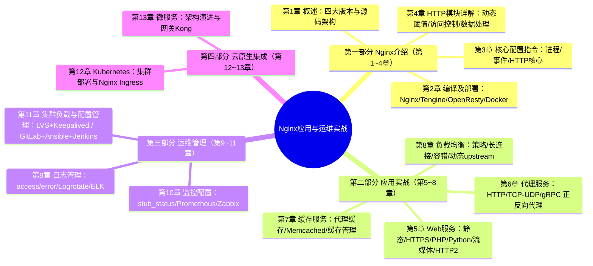
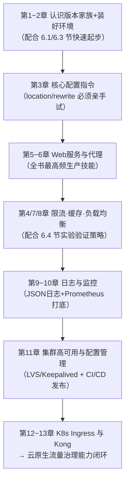

# 《Nginx 应用与运维实战》

> 作者：王小东（资深运维专家，十余年互联网企业运维和架构经验，曾就职于大众点评等知名互联网公司，EXIN 认证 DevOps Master）
> 出版：机械工业出版社，2020 年 8 月第 1 版，ISBN 9787111659921，431 页
> 定位：出版方官方描述——"一部基于 Nginx 新版本和云原生应用场景系统讲解 Nginx 的著作，是作者十余年运维经验的总结"

---

## 一、整体理解与逻辑结构（全书层面）

### 1.1 全局摘要

#### 1.1.1 书中/官方表述（引用）

出版方对本书的官方定位：

> "本书从应用、运维以及与 Kubernetes 和微服务集成 3 个维度对 Nginx 的基础知识、工作原理、核心应用、运维管理、集成扩展等重点内容进行了全面、细致的讲解。完全以实战为导向，包含大量的配置案例和示例代码。"（内容简介）

书中第 1 章对 Nginx 家族的梳理（1.1 节）明确了四个版本形态：**开源版 Nginx、商业版 Nginx Plus、分支版本 Tengine（淘宝）、扩展版本 OpenResty**；第 1.2 节"Nginx 源码架构浅析"则从**多进程模型、工作流机制、模块化**三方面剖析其高性能根源。

Nginx 官方（nginx.org）的经典定义可作对照：

> "nginx [engine x] is an HTTP and reverse proxy server, a mail proxy server, and a generic TCP/UDP proxy server, originally written by Igor Sysoev."
> （nginx 是一个 HTTP 与反向代理服务器、邮件代理服务器和通用 TCP/UDP 代理服务器，最初由 Igor Sysoev 编写。）

#### 1.1.2 通俗解释：Nginx 是什么，解决了什么问题

**Nginx 是互联网流量的"总门卫 + 分诊台"**。用户的每一次网页访问、每一次 App 请求，大概率第一个碰到的服务器软件就是它。

它解决的三大根本问题：

1. **C10K 问题（单机一万并发连接）**：Nginx 诞生（2004 年）就是为了解决 Apache 时代"一个连接一个进程/线程"撑不住高并发的困境。它采用**事件驱动 + 异步非阻塞**模型：少数几个 worker 进程，每个用 epoll 同时盯着成千上万个连接——像一个前台同时招呼一万个客人，谁有动静才理谁，而不是给每个客人雇一名专职服务员。
2. **流量的统一入口与分发**：反向代理 + 负载均衡，把外部请求按规则分发给后端成百上千台应用服务器，并顺手完成 HTTPS 卸载、缓存、限流、访问控制——它是后端集群的"防波堤"。
3. **云原生时代的流量网关**：本书的特色正在于此——Nginx 已从"一台 Web 服务器"进化为 Kubernetes 的 Ingress 入口和微服务网关（Kong 基于 OpenResty）的底座，这也是书名"应用与运维**实战**"和第四部分存在的原因。

一句话概括本书：**这不是一本"Nginx 指令字典"，而是一条从"编译部署 → 四大核心应用 → 日志监控集群运维 → 云原生集成"的完整运维职业路径图。**

### 1.2 逻辑框架图

全书四部分 13 章，遵循"认识它 → 用好它 → 管好它 → 融入云原生"的递进逻辑：



四部分的内在逻辑——**沿着"一名运维工程师接管 Nginx 的完整工作生命周期"展开**：


### 1.3 Nginx 与其他主流/以往技术的对比

| 维度         | Nginx（本书主角）                                      | Apache HTTP Server                                       | HAProxy           | LVS（书中 11 章配合使用）                | Envoy（云原生新贵）             |
| ------------ | ------------------------------------------------------ | -------------------------------------------------------- | ----------------- | ---------------------------------------- | ------------------------------- |
| 并发模型     | 事件驱动、异步非阻塞，多进程单线程 worker              | 传统 prefork 多进程/worker 多线程（2.4 事件 MPM 有改善） | 事件驱动单/多线程 | 内核态四层转发（IPVS）                   | 事件驱动多线程                  |
| 工作层级     | 四层（stream）+ 七层（http）                           | 七层                                                     | 四层 + 七层       | 仅四层                                   | 四层 + 七层                     |
| 内存占用     | 极低（万连接约几十 MB）                                | 高（每进程/线程独立开销）                                | 低                | 几乎为零（内核态）                       | 中等                            |
| 静态文件性能 | 极强（sendfile 零拷贝）                                | 一般                                                     | 不提供            | 不提供                                   | 不提供                          |
| 动态内容     | 转发给 FastCGI/uWSGI 等（第 5 章）                     | 可嵌入 mod_php 等模块内处理                              | 不提供            | 不提供                                   | 转发                            |
| 配置热更新   | reload 平滑重载；upstream 动态更新需 API/Plus（8.3.3） | 需 graceful 重启                                         | 支持 Runtime API  | ipvsadm 动态                             | 全动态 xDS API（最大优势）      |
| 扩展方式     | C 模块（需重编译）、Lua（OpenResty）                   | 动态模块 DSO 丰富                                        | 有限              | 无                                       | C++ Filter、WASM                |
| 可观测性     | stub_status 简单，需第三方模块/Exporter（第 10 章）    | mod_status                                               | 内置详细统计页    | ipvsadm 统计                             | 原生丰富指标（Prometheus 格式） |
| 云原生生态   | Ingress-Nginx（K8s 默认主流）、Kong 底座               | 边缘化                                                   | 部分 Ingress 方案 | K8s Service 底层（kube-proxy IPVS 模式） | Istio 服务网格数据面标配        |

**一段话总结**：Nginx 的核心优势是"一专多能 + 资源效率"——事件驱动模型让它以极小的内存代价扛住海量并发，既能做高性能静态 Web 服务器（胜过 Apache），又能做七层反向代理、缓存与负载均衡（功能广度胜过 HAProxy），还通过 OpenResty/Lua 获得可编程性（孕育了 Kong）；它不如 LVS 快在四层（所以书中第 11 章用 LVS+Keepalived 做 Nginx 集群的前置负载），也不如 Envoy 天生适配动态服务发现（所以 Istio 选了 Envoy），但凭借"够快、够稳、够省、生态最大"的综合平衡，Nginx 至今仍是全球市场份额第一的 Web 服务器与 K8s Ingress 的事实标准——这正是本书四部分布局的底层逻辑：先掌握本体，再借 LVS、Prometheus、K8s、Kong 补齐它的短板。

---

## 二、分章节解读

> 章节结构依据机械工业出版社官方目录逐节核对（四部分 13 章，小节页码见官方目录）。

| 章节     | 标题内容                     | 核心内容                                                                                                                                                                                                                                                                            | 关键例证/数据（如有）                                                                                                           |
| -------- | ---------------------------- | ----------------------------------------------------------------------------------------------------------------------------------------------------------------------------------------------------------------------------------------------------------------------------------- | ------------------------------------------------------------------------------------------------------------------------------- |
| 前言     | 写作背景与读者对象           | 十余年运维经验总结；面向有 Linux 基础的运维人员，兼顾 Web 开发与架构师；基于新版 Nginx 与云原生场景，软件部署采用 Docker 化方法                                                                                                                                                     | 全书三维度：应用、运维、K8s 与微服务集成                                                                                        |
| 第 1 章  | Nginx 概述                   | 四大版本形态：开源版、商业版 Nginx Plus、分支 Tengine、扩展版 OpenResty；源码架构三要素：多进程模型（master-worker）、工作流机制（11 个 HTTP 处理阶段）、模块化设计                                                                                                                 | 1.1.3 Tengine 为淘宝应对双 11 场景的分支；1.2.1 worker 进程数与 CPU 亲和性                                                      |
| 第 2 章  | Nginx 编译及部署             | 编译环境与 Linux 内核参数调优；Nginx/Tengine/OpenResty 三者源码编译与配置参数对比；添加第三方模块；注册 systemd 系统服务；Docker 容器化部署（Dockerfile 编写）                                                                                                                      | 2.1.2 内核参数（如 net.core.somaxconn）；2.3.4 Tengine 集成模块清单；2.6 Dockerfile 常用命令                                    |
| 第 3 章  | Nginx 核心配置指令           | 配置文件结构（main/events/http/server/location 层级）与计量单位、哈希表；进程管理/调优/调试与事件处理指令；HTTP 核心指令全解：初始化服务、请求处理、location 路由、rewrite 重写、访问控制、数据处理、关闭连接、日志                                                                 | 3.2.2 worker_processes/worker_cpu_affinity 调优；3.3.3 location 匹配优先级；3.3.4 rewrite 与 last/break/redirect/permanent 标志 |
| 第 4 章  | Nginx HTTP 模块详解          | 三类功能模块：动态赋值（geo/map/split_clients/GeoIP 城市信息）；访问控制（mirror 镜像、referer 防盗链、secure_link 连接校验、allow/deny、basic 认证、auth_request 认证转发、userid、limit_conn 并发限制、limit_req 频率限制）；数据处理（index、图片处理、sub 数据修改、gzip 压缩） | 4.1.4 split_clients 按比例分配（灰度基础）；4.2.9 limit_req 漏桶限流；4.3.5 gzip 压缩配置                                       |
| 第 5 章  | Nginx Web 服务应用实战       | 静态文件/下载服务器/SSI；HTTPS 服务器全套（密钥交换算法、会话缓存、双向认证、吊销证书）；PHP（FastCGI）与 Python（uWSGI）网站搭建；XSLT 转换；伪流媒体（mp4/flv）；HTTP/2 与 WebDAV                                                                                                 | 5.2 HTTPS 配置样例；5.4.1 CGI/FastCGI/SCGI/WSGI 协议辨析；5.7.1 HTTP/2 协议服务                                                 |
| 第 6 章  | Nginx 代理服务应用实战       | HTTP 正向/反向代理与 HTTPS 反向代理、获取真实客户端 IP（X-Forwarded-For）；stream 模块 TCP/UDP 代理、SSL 的 TCP 代理、proxy_protocol 传递真实 IP；gRPC 反向代理                                                                                                                     | 6.1.5/6.2.5 真实客户端 IP 两种场景方案；6.3 gRPC 模块指令与配置                                                                 |
| 第 7 章  | Nginx 缓存服务应用实战       | Web 缓存四层次：客户端缓存、正向代理缓存、CDN、反向代理缓存；proxy_cache 与 Memcached 缓存模块；镜像缓存、客户端缓存控制；缓存清除模块（ngx_cache_purge）的编译与指令                                                                                                               | 7.1.1 Expires/Cache-Control 客户端缓存机制；7.3.1 代理缓存服务器完整样例；7.4 缓存清除需第三方模块                              |
| 第 8 章  | Nginx 负载均衡应用实战       | upstream 服务器与策略指令；五种策略：轮询（加权）、一致性哈希、IP 哈希、最少连接、随机；长连接（keepalive）、容错机制（max_fails/proxy_next_upstream）、动态更新 upstream；HTTP/FastCGI/uWSGI/gRPC/Memcached 负载均衡配置；TCP/UDP 负载均衡及容错                                   | 8.2.2 一致性哈希减少节点变动时的缓存失效；8.3.1 upstream keepalive 长连接配置；8.3.3 动态更新 upstream 方案                     |
| 第 9 章  | Nginx 日志管理               | access_log/log_format 访问日志、error_log 错误日志；Logrotate 日志归档；syslog 输出；ELK（Elasticsearch+Logstash+Kibana）安装与 Nginx 日志收集分析                                                                                                                                  | 9.1.1 log_format 自定义 JSON 格式便于采集；9.2 ELK 架构与 Nginx 日志可视化分析                                                  |
| 第 10 章 | Nginx 监控配置及管理         | stub_status 连接状态监控与 Zabbix 集成；HTTP 主机状态监控（nginx-module-vts）与 TCP/UDP 主机状态监控（stream-server-traffic）第三方模块编译配置；Prometheus 部署、抓取 VTS 指标、告警；Zabbix 环境与 Agent、Zabbix 获取 Prometheus 数据                                             | 10.1.1 Active connections/accepts/handled/requests 指标含义；10.4 Prometheus+VTS 监控闭环；10.5.4 Zabbix 与 Prometheus 数据打通 |
| 第 11 章 | Nginx 集群负载与配置管理     | 多层负载均衡架构（LVS 四层 → Nginx 七层）；LVS 三种模式与调度算法、Keepalived 的 VRRP 高可用；Nginx 集群搭建；集群配置管理：GitLab（归档）+ Ansible（修改分发）+ Jenkins（发布）构建 Web 化配置管理框架                                                                             | 11.1.1 "LVS+Keepalived+Nginx"经典多层架构；11.2.5 完整的配置管理实例（Git 提交 →Jenkins 流水线 →Ansible 下发 →reload）          |
| 第 12 章 | Nginx 在 Kubernetes 中的应用 | K8s 架构与术语、集群部署、网络通信（CNI）；Nginx Ingress 原理（监听 API 动态生成 nginx.conf）、集成的第三方模块、安装部署、日志与监控管理；ConfigMap 全局配置与 Annotations 按 Ingress 粒度配置                                                                                     | 12.2.1 Ingress Controller 工作原理；12.3.2 Annotations 实现限流、会话保持、灰度发布等                                           |
| 第 13 章 | Nginx 在微服务架构中的应用   | 微服务的为什么/技术特点/进化路径（单体 →SOA→ 微服务）；基于 Nginx 的微服务网关：Nginx 产品组件、开源网关 Kong（基于 OpenResty）的安装部署与网关应用                                                                                                                                 | 13.1.3 微服务的进化脉络；13.2.2 Kong = OpenResty + PostgreSQL/Cassandra + 插件体系                                              |

---

## 四、以生命周期顺序按照技术点归纳整理分析

> 组织主线：**一台 Nginx 从"编译部署 → 配置骨架 → 接收请求（Web 服务）→ 转发请求（代理）→ 加速响应（缓存）→ 分发流量（负载均衡）→ 记录与观测（日志监控）→ 高可用集群 → 云原生形态"** 的完整生命周期。共 9 个技术点，每点按九个子项展开。

### 4.1 编译部署与进程模型（Nginx 的"出生"）【第 1~2 章】

**① 背景与解决的问题**：发行版仓库的 Nginx 版本旧、模块固定。源码编译解决"按需定制模块、启用最新特性、集成第三方模块（如 VTS 监控、cache_purge）"的问题；理解 master-worker 进程模型是后续一切调优的前提。

**② 作用与应用场景**：生产环境定制化构建；需要第三方模块（书中第 10 章 VTS、第 7 章 cache_purge 都要求重新编译）；Docker 镜像构建。

**③ 使用方法与书中示例**（第 2.2 节）：

```bash
# 获取源码并编译（书中2.2节流程）
wget http://nginx.org/download/nginx-1.17.4.tar.gz
tar zxmf nginx-1.17.4.tar.gz && cd nginx-1.17.4

./configure \
    --prefix=/usr/local/nginx \          # 安装根目录
    --with-http_ssl_module \             # HTTPS 支持（默认不编译）
    --with-http_v2_module \              # HTTP/2 支持
    --with-http_realip_module \          # 获取真实客户端IP
    --with-stream \                      # TCP/UDP 代理（第6章需要）
    --add-module=../nginx-module-vts     # 添加第三方模块（第10章监控）

make && make install

# 注册 systemd 服务（书中2.5.3）
systemctl enable nginx && systemctl start nginx
```

**④ 术语扩展**：

- **master-worker 模型**：master 进程负责读配置、管理 worker；worker 进程（建议数=CPU 核数）实际处理连接，单线程事件循环；
- **epoll**：Linux 的 I/O 多路复用机制（event poll），一个线程监视海量文件描述符，就绪才通知——Nginx 高并发的引擎；
- **DSO**：Dynamic Shared Object，动态模块（`load_module`，Nginx 1.9.11+ 支持，部分模块可不重编译主体）；
- **Tengine/OpenResty**：淘宝分支（增强 upstream 健康检查等）/ 章亦春创建的 Nginx+LuaJIT 扩展平台。

**⑤ 版本变化**：书基于 Nginx 1.17.x（当时 mainline）。此后重要演进：1.19 支持 OCSP、1.25 起支持 **HTTP/3（QUIC）**；配置方式上从"全部静态编译"演进为"核心+动态模块"：

```bash
# 旧：所有模块静态编入二进制，改模块必须整体重编译
./configure --with-http_geoip_module
# 新：编为动态模块，配置文件按需加载
./configure --with-http_geoip_module=dynamic
# nginx.conf 首行：
load_module modules/ngx_http_geoip_module.so;
```

**⑥ 对比主流技术的优势**：相比 Apache 的 prefork（每连接一进程），Nginx worker 单线程事件循环使内存占用低一个数量级；相比 Envoy 的 C++ 复杂构建，Nginx 编译门槛低、产物单一二进制、部署极简。

**⑦ 实际应用**：书中 2.6 节的 Docker 化部署是当前主流——官方镜像 `nginx:alpine` 体积仅约 20MB；自定义模块场景用多阶段构建：第一阶段编译带 VTS 的 Nginx，第二阶段拷贝产物进 alpine 基础镜像。

**⑧ 局限与解决方案**：静态编译改一个模块要全量重编译并平滑升级（`make upgrade`）——方案：优先用动态模块或直接选 OpenResty/Tengine 发行版；源码编译无包管理器的安全更新——方案：CI 流水线定期跟进版本（配合书中第 11 章 Jenkins 方案）。

**⑨ 通俗概括**：编译部署就是"按体检报告配眼镜"——发行版的 Nginx 是均码成衣，源码编译则按你的业务需求（要不要 HTTPS、TCP 代理、监控模块）量体裁衣。master 是"包工头"只管调度，worker 是真正干活的"多面手工人"，人数跟 CPU 核数对齐最高效。

### 4.2 核心配置指令体系（Nginx 的"骨架"）【第 3 章】

**① 背景与解决的问题**：Nginx 功能全部由配置指令驱动，指令有严格的作用域（上下文）与继承规则。不理解层级结构，就会出现"配置写了不生效""location 匹配不到"这类最高频的事故。

**② 作用与应用场景**：一切 Nginx 使用的基础；进程调优（worker 数、连接数上限）、请求路由（location）、URL 重写（rewrite）。

**③ 使用方法与书中示例**（第 3.1~3.3 节）：配置文件层级：

```nginx
# main 全局层（进程/事件相关，书中3.2）
user  nginx;
worker_processes  auto;              # worker数=CPU核数（auto为1.9.10+推荐写法）
worker_rlimit_nofile 65535;          # 每worker最大打开文件数

events {
    use epoll;                       # 事件模型（Linux下默认epoll）
    worker_connections  65535;       # 每worker最大连接数
}

http {                               # HTTP 层（书中3.3）
    include       mime.types;
    sendfile      on;                # 零拷贝发送文件
    keepalive_timeout  65;

    server {                         # 虚拟主机层
        listen       80;
        server_name  www.example.com;

        location / {                 # 路由层（书中3.3.3）
            root   /opt/nginx-web/www;
            index  index.html;
        }
    }
}
```

location 匹配优先级（书中 3.3.3 核心知识点）：**`=` 精确 > `^~` 前缀停止正则 > `~`/`~*` 正则（按出现顺序）> 普通前缀最长匹配**。

rewrite 四个标志（3.3.4）：`last`（重新走 location 匹配）、`break`（停止 rewrite 继续处理）、`redirect`（302 临时）、`permanent`（301 永久）。

**④ 术语扩展**：

- **指令上下文（Context）**：指令允许出现的层级（main/events/http/server/location/stream），配错层级 `nginx -t` 直接报错；
- **worker_connections**：单 worker 并发连接上限，做反向代理时一个请求占 2 个连接（客户端+上游），实际并发 ≈ worker 数 × 连接数 ÷2；
- **sendfile**：内核系统调用，文件数据不经用户态直接从磁盘发到网卡（零拷贝）；
- **哈希表指令**（书中 3.1.4）：如 server_names_hash_max_size，域名多时需调大。

**⑤ 版本变化**：`worker_processes auto`（1.9.10+）取代手写数字；`listen 443 ssl` 取代早期 `ssl on` 指令（1.15.0 移除后者）；`http2` 由 `listen ... http2` 参数（书中写法）演进为独立指令 `http2 on;`（1.25.1+）。

**⑥ 对比主流技术的优势**：Nginx 声明式配置 + `nginx -t` 语法校验 + `reload` 平滑生效（老 worker 处理完存量连接才退出），比 Apache 重启更平滑；对比 Envoy 的 YAML/xDS，Nginx 配置更简洁易读，但动态性差（见 ⑧）。

**⑦ 实际应用**：一份生产级最小骨架 = 全局调优（worker/文件句柄）+ gzip + keepalive + 按业务拆分的 `include conf.d/*.conf`——正是书中 3.2.5 与 3.3.9 两个"配置样例"小节的组合。

**⑧ 局限与解决方案**：配置变更必须 reload，upstream 节点变化频繁的微服务场景不友好——方案：动态 DNS resolver、书中 8.3.3 动态 upstream、或直接用 Ingress/Kong（第 12~13 章）；location 规则复杂后可读性差——方案：拆分 include + map 集中管理变量。

**⑨ 通俗概括**：nginx.conf 像"俄罗斯套娃"：最外层管进程（雇几个工人），events 层管接客方式（epoll 是"叫号器"），http→server→location 逐层缩小管辖范围——server 是"哪家店"，location 是"店里哪个柜台"。记住柜台的匹配优先级，就避开了 Nginx 配置 80% 的坑。

### 4.3 HTTP 功能模块：访问控制与限流（大门的"安检"）【第 4 章】

**① 背景与解决的问题**：流量入口必须防盗链、防爬虫、防突发流量打垮后端。第 4 章的三组模块（动态赋值/访问控制/数据处理）解决"识别请求 → 控制请求 → 加工响应"的问题。

**② 作用与应用场景**：防盗链（referer）、内网接口保护（allow/deny）、后台 basic 认证、统一鉴权（auth_request）、秒杀限流（limit_req）、灰度分流（split_clients）。

**③ 使用方法与书中示例**（第 4.2 节）：

```nginx
# 并发连接限制（书中4.2.8）：每客户端IP最多10个并发连接
http {
    limit_conn_zone $binary_remote_addr zone=addr:10m;  # 10MB共享内存存计数
    server {
        location /download/ {
            limit_conn addr 10;
        }
    }
}

# 请求频率限制（书中4.2.9）：漏桶算法，每IP每秒1个请求，允许突发5个排队
http {
    limit_req_zone $binary_remote_addr zone=one:10m rate=1r/s;
    server {
        location /search/ {
            limit_req zone=one burst=5;      # 不加 nodelay 则匀速放行
        }
    }
}

# referer 防盗链（书中4.2.2）
location ~* \.(gif|jpg|png)$ {
    valid_referers none blocked *.example.com;
    if ($invalid_referer) { return 403; }
}
```

**④ 术语扩展**：

- **$binary_remote_addr**：客户端 IP 的二进制形式（4 字节），比字符串 $remote_addr 省内存；
- **漏桶算法（Leaky Bucket）**：limit_req 的原理——请求先进桶，按恒定速率流出，桶满则溢出（拒绝 503）；`burst` 是桶容量，`nodelay` 表示突发不排队立即处理但占额度；
- **auth_request**：子请求鉴权模块，把认证委托给后端服务（返回 2xx 放行/401、403 拒绝），是"网关统一鉴权"的雏形；
- **mirror**：流量镜像，复制生产流量到测试环境（书中 4.2.1）。

**⑤ 版本变化**：limit_req 的 `delay=` 参数（1.15.7+）支持"前 N 个不延迟、超出部分限速"的两段式限流，书中版本已可用；早期 limit_zone 指令（对应 limit_conn 旧版）在 1.7.x 已废弃。

**⑥ 对比主流技术的优势**：相比在应用代码里限流，Nginx 层限流在请求进入业务前拦截，成本最低；相比专业网关（Kong/Sentinel），Nginx 原生限流无需额外组件、性能损耗几乎为零。为什么？因为计数发生在共享内存，纳秒级操作。

**⑦ 实际应用**：秒杀场景组合拳——`limit_req`（每 IP 限速）+ `limit_conn`（每 IP 并发）+ `limit_rate`（下载带宽）三层防线；灰度发布用 split_clients 按用户 ID 哈希切 5% 流量到新版本 upstream（书中 4.1.4）。

**⑧ 局限与解决方案**：限流计数按单机共享内存，Nginx 集群下每台独立计数，总限额=单机 × 台数——方案：网关层用 Kong 的 Redis 集中式限流插件（书第 13 章）或 OpenResty+Redis 自研；基于 IP 限流对 NAT 出口用户误伤——方案：改用 cookie/用户 ID 维度的 key。

**⑨ 通俗概括**：第 4 章是给大门装"安检系统"：referer 防盗链是"查邀请函"，basic 认证是"输门禁密码"，limit_req 是"闸机匀速放人"——人再多也按每秒 N 个进，排队区（burst）满了就劝返（503）。所有检查都在门口完成，坏人根本摸不到后端的门。

### 4.4 Web 服务与 HTTPS（第一职业：内容服务器）【第 5 章】

**① 背景与解决的问题**：Nginx 的本职是高性能 Web 服务器：静态文件直出、动态请求经 FastCGI/uWSGI 协议交给 PHP/Python 处理、全站 HTTPS 加密。解决"静态快、动态通、传输安全"三问题。

**② 作用与应用场景**：官网/前端 SPA 托管、下载站、PHP（WordPress 等）与 Python（Django/Flask）网站、视频伪流媒体、HTTP/2 加速。

**③ 使用方法与书中示例**（第 5.2 节 HTTPS 核心配置）：

```nginx
server {
    listen 443 ssl http2;                        # 同端口启用SSL与HTTP/2
    server_name www.example.com;

    ssl_certificate     ssl/www_example_com.crt; # 服务器证书（含中间链）
    ssl_certificate_key ssl/www_example_com.key; # 私钥
    ssl_protocols       TLSv1.2 TLSv1.3;         # 禁用不安全的旧协议
    ssl_ciphers         HIGH:!aNULL:!MD5;        # 加密套件
    ssl_session_cache   shared:SSL:10m;          # 会话缓存（书中5.2.4）：复用握手结果
    ssl_session_timeout 10m;
}
# HTTP 强制跳转 HTTPS
server {
    listen 80;
    server_name www.example.com;
    return 301 https://$host$request_uri;
}
```

PHP 网站（书中 5.3，FastCGI 转发）：

```nginx
location ~ \.php$ {
    fastcgi_pass   127.0.0.1:9000;               # 转给 php-fpm
    fastcgi_index  index.php;
    fastcgi_param  SCRIPT_FILENAME $document_root$fastcgi_script_name;
    include        fastcgi_params;
}
```

**④ 术语扩展**：

- **CGI/FastCGI/SCGI/WSGI**（书中 5.4.1 专节辨析）：CGI = Common Gateway Interface，每请求 fork 一个进程（慢）；FastCGI 常驻进程复用（PHP-FPM 即 FastCGI Process Manager）；WSGI = Web Server Gateway Interface，Python 专属规范，uWSGI 是其实现容器；
- **SSL/TLS**：Secure Sockets Layer / Transport Layer Security，SSL 是旧称，现行协议均为 TLS；
- **SSI**：Server Side Includes，服务器端包含，HTML 里嵌 `<!--#include -->` 的"伪动态"技术（书中 5.1.3）；
- **双向认证（mTLS）**：服务器也验证客户端证书（书中 5.2.5），用于银行 U 盾、内部服务互信。

**⑤ 版本变化**：TLS 1.3（Nginx 1.13.0+ 支持）握手从 2-RTT 降为 1-RTT；HTTP/2（书中 5.7.1）多路复用取代 HTTP/1.1 队头阻塞，新旧配置对比：

```nginx
# HTTP/1.1 时代：靠多域名分片突破6连接限制（已成反模式）
# HTTP/2（书中写法）：
listen 443 ssl http2;
# HTTP/3 QUIC（Nginx 1.25+，书出版后的演进）：
listen 443 quic reuseport;
add_header Alt-Svc 'h3=":443"; ma=86400';
```

**⑥ 对比主流技术的优势**：静态文件场景 Nginx 凭 sendfile 零拷贝 + epoll，吞吐远超 Apache；对比 Node.js/Python 自带的静态服务，Nginx 是 C 实现且无 GC 停顿。动态内容上 Nginx"只转发不执行"的设计使 worker 永不被慢脚本阻塞——职责分离正是其稳定性来源。

**⑦ 实际应用**：前后端分离标准配置——`location /` 托管前端静态资源 + `try_files $uri $uri/ /index.html`（SPA 路由回退）+ `location /api/` 反代后端；证书用 Let's Encrypt 免费签发，certbot 自动续期。

**⑧ 局限与解决方案**：Nginx 不执行动态代码，PHP/Python 需另起 FPM/uWSGI 进程并维护其健壮性——方案：容器化各司其职（书中 2.6 思想）；HTTPS 私钥明文放服务器有泄露风险——方案：文件权限最小化、或商业版/OpenResty 对接 KMS。

**⑨ 通俗概括**：第 5 章是 Nginx 的"本职工作"：静态文件像"自助货架"直接拿（sendfile 连收银员的手都不过）；PHP/Python 请求像"定制菜"，Nginx 只当传菜员递给后厨（FPM/uWSGI），绝不亲自下厨；HTTPS 则是给所有对话加上"防窃听电话线"，session 缓存让老客户免去每次重新对暗号。

### 4.5 代理服务：正向、反向与四层代理（第二职业：中间人）【第 6 章】

**① 背景与解决的问题**：后端服务不能裸奔在公网。反向代理解决"隐藏后端、统一入口、协议卸载"；stream 四层代理把能力从 HTTP 扩展到 MySQL、Redis、DNS 等任意 TCP/UDP 服务；真实客户端 IP 的传递则是代理架构下最经典的难题。

**② 作用与应用场景**：API 网关雏形、HTTPS 卸载、内网穿透正向代理、数据库/消息队列的四层入口、gRPC 微服务代理。

**③ 使用方法与书中示例**（第 6.1、6.2 节）：

```nginx
# HTTP 反向代理（书中6.1.3）+ 真实IP传递（6.1.5）
location / {
    proxy_pass http://192.168.2.145:8080;
    proxy_set_header Host $host;                          # 传递原始域名
    proxy_set_header X-Real-IP $remote_addr;              # 真实客户端IP
    proxy_set_header X-Forwarded-For $proxy_add_x_forwarded_for;  # 追加代理链
    proxy_http_version 1.1;
    proxy_set_header Connection "";                       # 启用与上游的长连接
}

# TCP 四层代理（书中6.2.3）：代理 MySQL
stream {
    server {
        listen 3306;
        proxy_pass 192.168.2.145:3306;
        proxy_timeout 10m;
    }
}

# gRPC 反向代理（书中6.3.3）
server {
    listen 443 ssl http2;
    location / {
        grpc_pass grpc://192.168.2.145:50051;
    }
}
```

**④ 术语扩展**：

- **正向代理 vs 反向代理**：正向代理替**客户端**出面（客户端知道目标，如翻墙/内网上网出口）；反向代理替**服务端**接客（客户端只见代理，不知后端）；
- **X-Forwarded-For（XFF）**：HTTP 头，记录请求经过的代理链 IP 列表，`$proxy_add_x_forwarded_for` 在原值后追加直连 IP；
- **proxy_protocol**：四层代理传真实 IP 的协议（HAProxy 发明，书中 6.2.5）——TCP 层没有 HTTP 头，只能在连接建立时前置一段元数据；
- **gRPC**：Google Remote Procedure Call，基于 HTTP/2 的高性能 RPC 框架（书中 6.3.1）。

**⑤ 版本变化**：stream 模块 1.9.0 引入（此前四层只能靠 LVS/HAProxy）；gRPC 代理 1.13.10 引入——书中内容均基于这些"当时的新特性"；此后 1.25+ 的 HTTP/3 也可反代。

**⑥ 对比主流技术的优势**：与 HAProxy 相比，Nginx 四层+七层+静态服务+缓存一体，减少组件数量；与 LVS 相比，Nginx 工作在用户态可改写请求内容（LVS 内核态只能转发）。优势来源：模块化架构让 http 与 stream 共享同一事件引擎。

**⑦ 实际应用**：K8s 之外最常见的"单机多服务"布局——80/443 一个 Nginx 统一入口，按 server_name 分发到本机不同端口的应用；数据库读写分离入口用 stream + 两个 listen 端口分别指向主/从库。

**⑧ 局限与解决方案**：默认不带上游健康检查（被动式 max_fails 只在真实请求失败后摘除）——方案：Tengine 的 ngx_http_upstream_check_module 主动探测，或商业版 Nginx Plus（书中 8.3.2 相关讨论）；正向代理不支持 HTTPS 的 CONNECT 方法——方案：第三方 ngx_http_proxy_connect_module 补丁。

**⑨ 通俗概括**：反向代理就是"公司前台"：外人只知道前台电话（域名+443），前台再转接给具体工位（后端节点），工位搬动外人无感知。四层代理则是"电话总机"级别——不听内容只接线，所以连 MySQL 这种"外语通话"也能转。XFF 头像快递单上的"转运记录"，一路盖章，后端才知道包裹最初从哪儿寄出。

### 4.6 缓存服务（给后端"挡子弹"）【第 7 章】

**① 背景与解决的问题**：同样的页面/接口被重复请求，后端重复计算是巨大浪费。代理缓存把响应存在 Nginx 本地磁盘/内存，命中则后端零压力，解决"降源站负载、提响应速度、扛突发流量"。

**② 作用与应用场景**：资讯类页面、商品详情、图片/静态资源边缘缓存、API 短时缓存、后端故障时的降级兜底（stale 旧缓存救急）。

**③ 使用方法与书中示例**（第 7.2.1、7.3.1 节）：

```nginx
http {
    # 定义缓存区：磁盘路径 + 两级目录 + 共享内存索引名及大小 + 上限与淘汰
    proxy_cache_path /usr/local/nginx/nginx-cache
                     levels=1:2
                     keys_zone=mycache:10m       # 10MB内存约存8万个key
                     max_size=10g
                     inactive=60m                # 60分钟无访问则淘汰
                     use_temp_path=off;

    server {
        location / {
            proxy_cache mycache;
            proxy_cache_key $scheme$proxy_host$request_uri;   # 缓存键
            proxy_cache_valid 200 302 10m;                    # 各状态码缓存时长
            proxy_cache_valid 404 1m;
            proxy_cache_use_stale error timeout updating;     # 上游故障时用旧缓存兜底
            add_header X-Cache-Status $upstream_cache_status; # 命中情况：HIT/MISS/EXPIRED
            proxy_pass http://backend;
        }
    }
}
```

客户端缓存控制（书中 7.1.1、7.3.4）：

```nginx
location ~* \.(js|css|png|jpg)$ {
    expires 30d;                     # 生成 Expires 与 Cache-Control: max-age
    add_header Cache-Control "public";
}
```

**④ 术语扩展**：

- **CDN**：Content Delivery Network，内容分发网络（书中 7.1.3）——把缓存节点铺到离用户最近的机房，本质是"分布式的代理缓存"；
- **keys_zone**：共享内存区，存缓存键与元数据，1MB≈8000 个键；
- **$upstream_cache_status**：HIT（命中）/MISS（未命中）/EXPIRED（过期回源）/STALE（用旧数据）/UPDATING；
- **缓存穿透/击穿/雪崩**：请求不存在的 key 直打后端 / 热 key 过期瞬间并发回源 / 大量 key 同时失效——Nginx 对应解法：缓存 404（proxy_cache_valid 404）、`proxy_cache_lock on`（击穿时只放一个请求回源）、随机化过期时间。

**⑤ 版本变化**：`proxy_cache_purge` 清除缓存始终未进开源版（书中 7.4 需编译第三方 ngx_cache_purge 模块，商业版 Plus 原生支持）；`proxy_cache_background_update`（1.11.10+）支持后台异步更新过期缓存，用户永远拿到即时响应。

**⑥ 对比主流技术的优势**：与专业缓存服务器 Varnish 相比，Nginx 缓存虽无 VCL 灵活语言，但"代理+缓存+SSL 一体"省一层组件且支持 HTTPS（Varnish 开源版不终止 TLS）；与应用内 Redis 缓存相比，Nginx 缓存在请求进应用之前生效，连应用框架的开销都省了。

**⑦ 实际应用**：新闻站点用"微缓存"策略——动态页只缓存 1 秒（`proxy_cache_valid 200 1s`）+ `proxy_cache_lock`，突发十万并发时后端每秒仅承受 1 个回源请求，QPS 放大十万倍。

**⑧ 局限与解决方案**：开源版无缓存清除接口，更新内容后不能主动失效——方案：编译 ngx_cache_purge（书中 7.4）或按 URL 版本号发布（`app.js?v=2.1`）；单机磁盘缓存无法多台共享，命中率被分摊——方案：一致性哈希负载（第 8 章 hash $request_uri consistent）让同一 URL 固定落到同一台缓存节点。

**⑨ 通俗概括**：代理缓存是"后厨门口的保温餐台"：第一位客人点的菜做好后留一份在餐台（MISS→ 存储），后面点同样菜的客人直接从餐台端走（HIT），后厨（后端）压力骤降。`use_stale` 是"后厨着火了就先上保温菜"，`cache_lock` 是"同一道菜只让一个服务员进后厨催"。

### 4.7 负载均衡（把流量"端平"）【第 8 章】

**① 背景与解决的问题**：单台后端撑不住就要加机器，加了机器就要解决"流量怎么分、坏了怎么摘、会话怎么保持"。upstream 模块解决水平扩展的入口问题。

**② 作用与应用场景**：Web/API 集群分发、FastCGI/uWSGI/gRPC/Memcached 多协议负载（书中 8.3.4~8.3.8）、TCP/UDP 四层负载（数据库、DNS）。

**③ 使用方法与书中示例**（第 8.1~8.3 节）：

```nginx
upstream backend {
    # 加权轮询（默认策略，书中8.2.1）
    server 192.168.2.145:8080 weight=5;          # 权重5：分到5/8流量
    server 192.168.2.146:8080 weight=2;
    server 192.168.2.147:8080 backup;            # 备份节点：全挂才启用

    # 容错参数（书中8.3.2）：10秒内失败3次则摘除30秒
    # server ... max_fails=3 fail_timeout=30s;

    keepalive 32;                                # 与上游保持32个长连接（书中8.3.1）
}

server {
    location / {
        proxy_pass http://backend;
        # 失败自动切换下一台（容错机制核心）
        proxy_next_upstream error timeout http_500 http_502;
    }
}
```

五种策略速查（书中 8.2）：

| 策略       | 指令                           | 适用场景                           |
| ---------- | ------------------------------ | ---------------------------------- |
| 加权轮询   | 默认                           | 通用、无状态服务                   |
| 一致性哈希 | `hash $request_uri consistent` | 缓存集群（节点变动只影响少量 key） |
| IP 哈希    | `ip_hash`                      | 会话保持（同 IP 固定同后端）       |
| 最少连接   | `least_conn`                   | 请求耗时差异大的服务               |
| 随机       | `random [two]`                 | 大规模集群（两次随机取连接少者）   |

**④ 术语扩展**：

- **upstream**：上游，Nginx 视角中被代理的后端服务器组；
- **一致性哈希（Consistent Hashing）**：哈希环算法，增删节点只迁移环上相邻区间的 key，避免"全量缓存失效雪崩"；
- **会话保持（Session Persistence）**：让同一用户请求固定到同一后端（ip_hash/cookie），否则登录态丢失；
- **backup/down**：server 指令参数——备用节点/手动标记下线。

**⑤ 版本变化**：`random`（1.15.1+）与 `random two least_conn` 是书中提及的较新策略；开源版动态更新 upstream（书中 8.3.3）长期依赖第三方（如 Tengine 的 dyups）或 DNS resolver 定时解析，商业版 Plus 提供 API；**Nginx 1.27.3+ 开源版终于加入原生 `resolve` 参数支持域名动态解析**（书出版后的重要演进）。

**⑥ 对比主流技术的优势**：与 LVS 相比，Nginx 七层负载可按 URL/Header/Cookie 精细分流并重试失败请求（LVS 四层做不到）；与 F5 等硬件相比零成本、配置即代码。为什么强？因为负载决策发生在完整解析 HTTP 之后，信息量最大。

**⑦ 实际应用**：灰度发布组合——split_clients（第 4 章）按比例产生变量，map 到不同 upstream 组；带权重滚动升级：新版本节点先 weight=1 观察，逐步提权到与旧节点持平，异常则秒级回滚（reload）。

**⑧ 局限与解决方案**：开源版无主动健康检查，节点"半死不活"（连接通但响应慢）难以及时摘除——方案：Tengine check 模块 / Plus / 外置 Consul+consul-template 生成配置；ip_hash 在移动网络 IP 漂移下会话仍会丢——方案：改用 cookie 维度（sticky 模块）或后端 session 集中存 Redis。

**⑨ 通俗概括**：负载均衡是"银行大堂经理"：默认按窗口空闲轮着叫号（轮询），VIP 窗口多派点人（weight），某窗口柜员晕倒立刻停止叫号（max_fails 摘除）并把手头客户引到隔壁（proxy_next_upstream）。一致性哈希则像"老客户固定理财经理"——经理离职也只影响他名下客户，别人不动。

### 4.8 日志、监控与集群高可用（运维的"仪表盘+保险丝"）【第 9~11 章】

**① 背景与解决的问题**：跑起来只是开始——出了问题要能查（日志）、要能提前发现（监控）、入口本身不能是单点（集群高可用）、几十台 Nginx 的配置不能手工改（配置管理）。这三章构成完整的运维闭环。

**② 作用与应用场景**：故障溯源、容量规划、SLA 报表、7×24 高可用入口、集群配置的版本化与一键发布。

**③ 使用方法与书中示例**：

```nginx
# 日志（书中9.1.1）：JSON 格式便于 ELK 采集
log_format json_log escape=json
    '{"time":"$time_iso8601","remote_addr":"$remote_addr",'
    '"request":"$request","status":$status,'
    '"request_time":$request_time,"upstream_time":"$upstream_response_time"}';
access_log /var/log/nginx/access.log json_log;

# 状态监控（书中10.1）：stub_status
location /nginx_status {
    stub_status;                 # 输出 Active connections / accepts / handled / requests
    allow 192.168.2.0/24; deny all;
}
```

高可用架构（书中 11.1）："LVS(四层, DR 模式) + Keepalived(VRRP 漂移 VIP) → 多台 Nginx(七层) → 应用集群"；Keepalived 核心片段：

```bash
vrrp_instance VI_1 {
    state MASTER                 # 备机写 BACKUP
    interface eth0
    virtual_router_id 51
    priority 100                 # 备机写更低值，主挂则VIP漂到备机
    virtual_ipaddress { 192.168.2.100 }   # 对外统一的虚拟IP
}
```

配置管理流水线（书中 11.2）：**GitLab 存配置（版本化）→ Jenkins 触发发布 → Ansible 批量下发 → `nginx -t` 校验 → reload**。

**④ 术语扩展**：

- **ELK**：Elasticsearch（存储检索）+ Logstash（采集解析）+ Kibana（可视化），书中 9.2；现常以轻量 Filebeat 替代 Logstash 采集端；
- **VRRP**：Virtual Router Redundancy Protocol，虚拟路由冗余协议——多台机器竞选持有同一个虚拟 IP（VIP），主挂秒级漂移；
- **VTS**：nginx-module-vts（Virtual host Traffic Status），第三方流量状态模块，输出按域名/upstream 细分的指标并支持 Prometheus 格式（书中 10.2）；
- **Prometheus**：CNCF 毕业的拉模式时序监控系统，配 Alertmanager 告警（书中 10.4）；
- **DR 模式**：LVS Direct Routing，回包不经 LVS 直达客户端，性能最高（书中 11.1.2）。

**⑤ 版本变化**：监控从书中"Zabbix 为主、Prometheus 为辅"（10.5.4 还讲 Zabbix 拉取 Prometheus 数据）演进为云原生时代 **Prometheus + Grafana 为绝对主流**；日志采集从 Logstash 重代理演进为 Filebeat/Vector 轻代理；配置管理从 Ansible 推送演进为 GitOps（ArgoCD）声明式。

**⑥ 对比主流技术的优势**：Nginx 的 access_log 变量体系（$request_time、$upstream_response_time 等百余个变量）开箱即得全链路耗时拆分，无需应用埋点即可定位"慢在网络、Nginx 还是后端"——这是很多商业 APM 的基础数据源。

**⑦ 实际应用（书中 11.2.5 实例思路）**：50 台 Nginx 集群——运维在 GitLab 提 MR 修改配置 → 评审合并 → Jenkins 流水线用 Ansible 先灰度 2 台并 `nginx -t` + 拨测 → 全量下发 reload → 失败自动 git revert 回滚。配置事故率趋近于零。

**⑧ 局限与解决方案**：stub_status 指标太粗（只有连接数）——方案：编译 VTS 模块（书中 10.2）或用 nginx-prometheus-exporter；Keepalived 双机只有一台干活（浪费）——方案：双 VIP 互为主备 + DNS 轮询两条 A 记录；ELK 资源消耗大——方案：小规模改用 Loki+Grafana 轻量方案。

**⑨ 通俗概括**：这三章给 Nginx 配齐了"行车记录仪（日志）+ 仪表盘（监控）+ 双保险（Keepalived VIP 漂移：正副驾驶随时接管方向盘）+ 车队调度系统（GitLab/Ansible/Jenkins 管理几十辆车的统一改装）"。没有这套东西，Nginx 跑得再快也只是"裸奔的赛车"。

### 4.9 云原生形态：Kubernetes Ingress 与微服务网关 Kong（Nginx 的"进化"）【第 12~13 章】

**① 背景与解决的问题**：容器时代 Pod IP 动态漂移、微服务数量爆炸，手工改 nginx.conf 彻底不可行。Ingress Controller 解决"K8s 集群流量入口的声明式自动化"；Kong 解决"微服务网关的认证/限流/插件化治理"。

**② 作用与应用场景**：K8s 集群统一域名入口、按路径路由到不同 Service、灰度/会话保持/限流的注解化配置；Kong 用于多团队 API 治理、统一鉴权计费。

**③ 使用方法与书中示例**（第 12.2~12.3 节）：Nginx Ingress 的原理是"**监听 K8s API 中 Ingress/Service/Endpoint 资源变化 → 自动渲染 nginx.conf → reload/动态更新**"。

```yaml
# Ingress 资源示例（书中12.3 思想，按现行 networking.k8s.io/v1 语法）
apiVersion: networking.k8s.io/v1
kind: Ingress
metadata:
  name: web-ingress
  annotations:
    # 注解=书中12.3.2主题：按Ingress粒度定制Nginx行为
    nginx.ingress.kubernetes.io/limit-rps: "10" # 每秒10请求限流
    nginx.ingress.kubernetes.io/affinity: "cookie" # 会话保持
    nginx.ingress.kubernetes.io/canary: "true" # 灰度发布
    nginx.ingress.kubernetes.io/canary-weight: "10" # 10%流量到新版本
spec:
  ingressClassName: nginx
  rules:
    - host: www.example.com
      http:
        paths:
          - path: /api
            pathType: Prefix
            backend:
              service:
                name: api-service
                port: { number: 80 }
```

ConfigMap（书中 12.3.1）管全局：如 `use-gzip: "true"`、`worker-processes` 等映射为 nginx.conf 全局指令。

Kong（书中 13.2）：基于 OpenResty，数据面仍是 Nginx，管理面提供 Admin API 与插件体系：

```bash
# Kong 声明式添加服务与限流插件（书中13.2.4 应用思路）
curl -X POST http://localhost:8001/services \
  --data name=user-service --data url=http://upstream:8080
curl -X POST http://localhost:8001/services/user-service/routes \
  --data 'paths[]=/users'
curl -X POST http://localhost:8001/services/user-service/plugins \
  --data name=rate-limiting --data config.minute=100     # 每分钟100次
```

**④ 术语扩展**：

- **Ingress / Ingress Controller**：K8s 的七层路由**规则资源** / 真正执行规则的**控制器程序**（Nginx Ingress 是最主流实现）；
- **ConfigMap / Annotations**：K8s 配置字典（全局生效）/ 资源上的键值注解（单 Ingress 生效）——书中 12.3 两节正是这对"全局 vs 局部"配置通道；
- **CNI**：Container Network Interface，容器网络接口规范（书中 12.1.4）；
- **Kong**：基于 OpenResty 的开源 API 网关，插件生态（鉴权/限流/日志/转换）+ PostgreSQL/无 DB 声明式配置；
- **OpenResty**：Nginx + LuaJIT，让 Nginx 用 Lua 脚本可编程——Kong 的底座（呼应第 1、2 章）。

**⑤ 版本变化**：书中 Ingress API 为 `extensions/v1beta1`/`networking.k8s.io/v1beta1`，**K8s 1.22 起仅保留 `networking.k8s.io/v1`**（pathType 必填、backend 写法变化，上方示例已用新语法）；Ingress-Nginx 0.x → 1.x 要求 IngressClass 资源；Kong 从书中 1.x 演进到 3.x（路由引擎重写、原生支持 K8s Gateway API）。

**⑥ 对比主流技术的优势**：Nginx Ingress 相比云厂商 LB 直连——免厂商锁定、注解生态最丰富、社区文档最多；Kong 相比自研网关——插件即装即用、集群限流（Redis）开箱即得。二者优势同源：复用 Nginx/OpenResty 久经考验的数据面性能。

**⑦ 实际应用**：电商 K8s 集群标准入口——云 LB(四层) → Ingress-Nginx(七层, canary 注解做灰度) → 各业务 Service；对外开放 API 再加一层 Kong 做 key-auth 鉴权与配额计费——正是书中第 12、13 章的组合落地。

**⑧ 局限与解决方案**：Ingress 注解本质是字符串魔法，复杂路由表达力有限且各 Controller 注解不通用——方案：K8s **Gateway API**（Ingress 的继任标准，见第七节）；Ingress-Nginx 频繁 reload 在超大集群抖动——方案：调大 batch 合并阈值或换用基于 Envoy 的动态方案；Kong 开源版无图形管理界面——方案：Konga/Kong Manager OSS。

**⑨ 通俗概括**：第 12~13 章讲的是 Nginx 的"转职"：过去运维手写 nginx.conf 像"手工记账"；Ingress Controller 变成"智能记账机器人"——你在 K8s 里声明"我要 www 域名指到这个服务"，它自动改配置、自动生效。Kong 则是把 Nginx 升级成"收费站集团总部"：哪条路要收费（鉴权）、限速多少（限流）、装什么摄像头（日志插件），Admin API 一声令下全网生效。

---

## 五、输出格式与语言风格自检

| 要求                 | 落实情况                                                                                                                                                                                                       |
| -------------------- | -------------------------------------------------------------------------------------------------------------------------------------------------------------------------------------------------------------- |
| 清晰标题层级         | 一级（部分）/二级（节）/三级（技术点子项）多层递进                                                                                                                                                             |
| 思维导图/表格/流程图 | 1.2 Mermaid mindmap + 生命周期 flowchart；1.3/二/4.7 等多处对比表                                                                                                                                              |
| 引用与章节标注       | 官方内容简介、nginx.org 定义均注明来源；技术点均标注对应章节小节（如 4.2.9 limit_req、8.3.2 容错、12.3.2 Annotations）；书出版后的演进（HTTP/3、Ingress v1 API、Kong 3.x 等）均明确标注为"书出版后的演进/补充" |
| 学术准确 + 通俗表达  | 每个技术点保留规范术语并在 ④ 展开全称含义，⑨ 提供生活化类比                                                                                                                                                    |
| 缩写扩展             | epoll/DSO/CGI-FastCGI-WSGI/SSL-TLS/mTLS/XFF/CDN/ELK/VRRP/VTS/VIP/CNI/Ingress/gRPC 等均给出全称与解释                                                                                                           |

---

## 六、技术环境搭建：Nginx 实战环境（对应书中第 2 章的现代化方案）

书中第 2 章基于 CentOS 与 Nginx 1.17 源码编译。以下按当前主流（Ubuntu 22.04 / Rocky Linux 9 + Nginx stable 1.26+）给出三种可逐步执行的方案，覆盖"快速上手 → 源码定制 → 容器化"。

### 6.1 方案 A：官方仓库安装（10 分钟上手，日常首选）

```bash
# Ubuntu 22.04 —— 使用 nginx.org 官方仓库（版本比系统仓库新）
# 1. 安装依赖与官方签名密钥
sudo apt update && sudo apt install -y curl gnupg2 ca-certificates lsb-release
curl https://nginx.org/keys/nginx_signing.key | gpg --dearmor \
  | sudo tee /usr/share/keyrings/nginx-archive-keyring.gpg >/dev/null

# 2. 添加官方 stable 仓库
echo "deb [signed-by=/usr/share/keyrings/nginx-archive-keyring.gpg] \
http://nginx.org/packages/ubuntu $(lsb_release -cs) nginx" \
  | sudo tee /etc/apt/sources.list.d/nginx.list

# 3. 安装并启动
sudo apt update && sudo apt install -y nginx
sudo systemctl enable --now nginx

# 4. 验证
nginx -v                      # 输出版本号
curl -I http://127.0.0.1      # 应返回 HTTP/1.1 200 OK 与 Server: nginx
```

### 6.2 方案 B：源码编译（对应书中 2.2，需第三方模块时用）

```bash
# Rocky Linux 9 / CentOS Stream
# 1. 编译工具链与依赖库
sudo dnf groupinstall -y "Development Tools"
sudo dnf install -y pcre2-devel zlib-devel openssl-devel git wget

# 2. 下载源码（以 stable 1.26.2 为例）与第三方模块（VTS 监控，对应书中第10章）
cd /usr/local/src
wget https://nginx.org/download/nginx-1.26.2.tar.gz
tar zxf nginx-1.26.2.tar.gz
git clone https://github.com/vozlt/nginx-module-vts.git

# 3. 配置编译参数（与书中2.2.2对应，模块按需增减）
cd nginx-1.26.2
./configure \
  --prefix=/usr/local/nginx \
  --user=nginx --group=nginx \
  --with-http_ssl_module \
  --with-http_v2_module \
  --with-http_realip_module \
  --with-http_stub_status_module \
  --with-http_gzip_static_module \
  --with-stream --with-stream_ssl_module \
  --add-module=../nginx-module-vts

# 4. 编译安装（-j 取CPU核数）
make -j$(nproc) && sudo make install

# 5. 创建运行用户与 systemd 服务（对应书中2.5.3）
sudo useradd -r -s /sbin/nologin nginx
sudo tee /etc/systemd/system/nginx.service <<'EOF'
[Unit]
Description=nginx web server
After=network.target

[Service]
Type=forking
ExecStartPre=/usr/local/nginx/sbin/nginx -t
ExecStart=/usr/local/nginx/sbin/nginx
ExecReload=/usr/local/nginx/sbin/nginx -s reload
ExecStop=/usr/local/nginx/sbin/nginx -s quit
PrivateTmp=true

[Install]
WantedBy=multi-user.target
EOF
sudo systemctl daemon-reload && sudo systemctl enable --now nginx

# 6. 验证
/usr/local/nginx/sbin/nginx -V     # 查看编译参数，确认模块已包含
curl http://127.0.0.1
```

> 常见坑：`pcre2-devel` 缺失报 "PCRE library not found"；SELinux 环境下自定义端口需 `semanage port -a -t http_port_t -p tcp <端口>`；防火墙记得 `firewall-cmd --add-service=http --permanent`。

### 6.3 方案 C：Docker 部署（对应书中 2.6，实验/生产均主流）

```bash
# 1. 安装 Docker（Ubuntu）
curl -fsSL https://get.docker.com | sudo sh
sudo systemctl enable --now docker

# 2. 运行 Nginx（挂载本地配置与网页目录，便于反复实验）
mkdir -p ~/nginx-lab/{conf.d,html,logs}
cat > ~/nginx-lab/conf.d/default.conf <<'EOF'
server {
    listen 80;
    location / { root /usr/share/nginx/html; index index.html; }
    location /nginx_status { stub_status; }
}
EOF
echo '<h1>Hello Nginx Lab</h1>' > ~/nginx-lab/html/index.html

docker run -d --name nginx-lab -p 8080:80 \
  -v ~/nginx-lab/conf.d:/etc/nginx/conf.d:ro \
  -v ~/nginx-lab/html:/usr/share/nginx/html:ro \
  -v ~/nginx-lab/logs:/var/log/nginx \
  nginx:1.27-alpine

# 3. 验证与日常操作
curl http://127.0.0.1:8080                 # Hello Nginx Lab
curl http://127.0.0.1:8080/nginx_status    # 连接状态（对应书中10.1）
docker exec nginx-lab nginx -t             # 改配置后先测试
docker exec nginx-lab nginx -s reload      # 平滑重载
```

### 6.4 配套：负载均衡与监控实验环境（对应书中第 8、10 章）

```bash
# 用 docker compose 一键起 1个Nginx + 2个后端 + Prometheus
mkdir -p ~/nginx-lab2 && cd ~/nginx-lab2
cat > compose.yml <<'EOF'
services:
  web1: { image: hashicorp/http-echo, command: ["-text=web1"] }
  web2: { image: hashicorp/http-echo, command: ["-text=web2"] }
  nginx:
    image: nginx:1.27-alpine
    ports: ["8080:80"]
    volumes: ["./default.conf:/etc/nginx/conf.d/default.conf:ro"]
    depends_on: [web1, web2]
EOF
cat > default.conf <<'EOF'
upstream demo {
    server web1:5678 weight=2;    # 观察加权轮询效果
    server web2:5678 weight=1;
}
server {
    listen 80;
    location / { proxy_pass http://demo; }
}
EOF
docker compose up -d
for i in $(seq 1 6); do curl -s http://127.0.0.1:8080; done
# 预期输出 web1/web2 按 2:1 比例交替 —— 书中8.2.1加权轮询的直观验证
```

---

## 七、扩展：比书中所述更主流/更有优势的类似技术

| 方向                | 书中技术                                | 当前更主流/演进技术                                                                        | 关系与建议                                                                         |
| ------------------- | --------------------------------------- | ------------------------------------------------------------------------------------------ | ---------------------------------------------------------------------------------- |
| Web 服务器/反向代理 | Nginx 开源版                            | **Caddy**（自动 HTTPS、配置极简）、**Nginx 1.25+ 原生 HTTP/3**                             | 个人/中小项目 Caddy 上手更快；Nginx 仍是大规模生产与生态首选                       |
| 四层负载            | LVS + Keepalived（第 11 章）            | 云厂商 SLB/NLB、**Cilium eBPF**（K8s 内）                                                  | 自建机房仍用书中方案；云上直接用托管 LB 省心                                       |
| K8s 入口            | Nginx Ingress + Annotations（第 12 章） | **Gateway API**（K8s 官方继任标准）+ 各实现（Envoy Gateway、Cilium、Nginx Gateway Fabric） | Annotations 表达力见顶；新集群建议直接学 Gateway API                               |
| API 网关            | Kong 1.x（第 13 章）                    | **APISIX**（Apache 顶级项目，国产、etcd 动态配置、性能更强）、Kong 3.x、Higress            | APISIX 全动态无 reload，社区活跃度高，是 Kong 最有力的替代者                       |
| 服务网格            | 未涉及                                  | **Istio（Envoy 数据面）**、Linkerd                                                         | 微服务间东西向流量治理——Nginx/Kong 管"南北向"，网格管"东西向"，互补而非替代        |
| 日志方案            | ELK（第 9 章）                          | **Loki + Grafana**（轻量索引，成本约为 ES 的 1/10）、ClickHouse 日志方案                   | 中小规模强烈建议 Loki；超大规模检索需求仍用 ES                                     |
| 监控                | Zabbix + Prometheus（第 10 章）         | **Prometheus + Grafana** 一统云原生，Zabbix 退守传统 IT                                    | 新建监控体系直接 Prometheus 栈；书中 10.5.4 的"Zabbix 拉 Prometheus"过渡方案已少用 |
| 配置管理            | GitLab+Ansible+Jenkins（第 11 章）      | **GitOps（ArgoCD/Flux）**、Terraform                                                       | K8s 环境配置发布走 GitOps 声明式；虚机集群书中方案仍是标准答案                     |
| 可编程扩展          | OpenResty/Lua（第 1、13 章）            | **Nginx njs**（官方 JS 引擎）、Envoy WASM 插件                                             | Lua 生态（OpenResty/APISIX）仍最成熟；njs 适合轻量逻辑                             |

**总结判断**：本书的知识体系（事件模型、代理与缓存原理、upstream 负载策略、日志监控方法论、Ingress 工作机制）是**不随版本过时的"地基"**——Gateway API 的路由规则仍会渲染进某个数据面、APISIX 的底座仍是 Nginx+LuaJIT、Envoy 解决的仍是书中第 6 章讲透的"代理"问题。正确姿势是：以本书吃透 Nginx 本体与运维方法论，再按场景把"注解版 Ingress"升级到 Gateway API、把 Kong 换成 APISIX、把 ELK 换成 Loki——变的是工具选型，不变的是这套"入口流量治理"的思维框架。

---

## 附：学习路径建议



> 阅读顺序说明：本路径与书序基本一致但把第 4 章（模块细节）后移——先跑通 Web/代理主干再回头精读限流防护等模块化能力，学习曲线更平滑；第 12~13 章需要 K8s 基础，建议最后攻坚。
