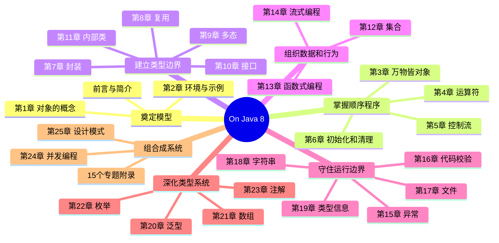

# 《On Java 8（中文版）》深度阅读

> **书目信息**：Bruce Eckel, *On Java 8*，MindView LLC，电子版；在线中文译本为社区翻译。原书作者也是 *Thinking in Java*（《Java 编程思想》）作者。
>
> **文本依据**：本文以题目指定的[极客文档镜像](https://geekdaxue.co/read/On-Java-8/README.md)及其来源仓库 [`prettykernel/OnJava8`](https://github.com/prettykernel/OnJava8) 为正文依据，以作者的 [`OnJava8-Examples`](https://github.com/BruceEckel/OnJava8-Examples) 为代码依据。新版纸质《On Java 中文版》已扩展到 Java 8、11、17，但本文不会把新版或 JDK 后续变化冒充原书内容。
>
> **标记约定**：`【原书】` 表示可在上述中文译本对应章节核对的观点；`【版本补充】` 表示 Java 8 之后的变化；`【实践补充】` 表示为串联知识或形成完整示例而增加的代码与工程建议。没有标记为“原话”的中文引文均来自该中文译本，译法可能与其他版本不同。

## 一、全书在教什么：用 Java 管理软件复杂性

### 1.1 作者给出的定位

前言开宗明义：

> “本书基于 Java 8 版本来教授当前 Java 编程的最优实践。”（前言）

这不是一本只介绍 Java 8 新增 API 的专题书。它从对象、运算符和控制流开始，逐步讲到封装、复用、多态、集合、泛型、函数式编程、流、文件、反射、注解、并发和设计模式。作者对全书问题域的概括是：

> “编程的过程就是复杂性管理的过程：业务问题的复杂性，以及依赖的计算机的复杂性。”（简介）

因此，本书真正研究的是两层问题：

1. **Java 机制是什么**：引用、对象、继承、接口、泛型、异常、流、线程等怎样工作。
2. **机制怎样控制复杂性**：哪些变化应该被封装，哪些错误应该交给编译器，哪些资源必须显式关闭，什么时候抽象反而会泄漏。

Java 8 是全书的重要转折点。第 13 章把两种抽象方式压缩成一句话：

> “OO（object oriented，面向对象）是抽象数据，FP（functional programming，函数式编程）是抽象行为。”（第 13 章）

面向对象把状态和操作放进有边界的对象；Lambda、方法引用与 Stream 又让“要执行的行为”成为可传递、可组合的值。两者不是互相替代，而是分别管理数据变化和行为变化。

通俗地说，本书想解决的不是“怎样把代码写出来”，而是以下更难的问题：

- 怎样把业务概念变成边界清楚、可替换的类型；
- 怎样让错误尽早在编译、测试或明确的异常边界暴露；
- 怎样处理数量不定的对象，而不把算法绑死在某一种容器上；
- 怎样把一连串数据转换写成可组合的流水线；
- 怎样在文件、反射和并发等容易失控的边界上保持可诊断性；
- 怎样识别 Java 为兼容历史所保留的设计缺陷，而不是机械使用所有语言功能。

### 1.2 从语法入门到工程边界的逻辑框架



这个顺序有明确的教学意图。前言说，每章只讲一个或一组相关概念，并尽量不依赖尚未介绍的特性。读者先能创建和调用对象，再学习隐藏实现；先理解继承和接口，再理解集合迭代器与 Lambda；最后才进入反射、泛型细节、并发和模式。

### 1.3 Java 的取舍：与相邻技术比较

| 维度 | Java 8 / 本书路线 | C++ | Java 5—7 的典型写法 | Kotlin / 现代 JVM 语言 | 主要收益与代价 |
| --- | --- | --- | --- | --- | --- |
| 执行与移植 | 编译为字节码，由 JVM 执行和优化 | 通常编译为平台机器码 | 与 Java 8 相同 | 通常也运行在 JVM | Java 牺牲部分底层控制，换取跨平台、运行期优化和统一工具链 |
| 内存管理 | 垃圾回收管理对象；外部资源仍须显式关闭 | 常见 RAII、智能指针，也可手工管理 | 与 Java 8 相同 | JVM GC，加语言级资源函数 | GC 降低悬空指针风险，但不能替代文件、连接、锁的生命周期管理 |
| 行为抽象 | 接口 + Lambda + 方法引用 | 模板、函数对象、Lambda | 匿名内部类样板较多 | 函数类型和扩展函数更自然 | Java 8 显著减少样板，但受既有类型系统和兼容性约束 |
| 数据流水线 | Stream 延迟执行，内部迭代 | STL algorithms / ranges | 外部 `for` 循环 | 集合操作与 Sequence | 声明式组合更清楚；调试、副作用和并行成本更难直观判断 |
| 参数化类型 | 泛型编译期检查，运行期大多擦除 | 模板实例化，能力更强 | Java 5 已引入泛型 | 泛型、型变标注、reified inline | Java 泛型兼容旧字节码，但擦除限制运行期类型操作和基本类型泛化 |
| 空值表达 | Java 8 用 `Optional` 表示部分“可能没有结果” | 指针、optional 等多种方案 | 常用 `null` | 类型系统直接区分可空类型 | `Optional` 能显式建模返回缺失，但不能消灭整个语言中的 `null` |
| 并发 | Executor、并行流、`CompletableFuture`，共享内存仍复杂 | 线程、原子量、异步库 | Thread / Executor / Future | 协程更轻量、结构更清晰 | Java 8 提供组合式异步；共享状态、调度和阻塞仍会造成抽象泄漏 |
| 兼容性 | 强调向后兼容，旧代码和生态庞大 | ABI、编译器和平台差异更显著 | 自身就是兼容基础 | 可调用 Java 生态 | 兼容性是 Java 的工程优势，也是原始类型、擦除和部分旧 API 长期存在的原因 |

本书并不主张 Java 在所有维度都更优。前言明确提醒“每种语言都有其适用的范围”。Java 的核心优势是**静态类型、托管运行时、成熟类库、兼容性和工具生态形成的组合**；代价则是历史包袱和某些抽象的不彻底。作者不断指出缺陷，目的不是否定 Java，而是让开发者知道语言边界，避免把偶然能运行的写法误认为可靠设计。

## 二、25 章如何推进：逐章问题与方案

| 篇章 | 标题 | 核心内容 | 本章面对的问题与给出的方案 |
| --- | --- | --- | --- |
| 前言 | 教学目标与版本背景 | Java 8 改变了 Java 代码的表达方式；示例由 Gradle 自动编译和校验 | 用递进章节、短小示例和可执行测试降低学习成本；主动指出语言设计错误 |
| 简介 | 语言、复杂性与前提知识 | Java 源于 C/C++ 与 Smalltalk，又加入 JVM 和 GC | 了解语言优势也了解限制；API 细节以最新 JDK 文档为准 |
| 第 1 章 | 对象的概念 | 抽象、接口、服务、封装、复用、继承、多态、集合、生命周期和异常 | 用对象把问题空间映射到解空间；把变化与实现细节隔离在边界内 |
| 第 2 章 | 安装 Java 和本书用例 | 编辑器、Shell、JDK、环境验证、示例构建 | 建立可重复执行的学习环境，而不是只阅读静态代码 |
| 第 3 章 | 万物皆对象 | 引用、对象创建、基本类型、数组、作用域、类、字段、方法、`static` | 解释 Java 程序最小组成以及引用和值的区别；由 GC 管理对象内存 |
| 第 4 章 | 运算符 | 赋值、算术、关系、逻辑、位、移位、短路、转换和溢出陷阱 | 用实验理解别名、精度、提升和优先级；不要用直觉猜表达式结果 |
| 第 5 章 | 控制流 | `if`、循环、增强 `for`、`return`、`break`、`continue`、`switch` | 用结构化控制表达分支和迭代，避免跳转造成不可追踪的流程 |
| 第 6 章 | 初始化和清理 | 构造器、重载、`this`、成员/静态初始化、数组、枚举、GC | 保证对象一出生就有效；理解初始化次序；不要把 GC 当作资源关闭机制 |
| 第 7 章 | 封装 | 包、导入、访问修饰符、类访问权限 | 将易变实现藏在稳定 API 后；以最小可见性减少耦合和误用 |
| 第 8 章 | 复用 | 组合、继承、委托、向上转型、`final`、类加载 | 优先组合或委托；只有确实存在“是一个”关系时才继承 |
| 第 9 章 | 多态 | 动态绑定、构造器与多态、协变返回、继承设计 | 让调用方依赖基类契约，由运行期选择实现；警惕构造期调用可覆盖方法 |
| 第 10 章 | 接口 | 抽象类、接口、默认方法、多接口、适配、工厂 | 用接口解耦调用方与实现；通过策略、适配器和工厂替换行为与创建方式 |
| 第 11 章 | 内部类 | 成员、局部、匿名和静态嵌套类；外部对象连接 | 将只服务于外围类的实现收拢；用匿名类表达一次性策略，但注意隐式引用 |
| 第 12 章 | 集合 | `List`、`Set`、`Map`、`Queue`、迭代器与增强 `for` | 面对数量和类型可变的对象，按顺序、唯一性、键值或队列语义选择容器 |
| 第 13 章 | 函数式编程 | Lambda、方法引用、函数式接口、高阶函数、闭包、组合、柯里化 | 将行为作为值传递并组合；用小函数替代重复的匿名类和控制样板 |
| 第 14 章 | 流式编程 | 流创建、中间操作、终端操作、`Optional` | 将“怎样循环”变成“做何种转换”；以惰性流水线处理序列 |
| 第 15 章 | 异常 | 抛出、捕获、自定义异常、声明、`finally`、TWR、异常匹配 | 分离正常逻辑与失败逻辑；让错误沿调用栈传播到有能力处理的位置 |
| 第 16 章 | 代码校验 | JUnit 5、前置条件、TDD、日志、调试、基准、静态分析、评审、CI | 编译通过只证明语法和部分类型成立；用分层反馈证明行为不符合预期的地方 |
| 第 17 章 | 文件 | `Path`、目录、文件系统、监听、查找、读写 | 用 `java.nio.file` 的统一路径模型代替分散、易错的旧式文件处理 |
| 第 18 章 | 字符串 | 不可变性、`StringBuilder`、格式化、正则、扫描 | 避免循环拼接浪费；区分字面文本、格式和正则语法；安全解析输入 |
| 第 19 章 | 类型信息 | RTTI、`Class`、类型检查、反射、动态代理 | 在运行期发现类型和生成适配行为；同时正视反射削弱静态检查和封装的代价 |
| 第 20 章 | 泛型 | 泛型类/方法、擦除、边界、通配符、自限定类型、混型 | 让一份算法服务多种类型并保持编译期安全；用边界和通配符表达读写能力 |
| 第 21 章 | 数组 | 多维/泛型数组、填充、并行、拷贝、比较、排序、查找 | 数组为固定大小、同构数据提供高效存储；通过 `Arrays` 避免手写常用算法 |
| 第 22 章 | 枚举 | 类型化常量、`EnumSet`、`EnumMap`、常量特定方法、多路分发 | 用有限值类型代替整数常量和位标志，让非法值无法进入模型 |
| 第 23 章 | 注解 | 元注解、注解处理器、`javac` 处理、注解测试 | 将机器可读元数据与代码绑定；在编译期生成/校验代码或在运行期发现规则 |
| 第 24 章 | 并发编程 | 并发/并行、并行流、Executor、`CompletableFuture`、取消、死锁 | 只为真实等待或吞吐瓶颈引入并发；优先高级库、隔离状态并测量收益 |
| 第 25 章 | 设计模式 | 模板方法、工厂、策略、适配器、解释器、回调、访问者、多分派 | 为反复出现的变化关系命名；模式是设计词汇，不是必须套用的类图 |
| 专题附录 | 15 个专题与词汇表 | 职业成长、静态类型、集合、压缩、旧/新 I/O、Javadoc、底层并发、序列化、复制、规范、`equals/hashCode` 等 | 把主线暂时不需要但工程上重要的细节移到按需查阅区，保持正文递进性 |

全书后半部分不是孤立的“高级特性合集”。集合为 Stream 提供数据，泛型保证集合和函数式接口的类型安全，Lambda 为 Stream 和 `CompletableFuture` 提供行为，异常与测试覆盖这些组合的失败路径，模式则给这些协作关系命名。

## 三、沿原书讲解顺序掌握 Java

原书并没有把 Java 描述成一堆互不相干的关键字。它先建立对象模型，再给出可运行的顺序程序，然后逐层增加类型边界、数据抽象、失败处理和并发。本节严格沿前言、简介、第 1—25 章及附录推进；代码在不改变原书知识点的前提下整理为可独立理解的小例子。`【版本补充】` 明确表示书后变化。

### 阶段一：先建立问题观，再得到可运行程序

#### 前言：Java 8 改变的是表达方式，不只是 API 数量

**作者要解决的问题。** 前言把目标限定为“基于 Java 8 版本来教授当前 Java 编程的最优实践”。Java 8 的 Lambda 和 Stream 让行为可以传递、组合，许多过去依赖匿名内部类和外部循环的代码有了新的表达方式；原书因此不是给旧书简单追加几章，而是重新组织教学路径。

**怎样使用这本书。** 示例不是只供阅读的片段，而应通过仓库的 Gradle 构建反复执行。阅读每个机制时先运行原例，再改变一个条件观察结果，最后才把结论带入项目。作者也刻意指出 Java 的设计失误，因此“书中介绍了”不等于“任何场合都推荐”。

- **Best Practice（最佳实践）**：在特定版本和约束下反复证明有效的选择，不是脱离上下文的永恒规则。
- **Regression Test（回归测试）**：确认修改没有破坏既有行为的自动化测试。
- **边界**：原书基线是 Java 8；后续 JDK 的语法、库和弃用状态必须另行核对。

#### 简介：编程的核心工作是管理复杂性

简介的主线不是“Java 比别的语言好”，而是：

> “编程的过程就是复杂性管理的过程：业务问题的复杂性，以及依赖的计算机的复杂性。”

Java 从 C/C++ 继承熟悉语法，从 Smalltalk 式对象模型吸收“向对象发送消息”的观念，又以 JVM、垃圾回收和标准库减少平台差异。它解决的是在足够性能下组织大型程序的问题，而不是给开发者无限底层控制。

- **Problem Space（问题空间）**：订单、账户、设备等真实业务概念及约束。
- **Solution Space（解空间）**：类、对象、集合、线程等计算机中的实现模型。
- **Managed Runtime（托管运行时）**：由 JVM 管理类加载、内存回收和运行期优化的执行环境。
- **边界**：抽象会隐藏细节，也可能隐藏成本。文件、网络、内存和线程等物理约束最终仍会穿透抽象。

#### 第一章：对象的概念——用服务边界映射问题

**背景与作用。** 过程式程序容易让数据和操作分散，修改一种数据表示会波及大量函数。对象把状态和能够处理该状态的行为放在一个边界内，其他对象只通过接口请求服务。封装控制“谁能知道什么”，多态控制“同一请求由哪个实现响应”。

```java
interface Shape {
    double area();
}

final class Circle implements Shape {
    private final double radius;

    Circle(double radius) {
        if (radius < 0) throw new IllegalArgumentException("radius < 0");
        this.radius = radius;
    }

    @Override
    public double area() {
        return Math.PI * radius * radius;
    }
}
```

调用者面向 `Shape` 提问，不必知道圆怎样保存半径。新增 `Rectangle` 时，使用 `Shape` 的代码通常无需修改。这正是本章的“接口描述服务、实现完成服务”。

- **OOP（Object-Oriented Programming，面向对象编程）**：以有状态、有行为、彼此协作的对象组织程序。
- **Encapsulation（封装）**：隐藏表示，限制外部直接破坏对象状态。
- **Polymorphism（多态）**：同一基类或接口引用在运行期调用不同实现。
- **Composition（组合）**：对象持有其他对象来获得能力，表达“有一个”。
- **局限与应对**：不要把每个名词都机械变成类。无状态转换可用函数；`【版本补充】` 透明数据可在 Java 16+ 中用 `record`。边界应围绕不变量和变化点形成。

#### 第二章：安装 Java 和本书用例——让结论可以复现

**本章的问题。** 若编译器版本、环境变量和依赖不确定，同一段代码可能出现不同结果。原书要求安装 JDK、验证 `java`/`javac`，取得示例并通过 Gradle 运行，让学习环境成为可重复实验的一部分。

```powershell
java -version
javac -version
git clone https://github.com/BruceEckel/OnJava8-Examples.git
Set-Location OnJava8-Examples
.\gradlew.bat compileJava
```

这里应使用仓库自带 Gradle Wrapper，因为 Wrapper 固定构建工具版本；全局安装的新版 Gradle 可能无法运行旧插件。原样复现全书示例优先使用 JDK 8，现代项目环境见第四部分。

- **JDK（Java Development Kit）**：编译器、运行时、工具和标准类库的开发套件。
- **Shell**：接收命令并启动程序的交互环境，Windows 中可使用 PowerShell。
- **Gradle Wrapper**：随项目提交、按配置下载指定 Gradle 版本的启动脚本。
- **Classpath（类路径）**：编译或运行时寻找类与资源的位置集合。
- **局限与应对**：原仓库和依赖源可能随时间失效。应保存提交号、JDK 发行版和 Wrapper，CI 从干净环境重建，而不是只保留本机生成物。

#### 第三章：万物皆对象——分清引用、对象和值

Java 通过引用操纵对象：变量 `text` 保存的不是 `String` 对象本体，而是访问对象的引用；`new` 在托管堆上创建对象。基本类型是例外，它们直接保存值，以避免所有小数值都成为堆对象的成本。

```java
String first = new String("java");
String second = first;     // 复制引用，不是复制对象
first = null;              // 只断开 first；second 仍能访问对象

int x = 10;
int y = x;                 // 复制数值
y++;
System.out.println(x);     // 10
```

类定义状态（字段）和行为（方法）；`static` 成员属于类层面，不依赖某个实例。数组创建后长度固定、元素类型统一，并由运行期做边界检查。

- **Reference（引用）**：定位对象的受控句柄，不等同于 C/C++ 可做算术的裸指针。
- **Primitive Type（基本类型）**：`boolean`、整数、字符和浮点类型等直接值类型。
- **Heap（堆）**：通常存放对象、由垃圾回收器管理的运行期内存区域。
- **Scope（作用域）**：名字在源码中可见的范围；对象生命周期不一定与局部引用作用域相同。
- **GC（Garbage Collection，垃圾回收）**：回收不可达对象占用的托管内存。
- **局限与应对**：`null` 引用仍可能造成 `NullPointerException`；对象不再使用也可能因缓存或监听器仍持有引用而无法回收。用非空契约、容量策略和显式注销管理这些情况。

#### 第四章：运算符——值语义、别名和数值边界

本章借大量小实验说明，运算符的结果不能只凭数学直觉判断。对象赋值复制引用，会产生别名；`==` 对基本类型比较值，对对象通常比较是否同一引用；逻辑 `&&`、`||` 会短路；整数运算可能静默溢出。

```java
Integer a = new Integer(1000); // 仅用于说明；该构造器已弃用
Integer b = new Integer(1000);
System.out.println(a == b);       // false：不同对象
System.out.println(a.equals(b));  // true：数值相等

int max = Integer.MAX_VALUE;
System.out.println(max + 1);      // -2147483648：溢出回绕
```

实际金额不应使用 `double`，因为二进制浮点不能精确表示许多十进制小数；可用最小货币单位的 `long` 或 `BigDecimal`。需要溢出检测时用 `Math.addExact` 等方法。

- **Aliasing（别名）**：多个引用指向同一可变对象。
- **Short-Circuit Evaluation（短路求值）**：结果确定后不再计算逻辑表达式右侧。
- **Promotion（数值提升）**：表达式计算前把较窄类型转换为较宽或至少为 `int` 的规则。
- **Unsigned Shift（无符号右移）**：`>>>` 用零填充高位；`>>` 保留符号位。
- **局限与应对**：自动装箱会隐藏对象创建和空值拆箱风险；性能敏感循环优先基本类型流/数组，比较包装值用 `equals` 而非依赖缓存行为。

#### 第五章：控制流——把分支和重复写成可追踪结构

`if/else`、`while`、`do-while`、`for`、增强 `for` 和 `switch` 决定语句执行顺序；`break` 结束循环，`continue` 跳到下一轮，`return` 结束方法。增强 `for` 依赖数组或 `Iterable`，把遍历协议与索引细节分开。

```java
static int firstPositive(int[] values) {
    for (int value : values) {
        if (value <= 0) continue;
        return value;
    }
    throw new IllegalArgumentException("no positive value");
}
```

书中还解释 Java 保留的是带标签的 `break/continue`，不是任意跳转的 `goto`。标签只适合跳出嵌套循环；业务分支复杂时，提取方法或建立状态对象通常比多层跳转更清楚。

- **Iteration（迭代）**：重复执行一段逻辑直到条件不成立。
- **Iterable**：能产生 `Iterator` 的遍历契约，也是增强 `for` 的基础。
- **Fall-through（贯穿）**：传统 `switch` 分支没有 `break` 时继续执行后续分支。
- **【版本补充】** Java 14 定稿 `switch` 表达式和 `->` 分支，能返回值且默认不贯穿；Java 21 的模式匹配 `switch` 还能按类型解构。
- **局限与应对**：深层条件嵌套往往说明方法承担过多规则。用守卫式返回、命名谓词或多态拆分，但不要为简单两分支引入过度设计。

#### 第六章：初始化和清理——让对象从出生起就有效

构造器与类同名且没有返回类型，用来建立对象不变量；重载让同名方法接受不同参数；`this` 表示当前对象，并可在构造器首句调用另一个构造器。初始化顺序大体是：静态成员（首次类初始化）→ 基类部分 → 实例字段 → 构造器主体。

```java
final class Account {
    private final String id;
    private long balance;

    Account(String id) {
        this(id, 0);
    }

    Account(String id, long openingBalance) {
        this.id = Objects.requireNonNull(id, "id");
        if (openingBalance < 0) throw new IllegalArgumentException("negative");
        this.balance = openingBalance;
    }
}
```

书中讨论了 `finalize()`，但它从来不是可靠资源管理方式。`【版本补充】` Java 9 将其弃用，JDK 18 标记为待移除；文件、连接等必须用 `try-with-resources` 确定关闭。

- **Constructor（构造器）**：创建实例时建立初始状态的特殊成员。
- **Overloading（重载）**：同一作用域中方法名相同、参数列表不同；返回类型不能单独区分重载。
- **Invariant（不变量）**：对象每次对外可见时都必须成立的约束。
- **Varargs（可变参数）**：`T...` 让调用方传入数量可变的参数，方法内部表现为数组。
- **局限与应对**：构造器中调用可覆盖方法会让子类在尚未初始化时参与分派；不要让 `this` 在构造完成前逃逸，也不要在构造器中启动线程或注册回调。

### 阶段二：从单个类走向可替换的类型系统

#### 第七章：封装——把变化锁在稳定 API 后面

**为什么需要封装。** 如果客户端能直接依赖字段、构造细节和辅助类，任何实现修改都会成为破坏性修改。包提供命名空间和部署单元，`public`、`protected`、包访问权限和 `private` 则控制名字能够传播多远。书中的方向很清楚：把尽可能多的实现设为 `private`，只公开客户端真正需要的服务。

```java
package billing;

public final class Invoice {
    private long totalCents;

    public long totalCents() {
        return totalCents;
    }

    public void add(long cents) {
        if (cents <= 0) throw new IllegalArgumentException("cents <= 0");
        totalCents = Math.addExact(totalCents, cents);
    }
}
```

这里没有公开 setter，因为“任意改总额”不是业务能力；`add` 才是维持不变量的服务。包名通常使用反向域名以避免冲突，源码目录要与包层级一致。

- **Package（包）**：组织类型并提供包级访问边界的命名空间。
- **API（Application Programming Interface，应用程序编程接口）**：调用者可依赖的公开类型和行为契约。
- **Implementation Hiding（实现隐藏）**：让内部表示不成为外部依赖。
- **局限与应对**：Java 8 的包不是强隔离边界，反射仍可能访问内部细节。`【版本补充】` Java 9 模块系统可显式导出包；但真正稳定性仍来自小而清楚的 API，而不是只加 `module-info.java`。

#### 第八章：复用——优先组合，需要替换关系时才继承

组合把现有对象作为字段使用，继承则把父类的接口和实现一起带入子类。原书给出的选择原则是：

> “在开始设计时，优先使用组合（或委托），只有当确实需要时再使用继承。组合更具灵活性。”

```java
interface Notifier {
    void send(String message);
}

final class RetryingNotifier implements Notifier {
    private final Notifier delegate;

    RetryingNotifier(Notifier delegate) {
        this.delegate = delegate;
    }

    @Override
    public void send(String message) {
        try {
            delegate.send(message);
        } catch (RuntimeException firstFailure) {
            delegate.send(message);
        }
    }
}
```

`RetryingNotifier` 没有继承某个具体邮件实现，它委托给任意 `Notifier`，因此重试策略与发送渠道可以分别变化。继承只有在子类确实可在所有父类位置使用，即满足 is-a 关系时，才与向上转型共同产生价值。

- **Delegation（委托）**：对象把工作转给所持有的协作者。
- **Inheritance（继承）**：子类获得父类非私有接口和实现的复用机制。
- **Upcasting（向上转型）**：把子类型引用当作父类型或接口使用。
- **`final`**：可修饰变量、方法和类，分别限制重新赋值、覆盖和继承；它不保证对象深不可变。
- **局限与应对**：继承会耦合初始化顺序和受保护实现，脆弱父类变化可破坏子类。优先组合；继承时保持层次浅、文档化扩展点，并对基类契约写测试。

#### 第九章：多态——让运行期选择真正的实现

静态类型决定“允许调用什么”，对象的实际类型决定“覆盖方法执行哪一个”。这个动态绑定让算法依赖稳定抽象而不依赖具体分支。

```java
static double totalArea(List<? extends Shape> shapes) {
    double total = 0;
    for (Shape shape : shapes) {
        total += shape.area(); // 运行期分派到 Circle、Rectangle 等实现
    }
    return total;
}
```

Java 的实例方法通常动态绑定，但字段和 `static` 方法不多态。构造过程中的动态绑定尤其危险：基类构造器若调用可覆盖方法，会在子类字段完成初始化前进入子类逻辑。

- **Dynamic Binding（动态绑定）**：运行期依据对象实际类型选择覆盖方法。
- **Override（覆盖）**：子类提供与父类可覆盖实例方法相同签名的实现；应使用 `@Override` 让编译器校验。
- **Covariant Return（协变返回）**：覆盖方法可以返回父方法返回类型的子类型。
- **Downcasting（向下转型）**：把基类型引用转换为更具体类型，运行期可能抛 `ClassCastException`。
- **局限与应对**：为一个只有两种稳定情况的分支建立庞大层次并不会自动更好。多态适合“新增实现频繁、算法稳定”的变化方向；若操作种类频繁增加，数据导向或访问者等设计可能更合适。

#### 第十章：接口——只承诺能力，不泄露实现家族

抽象类能共享状态和部分实现，接口主要表达能力契约。Java 8 默认方法允许接口在兼容旧实现的情况下新增行为，但接口仍不能持有普通实例状态。一个类可实现多个接口，从而组合多个角色而避免多继承状态的歧义。

```java
interface Processor {
    String process(String input);

    default String description() {
        return getClass().getSimpleName();
    }
}

static String run(Processor processor, String input) {
    return processor.process(input);
}

Processor trim = String::trim;
System.out.println(run(trim, "  data  "));
```

原书用策略、适配器和工厂展示“完全解耦”：客户端只接收接口，适配器把已有类转换到目标契约，工厂隔离创建哪个具体对象。Java 8 的函数式接口又让简单策略可以由 Lambda 提供。

- **Abstract Class（抽象类）**：不能直接实例化、可含抽象方法和共享状态的类。
- **Interface（接口）**：描述实现者必须提供的能力契约。
- **Default Method（默认方法）**：接口中带实现的实例方法，Java 8 用它演进既有接口。
- **SAM（Single Abstract Method，单一抽象方法）**：恰有一个抽象方法的接口，可作为 Lambda 目标类型。
- **Factory Method（工厂方法）**：把实例创建封装为方法，通过返回抽象类型隐藏具体实现。
- **局限与应对**：默认方法冲突需要实现类显式消解；接口过宽会迫使实现提供无意义方法。接口应围绕调用者角色设计，不要把一个大类的全部方法原样复制为接口。

#### 第十一章：内部类——把只属于外围对象的实现收拢

成员内部类对象隐式持有外围类实例，因此可以访问外围对象的所有成员；静态嵌套类没有这条隐式连接。局部类只在方法作用域可见，匿名内部类适合一次性实现接口或继承类。内部类也可被向上转型为私有实现的公开接口，从而彻底隐藏实现类型。

```java
final class Sequence<T> implements Iterable<T> {
    private final List<T> values;

    Sequence(List<T> values) {
        this.values = List.copyOf(values); // Java 10；Java 8 可防御性复制
    }

    @Override
    public Iterator<T> iterator() {
        return new Iterator<T>() {
            private int index;

            public boolean hasNext() { return index < values.size(); }
            public T next() { return values.get(index++); }
        };
    }
}
```

匿名迭代器的状态仅服务于一次遍历，无需暴露成顶层类。`【版本补充】` 简单 SAM 实现多可改为 Lambda，但需要额外字段、多个方法或特定父类时，匿名类仍有用途。

- **Inner Class（内部类）**：非静态嵌套类，与一个外围实例关联。
- **Nested Class（嵌套类）**：声明在另一个类中的类；加 `static` 后不持有外围实例。
- **Anonymous Class（匿名类）**：没有声明名字、在表达式位置定义并实例化的类。
- **Closure（闭包）**：代码与其捕获环境的组合；局部类和 Lambda 捕获的局部变量必须是 final 或 effectively final。
- **局限与应对**：长生命周期内部对象可能意外保持整个外围对象，造成内存滞留。无需外围状态时使用静态嵌套类；异步回调要明确注销和所有权。

### 阶段三：让数量可变的数据与行为都能组合

#### 第十二章：集合——先选择语义，再选择实现

数组只能保存固定数量的元素，现实程序却常在运行期增长、删除和查询对象。集合框架用泛型统一元素类型，再按关系提供不同抽象：`List` 表示有序且可重复，`Set` 表示不重复，`Map` 表示键值映射，`Queue`/`Deque` 表示等待处理的次序。

| 需求 | 面向的接口 | 常用实现 | 关键契约 |
| --- | --- | --- | --- |
| 按索引、保持插入顺序 | `List<E>` | `ArrayList` | 可重复；随机访问常见 |
| 成员唯一 | `Set<E>` | `HashSet`、`LinkedHashSet`、`TreeSet` | 哈希或比较必须稳定一致 |
| 键查值 | `Map<K,V>` | `HashMap`、`LinkedHashMap`、`TreeMap` | 键的 `equals/hashCode` 决定身份 |
| 先进先出或两端操作 | `Queue<E>` / `Deque<E>` | `ArrayDeque`、`PriorityQueue` | 顺序由队列策略定义 |

```java
Map<String, Integer> counts = new HashMap<>();
for (String word : List.of("java", "stream", "java")) { // List.of: Java 9+
    counts.merge(word, 1, Integer::sum);                   // merge: Java 8
}
System.out.println(counts); // {java=2, stream=1}
```

迭代器把“怎样取得下一个元素”从容器表示中分离；增强 `for` 又隐藏了显式迭代器样板。删除当前元素时用 `Iterator.remove()`，不要一边增强 `for` 一边直接修改普通集合。

- **Collection Framework（集合框架）**：集合接口、实现和算法的协作体系；`Map` 属于框架但不继承 `Collection`。
- **Iterator（迭代器）**：顺序访问元素而不暴露底层结构的对象。
- **Fail-fast（快速失败）**：普通迭代器检测到结构性并发修改后尽快抛 `ConcurrentModificationException`；这不是线程安全保证。
- **局限与应对**：集合选择不能只凭复杂度口诀。`LinkedList` 的节点分配和缓存局部性常使其慢于 `ArrayList`；用真实负载测量。并发访问应选不可变快照、同步边界或并发集合。

#### 第十三章：函数式编程——把行为作为值传递

原书把两种抽象方式并列为：

> “OO（object oriented，面向对象）是抽象数据，FP（functional programming，函数式编程）是抽象行为。”

Java 8 之前，传递一个小行为通常要写匿名内部类；Lambda 让函数式接口实例只保留参数和主体，方法引用则直接复用已有方法。更重要的是，函数可以接收或返回函数，从而构造可测试的行为流水线。

**Java 8 之前：**

```java
Comparator<String> byLength = new Comparator<String>() {
    @Override
    public int compare(String left, String right) {
        return Integer.compare(left.length(), right.length());
    }
};
```

**Java 8：**

```java
Comparator<String> byLength =
    Comparator.comparingInt(String::length)
        .thenComparing(Comparator.naturalOrder());

Predicate<String> useful = ((Predicate<String>) s -> !s.isBlank())
    .and(s -> s.length() <= 80); // isBlank: Java 11；Java 8 用 !s.trim().isEmpty()
```

Lambda 的类型来自目标函数式接口；同一表达式可以适配不同接口，但不能脱离目标类型独立存在。捕获的局部变量必须是 final 或 effectively final，这减少了闭包与可变栈变量的时序混乱。

- **FP（Functional Programming，函数式编程）**：以函数组合和数据变换组织程序；纯函数式还强调不可变和引用透明。
- **Lambda Expression（Lambda 表达式）**：创建函数式接口实例的紧凑语法。
- **Method Reference（方法引用）**：以 `类型::方法` 或 `对象::方法` 引用签名可适配的方法。
- **Higher-Order Function（高阶函数）**：接收函数或返回函数的函数。
- **Closure（闭包）**：函数及其捕获的词法环境。
- **Currying（柯里化）**：把多参数函数转换为一连串单参数函数；部分求值则先固定部分参数。
- **局限与应对**：Java 并非纯函数式语言，Lambda 仍可产生副作用和抛异常。复杂业务行为应提取成命名方法；不要为了短而把多步逻辑塞进一个 Lambda。

#### 第十四章：流式编程——描述数据经历什么，而非循环怎么写

原书用一句话区分集合与流：

> “集合优化了对象的存储，而流（Streams）则是关于一组组对象的处理。”

Stream 不保存元素，通常只描述一次性计算。来源创建流，中间操作如 `filter/map/distinct/sorted` 惰性地组装流水线，终端操作如 `collect/reduce/findFirst/forEach` 才触发遍历。

```java
record Order(String customer, long cents, boolean paid) {} // record: Java 16

Map<String, Long> totals = orders.stream()
    .filter(Order::paid)
    .collect(Collectors.groupingBy(
        Order::customer,
        Collectors.summingLong(Order::cents)));
```

在 Java 8 中把 `record` 换成有同名 getter 的普通不可变类，并写 `Order::isPaid`、`Order::getCustomer` 即可。流水线适合单向转换；多个早退、复杂状态机或逐步调试的算法，清晰循环往往更合适。

`Optional<T>` 用于表达一次查询可能没有结果：

```java
String firstPaidCustomer = orders.stream()
    .filter(Order::paid)
    .findFirst()
    .map(Order::customer)
    .orElse("anonymous");
```

不要用 `get()` 把缺失重新变成异常，也不要把 `Optional` 无差别用于字段、参数和集合元素。空集合本身已能表达“没有元素”。

- **Stream**：支持顺序或并行聚合操作的一次性元素序列；不同于 `InputStream/OutputStream`。
- **Intermediate Operation（中间操作）**：返回新 Stream、通常惰性执行的操作。
- **Terminal Operation（终端操作）**：触发遍历并产生值、副作用或完成信号的操作。
- **Lazy Evaluation（惰性求值）**：先记录操作，到需要结果时才处理元素。
- **Reduction（归约）**：用满足结合律的操作把序列合为一个结果。
- **Optional**：显式表示“有一个值或没有值”的容器。
- **局限与应对**：Stream 终端操作后不可复用；无限流必须配合短路或限制操作；并行流会引入拆分、合并和公共线程池成本。只有 CPU 密集、数据量足够、无共享副作用且经 JMH/系统基准证实时才启用并行。

### 阶段四：为失败、验证和外部数据建立边界

#### 第十五章：异常——把失败交给有能力处理的位置

返回特殊值会让正常逻辑和错误判断交错，而且调用者容易忘记检查。异常把失败封装为对象，从抛出点沿调用栈寻找第一个匹配的处理器；Java 使用终止模型，处理后不会回到抛出位置继续。受检异常强制调用者捕获或声明，非受检异常通常表示调用契约或程序状态有误。

```java
final class OrderLoadException extends RuntimeException {
    OrderLoadException(Path path, Throwable cause) {
        super("Cannot load orders from " + path, cause);
    }
}

static List<String> loadOrders(Path path) {
    try {
        return Files.readAllLines(path, StandardCharsets.UTF_8);
    } catch (IOException cause) {
        throw new OrderLoadException(path, cause); // 提升抽象层且保留原因
    }
}
```

只在能够恢复、翻译或完成统一边界处理的位置捕获。`finally` 保证控制离开 `try` 时执行清理，但 Java 7 起资源应优先采用 try-with-resources：

```java
try (BufferedReader reader = Files.newBufferedReader(path, StandardCharsets.UTF_8)) {
    return reader.lines().filter(line -> !line.trim().isEmpty()).collect(toList());
}
```

资源按声明逆序关闭；主体异常优先，关闭异常作为 suppressed exception 保存。

- **Checked Exception（受检异常）**：编译器要求捕获或在签名声明的异常。
- **Unchecked Exception（非受检异常）**：`RuntimeException` 及其子类，编译器不强制声明。
- **Stack Unwinding（栈展开）**：异常传播时逐层退出方法调用并执行清理。
- **TWR（Try-With-Resources）**：自动关闭 `AutoCloseable` 资源的语法。
- **Exception Translation（异常翻译）**：把底层失败转成当前抽象能够解释的异常，同时保存 `cause`。
- **局限与应对**：捕获 `Exception` 后打印并继续会制造错误状态；空 catch 会吞掉证据。异常不适合普通分支，也不要在每一层重复记录同一次失败。

#### 第十六章：代码校验——编译通过只是反馈链的起点

原书用一句有意反直觉的话强调验证边界：

> “你永远不能保证你的代码是正确的，你只能证明它是错的。”

JUnit 5 用 `@Test` 标记用例、`@BeforeEach` 建立彼此隔离的夹具，断言把期望写成可执行规格。TDD 用“失败测试→最小实现→重构”的短循环推进设计；日志、调试器、静态分析、代码评审和 CI 则从不同角度缩短反馈时间。

```java
class AccountTest {
    @Test
    void rejectsNegativeOpeningBalance() {
        IllegalArgumentException error = assertThrows(
            IllegalArgumentException.class,
            () -> new Account("A-1", -1));

        assertEquals("negative", error.getMessage());
    }
}
```

| 反馈工具 | 能发现什么 | 不能证明什么 |
| --- | --- | --- |
| 编译器 | 语法、名字、可见性、部分类型错误 | 业务规则正确 |
| 单元测试 | 小范围行为、边界和回归 | 所有输入与真实依赖 |
| 静态分析 | 空值、泄漏、可疑 API 和规范问题 | 动态环境中的全部行为 |
| 日志/调试 | 已发生路径的状态与时间线 | 未执行路径正确 |
| 基准/剖析 | 延迟、吞吐、分配和热点 | 功能正确与负载代表性 |

- **TDD（Test-Driven Development，测试驱动开发）**：由失败测试驱动实现和重构的开发循环。
- **CI（Continuous Integration，持续集成）**：频繁合并并自动构建、测试和检查。
- **Precondition（前置条件）**：调用方法前必须满足的输入或状态约束。
- **Profiler（剖析器）**：采集 CPU、内存、锁和 I/O 等运行数据的诊断工具。
- **纠正性补充**：JVM 微基准不能只用 `System.nanoTime()` 包一个循环，JIT 预热、逃逸分析和死代码消除会歪曲结果；应使用 JMH，系统性能仍需代表性端到端负载。
- **局限与应对**：覆盖率只证明代码被走到，不证明断言有效。优先测试不变量、边界和失败路径；慢且不稳定的外部依赖测试与快速单元测试分层运行。

#### 第十七章：文件——用 Path 与 Files 统一文件系统操作

旧 `java.io.File` 同时承担路径表示和多种操作，错误报告也有限。原书转向 NIO.2：`Path` 表示路径，`Files` 执行读写、遍历、复制和属性查询，`FileSystem` 表示文件系统；Path 存在不等于对应文件已经存在。

```java
static void writeReport(Path directory, List<String> lines) throws IOException {
    Files.createDirectories(directory);
    Path target = directory.resolve("report.txt");
    Path temp = Files.createTempFile(directory, "report-", ".tmp");
    try {
        Files.write(temp, lines, StandardCharsets.UTF_8);
        Files.move(temp, target,
            StandardCopyOption.REPLACE_EXISTING,
            StandardCopyOption.ATOMIC_MOVE);
    } finally {
        Files.deleteIfExists(temp);
    }
}
```

同目录临时文件再移动可以降低读到半成品的风险，但并非所有文件系统支持原子移动，需要按业务决定是否捕获 `AtomicMoveNotSupportedException` 后降级。目录遍历产生的 Stream 也持有系统资源，必须关闭。

- **NIO.2（New I/O 2）**：Java 7 引入的 `java.nio.file` 路径和文件系统 API。
- **Path**：由文件系统解释的层级路径表示，可做 `resolve`、`normalize` 等纯路径操作。
- **WatchService**：订阅目录创建、修改、删除等事件的服务；事件可能合并或溢出。
- **Atomic Move（原子移动）**：观察者只能看到移动前或移动后的状态，不看到中间状态。
- **【版本补充】** Java 11 加入 `Files.readString/writeString`，适合可控大小文本；大文件仍应流式处理。
- **局限与应对**：`normalize()` 只是语法规范化，不提供权限安全。用户路径应解析到允许根目录，必要时结合真实路径检查；`readAllLines` 会占用与文件大小成比例的内存。

#### 第十八章：字符串——在不可变文本、格式和正则之间划清语法层

`String` 不可变，因此方法返回新字符串而不修改原对象；这让共享、安全哈希和常量池成为可能。循环中反复 `+` 可能创建许多中间对象，应用 `StringBuilder`；单个拼接表达式通常会由编译器优化。覆盖 `toString()` 时若直接拼接 `this`，又会递归调用 `toString()`。

```java
static String joinCsv(List<String> values) {
    StringBuilder result = new StringBuilder();
    for (String value : values) {
        if (result.length() > 0) result.append(',');
        result.append(value);
    }
    return result.toString();
}
```

格式化用 `Formatter`/`String.format` 描述输出布局；正则用 `Pattern` 表示模式、`Matcher` 执行匹配；`Scanner` 能按分隔符解析输入，但高吞吐场景通常应采用更直接的解析方式。Java 字符串字面量和正则各有一层转义，例如正则数字 `\d+` 在 Java 源码中写作 `"\\d+"`。

- **Immutable（不可变）**：对象创建后其可观察状态不再变化。
- **String Pool（字符串池）**：JVM 复用特定字符串常量的机制，不应据此使用 `==` 比较文本内容。
- **Regex（Regular Expression，正则表达式）**：描述文本模式的语言。
- **Pattern / Matcher**：编译后的正则与一次匹配状态；频繁使用时复用 `Pattern`。
- **Charset（字符集）**：字符与字节之间的映射；文本 I/O 应显式使用 UTF-8 等字符集。
- **【版本补充】** Java 15 定稿文本块，减少多行 SQL/JSON 的转义；它不会自动防止 SQL 注入，数据库操作仍须参数化。
- **局限与应对**：正则不适合任意嵌套语法，灾难性回溯还可能造成拒绝服务。复杂格式使用专用解析器，不可信模式限制长度、执行时间和能力。

### 阶段五：理解编译期类型与运行期元数据

#### 第十九章：类型信息——何时让程序在运行期认识类型

多态让代码“只知道基类也能调用覆盖方法”，但框架有时需要发现未知类型的结构。RTTI 在类型层次已知时使用 `instanceof`、转换和 `Class`；反射则能通过名字发现构造器、方法和字段。每个已加载类型都有对应 `Class` 对象，类字面量 `Order.class` 不要求先创建实例。

```java
@Retention(RetentionPolicy.RUNTIME)
@Target(ElementType.TYPE)
@interface EntityName {
    String value();
}

@EntityName("orders")
final class Order {}

static String tableName(Class<?> type) {
    EntityName value = type.getAnnotation(EntityName.class);
    if (value == null) throw new IllegalArgumentException("missing @EntityName");
    return value.value();
}
```

动态代理为接口调用建立统一入口，适合计时、日志和权限等横切行为；它不理解领域含义，也不能替代业务模型。原书还以 Null Object 讨论“可选择对象”，这是一种提供空行为实现的模式，不应与第 14 章的 `java.util.Optional<T>` 混为一谈。

- **RTTI（Run-Time Type Information）**：运行期识别对象实际类型的信息与操作。
- **Class Object（Class 对象）**：JVM 中某个已加载类型的元对象。
- **Reflection（反射）**：运行期检查并调用类型结构的 API。
- **Dynamic Proxy（动态代理）**：运行期创建接口实现，将方法调用转给 `InvocationHandler`。
- **Class Loader（类加载器）**：按名称取得字节码并定义类型的组件；类型身份由“类名 + 定义它的加载器”共同决定。
- **局限与应对**：反射削弱静态检查、重构支持和封装，强模块化后深反射还可能失败。普通业务逻辑优先直接调用；框架边界使用显式 SPI、缓存已解析元数据并提供启动期失败信息。

#### 第二十章：泛型——把类型错误提前到编译期

泛型让一份类或算法服务多种类型，同时保留元素约束。没有泛型时容器只能返回 `Object`，调用者必须强转且错误延迟到运行期；`Holder<T>` 让编译器跟踪存入和取出的同一类型。

```java
public final class Holder<T> {
    private T value;

    public void set(T value) { this.value = value; }
    public T get() { return value; }
}

Holder<String> holder = new Holder<>();
holder.set("type-safe");
String value = holder.get();
// holder.set(42); // 编译错误
```

Java 泛型主要通过擦除实现，以兼容泛型之前的字节码。这意味着运行期通常只有 `List` 而没有完整的 `List<String>` 对象类型，也因此不能直接 `new T()`、`new T[]` 或 `instanceof List<String>`。需要构造 `T` 时传入 `Supplier<T>` 或 `Class<T>`。

通配符表达使用方的读写能力：

```java
static <T> void copyAll(List<? extends T> source, List<? super T> target) {
    target.addAll(source);
}
```

`source` 生产 `T`，`target` 消费 `T`，即 PECS：Producer Extends, Consumer Super。泛型默认不变，`List<Integer>` 不是 `List<Number>`，否则调用方就可能向整数列表写入 `Double`。

- **Type Parameter（类型参数）**：声明中的占位类型，如 `<T>`。
- **Type Erasure（类型擦除）**：编译后移除大部分泛型实参信息并插入必要转换的实现策略。
- **Raw Type（原始类型）**：省略类型实参的兼容写法，如 `List`，会失去检查并产生 unchecked 警告。
- **Bound（边界）**：`<T extends Comparable<T>>` 等对类型参数能力的限制。
- **Wildcard（通配符）**：`?` 表示某个未知类型，配合 `extends/super` 表达型变。
- **Self-bounded Type（自限定类型）**：以自身子类型作为泛型边界，用于链式返回更具体类型等场景。
- **局限与应对**：擦除使某些 API 需要类型令牌，通配符过多会让签名难读。先用最简单确切类型；只在调用者确实需要型变时引入通配符，禁止新代码使用原始类型。

#### 第二十一章：数组——运行期类型安全的固定大小序列

数组是一等对象：有固定 `length`，可保存基本类型或引用，可多维嵌套，并由 JVM 做边界与存储类型检查。`Arrays` 提供 `fill`、`setAll`、`copyOf`、`equals`、`sort`、`binarySearch`、`parallelSort` 和 `parallelPrefix` 等算法。

```java
int[] squares = new int[8];
Arrays.setAll(squares, i -> i * i);
Arrays.sort(squares);
int index = Arrays.binarySearch(squares, 25);
System.out.println(index); // 5
```

数组协变但泛型不变：

```java
Object[] values = new String[1];
values[0] = 42; // 编译通过，运行期抛 ArrayStoreException
```

这表明数组在运行期知道元素类型，错误可能延迟；泛型则尽量在编译期拒绝不安全赋值。固定大小、基本类型密集计算或底层 API 交互适合数组，数量变化和丰富集合语义适合 `List` 等。

- **Reified Type（具体化类型）**：运行期仍保留实际类型；Java 数组元素类型是具体化的。
- **Covariance（协变）**：若 `String` 是 `Object` 子类型，则 `String[]` 也被视为 `Object[]` 子类型。
- **ArrayStoreException**：向引用数组写入与实际元素类型不兼容对象时的运行期异常。
- **Binary Search（二分查找）**：在已排序序列上每次排除一半区间；未排序时结果没有意义。
- **局限与应对**：数组暴露可变存储，作为字段或返回值时可能泄露内部状态。对外使用不可变视图或防御性复制；不要为了“小数据也并行”调用 `parallelSort`，应测量阈值与池竞争。

#### 第二十二章：枚举——把有限状态变成真正的类型

原书对 `enum` 的定义是：

> “关键字 enum 可以将一组具名的值的有限集合创建为一种新的类型。”

枚举实例由编译器控制，能有字段、构造器、方法、接口实现和逐常量方法体。它比整数/字符串常量更能阻止非法值，也使 `switch` 知道候选全集。`EnumSet` 用类型安全集合替代位标志，`EnumMap` 针对枚举键紧凑实现。

```java
enum State {
    NEW, RUNNING, SUCCEEDED, FAILED;

    boolean terminal() {
        return this == SUCCEEDED || this == FAILED;
    }
}

EnumSet<State> terminal = EnumSet.of(State.SUCCEEDED, State.FAILED);
EnumMap<State, Duration> timeoutByState = new EnumMap<>(State.class);
```

常量特定方法适合每个有限值确实有不同行为的情况；多路分发则根据多个参与对象的类型选择结果。若状态和迁移规则复杂，显式状态机通常比把所有逻辑塞进枚举更容易验证。

- **Enum（Enumeration，枚举）**：由有限、具名的单例实例组成的类型。
- **Ordinal（序数）**：枚举常量声明位置；不应持久化或作为外部协议，因为重排会改变它。
- **EnumSet / EnumMap**：只接受同一枚举类型的专用集合实现。
- **Multiple Dispatch（多分派）**：依据多个参数运行期类型决定执行行为；Java 原生方法调用主要是单分派，需用模式模拟。
- **局限与应对**：枚举成员在编译期封闭，不适合第三方运行时注册插件；外部存储使用稳定业务码而非 `ordinal()`。`【版本补充】` sealed 类型适合“有限变体但每种数据结构不同”的模型。

#### 第二十三章：注解——让代码携带可处理的元数据

注解把机器可读信息绑定到程序元素。注解类型声明元素和默认值，元注解决定作用目标、保留阶段、继承与文档行为。运行期框架可以反射读取 `RUNTIME` 注解；编译期处理器通过 `javax.annotation.processing` 读取源模型、生成新文件或报告错误。

```java
@Target(ElementType.TYPE)
@Retention(RetentionPolicy.SOURCE)
public @interface GenerateBuilder {}

@SupportedAnnotationTypes("example.GenerateBuilder")
@SupportedSourceVersion(SourceVersion.RELEASE_8)
public final class BuilderProcessor extends AbstractProcessor {
    @Override
    public boolean process(
            Set<? extends TypeElement> annotations,
            RoundEnvironment roundEnv) {
        // 检查被标注类型，并通过 Filer 生成新的 .java 文件
        return true;
    }
}
```

处理器不能直接改写已有源码，只能检查模型、发出诊断并创建新文件。原书还用注解构建简化测试框架，说明 JUnit 的 `@Test` 本质也是“元数据 + 发现/执行引擎”。

- **Annotation（注解）**：以 `@Name` 形式附加在程序元素上的结构化元数据。
- **Meta-annotation（元注解）**：用于定义其他注解行为的注解，如 `@Target`、`@Retention`。
- **Retention Policy（保留策略）**：`SOURCE`、`CLASS`、`RUNTIME` 决定注解保留到哪个阶段。
- **Annotation Processing（注解处理）**：编译期间多轮读取元素、生成源码/资源和报告诊断的机制。
- **局限与应对**：运行期扫描增加启动成本且配置隐蔽，代码生成增加构建复杂度。能在编译期证明的约束优先编译期处理；生成文件应可追踪、可重复，并为错误提供源码位置。

### 阶段六：组合成系统，并回到底层约束

#### 第二十四章：并发编程——只为真实等待付出复杂性

作者把并发定义为“一系列专注于减少等待的性能技术”。I/O 任务阻塞时可以运行其他任务，CPU 任务可以利用多个核心；但共享可变状态会引入可见性、原子性、竞态和死锁。原书的四句格言可归纳为：避免不必要的并发，怀疑共享假设，“能运行”不等于正确，最终必须理解底层约束。

Java 8 优先使用 Executor、并行流和 `CompletableFuture`，而不是到处直接创建 `Thread`：

```java
ExecutorService ioPool = Executors.newFixedThreadPool(16);
try {
    CompletableFuture<Order> order = CompletableFuture.supplyAsync(
        () -> loadOrder("O-42"), ioPool);

    CompletableFuture<Receipt> receipt = order
        .thenCompose(ConcurrencyExamples::chargeAsync)
        .thenApply(Payment::toReceipt)
        .exceptionally(error -> Receipt.failed(error.getMessage()));

    System.out.println(receipt.join());
} finally {
    ioPool.shutdown();
}
```

`thenApply` 把值映射为普通值，`thenCompose` 展平返回的下一阶段 Future。所有异步分支都要有人观察结果、处理超时/失败并关闭 Executor；把任务提交出去并不等于管理了它的生命周期。

- **Concurrency（并发）**：管理多个可重叠推进的任务。
- **Parallelism（并行）**：多个处理单元在同一时刻执行工作。
- **Race Condition（竞态条件）**：结果依赖不可控的执行时序。
- **Atomicity（原子性）**：一个操作对其他线程表现为不可分割。
- **Visibility（可见性）**：一个线程的写入何时能被另一线程观察。
- **Happens-Before**：Java 内存模型中保证排序与可见性的关系。
- **Deadlock（死锁）**：任务形成循环等待，彼此无法继续。
- **Future**：代表尚未完成的结果；`CompletableFuture` 还能组合完成与失败阶段。
- **【版本补充】** Java 21 虚拟线程显著降低大量阻塞任务的线程成本，但不增加 CPU 核心、不修复竞态，也不替代限流。共享不变量仍需锁、原子类、不可变数据或消息传递保护。
- **局限与应对**：无界任务、队列和缓存会把吞吐问题变成内存故障。设置容量、超时、取消和拒绝策略，用 JFR、线程转储及压力测试观察真实行为。

#### 第二十五章：设计模式——为反复出现的变化关系命名

模式不是必须照抄的类图，而是共享设计词汇。模板方法固定算法骨架、开放个别步骤；工厂隔离创建；策略替换算法；适配器改变接口形状；解释器把规则表示成可执行结构；回调反转控制；访问者在稳定数据层次上增加操作。

| 模式 | 稳定部分 | 变化部分 | Java 中的简洁形式 |
| --- | --- | --- | --- |
| Strategy | 调用流程 | 算法 | `Comparator`、`Predicate`、Lambda |
| Factory | 使用抽象的客户端 | 实例创建 | 静态工厂、`Supplier<T>` |
| Adapter | 目标接口 | 既有接口形状 | 包装器、方法引用 |
| Template Method | 算法骨架 | 若干步骤 | 抽象类；简单情况可组合函数 |
| Command/Callback | 调度者 | 请求行为 | `Runnable`、事件处理器 |
| Visitor | 元素层次 | 对元素的操作 | 双分派；有限层次也可模式匹配 |

```java
final class PriceService {
    private final UnaryOperator<BigDecimal> pricing;

    PriceService(UnaryOperator<BigDecimal> pricing) {
        this.pricing = pricing;
    }

    BigDecimal quote(BigDecimal base) {
        return pricing.apply(base);
    }
}

PriceService sale = new PriceService(price ->
    price.multiply(new BigDecimal("0.90")));
```

Lambda 让简单策略不再需要一个类，但并没有消灭模式：稳定的报价流程与可替换定价规则仍是 Strategy 关系。现代语言能力改变实现成本，不改变变化轴。

- **Design Pattern（设计模式）**：特定语境下反复出现的设计问题、约束与解法名称。
- **Inversion of Control（控制反转）**：框架控制流程，在适当时机调用应用提供的扩展点。
- **Double Dispatch（双分派）**：根据接收者和参数两种运行期类型选择行为，访问者常用它模拟多分派。
- **局限与应对**：先有模式名、再找问题会制造多余间接层。只有当变化重复、边界清楚且收益超过导航成本时才引入；用测试保护重构，不要一次性预建所有可能扩展点。

#### 附录一：成为一名程序员

这篇附录从“如何开始、重在动手、像打字般熟练”讨论能力形成：阅读只能建立地图，真正掌握来自持续编写、运行、修改和诊断程序。它解决的不是某个 API，而是如何把知识变成反馈循环。

#### 附录二：静态语言类型检查

附录比较静态检查与测试的收益和生产力成本：类型系统能自动排除一部分错误，却不能证明业务正确；动态反馈和测试也不能替代清楚的契约。实践中应让类型表达稳定不变量，再用测试覆盖类型无法表达的行为。

#### 附录三：集合主题

这是第 12 章的工程细化，继续比较 `List`、`Set`、`Map` 的行为、存储顺序、可选操作、队列、集合工具和旧集合类，并讨论享元式自定义集合与引用类型。重点是理解契约和使用模式，而不是死记实现列表。

#### 附录四：数据压缩

附录用装饰器式 I/O 展示 GZIP 单流压缩、ZIP 多条目归档和 JAR。压缩流必须正确结束/关闭才能写出尾部元数据；归档路径来自不可信输入时还要防止 Zip Slip 路径逃逸和解压炸弹。

#### 附录五：流式 I/O

这里系统回顾 `InputStream/OutputStream`、`Reader/Writer`、过滤流和 `RandomAccessFile`。字节流处理二进制，字符流必须通过 Charset 编解码；缓冲和装饰器可组合能力，但多层包装也会让资源所有权不清，最外层应统一由 TWR 关闭。

#### 附录六：文档注释

附录介绍 Javadoc 语法、内嵌 HTML、`@param`、`@return`、`@throws`、`@see` 等标签。高价值文档解释契约、单位、空值、线程安全和失败条件，不复述方法名；CI 可运行 `javadoc` 把断链和错误标签变成构建反馈。

#### 附录七：并发底层原理

这部分下沉到线程、异常处理、共享资源、`volatile`、原子性、临界区和并发库。`volatile` 解决特定可见性与排序，不会把 `count++` 变为原子；锁应保护完整不变量，而不是零散字段。

#### 附录八：新 I/O

附录讲 `ByteBuffer`、基本类型视图、字节序、通道、内存映射文件和文件锁。Buffer 的 `position/limit/capacity` 构成状态机，读写切换常需 `flip/clear/compact`；这类 API 更接近底层，适合证实存在拷贝或吞吐瓶颈后的优化。

#### 附录九：对象序列化

Java 原生序列化可保存对象图，并以 `transient`、`Externalizable` 等控制过程，但它把私有结构变成长期协议，还扩大不可信输入攻击面。跨进程或长期存储优先 JSON、Protocol Buffers、Avro 等显式 schema，并做类型、大小和深度限制。

#### 附录十：对象传递和返回

Java 始终按值传参；对象参数传递的是“引用值的副本”，因此方法能修改同一对象，却不能把调用方变量改指向另一对象。附录进一步讨论别名、本地复制、`clone()` 和不可变类；实践中复制构造器/工厂通常比脆弱的 `Cloneable` 协议清楚。

#### 附录十一：编程指南

这份清单把设计和实现经验集中起来：先让代码工作，再让边界清楚，最后依据测量优化。指南应当作为评审提问而非机械规则，因为可读性、性能和扩展性的权衡取决于上下文。

#### 附录十二：标准 I/O

附录解释 `System.in/out/err`、`PrintWriter` 包装、标准流重定向和启动外部进程。执行子进程时必须同时消费 stdout/stderr、检查退出码并设置超时，否则缓冲区填满可能导致父子进程互相等待。

#### 附录十三：补充材料

这部分列出可下载内容、用于巩固基础的 *Thinking in C* 和演示材料，作用是为不同基础的读者提供旁路练习；它不新增 Java 语言机制。

#### 附录十四：C++ 和 Java 的优良传统

作者回顾两种语言带来的正向遗产：熟悉的表达式语法、静态检查、封装和面向对象组织方式。Java 同时舍弃指针算术和显式内存释放，用 JVM/GC 换取更受控的运行环境；这是一组取舍而非单向优越性证明。

#### 附录十五：理解 equals 和 hashCode 方法

相等契约直接决定哈希集合是否可靠：`equals` 应满足自反、对称、传递、一致及对 `null` 为 false；相等对象必须有相同 `hashCode`。参与相等和哈希的字段若在作为键期间改变，条目可能再也找不到。

```java
final class UserId {
    private final String value;

    UserId(String value) { this.value = Objects.requireNonNull(value); }

    @Override
    public boolean equals(Object other) {
        return this == other
            || other instanceof UserId && value.equals(((UserId) other).value);
    }

    @Override
    public int hashCode() { return value.hashCode(); }
}
```

- **Identity（同一性）**：两个引用是否指向同一个对象，通常由 `==` 判断。
- **Equality（相等性）**：两个对象按领域值是否相等，由 `equals` 定义。
- **Hash Collision（哈希碰撞）**：不同键得到相同哈希桶位置；集合仍用相等比较区分。
- **局限与应对**：继承可使对称性和传递性难以同时维持，值对象优先 final/record。`【版本补充】` record 自动基于组件生成 `equals/hashCode`，但组件本身仍应有稳定相等语义。

#### 词汇表：把术语作为导航入口

原译本最后的词汇表用于快速定位缩写与概念，但定义必须回到相应章节的机制、示例和限制中理解。遇到 `RTTI`、`SAM`、`TWR` 等缩写时，应先展开全称，再确认它属于编译期、运行期还是工程流程。

## 四、跨章节串联：沿程序生命周期重新观察

章节顺序适合第一次学习；工程实践更适合沿一段程序从需求到退出的生命周期回看：


### 4.1 从需求到类型：先决定什么变化、什么稳定

#### 对象模型解决什么问题

【原书·第 1、7—11、25 章】对象不是为了把每个名词机械地变成类，而是为了建立“服务边界”。类描述同类对象的状态和行为，接口描述调用者可依赖的能力，封装隐藏能力背后的表示。调用方只依赖公开接口，实现便可独立变化。

第 8 章给出很明确的选择原则：

> “在开始设计时，优先使用组合（或委托），只有当确实需要时再使用继承。组合更具灵活性。”

继承把父类实现、初始化顺序和可覆盖方法都带进子类，耦合远强于“持有一个对象并委托”。只有子类型确实需要在任何父类型位置出现，即满足“是一个”（is-a）关系时，继承才与多态一起产生价值。

#### 原书中的多态思想，放进一个可运行例子

```java
interface Shape {
    double area();
}

final class Circle implements Shape {
    private final double radius;

    Circle(double radius) {
        if (radius < 0) throw new IllegalArgumentException("radius < 0");
        this.radius = radius;
    }

    @Override
    public double area() {
        return Math.PI * radius * radius;
    }
}

static double totalArea(List<? extends Shape> shapes) {
    return shapes.stream()
        .mapToDouble(Shape::area)
        .sum();
}
```

这里同时串起本书的多条主线：构造器建立合法状态；私有字段维持封装；调用方依赖 `Shape`；动态绑定选择 `Circle.area()`；泛型通配符接收不同的 `Shape` 子类型；Stream 聚合结果。新增 `Rectangle` 不需要修改 `totalArea()`，变化被限制在新实现中。

#### 模式不是目的，而是变化关系的名字

| 书中模式 | 稳定部分 | 变化部分 | 现代 Java 中常见形式 |
| --- | --- | --- | --- |
| 策略 Strategy | 调用流程 | 传入的算法 | `Comparator`、`Predicate`、Lambda |
| 工厂 Factory | 使用接口的客户端 | 实例创建与具体实现 | 静态工厂、`Supplier<T>`、依赖注入容器 |
| 适配器 Adapter | 目标接口 | 既有类的接口形状 | 包装类、方法引用、转换函数 |
| 模板方法 Template Method | 算法骨架 | 个别步骤 | 抽象类覆盖；简单场景可改为组合函数 |
| 命令 Command | 调度和队列 | 要执行的请求 | `Runnable`、事件对象、消息 |
| 迭代器 Iterator | 遍历协议 | 底层容器结构 | `Iterator`、`Iterable`、Stream 来源 |
| 代理 Proxy | 客户端接口 | 调用前后增强/远程转发 | JDK 动态代理、AOP、HTTP 客户端存根 |

#### Java 17 之后的类型建模补充

【版本补充】原书用普通类层次表示有限变体。Java 16 的 `record` 适合透明、浅不可变的数据载体；Java 17 的 `sealed` 类型限制允许的子类型；Java 21 定稿的模式匹配 `switch` 可以穷尽处理这些变体：

```java
sealed interface Payment permits Cash, Card {}
record Cash(long cents) implements Payment {}
record Card(String last4, long cents) implements Payment {}

static long amount(Payment payment) {
    return switch (payment) {
        case Cash(long cents) -> cents;
        case Card(String ignored, long cents) -> cents;
    };
}
```

与传统“基类 + getter + `instanceof` + 强转”相比，非法子类型被编译器阻止，分支遗漏也能在编译期发现。但 `record` 不是深不可变：组件若是可变集合，仍需防御性复制。

#### 术语

- **OOP（Object-Oriented Programming，面向对象编程）**：以对象的状态、行为和协作关系组织程序。
- **Abstraction（抽象）**：保留当前问题需要的特征，隐藏无关细节。
- **Encapsulation（封装）**：把表示和实现限制在边界内，通过稳定接口提供服务。
- **Polymorphism（多态）**：同一接口引用在运行期调用不同实现；Java 实例方法通常动态绑定。
- **Upcasting（向上转型）**：把子类型引用视为父类型或接口，通常无需显式转换。
- **Delegation（委托）**：一个对象把工作转交给其持有的另一个对象，是组合复用的重要形式。
- **Coupling（耦合）**：模块对其他模块细节的依赖程度；接口和封装的目标是控制而非消灭耦合。

#### 局限与应对

- 深继承层次会放大父类变化。优先组合；继承时文档化可覆盖点，并避免构造器调用可覆盖方法。
- 接口过细会造成调用链碎片化，过宽又会迫使实现提供无意义方法。让接口围绕真实角色和用例形成。
- 动态代理只理解调用，不理解领域语义。鉴权、事务等横切逻辑适合代理；核心业务规则仍应显式建模。
- 设计模式可能被过度套用。先指出具体变化轴和重复问题，模式只有在降低复杂度时才成立。

### 4.2 从源码到可执行程序：编译、加载与运行期类型

#### 编译阶段在做什么

【原书·第 2—5、19、23 章】`.java` 源文件先由 `javac` 解析、做名称和类型检查，再生成 `.class` 字节码。第 16 章强调：编译通过只说明代码符合“语法和基本类型规则”，不说明它达到业务目标。第 23 章的注解处理器还可以在编译期读取注解、生成代码或报告错误。

运行时，JVM 按需加载、链接和初始化类。第 8 章讨论静态字段和静态块只在类首次主动使用时初始化；第 19 章再通过 `Class` 对象、RTTI 和反射观察类型。

```java
@Retention(RetentionPolicy.RUNTIME)
@Target(ElementType.TYPE)
@interface EntityName {
    String value();
}

@EntityName("orders")
final class Order {}

static String tableName(Class<?> type) {
    EntityName annotation = type.getAnnotation(EntityName.class);
    if (annotation == null) {
        throw new IllegalArgumentException("Missing @EntityName: " + type.getName());
    }
    return annotation.value();
}
```

反射适合框架在边界上发现类型，例如测试框架寻找 `@Test`，序列化库寻找字段或构造器。普通业务代码若已经知道类型，直接调用通常更清晰、更快，也能保留编译器重构支持。

#### Java 8 之后的重要语法变化

| 版本 | 已定稿能力 | 对原书写法的影响 |
| --- | --- | --- |
| Java 9 | 模块系统、JShell、接口私有方法 | 大型应用可显式声明模块依赖；接口默认方法可复用私有辅助逻辑 |
| Java 10 | 局部变量类型推断 `var` | 减少局部重复类型，但字段、参数和返回值仍应明确声明 |
| Java 11 | 标准 HTTP Client、单文件源码启动 | 小示例可直接 `java Hello.java`；HTTP 不必依赖旧 `HttpURLConnection` |
| Java 14—16 | `switch` 表达式、文本块、record、`instanceof` 模式 | 减少分支、长文本、数据类和强转样板 |
| Java 17 | sealed 类型 | 显式约束继承边界；Java 17 是 LTS |
| Java 21 | 虚拟线程、record 模式、模式匹配 `switch`、顺序集合 | 改善阻塞式并发扩展性，并增强代数数据建模；Java 21 是 LTS |
| JDK 25 | 当前 LTS；继续完善紧凑源码、作用域值等能力 | 新项目可使用当前长期支持基线；迁移旧示例仍要保留 Java 8 兼容测试 |

表中只把已定稿且与本书主线直接相关的能力作为迁移依据；JDK 25 中仍处于 preview/incubator 的能力不应无条件进入生产 API。

#### 术语

- **JDK（Java Development Kit）**：包含编译器、运行时、诊断工具和标准类库的开发套件。
- **JVM（Java Virtual Machine）**：执行 Java 字节码的虚拟机规范及实现。
- **Bytecode（字节码）**：`.class` 中与具体 CPU 相对独立的指令表示。
- **RTTI（Run-Time Type Information）**：运行期识别和使用对象实际类型的信息。
- **Reflection（反射）**：通过 `Class`、`Method`、`Field` 等元对象检查或调用程序结构。
- **Annotation Processing（注解处理）**：编译期间读取源代码模型和注解，可生成新源码，但不能直接改写已有源码。
- **LTS（Long-Term Support）**：由发行方提供较长期维护的版本；支持期限取决于具体 JDK 发行商。

#### 局限与应对

- 反射绕过普通可见性和静态检查，模块强封装后某些深反射也会失败。优先公开 API；框架扩展使用显式 SPI。
- 运行期注解会增加启动扫描和配置隐蔽性。能在编译期完成的校验优先放到注解处理器或静态分析。
- `var` 只省略重复，不应隐藏业务含义。初始化表达式不能清楚说明类型时，保留显式类型。

### 4.3 对象出生、保持有效、释放外部资源

#### 初始化为何必须成为构造的一部分

【原书·第 3、6、15 章】构造器的价值不是给字段“随便赋值”，而是保证方法拿到的对象已经满足不变量。Java 会先把实例字段置为默认值，再执行基类初始化、字段初始化和构造器主体。静态初始化则发生在类初始化阶段。

```java
final class Account {
    private final String id;
    private long balance;

    Account(String id, long openingBalance) {
        this.id = Objects.requireNonNull(id, "id");
        if (openingBalance < 0) {
            throw new IllegalArgumentException("openingBalance < 0");
        }
        this.balance = openingBalance;
    }
}
```

对象构造失败时不应发布半初始化引用。尤其不要在构造器里启动线程、注册回调或调用可被子类覆盖的方法，因为 `this` 可能在子类字段初始化前逸出。

#### GC 不等于资源管理

第 6 章讨论 GC，也保留了当时关于 `finalize()` 的内容。这里必须做纠正性说明：

> 【版本补充】`Object.finalize()` 在 Java 9 被弃用，并在 JDK 18 标记为待移除。它执行时间不确定，甚至可能永不执行，不能用于文件、套接字、数据库连接或锁的正确性保障。

第 15 章给出的 `try-with-resources` 才是确定性清理方案。资源实现 `AutoCloseable` 后，无论正常返回还是抛异常都会调用 `close()`；多个资源按声明的逆序关闭，关闭异常会作为 suppressed exception 保留。

```java
static List<String> readNonBlank(Path path) throws IOException {
    try (BufferedReader reader = Files.newBufferedReader(path, StandardCharsets.UTF_8)) {
        return reader.lines()
            .filter(line -> !line.isBlank())
            .toList(); // Java 16+；Java 8 使用 collect(Collectors.toList())
    }
}
```

这个例子也有一个细节：`BufferedReader.lines()` 的 Stream 依赖仍打开的 reader，所以终端操作必须发生在 `try` 内，不能返回这个 Stream 给外部延迟消费。

#### 术语

- **Invariant（不变量）**：对象在所有公开操作前后都必须成立的条件。
- **Aliasing（别名）**：多个引用指向同一可变对象；通过任一引用修改都会被其他引用观察到。
- **GC（Garbage Collection，垃圾回收）**：自动查找不可达对象并回收其托管内存。
- **Reachability（可达性）**：从 GC Roots 沿引用链能否访问对象，是 JVM 判断对象生命周期的重要依据。
- **Deterministic Cleanup（确定性清理）**：在明确控制流位置释放资源，而不是等待 GC。
- **TWR（Try-With-Resources）**：Java 7 引入的自动资源关闭语法。
- **Suppressed Exception（受抑制异常）**：主体异常发生后，资源关闭阶段的附加异常，可由 `getSuppressed()` 读取。

#### 局限与应对

- GC 只能发现“不可达”，无法发现“仍被集合引用但业务上已过期”的对象。缓存要有容量/过期策略，监听器要能注销。
- `final` 只阻止引用重新赋值，不会让所引用对象不可变。对可变输入和输出做防御性复制。
- `AutoCloseable.close()` 允许抛宽泛的 `Exception`。自定义资源应尽量声明更具体异常并保证重复关闭行为清楚。

### 4.4 对象进入集合：泛型、数组、枚举怎样共同约束数据

#### 容器先表达语义，再考虑实现

【原书·第 12、20—22 章】第 12 章以一句话说明集合存在的背景：如果对象数量固定且生命周期已知，程序很简单；现实程序的数量和关系通常动态变化。选择容器首先看语义：

| 需要表达的关系 | 首选抽象 | 常见实现 | 注意点 |
| --- | --- | --- | --- |
| 有顺序、可重复 | `List<E>` | `ArrayList`、`LinkedList` | 常规随机访问优先 `ArrayList`；不要凭“中间插入”直觉选择链表 |
| 不重复成员 | `Set<E>` | `HashSet`、`LinkedHashSet`、`TreeSet` | 哈希集合依赖正确的 `equals/hashCode`；有序集合依赖比较契约 |
| 键到值的映射 | `Map<K,V>` | `HashMap`、`LinkedHashMap`、`TreeMap` | 明确缺失值与映射到 `null` 的区别 |
| 先进先出/双端操作 | `Queue<E>` / `Deque<E>` | `ArrayDeque`、`PriorityQueue` | 栈语义优先 `Deque`，不再优先旧 `Stack` |
| 有限枚举键或成员 | `EnumMap` / `EnumSet` | 专用紧凑实现 | 比整数位标志和普通哈希表更类型安全 |

第 20 章说明泛型的主要动机之一就是约束集合元素，并由编译器保证约束。原书从 Java 5 之前的 `Object` 容器推进到泛型容器：

```java
public final class Holder<T> {
    private T value;

    public void set(T value) { this.value = value; }
    public T get() { return value; }
}

Holder<String> holder = new Holder<>();
holder.set("type-safe");
String value = holder.get();       // 不需要强制类型转换
// holder.set(42);                 // 编译期错误
```

#### 泛型边界：读者与写者不是同一种能力

【实践补充】原书详细讨论通配符。工程上可用 PECS 记忆：生产 `T` 的来源使用 `? extends T`，消费 `T` 的目标使用 `? super T`。

```java
static <T> void copyAll(
        List<? extends T> source,
        List<? super T> target) {
    target.addAll(source);
}

List<Integer> source = List.of(1, 2, 3);
List<Number> target = new ArrayList<>();
copyAll(source, target);
```

- `source` 读出的至少是 `T`，但不能安全写入任意 `T`，因为它实际可能是更具体的列表。
- `target` 可以安全接收 `T`，但读出时通常只能视为 `Object`。

#### 数组与泛型为何不完全相容

数组是协变且运行期知道元素类型：`String[]` 可以赋给 `Object[]`，错误写入会在运行期抛 `ArrayStoreException`。泛型默认不变且大多擦除：`List<String>` 不是 `List<Object>`，错误尽量在编译期阻止。这也解释了为什么不能直接 `new T[]` 或 `new List<String>[10]`。

需要固定大小、基本类型密集计算或与底层 API 交互时，数组仍合适；常规业务聚合优先集合。Java 21 新增 `SequencedCollection`、`SequencedSet` 和 `SequencedMap`，统一表达首尾访问与反向视图，这是对原书集合分类的增量完善。

#### 枚举不是整数常量

第 22 章的定义非常准确：

> “关键字 enum 可以将一组具名的值的有限集合创建为一种新的类型。”

```java
enum State {
    NEW, RUNNING, SUCCEEDED, FAILED
}

EnumSet<State> terminal = EnumSet.of(State.SUCCEEDED, State.FAILED);
```

枚举能拥有字段、构造器、方法和逐常量实现，参与 `switch` 时编译器知道全集。它比 `int` 常量更能防止非法值，也比字符串减少拼写错误。局限是枚举集合在编译期封闭，不适合需要运行时动态注册的插件类型。

#### 术语

- **Generic（泛型）**：以类型参数编写可复用类或方法，并在编译期检查具体类型。
- **Type Erasure（类型擦除）**：编译后多数泛型实参不保留在对象运行期表示中，以兼容泛型出现前的字节码生态。
- **Raw Type（原始类型）**：省略泛型实参的旧兼容形式，如 `List`；它会丢失类型检查，应避免新增。
- **Bound（边界）**：限制类型参数允许范围，例如 `<T extends Comparable<T>>`。
- **Wildcard（通配符）**：`?` 表示某个未知类型，配合 `extends`/`super` 描述型变能力。
- **PECS（Producer Extends, Consumer Super）**：为通配符方向提供的经验规则。
- **Iterator（迭代器）**：把遍历协议与容器内部表示分离的轻量对象。
- **Enum（Enumeration，枚举）**：由有限、具名实例构成的类型。

#### 局限与应对

- 擦除使 `instanceof List<String>`、`new T()` 等操作不可用。需要运行期类型时显式传入 `Class<T>` 或工厂 `Supplier<T>`。
- 可变对象作为 `HashMap` 键后若参与哈希的字段改变，条目可能再也查不到。键应不可变，并遵守 `equals/hashCode` 契约。
- 并发修改普通集合会产生竞态或 `ConcurrentModificationException`。按访问模式选择不可变快照、同步边界或 `java.util.concurrent` 容器。

### 4.5 从外部循环到行为流水线：Lambda、Stream 与 Optional

#### Java 8 为什么引入函数式表达

【原书·第 13、14 章】第 13 章把函数式编程的意义解释为：通过组合已存在、已测试的小代码块产生新功能，而不是每次从头编写。Lambda 让单一抽象方法接口的实现可以作为值传递；方法引用则在已有方法签名匹配时进一步去掉转发样板。

**Java 8 之前的匿名类：**

```java
Comparator<String> byLength = new Comparator<String>() {
    @Override
    public int compare(String left, String right) {
        return Integer.compare(left.length(), right.length());
    }
};
```

**Java 8 的 Lambda：**

```java
Comparator<String> byLength =
    Comparator.comparingInt(String::length);
```

代码变短不是唯一收益。`Comparator.comparingInt(...)` 返回一个可继续 `thenComparing(...)` 的函数对象，行为成为可组合的数据。

#### Stream 不是集合，也不是 I/O Stream

第 14 章的区分是：

> “集合优化了对象的存储，而流（Streams）则是关于一组组对象的处理。”

流通常不拥有元素，而是描述一次性计算。书中把操作分为创建流、中间操作和终端操作。中间操作惰性地构造流水线；终端操作触发遍历并产生值或副作用。

```java
record Order(String customer, long cents, boolean paid) {}

Map<String, Long> paidTotals = orders.stream()
    .filter(Order::paid)                         // 中间：筛选
    .collect(Collectors.groupingBy(              // 终端：分组归约
        Order::customer,
        Collectors.summingLong(Order::cents)));
```

与手写循环相比，流水线直接呈现“筛选已支付订单，再按客户求和”。但循环仍适合复杂状态机、多个早退条件或需要逐步调试的控制流。不要为了“函数式外观”把清楚的循环压成一行。

#### Optional 的正确边界

`Optional<T>` 表达“这个返回位置可能没有 `T`”，适合查询结果：

```java
Optional<Order> findFirstPaid(List<Order> orders) {
    return orders.stream().filter(Order::paid).findFirst();
}

String customer = findFirstPaid(orders)
    .map(Order::customer)
    .orElse("anonymous");
```

它不是所有 `null` 的全局替代品。原书既在 Stream 章讲标准 `Optional`，也在类型信息章使用一个不同语境的 Optional/Null Object 思路。工程中应区分二者。通常不要把 `Optional` 用作实体字段、集合元素或方法参数；空集合已经能表达“没有元素”。

#### 并行流为什么不是免费加速

`parallel()` 只改变执行策略，不会自动让算法更快。拆分、合并、装箱、缓存局部性和公共 `ForkJoinPool` 竞争都可能超过收益。只有数据量足够大、操作 CPU 密集、易拆分、无共享可变状态且经基准验证时才考虑并行流。阻塞 I/O 不适合占用公共池。

#### 术语

- **FP（Functional Programming，函数式编程）**：以函数组合和数据变换组织程序；纯函数式还强调不可变和无副作用。
- **Lambda Expression（Lambda 表达式）**：函数式接口实例的紧凑表示。
- **SAM（Single Abstract Method，单一抽象方法）**：函数式接口恰有一个抽象方法；默认方法不计入。
- **Higher-Order Function（高阶函数）**：接收函数或返回函数的函数。
- **Closure（闭包）**：函数连同其捕获的词法环境；Java Lambda 只能捕获 final 或 effectively final 的局部变量。
- **Side Effect（副作用）**：除返回值外对外部可观察状态的改变，如写文件、修改共享集合。
- **Lazy Evaluation（惰性求值）**：中间操作先记录计算，终端操作到来时才实际遍历。
- **Reduction（归约）**：按结合操作把多个元素合并为一个结果。

#### 局限与应对

- Lambda 中复杂异常处理可读性差。把可能失败的操作抽成有明确异常契约的方法，或在边界转换异常。
- Stream 是一次性的，终端操作后不能重用。需要重复遍历就重新从数据源创建流。
- 捕获可变外部状态会破坏并行安全和推理能力。优先 `map/reduce/collect` 返回新结果。
- 长流水线不便观察中间状态。拆成命名函数或中间变量，并为各转换写小型测试。

### 4.6 程序跨出内存：文本、路径与文件边界

#### 为什么新文件 API 更可靠

【原书·第 17、18 章及 I/O 附录】`Path` 表示路径，`Files` 提供操作，`FileSystem` 描述文件系统；路径本身不等于文件一定存在。与旧 `java.io.File` 把路径和操作混在一个类相比，NIO.2 更容易组合、测试和报告错误。

```java
static void writeReport(Path directory, List<String> lines) throws IOException {
    Files.createDirectories(directory);
    Path target = directory.resolve("report.txt");
    Path temp = Files.createTempFile(directory, "report-", ".tmp");

    try {
        Files.write(temp, lines, StandardCharsets.UTF_8);
        Files.move(temp, target,
            StandardCopyOption.REPLACE_EXISTING,
            StandardCopyOption.ATOMIC_MOVE);
    } finally {
        Files.deleteIfExists(temp);
    }
}
```

这个实践补充用同目录临时文件加原子移动减少“写到一半”的可见文件。并非所有文件系统支持 `ATOMIC_MOVE`，生产代码要捕获 `AtomicMoveNotSupportedException`，决定是否允许降级。

#### 字符串边界的三个常见错误

1. `String` 不可变；循环里反复 `+` 可能制造大量中间对象，应使用 `StringBuilder`。单个表达式的 `+` 通常会由编译器优化。
2. 字节不等于字符；读写必须显式选字符集，跨系统数据优先 UTF-8。
3. 正则表达式和 Java 字符串各有一层转义。匹配反斜杠时要同时理解两层语法，不要对不可信输入拼接正则。

【版本补充】Java 11 增加 `Files.readString/writeString`；Java 15 定稿文本块，适合嵌入多行 JSON/SQL，但仍要使用参数化 SQL 防注入。

#### 术语

- **I/O（Input/Output，输入/输出）**：程序与文件、网络、终端等外部系统交换数据。
- **NIO / NIO.2（New I/O）**：Java 的缓冲区、通道以及后来 `java.nio.file` 路径文件 API 的统称。
- **Charset（字符集）**：字符与字节序列之间的映射规则，如 UTF-8。
- **Buffer（缓冲区）**：在生产者和消费者速度不同或需要批量操作时暂存数据的区域。
- **Memory-Mapped File（内存映射文件）**：把文件区域映射到虚拟内存，适合特定大文件随机访问场景。
- **Regex（Regular Expression，正则表达式）**：描述文本模式的语言，不适合解析任意嵌套语法。

#### 局限与应对

- `Files.readAllLines/readString` 会把全部内容载入内存。大文件使用 `BufferedReader`、`Files.lines` 或通道流式处理。
- 路径规范化不等于权限安全。处理用户路径时先解析到允许根目录，再检查规范化结果没有逃逸。
- Java 原生对象序列化会把实现细节变成脆弱且危险的输入协议。跨边界优先 JSON、Protocol Buffers 等显式 schema，并校验大小和字段。

### 4.7 失败路径与可信反馈：异常、测试、日志和基准

#### 异常解决的是错误处理散落问题

【原书·第 15 章】作者对异常目的的概括是：用更少的代码构建大型可靠程序，并把正常行为与错误处理分开。异常对象从出错点抛出，沿调用栈寻找第一个匹配的处理器。Java 使用终止模型：抛出后不会返回原位置继续执行。

```java
final class OrderLoadException extends RuntimeException {
    OrderLoadException(Path path, Throwable cause) {
        super("Cannot load orders from " + path, cause);
    }
}

static List<String> loadOrders(Path path) {
    try {
        return Files.readAllLines(path, StandardCharsets.UTF_8);
    } catch (IOException cause) {
        throw new OrderLoadException(path, cause); // 保留原因并提升抽象层次
    }
}
```

异常翻译应增加领域上下文并保留 `cause`。不要捕获 `Exception` 后只打印一句话继续运行，也不要用异常代替普通分支。能否恢复决定在哪里捕获：没有恢复策略时，让异常继续到统一边界记录并结束当前请求。

#### 编译、测试、静态分析各自证明什么

第 16 章提醒：

> “你永远不能保证你的代码是正确的，你只能证明它是错的。”

| 反馈层 | 擅长发现 | 不能替代 |
| --- | --- | --- |
| 编译器 | 语法、名称、可见性、部分类型错误 | 业务语义、并发时序、外部系统行为 |
| 单元测试 | 小范围输入输出、边界和回归 | 模块协作、真实依赖、未知输入空间 |
| 集成测试 | 数据库、网络、序列化和配置契约 | 生产容量、所有故障组合 |
| 静态分析 | 空值、资源泄漏、可疑 API、代码规范 | 领域规则与动态环境 |
| 日志/指标/追踪 | 生产路径和趋势 | 发布前验证与根因本身 |
| 基准/剖析 | 热点、吞吐、延迟和分配证据 | 正确性与代表性负载设计 |

原书采用 JUnit 5，并用 `@BeforeEach` 为每个测试建立独立状态。一个现代化的小例子：

```java
class AccountTest {
    @Test
    void rejectsNegativeOpeningBalance() {
        IllegalArgumentException error = assertThrows(
            IllegalArgumentException.class,
            () -> new Account("A-1", -1));

        assertEquals("openingBalance < 0", error.getMessage());
    }
}
```

测试标题描述行为，不依赖执行顺序，也不共享可变夹具。对时间、随机数、文件和网络使用可替换边界，而不是让单元测试偶发失败。

#### 基准测试的纠正性说明

原书讨论微基准和“过早优化”。在 JVM 上直接用 `System.nanoTime()` 包一小段循环容易被预热、JIT、逃逸分析和死代码消除误导。正式微基准应使用 JMH（Java Microbenchmark Harness）；系统性能仍需用代表性流量做端到端测试。先剖析定位热点，再优化，再以同一基线复测。

#### 术语

- **Checked Exception（受检异常）**：除 `RuntimeException` 外、编译器要求捕获或声明的异常。
- **Unchecked Exception（非受检异常）**：`RuntimeException` 及其子类，通常表示调用契约或程序状态错误。
- **Exception Translation（异常翻译）**：把底层异常转换为当前抽象层能够理解的异常，同时保留原因。
- **TDD（Test-Driven Development，测试驱动开发）**：以失败测试、最小实现、重构的短循环推进设计。
- **CI（Continuous Integration，持续集成）**：频繁合并并自动执行构建、测试和检查。
- **JMH（Java Microbenchmark Harness）**：OpenJDK 提供的 JVM 微基准框架。
- **Profiler（剖析器）**：采集 CPU、分配、锁、I/O 等运行数据以定位热点的工具。

#### 局限与应对

- 受检异常在 Lambda 和多层 API 中可能造成样板。只在调用者确有恢复可能时使用；否则在清晰边界翻译。
- 测试覆盖率只说明哪些行被执行，不说明断言质量。围绕不变量、边界值和失败路径设计测试。
- 日志可能泄露令牌、个人信息和业务数据。使用结构化字段、分级和脱敏，异常只在负责处理的边界记录一次。

### 4.8 出现等待以后：并发、并行和异步结果

#### 先证明存在值得解决的等待

【原书·第 24 章】作者给出的定义比“同时做很多事”更可操作：

> “并发性是一系列专注于减少等待的性能技术。”

如果没有任务等待或多核可利用，并发只会增加调度和协调开销。I/O 密集任务可以在一个任务阻塞时运行另一个任务；CPU 密集任务受核心数限制；共享可变状态则引入可见性、原子性、竞态和死锁。

原书的四句格言值得保留：避免不必要的并发；怀疑所有共享假设；“能运行”不等于正确；最终必须理解底层约束。它推荐优先使用并行流、Executor 和 `CompletableFuture` 等库，而不是直接管理裸线程。

#### CompletableFuture：把异步步骤组合成图

```java
CompletableFuture<Order> order =
    CompletableFuture.supplyAsync(() -> loadOrder("O-42"), ioExecutor);

CompletableFuture<Receipt> receipt = order
    .thenCompose(o -> chargeAsync(o))
    .thenApply(Payment::toReceipt)
    .orTimeout(2, TimeUnit.SECONDS)
    .exceptionally(error -> Receipt.failed(unwrap(error)));
```

- `thenApply` 是同步映射，返回普通值。
- `thenCompose` 把返回的另一个 future 展平，避免 `CompletableFuture<CompletableFuture<T>>`。
- `exceptionally` 把失败转换为替代结果；若不能恢复，应保留失败。
- 明确提供 `Executor` 能隔离阻塞任务，避免污染公共 `ForkJoinPool`。

所有分支最终都要有生命周期负责人：等待、超时、取消或传播。只创建 future 而不观察结果，会让异常悄悄丢失。

#### Java 21 虚拟线程：改变成本，不改变正确性

【版本补充】虚拟线程让“一个阻塞任务一个线程”可扩展到大量并发 I/O，代码仍保持顺序结构：

```java
try (ExecutorService executor = Executors.newVirtualThreadPerTaskExecutor()) {
    List<Future<String>> futures = urls.stream()
        .map(url -> executor.submit(() -> httpGet(url)))
        .toList();

    for (Future<String> future : futures) {
        System.out.println(future.get());
    }
}
```

虚拟线程不会让 CPU 计算超过核心数，也不会修复数据竞争、死锁、无界请求或下游容量不足。不要池化虚拟线程；应通过信号量、连接池或服务端限流约束稀缺资源。JDK 25 的结构化并发仍需按其正式状态审慎使用，预览 API 不宜成为稳定公共契约。

#### 术语

- **Concurrency（并发）**：管理多个可能重叠推进的任务；书中强调其目标是减少等待。
- **Parallelism（并行）**：在同一时刻使用多个处理单元执行工作。
- **Race Condition（竞态条件）**：结果依赖不可控执行时序。
- **Atomicity（原子性）**：一个操作对其他线程表现为不可分割。
- **Visibility（可见性）**：一个线程的写入何时能被另一个线程观察到。
- **Happens-Before**：Java 内存模型中保证可见性和排序的关系。
- **Deadlock（死锁）**：任务循环等待对方持有的资源，永远无法继续。
- **Executor**：把任务提交与线程创建、调度和关闭策略分离的执行框架。
- **Future**：代表尚未完成的结果；普通 `Future.get()` 以阻塞方式取得结果。
- **Virtual Thread（虚拟线程）**：由 JVM 调度的轻量线程，适合大量阻塞式 I/O 任务。
- **Backpressure（背压）**：下游处理能力不足时，限制、延迟或拒绝上游输入的机制。

#### 局限与应对

- `volatile` 只提供特定可见性/排序保证，不会让复合的“读取—修改—写入”自动原子化。使用锁、原子类或消息传递。
- 锁范围过大会串行化，过小则难以维持不变量。先减少共享状态，再为一个完整不变量选择同步边界。
- 无界队列和无界任务提交会把速度问题变成内存问题。设置容量、超时、拒绝策略和指标。
- 并发测试很难证明正确。使用成熟并发组件，做压力和故障测试，并通过线程转储、JFR 等工具诊断。

### 4.9 程序结束并不等于学习结束：验证整条生命周期

把以上技术组合起来，一条可靠交付路径应当是：

1. 用类型和构造器表达领域不变量。
2. 让接口隔离变化，用组合组装实现。
3. 用泛型和集合保存对象，用 Stream 表达单向数据变换。
4. 在文件、网络和反射边界显式校验输入与权限。
5. 只在能恢复的位置捕获异常，并保留原因链。
6. 先以测试、静态分析和剖析建立证据，再引入性能优化或并发。
7. 为每个 Executor、Stream、连接和临时文件指定关闭、取消和超时策略。

这也是全书从对象走到模式的真实闭环：模式不是终点，**可解释、可验证、可替换的边界**才是。

## 五、可复现的学习环境

### 5.1 两套环境不要混用

| 目标 | 推荐环境 | 原因 |
| --- | --- | --- |
| 原样运行书中全部示例 | JDK 8 + 仓库自带 Gradle Wrapper | 原书明确以 Java 8 和当时的 Gradle 构建，最接近作者验证环境 |
| 新建项目并实践本文补充 | Eclipse Temurin JDK 25 LTS，或团队统一的 JDK 21 LTS | 使用受支持基线；record、sealed、虚拟线程等需更高版本 |
| 维护 Java 8 兼容类库 | 新 JDK 编译时使用 `--release 8`，CI 再以 JDK 8 运行测试 | `--release` 同时约束语法、字节码和可见标准 API；仅设 `-source` 不够 |

### 5.2 Windows：安装当前 LTS 并运行最小程序

1. 在 PowerShell 安装 Temurin 25：

   ```powershell
   winget install --id EclipseAdoptium.Temurin.25.JDK -e
   ```

2. 关闭并重新打开终端，使 `PATH` 刷新，然后校验：

   ```powershell
   java --version
   javac --version
   ```

   两条命令都应显示主版本 `25`，并来自同一 JDK。

3. 新建 `Hello.java`：

   ```java
   public class Hello {
       public static void main(String[] args) {
           System.out.println("On Java");
       }
   }
   ```

4. 编译并运行：

   ```powershell
   New-Item -ItemType Directory -Force out | Out-Null
   javac -d out Hello.java
   java -cp out Hello
   ```

5. 验证 Java 8 目标兼容编译：

   ```powershell
   javac --release 8 -d out8 Hello.java
   java -cp out8 Hello
   ```

   如果源码使用 record、文本块或虚拟线程，`--release 8` 必须失败；这正是兼容检查应发现的问题。

### 5.3 运行作者示例

1. 安装 Git，并获取官方代码：

   ```powershell
   git clone https://github.com/BruceEckel/OnJava8-Examples.git
   Set-Location OnJava8-Examples
   ```

2. 切换到 JDK 8。若机器同时安装多个 JDK，在当前 PowerShell 会话显式设置一个实际存在的 JDK 8 路径：

   ```powershell
   $env:JAVA_HOME = 'C:\Program Files\Eclipse Adoptium\jdk-8.0.x-hotspot'
   $env:Path = "$env:JAVA_HOME\bin;$env:Path"
   java -version
   ```

   把示例路径中的 `jdk-8.0.x-hotspot` 替换为本机目录名；输出应为 `1.8.0_xxx`。

3. 使用仓库自带 Wrapper，而不是依赖全局 Gradle：

   ```powershell
   .\gradlew.bat compileJava
   .\gradlew.bat test
   ```

4. 只运行书中“代码校验”模块时，可按原书命令执行：

   ```powershell
   .\gradlew.bat validating:clean validating:test
   ```

5. 构建失败时先检查三项：`java -version` 是否确为 8、网络是否能下载构建依赖、仓库是否完整包含 Wrapper。不要立即升级仓库 Gradle；那会同时改变插件、依赖解析和示例行为，偏离“复现原书”的目标。

### 5.4 项目级验证清单

```text
编译 -> 单元测试 -> 集成测试 -> 静态分析 -> 打包
     -> 代表性基准/压力测试 -> JDK 8与当前LTS兼容矩阵（按项目需要）
```

生产项目还应固定 JDK 发行版和构建工具版本，提交 Maven/Gradle Wrapper，在 CI 中从干净环境构建。开发机“能运行”不能代替可重复构建。

## 六、书外演进：哪些技术补足而不是替代本书

| 书中主题 | 当前常用补充 | 补足的能力 | 使用边界 |
| --- | --- | --- | --- |
| 普通类 + getter | record、Lombok | record 是语言级透明数据载体；Lombok 减少样板 | record 适合值数据；Lombok 属编译插件，公共模型要评估工具耦合 |
| 开放继承层次 | sealed class/interface | 限制子类型集合，支持穷尽模式匹配 | 不适合第三方自由扩展的 SPI |
| Executor + 平台线程 | Java 21 虚拟线程 | 大量阻塞 I/O 可保持直观的同步代码 | 不提升 CPU 密集计算，不取消限流需求 |
| CompletableFuture | Reactor、RxJava | 多值异步流、背压、事件组合 | 学习和调试成本高；普通请求链不必强行响应式 |
| Java 原生序列化 | Jackson、Protocol Buffers、Avro | 显式数据格式、跨语言、schema 演进 | 仍需输入校验、大小限制和兼容策略 |
| JUnit 5 | AssertJ、Testcontainers、jqwik | 可读断言、真实依赖容器、性质测试 | 测试层次要清楚，避免所有测试都变成慢集成测试 |
| 手工性能计时 | JMH、JDK Flight Recorder、async-profiler | 可靠微基准、低开销事件和热点分析 | 工具数据必须结合代表性工作负载解释 |
| 运行期反射框架 | 编译期 DI/序列化、GraalVM Native Image | 更早校验、降低启动和反射配置成本 | 构建复杂度上升，动态能力受约束 |
| Java 独占 JVM 开发 | Kotlin | 空安全、协程、数据类和更紧凑语法 | 混合团队要治理构建、互操作和两套语言习惯 |

这些工具没有推翻本书的核心判断。record 仍需要不变量，虚拟线程仍需要并发知识，响应式流仍应减少共享状态，Native Image 仍依赖清楚的边界。真正长期有效的是作者反复强调的方法：理解机制，承认限制，用测试和测量建立证据，并选择当前问题所需的最简单抽象。

## 七、阅读结论与使用建议

《On Java 8》的独特价值不只是覆盖面大，而是它把 Java 语言特性放进“为什么存在、解决什么、哪里会失败”的叙事中。阅读时可以按三轮推进：

1. 第一轮完成第 1—15 章并实际运行示例，建立对象、接口、集合、Lambda、Stream 和异常的连续模型。
2. 第二轮学习第 16—23 章，把测试、文件、反射、泛型、枚举和注解用于一个小项目，观察编译期与运行期边界。
3. 第三轮学习并发和模式，再回读底层并发、集合、I/O、序列化与 `equals/hashCode` 附录；每引入一个高级机制，都写出它替代了什么、增加了什么失败模式。

需要特别保留的三条结论是：**组合通常比继承更灵活；流处理行为而集合存储对象；并发只应在证实存在等待或吞吐瓶颈后引入。** 需要随版本修正的则是 `finalize()`、旧式 I/O、平台线程成本和 Java 8 之后的类型建模方式。这样读，原书不会被当成停留在 2017 年的语法材料，而会成为理解现代 Java 设计取舍的坐标系。

### 主要文本索引

- [前言：定位、教学目标与测试用例](https://geekdaxue.co/read/On-Java-8/00-Preface.md)
- [简介：语言与复杂性管理](https://geekdaxue.co/read/On-Java-8/00-Introduction.md)
- [第 1 章：对象的概念](https://geekdaxue.co/read/On-Java-8/01-What-is-an-Object.md)
- [第 8 章：组合、继承与复用](https://geekdaxue.co/read/On-Java-8/08-Reuse.md)
- [第 13 章：函数式编程](https://geekdaxue.co/read/On-Java-8/13-Functional-Programming.md)
- [第 14 章：流式编程](https://geekdaxue.co/read/On-Java-8/14-Streams.md)
- [第 15 章：异常](https://geekdaxue.co/read/On-Java-8/15-Exceptions.md)
- [第 16 章：代码校验](https://geekdaxue.co/read/On-Java-8/16-Validating-Your-Code.md)
- [第 20 章：泛型](https://geekdaxue.co/read/On-Java-8/20-Generics.md)
- [第 22 章：枚举](https://geekdaxue.co/read/On-Java-8/22-Enumerations.md)
- [第 24 章：并发编程](https://geekdaxue.co/read/On-Java-8/24-Concurrent-Programming.md)
- [第 25 章：设计模式](https://geekdaxue.co/read/On-Java-8/25-Patterns.md)
- [完整中文目录与专题附录](https://geekdaxue.co/read/On-Java-8/README.md)
- [JEP 421：弃用 Finalization 并计划移除](https://openjdk.org/jeps/421)
- [JEP 395：Records](https://openjdk.org/jeps/395)；[JEP 409：Sealed Classes](https://openjdk.org/jeps/409)
- [JEP 441：模式匹配 switch](https://openjdk.org/jeps/441)；[JEP 431：顺序集合](https://openjdk.org/jeps/431)
- [JEP 444：虚拟线程](https://openjdk.org/jeps/444)
- [JDK 25 JEP 列表：核对当前 LTS 已定稿、预览与孵化能力](https://openjdk.org/projects/jdk/25/)
