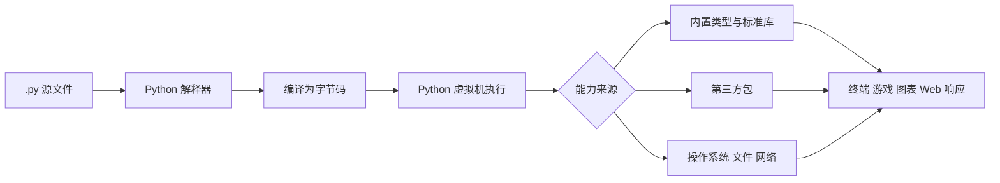
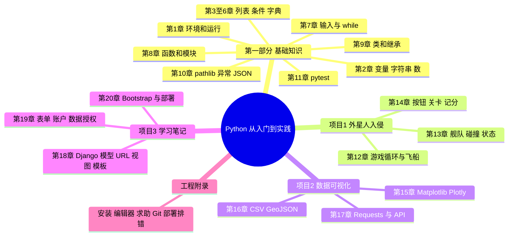
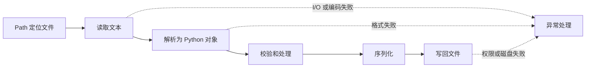
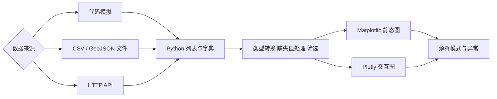
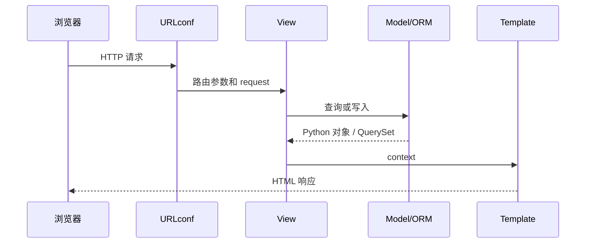
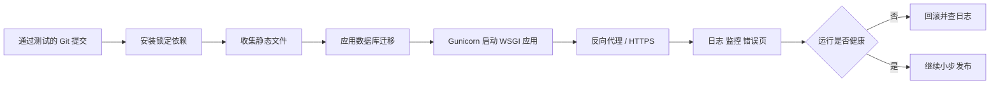

# 《Python编程：从入门到实践（第3版）》深度阅读

> **书目信息**：Eric Matthes, *Python Crash Course, 3rd Edition: A Hands-On, Project-Based Introduction to Programming*；袁国忠译；人民邮电出版社，2023；ISBN 978-7-115-61363-9。
>
> **文本依据**：本文逐章核对题目提供的中文 EPUB，包括“第 3 版修订说明”、前言、20 章正文与 5 个附录。`【原书】`表示书中的概念或经整理的短代码，`【第三版修订】`表示作者明确说明的版本变化，`【当前补充】`表示为了适配 2026 年工具链而加入的工程建议。
>
> **版本边界**：第 1 章说明本书示例使用 Python 3.11，代码只要求 Python 3.9+；部署项目锁定的主要依赖包括 Django 4.1、django-bootstrap5 21.3 和 platformshconfig 2.4.0。学习语言概念时不必追逐版本，但安装命令、第三方库 API 和云平台配置具有时效性，不能把 2023 年版本号当作今天的固定答案。

## 一、全书要建立的能力

### 1.1 作者怎样定义本书目标

前言对学习结果的描述非常具体：

> “本书旨在让你尽快学会 Python，以便编写出能正确运行的程序——游戏、数据可视化和 Web 应用程序，同时掌握让你终身受益的基本编程知识。”（前言“读者对象”）

这句话包含两层目标。第一层是语言能力：会表示数据、控制程序、组织函数和类、读写文件、处理错误、编写测试。第二层是交付能力：把这些零件组合成三个能运行的项目，而不是停留在语法练习。

作者选择 Python 的理由也不是一句“简单”：

> “Python 是一种效率极高的语言：相比于众多其他语言，使用 Python 编写的程序包含的代码行更少。”（前言“为何使用 Python”）

原书随后强调可读、易调试、易扩展，以及游戏、Web、商业工具、科研等广泛用途。通俗地说，Python 把内存管理、编译链接和大量样板代码藏在较高层的抽象之后，让初学者先学习怎样把问题转换为数据和步骤；当问题变大时，再通过函数、类、模块、框架和测试控制复杂度。

### 1.2 Python 程序从源码到结果



“解释型语言”不等于源码永远逐字符执行。以 CPython 为例，源代码会先变成字节码，再由虚拟机执行；实现还会缓存字节码。初学时真正要掌握的是：`.py` 是源码，解释器负责运行，导入系统寻找模块，环境决定可以导入哪些第三方包。

### 1.3 全书的递进结构



这不是“前半本语法，后半本无关示例”。三个项目分别验证三种程序生命周期：游戏是持续处理事件并更新状态；数据程序是采集、清洗、分析和呈现；Web 应用是请求、路由、业务、持久化、模板和部署。它们共同回答“学完语法后怎样组成软件”。

### 1.4 与其他主流语言的差异

下表是【当前补充】，比较语言的典型工程取向，不代表任何语言只能用于某一领域。

| 维度 | Python | JavaScript / TypeScript | Java | C++ / Rust | R |
| --- | --- | --- | --- | --- | --- |
| 类型系统 | 动态、强类型；可选类型注解 | JavaScript 动态；TypeScript 编译期静态检查 | 静态、名义类型为主 | 静态，强调底层控制；Rust 强调所有权安全 | 动态，面向统计向量 |
| 运行位置 | 服务端、桌面、脚本、数据与自动化 | 浏览器原生，Node 可运行在服务端 | JVM 上，企业服务端成熟 | 原生机器码，系统与性能敏感领域 | 数据分析和统计研究 |
| 初始代码量 | 少，交互式探索快 | Web 交互链路最直接 | 工程结构和工具约束较强 | 编译、生命周期或内存概念更多 | 统计表达紧凑 |
| 性能特征 | CPython 的纯 Python CPU 密集循环较慢 | JIT 引擎对常见场景优化成熟 | JIT 与并发工具成熟 | 可预测的高性能与资源控制 | 向量化统计任务强 |
| 并发模型 | 线程、进程、`asyncio`；CPython 版本差异需留意 | 事件循环与 Promise 是主流 | 线程、虚拟线程、异步框架 | 线程和异步运行时，控制更细 | 并行生态偏数据任务 |
| 突出优势 | 可读、胶水能力强，科学计算、AI、自动化生态广 | 浏览器不可替代，全栈共享语言 | 大型组织、长期服务和工具链成熟 | 性能、内存与系统边界可控 | 统计模型和探索性分析丰富 |
| 主要代价 | 运行时类型错误、部署环境和依赖管理、原生移动/浏览器较弱 | 工具链变化快，运行时边界复杂 | 样板和内存开销通常更大 | 学习和构建成本较高 | 通用应用开发生态较窄 |

Python 的优势不是所有任务都最快，而是**把想法变成可读程序的路径很短**。需要浏览器界面时 JavaScript/TypeScript 更直接，需要极致性能和资源控制时 C++/Rust 更合适，需要强静态约束的大型服务时 Java/TypeScript 常有优势；Python 则擅长把数据、自动化、Web 和原生扩展连接在一起。

## 二、20 章分别完成了哪一步

| 章节 | 标题与技术范围 | 核心内容 | 解决的问题与形成的能力 |
| --- | --- | --- | --- |
| 前言 | 读者、内容和 Python 的定位 | 面向零基础读者，以基础知识加三个项目组织学习 | 不把学习目标停在语法记忆，而是尽快构建正确运行的程序 |
| 第1章 | 起步 | Python 版本、解释器、VS Code、终端、Hello World、安装排错 | 建立从编辑源文件到解释器执行的最短反馈环 |
| 第2章 | 变量和简单数据类型 | 变量是标签；字符串方法、f-string、空白、前后缀；整数、浮点数、注释、Python 之禅 | 正确表示单个值，读懂 traceback，用清晰名称和简单表达减少错误 |
| 第3章 | 列表简介 | 索引、负索引、增删改、`sort()`、`sorted()`、长度 | 用有序可变集合管理同类对象，并区分原地修改和返回新结果 |
| 第4章 | 操作列表 | `for`、缩进、`range()`、统计、列表推导式、切片、复制、元组、PEP 8 | 批量处理集合，理解缩进就是语法，并避免切片与别名错误 |
| 第5章 | `if` 语句 | 比较、成员测试、布尔表达式、`if/elif/else`、列表条件 | 让程序根据状态选择行为，并区分互斥分支与多个独立条件 |
| 第6章 | 字典 | 键值对、`get()`、遍历键/值/项、列表与字典嵌套 | 建模“属性属于对象”“值由键查找”的现实关系 |
| 第7章 | 用户输入和 `while` | `input()`、类型转换、求模、标志、`break`、`continue`、移动和删除元素 | 构建由用户和状态决定结束时机的交互程序 |
| 第8章 | 函数 | 形参与实参、位置和关键字参数、默认值、返回值、任意参数、模块 | 把重复步骤封装成命名能力，缩小调试和复用单元 |
| 第9章 | 类 | 属性、方法、实例、继承、组合、模块、标准库、命名约定 | 将相关数据和行为封装为对象，表达具有共同规则的实体 |
| 第10章 | 文件和异常 | `pathlib.Path`、文本读写、相对/绝对路径、异常、`else`、JSON | 让数据跨进程保存，并把可预期故障转成可控制分支 |
| 第11章 | 测试代码 | 安装 pytest、测试函数和类、断言、夹具 | 用可重复证据保护既有行为，支持放心重构和协作 |
| 第12章 | 武装飞船 | Pygame 初始化、主循环、设置类、图像、事件、连续移动、子弹、重构 | 建立实时应用的“读取事件—更新状态—绘制—限帧”循环 |
| 第13章 | 外星人 | Sprite、舰队生成、边缘检测、碰撞、生命和活动状态 | 管理大量同类对象及对象间交互，并明确一局游戏的状态机 |
| 第14章 | 记分 | 按钮、鼠标、难度递增、分数、最高分、剩余飞船 | 把游戏从技术演示变成可开始、结束、重玩和反馈的产品 |
| 第15章 | 生成数据 | Matplotlib 折线/散点、随机游走；Plotly Express 直方图 | 从模拟数据中发现模式，并根据问题选择图形编码 |
| 第16章 | 下载数据 | CSV 天气、日期、缺失值；GeoJSON 地震地图 | 把外部半结构化数据解析、筛选、转换为可视化所需字段 |
| 第17章 | 使用 API | Requests、GitHub 搜索 API、JSON 响应、Plotly、Hacker News API | 自动获取持续变化的网络数据，并检查状态码与响应结构 |
| 第18章 | Django 入门 | 虚拟环境、项目和应用、模型、迁移、管理站、shell、URL、视图、模板 | 构造 Web 请求到数据库和 HTML 响应的完整链路 |
| 第19章 | 用户账户 | ModelForm、增删改、认证、注册、`@login_required`、外键、对象所有权 | 从“能用”提升为多用户系统，防止横向访问他人数据 |
| 第20章 | 样式与部署 | django-bootstrap5、模板导航、Platform.sh、Git、PostgreSQL、Gunicorn、错误页 | 将本地开发应用变成可通过互联网访问的生产进程 |
| 附录 A～E | 工程支撑 | 安装排错、编辑器与 IDE、求助渠道、Git、部署排错 | 建立定位环境问题、查文档、保留历史和阅读日志的自助能力 |

## 三、沿程序生命周期逐章精读

Python 语言本身没有唯一的“生命周期”，但书中的教学顺序有清晰的工程递进：先建立可运行环境，再表示和组织数据，随后控制行为、封装复杂度、保存数据并验证行为；完成这些基础后，分别进入实时游戏、数据流水线和 Web 请求三个生命周期。下面以阶段为三级标题、章节为四级标题，保持原书顺序，不跳过任何一章。

### 3.1 基础程序：从源码到可验证行为

#### 第 1 章：起步——打通编辑、解释与执行

本章要解决的不是复杂算法，而是最基础也最容易被低估的问题：如何证明编辑器保存的文件确实由预期的 Python 解释器执行。原书先检查版本，再安装或配置 VS Code，最后从编辑器和终端两条路径运行同一个程序。

```python
print("Hello Python world!")
```

运行成功至少证明三件事：文件是有效的 Python 源码、命令找到了一个 Python 解释器、当前用户有权读取文件并输出到终端。书中说明示例使用 Python 3.11，但只涉及 Python 3.9 以上均有的特性。今天学习时可以使用受第三方库支持的更新版本，遇到问题先确认解释器身份：

```powershell
python --version
python -c "import sys; print(sys.executable)"
python hello_world.py
```

- **解释器（interpreter）**：读取 Python 程序并执行其语义的软件；最常见实现是 CPython。
- **REPL（Read-Eval-Print Loop）**：读取、求值、打印、循环的交互环境，书中的 `>>>` 表示在这里输入代码。
- **IDE（Integrated Development Environment）**：集编辑、运行、调试等能力于一体的集成开发环境。
- **语法高亮（syntax highlighting）**：按语法角色显示不同样式，只帮助阅读，不改变程序含义。

常见局限是“编辑器能运行，终端不能运行”，或反过来。这通常不是 Python 语法问题，而是两处选中了不同解释器。排查顺序应是版本、`sys.executable`、当前目录、文件名，最后才是重装。

#### 第 2 章：变量与简单数据——给状态命名

原书把变量解释为指向值的“标签”，这比“装值的盒子”更接近 Python 的对象模型。重新赋值会让名称改为引用另一个对象，并不改变旧对象本身。字符串用于文本，整数与浮点数用于数值；方法调用、f-string、空白处理和注释则让数据可被转换、展示和解释。

```python
first_name = "ada"
last_name = "lovelace"
full_name = f"{first_name} {last_name}"
print(full_name.title())

nostarch_url = "https://nostarch.com"
print(nostarch_url.removeprefix("https://"))
```

`removeprefix()` 是第三版新增讲解的 Python 3.9+ 方法。它删除完整前缀；`lstrip("https://")` 的参数却是“可删除字符的集合”，两者语义不同。数值字面量中的下划线只改善可读性，`14_000_000_000` 与 `14000000000` 相等。浮点数使用二进制近似表示，因此金额或十进制定点规则应考虑 `decimal.Decimal`。

- **变量（variable）**：绑定到对象的名称。
- **值（value）**：程序操作的数据对象。
- **方法（method）**：与某种对象类型关联、通过对象调用的函数，如 `name.title()`。
- **f-string（formatted string literal）**：在前缀为 `f` 的字符串中用 `{}` 嵌入表达式。
- **traceback**：异常发生时显示的调用路径和出错位置，是定位问题的首要证据。

本章的边界是只处理单个或少量值。值变多后，创建 `item_1`、`item_2` 会迅速失控，下一章的集合正是为此而来。

#### 第 3 章：列表——管理有序、可变的一组对象

列表把一系列元素放在同一个有序容器中，可通过从 0 开始的索引访问。原书依次讲修改、`append()`、`insert()`、`del`、`pop()`、`remove()`，然后区分永久排序与临时排序。

```python
motorcycles = ["honda", "yamaha", "suzuki"]
motorcycles.append("ducati")
last_owned = motorcycles.pop()

print(sorted(motorcycles))  # 返回新列表
print(motorcycles)          # 原顺序未变
motorcycles.sort()          # 原地修改
```

选择删除方式取决于已知信息：知道索引用 `del` 或 `pop()`；还需要被删除的值用 `pop()`；只知道值用 `remove()`，但它只删除第一个匹配项。空列表访问 `[-1]` 仍会触发 `IndexError`，负索引不是空列表的特殊保护。

- **列表（list）**：有序、可变的对象序列。
- **索引（index）**：元素在序列中的位置，Python 从 0 计数。
- **差一错误（off-by-one error）**：边界多算或少算一个位置的错误。
- **原地操作（in-place operation）**：直接改变原对象，如 `list.sort()`，通常返回 `None`。

列表的成员查找通常需要线性扫描。只需快速判断“是否存在”或去重时，`set` 更适合；按键查询属性时应使用第 6 章的字典。

#### 第 4 章：循环、切片与元组——批量处理并明确可变边界

第 4 章用 `for` 将“对每个元素做同一件事”交给解释器，以避免随数据长度增长的重复代码。Python 以缩进划分代码块，因此缩进不是排版装饰，而是语法。`range()` 生成整数序列，切片处理子区间，元组表达不应整体改变的一组值。

```python
players = ["charles", "martina", "michael", "florence", "eli"]
for player in players[:3]:
    print(player.title())

squares = [value**2 for value in range(1, 11)]
dimensions = (200, 50)
```

`range(1, 11)` 包含 1、不包含 11；切片同样采用左闭右开区间。`copy = players[:]` 创建浅拷贝，`copy = players` 只增加一个指向同一列表的名称。元组不可重新赋值其中某个槽位，但元组内部若含可变对象，该对象仍可改变。

- **迭代（iteration）**：依次取得可迭代对象中的值。
- **切片（slice）**：用 `[start:stop:step]` 取得序列的一个区间。
- **列表推导式（list comprehension）**：将生成、遍历和收集写成一个表达式。
- **元组（tuple）**：有序、通常用于表达固定结构的不可变序列。
- **PEP 8**：Python 官方代码风格指南，书中强调四空格缩进、合理行长和空行。

推导式适合单一且清楚的变换；多层循环和复杂条件硬塞进一行会牺牲可读性。浅拷贝也不会递归复制嵌套对象，需要隔离深层结构时再评估 `copy.deepcopy()` 或重新建模。

#### 第 5 章：条件判断——让行为服从当前状态

每条 `if` 的核心都是结果为 `True` 或 `False` 的条件测试。`if/elif/else` 表示互斥决策，多个独立 `if` 表示多条规则可同时生效。这一区别直接决定业务行为。

```python
age = 19
if age < 4:
    price = 0
elif age < 18:
    price = 25
else:
    price = 40

requested_toppings = ["mushrooms", "extra cheese"]
if requested_toppings:
    print("Preparing your pizza.")
```

字符串比较默认区分大小写，若业务规则不区分，应先用 `casefold()` 或书中的 `lower()` 规范化。`in` / `not in` 适合成员测试；空列表在布尔上下文为假。不要为了“总有一个分支”而滥用 `else`，明确的最后一个 `elif` 往往能拒绝未预料状态。

- **条件测试（conditional test）**：计算结果为布尔值的表达式。
- **布尔值（Boolean）**：`True` 或 `False`，名称来自逻辑学家 George Boole。
- **比较运算符**：`==`、`!=`、`<`、`<=`、`>`、`>=`。
- **短路求值（short-circuit evaluation）**：`and` / `or` 在结果已确定时不再计算后续表达式。

复杂条件容易重复和遗漏。相同规则出现多次时应提取为有名字的函数，并为边界值编写测试，而不是继续堆叠分支。

#### 第 6 章：字典——用键值关系为现实对象建模

字典解决“根据名称找到相关值”的问题。它能存储任意数量的键值对，值还可以是列表或其他字典，因此可表达对象属性、配置、调查结果和嵌套数据。

```python
alien_0 = {"color": "green", "points": 5}
alien_0["x_position"] = 0
speed = alien_0.get("speed", "medium")

for key, value in alien_0.items():
    print(f"{key}: {value}")
```

`mapping[key]` 表示键必须存在，缺失时抛出 `KeyError`；`mapping.get(key, default)` 表示缺失是预期情况。不要一律用 `get()` 掩盖必填字段缺失。现代 Python 字典保留插入顺序，但业务若要求按键排序，应显式使用 `sorted(mapping)`。

- **字典（dictionary / dict）**：从可哈希键映射到值的可变容器。
- **键值对（key-value pair）**：一个查找键及其关联值。
- **哈希（hash）**：把键转换为用于快速定位的整数摘要；字典键必须可哈希。
- **嵌套（nesting）**：容器中再包含容器，用于表示层级关系。

层级过深的字典会充斥字符串键和防御性判断。结构稳定且行为增多时，可改用类、`dataclass` 或经验证的数据模型；数据来自外部时，访问前必须校验字段和类型。

#### 第 7 章：输入与 `while`——构造可终止的交互循环

大多数终端程序需要从用户取得信息，并在用户决定结束前持续工作。`input()` 永远返回字符串，因此数值输入必须转换；`while` 适合循环次数事先未知、退出由状态决定的场景。

```python
prompt = "Enter a topping, or 'quit' to finish: "
while True:
    topping = input(prompt).strip()
    if topping == "quit":
        break
    if not topping:
        continue
    print(f"Adding {topping}.")
```

书中分别展示条件、活动标志、`break` 和 `continue`。标志适合多个事件共同决定循环是否继续；`break` 直接离开当前循环；`continue` 跳过本轮余下代码。把列表元素移动到另一个列表时，`while source:` 很自然；遍历列表同时修改它则容易漏项。

- **输入（input）**：程序从用户或外部环境获得的数据。
- **标志（flag）**：记录某种状态是否成立的布尔变量。
- **求模运算符（modulo, `%`）**：返回除法余数，可判断奇偶或周期位置。
- **无限循环（infinite loop）**：退出条件永远无法满足的循环。

真实输入可能为空、不是数字或超出范围，`int(input(...))` 会抛出 `ValueError`。教程示例重在控制流；实际程序应在输入边界集中验证，并为长期运行的循环设计清理和中断机制。

#### 第 8 章：函数与模块——把步骤变成可复用接口

函数通过名称、参数和返回值形成边界：调用者只需知道“提供什么、得到什么”，不必重复内部步骤。原书从位置实参、关键字实参、默认值讲到 `*args`、`**kwargs`，再将函数移入模块。

```python
def get_formatted_name(first, last, middle=""):
    """返回格式规范的姓名。"""
    parts = [first, middle, last]
    return " ".join(part for part in parts if part).title()


musician = get_formatted_name("john", "hooker", middle="lee")
```

形参是定义中的名称，实参是调用时提供的值。列表传入函数后可被原地修改；传入 `items[:]` 能隔离顶层列表，但复制有成本且仍是浅拷贝。任意参数提供扩展性，却会弱化接口约束，应在真正数量不定时使用。

- **函数（function）**：可调用、可命名的一段行为。
- **形参（parameter）**：函数定义中接收值的名称。
- **实参（argument）**：调用函数时传入的具体值。
- **返回值（return value）**：函数通过 `return` 交还给调用者的结果。
- **模块（module）**：可被导入的 Python 文件；`import` 让定义跨文件复用。

函数过长通常表示承担了多项职责；函数参数过多则可能表示缺少一个领域对象。`from module import *` 还会污染命名空间，工程代码更适合显式导入。

#### 第 9 章：类——把持续状态与行为封装在一起

类适合描述“有自己的状态，并围绕这些状态执行行为”的实体。书中的 `Dog`、`Car` 和 `ElectricCar` 依次演示实例、默认属性、修改状态、继承、重写与组合。

```python
class Battery:
    def __init__(self, battery_size=40):
        self.battery_size = battery_size


class ElectricCar:
    def __init__(self, make, model, year):
        self.make = make
        self.model = model
        self.year = year
        self.battery = Battery()
```

继承表达稳定的“是一种”关系；组合表达“拥有一个、与之协作”的关系。原书将电池提取成独立类，正是避免汽车类承担过多细节。直接修改属性、通过方法修改属性、通过方法递增属性三种方式的选择，本质上是是否需要守住业务不变量。

- **类（class）**：描述一类对象的数据和行为的定义。
- **实例（instance）**：根据类创建的具体对象。
- **属性（attribute）**：挂在对象或类上的数据。
- **方法（method）**：定义在类中并操作对象状态的函数。
- **继承（inheritance）**：子类取得并扩展父类接口。
- **组合（composition）**：对象持有其他对象并委托工作。

深继承树会让行为来源难以追踪，领域关系不清时优先考虑组合。只有数据而没有行为的对象可评估 `dataclasses.dataclass`，但自动生成初始化方法并不会替你完成正确建模。

#### 第 10 章：文件、JSON 与异常——让数据跨运行保存，让失败可控制

前九章的数据大多在进程结束时消失。第 10 章用 `pathlib.Path` 读取和写入文本，用异常处理可预期故障，再以 JSON 保存用户数据。第三版从旧式路径操作转向 `Path`，让路径组合和文件操作围绕一个对象展开。

```python
from pathlib import Path
import json

path = Path("numbers.json")
numbers = [2, 3, 5, 7, 11, 13]
path.write_text(json.dumps(numbers), encoding="utf-8")

try:
    stored = json.loads(path.read_text(encoding="utf-8"))
except FileNotFoundError:
    stored = []
```

`try` 只包住可能失败的操作，`except` 处理能够恢复的特定异常，`else` 放仅在成功时执行的代码。裸 `except:` 会吞掉过多信号。书中用 `pass` 演示静默失败，同时强调是否报告错误应由程序目标决定，而不是把所有问题都隐藏。

- **路径（path）**：文件系统中定位文件或目录的信息；相对路径以当前工作目录为基准。
- **异常（exception）**：运行时无法按正常路径继续时产生的对象化信号。
- **序列化（serialization）**：将内存对象转换为可存储或传输的格式。
- **JSON（JavaScript Object Notation）**：跨语言文本数据交换格式，只直接表示有限类型。
- **重构（refactoring）**：在保持外部行为的前提下改善代码结构。

JSON 不是数据库：并发写入、事务、查询和模式演进都很弱。重要或多用户数据应进入数据库；外部 JSON 也不能默认可信，读取成功后仍要验证结构。

#### 第 11 章：pytest——用可重复证据保护行为

测试的核心不是“证明程序永不出错”，而是把期望写成可自动重复执行的断言。第三版改用 pytest：测试是以 `test_` 命名的普通函数，`assert` 失败时 pytest 展示参与比较的值；夹具集中提供重复的测试对象。

```python
from name_function import get_formatted_name


def test_first_last_name():
    formatted = get_formatted_name("janis", "joplin")
    assert formatted == "Janis Joplin"
```

```bash
python -m pip install pytest
python -m pytest
```

用 `python -m pytest` 可确保测试工具属于当前解释器。测试未通过时，应先判断被测代码还是测试期望有误，不要为了“变绿”立即改断言。缺陷修复最好先加一个能够复现缺陷的测试。

- **单元测试（unit test）**：验证一个较小行为单元的测试。
- **测试用例（test case）**：围绕某项行为组织的一组测试条件。
- **断言（assertion）**：声明某个结果必须满足的条件。
- **夹具（fixture）**：为测试提供可重复的准备数据或资源。
- **回归（regression）**：修改使原本正确的行为重新出错。

只测正常输入会留下边界和失败路径；过度绑定内部实现又会让每次重构都破坏测试。优先测试公开行为、关键规则和高风险边界，并隔离网络、时间、随机数等不稳定依赖。

### 3.2 实时游戏：事件、状态、碰撞与反馈

#### 第 12 章：武装飞船——建立稳定的逐帧循环

Pygame 项目的生命周期是“读取事件、更新状态、绘制当前帧、限制帧率”，循环持续到退出。书中先规划项目，再创建窗口、`Settings` 和 `Ship`，随后实现持续移动、边界限制、子弹编组与清理，并不断重构主类。

```python
def run_game(self):
    while True:
        self._check_events()
        self.ship.update()
        self._update_bullets()
        self._update_screen()
        self.clock.tick(60)
```

按键按下和释放分别修改移动标志，`update()` 每帧读取标志，所以飞船可以持续移动，而不是只响应一次键盘事件。飞船位置用浮点数保存、绘制前再赋给矩形坐标，可支持低于一像素/帧的速度。离开屏幕的子弹必须从编组删除，否则内存与碰撞成本会不断增长。

- **Pygame**：基于 SDL 的 Python 多媒体与 2D 游戏库。
- **事件循环（event loop）**：持续取得输入事件并分派处理的循环。
- **帧率（FPS, frames per second）**：每秒更新和绘制的帧数。
- **Sprite**：Pygame 中表示可绘制、可分组游戏对象的基类。
- **Group**：批量更新、绘制和碰撞检测 Sprite 的容器。

第三版增加 `Clock.tick(60)` 控制帧率，但固定“每帧移动多少”仍会在掉帧时减速。要求更稳定的实时运动时，应根据实际经过时间计算位移。

#### 第 13 章：外星人——管理对象群、碰撞与一局游戏的状态

本章把单个外星人扩展为按屏幕尺寸生成的舰队：横向移动，触边后整体下移并反向；子弹与外星人碰撞后删除双方；舰队清空后生成新舰队；外星人与飞船或底边碰撞会损失生命。

```python
collisions = pygame.sprite.groupcollide(
    self.bullets,
    self.aliens,
    True,
    True,
)

if not self.aliens:
    self.bullets.empty()
    self._create_fleet()
```

`groupcollide()` 返回碰撞映射，不只是一个布尔值，因此第 14 章可利用它准确计分。把“大子弹”作为临时测试手段体现了可观测性思想，但测试完成应恢复设置。`game_active` 将“程序进程仍运行”和“一局游戏正在进行”分开。

- **碰撞检测（collision detection）**：判断游戏对象的边界是否相交。
- **状态机（state machine）**：用有限状态及其转换描述系统行为；本项目隐含活动、暂停/结束等状态。
- **重生/重置**：损失生命后清理瞬时对象并把角色放回初始位置。

矩形碰撞计算快，但对不规则图形不精确；项目复杂后还需遮罩或物理引擎。碰撞、清理和重建的先后顺序也会影响同一帧结果，应集中在状态更新阶段。

#### 第 14 章：记分——把技术演示补成可重玩的产品闭环

第 14 章增加 Play 按钮、难度递增、当前分数、最高分、等级和剩余飞船。开始新游戏时必须同时重置统计、速度、对象编组、飞船位置和鼠标状态；遗漏任何一项都会把上一局状态泄漏到下一局。

```python
if button_clicked and not self.stats.game_active:
    self.settings.initialize_dynamic_settings()
    self.stats.reset_stats()
    self.stats.game_active = True
    self.bullets.empty()
    self.aliens.empty()
    self._create_fleet()
    self.ship.center_ship()
```

分数显示需要把数值转换为渲染图像，数据改变后显式重新准备图像。速度、外星人分值等动态设置集中到 `Settings`，会话统计放入 `GameStats`，显示逻辑放入 `Scoreboard`，这是按变化原因分离职责。

- **HUD（Head-Up Display）**：不离开主场景即可看到的分数、生命、等级等信息。
- **动态设置**：随关卡变化的速度和分值，与屏幕尺寸等静态设置区分。
- **命中框（hitbox）**：用于交互或碰撞判断的几何区域，按钮也有自己的矩形命中框。

原书最高分只存在内存中，退出即丢失。需要跨会话保存时可复用第 10 章的 JSON；需要排行榜则必须考虑身份、并发、作弊与服务端校验。

### 3.3 数据程序：生成、采集、清洗、可视化与解释

#### 第 15 章：生成数据——从序列到可解释图形

本章先用 Matplotlib 绘制平方数和随机游走，再用 Plotly Express 展示掷骰子频数。关键不是“画出漂亮图”，而是建立数据、视觉编码和问题之间的关系：折线强调连续趋势，散点展示单个观测，直方/条形图比较离散结果频数。

```python
import matplotlib.pyplot as plt

x_values = range(1, 1001)
y_values = [x**2 for x in x_values]
plt.style.use("seaborn-v0_8")
fig, ax = plt.subplots()
ax.scatter(x_values, y_values, c=y_values, cmap=plt.cm.Blues, s=10)
ax.ticklabel_format(style="plain")
plt.show()
```

随机游走类把“生成数据”与“画图”分开，同一生成器可被多种图形消费。掷骰子实验先模拟，再按所有可能结果计数；样本量越大，经验频率通常越接近理论概率，但随机结果不会逐次严格均匀。

- **Matplotlib**：以静态图和精细控制见长的 Python 绘图库。
- **Plotly Express**：Plotly 的高级声明式接口，快速创建交互图。
- **颜色映射（colormap）**：把连续数值映射为颜色的规则。
- **随机游走（random walk）**：每一步由随机选择决定方向和距离的路径模型。

图形可能误导：坐标轴截断、面积编码、颜色选择和样本偏差都会改变读者判断。样式名也属于第三方库 API，跨版本失效时应查当前 Matplotlib 可用样式，而不是修改数据逻辑。

#### 第 16 章：下载数据——解析 CSV 与 GeoJSON

第 16 章处理两类真实文件。CSV 天气数据要求读取表头、按列索引提取日期和高低温、跳过缺失值，再绘制时间序列；GeoJSON 地震数据要求沿嵌套结构提取震级、经纬度和标题，并把震级映射到点大小和颜色。

```python
from csv import reader
from datetime import datetime
from pathlib import Path

lines = Path("weather.csv").read_text(encoding="utf-8").splitlines()
rows = reader(lines)
header_row = next(rows)

dates, highs = [], []
for row in rows:
    try:
        current_date = datetime.strptime(row[2], "%Y-%m-%d")
        high = int(row[4])
    except ValueError:
        continue
    dates.append(current_date)
    highs.append(high)
```

书中通过打印表头及索引理解数据，而不是假定每个文件列位置相同。更稳妥的工程写法是 `csv.DictReader` 按列名读取，并记录被跳过的异常行。GeoJSON 坐标通常按 `[longitude, latitude, ...]`，不能按日常口语中的“纬度、经度”想当然地交换。

- **CSV（Comma-Separated Values）**：以分隔符表示表格行列的文本格式，字段可能包含引号和换行，应使用解析器。
- **GeoJSON**：使用 JSON 表示地理要素及几何坐标的交换格式。
- **缺失值（missing value）**：未观测或不可用的数据，不等同于数值 0。
- **数据清洗（data cleaning）**：发现并处理缺失、非法、重复、单位不一等问题。

本章示例依赖下载时的数据结构，数据提供方改列名或嵌套结构后代码会失败。解决办法是保存来源和获取时间、检查模式、记录清洗规则，并用小样本测试解析器。

#### 第 17 章：API——让程序消费持续变化的网络数据

API 项目用 Requests 调用 GitHub 搜索接口，检查状态码、解析 JSON、显示仓库名称、星标数、描述和链接；随后读取 Hacker News 条目。与下载固定文件相比，API 还带来网络失败、限流、分页和远端模式变化。

```python
import requests

url = "https://api.github.com/search/repositories"
params = {"q": "language:python stars:>10000", "sort": "stars"}
headers = {"Accept": "application/vnd.github+json"}

response = requests.get(url, params=params, headers=headers, timeout=10)
response.raise_for_status()
response_dict = response.json()
repositories = response_dict["items"]
```

原书打印 `status_code` 并查看 `total_count`、`incomplete_results` 和速率限制。上例补充超时与 `raise_for_status()`，避免请求无限等待或把错误页当数据。生产程序还要按响应头处理限流，按 API 规则翻页，并把令牌放在环境变量而非源码。

- **API（Application Programming Interface）**：应用程序编程接口；这里特指通过 HTTP 暴露的数据接口。
- **HTTP（Hypertext Transfer Protocol）**：客户端与服务端交换请求和响应的协议。
- **状态码（status code）**：HTTP 响应结果分类，如 200 成功、404 未找到、429 请求过多。
- **速率限制（rate limit）**：服务端在时间窗口内允许的请求数量。
- **分页（pagination）**：把大量结果分批返回。

不要对所有失败机械重试：认证失败、参数错误通常重试无效；超时和部分 5xx 可采用有限次数、指数退避并加入随机抖动。展示第三方描述时还要注意空值、超长文本和链接安全。

### 3.4 Web 应用：请求、持久化、身份与部署

#### 第 18 章：Django 入门——走通请求到 HTML 的完整链路

本章从“学习笔记”的规范开始，创建虚拟环境、项目和应用，定义 `Topic` / `Entry` 模型并迁移数据库，再通过管理站和 shell 检查数据，最后完成 URL、视图、模板和模板继承。

```python
# models.py
from django.db import models


class Topic(models.Model):
    text = models.CharField(max_length=200)
    date_added = models.DateTimeField(auto_now_add=True)

    def __str__(self):
        return self.text
```

```powershell
python -m django startproject ll_project .
python manage.py startapp learning_logs
python manage.py makemigrations learning_logs
python manage.py migrate
python manage.py runserver
```

模型描述数据，迁移描述模式变化，URLconf 选择视图，视图查询模型并组织上下文，模板把上下文渲染为 HTML。模板继承把公共结构放进 `base.html`，避免每个页面复制导航和布局。

- **Django**：包含 ORM、模板、表单、认证和管理站的 Python Web 框架。
- **ORM（Object-Relational Mapping）**：对象关系映射，用 Python 对象表达关系数据库操作。
- **迁移（migration）**：可版本控制、可按顺序应用的数据库模式变更。
- **URLconf**：Django 的 URL 配置，将路径模式映射到视图。
- **模板（template）**：包含变量和控制标签、最终渲染为文本响应的文件。

开发服务器只用于本地调试，不能承担生产流量。迁移文件是源代码的一部分，应该提交版本控制；直接手改生产数据库会让代码状态与数据结构失去一致性。

#### 第 19 章：用户账户——表单、认证与对象级授权

第 19 章让用户创建主题、添加和编辑条目，再接入登录、注销、注册，并把主题关联到所有者。最重要的安全递进是：登录只确认“你是谁”，查询时还必须确认“这个对象是否属于你”。

```python
from django.contrib.auth.decorators import login_required
from django.shortcuts import get_object_or_404, render


@login_required
def topic(request, topic_id):
    selected = get_object_or_404(
        Topic,
        id=topic_id,
        owner=request.user,
    )
    entries = selected.entry_set.order_by("-date_added")
    return render(request, "learning_logs/topic.html", {
        "topic": selected,
        "entries": entries,
    })
```

`ModelForm` 负责字段转换和验证；POST 成功后重定向，避免刷新页面重复提交。所有读取、编辑、删除路径都必须带所有者条件，不能只在主题列表中过滤。模板表单加入 ``，注销等改变会话状态的操作应使用 POST。

- **认证（authentication）**：确认用户身份。
- **授权（authorization）**：判断已识别用户是否允许执行某项操作。
- **IDOR（Insecure Direct Object Reference）**：仅修改对象 ID 就能越权访问他人对象的漏洞。
- **CSRF（Cross-Site Request Forgery）**：诱导已登录浏览器向目标站点发送非预期请求的攻击。
- **PRG（Post/Redirect/Get）**：POST 成功后重定向到 GET 页面的交互模式。

`@login_required` 不是完整授权方案，隐藏按钮也不是安全控制。服务端每个对象查询都应施加权限约束；输入数据还要限制长度、文件类型和业务范围。

#### 第 20 章：样式与部署——从本地项目到可运营服务

本章先用 `django-bootstrap5` 和 Bootstrap 改造基础模板、导航、主页、表单和内容页，然后把项目通过 Git、依赖文件、Gunicorn、PostgreSQL、静态文件和 Platform.sh 配置发布。部署不是一次“上传”，而是一条可重复的构建与启动流程。

```text
Git 提交
  -> 安装 requirements.txt 中的依赖
  -> 提供环境变量和数据库
  -> 运行迁移与 collectstatic
  -> Gunicorn 启动 WSGI 应用
  -> 平台把 HTTPS 请求路由到应用
```

书中 Platform.sh 的 CLI、YAML 和依赖版本反映的是成书时环境，今天不能照抄为永恒配置；应保留部署原理，按当前平台文档更新命令。无论使用哪个平台，都要关闭 `DEBUG`、配置 `ALLOWED_HOSTS`、从环境读取 `SECRET_KEY`、提供自定义错误页并查看构建和运行日志。

- **Bootstrap**：提供响应式布局和组件样式的前端 CSS/JavaScript 工具包。
- **WSGI（Web Server Gateway Interface）**：传统同步 Python Web 服务器与应用之间的接口。
- **Gunicorn（Green Unicorn）**：常用于运行 WSGI 应用的生产进程服务器。
- **PaaS（Platform as a Service）**：由平台管理基础设施和部分部署流程的服务模式。
- **静态文件（static files）**：CSS、JavaScript、图片等不经业务视图动态生成的资源。

部署成功只表示某一刻能访问，并不等于可运营。还需要备份、日志、健康检查、错误监控、依赖升级、迁移回滚与密钥轮换。首次上线至少验证注册、登录、注销、对象隔离、404/500、静态资源及重启后的数据持久性。

### 3.5 工程支撑：附录 A～E

五个附录不是可有可无的尾注，而是贯穿全部项目的自助工具链：附录 A 按操作系统排查 Python 安装并列出关键字与内置函数；附录 B 比较编辑器与 IDE，重点说明 VS Code 配置；附录 C 要求求助前明确“想做什么、试过什么、结果如何”；附录 D 用 Git 保存可工作的项目快照；附录 E 把部署拆成远端环境、依赖、数据库、静态文件、进程和路由等步骤，并要求从日志中定位失败阶段。

```bash
git status
git add .
git commit -m "Implement topic ownership"
git log --oneline
```

- **Git**：分布式版本控制系统，跟踪内容快照和提交历史。
- **仓库（repository）**：包含工作文件和版本历史的项目目录。
- **提交（commit）**：带作者、时间和说明的一次项目快照。
- **日志（log）**：程序或平台记录的事件信息；部署排错先定位最后一个成功阶段和第一个失败阶段。

附录 D 展示了放弃修改和检出旧提交，但实际项目中恢复历史前必须先检查工作区，避免覆盖未提交成果。`.gitignore` 应忽略虚拟环境、缓存和密钥，却不能忽略源码、测试、迁移与依赖声明。

## 四、第三版究竟更新了什么

“第 3 版修订说明”给出的目标是保持“精练、简单易懂”，同时换用维护良好的流行库。下面只列作者明确说明的变化。

| 范围 | 第三版变化 | 解决的实际问题 | 版本边界 |
| --- | --- | --- | --- |
| 第1章 | 推荐跨平台的 VS Code | 初学者和专业开发者可共用编辑器与扩展生态 | 编辑器可替换，代码不依赖 VS Code |
| 第2章 | 增加 `removeprefix()` / `removesuffix()`；展示改进后的错误消息 | 正确移除完整前后缀；traceback 能指向具体表达式并给出拼写建议 | 两个方法从 Python 3.9 可用 |
| 第10章 | 用 `pathlib` 取代旧式文件路径处理 | 路径成为对象，读写和跨平台组合更直观 | `Path` 是标准库，不需安装 |
| 第11章 | 用 pytest 取代旧版测试方式 | 普通函数加 `assert` 即可测试，夹具减少重复准备 | pytest 是第三方包，必须装在当前环境 |
| 第12～14章 | Pygame 增加帧率控制，简化舰队创建和项目结构 | 不同机器不再因循环速度不同而改变游戏速度 | 游戏逻辑仍要区分“每帧位移”和“按时间位移” |
| 第15～17章 | 更新 Matplotlib 样式；Plotly 全部改用 Plotly Express | 用少量代码先得到图，再渐进定制 | 样式名和 Plotly 参数会随版本变化 |
| 第18～20章 | 更新 Django、Bootstrap；改名以澄清组织；改为 Platform.sh 和 YAML 部署 | 教程更接近当时专业部署流程 | 原书实际锁定 Django 4.1，云平台配置需要查当前文档 |
| 附录 | 重写安装与编辑器；更新求助渠道；保留 Git；新增部署排错 | 把“环境不工作”纳入学习内容 | 网站、CLI 和系统安装方式最容易过时 |

两个最能体现版本变化的语法对比如下。

```python
# 容易误用：lstrip() 删除的是字符集合，不是完整前缀。
url = "https://nostarch.com"
legacy_result = url.lstrip("https://")

# 【原书，第2章】Python 3.9+ 精确删除完整前缀。
host = url.removeprefix("https://")
```

```python
# 旧式文件读法仍然有效，但路径和资源管理分散。
with open("pi_digits.txt", encoding="utf-8") as file_object:
    contents = file_object.read().rstrip()

# 【原书，第10章】第三版改用 pathlib。
from pathlib import Path

path = Path("pi_digits.txt")
contents = path.read_text(encoding="utf-8").rstrip()
```

本文给第二段补上了 `encoding="utf-8"`。原书短例依赖平台默认编码，在中文 Windows 与跨平台部署中可能得到不同结果；明确文本编码更稳妥。

## 五、把 20 章串成跨项目技术链

### 5.1 建立环境：让“我写的代码”在“我选的解释器”中运行

#### 背景与原理

同一台计算机可能同时存在多个 Python，终端、VS Code 和虚拟环境也可能各自指向不同解释器。许多“明明安装了包却无法导入”的问题，本质是安装包的解释器和运行程序的解释器不是同一个。

【原书，第1章】建议先检查 `python --version` 或 `python3 --version`，再运行 Hello World，并在附录 A 处理操作系统差异。书中示例环境是 Python 3.11，最低兼容 3.9。

```python
print("Hello Python world!")
```

#### 当前使用方式

- 用 `python -m pip`，让 `pip` 明确属于当前 `python`。
- 每个项目创建独立 `.venv`，不要像书中部分命令那样用 `--user` 把所有库装入用户级环境。
- 在 VS Code 中选择 `.venv` 的解释器；终端中用 `python -c "import sys; print(sys.executable)"` 验证。
- 把依赖版本写入 `requirements.txt` 或 `pyproject.toml`，不要依赖“我电脑上恰好装过”。

#### 局限与解决

虚拟环境只隔离 Python 包，不隔离数据库、系统动态库和操作系统。需要完全一致的运行环境时，再使用容器；初学阶段不必一上来同时学习 Python、Docker 和云平台。

### 5.2 输入与表示：从字符串和数值建立程序状态

#### 变量不是盒子，而是标签

第 2 章特别强调“变量是标签”。赋值让名称引用一个对象；它不是把对象永久塞进固定类型的盒子。这能解释列表别名：

```python
original = ["red", "green"]
alias = original          # 两个名称引用同一个列表
copy = original[:]        # 创建浅拷贝

alias.append("blue")
print(original)           # ['red', 'green', 'blue']
```

动态类型让探索更快，但类型不匹配通常到运行路径被执行时才暴露。【当前补充】大型项目可在函数边界增加类型注解，并用 Pyright 或 mypy 检查；类型注解不会替代运行时验证。

#### 字符串、数值和格式化

```python
first_name = "ada"
last_name = "lovelace"
full_name = f"{first_name} {last_name}"
print(full_name.title())

universe_age = 14_000_000_000  # 下划线只提高源码可读性
```

f-string 把变量直接嵌入表达式，适合用户输出；日志系统则应使用参数化日志，避免不必要的字符串构造。浮点数采用二进制近似，涉及金额时应使用 `decimal.Decimal`，不要假设 `0.1 + 0.2 == 0.3`。

### 5.3 集合与变换：列表、元组和字典怎样分工

| 结构 | 顺序 | 可变 | 查找方式 | 典型用途 | 常见错误 |
| --- | --- | --- | --- | --- | --- |
| `list` | 有 | 是 | 整数索引，成员查找通常线性 | 有序任务、游戏对象、结果集合 | 修改时遍历、浅拷贝别名 |
| `tuple` | 有 | 否 | 整数索引 | 固定坐标、不会改变的一组返回值 | 误以为内部可变对象也被冻结 |
| `dict` | 保留插入顺序 | 是 | 键，平均常数时间查找 | 配置、记录、对象属性映射 | 直接索引缺失键引发 `KeyError` |
| `set` | 不承诺业务顺序 | 是 | 成员测试，平均常数时间 | 去重、权限集合、集合运算 | 依赖输出顺序 |

【原书，第4章】用列表推导式把“生成、遍历、收集”压缩成一个表达式：

```python
squares = [value**2 for value in range(1, 11)]
```

它适合单一、易读的变换。嵌套多层条件时，普通循环更容易调试。字典的 `get()` 适合缺键时有合理默认值：

```python
alien = {"color": "green", "points": 5}
speed = alien.get("speed", "medium")
```

如果缺键代表数据损坏，使用 `[]` 让程序快速失败反而更正确；不要用默认值掩盖必填字段。

### 5.4 控制流：把条件、重复和终止条件写清楚

`if/elif/else` 表达互斥选择，多个独立 `if` 表达可以同时成立的规则。`for` 适合遍历有限集合，`while` 适合结束时机由状态或用户决定的过程。

```python
prompt = "Enter a topping, or 'quit' to finish: "
while True:
    topping = input(prompt).strip()
    if topping == "quit":
        break
    if not topping:
        continue
    print(f"Adding {topping}.")
```

#### 局限与处理

- `input()` 永远返回字符串，数值转换可能抛出 `ValueError`。
- `while` 必须有可达的退出条件；服务型无限循环还需要信号处理和资源清理。
- 不要在遍历同一列表时随意删除元素。原书用 `while value in list: list.remove(value)` 删除全部匹配；数据量大时用列表推导式过滤更直接。

### 5.5 函数和模块：从步骤脚本变成可组合能力

第 8 章把函数的价值归纳为复用、可读、测试和调试。一个函数应完成一项可命名的任务，并通过参数接收依赖、通过返回值交付结果。

```python
def get_formatted_name(first: str, last: str, middle: str = "") -> str:
    """返回格式规范的姓名。"""
    parts = [first, middle, last]
    return " ".join(part for part in parts if part).title()
```

| 参数形式 | 示例 | 适合场景 | 风险 |
| --- | --- | --- | --- |
| 位置参数 | `describe_pet("hamster", "harry")` | 参数少且语义直观 | 顺序写反仍可能合法 |
| 关键字参数 | `describe_pet(pet_name="harry", animal_type="hamster")` | 调用处需要自解释 | 名称成为公共接口 |
| 默认参数 | `middle=""` | 常用行为有安全默认值 | 不要用 `[]`、`{}` 等可变默认值 |
| `*args` | `make_pizza(*toppings)` | 任意数量同类位置值 | 过度使用会隐藏契约 |
| `**kwargs` | `build_profile(**fields)` | 可扩展键值字段 | 拼写错误难以及早发现 |

模块让函数和类跨文件复用。`if __name__ == "__main__":` 可把“可导入的定义”和“直接执行的入口”分开。项目继续增长时，应形成包，并用 `pyproject.toml` 描述依赖和构建信息。

### 5.6 类：将状态和行为放进同一个边界

【原书，第9章】`Dog` 示例用 `__init__()` 初始化属性，用方法表达行为：

```python
class Dog:
    """一次模拟小狗的简单尝试。"""

    def __init__(self, name: str, age: int) -> None:
        self.name = name
        self.age = age

    def sit(self) -> str:
        return f"{self.name} is now sitting."
```

- **实例（instance）**：根据类创建的具体对象。
- **属性（attribute）**：属于实例或类的数据。
- **方法（method）**：定义在类中、通过实例或类调用的函数。
- **继承（inheritance）**：子类复用并扩展父类接口。
- **组合（composition）**：一个对象持有另一个对象来协作。

继承适合明确的“是一种”关系；为了少写几行代码而建立的深继承树会让状态来源难以追踪。原书也展示“将实例用作属性”，即组合。现代 Python 还可用 `dataclasses.dataclass` 简化以数据为主的类，但它没有消除建模责任。

### 5.7 持久化与失败：文件、JSON 和异常

#### 数据生命周期



【原书，第10章】用 `Path` 与 JSON 保存列表：

```python
from pathlib import Path
import json

path = Path("numbers.json")
numbers = [2, 3, 5, 7, 11, 13]
path.write_text(json.dumps(numbers), encoding="utf-8")
```

读回时，外部文件不能被假设为永远存在且格式正确：

```python
try:
    numbers = json.loads(path.read_text(encoding="utf-8"))
except FileNotFoundError:
    numbers = []
except json.JSONDecodeError as error:
    raise ValueError(f"Invalid JSON in {path}") from error
```

异常只捕获能够处理的具体类型。裸 `except:` 会把键盘中断、系统退出和真正的编程错误一起吞掉。对于并发写入和重要数据，普通 `write_text()` 还不具备事务性，应使用数据库或“写临时文件后原子替换”的策略。

### 5.8 自动化验证：pytest 让修改有反馈

第三版用 pytest 取代旧版测试方案。其最小模型就是准备输入、执行行为、断言结果：

```python
from name_function import get_formatted_name


def test_first_last_name() -> None:
    formatted_name = get_formatted_name("janis", "joplin")
    assert formatted_name == "Janis Joplin"
```

夹具（fixture）把多个测试共享的准备工作集中起来：

```python
import pytest


@pytest.fixture
def language_survey() -> AnonymousSurvey:
    return AnonymousSurvey("What language did you first learn to speak?")
```

#### 实际策略

1. 测试公共行为，不绑定内部实现步骤。
2. 正常、边界、失败路径都要有代表性用例。
3. 缺陷修复先增加能够复现问题的测试。
4. 测试彼此隔离，不能依赖执行顺序。
5. 小项目不追求没有意义的 100% 覆盖率，关键规则和高风险边界优先。

测试证明的是“这些例子目前符合预期”，不是数学意义上的绝对正确。时间、随机数、网络和数据库需要可控依赖；否则测试会偶发失败，团队最终不再信任它。

### 5.9 实时程序：Pygame 的事件—状态—渲染循环

项目“外星人入侵”把前 11 章的概念合成一个状态持续变化的程序。

```python
def run_game(self) -> None:
    while True:
        self._check_events()
        if self.game_active:
            self.ship.update()
            self._update_bullets()
            self._update_aliens()
        self._update_screen()
        self.clock.tick(60)
```

| 阶段 | 原书对象 | 责任 |
| --- | --- | --- |
| 输入 | `pygame.event.get()` | 键盘、鼠标、退出事件 |
| 状态更新 | `Ship`、`Bullet`、`Alien`、`GameStats` | 位置、碰撞、生命、分数、难度 |
| 渲染 | `_update_screen()`、Sprite Group | 按当前状态绘制一帧 |
| 节奏 | `Clock.tick(60)` | 限制每秒循环次数，减少平台速度差异 |

第三版新增限帧，但“每帧移动固定像素”在严重掉帧时仍会减慢游戏。【当前补充】更严格的实时模型会使用 `delta_time` 按经过的时间计算位移。Pygame 适合 2D 教学和轻量游戏；大型跨平台游戏通常还需要场景编辑、资源管线、物理和发布工具，可评估 Godot 等完整引擎。

### 5.10 数据程序：生成、采集、清洗、呈现

项目 2 实际覆盖了完整数据流水线：



#### Matplotlib 与 Plotly 怎样选择

| 工具 | 原书场景 | 优势 | 局限 |
| --- | --- | --- | --- |
| Matplotlib | 平方数、随机游走、天气时间序列 | 精细控制、论文和静态输出生态成熟 | API 层级多，复杂图配置较繁琐 |
| Plotly Express | 骰子直方图、地震地图、GitHub 项目 | 几行代码得到可交互图，悬停和浏览器展示方便 | 输出较重，深度定制仍需理解底层图对象 |

```python
import plotly.express as px

fig = px.bar(x=possible_results, y=frequencies,
             labels={"x": "Result", "y": "Frequency"})
fig.show()
```

#### API 调用的现代安全边界

原书用 Requests 调 GitHub 搜索 API，并打印状态码。生产代码还应限制等待时间并显式拒绝失败响应：

```python
import requests

url = "https://api.github.com/search/repositories"
params = {"q": "language:python stars:>10000", "sort": "stars"}
headers = {"Accept": "application/vnd.github+json"}

response = requests.get(url, params=params, headers=headers, timeout=10)
response.raise_for_status()
payload = response.json()
repositories = payload["items"]
```

还要处理分页、速率限制、认证令牌、缓存、字段缺失和 API 版本。不要把令牌写进源码；从环境变量或密钥服务读取。CSV/JSON 只是交换格式，数据使用前仍需验证单位、时区、缺失值和来源偏差。

### 5.11 Web 应用：请求如何穿过 Django



#### 模型和迁移

【原书，第18章】`Topic` 将用户学习的主题映射为数据库表：

```python
from django.conf import settings
from django.db import models


class Topic(models.Model):
    text = models.CharField(max_length=200)
    date_added = models.DateTimeField(auto_now_add=True)
    owner = models.ForeignKey(
        settings.AUTH_USER_MODEL,
        on_delete=models.CASCADE,
    )

    def __str__(self) -> str:
        return self.text
```

原书最初创建模型，随后在第 19 章加入 `owner`。这里使用 `settings.AUTH_USER_MODEL` 替代直接导入 `User`，是【当前补充】：它兼容项目将来采用自定义用户模型。模型改变后必须先 `makemigrations` 生成迁移，再 `migrate` 应用到数据库；迁移文件是代码，应提交 Git。

#### 认证不等于授权

`@login_required` 只证明用户已登录，不能证明用户有权访问某个对象。原书进一步比较 `topic.owner` 和当前用户，并用 404 拒绝越权。更紧凑的写法是在查询阶段同时限定主键和所有者：

```python
from django.contrib.auth.decorators import login_required
from django.shortcuts import get_object_or_404, render


@login_required
def topic(request, topic_id):
    selected = get_object_or_404(
        Topic,
        id=topic_id,
        owner=request.user,
    )
    entries = selected.entry_set.order_by("-date_added")
    return render(request, "learning_logs/topic.html", {
        "topic": selected,
        "entries": entries,
    })
```

这能避免典型的 IDOR（Insecure Direct Object Reference，不安全直接对象引用）：攻击者修改 URL 中的 ID 就读到他人数据。所有读取、编辑、删除路径都必须实施对象级授权，不能只在列表页过滤。

#### 表单与 CSRF

Django `ModelForm` 负责把请求数据转换、验证并映射到模型。写请求使用 POST，模板表单必须包含 ``。CSRF 是 Cross-Site Request Forgery（跨站请求伪造）；令牌用于证明请求来自本网站生成的表单。

【当前补充】Django 新版本的内置注销视图使用 POST 更符合安全设计，不能继续依赖旧教程中的普通 GET 注销链接：

```html
<form method="post" action="">
  
  <button type="submit">Log out</button>
</form>
```

### 5.12 发布与演化：本地可运行还不是部署完成

第 20 章的部署链包括：固定依赖、Git 提交、Gunicorn、PostgreSQL、静态资源收集、迁移、`ALLOWED_HOSTS`、远端密钥、关闭 `DEBUG` 和自定义错误页。这些概念仍是有效的，Platform.sh 的 YAML 和 CLI 细节则必须以当前服务文档为准。



#### 生产检查清单

- `SECRET_KEY`、数据库密码和 API 令牌来自环境变量，不进入 Git。
- `DEBUG=False`，并显式设置 `ALLOWED_HOSTS` 与需要的 `CSRF_TRUSTED_ORIGINS`。
- 生产使用受支持的数据库，迁移前有备份和回滚策略。
- 静态文件由 WhiteNoise、对象存储或反向代理提供，不依赖开发服务器。
- 使用 Gunicorn 等生产服务器；`manage.py runserver` 只用于开发。
- 记录结构化日志，提供健康检查，监控错误率、延迟和磁盘/数据库容量。
- 首次上线前测试注册、登录、注销、对象授权、404/500、静态资源和重启后的数据持久性。

原书结束时建议：“先让项目尽可能简单，确定它能正确运行后，再添加复杂的功能。”这不仅是初学建议，也是降低部署风险的工程原则。

## 六、当前可复现的学习环境

下面使用 Python 3.14、标准库 `venv` 和项目内依赖。语言部分在 3.9+ 仍可运行；选择 3.14 是【当前补充】，不是第三版原始环境。某个第三方包若暂未支持最新 Python，可改用 Python 3.13，而不是绕过安装错误。

### 6.1 Windows 11 与 PowerShell

1. 从 Python 官方安装程序或 Windows Package Manager 安装 Python，并包含 Python Launcher：

```powershell
winget install --exact --id Python.Python.3.14
```

2. 关闭并重新打开 PowerShell，验证解释器：

```powershell
py -3.14 --version
py -3.14 -c "import sys; print(sys.executable)"
```

3. 创建项目目录和虚拟环境：

```powershell
New-Item -ItemType Directory python-crash-course
Set-Location python-crash-course
py -3.14 -m venv .venv
```

4. 不依赖 PowerShell 激活策略，直接用环境中的解释器升级打包工具并安装依赖：

```powershell
.\.venv\Scripts\python.exe -m pip install --upgrade pip
.\.venv\Scripts\python.exe -m pip install pygame matplotlib plotly requests pytest "Django>=5.2,<5.3" django-bootstrap5
```

5. 需要激活时执行；若组织策略禁止脚本，继续使用上面的完整解释器路径即可：

```powershell
.\.venv\Scripts\Activate.ps1
```

### 6.2 macOS 与 Linux

先通过 Python 官方安装器、Homebrew 或系统包管理器安装受支持的 Python，然后执行：

```bash
python3.14 --version
mkdir python-crash-course
cd python-crash-course
python3.14 -m venv .venv
source .venv/bin/activate
python -m pip install --upgrade pip
python -m pip install pygame matplotlib plotly requests pytest 'Django>=5.2,<5.3' django-bootstrap5
```

Linux 的 Pygame 若缺少 SDL 等系统库，应优先阅读 Pygame 对当前发行版的安装说明；不要在不理解影响时使用 `sudo pip install` 修改系统 Python。

### 6.3 验证完整工具链

```bash
python -c "import pygame, matplotlib, plotly, requests, pytest, django; print(django.get_version())"
python -m pytest --version
python -m django --version
```

在 VS Code 中打开目录，执行 `Python: Select Interpreter`，选择 `.venv`。随后创建 `hello_world.py` 并运行：

```python
import sys

print("Hello Python world!")
print(sys.executable)
print(sys.version)
```

最后初始化版本控制：

```bash
git init
git add .gitignore hello_world.py
git commit -m "Start Python learning project"
```

`.gitignore` 至少包含：

```gitignore
.venv/
__pycache__/
.pytest_cache/
.env
*.py[cod]
```

虚拟环境和密钥文件不能提交；源代码、测试、迁移和依赖声明应该提交。

## 七、书外的进阶路线与替代技术

| 已完成的书中路线 | 下一步技术 | 何时值得采用 | 不能替代的基础 |
| --- | --- | --- | --- |
| Python 基础 | 类型注解、Pyright/mypy、Ruff、`pyproject.toml` | 多模块项目、团队协作和自动化检查 | 数据结构、函数边界、异常语义 |
| Pygame | Arcade、Pygame-ce、Godot | 需要更完整的 2D API、编辑器或跨平台发布 | 游戏循环、状态、碰撞和资源管理 |
| 列表加 CSV | pandas、Polars、DuckDB | 表格数据超过手写循环的可维护范围 | 数据类型、缺失值、单位和来源判断 |
| Matplotlib / Plotly | Seaborn、Altair、Jupyter | 统计图、声明式图形或交互式探索 | 选择正确图形和避免误导性尺度 |
| Requests | HTTPX、异步客户端 | 需要异步、连接池、HTTP/2 或统一同步/异步 API | 超时、状态码、重试、认证和分页 |
| Django | FastAPI、Flask | API 优先或小型服务，不需要 Django 全栈能力 | HTTP、数据库、认证与对象级授权 |
| Platform PaaS | 容器平台、托管 PostgreSQL、CI/CD | 需要可移植部署、自动测试和多环境发布 | 密钥、迁移、备份、日志、回滚 |

这些工具不是“比本书更高级所以应该立刻替换”。Django 把 ORM、表单、认证、模板和管理站整合在一个一致框架中，很适合第一次理解完整 Web 应用；Pygame 把事件循环暴露出来，适合理解实时程序；手写 CSV 解析则让学习者看见数据转换。先理解这些机制，再引入更高层工具，才能知道工具替你做了什么以及出错时从哪里查。

## 八、术语与指令速查

- **CPython**：Python 语言最常用的官方实现，主要用 C 编写。Python 是语言，CPython 是实现。
- **解释器（interpreter）**：读取并执行 Python 程序的运行时。终端里的 `python`、`python3` 或 Windows `py` 最终要定位到具体解释器。
- **REPL（Read-Eval-Print Loop）**：读取、求值、打印、循环的交互会话，适合快速验证小表达式。
- **PEP（Python Enhancement Proposal）**：Python 增强提案。PEP 8 是常用代码风格指南，不是语法规范。
- **pip**：Python 包安装器。`python -m pip` 明确使用当前解释器关联的 pip。
- **PyPI（Python Package Index）**：Python 第三方包索引，pip 默认从这里获取包。
- **虚拟环境（virtual environment）**：项目级解释器和依赖目录，用于避免不同项目的包版本冲突。
- **模块（module）**：通常是一个可导入的 `.py` 文件。
- **包（package）**：组织多个模块的可导入目录或发布单元；“第三方包”的含义比目录结构更宽。
- **标准库（standard library）**：随 Python 安装的模块，如 `pathlib`、`json`、`csv`、`datetime`。
- **第三方包（third-party package）**：独立发布、需要额外安装的库，如 pytest、Requests、Pygame、Django。
- **traceback**：异常发生时的调用轨迹，从调用链帮助定位错误类型和具体位置。
- **可迭代对象（iterable）**：能逐个产生元素供 `for` 使用的对象，如列表、元组、字符串、字典和生成器。
- **切片（slice）**：`sequence[start:stop:step]` 形式的范围选择，`stop` 不包含在结果中。
- **ORM（Object-Relational Mapping）**：对象关系映射，把 Python 模型和关系数据库表及查询连接起来。
- **迁移（migration）**：数据库结构变化的版本化描述。`makemigrations` 生成，`migrate` 应用。
- **URLconf**：Django URL 配置，将路径模式映射到视图。
- **WSGI（Web Server Gateway Interface）**：同步 Python Web 服务器与应用之间的标准接口，Gunicorn 可承载 Django WSGI 应用。
- **ASGI（Asynchronous Server Gateway Interface）**：支持异步连接和协议的后继接口，Django 同时提供 ASGI 入口。
- **API（Application Programming Interface）**：应用程序编程接口。第 17 章主要指通过 HTTP 获取 JSON 数据的 Web API。
- **JSON（JavaScript Object Notation）**：跨语言文本数据格式，只支持有限类型；Python 的元组写入后会以 JSON 数组表示，读回成为列表。
- **CSV（Comma-Separated Values）**：逗号分隔值格式；实际数据还可能使用其他分隔符、引号、编码和换行规则，应使用 `csv` 模块解析而非手工 `split(',')`。
- **GeoJSON**：用 JSON 表示地理要素、属性和坐标的格式；经纬度顺序和坐标参考系必须核对。
- **fixture**：pytest 中为测试提供可复用前置资源的机制。
- **Sprite**：Pygame 中可更新和绘制的游戏对象抽象，Sprite Group 可批量管理同类对象。
- **帧率（FPS, Frames Per Second）**：每秒绘制帧数。限帧能控制资源使用，但时间步长决定不同帧率下运动是否一致。
- **HTTP 状态码**：服务器响应结果分类，如 200 成功、404 未找到、429 请求过多、500 服务端错误。
- **CSRF（Cross-Site Request Forgery）**：跨站请求伪造，诱导已登录用户提交非本意的状态修改请求。
- **IDOR（Insecure Direct Object Reference）**：仅凭可猜测对象 ID 访问资源、却没有验证对象所有权的授权漏洞。
- **CLI（Command-Line Interface）**：命令行界面。书中的 Platform.sh CLI、Git 和 Django 管理命令都属于 CLI。
- **IDE（Integrated Development Environment）**：集成开发环境，如 PyCharm；VS Code 更准确地说是可通过扩展形成开发环境的编辑器。

## 九、学习与实践建议

这本书最合理的阅读方式不是从第一页机械抄到最后一页，而是保持四个反馈环：

1. **语言环**：读一个概念，关闭书本后自行重写最小示例，再故意制造错误并读 traceback。
2. **测试环**：每完成一个可命名行为，就为正常、边界和失败路径各写一个代表性测试。
3. **项目环**：先让最小闭环运行，再增加功能；每次重构后运行全部测试和程序入口。
4. **解释环**：能够不用术语堆砌地说明变量引用什么、函数接收和返回什么、数据从哪里来到哪里去、失败由谁处理。

三个项目也不必都等量完成。想做自动化和后端，可重点完成基础、数据项目和 Django；想做数据分析，应完整完成第 10、11、15～17 章，再转向 pandas/Polars；想理解交互程序，可完整重构“外星人入侵”，增加暂停、配置持久化和基于时间的移动。

## 十、结语

《Python编程：从入门到实践》第 3 版的真正结构是“先建立小而可靠的语言零件，再在三种运行模型中组装它们”。函数和类负责抽象，文件和数据库负责跨时间保存状态，异常负责失败分支，pytest 负责变更反馈；Pygame、数据可视化和 Django 则分别展示实时循环、数据流水线与请求响应系统。

第三版的价值还在于主动替换已经落后的教学路径：`pathlib` 取代分散的文件处理，pytest 降低测试门槛，Plotly Express 缩短首次可视化路径，帧率控制改善游戏一致性，现代 Django 部署把 Git、数据库和环境配置纳入项目。阅读时应保留这些设计动机，同时更新具体版本和平台步骤。最终目标不是记住所有方法名，而是能把一个模糊问题拆成数据、行为、边界、失败和验证，并让它作为一个可运行、可修改的软件交付出去。
