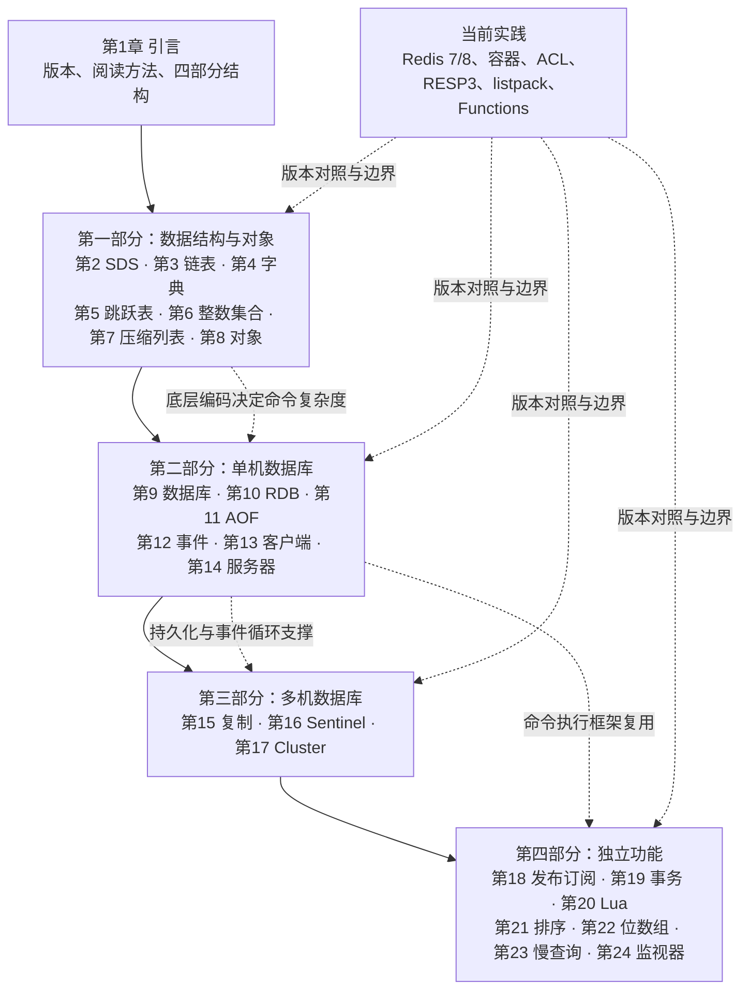

# 《Redis设计与实现》深度阅读：从内存对象到高可用集群

> **书目信息**：黄健宏著，《Redis设计与实现》，机械工业出版社，2014 年纸版；题目提供的 EPUB 元数据标注为 2016 年电子版，ISBN `978-7-111-46474-7`。本教程的原书依据是该 EPUB 的正文、目录和示例。
>
> **版本边界**：原书以 Redis 2.9（Redis 3.0 开发版）为实现背景，单机部分兼容 2.6～3.0，重点讨论 C 结构体、事件循环和 3.0 的复制、Sentinel、集群。文中使用“【原书】”表示 EPUB 中直接出现的内容，“【当前补充】”表示面向 Redis 7/8 系列的实践，“【纠正】”表示命令名称、默认值或底层编码已经变化的地方。不要把现代实现倒写成作者在 2014 年的结论。
>
> **代码说明**：C 代码只保留解释结构所需的短片段，CLI、Python 和配置示例为教程化改写。除特别说明外，示例没有在本机启动生产集群，不把“可读”写成“已压测”。

## 一、先建立全书视角：Redis 为什么快，以及快在哪里

### 1. 书中对 Redis 的定义

【原书，第 1 章】明确说明，本书“对 Redis 的大多数单机功能以及所有多机功能的实现原理进行介绍”，目标是展示“核心数据结构以及关键的算法思想”，帮助读者理解 Redis 的内部构造并更高效地使用它。

这一定义很重要：本书不是 Redis 命令速查，而是从一个命令一路追到内存对象、底层编码、事件循环和复制协议。例如执行 `ZADD leaderboard 98 alice`，表面是写入一个有序集合，内部可能同时涉及 Redis 对象、字典、跳跃表、压缩列表或 listpack、客户端命令解析和持久化日志。

通俗地说，Redis 是一个以**内存中的对象和数据结构**为核心、通过网络协议提供命令服务、再用持久化和复制把内存状态延伸到磁盘与其他节点的数据库。它解决了几类问题：

- 用字符串、列表、哈希、集合和有序集合直接表达常见业务数据，减少应用层重复实现。
- 用单线程事件循环（原书时代）在避免锁竞争的同时处理大量短命令。
- 用 RDB 快照和 AOF 命令日志恢复内存状态，避免进程重启后数据全部丢失。
- 用复制、Sentinel 和 Cluster 在节点故障、容量增长和读扩展时维持服务。
- 用发布订阅、事务、Lua、位图和慢查询等独立功能覆盖实时通知、原子组合操作和运维诊断。

### 2. 全书逻辑框架



前三部分是自底向上的依赖链：对象使用底层结构，数据库使用对象，复制和集群又依赖数据库、事件和客户端。第四部分相对独立，但事务、Lua、发布订阅都仍然在同一个命令执行循环中运行。

### 3. Redis 与其他技术的边界

| 技术 | 主要抽象 | 数据是否长期保留 | 典型优势 | 与 Redis 的关键差异 |
| --- | --- | --- | --- | --- |
| Redis | 内存对象、命令、可选持久化 | 可选 RDB/AOF | 亚毫秒级访问、丰富数据结构、原子命令 | 内存成本高，复杂查询和超大数据集不是强项 |
| Memcached | 纯键值缓存 | 否 | 简单、轻量、缓存吞吐高 | 没有 Redis 的集合运算、持久化和复制语义 |
| MySQL/PostgreSQL | 表、事务、SQL、磁盘页 | 是 | 复杂查询、约束和强持久性 | Redis 更适合热点状态和实时操作，不能替代关系数据库事实存储 |
| MongoDB | 文档、索引、聚合 | 是 | 文档查询和水平扩展 | Redis 命令复杂度更可预测，但查询能力更窄 |
| Kafka | 分区追加日志、消费者位点 | 通常按保留策略保留 | 高吞吐事件回放和多订阅者 | Redis Pub/Sub 无历史，不应当当作 Kafka 的替代品 |
| Hazelcast 等内存网格 | 分布式对象和计算 | 依实现而定 | JVM 内分布式数据结构 | Redis 协议、生态和运维工具更统一；网格通常更贴近应用对象 |

Redis 的优势来自“数据结构 + 单命令原子性 + 内存访问”的组合，而不是单纯把数据放在内存里。代价同样明确：要为内存容量、淘汰策略、持久化窗口、复制延迟和热 key 设计边界；需要复杂关系查询或不可丢失的账务事实时，应让关系数据库、日志系统承担主存储职责。

## 二、章节地图：每章回答什么问题

| 章节 | 标题 | 核心内容 | 解决的问题 |
| --- | --- | --- | --- |
| 引言 | Redis 的版本与阅读方法 | 四个部分、自底向上阅读、代码规则 | 建立源码阅读地图 |
| 第 1 章 | 引言 | 版本说明、章节编排、配套网站 | 明确书的范围和证据边界 |
| 第 2 章 | 简单动态字符串 | SDS 结构、扩容、二进制安全 | 解决 C 字符串长度和修改成本问题 |
| 第 3 章 | 链表 | 双向链表节点、API 和迭代器 | 支持可变长度和快速首尾操作 |
| 第 4 章 | 字典 | 哈希表、冲突、渐进式 rehash | 为数据库和哈希对象提供平均 O(1) 查找 |
| 第 5 章 | 跳跃表 | 多层索引、跨度、范围查询 | 为有序集合提供排序和排名操作 |
| 第 6 章 | 整数集合 | int16/int32/int64 编码升级降级 | 用紧凑内存保存小整数集合 |
| 第 7 章 | 压缩列表 | 连续内存、节点编码、连锁更新 | 小列表/哈希的低开销存储 |
| 第 8 章 | 对象 | 类型、编码、引用计数、共享和 LRU | 把底层结构统一成安全的命令抽象 |
| 第 9 章 | 数据库 | keyspace、过期字典、删除策略、通知 | 管理键值、TTL 和过期事件 |
| 第 10 章 | RDB 持久化 | 快照、BGSAVE、文件格式 | 以较小文件恢复某个时间点的状态 |
| 第 11 章 | AOF 持久化 | 命令追加、载入、重写 | 缩小数据丢失窗口并保留操作序列 |
| 第 12 章 | 事件 | 文件事件、时间事件、调度 | 用事件循环处理网络和定时维护 |
| 第 13 章 | 客户端 | 输入输出缓冲区、客户端状态 | 管理每个连接的协议和回复 |
| 第 14 章 | 服务器 | 命令执行路径、serverCron、初始化 | 把连接、数据库和后台维护串起来 |
| 第 15 章 | 复制 | 全量、部分重同步、复制偏移量、心跳 | 读扩展和故障转移的数据基础 |
| 第 16 章 | Sentinel | SDOWN/ODOWN、选举、故障转移 | 在主节点故障时选出新主节点 |
| 第 17 章 | 集群 | 16384 槽、MOVED/ASK、Gossip、迁移 | 在多节点上分片和自动故障转移 |
| 第 18 章 | 发布与订阅 | 频道、模式、订阅信息 | 实时广播消息 |
| 第 19 章 | 事务 | MULTI/EXEC/WATCH 与 ACID 边界 | 将一组命令排队并原子执行 |
| 第 20 章 | Lua 脚本 | 沙箱、EVAL、脚本缓存和复制 | 在服务端组合多步操作 |
| 第 21 章 | 排序 | SORT、BY、GET、LIMIT、STORE | 对列表、集合或有序集合做临时排序 |
| 第 22 章 | 二进制位数组 | GETBIT、SETBIT、BITCOUNT、BITOP | 用位表示签到、特征和集合运算 |
| 第 23 章 | 慢查询日志 | 阈值、环形保存、SLOWLOG 命令 | 定位执行时间过长的命令 |
| 第 24 章 | 监视器 | MONITOR 与命令广播 | 观察实时命令流，辅助调试 |

## 三、沿 Redis 数据生命周期逐章精读

### 第一阶段：命令进入内存后的数据结构

#### 第 1 章　引言：先理解阅读方法，再理解源码

本章把 Redis 2.9/3.0 作为分析对象，并把全书分为“数据结构与对象”“单机数据库的实现”“多机数据库的实现”“独立功能的实现”四部分。作者建议先读前两部分，因为多机功能建立在单机数据库之上；前三部分按自底向上顺序阅读，第四部分可以按兴趣选择。

实践时可以把每条命令拆成四个问题：客户端如何编码请求？服务器找到什么对象？对象选择什么底层编码？命令执行后的状态如何持久化或复制？这四问比死记命令更能迁移到新版本。

- **术语**：SDS（Simple Dynamic String，简单动态字符串）；RDB（Redis Database，快照文件）；AOF（Append Only File，只追加文件）；Sentinel（哨兵）；Cluster（集群）。
- **版本边界**：书中使用 `SLAVE`、`slaveof` 等旧称，现代文档逐步使用 `REPLICA`、`replicaof`；阅读源码时要按目标版本核对名称。

#### 第 2 章　简单动态字符串：让字符串可修改、可计数、可容纳二进制

##### 背景与实现

C 字符串依赖 `\0` 判断结尾，获取长度是 O(N)，拼接前还要手动计算容量；它不能安全保存内含空字符的二进制。Redis 用 SDS 保存可变字符串，典型结构可抽象为：

```c
struct sdshdr {
    int len;      // 已使用字节数，不含结尾的 '\0'
    int free;     // buf 中剩余空间
    char buf[];   // 实际数据，并保留兼容 C API 的 '\0'
};
```

`len` 使 `strlen` 变成 O(1)，`free` 支持空间预分配；扩容时通常按“少量字符串翻倍、较大字符串增加固定上限”的策略减少重复分配。SDS 同时记录长度和保留结尾空字节，因此既能调用 C 库函数，也能保存图片、序列化数据等二进制内容。

##### 使用方法与应用

```text
SET profile:name "黄健宏"
APPEND profile:name " - Redis"
STRLEN profile:name
GETRANGE profile:name 0 5
```

在应用层，序列化 JSON、协议帧或缓存 token 时不要假定内容一定是文本；在 C 扩展中优先使用 `sdslen`，不要对 SDS 直接调用 `strlen`。

- **术语**：二进制安全指数据中可以出现 `\0` 等任意字节；惰性空间释放指截断后保留空闲容量，便于再次追加；空间预分配指一次申请多于当前长度的容量。
- **局限与现代修订**：原书的 `sdshdr` 字段类型和布局属于 Redis 3.0 时代。现代 Redis 为减少小字符串头部开销使用多种 `sdshdr` 变体（`sdshdr5/8/16/32/64`）；这不改变“长度 O(1)、二进制安全、预分配”的设计目标。

#### 第 3 章　链表：用节点换取可变长度和首尾 O(1)

Redis 自己实现双向链表，因为 C 标准库没有通用链表。链表节点包含 `prev`、`next` 和 `value`，链表对象保存 `head`、`tail`、`len`，并可配置节点复制、释放和匹配函数。这样同一套链表可以保存 SDS、整数指针或客户端对象。

```c
typedef struct listNode { struct listNode *prev, *next; void *value; } listNode;
typedef struct list { listNode *head, *tail; unsigned long len; } list;
```

`LPUSH`、`RPUSH`、`LPOP`、`RPOP` 只需调整端点指针；按下标随机访问仍是 O(N)，所以列表不是数组替代品。列表键在元素较多或字符串较长时可使用链表（原书时代），现代 Redis 主要使用 quicklist/listpack 组合以减少每个节点的分配。

- **应用场景**：任务队列、时间线、最近访问记录；生产者和消费者应约定阻塞、重试和重复处理语义。
- **局限**：链表节点有指针和分配器开销，随机访问慢；需要按排名访问时应考虑有序集合。
- **术语**：迭代器是保存当前位置并向前/后移动的遍历对象；深复制会复制 value，浅复制只复制节点指针。

#### 第 4 章　字典：数据库键空间的平均 O(1) 索引

字典是 Redis 数据库、哈希对象和许多内部表的基础。原书中的 `dict` 包含两个哈希表 `ht[2]`：每个哈希表有 `table`、`size`、`sizemask` 和 `used`；冲突节点通过链地址法连接。`dictType` 提供哈希、键比较、键复制和释放等回调，使同一字典框架可用于不同键类型。

```c
typedef struct dictht {
    dictEntry **table;
    unsigned long size, sizemask, used;
} dictht;
typedef struct dict { dictht ht[2]; long rehashidx; } dict;
```

##### rehash 为什么必须渐进完成

一次性把数百万个键迁移到新表会阻塞事件循环。Redis 先分配 `ht[1]`，然后将 `rehashidx` 指向待迁移桶；每次增删改查或后台维护只迁移少量桶。迁移期间新写入进入 `ht[1]`，查询先查 `ht[0]` 再查 `ht[1]`。迁移完毕后释放旧表并交换表指针。

```text
SET user:1 "A"       # rehash 期间仍可正常执行
HSET user:1:name ... # 新键进入新表
```

哈希函数、负载因子和扩缩容阈值会影响碰撞与内存；生产中不能把“平均 O(1)”理解为任何数据分布下都无延迟尖峰。

- **术语**：rehash 是重新计算桶位置并迁移条目；链地址法把同一桶的冲突条目串成链；负载因子约为 `used/size`。
- **当前补充**：现代 Redis 仍保留渐进式 rehash 思想，并使用 SipHash 等安全哈希策略防止恶意碰撞；具体函数和阈值应以目标版本源码为准。

#### 第 5 章　跳跃表：有序集合的可维护索引

跳跃表在一个节点中保存多个层级的前进指针和跨度（span），底层链表按 `(score, member)` 排序；每个节点还有后退指针，便于反向遍历。随机层高通常以概率 0.25 递增，平均查找、插入和删除为 O(log N)，最坏为 O(N)。

```text
ZADD leaderboard 98 alice 87 bob 98 carol
ZRANGE leaderboard 0 -1 WITHSCORES
ZRANK leaderboard alice
ZRANGEBYSCORE leaderboard 90 100
```

分数相同使用成员字典序作为第二排序条件，因此排名稳定。跳跃表比平衡树实现简单，但每个节点可能有多层指针；Redis 的有序集合对象通常同时维护一个字典（成员到分数）和跳跃表（按分数范围访问），用空间换取两类查询。

- **术语**：span 表示从当前节点跨越到下一个节点所覆盖的底层节点数；range query 是按分值或排名取连续区间。
- **局限**：高频更新同一热点有序集合会产生分配和锁竞争（在代理层或多线程访问时）；超大排行榜应评估分片、近似 Top-K 或专用排序服务。

#### 第 6 章　整数集合：按需升级的紧凑数组

当集合只含少量整数时，Redis 使用 `intset`，其 `contents` 按升序保存，`encoding` 表示每个元素为 16、32 或 64 位，`length` 表示元素个数。插入超出当前范围的整数时，先把整个数组升级到更宽编码，再插入；删除不会自动降级。

```text
SADD numbers 1 3 5 7 9
OBJECT ENCODING numbers   # 原书时代通常返回 intset
SISMEMBER numbers 5
```

升级的代价是 O(N) 搬移，但只在集合跨越范围时发生；不降级避免反复升级/降级造成抖动。适合状态位、少量枚举值，不适合任意字符串集合。

- **术语**：编码升级是改变每个元素的存储宽度；有序数组可用二分查找定位；`int16_t`、`int32_t`、`int64_t` 分别表示固定宽度有符号整数。
- **当前补充**：`intset` 仍可能用于小整数集合，但对象编码阈值会随版本和配置变化，必须用 `OBJECT ENCODING` 或源码确认，不能依赖书中的固定阈值。

#### 第 7 章　压缩列表：连续内存的空间换取

原书中的 ziplist 是一段连续字节数组，头部含总字节数、尾节点偏移和节点数量，末尾以 `0xFF` 结束。每个节点记录前一个节点长度、当前节点的编码和内容。小整数和短字符串可以直接嵌入节点，减少指针与分配器开销。

```text
RPUSH lst 1 3 5 10086 hello world
OBJECT ENCODING lst       # 原书时代常见 ziplist
```

连锁更新是核心风险：某节点长度从 253 字节变为更大值后，后继节点的 `prevlen` 字段也可能需要扩容，扩容又可能触发下一个节点更新，最坏达到 O(N)。因此 ziplist 适合“小而短”的数据，阈值应限制单个键的规模。

- **术语**：紧凑编码把类型和长度压进少量字节；连锁更新是一个节点变长引发后续节点反复搬移；连续内存有利于缓存局部性但扩容可能搬移整段数据。
- **纠正**：Redis 7 系列已用 listpack、quicklist 等结构替代很多 ziplist 场景，目的正是消除 `prevlen` 带来的连锁更新；阅读原书时要把 ziplist 当作设计思想和历史实现。

#### 第 8 章　对象：把类型、编码和生命周期统一起来

Redis 不直接把 SDS、链表等裸结构暴露给命令，而是用 `redisObject` 表示键和值：

```c
typedef struct redisObject {
    unsigned type:4;       // string/list/hash/set/zset
    unsigned encoding:4;   // raw/embstr/int/ziplist/... 
    unsigned lru:LRU_BITS; // 最近访问或 LFU 信息
    int refcount;
    void *ptr;
} robj;
```

对象类型决定命令是否合法，编码决定具体算法。例如字符串可用整数、embstr 或 raw；集合可用 intset 或 hashtable；有序集合使用 ziplist（现代为 listpack）或 skiplist+dict。`OBJECT ENCODING key` 能把抽象命令映射回底层实现。

引用计数在对象共享和释放时发挥作用：小整数对象可被多个键共享，删除键只减少引用计数；计数归零才释放底层内存。对象还记录访问时间，用于 `maxmemory` 下的 LRU/LFU 淘汰。

- **实践**：

```text
SET counter 100
OBJECT TYPE counter
OBJECT ENCODING counter
OBJECT IDLETIME counter
```

- **局限**：编码自动转换会带来一次性 O(N) 成本，热 key 还可能让单线程命令延迟抖动；应限制单个集合/哈希规模，并在压测中观察 `MEMORY USAGE`、延迟和命中率。
- **当前补充**：现代 Redis 的对象头使用更紧凑的编码，淘汰策略还包括 LFU（Least Frequently Used，最少频率使用）；对象层抽象仍是理解 `listpack`、`quicklist` 和命令多态的最好入口。

### 第二阶段：单机数据库的运行时

#### 第 9 章　数据库：keyspace、TTL 与过期删除

服务器状态包含多个 `redisDb`。每个数据库用 `dict` 保存键到值对象的映射，再用独立的 `expires` 字典保存键到绝对过期时间的映射。`SELECT` 只切换客户端当前数据库，不会把数据物理搬移。

```text
SET session:42 user-7 EX 3600
TTL session:42
PTTL session:42
PERSIST session:42
```

原书解释了两种删除方式：访问键时发现过期就惰性删除；服务器周期任务随机抽查过期字典并主动删除。两者结合避免每个键都建立定时器，也避免完全不访问的过期键长期占内存。RDB 载入时忽略已过期键，主服务器删除过期键后通过复制/AOF传播删除动作，从服务器以主服务器的删除为准。

数据库通知（`notify-keyspace-events`）可以把键空间变化发布给订阅者，但会增加开销，且不是可靠事件日志。现代 Redis 还提供 `UNLINK` 异步释放大对象、active expire effort 等调节手段。

- **术语**：TTL（Time To Live，剩余生存时间）；lazy expiration 是访问触发删除；active expiration 是后台抽查删除；keyspace notification 是键空间通知。
- **局限**：过期时间不是精确的定时器；大批键同一时刻过期会形成删除尖峰。应加入随机抖动、分批设置 TTL，并监控 `expired_keys`、内存和延迟。

#### 第 10 章　RDB 持久化：某个时间点的紧凑快照

RDB 将数据库编码为二进制快照。`SAVE` 在主进程同步保存，会阻塞客户端；`BGSAVE` 通过 fork 子进程生成快照，父进程继续处理请求，操作系统的写时复制（Copy-on-Write，COW）保证子进程看到一致视图。

```text
CONFIG SET save "900 1 300 10 60 10000"
BGSAVE
LASTSAVE
```

原书的 RDB 结构包括魔数、版本、数据库选择、键值类型、过期时间、对象编码、EOF 和校验和。启动时若存在 RDB，服务器顺序读取并重建对象。快照优点是文件紧凑、恢复快；缺点是两次快照之间的写入可能丢失，fork 和 COW 会造成额外内存峰值。

- **应用场景**：灾备快照、冷启动、测试数据分发。
- **局限与方案**：不能用 RDB 单独满足零数据丢失；生产通常与 AOF、复制和外部备份组合，并在真实数据规模上测试 fork 时间。
- **当前补充**：RDB 文件格式和版本号可能变化，跨大版本搬迁应使用目标版本支持的导入/备份流程，不要手工修改二进制文件。

#### 第 11 章　AOF 持久化：记录可重放的写命令

AOF 将改变数据库状态的命令追加到文件。服务器启动时按 RESP 格式重放命令恢复状态；为避免文件无限增长，`BGREWRITEAOF` 遍历当前数据库，把等价于当前状态的最短命令集合写入新文件，父进程继续接收写入，子进程完成后再合并重写期间的增量。

```text
appendonly yes
appendfsync everysec
BGREWRITEAOF
INFO persistence
```

`appendfsync always` 数据丢失窗口最小但吞吐低；`everysec` 是常见折中，崩溃时通常可能丢约一秒；`no` 交给操作系统决定。AOF 优点是可调持久化窗口，缺点是文件大、重写和 fsync 会产生 I/O 压力。

- **术语**：fsync 把用户态缓冲刷新到内核/磁盘；rewrite 重写而不是简单压缩文本；replay 是启动时重新执行命令。
- **纠正**：Redis 7 引入多部分 AOF（base + incremental + manifest）以降低重写切换风险，配置项与原书时代不同；请按目标版本的 `appendonly` 文档配置。
- **选择建议**：缓存可只用 RDB 或不持久化；重要会话可用 AOF everysec + RDB；账务事实不应只存 Redis，应让关系数据库或日志系统做权威存储。

#### 第 12 章　事件：文件事件与时间事件共用一个循环

Redis 的文件事件封装 `epoll`、`kqueue`、`select` 等 I/O 多路复用器，用于监听客户端可读、可写和新连接；时间事件保存下一次执行时间，用于 `serverCron` 等周期任务。事件循环大致如下：

```text
while (!shutdown) {
    now = monotonic_clock()
    process_due_time_events(now)
    timeout = time_until_next_event()
    ready = aeApiPoll(timeout)
    process_file_events(ready)
}
```

原书时代命令执行和大部分网络处理在单线程完成，因此一个慢命令会阻塞所有客户端。时间事件不是实时操作系统定时器，调度精度还受到慢命令和网络事件影响。

- **术语**：I/O multiplexing 是一个线程等待多个文件描述符；`epoll`/`kqueue` 是操作系统事件通知接口；`serverCron` 是周期维护函数。
- **当前补充**：现代 Redis 可配置 I/O 线程处理读写，但命令执行仍需遵守单线程原子模型；模块、脚本和大 key 仍可能阻塞主线程。

#### 第 13 章　客户端：每个连接都是一份协议状态

客户端结构保存套接字、标志、认证状态、当前数据库、查询缓冲区 `querybuf`、参数数组 `argv/argc`、固定回复缓冲区和链表回复缓冲区。服务器从可读事件中解析 RESP 请求，命令执行后把回复放入输出缓冲区，待可写事件发送。

```text
redis-cli --raw PING
redis-cli INFO clients
CLIENT LIST
CLIENT KILL ID <id>
```

固定缓冲区适合短回复，链表缓冲区适合大结果，避免一次申请巨型连续空间。客户端输出积压过大时服务器会断开连接，防止一个慢消费者耗尽内存。

- **术语**：RESP（Redis Serialization Protocol）是 Redis 客户端协议；backpressure 是下游处理慢时限制生产；pipeline 是一次发送多条命令以减少往返。
- **局限**：pipeline、`MGET` 或大范围 `LRANGE` 会放大单次事件循环工作量；应限制批大小、使用分页和超时。

#### 第 14 章　服务器：从请求到命令函数的完整路径

命令请求依次经过协议解析、命令查找、参数个数检查、认证/ACL 检查、数据库定位、命令函数调用、复制和 AOF 传播、回复生成。`serverCron` 周期执行过期键、客户端超时、持久化条件、复制心跳、统计信息和后台任务。

```text
RESP request
  -> readQueryFromClient
  -> processInputBuffer
  -> lookupCommand
  -> call(command)
  -> propagate(AOF/replica)
  -> addReply(client)
```

初始化阶段读取配置、初始化日志和事件循环、创建数据库、加载 RDB/AOF、打开监听端口，再进入主循环。理解这一章能解释为什么一个命令既改变内存，又可能写 AOF、发送给副本并触发通知。

- **当前补充**：现代 Redis 增加 ACL、RESP3、模块、TLS、I/O 线程等组件；但“解析—查找—调用—传播—回复”的主线仍然成立。

### 第三阶段：从单机状态走向多机服务

#### 第 15 章　复制：全量同步与部分重同步

主从复制的目标是让副本拥有与主节点一致的数据库状态。旧版 `SYNC` 需要主节点生成 RDB 并传给副本，断线重连容易重复全量同步。新版 `PSYNC` 引入复制偏移量、复制积压缓冲区和复制 ID：副本带着自己的 ID 与 offset 请求继续同步，主节点若仍保留缺失命令就执行部分重同步，否则回退全量同步。

```text
REPLICAOF 127.0.0.1 6379
INFO replication
ROLE
```

复制握手会交换能力和复制 ID；主节点把写命令传播到副本，副本确认已处理的 offset。心跳检测用 `REPLCONF ACK` 等消息发现连接和延迟异常。复制是异步的，所以确认写入主节点不等于副本已经落盘。

- **术语**：offset 是复制流中的字节/命令位置；backlog 是主节点保留的最近复制数据环形缓冲；full resync 是 RDB + 增量命令的全量同步；partial resync 是从 backlog 补缺。
- **纠正**：书中使用 master/slave；现代命令优先使用 `REPLICAOF`。复制仍是异步，不能单独提供线性一致写入。
- **设计建议**：为副本预留 backlog 和网络带宽，监控 `master_repl_offset`、`slave_repl_offset`、`master_link_status`；不要把副本当作自动故障转移器。

#### 第 16 章　Sentinel：监控、选举与故障转移

Sentinel 节点通过 `INFO`、`PING` 和发布订阅频道发现主从拓扑。某个 Sentinel 认为主节点不可达是**主观下线（SDOWN）**；达到配置的 quorum 后，多个 Sentinel 同意则是**客观下线（ODOWN）**。Sentinel 之间选出领头者，向可用副本发送 `SLAVEOF`，再把其他副本和客户端引导到新主节点。

```conf
sentinel monitor mymaster 127.0.0.1 6379 2
sentinel down-after-milliseconds mymaster 5000
sentinel failover-timeout mymaster 60000
sentinel parallel-syncs mymaster 1
```

副本选择会考虑优先级、复制 offset 和运行 ID；故障转移不是瞬时完成，期间应用必须重试并重新发现主节点。网络分区可能造成旧主仍可写，因此业务要配合写入保护、quorum 和 fencing（隔离旧主）。

- **术语**：quorum 是判断 ODOWN 所需的同意票数；failover 是把副本提升为主并重配拓扑；split-brain 是两个节点都认为自己是主。
- **当前补充**：Redis Sentinel 仍适用于非 Cluster 部署；云托管环境常由平台完成故障转移，选型时不要同时叠加两套控制面。

#### 第 17 章　集群：16384 个槽把键空间分散到节点

Redis Cluster 将键空间划分为 16384 个 hash slot，通常用 `CRC16(key) mod 16384` 计算槽位；包含 `{tag}` 的 key 只对大括号内内容计算，使多键命令落到同一槽。

```text
redis-cli --cluster create 10.0.0.1:7000 10.0.0.2:7000 10.0.0.3:7000 \
  --cluster-replicas 1
redis-cli -c -p 7000 SET user:{42}:name Alice
```

节点通过 cluster bus 交换 PING/PONG、故障和槽位信息。请求落到错误节点时返回 `MOVED slot host:port`；迁移期间返回 `ASK`，客户端只对本次请求临时发送 `ASKING`。重新分片按槽迁移键，复制和故障转移由节点协作完成。

- **术语**：hash slot 是逻辑分片单位；hash tag 是强制多键同槽的键名片段；Gossip 是节点间传播拓扑与故障信息；MOVED 是稳定重定向，ASK 是迁移期临时重定向。
- **局限**：跨槽多键事务和 Lua 默认不可用；热槽不能靠增加节点自动解决。应设计键标签、拆分热点、控制单槽数据量，并使用支持 Cluster 拓扑的客户端。

### 第四阶段：独立功能与运维能力

#### 第 18 章　发布与订阅：低延迟广播，不是可靠队列

普通频道订阅表是“频道 -> 客户端链表”，模式订阅表保存通配模式。`PUBLISH` 查找频道订阅者并遍历发送，同时匹配模式订阅者；`PUBSUB CHANNELS/NUMSUB/NUMPAT` 提供统计。

```text
# 客户端 A
SUBSCRIBE news.it

# 客户端 B
PUBLISH news.it "Redis 版本发布"
```

消息不会写入数据库、不会为离线客户端保留，也没有消费位点；连接断开就丢失。因此它适合在线通知、配置刷新和 WebSocket 广播，不适合订单事件、审计日志和需要重放的任务。

- **当前补充**：现代 Redis 提供 Sharded Pub/Sub，可按 Cluster slot 限制广播范围；可靠异步处理应使用 Streams、Kafka 或带确认的队列。

#### 第 19 章　事务：队列化执行，但不提供回滚

`MULTI` 开始事务，后续命令只入队；`EXEC` 按入队顺序一次执行，`DISCARD` 丢弃队列。`WATCH` 通过检查键的 dirty 标记实现乐观锁：若事务执行前被其他客户端修改，`EXEC` 返回空结果并放弃执行。

```text
WATCH account:1 account:2
MULTI
DECRBY account:1 100
INCRBY account:2 100
EXEC
```

Redis 事务保证串行执行和隔离，命令执行期间不会被其他客户端插入；但命令语法错误、类型错误不会像关系数据库那样回滚已执行命令，也没有传统意义的崩溃恢复事务日志。需要“检查并修改”时，WATCH 或 Lua 通常比客户端读改写可靠。

- **术语**：ACID 是原子性、一致性、隔离性、持久性；乐观锁假设冲突少，冲突时重试；dirty 标记表示被 WATCH 的键发生变化。
- **当前补充**：`EXEC` 仍不提供回滚；Redis Functions/Lua 可把条件判断和修改放进一次服务端执行，但脚本也必须短小、确定且避免阻塞。

#### 第 20 章　Lua 脚本：把多步逻辑搬到服务器

原书介绍嵌入 Lua 5.1、为脚本提供 `redis.call`/`redis.pcall`、限制全局状态，并用 SHA1 缓存脚本。`EVAL` 直接发送脚本，`EVALSHA` 用摘要复用已加载脚本；脚本在 Redis 主线程中原子执行。

```text
EVAL "local n=redis.call('GET',KEYS[1]); if not n then n=0 end; n=n+1; redis.call('SET',KEYS[1],n); return n" 1 counter
SCRIPT LOAD "return redis.call('INCRBY', KEYS[1], ARGV[1])"
EVALSHA <sha1> 1 counter 5
```

脚本必须通过 `KEYS` 声明键、通过 `ARGV` 接收参数，不能执行网络或文件系统操作。长循环会阻塞所有请求；脚本产生的写操作还要正确传播到副本和 AOF。

- **当前补充**：Redis 7 引入 Functions（函数库可持久化、可部署），但 Lua 脚本仍广泛使用；应设置脚本超时监控，必要时用 `SCRIPT KILL`（仅能终止尚未写入的脚本）或重启策略处理失控脚本。

#### 第 21 章　排序：灵活但可能昂贵的临时计算

`SORT` 可以处理列表、集合或有序集合：默认按数值升序，`ALPHA` 按字典序，`DESC` 反向，`BY` 按外部键提供权重，`GET` 取回关联对象，`LIMIT` 截取结果，`STORE` 保存结果。

```text
LPUSH users 3 1 2
SET user:1:name Alice
SET user:2:name Bob
SET user:3:name Carol
SORT users BY user:*:name ALPHA GET user:*:name LIMIT 0 10
```

排序通常需要读取全部元素并在内存中排序，复杂度约为 O(N log N)，`STORE` 还会产生写放大。排序前应确认集合规模，必要时在写入时维护有序集合，或交给搜索/数据库引擎。

- **术语**：`BY` 是权重模式；`GET #` 表示取元素本身；`ALPHA` 表示按字符串比较；`SORT_RO` 是现代版本提供的只读排序变体。

#### 第 22 章　二进制位数组：用位表示大量布尔状态

Redis 用 SDS 的字节串保存位数组，位编号从高位到低位，`GETBIT` 和 `SETBIT` 读写单个位，`BITCOUNT` 使用查表或硬件指令统计 1 的数量，`BITOP` 对多个字符串做 AND、OR、XOR、NOT。

```text
SETBIT login:2026-09-19 13511 1
GETBIT login:2026-09-19 13511
BITCOUNT login:2026-09-19
BITOP OR active-week login:mon login:tue login:wed
```

位图适合签到、特征开关、布隆过滤器底层位数组；偏移量很大时会造成稀疏扩容和内存浪费，需按日期分桶或改用 Roaring Bitmap 等专用结构。

- **当前补充**：`BITFIELD` 支持在同一字符串中读写有符号/无符号整数；它适合紧凑计数，但要明确溢出策略 `WRAP/SAT/FAIL`。

#### 第 23 章　慢查询日志：只记录命令执行阶段

慢查询日志在命令执行时间超过阈值时记录一条结构化记录，包含递增 ID、开始时间、持续时间和命令参数，保存数量受上限限制；网络读写时间不计入命令执行时间。

```text
CONFIG SET slowlog-log-slower-than 10000
CONFIG SET slowlog-max-len 256
SLOWLOG GET 10
SLOWLOG LEN
SLOWLOG RESET
```

它适合发现大 key、全量扫描、复杂 Lua 和排序命令，但不能单独解释客户端排队、网络抖动或 fork 延迟。应与 `LATENCY DOCTOR`、命令统计、慢客户端和业务 P99 一起分析。

- **术语**：阈值通常以微秒计；环形日志会丢弃最旧记录；P99 表示 99% 请求延迟不超过的分位点。

#### 第 24 章　监视器：实时观察命令流的代价

执行 `MONITOR` 后，服务器把收到的命令文本广播给监视器客户端，便于调试应用是否发送了预期命令。

```text
redis-cli MONITOR
```

监视器会增加每条命令的格式化和网络广播成本，并可能泄露密码、token 或个人数据；不能在生产高流量集群长期打开。审计需求应使用 ACL 日志、代理层审计或专门的可观测性管道，并对敏感参数脱敏。

## 四、当前可执行的学习环境（现代补充）

下面用官方 Redis 7.2 镜像演示原书概念；版本只是可重复的学习基线，生产部署应按目标版本文档替换镜像。

### 1. 启动单节点 Redis

```powershell
docker run --name redis-design -p 6379:6379 -d redis:7.2-bookworm `
  redis-server --appendonly yes --appendfsync everysec
docker exec -it redis-design redis-cli PING
```

在 PowerShell 中续行符是反引号；上面命令若复制到 Bash，请改为反斜杠或写成一行。看到 `PONG` 后继续执行：

```text
SET demo:user:1 "Alice" EX 600
HSET demo:profile name Alice role engineer
ZADD demo:rank 98 Alice
OBJECT ENCODING demo:profile
INFO persistence
```

### 2. 观察持久化和过期

```powershell
docker exec redis-design redis-cli BGSAVE
docker exec redis-design redis-cli LASTSAVE
docker exec redis-design redis-cli TTL demo:user:1
docker exec redis-design redis-cli SLOWLOG GET 10
```

容器删除前先复制 `/data` 中的 RDB/AOF；学习环境可直接 `docker rm -f redis-design`，生产环境必须使用卷、备份和恢复演练。

### 3. 三节点 Cluster 学习入口

Redis Cluster 需要多个端口、配置文件和持久化目录，建议使用官方示例或编排工具生成 3 主 3 从拓扑，再执行：

```text
redis-cli --cluster create host1:7000 host2:7000 host3:7000 \
  host1:7001 host2:7001 host3:7001 --cluster-replicas 1
redis-cli -c -p 7000 SET order:{1001}:state paid
redis-cli -c -p 7000 CLUSTER SLOTS
```

先在单节点理解对象、持久化和命令复杂度，再进入 Cluster；否则遇到 `MOVED`、跨槽事务或副本延迟时很难定位根因。

## 五、从 Redis 3.0 时代到现代 Redis：必须更新的知识

| 原书实现/命令 | 现代变化 | 学习和迁移建议 |
| --- | --- | --- |
| ziplist | 大量场景改为 listpack、quicklist | 关注“紧凑编码与阈值转换”思想，不依赖 `OBJECT ENCODING` 的固定字符串 |
| `SLAVE`/`SLAVEOF` | `REPLICA`/`REPLICAOF` 为推荐称呼 | 老命令可能兼容，但新配置统一使用 replica 术语 |
| 仅讨论 RDB/AOF 单文件 | Redis 7 支持多部分 AOF | 备份、监控和容器卷要包含 manifest、base、incremental 文件 |
| Lua 脚本缓存 | 增加 Functions 和函数库 | 复杂逻辑考虑可部署函数，仍需限制执行时间 |
| 无 ACL 章节 | ACL、TLS、RESP3 和模块生态成熟 | 生产必须最小权限、加密传输和密钥轮换 |
| 单线程 I/O 叙述 | 可选 I/O 线程、客户端缓存等优化 | 命令执行仍需避免大 key 和长脚本 |
| Sentinel/Cluster 初版协议 | 故障检测、客户端库和运维工具持续演进 | 以目标版本官方文档和客户端行为为准，演练分区和回滚 |

## 六、实际应用设计示例

### 1. 可重试的缓存旁路

```python
import redis
import random

r = redis.Redis(host="localhost", port=6379, decode_responses=True)
key = "product:42"
value = r.get(key)
if value is None:
    value = load_from_database(42)       # Redis 不是事实数据库
    # 加随机抖动，避免大量键同时过期
    r.set(key, value, ex=300 + random.randint(0, 60))
return value
```

要处理缓存击穿、穿透和雪崩：热点键使用互斥锁或 single-flight，空结果短 TTL，TTL 加抖动；锁必须有超时和令牌校验，不能把 Redis 分布式锁写成无限等待。

### 2. 用 Lua 保证库存扣减原子性

```lua
-- KEYS[1] = stock:{sku}:available, ARGV[1] = amount
local left = tonumber(redis.call('GET', KEYS[1]) or '0')
local amount = tonumber(ARGV[1])
if left < amount then return 0 end
redis.call('DECRBY', KEYS[1], amount)
return 1
```

在 Cluster 中，订单、库存和幂等键要使用相同 hash tag，或把跨槽流程拆成可补偿步骤。脚本应只访问声明的 `KEYS`，并对输入范围做校验。

### 3. 可靠事件不要用 Pub/Sub

在线刷新可以用 Pub/Sub；订单创建、支付结果等需要重试和回放的事件，应写入 Streams/Kafka，并让消费者保存位点、处理幂等和死信。原书第 18 章的 Pub/Sub 实现很适合解释广播，但它没有消费组、历史和确认。

## 七、全书提炼出的架构检查表

- **数据结构**：键名是否控制长度？大哈希、大列表、大集合是否拆分？是否验证了编码转换和内存峰值？
- **命令复杂度**：是否把 `KEYS`、无界 `SMEMBERS`、大范围 `SORT`、长 Lua 放进请求路径？
- **持久化**：RDB 丢失窗口、AOF fsync 策略、重写空间和恢复时间是否通过演练验证？
- **复制**：业务能否容忍异步复制延迟？副本读是否接受旧数据？backlog 是否覆盖常见网络中断？
- **高可用**：Sentinel 或 Cluster 的 quorum、脑裂隔离、客户端重连和 DNS/拓扑发现是否测试？
- **安全**：ACL 最小权限、TLS、敏感命令禁用、MONITOR 和慢日志脱敏是否落实？
- **可观测性**：内存碎片、命中率、evicted/expired keys、复制 offset、blocked clients、P99 和慢查询是否有告警？
- **替代方案**：Redis 只是缓存还是权威存储？需要历史事件、复杂查询或强一致事务时，是否选用了数据库、Kafka、Streams 或搜索系统？

## 八、总结：读懂 Redis 的关键是“抽象与实现的映射”

《Redis设计与实现》的主线不是命令数量，而是每个抽象背后的取舍：SDS 用长度和预分配换取字符串效率，字典用渐进式 rehash 避免长时间阻塞，跳跃表用多层索引实现有序范围操作，整数集合和压缩列表用紧凑编码节省内存，对象层把这些结构组合成统一命令接口；数据库、持久化、事件和复制再把内存状态变成可运行的服务。

掌握这条链路后，遇到一个新命令可以先问：它操作哪种对象？对象当前编码是什么？最坏复杂度和内存放大是多少？命令是否会传播到 AOF/副本？在故障、重启、迁移和过期时状态如何变化？这套问题比背诵某个版本的结构体字段更持久。

## 九、来源与核验范围

- 黄健宏：《Redis设计与实现》，机械工业出版社；本文以题目提供的 EPUB 为原书正文依据，覆盖第 1～24 章。
- [Redis Persistence 官方文档](https://redis.io/docs/latest/operate/oss_and_stack/management/persistence/)：核对 RDB、AOF 和现代持久化配置。
- [Redis Replication 官方文档](https://redis.io/docs/latest/operate/oss_and_stack/management/replication/)：核对副本、部分重同步和故障边界。
- [Redis Sentinel 官方文档](https://redis.io/docs/latest/operate/oss_and_stack/management/sentinel/)：核对监控、quorum 和故障转移。
- [Redis Cluster 官方文档](https://redis.io/docs/latest/operate/oss_and_stack/management/scaling/)：核对槽、重定向和集群运维。
- [Redis Commands 文档](https://redis.io/docs/latest/commands/)：核对 `OBJECT`、事务、脚本、位图、慢查询和 Pub/Sub 命令。
- [Redis Programmability](https://redis.io/docs/latest/develop/programmability/)：补充 Lua 与 Functions 的现代边界。

所有现代补充应在部署时再次对照目标 Redis 版本、客户端版本和发行版文档；原书中的算法思想仍然有价值，但不能把 Redis 2.9 的内部编码、默认阈值或命令名称直接当作今天的配置契约。
