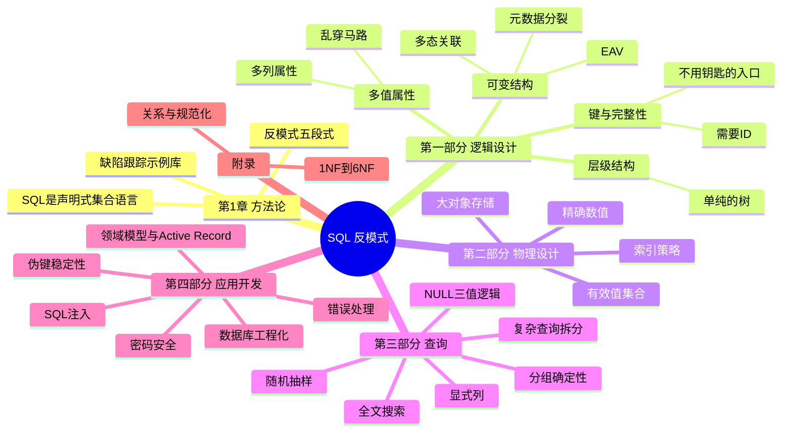
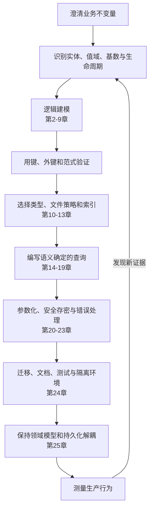

# 《SQL 反模式》

> **文本依据**：本文以 Bill Karwin 的 *SQL Antipatterns: Avoiding the Pitfalls of Database Programming* 中文版《SQL反模式》为主。人民邮电出版社 2011 年 9 月出版，ISBN `978-7-115-26127-4`，谭振林、陈魏明译。本文共 25 章：第 1 章是引言，第 2～25 章讲 24 个反模式，另有附录 A“规范化规则”和附录 B“参考书目”。
>
> **内容标记**：`【原书】`表示书中的明确观点或由原书示例压缩整理的内容；`【现代补充】`表示截至 2026 年的实践；`【纠正】`表示原书因时代变化而不宜直接照搬的做法。补充内容不冒充作者原意。

## 一、全书要解决的不是 SQL 语法，而是错误决策

### 1.1 官方定义与全局摘要

封底内容简介这样概括本书：

> “本书针对SQL使用中经常犯的错误展开分析，从数据库的逻辑设计、物理设计、查询设计、应用开发几个方面总结归纳各种典型错误，提出避免陷阱的方法。”

作者在第 1 章给出“反模式”的定义：

> “反模式是一种试图解决问题的方法，但通常会同时引发别的问题。”

这一定义里最重要的是“试图解决问题”。反模式通常不是荒唐做法，而是面对真实目标时采用了局部最省事的方案：为了少建一张表，把多个 ID 塞进字符串；为了让模型灵活，使用 EAV；为了少查几次数据库，写成一条巨型 SQL；为了少写代码，让所有领域对象都继承活动记录。它们能在第一天工作，却把数据完整性、可查询性、性能或可维护性的成本推迟到以后。

### 1.2 反模式的统一诊断法

原书每个反模式都按相同的五段式展开：


阅读时不要只记“禁止清单”。更可靠的推理顺序是：目标是什么，方案破坏了哪条关系语义或工程边界，数据库能否直接表达约束，例外条件是否真的成立，最后才选择替代方案。

### 1.3 全书逻辑框架



### 1.4 与其他常见做法的区别

| 路径 | 主要手段 | 优势 | 代价与风险 | 本书的判断 |
| --- | --- | --- | --- | --- |
| 关系型设计 + SQL | 表、键、类型、约束、集合查询 | 数据库统一维护一致性；可组合查询；适合事务和多种访问者 | 需要先理解关系模型，模式演进要受控 | 全书的默认路径 |
| 只靠应用层校验 | `if` 校验、服务约定、定时对账 | 规则写在熟悉的语言里；跨存储统一编排 | 并发、脚本和其他服务可绕过；重复实现 | 不能替代数据库可表达的约束 |
| ORM / Active Record | 对象映射和 CRUD 封装 | 提高常规业务开发效率 | 隐藏 SQL 成本；对象模型容易与表结构绑死 | 工具本身不是反模式，把它当唯一模型才是 |
| 文档 / 键值数据库 | 聚合文档、键访问、弱或无固定模式 | 特定访问模式下扩展方便；天然容纳部分半结构化数据 | 联结、跨文档约束、临时分析通常更难 | 原书明确不讨论替代数据库；应按场景选择 |
| 搜索引擎 | 倒排索引、分词、相关性排序 | 全文检索能力强，水平扩展成熟 | 数据同步与最终一致性成本 | 复杂全文搜索应使用正确工具 |

一句话总结：关系数据库的核心优势不是“能保存数据”，而是能把数据之间的关系和不变量声明成数据库可执行的规则。SQL 反模式往往是在回避这种表达能力，随后用更多应用代码弥补。

## 二、逐章地图：目标、陷阱与出口

| 章节 | 原书标题 | 核心问题 | 原书主张的解决方向 |
| --- | --- | --- | --- |
| 第 1 章 | 引言 | 开发者常把 SQL 当作未经系统训练的附属技能 | 用“目的—反模式—识别—合理使用—解决方案”分析，而非背禁令 |
| 第一部分 | 逻辑型数据库设计反模式 | 表、列和关系怎样表达现实世界 | 先让关系和约束正确，再谈方便与性能 |
| 第 2 章 | 乱穿马路（Jaywalking） | 一列保存逗号分隔的多个 ID | 创建交叉表，一行表达一个关联 |
| 第 3 章 | 单纯的树（Naive Trees） | 邻接表难以查询整棵树 | 按场景选择邻接表、路径枚举、嵌套集或闭包表 |
| 第 4 章 | 需要 ID（ID Required） | 每张表机械地添加名为 `id` 的伪键 | 让键表达业务：允许自然键、组合键和有意义的键名 |
| 第 5 章 | 不用钥匙的入口（Keyless Entry） | 为简化架构而省略外键 | 声明引用完整性，让数据库防止错误 |
| 第 6 章 | 实体—属性—值（EAV） | 用通用三列表支持任意属性 | 对子类型建模；必要时采用受控的半结构化数据 |
| 第 7 章 | 多态关联（Polymorphic Associations） | `type + id` 指向多张父表，无法建立外键 | 反向外键、独立交叉表或公共超级表 |
| 第 8 章 | 多列属性（Multicolumn Attributes） | `tag1/tag2/tag3` 保存同类多值 | 创建从属表，一值一行 |
| 第 9 章 | 元数据分裂（Metadata Tribbles） | 按年或其他值复制表和列 | 使用标准化单表及数据库原生分区 |
| 第二部分 | 物理数据库设计反模式 | 类型、文件和索引怎样落地 | 用可测量的物理结构服务明确负载 |
| 第 10 章 | 取整错误（Rounding Errors） | 用二进制浮点保存精确小数 | 使用 `NUMERIC/DECIMAL` |
| 第 11 章 | 每日新花样（31 Flavors） | 在列定义中固化会变化的候选值 | 用检查表保存候选值并以外键引用 |
| 第 12 章 | 幽灵文件（Phantom Files） | 数据库存路径，文件却脱离事务、权限和备份 | 需要数据库一致性时使用 `BLOB`；否则显式治理外部对象 |
| 第 13 章 | 乱用索引（Index Shotgun） | 不建、乱建或凭感觉删索引 | 采用 MENTOR 循环测量、解释、选择、测试、优化和重建 |
| 第三部分 | 查询反模式 | 查询怎样保持语义确定且可扩展 | 尊重集合、三值逻辑和查询成本 |
| 第 14 章 | 对未知的恐惧（Fear of the Unknown） | 把 `NULL` 当普通值或用哨兵值替代 | 接受三值逻辑，使用 `IS NULL` 与 `NOT NULL` |
| 第 15 章 | 模棱两可的分组（Ambiguous Groups） | 分组查询引用非分组、非聚合列 | 保证单值规则；用子查询、派生表或联结 |
| 第 16 章 | 随机选择（Random Selection） | `ORDER BY RAND()` 对全表随机排序 | 随机键、偏移量、键列表或数据库专用抽样 |
| 第 17 章 | 可怜人的搜索引擎（Poor Man's Search Engine） | 用前后通配的 `LIKE` 承担全文搜索 | 数据库全文索引、独立搜索引擎或倒排索引 |
| 第 18 章 | 意大利面条式查询（Spaghetti Query） | 强行用一条 SQL 完成多项复杂任务 | 分而治之，允许多条清晰查询或 `UNION` |
| 第 19 章 | 隐式的列（Implicit Columns） | `SELECT *`、无列名 `INSERT` 依赖列顺序 | 明确列名，稳定输入输出契约 |
| 第四部分 | 应用程序开发反模式 | 应用如何安全、可维护地使用数据库 | 数据库代码同样需要安全、测试和设计 |
| 第 20 章 | 明文密码（Readable Passwords） | 保存或邮件发送可恢复密码 | 只存加盐哈希；重置而非恢复密码 |
| 第 21 章 | SQL 注入（SQL Injection） | 把不可信输入当 SQL 代码执行 | 参数化字面值；标识符和结构使用白名单 |
| 第 22 章 | 伪键洁癖（Pseudokey Neat-Freak） | 为连续美观而重排、复用伪键 | 接受空洞；展示行号与永久标识分离 |
| 第 23 章 | 非礼勿视（See No Evil） | 不检查数据库错误，诊断信息丢失 | 检查状态、记录上下文、回滚并适当恢复 |
| 第 24 章 | 外交豁免权（Diplomatic Immunity） | 把数据库代码当作不受工程规范约束的二等公民 | 文档、版本控制、测试，以及每分支/每开发者独立数据库 |
| 第 25 章 | 魔豆（Magic Beans） | 把 Active Record 当作 MVC 中全部领域模型 | 领域模型包含数据访问对象，而不是等同于数据访问对象 |
| 附录 A | 规范化规则 | 冗余、更新异常和完整性约束 | 从关系、函数依赖和多值依赖理解各级范式 |

## 三、按数据库开发生命周期精读

### 3.1 起点：先建立正确的问题分析方式（第 1 章）

#### SQL 为何容易被误用

【原书】作者指出，大多数开发者是项目需要时才自学 SQL。SQL 与 C、Java、Python 等过程式或面向对象语言显著不同：它是声明式语言，以集合为根本数据结构。对象世界和关系世界之间的“阻抗失配”，让人倾向于借助库绕过 SQL，而不是理解它。

- **RDBMS**：Relational Database Management System，关系数据库管理系统。
- **声明式语言**：描述“想要什么结果”，由系统决定“怎样执行”；SQL 优化器负责选择访问路径。
- **集合思维**：把数据看成行的集合并整体变换，而不是逐行写循环。
- **阻抗失配**：对象图与关系表在身份、继承、关联和生命周期上的表达差异。
- **反模式**：能解决眼前目标，却反复导致可预测副作用的常见方案。

原书的缺陷跟踪数据库贯穿全书，包含 `Accounts`、`Bugs`、`Comments`、`Products` 等表。它的价值是让不同反模式在同一业务上下文中比较，而不是给出互不相关的小技巧。

### 3.2 需求转为逻辑模型：一条关系只表达一件事（第 2～9 章）

#### 3.2.1 多值属性之一：乱穿马路（第 2 章）

**背景与症状**：产品原先只有一个联系人，需求变成多个联系人。把 `account_id` 改为 `'12,34,56'` 看似不改表就能交付，却失去了外键、单值更新、可靠聚合和普通索引。

```sql
-- 【原书反模式整理】一列中保存多个账号 ID
CREATE TABLE Products (
  product_id SERIAL PRIMARY KEY,
  product_name VARCHAR(1000),
  account_id VARCHAR(100) -- 例如 '12,34,56'
);

-- FIND_IN_SET 是 MySQL 专用函数，查询与索引能力都很差
SELECT *
FROM Products
WHERE FIND_IN_SET('34', account_id);
```

**解决方案**：把多对多关系提升为一张交叉表。

```sql
CREATE TABLE Contacts (
  product_id BIGINT NOT NULL,
  account_id BIGINT NOT NULL,
  PRIMARY KEY (product_id, account_id),
  FOREIGN KEY (product_id) REFERENCES Products(product_id),
  FOREIGN KEY (account_id) REFERENCES Accounts(account_id)
);
```

这样可以双向联结、用 `COUNT(*)` 聚合、单独插入或删除关联，并由主键阻止重复。只有当字符串确实是不可分割的整体、应用永不按其中元素查询和更新时，分隔文本才合理。

- **交叉表（intersection table）**：也叫联结表、关联表，用两端外键把多对多关系拆成两个一对多关系。
- **第一范式（1NF）**：关系中的每个位置保存其所属数据域的单个值；逗号列表把多个组合藏进一个值中。

#### 3.2.2 层级数据：单纯的树（第 3 章）

**背景与症状**：评论可回复另一条评论。邻接表只保存 `parent_id`，插入和查直接子节点很容易，但在原书出版时，跨数据库递归支持不普遍，查询所有祖先或后代往往需要多次查询。

原书不是说邻接表永远错误，而是反对“总是依赖父节点”。它给出四种模型：

| 模型 | 读整棵子树 | 插入/移动 | 主要代价 | 合适场景 |
| --- | --- | --- | --- | --- |
| 邻接表 | 需递归 | 最简单 | 旧数据库查询层级困难 | 层级浅、频繁变动 |
| 路径枚举 | 前缀匹配方便 | 移动时批量改路径 | 路径字符串难以逐段加外键 | 读多写少的目录 |
| 嵌套集 | 范围查询很快 | 重编号成本高 | 维护左右边界复杂 | 几乎不变的树 |
| 闭包表 | 祖先、后代都易查 | 维护多行祖先关系 | 额外空间 | 深层树和双向层级查询 |

```sql
-- 【原书方案】闭包表：包含节点到自身（depth = 0）的路径
CREATE TABLE TreePaths (
  ancestor BIGINT NOT NULL,
  descendant BIGINT NOT NULL,
  depth INT NOT NULL,
  PRIMARY KEY (ancestor, descendant),
  FOREIGN KEY (ancestor) REFERENCES Comments(comment_id),
  FOREIGN KEY (descendant) REFERENCES Comments(comment_id)
);

SELECT c.*
FROM Comments AS c
JOIN TreePaths AS t ON c.comment_id = t.descendant
WHERE t.ancestor = 4
ORDER BY t.depth;
```

【现代补充】PostgreSQL、SQL Server、Oracle、SQLite 以及 MySQL 8.0+ 都支持递归 CTE，因此邻接表的适用范围比 2010 年更大：

```sql
WITH RECURSIVE subtree AS (
  SELECT comment_id, parent_id, 0 AS depth
  FROM Comments
  WHERE comment_id = 4
  UNION ALL
  SELECT c.comment_id, c.parent_id, s.depth + 1
  FROM Comments AS c
  JOIN subtree AS s ON c.parent_id = s.comment_id
)
SELECT * FROM subtree;
```

- **邻接表（adjacency list）**：每个节点只引用直接父节点。
- **路径枚举（path enumeration）**：每行保存从根到节点的完整路径。
- **嵌套集（nested sets）**：用左右边界包含关系表示子树。
- **闭包表（closure table）**：显式保存每一对可达的祖先和后代。
- **CTE**：Common Table Expression，公用表表达式；`WITH RECURSIVE` 可递归遍历邻接表。

#### 3.2.3 键不是统一制服：需要 ID（第 4 章）

**背景与症状**：团队规定每张表都必须有名为 `id` 的自增主键。结果是交叉表多出无意义键，真正的业务重复仍被允许，联结中多个 `id` 语义含糊。

```sql
-- 反模式：有 id，但同一产品和账号仍可重复
CREATE TABLE BugsProducts (
  id BIGINT GENERATED ALWAYS AS IDENTITY PRIMARY KEY,
  bug_id BIGINT NOT NULL,
  product_id BIGINT NOT NULL
);

-- 更准确：组合本身就是行的身份
CREATE TABLE BugsProducts (
  bug_id BIGINT NOT NULL REFERENCES Bugs(bug_id),
  product_id BIGINT NOT NULL REFERENCES Products(product_id),
  PRIMARY KEY (bug_id, product_id)
);
```

代理键并非错误：ORM 要求单列主键、自然键过长或可能变化时都可使用。但仍要给业务候选键加 `UNIQUE`，并把 `id` 命名为 `bug_id`、`account_id` 来消除歧义。

- **主键（primary key）**：数据库选定的行标识，唯一且非空。
- **自然键（natural key）**：来自业务领域的稳定标识，如 ISO 国家代码。
- **代理键（surrogate key / pseudokey）**：与业务无关、由系统生成的标识。
- **候选键（candidate key）**：任何能唯一标识一行的最小属性集。
- **组合键（compound key）**：由多列共同构成的键。

#### 3.2.4 完整性不能只靠“代码没 Bug”：不用钥匙的入口（第 5 章）

**背景与症状**：为了少写约束、方便删除或担心性能，表只保存关联 ID 却不声明外键。删除与插入之间的并发窗口、脚本、导入任务或新服务都可能制造孤儿记录。

```sql
ALTER TABLE Bugs
ADD CONSTRAINT fk_bugs_reporter
FOREIGN KEY (reported_by)
REFERENCES Accounts(account_id)
ON UPDATE CASCADE
ON DELETE RESTRICT;
```

【原书】把外键比作 **poka-yoke**，即防差错设计：让错误在进入数据库时就失败，比事后清洗便宜。外键的合理例外包括跨数据库、某些分布式系统或暂存导入区，因为数据库无法跨边界强制引用；此时必须用同等明确的补偿机制，如幂等写入、对账、孤儿扫描和修复流程，不能只写一句“应用保证”。

- **引用完整性（referential integrity）**：外键值必须引用存在的候选键，或在允许时为 `NULL`。
- **级联（cascade）**：父键更新或删除时按声明同步处理子行。
- **孤儿记录（orphan row）**：引用目标已不存在的子表记录。

#### 3.2.5 灵活结构的代价：实体—属性—值（第 6 章）

**背景与症状**：希望不同实体拥有任意属性，于是用 `entity_id, attribute_name, attribute_value` 保存所有字段。它确实无需 `ALTER TABLE`，却不能可靠声明数据类型、必填属性、属性名、引用完整性；重建一行还需要多次自联结或行列转换。

```sql
-- 【原书反模式整理】所有值被迫成为同一种类型
CREATE TABLE BugAttributes (
  bug_id BIGINT NOT NULL,
  attribute_name VARCHAR(100) NOT NULL,
  attribute_value VARCHAR(1000),
  PRIMARY KEY (bug_id, attribute_name)
);
```

原书优先建议对子类型建模：

- 单表继承：一张表容纳全部子类型列，使用类型列区分，允许部分列为空。
- 实体表继承：公共字段在父表，每种子类型有自己的完整表。
- 类表继承：公共父表保存共性字段，子表以同一主键扩展专属字段。
- 半结构化数据：原书提及 XML 或 `TEXT`，由应用后处理。

```sql
CREATE TABLE Bugs (
  bug_id BIGINT PRIMARY KEY,
  summary VARCHAR(80) NOT NULL
);

CREATE TABLE DefectBugs (
  bug_id BIGINT PRIMARY KEY REFERENCES Bugs(bug_id),
  severity SMALLINT NOT NULL CHECK (severity BETWEEN 1 AND 5)
);
```

【现代补充】少量、稀疏且不参与核心联结的扩展属性可以放 `JSON/JSONB`，但应通过 `CHECK`、生成列或 JSON Schema 在应用入口约束，并为确有查询需求的路径建索引。JSON 改善了“一个属性一行”的碎片化，不会自动解决无模式和数据质量问题。

- **EAV**：Entity-Attribute-Value，实体—属性—值模型。
- **稀疏属性**：只在少数实体上出现的属性。
- **类表继承（class table inheritance）**：父表放共性、子表放差异，并共享主键。

#### 3.2.6 一个外键不能同时去多个终点：多态关联（第 7 章）

**背景与症状**：评论既可属于 Bug，也可属于功能请求，于是保存 `issue_type='Bugs'` 和 `issue_id=1234`。同一个 `issue_id` 的含义依赖字符串类型，数据库无法声明“它必须存在于两张表之一”。

```sql
-- 反模式
CREATE TABLE Comments (
  comment_id BIGINT PRIMARY KEY,
  issue_type VARCHAR(20) NOT NULL,
  issue_id BIGINT NOT NULL,
  comment TEXT NOT NULL
);
```

可选方案取决于关系方向：

1. 让各父表反向引用评论，适合每个父对象只有一个关联对象。
2. 为每种父类型建立交叉表，如 `BugsComments`、`FeatureRequestsComments`。
3. 建公共超级表 `Issues`，让各子类型与评论都引用它。

```sql
CREATE TABLE Issues (
  issue_id BIGINT GENERATED ALWAYS AS IDENTITY PRIMARY KEY
);

CREATE TABLE Comments (
  comment_id BIGINT PRIMARY KEY,
  issue_id BIGINT NOT NULL REFERENCES Issues(issue_id),
  comment TEXT NOT NULL
);
```

只有当业务明确接受弱引用，或父对象位于数据库外部、无法建立外键时，多态关联才可能是可接受折中。

- **多态关联**：同一引用按类型字段指向不同表的行。
- **超级表（super-table）**：给多个子类型提供共同身份的父表。

#### 3.2.7 多值属性之二：多列属性（第 8 章）

**背景与症状**：用 `tag1`、`tag2`、`tag3` 表示多个标签。查询必须对每列写条件，删除中间值要搬移数据，跨列无法声明唯一性，第四个标签又要求改表。

```sql
-- 反模式查询会随列数增长
SELECT * FROM Bugs
WHERE tag1 = 'performance'
   OR tag2 = 'performance'
   OR tag3 = 'performance';

-- 解决方案：一值一行
CREATE TABLE Tags (
  bug_id BIGINT NOT NULL REFERENCES Bugs(bug_id),
  tag VARCHAR(20) NOT NULL,
  PRIMARY KEY (bug_id, tag)
);
```

多列只有在数量固定、各位置语义不同的时候合理，例如 `start_date` 与 `end_date`，它们不是同一属性的任意重复槽位。

#### 3.2.8 把数据值写进表名：元数据分裂（第 9 章）

**背景与症状**：为了控制大表增长，按年创建 `Bugs_2024`、`Bugs_2025`。新年要建表，跨年查询要 `UNION`，唯一性、外键、权限和模式变更都要复制维护。表名本应是元数据，却被业务日期驱动。

```sql
-- 反模式：应用拼接表名
SELECT * FROM Bugs_2025
UNION ALL
SELECT * FROM Bugs_2026;

-- 逻辑上保持一张表
CREATE TABLE Bugs (
  bug_id BIGINT NOT NULL,
  date_reported DATE NOT NULL,
  summary VARCHAR(80) NOT NULL,
  PRIMARY KEY (bug_id, date_reported)
) PARTITION BY RANGE (date_reported);
```

【现代补充】现代 PostgreSQL、MySQL、Oracle 和 SQL Server 都提供声明式或原生分区。应用查询逻辑表，数据库做分区裁剪。历史数据几乎不再访问时，手工归档表仍是原书认可的合理例外；多租户分库分表也可能必要，但它是带路由、全局键、迁移和可观测性的系统架构，不只是动态拼表名。

- **元数据**：描述数据结构的数据，如表名、列名和类型。
- **水平分区**：按行把一张逻辑表分到多个物理分区。
- **垂直分区**：按列或相关实体拆分宽表。
- **分区裁剪**：优化器根据条件只扫描相关分区。

### 3.3 逻辑模型落到物理结构：类型、对象与索引（第 10～13 章）

#### 3.3.1 精确值不要交给二进制近似：取整错误（第 10 章）

IEEE 754 浮点数适合科学计算的巨大范围，但许多十进制小数不能用二进制有限表示。金额、工时和比率若要求十进制精确相等，应使用定点数。

```sql
-- 反模式
hourly_rate FLOAT;

-- 【原书方案】总位数 9，小数位数 2
hourly_rate NUMERIC(9, 2);
```

`NUMERIC(9,2)` 的范围和舍入行为仍需按业务设计；金融系统还要明确币种、最小单位、税费分摊和舍入模式。近似测量值、统计模型和图形计算可以合理使用 `FLOAT/DOUBLE PRECISION`。

- **IEEE 754**：主流浮点数表示与运算标准。
- **精度（precision）**：数字总位数。
- **标度（scale）**：小数点后的位数。
- **定点数**：小数点位置固定、适合精确十进制运算的数值。

#### 3.3.2 候选值会变化：每日新花样（第 11 章）

把状态写进 `CHECK` 或厂商专用 `ENUM` 能阻止无效值，但查询候选集合、增加状态、废弃旧状态和跨数据库迁移都不方便。原书建议把可变候选值变成数据。

```sql
CREATE TABLE BugStatus (
  status VARCHAR(20) PRIMARY KEY,
  active BOOLEAN NOT NULL DEFAULT TRUE
);

CREATE TABLE Bugs (
  bug_id BIGINT PRIMARY KEY,
  status VARCHAR(20) NOT NULL
    REFERENCES BugStatus(status)
);
```

稳定且极少变化的有限集合，用 `CHECK` 或枚举是合理的；会配置、国际化、排序或停用的业务状态更适合检查表。不要物理删除仍被历史数据引用的值，用 `active` 表示不再供新记录选择。

- **检查表（lookup table）**：保存允许值及其业务元数据的小表。
- **域（domain）**：某列允许取值的集合。

#### 3.3.3 文件并不天然比 BLOB 正确：幽灵文件（第 12 章）

【原书】只在数据库保存文件路径，会失去数据库对 `DELETE`、事务隔离、回滚、备份、访问权限和类型的统一管理。数据库恢复后，文件目录可能已缺失；删行失败或回滚后，文件操作也不会自动撤销。

```sql
CREATE TABLE Screenshots (
  bug_id BIGINT NOT NULL REFERENCES Bugs(bug_id),
  image_id BIGINT NOT NULL,
  screenshot_image BLOB NOT NULL,
  caption VARCHAR(100),
  PRIMARY KEY (bug_id, image_id)
);
```

【现代补充】原书的重点不是“所有文件都存 BLOB”，而是拒绝未经治理的双存储。当前大文件通常进入 S3 兼容对象存储，数据库保存不可变对象键、内容哈希、大小、MIME 类型和状态。上传应采用“临时对象 → 数据库事务登记 → 提交后转正”的工作流，并用后台任务清理孤儿；备份与灾难恢复必须同时覆盖数据库和对象存储。

- **BLOB**：Binary Large Object，二进制大对象。
- **MIME type**：媒体类型，例如 `image/png`。
- **双写一致性**：一次业务操作同时修改两个不能共享事务的系统时，如何处理部分失败。

#### 3.3.4 索引需要证据：乱用索引（第 13 章）

无索引会慢，索引过多会增加写放大和空间，错误的列顺序或低选择性索引又可能不被使用。原书用 **MENTOR** 组织索引生命周期：Measure、Explain、Nominate、Test、Optimize、Rebuild。

```sql
-- 先观察真实计划，而不是凭 SQL 外观猜测
EXPLAIN ANALYZE
SELECT bug_id, summary
FROM Bugs
WHERE status = 'OPEN'
  AND assigned_to = 42
ORDER BY date_reported DESC
LIMIT 50;

CREATE INDEX idx_bugs_assignee_status_date
ON Bugs (assigned_to, status, date_reported DESC);
```

1. **Measure（测量）**：记录慢查询、调用频率和延迟分布。
2. **Explain（解释）**：读执行计划，确认扫描、估算、排序和联结。
3. **Nominate（挑选）**：选出最值得优化的查询和候选索引。
4. **Test（测试）**：用接近生产的数据量验证读写影响。
5. **Optimize（优化）**：设计组合、覆盖或部分索引，并更新统计信息。
6. **Rebuild（重建）**：仅在数据库证据表明确有碎片或膨胀问题时维护。

【现代补充】是否重建、何时重建高度依赖数据库实现，不能把它当通用定时任务。生产优化应比较修改前后的 `EXPLAIN (ANALYZE, BUFFERS)`、锁等待、写入吞吐和缓存命中。

- **选择性（selectivity）**：过滤条件能排除多少行。
- **覆盖索引（covering index）**：索引已包含查询所需列，可减少回表。
- **写放大**：一次逻辑写入引起多份索引和存储结构更新。
- **SARGable**：谓词能被索引搜索参数利用，例如避免在索引列上套不可优化函数。

### 3.4 查询设计：结果正确之后才谈少写和快写（第 14～19 章）

#### 3.4.1 `NULL` 是未知，不是普通值：对未知的恐惧（第 14 章）

`NULL = 0`、`NULL = ''` 和 `NULL = NULL` 都不会得到 `TRUE`。SQL 布尔逻辑有 `TRUE`、`FALSE`、`UNKNOWN` 三种结果，`WHERE` 只保留 `TRUE`。

```sql
-- 错误：永远不会按预期找到 NULL
SELECT * FROM Bugs WHERE assigned_to = NULL;

-- 正确
SELECT * FROM Bugs WHERE assigned_to IS NULL;

-- NULL 参与标量表达式通常仍为 NULL
SELECT COALESCE(first_name, '') || ' ' || COALESCE(last_name, '')
FROM Accounts;
```

用 `-1`、`'N/A'`、零日期等哨兵值替代未知，会污染类型语义并可能撞上真实值。能保证存在的列声明 `NOT NULL`；确有“未知、未发生、不适用”语义时保留 `NULL`，必要时增加状态列区分不同缺失原因。

- **三值逻辑（3VL）**：Three-Valued Logic，包含未知结果的逻辑系统。
- **`COALESCE`**：返回参数中第一个非 `NULL` 值。
- **哨兵值（sentinel value）**：人为约定代表特殊状态的普通值。

#### 3.4.2 每组结果必须唯一确定：模棱两可的分组（第 15 章）

目标是取每个产品最新的 Bug，却在 `GROUP BY product_id` 时同时选择未聚合的 `bug_id`。最大日期属于哪一行明确，裸 `bug_id` 属于哪一行却不明确；宽松数据库可能返回碰巧的一行，严格数据库会拒绝。

```sql
-- 【现代方案】用窗口函数明确“每组第一行”
SELECT product_id, bug_id, date_reported
FROM (
  SELECT bp.product_id, b.bug_id, b.date_reported,
         ROW_NUMBER() OVER (
           PARTITION BY bp.product_id
           ORDER BY b.date_reported DESC, b.bug_id DESC
         ) AS rn
  FROM Bugs AS b
  JOIN BugsProducts AS bp ON bp.bug_id = b.bug_id
) AS ranked
WHERE rn = 1;
```

原书还给出关联子查询、派生表和自联结等兼容方案。若最大日期并列，必须明确是返回全部并列行，还是用第二排序键选一行。

- **单值规则（single-value rule）**：分组查询中的非聚合结果必须对每组只有一个确定值。
- **窗口函数**：在不折叠明细行的情况下对分区计算排名、累计等结果。

#### 3.4.3 随机不等于全表洗牌：随机选择（第 16 章）

```sql
-- 反模式：为候选行生成随机值并整体排序
SELECT * FROM Bugs ORDER BY RANDOM() LIMIT 1;
```

小表、低频管理任务可直接使用；大表高频请求应先确认要的是均匀随机、近似采样还是轮换展示。原书方案包括在 `1..MAX(id)` 随机取键后找下一个现存键、先取键列表再由应用随机、随机偏移和厂商专用方案。

```sql
-- 近似且高效；有 ID 空洞时概率并非严格均匀
SELECT *
FROM Bugs
WHERE bug_id >= :random_id
ORDER BY bug_id
FETCH FIRST 1 ROW ONLY;
```

【现代补充】分析抽样优先用数据库提供的 `TABLESAMPLE`；广告和推荐若要求公平、频控或权重，应使用专门的投放算法，不能把“随机一行”等同于业务公平。

- **全表排序**：必须读取并排序大量候选行，复杂度和临时空间都会随数据增长。
- **采样偏差**：某些行被选中的概率并不相等。

#### 3.4.4 子串匹配不是全文搜索：可怜人的搜索引擎（第 17 章）

`LIKE '%crash%'` 通常无法利用普通 B-tree 前缀索引，也缺少分词、词形还原、相关性、停用词和多字段权重。

```sql
-- 反模式
SELECT bug_id, summary
FROM Bugs
WHERE description LIKE '%crash%';

-- PostgreSQL 示例【现代补充】
CREATE INDEX idx_bugs_search
ON Bugs USING GIN (to_tsvector('english', summary || ' ' || description));

SELECT bug_id, summary
FROM Bugs
WHERE to_tsvector('english', summary || ' ' || description)
      @@ plainto_tsquery('english', :query);
```

原书介绍 MySQL、Oracle、SQL Server、PostgreSQL、SQLite 的全文扩展，也介绍 Sphinx、Lucene，以及自己维护“词—文档”交叉表的倒排索引。今天可按规模选择数据库全文检索、Elasticsearch/OpenSearch、Solr 或云搜索；简单前缀、短字段或小数据集用 `LIKE` 仍合理。

- **倒排索引（inverted index）**：从词项映射到包含该词项的文档列表。
- **分词（tokenization）**：把文本切分成可索引词项；中文尤其依赖分词策略。
- **GIN**：Generalized Inverted Index，PostgreSQL 的通用倒排索引类型。

#### 3.4.5 一条 SQL 不是天然更优雅：意大利面条式查询（第 18 章）

为了“一次往返”把多个统计任务塞进一个查询，常产生笛卡尔积、重复计数、成串外联结和难以修改的条件。原书的解法是分而治之：把独立结果拆开，或对同构结果用 `UNION ALL`。

```sql
SELECT 'active_products' AS metric, COUNT(*) AS value
FROM Products WHERE active = TRUE
UNION ALL
SELECT 'open_bugs', COUNT(*)
FROM Bugs WHERE status = 'OPEN';
```

拆分并不意味着在循环里制造 N+1 查询。可以在同一事务中运行少量独立查询，也可用 CTE、临时表、物化视图或报表管道表达阶段。判断标准是语义、可测试性与执行计划，而不是 SQL 条数。

- **笛卡尔积**：两组行的所有组合；多个一对多联结会把聚合数放大。
- **`UNION ALL`**：合并兼容结果且不额外去重。
- **N+1 查询**：先查一批对象，再为每个对象单独查询关联数据的低效模式。

#### 3.4.6 列表就是契约：隐式的列（第 19 章）

```sql
-- 反模式：输入和输出依赖物理列顺序
SELECT * FROM Bugs;
INSERT INTO Accounts VALUES (DEFAULT, 'karwin', 'Bill', 'Karwin');

-- 解决方案
SELECT bug_id, summary, status FROM Bugs;
INSERT INTO Accounts (account_name, first_name, last_name)
VALUES ('karwin', 'Bill', 'Karwin');
```

`SELECT *` 隐藏网络和对象映射开销，联结时还会产生重名列；不写 `INSERT` 列表会让一次加列或调序破坏程序。交互式探索、一次性诊断和 `EXISTS (SELECT *)` 是合理例外。

### 3.5 应用开发：安全、失败与模型边界（第 20～25 章）

#### 3.5.1 密码只能验证，不能恢复：明文密码（第 20 章）

【原书】明文或可逆密码一旦泄露，会危及用户在其他服务复用的凭据；系统应“先哈希，后存储”，为每个密码加随机盐，并提供重置流程而非邮件找回原密码。

```text
stored = password_hash(password, unique_salt, cost_parameters)
verify = password_verify(candidate, stored)
```

【纠正】原书示例讨论 SHA-256/`SHA2()`，这在今天不适合直接作为密码哈希：通用哈希速度太快，攻击者可高速穷举。应在应用层使用 Argon2id（优先）、scrypt、bcrypt 或 PBKDF2，并由成熟库生成盐、编码参数和验证结果。可选 pepper 应存于密钥管理系统而非同一数据库。

```javascript
// 现代示意：库负责生成随机盐并编码参数
const encoded = await argon2.hash(password, { type: argon2.argon2id });
const valid = await argon2.verify(encoded, candidatePassword);
```

- **哈希（hash）**：单向映射；密码验证比较派生结果，不需要解密原文。
- **盐（salt）**：每个密码独有的随机值，抵抗彩虹表和相同密码的批量攻击。
- **pepper**：服务级秘密值，应与数据库分离保管。
- **成本参数**：控制时间、内存和并行度，使暴力破解昂贵且服务端仍可接受。

#### 3.5.2 参数只能替代值：SQL 注入（第 21 章）

```sql
-- 反模式：用户输入被拼成 SQL 代码
SELECT * FROM Bugs WHERE bug_id = ' + request.id + ';

-- 正确方向：预编译语句中的字面值占位符
SELECT bug_id, summary FROM Bugs WHERE bug_id = ?;
```

查询参数通常是最佳防线，但只能代表字面值，不能安全替代表名、列名、关键字或整个表达式。动态排序应把用户选项映射到预定义 SQL 片段：

```javascript
const sortColumns = { newest: 'date_reported DESC', priority: 'priority ASC' };
const orderBy = sortColumns[input.sort] ?? sortColumns.newest;
const sql = `SELECT bug_id, summary FROM Bugs WHERE status = ? ORDER BY ${orderBy}`;
db.query(sql, [input.status]);
```

过滤、转义和最小权限可以纵深防御，但不能替代参数化。存储过程、ORM 和查询构造器也会在拼接原始字符串时发生注入。

- **SQL 注入**：不可信数据改变了 SQL 的语法结构。
- **预编译语句（prepared statement）**：先固定语法，再绑定数据参数。
- **白名单**：仅允许映射到预定义安全选项的输入集合。

#### 3.5.3 伪键允许有空洞：伪键洁癖（第 22 章）

删除第 4 行后为了“整齐”而把 5、6、7 全部减一，会破坏外键、缓存、日志和外部引用，并造成并发竞争。序列可能因回滚、缓存、复制或并发自然跳号；唯一性才是职责，连续性不是。

```sql
-- 展示序号临时计算，不修改永久键
SELECT ROW_NUMBER() OVER (ORDER BY date_reported, bug_id) AS row_no,
       bug_id, summary
FROM Bugs;
```

原书也讨论 GUID。现代系统常用 UUID、ULID 或时间有序 UUID 来跨节点生成标识，但要评估索引局部性、大小和信息暴露。需要法定连续票据号时，应设计独立编号域和严格事务流程，不要复用实体主键。

- **序列（sequence）**：并发生成唯一数值的数据库对象，不承诺无间隙。
- **GUID/UUID**：Globally/Universally Unique Identifier，全局/通用唯一标识符。
- **行号**：某次查询结果中的展示位置，不是持久身份。

#### 3.5.4 失败也是接口的一部分：非礼勿视（第 23 章）

忽略 API 返回值或捕获异常后什么都不做，会让后续代码在错误状态上继续运行，并丢掉真正原因。原书建议“优雅地从错误中恢复”：检查状态，读取数据库诊断信息，回溯执行步骤。

```javascript
try {
  await db.query('BEGIN');
  await db.query(sql, params);
  await db.query('COMMIT');
} catch (error) {
  await db.query('ROLLBACK');
  logger.error({ code: error.code, operation: 'assign-bug', bugId });
  throw mapDatabaseError(error);
}
```

不要记录密码、令牌或完整敏感参数。可重试错误（死锁、瞬时连接失败）应采用有上限的退避与幂等操作；唯一约束失败等业务冲突应返回明确结果；编程错误不应盲目重试。

- **SQLSTATE**：标准化的数据库状态码体系。
- **幂等**：重复执行产生与一次执行相同的业务效果。
- **事务回滚**：撤销事务中尚未提交的变更。

#### 3.5.5 数据库代码没有外交豁免权：外交豁免权（第 24 章）

这一章不是“应用使用超级账号”的权限章节。它批评的是团队采用应用开发最佳实践，却把数据库设计、SQL 和迁移当作例外：没有文档、不进版本控制、不独立测试，多分支共用一个数据库。

原书的质量证据分四组：

1. **文档**：ERD、表列说明、关系、触发器、存储过程和使用方式。
2. **版本控制**：DDL、迁移、初始化数据、查询、报表和 DBA 脚本与应用代码一起演进。
3. **测试**：验证表列、约束、触发器、存储过程、初始数据、查询和 ORM 类。
4. **隔离环境**：每个开发者、测试阶段和程序分支使用独立数据库实例。

```text
application commit
├── src/
├── migrations/
├── seeds/
├── queries/
└── database-tests/
```

【现代补充】容器、Testcontainers、临时云数据库和 CI 服务容器让“每次测试一个干净实例”比原书时代容易得多。迁移应执行前向兼容的 expand/migrate/contract 流程，大变更还要验证锁时长、回滚或前滚策略。

- **DDL**：Data Definition Language，数据定义语言，如 `CREATE TABLE`、`ALTER TABLE`。
- **迁移（migration）**：可版本化、可重复部署的模式或数据变更。
- **ERD**：Entity Relationship Diagram，实体关系图。
- **Testcontainers**：测试时启动真实数据库容器的工具体系。

#### 3.5.6 Active Record 不是整个领域模型：魔豆（第 25 章）

【原书】Active Record 是很好的数据访问模式；反模式是让 MVC 中所有模型都继承同一个 Active Record 基类，从而把“模型”缩减为表行和 CRUD。结果是表结构泄漏到业务接口、领域行为贫血、复杂查询难放置、测试必须连接数据库。

```text
Controller -> Domain Model -> Repository / DAO -> Database
                         \-> Policy / Domain Service
```

更好的边界是：领域模型表达业务状态与行为，组合或调用 DAO/Repository 完成持久化；控制器处理输入输出；复杂 SQL 可以封装在专门查询对象中。简单、以 CRUD 为主且领域规则很少的应用，直接 Active Record 完全合理。

- **MVC**：Model-View-Controller，模型—视图—控制器。
- **CRUD**：Create、Read、Update、Delete，增、查、改、删。
- **Active Record**：对象既代表数据库一行，也提供持久化方法的模式。
- **DAO**：Data Access Object，数据访问对象。
- **领域模型（domain model）**：表达业务概念、规则和行为的对象模型。
- **贫血模型**：对象只有数据，业务行为散落在服务或控制器中。

### 3.6 设计校验：规范化是防错工具（附录 A）

原书给出规范化的三个目标：

> “以一种我们能够理解的方式表达这个世界中的事物；减少数据的冗余存储，防止异常或者不一致的数据；支持完整性约束。”

作者特别提醒：提高性能不在这份目标列表中。规范化先保证正确存储；确有性能证据时再有意识地反规范化，并承担同步冗余的成本。

| 范式 | 核心约束 | 主要避免的问题 | 与正文的联系 |
| --- | --- | --- | --- |
| 1NF | 行列构成关系；不在同一位置隐藏重复组合 | 多值字符串、重复列组 | 第 2、8 章 |
| 2NF | 非键属性依赖整个组合键 | 只依赖组合键一部分造成冗余 | 标签创建者示例 |
| 3NF | 非键属性不依赖其他非键属性 | 传递依赖和更新异常 | 账号邮箱不应存入 Bug |
| BCNF | 每个决定因素都是候选键 | 多候选键场景中的异常 | 比 3NF 更严格 |
| 4NF | 分离独立的多值依赖 | 一张交叉表混合多个多对多关系 | 报告者、处理者、验证者应分表 |
| 5NF | 分离只能通过联结依赖重建的关系 | 三元关系冗余 | Bug、工程师、产品关系 |
| DKNF | 约束都能由域和键推出 | 非键业务约束 | 多为理论目标 |
| 6NF | 消除联结依赖，关系趋向不可再分 | 属性历史变化 | 常见于时态数据和部分数据仓库 |

反规范化并非禁区，但顺序必须是：先得到规范化且正确的模型，测出具体瓶颈，再引入可验证、可重建的冗余。缓存、物化视图和汇总表都要有来源、刷新方式和一致性目标。

## 四、把 24 个反模式串成一次交付流程



一次设计评审可以按下面的问题走查：

1. 一列是否藏了多个值，或多列是否只是同一属性的编号槽位？
2. 主键、候选键、唯一约束和外键是否表达了真正的不变量？
3. 灵活字段、类型字段和动态表名是否在回避明确的模式？
4. 数值精度、候选值、文件生命周期和索引是否有可验证依据？
5. 查询是否正确处理 `NULL`、分组、随机、搜索和输出列契约？
6. 外部输入是否只通过参数绑定进入值位置？密码是否使用现代慢哈希？
7. 失败能否回滚、分类、记录并安全重试？
8. DDL 和 SQL 是否有版本、测试、评审及独立环境？
9. ORM 是否隐藏了 N+1、事务边界或领域规则？

## 五、可复现的 PostgreSQL 练习环境

原书不负责安装数据库。下面用主流 PostgreSQL 容器搭建一次性实验环境；命令适用于已安装 Docker Desktop 或 Docker Engine 的机器。

### 5.1 启动与连接

```powershell
docker pull postgres:17-alpine

docker run --name sql-antipatterns-lab `
  -e POSTGRES_USER=reader `
  -e POSTGRES_PASSWORD=reader-pass `
  -e POSTGRES_DB=bugs `
  -p 5432:5432 `
  -d postgres:17-alpine

docker exec -it sql-antipatterns-lab `
  psql -U reader -d bugs
```

看到 `bugs=#` 后先验证版本：

```sql
SELECT version();
```

### 5.2 建立最小示例库

```sql
CREATE TABLE Accounts (
  account_id BIGINT GENERATED ALWAYS AS IDENTITY PRIMARY KEY,
  account_name VARCHAR(20) NOT NULL UNIQUE,
  password_hash TEXT NOT NULL
);

CREATE TABLE BugStatus (
  status VARCHAR(20) PRIMARY KEY,
  active BOOLEAN NOT NULL DEFAULT TRUE
);

INSERT INTO BugStatus (status) VALUES ('NEW'), ('OPEN'), ('FIXED');

CREATE TABLE Bugs (
  bug_id BIGINT GENERATED ALWAYS AS IDENTITY PRIMARY KEY,
  date_reported DATE NOT NULL DEFAULT CURRENT_DATE,
  summary VARCHAR(80) NOT NULL,
  reported_by BIGINT NOT NULL REFERENCES Accounts(account_id),
  assigned_to BIGINT REFERENCES Accounts(account_id),
  status VARCHAR(20) NOT NULL DEFAULT 'NEW'
    REFERENCES BugStatus(status),
  hours NUMERIC(9, 2)
);

CREATE INDEX idx_bugs_assigned_status
ON Bugs (assigned_to, status);
```

### 5.3 主动验证约束

```sql
-- 应失败：不存在 account_id = 999
INSERT INTO Bugs (summary, reported_by)
VALUES ('orphan test', 999);

-- 观察查询计划；测试库数据少时顺序扫描并不表示索引无效
EXPLAIN (ANALYZE, BUFFERS)
SELECT bug_id, summary
FROM Bugs
WHERE assigned_to = 1 AND status = 'OPEN';
```

退出 `psql` 输入 `\q`。不再需要实验环境时可删除容器；这是有意清除该实验数据库的操作：

```powershell
docker rm -f sql-antipatterns-lab
```

## 六、原书之后值得补上的技术

这些工具改变了实现手段，但没有推翻本书的判断框架：

| 现代能力 | 能改善的老问题 | 不能自动解决的事 |
| --- | --- | --- |
| 递归 CTE、PostgreSQL `ltree` | 邻接表的层级查询 | 树模型选择和移动语义 |
| `JSONB`、JSON Path、生成列 | 少量半结构化属性 | 类型治理、必填规则和跨实体引用 |
| 声明式分区 | 手工年度分表 | 分区键选择、跨分片事务和全局唯一性 |
| 窗口函数 | 每组最大值、排名和展示行号 | 并列规则和稳定排序 |
| 数据库全文索引、OpenSearch | `%LIKE%` 搜索 | 数据同步、分词质量和相关性设计 |
| Argon2id 与密钥管理服务 | 原书较旧的密码哈希示例 | 账户恢复、MFA、限速和凭据泄露响应 |
| Testcontainers、临时数据库 | 团队共享数据库和环境漂移 | 高质量测试数据与迁移设计 |
| Schema migration、迁移检查工具 | 手工改库和缺少版本记录 | 兼容发布顺序、长事务和锁风险 |
| Repository / CQRS 查询模型 | Active Record 承担全部模型职责 | 领域边界是否合理 |

类似技术并不存在统一的“更主流替代品”。文档数据库可减少某些聚合对象的联结，搜索引擎擅长全文检索，分析型列存擅长扫描聚合，图数据库擅长高变关系遍历；它们各自优化不同问题，也引入新的事务、一致性和运维成本。更成熟的选择不是“用新技术避开 SQL”，而是让每种存储承担它真正擅长的访问模式，并清楚定义系统间的数据所有权。

## 七、最终记忆：不要只背反模式名称

全书 24 个反模式可以压缩成六条原则：

1. **值要原子化**：多值用行和关系表达，不藏进字符串或编号列。
2. **不变量要可执行**：主键、唯一约束、外键、类型和 `NOT NULL` 应尽可能由数据库强制。
3. **结构与数据分开**：不要让年份、类型名或属性名悄悄变成表名和列名。
4. **查询语义要确定**：正确处理 `NULL`、分组、随机、全文检索和列契约。
5. **边界要清晰**：输入是数据而非代码，密码不可恢复，领域模型不等于表行。
6. **数据库也属于软件工程**：DDL、迁移和 SQL 同样需要文档、版本控制、测试、评审和隔离环境。

这本书最耐用的结论不是“永远不要做 X”，而是：当一个方便方案绕过关系模型时，先问它把代价转移到了哪里；如果确实要接受这个代价，就把边界、证据和补偿机制写清楚。
