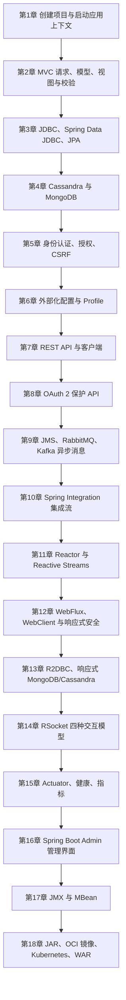

# 《Spring 实战》第 6 版：从应用上下文到生产部署

> **书目信息**：Craig Walls，*Spring in Action, Sixth Edition*，Manning，2022 年 1 月，ISBN `9781617297571`。题目提供的是 574 页中文 MEAP 译稿，PDF 创建于 2022-05-15，正文覆盖欢迎页和第 1～18 章。Manning 正式版为 520 页，因此本文以题目 PDF 的章节顺序和内容为事实主线，并把正式出版信息作为书目校验，不把网络摘要当作正文。
>
> **版本边界**：PDF 示例主要处在 Spring Boot 2.5.3、Spring Framework 5、Spring Security 5 和 Java 11 的语境中，并保留了 MEAP 阶段的章节编号、拼写和实验项目状态。**【原书】**表示 PDF 直接提出的定义或做法；**【纠正】**表示译稿中的错误或今天不能再照搬的内容；**【当前补充】**表示截至 2026-09-19 根据 Spring 官方文档核验的 Spring Boot 4.1.1、Spring Framework 7.0.9+ 实践。
>
> **代码说明**：为避免大段复制受版权保护的正文，本文只保留少量必要片段。多数代码是依据原书意图重新整理的最小示例；现代示例使用 Java 21、`jakarta.*` 包名和当前配置风格，并不声称能直接替换原书完整 Taco Cloud 项目。

## 一、先建立全书模型：Spring 管的是对象关系，也是应用全过程

### 1. Spring 到底是什么

【原书，第 1.1 节】对 Spring 核心的描述非常直接：

> “Spring 的核心是一个容器，通常称为 Spring 应用程序上下文，用于创建和管理应用程序组件。”

书中把这些组件称为 bean，并继续用依赖注入（Dependency Injection，DI）解释容器的职责：对象不再自行创建依赖，而由容器统一创建、连接和管理。这个定义比“Spring 是 Java Web 框架”准确得多。Web MVC、数据访问、安全、消息和监控都是建立在容器之上的能力；真正贯穿全书的是“把基础设施责任从业务对象中拿走”。

通俗地说，普通 Java 代码很容易变成一张手工接线的电路板：控制器自己 `new` 服务，服务自己创建数据库客户端，客户端再读取配置。Spring 将接线图交给应用上下文：业务类只声明“我需要什么”，容器根据类型、配置和条件提供对象。这样解决了四类问题：

- **耦合**：业务类依赖接口和契约，而不是依赖对象创建过程。
- **重复配置**：数据源、HTTP 编解码、安全过滤器等基础设施可以集中配置并复用。
- **环境差异**：同一个应用通过外部配置适应开发、测试和生产环境。
- **横切能力**：事务、安全、指标、重试等能力可以围绕业务调用统一织入。

Spring Boot 并不是另一个容器。它站在 Spring Framework 之上，通过 starter、自动配置、嵌入式服务器、外部化配置和生产运维能力，让“搭建 Spring 应用”从手工组装变为按类路径和条件推断合理默认值。原书那句“自动配置就像风，可以看到效果，但是没有代码可以展示”很形象，但仍要补一句：自动配置不是魔法，它是大量带条件的配置类；出现误判时，应查看条件评估报告，而不是盲目增加注解。

### 2. 从启动到下线的逻辑框架



这条主线可以压缩成一个工程闭环：容器创建对象，Web 层接收输入，数据层保存状态，安全层约束访问，集成层连接外部系统，响应式模型处理异步流，Actuator 暴露运行状态，最后把应用交付到目标环境。书中的 Taco Cloud 不只是示例业务，而是让同一个领域模型依次承受这些工程要求。

### 3. Spring 与相邻技术路线的差异

| 维度 | Spring Boot | Jakarta EE 运行时 | Quarkus | Micronaut | 手工组装轻量库 |
| --- | --- | --- | --- | --- | --- |
| 依赖管理 | starter 与 BOM 提供成套版本 | 以平台规范和服务器实现为中心 | 扩展目录与平台 BOM | 模块化依赖与 BOM | 自行选择、升级和排冲突 |
| 组件模型 | 运行期应用上下文、条件化 bean、AOP | CDI、容器服务和规范 API | CDI 风格，强调构建期增强 | 编译期 DI/AOP | 没有统一模型 |
| 启动与内存 | JVM 模式成熟；也支持 AOT/Native Image | 取决于实现和部署模型 | 重点优化容器与原生启动 | 编译期元数据减少反射 | 可很轻，但工程能力需自建 |
| 生态覆盖 | Web、数据、安全、批处理、集成、云与观测非常完整 | 标准化和可移植性强 | 云原生、GraalVM 体验突出 | 微服务和低资源场景突出 | 选择自由，整合成本最高 |
| 自动配置 | 根据类路径、属性、已有 bean 等条件装配 | 更强调规范默认值和服务器能力 | 构建期扩展生成配置 | 编译期生成 bean 定义 | 基本没有 |
| 适合场景 | 企业应用、复杂集成、长期演进系统 | 重视标准与应用服务器生态 | 冷启动、容器密度、原生镜像 | 低内存微服务、函数计算 | 小型服务、特殊性能或完全定制 |
| 主要代价 | 抽象层多，需理解自动配置和上下文 | 实现差异和服务器运维成本 | 部分动态能力受构建期约束 | 生态广度小于 Spring | 重复造基础设施，团队约定难统一 |

Spring 的优势不只是“注解多、开发快”，而是统一的编程模型和极宽的集成面。它允许一个团队用相近的依赖注入、配置、测试和观测方式处理 Web、数据库、消息和安全。代价是抽象会隐藏真实成本：一个 starter 可能引入几十个依赖，一次阻塞调用可能破坏整个响应式链，一项自动配置也可能因类路径变化而改变。学 Spring 的目标因此不是背注解，而是学会判断容器在何时创建了什么、请求在哪个线程执行、状态在哪里持久化、失败如何传播。

## 二、18 章各自解决什么问题

| 顺序 | 章节 | 核心内容 | 本章的解决方案 |
| --- | --- | --- | --- |
| 欢迎页 | MEAP 阅读说明 | 以亲手构建 Taco Cloud 为主线，从初始化一直走到部署 | 用一个持续演化的应用串联分散的 Spring 项目 |
| 第 1 章 | Spring 入门 | 应用上下文、DI、自动配置、Initializr、DevTools、Spring 生态 | 用 Boot 默认值快速得到可运行、可测试的 Spring 应用 |
| 第 2 章 | 开发 Web 应用程序 | MVC、领域对象、控制器、Thymeleaf、表单绑定、Bean Validation | 将 HTTP 请求转换为领域操作，并把校验错误安全地返回视图 |
| 第 3 章 | 处理数据 | `JdbcTemplate`、Spring Data JDBC、JPA、Repository 派生查询 | 从手写 JDBC 样板逐步上升到声明式仓储 |
| 第 4 章 | 处理非关系型数据 | Cassandra 分区模型、MongoDB 文档模型、Spring Data 映射 | 先按查询与一致性需求选数据库，再复用 Repository 编程模型 |
| 第 5 章 | Spring 安全 | 默认安全、用户存储、密码编码、请求授权、登录、OAuth2 登录、CSRF、方法安全 | 用过滤器链建立认证身份，再按 URL 和方法执行授权 |
| 第 6 章 | 使用配置属性 | Environment、属性源、数据源/服务器/日志配置、自定义属性、Profile | 把环境差异移出代码，并以类型安全对象承载配置 |
| 第 7 章 | 创建 REST 服务 | REST 控制器、HTTP 状态、Spring Data REST、分页、`RestTemplate` | 以资源和 HTTP 语义暴露领域能力，并由客户端消费 |
| 第 8 章 | 保护 REST 服务 | OAuth 2、授权服务器、资源服务器、客户端、访问令牌和 scope | 将凭据验证与 API 分离，用短期令牌表达委托权限 |
| 第 9 章 | 发送异步消息 | JMS、RabbitMQ/AMQP、Kafka、模板和监听器 | 用消息代理解耦生产者与消费者，并吸收流量峰值 |
| 第 10 章 | 集成 Spring | Spring Integration、消息通道、过滤、转换、路由、拆分、网关、适配器 | 用企业集成模式把跨系统流程表达为可组合消息流 |
| 第 11 章 | Reactor 介绍 | Reactive Streams、`Flux`、`Mono`、操作符、`StepVerifier` | 用声明式异步数据流处理延迟、组合和背压 |
| 第 12 章 | 开发响应式 API | WebFlux、函数式端点、`WebTestClient`、`WebClient`、响应式安全 | 让 HTTP 服务端和客户端保持非阻塞链路 |
| 第 13 章 | 响应式持久化数据 | R2DBC、响应式 MongoDB/Cassandra Repository | 避免在事件循环中使用阻塞数据库驱动 |
| 第 14 章 | 使用 RSocket | 请求/响应、请求/流、即发即忘、双向通道、TCP/WebSocket | 在一个长连接上统一请求、流和双向消息交互 |
| 第 15 章 | 使用 Spring Boot Actuator | 端点、配置、健康、线程、HTTP 交换、指标、自定义端点和安全 | 给运行中的应用增加可观测与管理入口 |
| 第 16 章 | 管理 Spring | Spring Boot Admin 服务端、客户端、发现、界面和安全 | 聚合多个 Actuator 端点并提供可视化运维入口 |
| 第 17 章 | 使用 JMX 监控 Spring | Actuator MBean、自定义 MBean、操作、属性和通知 | 通过 JVM 管理标准检查和控制长驻进程 |
| 第 18 章 | 部署 Spring | 可执行 JAR、OCI 镜像、Kubernetes、优雅停机、探针、WAR | 把同一应用交付为进程、容器或传统应用服务器制品 |

## 三、沿应用生命周期连续精读

### 第一阶段：创建容器并接住第一个请求

#### 第 1 章　Spring 入门：先让容器替应用接线

##### 1.1 什么是 Spring：容器、bean 与依赖注入

【原书】先从 XML bean 定义过渡到 Java 配置，再说明组件扫描、自动装配和 Spring Boot 自动配置。三个层次不能混为一谈：

- **组件扫描**发现 `@Component`、`@Service`、`@Repository`、`@Controller` 等候选类。
- **自动装配**按构造函数参数从上下文寻找依赖。
- **自动配置**根据类路径、属性和现有 bean 推断基础设施配置；用户自己提供 bean 时，许多默认配置会“退让”。

【当前补充】优先使用构造器注入。它能把必需依赖表达为对象不变量，也更容易做单元测试；字段注入把依赖隐藏在反射赋值中，不利于创建不可变对象。

```java
@Service
public class ProductService {
    private final InventoryService inventoryService;

    public ProductService(InventoryService inventoryService) {
        this.inventoryService = inventoryService;
    }
}
```

当同一接口存在多个 bean 时，不要把“按类型装配”想成随机选择。应使用 `@Qualifier`、`@Primary` 或重新设计边界；循环依赖通常意味着职责切分不合理，不应靠延迟注入掩盖。

##### 1.2 初始化 Spring 应用程序：Initializr 与构建规范

原书使用 Spring Tool Suite 调用 Spring Initializr，检查 Maven Wrapper、`pom.xml`、主类、测试类、`static` 和 `templates` 目录。真正可迁移的知识是：Initializr 生成的是符合当前版本约束的起点，而不是只能由特定 IDE 创建的项目。

```java
@SpringBootApplication
public class TacoCloudApplication {
    public static void main(String[] args) {
        SpringApplication.run(TacoCloudApplication.class, args);
    }
}
```

`@SpringBootApplication` 组合了配置类、组件扫描和自动配置入口。主类应放在业务包的上层，使默认扫描范围覆盖子包；把它放进过深的包，常导致“类明明有注解却没有 bean”。

##### 1.3 编写应用：请求、视图、测试、运行和 DevTools

原书依次创建主页控制器、Thymeleaf 视图、MockMvc 测试，并介绍从 IDE、Maven/Gradle 插件和可执行 JAR 启动应用。最小控制器如下：

```java
@Controller
class HomeController {
    @GetMapping("/")
    String home() {
        return "home";
    }
}
```

```java
@WebMvcTest(HomeController.class)
class HomeControllerTest {
    @Autowired MockMvc mvc;

    @Test
    void homePage() throws Exception {
        mvc.perform(get("/"))
           .andExpect(status().isOk())
           .andExpect(view().name("home"));
    }
}
```

`@WebMvcTest` 是切片测试，只加载 MVC 所需组件；`@SpringBootTest` 才会加载完整应用上下文。DevTools 的自动重启通过分离类加载器工作，它提升开发反馈速度，但不应进入生产运行依赖。

##### 1.4 俯瞰 Spring 生态：不要把所有项目都当成核心框架

原书概览 Spring Framework、Boot、Data、Security、Integration、Batch、Cloud 和当时的 Spring Native。各项目关系可这样理解：Framework 提供容器和基础编程模型；Boot 负责组装与运行体验；Data、Security、Integration 等解决特定领域问题；Cloud 在分布式系统层面提供约定和适配。

【纠正，第 1.4.7 节】书中把 Spring Native 作为实验项目介绍。今天不要再添加旧的 `spring-native` 实验依赖；Spring Boot 已直接提供 AOT 处理和 GraalVM Native Image 支持。

**本章术语**：

- **IoC（Inversion of Control，控制反转）**：对象创建和依赖连接的控制权从业务代码转交给容器。
- **DI（Dependency Injection，依赖注入）**：IoC 的常见实现方式，由外部提供对象依赖。
- **bean**：由 Spring `BeanFactory`/`ApplicationContext` 创建、配置和管理的对象。
- **starter**：一组围绕某项能力整理的依赖入口，本身不等于实现代码。
- **自动配置**：满足条件时注册默认 bean 的配置机制，不是不可查看的魔法。

#### 第 2 章　开发 Web 应用程序：把 HTTP 表单转成领域动作

##### 2.1 展示信息：领域对象、控制器与视图各守边界

原书先建立 `Ingredient`、`Taco` 等领域实体，再由控制器把配料列表放进 `Model`，最后由 Thymeleaf 渲染。典型 MVC 请求链是：

```text
浏览器 -> DispatcherServlet -> HandlerMapping -> Controller
       -> Model + 逻辑视图名 -> ViewResolver -> HTML 响应
```

控制器不应拼接 HTML，视图也不应直接查询数据库。控制器负责把 HTTP 输入转换为应用调用，把结果转换为 HTTP 响应；领域规则应留在服务或领域对象中。

##### 2.2 处理表单提交：绑定并不等于可信

```java
@PostMapping("/design")
String processDesign(@Valid @ModelAttribute("taco") TacoForm form,
                     BindingResult errors) {
    if (errors.hasErrors()) {
        return "design";
    }
    tacoService.create(form);
    return "redirect:/orders/current";
}
```

Spring MVC 的数据绑定会按请求参数填充对象，但这只是语法转换。不要把 JPA 实体直接作为所有表单和 API 的输入模型，否则客户端可能绑定本不应修改的字段。当前实践更倾向使用专门的请求 DTO，再显式映射到领域对象。

##### 2.3 验证输入：声明规则、执行校验、展示错误

原书分三步讲解 Bean Validation：在字段上声明约束；在控制器参数使用 `@Valid`；通过 `BindingResult` 和模板显示错误。

```java
public record TacoForm(
    @NotBlank String name,
    @Size(min = 1, message = "至少选择一种配料") List<String> ingredientIds
) {}
```

【当前补充】Spring Boot 3+ 已迁移到 Jakarta EE 命名空间，导入应为 `jakarta.validation.Valid`、`jakarta.validation.constraints.NotBlank`，不再是书中的 `javax.validation.*`。校验只能证明 DTO 满足局部约束，库存存在性、价格规则和用户权限仍需在应用服务中验证。

##### 2.4～2.5 视图控制器和模板选择

没有业务逻辑的静态路由可通过 `WebMvcConfigurer#addViewControllers` 注册，避免空控制器。原书比较 Thymeleaf、FreeMarker、Mustache 和 JSP，并提醒模板缓存会影响开发反馈。

【当前补充】服务端模板仍适合后台系统、内容页面和渐进增强应用；复杂交互也可以采用 React/Vue 前端加 REST/GraphQL 后端。两者并非高低之分，关键在 SEO、首屏、交互复杂度、团队技能和部署边界。JSP 依赖 Servlet 容器模型，在可执行 JAR 和现代前后端分离项目中通常不是首选。

**本章术语**：

- **MVC（Model-View-Controller）**：把数据、渲染和请求协调职责分开。
- **数据绑定**：把请求字符串转换并写入 Java 参数或对象。
- **Bean Validation**：以约束注解描述对象校验规则的 Jakarta 规范。
- **PRG（Post/Redirect/Get）**：POST 成功后重定向，避免刷新页面重复提交。
- **模板缓存**：缓存解析后的模板结构；生产可提升性能，开发时可能妨碍即时刷新。

### 第二阶段：让业务状态可以被正确保存

#### 第 3 章　处理数据：从 SQL 控制到声明式 Repository

##### 3.1 使用 JDBC：模板消除资源管理样板

【原书】用一段手工 JDBC 查询展示 `Connection`、`PreparedStatement`、`ResultSet` 和异常处理的重复工作，再引入 `JdbcTemplate`。模板模式保留 SQL 控制权，同时统一连接获取、资源关闭和异常转换。

```java
@Repository
class JdbcIngredientRepository {
    private final JdbcTemplate jdbc;

    JdbcIngredientRepository(JdbcTemplate jdbc) {
        this.jdbc = jdbc;
    }

    Optional<Ingredient> findById(String id) {
        return jdbc.query(
            "select id, name, type from ingredient where id = ?",
            (rs, rowNum) -> new Ingredient(
                rs.getString("id"),
                rs.getString("name"),
                Ingredient.Type.valueOf(rs.getString("type"))),
            id).stream().findFirst();
    }
}
```

原书随后改造实体、定义 schema、利用 `schema.sql`/`data.sql` 预加载数据，并分别展示简单插入和复杂聚合写入。这里要注意事务边界：保存订单和订单项属于一个业务原子操作，应由服务层 `@Transactional` 包住，而不是让控制器依次调用多个仓储。

【当前补充】Spring Framework 6.1+ 提供 `JdbcClient`，为常见查询和参数绑定提供更流畅的 API；复杂批处理和底层控制仍可使用 `JdbcTemplate`。两者都是阻塞 JDBC，不应直接放进 WebFlux 事件循环。

##### 3.2 Spring Data JDBC：以聚合为持久化边界

原书通过添加 starter、声明 `CrudRepository`、使用 `@Table`/`@Id` 映射实体和 `CommandLineRunner` 预加载数据，展示 Spring Data JDBC 如何减少实现代码。

```java
public interface IngredientRepository
        extends CrudRepository<Ingredient, String> {
}
```

Spring Data JDBC 不是“功能较少的 JPA”。它不维护持久化上下文、脏检查或懒加载代理，而是把聚合根及其内部对象作为保存边界。优势是 SQL 行为更直接，代价是复杂关系和局部更新需要更明确的建模。

##### 3.3 Spring Data JPA：用对象关系映射换取更丰富的状态管理

原书给实体添加 JPA 注解，声明 Repository，并通过方法名派生查询或 `@Query` 自定义查询。JPA 适合复杂关系、工作单元和成熟 ORM 能力，但要警惕 N+1 查询、意外级联、懒加载越界以及实体被 Web 层序列化。

```java
public interface TacoOrderRepository
        extends JpaRepository<TacoOrder, Long> {

    List<TacoOrder> findByUserIdOrderByPlacedAtDesc(Long userId);
}
```

数据库迁移不应只依赖开发期的自动建表。生产环境应使用 Flyway 或 Liquibase 管理可审计、可回滚的 schema 版本，并在测试中验证迁移脚本。

**选择建议**：需要手写 SQL 和可预测行为时选 JDBC/JdbcClient；聚合结构清晰且不需要 JPA 状态机时考虑 Spring Data JDBC；复杂关系和 ORM 生态价值较高时选 JPA。Repository 接口相似不代表存储语义相同。

**本章术语**：

- **JDBC（Java Database Connectivity）**：Java 访问关系数据库的标准 API。
- **JPA（Jakarta Persistence）**：对象关系映射规范，Hibernate 是常见实现。
- **Repository**：以领域集合视角封装持久化操作的接口。
- **聚合根**：外部修改一个聚合时必须经过的入口实体。
- **脏检查**：ORM 比较托管实体变化并在事务提交时生成更新 SQL。

#### 第 4 章　处理非关系型数据：编程模型相似，数据模型不能照搬

##### 4.1 Cassandra：从查询出发设计分区

原书将 Cassandra 描述为分布式、高性能、高可用、最终一致的分区行存储，并依次讲 starter、数据模型、实体映射和 Repository。最重要的提醒是：不能把关系模型原样搬到 Cassandra。

- 分区键决定数据分布和一次查询触达哪些节点。
- 聚簇列决定分区内排序和查询范围。
- 为查询建立冗余表是常规设计，不应追求关系数据库式规范化。
- 分区过大、热点键和跨分区查询都会破坏可扩展性。

```java
@Table("ingredients_by_type")
public class IngredientByType {
    @PrimaryKey
    private IngredientKey key;
    private String name;
}

@PrimaryKeyClass
public class IngredientKey {
    @PrimaryKeyColumn(type = PrimaryKeyType.PARTITIONED)
    private String type;
    @PrimaryKeyColumn(type = PrimaryKeyType.CLUSTERED)
    private String id;
}
```

代码只是映射结果，真正的设计发生在查询清单、一致性等级、复制因子和容量估算中。

##### 4.2 MongoDB：用文档承载一起变化的数据

原书添加 Spring Data MongoDB，使用 `@Document` 和 `@Id` 映射对象，再声明 Repository。MongoDB 文档适合把经常一起读取和更新的数据放在一个边界内；引用过多会重新制造跨文档连接成本，文档无限增长也会成为问题。

```java
@Document("taco_orders")
public class TacoOrderDocument {
    @Id private String id;
    private Instant placedAt;
    private List<TacoSnapshot> tacos;
}
```

【当前补充】本地测试优先使用 Testcontainers 启动真实版本的 MongoDB/Cassandra，而不是依赖行为不完全一致的内嵌替代品。测试还应覆盖索引、唯一约束、序列化兼容和迁移策略。

**局限与取舍**：Spring Data 统一了 Repository 外观，但不能抹平事务、一致性、查询语言和索引模型的差异。选择 NoSQL 的理由应来自访问模式、吞吐、地域分布和数据演化，而不是“关系数据库过时”。

**本章术语**：

- **NoSQL**：非关系型数据系统的宽泛称呼，不代表不使用查询语言。
- **最终一致性**：副本可能短暂不同，但在没有新写入后趋于一致。
- **分区键**：决定数据分布位置的键，直接影响热点和查询范围。
- **文档数据库**：以可嵌套文档作为主要存储和查询单元的数据库。
- **反规范化**：为读取效率有意复制数据，需要同步策略承担一致性成本。

### 第三阶段：约束访问、隔离配置并开放 API

#### 第 5 章　Spring 安全：认证回答“你是谁”，授权回答“你能做什么”

##### 5.1～5.2 默认安全与用户存储

【原书】添加 security starter 后，Spring Boot 会保护所有请求并生成临时密码。随后分别展示内存用户和基于 Repository 的自定义 `UserDetailsService`。默认配置适合验证依赖是否生效，不是生产安全方案。

密码必须使用自适应哈希（如 bcrypt、scrypt、Argon2），不能明文保存，也不能使用可逆加密代替密码哈希。数据库中的角色和权限还需要明确命名空间，避免把 `ROLE_ADMIN`、OAuth scope 和业务权限混为一谈。

##### 5.3 保护请求、登录、第三方认证、登出和 CSRF

原书使用当时常见的 `WebSecurityConfigurerAdapter` 和链式配置。该适配器已被移除，当前使用组件式 bean：

```java
@Configuration
@EnableWebSecurity
class SecurityConfiguration {

    @Bean
    SecurityFilterChain web(HttpSecurity http) throws Exception {
        http
            .authorizeHttpRequests(auth -> auth
                .requestMatchers("/", "/css/**", "/images/**").permitAll()
                .requestMatchers("/admin/**").hasRole("ADMIN")
                .anyRequest().authenticated())
            .formLogin(form -> form.loginPage("/login").permitAll())
            .logout(logout -> logout.logoutSuccessUrl("/"));
        return http.build();
    }

    @Bean
    PasswordEncoder passwordEncoder() {
        return PasswordEncoderFactories.createDelegatingPasswordEncoder();
    }
}
```

【原书】CSRF 防护默认开启，Thymeleaf 表单可自动带入令牌。不要因为 API 返回 403 就全局关闭 CSRF：基于浏览器 Cookie/Session 的写操作仍需要防护；只有明确采用不依赖 Cookie 的无状态 bearer token API 时，才应针对匹配的过滤器链评估关闭。

“第三方验证”小节实质上是 OAuth 2/OIDC 登录。OAuth 2 负责授权委托，OIDC 在其上增加身份层；把“使用 GitHub 登录”仅称为 OAuth 身份认证会丢失这个区别。

##### 5.4～5.5 方法安全与当前用户

URL 规则是外层防线，业务服务还可用 `@PreAuthorize` 表达资源级约束。方法安全必须通过 `@EnableMethodSecurity` 启用。控制器可通过 `Principal`、`Authentication` 或 `@AuthenticationPrincipal` 获取当前用户，但不要让领域层直接依赖 Web 安全对象。

```java
@PreAuthorize("#owner == authentication.name or hasRole('ADMIN')")
public TacoOrder findOrder(String owner, long id) {
    return repository.findById(id).orElseThrow();
}
```

**本章术语**：

- **Authentication**：当前主体及其凭据、权限和认证状态。
- **Authorization**：判断已知主体能否执行特定操作。
- **CSRF（Cross-Site Request Forgery）**：诱导浏览器带着已有 Cookie 发起非预期写请求。
- **OIDC（OpenID Connect）**：建立在 OAuth 2 之上的身份协议。
- **SecurityFilterChain**：对匹配请求执行的一组安全过滤器和授权规则。

#### 第 6 章　使用配置属性：代码描述能力，环境提供取值

##### 6.1 微调自动配置

原书从 Spring `Environment` 抽象讲到数据源、嵌入式服务器、日志和特殊属性值。Spring Boot 会按优先级合并配置文件、环境变量、系统属性和命令行参数；后来的高优先级来源可以覆盖先前值。

配置不是越集中越好。数据库密码、密钥和令牌应来自秘密管理系统或平台 Secret，不应提交到 Git；普通业务开关和容量参数则应有默认值、类型、说明和合法范围。

##### 6.2 创建类型安全的配置属性

```java
@ConfigurationProperties("taco.orders")
@Validated
public record OrderProperties(
    @Min(1) int pageSize,
    @NotNull Duration timeout
) {}
```

配合 `@ConfigurationPropertiesScan`，Spring Boot 会绑定 `taco.orders.page-size`、`taco.orders.timeout` 等属性。与散落的 `@Value` 相比，配置对象能提供类型转换、元数据、校验和集中测试。

##### 6.3 Profile：用于环境组合，不是秘密开关

原书讲解特定 profile 属性、激活方式和 `@Profile` 条件 bean。MEAP 示例使用旧的 `spring.profiles` 文档激活语法；当前多文档配置应使用：

```yaml
spring:
  config:
    activate:
      on-profile: prod
  datasource:
    url: ${DB_URL}
```

Profile 适合表达 `dev`、`test`、`prod` 等配置组合，但组合数量过多会形成难以测试的状态空间。能用单个配置属性表达的差异，不必都建成 profile；敏感值也不应写进 `application-prod.yml`。

**本章术语**：

- **PropertySource**：一组带优先级的键值配置来源。
- **宽松绑定**：把环境变量、短横线、下划线等命名形式映射到 Java 属性。
- **Profile**：按环境或场景激活的一组配置与 bean 条件。
- **配置元数据**：为 IDE 补全、类型和说明提供的信息。
- **Secret**：密码、私钥、令牌等需要受控存储和轮换的敏感配置。

#### 第 7 章　创建 REST 服务：先尊重 HTTP，再选择客户端

##### 7.1 RESTful 控制器：资源、方法与状态码

原书依次展示 GET、POST、PUT/PATCH 和 DELETE。`@RestController` 表示返回值默认写入响应体，`ResponseEntity` 可同时控制状态、头和内容。

```java
@RestController
@RequestMapping("/api/tacos")
class TacoApiController {
    private final TacoService service;

    @GetMapping("/{id}")
    ResponseEntity<TacoView> byId(@PathVariable long id) {
        return service.findView(id)
            .map(ResponseEntity::ok)
            .orElseGet(() -> ResponseEntity.notFound().build());
    }

    @PostMapping
    ResponseEntity<TacoView> create(@Valid @RequestBody CreateTacoRequest request) {
        TacoView created = service.create(request);
        return ResponseEntity
            .created(URI.create("/api/tacos/" + created.id()))
            .body(created);
    }
}
```

PUT 通常表达完整替换，PATCH 表达部分修改；幂等性、并发更新和版本字段要由 API 明确定义。错误响应应稳定、机器可读，现代 Spring 可使用 `ProblemDetail` 表达 RFC 9457 风格问题详情。

##### 7.2 Spring Data REST：快速暴露不等于良好领域 API

Spring Data REST 能把 Repository 自动暴露成带分页和链接的 API，并允许调整资源路径与关系名。它适合内部原型、数据管理接口和 CRUD 占主导的系统；若业务动作、权限、审计和兼容策略复杂，直接把 Repository 暴露成公共契约会让持久化模型绑死 API。

##### 7.3 消费 REST：从 RestTemplate 迁移到 RestClient

原书完整介绍 `RestTemplate` 的 GET、PUT、DELETE、POST 方法。它在书的版本中是主流同步客户端；【当前补充】Spring Framework 7.0 已正式弃用 `RestTemplate`，同步场景使用 `RestClient`，异步和流式场景使用 `WebClient`，声明式接口可使用 HTTP Service Clients。

```java
@Bean
RestClient tacoRestClient(RestClient.Builder builder) {
    return builder.baseUrl("https://api.example.com").build();
}

TacoView taco = client.get()
    .uri("/api/tacos/{id}", id)
    .retrieve()
    .body(TacoView.class);
```

客户端还必须设置连接/读取超时、认证、重试边界和可观测信息。对非幂等 POST 自动重试可能造成重复下单，应配合幂等键或业务去重。

**本章术语**：

- **REST（Representational State Transfer）**：围绕资源、统一接口和无状态交互的一组架构约束。
- **幂等性**：同一操作执行一次或多次，对服务端最终状态影响相同。
- **内容协商**：客户端和服务端通过媒体类型协商表示格式。
- **HATEOAS**：响应携带可继续执行的超媒体链接。
- **Problem Details**：标准化 HTTP API 错误结构的规范。

#### 第 8 章　保护 REST 服务：用 OAuth 2 表达受限委托

##### 8.1 OAuth 2 的角色和流程

原书从授权码、访问令牌、scope 和四类角色切入。核心角色是资源所有者、客户端、授权服务器和资源服务器。访问令牌不是用户密码的替代文本，而是带期限、受众和权限范围的委托凭据。

浏览器或移动公共客户端应采用 Authorization Code + PKCE；服务到服务可评估 Client Credentials。Resource Owner Password Credentials 流不应再用于新系统。需要用户身份时使用 OIDC，并验证 issuer、audience、nonce 等约束。

##### 8.2 创建授权服务器

【纠正】原书称 Spring Authorization Server 为“实验性质”。当前官方参考文档已提供 1.5.x 稳定版本和完整配置指南，不能再按实验项目对待。生产部署仍要认真处理密钥轮换、客户端注册、同意页、审计、吊销和高可用；许多团队也会选择 Keycloak、Auth0、Okta、Microsoft Entra ID 等专用身份平台。

##### 8.3 资源服务器验证令牌

```java
@Bean
SecurityFilterChain api(HttpSecurity http) throws Exception {
    http
        .securityMatcher("/api/**")
        .authorizeHttpRequests(auth -> auth
            .requestMatchers(HttpMethod.GET, "/api/tacos/**")
                .hasAuthority("SCOPE_tacos.read")
            .requestMatchers(HttpMethod.POST, "/api/tacos/**")
                .hasAuthority("SCOPE_tacos.write")
            .anyRequest().authenticated())
        .oauth2ResourceServer(oauth -> oauth.jwt(Customizer.withDefaults()));
    return http.build();
}
```

JWT 资源服务器可本地验证签名和声明，延迟低但撤销不即时；opaque token 通过 introspection 获取当前状态，控制更集中但增加网络依赖。无论哪种形式，都要校验签名、过期时间、issuer、audience 和权限，不能只把 JWT 解码后相信内容。

##### 8.4 开发客户端

原书展示客户端注册、登录并从 `OAuth2AuthorizedClient` 取得访问令牌。当前实践应尽量让 Spring Security 的 OAuth2 Client 支持管理授权请求、令牌刷新和持久化，不要在业务代码中手工拼接 bearer token。浏览器前端还要考虑 BFF（Backend for Frontend）模式，避免长期令牌暴露给 JavaScript。

**本章术语**：

- **OAuth 2**：授权委托框架，不等同于身份认证协议。
- **scope**：令牌被允许执行的权限范围。
- **PKCE（Proof Key for Code Exchange）**：防止授权码被截获后直接兑换令牌的机制。
- **JWT（JSON Web Token）**：可签名的声明载体，不天然加密。
- **Resource Server**：持有受保护资源并验证访问令牌的 API 服务。

### 第四阶段：让应用通过消息和集成流连接外部系统

#### 第 9 章　发送异步消息：用时间解耦换取最终一致性

##### 9.1 JMS：标准 API 与传统消息代理

原书从添加 JMS starter、配置 Artemis 开始，使用 `JmsTemplate` 发送和拉取消息，再使用 `@JmsListener` 接收推送消息。JMS 是 Java 消息规范，提供队列、主题、确认和事务等抽象；它并不是具体 broker。

```java
@Service
class OrderPublisher {
    private final JmsTemplate jms;

    OrderPublisher(JmsTemplate jms) {
        this.jms = jms;
    }

    void publish(TacoOrderCreated event) {
        jms.convertAndSend("tacocloud.orders", event);
    }
}

@JmsListener(destination = "tacocloud.orders")
void consume(TacoOrderCreated event) {
    fulfillmentService.accept(event);
}
```

模板负责序列化和协议细节，但业务仍要决定消息契约、重复消费、失败重试和死信策略。消息成功发送不代表下游已经完成业务。

##### 9.2 RabbitMQ 与 AMQP：显式路由是核心能力

原书介绍 Rabbit starter、`RabbitTemplate`、交换机、路由键和监听器。RabbitMQ 通常通过 exchange 把消息路由到队列：direct 适合精确键，topic 支持模式，fanout 广播。若不了解交换机和 binding，只会把 RabbitMQ 当作“另一个队列 API”，会错过其路由优势。

```java
rabbitTemplate.convertAndSend(
    "orders.exchange",
    "orders.created",
    event);
```

生产配置应包含 publisher confirm、持久化、consumer acknowledgement、prefetch、死信交换机和重试上限。无限重试会把永久性数据错误变成消息风暴。

##### 9.3 Kafka：日志流不等于传统工作队列

原书配置 `KafkaTemplate` 和 `@KafkaListener`。Kafka 以分区追加日志为核心：同一消费组内一个分区同时只由一个消费者实例处理，因此分区数决定并行上限；分区内有序，不保证跨分区全局有序。

```java
kafkaTemplate.send("tacocloud.orders", orderId, event);

@KafkaListener(topics = "tacocloud.orders", groupId = "fulfillment")
void handle(TacoOrderCreated event) {
    fulfillmentService.acceptIdempotently(event);
}
```

“Exactly once”不能被简单理解为整个业务只执行一次。Kafka 的幂等生产者和事务能覆盖特定 Kafka 读写链路，外部数据库、邮件或支付系统仍需要幂等键、去重表或事务消息设计。

##### 异步消息的共同难题

数据库提交后再发送消息会出现“双写”窗口：数据库成功、消息失败，或反过来。常用解法是 Outbox Pattern：在同一数据库事务中写业务数据和 outbox 记录，再由发布器或 CDC 工具把事件送入 broker。

```text
业务事务 -> 业务表 + outbox 表 -> 发布器/CDC -> Broker -> 幂等消费者
```

**本章术语**：

- **JMS（Java Message Service）**：Java 消息传递规范。
- **AMQP（Advanced Message Queuing Protocol）**：消息中间件协议，RabbitMQ 是常见实现。
- **消费组**：Kafka 中共同分担主题分区的一组消费者。
- **死信队列**：保存超过重试上限或无法处理消息的隔离队列。
- **Outbox Pattern**：用本地事务记录待发布事件，避免数据库和 broker 双写不一致。

#### 第 10 章　集成 Spring：把企业集成模式写成消息流

##### 10.1 声明集成流：XML、Java 配置与 Java DSL

原书用三种风格声明同一条集成流。XML 适合维护历史系统；显式 Java bean 更易调试；Java DSL 最接近“数据从哪里来、经过什么处理、到哪里去”的阅读顺序。

```java
@Bean
IntegrationFlow fileToOrderFlow(OrderParser parser,
                                OrderService service) {
    return IntegrationFlow
        .from(Files.inboundAdapter(Path.of("inbox").toFile()),
              spec -> spec.poller(Pollers.fixedDelay(Duration.ofSeconds(1))))
        .filter(File.class, file -> file.getName().endsWith(".json"))
        .transform(File.class, parser::parse)
        .handle(TacoOrder.class, (order, headers) -> {
            service.submit(order);
            return null;
        })
        .get();
}
```

集成流不是业务流程引擎。它适合协议适配、路由、转换和系统边界编排；复杂的人工作业、长事务和可视化状态机可能更适合 BPMN/工作流引擎。

##### 10.2 探索 Spring Integration 组件

原书逐项讲解九类构件：

- **消息通道**连接端点；`DirectChannel` 在发送线程同步调用，`QueueChannel` 引入缓冲。
- **过滤器**决定消息继续还是被丢弃/转入 discard channel。
- **转换器**改变 payload 或表示格式。
- **路由器**按内容、头或规则选择下游通道。
- **拆分器**把一条复合消息变成多条；实际系统常与聚合器配对。
- **服务激活器**调用普通业务服务，是消息流与领域逻辑的连接点。
- **网关**让调用方以普通 Java 接口进入消息系统。
- **通道适配器**把文件、HTTP、JMS、邮件等外部端点连接到通道。
- **端点模块**是特定协议或系统的一组成品适配器。

消息由 payload 和 headers 组成。路由与追踪信息适合放 header，核心业务数据放 payload；把所有内容塞入 header 会破坏消息契约。

##### 10.3 Email 集成流：轮询、转换、调用和无 Web 运行模式

原书以邮件订单为例，从邮箱读取消息，解析为订单，再通过 REST 提交，并通过 `spring.main.web-application-type=none` 禁止不必要的 Web 服务器启动。这个案例说明 Spring Boot 应用不一定是 HTTP 服务，也可以是消息消费者、批处理或后台集成进程。

**局限与解决方案**：流越长，异常路径越重要。应显式设计 error channel、重试、补偿、幂等和消息追踪；不要只画成功路径。对跨服务的长业务流程，可使用 Saga、工作流引擎或事件编排，让状态持久化和恢复更清晰。

**本章术语**：

- **EIP（Enterprise Integration Patterns）**：消息通道、路由器、转换器等企业系统集成模式集合。
- **Message Gateway**：把普通方法调用适配为消息发送/接收。
- **Service Activator**：调用业务服务处理消息的端点。
- **Channel Adapter**：连接消息通道与外部系统的单向适配器。
- **Poller**：按计划主动拉取消息源的调度组件。

### 第五阶段：在非阻塞数据流中组织 Web、数据与双向通信

#### 第 11 章　Reactor 介绍：响应式的价值在等待期间不占住线程

##### 11.1 理解响应式编程与 Reactive Streams

原书把响应式程序解释为数据流经操作管道，并说明订阅者通过 subscription 控制需求量。这里有一处需要纠正：Reactive Streams 规范定义的是 `Publisher`、`Subscriber`、`Subscription` 和 `Processor`，不是译稿总结中的 `Transformer`。

- `Publisher<T>` 产生 0 到多个元素。
- `Subscriber<T>` 接收元素、完成或错误信号。
- `Subscription` 表达取消和背压请求。
- `Processor<T,R>` 同时是订阅者和发布者。

响应式不是“代码里出现异步回调”或“性能自动变高”。它的主要收益是在大量 I/O 等待中用较少线程维持更多并发；CPU 密集任务、低并发 CRUD 或团队不熟悉流式调试时，复杂度可能大于收益。

##### 11.2 使用 Reactor：Flux 与 Mono

`Flux<T>` 表示 0..N 个元素，`Mono<T>` 表示 0..1 个元素。它们在组装阶段通常不执行工作，直到订阅发生。`map` 转换同步值，`flatMap` 把异步发布者展开并可能改变顺序，`concatMap` 保序但并发度更低。

```java
Flux<String> names = Flux.just("Ada", "Grace", "Linus")
    .filter(name -> name.length() >= 5)
    .map(String::toUpperCase);

StepVerifier.create(names)
    .expectNext("GRACE", "LINUS")
    .verifyComplete();
```

##### 11.3 创建、组合、转换、过滤和逻辑判断

原书按操作类别介绍 `just`、`fromIterable`、`range`、`interval`，随后讲 `mergeWith`、`zip`、`firstWithSignal`，再讲 `skip`、`take`、`filter`、`distinct`、`map`、`flatMap`、`buffer`、`collectList`，最后用 `all`、`any` 做逻辑判断。

理解操作符时应持续问三个问题：是否保序？是否并发？错误和取消如何传播？例如 `flatMap` 并发调用远程服务时需要限制并发数；`onErrorResume` 不应吞掉所有异常并返回空流，否则真正故障会被伪装成“没有数据”。

【当前补充】Java 21 虚拟线程降低了“一请求一线程”在阻塞 I/O 下的成本，为传统 MVC 提供了另一条扩展路线。虚拟线程与 Reactor 不是互相淘汰：前者保留命令式代码，后者擅长流、背压和异步组合。选择应基于依赖链是否非阻塞、延迟目标和团队可维护性。

**本章术语**：

- **背压（Backpressure）**：消费者向生产者声明当前可处理的数据量。
- **冷发布者**：每个订阅者通常触发独立的数据生产过程。
- **热发布者**：数据产生不依赖某个订阅者，迟到者可能错过历史数据。
- **Scheduler**：Reactor 中控制任务在哪个执行资源上运行的抽象。
- **阻塞**：线程等待 I/O 或锁而不能继续做其他工作；`block()` 会打断响应式链路优势。

#### 第 12 章　开发响应式 API：只有端到端非阻塞才有意义

##### 12.1 WebFlux 与响应式 Controller

Spring WebFlux 可运行在 Netty 等非阻塞服务器上，也可运行在 Servlet 3.1+ 容器中。注解模型与 MVC 相似，但返回值是 `Mono`/`Flux`：

```java
@RestController
@RequestMapping("/api/tacos")
class ReactiveTacoController {
    private final ReactiveTacoRepository repository;

    @GetMapping(produces = MediaType.TEXT_EVENT_STREAM_VALUE)
    Flux<Taco> stream() {
        return repository.findAll();
    }

    @GetMapping("/{id}")
    Mono<ResponseEntity<Taco>> byId(@PathVariable String id) {
        return repository.findById(id)
            .map(ResponseEntity::ok)
            .defaultIfEmpty(ResponseEntity.notFound().build());
    }
}
```

若控制器返回 `Flux`，但内部调用阻塞 JPA、JDBC 或旧 SDK，应用仍会阻塞事件循环。临时桥接可把阻塞任务放到 `boundedElastic`，但这只是隔离手段，不会把驱动变成非阻塞。

##### 12.2 函数式端点

原书用 `RouterFunction` 和 handler 展示函数式模型。它让路由和处理器成为显式值，适合组合式 API 或偏函数式团队；注解控制器更熟悉，二者底层能力相同。

```java
@Bean
RouterFunction<ServerResponse> tacoRoutes(TacoHandler handler) {
    return route()
        .GET("/api/tacos/{id}", handler::byId)
        .POST("/api/tacos", handler::create)
        .build();
}
```

##### 12.3 使用 WebTestClient 测试

`WebTestClient` 既可绑定控制器/路由进行快速测试，也可连接真实服务器做端到端验证。原书分别测试 GET、POST 和在线服务器。响应式测试应验证完成、错误、超时和取消，不只验证第一个值。

##### 12.4 WebClient：非阻塞客户端及错误处理

原书依次讲 GET、POST、DELETE、错误处理和请求交换。不要在 WebFlux 请求线程中对 `WebClient` 结果调用 `block()`。

```java
Mono<TacoView> taco = webClient.get()
    .uri("/api/tacos/{id}", id)
    .retrieve()
    .onStatus(HttpStatusCode::is4xxClientError,
        response -> Mono.error(new TacoNotFoundException(id)))
    .bodyToMono(TacoView.class)
    .timeout(Duration.ofSeconds(2));
```

##### 12.5 响应式安全

WebFlux 使用 `SecurityWebFilterChain` 和 `ReactiveUserDetailsService`，不能把 Servlet `SecurityFilterChain` 直接照搬。安全上下文通过 Reactor Context 传播，不应依赖 `ThreadLocal` 假设。

```java
@Bean
SecurityWebFilterChain reactiveSecurity(ServerHttpSecurity http) {
    return http
        .authorizeExchange(auth -> auth
            .pathMatchers("/api/public/**").permitAll()
            .anyExchange().authenticated())
        .oauth2ResourceServer(oauth -> oauth.jwt(Customizer.withDefaults()))
        .build();
}
```

**本章术语**：

- **事件循环**：少量线程持续处理就绪事件，要求业务链路避免长时间阻塞。
- **SSE（Server-Sent Events）**：服务器通过单向 HTTP 流持续推送文本事件。
- **WebClient**：Spring 的非阻塞、流式 HTTP 客户端。
- **RouterFunction**：以函数组合方式定义请求匹配和处理逻辑。
- **Reactor Context**：随响应式订阅链传播的上下文，不等同于线程本地变量。

#### 第 13 章　响应式持久化：驱动、事务和领域建模都要重新审视

##### 13.1 R2DBC：关系数据库的非阻塞访问

R2DBC（Reactive Relational Database Connectivity）为支持它的关系数据库驱动提供响应式访问。原书依次定义实体、Reactive Repository、测试和聚合根服务，并指出 R2DBC 不像 JPA 那样直接管理丰富关联。

```java
public interface TacoRepository
        extends ReactiveCrudRepository<Taco, Long> {
    Flux<Taco> findByNameContainingIgnoreCase(String name);
}
```

不要把缺少懒加载视为单纯缺点。响应式链路需要显式知道何时发生 I/O，隐式属性访问再查询数据库会破坏这一点。复杂聚合可通过明确查询、应用层组合或数据库视图解决。

响应式事务依赖 Reactor Context，而不是线程绑定。使用 `TransactionalOperator` 或响应式 `@Transactional` 时，参与事务的调用必须留在同一发布链中；在中途手工 `subscribe()` 会切断调用关系和错误传播。

##### 13.2 响应式 MongoDB

原书说明文档实体与非响应式版本几乎相同，Repository 改为 `ReactiveCrudRepository`，并使用 `@DataMongoTest` 与 `StepVerifier` 测试。MongoDB 驱动本身支持异步 I/O，因此比“把阻塞调用包装进 Flux”更符合端到端非阻塞。

##### 13.3 响应式 Cassandra

原书同样映射实体、声明响应式 Repository 并测试。【纠正】译稿在 13.3 下误写为 `13.2.1`～`13.2.3`，且一处文字称 Cassandra 测试使用 `@DataMongoTest`；正确注解应为 `@DataCassandraTest`。这些是 MEAP/翻译编辑错误，不是框架设计。

##### 局限与选择

R2DBC 不等于“响应式 JPA”，也没有让数据库执行变快。它减少等待期间占用线程的成本，适合高并发 I/O；数据库连接数、慢查询、锁和索引仍决定吞吐。若团队主要使用阻塞驱动，MVC + 虚拟线程可能比半响应式架构更简单。

**本章术语**：

- **R2DBC**：面向关系数据库的响应式连接与驱动规范。
- **Reactive Repository**：返回 `Mono`/`Flux` 的 Spring Data Repository。
- **响应式事务**：通过发布链上下文传播、作用于非阻塞资源的事务。
- **连接池**：复用有限数据库连接；非阻塞不会消除数据库连接上限。
- **数据切片测试**：只加载特定存储技术配置的测试，如 `@DataMongoTest`。

#### 第 14 章　使用 RSocket：一个连接承载四类交互

##### 14.1 协议定位

RSocket 是基于 Reactive Streams 语义的二进制应用协议，支持多路复用、背压和长连接。四种交互模型是：

- **Request-Response**：一问一答。
- **Request-Stream**：一个请求返回多条数据。
- **Fire-and-Forget**：发送后不等待业务响应。
- **Request-Channel**：双方都可持续发送流。

##### 14.2 服务端和客户端

原书逐一实现四种模式。Spring 服务端通过 `@MessageMapping` 声明路由，客户端使用 `RSocketRequester`：

```java
@Controller
class GreetingRSocketController {
    @MessageMapping("greetings")
    Flux<String> greet(Flux<String> names) {
        return names.map(name -> "Hello, " + name);
    }
}

Flux<String> replies = requester
    .route("greetings")
    .data(Flux.just("Ada", "Grace"))
    .retrieveFlux(String.class);
```

Fire-and-forget 只表示协议层不等待响应，不表示消息必达；需要持久交付时仍应使用 broker 或应用级确认。Request-channel 很强，但也要求双方处理取消、限流和重连后的状态恢复。

##### 14.3 TCP 与 WebSocket 传输

原书把 TCP 作为默认传输，并展示通过 WebSocket 穿越只允许 HTTP 的网络边界。选择传输还要考虑负载均衡器是否支持长连接、空闲超时、代理缓冲、浏览器能力和 TLS 终止位置。

**适用边界**：RSocket 适合内部高频流式通信、双向控制通道和设备连接；公共 CRUD API、跨组织互操作或成熟网关治理场景通常仍以 HTTP/REST、gRPC 或消息 broker 更通用。

**本章术语**：

- **多路复用**：在一个物理连接上并发承载多个逻辑流。
- **Request-Channel**：请求与响应两侧都为流的双向交互。
- **Fire-and-Forget**：不等待应用响应的单向发送模型。
- **RSocketRequester**：Spring 提供的 RSocket 客户端抽象。
- **路由元数据**：标识消息由哪个处理器接收的 metadata。

### 第六阶段：观察、管理并交付运行中的应用

#### 第 15 章　Spring Boot Actuator：可运维性必须从开发阶段进入应用

##### 15.1 端点与暴露策略

Actuator 提供 health、info、metrics、loggers、env、beans、conditions、threaddump 等端点，并可通过 HTTP 或 JMX 访问。启用端点（available）与通过某种技术暴露端点（exposed）是两回事。

【当前补充】Spring Boot 4.1 默认只有 `health` 通过 HTTP 和 JMX 暴露。不要复制书中“开放大量端点方便查看”的配置到公网环境；`env`、`configprops`、`heapdump` 和 `loggers` 可能泄露敏感信息或改变运行状态。

```yaml
management:
  endpoints:
    web:
      exposure:
        include: health,info,prometheus
  endpoint:
    health:
      probes:
        enabled: true
      show-details: when_authorized
```

##### 15.2 查看信息、配置、活动和指标

原书分别使用 `/info`、`/env`、`/configprops`、`/conditions`、`/mappings`、`/httptrace`、`/threaddump` 和 `/metrics`。现代版本中 HTTP 请求记录端点是 `httpexchanges`，需要提供 `HttpExchangeRepository`；内存实现只适合开发诊断。

Micrometer 为计数器、计时器、仪表和分布摘要提供统一门面。指标名称和标签必须控制基数：把 userId、orderId 或完整 URL 当 tag 会造成时序数量爆炸。

##### 15.3 自定义 info、健康、指标和端点

```java
@Component
class PaymentHealthIndicator implements HealthIndicator {
    @Override
    public Health health() {
        return paymentClient.ping()
            ? Health.up().build()
            : Health.down().withDetail("reason", "unreachable").build();
    }
}
```

健康检查要区分“进程活着”和“现在能接流量”。存活探针不应依赖易波动外部系统，否则故障会触发无休止重启；就绪探针可以反映数据库或关键依赖是否可用。自定义指标应用业务语言命名，例如订单创建数、履约延迟，而不只采集 JVM 指标。

##### 15.4 保护 Actuator

Actuator 可以使用独立端口、网络策略和单独的 `SecurityFilterChain`。安全规则应基于 `EndpointRequest` 匹配，而不是猜测路径。即使端点需要认证，也不意味着适合向互联网暴露；认证、最小暴露面和网络隔离应同时存在。

**本章术语**：

- **Actuator**：Spring Boot 的生产就绪端点与管理能力。
- **Micrometer**：面向多种监控后端的指标和观测门面。
- **Liveness**：进程是否应被重启。
- **Readiness**：实例当前是否应接收流量。
- **高基数标签**：取值数量巨大、会导致监控成本和查询压力上升的标签。

#### 第 16 章　管理 Spring：Spring Boot Admin 是 Actuator 的界面，不是监控后端

##### 16.1 创建服务端并注册客户端

原书使用 Spring Boot Admin starter 创建管理服务器，应用可主动注册，也可通过 Eureka 被发现。需要明确：Spring Boot Admin 是 codecentric 社区项目，不是 Spring 官方核心项目；版本必须与所用 Spring Boot 代际核对。

##### 16.2 查看状态、指标、环境和日志级别

Admin 服务端聚合 Actuator 数据，提供应用列表、健康状态、指标图、环境属性和动态日志级别界面。它改善了人工查看体验，但不替代 Prometheus 的长期时序存储、Grafana 的跨服务仪表盘、日志平台或 OpenTelemetry 链路追踪。

##### 16.3 同时保护 Admin 和被管理端点

原书分别给 Admin 服务端登录和客户端 Actuator 凭据。不要在 Eureka metadata 或普通配置文件中明文传播共享密码。更稳妥的方案包括 TLS、平台服务身份、受限网络、Secret 注入以及按实例/服务划分凭据。

```text
应用实例 --Actuator--> Admin（人工诊断）
    |------指标-------> Prometheus/Grafana（趋势和告警）
    |------日志-------> 日志平台（检索和审计）
    `------Trace------> OpenTelemetry 后端（跨服务因果链）
```

**局限**：Admin 页面是当前状态入口，不能承担完整告警、容量规划和长期保留。Kubernetes 环境也可结合服务发现或平台原生运维，不必要求每个实例主动注册到中央服务。

**本章术语**：

- **Spring Boot Admin**：消费 Actuator 端点并提供 UI 的第三方管理项目。
- **服务发现**：动态登记和查询服务实例地址的机制。
- **可观测性**：从指标、日志、追踪等外部信号推断系统内部状态的能力。
- **OpenTelemetry**：生成和传输 traces、metrics、logs 的开放标准与工具集。

#### 第 17 章　使用 JMX 监控 Spring：理解 JVM 世界的管理接口

##### 17.1 Actuator MBean

JMX（Java Management Extensions）通过 MBean 暴露属性、操作和通知。原书使用 JConsole 访问 Actuator MBean。当前 Spring Boot 默认未必按你的部署方式开启远程 JMX；远程连接还涉及认证、TLS、RMI 端口和防火墙，不能为了方便直接公开。

##### 17.2 创建自己的 MBean

```java
@ManagedResource(objectName = "tacocloud:name=TacoCounter")
@Component
class TacoCounter {
    private final AtomicLong count = new AtomicLong();

    @ManagedAttribute
    public long getCount() {
        return count.get();
    }

    @ManagedOperation
    public long increment() {
        return count.incrementAndGet();
    }
}
```

管理操作本质上是远程控制面，必须审计、授权并保持幂等或明确副作用。不要通过 MBean 暴露任意脚本执行、秘密值或危险的全局状态修改。

##### 17.3 发送通知

原书使用 `NotificationPublisher` 每达到一定计数发送通知。JMX 通知适合 JVM 管理客户端订阅，但跨容器、跨语言和云平台生态更常使用指标告警、事件总线或 OpenTelemetry。保留 JMX 的理由通常是既有运维工具、JVM 诊断和传统中间件集成。

**本章术语**：

- **JMX（Java Management Extensions）**：Java 平台的管理和监控标准。
- **MBean（Managed Bean）**：通过 JMX 暴露属性和操作的受管对象。
- **ObjectName**：JMX 中定位 MBean 的域和键值标识。
- **Notification**：MBean 主动向订阅客户端发布的管理事件。
- **JConsole**：JDK 自带的 JMX 图形客户端。

#### 第 18 章　部署 Spring：制品只是起点，运行契约才决定可靠性

##### 18.1 权衡部署选项

原书比较传统应用服务器、云平台和容器。Spring Boot 的可执行 JAR 把应用和服务器一起版本化，减少“同一个 WAR 在不同服务器表现不同”的环境漂移；WAR 仍适合必须服从共享应用服务器的组织。

##### 18.2 构建可执行 JAR

Maven/Gradle 的 Spring Boot 插件会把依赖和启动器打进可执行归档：

```powershell
.\mvnw.cmd clean verify
java -jar .\target\taco-cloud-0.0.1-SNAPSHOT.jar
```

制品应包含版本、Git 提交和构建时间，并通过 SBOM、依赖漏洞扫描和签名建立供应链证据。不要在服务器上临时修改 JAR 内容。

##### 18.3 OCI 镜像、Kubernetes、优雅停机和探针

原书使用 Boot 构建插件生成容器镜像，再部署到 Kubernetes，并讨论优雅关闭、liveness 和 readiness。当前最短路径之一是 Cloud Native Buildpacks：

```powershell
.\mvnw.cmd spring-boot:build-image `
  "-Dspring-boot.build-image.imageName=example/taco-cloud:1.0.0"
```

```yaml
apiVersion: apps/v1
kind: Deployment
metadata:
  name: taco-cloud
spec:
  replicas: 3
  selector:
    matchLabels:
      app: taco-cloud
  template:
    metadata:
      labels:
        app: taco-cloud
    spec:
      containers:
        - name: app
          image: example/taco-cloud:1.0.0
          ports:
            - containerPort: 8080
          readinessProbe:
            httpGet:
              path: /actuator/health/readiness
              port: 8080
          livenessProbe:
            httpGet:
              path: /actuator/health/liveness
              port: 8080
          resources:
            requests:
              cpu: 250m
              memory: 512Mi
            limits:
              memory: 768Mi
```

优雅停机要让平台先停止新流量，再等待在途请求和消息处理完成，最后终止进程。超时时间必须与 Kubernetes `terminationGracePeriodSeconds`、负载均衡摘流和应用 `spring.lifecycle.timeout-per-shutdown-phase` 协调。探针不应共用一个“所有依赖都必须健康”的端点。

##### 18.4 WAR 部署

需要外部 Servlet 容器时，主类继承 `SpringBootServletInitializer`，构建为 WAR，并把容器依赖设为 provided。原书指出 WAR 仍可作为可执行制品运行。今天应先确认组织是否真的需要共享容器；独立进程/容器通常更利于版本隔离和独立扩缩容。

##### 18.5～18.6 终章与总结

原书以“从 start.spring.io 到云端部署”收束全书。真正形成闭环的不是成功启动一次应用，而是同一个系统具备配置、测试、安全、消息可靠性、健康检查、指标和可重复交付能力。

**本章术语**：

- **OCI Image**：符合 Open Container Initiative 格式的容器镜像。
- **Buildpack**：检测应用并构建可运行镜像的标准化构建组件。
- **SBOM（Software Bill of Materials）**：软件依赖和组件清单。
- **Graceful Shutdown**：停止接流量并等待在途工作完成后退出。
- **WAR（Web Application Archive）**：部署到 Servlet 容器的 Web 应用归档。

## 四、今天可复现的学习环境

以下步骤是【当前补充】，不属于 2022 年原书。核验日为 2026-09-19：Spring Initializr 默认稳定版为 Spring Boot 4.1.1；官方系统要求是 Java 17～26，Spring Framework 7.0.9+。学习环境推荐 Java 21 LTS，既满足最低要求，也便于评估虚拟线程。

### 1. 准备工具

确认 Java：

```powershell
java -version
```

如果没有 JDK，可安装 Eclipse Temurin 21、Oracle JDK 21 或其他兼容发行版。项目将携带 Maven Wrapper，不要求全局安装 Maven；Git 和 Docker Desktop/Kubernetes 仅在对应章节需要。

### 2. 用 Initializr 生成项目

访问 [Spring Initializr](https://start.spring.io/)，选择：

- Project：Maven
- Language：Java
- Spring Boot：4.1.1
- Java：21
- Packaging：Jar
- Dependencies：Spring Web、Thymeleaf、Validation、Spring Data JPA、H2 Database、Spring Security、Actuator

下载并解压后，在项目目录运行：

```powershell
.\mvnw.cmd test
.\mvnw.cmd spring-boot:run
```

加入 Security starter 后，访问 `http://localhost:8080` 默认会要求登录；用户名通常为 `user`，开发期随机密码会打印在启动日志中。不要把这套默认账户当作生产认证方案。

### 3. 建立最小配置

```yaml
spring:
  application:
    name: taco-cloud
  datasource:
    url: jdbc:h2:mem:tacocloud
  jpa:
    open-in-view: false

management:
  endpoints:
    web:
      exposure:
        include: health,info
  endpoint:
    health:
      probes:
        enabled: true
```

`spring.jpa.open-in-view=false` 能避免 Web 渲染阶段悄悄触发懒加载查询，迫使应用在事务边界内准备好所需数据。生产数据库应使用迁移工具和外部凭据。

### 4. 建立测试分层

```text
纯单元测试       领域规则，不启动 Spring
@WebMvcTest      MVC 路由、绑定、校验和安全
@DataJpaTest     JPA 映射和查询
@SpringBootTest  完整上下文与跨层集成
Testcontainers   真实数据库、Kafka、MongoDB 等外部依赖
```

运行：

```powershell
.\mvnw.cmd clean verify
```

测试不应只证明上下文能启动，还要覆盖未认证、无权限、非法输入、重复消息、数据库约束和依赖超时。

### 5. 构建镜像并验证健康端点

```powershell
.\mvnw.cmd spring-boot:build-image `
  "-Dspring-boot.build-image.imageName=local/taco-cloud:dev"

docker run --rm -p 8080:8080 local/taco-cloud:dev
curl.exe http://localhost:8080/actuator/health
```

构建生产镜像时固定基础构建器和依赖版本，输出 SBOM，并在 CI 中执行测试、镜像扫描和部署清单校验。

## 五、第 6 版代码迁移到当前 Spring 的关键变化

| 第 6 版语境 | 当前状态 | 迁移方式 |
| --- | --- | --- |
| Spring Boot 2.5.3、Java 11 | Initializr 默认 Spring Boot 4.1.1，最低 Java 17 | 推荐先迁移到受支持的 3.x 基线再到 4.x；学习项目直接使用 Java 21 |
| `javax.validation`、`javax.persistence` | Spring Boot 3+ 使用 `jakarta.validation`、`jakarta.persistence` | 修改 import，并升级所有依赖到 Jakarta 兼容版本 |
| 继承 `WebSecurityConfigurerAdapter` | 该适配器已移除 | 声明 `SecurityFilterChain`、`UserDetailsService`、`PasswordEncoder` bean |
| `antMatchers`、旧授权 DSL | 当前使用 `requestMatchers`、`authorizeHttpRequests` | 按 URL、HTTP 方法和多条 filter chain 重写规则 |
| `spring.profiles` 激活 YAML 文档 | 使用 `spring.config.activate.on-profile` | 更新多文档配置并检查配置优先级 |
| `RestTemplate` 是同步主力客户端 | Spring Framework 7 已弃用 `RestTemplate` | 同步改用 `RestClient`，流式/异步使用 `WebClient` |
| Spring Native 是实验项目 | Boot 内建 AOT/GraalVM Native Image 支持 | 删除旧实验依赖，使用 `native:compile` 或 `bootBuildImage` |
| Spring Authorization Server 是实验性质 | 官方 1.5.x 文档和稳定功能已可用 | 按当前 starter、密钥与协议端点配置，不复制早期 API |
| `httptrace` Actuator 端点 | 当前使用 `httpexchanges` | 提供受控的 `HttpExchangeRepository`，避免生产内存无限记录 |
| 书中把 Reactive Streams 第四接口译作 Transformer | 规范名称是 `Processor` | 以 Reactive Streams 规范为准 |
| 第 13.3 节编号和测试注解有编辑错误 | Cassandra 应是 13.3.x 和 `@DataCassandraTest` | 阅读时不要照抄错误编号/注解 |

迁移时最危险的做法是一次性修改包名、框架大版本、安全规则和业务行为，然后只看“能否编译”。更稳妥的顺序是：先建立高价值测试和依赖清单，再处理 Java/Jakarta 基线，然后按 Web、安全、数据、观测逐层迁移，每一步都运行集成测试并检查启动条件报告。

## 六、书外扩展：何时选择别的路线

### 1. MVC + 虚拟线程与 WebFlux

若依赖主要是 JDBC、阻塞 SDK 和同步 RPC，Java 21 虚拟线程能保留直观命令式代码，并改善高并发等待成本。若数据天然是持续流、需要背压、依赖已有响应式驱动，WebFlux/Reactor 更合适。不要只因为“响应式听起来性能高”就让阻塞链路包一层 `Mono`。

### 2. Spring MVC REST、GraphQL 与 gRPC

- 公共资源 API、浏览器和通用工具兼容优先：REST/HTTP。
- 客户端需要精确选择关联字段、聚合多个后端：Spring for GraphQL。
- 内部强类型、高吞吐、双向流式 RPC：gRPC。
- 同一长连接上的多种响应式交互：RSocket，但生态和网关支持需单独评估。

### 3. Spring Boot、Quarkus 与 Micronaut

Spring Boot 的优势是生态、团队人才和长期兼容经验；Quarkus/Micronaut 更强调构建期处理、低内存和快速启动。如果现有系统大量依赖 Spring Data、Security、Integration 和第三方 starter，迁移框架的收益必须超过重写与运维成本。对于新建短生命周期函数或极高容器密度服务，可以用真实工作负载基准比较 JVM、CRaC 和 Native Image，而不是只比较 Hello World 启动时间。

### 4. 自建授权服务器与身份平台

能够用 Spring Authorization Server 编写授权服务器，不代表每个团队都应该自己承担身份平台。多因素认证、账号恢复、风险控制、密钥轮换、合规审计和联合身份会迅速扩大范围。业务独特且有安全团队时可自建；否则优先评估成熟 IdP，再让 Spring 应用只扮演 OAuth2 Client/Resource Server。

## 七、把 18 章压缩成一套工程决策顺序

1. **先画边界**：哪些类是领域规则，哪些是 Web、数据库、消息或安全适配器？
2. **再交给容器接线**：依赖通过构造器声明，自动配置只承担合理默认值。
3. **输入先校验再执行业务**：HTTP 绑定、Bean Validation、权限和领域不变量是不同层次。
4. **按访问模式选存储**：不要因 Repository API 相似就忽略关系、文档和分区数据库语义。
5. **把安全放进设计**：密码哈希、最小权限、CSRF、OAuth audience 和管理端点暴露都不是上线前补丁。
6. **为失败设计集成**：超时、重试、幂等、死信、Outbox 和补偿必须与成功路径一起实现。
7. **统一并发模型**：MVC/虚拟线程或 WebFlux 都可以，最怕在事件循环里混入未知阻塞。
8. **先有可观测性再上线**：健康、指标、日志、trace 和版本信息是运行契约的一部分。
9. **制品可重复、配置外置**：相同 JAR/镜像进入不同环境，差异通过受控配置注入。
10. **让测试覆盖架构风险**：不只测试正常 CRUD，还测试权限、并发、重复消息、迁移和依赖故障。

《Spring 实战》第 6 版的价值在于，它没有把 Spring 拆成互不相关的注解清单，而是展示了一个应用如何逐步获得 Web、数据、安全、集成、响应式和运维能力。今天阅读它时，需要替换已经变化的 API，但主线仍然成立：Spring 的真正作用，是用一致的对象模型和基础设施抽象，让业务能力从本地方法一路成长为可配置、可保护、可观察、可部署的生产系统。

## 八、来源与核验

### 原书与代码

- Craig Walls，*Spring in Action, Sixth Edition*，Manning，2022-01，ISBN `9781617297571`；本文正文顺序、章节主题、短引文和 Taco Cloud 示例意图以题目提供的 574 页中文 MEAP PDF 为主。
- [Manning 第 6 版官方页面](https://www.manning.com/books/spring-in-action-sixth-edition)：核对作者、出版时间、ISBN 和正式版页数。
- [作者示例仓库](https://github.com/habuma/spring-in-action-6-samples)：用于定位第 6 版公开示例的工程背景。

### 当前官方资料（核验于 2026-09-19）

- [Spring Initializr](https://start.spring.io/)：本次接口返回默认稳定版 Spring Boot 4.1.1、默认 Java 17，并列出 Java 17/21/25/27 选项。
- [Spring Boot System Requirements](https://docs.spring.io/spring-boot/system-requirements.html)：Spring Boot 4.1.1 要求 Java 17～26 和 Spring Framework 7.0.9+。
- [Spring Boot Reference](https://docs.spring.io/spring-boot/reference/)：配置、Profile、Actuator、容器镜像、AOT 与 GraalVM Native Image。
- [Spring Framework REST Clients](https://docs.spring.io/spring-framework/reference/integration/rest-clients.html)：核对 `RestClient`、`WebClient`、HTTP Service Clients，以及 Framework 7 对 `RestTemplate` 的弃用声明。
- [Spring Security Java Configuration](https://docs.spring.io/spring-security/reference/servlet/configuration/java.html)：核对 `SecurityFilterChain` 和当前授权 DSL。
- [Spring Authorization Server Reference](https://docs.spring.io/spring-authorization-server/reference/)：核对稳定版本的授权服务器模型与配置。
- [Reactive Streams Specification](https://www.reactive-streams.org/)：核对 `Publisher`、`Subscriber`、`Subscription`、`Processor` 四个接口。
- [Spring Boot Admin](https://github.com/codecentric/spring-boot-admin)：确认其为 codecentric 社区项目，并用于版本兼容性核对。

本文只使用少量短引文和经重写的必要代码，所有现代迁移、局限分析、选择建议和部署步骤均为基于原书与官方资料的教程化整理。
