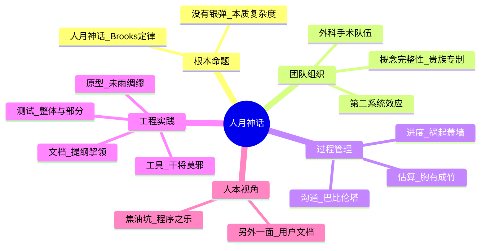

# 《人月神话》

**The Mythical Man-Month** · Frederick P. Brooks Jr.

《人月神话》不是一本讲编码技巧的书，而是一本讲“为什么软件项目会失控”的书。它的核心结论很直接：

```text
软件项目的主要困难不是写代码，而是沟通、协调、复杂度和变化管理。
```

这本书最著名的观点是：向延期的软件项目增加人手，只会让项目更加延期。因为新人需要培训，任务需要重新拆分，沟通路径会增加，原本就混乱的系统会更难协调。

### 逻辑关系导图



### 

## 适合谁读

- 项目经理、技术负责人、架构师。
- 经常参与排期、估算、交付的软件工程师。
- 正在经历项目延期、需求膨胀、沟通混乱的团队。
- 想理解软件工程管理经典问题的人。

## 阅读路线

1. 先读“人月神话”理解进度误区。
2. 再读“外科手术队伍”理解团队组织。
3. 再读“贵族专制、民主政治和系统设计”理解架构一致性。
4. 再读“没有银弹”理解复杂度本质。
5. 最后看二十年后的回顾，理解哪些观点仍然成立。

## 全书核心框架

| 主题 | 核心问题 | 书中的判断 |
| --- | --- | --- |
| 进度 | 为什么软件项目常延期 | 估算乐观、测试不足、沟通成本被低估 |
| 人力 | 加人能否加速 | 延期项目加人通常更慢 |
| 团队 | 大团队怎么组织 | 少数高手主导设计，小团队高效协作 |
| 架构 | 系统如何保持一致 | 概念完整性比功能堆砌更重要 |
| 复杂度 | 有没有万能技术 | 没有银弹，本质复杂度无法消除 |

## 各章节重点

### 第 1 章 焦油坑

软件开发像焦油坑，看起来能走，越挣扎越陷。单个程序可以由一个人写得很快，但系统产品需要文档、测试、接口、兼容、安装、维护和团队协作，成本会成倍增加。

核心：不要把“程序能跑”误认为“产品完成”。工程化的成本远高于编码本身。

### 第 2 章 人月神话

人月不是可以任意兑换的单位。一个人做 10 个月，不等于 10 个人做 1 个月。因为任务之间存在依赖，沟通成本会随着人数增加而增加。

核心：延期项目加人，常常会更延期。正确做法是缩小范围、调整目标、减少依赖、稳定接口，而不是简单堆人。

### 第 3 章 外科手术队伍

作者提出类似外科手术团队的组织方式：由一名主程序员负责核心设计和关键实现，其他角色提供工具、测试、文档、运维和支持。

核心：软件项目不一定需要平均主义式分工。复杂系统需要清晰技术主心骨和明确职责。

### 第 4 章 贵族专制、民主政治和系统设计

系统设计最重要的是概念完整性。一个系统应该像由一个头脑设计出来的，而不是多个团队各写一块再拼起来。

核心：架构一致性比“每个人都能表达自己的设计偏好”更重要。架构负责人需要对系统风格和边界有最终判断。

### 第 5 章 第二系统效应

人们在做第二个系统时，容易把第一个系统里没来得及实现的想法全部塞进去，导致过度设计和功能膨胀。

核心：升级、重构和新版本开发时，要警惕“这次顺便都做了”。第二版系统最容易因为野心过大而失控。

### 第 6 章 贯彻执行

好的设计必须被执行。架构文档、接口规范和约束如果没有沟通、检查和反馈机制，很快就会失效。

核心：设计不是写完文档就结束，必须通过评审、工具、测试和日常决策持续维护。

### 第 7 章 巴比伦塔为什么失败

大型工程失败常常不是因为缺少技术，而是因为沟通失败。团队需要共同语言、清晰接口、稳定文档和明确职责。

核心：沟通机制是项目基础设施。没有共享上下文，团队越大越容易各做各的。

### 第 8 章 胸有成竹

软件估算容易乐观。开发者常常低估测试、集成、调试、文档和返工时间。

核心：排期不能只估编码时间。大型软件项目应给设计、编码、单测、集成测试、系统测试和缓冲都留时间。

### 第 9 章 削足适履

系统资源有限，必须在功能、性能、存储、复杂度之间做取舍。优秀设计不是无限堆功能，而是在约束下保持清晰。

核心：约束会迫使设计变得简洁。没有取舍的系统最终会变得沉重。

### 第 10 章 提纲挈领

文档是沟通工具。项目需要明确目标、接口、数据结构、错误码、测试计划和发布说明。

核心：文档不是形式主义。恰当的文档能减少沟通成本，帮助新成员理解系统。

### 第 11 章 未雨绸缪

第一个版本往往会暴露很多认知错误。作者提出要准备扔掉一个原型，因为你最终会发现真正的问题是什么。

核心：原型可以帮助学习问题，但不要把试验性代码直接当成长期系统。

### 第 12 章 干将莫邪

高效团队需要好工具，包括编辑器、构建工具、调试工具、测试工具、版本管理和自动化脚本。

核心：工具会影响工程效率。重复、手工、易错的事情要自动化。

### 第 13 章 整体和局部

系统质量来自整体一致性和局部正确性的结合。模块单独正确，不代表组合后系统正确。

核心：单元测试不够，还需要集成测试、系统测试和真实场景验证。

### 第 14 章 祸起萧墙

项目灾难通常不是突然发生的，而是小问题不断累积。进度落后、缺陷堆积、接口不稳定都需要尽早暴露。

核心：项目管理要看趋势，不要只等最终节点。坏消息越早暴露越便宜。

### 第 15 章 另外一面

软件产品除了代码，还有用户手册、运维手册、测试说明、接口说明和迁移说明。

核心：真正交付的是可使用、可维护、可演进的产品，不是一堆源代码。

### 第 16 章 没有银弹

软件困难分为本质复杂度和偶然复杂度。工具、语言、框架可以减少偶然复杂度，但不能消除需求、领域模型、状态组合和业务变化带来的本质复杂度。

核心：没有任何技术能让软件生产力在短期内数量级提升。提升来自复用、抽象、领域理解、快速反馈和优秀人才。

### 第 17 章 再论没有银弹

作者回应对“没有银弹”的讨论，进一步强调软件工程的真正难点在于概念构建，而不是语法、工具或编码速度。

核心：最关键的能力是理解问题、划清边界、建立模型，而不是追逐单一工具。

### 第 18 章 人月神话的命题

本章回顾全书主要命题，包括进度、沟通、概念完整性、原型、工具、文档和测试。

核心：这些命题构成了软件工程管理的基本常识。

### 第 19 章 二十年后的人月神话

作者回看二十年后的软件行业，承认工具和方法有进步，但许多核心问题仍然存在。

核心：技术变了，软件复杂度、沟通成本和项目管理误区仍然存在。

## 现实项目中的启示

### 1. 延期后不要第一反应加人

先问：

- 哪些任务真正阻塞？
- 哪些范围可以砍掉？
- 哪些接口还不稳定？
- 哪些成员被会议和沟通拖住？
- 新人加入需要谁培训？

如果任务无法并行，加人只会制造更多同步成本。

### 2. 架构负责人要维护概念完整性

系统需要统一的命名、接口风格、错误处理、数据模型和部署规范。否则每个服务都有自己的风格，最后整体系统会变得难以理解。

### 3. 估算要把测试和集成算进去

真实排期至少包括：

```text
需求澄清
设计
编码
自测
联调
集成测试
修复缺陷
文档
发布
缓冲
```

只按编码时间排期，延期几乎是必然的。

### 4. 原型和生产代码要分清

原型的目标是验证想法，不是承载长期维护。把原型代码直接上线，后续往往会被技术债拖住。

## 半小时速记

| 问题 | 关键结论 |
| --- | --- |
| 为什么项目延期 | 估算乐观，测试和沟通成本被低估 |
| 加人能否解决延期 | 通常不能，可能更慢 |
| 架构最重要什么 | 概念完整性 |
| 大团队最大风险 | 沟通复杂度 |
| 技术能否消除复杂度 | 只能减少偶然复杂度，不能消除本质复杂度 |
| 管理上最重要什么 | 早暴露问题，持续校准计划 |

## 总结

《人月神话》的价值在于把软件项目失败的根因讲清楚：不是人不努力，而是估算、人力、沟通、架构一致性和复杂度管理出了问题。

半小时读这本书，至少要记住三句话：

```text
人月不可互换。
概念完整性是系统设计的核心。
没有银弹，真正困难的是本质复杂度。
```
