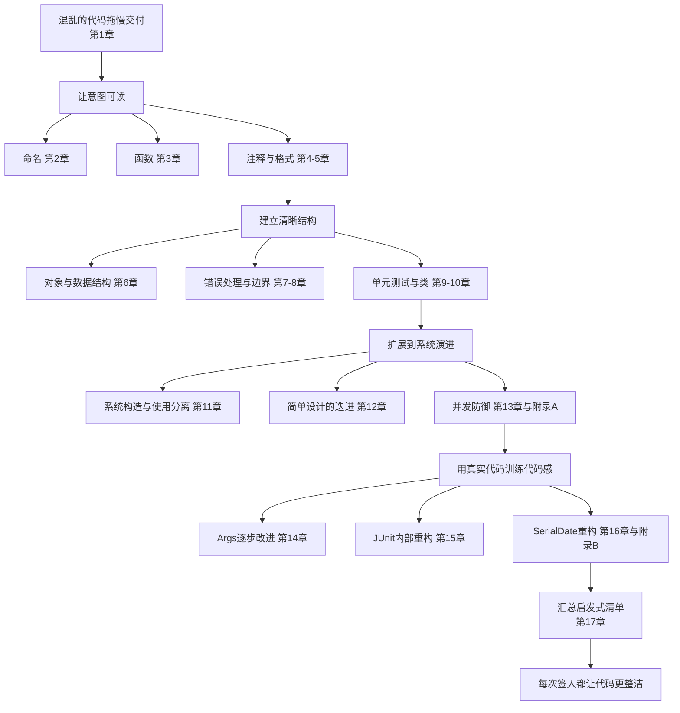

# 《代码整洁之道》深度阅读：从可读代码到可持续演进

> 本文的一手来源是 Robert C. Martin 著、韩磊译、人民邮电出版社 2010 年 1 月第 1 版《代码整洁之道》，ISBN `978-7-115-21687-8`。EPUB 没有稳定页码，引用位置统一标为章、节。原书英文版 *Clean Code: A Handbook of Agile Software Craftsmanship* 出版于 2008 年。本文没有用网络二手摘要替代原书。

## 阅读边界：这不是一部无条件适用的规范

作者在第 1 章把本书称为 Object Mentor 的“整洁代码派”说明，并明确承认“任何门派都并非绝对正确”，书中一些建议存在争议。因此，下文采用三种标记：

- **原书观点**：直接来自正文，给出章、节位置。
- **原书示例**：保留能说明规则的短代码；第 14 至 16 章的大段完整程序只分析重构过程，不整段转载。
- **现代补充**：结合当前 Java、测试与交付实践给出的延伸，不冒充作者原话。

这一区分很重要。比如“函数应当短小”是一条设计压力，不是“最多 20 行”的机械门槛；“每个测试一个断言”在书中也被称为一个流派的意见，作者随后把重点收敛为“每个测试只测试一个概念”（第 9 章 9.4）。

## 全书主旨：整洁是降低变更成本的工程纪律

### 官方定义与通俗解释

中文版“内容提要”这样概括全书：

> “本书提出一种观念：代码质量与其整洁度成正比。干净的代码，既在质量上较为可靠，也为后期维护、升级奠定了良好基础。”（内容提要）

第 1 章没有给出唯一、封闭的术语定义，而是邀请 Bjarne Stroustrup、Grady Booch、Dave Thomas、Michael Feathers、Ron Jeffries 和 Ward Cunningham 分别描述整洁代码。它们的交集是：

- 逻辑直接，意图可见，缺陷难以藏匿；
- 只做好一件事，依赖少而明确；
- 能被作者之外的人阅读、测试和修改；
- 没有重复，表达了设计思想，不过度制造实体；
- 显示出作者对细节的持续照料。

书中最凝练的一句来自 Bjarne Stroustrup：

> “整洁的代码只做好一件事。”（第 1 章 1.3.5）

通俗地说，整洁代码不是把程序写得“漂亮”，而是把后来者为了完成一次正确修改所需的猜测降到最低。机器能执行混乱的代码，人却必须先读懂周边代码才能修改它。作者根据编辑器回放观察指出，读代码与写代码所花时间的比例超过 `10:1`（第 1 章 1.5）。所以可读性并非与交付速度对立：阅读越省力，定位影响、完成修改和验证结果就越快。

### 它解决的真正问题：混乱会产生复利式成本

第 1 章描述的因果链不是“坏格式让人不舒服”，而是一个经济问题：赶期限时制造混乱，团队随后越来越多地在理解、绕过和修补旧混乱，生产力下降；管理层于是增加人手，新成员又难以理解系统，混乱继续放大。最终团队希望另起炉灶，但旧系统仍要维护，新系统也很难追上持续变化的需求。

作者由此提出一个看似反直觉的结论：

> “赶上期限的唯一方法——做得快的唯一方法——就是始终尽可能保持代码整洁。”（第 1 章 1.3.3）

这句话不应被误读为“先追求完美再交付”。第 3 章 3.12 明说，作者起初写出的函数也会冗长、嵌套且重复；他先用测试覆盖，再分解函数、改名、消除重复，并始终保持测试通过。整洁来自受保护的反复修改，而不是第一次输入就完美。

## 全书逻辑框架



前 13 章是规则与理由，第 14 至 16 章是慢速演示，第 17 章是索引式复盘。若只读规则而略过三个案例，会错过本书最重要的方法论：作者不是看到坏味道就重写，而是先建立测试事实，再做可回退的小步变换。

## 与相关方法的差异

| 比较维度 | 《代码整洁之道》 | 临时式“先跑起来” | 团队编码规范 / Formatter | Fowler 式重构 | 静态分析与质量门禁 | 《代码大全》式软件构建 |
| --- | --- | --- | --- | --- | --- | --- |
| 核心对象 | 每一行、函数、类到系统边界 | 当前功能是否工作 | 可自动统一的语法和版式 | 保持行为不变地改善设计 | 可检测的缺陷模式和度量 | 从设计、编码到测试调试的完整构建活动 |
| 主要目标 | 可读、可测、可修改，并持续变好 | 最短时间交付眼前结果 | 一致性与低争议 | 提供可复用的变换目录 | 自动阻断已知风险 | 系统化管理软件复杂度 |
| 反馈机制 | 测试 + 阅读体验 + 小步重构 | 运行结果或线上故障 | IDE、格式化器、Lint | 测试保护下的重构步骤 | CI 报告、阈值、规则集 | 核对表、评审、测试与度量 |
| 优势 | 把职业责任、代码表达和演进能力连成一体 | 初期快 | 成本低且可强制 | 变换精确、术语清晰 | 可规模化、可持续执行 | 范围全面、工程背景更完整 |
| 盲区 | 部分规则带强烈作者偏好，示例技术栈较旧 | 技术债快速累积 | 不能判断职责、抽象和领域含义 | 不直接定义“什么是值得追求的整洁” | 工具无法理解大部分业务意图 | 对具体代码阅读体验的聚焦较弱 |

它们不是互斥方案。Formatter 解决排版，静态分析发现可编码的风险，重构目录提供操作手法，《代码整洁之道》提供判断方向，自动化测试则让这些改变可持续。真正的优势来自组合，而不是把书中的启发式规则变成新的教条。

## 17 章与附录逐章提炼

| 章节 | 讨论对象 | 核心内容 | 书中给出的解决路径 |
| --- | --- | --- | --- |
| 前言 | 如何学习代码感 | 仅知道规则不足以写出整洁代码，必须阅读并推敲真实代码 | 阅读案例时亲自判断每次修改，训练“化劣为优”的能力 |
| 第 1 章 整洁代码 | 混乱的成本与整洁的定义 | 代码仍将长期存在；读多写少；整洁意味着专注、明确、可测、可改 | 承担代码质量的专业责任，实践童子军军规 |
| 第 2 章 有意义的命名 | 标识符如何传达意图 | 名称应名副其实、可读、可搜索，避免误导、编码、双关和无意义语境 | 用问题域与解决方案域词汇建立一致词典，发现更好名字就重命名 |
| 第 3 章 函数 | 最小行为单元 | 短小、只做一件事、同一抽象层级、少参数、无隐藏副作用；指令与询问分离 | 用测试保护，反复抽取、改名、消除重复；把错误处理抽离为独立职责 |
| 第 4 章 注释 | 代码与自然语言说明 | 注释会过期，不能美化坏代码；有价值的是意图、警示、法律信息和公共 API 文档 | 优先重命名和重构；保留无法由代码本身表达的“为什么” |
| 第 5 章 格式 | 源文件的阅读秩序 | 格式关乎沟通；报纸式自上而下阅读；相关概念靠近，调用者在被调用者之前 | 团队共同选定规则并自动执行，个人偏好服从一致性 |
| 第 6 章 对象和数据结构 | 行为抽象与数据暴露 | 对象隐藏数据、暴露行为；数据结构暴露数据；两者在扩展维度上呈反对称性 | 依据未来更可能新增“类型”还是“操作”选择模型，避免混杂体 |
| 第 7 章 错误处理 | 失败路径如何不污染主流程 | 异常优于散落的错误码；提供上下文；按调用者需求分类；避免返回或传入 `null` | 隔离 `try/catch`，包装第三方异常，使用特例对象或空集合维持常规流程 |
| 第 8 章 边界 | 第三方与未知系统 | 提供者追求通用，使用者追求专用，边界因此易泄漏和变化 | 包装第三方接口、写学习性测试、在未知 API 前先定义己方接口并用 Adapter 衔接 |
| 第 9 章 单元测试 | 测试代码质量 | 脏测试会让团队最终丢失重构能力；测试首要品质是可读 | 遵守 TDD 三定律，以构造-操作-检验组织测试，满足 FIRST，每个测试聚焦一个概念 |
| 第 10 章 类 | 更高层的代码组织 | 类应短小且只有一个修改理由；高内聚能显露可拆分的职责 | 按变化原因组织类，面向扩展开放、面向修改封闭 |
| 第 11 章 系统 | 从对象到系统架构 | 对象构造与业务使用混在一起会造成硬依赖；侵入式框架会淹没领域逻辑 | 分离启动过程，使用工厂或依赖注入；用 POJO 表达领域，以方面机制组合横切关注点 |
| 第 12 章 迭进 | 简单设计如何出现 | 简单设计按优先级要求：通过测试、消除重复、表达意图、减少实体 | 在测试反馈下递增式重构，不以“预先做大设计”或“拒绝设计”替代演进 |
| 第 13 章 并发编程 | 时序解耦的风险 | 并发能分离“做什么”和“何时做”，也引入共享数据、锁、关闭与偶发失败 | 分离并发职责，减少共享和临界区，理解执行模型，在多配置和负载下反复测试 |
| 第 14 章 逐步改进 | Args 参数解析器 | 两种新增参数类型就让最初简单实现腐化，展示渐进需求如何放大坏结构 | 先停下新增功能，在全套测试保护下逐步抽象 `ArgumentMarshaler` 层次 |
| 第 15 章 JUnit 内幕 | `ComparisonCompactor` | 即使优秀代码也能通过命名、职责拆分和重复消除继续改善 | 保持 JUnit 测试通过，逐项改名、抽取方法、统一 expected/actual 处理 |
| 第 16 章 重构 SerialDate | 第三方日期类 | 先发现测试不足和真实缺陷，再处理命名、常量、枚举、职责与依赖 | 先让它工作，再让它正确；提升覆盖率后逐次重构并持续运行测试 |
| 第 17 章 味道与启发 | 规则索引 | 汇总注释、环境、函数、一般问题、Java、命名、测试七类启发式规则 | 把清单用于评审和复盘，但判断仍依赖上下文与代码感 |
| 附录 A 并发编程 II | 并发机制细节 | 客户端/服务端吞吐量、死锁条件、线程安全库和测试装置 | 量化吞吐瓶颈，破坏死锁条件，尽量使用已验证的并发库 |
| 附录 B `SerialDate` | 重构前完整源码 | 为第 16 章提供可核对的原始材料 | 让读者对照修改前后的真实代码，而非只接受结论 |

## 按软件生命周期重组书中技术点

章节顺序适合线性阅读，项目实践却是循环。下面按“理解需求与旧代码 → 表达意图 → 建模 → 处理失败和外部依赖 → 建立反馈 → 组织系统 → 并发运行 → 持续演进”的顺序重组。

### 第一阶段：接手需求或旧代码，先建立阅读与变更模型

#### 背景与作用

开发者很少在空白文件上工作。一次新需求通常从查入口、追调用、读测试、理解数据和边界开始。第 1 章“读写比超过 `10:1`”的观察解释了为什么局部可读性会影响整个交付周期。

“童子军军规”给出了控制代码腐化的最小闭环：

> “让营地比你来时更干净。”（第 1 章 1.6）

它的应用场景不是专门安排一次“大重构”，而是每次正常改动：修正一个误导名称、拆开一个嵌套条件、删掉一点重复、补一条能固定行为的测试。小步的优势在于修改与业务上下文同时发生，开发者此时最了解代码，也最容易验证。

#### 一次变更的推荐顺序


这里的测试不是为了追求覆盖率数字，而是把“我认为它现在怎样工作”变成可执行事实。对没有测试的遗留代码，应优先找接缝：公开接口、数据库适配器、HTTP 边界或可替换依赖，再从待改行为周围建立 characterization test（特征测试）。这是 Michael Feathers 在遗留代码方法中的常用概念，也是第 14 至 16 章实际采用的思想。

#### 术语

- **Code sense（代码感）**：看出代码优劣、发现可替代结构并安排安全修改步骤的能力；不是单条规则的记忆。
- **Boy Scout Rule（童子军军规）**：每次接触代码都做一个与当前工作邻近的小改善。
- **Characterization Test（特征测试）**：先记录既有系统实际行为，不先判断该行为是否理想；用于保护遗留代码修改。
- **Technical Debt（技术债）**：为短期收益选择较差设计而留下的未来成本。并非所有不完美都叫技术债，关键是是否形成持续利息。

#### 局限与纠偏

随手清理也会扩大范围。若改名会影响公共协议、序列化字段或跨仓库消费者，就不能把它当纯局部重构。安全做法是区分“内部结构变换”和“外部契约变化”，前者随当前提交处理，后者单独评估兼容策略。

一句话概括：先把行为钉住，再小步改善；不要借“整洁”之名顺手重写整片系统。

### 第二阶段：用名称、函数、注释和格式表达意图

#### 命名：让读者不用脑内翻译

第 2 章要求名称回答三个问题：为什么存在、做什么、怎样使用。原书先给出：

```java
int d; // 消逝的时间，以日计
```

再建议用名称直接表达：

```java
int elapsedTimeInDays;
int daysSinceCreation;
int daysSinceModification;
```

这不是“变量名越长越好”。书中同时反对添加无用语境，例如在 `GasStationDeluxe` 应用的每个类前都加 `GSD`，因为前缀增加噪声，却没有增加区分所需的信息（第 2 章 2.17）。

具体做法如下：

- 同一概念选择同一词汇，不在 `fetch`、`retrieve`、`get` 之间随意切换；不同概念也不要用同一个词硬凑。
- 类名和对象名使用名词或名词短语；方法名使用动词或动词短语。
- 优先选择能搜索的业务词，避免单字母、魔术数和自造缩写。
- 解决方案域术语如 `AccountVisitor`、`JobQueue` 可直接让程序员识别模式；没有合适技术术语时，使用问题域语言与业务人员对齐。
- 名称是可修改的设计，不是一次性决定。第 2 章结尾明确鼓励使用重构工具持续改名。

#### 函数：保持同一抽象层级

“只做一件事”容易变成循环定义。第 3 章给出的可操作判断是：函数内的语句是否都处在函数名所描述的同一抽象层级，是否还能抽出一个不只是重述实现步骤的有意义函数。

原书用下面的例子说明 Command-Query Separation：

```java
if (attributeExists("username")) {
    setAttribute("username", "unclebob");
}
```

它比 `if (set("username", "unclebob"))` 清楚，因为后者让读者猜 `set` 的布尔返回值究竟表示“设置成功”还是“此前存在”（第 3 章 3.8）。

参数规则的理由也是降低理解成本：一元函数通常容易形成“转换”或“事件”模型；二元函数在两个参数天然成对时合理，例如 `new Point(0, 0)`；布尔标识参数往往宣告一个函数内部有两条职责。参数很多时，可将有内在关系的值提升为参数对象，而不是为了数字好看随意打包。

原书对函数的写法并不神秘：

> “我写函数时，一开始都冗长而复杂……不过我会配上一套单元测试，覆盖每行丑陋的代码。然后我打磨这些代码，分解函数、修改名称、消除重复。”（第 3 章 3.12）

#### 注释：解释代码不能表达的原因

第 4 章最著名也最容易被误用的观点是：

> “注释的恰当用法是弥补我们在用代码表达意图时遭遇的失败。”（第 4 章开篇）

作者不是要求删除全部注释。他认可法律信息、意图解释、结果阐释、警示、短期 `TODO`、强调某个易被忽略的决定，以及公共 API 的 Javadoc。反对的是重复代码、记录修改历史、署名、位置标记、被注释掉的代码，以及与实现漂移的说明。

```java
// 现代补充：解释“为什么”，不是复述下一行“做什么”。
// 旧终端只接受 24 字节 ASCII 标识；协议升级完成前不能改用 UUID 文本。
String wireId = legacyIdEncoder.encode(deviceId);
```

#### 格式：把源文件组织成可扫描的文章

第 5 章用报纸比喻垂直结构：顶部给出高层概念和算法，细节向下展开；相关代码靠近，不同概念用空行分隔；调用者尽量在被调用者之前。团队共同规则高于个人喜好。

现代工程应把能机械化的部分交给工具，例如 Spotless、google-java-format、Prettier 或语言自带格式化器。这样评审才集中在职责、名称、边界和业务正确性，而不是空格。

#### 术语

- **Intention-Revealing Name（揭示意图的名称）**：读者无需查看实现或注释就能理解标识符的目的。
- **Mental Mapping（思维映射）**：读者不得不在脑中把 `r` 翻译成 `urlWithoutProtocol`；这是额外认知负担。
- **Hungarian Notation（匈牙利命名法）**：在名称中编码类型或范围，如 `strName`、`m_count`。现代强类型语言和 IDE 通常已让它失去价值。
- **Command-Query Separation，CQS（命令查询分离）**：方法要么改变状态，要么返回信息，尽量不同时承担两者。
- **Side Effect（副作用）**：函数除公开承诺外还修改状态、时间、I/O 或外部系统；隐藏副作用最危险。
- **Javadoc**：Java 的 API 文档注释格式，可由工具生成文档；它不应只是复述方法签名。
- **TODO**：尚待完成工作的可搜索标记，应关联任务并定期清理，不能成为永久借口。

#### 现代适用边界

函数短小、少参数和不用注释都是启发式压力，不是质量计分公式。过度抽取会造成“跳转式阅读”，过长全称会淹没关键区别，公共 API、并发不变量、安全原因和性能权衡往往必须写文档。判断标准仍是：读者能否在局部建立正确模型，并安全修改。

一句话概括：名称负责词汇，函数负责句子，文件结构负责篇章，注释只补代码表达不了的上下文。

### 第三阶段：选择对象、数据结构与类的边界

#### 对象与数据结构不是高低之分

第 6 章的关键不是“getter/setter 不整洁”，而是数据抽象。仅把变量设为私有再机械提供访问器，仍然暴露了实现。对象应该暴露行为，让调用者不必知道数据表示。

书中指出两种设计在扩展方向上呈反对称性：

| 变化方向 | 对象式设计 | 数据结构 + 过程式设计 |
| --- | --- | --- |
| 新增一种类型 | 通常新增类即可，既有多态操作不变 | 所有处理函数往往要增加分支 |
| 新增一种操作 | 可能要修改每个具体对象 | 可以增加一个处理既有数据结构的新函数 |
| 数据可见性 | 隐藏表示，暴露行为 | 暴露数据，行为较少 |
| 适合场景 | 领域行为稳定、类型持续增长 | 数据类型稳定、分析与转换操作持续增长 |

因此 DTO 并非坏对象。原书明确承认 DTO（Data Transfer Object，数据传送对象）是有用的数据结构；问题在于把 Active Record 一边当表记录暴露数据，一边又塞入复杂业务规则，形成对象与数据结构的混杂体（第 6 章 6.4）。

#### 得墨忒耳律与“火车失事”

原书用连续调用说明结构泄漏：

```java
String outputDir = ctxt.getOptions().getScratchDir().getAbsolutePath();
```

问题不在点号数量本身，而在调用者是否知道了 `ctxt` 内部对象图。若这些返回值都是纯数据结构，链式读取未必违反封装；若它们是对象，这段代码让调用者依赖多个陌生对象。书中的改进方向是让承担职责的对象直接提供所需行为，例如由上下文创建临时输出流，而不是把内部目录结构交给调用者操纵。

#### 类：按修改理由而不是行数拆分

第 10 章把 SRP 定义为：

> “类或模块应有且只有一条加以修改的理由。”（第 10 章 10.2.1）

“理由”指来自不同角色或业务轴的变化，不等于“只能有一个方法”。内聚性提供了发现边界的线索：若一组方法只使用一部分字段，另一组方法使用另一部分字段，类中可能藏着两个职责。书中的 `Sql` 案例把不同 SQL 语句的生成逻辑拆到独立类中，使添加 `UpdateSql` 无需修改现有语句类，体现 OCP。

```java
// 现代补充：按变化原因分开领域决策与传输格式。
final class Invoice {
    Money totalFor(Customer customer) { /* 计价规则 */ }
}

final class InvoiceJsonWriter {
    String write(Invoice invoice) { /* JSON 格式 */ }
}
```

计价政策与 JSON 协议由不同原因、不同角色推动变化，把它们放在一个类里才是 SRP 风险。

#### 术语

- **Data Abstraction（数据抽象）**：暴露数据的本质操作，而不是暴露具体表示。
- **DTO（Data Transfer Object，数据传送对象）**：跨层或跨进程搬运数据的结构，通常没有复杂业务行为。
- **Active Record（活动记录）**：对象直接对应持久化记录，并提供 `save`、`find` 等数据访问方法。
- **Law of Demeter，LoD（得墨忒耳律）**：模块不应了解被操作对象的内部结构；常被简述为“只与直接朋友交谈”。
- **SRP（Single Responsibility Principle，单一职责原则）**：模块只对一个变化来源负责。
- **OCP（Open-Closed Principle，开放-闭合原则）**：对扩展开放，对修改封闭。
- **Cohesion（内聚）**：一个模块内部的数据与行为共同服务同一目的的程度。
- **Coupling（耦合）**：模块对其他模块细节的依赖程度。

#### 局限与纠偏

以“只有一个修改理由”为口号可能制造大量一行类。第 12 章把“尽可能少的类和方法”列为简单设计第四条，并强调它的优先级低于测试、去重复和表达力。不要为尚不存在的变化预建抽象；当变化真实出现、职责线索明确时再拆分。

一句话概括：对象保护行为背后的数据，数据结构支持开放的处理；类边界应跟随真实变化轴。

### 第四阶段：隔离错误路径与系统边界

#### 错误处理：让主流程仍然像主流程

第 7 章先展示错误码如何让设备关闭逻辑陷入多层判断，再用异常把“关闭设备”和“记录关闭失败”分开。核心不是“异常永远优于返回值”，而是失败表达不能淹没正常业务。

原书建议根据调用者如何处理来定义异常，而不是机械按底层来源分类。`ACMEPort` 可能抛出三种厂商异常，但业务调用者对它们都只会记录并报告端口失败，于是可以由本地包装器翻译成一个 `PortDeviceFailure`：

```java
public void open() {
    try {
        innerPort.open();
    } catch (DeviceResponseException
             | ATM1212UnlockedException
             | GMXError e) {
        throw new PortDeviceFailure(e);
    }
}
```

上例保持了原书的包装思想，语法合并为现代 Java 的 multi-catch。异常还应携带失败操作、业务标识和原因链，而不是只有“error”。

对预期的“没有结果”，异常可能反而打断常规流程。第 7 章用 Special Case Pattern 让 `PerDiemMealExpenses` 表示“没有餐费记录时采用每日补贴”；对集合则返回 `Collections.emptyList()`，避免每个调用者判空。

#### 现代空值处理

```java
// 现代补充：唯一结果可能不存在时，用类型表达；集合则返回空集合。
Optional<Device> findDevice(DeviceId id);
List<Device> findOnlineDevices();
```

`Optional` 不是所有 `null` 的万能替代品。它适合作为可能缺失的返回值；在 Java 中通常不建议把它滥用于字段、集合元素或每个方法参数。可空注解、静态分析以及 Kotlin 等带空安全类型的语言，能比运行时约定更早暴露问题。

#### 边界：依赖自己控制的接口

第 8 章指出，第三方库提供者追求普适接口，应用使用者只需要特定能力。将 `Map` 或 SDK 类型穿透整个系统，会让调用者获得不该有的操作，并把升级影响扩散到每一层。书中的 `Sensors` 包装类只暴露 `getById` 等领域所需行为，把 `Map` 留在边界内部。

学习性测试（learning test）同时解决两个问题：用小实验精确学习 API；第三方升级时重新运行，验证团队依赖的行为是否改变。对于尚未完成的外部系统，书中主张先按己方需要定义 `Transmitter` 接口，待真实 API 出现后编写 `TransmitterAdapter`。

```java
// 现代补充：领域代码只认识自己定义的端口。
interface PaymentGateway {
    Receipt charge(OrderId orderId, Money amount);
}

final class AcmePaymentAdapter implements PaymentGateway {
    private final AcmeClient client;

    @Override
    public Receipt charge(OrderId orderId, Money amount) {
        try {
            return map(client.createCharge(orderId.value(), amount.cents()));
        } catch (AcmeTimeout e) {
            throw new PaymentUnavailable(orderId, e);
        }
    }
}
```

这个适配器同时完成类型转换、异常翻译和供应商隔离。集成测试只需固定本系统真正依赖的契约，而不是复测第三方全部功能。

#### 术语

- **Checked Exception（受检异常）**：Java 编译器要求捕获或在签名声明的异常。原书认为一般应用中其依赖成本常高于收益，但承认关键库场景可能有价值。
- **Unchecked Exception（非受检异常）**：`RuntimeException` 及其子类，编译器不强制声明。
- **Special Case Pattern（特例模式）**：用遵守同一接口的对象表示边界情况，让调用者继续走常规流程。
- **Null Object（空对象）**：特例模式的一种，以无害默认行为替代 `null`。
- **Adapter（适配器）**：把一个接口转换为客户端期望的接口，并集中隔离变化。
- **Learning Test（学习性测试）**：针对实际使用方式编写的第三方 API 实验性测试。
- **API（Application Programming Interface，应用程序编程接口）**：模块对外承诺的可调用契约。

#### 局限与纠偏

原书“使用不可控异常”是 Java 语境中的立场，不适用于所有语言和所有失败。网络超时、输入校验、资源不存在等可恢复结果，可用显式结果类型、领域错误或 HTTP 状态建模；程序不变量被破坏则更适合快速失败。Java `assert` 默认可能关闭，不能代替公共 API 参数校验。日志也应在知道如何处理的边界记录一次，避免每层重复记录同一异常。

一句话概括：在内部保持主流程清楚，在边界把外部类型、失败语义和升级风险翻译成本系统语言。

### 第五阶段：用整洁测试建立快速反馈

#### TDD 三定律与真正目的

第 9 章给出的 TDD（Test-Driven Development，测试驱动开发）三定律是：

1. 在编写不能通过的单元测试前，不可编写生产代码。
2. 只可编写刚好无法通过的单元测试，不能编译也算不通过。
3. 只可编写刚好足以通过当前失败测试的生产代码。

严格按秒级循环实践并非每个团队都适用，但它表达了一个关键约束：测试与生产代码同步演进，反馈距离极短。书中更深的论点是，测试让修改变得可能；没有可靠测试，即使架构良好，团队也会害怕清理代码。

#### 测试也要可读

原书把整洁测试的首要要素重复三次：“可读性，可读性和可读性”（第 9 章 9.3）。测试应隐藏无关搭建细节，让名称、数据与断言直接讲出行为。

```java
// 现代补充：JUnit 5 + AssertJ，测试一个行为，可包含完成该行为所需的多个检查。
@Test
void paidOrderCannotBeCancelled() {
    Order order = paidOrder();

    assertThatThrownBy(order::cancel)
        .isInstanceOf(IllegalStateException.class)
        .hasMessage("Paid order cannot be cancelled");
}
```

这里有两个断言链条件，但只有一个概念：已支付订单拒绝取消，并给出明确原因。这更符合本章最终主张，而不是机械计数 `assert` 调用。

FIRST 原则是测试设计的记忆法：

- **Fast**：快速，开发者能频繁运行。
- **Independent**：独立，不依赖执行顺序或其他测试留下的状态。
- **Repeatable**：可重复，在不同环境得到相同结论。
- **Self-Validating**：自足验证，明确通过或失败，无需人工读日志。
- **Timely**：及时，在生产代码之前或同时编写。

第 9 章还提出测试专用 DSL：把反复的构造和断言细节收进测试 API，使测试读起来像领域规则。这些 API 不是一开始设计完毕，而是在测试重构中逐渐演进。

#### 术语

- **TDD（Test-Driven Development，测试驱动开发）**：以失败测试、最小实现、重构组成短循环的开发方式。
- **Unit Test（单元测试）**：快速验证一个可隔离行为的自动化测试；“单元”更适合理解为行为边界，而非固定等于一个方法。
- **Test Double（测试替身）**：测试中替代真实依赖的对象总称，包含 fake、stub、spy、mock。
- **DSL（Domain-Specific Language，领域特定语言）**：针对特定问题域设计的表达方式；测试辅助 API 可以形成内部 DSL。
- **Arrange-Act-Assert，AAA（准备-执行-断言）**：与书中的 Build-Operate-Check 类似的测试结构。
- **Coverage（覆盖率）**：测试执行到代码元素的比例；它能指出未触达区域，不能证明断言有效或业务完整。

#### 局限与纠偏

快、独立的单元测试不能替代契约测试、集成测试、端到端测试和生产观测。过度 mock 会让测试验证实现细节，重构反而频繁破坏测试。合理组合是：大量快速领域测试，少量边界集成测试，关键链路端到端测试；覆盖率用于发现盲区，不作为质量代理。

一句话概括：测试不是交付后的检查表，而是让代码敢于继续变化的设计基础设施。

### 第六阶段：从类扩展到可演进系统

#### 分离构造与使用

第 11 章把系统比作城市：个人不可能理解全部细节，城市仍能依靠恰当抽象和职责分工运作。软件中的关键分界是对象“怎样被创建”和对象“怎样完成业务”。若业务对象内部直接 `new` 一个重型服务，编译、测试和替换都会依赖具体实现。

原书给出三种方式：

- 把全部构造移动到 `main` 或启动模块，业务对象只接收已准备好的依赖；
- 当创建时机属于业务流程时，使用 Abstract Factory 隔离具体构造；
- 使用 Dependency Injection（依赖注入），由容器或组装代码提供依赖。

```java
// 现代补充：构造器注入使依赖显式且可测试。
final class CheckoutService {
    private final PaymentGateway payments;
    private final OrderRepository orders;

    CheckoutService(PaymentGateway payments, OrderRepository orders) {
        this.payments = payments;
        this.orders = orders;
    }
}
```

业务类没有查找全局容器，也没有决定供应商实现。启动层可以在生产环境组装真实适配器，在测试中传入 fake。

#### POJO、AOP 与横切关注点

第 11 章批评侵入式架构把领域对象绑在框架接口上。作者倾向用 POJO 表达领域，再用 Java Proxy、纯 Java AOP 或 AspectJ 组合持久化、事务、安全等横切关注点。这里的长期价值不是某个 2008 年框架配置，而是原则：领域政策不应被技术基础设施淹没。

现代框架的注解虽然比早期 EJB 轻，但大量 `@Transactional`、ORM 懒加载、HTTP 类型和消息注解仍可能形成隐式耦合。对简单 CRUD 应用不必强行分层；对核心规则复杂、外部边界多的系统，保持领域层为普通对象更有收益。

#### 延迟不可逆决策

作者主张系统可以递增成长，并在最后责任时刻做不可逆决定，但前提是关注面分离、测试充分。它不是拒绝架构：书中明确说最佳系统架构由模块化关注面组成，各模块可用 POJO 实现，并由方面或类似工具以非侵入方式集成（第 11 章 11.7）。

#### 术语

- **DI（Dependency Injection，依赖注入）**：对象从外部获得依赖，不自行创建或通过全局定位器查找。
- **DIP（Dependency Inversion Principle，依赖倒置原则）**：高层政策与低层细节都依赖抽象，抽象不依赖细节。
- **POJO（Plain Old Java Object，普通 Java 对象）**：不被特定框架基类或接口侵入的普通对象。
- **AOP（Aspect-Oriented Programming，面向方面编程）**：模块化日志、事务、安全等横切关注点的技术。
- **Abstract Factory（抽象工厂）**：通过抽象接口创建一组相关对象，隔离具体类型。
- **Service Locator（服务定位器）**：对象主动向全局注册表查依赖；它隐藏依赖，通常不如构造器注入透明。

#### 局限与纠偏

过度分层会产生只有转发的接口和适配器。第 12 章提醒要尽可能减少类和方法，且这条规则用于抑制教条。边界稳定、替换与独立测试确有价值时再抽象；仅有一个简单实现、没有变化压力时，直接依赖清晰的具体类可能更诚实。

一句话概括：启动层负责把系统装起来，领域层负责说明系统做什么，基础设施留在边界。

### 第七阶段：并发运行时，先减少共享再谈锁

#### 背景与作用

第 13 章给并发的定义非常准确：

> “并发是一种解耦策略。它帮助我们把做什么（目的）和何时（时机）做分解开。”（第 13 章 13.1）

并发可以改善吞吐量和响应性，也可能让结构从一个大循环变成多个协作任务。但作者马上拆除两个迷思：并发不总能提升性能，设计通常也不会保持不变。正确并发很复杂，缺陷很少复现，且经常迫使系统重新划分职责。

#### 防御性方法

1. 把并发调度与领域工作分离，让领域逻辑能在线程外作为 POJO 测试。
2. 限制共享数据作用域，找出所有可能更新共享状态的代码。
3. 能复制就不共享；能用不可变值就不用可变共享对象。
4. 让每个线程或任务尽可能独立，从不共享的来源接收完整请求数据。
5. 理解生产者-消费者、读者-作者、哲学家就餐等执行模型及其终止条件。
6. 保持临界区正确且小，但不要为了“锁小”把同一不变量拆到多个不同锁中。
7. 把优雅关闭当独立功能设计，验证队列耗尽、取消、超时和资源释放。
8. 在不同处理器数量、平台、负载和随机调度条件下重复测试，不忽略偶发失败。

```java
// 现代补充：不可变消息 + ExecutorService，任务不共享可变请求状态。
record ResizeJob(Path source, Path target, int width) {}

try (var executor = Executors.newVirtualThreadPerTaskExecutor()) {
    for (ResizeJob job : jobs) {
        executor.submit(() -> imageResizer.resize(job));
    }
}
```

Java 21 起虚拟线程已正式可用，它降低了大量阻塞任务的线程成本，但不会消除数据竞争、死锁或不正确的共享状态。吞吐量仍受数据库连接、远程服务配额和 CPU 等瓶颈限制。

#### 术语

- **Concurrency（并发）**：多个任务在重叠时间内推进，强调结构与协调；不保证同一时刻真正同时执行。
- **Parallelism（并行）**：多个任务在多个计算资源上同一时刻执行。
- **Race Condition（竞态条件）**：结果依赖不可控的执行交错顺序。
- **Critical Section（临界区）**：访问共享可变状态、必须满足互斥或原子性要求的代码区域。
- **Deadlock（死锁）**：任务互相等待对方持有的资源而永久停滞。
- **Starvation（饥饿）**：任务长期得不到执行机会或资源。
- **Immutability（不可变性）**：对象创建后状态不再改变，是减少共享状态风险的重要策略。
- **Virtual Thread（虚拟线程）**：由 JVM 调度的轻量线程，适合高并发阻塞 I/O，不等同于更快的 CPU 并行。

#### 旧版变化与局限

原书讨论 Java 5 时代的 `synchronized`、`wait`、`yield` 和线程池，并建议插入调度扰动来暴露问题。今天应优先使用 `java.util.concurrent` 的高层构件、不可变数据、结构化任务边界，以及压力测试和专用并发测试工具。依靠 `sleep` 让测试“碰巧复现”既慢又不稳定；时间与执行器应可注入，测试应有明确超时和完成条件。

一句话概括：并发整洁的第一原则不是把锁写得漂亮，而是让尽可能多的代码根本无需共享和加锁。

### 第八阶段：在测试保护下逐步重构

第 14 至 16 章共同构成一本微型重构实录，顺序始终是“建立事实 → 一次变换 → 测试 → 再变换”。

#### Args：在功能扩张压垮结构时暂停

第 14 章的 Args 参数解析器最初只处理布尔参数，结构简单；增加字符串和整数后，相似变量、解析分支和错误处理迅速复制。作者指出，仅新增两种参数类型，就让可维护代码变成缺陷密集的混乱。

关键动作不是立即推倒重来，而是“暂停”：保留能够工作的版本和测试，逐步引入 `ArgumentMarshaler` 抽象，让每种参数类型负责解析、取值和错误语义。期间作者允许一度出现比原代码更难看的过渡结构，只要每一步可验证，并继续向目标移动。

这说明重构不是每一步都让局部代码更美；它是穿越受控中间态，最终让新增参数类型成为局部扩展。

#### JUnit：优秀代码也可以继续整理

第 15 章检查 JUnit 的 `ComparisonCompactor`。原模块已经有完整测试和清楚职责，作者仍依据童子军军规做小改进：去掉成员前缀 `f`，把含糊名称改为 `expected`、`actual`、`contextLength`，封装边界计算，消除 expected/actual 两条路径中的重复，并持续运行原测试。

这一章的重要性在于克制：没有改公共行为，没有换算法，没有为了展示技巧重写模块。重构幅度由现有测试和明确坏味道决定。

#### SerialDate：先让它工作，再让它正确

第 16 章面对的是更大的第三方日期类。作者先运行并补充测试，发现失败和边界缺陷；把覆盖率提高后，才开始改名、移动常量、以枚举替代整数常量、缩小作用域、删除无用代码、理顺职责，并把 `SerialDate` 改成更符合实际含义的 `DayDate`。

其中一个短小的原书重构示例，用解释性变量表达闰年规则：

```java
public static boolean isLeapYear(int year) {
    boolean fourth = year % 4 == 0;
    boolean hundredth = year % 100 == 0;
    boolean fourHundredth = year % 400 == 0;
    return fourth && (!hundredth || fourHundredth);
}
```

它没有减少运算，却把规则拆成可命名的事实。第 17 章 G19 随后把“使用解释性变量”归纳为通用启发。

#### 三个案例共同证明什么

| 案例 | 初始状态 | 首要风险 | 安全支点 | 最终经验 |
| --- | --- | --- | --- | --- |
| Args | 自己写的小程序随需求腐化 | 新类型导致分支与状态复制 | 既有单元测试 | 发现结构失控时暂停功能堆叠，让多态承担变化 |
| JUnit | 别人写的优质小模块 | 过度修改成熟代码 | 完整测试与明确行为 | 只做有证据的小改善，优秀代码也履行童子军军规 |
| SerialDate | 较大的第三方遗留类 | 测试不足、真实缺陷与职责混杂 | 先补测试和覆盖率 | 正确性先于美化，重构中同时澄清领域模型 |

#### 术语

- **Refactoring（重构）**：在不改变可观察行为的前提下改善内部结构。
- **Code Smell（代码坏味道）**：提示设计可能有问题的表面征兆，不等于已经证明的缺陷。
- **DRY（Don't Repeat Yourself，不要重复自己）**：一个知识或决策在系统中应有权威表达；不只是删除外观相同的代码。
- **Extract Method（提炼函数）**：把一段具有独立意图的代码提取并命名。
- **Polymorphism（多态）**：通过统一接口让不同类型提供各自行为，减少按类型分支。
- **Regression（回归）**：修改使原本正确的行为失效。

#### 局限与解决方案

测试全绿并不证明重构绝对保持语义：测试可能漏掉行为，性能、线程安全、日志和序列化兼容也可能是外部契约。高风险重构还应结合契约测试、基准测试、静态分析、灰度发布与生产指标。若预期行为本身错误，就先用失败测试说明新需求，再把“行为变更”和“结构重构”拆成易审查的步骤。

一句话概括：重构的速度来自反馈闭环，而不是一次改动的规模。

## 第 17 章坏味道清单的正确用法

第 17 章把全书经验整理为 66 条一般启发和若干 Java、命名、测试规则。它适合做评审提示，但不适合做扣分表。可以按问题类型压缩为以下检查：

| 检查面 | 典型信号 | 追问 |
| --- | --- | --- |
| 注释 | 过时、复述、被注释代码、日志式历史 | 能否用名称、类型、测试或版本控制取代？ |
| 环境 | 构建需要多步人工操作，测试难以一条命令运行 | 新成员能否从干净环境复现？ |
| 函数 | 参数太多、布尔选择器、隐藏时序、从不调用 | 是否混合职责或抽象层级？ |
| 一般设计 | 重复、边界条件散落、基类依赖派生类、职责位置错误 | 哪个知识缺少唯一权威位置？ |
| Java | 通配导入、继承常量、使用整数代替枚举 | 类型系统能否表达更多约束？ |
| 名称 | 描述层级错误、含糊、无上下文、编码 | 名称是否让调用点形成一句准确的话？ |
| 测试 | 不足、被忽略、边界未覆盖、运行缓慢 | 测试能否在改动后立即提供可信反馈？ |

同一现象在不同上下文含义不同。例如重复两行可能只是偶合，相似代码未来沿不同方向变化，贸然抽象反而制造耦合。评审时应先说明风险和变化场景，再建议重构手法。

## 一个可直接运行的现代 Java 练习环境

原书没有集中讲环境搭建，示例来自 Java 5/6 时代的 FitNesse、JUnit、Args 和 SerialDate。下面用 Java 21 LTS + Maven + JUnit 5 搭建一个稳定练习环境；如果团队已验证 Java 25 LTS，也可把 `release` 改为 `25`。

### 1. 安装并确认工具

安装 JDK 21 和 Maven 3.9 或更高版本，然后验证：

```bash
java -version
javac -version
mvn -version
```

三条命令应指向同一 JDK 主版本。Windows 上设置 `JAVA_HOME` 后需要重新打开终端。

### 2. 创建项目结构

```text
clean-code-lab/
├─ pom.xml
└─ src/
   ├─ main/java/example/Order.java
   └─ test/java/example/OrderTest.java
```

### 3. 配置 Maven

```xml
<?xml version="1.0" encoding="UTF-8"?>
<project xmlns="http://maven.apache.org/POM/4.0.0"
         xmlns:xsi="http://www.w3.org/2001/XMLSchema-instance"
         xsi:schemaLocation="http://maven.apache.org/POM/4.0.0 https://maven.apache.org/xsd/maven-4.0.0.xsd">
  <modelVersion>4.0.0</modelVersion>
  <groupId>example</groupId>
  <artifactId>clean-code-lab</artifactId>
  <version>1.0-SNAPSHOT</version>

  <properties>
    <maven.compiler.release>21</maven.compiler.release>
    <project.build.sourceEncoding>UTF-8</project.build.sourceEncoding>
    <junit.version>5.12.2</junit.version>
  </properties>

  <dependencies>
    <dependency>
      <groupId>org.junit.jupiter</groupId>
      <artifactId>junit-jupiter</artifactId>
      <version>${junit.version}</version>
      <scope>test</scope>
    </dependency>
    <dependency>
      <groupId>org.assertj</groupId>
      <artifactId>assertj-core</artifactId>
      <version>3.27.3</version>
      <scope>test</scope>
    </dependency>
  </dependencies>

  <build>
    <plugins>
      <plugin>
        <groupId>org.apache.maven.plugins</groupId>
        <artifactId>maven-surefire-plugin</artifactId>
        <version>3.5.3</version>
      </plugin>
      <plugin>
        <groupId>org.jacoco</groupId>
        <artifactId>jacoco-maven-plugin</artifactId>
        <version>0.8.13</version>
        <executions>
          <execution>
            <goals><goal>prepare-agent</goal></goals>
          </execution>
          <execution>
            <id>report</id>
            <phase>test</phase>
            <goals><goal>report</goal></goals>
          </execution>
        </executions>
      </plugin>
    </plugins>
  </build>
</project>
```

### 4. 写最小领域代码和测试

```java
// src/main/java/example/Order.java
package example;

public final class Order {
    enum Status { CREATED, PAID, CANCELLED }

    private Status status = Status.CREATED;

    public void pay() {
        status = Status.PAID;
    }

    public void cancel() {
        if (status == Status.PAID) {
            throw new IllegalStateException("Paid order cannot be cancelled");
        }
        status = Status.CANCELLED;
    }
}
```

```java
// src/test/java/example/OrderTest.java
package example;

import org.junit.jupiter.api.Test;

import static org.assertj.core.api.Assertions.assertThatThrownBy;

class OrderTest {
    @Test
    void paidOrderCannotBeCancelled() {
        Order order = new Order();
        order.pay();

        assertThatThrownBy(order::cancel)
            .isInstanceOf(IllegalStateException.class)
            .hasMessage("Paid order cannot be cancelled");
    }
}
```

### 5. 运行反馈循环

```bash
mvn test
mvn verify
```

覆盖率报告生成在 `target/site/jacoco/index.html`。练习时按红-绿-重构循环：先写一个失败测试，只写足够通过的代码，然后在测试全绿时改名、抽取函数或移动职责。

### 6. 接入团队交付流程

在 CI 中至少执行 `mvn verify`，并让代码格式化器在提交前自动运行。静态分析可按团队技术栈加入 SpotBugs、PMD、Error Prone 或 SonarQube，但不要把工具告警数量等同于整洁度；领域命名、职责边界、异常语义和测试表达仍需要人工评审。

## 超出原书但值得组合使用的现代实践

| 实践 | 对原书的扩展 | 不能替代什么 |
| --- | --- | --- |
| 自动格式化与 IDE 重构 | 低成本执行格式和安全改名，使团队规则不靠记忆 | 不能判断名称是否符合业务 |
| 静态分析与类型增强 | 提前发现空值、资源泄漏、并发和安全风险 | 不能判断类是否承担了错误职责 |
| Property-Based Testing（性质测试） | 自动生成大量输入验证不变量，适合日期、解析器等案例 | 不能替代清楚的业务示例 |
| Mutation Testing（变异测试） | 修改生产代码以检查测试是否真的能失败，弥补覆盖率盲区 | 成本较高，不宜替代全部日常测试 |
| Contract Testing（契约测试） | 固定服务或第三方边界双方承诺，延伸第 8 章学习性测试 | 不能证明端到端业务链路完整 |
| 架构适应度函数 | 在 CI 中检查依赖方向、模块边界和禁止引用 | 需要先有明确且合理的架构规则 |
| 可观测性与渐进发布 | 用指标、追踪、日志和灰度流量验证真实系统行为 | 不能为不可读代码提供设计保护 |
| AI 辅助编码与评审 | 加快生成测试、解释代码和发现候选坏味道 | 输出仍需由测试、契约和开发者判断验证 |

这些实践让反馈更快、更广，却没有改变本书的核心约束：代码的主要读者仍是人，系统能否安全改变仍取决于意图是否清楚、边界是否受控、反馈是否可信。

## 结论：整洁代码是可逆决策的基础设施

《代码整洁之道》表面上列出大量关于名字、函数、注释和类的“小规则”，真正的逻辑却始终一致：软件会变化，开发者必须先理解再修改；降低理解成本、隔离变化影响、用测试快速验证，才能让改变长期保持可逆。

最值得保留的不是某个函数行数、断言数量或类的固定模板，而是四个连续动作：

1. 用领域词汇清楚表达当前意图。
2. 把不同变化原因与外部细节隔离在边界两侧。
3. 用快速、可读、可信的测试保护行为。
4. 每次修改后做一个有证据的小改善。

这也解释了全书为何以规则开始、以三个重构案例和坏味道清单结束：整洁不是静态状态，而是一种在持续交付中反复阅读、验证和改进代码的职业实践。
