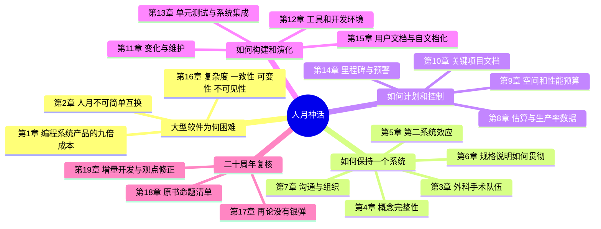
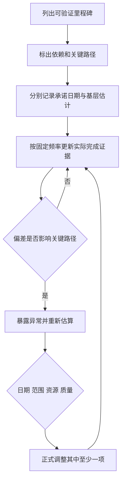

# 《人月神话（二十周年纪念版）》深度阅读

> **书目信息**：Frederick P. Brooks Jr., *The Mythical Man-Month: Essays on Software Engineering, Anniversary Edition*；本地中文 EPUB 题名《人月神话（二十周年纪念版）》；ISBN 978-7-302-05932-5。作者是 IBM System/360 项目经理，并曾负责 OS/360 的设计阶段。
>
> **文本依据**：本文逐章核对题目提供的 EPUB，包括两版序言、第 1～19 章和第 18 章的命题汇总。`【原书】`表示 1975 年正文观点，`【二十周年修正】`表示作者 1995 年的更新或否定，`【书后映射】`表示为了落地而补充的当代工程实践。三者不混写。
>
> **版本警告**：EPUB 元数据中的 `dc:description` 被错误填成一本营销学书籍的简介，与正文无关，本文没有采用。二十周年版不是重写版：作者在序言中说明，原 15 章基本原样重印，再用第 16～19 章补充、检验和纠正。

## 一、这本书究竟在解决什么问题

### 1.1 从作者的定义出发

第一版序言用一组对照界定了问题：

> “管理一个大型的计算机编程项目和其它行业的大型工程很相似……在很多另外的方面，它又有差别。”（第一版序言）

相似之处是大型项目都需要目标、预算、进度、组织、接口和质量控制；差异则在于软件是高度抽象、持续变化、难以看见的概念结构。作者写作本书，是为了回答 Tom Watson 提出的“为什么编程难以管理”，而直接经验来自一次并不圆满的 OS/360 交付：延期、内存超出计划、成本达到估计的数倍，首版质量也不理想。

全书的中心论点在序言中已经给出：

> “由于人员的分工，大型编程项目碰到的管理问题和小项目区别很大；我相信关键需要是维持产品自身的概念完整性。”（第一版序言）

通俗地说，这本书研究的不是“怎样让每个人写代码更快”，而是“怎样让很多人共同构造一个系统，却仍像出自一个头脑”。人员增加会增加沟通、培训、重新分工和集成成本；功能增加会侵蚀设计的一致性；进度压力又会诱使团队压缩最不该压缩的设计和测试。全书给出的主线就是：**用少数人的统一设计、明确接口、可验证里程碑、增量集成和诚实沟通，控制大型软件的复杂度。**

### 1.2 “人月神话”并不是说人力永远无用

第 2 章把“人月”称为“危险和带有欺骗性的神话”，因为这个单位暗示人数和时间可以互换。只有任务能够完全切分、参与者无须交流时，`人数 × 月数` 才近似守恒。软件工作通常同时包含三类限制：

1. **顺序依赖**：需求澄清、体系结构、集成和系统测试不能任意并行。
2. **培训成本**：新人要由已经在项目中的人讲解目标、设计与工具。
3. **沟通成本**：若每两人都要直接协调，潜在沟通关系为：

$$
C = \frac{n(n-1)}{2}
$$

| 团队人数 `n` | 两两沟通路径 `C` | 相对 2 人团队 |
| ---: | ---: | ---: |
| 2 | 1 | 1 倍 |
| 3 | 3 | 3 倍 |
| 4 | 6 | 6 倍 |
| 8 | 28 | 28 倍 |
| 12 | 66 | 66 倍 |

公式描述的是潜在关系数，不等于每天一定发生这么多次沟通，也不是现代团队规模的精确成本模型。它真正提醒管理者：**增加人员会改变问题本身，不能只在原工作量上做除法。**

### 1.3 全书的逻辑结构



从项目生命周期看，书中的论证关系如下：


这条环不是作者在 1975 年就完整画出的。第 19 章明确纠正了原书隐含的顺序式瀑布思维，主张让需求、体系结构、实现和用户反馈往复流动。

### 1.4 与瀑布、敏捷、精益和 DevOps 的区别

《人月神话》是一组经验论证，不是一套带角色、仪式和工件的完整方法论。下面的比较是定位，不应把后来的术语倒灌回原书。

| 维度 | 《人月神话》最终立场 | 传统瀑布 | Scrum / 敏捷 | 精益产品开发 | DevOps / 持续交付 |
| --- | --- | --- | --- | --- | --- |
| 首要矛盾 | 大型系统的概念复杂度和沟通成本 | 阶段按顺序完成 | 用短周期反馈应对不确定性 | 消除浪费，验证价值 | 缩短从变更到生产反馈的周期 |
| 设计权 | 一位结构师或有共识的小组维护概念完整性 | 前期设计部门集中决定 | 团队协作，架构责任因组织而异 | 围绕价值流做决策 | 产品、开发、运维共同承担可运行性 |
| 计划方式 | 基于数据估算；承认顺序约束；反对盲目加人 | 预先固定范围、时间和阶段 | 迭代计划、动态排序 backlog | 小批量、限制在制品 | 自动化流水线和可观测反馈 |
| 交付模型 | 1995 年明确支持闭环骨架、增量生长、每日重建 | 通常在后期集成和验收 | 每个迭代产生可用增量 | 尽早验证最关键假设 | 频繁构建、测试和部署 |
| 质量观 | 独立测试、测试脚手架、逐个集成、回归测试 | 测试多集中在后段 | 质量贯穿迭代 | 质量内建 | 自动化测试、发布保护和运行监控 |
| 主要优势 | 深入解释了“为什么规模化会失效” | 合同边界和阶段责任直观 | 反馈快，适合需求变化 | 避免做无价值功能 | 把交付和运行变成可重复系统 |
| 主要风险 | 首席设计权可能变成瓶颈；不少数据有时代背景 | 反馈太晚，错误成本高 | 仪式化后可能忽略架构和跨团队依赖 | 过度局部优化价值流 | 工具自动化掩盖产品和架构问题 |

最重要的差别是解释层次：《人月神话》解释人员、时间、设计和复杂度之间的因果关系；敏捷、精益与 DevOps 则提供后来形成的反馈机制和交付实践。现代团队真正可用的组合是：用 Brooks 的复杂度视角判断风险，用增量方法获取反馈，用持续集成维持可运行状态，而不是在这些标签中选一个站队。

## 二、两版序言与 19 章逐章解读

| 章节 | 这一章谈什么 | 核心论点 | 作者给出的处理方式或后来修正 |
| --- | --- | --- | --- |
| 二十周年版序言 | 为什么原文不改而增加四章 | 1975 年观点应接受二十年研究和实践的检验 | 第 16 章重印“没有银弹”，第 17 章回应批评，第 18 章列命题，第 19 章更新结论 |
| 第一版序言 | OS/360 经验为何值得复盘 | 大项目既像传统工程又有软件特有困难；核心是概念完整性 | 从 System/360 与 OS/360 的差异中提炼可操作的管理经验 |
| 第1章 焦油坑 | 程序如何变成可供他人使用的系统产品 | 产品化约 3 倍、系统集成再约 3 倍，作者估计“编程系统产品”成本约为个人程序的 9 倍 | 把测试、文档、通用性、接口和集成当作产品成本，而不是代码完成后的杂务 |
| 第2章 人月神话 | 为什么按人月倒排工期会失败 | 工作量不等于进度；沟通和顺序依赖使人月不可交换；延期后盲目加人会更糟 | 更多时间用于计划和测试；建立历史数据；延期时在改期、减范围和谨慎增员之间正式决策 |
| 第3章 外科手术队伍 | 如何兼得小团队的一致性与大项目的产能 | 能力差异很大；系统设计应集中，支持角色可以专业化 | 由“主刀”负责核心设计和代码，副手、管理员、编辑、工具、测试等角色围绕其工作 |
| 第4章 贵族专制、民主政治和系统设计 | 谁决定系统对外呈现的概念 | “概念完整性是系统设计中最重要的考虑因素”；功能与理解复杂度之比才是测试 | 由一人或有共识的小组控制体系结构；实现团队在约束内发挥创造力 |
| 第5章 画蛇添足 | 为什么第二个系统最危险 | 首个系统中被克制的想法会在第二个系统一次性释放，导致功能堆积 | 结构师与实现者持续沟通；给功能分配空间和性能预算；准备放弃非必要改进 |
| 第6章 贯彻执行 | 体系结构决定怎样被准确传达 | 口头命令不够；形式定义精确，叙述性手册帮助理解，两者不可相互替代 | 手册、仿真、多种实现、周例会、电话日志、独立产品测试共同消除歧义 |
| 第7章 为什么巴比伦塔会失败 | 大项目为何因沟通崩溃 | 缺乏交流进一步导致组织失效；项目手册是全部关键文档的结构 | 多通道沟通、共享变更、清晰的产品与技术负责人；1995 年承认信息隐藏比“人人看见一切”更正确 |
| 第8章 胸有成竹 | 如何估计系统编程工作 | 小程序数据不能直接外推到系统产品；交互越多生产率越低；高级语言显著提高生产率 | 使用同类项目的真实数据，区分控制程序与编译器等不同工作，不能只估编码再乘系数 |
| 第9章 削足适履 | 如何控制内存、访问次数和性能 | 资源预算必须与功能绑定；局部优化会伤害用户整体体验；关键突破常来自算法或数据表达 | 给模块同时分配功能和资源预算，由结构师维护全局权衡；部分内存结论在 1995 年已标为过时 |
| 第10章 提纲挈领 | 哪些文档真正驱动项目 | 少数关键文档是管理枢纽；写作迫使模糊想法变成决定 | 维护目标、用户手册、内部说明、进度、预算、组织和空间分配，把它们兼作检查表和预警数据 |
| 第11章 未雨绸缪 | 如何面对需求变化和维护 | 首个系统通常不合用；变化不可避免；维护主要是持续修改而非修理磨损 | 1975 年说“为舍弃而计划”；1995 年改为增量修改和再设计，反对一次构建、一次丢弃 |
| 第12章 干将莫邪 | 工具和开发平台怎样影响效率 | 稳定辅助平台、仿真器、编辑器、高级语言与交互环境能消除大量次要困难 | 分离私有开发库、集成库和发布库；尽早建立性能仿真；PL/I 的具体推荐已被作者标为过时 |
| 第13章 整体部分 | 如何减少缺陷并完成系统集成 | 明确规格、自顶向下细化、结构化程序、测试脚手架与受控变更共同降低缺陷 | 测试组先审规格；构件先可运行；系统测试一次加入一个构件；每次变更可追踪 |
| 第14章 祸起萧墙 | 项目怎样“一天一天”晚一年 | 模糊的“90% 完成”会掩盖延误；可度量里程碑和关键路径才能预警 | 同时保留基层估计与管理承诺日期；鼓励坏消息；用计划与控制小组维护状态 |
| 第15章 另外一面 | 程序面向人的那一面 | 用户和维护者文档与机器可执行程序同样重要；详细流程图往往低效 | 先写目的、环境、范围、I/O、操作、性能和校验；将结构、意图和必要注释尽量靠近源码 |
| 第16章 没有银弹 | 为什么没有单项技术带来十倍提升 | 软件的根本困难是复杂度、一致性、可变性、不可见性；工具主要消除表达和操作上的次要困难 | 购买而非自建、快速原型、增量生长、培养卓越设计者；不等待某个万能技术 |
| 第17章 再论《没有银弹》 | 十年预言是否成立 | 作者仍坚持根本/次要困难之分；面向对象和复用有价值，却不是魔法 | 质量提升会间接提高生产率；复用需要优秀设计、文档和学习成本，应视为“铜弹”式渐进改进 |
| 第18章 《人月神话》的观点：是或非？ | 把原书观点变成可检验命题 | 将第 1～15 章的断言编号，并在方括号中标注“仍成立、过时或错误” | 让经验论断接受数据反驳，而不是把名句当定律 |
| 第19章 20年后的人月神话 | 哪些核心观点保留，哪些必须改 | 保留概念完整性和非线性人月关系；否定瀑布和一次性丢弃；接受信息隐藏 | 闭环骨架、增量开发、产品族、每日重建、早期用户测试；把 Brooks 法则作为近似警告 |

## 三、必须连同“作者改口”一起读的结论

| 1975 年原论 | 1995 年复核 | 今天应怎样使用 |
| --- | --- | --- |
| “为舍弃而计划，无论如何，你一定要这样做。”（第11章） | 作者说它“不是因为太过极端，而是因为太过简单”，其背后仍是假设顺序式瀑布过程 | 用原型验证未知，但生产系统应小步演进；不把“推倒重来”预设为唯一出口 |
| 计划、编码、构件测试、系统测试分别占 `1/3、1/6、1/4、1/4`（第2章） | 第19章承认这种一次通过的分配仍受瀑布模型影响 | 把“编码只占小部分、测试需要充分时间”当风险提示，不把比例当迭代项目的固定模板 |
| 每个团队成员应了解所有项目材料（第7章） | 作者承认：“关于信息隐藏，Parnas 是正确的，我是错误的。” | 全员共享目标、接口和决策；模块内部细节按需隐藏，以减少认知和变更传播 |
| Brooks 法则：延期项目加人只会更延期（第2章） | 第19章引用模型研究：增员总会增加成本，却“不一定”让项目更晚；早期增员比后期安全 | 先判断剩余工作可分性、上手周期、指导者损失和集成成本，再决定是否增员 |
| 驻留内存、磁盘访问是首要规模预算（第9章） | 作者注明部分整体结论因虚拟内存和廉价内存而过时 | 把预算对象换成今天真正稀缺的延迟、吞吐、云成本、包体积、能耗和认知复杂度 |
| PL/I 是系统编程的合理选择（第12章） | 第18章直接标为“不再正确” | 保留“使用更高层抽象减少次要困难”，不保留具体语言结论 |
| Parnas 的封装建议会造成灾难（第7章命题 7.15） | 第19章承认信息隐藏是通过模块化控制复杂度的关键 | 公开稳定契约，隐藏容易变化的决定；文档不等于公开全部内部实现 |

这张表是阅读全书的安全阀。Brooks 最值得学习的不是“每句话都正确”，而是他在第 18 章把自己的论断编号、暴露给证据，并在第 19 章明确写出“我是错误的”。

## 四、按软件生命周期归纳全书方法

### 4.1 立项：先确认是否值得开发

#### 背景和问题

【原书，第16章】软件最彻底的解决方案可能是“不开发任何软件”。如果市场上已有产品，重新制造会把团队拖进并非业务独有的复杂度。作者把购买现成产品、快速原型和有机增长列为直面根本困难的方向。

#### 作用与场景

- **购买而非自建**：认证、计费、报表、通用工作流等非差异化能力。
- **快速原型**：需求无法仅靠访谈说清，必须通过可操作模型发现误解。
- **自建核心**：组织真正独有的规则、数据或体验，而且现成产品的适配成本更高。

#### 实际做法

立项不应只比较许可证价格和开发工时，还要比较集成、迁移、供应商锁定、长期维护和退出成本。用一个轻量决策表保留假设：

| 候选方案 | 解决独有需求 | 首年总成本 | 三年变更成本 | 可逆性 | 证据 |
| --- | ---: | ---: | ---: | ---: | --- |
| 购买 SaaS | 中 | 低 | 中 | 中 | 试用和接口验证 |
| 基于开源扩展 | 高 | 中 | 中 | 高 | 原型和许可证审查 |
| 完全自研 | 最高 | 高 | 高 | 取决于架构 | 核心流程原型 |

#### 局限与处理

“购买”不会消灭复杂度，只会把一部分复杂度变成供应商、配置和接口一致性问题。必须用真实数据和接口完成一个端到端试验，而不是根据功能清单做决定。

### 4.2 需求与体系结构：先建立概念完整性

#### 背景和作用

大型系统最容易变成“每个功能都合理，合在一起却难以理解”的集合。第 4 章给出全书最重要的判断：

> “概念完整性是系统设计中最重要的考虑因素。”（第4章）

作者把系统质量表示为“功能与理解上的复杂程度的比值”。这比单纯追求功能数量更严格：新功能只有在增加的价值大于它带来的认知负担时才值得加入。

#### 使用方法

1. 明确系统面对谁、解决什么、不解决什么。
2. 指定对外概念的最终负责人，或一个能形成共同设计语言的小组。
3. 先定义少量稳定概念、规则和接口，再并行实现内部细节。
4. 同时提供精确契约和叙述性解释：前者消除歧义，后者传达为什么。
5. 用真实用例和第二种实现检验接口；只支持单一实现的接口常夹带了实现细节。

【书后映射】下面的 TypeScript 片段展示“公开稳定能力、隐藏易变决定”。这是对第 4、6、19 章的现代映射，不是书中代码：

```ts
// 领域只依赖稳定概念，不知道邮件厂商、队列或重试实现。
export interface NotificationPort {
  send(message: Notification): Promise<DeliveryReceipt>;
}

export type DeliveryReceipt = Readonly<{
  messageId: string;
  acceptedAt: string;
}>;

export type Notification = Readonly<{
  recipientId: string;
  template: "order-confirmed" | "order-cancelled";
  variables: Readonly<Record<string, string>>;
}>;
```

内部可以从 SMTP 换成云消息服务，但领域接口不随厂商变化。这正是 Parnas 信息隐藏的重点：隐藏的不是信息本身，而是**最可能变化的设计决定**。

#### 优势与局限

与“所有团队民主投票每个细节”相比，集中体系结构权能减少冲突概念和妥协式接口；代价是结构师可能脱离实现成本，或成为决策瓶颈。第 5 章的约束是持续交流：结构师要能提出实现办法、听取实现者建议，并准备放弃不划算的功能。

### 4.3 估算和排期：把工作量、工期与风险分开

#### 原书方法

第 2 章列出进度灾难的五个来源：乐观主义、混淆人月、缺乏持续估算、缺乏跟踪，以及延期后本能加人。原书的经验分配是：

| 活动 | 原书比例 | 应读出的含义 |
| --- | ---: | --- |
| 计划 | 1/3 | 稳定规格和技术探索不能免费获得 |
| 编码 | 1/6 | 容易看见的编码不是项目主体 |
| 构件测试和早期系统测试 | 1/4 | 集成风险必须提前暴露 |
| 完整系统测试 | 1/4 | 后期测试不足会在成本最高时暴露延期 |

【二十周年修正】第 19 章认为这个比例仍受瀑布模型影响。因此它不是今天的排期公式；可保留的是两条原则：**不要只估编码；不要从测试时间借债来满足日期。**

#### 一个可操作的延期决策

书中设想一个 12 人月任务，由 3 人在 4 个月完成。两个月后首个里程碑未完成，经理不能简单计算“还差 9 人月，所以再加 2 人”。新人培训会占用老成员，任务要重新划分，系统测试范围也扩大。

现代决策可以显式比较四个选项：

| 选项 | 何时有效 | 必须计入的成本 | 主要风险 |
| --- | --- | --- | --- |
| 保持日期，谨慎增员 | 仍处早期、剩余任务可独立切分、新人熟悉领域 | 招募、上手、指导者损失、接口和测试增加 | 短期净产能为负 |
| 延后日期 | 范围和质量不可变 | 商业延迟成本 | 产品可能错过窗口 |
| 缩减范围 | 日期不可变且功能可分级 | 重做验收标准、兼容后续版本 | 静默删测试造成质量债 |
| 终止或重立项 | 估计基础或价值假设已经失效 | 沉没成本和迁移 | 因不愿承认错误而继续投入 |

#### 与现代估算的关系

故事点、吞吐量、Monte Carlo 模拟或 COCOMO 一类模型都不会取消 Brooks 的约束。它们能改善预测，但输入仍须来自同类工作的历史数据。第 8 章尤其反对把小型独立程序的生产率直接外推到需要集成、测试、文档和支持的系统产品。

### 4.4 团队组织：减少必须发生的沟通

#### 外科手术队伍的思想

第 3 章借外科手术队伍描述十人左右的专业分工：主程序员掌握核心设计和关键实现，副手能接替并参与思考，管理员处理人员和资源，编辑负责文档一致性，另有秘书、程序职员、工具人员、测试人员等支持角色。

这不是要求今天照抄职位，而是给出一个组织原则：

> “由一个人来进行问题的分解，其他人给予他所需要的支持，以提高效率和生产力。”（第3章）

| 原书角色 | 主要责任 | 当代可能映射 |
| --- | --- | --- |
| 主程序员 / 外科医生 | 统一概念、关键设计和核心实现 | Staff Engineer、Tech Lead、首席架构师 |
| 副手 | 共同理解全局、评审并可接替 | 副技术负责人、资深工程师 |
| 管理员 | 人员、资源、环境和跨组协调 | Engineering Manager、项目经理 |
| 编辑 | 保持文档和术语一致 | 技术写作、Developer Experience |
| 工具人员 | 提供自动化和开发工具 | Platform Engineering、构建工程 |
| 测试人员 | 独立设计反例并验证产品 | QA、SDET、质量工程 |

#### 局限与解决

单一主程序员可能形成巴士因子、审查瓶颈和权力失衡。可用“单一责任、多人理解”化解：最终设计权明确，但关键决策有记录，副手能接替，接口由实现者和测试者共同挑战。概念完整性不等于只有一个人能工作。

### 4.5 规格、沟通与项目记忆：让决定可查证

#### 原书方案

第 6、7、10 章形成一组完整机制：

- 手册给出系统对外行为，形式化定义保证精确，叙述性说明帮助理解。
- 周例会解决跨边界问题，首席结构师拥有明确的最终决定权。
- 电话解释必须记录、整理和发布，否则同一问题会得到不同答案。
- 项目工作手册不是一篇巨型文档，而是组织目标、规格、接口、标准、进度和管理备忘录的结构。
- 少数关键文档既是沟通媒介，也是检查表、状态数据库和预警机制。

#### 当代落地

【书后映射】可以把纸质工作手册映射成有版本控制的仓库，但不要把“存在很多文档”误当成“沟通完成”。最小集合如下：

```text
docs/
  product-scope.md          # 用户、目标、非目标、验收标准
  architecture.md           # 核心概念、边界、质量属性
  interfaces/               # 对外契约及兼容策略
  decisions/                # 一项决定一个 ADR
  delivery-plan.md          # 里程碑、依赖、基层估计与承诺日期
  operations.md             # 部署、回滚、告警、恢复
```

每项架构决策记录（ADR, Architecture Decision Record）至少回答：背景、决定、备选项、后果、状态和日期。它继承的是第 10 章“写作迫使数百个小决定变清晰”的思想。

#### 信息共享的边界

【二十周年修正】目标、接口、里程碑和决策应可发现，但模块内部不必让所有人理解。共享一切会把阅读负担变成新的沟通成本；信息隐藏则让团队只依赖稳定契约。

### 4.6 实现：从可运行骨架增量生长

#### 作者为何否定瀑布

第 19 章直截了当地写道：

> “没有构建舍弃原型——瀑布模型是错误的！”（第19章）

瀑布的第一个错误是假设体系结构和设计一次做对，错误主要出现在编码阶段；第二个错误是到多数编码完成后才闭环集成。这样，性能、可用性和需求误解都在投资完成后才暴露。

#### 闭环骨架方法

作者引用 Harlan Mills 的做法：先构造主循环和所有功能的空子程序，使系统能编译和运行；再加入最基本的输入输出；此后一次增加一个功能，并在每一步保持系统经过测试。


【书后映射】一个后端服务的第一条垂直切片可以只完成：启动、健康检查、一条真实数据库读写、一次身份校验、结构化日志和可回滚部署。它业务价值很小，却验证了最危险的跨层接口。之后每次增加的都应是可运行、可测试的薄片，而不是先分别完成所有“层”。

#### 每日重建与持续集成

第 19 章记录微软团队“每晚重建并运行测试”的方法：构建失败就停止新增工作，先恢复可运行状态。这已包含现代持续集成的核心纪律。今天机器能更快反馈，但规则没有变：主分支持续可用，变更批次小，失败优先修复。

```yaml
# 【书后映射】示意性 CI，不是原书代码。
name: verify
on: [pull_request]
jobs:
  test:
    runs-on: ubuntu-latest
    steps:
      - uses: actions/checkout@v4
      - uses: actions/setup-node@v4
        with:
          node-version: 24
          cache: npm
      - run: npm ci
      - run: npm run lint
      - run: npm test
      - run: npm run build
```

工具能缩短反馈，却不能决定需求和体系结构。它解决的是第 16 章所说的“次要困难”；错误的产品概念会被更快、更稳定地构建出来，仍然是错误。

### 4.7 测试和集成：先验证规格，再验证构件

#### 原书的测试链路

第 13 章不是泛泛强调“多测试”，而是规定次序和责任：

1. 编码前，由测试组检查规格是否完整、明确、可验证。
2. 每个构件先独立运行，准备驱动、桩、伪文件和测试数据等脚手架。
3. 集成期间由明确负责人控制版本和变更。
4. 一次只加入一个构件，失败时可以确定差异来源。
5. 修复后重跑既有测试，防止维护变更破坏其他功能。

书中甚至认为辅助测试代码可能达到被测代码的一半。比例不是目标，意义在于测试基础设施是产品工程的一部分，不是临发布时才出现的临时成本。

#### 测试用例的三个边界

第 15 章要求随程序提供可例行运行的验证用例，并将更完整的用例分为：

- 常规合法数据和主要功能；
- 合法范围的最大、最小和特殊边界；
- 范围外的非法数据及正确诊断。

这与今天的正常路径、边界测试和错误路径完全对应。局限是原书主要讨论确定性系统测试，对分布式故障、并发、性能回归和生产可观测性涉及不多；现代项目要增加契约测试、负载测试、故障注入和上线后监控。

### 4.8 进度控制：让坏消息尽早出现

第 14 章的名句是：

> “项目是怎样延迟了整整一年的时间？……一次一天。”（第14章）

“设计基本完成”“编码 90% 完成”都不是可靠里程碑，因为无法客观判定。有效里程碑必须是具体、特定、可度量的事件，例如“支付接口的契约测试在集成环境通过”，而不是“支付模块接近完成”。



管理者的行为决定信息质量。若每次报告风险都被指责或越级接管，下属会把问题藏到“地毯下面”；若管理者区分状态报告与责任追究，平静接收坏消息，数据才可能真实。

### 4.9 发布、文档与维护：交付用户满意度

#### 面向使用者的文档

第 15 章要求用户文档覆盖九类信息：目的、环境、范围、实现功能与算法、输入输出格式、操作指令、选项、运行时间、精度与校验。其中相当部分应在编码前写，因为它们本身就是产品决策。

维护者还需要系统结构、算法、文件规划、数据流和预期修改点。作者反对逐语句绘制流程图，主张用名称、声明、格式、模块说明和必要注释让源码承担可持续维护的文档责任；但源码只能表达“怎样做”，仍需文字解释“为什么”。

#### 版本与变更

第 11 章主张用数字版本、日程和冻结日期把变化阶段化。现代对应物是语义化版本、发布分支、特性开关和迁移策略，但原则不变：变更必须进入一个可识别、可测试、可回滚的批次。

#### 维护与熵

原书把软件维护解释为修复设计缺陷、增加功能和适应环境，不是硬件式的清洁与更换磨损部件。书中给出的“维护成本通常为开发成本 40% 或更多”“修复有 20%～50% 概率引入新 bug”是当时经验数据，不应冒充现代通用常数；它们支持的因果关系仍成立：变更会传播副作用，必须回归测试。

Lehman 和 Belady 的观察则更深：版本增加时，受影响模块可能比模块总数增长更快，修改不断侵蚀原架构。解决方案不是永远打补丁，而是持续重构边界，并在结构已经无法容纳现实变化时正式再设计。

## 五、“没有银弹”：软件为什么不会被单一工具解决

### 5.1 根本任务与次要任务

第 16 章的中心声明是：

> “没有任何技术或管理上的进展，能够独立地许诺十年内使生产率、可靠性或简洁性获得数量级上的进步。”（第16章）

作者将软件工作分为两类：

- **根本任务（essence）**：规格化、设计和测试由抽象实体组成的复杂概念结构。
- **次要任务（accident）**：把概念写成某种语言，在机器、时间和空间限制下运行，以及处理笨拙工具带来的摩擦。

“次要”不是“不重要”，而是“不由软件问题本身必然要求”。高级语言、分时系统和统一开发环境曾带来巨大进步，因为它们消除了机器细节、漫长等待和工具不兼容。一旦这些障碍已经大幅下降，继续优化表达速度就难以再次带来十倍收益。

### 5.2 四种不可回避的属性

| 根本属性 | 书中的含义 | 导致的问题 | 可缓解但不能消除的方法 |
| --- | --- | --- | --- |
| 复杂度（complexity） | 软件由大量不同元素和非线性交互组成，不是重复零件的简单放大 | 状态难枚举、沟通困难、修改有副作用、安全边界难掌握 | 分层、模块、抽象、测试、删除不必要功能 |
| 一致性（conformity） | 软件必须服从外部组织、法规、协议和遗留接口的任意规则 | 很多复杂度不能通过重写单个模块消失 | 适配层、标准化契约、隔离遗留规则 |
| 可变性（changeability） | 成功软件会被扩展，并被硬件、用户和社会环境持续推动变化 | 需求漂移、架构侵蚀、维护成本上升 | 增量交付、信息隐藏、版本化、回归测试 |
| 不可见性（invisibility） | 软件没有唯一自然几何形态，控制流、数据流、依赖和时序互相重叠 | 难以整体构思，也难以向他人完整表达 | 多视图模型、可执行契约、追踪和可观测性 |

### 5.3 AI、低代码和新框架是不是银弹

【原书】作者已经逐项分析过 Ada、面向对象、人工智能、专家系统、自动编程、图形化编程、程序验证、环境与工作站。他并非否认价值，而是追问：它减少的是问题本身的复杂度，还是只让表达更方便？例如他认为语音输入帮不上“决定该说什么”，程序验证也不能证明规格本身正确。

【书后映射】同一检验适用于生成式 AI、低代码平台和新框架：

| 技术 | 明显改善 | 仍需人决定 |
| --- | --- | --- |
| 代码生成 / AI 助手 | 样板代码、搜索、转换、局部测试草案 | 需求真伪、系统边界、风险权衡、生成结果验证 |
| 低代码 | 常见表单和工作流的表达速度 | 非标准规则、平台边界、数据治理、退出方案 |
| 云托管服务 | 基础设施配置和运维负担 | 分布式一致性、成本模型、可靠性目标、供应商依赖 |
| 新语言和框架 | 更安全或简洁的表达、成熟组件 | 概念模型、组织接口、迁移和长期演化 |

因此，不必从“没有银弹”推出悲观主义。第 16 章的结尾方向恰好相反：购买已有能力、快速原型、增量生长、培养优秀设计者，并通过许多持续改进累积结果。没有单颗银弹，不等于没有一盒可靠工具。

## 六、术语与缩写

- **人月（man-month）**：一人工作一个月的工作量单位。适合成本核算，不天然等于可压缩的日历工期。
- **Brooks 法则（Brooks's Law）**：通常表述为“向进度落后的软件项目中增加人手，只会使进度更加落后”。二十周年版将其定位为警告盲目增员的最佳近似，不是无条件数学定律。
- **概念完整性（conceptual integrity）**：系统在命名、行为、交互和规则上呈现统一、可预测的概念，好像来自一个协调一致的头脑。
- **体系结构（architecture）**：原书主要指用户和其他系统可见的完整规格，即“系统做什么”。它不完全等同于今天泛指组件拓扑的“架构”。
- **设计实现（implementation）**：体系结构之下，决定系统内部怎样组织以满足规格。
- **物理实现（realization）**：将设计落实到具体硬件、电路或机器资源；在现代纯软件项目中可类比为运行平台和部署形态。
- **外科手术队伍（surgical team）**：由一位核心设计/实现者保持一致性，其他专业角色提供支持的团队模式。
- **第二系统效应（second-system effect）**：设计者在第二个系统中过度补偿第一版的克制，把积压想法一次加入，从而过度设计。
- **信息隐藏（information hiding）**：模块公开稳定接口，隐藏容易改变的设计决定，使变化不向外传播。它不等于保密或拒绝文档。
- **编程系统产品（programming systems product）**：既能作为系统构件与其他程序协作，又经过通用化、测试和文档化，可由原作者以外的人使用和维护的程序。
- **脚手架（scaffolding）**：为测试而建立的驱动、桩、伪数据、仿真器和辅助代码，帮助隔离构件并观察行为。
- **回归测试（regression testing）**：变更后重新运行既有用例，确认原本工作的行为没有被破坏。
- **PERT（Program Evaluation and Review Technique）**：计划评审技术，用任务网络、依赖和时间估计识别关键路径及进度风险。
- **关键路径（critical path）**：项目依赖网络中决定最短总工期的最长任务链，该链上的延迟会直接影响完成日期。
- **KLOC（thousand lines of code）**：千行代码。书中用它比较历史项目生产率，但跨语言、领域和质量要求直接比较容易误导。
- **MIPS（million instructions per second）**：每秒百万条指令，是历史上衡量处理器执行能力的一种指标。
- **WIMP（Windows, Icons, Menus, Pointer）**：窗口、图标、菜单和指针组成的图形用户界面模式。
- **Alpha / Beta**：书中将 alpha 关联到有限功能原型，将 beta 关联到发布前的现场试验系统；现实产品的命名并不总严格遵循这一区分。
- **OS/360**：IBM 为 System/360 大型机家族开发的操作系统，是本书多数管理经验的直接来源。
- **System/360**：IBM 在 1960 年代推出的兼容计算机家族。Brooks 曾任其项目经理，并负责 OS/360 早期设计管理。
- **PL/I（Programming Language One）**：IBM 推动的通用高级语言。原书曾推荐用于系统编程，二十周年版已明确标注该具体结论过时。
- **ADR（Architecture Decision Record）**：架构决策记录。不是原书术语，是对“记录决定、理由和后果”的现代轻量实现。
- **CI（Continuous Integration）**：持续集成。频繁合并小变更并自动构建测试，可视为第 19 章“每日重建”思想的自动化延伸。

## 七、把全书用于一个真实项目

假设团队要在六个月内交付一套企业审批平台。直接套用书中思想，可以得到下面的执行序列：

| 阶段 | 关键动作 | 完成证据 | 对应章节 |
| --- | --- | --- | --- |
| 立项 | 调研购买、扩展和自研；原型验证最特殊的审批规则 | 一条真实流程端到端跑通，决策表签字 | 第16、19章 |
| 概念设计 | 统一“申请、步骤、决策、委托、审计”五个核心概念 | 术语表、状态机、两种实现对接口的验证 | 第4、6章 |
| 估算 | 用历史吞吐和依赖拆分估算，不用总人月直接除人数 | 范围假设、风险区间、关键路径 | 第2、8、14章 |
| 组织 | 技术负责人维护概念完整性，副手可接替，平台和测试提供支持 | 决策权清单、责任边界、替补方案 | 第3、7章 |
| 骨架 | 先打通登录、一次审批、数据库、日志、部署与回滚 | 集成环境中可运行的最小闭环 | 第13、19章 |
| 增量 | 每次加入一种审批能力，保持主分支可运行 | 每个合并请求通过契约、回归和构建 | 第11、13、19章 |
| 跟踪 | 只报告可验证事件，同时记录承诺日期和当前估计 | 每周关键路径和偏差报告 | 第10、14章 |
| 发布 | 提供用户操作、边界行为、恢复步骤和验收用例 | 可重复部署、回滚演练、用户验证 | 第6、15章 |
| 维护 | 版本化接口；修复后全量回归；监测架构侵蚀 | 变更影响、测试证据、定期边界复审 | 第11、13章 |

当第三个月出现两周偏差时，不要先问“再招几个人”，而要依次问：偏差是否在关键路径；剩余工作能否隔离；新人多久产生净贡献；谁会被抽走培训；是否能删除低优先级审批类型；质量和迁移约束是否允许调整。这样，Brooks 法则就从口号变成了决策检查表。

## 八、适用边界与今天仍然有效的结论

### 8.1 不能原样照搬的部分

- 书中大量数据来自 1960～1970 年代大型机、汇编语言和批处理环境，不应直接用 KLOC/人年估计云服务或移动应用。
- 外科手术队伍强调个人中心，在高可用、强合规或长期产品中必须补足知识冗余和共同责任。
- 原书的文档体系偏大型正式项目；小团队应保留决策和契约，减少不产生行为改变的文书。
- “人月”对完全可并行的迁移、标注或独立内容生产仍有一定线性意义，不能反过来宣称所有工作都无法增员。
- “没有银弹”限定的是单项进展在十年内带来数量级改善，不是否认工具、复用、自动化或方法组合能持续累积收益。

### 8.2 穿越工具变化的五条原则

1. **先管理复杂度，再管理代码量。** 真正困难的是概念关系，不是敲入字符。
2. **工作量不是工期。** 顺序依赖、培训和沟通决定了可并行上限。
3. **概念完整性比功能堆积重要。** 易理解的较小系统往往胜过功能丰富但互相矛盾的系统。
4. **始终保有可运行系统。** 小批次集成、回归测试和早期用户反馈比末期总装可靠。
5. **让坏消息可见。** 可验证里程碑、诚实估计和管理者的平静反应，是避免“一次一天”延期的基础设施。

## 九、结语

《人月神话》表面写进度和组织，真正反复讨论的是**怎样在人类有限的理解能力下维持一个复杂系统**。人月神话解释了规模为什么制造额外工作，概念完整性给出设计方向，外科手术队伍尝试安排决策权，“没有银弹”则划清工具改进与问题本质的边界。

二十周年版使这本书比一组名言更有价值：作者保留人月的非线性和概念完整性，却否定瀑布式的一次构建，接受信息隐藏，并为 Brooks 法则补上条件。因而最符合本书精神的读法不是背诵“延期不能加人”，而是持续追问：复杂度在哪里、信息该由谁掌握、反馈何时到来、当前状态是否有证据，以及这次改进究竟解决了根本问题还是只减少了摩擦。
