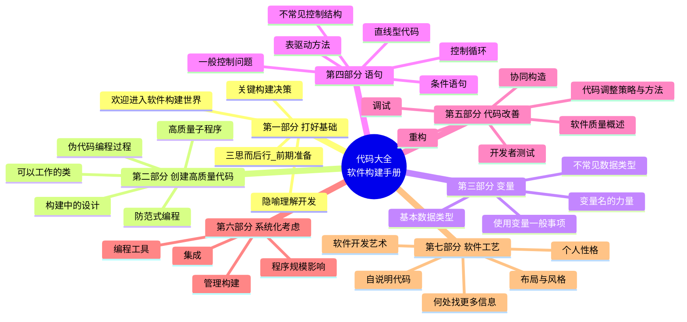
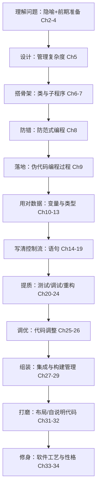

# 《代码大全（第 2 版）》深度阅读指南

> 本指南严格基于 Steve McConnell《Code Complete, 2nd Edition》（中文版：电子工业出版社，译者金戈、汤凌、陈硕、张菲，ISBN 9787121022982）的**真实目录结构与书中表述**进行提炼与扩展，转述+分析，不整章转载；代码示例为功能性说明片段。书中原版副标题即 **"A Practical Handbook of Software Construction"**（软件构建实用手册），英文第 2 版由 Microsoft Press 于 2004 年出版（ISBN 9780735619678）。

---

## 一、整体理解与逻辑结构（全书层面）

### 【全局摘要】

**引用书中官方语言**

- 出版社官方简介（电子工业出版社）："这是一本**完整的软件构建手册**，涵盖了软件构建过程中的所有细节……所论述的技术不仅填补了初级与高级编程技术之间的空白，而且也为程序员们提供了一个有关编程技巧的信息来源。"
- 原版副标题（来自 PDF 样章与微软官方介绍）：_"A Practical Handbook of Software Construction"_。
- 第 1 章 1.1 节标题即点题：**"什么是软件构建？"** 书中把"构建（construction）"定义为：详细设计、编码、调试、集成、开发者测试等活动的总和——它处在"需求/架构"之后、"系统测试/上线"之前，是程序员日常真正花时间的地方。
- 全书贯穿的**首要技术使命**（第 5 章 5.2 节）：**"软件的首要技术使命：管理复杂度（Manage complexity）。"** 第 34 章再次回扣："克服复杂性（Overcoming complexity）。"

**用通俗易懂的话表达**

如果说"写程序"像盖房子，《代码大全》不教你用哪种砖（具体语言语法），而是教你**怎么把房子盖得既快又不容易塌**——从打地基前的规划、图纸设计、砌墙（类与子程序）、验收（测试/调试/重构）、到整体拼装（集成）和匠人修养（风格/注释/性格）。它的核心信念只有一句话：**程序写出来首先是给人看的，其次才是给机器跑的；而让人看懂、改得动的关键，是管住"复杂度"这头怪兽。**

它解决的问题很具体：为什么同样能跑的程序，有的三个月后无人敢碰，有的却清晰如新？为什么项目越大越容易"泥足深陷"？本书用大量研究数据、行业统计与正反示例，把"写好代码"从玄学变成可操作、可度量、可传授的工艺。

### 【逻辑框架图】

下面用两个视角呈现全书骨架：一是"七大部分"的思维导图（空间结构），二是"一条代码的生命旅程"（时间/生命周期结构）。

#### 视角一：七大部分思维导图（Mermaid）



#### 视角二：一条代码的"生命旅程"流程图（层级结构）



### 【与其他主流/以往技术或方法的对比】

下表把《代码大全》与同领域几本"必读经典"横向比较，维度聚焦"关注点覆盖、实证基础、语言无关性、侧重点"。

| 维度                  | 《代码大全》(Code Complete)                            | 《代码整洁之道》(Clean Code)         | 《重构》(Refactoring, Fowler)   | 《程序设计实践》(P&K)           | 《程序员修炼之道》(Pragmatic Programmer) |
| --------------------- | ------------------------------------------------------ | ------------------------------------ | ------------------------------- | ------------------------------- | ---------------------------------------- |
| **副标题/定位**       | 软件构建实用手册                                       | 敏捷软件工艺手册                     | 改善既有代码的设计              | 编程必备素养                    | 从小工到专家                             |
| **覆盖范围**          | 最全：从准备 → 设计 → 变量 → 语句 → 测试 → 集成 → 工艺 | 聚焦"整洁"：命名/函数/类/测试/并发   | 聚焦"重构"：坏味道+重构手法目录 | 中：风格/算法/调试/接口/测试    | 宽而散：务实工程哲学                     |
| **语言无关性**        | 强（示例 C++/Java/VB，但原则通用）                     | 中（以 Java/OOP 为主，偏 OO 价值观） | 中（以 Java 示例，但手法通用）  | 强（C/C++/Java 示例，偏系统层） | 强（语言无关哲学）                       |
| **实证/数据支撑**     | **最强**：大量行业研究、统计、案例                     | 弱：多为作者经验与价值观             | 中：手法经实践检验，有示例      | 中：两位大师经验                | 弱：格言式建议                           |
| **核心抓手**          | 管理复杂度（贯穿全书）                                 | 可读性/责任单一/童子军规则           | 消除坏味道、小步安全改动        | 正确、可维护、高效              | DRY/YAGNI/正交/自动化                    |
| **是否含"构建决策"**  | 含（语言选择、约定、前期准备）                         | 基本不含                             | 不含                            | 部分                            | 部分（工具、自动化）                     |
| **对"人/工艺"的讨论** | 有专章（性格、布局、自说明代码）                       | 有（但偏代码层面）                   | 少                              | 少                              | 多（个人效能、学习）                     |
| **最佳搭配**          | 作为"总纲/手册"                                        | 作为"代码气味与命名"细则             | 作为"改善代码"操作手册          | 作为"系统层基本功"              | 作为"职业素养"手册                       |

**一段话总结**：如果说《重构》是"怎么把烂代码改好"、《代码整洁之道》是"怎么写得漂亮"、《程序员修炼之道》是"怎么当个好工匠"，那么《代码大全》是**唯一一本把"软件构建"当成一门完整学科、用工程研究而非个人品味去论证每一条例程的书**。它不一定让你在某一招上比 Fowler 或 Martin 更尖，但它给你的是"全景地图 + 决策依据"——这正是 2004 年至今它长期霸榜 Stack Overflow "每个程序员都该读的书"榜首的原因。其他书是"专科手册"，《代码大全》是"全科总论"。

---

## 二、分章节解读

下表逐章提炼（依据核实后的 7 部分 35 章官方目录，子节号与出版社目录一致）。

| 章节             | 标题内容                     | 核心内容                                                                                 | 关键例证/数据（如有）                         |
| ---------------- | ---------------------------- | ---------------------------------------------------------------------------------------- | --------------------------------------------- |
| 前言/致谢/核对表 | —                            | 本书目标：缩小"业界高手"与"普通商业实践"之间的知识鸿沟                                   | —                                             |
| 第 1 章          | 欢迎进入软件构建的世界       | 软件构建的定义与重要性；如何阅读本书                                                     | 1.1"什么是软件构建"、1.2"为何重要"            |
| 第 2 章          | 用隐喻来更充分地理解软件开发 | 隐喻的价值；常见隐喻（写作、耕作、牡蛎养殖、建造）                                       | 2.3 常见软件隐喻                              |
| 第 3 章          | 三思而后行：前期准备         | 问题定义、需求、架构先决条件；迭代 vs 序列式                                             | 3.4 稳定需求的神话、3.5 架构典型组成          |
| 第 4 章          | 关键的"构建"决策             | 编程语言选择、编程约定、技术浪潮位置、主要构建实践                                       | 4.1 语言描述、4.3"深入一种语言去编程"         |
| 第 5 章          | 软件构建中的设计             | 设计挑战；关键概念：管理复杂度、抽象、封装、信息隐藏、耦合；设计实践                     | 5.2"首要技术使命：管理复杂度"、5.3 设计启发法 |
| 第 6 章          | 可以工作的类                 | ADT 基础；良好类接口（抽象+封装）；包含 vs 继承；创建类的原因                            | 6.1 ADT、6.2 好的抽象与封装                   |
| 第 7 章          | 高质量的子程序               | 创建子程序理由；设计层；命名；长度；参数用法；函数返回值                                 | 7.3 好的子程序名字、7.5 参数使用              |
| 第 8 章          | 防范式编程                   | 防无效输入；断言；错误处理（健壮性 vs 正确性）；异常；隔离区                             | 8.2 断言、8.3 健壮性/正确性取舍               |
| 第 9 章          | 伪代码编程过程               | 用伪代码驱动类/子程序创建；PPP 步骤                                                      | 9.3 通过 PPP 创建子程序                       |
| 第 10 章         | 使用变量的一般事项           | 数据认知；变量初始化；作用域；持续性；绑定时间；单一用途                                 | 10.4 缩短变量"存活"时间                       |
| 第 11 章         | 变量名的力量                 | 命名注意事项；特定类型命名；命名规则；标准前缀；短名称                                   | 11.1 最适当名字长度、11.5 标准前缀            |
| 第 12 章         | 基本数据类型                 | 数/整数/浮点/字符串/布尔/枚举/常量/数组/自定义类型                                       | 12.6 枚举、12.7 命名常量                      |
| 第 13 章         | 不常见的数据类型             | 结构；指针（含 C/C++ 技巧）；全局数据的风险与替代                                        | 13.2 指针、13.3 用访问子程序取代全局数据      |
| 第 14 章         | 组织直线型代码               | 必须有顺序的语句；顺序无关语句的 grouping                                                | 14.1 明确顺序、14.2 自上而下阅读              |
| 第 15 章         | 使用条件语句                 | if 串；case 语句排序与提示                                                               | 15.1 if、15.2 case                            |
| 第 16 章         | 控制循环                     | 循环种类选择；循环控制（进入/体/退出/端点）；由内而外                                    | 16.1 选择循环、16.3 由内而外                  |
| 第 17 章         | 不常见的控制结构             | 多返回；递归；goto 的取舍                                                                | 17.2 递归、17.3 goto 原则                     |
| 第 18 章         | 表驱动方法                   | 直接访问表；索引表；阶梯访问表                                                           | 18.2 天数表、18.4 阶梯表                      |
| 第 19 章         | 一般控制问题                 | 布尔表达式；深层嵌套驯服；结构化编程三组成；复杂度                                       | 19.4 减少嵌套、19.6 控制结构与复杂度          |
| 第 20 章         | 软件质量概述                 | 质量特性；改善技术；不同 QA 技术相对效能                                                 | 20.3 缺陷检测率/修正成本                      |
| 第 21 章         | 协同构造                     | 结对编程；正式检查（角色/步骤）；走查/代码阅读                                           | 21.3 正式检查、21.4 技术比较                  |
| 第 22 章         | 开发者测试                   | 测试角色；测试技巧（边界/坏数据/好数据）；典型错误；工具                                 | 22.3 测试技巧锦囊、22.4 典型错误              |
| 第 23 章         | 调试                         | 寻找缺陷（科学方法）；修正；心理因素；调试工具                                           | 23.2 科学调试、23.4 心理取向                  |
| 第 24 章         | 重构                         | 软件进化类型；重构理由；特定重构（数据/语句/子程序/类/系统级）；安全重构                 | 24.3 各级重构、24.4 不宜重构                  |
| 第 25 章         | 代码调整策略                 | 性能概述；Pareto 法则；常见低效率之源；性能测量；反复调整                                | 25.2 Pareto、25.3"蜜糖和哥斯拉"               |
| 第 26 章         | 代码调整方法                 | 逻辑/循环/数据变换/表达式/子程序级调优；低级语言重写                                     | 26.2 循环调优、26.4 表达式                    |
| 第 27 章         | 程序规模对构建的影响         | 沟通与规模；规模对错误/生产力/开发活动的影响                                             | 27.3 规模对错误的影响                         |
| 第 28 章         | 管理构建                     | 鼓励良好实践；配置管理；进度评估；度量；以人为本；向上管理                               | 28.2 配置管理、28.5 把程序员当人看            |
| 第 29 章         | 集成                         | 阶段式 vs 增量式集成；集成策略（自顶/自底/三明治/风险/功能导向）；Daily Build 与冒烟测试 | 29.2 增量集成益处、29.4 Daily Build           |
| 第 30 章         | 编程工具                     | 设计/源码/可执行码工具；工具导向环境；自造工具                                           | 30.2 源码工具、30.5 自造工具                  |
| 第 31 章         | 布局与风格                   | 基本原则；布局技术（空白/括号）；布局风格；控制结构/语句/注释/子程序/类布局              | 31.3 布局风格、31.4 控制结构布局              |
| 第 32 章         | 自说明代码                   | 外部文档；编程风格即文档；注释 or 不注释；高效注释；IEEE 标准                            | 32.4 高效注释关键、32.6 IEEE 标准             |
| 第 33 章         | 个人性格                     | 聪明与谦卑；求知欲；诚实；交流合作；创造力与纪律；习惯                                   | 33.2-33.9 各项性格                            |
| 第 34 章         | 软件开发艺术的有关问题       | 克服复杂性；精选过程；为人写程序；基于问题域编程；反复                                   | 34.1 克服复杂性、34.4 以所用语言编程          |
| 第 35 章         | 何处有更多信息               | 创建信息；创建之外；期刊；读书计划；专业组织                                             | 35.4 读书计划（入门/熟练/精通）               |
| 附录             | 核对表/表目录/图目录/索引    | 全书检查清单汇总                                                                         | —                                             |

---

## 四、以"软件构建生命周期"顺序归纳技术点（12 大技术点，每点九段式）

> 下面 12 个技术点沿"理解 → 设计 → 编码 → 改善 → 集成 → 工艺"的构建生命周期排列，覆盖全书核心。每个点严格按九段式展开。

---

### 技术点 1：软件构建的隐喻与前期准备（第 2–4 章）

1. **背景与解决的问题**：新手常把"写代码"等同于"软件开发"，结果跳过问题定义、需求与架构就动手，后期返工成本指数级上升。本书用"隐喻"帮助建立心智模型，并论证"构建前先做前期准备"的必要性。
2. **作用与应用场景**：用隐喻统一团队对软件开发本质的理解；在动手写第一行代码前，确认问题定义、需求稳定度、架构边界。适用于任何规模项目启动阶段。
3. **使用方法（书中表述）**：第 3 章给出"前期准备的绝对有力论据"——构建期需求变更成本远高于定义期；第 3.5 节列出架构典型组成部分（程序组织、主要类、数据设计、业务规则、用户界面、资源管理、安全性等）。
4. **术语扩展**：**ADT**（Abstract Data Type，抽象数据类型）；**架构先决条件**（architecture prerequisite，构建前须确定的高层设计）；**技术浪潮**（technology wave，你处于某语言/范式的早期/主流/晚期采用者位置）。
5. **与以往版本变化**：第 1 版（1993）侧重序列式开发；第 2 版（2004）新增"迭代开发法对前期准备的影响"（3.2 节），承认敏捷下前期准备的形态变化，但坚持"准备仍必要"。
6. **与主流方法对比优势**：相比"直接开干"或纯敏捷"无文档"，本书给出**分场景决策**（序列式 vs 迭代式），而非一刀切；其论据基于成本曲线研究，比"凭感觉"更可靠。
7. **实际应用**：立项时先写一页"问题定义"+ 一页"架构草图"，再进入编码；用"建造房屋"隐喻向非技术干系人解释为何要先出设计图。
8. **局限性与解决方案**：过度前期准备会拖慢探索型项目 → 本书给出"该花多少时间"（3.6 节）与"迭代式下如何做轻量准备"作为平衡。
9. **通俗概括**：动手前先想清楚"要盖什么、地基在哪、图纸长啥样"——不是不要快，是别在错的路上狂奔。

---

### 技术点 2：构建中的设计——管理复杂度（第 5 章）

1. **背景与解决的问题**：设计常被视为"艺术"，难以传授。本书把设计落到可操作原则，核心论点是**复杂度是软件万恶之源**。
2. **作用与应用场景**：当你设计模块、类、接口时，用以判断是否"好设计"。尤其适合中大型系统、多人协作的架构设计。
3. **使用方法（书中关键概念）**：
   - 寻找现实世界中的对象
   - 形成一致的抽象
   - 封装实现细节
   - 当继承能简化设计时才继承
   - 隐藏秘密（信息隐藏 / information hiding）
   - 找出容易改变的区域
   - 保持松散耦合
   - 查阅常用设计模式
4. **术语扩展**：**信息隐藏**（Information Hiding，Parnas 1972 提出：模块隐藏"可能变化"的决策）；**耦合**（Coupling，模块间依赖强度）；**内聚**（Cohesion，模块内部元素的相关度）；**抽象**（Abstraction，忽略细节保留本质）；**启发式**（Heuristic，经验法则而非算法）。
5. **与以往版本变化**：第 2 版新增"设计是个了无章法的过程""设计是自然而然形成的"等更接近真实的表述，弱化"瀑布式完美设计"的幻觉；保留"管理复杂度"为首要使命。
6. **与主流方法对比优势**：相比 GoF《设计模式》只给"模式目录"，本书先教你"何时该用模式、何时过度设计"；相比 UML 教材，它强调"设计是启发式、需迭代"，更贴近真实工程。
7. **实际应用**（信息隐藏示例，功能性片段）：
   ```java
   // 坏：暴露"用数组存"的实现细节，存储方式一变全改
   public int[] getScores() { return rawArray; }
   // 好：只暴露不变的"查询"抽象，内部可改存储
   public int getScore(int studentId) { return store.query(studentId); }
   ```
8. **局限性与解决方案**：抽象/封装过度会变成"为灵活而灵活"的过度设计 → 本书提示"做多少设计才够"（5.4 节）与"不要过早优化抽象层"。
9. **通俗概括**：好设计就是把"会变的东西"藏起来、把"不变的本质"留接口，让系统像乐高一样能拼能换，而不是焊死的一坨铁。

---

### 技术点 3：可以工作的类与高质量子程序（第 6–7 章）

1. **背景与解决的问题**：类和函数写得好不好，直接决定代码是否可复用、可测试、可理解。很多人把"类"当数据容器、把"函数"写成长达数百行的"上帝方法"。
2. **作用与应用场景**：设计任何类接口、抽取任何函数时。微服务接口、SDK、业务模块均适用。
3. **使用方法（书中要点）**：
   - 第 6 章：好的抽象 + 好的封装；"包含"（`has-a`）优先于"继承"（`is-a`）；构造函数职责清晰。
   - 第 7 章：子程序命名要说清"做什么"；参数按入/出/入出分组；函数单一返回值语义明确；宏/内联的取舍。
4. **术语扩展**：**ADT**（抽象数据类型，类的基础）；**is-a**（继承关系，里氏替换）；**has-a**（组合/聚合关系）；**例程/子程序**（routine，本书对 function/procedure 的统称）；**内联**（inline，编译期展开以减少调用开销）。
5. **与以往版本变化**：第 2 版强化了"创建类的原因"（6.4 节）与"似乎过于简单而没必要写成子程序的操作也要抽"（7.1 节），反映现代小函数风尚。
6. **与主流方法对比优势**：相比 Clean Code 的"函数应短小"，本书给出**判断标准**（7.4 子程序可写多长、何时该抽），而非单纯"越短越好"；并以"降低复杂度"为唯一准绳。
7. **实际应用**（好子程序命名，功能性片段）：
   ```python
   # 含糊
   def process(d): ...
   # 清晰：说清做什么、对什么
   def calculate_invoice_total(order_lines): ...
   ```
8. **局限性与解决方案**：过度细分会产生"胶水函数爆炸" → 本书提示"只有真正被复用或提升可读性才抽"（7.1 总结）。
9. **通俗概括**：类像"有门面的黑盒子"（只露该露的），子程序像"一句说清任务的工单"——名字让人秒懂，参数让人放心。

---

### 技术点 4：防范式编程（第 8 章）

1. **背景与解决的问题**：输入不可信、调用方会传错、自己会写错。程序若不防御，一个脏数据就能让整系统崩溃。
2. **作用与应用场景**：所有对外接口、解析外部输入、边界处理。Web API、文件解析、嵌入式均必用。
3. **使用方法（书中技术栈）**：
   - 断言（assertion）：抓"绝不该发生"的内部错误
   - 错误处理技术：返回码/错误对象
   - 异常（exception）：用于真正意外
   - 隔离区（barricade）：把"脏边界"封起来，内部假定数据已干净
   - 辅助调试代码：开发期留、产品期可移除
4. **术语扩展**：**断言**（Assertion，断言某条件必真，否则触发；如 `assert x > 0`）；**健壮性**（Robustness，出错也要撑住不崩）；**正确性**（Correctness，宁可不返回也要对）；**隔离区/路障**（Barricade，脏数据止步线）；**防呆/防御性**（Defensive）。
5. **与以往版本变化**：第 2 版新增"8.7 产品代码中该保留多少防范式代码""8.8 防范式编程时保持防范"，强调**开发版多防、产品版按需保留**的精打细算。
6. **与主流方法对比优势**：相比"全用异常"或"全用返回码"的极端，本书给出**健壮性 vs 正确性**的明确取舍框架，并指出异常与错误处理的适用边界（8.3/8.4）。
7. **实际应用**（隔离区 + 断言，功能性片段）：
   ```java
   // 边界：把不可信输入"净化"进系统内部
   UserInput raw = parse(request);
   assert raw != null;            // 内部假定：过了边界就该合法
   if (!validator.isValid(raw)) throw new BadRequest();
   ```
8. **局限性与解决方案**：防御代码过多拖累性能与可读性 → 本书 8.7 给出"产品版保留多少"的决策，并用隔离区把防御集中在边界。
9. **通俗概括**：把程序当"出了意外也不至于炸"的保险柜：边界处仔细搜身，进了内室就信任同事——既安全又不啰嗦。

---

### 技术点 5：伪代码编程过程（第 9 章）

1. **背景与解决的问题**：很多人跳过设计直接写代码，导致边写边改、逻辑混乱。PPP 用"先写人话伪代码"逼你在编码前想清逻辑。
2. **作用与应用场景**：写任何中等复杂度子程序前；新人培养设计习惯；代码评审前的个人自检。
3. **使用方法（书中步骤）**：① 设计子程序（先伪代码）② 写伪代码到足够细 ③ 把伪代码逐行翻成真实代码 ④ 边翻边检查 ⑤ 收尾（注释/命名/测试）⑥ 必要时迭代。
4. **术语扩展**：**PPP**（Pseudocode Programming Process，伪代码编程过程）；**伪代码**（Pseudocode，类自然语言的算法描述，非某语言语法）。
5. **与以往版本变化**：第 2 版将 PPP 单列为第 9 章并细化"创建类/子程序的步骤概述"，强调它可与其他方法（如 TDD）并存。
6. **与主流方法对比优势**：相比"直接写再改"，PPP 把"想"与"写"解耦，降低认知负荷；相比重型 UML，它轻量、贴着代码、随写随改。
7. **实际应用**（功能性片段）：
   ```
   伪代码：
     计算订单总价：
       总价 = 0
       对每行：总价 += 数量 * 单价
       若优惠码有效：总价 *= 折扣
   然后逐行翻译成函数体
   ```
8. **局限性与解决方案**：对极简函数 PPP 显得重 → 本书 9.4 明确"PPP 之外的其他方案"，轻函数可省略。
9. **通俗概括**：先打腹稿（用大白话写步骤），再动笔翻译——相当于先列提纲再写作文，少走弯路。

---

### 技术点 6：变量的力量——作用域、初始化与命名（第 10–11 章）

1. **背景与解决的问题**：变量是最基础的元素，却是最常见 bug 来源（未初始化、作用域过大、命名歧义）。
2. **作用与应用场景**：任何变量声明、命名、生命周期设计。几乎每行代码都相关。
3. **使用方法**：
   - 第 10 章：变量定义即初始化；缩短变量"存活"时间；使引用局部化；单一用途；绑定时间尽量晚。
   - 第 11 章：名字长度适中（8–20 字符经验区间）；以问题域命名；循环索引/状态/布尔/枚举各有命名惯例；用标准前缀（语义前缀 `min_`、`is_`）。
4. **术语扩展**：**作用域**（Scope，变量可见范围）；**持续性**（Persistence，变量跨调用存活与否）；**绑定时间**（Binding Time，变量与值绑定的早晚，越晚越灵活）；**语义前缀**（如 `first_`、`last_` 表范围）。
5. **与以往版本变化**：第 2 版新增"10.1 数据认知测试""11.5 标准前缀的优点"等，强化"命名是可习得的工程纪律"而非天赋。
6. **与主流方法对比优势**：相比"随便起名能跑就行"，本书用**可读性与错误率数据**论证好命名能降缺陷；相比 Clean Code 的纯风格，它给出更具体的"前缀/反义词/限定词"工具箱。
7. **实际应用**（功能性片段）：
   ```c
   // 含糊且作用域过大
   int d;  // 到底 days 还是 dollars?
   // 清晰、就近、单一用途
   int elapsed_days = 0;
   ```
8. **局限性与解决方案**：过度长命名降低可读性 → 本书给出"最适当名字长度"与缩写指导原则（11.6）平衡。
9. **通俗概括**：变量名是给队友（和未来自己）的便签——写清"它是谁、装什么、是不是开关"，别让人猜谜。

---

### 技术点 7：基本与不常见数据类型（第 12–13 章）

1. **背景与解决的问题**：整数溢出、浮点精度、悬空指针、全局变量污染——类型用错是隐藏 bug 重灾区。
2. **作用与应用场景**：数值计算、字符串处理、跨模块共享数据、底层开发。
3. **使用方法**：
   - 第 12 章：用枚举代替魔法数；用命名常量替代字面量；数组边界意识。
   - 第 13 章：指针使用技巧（画"内存图"理解）；**用访问子程序取代全局数据**降低耦合。
4. **术语扩展**：**枚举**（Enumeration，具名常量集合）；**魔法数**（Magic Number，散落代码中的无解释字面量）；**悬空指针**（Dangling Pointer，指向已释放内存）；**全局数据**（Global Data，跨模块可见的可变状态）。
5. **与以往版本变化**：第 2 版增补现代语言特性讨论（如没有枚举时如何模拟），并强化"全局数据的常见问题"（13.3）。
6. **与主流方法对比优势**：相比"能用全局就全局"的便利派，本书用"只有万不得已才用全局数据"+"访问子程序封装"给出更安全的共享状态方案。
7. **实际应用**（功能性片段）：
   ```java
   // 魔法数
   if (status == 3) ...
   // 枚举 + 命名常量
   enum Status { PENDING, ACTIVE, CLOSED }
   if (status == Status.ACTIVE) ...
   ```
8. **局限性与解决方案**：枚举/常量增加前期成本 → 本书指出"仅当值会出现多处、易错时才值得"（12.7）。
9. **通俗概括**：别让数字裸奔、别让全局变量到处窜——给数据穿上"有名字的衣服"、关进"有门的房间"。

---

### 技术点 8：语句与控制结构（第 14–19 章）

1. **背景与解决的问题**：控制流写乱（顺序不清、嵌套过深、布尔表达式绕）是代码难读、易错的主因。
2. **作用与应用场景**：所有逻辑分支、循环、查表场景。
3. **使用方法**：
   - 直线代码：按"依赖顺序"或"相关 grouping"排列（14 章）
   - 条件：if 串 vs case 的取舍（15 章）
   - 循环：while/for/foreach/带退出循环的选择；由内而外写循环（16 章）
   - 表驱动：用"表"替代冗长 if/else（18 章，直接访问/索引/阶梯三法）
   - 一般控制：布尔表达式写肯定式、括号清晰、驯服深层嵌套、结构化编程（19 章）
4. **术语扩展**：**表驱动方法**（Table-Driven，用查表代替分支逻辑）；**阶梯访问表**（Stair-Step，区间映射到结果）；**结构化编程**（Structural Programming，顺序/选择/循环三种基本结构，消灭 goto 乱跳）；**圈复杂度**（Cyclomatic Complexity，19.6 控制结构与复杂度）。
5. **与以往版本变化**：第 2 版新增"foreach 循环""18 章表驱动完整三法""19.6 复杂度"等，贴合现代语言。
6. **与主流方法对比优势**：相比"能用 if 就别搞花活"，本书论证**表驱动**在"多分支映射"场景下可读性与可维护性远超长 if 串；并用复杂度量化"何时该拆"。
7. **实际应用**（表驱动替代 if 串，功能性片段）：
   ```python
   # 阶梯访问：分数→等级
   ranges = [(60,'D'),(70,'C'),(80,'B'),(90,'A')]
   def grade(s):
       for lo, g in ranges:
           if s >= lo: result = g
       return result
   ```
8. **局限性与解决方案**：表驱动对"非规则映射"反而更难懂 → 本书 18.5 提示"其他示例/何时不用"。
9. **通俗概括**：控制流是程序的"交通系统"——直路别绕、红灯别闯（少嵌套）、规则多的路口用"查表岗亭"比"连环指挥"更清爽。

---

### 技术点 9：代码改善——协同构造、测试、调试、重构（第 20–24 章）

1. **背景与解决的问题**：个人写出的代码必有盲点；缺陷越晚发现成本越高。
2. **作用与应用场景**：代码写完后提质；团队代码评审；持续质量保障。
3. **使用方法**：
   - 第 21 章：协同构造（结对编程、正式检查、走查、代码阅读）——填补个人盲区
   - 第 22 章：开发者测试（边界值分析、坏/好数据、数据流测试）
   - 第 23 章：调试的科学方法（假设 → 实验 → 修正），警惕心理盲区
   - 第 24 章：重构（数据/语句/子程序/类/系统级手法；安全重构前提）
4. **术语扩展**：**协同构造**（Collaborative Construction，多人参与的代码质量活动）；**正式检查**（Formal Inspection，含主持人/作者/评审员角色的结构化评审）；**边界值分析**（Boundary Value Analysis，测 0/±1/空/满等边界）；**重构**（Refactoring，不改外部行为地改善内部结构）；**回归测试**（Regression Test，改后重测防旧 bug 复现）。
5. **与以往版本变化**：第 2 版大幅强化"开发者测试"（22 章，含测试技巧锦囊、典型错误分类）、"重构"独立成章（24 章，呼应 Fowler 但更贴合构建语境）。
6. **与主流方法对比优势**：相比"写完丢给测试组"，本书主张**开发者测试前置**+**协同构造**双保险，并用"缺陷检测率/修正成本"数据证明其性价比（20.3）。
7. **实际应用**（调试科学方法，功能性片段）：
   ```
   观察现象 → 提出假设(为何 null) → 加日志/断点验证 → 定位根因 → 最小改动修复 → 补回归测试
   ```
8. **局限性与解决方案**：结对/检查成本高 → 本书 21.4 给出"技术比较"，按风险与团队规模选型。
9. **通俗概括**：代码不是写完了就完——找搭档互相挑刺、自己多测边界、出 bug 用"侦探法"而非"瞎改"、结构烂了就安全重构。

---

### 技术点 10：代码调整（性能优化）（第 25–26 章）

1. **背景与解决的问题**：很多人"过早优化"或"盲调"，却不知瓶颈在哪。
2. **作用与应用场景**：性能敏感模块（算法、热点循环、数据处理）。
3. **使用方法**：
   - 第 25 章：先测再调（Pareto 法则：20% 代码占 80% 时间）；性能测量要精确；反复调整
   - 第 26 章：逻辑级（已知答案即停判、查表替代复杂表达式、惰性求值）、循环级（外提判断、展开、哨兵值）、数据变换、表达式级、子程序级（内联）
4. **术语扩展**：**Pareto 法则**（80/20 法则，少数热点决定多数耗时）；**代码调整/调优**（Code Tuning，在不改算法前提下微调实现）；**哨兵值**（Sentinel，循环边界的特殊终止标记）；**惰性求值**（Lazy Evaluation，用到才算）。
5. **与以往版本变化**：第 2 版新增"25.3 蜜糖和哥斯拉（常见低效率之源）""26.x 具体调优手法目录"，把性能从"玄学"变"手法清单"。
6. **与主流方法对比优势**：相比"凭直觉优化"，本书铁律是**先测量后优化**，并区分"算法层面"与"代码层面"——避免你在无关紧要处瞎折腾。
7. **实际应用**（功能性片段）：
   ```c
   // 未调优：每次循环都算长度
   for (int i=0; i<strlen(s); i++) ...
   // 调优：提出到循环外
   int n = strlen(s);
   for (int i=0; i<n; i++) ...
   ```
8. **局限性与解决方案**：调优降低可读性 → 本书 25.6 总结"方法学"，强调只在已证实的热点动手、保留注释说明为何调。
9. **通俗概括**：优化像治病——先拍片（测量）找到病灶（热点）再下药，别瞎吃补品；且算法不对，调代码也救不了。

---

### 技术点 11：集成与构建管理（第 27–29 章）

1. **背景与解决的问题**：大系统"各自写完再拼"常在最后集成爆炸，问题难定位。
2. **作用与应用场景**：多模块/多人/长周期项目的组装；持续交付基础。
3. **使用方法**：
   - 第 29 章：阶段式 vs **增量集成**（小步频繁拼）；策略有自顶向下/自底向上/三明治/风险导向/功能导向
   - **Daily Build 与冒烟测试**（每天构建+最小连通性验证）
   - 第 28 章：配置管理、进度评估、度量、以人为本
4. **术语扩展**：**增量集成**（Incremental Integration，分小块逐步合并而非一次性）；**Daily Build**（每日构建，每天出新可执行版本）；**冒烟测试**（Smoke Test，验证"能不能跑起来/主流程通不通"的轻量测试）；**配置管理**（Configuration Management，版本/变更/基线管理）。
5. **与以往版本变化**：第 2 版把"Daily Build 与冒烟测试"作为 29.4 专节，并明确提到"持续集成（Continuous Integration）"方向——这是现代 CI 的思想种子。
6. **与主流方法对比优势**：相比"月末大集成"，增量集成让缺陷**早发现、好定位**；书中 Daily Build 正是今日 CI/CD（Jenkins/GitHub Actions）的前身理念。
7. **实际应用**（现代映射，功能性片段）：
   ```
   书：每天把所有模块编译+跑冒烟测试 → 今：git push 触发 CI 自动 build+test
   ```
8. **局限性与解决方案**：Daily Build 对小项目过重 → 本书 29.4 给出"哪种项目能用 daily build"，现代则按 CI 门槛自适应。
9. **通俗概括**：别等房子全盖完才试水电——每天拼一小块就通一次电，漏水当场发现，比竣工日爆管强万倍。

---

### 技术点 12：自说明代码、布局与软件工艺（第 31–34 章）

1. **背景与解决的问题**：代码是要被人读的。烂布局、零注释、敷衍态度，让知识随人流失。
2. **作用与应用场景**：任何需要"长期维护/他人接手"的代码；团队代码规范制定。
3. **使用方法**：
   - 第 31 章：布局基本原则（空白区/括号/风格统一）；控制结构、语句、注释、子程序、类的布局
   - 第 32 章：编程风格即文档；注释 or 不注释（好代码自解释）；高效注释关键；遵循 IEEE 标准
   - 第 33–34 章：个人性格（谦卑/求知欲/诚实/交流合作/纪律/习惯）；核心主题"为人写程序、克服复杂性"
4. **术语扩展**：**自说明代码**（Self-Documenting Code，靠命名/结构而非注释传达意图）；**布局风格**（Layout Style，如 K&R/Allman 大括号风格）；**IEEE 标准**（书中指软件文档/质量相关 IEEE 规范）；**软件工艺**（Software Craftsmanship，把编程当需修养的工艺）。
5. **与以往版本变化**：第 2 版新增"34 章 软件开发艺术的有关问题"系统总结主题（克服复杂性、为人写程序、基于问题域编程、反复），把散落理念收口。
6. **与主流方法对比优势**：相比"只要能跑注释随便"，本书论证**可读代码降低长期成本**；相比纯格式化工具，它强调"布局是信仰/风格即文档"的人文层。
7. **实际应用**（功能性片段）：
   ```python
   # 差注释：复述代码
   i += 1  # i 加 1
   # 好注释：解释"为什么"
   i += 1  # 跳过已作废的表头行
   ```
8. **局限性与解决方案**：过度注释喧宾夺主 → 本书 32.4"最佳注释量"与"注释单行/段/声明"的精准指导。
9. **通俗概括**：代码是写给人看的情书——排版清爽、命名贴心、注释说"为什么"，既尊重接手的人，也尊重未来的自己；而好工匠的底层修养，是谦卑与对复杂性的敬畏。

---

## 五、格式与风格要求自检（对应你的模板）

- **标题层级**：一级（一/二/四/六/七）、二级（各技术点/子模块）、三级（九段式子项）清晰，符合"层级不限"要求。
- **分析过程形态**：使用了 **Mermaid 思维导图**（七大部分）、**Mermaid 流程图**（代码生命旅程）、**对比表**（5 书横评）、**分章节表格**（35 章逐行），以及技术点内的"新旧对比/优缺对比"小表。
- **纠正性分析标注引用**：凡涉及书中论断均标注 **章节号/子节号**（如 5.2、8.7、29.4、34.1），官方表述标注"出版社简介/原版副标题"。
- **术语解释**：每个技术点第 4 项专设"专业术语扩展"，给出 ADT、信息隐藏、断言、隔离区、PPP、表驱动、圈复杂度、Pareto、Daily Build、冒烟测试、自说明代码等缩写全称与省略含义。
- **通俗化**：每个技术点第 9 项用"盖房子/保险柜/交通系统/侦探法/治病/情书"等比喻收口，避免行话堆砌。

---

## 六、技术环境搭建或部署（可选）

《代码大全》本身是"方法论"书，不绑定具体技术栈；书中学示例为 C++/Java/VB。按"最新主流方案"给出可逐步执行的**练习环境**，让你能把书中原则落地验证。

### 方案 A：现代多语言练习台（推荐，零依赖）

> 目标：用今天的主流语言复现书中"类/子程序/防范式/测试/重构"原则。

1. 安装 **VS Code**（https://code.visualstudio.com/）。
2. 安装语言运行时：
   - Node.js 22 LTS（前端/脚本验证）
   - JDK 21（Java 类/异常/单元测试）
   - Python 3.13（快速原型，复现伪代码 → 代码）
3. 在 VS Code 中装扩展：**ESLint / Prettier / SonarLint / Error Lens**——对应书中"30 章 编程工具""31 章 布局与风格"的现代化身。
4. 用一个示例项目练手：
   - 写一个 `Calculator` 类，实践第 6 章"好接口"+第 8 章"防范式（异常/断言）"
   - 用 **JUnit 5**（Java）或 **pytest**（Python）实践第 22 章"开发者测试/边界值"
   - 用 **SonarLint** 实时看"复杂度/重复/坏味道"，对应第 19.6、第 24 章
5. 接 Git + 一个 CI（GitHub Actions 免费）：每次 push 自动 build+test，对应第 29 章"Daily Build 与冒烟测试"的现代形态。

### 方案 B：团队协同构造演练（对应第 21 章）

1. 用 GitHub 的 **Pull Request + 代码评审**（Code Review）实践"正式检查/走查"。
2. 试用 **Pair Programming**（VS Code Live Share）体验第 21.2 节。
3. 用 **Review Checklist** 把书中"核对表"（全书各章关键点）转成团队评审清单。

### 方案 C：重构安全网（对应第 24 章）

1. 给项目加 **测试覆盖率工具**（JaCoCo / coverage.py）。
2. 选一个"长函数/上帝类"，按书中 24.3"子程序级/类级重构"小步改，每步跑测试（回归测试）。
3. 用 **git 分支**保证"改坏了可回退"——这就是书中"安全重构"的工程落地。

> 说明：以上方案均可复制执行；书中 C++/Java/VB 示例在今天已被更易得的 Node/Python/JDK21 取代，但**原则完全一致**，环境只是载体。

---

## 七、扩展（可选）——比书中更主流/先进的相关技术

《代码大全》第 2 版英文原版 2004、中文 2011，已沉淀十余年。以下均属**书后演进**，标注它们与书中理论的承接关系，避免你把 2004 年的实践当成今天的全集。

| 书后演进技术                                  | 出现时间    | 与《代码大全》的承接关系                                                                                    |
| --------------------------------------------- | ----------- | ----------------------------------------------------------------------------------------------------------- |
| **敏捷 / Scrum / XP**                         | 2001 后主流 | 书中 3.2 已讨论"迭代开发法对前期准备的影响"，是敏捷思想的早期呼应；今日敏捷已成默认                         |
| **TDD（测试驱动开发）**                       | 2002+       | 书中 22 章讲"开发者测试"但未提 TDD 的"先写测试再写码"；TDD 是开发者测试的强化形态                           |
| **CI/CD（Jenkins/GitHub Actions/GitLab CI）** | 2006+       | 直接继承书中 29.4 **Daily Build + 冒烟测试**，从"每日"进化到"每次提交"                                      |
| **DevOps / SRE**                              | 2009+       | 把书中"构建管理(28)/集成(29)"延伸到运维，强调"把程序员当人看(28.5)"的工程文化                               |
| **Clean Code / 重构 2（Fowler）**             | 2008/2018   | 与书中第 7/24 章同源但更细；今日常作为《代码大全》的"命名/重构"补充读物                                     |
| **静态分析 / SonarQube / AI 辅助（Copilot）** | 2010+/2021+ | 书中 30 章"编程工具"的现代化身；AI 编码把"伪代码编程过程(9 章)"部分自动化，但仍需书中"管理复杂度"判断力把关 |
| **DDD（领域驱动设计）**                       | 2003+       | 深化书中 5.2"基于问题域编程"与 34.4，把"问题域建模"体系化                                                   |
| **微服务 / 云原生**                           | 2014+       | 书中架构先决条件(3.5)在分布式尺度下的延伸；模块边界 → 服务边界                                              |
| **类型系统进阶（Rust/TypeScript）**           | 2010+/2012+ | 把书中"防范式编程(8 章)""数据类型(12-13 章)"部分前移到编译期，用类型挡住整类错误                            |

**延伸书单（承接本书，按书中 35.4"读书计划"精神）**：

- 入门级巩固：《程序设计实践》(Kernighan & Pike)
- 熟练级专精：《重构》(Fowler)、《代码整洁之道》(Martin)
- 精通级拓展：《设计模式》(GoF)、《人月神话》、《Release It!》、《加速：精益软件与 DevOps 的科学》

**一句话收束**：《代码大全》是"软件构建"的**总纲与地图**，而敏捷、TDD、CI/CD、DevOps、Clean Code、静态分析、Copilot 等都是它在不同年代、不同尺度上长出的"专科武器"——地图不旧，武器在更新。

---

> **版权与时效声明**：本指南为对原书的**结构化转述与扩展分析**，引用均标注章节/子节；代码示例为功能性说明片段，非书中原文整段转载。书中版次为第 2 版（2004/2011），第 29.4、22、24 等章与今日 CI/CD、TDD、AI 辅助编程的差异已在第七节标注为"书后演进"。
>
> **封面说明**：`bookCover` 使用多抓鱼书影 best-effort 地址，若站点加载失败请替换为你手头的图床/电商封面图。
