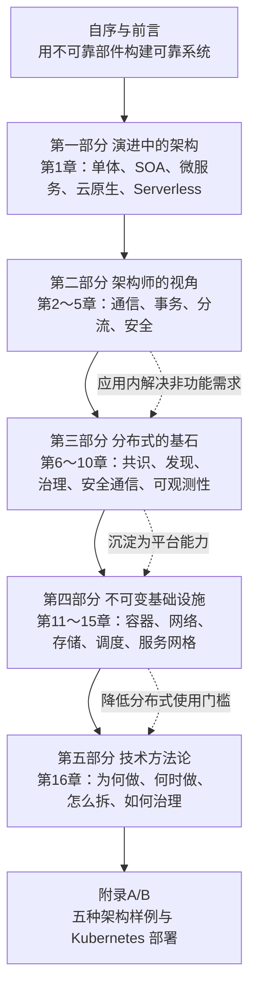

# 《凤凰架构》深度阅读：用不可靠部件构建可靠系统

> **书目信息**：周志明著，《凤凰架构：构建可靠的大型分布式系统》，机械工业出版社 2021 年出版，ISBN `978-7-111-68391-9`。本文的一手文本是题目提供的 EPUB：元数据显示出版日期为 2021-12-30，正文由自序、前言、五部分十六章、附录 A 和附录 B 构成。
>
> **证据边界**：**【原书】**表示 EPUB 正文直接提出的定义、论证或案例；**【当前补充】**表示截至 2026-09-19 根据作者网站、RFC、Kubernetes、OpenTelemetry、Istio 等官方资料核验的实践；**【纠正】**表示成书时合理、今天已经变化或不宜直接照搬的结论。作者维护的 [icyfenix.cn](https://icyfenix.cn/) 和 `fenixsoft/awesome-fenix` 仓库仍在更新，但未发现正式出版的新版图书，因此在线材料只用于勘误与现状对照，不替换题目指定版本。
>
> **代码说明**：原书强调原理而非堆砌代码，并将完整实践放在 Fenix's Bookstore 配套工程中。本文只保留必要的短片段，其余示例均按原书机制重新编写，并明确标注现代替代方案；未实际运行的分布式或 Kubernetes 示例不会声称已通过运行验证。

## 一、全书的核心问题：系统怎样在持续失败中保持可靠

### 1. 从作者的定义出发

【原书，前言】对全书主线的定义是：

> “本书是一本以‘如何构建一套可靠的大型分布式系统’为叙述主线的技术手册。”

【原书，自序】进一步把问题追溯到冯·诺依曼研究的理论命题：如何用一些“不可靠”部件构造出一个可靠的系统。作者并不假设程序员永不犯错、服务器永不宕机、网络永不分区，而是把错误视作大规模系统的正常组成部分。凤凰的比喻由此而来：某个节点可以老化、崩溃和消亡，只要系统能检测、隔离、替换和重建它，整体服务仍可稳定存续。

通俗地说，小系统常靠“把每个零件做结实”获得可靠性；大型分布式系统必须再增加一层能力：即使零件并不结实，整台机器也不能跟着倒下。这需要：

- 用冗余和共识处理节点故障，而不是相信唯一节点。
- 用超时、重试、熔断、隔离和限流约束失败传播。
- 用事务、事件和补偿处理跨服务数据不一致。
- 用日志、指标、追踪从外部推断内部状态。
- 用容器编排把实例视为可替换资源，而不是需要人工照顾的“雪花服务器”。
- 用自动化发布和治理让系统能够不断更新，而不依赖一次性设计永远正确。

作者对架构演进的概括尤其重要：从大型单体到微服务、服务网格和无服务，最根本的驱动力并不只是“性能更高”，而是让一个服务能够更容易地“死去与重生”。这也是理解后续十五章技术的钥匙：注册中心、熔断器、Pod、探针和控制平面看起来彼此无关，实质上都在帮助局部故障被发现、被限制并被替换。

### 2. 五部分的逻辑框架



五部分不是工具清单，而是抽象层次逐渐下沉再回到决策层：先看历史上为什么要拆；再站在架构师视角分析任何风格都必须面对的问题；随后讨论分布式服务怎样运行；然后把这些能力下沉到容器和网格；最后回到组织、边界与复杂性，判断是否真的应该采用微服务。

### 3. 架构风格的取舍

| 风格 | 部署与故障边界 | 非功能能力放在哪里 | 主要优势 | 主要代价 | 适合场景 |
| --- | --- | --- | --- | --- | --- |
| 单体架构 | 整个应用通常一起部署 | 进程内框架、数据库和外围设施 | 开发调试简单，调用快，事务直接 | 大型系统发布耦合、团队协调和局部扩缩困难 | 小中型系统、边界尚未稳定的产品 |
| SOA/ESB | 粗粒度企业服务 | ESB、WS-* 规范和集中治理平台 | 强标准、跨系统集成能力完整 | 中心化、规范沉重、演化缓慢 | 传统企业集成、异构遗留系统 |
| 应用层微服务 | 每个服务独立部署 | SDK、Spring Cloud、服务框架 | 团队自治、独立发布、技术异构 | 每种语言重复实现治理，业务代码夹杂基础设施逻辑 | 基础设施不成熟但需要服务自治的组织 |
| Kubernetes 云原生 | Pod/工作负载可替换 | DNS、Service、控制器、CNI、CSI | 声明式、自愈、弹性、环境一致 | 平台复杂，应用层细粒度治理仍不足 | 容器化服务、统一平台和大规模自动化 |
| Service Mesh | 工作负载与代理分离 | 数据平面和控制平面 | 语言无关地提供 mTLS、路由、遥测和策略 | 代理/网格运维成本、调试链路更长 | 多语言、大量服务、统一零信任和流量治理 |
| Serverless | 函数或托管服务为边界 | 云平台 | 按需伸缩、少运维、事件驱动效率高 | 冷启动、状态与长连接限制、厂商绑定 | 突发任务、事件处理、API、异步计算 |

不存在从单体到 Serverless 的“技术等级表”。越分布式，越容易独立更新和局部扩缩，也越需要处理网络、数据和组织复杂性。书中真正反对的是脱离问题追逐形式：一个能在单进程内正确解决的问题，拆成十个服务后不会自动变得更可靠；只有当独立发布、团队自治、故障隔离或异构需求带来的收益超过分布式成本，拆分才合理。

## 二、章节地图：每章为可靠性补上哪块拼图

| 顺序 | 标题 | 核心内容 | 解决问题的思路 |
| --- | --- | --- | --- |
| 自序 | 流水不腐，户枢不蠹 | Phoenix、可靠系统、架构演进和 Fenix's Bookstore | 承认局部必然失败，以自动恢复维持整体稳定 |
| 前言 | 如何阅读本书 | 五部分定位、读者对象、实践项目与作者网站 | 先运行样例建立整体认识，再回到原理和方法论 |
| 第 1 章 | 服务架构演进史 | 原始分布式、单体、SOA、微服务、后微服务、无服务 | 从每代架构解决的问题和新增代价理解技术选择 |
| 第 2 章 | 访问远程服务 | IPC、RPC 三问题、CORBA/Web Service、现代 RPC、REST、RMM | 承认远程调用不是本地调用，按交互语义选 RPC 或 REST |
| 第 3 章 | 事务处理 | 本地事务、全局事务、共享事务、CAP、可靠事件、TCC、Saga | 从强一致逐步放宽到业务可接受的最终一致和补偿 |
| 第 4 章 | 透明多级分流系统 | 浏览器缓存、DNS、HTTP/QUIC、CDN、L2/L3/L7 负载均衡、服务端缓存 | 在请求到达业务前逐层过滤、就近处理和均衡流量 |
| 第 5 章 | 架构安全性 | 认证、授权、RBAC、OAuth 2、Session/JWT、密码学、TLS、验证 | 从身份、权限、凭证、保密、传输和输入六层建立纵深防御 |
| 第 6 章 | 分布式共识 | Basic Paxos、Multi-Paxos、Gossip | 在消息延迟、丢失和节点故障下形成一致决定或最终收敛 |
| 第 7 章 | 从类库到服务 | 服务发现、注册中心、网关、I/O 模型、BFF、客户端/代理负载均衡 | 给动态服务建立可定位、可路由和可按地域选择的调用入口 |
| 第 8 章 | 流量治理 | 故障转移、重试、熔断、隔离、降级，QPS/TPS/HPS，限流算法 | 限制故障和流量的传播范围，保护系统的核心服务能力 |
| 第 9 章 | 可靠通信 | 零信任、BeyondCorp/BeyondProd、PKI、服务/用户认证与授权 | 不因网络位置默认信任，以工作负载身份和策略保护每次调用 |
| 第 10 章 | 可观测性 | 日志管道、Trace/Span、采集方式、追踪标准、指标、时序库、告警 | 用日志、追踪、指标从外部输出反推分布式系统内部状态 |
| 第 11 章 | 虚拟化容器 | chroot、namespace、cgroups、LXC、Docker、Kubernetes、Kustomize、Helm、Operator、OAM | 将环境与应用一起封装，让实例可重复创建并由控制器维护 |
| 第 12 章 | 容器间网络 | Linux 网络栈、Netfilter、虚拟设备、Docker 网络、CNM/CNI、Overlay/Route/Underlay | 让隔离的网络命名空间在节点内和跨节点可靠通信 |
| 第 13 章 | 持久化存储 | Volume、PV/PVC、StorageClass、FlexVolume、CSI、插件生态 | 将短命容器与长寿数据解耦，并由标准接口动态供应存储 |
| 第 14 章 | 资源与调度 | 资源模型、requests/limits、QoS、优先级、驱逐、过滤和打分 | 在资源有限时把工作负载放到合适节点，并优先保护重要服务 |
| 第 15 章 | 服务网格 | 通信演进、数据平面、控制平面、SMI、UDPA/xDS、网格生态 | 用透明代理把通信治理从业务代码下沉到基础设施 |
| 第 16 章 | 向微服务迈进 | 驱动力、前提、粒度、静态与演进治理 | 先证明拆分收益，再解决组织、边界和持续腐化问题 |
| 附录 A | 技术演示工程实践 | Spring Boot、Spring Cloud、Kubernetes、Istio、AWS Lambda 五套实现 | 用相同业务比较不同架构把复杂性放在何处 |
| 附录 B | 部署 Kubernetes 集群 | kubeadm、软件源、运行时、镜像、网络插件、节点加入 | 从零搭建实验集群；旧命令需按当前 Kubernetes 重写 |

## 三、按书中五个阶段连续精读

### 第一阶段：先理解架构为何演进

#### 第 1 章　服务架构演进史：每次进步都在交换复杂性

##### 1.1 原始分布式时代：透明远程调用的昂贵教训

【原书】DCE、DCE/RPC、DCE/DFS、Kerberos、CORBA 等早期探索已提出今天熟悉的服务发现、序列化、认证、授权和一致性问题。它们试图让远程资源像本地资源一样透明，但网络延迟、局部失败和异构环境无法被语法隐藏。

书中引用的教训值得作为分布式设计第一原则：

> “某个功能能够进行分布式，并不意味着它就应该进行分布式，强行追求透明的分布式操作，只会自寻苦果。”

调用栈内方法要么返回、要么抛错；远程调用还可能已经在服务端成功、但响应丢失，调用方无法判断是否应该重试。任何“像本地方法一样”的 RPC 封装都不能消灭这种语义差异。

##### 1.2 单体系统时代：单体并不是反派

作者明确限定批评对象是“大型单体”。小系统使用单体往往开发、测试、部署更简单，进程内调用性能更高，本地事务也更直接。单体真正的瓶颈通常出现在：代码和团队规模超过可理解范围、任何小改动都要求整体发布、模块不能按不同压力独立扩缩、故障边界覆盖整个进程。

现代实践中的“模块化单体”可用清晰模块边界、内部事件、独立 schema 约束和架构测试延缓这些问题。它常是新产品比“从第一天微服务”更稳妥的起点。

##### 1.3 SOA 时代：拆开系统后，用标准重新连接

原书从烟囱式系统、微内核和事件驱动等拆分尝试进入 SOA。SOA 借助 Web Service、SOAP、WSDL、UDDI 和 ESB 追求跨语言、跨组织的企业服务复用。它解决了异构系统互操作，却也容易把中央总线变成组织和技术瓶颈：协议复杂、治理集中、修改流程缓慢。

SOA 留下的价值没有消失：契约优先、服务复用、消息集成和企业级治理今天仍然重要。微服务反对的主要是过度中心化和重量级统一，不是否认服务化本身。

##### 1.4 微服务时代：围绕业务能力自治

微服务强调服务围绕业务能力组织、独立部署、去中心化治理、轻量通信、自动化基础设施和面向失败设计。其优势来自“独立变化”：一个团队可在不协调全公司的情况下发布某个业务能力，一个热点服务可单独扩容，一个故障也可被限制在局部。

代价同样来自“独立”：进程内调用变成网络调用，本地事务变成分布式协调，单一日志变成跨服务追踪，代码复用变成服务契约治理。微服务不是把类拆小，而是重新划分业务所有权和运行边界。

##### 1.5 后微服务时代：把通用能力下沉到基础设施

作者用“后微服务”描述 Kubernetes 和 Service Mesh 带来的转变：服务发现、负载均衡、配置、认证和遥测不一定都要由应用 SDK 实现，可以由可编程基础设施提供。这样多语言服务不必分别接入一套框架，治理策略也更容易统一。

这不是让开发者完全不知道分布式。超时、幂等、数据一致性和业务降级仍与业务语义相关，无法全部交给网格或平台。

##### 1.6 无服务时代：把服务器责任交给云平台

原书把 Serverless 拆为 BaaS（Backend as a Service）和 FaaS（Function as a Service）。它适合短时、无状态、事件驱动、流量不稳定的任务；复杂状态、长连接、极低延迟和持续高负载则可能受到冷启动、平台限制和成本曲线影响。

【当前补充】Java 运行时的冷启动已有 SnapStart、CRaC、Native Image 等缓解方式，但状态外置、可观测性、厂商事件模型和成本不可预测仍是架构问题。Serverless 与微服务没有继承关系：函数可以实现微服务，容器也可以承载事件函数。

**本章术语**：

- **DCE（Distributed Computing Environment）**：早期标准化分布式计算环境。
- **SOA（Service-Oriented Architecture）**：以可复用服务和标准契约组织企业系统的架构风格。
- **ESB（Enterprise Service Bus）**：集中承担协议转换、路由和集成的企业服务总线。
- **BaaS / FaaS**：托管后端能力 / 按事件运行的函数服务。
- **不可变基础设施**：不在原实例上持续修补，而是构建新制品并替换旧实例。

### 第二阶段：站在架构师视角处理任何系统都会遇到的问题

#### 第 2 章　访问远程服务：网络会改变调用语义

##### 2.1.1～2.1.3 IPC、通信成本和 RPC 的三个基本问题

原书从本地方法的调用者、被调用者、调用点、参数和返回值出发，比较管道、信号、共享内存、消息队列、Socket 等 IPC 方式，再归纳 RPC 必须回答的三类问题：

1. **如何表示数据**：序列化、字节序、类型映射和版本兼容。
2. **如何传递数据**：连接、报文边界、超时、重传、流控与安全。
3. **如何定位方法**：服务地址、接口标识、IDL、客户端桩和服务端骨架。

```protobuf
syntax = "proto3";

service InventoryService {
  rpc Reserve(ReserveRequest) returns (ReserveReply);
}

message ReserveRequest {
  string order_id = 1;
  string sku = 2;
  int32 quantity = 3;
}
```

这段现代 gRPC IDL 同时约定服务入口和中立数据格式，但仍未解决业务幂等、调用超时和服务端成功后响应丢失的问题。客户端必须给每次写操作携带业务唯一键，并把“未知结果”作为显式状态处理。

##### 2.1.4～2.1.5 从统一 RPC 到各取所长

CORBA 和 Web Service 试图通过复杂标准统一跨语言调用，最终受到实现差异和复杂度拖累。现代 RPC 反而接受“没有完美协议”：gRPC 强调 Protobuf、HTTP/2 和流；Dubbo 贴合 Java 服务治理；Thrift 强调跨语言 IDL；JSON-RPC 保持简单。

选择 RPC 时要比较：语言生态、协议演进、流式能力、浏览器支持、可观测性、错误模型和网关兼容，而不是只测一次序列化速度。内部高频、强契约调用适合 RPC；开放互联网接口通常更需要 HTTP 生态和可读性。

##### 2.2 REST：面向资源，而不是把方法名搬到 URL

原书说明 REST 与 RPC 不是同类技术的简单胜负关系。RPC 从过程抽象问题，REST 从资源和状态转移抽象网络交互。Fielding 提出的六项约束包括客户端/服务端分离、无状态、可缓存、统一接口、分层系统和按需代码（可选）。

```http
POST /orders HTTP/1.1
Content-Type: application/json
Idempotency-Key: 77f19b5e

{"customerId":"u-1","items":[{"sku":"book-1","quantity":1}]}
```

统一接口要求正确使用方法、状态码、媒体类型和缓存语义。`POST /createOrder` 可以工作，却仍停留在 RPC 式动作命名；`POST /orders` 表达“在订单集合中创建资源”。

##### 2.2.3 RMM 与 2.2.4 争议

Richardson Maturity Model 从 Level 0 的单端点 RPC，经过资源、HTTP 动词，到 Level 3 的超媒体控制，描述 REST 成熟度。HATEOAS 能降低客户端对流程硬编码，但会增加设计和工具成本，现实 API 常停留在 Level 2。

REST 的主要边界是：它与 HTTP 语义深度绑定，不适合需要精确二进制布局、极低开销或强双向流的内部通信；复杂查询也可能产生过多往返。GraphQL、gRPC、WebSocket 和事件流不是对 REST 的全面替代，而是针对不同交互形态的工具。

**本章术语**：

- **IPC（Inter-Process Communication）**：进程间通信。
- **RPC（Remote Procedure Call）**：把远程服务抽象为过程调用的通信方式。
- **IDL（Interface Definition Language）**：跨语言描述服务与数据契约的接口定义语言。
- **REST（Representational State Transfer）**：通过资源表示和统一接口进行状态转移的架构风格。
- **RMM（Richardson Maturity Model）**：REST API 成熟度模型。

#### 第 3 章　事务处理：一致性不是只有一种强度

##### 3.1 本地事务：WAL、锁与 MVCC 如何实现 ACID

原书首先强调，事务存在的目的不是“让 SQL 成组执行”，而是让数据状态满足业务一致性。原子性和持久性通常依赖 Write-Ahead Logging：修改数据页前先记录日志，崩溃后通过 redo/undo 恢复。隔离性则通过锁、MVCC 和不同隔离级别平衡并发与异常现象。

- **读未提交**可能发生脏读。
- **读已提交**阻止脏读，但同一事务可能重复读取到不同结果。
- **可重复读**稳定已读取行，但实现和幻读语义随数据库而异。
- **串行化**最接近事务串行执行，冲突与重试成本最高。

不要只看隔离级别名称，应阅读具体数据库文档并测试写偏斜、范围查询和唯一约束等业务场景。

##### 3.2 全局事务与 3.3 共享事务

原书把全局事务限定为单服务访问多个数据源，典型是 XA/DTP 的两阶段提交。协调者先让参与者 Prepare，再统一 Commit/Rollback。它能获得强一致，却引入协调器、资源锁定和故障恢复成本，不适合跨大量微服务长时间持锁。

共享数据库让多个服务继续使用本地数据库事务，看似简单，却牺牲了服务自治：表结构、发布节奏和性能故障重新耦合。它可作为迁移阶段的过渡方案，但需要明确表所有权，避免所有服务任意读写所有表。

##### 3.4.1 CAP 与 ACID：CAP 只在分区发生时迫使选择

CAP 讨论的是发生网络分区时，一致性和可用性不能同时完全保证。它不是日常场景中机械的“三选二”，也不表示 CP 系统平时不可用。架构师真正要决定的是：分区期间某项业务更愿意拒绝/等待请求，还是接受临时不一致。

支付扣款可能偏向一致性；商品浏览量可以偏向可用性；同一系统的不同数据完全可以选择不同策略。

##### 3.4.2 可靠事件队列

原书以 BASE 和最终一致性说明事件驱动事务。关键不是“用了 MQ 就可靠”，而是解决数据库与消息代理双写：

```sql
begin;
update orders set status = 'PAID' where id = :order_id;
insert into outbox(event_id, aggregate_id, event_type, payload)
values (:event_id, :order_id, 'OrderPaid', :json);
commit;
```

独立发布器读取 outbox 并发送消息；消费者以 `event_id` 去重。消息至少一次投递意味着业务处理必须幂等，不能把 broker 的确认机制误当作端到端“恰好一次”。

##### 3.4.3 TCC 与 3.4.4 Saga

TCC 把业务拆为 Try（预留资源）、Confirm（提交）和 Cancel（释放），隔离性较强、性能较高，但要求参与方提供三套幂等接口，对业务侵入大。Saga 把长事务拆成一系列本地事务，每步配置补偿操作，适合无法冻结资源或调用外部服务的流程。

```text
创建订单 -> 扣减库存 -> 支付 -> 安排配送
   |失败       |失败      |失败
取消订单 <- 归还库存 <- 退款/撤销支付
```

补偿不是数据库回滚：退款无法抹去用户已收到的通知，发货后也可能只能进入退货流程。因此 Saga 必须把中间状态、人工介入和不可补偿动作纳入领域模型。

**本章术语**：

- **ACID**：原子性、一致性、隔离性、持久性。
- **WAL（Write-Ahead Logging）**：数据页落盘前先持久化日志。
- **MVCC（Multi-Version Concurrency Control）**：通过多版本数据减少读写阻塞。
- **TCC（Try-Confirm-Cancel）**：业务资源预留、确认和取消的柔性事务模式。
- **Saga**：由本地事务和补偿动作组成的长事务模型。

#### 第 4 章　透明多级分流系统：让大部分请求尽量不要走到业务核心

##### 4.1 客户端缓存：强制缓存与协商缓存并行工作

原书从 HTTP 无状态带来的重复传输讲起。强制缓存通过 `Cache-Control: max-age`、`Expires` 承诺有效期，在过期前不访问服务器；协商缓存通过 `ETag/If-None-Match` 或 `Last-Modified/If-Modified-Since` 询问资源是否变化，未变化返回 `304 Not Modified`。

```http
HTTP/1.1 200 OK
Cache-Control: public, max-age=300, stale-while-revalidate=30
ETag: "product-42-v7"
```

内容带用户隐私时要谨慎使用 `public`；资源 URL 带内容哈希时可以设置长时间 `immutable`。缓存不是“浏览器自己猜”，其一致性边界应由服务端响应头明确声明。

##### 4.2 DNS：分层、缓存与最终一致的全球目录

DNS 通过根、顶级域和权威服务器的分层授权避免单点目录，递归解析器和客户端缓存用 TTL 减少查询压力。它既能做域名解析，也能用于就近路由、故障切换和服务发现。

局限是 TTL 内记录可能陈旧，DNS 也不感知一次业务请求是否成功。内部服务若需要秒级实例变化，通常由 Kubernetes Service、注册中心或代理在 DNS 之上继续处理健康和负载均衡。

##### 4.3 传输链路：连接、压缩和 QUIC

原书沿 HTTP/1.x 短连接、Keep-Alive、流水线、HTTP/2 多路复用，讲到以 UDP 为基础的 QUIC 和 HTTP/3。书中写作时 HTTP/3 仍处在快速发展阶段；【当前补充】QUIC 已由 RFC 9000 标准化，HTTP/3 已由 RFC 9114 标准化。

QUIC 把可靠传输、拥塞控制、TLS 1.3 和多路复用整合在用户态，以独立流减少 TCP 层队头阻塞，并支持连接迁移。它并没有让丢包免费：单个流仍需重传，UDP 也可能受到中间网络限制。

压缩要按内容类型决定。文本适合 gzip/Brotli/Zstandard，已经压缩的图片、视频和归档再次压缩收益很小。机密数据与攻击者可控输入共同压缩时还要考虑 BREACH 等侧信道风险。

##### 4.4 CDN：路由到边缘，再管理副本

CDN 用 DNS/Anycast 等方式把用户导向边缘节点，再通过主动分发或回源拉取获得内容。今天 CDN 还常承担 TLS 终止、DDoS 防护、WAF、边缘函数、图片处理和 API 加速。

缓存规则应围绕“什么可以共享、多久更新、如何主动失效”设计。错误缓存、Cookie 参与缓存键不完整、源站未验证 CDN 回源身份，都可能造成数据泄漏或缓存投毒。

##### 4.5 负载均衡：不同层级看到的信息不同

原书依次解释二层数据帧、三/四层 IP/TCP 转发和七层应用代理。层级越高，均衡器越理解 HTTP 路径、Header、Cookie 和用户身份，也付出更多解析和代理成本。

- **L4**：吞吐高、协议通用，适合 TCP/UDP 转发。
- **L7**：能按域名、路径、Header、版本路由，并执行认证、重写和观测。
- **策略**：轮询、加权、最少连接、一致性哈希、延迟/地域感知。

负载均衡必须结合健康检查和慢启动。把刚恢复的实例立即灌入满负载，可能造成反复失败。

##### 4.6 服务端缓存：命中率之外还有一致性和雪崩

原书从容量、淘汰、过期和一致性等缓存属性，进入穿透、击穿、雪崩和污染风险。常见策略包括 Cache-Aside、Read/Write Through、Write Behind；最常用的 Cache-Aside 流程是读缓存，未命中读数据库再回填，写数据库后删除缓存。

```text
读取：Cache 命中 -> 返回
      Cache 未命中 -> DB -> 回填 Cache -> 返回

更新：写 DB -> 删除 Cache
```

删除失败要重试或通过 CDC/消息修复；热点键用请求合并、互斥加载、逻辑过期和多级缓存保护；空结果短时缓存或布隆过滤器可减少穿透。缓存永远增加一个需要保持一致的副本，因此应在性能证据明确时使用。

**本章术语**：

- **ETag**：资源特定版本的验证标识。
- **CDN（Content Delivery Network）**：把内容副本分布到靠近用户的边缘网络。
- **Anycast**：多个节点发布同一地址，由路由把流量送往合适节点。
- **队头阻塞（Head-of-Line Blocking）**：前一个数据单元阻塞后续独立数据。
- **缓存雪崩**：大量缓存同时失效，流量集中冲击后端。

#### 第 5 章　架构安全性：从“你是谁”一直验证到“你做得对不对”

##### 5.1 认证：标准和实现必须分开理解

认证确认主体身份。原书从 Servlet/JAAS 等 Java 规范讲到 Spring Security 的实现，重点不是记住某个框架类，而是把身份提供者、凭据校验、认证结果和上下文传播分开。

现代系统常把认证交给 OIDC 身份提供者，应用只验证授权码或令牌；企业内部可能使用 LDAP/Active Directory；服务间身份则更适合证书和工作负载身份。不要让每个业务服务独立保存一份用户密码。

##### 5.2 RBAC 与 OAuth 2

RBAC 回答“谁以什么角色对哪些资源执行什么操作”。角色数量不断膨胀时，可加入资源属性、组织关系和环境条件形成 ABAC/ReBAC，但模型越灵活，策略解释和审计越困难。

OAuth 2 专门解决第三方委托授权，不是通用登录协议；身份层由 OIDC 补充。【当前补充】RFC 9700 已成为 OAuth 2.0 Security Best Current Practice：新客户端应使用授权码 + PKCE，避免 Implicit Grant 和 Resource Owner Password Credentials，并严格校验 redirect URI、issuer 和 audience。

##### 5.3 Cookie-Session 与 JWT

Session 把状态保存在服务端，Cookie 只携带会话标识，容易注销和集中控制，但集群需要共享/粘性会话或统一会话存储。JWT 把签名声明交给客户端携带，资源服务器可本地验证，适合跨服务传播，却难以主动撤销、容易因 payload 过大增加请求成本。

JWT 是签名容器而不是加密容器。敏感数据不应因为 Base64URL 看起来不可读就写入其中。短生命周期 access token、刷新令牌轮换和撤销列表可降低泄漏风险。

##### 5.4 保密：客户端“再加密一次”不能代替 TLS

原书区分不同保密强度，讨论客户端加密和密码存储。客户端脚本与加密公钥同样由服务器下发，中间人若能篡改页面，也能替换加密逻辑，因此自定义前端加密不能替代 HTTPS。

密码存储应采用带盐的自适应单向函数，如 Argon2id、scrypt 或 bcrypt。盐用于阻止彩虹表和相同密码产生相同哈希；pepper 可由独立秘密系统保存。不能使用 MD5/SHA-1/SHA-256 直接哈希密码，它们太快，反而有利于暴力破解。

##### 5.5 摘要、加密、签名、证书和 TLS

- **摘要**验证内容是否变化，不提供身份。
- **对称加密**适合大量数据，密钥分发困难。
- **非对称加密/签名**解决密钥协商、身份和不可抵赖，但计算成本更高。
- **数字证书**由 CA 将主体身份与公钥绑定。
- **TLS**自动完成版本协商、证书验证、密钥交换、加密和完整性保护。

现代 TLS 应淘汰 SSL、TLS 1.0/1.1 和弱密码套件，自动续期证书并监控过期。mTLS 让通信双方都出示证书，适合服务间零信任。

##### 5.6 验证：合法身份也可能提交恶意数据

验证包括格式、范围、引用完整性、状态转换和业务不变量。客户端校验用于体验，服务端校验才是安全边界。参数化 SQL、防止路径穿越、限制上传类型/大小、输出编码和反序列化白名单都属于“你做得对不对”。

**本章术语**：

- **AAAA**：Authentication、Authorization、Audit、Account/Accounting。
- **RBAC（Role-Based Access Control）**：基于角色的访问控制。
- **OIDC（OpenID Connect）**：建立在 OAuth 2 之上的身份协议。
- **PKI（Public Key Infrastructure）**：证书、CA、密钥和信任链基础设施。
- **mTLS（Mutual TLS）**：客户端和服务端双向证书认证。

### 第三阶段：让分布式服务可以形成共识、被找到、受控制并可观察

#### 第 6 章　分布式共识：节点不同步时，怎样对一个值作出决定

##### 6.1 Basic Paxos：安全性与活性是两件事

Paxos 假设消息会丢失、延迟、重复，节点会宕机恢复，但不处理节点恶意撒谎的拜占庭故障。角色包括 Proposer、Acceptor、Learner；多数派是任意两个法定集合必有交集的关键。

简化流程如下：

```text
Phase 1 Prepare:
Proposer -> Acceptors: 提案编号 n
Acceptors -> Proposer: 承诺不接受小于 n 的提案，并返回已接受的最大提案

Phase 2 Accept:
Proposer -> Acceptors: 提交值 v（若返回过旧值，必须继承编号最高者）
多数 Acceptors 接受 -> 值被选定 -> Learners 获知
```

编号和多数派规则保证不会选出两个不同值，这是安全性；多个 proposer 反复抢占可能导致活锁，说明“永不产生错误决定”不等于“总能及时作出决定”。

##### 6.2 Multi-Paxos：稳定领导者摊薄共识成本

Multi-Paxos 选出相对稳定的 leader，后续日志条目通常跳过反复竞争，形成复制状态机。Raft 用更容易理解的 leader election、log replication 和 safety 规则表达相似工程目标；ZAB 服务于 ZooKeeper 的原子广播。

不要自己在业务代码中实现共识算法。生产系统通常通过 etcd、ZooKeeper、Consul 或数据库复制协议使用它，并理解其仲裁数、故障域和成员变更规则。

##### 6.3 Gossip：允许暂时不同，换取去中心化扩散

Gossip 让节点周期性随机交换状态，信息像流言一样最终传播到全网，适合成员发现、故障探测和最终一致数据。它扩展性和容错性好，但收敛时间不确定，外部可能观察到临时不一致。

强共识与 Gossip 不是替代关系：前者适合 leader、锁、配置版本等不能同时出现两个答案的状态；后者适合节点健康、拓扑和可容忍延迟的副本信息。

**本章术语**：

- **Quorum（法定多数）**：能够作出有效决定的节点集合。
- **Safety**：系统不会产生相互矛盾的决定。
- **Liveness**：系统最终能继续推进并作出决定。
- **活锁**：节点持续工作和交互，却无法完成目标。
- **拜占庭故障**：节点可能发送任意甚至相互矛盾的信息。

#### 第 7 章　从类库到服务：动态网络中的链接、入口和选择

##### 7.1 服务发现：服务化世界的动态链接器

原书把服务坐标拆为 FQDN、端口和服务标识。发现过程包括服务注册、目录维护和服务查询。真正的取舍是“目录短暂不可用”和“目录返回陈旧实例”哪种后果更严重，而不是简单争论注册中心应该 CP 还是 AP。

Kubernetes 中可用声明式 Service 代替应用自建注册：

```yaml
apiVersion: v1
kind: Service
metadata:
  name: inventory
spec:
  selector:
    app: inventory
  ports:
    - port: 8080
      targetPort: 8080
```

客户端访问 `inventory:8080`，集群 DNS 和 Service/EndpointSlice 负责把稳定名称映射到动态 Pod。健康检查必须区分“进程存在”和“可以接请求”。

##### 7.2 网关：外部世界不应理解内部每个服务

网关统一处理路由、协议转换、认证、配额、聚合和观测。它不能承载无限业务逻辑，否则会成为新的 ESB 和发布瓶颈。外部 API 网关、入口控制器和服务网格 egress/ingress gateway 的职责应明确区分。

原书从阻塞、非阻塞、同步、异步 I/O 模型解释网关为何偏好事件驱动网络框架。高吞吐网关仍要避免在事件循环执行阻塞认证、同步日志或慢 DNS 查询。

##### 7.2.3 BFF：按前端体验组织接口

BFF 为 Web、移动端、桌面端提供不同聚合和数据形态，降低客户端往返和对内部服务的理解。代价是接口逻辑重复和更多部署单元。简单字段选择可由 GraphQL 处理，涉及终端专属流程、协议和安全策略时 BFF 更合适。

##### 7.3 客户端与代理负载均衡

应用内客户端均衡能基于业务和调用信息灵活选择实例，但每种语言都要维护 SDK。代理均衡由 sidecar/node proxy 统一实现，语言无关，却增加转发层和平台依赖。

【当前补充】Netflix Ribbon 已停止活跃发展，Spring 体系使用 Spring Cloud LoadBalancer；Kubernetes 与网格环境更多依靠 Service、Envoy 或 eBPF 数据面。区域感知应优先同 Zone 调用以降低延迟和跨区成本，同时保留跨 Zone 故障转移。

**本章术语**：

- **FQDN（Fully Qualified Domain Name）**：完整限定域名。
- **BFF（Backend for Frontend）**：面向特定前端定制的后端入口。
- **EndpointSlice**：Kubernetes 用于分片表达 Service 后端端点的资源。
- **Locality**：Region、Zone、Sub-zone 等地域拓扑信息。
- **事件循环**：用少量线程处理大量非阻塞 I/O 事件的执行模型。

#### 第 8 章　流量治理：系统可靠性的关键是拒绝失控

##### 8.1.1 容错策略：面对失败，系统准备做什么

原书归纳的策略可以放进一个决策顺序：

- **故障转移**：换一个实例、区域或备用系统。
- **快速失败**：明确失败比无限等待更可控。
- **安全失败**：返回缓存、默认值或降级结果。
- **静默失败**：只适用于可忽略的旁路功能，必须留下观测证据。
- **故障恢复**：重试、补偿、重建或人工处理。
- **并行调用**：同时请求多个候选，取首个有效结果，以资源换延迟。

策略必须与业务幂等性配套。查询超时可重试，扣款超时不能在没有幂等键时盲目重试。

##### 8.1.2 容错设计模式：隔离失败传播路径

```java
@CircuitBreaker(name = "inventory", fallbackMethod = "fallback")
@TimeLimiter(name = "inventory")
public CompletableFuture<Stock> query(String sku) {
    return CompletableFuture.supplyAsync(() -> client.getStock(sku));
}
```

现代 Java 项目常用 Resilience4j 实现超时、重试、熔断、舱壁和限流。顺序很重要：超时应覆盖一次调用；重试会放大流量；熔断基于统计窗口停止请求；舱壁限制线程、连接或并发数，避免一个依赖耗尽全局资源。

【当前补充】Hystrix 已进入维护状态，不宜作为新项目默认选择。平台或网格可实现通用超时和熔断，但只有业务知道什么能重试、什么可以降级。

##### 8.2.1 流量指标：QPS、TPS、HPS 不能混用

QPS 衡量请求，TPS 衡量业务事务，HPS 常用于每秒命中/HTTP 请求等特定语境；并发数还取决于平均响应时间，可用 Little's Law 近似理解：

```text
系统内平均并发数 L = 平均到达率 λ × 平均停留时间 W
```

如果下游响应从 50ms 升到 1s，即使 QPS 不变，并发占用也可能增长 20 倍。因此限流不能只盯入口 QPS，还要观察延迟、队列、连接池和拒绝率。

##### 8.2.2 限流算法与 8.2.3 分布式限流

- **固定窗口计数器**简单，但边界处可瞬间通过两倍配额。
- **滑动窗口**统计更平滑，内存和计算成本更高。
- **漏桶**按稳定速率流出，适合整形，突发能力弱。
- **令牌桶**按速率补充令牌，允许可控突发，是常见 API 限流模型。

分布式限流可在网关集中执行，也可使用 Redis/Lua、集中配额服务或分层本地令牌。强全局准确会增加每次请求的协调延迟；大多数系统更适合“全局预算 + 节点局部配额 + 最终校正”。

**本章术语**：

- **Circuit Breaker（断路器）**：故障率超过阈值后暂时停止调用下游。
- **Bulkhead（舱壁）**：将资源分池，限制单一依赖拖垮全局。
- **QPS / TPS**：每秒请求数 / 每秒业务事务数。
- **令牌桶**：按固定速率生成令牌、请求消费令牌的限流算法。
- **自适应限流**：依据延迟、并发和系统负载动态调整准入量。

#### 第 9 章　可靠通信：从边界安全转向每次调用都验证

##### 9.1 零信任网络及其特征

传统边界安全把“内网”视为可信，一旦攻击者进入边界，横向移动很容易。零信任的中心原则是：网络位置不构成身份，不自动信任任何主体；每次访问都要认证、授权、加密并留下审计。

原书以 Google BeyondCorp 和 BeyondProd 说明零信任从办公访问延伸到云原生生产环境。目标包括：工作负载有可验证身份；策略基于身份和上下文；凭据短期、可轮换；安全默认自动化，人为操作成为例外。

##### 9.2.1 建立信任：PKI 与工作负载身份

服务没有共享密码时，通常依赖 CA 签发证书。证书中的身份不应只是易变 IP，而应绑定服务账户、命名空间和工作负载。SPIFFE/SPIRE 提供统一工作负载身份规范与签发机制，服务网格也常内建证书轮换。

##### 9.2.2 认证与 9.2.3 授权

原书区分服务认证（Peer Authentication）和最终用户请求认证（Request Authentication）：前者多用 mTLS，后者多用 JWT/OIDC。认证成功后再通过 RBAC/属性策略决定权限。

```yaml
apiVersion: security.istio.io/v1
kind: AuthorizationPolicy
metadata:
  name: inventory-access
spec:
  selector:
    matchLabels:
      app: inventory
  rules:
    - from:
        - source:
            principals:
              - cluster.local/ns/shop/sa/order-service
      to:
        - operation:
            methods: ["POST"]
            paths: ["/reservations"]
```

网络策略限制“哪些工作负载能连通”，身份策略限制“连接后能做什么”，两者应共同使用。仅开启 mTLS 只能证明通信双方身份和链路安全，并不会自动赋予最小权限。

**本章术语**：

- **Zero Trust**：不因网络位置默认信任，持续验证主体和请求。
- **BeyondCorp / BeyondProd**：Google 面向员工访问 / 生产工作负载的零信任实践。
- **SPIFFE**：为工作负载定义可移植身份的开放规范。
- **Peer Authentication**：对发起服务调用的工作负载进行认证。
- **Least Privilege**：只授予完成任务必需的最小权限。

#### 第 10 章　可观测性：不是收集数据，而是能够回答未知问题

##### 10.1 事件日志：从输出到查询是一条数据管道

原书把日志系统拆为输出、收集与缓冲、加工与聚合、存储与查询。应用应输出结构化日志，包含时间、级别、服务、实例、trace/span ID、事件名和必要业务标识；不能记录密码、访问令牌、银行卡号等秘密。

```json
{
  "timestamp":"2026-09-19T10:20:30Z",
  "level":"WARN",
  "service":"payment",
  "trace_id":"4f9c...",
  "event":"payment_timeout",
  "order_id":"o-42",
  "duration_ms":2010
}
```

Agent/Collector 负责采集，队列负责削峰，解析器统一字段，存储提供索引和保留策略。【纠正，第 10.1.4 节】原书称 Elasticsearch 在日志分析方面“几乎是唯一答案”，这是 2021 年语境下的强势判断。今天 OpenSearch、Grafana Loki、ClickHouse 及云厂商日志服务都已是成熟选择，应按全文检索、成本、标签模型和保留周期选择。

##### 10.2 Trace 与 Span

一次 Trace 表示请求穿越系统的完整路径，每次服务调用形成 Span。上下文通过 W3C Trace Context 等标准在 HTTP/消息头传播。采样必须保留错误和高延迟请求，否则最需要排查的链路反而可能被丢弃。

原书比较基于日志、服务埋点和边车代理的收集方式。自动探针能低成本覆盖通用 HTTP/RPC，业务关键阶段仍需手工 Span 和事件，才能回答“支付在风控还是银行阶段变慢”。

##### 10.2.3 追踪规范化：OpenTelemetry 已成为统一入口

书中写作时 OpenTracing、OpenCensus 和厂商 SDK 尚在整合。【当前补充】OpenTelemetry 已统一 traces、metrics、logs 的 API、SDK、语义约定和 Collector 管道，并强调数据所有权与避免厂商锁定。新系统应优先使用 OTel，而不是分别接入多个专有探针。

```yaml
receivers:
  otlp:
    protocols:
      grpc: {}
      http: {}
processors:
  batch: {}
exporters:
  otlphttp:
    endpoint: https://observability.example.com
service:
  pipelines:
    traces:
      receivers: [otlp]
      processors: [batch]
      exporters: [otlphttp]
```

##### 10.3 聚合度量：低成本观察总体趋势

指标类型包括 Counter、Gauge、Histogram 和 Summary。Prometheus 使用拉取模型、时序标签和 PromQL；长期存储可接 Thanos、Mimir、VictoriaMetrics 等。标签必须控制基数，不能把 userId、traceId、完整 URL 当成普通 label。

告警应从“机器 CPU 高”逐步转向用户可感知的 SLI/SLO，例如成功率、P95/P99 延迟和错误预算消耗。日志适合离散事件，Trace 适合单次因果链，Metrics 适合总体趋势；三者通过一致的资源属性和 trace ID 关联。

**本章术语**：

- **Observability**：从系统外部输出推断内部状态的能力。
- **Trace / Span**：一次端到端请求 / 其中一个操作区间。
- **OTLP**：OpenTelemetry Protocol，传输遥测数据的协议。
- **SLI / SLO**：服务水平指标 / 服务水平目标。
- **Cardinality**：标签组合的不同取值数量。

### 第四阶段：把分布式能力沉入不可变基础设施

#### 第 11 章　虚拟化容器：把机器变成可重复创建的运行环境

##### 11.1.1～11.1.4 从 chroot 到 LXC

原书按历史顺序解释容器不是一种单独发明：`chroot` 隔离文件视图；Linux namespace 隔离进程、网络、挂载、用户等资源视图；cgroups 限制和统计 CPU、内存、I/O；LXC 把这些内核能力封装成可用的系统容器。

【当前补充】cgroups v2 已成为现代 Linux/Kubernetes 的主流统一层级，提供更一致的控制器行为。容器共享宿主机内核，不等同于虚拟机安全边界；高风险多租户可使用 Kata Containers、gVisor 或虚拟机加强隔离。

##### 11.1.5 Docker：成功来自镜像、体验和生态

Docker 的关键贡献不是发明 namespace/cgroups，而是用 Dockerfile、分层镜像、Registry 和一致 CLI 把应用分发变成标准流程。镜像应固定版本和摘要、使用多阶段构建、以非 root 用户运行、减少包管理器和秘密残留。

```dockerfile
FROM eclipse-temurin:21-jre
WORKDIR /app
COPY target/app.jar app.jar
USER 10001
ENTRYPOINT ["java","-jar","/app/app.jar"]
```

##### 11.1.6 Kubernetes：封装和维护整个集群状态

Kubernetes 通过声明期望状态、控制器持续调谐，实现副本、自愈、滚动升级、服务发现和调度。Pod 是共享网络与存储上下文的最小调度单位，不是“更轻的虚拟机”。

【纠正】Kubernetes v1.24 已移除 dockershim，节点通常使用 containerd 或 CRI-O 等 CRI 运行时；“Kubernetes 使用 Docker”已不能理解为 kubelet 直接调用 Docker Engine。

##### 11.2 隔离、协作、韧性与弹性

隔离包括资源配额、安全上下文和网络策略；协作依靠 Service、ConfigMap、Secret、Volume 和控制器。韧性是故障后恢复，弹性是按负载改变资源规模。副本数、探针、PodDisruptionBudget、反亲和与跨区拓扑必须协同，只有 `replicas: 3` 不等于高可用。

##### 11.3 Kustomize、Helm、Operator 与 OAM

- **Kustomize**用 overlay 修改基础 YAML，适合少量环境差异。
- **Helm**用 Chart、模板和 release 管理可参数化应用，适合发布和复用。
- **Operator + CRD**把领域运维知识编码为控制循环，适合数据库、中间件等复杂有状态系统。
- **OAM**尝试分离组件、运维特征和应用配置。

【当前补充】书中提到的 Rudr 已废弃；OAM 思想主要由 KubeVela 等项目继续实践，但并未成为所有平台统一采用的唯一应用模型。Crossplane 更聚焦把云资源暴露为 Kubernetes API。应根据团队平台模型选择，不要为了“统一 YAML”叠加过多抽象层。

**本章术语**：

- **Namespace**：隔离进程所看到的系统资源视图。
- **cgroups**：限制、统计和控制进程组资源。
- **OCI / CRI**：容器镜像与运行时标准 / Kubernetes 容器运行时接口。
- **CRD（CustomResourceDefinition）**：扩展 Kubernetes API 的自定义资源定义。
- **Reconciliation Loop**：控制器不断让实际状态逼近期望状态的调谐循环。

#### 第 12 章　容器间网络：从网络命名空间到 CNI 数据平面

##### 12.1.1 网络通信模型

原书沿 Socket、TCP/UDP、IP、Device 和物理介质讲解 Linux 网络栈。应用写入 Socket，内核逐层封装 Segment/Datagram、Packet 和 Frame；接收端反向解封装。理解用户态/内核态和协议层次，才能定位容器网络中的 MTU、路由、NAT 和连接跟踪问题。

##### 12.1.2 Netfilter：在协议栈中设置钩子

Netfilter 提供 PREROUTING、INPUT、FORWARD、OUTPUT、POSTROUTING 等钩子，iptables/nftables 在其上配置过滤、NAT 和报文修改。Kubernetes 的 Service 转发曾大量依赖 iptables/IPVS。

【当前补充】eBPF 可在内核可编程钩子执行网络、安全与观测逻辑，Cilium 等方案能减少部分 iptables 规则规模问题，并提供身份策略和可视化。但 eBPF 不会消除网络基础知识，验证器、内核版本和程序复杂度也是新边界。

##### 12.1.3 虚拟设备与 12.1.4 容器通信

veth pair 像一根虚拟网线，一端放入容器 namespace，另一端接 Linux bridge；路由、NAT、VXLAN、MACVLAN 等再解决宿主机和跨主机通信。常用诊断命令：

```bash
ip netns list
ip link show
ip route
bridge link
nft list ruleset
ss -lntp
tcpdump -ni any port 8080
```

排障应沿路径逐跳验证：DNS 是否解析、Service 是否有 EndpointSlice、Pod 路由是否存在、NetworkPolicy 是否允许、MTU 是否造成分片、应用是否真实监听目标端口。

##### 12.2 CNM、CNI 与插件生态

CNI 成为 Kubernetes 事实标准，插件负责在容器创建/删除时配置网络。原书把跨主机实现归为 Overlay、Route 和 Underlay：Overlay 灵活但有封装开销；路由模式性能好但依赖可传播路由；Underlay 接近物理网络性能但环境约束高。

今天选择插件还要考虑 NetworkPolicy、eBPF、加密、多集群、Gateway API、可观测性和运维能力。基准测试必须在真实包大小、节点拓扑和策略数量下进行，不能只引用实验室吞吐。

**本章术语**：

- **veth pair**：成对出现、从一端进入即从另一端出来的虚拟网卡。
- **Netfilter**：Linux 内核网络包过滤和修改框架。
- **CNI（Container Network Interface）**：容器网络插件标准接口。
- **Overlay / Underlay**：在底层网络上封装虚拟网络 / 直接利用底层网络。
- **eBPF**：在内核受控执行可验证程序的机制。

#### 第 13 章　持久化存储：容器可消亡，数据生命周期必须独立

##### 13.1.1 Mount 与 Volume

容器可写层通常随容器删除而消失，适合临时文件，不适合业务数据。Volume 把外部存储挂载进容器，使数据生命周期不依赖某个容器实例。Secret、ConfigMap、emptyDir 和持久卷解决的是不同问题，不能都当“磁盘”。

##### 13.1.2 静态 PV/PVC 与 13.1.3 动态供应

PersistentVolume 表示集群存储资源，PersistentVolumeClaim 表示工作负载对容量、访问模式等的声明。静态供应由管理员先创建 PV；动态供应由 StorageClass 和 provisioner 按 PVC 自动创建。

```yaml
apiVersion: v1
kind: PersistentVolumeClaim
metadata:
  name: orders-data
spec:
  accessModes: [ReadWriteOnce]
  storageClassName: fast-csi
  resources:
    requests:
      storage: 20Gi
```

访问模式不是所有后端都能严格实现的运行时锁，备份、快照、扩容、拓扑约束和故障恢复还取决于 CSI 驱动及存储系统。

##### 13.2 Kubernetes 存储架构、FlexVolume 与 CSI

原书把存储接入拆为 Attach、Mount 和 Provision 等动作，并解释 In-Tree 驱动为何阻碍独立发布。CSI 把控制器、节点插件和 sidecar 职责标准化，让存储厂商独立于 Kubernetes 核心迭代。

【纠正，第 13.2.2～13.2.3 节】FlexVolume 和大批 In-Tree 驱动属于历史迁移路径。当前新部署应优先选择维护中的 CSI 驱动，确认其支持目标 Kubernetes 版本、VolumeSnapshot、在线扩容、拓扑和备份。不要再按附录年代为新集群设计 FlexVolume。

##### 13.2.4 插件生态：块、文件和对象存储不可互换

块存储适合数据库单节点高性能卷；共享文件系统适合多 Pod 共同访问目录；对象存储通过 API 访问，不具备传统 POSIX 文件语义。把对象存储用 FUSE 强行伪装成本地磁盘，可能在 rename、锁和一致性上出现意外。

有状态服务上 Kubernetes 之前，要先设计备份恢复、跨区复制、升级和数据重平衡；StatefulSet 只提供稳定身份和卷模板，不自动解决数据库高可用。

**本章术语**：

- **PV / PVC**：集群持久卷资源 / 工作负载的持久卷声明。
- **StorageClass**：动态供应存储的类别和参数。
- **CSI（Container Storage Interface）**：容器编排系统与存储插件的标准接口。
- **RPO / RTO**：可容忍的数据丢失时间点 / 服务恢复目标时长。
- **Copy-on-Write**：修改时复制新数据、保留基础层不变的策略。

#### 第 14 章　资源与调度：调度不是“找一台空机器”

##### 14.1 资源模型

Kubernetes 把 CPU 作为可压缩资源，内存、磁盘空间等视作不可轻易压缩资源。`requests` 用于调度和保障，`limits` 限制使用上界。只配 limit 不理解 request，会造成错误装箱和资源闲置。

```yaml
resources:
  requests:
    cpu: 250m
    memory: 256Mi
  limits:
    memory: 512Mi
```

CPU limit 可能触发节流；内存超过 cgroup 限制可能 OOMKill。现代集群还可管理 GPU、设备插件、HugePages、临时存储和动态资源分配。

##### 14.2 QoS 与优先级

Pod 根据 requests/limits 形成 Guaranteed、Burstable、BestEffort 等 QoS 等级。PriorityClass 决定调度和抢占优先级。高优先级不是性能加速器，滥用会让低优先级工作负载长期饥饿。

关键服务应同时配置合理资源、PodDisruptionBudget、拓扑分散、反亲和和副本；否则调度器可能把全部副本放在同一故障域。

##### 14.3 驱逐机制

kubelet 在内存、磁盘或 PID 紧张时按信号和优先级驱逐 Pod。被驱逐并不等于数据安全，应用必须处理 SIGTERM、终止宽限期和未完成任务。节点压力驱逐、API 发起驱逐和调度抢占的触发者不同，应通过事件和状态区分。

##### 14.4 默认调度器：过滤，再打分

调度器先过滤不满足硬约束的 Node，再按资源、亲和性、拓扑和插件得分选择节点，最后 Bind。硬亲和条件过多会造成 Pod 永远 Pending；软偏好更利于在异常时退让。

```text
Pending Pod -> Queue -> Filter feasible nodes -> Score -> Reserve/Permit -> Bind
```

调度结果只对当时信息最优，不会自动持续重新平衡。长期碎片化可由 Descheduler、扩缩容器和容量规划辅助处理。

**本章术语**：

- **requests / limits**：调度保障请求 / 资源使用上限。
- **QoS（Quality of Service）**：Pod 的资源服务质量等级。
- **Eviction**：因资源压力、维护或策略驱逐 Pod。
- **Preemption**：为高优先级 Pod 腾出资源而抢占低优先级 Pod。
- **Affinity / Taint / Toleration**：影响 Pod 与 Node/Pod 关系的调度约束。

#### 第 15 章　服务网格：透明通信的再次尝试

##### 15.1.1 通信成本的五阶段演进

原书用五个阶段描述通信治理从业务代码、公共类库、服务框架、边车代理到网格基础设施的演进。抽象越下沉，越容易跨语言统一；但业务语义也越少，平台不能自动判断一次退款是否可重试。

##### 15.1.2 数据平面

传统网格为每个工作负载注入 sidecar，拦截入站和出站流量，执行发现、路由、负载均衡、mTLS、重试、限流和遥测。Envoy 通过 listeners、clusters、routes 等配置工作，xDS 让控制平面动态下发配置。

数据平面必须考虑资源开销、版本升级、连接池和流量劫持失败。Sidecar 是每 Pod 的独立故障和资源单元，也会带来大量代理实例。

##### 15.1.3 控制平面

控制平面不直接转发业务流量，它维护服务、策略、证书和代理配置。原书记录了 Istio 从 Mixer/Pilot/Galley/Citadel 多组件收敛为 `istiod` 的过程，这本身正好说明微服务并非组件越小越好。

控制平面故障通常不应立即中断已有数据平面流量，但会影响新配置、新证书和新实例加入。升级时要验证控制面与代理版本兼容、配置拒绝率和回滚路径。

##### 15.2 SMI、UDPA/xDS 与生态变化

书中介绍 SMI 希望统一网格上层 API，UDPA 希望统一数据平面 API。今天 xDS 仍是 Envoy 生态的核心动态配置协议，Kubernetes Gateway API 则在入口、网关和部分网格流量模型上形成更强的标准化势头。SMI 没有成为唯一通用抽象，阅读时应把它视为当时的标准化探索。

【当前补充】Istio Ambient Mesh 提供不注入 sidecar 的模式：节点级 `ztunnel` 提供 L4 安全覆盖，需要 L7 能力时再部署 waypoint proxy。Sidecar 与 ambient 可以混合使用。这说明“服务网格 = 每 Pod 一个 Envoy”已经不再是唯一实现。

服务网格适用于大量多语言服务、统一 mTLS 和路由策略；服务数量少、平台团队薄弱时，网格的控制面、代理和排障成本可能超过收益。先建立清晰 SLO 和流量治理需求，再引入网格。

**本章术语**：

- **Service Mesh**：为服务间通信提供统一治理的数据平面与控制平面。
- **Sidecar**：与业务容器共同部署、代理其网络流量的辅助容器。
- **xDS**：Envoy 动态发现和配置 API 家族。
- **Ambient Mesh**：通过节点级安全隧道和可选 waypoint 提供网格能力的模式。
- **Waypoint Proxy**：Ambient 模式中按需承担 L7 策略的代理。

### 第五阶段：决定是否迈向微服务，并把理论落实为工程

#### 第 16 章　向微服务迈进：没有银弹，只有明确的收益和代价

##### 16.1 目的：微服务的驱动力

作者旗帜鲜明地反对仅为性能把系统拆成微服务。性能不会因服务数量增加而凭空出现，网络调用反而通常更慢。合理驱动力来自：不同业务需要独立发布和扩缩；团队已大到单一代码库协调困难；合规或故障隔离要求明确边界；部分能力需要独立技术栈或生命周期。

重构前应把预期收益量化，例如发布前置时间、部署频率、故障恢复时间、热点容量和团队等待时间，而不是写“提升可扩展性”这种无法验收的目标。

##### 16.2 前提：先解决人的问题

微服务要求组织能围绕业务能力组建跨职能团队，并具备自动化测试、持续交付、基础设施自动化、监控和快速回滚。康威定律意味着系统边界会映射沟通结构；让一个高度集中审批的组织采用“自治微服务”，通常只会得到分布式单体。

最低前提清单：

- 单体已有可识别模块和足够测试。
- CI/CD 能独立构建、发布、回滚。
- 团队能自行承担服务从开发到值班的生命周期。
- 日志、指标、追踪和配置管理已有平台支持。
- 数据所有权和跨服务变更流程被明确。

##### 16.3 边界：粒度有上下界

DDD 的 Bounded Context 和 Ubiquitous Language 是识别边界的重要方法。服务过大，仍然发布耦合；服务过小，调用链、事务、部署和认知负担急剧上升。

可用以下问题校验边界：是否由一个团队负责？是否有独立业务语言和数据所有权？是否能独立发布？跨边界调用是业务协作还是频繁取字段？如果两个服务总要一起修改、一起发布、共享表和同步事务，它们很可能拆得过细。

迁移优先使用 Strangler Fig Pattern：在旧系统边缘拦截一个业务能力，建立新服务和适配层，逐步切流，而不是一次性重写全部系统。

##### 16.4 静态治理与演进治理

静态治理让系统当前可理解、可运行：服务目录、依赖关系、API 标准、安全基线、SLO、所有权。演进治理面对“架构腐化只能延缓，不能消灭”：自动化规则、架构测试、依赖更新、技术雷达、弃用策略和持续重构必须进入日常流程。

作者借认知负荷和复杂性说明，微服务治理的目标不是增加审批，而是减少每个团队必须同时理解的内容。平台工程的价值也在这里：提供 paved road（铺好的道路），让日志、部署、安全和观测成为默认能力，同时保留经过论证的逃生口。

```text
决策记录 ADR
- 背景：为什么要拆订单能力
- 决策：订单拥有独立数据和 API
- 替代方案：继续模块化单体 / 共享数据库
- 后果：需要事件同步、独立值班和兼容策略
- 验收：部署频率、MTTR、跨团队等待时间
```

**本章术语**：

- **Conway's Law（康威定律）**：系统结构会映射组织沟通结构。
- **Bounded Context（限界上下文）**：领域模型和语言保持一致的边界。
- **Strangler Fig Pattern（绞杀者模式）**：在旧系统周围逐步替换能力的迁移方式。
- **ADR（Architecture Decision Record）**：记录架构决策背景、选择和后果的文档。
- **Architectural Decay**：随需求和人员变化逐步偏离原有设计的架构腐化。

#### 附录 A　五种 Fenix's Bookstore 实现：比较复杂性放在哪里

原书提供 Spring Boot 单体、Spring Cloud 微服务、Kubernetes 微服务、Istio 服务网格和 AWS Lambda Serverless 五套相同业务实现。它们的价值不是生产模板，而是控制业务变量后比较架构差异：

| 版本 | 复杂性主要位置 | 阅读重点 | 当前使用提醒 |
| --- | --- | --- | --- |
| Spring Boot 单体 | 应用进程 | 领域、事务和基础 Web 项目 | 仓库 2024 年仍有更新，但依赖版本需实际核对 |
| Spring Cloud | Java SDK 和多个基础服务 | Eureka、Config、Zuul、Ribbon、Hystrix、Feign | 多个 Netflix 组件已维护/淘汰，应迁移到 Gateway、LoadBalancer、Resilience4j 等 |
| Kubernetes | YAML、控制器和平台 | 用 Service/ConfigMap 替代应用内发现配置 | 示例基于较旧 Kubernetes/Spring Cloud Kubernetes |
| Istio | Sidecar 和控制平面 | mTLS、路由、授权、遥测下沉 | 示例停留在旧 Istio；当前还需评估 Ambient 模式和 Gateway API |
| AWS Lambda | 云函数和托管服务 | 事件、函数打包、BaaS | 仓库更新时间较早，SDK、运行时和 SAM 配置必须升级 |

不要直接复制示例中的固定账号、旧镜像和历史组件到生产。最有效的学习方法是选一个业务流程，在五个版本中追踪“服务发现、事务、安全和观测分别由谁负责”。

#### 附录 B　Kubernetes 部署：原理仍有价值，命令已经过时

原书使用 Kubernetes 1.17.3、旧 `apt.kubernetes.io` 软件源、Docker Engine/dockershim、旧版 Flannel URL 和 `master` taint。这些内容可用于理解 kubeadm 流程，但不能直接作为今天的安装脚本。

【纠正】当前主要变化包括：

- 官方稳定版本在本次核验时为 Kubernetes v1.37.0；生产应选择组织支持的版本并遵守版本偏差策略。
- 软件包仓库已迁移到按小版本划分的 `pkgs.k8s.io`。
- dockershim 自 v1.24 移除，使用 containerd/CRI-O 等 CRI 运行时。
- systemd + cgroups v2 是现代 Linux 的常见组合。
- 网络插件 URL、API 和兼容矩阵必须以插件官方文档为准。
- 控制平面标签/taint 使用 `node-role.kubernetes.io/control-plane`。

生产多节点集群还需要负载均衡的 API Server、etcd 备份、证书轮换、升级演练、安全基线和 CNI/CSI 生命周期管理，不能把“kubeadm init 成功”视为生产就绪。

## 四、当前可复现的本地实验环境

下面使用 Docker Desktop 与 kind 建立一次性 Kubernetes 实验集群，目标是验证容器、Service、Gateway/Ingress、配置、探针、资源和观测概念。它是【当前补充】，比直接照搬附录 B 的 Kubernetes 1.17 步骤更适合个人学习。

### 1. 安装并检查工具

在 Windows 11 上安装并启动 Docker Desktop，选择 WSL 2 后端。随后安装 `kubectl`、`kind` 和 `helm`，重新打开 PowerShell：

```powershell
docker version
kubectl version --client
kind version
helm version
```

若 Docker Desktop 已自带 `kubectl`，只需额外安装 kind 和 Helm。公司网络使用代理时，应先在 Docker Desktop 中配置代理并确认能够拉取 Docker Hub/GitHub Container Registry 镜像。

### 2. 创建双节点 kind 集群

新建 `kind-config.yaml`：

```yaml
kind: Cluster
apiVersion: kind.x-k8s.io/v1alpha4
nodes:
  - role: control-plane
    extraPortMappings:
      - containerPort: 30080
        hostPort: 8080
        protocol: TCP
  - role: worker
```

执行：

```powershell
kind create cluster --name fenix-lab --config kind-config.yaml
kubectl cluster-info --context kind-fenix-lab
kubectl get nodes -o wide
```

两个节点都变为 `Ready` 后再继续。kind 自带适用于实验的 CNI；如果要专门学习 Cilium/Calico，应按对应版本官方文档禁用默认 CNI 后重建集群。

### 3. 部署带探针和资源限制的示例服务

新建 `whoami.yaml`：

```yaml
apiVersion: apps/v1
kind: Deployment
metadata:
  name: whoami
spec:
  replicas: 2
  selector:
    matchLabels:
      app: whoami
  template:
    metadata:
      labels:
        app: whoami
    spec:
      containers:
        - name: whoami
          image: traefik/whoami:v1.11
          ports:
            - containerPort: 80
          resources:
            requests:
              cpu: 50m
              memory: 32Mi
            limits:
              memory: 64Mi
          readinessProbe:
            httpGet:
              path: /
              port: 80
          livenessProbe:
            httpGet:
              path: /
              port: 80
---
apiVersion: v1
kind: Service
metadata:
  name: whoami
spec:
  selector:
    app: whoami
  ports:
    - port: 80
      targetPort: 80
      nodePort: 30080
  type: NodePort
```

```powershell
kubectl apply -f .\whoami.yaml
kubectl rollout status deployment/whoami
kubectl get pods,service -o wide
curl.exe http://localhost:8080
```

多次访问会看到不同 Pod 主机名，直观验证 Service 的负载分流。删除一个 Pod 后观察 Deployment 自动补副本：

```powershell
kubectl delete pod -l app=whoami --wait=false
kubectl get pods -w
```

这就是“Phoenix”最小演示：实例死亡，控制器根据期望状态创建替代实例。

### 4. 观察日志、资源与网络对象

```powershell
kubectl logs -l app=whoami --prefix --tail=20
kubectl describe deployment whoami
kubectl get endpointslice -l kubernetes.io/service-name=whoami
kubectl top pods
```

若 `kubectl top` 提示 Metrics API 不存在，需要安装 Metrics Server；kind 的证书环境可能要求为 Metrics Server 添加适合实验环境的 kubelet TLS 参数。生产集群不应未经评估复制跳过证书验证的选项。

### 5. 清理实验集群

```powershell
kind delete cluster --name fenix-lab
```

清理后，Docker 中的 kind 节点容器会被删除；已拉取镜像仍会保留，可由 Docker Desktop 按需清理。

## 五、2021 年版需要重点更新的技术结论

| 原书语境 | 当前补充或纠正 | 阅读方式 |
| --- | --- | --- |
| QUIC、HTTP/3 仍是新一代协议 | QUIC 为 RFC 9000，HTTP/3 为 RFC 9114 | 第 4.3.3 节的原理已进入正式标准阶段 |
| OAuth 2 展示多种历史授权模式 | RFC 9700 建议授权码 + PKCE，弃用 Implicit 与 Password Grant | 保留角色模型，更新客户端安全做法 |
| Elasticsearch 几乎是日志分析唯一答案 | OpenSearch、Loki、ClickHouse 和云日志均成熟 | 视为当时市场判断，不当作永久结论 |
| OpenTracing/OpenCensus 等追踪规范竞争 | OpenTelemetry 已统一 traces、metrics、logs | 新系统优先 OTel API、SDK、Collector 和语义约定 |
| Docker/dockershim 是 Kubernetes 常见运行路径 | dockershim 自 v1.24 移除，containerd/CRI-O 为主 | 区分 Docker 构建体验与 Kubernetes CRI 运行时 |
| Kubernetes 1.17、旧 apt 源、cgroupfs 讨论 | 当前稳定版为 v1.37.0，使用 `pkgs.k8s.io`、systemd/cgroups v2 | 附录 B 只保留流程思想，命令全部重写 |
| FlexVolume 与 In-Tree/CSI 并存迁移 | 新部署应使用维护中的 CSI 驱动 | 重点理解 PV/PVC/StorageClass 和 CSI 职责 |
| Ingress 是主要入口抽象 | Gateway API 已有 GatewayClass、Gateway、HTTPRoute、GRPCRoute 等稳定类型 | 新平台评估 Gateway API，存量 Ingress 可继续维护 |
| 服务网格主要等于 Sidecar | Istio 支持 Ambient：ztunnel + 可选 waypoint | Sidecar 仍有效，但不再是唯一数据平面形态 |
| SMI/UDPA 可能成为统一标准 | xDS、Gateway API 影响更大，SMI 未形成唯一事实标准 | 把第 15.2 节作为标准竞争史阅读 |
| OAM 由 Rudr/Crossplane 实现 | Rudr 已废弃，KubeVela 延续 OAM 思想；Crossplane 聚焦云资源控制面 | 关注“角色与关注点分离”，不要绑定旧实现 |

## 六、书外扩展：今天设计可靠系统还应补哪些视角

### 1. 平台工程与内部开发者平台

书中从 Spring Cloud 到 Kubernetes、Service Mesh 展示能力不断下沉。今天平台工程进一步把这条路线组织化：平台团队提供项目模板、CI/CD、环境、秘密、观测和策略的自服务“黄金路径”，业务团队不必理解所有底层细节。平台的产品指标应是交付时间、失败率和开发体验，而不是平台组件数量。

### 2. SRE、错误预算与韧性工程

可靠性不能只写“99.99%”。SRE 用 SLI/SLO 和错误预算平衡可靠性与发布速度；韧性工程通过故障注入、Game Day、容量压测和灾备演练验证系统在真实失败下的行为。Chaos Engineering 不是随机破坏生产，而是在可控假设、监控和停止条件下验证恢复机制。

### 3. 软件供应链安全

零信任不仅覆盖运行时流量，也应覆盖构建链：依赖锁定、SBOM、制品签名、镜像扫描、SLSA provenance、准入策略和秘密扫描。只有运行身份安全而构建产物来源不可信，仍无法形成完整信任链。

### 4. Cell-Based Architecture 与故障域

大规模系统可按地域或租户划分相互隔离的 cell，每个 cell 包含完整服务集合，故障只影响局部用户。它延续了书中的舱壁、Region/Zone 和 Phoenix 思想：真正的可靠性来自明确限制爆炸半径，而不是幻想永不故障。

## 七、把全书转化为架构评审清单

1. **为什么必须分布式**：独立发布、团队自治、容量还是合规？能否由模块化单体解决？
2. **远程调用如何失败**：超时、重试、幂等、版本兼容和未知结果分别如何处理？
3. **数据需要多强一致**：分区期间拒绝请求还是接受临时不一致？补偿是否真实可行？
4. **流量在哪些层被削减**：客户端缓存、CDN、负载均衡、服务端缓存和限流是否各负其责？
5. **信任从哪里建立**：用户、服务、制品和运维人员是否都有可验证、可轮换的身份？
6. **故障爆炸半径多大**：线程池、连接池、节点、Zone、Region 和租户是否隔离？
7. **能否从输出解释内部状态**：日志、指标、Trace 是否关联，告警是否对应用户体验？
8. **实例是否真正可替换**：配置、状态、秘密和存储是否已从实例生命周期中剥离？
9. **平台抽象是否减少认知负荷**：还是只把简单问题包成更多 YAML 和控制器？
10. **系统怎样持续演进**：所有权、弃用、架构测试、升级和技术债是否有日常机制？

《凤凰架构》最重要的贡献不是列举某一代微服务工具，而是把通信、数据、安全、流量、观测和基础设施放进同一条可靠性主线。具体产品会变：Ribbon 退出，OpenTelemetry 统一标准，Kubernetes 从 Docker shim 迁移到 CRI，Istio 又从 Sidecar 走向 Ambient；但判断方法没有过时——先识别失败发生在哪里，再决定由业务、框架还是基础设施承担，最后用可观测证据验证系统是否真的能够在局部死亡后重生。

## 八、来源与核验

### 原书与作者资料

- 周志明，《凤凰架构：构建可靠的大型分布式系统》，机械工业出版社，2021，ISBN `978-7-111-68391-9`；本文按题目提供 EPUB 的 OPF、NCX、spine、自序、前言、第 1～16 章和附录 A/B 完整核对。
- [凤凰架构作者网站](https://icyfenix.cn/)：作者在前言指定的勘误和在线阅读入口。
- [fenixsoft/awesome-fenix](https://github.com/fenixsoft/awesome-fenix)：在线版源仓库；本次核验显示仓库仍在维护。
- Fenix's Bookstore 五套演示仓库：`monolithic_arch_springboot`、`microservice_arch_springcloud`、`microservice_arch_kubernetes`、`servicemesh_arch_istio`、`serverless_arch_awslambda`。这些仓库用于理解原书实践背景，不能视为当前生产模板。

### 当前一手资料（核验于 2026-09-19）

- [RFC 9000: QUIC](https://www.rfc-editor.org/rfc/rfc9000.html)
- [RFC 9114: HTTP/3](https://www.rfc-editor.org/rfc/rfc9114.html)
- [RFC 9700: Best Current Practice for OAuth 2.0 Security](https://www.rfc-editor.org/rfc/rfc9700.html)
- [OpenTelemetry：What is OpenTelemetry](https://opentelemetry.io/docs/what-is-opentelemetry/)
- [Kubernetes 官方文档](https://kubernetes.io/docs/)：本次 `stable.txt` 返回 v1.37.0；用于核对 CRI、Volume、CSI、调度和当前 API。
- [Kubernetes Gateway API](https://kubernetes.io/docs/concepts/services-networking/gateway/)
- [Dockershim Removal](https://kubernetes.io/blog/2022/05/03/dockershim-historical-context/)
- [Istio Ambient Mesh Overview](https://istio.io/latest/docs/ambient/overview/)
- [KubeVela Documentation](https://kubevela.io/docs/)：用于核对 OAM 思想的当前实现。

本文只保留支持论证的短引文和短代码，逐章解释、现代迁移、技术比较、实验步骤和评审清单均为基于原书与上述一手资料的原创教程化整理。
