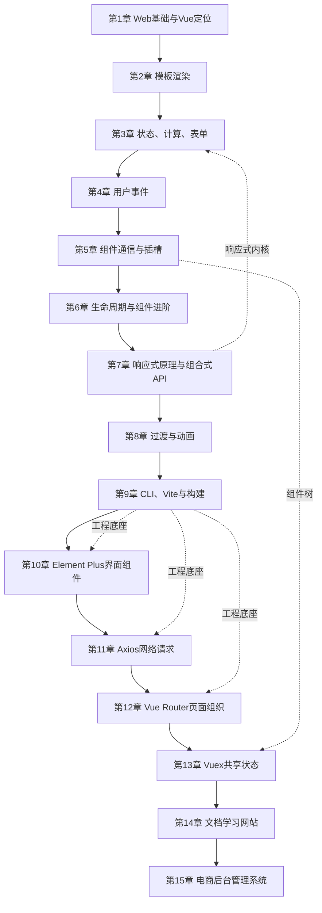

# 《循序渐进 Vue.js 3 前端开发实战》深度阅读教程

> **版本依据**：张益珲编著，清华大学出版社，2022 年 1 月第 1 版、第 1 次印刷，ISBN 978-7-302-59565-6。本文核对了本地 PDF 的封面、CIP、前言、目录以及 15 章正文；PDF 共 486 页。
>
> **证据边界**：“原书”表示对指定版本正文的概括；“根据原书示例改写”表示保留示例目标，但为可读性和今天的工具链重写；“现代补充”与“纠正”表示截至 **2026-08-11** 依据官方文档所做的更新。本文不把未经核实的网络副本作为新版来源，仍以用户指定的第 1 版为事实依据。
>
> **阅读建议**：原书采用 Vue 3.0.x、Vue CLI、Vuex 与较早的 Element Plus API。概念主线仍然有效，但新项目应优先使用 `create-vue + Vite + <script setup> + Pinia`。不要把文中的现代写法误认为原书 2021 年完稿时已经采用的写法。

## 一、从全书看 Vue 3：用状态描述界面

### Vue 的背景、定义与要解决的问题

原书第 1 章给出的核心定义是：

> “Vue 的定义为渐进式的 JavaScript 框架。所谓渐进式，是指其被设计为可以自底向上逐层应用。”

“渐进式”不是“学习进度缓慢”，而是采用范围可以渐进：既可以在一个旧页面里只接管某个区域，也可以使用组件、路由、状态管理和构建工具搭建完整的单页应用。前言把全书目标概括为学习“Vue.js 3 全家桶及周边框架和工具的综合应用”，15 章的安排正是从浏览器基础逐步走到商业项目。

用普通 JavaScript 操作页面时，开发者要反复执行“找到 DOM—读取状态—修改 DOM—维护事件”这一套命令式流程。当状态与界面分支增多，谁修改了哪块 DOM、数据和界面是否同步，很快会变得难以追踪。Vue 把问题改写成：**界面是状态的声明式映射**。开发者维护响应式状态和组件关系，Vue 负责依赖追踪、最小化更新与组件生命周期。

Vue 主要解决四类问题：

- **状态与 DOM 同步**：模板把数据声明为界面的一部分，状态变化后视图自动更新。
- **复杂页面拆分**：组件用 Props、事件和插槽形成可组合、可复用的边界。
- **跨页面和跨组件协作**：Vue Router 管理 URL 到组件的映射，状态库管理共享数据。
- **工程交付**：Vite、单文件组件和生态插件把开发、测试、构建、部署组织成可重复流程。

### 全书逻辑框架



这条主线先回答“浏览器如何显示和交互”，再回答“Vue 如何组织局部逻辑”，随后加入工程化与生态，最后通过两个项目把知识串联起来。第 7 章是理解层面的分水岭：在它之前主要学习 API，在它之后开始理解依赖追踪和逻辑组合。

### Vue 与相关主流方案的差异

| 方案 | 界面组织方式 | 状态更新 | 工程与生态 | 适合场景 | 主要代价 |
| --- | --- | --- | --- | --- | --- |
| 原生 DOM API | 手动查询、创建和修改节点 | 开发者手动同步 | 零框架，可自由选工具 | 小挂件、低依赖页面、学习 Web 平台 | 复杂状态下同步成本高 |
| jQuery | 以选择器和 DOM 操作为中心 | 命令式修改 | 旧站点插件丰富 | 维护传统多页应用 | 缺少现代组件和状态边界 |
| Vue 3 | HTML 风格模板与单文件组件 | Proxy/ref 响应式依赖追踪 | Router、Pinia、Vite、组件库完整 | 中小型到大型 Web 应用、渐进改造 | 需要理解响应式边界和编译工具 |
| React | JSX 与函数组件 | 显式设置状态并重新协调 | 生态广、方案选择多 | 跨端或偏函数式团队、大型应用 | 样板和技术选型常由团队自行组合 |
| Angular | 模板、依赖注入和完整框架约定 | Signals/RxJS 等机制 | 路由、表单、HTTP、CLI 高度集成 | 需要强规范的大型企业项目 | 框架面较大，入门和迁移成本更高 |

Vue 的优势不是在所有维度“胜过”其他框架，而是用较低的接入成本提供了一条连续路径：从 CDN 增强一个元素，到用同一套心智模型建设完整 SPA。React 更强调 JavaScript/JSX 组合，Angular 提供更强的一体化约束；选择应服从团队经验、系统寿命、生态依赖和交付环境，而不是只比较运行时基准。

## 二、15 章各自承担什么任务

| 章节 | 标题 | 核心内容 | 本章解决思路 |
| --- | --- | --- | --- |
| 前言 | 内容安排与配套资源 | 说明 1～13 章建立能力、14～15 章综合实战 | 用“基础—原理—生态—项目”的顺序降低学习坡度 |
| 第 1 章 | 从前端基础到 Vue.js 3 | HTML、CSS、JavaScript、前端演进和 Vue 定位 | 先建立浏览器三层职责，再体验声明式渲染 |
| 第 2 章 | Vue 模板应用 | 插值、指令、条件和列表渲染、待办事项 | 用数据绑定取代易错的手工 DOM 同步 |
| 第 3 章 | Vue 组件的属性和方法 | data、methods、computed、watch、表单与样式绑定 | 把派生状态、输入状态和副作用分别安放 |
| 第 4 章 | 处理用户交互 | DOM 事件、修饰符、鼠标与键盘事件 | 用 `v-on/@` 声明事件，并以修饰符表达传播规则 |
| 第 5 章 | 组件基础 | Props、事件、组件 `v-model`、插槽、动态组件 | 建立父传子、子通知父和内容分发的组件契约 |
| 第 6 章 | 组件进阶 | 生命周期、全局配置、注入、Mixin、指令、Teleport | 在恰当阶段处理副作用，并解决跨层数据和跨 DOM 层渲染 |
| 第 7 章 | Vue 响应式编程 | Proxy、reactive、ref、computed、watchEffect、组合式 API | 从依赖收集解释自动更新，并按业务能力聚合逻辑 |
| 第 8 章 | 动画 | CSS/JavaScript 动画、Transition、TransitionGroup | 把元素进入、离开和列表变动映射到动画状态 |
| 第 9 章 | 构建工具 Vue CLI 的使用 | 脚手架、目录、依赖、构建、Vite | 用标准工程替代散落的 CDN 文件；今天应改用 create-vue/Vite |
| 第 10 章 | Element Plus | 表单、提示、数据展示、容器和教务列表 | 用一致的组件体系快速构建后台类界面 |
| 第 11 章 | vue-axios 的应用 | HTTP 请求、配置、响应、拦截器、天气应用 | 将远端数据纳入 loading/success/error 状态流 |
| 第 12 章 | Vue 路由管理 | 动态/嵌套路由、导航、守卫和运行时路由 | 让 URL 成为可分享、可前进后退的页面状态 |
| 第 13 章 | Vue 状态管理 | Vuex 的 state/getter/mutation/action/module | 集中管理跨层共享状态；新项目对应方案是 Pinia |
| 第 14 章 | 文档学习网站 | 页面框架、目录配置、Markdown 渲染 | 组合菜单、文章数据与内容渲染形成知识站点 |
| 第 15 章 | 电商后台管理系统 | 登录、主页、订单、商品、店长、财务与图表 | 以路由和模块拆分大型后台，用 Mock 数据并行开发前端 |

## 三、沿原书顺序精读：从一个页面到完整应用

### 阶段一：建立浏览器与声明式界面的共同语言

#### 第 1 章　从前端基础到 Vue.js 3

本章不是把三门语言压缩成速查表，而是在定义职责边界：HTML 描述语义结构，CSS 决定呈现，JavaScript 管理行为和状态，Vue 则在三者之上组织声明式界面。后续所有章节都依赖这层边界。

##### 1.1 前端技术演进：复杂度从服务器移向浏览器

原书沿静态页面、Ajax、MVC/MVVM 到 SPA 叙述前端演进。关键变化不是“页面越来越炫”，而是浏览器开始承担数据获取、状态维护、路由和交互，前端因此需要可维护的架构。

- **Ajax（Asynchronous JavaScript and XML）**：不整页刷新即可与服务器交换数据；今天数据格式通常是 JSON，不限于 XML。
- **DOM（Document Object Model）**：浏览器把 HTML 解析成可由 JavaScript 操作的对象树。
- **MVC/MVVM**：分别强调模型、视图、控制器或视图模型的职责分离；Vue 常被用 MVVM 类比，但官方更谨慎地将其称为渐进式框架。
- **SPA（Single-Page Application）**：只加载一个应用入口，通过客户端路由切换功能视图；“单页”不等于“只有一个界面”。

> **纠正（对应 1.1）**：原书把 Vue 与 AngularJS 一并放到“2010 年开始相继出现”的表述不够精确，Vue 的公开发布始于 2014 年。历史年份不影响后续技术结论，但不应据此记忆 Vue 的发布时间。

##### 1.2 HTML 入门：结构首先是语义

- **1.2.1 准备开发工具**：原书使用 VS Code 创建并在浏览器预览 `.html` 文件。今天仍可如此学习，不过使用 ES Module 时应通过本地 HTTP 服务访问，而不是直接打开 `file://`。
- **1.2.2 基础标签**：`h1`～`h6` 表示标题层级，`p` 表示段落，`a` 表示链接，`img` 表示图像，`div` 是无特定语义的容器。属性补充元素信息，例如链接的 `href`、图片的 `src` 与替代文本 `alt`。

> **纠正（对应 1.2）**：HTML 是标记语言，不是具有通用控制流的编程语言；原书前一句称其为编程语言，后文又给出了更准确的“标记语言”判断。`align` 等表现属性已经过时，应使用 CSS。原书还称实际开发很少用 `a` 跳转、更多用 JavaScript，这不适合作为通则：真正的导航应优先使用 `<a href>` 或渲染为链接的 `<RouterLink>`，这样才能保留语义、键盘操作、新窗口打开和搜索引擎能力。

##### 1.3 CSS 入门：选择元素并声明规则

- **1.3.1 CSS 选择器**：通用选择器、类型选择器、类选择器和 ID 选择器负责匹配元素；工程中通常优先用低耦合的类选择器。
- **1.3.2 CSS 样式**：背景、字体、尺寸、边框和布局共同决定视觉呈现。样式冲突由来源、层叠、特指度和源码顺序计算，不是“最后写的一定赢”。

组件样式的边界仍然值得主动设计：全局样式适合设计令牌与基础排版，单文件组件的 `scoped` 样式适合局部规则；不要用不断提高选择器特指度来掩盖结构问题。

##### 1.4 JavaScript 入门：状态和行为的载体

- **1.4.1 为什么需要 JavaScript**：HTML/CSS 能表达结构和大部分视觉状态，JavaScript 负责业务计算、事件处理、网络请求以及动态状态。
- **1.4.2 语法简介**：原书覆盖变量、类型、条件、循环、函数、对象与数组，为 `data`、`methods` 和模板表达式做准备。

> **现代补充**：优先使用 `const`，需要重新赋值时用 `let`，避免新增 `var`。JavaScript 是多范式语言，也运行在服务器、桌面和构建工具中，不能再只理解为“前端脚本语言”。

##### 1.5 渐进式开发框架 Vue

- **1.5.1 第一个 Vue 应用**：原书通过 CDN 引入 Vue 3.0.x，以 `createApp` 创建应用并挂载到 DOM 容器。
- **1.5.2 登录页面**：用“未登录表单/已登录欢迎信息”展示数据、条件渲染和事件如何协作。
- **1.5.3 Vue 3 新特性**：原书强调更小更快、TypeScript 支持、组合式 API、Fragment、Teleport 与新的响应式实现。
- **1.5.4 为什么使用 Vue**：当页面规模扩大时，模板、组件和响应式系统将零散 DOM 操作收束为稳定规则。

下面是按原书第一个应用目标改写的最小版本。CDN 适合学习和局部增强，生产项目应使用第 9 章的构建方案。

```html
<div id="app">
  <p>{{ message }}</p>
  <button @click="message = '状态已经驱动视图更新'">更新</button>
</div>

<script type="module">
  import { createApp, ref } from 'https://unpkg.com/vue@3/dist/vue.esm-browser.js'

  createApp({
    setup() {
      const message = ref('Hello Vue 3')
      return { message }
    },
  }).mount('#app')
</script>
```

##### 1.6 小结与练习

本章的合格线不是背出标签或 API，而是能解释：结构、样式、行为分别放在哪里，Vue 又为何能减少状态与 DOM 不一致。若尚不能独立写函数、数组操作和对象访问，应先补足 JavaScript 再继续。

#### 第 2 章　Vue 模板应用

模板是状态到 DOM 的声明。原书用待办任务贯穿插值、条件和循环，解决“数据变化后手动定位并修改节点”的重复劳动。

##### 2.1 模板基础：文本、属性与指令

- **2.1.1 模板插值**：`{{ expression }}` 会求值并转成文本。插值适合轻量表达式，不应写赋值、多语句或重计算；复杂逻辑应移入计算属性。
- **2.1.2 模板指令**：以 `v-` 开头的特殊属性把响应式行为应用到 DOM。`v-bind:href` 可缩写为 `:href`，`v-on:click` 可缩写为 `@click`，`v-once` 只渲染一次，`v-html` 写入原始 HTML。

- **指令（directive）**：由 Vue 在渲染阶段解释的模板标记。
- **参数**：如 `v-bind:href` 的 `href`，限定指令作用对象。
- **修饰符**：如 `@submit.prevent` 的 `.prevent`，声明额外行为。

> **安全边界**：普通插值会转义 HTML，是展示用户文本的默认安全选择。`v-html` 绕过转义，只能接收可信或经过严格净化的内容，否则会产生 XSS（Cross-Site Scripting，跨站脚本）风险。

##### 2.2 条件渲染：创建/销毁还是只切换显示

- **2.2.1 `v-if`**：条件为假时对应分支不在 DOM 中；可配合 `v-else-if`、`v-else`，也可放在 `<template>` 上控制一组节点。它有较高的切换成本、较低的初始成本。
- **2.2.2 `v-show`**：元素始终创建，只切换 CSS `display`；不能配合 `v-else` 或 `<template>`。它有较高的初始渲染成本、较低的切换成本。

因此，“低频切换或初始可能不展示”优先 `v-if`，“高频显示/隐藏且节点创建昂贵”考虑 `v-show`。二者在视觉上相似，生命周期和资源占用并不相同。

##### 2.3 循环渲染：数据集合到节点集合

- **2.3.1 `v-for` 基础**：`item in items`/`item of items` 迭代数组，也能取得索引；迭代对象时可取得值、键和索引。
- **2.3.2 高级用法**：原书通过 `push`、`pop`、`shift`、`unshift`、`splice`、`sort`、`reverse` 说明数组改变会触发视图更新，也展示过滤后数组的渲染。

列表更新的核心不是“能显示”，而是身份稳定：

```vue
<li v-for="task in visibleTasks" :key="task.id">
  <input v-model="task.done" type="checkbox" />
  <span :class="{ done: task.done }">{{ task.title }}</span>
</li>
```

`:key` 应使用不会随排序改变的业务 ID，避免用索引充当可编辑列表的 key。稳定 key 让 Vue 正确复用 DOM 与组件实例，也让第 8 章的列表动画能识别移动对象。

##### 2.4 范例：待办任务列表

- **2.4.1 HTML 框架**：输入区负责新任务，有序列表负责展示当前任务，每个任务提供删除入口。
- **2.4.2 逻辑开发**：输入状态与 `v-model` 绑定，新增操作写入数组，删除操作根据任务身份更新数组。

下面是保留原书功能目标、补上稳定 ID 和空输入校验的现代版本：

```vue
<script setup>
import { computed, ref } from 'vue'

const title = ref('')
const tasks = ref([])
const unfinished = computed(() => tasks.value.filter((task) => !task.done))

function addTask() {
  const value = title.value.trim()
  if (!value) return
  tasks.value.push({ id: crypto.randomUUID(), title: value, done: false })
  title.value = ''
}

function removeTask(id) {
  tasks.value = tasks.value.filter((task) => task.id !== id)
}
</script>

<template>
  <form @submit.prevent="addTask">
    <input v-model="title" aria-label="新任务" />
    <button>添加</button>
  </form>
  <ul>
    <li v-for="task in unfinished" :key="task.id">
      <button type="button" @click="removeTask(task.id)">完成并移除</button>
      {{ task.title }}
    </li>
  </ul>
</template>
```

##### 2.5 小结与练习

模板的判断原则是：模板负责描述“什么状态显示什么”，计算属性负责派生状态，方法负责事件动作。不要为了少写一行 JavaScript，把复杂业务塞进模板表达式。

#### 第 3 章　Vue 组件的属性和方法

本章仍以根组件为主，标题中的“组件”指 Vue 组件实例。它把状态分成原始状态、派生状态和副作用，并进一步处理表单与样式。

##### 3.1 属性与方法：数据是什么，动作做什么

- **3.1.1 属性基础**：Options API 的 `data()` 每次返回独立对象，Vue 将其代理到组件实例；组件复用时不能共享同一个可变对象。
- **3.1.2 方法基础**：`methods` 中的方法可以读取或修改组件状态。Options API 会把普通方法的 `this` 绑定到实例，因此不要将需要 `this` 的方法写成箭头函数。

原始状态应保持最小。能由其他状态计算出的值不必再存一份，否则两份数据可能失去同步。

##### 3.2 computed 与 watch：派生值和副作用不能混用

- **3.2.1 计算属性**：`computed` 根据响应式依赖产生派生值，依赖未变化时读取缓存结果。
- **3.2.2 计算属性还是函数**：模板每次渲染都会再次调用普通方法；计算属性只在依赖变化后重新计算。无缓存需求或需要传参时使用方法。
- **3.2.3 可写计算属性**：通过 `get/set` 可把一个展示值映射回多个源状态，但应避免让 setter 隐藏复杂副作用。
- **3.2.4 侦听器**：`watch` 适合在状态变化后请求数据、写存储或调用命令式 API，不应用它维护一个本可由 `computed` 得到的值。

```js
const fullName = computed({
  get: () => `${firstName.value} ${lastName.value}`,
  set: (value) => {
    ;[firstName.value, lastName.value = ''] = value.trim().split(/\s+/, 2)
  },
})
```

##### 3.3 函数限流：先区分 throttle 与 debounce

- **3.3.1 手写限流**：原书用时间标记限制按钮两次有效触发的最小间隔，这属于节流。
- **3.3.2 Lodash 限流**：第三方实现支持首调用、尾调用和取消，比一次性手写工具更完整。

- **Throttle（节流）**：连续触发时每个时间窗口最多执行一次，适合滚动、拖动、指针位置上报。
- **Debounce（防抖）**：停止触发一段时间后才执行，适合搜索联想、表单异步校验。

> **纠正（对应 3.2.4、3.3）**：原书先以搜索输入联想说明侦听器，随后统称“限流”。搜索请求通常应该防抖，而不是节流；还要取消过期请求或忽略迟到响应，否则旧结果可能覆盖新结果。

```js
let timer
function debounce(fn, wait = 300) {
  return (...args) => {
    clearTimeout(timer)
    timer = setTimeout(() => fn(...args), wait)
  }
}
```

生产代码还需给每个包装函数独立计时器，并提供 `cancel/flush`；可直接选用经过测试的库实现。

##### 3.4 表单数据双向绑定

- **3.4.1 文本输入框**：`v-model` 默认同步元素的 `value` 与状态，并监听输入事件。
- **3.4.2 多行文本**：`textarea` 同样使用 `v-model`，初始内容不应写在标签内部。
- **3.4.3 复选框与单选框**：单个 checkbox 可绑定布尔值，一组 checkbox 可绑定数组；radio 组绑定一个选中值。
- **3.4.4 选择列表**：单选 `select` 绑定单值，多选绑定数组，选项值可通过 `:value` 绑定非字符串。
- **3.4.5 修饰符**：原书介绍 `.lazy` 和 `.trim`；还应掌握 `.number`。`.lazy` 改在 `change` 时同步，`.trim` 去除两端空白，`.number` 尝试转成数值。

双向绑定只是视图状态同步，不等于数据已合法。浏览器约束、前端业务校验和服务器校验各有职责，密码和权限等规则必须由服务器再次验证。

##### 3.5 样式绑定

- **3.5.1 Class 绑定**：对象语法表达“条件成立时启用类”，数组语法组合多个类；优先把完整视觉规则留在 CSS 类中。
- **3.5.2 内联样式**：对象语法适合绑定运行时数值或 CSS 变量，不宜承载大段静态样式。

```vue
<button
  :class="['submit-button', { 'is-loading': loading, 'has-error': !!error }]"
  :style="{ '--progress': `${progress}%` }"
>
  提交
</button>
```

##### 3.6 范例：用户注册页面

- **3.6.1 页面搭建**：原书将标题、用户名、密码、邮箱、偏好选项和注册按钮组织为表单。
- **3.6.2 用户交互**：收集输入，检查必填、密码长度和邮箱格式，再给出注册结果。

现代实现应把字段、错误、提交中和服务器错误建模为不同状态；用 `<form @submit.prevent>` 支持键盘提交，为每个控件关联 `<label>`，失败后聚焦首个错误字段。正则只能做粗筛，不能证明邮箱真实存在。

##### 3.7 小结与练习

判断该用什么工具：页面直接需要的原始事实用 `ref/reactive`，可纯计算得到的用 `computed`，用户动作放函数，外部副作用才使用 `watch`。这是后续组合式 API 的核心分类。

#### 第 4 章　处理用户交互

事件把用户操作转换为状态变化。Vue 不发明浏览器事件，而是提供模板语法、组件事件和修饰符，让传播规则显式可读。

##### 4.1 事件监听与传播

- **4.1.1 事件监听**：`v-on:event`/`@event` 可绑定内联表达式或方法；方法参数可显式传 `$event`。
- **4.1.2 多事件处理**：模板可以调用多个方法，但若它们共同表达一个业务动作，封装成一个具名处理函数更利于测试和错误处理。
- **4.1.3 事件修饰符**：`.stop` 阻止继续传播，`.prevent` 阻止默认行为，`.capture` 在捕获阶段处理，`.self` 只响应目标为自身的事件，`.once` 只执行一次，`.passive` 告诉浏览器处理器不会阻止默认滚动。

> **纠正（对应 4.1.3）**：事件捕获由 `window/document` 等祖先向目标传递；到达目标后，冒泡由目标向祖先返回。原书将冒泡描述成从子组件“向下传递”，方向文字有误，应为沿祖先链向上。另需区分 DOM 元素事件与 Vue 组件通过 `emit` 发出的自定义事件，后者不是 DOM 冒泡。

修饰符顺序会影响生成代码，例如 `@click.prevent.self` 与 `@click.self.prevent` 的阻止范围不同。不要同时使用 `.passive.prevent`，两种意图相互冲突。

##### 4.2 事件类型与键盘可访问性

- **4.2.1 常用事件**：原书覆盖 click、dblclick、鼠标按下/抬起/移动/进入/离开等。今天跨鼠标、触控笔和触摸屏的交互优先考虑 Pointer Events，如 `pointerdown`、`pointermove`。
- **4.2.2 按键修饰符**：`.enter`、`.esc`、`.tab`、方向键以及 `.ctrl/.alt/.shift/.meta` 可以组合；`.exact` 限制必须精确按下指定组合键。

可点击行为应优先使用原生 `<button>`，而不是给 `<div>` 添加 click。原生控件自动具备焦点、Enter/Space 激活和无障碍语义。

##### 4.3 范例一：随鼠标移动的小球

原书监听 `mousemove`，把指针坐标映射到球体位置。需要注意三个边界：坐标应相对容器计算；高频事件不要触发昂贵布局；组件卸载时要清理手动注册的监听器。若更新频率很高，可只记录最新坐标，并在 `requestAnimationFrame` 中每帧写一次 `transform: translate3d(...)`。

##### 4.4 范例二：弹球游戏

原书把键盘挡板、球速、边界反弹和碰撞检测组合成小型状态机。正确的动画循环应以时间差 `deltaTime` 更新位置，使用 `requestAnimationFrame` 配合浏览器刷新率；固定步长 `setInterval` 在后台页节流或帧率波动时会导致速度不一致。游戏还应提供暂停、重新开始、焦点提示和清理循环。

##### 4.5 小结与练习

事件处理器的目标是把外界输入翻译成清晰动作，而不是直接堆积 DOM 操作。复杂交互可拆成“输入采集—状态转换—渲染输出”三层，这一思想会自然过渡到组件和状态管理。

### 阶段二：从组件边界深入响应式内核

#### 第 5 章　组件基础

组件的价值不是把文件切碎，而是建立契约：父组件提供数据和内容，子组件管理内部实现并发出语义事件。组件树因此可以把大型页面拆成可独立推理的单元。

##### 5.1 Vue 应用与组件

- **5.1.1 应用配置**：`createApp(rootComponent)` 创建应用上下文，`mount()` 把根组件挂载到容器。插件、全局组件、错误处理和 provide 都属于应用级能力。
- **5.1.2 定义组件**：原书使用 `app.component()` 演示组件模板和逻辑。工程项目更常用 `.vue` 单文件组件（SFC，Single-File Component），把模板、逻辑和样式放在一个内聚文件中。

全局注册方便但会隐藏依赖，并让未使用组件更难被构建器排除。业务组件优先局部导入；真正跨项目、使用频率高的基础组件才考虑插件化注册。

##### 5.2 Props 下行，事件上行

- **5.2.1 外部属性 Props**：父组件把数据传给子组件。HTML 属性名常用 kebab-case，JavaScript 定义常用 camelCase。
- **5.2.2 组件事件**：子组件通过 `$emit`/`defineEmits` 报告“发生了什么”，父组件决定如何改状态；事件名应表达业务意图，如 `confirm`，而不是暴露内部按钮名。
- **5.2.3 组件上的 `v-model`**：原书展示自定义输入组件的双向绑定。Vue 3 的底层契约是 `modelValue` Prop 与 `update:modelValue` 事件；当前 Vue 还提供 `defineModel()` 简化声明。

下面的开关保留第 5.5 节目标，并把状态所有权留给父组件：

```vue
<!-- ToggleSwitch.vue：根据原书开关示例改写 -->
<script setup>
const model = defineModel({ type: Boolean, required: true })
const props = defineProps({ label: { type: String, default: '开关' } })
</script>

<template>
  <button
    type="button"
    role="switch"
    :aria-checked="model"
    :aria-label="props.label"
    @click="model = !model"
  >
    {{ model ? '开' : '关' }}
  </button>
</template>
```

若需兼容不支持 `defineModel` 的 Vue 3 版本，则显式声明 `modelValue` 并触发 `emit('update:modelValue', next)`。

##### 5.3 插槽：让调用方提供结构

- **5.3.1 默认插槽**：子组件用 `<slot>` 声明内容出口；可提供未传内容时的回退内容。
- **5.3.2 多具名插槽**：`<slot name="header">` 等名称定义多个出口，调用方用 `#header` 精确填充。作用域插槽还能把子组件内部数据暴露给调用方决定呈现。

Props 适合传数据，插槽适合传结构。不要把一大段 HTML 字符串当 Prop 再用 `v-html` 渲染，这会丢失组件能力并引入安全风险。

##### 5.4 动态组件

`<component :is="currentComponent">` 根据状态切换组件，适合选项卡、步骤表单和可配置面板。默认切走后实例会卸载；若要保留表单、滚动位置等局部状态，可用 `<KeepAlive>` 包裹并设置 `include/exclude/max`。保留实例也会保留资源，应在 `onActivated/onDeactivated` 管理订阅。

##### 5.5 范例：开关按钮组件

原书要求支持颜色等样式定制并把状态变化通知父级。真正可复用的版本还要考虑受控状态、键盘与屏幕阅读器语义、禁用态、焦点样式、CSS 变量主题和事件类型。上面的 `role="switch"` 只是原生按钮上的语义增强；若产品允许，原生 checkbox 往往更稳妥。

##### 5.6 小结与练习

检验组件边界的方法：父组件是否仍是共享状态的唯一真源？子组件是否只通过明确 Props 和事件通信？插槽是否只开放必要结构？如果答案是否定的，组件即使“能复用”也很难维护。

#### 第 6 章　组件进阶

本章处理组件进入真实应用后的问题：何时访问 DOM、怎样捕获错误、如何跨层共享依赖、逻辑如何复用，以及弹窗为何能写在组件内却渲染到页面根部。

##### 6.1 生命周期与应用配置

- **6.1.1 生命周期方法**：Options API 的 `beforeCreate/created/beforeMount/mounted/beforeUpdate/updated/beforeUnmount/unmounted` 描述创建、挂载、更新和卸载阶段；`activated/deactivated` 服务于 KeepAlive。
- **6.1.2 全局配置**：原书介绍 `app.config.errorHandler`、`warnHandler` 和 `globalProperties`。全局属性会隐藏依赖，普通业务服务优先用模块导入或 provide/inject；错误处理器应接入日志系统并避免泄露敏感信息。
- **6.1.3 注册方式**：全局注册对整个应用可见，局部注册显式依赖。局部导入通常更容易追踪和按需构建。

组合式 API 对应钩子为 `onMounted/onUpdated/onUnmounted` 等。DOM 只在 mounted 后可用；计时器、观察器、WebSocket 和手动事件监听必须在卸载时清理。不要在 `updated` 中无条件改响应式状态，否则可能产生更新循环。

##### 6.2 Props 验证、单向流与跨层注入

- **6.2.1 Prop 验证**：可声明类型、必填、默认值和自定义校验。运行时验证用于开发提示，TypeScript 用于静态检查，两者都不能代替不可信输入的业务校验。
- **6.2.2 只读性质**：Props 是单向下行且浅只读。子组件不应直接给 Prop 赋值；需要编辑时复制为本地草稿，或发出更新事件。对象 Prop 的嵌套内容仍可能被修改，不能把“只读”误解为深冻结。
- **6.2.3 provide/inject**：解决祖先到深层后代的逐层透传，适合主题、表单上下文和服务实例。提供 `ref/reactive` 可保持响应式；最好用 `Symbol` 作为注入键，并在提供方集中修改状态。

##### 6.3 Mixin：原书方案与当前替代

- **6.3.1 定义 Mixin**：把多个组件共享的 data、methods 和钩子混入组件。
- **6.3.2 选项合并**：对象选项合并，同名数据/方法通常以组件自身为准，生命周期钩子会按规则都执行。
- **6.3.3 全局 Mixin**：影响后续全部组件，适合框架插件但增加隐式行为和排错成本；原书也明确提醒谨慎使用。

> **现代补充**：组合式函数（composable）是复用有状态逻辑的首选。函数名按约定以 `use` 开头，输入、返回值和副作用更显式，也没有 Mixin 的命名冲突与来源不清问题。

```js
// useEventListener.js
import { onMounted, onUnmounted } from 'vue'

export function useEventListener(target, type, listener, options) {
  onMounted(() => target.addEventListener(type, listener, options))
  onUnmounted(() => target.removeEventListener(type, listener, options))
}
```

##### 6.4 自定义指令：只处理低层 DOM 行为

- **6.4.1 认识指令**：原书用自动聚焦演示 `mounted` 钩子。组件适合复用结构和状态，指令适合复用必须直接操作 DOM 的行为。
- **6.4.2 参数**：指令钩子可读取 `binding.value`、`arg`、`modifiers`、旧值和 vnode；不要修改只读的 binding，也不要用指令建立大型业务模块。

自动聚焦还需尊重用户情境：页面加载即抢焦点可能干扰屏幕阅读器或移动端弹出键盘，应只在明确流程中启用。

##### 6.5 Teleport 全局弹窗

`<Teleport to="body">` 让弹窗逻辑仍属于当前组件树，却把 DOM 放到指定目标，避免父容器的 `overflow`、`transform` 和层叠上下文截断遮罩。Teleport 不改变 Props、事件或 provide/inject 关系。

弹窗除了“显示出来”还必须处理焦点锁定、Esc 关闭、返回焦点、背景滚动、`aria-modal` 与层级管理。Teleport 只解决渲染位置，不自动解决这些交互要求。

##### 6.6 小结与练习

生命周期决定副作用何时开始和结束；provide/inject 解决深层依赖；composable 解决逻辑复用；指令解决低层 DOM 行为；Teleport 解决 DOM 位置。不要因为它们都能“复用代码”就混为一类。

#### 第 7 章　Vue 响应式编程

这是全书最重要的原理章。其问题是：为什么读取一个值后，Vue 能在它变化时重新计算或更新界面？答案是读取时追踪依赖、写入时触发订阅者。

##### 7.1 从手工追踪到 reactive/ref

- **7.1.1 手动追踪变化**：原书先展示普通变量 `sum = a + b` 不会随 `a/b` 自动更新，再用 Proxy 拦截对象访问和修改。
- **7.1.2 响应式对象**：`reactive(object)` 返回 Proxy。effect 运行并读取属性时执行 `track(target, key)`，写入时执行 `trigger(target, key)`。
- **7.1.3 独立值 Ref**：原始值无法直接由 Proxy 拦截，`ref(value)` 用带 `.value` getter/setter 的对象包装它；模板中通常自动解包。

```text
effect 执行
  -> 读取 reactive.count
  -> track 记录“此 effect 依赖 count”
  -> 写入 reactive.count
  -> trigger 找到订阅者
  -> effect 重新执行，渲染得到新界面
```

Vue 2 主要依赖 `Object.defineProperty` getter/setter；Vue 3 的响应式对象使用 Proxy，ref 仍使用 getter/setter。这使新增/删除属性和集合类型更自然，但也带来边界：

- `reactive()` 返回的 Proxy 与原对象不是同一身份；应始终操作代理。
- 直接解构响应式对象的原始类型属性会断开属性访问拦截，可用 `toRefs/toRef`。
- `ref` 在 JavaScript 中要写 `.value`；只是在模板等特定环境中自动解包。
- 响应式不是不可变数据；与外部状态系统集成时需明确谁拥有对象。

##### 7.2 computed、watch 与 watchEffect

- **7.2.1 计算变量**：`computed(() => ...)` 是惰性、缓存的响应式派生值。计算函数应无副作用，不要在其中请求网络或修改依赖。
- **7.2.2 监听变量**：原书重点介绍 `watchEffect` 自动收集同步执行阶段读取的依赖。`watch(source, callback)` 则显式指定来源，并提供新旧值。

`watchEffect` 适合“依赖就是函数里读取的这些值”的紧凑副作用；`watch` 适合精确控制触发源、深度、立即执行和比较语义。异步请求应在重新执行或卸载时取消旧工作，避免竞态。

##### 7.3 组合式 API：按功能组织代码

- **7.3.1 `setup`**：原书把它作为组合式 API 入口，并强调此时组件实例尚未创建，不能使用 Options API 的 `this`。今天的 `<script setup>` 是编译期语法糖，顶层声明可直接用于模板。
- **7.3.2 生命周期**：除 `beforeCreate/created` 逻辑直接写在 setup 中外，其他钩子通常在原名称前加 `on`，如 `onMounted`。

```vue
<script setup>
import { computed, onMounted, ref, watch } from 'vue'

const users = ref([])
const keyword = ref('')
const gender = ref('all')

const visibleUsers = computed(() => {
  const word = keyword.value.trim().toLowerCase()
  return users.value.filter((user) => {
    const matchesWord = user.name.toLowerCase().includes(word)
    const matchesGender = gender.value === 'all' || user.gender === gender.value
    return matchesWord && matchesGender
  })
})

onMounted(async () => {
  users.value = await loadUsers()
})

watch(keyword, () => console.debug('筛选条件发生变化'))
</script>
```

##### 7.4 范例：支持搜索和筛选的用户列表

- **7.4.1 常规风格**：原书分别在 `data`、`methods`、`watch` 中安放同一筛选功能的状态和逻辑，功能可用但关注点分散。
- **7.4.2 组合式重构**：将数据加载、性别筛选和搜索等相关状态与动作聚合，展示组合式 API 的主要动机不是“代码更短”，而是逻辑更容易提取、测试和复用。

现代实现宜让筛选结果成为 `computed`，而不是 watch 后再复制到另一数组；只有当筛选要触发服务端查询时，才引入防抖、取消请求、loading/error 和分页状态。

##### 7.5 小结与练习

能写 `ref` 不等于理解响应式。应能解释依赖何时收集、为何解构会断联、computed 为什么缓存，以及副作用为什么要清理。这些判断直接决定大型组件是否稳定。

#### 第 8 章　动画

动画用于表达状态变化和空间关系，不是单纯装饰。原书从 CSS 到 JavaScript，再到 Vue 对进入、离开和列表变动的抽象。

##### 8.1 CSS3 动画

- **8.1.1 transition**：属性发生变化时在起止值之间插值，适合悬停、展开、透明度和位移等两态变化。
- **8.1.2 keyframes**：`@keyframes` 定义多个关键帧，`animation` 设置时长、缓动、次数、方向和填充模式，适合多阶段动画。

性能上优先动画 `transform` 和 `opacity`，它们通常比不断改变 `left/width` 更少触发布局与绘制。动画必须尊重 `prefers-reduced-motion`：

```css
.panel { transition: transform 180ms ease, opacity 180ms ease; }

@media (prefers-reduced-motion: reduce) {
  .panel { transition: none; }
}
```

##### 8.2 JavaScript 动画

原书用定时器说明“把大变化拆成许多小变化”的本质。当前实践应优先 `requestAnimationFrame` 或 Web Animations API，因为它们与浏览器渲染周期协调；仍要用经过时间而不是“帧数”计算进度。能由 CSS 表达的动效通常无需 JavaScript 逐帧写样式。

##### 8.3 Vue 过渡组件

- **8.3.1 定义过渡**：`<Transition>` 在元素进入/离开时自动应用 `*-enter-from/active/to` 和 `*-leave-*` 六类 CSS 状态。
- **8.3.2 监听回调**：`@before-enter/@enter/@after-enter` 等钩子允许接入 JavaScript 动画；手动控制时必须调用 `done`。
- **8.3.3 多元素/组件切换**：`<Transition>` 的插槽在任一时刻只支持单个元素或组件；互斥分支可切换，`mode="out-in"` 可先离开再进入，避免重叠。
- **8.3.4 列表动画**：`<TransitionGroup>` 处理 `v-for` 项目的插入、删除和移动，每一项必须有唯一 key。

```vue
<Transition name="fade" mode="out-in">
  <p v-if="loading" key="loading">正在加载…</p>
  <p v-else-if="error" key="error" role="alert">{{ error }}</p>
  <UserList v-else key="content" :users="users" />
</Transition>
```

##### 8.4 范例：优化用户列表

原书回到第 7 章列表，为筛选和搜索结果加入列表动画。这一安排说明动画依赖稳定数据建模：先保证 key、过滤结果和加载状态正确，再做过渡。大量列表不宜给每项施加昂贵动画；可限制首屏、使用虚拟列表，或仅动画容器状态。

##### 8.5 小结与练习

好的动画回答“发生了什么、元素去了哪里、操作是否完成”。若它延迟任务、引发眩晕或掩盖 loading/error，便是功能缺陷。动画应可中断、可降级，并与组件生命周期一起清理。

### 阶段三：把 Vue 放进可交付的工程与生态

#### 第 9 章　构建工具 Vue CLI 的使用

原书先完整讲 Vue CLI，再用一节引入 Vite。这在 2021 年是合理的过渡，但今天两者主次已经反转。工程化的恒定目标仍是：创建项目、解析模块、启动开发服务器、热更新、管理依赖和构建生产资源。

##### 9.1 Vue CLI 入门

- **9.1.1 安装**：原书要求先安装 Node.js，再全局安装 `@vue/cli`。NPM（Node Package Manager）负责依赖与脚本；全局 CLI 容易形成机器间版本漂移。
- **9.1.2 创建项目**：`vue create hello-world` 通过问答选择 Vue 版本、Router、Vuex 等能力。

> **时效纠正（对应 9.1，核验于 2026-08-11）**：Vue CLI 官方首页已明确标注 **Maintenance Mode**，新项目应使用 `create-vue` 创建基于 Vite 的工程。旧项目不必为追新而立刻迁移，但不应再把全局安装 Vue CLI 作为新项目默认步骤。

##### 9.2 模板工程

- **9.2.1 目录结构**：原书解释 `.gitignore`、Babel 配置、`package.json`、`public`、`src`、入口和根组件。今天的 Vite 项目结构仍以 `src/main.*`、`App.vue`、`public` 和 `package.json` 为核心，但没有 `vue-cli-service` 与默认 Babel 配置。
- **9.2.2 运行项目**：Vue CLI 的 `npm run serve` 对应 Vite 项目的 `npm run dev`。开发服务器只用于本地开发，不能当生产服务器。

- **SFC（Single-File Component）**：`.vue` 文件，把 `<script>`、`<template>`、`<style>` 聚合为组件。
- **HMR（Hot Module Replacement）**：开发时替换变化模块，尽量保留页面状态而无需整页刷新。
- **ESM（ECMAScript Modules）**：基于 `import/export` 的标准模块系统；Vite 开发阶段直接利用浏览器 ESM。

##### 9.3 使用依赖

`package.json` 声明直接依赖和脚本，锁文件记录完整解析结果。安装应用运行所需库用 `npm install package`，只在构建/测试期需要的工具用 `npm install -D package`。团队应提交锁文件并在 CI 使用 `npm ci`，不要随意删除锁文件来“解决”版本冲突。

插件并非越多越好：检查维护状态、许可证、包体积、浏览器权限和供应链风险；能用 Web 标准或小型函数解决时，不必引入整套依赖。

##### 9.4 工程构建

原书以 `npm run build` 生成 `dist`。构建会编译 SFC、解析依赖、拆包、压缩并重写资源路径，但“命令成功”不等于部署正确：还需验证基础路径、环境变量、路由回退、缓存头、Source Map、错误监控和真实服务器预览。

##### 9.5 Vite：从补充选项变为默认工具

- **9.5.1 Vite 与 Vue CLI**：原书正确抓住 Vite 开发启动快、按需转换模块的特点，但把 Vue CLI 定位为大型项目不可或缺已经过时。Vite 同样支持大型工程，生产构建、插件和 SSR 能力持续发展。
- **9.5.2 体验 Vite**：原书使用当时的 `npm init vite-app` 与 Node 12 门槛。当前 Vue 官方脚手架命令是 `npm create vue@latest`。

截至核验日，npm registry 的最新版为 Vue **3.5.41**、Vite **8.2.1**、create-vue **3.23.0**。Vue 快速开始页当前给出的 Node.js 前置条件是 `^22.18.0 || >=24.12.0`；这是易变化条件，实际创建项目时应再次查看官方快速开始页，而不是永久抄用本文数字。

##### 9.6 小结与练习

本章应迁移的知识是工程职责，而不是 Vue CLI 命令本身。能解释入口、模块图、开发服务器、环境变量和产物目录，才算真正理解构建工具；具体脚手架可以随着生态替换。

#### 第 10 章　基于 Vue 3 的 UI 组件库 Element Plus

Element Plus 把设计语言、交互行为、无障碍基础和组件 API 封装为 Vue 组件。它适合中后台快速交付，但不能代替需求建模和信息架构。

##### 10.1 安装与基础展示组件

- **10.1.1 安装与使用**：原书同时讲 CDN 与 NPM，全量 `app.use(ElementPlus)` 最易上手。大型项目可按需导入，配合官方插件降低初始包体积。
- **10.1.2 按钮**：`el-button` 通过 type、size、plain、round、circle、loading、disabled 等属性表达语义和状态。不要只用颜色区分成功/危险。
- **10.1.3 标签**：`el-tag` 适合分类、状态和可关闭标签；可关闭标签应处理 `close` 并提供清晰文本。
- **10.1.4 空态与骨架屏**：`el-empty` 表达确实无数据，`el-skeleton` 表达数据仍在加载，两者不能混用。
- **10.1.5 图片与头像**：`el-image` 支持占位、错误插槽和预览；仍要提供有意义的替代文本，并控制懒加载引起的布局偏移。

当前安装方式如下；具体组件 API 应以安装版本文档为准：

```bash
npm install element-plus
```

```js
import { createApp } from 'vue'
import ElementPlus from 'element-plus'
import 'element-plus/dist/index.css'
import App from './App.vue'

createApp(App).use(ElementPlus).mount('#app')
```

截至核验日，Element Plus 官方页/registry 显示 **2.14.4**。官方兼容说明是支持浏览器最近两个版本且不支持 IE；原书时代的组件属性名和默认值可能已有变化，升级时应看 changelog，避免照抄旧表格。

##### 10.2 表单类组件

- **10.2.1 单选与复选**：radio 表达互斥选项，checkbox 表达独立多选；选项值要与领域数据类型一致。
- **10.2.2 标准输入框**：`el-input` 支持清空、密码、前后缀、字数等；标签应由 `el-form-item` 的 label 或 ARIA 关联，不应用 placeholder 取代标签。
- **10.2.3 自动补全**：`el-autocomplete` 的建议函数要防抖、处理 loading/empty/error，并忽略过期响应。
- **10.2.4 数字输入**：`el-input-number` 提供 min/max/step/precision，但金额不要用浮点数直接累计，通常使用最小货币单位整数或十进制定点库。
- **10.2.5 选择列表**：`el-select` 支持单选、多选、过滤和远程搜索；大量选项应分页、虚拟化或改用专门搜索器。
- **10.2.6 级联选择**：`el-cascader` 适合稳定层级数据；层级过深或节点重复归属时，树形路径不一定是合适模型。

表单应以 schema/规则统一校验，并区分 touched、validating、serverError 等状态。组件库校验提升体验，服务端仍是数据可信边界。

##### 10.3 开关与滑块

- **10.3.1 `el-switch`**：适合立即生效的二态设置；若操作需要确认或提交，不要让开关外观暗示已立即保存。
- **10.3.2 `el-slider`**：适合范围或近似值；要求精确输入时应同时提供数值框，离散档位应显示标记。

##### 10.4 时间、日期与颜色选择

- **10.4.1 时间选择**：区分一天内时间与真实时间点。涉及跨时区业务时，必须同时记录日期、时区和转换规则。
- **10.4.2 日期选择**：原书正文将组件名写成 `el-data-picker`，这是拼写错误，正确名称是 **`el-date-picker`**。
- **10.4.3 颜色选择**：需明确是否支持 alpha，并验证前景/背景对比度；颜色值不能作为状态的唯一信息通道。

##### 10.5 提示类组件

- **10.5.1 Alert**：页面内持续存在的重要反馈，成功、信息、警告和错误类型需要配合文本。
- **10.5.2 Message**：短时、非阻断的操作反馈。关键错误不应只显示数秒即消失；重复消息要合并。
- **10.5.3 Notification**：适合较丰富的全局通知，但不能滥用为业务流程。原书通过 `$notify` 展示，现代组合式代码通常直接导入 `ElNotification`。

##### 10.6 数据承载与布局

- **10.6.1 表格**：`el-table/el-table-column` 展示结构化数据。分页、排序、筛选应明确在客户端还是服务器执行；行操作要有权限与确认策略。
- **10.6.2 导航菜单**：`el-menu` 负责视觉菜单，真正 URL 导航应与 Vue Router 协作，避免维护第二份路由状态。
- **10.6.3 标签页**：`el-tabs` 在同一上下文切换分区；若每个标签需要可分享 URL、浏览器返回和权限控制，应建模为路由。
- **10.6.4 抽屉**：适合保留主页面上下文的次级任务；内容过长或需独立分享时更适合新路由。
- **10.6.5 容器**：`el-container/header/aside/main/footer` 快速搭结构，但 HTML 语义、响应式布局和小屏导航仍要自行设计。

##### 10.7 教务系统学生列表

原书将导航、容器、筛选、表格和学生数据组合为教务列表。更接近生产的状态应包括查询条件、页码、排序、结果、总数、loading、error 和选中行；把它们封装成 `useStudentsQuery()`，页面只负责布局与交互。批量删除、导出等动作还要考虑权限、幂等与审计。

##### 10.8 小结与练习

学习组件库不应背属性表，而应根据任务选择控件、理解受控值与事件、验证边界并检查无障碍。版本变化最快的就是属性表，因此示例以模式为主，细节查对应版本官方文档。

#### 第 11 章　基于 Vue 的网络框架 vue-axios

网络请求把本地响应式状态连接到远程系统。原书围绕天气接口说明 GET、配置、响应与拦截器，但生产代码必须把加载、成功、空数据、失败、取消和重试都当成一等状态。

##### 11.1 请求天气数据

- **11.1.1 免费数据服务**：原书使用“聚合数据”天气 API，先申请 key、阅读参数和响应格式。第三方接口可能变更、限流或下线，不应把 key 写进公开前端代码；需要保密的凭据必须由后端持有。
- **11.1.2 vue-axios**：Axios 是基于 Promise 的 HTTP 客户端，`vue-axios` 只是把 Axios 注入 Vue。现代组合式代码通常直接导入配置好的 Axios 实例，不必为了全局属性再装一层包装。

- **HTTP（Hypertext Transfer Protocol）**：Web 客户端与服务端交换请求和响应的协议。
- **API（Application Programming Interface）**：此处指服务端公开的数据接口契约。
- **Promise**：表示异步操作未来完成或失败的对象。
- **CORS（Cross-Origin Resource Sharing）**：服务器通过响应头授权浏览器跨源访问；前端无法靠“关闭校验代码”解决服务器未授权。

##### 11.2 配置、响应与拦截器

- **11.2.1 配置请求**：`axios.get(url, config)`、`post(url, data, config)` 等别名最终都归一到配置对象。查询参数用 `params`，JSON 请求体用 `data`。
- **11.2.2 请求与响应结构**：常见请求配置包括 baseURL、headers、timeout、params、signal；响应包含 data、status、headers、config。业务成功码与 HTTP 状态码必须分别判断。
- **11.2.3 拦截器**：适合统一附加认证、关联 ID、标准化错误和观测耗时；不要把具体页面跳转、弹窗和 loading 计数硬塞进共享客户端。

```js
// api/client.js：根据原书拦截器示例改写
import axios from 'axios'

export const api = axios.create({
  baseURL: import.meta.env.VITE_API_BASE_URL,
  timeout: 10_000,
})

api.interceptors.request.use((config) => {
  const token = sessionStorage.getItem('access_token')
  if (token) config.headers.Authorization = `Bearer ${token}`
  return config
})

api.interceptors.response.use(
  (response) => response,
  (error) => Promise.reject({
    status: error.response?.status,
    message: error.response?.data?.message ?? error.message,
    cause: error,
  }),
)
```

截至核验日 Axios 最新版为 **1.19.0**。取消请求优先用标准 `AbortController/signal`；超时、网络失败、4xx、5xx 的重试策略不同，非幂等写操作不可盲目自动重试。

##### 11.3 天气预报应用

- **11.3.1 页面框架**：原书将城市输入放在头部，主体分当前天气与未来预报。
- **11.3.2 核心逻辑**：监听城市，发送请求，用响应数据更新页面。

完善版应在提交或防抖后请求，而不是每个按键都请求；开始新请求时取消旧请求；只接受最后一次结果；对 loading、无结果、接口配额耗尽和离线分别展示反馈。天气数据还要显示单位、观测时间与数据来源。

##### 11.4 小结与练习

Axios 只是传输工具，真正的工程能力是边界建模：接口类型、认证、错误语义、竞态、取消、缓存和安全。把这些收进 API 客户端与 composable，组件才能保持简单。

#### 第 12 章　Vue 路由管理

路由把 URL 映射为组件树，使 SPA 的视图仍可刷新、收藏、分享并参与浏览器历史。若只用动态组件切换，“当前页面”只存在内存里，用户无法直接进入某个业务位置。

##### 12.1 安装与最小路由

- **12.1.1 安装**：原书使用 Vue Router 4，与 Vue 3 配套。当前新项目可在 `create-vue` 问答中直接选择 Router。
- **12.1.2 基本示例**：路由记录定义 path 与 component，`createRouter` 创建路由器，应用 `use(router)` 后，`<RouterLink>` 产生导航，`<RouterView>` 渲染匹配组件。

```js
// router/index.js：根据原书双页面示例改写
import { createRouter, createWebHistory } from 'vue-router'

const router = createRouter({
  history: createWebHistory(import.meta.env.BASE_URL),
  routes: [
    { path: '/', name: 'home', component: () => import('../views/HomeView.vue') },
    { path: '/users/:id', name: 'user', component: () => import('../views/UserView.vue'), props: true },
    { path: '/:pathMatch(.*)*', name: 'not-found', component: () => import('../views/NotFoundView.vue') },
  ],
})

export default router
```

当前 registry 显示 Vue Router **5.2.0**；原书 v4 的核心概念仍成立，但升级应查看 v5 迁移说明。HTML5 history 模式需要服务器把未知前端路径回退到 `index.html`，同时真正的静态资源和 API 路径不能被误回退。

##### 12.2 动态匹配与嵌套结构

- **12.2.1 路由参数**：`/users/:id` 把路径片段放到 `route.params.id`。参数是字符串或字符串数组，使用前需验证并转换。
- **12.2.2 匹配规则**：参数可自定义正则、重复和可选规则；规则过于复杂时可读性下降，应让 URL 结构保持稳定明确。
- **12.2.3 嵌套路由**：父记录的 children 对应嵌套 `<RouterView>`，适合“后台壳层—订单/商品子页”。子 path 不以 `/` 开头时才与父路径拼接。

同一组件从 `/users/1` 导航到 `/users/2` 时可能复用实例，不会重新 mounted。应 watch 参数或使用 `onBeforeRouteUpdate` 加载新数据。

##### 12.3 编程式导航与历史

- **12.3.1 路由方法**：原书称可通过 `$route` 调用 `push`，这里需要澄清：`$route` 是当前路由位置，执行导航的是 **`$router`**。组合式 API 中分别对应 `useRoute()` 与 `useRouter()`。
- **12.3.2 历史控制**：`push` 新增历史记录，`replace` 替换当前记录，`go/back/forward` 在历史中移动。登录成功后替换登录页可避免返回到无意义表单。

##### 12.4 命名、视图、别名与重定向

- **12.4.1 命名路由**：`router.push({ name: 'user', params: { id } })` 减少硬编码路径，并自动编码参数。
- **12.4.2 命名视图**：同一级路由可向多个命名 `<RouterView>` 分别注入组件，适合稳定的多区域布局；普通父子结构优先嵌套路由。
- **12.4.3 别名**：多个 URL 呈现同一路由记录，地址栏保持用户访问的别名。
- **12.4.4 重定向**：导航到另一个目标，地址栏变为目标 URL；可用于旧路径迁移和默认子页。

别名会产生多个可访问 URL，公开内容站要考虑 canonical 与搜索引擎重复内容；重定向规则若可由服务器完成，首屏访问通常更直接。

##### 12.5 通过 Props 解耦组件

直接在视图组件里读取 `$route.params` 会让组件依赖路由环境。路由记录设 `props: true` 可把 params 作为 Props 传入，函数形式则可显式转换 query/params。组件因此更容易在 Storybook、单元测试或其他父组件中复用。

##### 12.6 导航守卫

- **12.6.1 全局守卫**：`beforeEach` 适合认证和全局策略，返回 `false` 取消，返回路由位置则重定向；现代写法优先 return，而非旧式 `next`。
- **12.6.2 路由/组件守卫**：`beforeEnter` 只作用于记录；`onBeforeRouteLeave/onBeforeRouteUpdate` 适合未保存表单和参数变化。

守卫只改善前端体验，不是安全边界。服务器必须独立验证 token 和权限。认证状态未恢复时要先等待初始化，否则刷新受保护页面可能先误跳登录页。

##### 12.7 动态路由

- **12.7.1 添加与删除**：`addRoute` 返回移除函数，也可按 name `removeRoute`。它适合插件、租户功能或权限菜单，但必须防止重复名称，并处理当前地址在新增后是否需要 `replace` 重新匹配。

“后端返回什么菜单就动态添加什么组件路径”存在安全与可维护性风险。组件映射应是前端白名单，后端只返回权限标识；动态路由也不能代替服务端鉴权。

##### 12.8 小结与练习

路由是可观察的应用状态：设计 URL 时要考虑刷新、分享、历史、404、权限和服务端回退。页面切换只是表面功能，稳定的导航契约才是价值。

#### 第 13 章　Vue 状态管理

当多个远距离组件需要共享同一事实，逐层 Props 会冗长，任意全局变量又无法约束修改。状态库把共享状态、派生值和动作集中为可追踪契约。

##### 13.1 认识 Vuex

- **13.1.1 状态管理**：组件本来就管理自身响应式状态；Vuex 关注的是跨组件共享状态及其变更规则。不是所有数据都应进入全局仓库，表单草稿、展开状态通常留在组件附近。
- **13.1.2 安装体验**：原书用 `npm install vuex@next --save` 安装 Vuex 4，创建 store 后 `app.use(store)`，再由组件读取和提交变更。

- **SSOT（Single Source of Truth）**：同一业务事实只有一个权威来源，其他展示由它派生。
- **Store**：保存共享状态并定义读取、修改规则的对象。
- **时间旅行调试**：记录状态变化并在开发工具中回放，要求变更路径可追踪。

##### 13.2 Vuex 五个核心概念

- **13.2.1 State**：单一状态树保存共享事实；`mapState` 把状态映射为组件计算属性。模块化不是复制同一事实，而是按领域分区。
- **13.2.2 Getter**：共享派生状态，类似 store 级 computed。Getter 不应发送请求或修改 state。
- **13.2.3 Mutation**：同步提交状态改变，是 Vuex 可追踪性的核心；payload 应表达必要数据。
- **13.2.4 Action**：可执行异步流程并 commit Mutation。Action 负责流程编排，网络请求本身最好仍封装在 API 层。
- **13.2.5 Module**：将大型 store 拆成状态、Getter、Mutation、Action 子树；启用 namespaced 可避免类型名冲突。

> **文字纠正（对应 13.2.4）**：原书有一句“通过提交 Mutable 来实现”，按 Vuex 术语应为提交 **Mutation**。

##### 从 Vuex 迁移到当前默认 Pinia

> **时效纠正（核验于 2026-08-11）**：Vue 与 Vuex 官方文档均说明 Pinia 已成为新的默认/推荐状态库，Vuex 处于维护模式且不会新增功能。新项目推荐 Pinia；已有 Vuex 4 项目仍可维护，也可在渐进迁移期与 Pinia 共存。

截至核验日，Pinia **4.0.2**，Vuex **4.1.0**。Pinia 将 state、getter 和 action 保留下来，但没有 Mutation 层，动作可直接修改状态；组合式 store 具有更自然的类型推断和逻辑复用。

```js
// stores/session.js：将原书 Vuex 心智模型改写为 Pinia
import { computed, ref } from 'vue'
import { defineStore } from 'pinia'

export const useSessionStore = defineStore('session', () => {
  const user = ref(null) // state
  const isAuthenticated = computed(() => user.value !== null) // getter

  async function login(credentials) { // action
    user.value = await sessionApi.login(credentials)
  }

  function logout() {
    user.value = null
  }

  return { user, isAuthenticated, login, logout }
})
```

解构 Pinia store 的响应式 state/getter 时应使用 `storeToRefs()`，Action 可直接解构。SSR 中不能用一个跨请求共享的裸单例保存用户状态，否则可能泄漏到其他请求。

##### 13.3 小结与练习

状态是否进 store 的判断标准不是“多个组件可能用”，而是它是否为跨边界共享、需要统一变更规则和调试的业务事实。服务器缓存状态还可由专门的数据请求库管理，不能把所有 API 响应无差别复制进 Pinia。

### 阶段四：用两个项目闭合知识链

#### 第 14 章　项目演练一：开发文档学习网站

第一个项目规模不大，目标是把布局、路由思维、Axios 和内容转换组合起来。它也暴露了静态内容站的核心分界：哪些内容应在构建时生成，哪些必须在浏览器运行时获取和解析。

##### 14.1 网站框架搭建

原书把笔记按 HTML、CSS、JavaScript、Vue、Element Plus 等专题组织；顶部是专题导航，侧栏是文章目录，主体展示文章。Element Plus 的 container、menu 等组件负责布局，动态内容由 Vue 状态驱动。

今天应先判断网站类型：若主要是 Markdown 文档、强调 SEO 和首屏，VuePress/VitePress 这类构建时静态站更合适；若是带用户数据、编辑和复杂权限的知识应用，再采用纯客户端 SPA。工具要服从内容生命周期。

##### 14.2 配置专题与文章目录

原书把 Markdown 放在 `public/post/<专题>`，再用配置对象描述专题和文章。优点是简单、无需后端；局限是配置与文件可能失去同步，新增文章需要手动改两处。

改进方案是由构建工具扫描文件生成目录，或让每篇 Markdown 的 frontmatter 成为元数据来源。路由 slug、标题、排序和发布日期要稳定；不要把 Windows 文件路径直接暴露为 URL。

##### 14.3 渲染 Markdown 笔记

原书用 Axios 获取本地 `.md`，再用 `marked` 转换 HTML。这说明 Markdown 解析的输出是 HTML 字符串，最终通常需要 `v-html`。

> **安全补充（对应 14.3）**：Markdown 不是天然安全格式。如果内容可由用户或外部源编辑，必须关闭原始 HTML或在渲染后使用可靠 sanitizer 净化，再交给 `v-html`。还要处理代码高亮、标题锚点、站内链接、图片路径和 404。可信仓库内、构建时处理的 Markdown 风险边界与运行时用户输入不同。

##### 14.4 小结与练习

本章刻意只使用部分 Vue 能力，作用是训练“用配置驱动导航与内容”。继续扩展时可加入全文搜索、目录树、主题切换、代码复制和离线缓存，但首先应让内容来源唯一、链接可验证、HTML 可控。

#### 第 15 章　项目演练二：电商后台管理系统

第二个项目把前 13 章合流：路由负责模块与权限入口，Vuex/状态负责登录，Axios/Mock.js 负责数据，Element Plus 负责后台界面，ECharts 负责统计可视化。它更像前端原型，而不是包含真实后端、数据库和安全体系的完整商业系统。

##### 15.1 登录模块

- **15.1.1 项目搭建**：原书用 `vue create shop-admin`，安装 Router、Vuex、Axios 等依赖，组织 Router、Storage 和请求模块。当前应改用 `npm create vue@latest` 并选择 Router、Pinia、TypeScript、Vitest 与端到端测试。
- **15.1.2 登录页面**：Element Plus 构建表单；登录成功写本地状态并跳主页，路由守卫阻止未登录访问。

真实认证不应把“已登录=true”当安全证明。推荐由服务端使用安全 cookie 或短生命周期 token，处理 CSRF/XSS、续期和注销；路由守卫只负责界面导航，API 服务端仍逐请求鉴权。登录错误不能泄露“用户存在但密码错”等可枚举信息。

##### 15.2 项目主页

- **15.2.1 主页框架**：用嵌套路由组织订单、商品、店铺、财务等模块；父布局保留侧栏和头部，子视图在 `<RouterView>` 切换。
- **15.2.2 注销**：清理会话状态并返回登录页。还应同时清空用户相关缓存、关闭连接、撤销敏感 store，服务器端使会话失效。

菜单应由一份路由/权限元数据派生，避免“页面可访问但菜单不显示”或相反。隐藏菜单不是授权，服务端权限检查才是授权。

##### 15.3 订单管理

- **15.3.1 Mock.js**：原书用 Mock.js 生成随机订单，使前端在后端未完成时独立开发。Mock 契约必须与真实 OpenAPI/类型同步，且生产构建不得误启用。
- **15.3.2 工具类与全局样式**：提取容器、输入等通用样式和工具函数。应进一步区分纯函数、API、composable 与视觉组件，避免万能 `utils.js`。
- **15.3.3 订单页面**：模板搭筛选与表格，响应式数据驱动展示，事件完成查询和操作。生产版本还需要服务端分页/排序、金额与时区规范、并发更新、幂等操作和审计日志。

##### 15.4 商品管理

- **15.4.1 商品列表**：注册 `Goods.vue` 与 `AddGood.vue` 路由，展示商品并提供新增入口。查询条件应同步 URL，方便刷新和分享。
- **15.4.2 基础配置**：原书把新增商品拆为基础、价格库存、详情等标签页组件。多步表单要有统一草稿状态、跨步骤验证和离开确认。
- **15.4.3 价格与库存**：输入价格和库存。金额使用最小货币单位或 Decimal；库存更新要由服务端处理并发和超卖，前端校验不能保证一致性。
- **15.4.4 商品详情**：原书引入富文本编辑器。编辑器输出 HTML 必须在服务端净化，图片上传需校验类型、尺寸、权限和存储策略，不能信任客户端 MIME。
- **15.4.5 商品分类**：列表展示、添加、删除分类。若分类形成树或被商品引用，删除前需检查子节点、引用与迁移规则。

##### 15.5 店长管理

- **15.5.1 店长列表**：Mock 数据驱动店长表格和搜索，组件放在独立领域目录。
- **15.5.2 审批与订单**：原书因前面模式相似而只给效果与配套代码。教程层面仍需明确：审批是状态机，不是简单布尔开关；应记录申请、通过、拒绝、撤回等合法转换、操作者和时间，防止重复审批。

##### 15.6 财务与统计

- **15.6.1 交易明细与对账单**：原书以列表页面展示结果。财务数据必须明确币种、精度、时区、账期、分页与导出权限；显示合计应由可信后端计算并可追溯。
- **15.6.2 数据统计**：原书安装 ECharts 绘制图表。图表组件应在 mounted 后初始化、尺寸变化时 resize、卸载时 dispose；同时提供文本摘要或数据表，不能让颜色和图形成为唯一信息来源。

##### 15.7 小结与练习

原书称其为“完整商业项目”，更准确地说它是覆盖典型后台页面的**前端教学原型**：没有真实后端、数据库、认证授权、测试、观测和部署就不能直接成为生产系统。它的可迁移价值在于模块拆分：会话、布局、订单、商品、店长和财务各有边界，并由路由、状态与 API 契约连接。

```text
浏览器输入
  -> 路由守卫（是否允许进入界面）
  -> 页面组件（组织交互与状态）
  -> Pinia/composable（共享或复用逻辑）
  -> API client（请求、认证、错误归一）
  -> 服务端（最终鉴权、事务、数据一致性）
```

## 四、按当前主流方案搭建、构建与部署

以下是现代补充，不是原书命令复刻。步骤以 Vue 官方 `create-vue` 为准，适合从零建立本书练习工程。

### 1. 安装并确认环境

从 Node.js 官方站安装符合 Vue 快速开始页要求的版本。核验日要求为 `^22.18.0 || >=24.12.0`，未来可能改变。

```bash
node --version
npm --version
```

不要用 `sudo npm install -g` 解决普通项目权限问题；这里也无需全局安装 Vue CLI。

### 2. 创建项目

```bash
npm create vue@latest
```

交互选项可按教学项目选择：

```text
Project name: vue-book-lab
Add TypeScript: Yes
Add JSX Support: No
Add Vue Router: Yes
Add Pinia: Yes
Add Vitest: Yes
Add an End-to-End Testing Solution: Playwright
Add ESLint: Yes
Add Prettier: Yes
```

然后安装依赖并启动：

```bash
cd vue-book-lab
npm install
npm run dev
```

终端会显示本地 URL。开发服务器运行期间修改 `src/App.vue`，浏览器应通过 HMR 更新。

### 3. 安装本书生态依赖

```bash
npm install axios element-plus
```

Router 和 Pinia 若在脚手架问答中已选择，无需重复安装。按需增加图表、Markdown 等库前，先检查其维护和安全状态。

环境变量放在 `.env.development/.env.production`，只有以 `VITE_` 开头的变量能进入客户端代码；**能进入客户端就不再是秘密**，API 密钥和数据库凭据不能放进去。

```dotenv
VITE_API_BASE_URL=/api
```

### 4. 构建并在本地预览产物

```bash
npm run test:unit
npm run build
npm run preview
```

`preview` 只用于验证 `dist`，不是生产托管。部署在子路径时设置正确 `base`，例如：

```ts
// vite.config.ts
import { defineConfig } from 'vite'
import vue from '@vitejs/plugin-vue'

export default defineConfig({
  plugins: [vue()],
  base: '/vue-book-lab/',
})
```

### 5. 配置 SPA 服务器回退

若使用 `createWebHistory`，直接访问 `/orders/123` 时服务器必须回退到 `index.html`。Nginx 的最小核心规则如下：

```nginx
server {
    listen 80;
    root /var/www/vue-book-lab;
    index index.html;

    location / {
        try_files $uri $uri/ /index.html;
    }

    location /api/ {
        proxy_pass http://backend;
    }
}
```

部署后至少验证：主页与深层 URL 刷新、静态资源 404、API 代理、登录失效、错误页、移动端布局和浏览器控制台。对带哈希名的静态资源设置长期缓存，而 `index.html` 保持短缓存或协商缓存，以免引用旧资源。

## 五、原书之外值得补上的现代能力

| 原书主线 | 当前更常见的补充/替代 | 为什么值得加入 | 何时不必加入 |
| --- | --- | --- | --- |
| Vue CLI | create-vue + Vite | 官方新项目默认、启动和 HMR 快、配置更直接 | 稳定运行且迁移收益低的旧 CLI 项目 |
| Options API + setup | `<script setup>` + composables | 按业务能力聚合，类型推断与复用更自然 | 小组件用 Options API 依然完全有效 |
| Mixin | composable | 依赖与返回值显式，减少命名冲突 | 维护已有 Mixin 插件时可渐进迁移 |
| Vuex | Pinia | 官方当前推荐、API 简化、TypeScript 体验好 | 成熟 Vuex 4 系统无需仓促重写 |
| 手工保存全部 API 数据 | TanStack Query/VueUse 等针对性工具 | 管理缓存、失效、重试与异步状态 | 简单请求或不希望新增依赖时自行封装即可 |
| 纯 JavaScript | TypeScript | 组件契约、接口响应和重构更可验证 | 极小原型可先用 JS，但应保留校验边界 |
| 只手动浏览器检查 | Vitest + Vue Test Utils + Playwright | 分别覆盖纯逻辑、组件行为和关键用户流程 | 演示代码也至少应测试风险最高的路径 |
| 客户端文档 SPA | VuePress/VitePress/Nuxt 等 | 静态生成、SEO、路由和内容管线更成熟 | 文档只是复杂业务应用中的一个动态模块 |

这些技术不是必须一次性装满。合理顺序是：先建立清晰状态与组件契约，再根据实际痛点引入路由、状态库、请求缓存、类型和测试。工具数量不是工程成熟度，边界可验证、失败可恢复才是。

## 六、把 15 章连成一套可迁移方法

原书最有价值的并非某个旧版属性表，而是连续的复杂度管理路径：

1. 用 HTML/CSS/JavaScript 理解浏览器边界。
2. 用模板把状态声明为界面，用事件把输入变成动作。
3. 用组件契约限制数据流，用响应式系统维护依赖。
4. 用路由和状态库组织跨页面、跨组件事实。
5. 用构建工具、UI 库与 API 客户端形成交付流水线。
6. 用真实模块重新审视安全、错误、权限、性能和部署。

读完全书后的能力标准不应是“记住所有指令”，而是面对一个新需求时能回答：状态归谁所有、哪些是派生值、副作用何时开始与清理、组件如何通信、URL 是否应表达它、服务端边界在哪里、构建后怎样验证。只要这些判断清楚，即使 Vue、Vite 或状态库继续升级，知识仍然可以迁移。

## 参考来源

- 张益珲：《循序渐进 Vue.js 3 前端开发实战》，清华大学出版社，2022 年 1 月第 1 版。本文所有章节顺序、原书观点和项目范围均以该版 PDF 为依据。
- [Vue 官方 Quick Start](https://vuejs.org/guide/quick-start.html)：create-vue、Vite 工程和当前 Node.js 前置条件，核验于 2026-08-11。
- [Vue 官方响应式原理](https://vuejs.org/guide/extras/reactivity-in-depth.html)：Proxy、ref、track/trigger 与 Vue 2/3 差异。
- [Vue 官方组合式函数](https://vuejs.org/guide/reusability/composables.html)：有状态逻辑复用与 Mixin 对照。
- [Vue 官方状态管理](https://vuejs.org/guide/scaling-up/state-management.html) 与 [Vuex 官方说明](https://vuex.vuejs.org/)：Pinia 推荐地位与 Vuex 维护状态。
- [Vue CLI 官方站](https://cli.vuejs.org/)：维护模式与新项目迁移建议。
- [Vite 官方入门](https://vite.dev/guide/)：当前 Vite 版本、创建命令与 Node.js 兼容范围。
- [Vue Router 官方文档](https://router.vuejs.org/)：动态路由、守卫、历史模式和当前版本。
- [Element Plus 安装与兼容说明](https://element-plus.org/en-US/guide/installation.html)：当前版本、浏览器与 Sass 兼容范围。
- [Axios 官方文档](https://axios-http.com/docs/intro)：安装、实例、拦截器、取消和错误处理。
