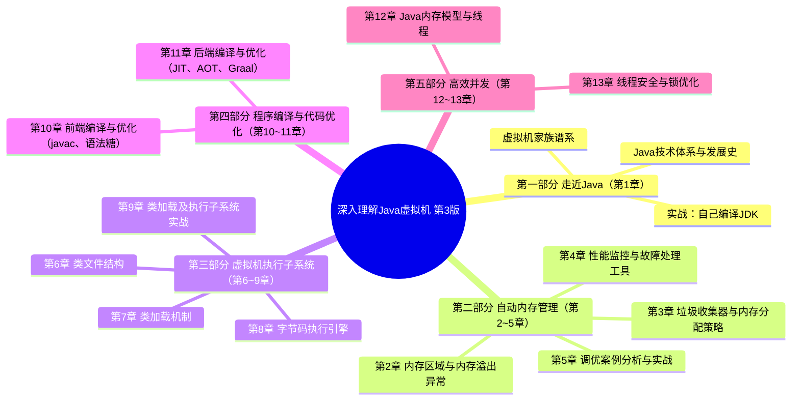
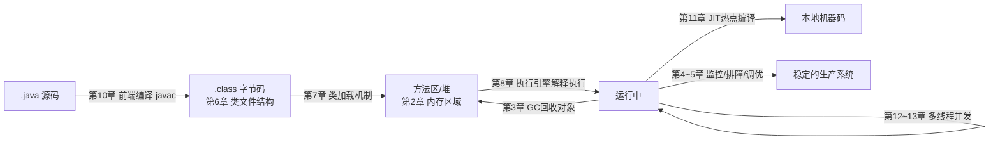
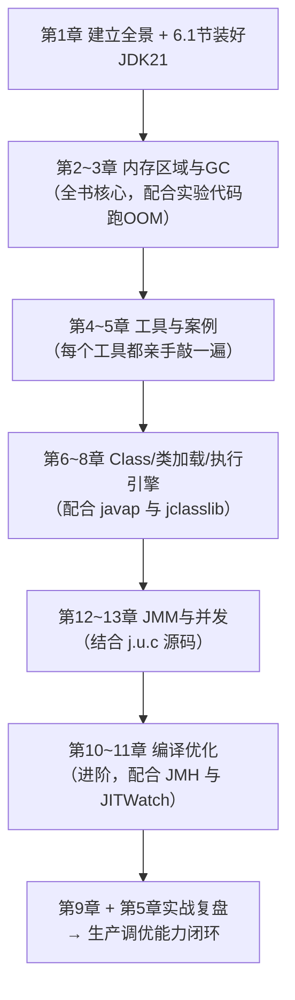

# 《深入理解 Java 虚拟机：JVM 高级特性与最佳实践（第 3 版）》深度阅读指南

> 作者：周志明（博士，资深 Java 技术专家，曾任远光软件研究院院长，另著有《深入理解 OSGi》《智慧的疆界》，并翻译《Java 虚拟机规范》）
> 出版：机械工业出版社，2020 年 1 月第 3 版，ISBN 9787111641247，521 页
> 地位：自 2011 年第 1 版上市以来，前两版累计印刷 36 次、销量超过 30 万册，被公认为"原创计算机图书领域不可逾越的丰碑"

---

## 一、整体理解与逻辑结构（全书层面）

### 1.1 全局摘要

#### 1.1.1 书中官方表述（引用）

关于**为什么要学习 JVM**，作者在前言中写道：

> "如果开发人员不了解虚拟机诸多技术特性的运行原理，就无法写出最适合虚拟机运行和自优化的代码。……目前商用的高性能 Java 虚拟机都提供了相当多的优化参数和调节手段，用于满足应用程序在实际生产环境中对性能和稳定性的要求。……尤其是大规模的、企业级的生产开发，就迫切需要开发人员中至少有一部分人对虚拟机的特性及调节方法具有很清晰的认识。"（第 3 版前言）

关于**内存管理这一核心主题**，书中第 2 章开篇有全书最著名的比喻：

> "Java 与 C++之间有一堵由内存动态分配和垃圾收集技术所围成的高墙，墙外面的人想进去，墙里面的人却想出来。"（第 2 章）

关于**垃圾收集要回答的问题**，第 3 章概述给出了经典三问：

> "哪些内存需要回收？什么时候回收？如何回收？"（第 3 章 3.1 节）

关于**Class 文件与平台无关性**，第 6 章指出：

> "实现语言无关性的基础仍然是虚拟机和字节码存储格式。"（第 6 章）

出版方对全书的官方定位是："一部从工作原理和工程实践两个维度深入剖析 JVM 的著作"，全书 13 章分为五大部分：走近 Java、自动内存管理、虚拟机执行子系统、程序编译与代码优化、高效并发。

#### 1.1.2 通俗解释：JVM 是什么，解决了什么问题

**JVM（Java Virtual Machine，Java 虚拟机）是一台"用软件造出来的计算机"**。它有自己的"CPU 指令集"（字节码）、自己的"内存条"（运行时数据区）、自己的"内存管家"（垃圾收集器），Java 程序不直接跑在物理机上，而是跑在这台虚拟的机器上。

它解决的三大根本问题：

1. **"一次编写，到处运行"（Write Once, Run Anywhere）**：源代码编译成与平台无关的字节码（.class），Windows、Linux、macOS 各自的 JVM 负责把同一份字节码翻译成本地机器指令。就像"世界语翻译官"——你只写一份世界语稿子，各国翻译官各自译给本国听众。
2. **自动内存管理**：C/C++ 程序员既要"造对象"又要"拆对象"，忘了拆就内存泄漏，拆两次就崩溃。JVM 把"拆"的工作交给垃圾收集器（GC）自动完成——但正如"高墙"比喻所暗示的：一旦出现内存泄漏或 GC 停顿问题，不懂原理的人会束手无策，这正是本书存在的意义。
3. **运行期动态优化**：JVM 的即时编译器（JIT）会在运行时观察哪些代码是"热点"，把它们编译成高度优化的本地代码，使 Java 达到接近 C++ 的执行性能——程序"越跑越快"。

一句话概括本书：**这不是一本教你写 Java 的书，而是一本教你理解"Java 程序运行在什么之上、为什么会这样运行、出了问题怎么救"的书。**

### 1.2 逻辑框架图

全书结构遵循"从外到内、从静到动"的认知路径：



五个部分的内在逻辑——**沿着"一个 Java 程序的完整生命旅程"展开**：



> 作者在前言中特别说明："各个部分之间基本上是互相独立的，没有必然的前后依赖关系，读者可以从任何一个感兴趣的专题开始阅读，但是每个部分各个章节间则有先后顺序。"

### 1.3 JVM 与其他主流/以往技术的对比

| 维度         | HotSpot JVM（本书主角）                   | C/C++ 原生编译               | .NET CLR                             | Go Runtime                  | GraalVM Native Image（书中 11 章展望）      |
| ------------ | ----------------------------------------- | ---------------------------- | ------------------------------------ | --------------------------- | ------------------------------------------- |
| 内存管理     | GC 自动回收，多款收集器可选（Serial→ZGC） | 手动 malloc/free、new/delete | GC 自动回收（分代）                  | GC 自动回收（并发三色标记） | GC 自动回收（Serial GC/G1）                 |
| 执行方式     | 解释 + JIT 混合，热点代码运行期编译       | AOT 静态编译为机器码         | JIT（也支持 AOT：ReadyToRun）        | AOT 静态编译                | AOT 提前编译为原生可执行文件                |
| 跨平台       | 字节码级"一次编写到处运行"                | 需按平台重新编译             | 早期绑定 Windows，.NET Core 后跨平台 | 交叉编译支持好              | 按平台生成原生镜像                          |
| 启动速度     | 慢（类加载+解释+预热）                    | 快                           | 中等                                 | 快                          | 极快（毫秒级）                              |
| 峰值性能     | 高（JIT 基于运行时画像激进优化）          | 高                           | 高                                   | 中上                        | 略低于 JIT（缺少运行时画像，可用 PGO 弥补） |
| 语言生态     | Java/Kotlin/Scala/Groovy 等字节码语言     | C/C++                        | C#/F#/VB                             | Go                          | 多语言（Truffle：JS/Python/Ruby/R）         |
| 生产可观测性 | 极强（jstat/jmap/JFR/arthas 等）          | 弱（依赖 perf/gdb）          | 强                                   | 中                          | 较弱（工具链在补齐）                        |
| 典型问题     | GC 停顿、内存溢出、预热慢                 | 内存泄漏、野指针、缓冲区溢出 | 类似 JVM                             | GC 调优选项少               | 反射/动态代理需显式配置                     |

**一段话总结**：JVM 的核心优势在于它是一个"运行期平台"而非单纯的翻译器——它用字节码换来了跨平台与多语言生态，用自动内存管理换来了工程安全性，用"解释器 + 分层 JIT"换来了兼顾启动与峰值的性能，并配套了业界最成熟的监控与故障诊断工具链；代价是启动慢、内存占用高、GC 停顿需要专门治理。与 C++ 相比它牺牲了确定性换取了生产力，与 Go 相比它的运行时更重但可观测性和可调优空间大得多，而书中第 11 章展望的 GraalVM 提前编译则代表 Java 阵营对"启动慢、内存肥"这两个软肋的自我革命——这也印证了本书的核心观点：理解虚拟机的运作原理，才能在这些技术取舍中做出正确决策。

---

## 二、分章节解读

> 章节结构依据机械工业出版社官方目录核对（五大部分、13 章、附录 A~E）。

| 章节     | 标题内容                       | 核心内容                                                                                                                                                                                                                       | 关键例证/数据（如有）                                                                                                                                         |
| -------- | ------------------------------ | ------------------------------------------------------------------------------------------------------------------------------------------------------------------------------------------------------------------------------ | ------------------------------------------------------------------------------------------------------------------------------------------------------------- |
| 前言     | 为什么写这本书                 | Java 开发者不了解虚拟机就"无法写出最适合虚拟机运行和自优化的代码"；面向中高级开发、系统调优师、架构师三类读者；说明五部分可独立阅读                                                                                            | 第 3 版新增逾 10 万字、近 50%全新内容，基于新版 JDK（涵盖至 JDK 13）                                                                                          |
| 第 1 章  | 走近 Java                      | Java 技术体系（JDK/JRE 划分）、发展史（1995 Oak→JDK 13）、虚拟机家族谱系、实战编译 OpenJDK 12                                                                                                                                  | 1.4 节虚拟机家族："武林盟主 HotSpot、天下第二 JRockit/J9、挑战者 Dalvik"；实战：从源码构建 JDK                                                                |
| 第 2 章  | Java 内存区域与内存溢出异常    | 运行时数据区五大块（程序计数器、Java 虚拟机栈、本地方法栈、堆、方法区）；对象的创建、内存布局（对象头/实例数据/对齐填充）与访问定位（句柄 vs 直接指针）；各区域 OOM 实战演示                                                   | "内存高墙"比喻；JDK 8 以后永久代被元空间（Metaspace）取代；`-Xms/-Xmx/-Xss` 演示堆溢出、栈溢出的实验代码                                                      |
| 第 3 章  | 垃圾收集器与内存分配策略       | GC 三问（哪些回收/何时回收/如何回收）；引用计数 vs 可达性分析；四种引用；分代收集理论；标记-清除/复制/整理三大算法；HotSpot 细节（OopMap、安全点、记忆集、写屏障、三色标记）；经典收集器到 ZGC/Shenandoah 全谱系；内存分配策略 | GC Roots 枚举；CMS 四阶段、G1 的 Region 设计；ZGC 染色指针实现"停顿不超过 10ms"目标；对象优先在 Eden 分配、大对象直入老年代、长期存活进入老年代等分配规则实验 |
| 第 4 章  | 虚拟机性能监控、故障处理工具   | 命令行工具族：jps/jstat/jinfo/jmap/jhat/jstack；可视化：JConsole、VisualVM、JMC（Java Mission Control）与 JFR（飞行记录仪）                                                                                                    | jstat 输出各代容量与 GC 耗时；jstack 抓死锁线程栈；JDK 11 后 JFR 开源免费                                                                                     |
| 第 5 章  | 调优案例分析与实战             | 大内存硬件的部署策略、集群同步导致的内存溢出、堆外内存溢出、外部命令导致系统缓慢、服务器虚拟机进程崩溃、安全点导致长时间停顿等 10 余个生产案例；实战：Eclipse 运行速度调优                                                     | 每个案例都是"现象 → 分析 → 定位 → 解决"完整链路；Eclipse 调优前后启动耗时对比数据                                                                             |
| 第 6 章  | 类文件结构                     | Class 文件格式逐字节剖析：魔数 0xCAFEBABE、常量池、访问标志、字段表、方法表、属性表；字节码指令简介                                                                                                                            | "实现语言无关性的基础仍然是虚拟机和字节码存储格式"；用 javap -verbose 逐项对照十六进制文件                                                                    |
| 第 7 章  | 虚拟机类加载机制               | 类加载时机与生命周期七阶段（加载 → 验证 → 准备 → 解析 → 初始化 → 使用 → 卸载）；主动引用六种情况；双亲委派模型及其三次"被破坏"；模块化（JPMS）下的类加载                                                                       | 经典代码题：子类引用父类静态字段不触发子类初始化；`ClassLoader` 的 loadClass 源码；JDK 9 模块化对双亲委派的调整                                               |
| 第 8 章  | 虚拟机字节码执行引擎           | 运行时栈帧结构（局部变量表、操作数栈、动态连接、返回地址）；方法调用：解析与分派（静态分派 → 重载，动态分派 → 重写）；invokedynamic 与方法句柄；基于栈的解释器执行过程                                                         | 局部变量表 Slot 复用影响 GC 的实验；重载优先级匹配实验代码；Lambda 底层的 invokedynamic                                                                       |
| 第 9 章  | 类加载及执行子系统的案例与实战 | Tomcat 类加载器架构、OSGi 灵活的类加载、字节码生成（动态代理）、Backport 工具（Retrotranslator/Retrolambda）；实战：自己动手实现远程执行功能                                                                                   | Tomcat 的 Common/Catalina/Shared/Webapp 类加载器层次；JDK 动态代理 `Proxy.newProxyInstance` 生成的字节码剖析                                                  |
| 第 10 章 | 前端编译与优化                 | javac 编译过程（解析 → 填充符号表 → 注解处理 → 语义分析与字节码生成）；语法糖剖析：泛型（类型擦除）、自动装箱拆箱、条件编译；插入式注解处理器实战                                                                              | `List<String>`与`List<Integer>`擦除后同类；`Integer`缓存导致 `==` 陷阱代码；实战：编写 NameCheckProcessor 检查命名规范                                        |
| 第 11 章 | 后端编译与优化                 | JIT 即时编译：解释器与编译器分层协作、热点探测（计数器）、编译过程；提前编译（AOT）；四大优化技术：方法内联、逃逸分析（栈上分配/标量替换/锁消除）、公共子表达式消除、数组边界检查消除；实战：深入 Graal 编译器                 | 分层编译 C1/C2；`-XX:+DoEscapeAnalysis` 逃逸分析实验；11.5 节构建 Graal（JVMCI 接口、代码中间表示、优化与生成）                                               |
| 第 12 章 | Java 内存模型与线程            | 硬件缓存一致性引出 JMM；主内存与工作内存、8 种内存间交互操作；volatile 可见性与禁止重排序；原子性/可见性/有序性；先行发生（happens-before）原则；线程实现（内核线程/用户线程）、状态转换；Java 与协程（纤程展望）              | volatile 的 DCL 单例示例；happens-before 八条规则；12.5 节"内核线程的局限 → 协程的复苏 →Java 的解决方案（Loom 纤程）"                                         |
| 第 13 章 | 线程安全与锁优化               | 线程安全的五个等级（不可变 → 绝对 → 相对 → 线程兼容 → 线程对立）；实现方法：互斥同步（synchronized/Lock）、非阻塞同步（CAS）、无同步方案（ThreadLocal）；锁优化：自旋/自适应自旋、锁消除、锁粗化、轻量级锁、偏向锁             | synchronized 底层 monitorenter/monitorexit；CAS 的 ABA 问题；对象头 Mark Word 在偏向/轻量级/重量级锁间的状态迁移                                              |
| 附录 A~E | 附加材料                       | Windows 下编译 OpenJDK 6；展望 Java 技术的未来（2013 年版留存）；虚拟机字节码指令表；OQL（对象查询语言）简介；JDK 历史版本轨迹                                                                                                 | 附录 C 是查字节码指令的常用工具表                                                                                                                             |

---

## 四、以生命周期顺序按照技术点归纳整理分析

> 组织主线：**一个 `.java` 文件从编译 → 装载 → 分配内存 → 执行 → 热点优化 → 并发运行 → 对象死亡回收 → 监控调优** 的完整生命周期。共 9 个技术点，每点按你要求的九个子项展开。

### 4.1 前端编译与语法糖（.java → .class）【第 10 章】

**① 背景与解决的问题**：javac 把源码编译为字节码，是生命周期的起点。语法糖（Syntactic Sugar）解决"语言易用性"问题——让人写得舒服，但虚拟机看不到糖，只看到脱糖后的字节码。不懂脱糖过程，就会掉进泛型、装箱的陷阱。

**② 作用与应用场景**：理解泛型边界（为什么不能 `new T()`）、排查装箱性能问题、编写注解处理器做编译期检查（Lombok 就是这个原理）。

**③ 使用方法与代码示例**（书中第 10 章经典陷阱代码）：

```java
// 类型擦除：两个List在运行期是同一个类
List<String> a = new ArrayList<>();
List<Integer> b = new ArrayList<>();
System.out.println(a.getClass() == b.getClass()); // true！泛型被擦除为原生类型

// 自动装箱陷阱（第10章）
Integer x = 127, y = 127;
Integer m = 128, n = 128;
System.out.println(x == y); // true  —— IntegerCache 缓存了 -128~127
System.out.println(m == n); // false —— 超出缓存范围，是两个不同对象
```

**④ 术语扩展**：

- **javac**：Java Compiler，JDK 自带的前端编译器；
- **AST**：Abstract Syntax Tree，抽象语法树，javac 解析源码的中间产物；
- **APT**：Annotation Processing Tool，插入式注解处理器，可在编译期读写 AST；
- **类型擦除（Type Erasure）**：Java 泛型只存在于源码期，编译后擦除为裸类型 + 强制转换指令。

**⑤ 版本变化**：JDK 5 引入泛型/装箱/foreach；JDK 7 引入 switch-String、try-with-resources；JDK 10 引入 `var` 局部变量类型推断（也是糖）。对比：

```java
// 旧（JDK 6 及以前）
BufferedReader br = new BufferedReader(new FileReader(f));
try { ... } finally { br.close(); }
// 新（JDK 7+ try-with-resources，编译器自动生成 finally + 异常抑制）
try (BufferedReader br2 = new BufferedReader(new FileReader(f))) { ... }
```

**⑥ 对比主流技术的优势**：Java 的"伪泛型"（擦除）相比 C# 的"真泛型"（运行期具现化）性能与表达力都吃亏，但换来了对旧版本字节码的完全二进制兼容——这是书中强调的工程取舍：生态兼容优先于语言完美。

**⑦ 实际应用**：编译期用注解处理器做强制规范检查（书中 10.4 实战 NameCheckProcessor 检查驼峰命名）；生产中 Lombok/MapStruct/Dagger 都靠 APT 生成代码，零运行时开销。

**⑧ 局限与解决方案**：擦除导致不能重载 `f(List<String>)` 与 `f(List<Integer>)`、不能 `instanceof List<String>`。方案：传 `Class<T>` 令牌、用超类型令牌（TypeToken）、或等待 Valhalla 项目的泛型特化。

**⑨ 通俗概括**：javac 是"翻译官"，语法糖是"给人看的漂亮话"——翻译成字节码前全部还原成大白话。知道还原规则，才不会被 `128 != 128` 这种"灵异现象"吓到。

### 4.2 Class 文件结构（字节码的"户口本"）【第 6 章】

**① 背景与解决的问题**：需要一种平台无关、语言无关的中间格式。书中："实现语言无关性的基础仍然是虚拟机和字节码存储格式。" Kotlin/Scala/Groovy 都编译成同样的 Class 文件。

**② 作用与场景**：读懂 Class 文件是字节码增强（AOP、Agent）、反编译分析、安全审计的基础。

**③ 使用方法**：Class 文件是一组以 8 字节为基础单位的二进制流，结构固定：

```
魔数(0xCAFEBABE) → 版本号 → 常量池 → 访问标志 → 类索引/父类索引/接口索引
→ 字段表 → 方法表 → 属性表
```

验证工具：`javap -verbose TestClass` 可逐项打印常量池与字节码指令。

**④ 术语扩展**：**魔数（Magic Number）** 0xCAFEBABE（"咖啡宝贝"，Java 命名趣闻）；**常量池（Constant Pool）**：存放字面量与符号引用，是 Class 文件的"资源仓库"；**符号引用（Symbolic Reference）**：以字符串描述目标，加载后才解析为直接引用（内存地址）。

**⑤ 版本变化**：主版本号随 JDK 递增（JDK 8=52，JDK 11=55，JDK 17=61）；JDK 9 增加 Module 属性支持 JPMS；高版本 JVM 可运行低版本 Class，反之拒绝。

**⑥ 优势对比**：与 .NET 的 IL 类似，但 Class 格式更早开放规范，孕育了 ASM/ByteBuddy/Javassist 完整字节码工程生态——这是 Java 拥有 Spring AOP、APM 探针繁荣生态的底层原因。

**⑦ 实际应用**：Skywalking/Arthas 等工具通过 `java.lang.instrument` 在类加载时改写字节码实现无侵入监控。

**⑧ 局限与方案**：Class 文件按类组织、常量池冗余，导致 JAR 体积大、解析慢。方案：JDK 9 的 jlink 裁剪运行时、AppCDS 类数据共享、GraalVM 原生镜像直接抛弃类加载。

**⑨ 通俗概括**：Class 文件是字节码的"标准化户口本"，任何语言只要办得出这个户口本，JVM 就认它做"自己人"。

### 4.3 类加载机制（把"户口本"变成活的类）【第 7 章】

**① 背景与解决的问题**：Java 的类是运行期按需装入内存的，这带来了动态扩展能力（Applet、SPI、热部署都靠它），但也引出"谁来加载、何时加载、重名怎么办"的问题。

**② 作用与场景**：理解初始化时机可避免静态块陷阱；理解双亲委派可解决 NoClassDefFoundError/LinkageError；自定义类加载器支撑热部署、加密类、模块隔离。

**③ 使用方法与书中示例**：类生命周期七阶段：**加载 → 验证 → 准备 → 解析 → 初始化 → 使用 → 卸载**。第 7 章经典实验：

```java
public class SuperClass {
    static { System.out.println("SuperClass init!"); }
    public static int value = 123;
}
public class SubClass extends SuperClass {
    static { System.out.println("SubClass init!"); }
}
// 主动引用测试
System.out.println(SubClass.value);
// 只输出 "SuperClass init!" —— 通过子类引用父类静态字段，不会触发子类初始化
```

双亲委派：收到加载请求先委派给父加载器，父无法完成才自己加载。保证 `java.lang.Object` 在任何加载器环境下都是同一个类。

**④ 术语扩展**：

- **双亲委派模型（Parents Delegation Model）**："双亲"实为"父辈"，是委派链而非两个亲；
- **启动类加载器（Bootstrap ClassLoader）**：C++实现，加载核心库；
- **准备阶段**：为静态变量分配内存并赋**零值**（`static int v=123` 此时 v=0，初始化阶段才变 123）；
- **SPI**：Service Provider Interface，服务提供者接口，JDBC 驱动加载即靠它（通过线程上下文类加载器"逆向"打破委派）。

**⑤ 版本变化**：JDK 9 模块化后，扩展类加载器变为**平台类加载器（Platform ClassLoader）**，且不再继承 URLClassLoader；类加载先按模块归属判断再委派。书中 7.5 节专述模块化下的类加载器变动。

**⑥ 优势对比**：相比 C/C++ 的静态链接与 dlopen，Java 类加载提供了命名空间隔离（同一类名可由不同加载器加载成不同类），这是 Tomcat 一个进程跑多个 Web 应用互不冲突的根基。

**⑦ 实际应用**（书中第 9 章案例）：Tomcat 设计了 Common/Catalina/Shared/Webapp 多层加载器，每个 WebApp 一个加载器实现隔离；OSGi 用网状加载器实现模块热插拔。

**⑧ 局限与方案**：双亲委派无法处理"基础类回调用户类"（如 JDBC），方案是线程上下文类加载器；热部署中旧类卸载困难（须加载器+所有类+所有实例都不可达），方案是整加载器替换（OSGi/Spring Boot DevTools 做法）。

**⑨ 通俗概括**：类加载器像"海关"：查验（验证）、登记（准备/解析）、放行入境（初始化）。双亲委派就是"逐级上报"——先问上级"这人您认识吗"，上级不认识才自己接收，防止有人伪造"java.lang.String"混进国门。

### 4.4 运行时内存区域（对象的"住房分配"）【第 2 章】

**① 背景与解决的问题**：程序运行需要内存放代码执行状态和对象数据。JVM 把内存划成职责不同的区域统一管理，替代 C/C++ 手工管理，代价是必须理解各区域的溢出模式才能排障。

**② 作用与场景**：OOM 定位（先判断是哪个区域溢出）、参数调优（-Xmx/-Xss/-XX:MetaspaceSize）、理解对象创建成本。

**③ 使用方法与书中实验**：五大运行时数据区：

| 区域             | 线程私有/共享 | 存放内容                 | 溢出异常                 |
| ---------------- | ------------- | ------------------------ | ------------------------ |
| 程序计数器       | 私有          | 当前字节码行号           | 唯一无 OOM 规定的区域    |
| Java 虚拟机栈    | 私有          | 栈帧（局部变量表等）     | StackOverflowError / OOM |
| 本地方法栈       | 私有          | Native 方法栈帧          | 同上                     |
| Java 堆          | 共享          | 对象实例（"几乎"所有）   | OOM: Java heap space     |
| 方法区（元空间） | 共享          | 类型信息、常量、静态变量 | OOM: Metaspace           |

书中第 2.4 节堆溢出实验：

```java
// VM Args: -Xms20m -Xmx20m -XX:+HeapDumpOnOutOfMemoryError
public class HeapOOM {
    static class OOMObject {}
    public static void main(String[] args) {
        List<OOMObject> list = new ArrayList<>();
        while (true) { list.add(new OOMObject()); } // 持续持有引用 → 堆溢出
    }
}
```

**④ 术语扩展**：**OOM** = OutOfMemoryError；**TLAB** = Thread Local Allocation Buffer，线程本地分配缓冲，让多线程分配对象不必抢锁；**Mark Word**：对象头里存哈希码/GC 年龄/锁状态的部分；**指针压缩**（-XX:+UseCompressedOops）：64 位下把对象指针压成 32 位省内存。

**⑤ 版本变化（重点）**：

```text
JDK 7 及以前：方法区 = 永久代（PermGen），参数 -XX:PermSize / -XX:MaxPermSize
JDK 8 及以后：永久代移除 → 元空间（Metaspace，使用本地内存），
              参数 -XX:MetaspaceSize / -XX:MaxMetaspaceSize
              字符串常量池早在 JDK 7 已移到堆中
```

书中强调这一变更原因：永久代大小难以预估、易 OOM，且为与 JRockit 融合铺路。

**⑥ 优势对比**：分区管理 + TLAB 使 Java 对象分配只需"指针碰撞"一次移动（约十几纳秒级），比 C 的 malloc 自由链表分配更快——这是"Java 创建对象很贵"这一旧观念被书中纠正的地方。

**⑦ 实际应用**：生产标配 `-XX:+HeapDumpOnOutOfMemoryError -XX:HeapDumpPath=...`，OOM 时自动留下堆转储供 MAT 分析；容器时代用 `-XX:MaxRAMPercentage=75.0` 让堆随容器内存自适应。

**⑧ 局限与方案**：堆内对象受 GC 管辖，海量缓存会拖垮 GC——方案：堆外内存（DirectByteBuffer）或 Ehcache/Chronicle 的 off-heap 存储；线程栈默认约 1MB，万级线程内存爆炸——方案：虚拟线程（Loom）或减小 -Xss。

**⑨ 通俗概括**：JVM 内存像一座城市：堆是"居民区"（对象都住这），栈是每个工人的"随身工具包"（干完活就扔），方法区是"城市档案馆"（类的图纸），程序计数器是每个工人的"进度书签"。OOM 就是某个区"房子不够住了"，先弄清是哪个区，才能对症扩容或查泄漏。

### 4.5 垃圾收集器与内存分配策略（对象的"生老病死"）【第 3 章】

**① 背景与解决的问题**：自动回收死亡对象，消灭内存泄漏与悬空指针两大类 C/C++ 顽疾。书中 GC 三问："哪些内存需要回收？什么时候回收？如何回收？"

**② 作用与场景**：一切 Java 服务的停顿治理、吞吐调优、容量规划。

**③ 使用方法与核心机制**：

- **判定死亡**：可达性分析（Reachability Analysis）——从 GC Roots（栈中引用、静态字段、常量、JNI 引用等）出发，走不到的对象即死亡。书中明确否定了引用计数法（无法解决循环引用）。
- **三大算法**：标记-清除（碎片）、标记-复制（新生代，浪费空间换速度）、标记-整理（老年代）。
- **分代**：对象优先在 Eden 分配 → Minor GC 幸存进 Survivor → 年龄到阈值（默认 15）晋升老年代。
- **收集器谱系**（第 3 版重点扩充）：

| 收集器                  | 作用代        | 算法                   | 特点                                | 典型停顿                     |
| ----------------------- | ------------- | ---------------------- | ----------------------------------- | ---------------------------- |
| Serial / Serial Old     | 新生代/老年代 | 复制/整理              | 单线程，客户端默认                  | 长                           |
| Parallel Scavenge / Old | 新/老         | 复制/整理              | 吞吐量优先，JDK 8 默认              | 中                           |
| CMS                     | 老年代        | 标记-清除              | 并发收集低停顿，JDK 9 废弃、14 移除 | 低但有碎片                   |
| G1                      | 全堆(Region)  | 整体标记-整理+局部复制 | 可预期停顿模型，JDK 9+ 默认         | 可控（-XX:MaxGCPauseMillis） |
| ZGC                     | 全堆          | 染色指针+读屏障        | 第 3 版新增章节，目标停顿<10ms      | 亚毫秒~毫秒                  |
| Shenandoah              | 全堆          | 转发指针+读屏障        | 第 3 版新增，RedHat 出品            | 毫秒级                       |

书中 3.6.3 节分配策略实验示例：

```java
// VM: -Xms20M -Xmx20M -Xmn10M -XX:SurvivorRatio=8
// -XX:PretenureSizeThreshold=3145728 （大于3MB直接进老年代，仅Serial/ParNew有效）
byte[] big = new byte[4 * 1024 * 1024]; // 4MB 大对象直接进入老年代，避免Eden来回复制
```

**④ 术语扩展**：**STW** = Stop The World，GC 时暂停所有用户线程；**安全点（Safepoint）**：线程可暂停等待 GC 的位置；**OopMap**：记录栈上哪些位置是对象引用的数据结构，使 GC Roots 枚举不必全栈扫描；**记忆集/卡表（Remembered Set/Card Table）**：解决跨代引用，避免 Minor GC 扫全堆；**三色标记**：白（未访问）灰（访问中）黑（已扫描），并发标记的理论基础；**染色指针（Colored Pointer）**：ZGC 把标记位直接存在 64 位指针里的黑科技。

**⑤ 版本变化（新旧对照）**：

```bash
# JDK 8 时代（吞吐优先默认）
java -XX:+UseParallelGC -Xms4g -Xmx4g App
# 曾经的低延迟主流（JDK 14 已移除）
java -XX:+UseConcMarkSweepGC -XX:CMSInitiatingOccupancyFraction=70 App
# JDK 9+ 默认 G1
java -XX:+UseG1GC -XX:MaxGCPauseMillis=100 App
# JDK 15+ ZGC 转正（JDK 21 分代ZGC）
java -XX:+UseZGC -Xmx16g App
```

**⑥ 优势对比**：与 Go 单一并发 GC 相比，HotSpot 提供全谱系收集器按场景选型（吞吐选 Parallel、均衡选 G1、超低延迟选 ZGC）；与 C++ 智能指针相比，追踪式 GC 天然免疫循环引用。为什么有这种优势？因为 HotSpot 二十余年持续演进，把"停顿时间与吞吐量不可兼得"的取舍做成了可配置项。

**⑦ 实际应用**：8GB 堆的交易服务从 CMS 迁 G1：设 `-XX:MaxGCPauseMillis=50`，G1 自动按 Region 回收价值排序，Full GC 从每天数次降为零；日志分析用 `-Xlog:gc*`（JDK 9 统一日志框架，替代旧 `-XX:+PrintGCDetails`）。

**⑧ 局限与方案**：GC 无法回收"被无用集合持有的对象"（逻辑泄漏）——方案：MAT 支配树找持有链；ZGC 吞吐损耗约 10%——方案：吞吐敏感型批处理仍选 Parallel；浮动垃圾与并发失败——方案：预留空间参数与增大堆。

**⑨ 通俗概括**：GC 是"城市环卫系统"：可达性分析是"点名"——从市政府（GC Roots）沿关系网点名，点不到名的就是垃圾；分代是"垃圾分类"——新小区（Eden）垃圾多收勤快点，老小区（老年代）垃圾少但一收就是大扫除；ZGC 则是"边营业边打扫"的新型保洁，商场几乎不用闭店（停顿<10ms）。

### 4.6 字节码执行引擎（代码如何"动起来"）【第 8 章】

**① 背景与解决的问题**：类加载完成后，方法如何被调用、指令如何被执行？执行引擎解决"虚拟指令 → 实际动作"的映射，并决定多态的实现机制。

**② 作用与场景**：理解重载/重写的底层差异、Lambda 的实现、方法调用性能分析。

**③ 使用方法与书中实验**：栈帧结构 = 局部变量表 + 操作数栈 + 动态连接 + 返回地址。书中 8.2.1 经典实验——局部变量表 Slot 复用对 GC 的影响：

```java
public static void main(String[] args) {
    {
        byte[] placeholder = new byte[64 * 1024 * 1024];
    }
    int a = 0;          // a 复用了 placeholder 的 Slot，切断了引用
    System.gc();        // 此时 placeholder 才能被回收
}
```

方法分派：

- **静态分派**（重载）：编译期按参数**静态类型**选方法；
- **动态分派**（重写）：运行期按对象**实际类型**查虚方法表（vtable）。

**④ 术语扩展**：**操作数栈（Operand Stack）**：字节码指令的工作台（`iadd` 弹两数压回和）；**invokevirtual/invokespecial/invokestatic/invokeinterface/invokedynamic**：五条方法调用指令，前四条分派规则编译期固化，**invokedynamic**（JDK 7 引入）把分派逻辑交给用户引导方法——Lambda 表达式底层即是它；**MethodHandle**：方法句柄，比反射更轻的动态调用。

**⑤ 版本变化**：JDK 7 新增 invokedynamic 是自 Class 格式诞生以来"第一条新增的方法调用指令"；JDK 8 Lambda/接口默认方法基于其实现；旧写法匿名内部类会生成 `Outer$1.class` 文件，Lambda 则运行期动态生成，类文件更干净。

**⑥ 优势对比**：基于栈的指令集（vs Android Dalvik 基于寄存器）代码更紧凑、可移植性强，缺点是指令条数多、入栈出栈频繁——书中 8.5 节明确了这一取舍，并指出 JIT 编译后此差异基本被抹平。

**⑦ 实际应用**：排查"为什么调用了父类方法"：重载看引用声明类型，重写看运行时对象类型——书中 `Human/Man/Woman` 示例是面试高频题的出处。

**⑧ 局限与方案**：解释执行慢——方案即下一节 JIT；虚方法表使内联困难——方案：CHA（类层次分析）+ 激进内联 + 逃逸时去优化。

**⑨ 通俗概括**：执行引擎是"流水线工人"，操作数栈是他的"工作台"：把原料（操作数）搬上台，按图纸（字节码指令）加工，成品放回。重载在"下单时"就定了找谁干活，重写要等"货到了"看实际是谁再决定。

### 4.7 后端编译与优化：JIT/AOT（让 Java"越跑越快"）【第 11 章】

**① 背景与解决的问题**：纯解释执行比本地代码慢一个数量级。JIT 在运行期把热点代码编译成机器码，解决"跨平台"与"高性能"的矛盾。

**② 作用与场景**：所有长时间运行的服务端应用的性能基石；预热、压测、基准测试（JMH）设计都必须理解它。

**③ 使用方法与机制**：

- **热点探测**：HotSpot 用计数器——方法调用计数器 + 回边计数器（循环），超阈值触发编译；
- **分层编译（Tiered Compilation）**：解释器 → C1（客户端编译器，快但浅优化）→ C2（服务端编译器，慢但深优化）；
- **关键优化**（书中 11.4）：方法内联（优化之母）、**逃逸分析**（对象不逃出方法 → 栈上分配/标量替换/锁消除）、公共子表达式消除、数组边界检查消除。

```java
// 逃逸分析实验：-XX:+DoEscapeAnalysis（JDK 6u23后默认开启）
public int calc() {
    Point p = new Point(1, 2);   // p 未逃逸出本方法
    return p.x + p.y;            // 标量替换：根本不创建对象，直接用两个int
}
```

**④ 术语扩展**：**JIT** = Just-In-Time Compiler，即时编译器；**AOT** = Ahead-Of-Time Compiler，提前编译器；**C1/C2**：Client/Server Compiler 的代号；**OSR** = On-Stack Replacement，栈上替换，循环体在执行中途被替换为编译版本；**JVMCI** = JVM Compiler Interface（JEP 243），允许用 Java 写编译器接入 HotSpot——Graal 即由此接入；**PGO** = Profile-Guided Optimization，基于运行画像的优化。

**⑤ 版本变化**：JDK 8 默认开启分层编译；JDK 9 引入 AOT 工具 jaotc（后在 17 移除，路线让位于 GraalVM）；书中 11.5 实战的 Graal 编译器用 Java 编写，JDK 10（JEP 317）起可实验性替代 C2；后续演进为 GraalVM 与 Project Leyden。

**⑥ 优势对比**：JIT 相比 AOT 的根本优势是**拥有运行时信息**——可按实际类型做激进内联、按实际分支做布局优化，赌错了还能"去优化"退回解释器。这是 Java 峰值性能能追平 C++ 的原因；代价就是启动慢、需预热。

**⑦ 实际应用**：压测必须先预热（跑几万次让 C2 编译完成）再采样，否则测的是解释器；用 `-XX:+PrintCompilation` 观察编译事件，用 JITWatch 分析内联失败原因（方法体超 `-XX:FreqInlineSize` 是常见元凶）。

**⑧ 局限与方案**：启动慢/冷启动成本高——方案：AppCDS、分层编译调参、GraalVM Native Image（见第七节）；去优化风暴导致性能抖动——方案：稳定类型设计，避免超多态调用点。

**⑨ 通俗概括**：JIT 像"跟拍厨师的效率专家"：先看你怎么做菜（解释执行+收集画像），发现某道菜天天点（热点），就为它定制一条全自动流水线（编译成机器码），而且是按你家客人的真实口味（运行时数据）定制——所以 Java 程序"越跑越快"。

### 4.8 Java 内存模型与线程（并发的"交通法规"）【第 12 章】

**① 背景与解决的问题**：CPU 多级缓存 + 指令重排导致多线程下"一个线程的写，另一个线程未必立刻看见"。JMM（Java Memory Model）在各种硬件之上定义统一的可见性/有序性规则，让并发程序"一次编写，到处正确"。

**② 作用与场景**：所有并发代码正确性的理论根基；volatile/synchronized/final 语义、DCL 单例、无锁编程都建立其上。

**③ 使用方法与书中示例**：JMM 规定主内存与工作内存间 8 种交互操作（read/load/use/assign/store/write/lock/unlock）。volatile 两大语义：可见性 + 禁止指令重排。书中 12.3.3 DCL 示例：

```java
public class Singleton {
    private volatile static Singleton instance; // 没有volatile，可能拿到"半初始化"对象
    public static Singleton getInstance() {
        if (instance == null) {
            synchronized (Singleton.class) {
                if (instance == null) {
                    instance = new Singleton(); // 分配内存→初始化→赋引用，可能被重排
                }
            }
        }
        return instance;
    }
}
```

**先行发生（happens-before）八原则**（程序次序、管程锁定、volatile、线程启动/终止/中断、对象终结、传递性）是判断数据竞争的**唯一正确依据**——书中强调"时间上的先后"不等于"先行发生"。

**④ 术语扩展**：**JMM** = Java Memory Model（《JSR-133》定义）；**主内存/工作内存**：抽象概念，约对应堆内存/寄存器与缓存；**内存屏障（Memory Barrier）**：volatile 底层插入的 CPU 指令（如 x86 的 `lock addl`）；**KLT/ULT**：Kernel-Level Thread 内核线程 / User-Level Thread 用户线程；书中 12.4.1 指出 HotSpot 主流平台线程模型为 1:1 内核线程映射。

**⑤ 版本变化**：JDK 5（JSR-133）修复了旧 JMM 下 volatile 不禁止重排、final 可见性缺陷——这也是 DCL 在 JDK 5 之前"不可能写对"的原因；书中 12.5 展望的协程（Project Loom 纤程）已在 JDK 21 落地为**虚拟线程**：

```java
// 旧：平台线程，1:1 内核线程，创建成本高（默认约1MB栈）
new Thread(() -> handle(request)).start();
// 新（JDK 21+）：虚拟线程，M:N 调度，可百万级并发
Thread.startVirtualThread(() -> handle(request));
```

**⑥ 优势对比**：JMM 是主流语言中最早形式化定义的内存模型（早于 C++11 memory model），使 Java 并发库（j.u.c）可以跨平台保证正确性；相比 Go 的 CSP 通道模型，Java 提供共享内存+锁+CAS+通道（BlockingQueue）多范式选择。

**⑦ 实际应用**：状态标志位用 volatile（一写多读）；计数器用 LongAdder（分段 CAS）；跨线程发布对象一律经过 happens-before 通道（final 字段、volatile、锁、并发容器）。

**⑧ 局限与方案**：volatile 不保证复合操作原子性（i++ 仍会丢更新）——方案：AtomicInteger/锁；happens-before 推理复杂——方案：优先使用 j.u.c 高层组件而非手写同步。

**⑨ 通俗概括**：JMM 是多线程世界的"交通法规"：每个线程开着自己的车（工作内存副本），主内存是中央仓库。volatile 是"实时对讲机"（一喊全体听见），synchronized 是"独木桥+过桥必须交还最新货物"，happens-before 则是白纸黑字的"路权规则"——不按规则走，撞车（数据竞争）没商量。

### 4.9 线程安全与锁优化 + 监控调优闭环【第 13 章、第 4~5 章】

**① 背景与解决的问题**：有了内存模型还需工程手段实现线程安全，且锁的代价必须被优化到最低；系统上线后还需要监控与故障处理工具形成"运行 → 观测 → 调优"的闭环。

**② 作用与场景**：高并发服务的正确性与性能；线上 CPU 飙高、死锁、内存泄漏的排查。

**③ 使用方法**：

- **线程安全实现三条路**（书中 13.2.2）：互斥同步（synchronized/ReentrantLock，悲观）、非阻塞同步（CAS，乐观）、无同步方案（可重入代码、ThreadLocal）。
- **锁优化五件套**（13.3）：自旋/自适应自旋、锁消除（配合逃逸分析）、锁粗化、轻量级锁、偏向锁——Mark Word 随竞争程度逐级膨胀：偏向 → 轻量级 → 重量级。
- **工具链**（第 4 章）：

```bash
jps -l                          # 列出Java进程
jstat -gcutil <pid> 1000        # 每秒打印GC统计（E/O/M区占用与YGC/FGC次数耗时）
jmap -dump:format=b,file=heap.hprof <pid>   # 堆转储
jstack <pid>                    # 线程快照，可发现死锁（"Found one Java-level deadlock"）
```

**④ 术语扩展**：**CAS** = Compare-And-Swap，比较并交换，x86 上对应 `cmpxchg` 指令；**ABA 问题**：值从 A→B→A，CAS 误判未变，方案 AtomicStampedReference 加版本戳；**monitorenter/monitorexit**：synchronized 的字节码实现；**JFR** = Java Flight Recorder，飞行记录仪，生产级低开销采样；**MAT** = Memory Analyzer Tool，堆转储分析器。

**⑤ 版本变化**：JDK 6 引入偏向锁/轻量级锁完成 synchronized 大提速（此前"synchronized 慢用 Lock"的经验自此过时）；JDK 11 起 JFR 开源免费；**JDK 15 起偏向锁默认禁用（JEP 374）**——维护成本高且现代并发场景收益低，这是对书中 13.3.5 的重要时效补充。

**⑥ 优势对比**：synchronized 经锁膨胀优化后无竞争场景开销近乎为零，且无需手动 unlock，JVM 还能对其做锁消除/粗化——这是"能用 synchronized 就不必上 ReentrantLock"的依据；ReentrantLock 的优势场景仅剩：可中断、公平锁、多条件变量。

**⑦ 实际应用（书中第 5 章案例风格）**：线上 CPU 100% 排查链：`top -Hp <pid>` 找线程 → `printf '%x' <tid>` 转十六进制 → `jstack <pid> | grep <nid>` 定位栈帧；安全点导致长停顿案例（5.2.8）：可数循环（int 循环）不插安全点轮询，一个超长循环让全体线程等它——改 long 为 int 边界或 `-XX:+UseCountedLoopSafepoints` 解决。

**⑧ 局限与方案**：锁竞争激烈时吞吐骤降——方案：缩小临界区、分段锁（ConcurrentHashMap 思路）、无锁结构；ThreadLocal 在线程池中易泄漏——方案：用完必 remove。

**⑨ 通俗概括**：锁优化就是 JVM 的"人情世故"：没人抢就记个名字（偏向锁），俩人偶尔抢就打个白条（轻量级锁 CAS），抢红眼了才报警拘留（重量级锁挂起线程）。而 jstat/jstack/JFR 这套工具，就是给 JVM 做"体检 B 超"的设备——本书第 5 章的精髓正在于教你看片子。

---

## 五、输出格式与语言风格自检

| 要求                 | 落实情况                                                                                                                       |
| -------------------- | ------------------------------------------------------------------------------------------------------------------------------ |
| 清晰标题层级         | 一级（部）/二级（节）/三级（技术点子项）多层递进                                                                               |
| 思维导图/表格/流程图 | 1.2 节 Mermaid mindmap + flowchart；1.3/二/4.5 等多处对比表                                                                    |
| 引用与章节标注       | 所有书中原话均注明章节（如"第 2 章高墙比喻""3.1 节 GC 三问"）；时效性补充（如 JEP 374 偏向锁禁用）单独标注为"对书中内容的补充" |
| 学术准确 + 通俗表达  | 每个技术点保留规范术语并在 ④ 展开全称与含义，⑨ 提供生活化类比                                                                  |
| 缩写扩展             | JVM/OOM/STW/TLAB/CAS/JIT/AOT/JMM/JFR/SPI/JVMCI/PGO 等均给出全称与解释                                                          |

---

## 六、技术环境搭建：JVM 学习实验环境（书中第 1 章实战的现代化方案）

书中 1.6 节实战是"自己编译 JDK"（基于 OpenJDK 12），以下按当前主流 LTS（JDK 21）给出可逐步执行的完整环境，兼顾"运行实验代码"与"编译 JDK 源码"两级目标。

### 6.1 基础环境：安装 JDK 21（做书中全部代码实验）

**Windows（推荐用于日常实验）：**

```powershell
# 方式一：winget 一键安装 Eclipse Temurin 21（免费、TCK认证）
winget install EclipseAdoptium.Temurin.21.JDK

# 方式二：手动下载 https://adoptium.net/ 选 JDK 21 LTS Windows x64 .msi，
#         安装时勾选 "Set JAVA_HOME" 与 "Add to PATH"

# 验证
java -version    # 应输出 openjdk version "21.x.x"
javac -version
```

**Linux（Ubuntu 22.04+）：**

```bash
sudo apt update && sudo apt install -y temurin-21-jdk || sudo apt install -y openjdk-21-jdk
java -version
```

### 6.2 运行书中实验代码的标准姿势

```bash
# 1. 建立实验目录
mkdir jvm-lab && cd jvm-lab

# 2. 写实验类（以堆溢出为例，对应书中2.4节）
cat > HeapOOM.java <<'EOF'
import java.util.*;
public class HeapOOM {
    static class OOMObject {}
    public static void main(String[] args) {
        List<OOMObject> list = new ArrayList<>();
        while (true) list.add(new OOMObject());
    }
}
EOF

# 3. 编译并带 VM 参数运行（JDK 11+ 可单文件直接 java 运行）
javac HeapOOM.java
java -Xms20m -Xmx20m -XX:+HeapDumpOnOutOfMemoryError HeapOOM
# 预期：java.lang.OutOfMemoryError: Java heap space，且生成 java_pid*.hprof

# 4. 查看GC日志（替代书中旧参数 -XX:+PrintGCDetails）
java -Xlog:gc* -Xmx100m HeapOOM
```

### 6.3 安装分析工具

```bash
# 1. VisualVM（书中4.3节）：https://visualvm.github.io/ 下载解压即用
# 2. Eclipse MAT（堆转储分析）：https://eclipse.dev/mat/ 下载对应平台包
# 3. JDK Mission Control（JFR 界面）：https://adoptium.net/jmc/
# 4. Arthas（阿里开源在线诊断，书中未含、当前生产主流）：
curl -O https://arthas.aliyun.com/arthas-boot.jar
java -jar arthas-boot.jar        # 附着到目标Java进程后可 dashboard/thread/jad
# 5. 字节码查看：javap -verbose HeapOOM 或 IDEA 插件 "jclasslib Bytecode Viewer"
```

### 6.4 进阶：编译 OpenJDK 源码（对应书中 1.6 实战，更新到 JDK 21）

在 Linux/WSL2 (Ubuntu 22.04) 下执行：

```bash
# 1. 安装依赖（编译JDK需要一个"引导JDK"，版本为 N 或 N-1）
sudo apt update
sudo apt install -y build-essential autoconf zip unzip \
  libx11-dev libxext-dev libxrender-dev libxrandr-dev libxtst-dev libxt-dev \
  libcups2-dev libfontconfig1-dev libasound2-dev openjdk-21-jdk git

# 2. 获取源码（浅克隆减少体积）
git clone --depth 1 https://github.com/openjdk/jdk21u.git
cd jdk21u

# 3. 配置（slowdebug 版带完整调试符号，适合结合书中源码分析）
bash configure --with-debug-level=slowdebug --with-native-debug-symbols=internal

# 4. 编译（4核约30~60分钟）
make images

# 5. 验证自编译的JDK
./build/linux-x86_64-server-slowdebug/jdk/bin/java -version
# 输出中出现 "slowdebug" 字样即成功；之后可用 gdb 调试 HotSpot C++ 源码
```

> 常见坑：内存不足（建议 ≥8GB 或加 `--with-jobs=2`）；WSL1 不支持（需 WSL2）；中文路径会导致 configure 失败。

---

## 七、扩展：比书中所述更主流/更有优势的类似技术

| 方向         | 书中技术                 | 当前更主流/演进技术                                                        | 关系与建议                                                           |
| ------------ | ------------------------ | -------------------------------------------------------------------------- | -------------------------------------------------------------------- |
| 低延迟 GC    | CMS（已移除）、初版 ZGC  | **分代 ZGC（JDK 21+，JEP 439）**、G1 持续增强                              | 书中 ZGC 是单代版；分代 ZGC 吞吐与内存效率大幅提升，新项目低延迟首选 |
| 并发模型     | 12.5 节展望的协程/纤程   | **虚拟线程（JDK 21 正式，JEP 444）+ 结构化并发**                           | 书中预言已落地；IO 密集服务可用同步写法达到异步吞吐                  |
| 启动性能     | jaotc（已移除）          | **GraalVM Native Image**、**CRaC**（快照恢复）、**Project Leyden**         | Serverless/CLI 场景毫秒级启动；Spring Boot 3 / Quarkus 原生支持      |
| 内存布局     | 对象头+指针压缩          | **Project Valhalla 值类型**、**Lilliput（紧凑对象头，JDK 24 实验）**       | 值对象消除指针追踪与对象头开销，未来大幅利好缓存密集应用             |
| 诊断工具     | jhat（已移除）、VisualVM | **JFR + JMC**、**Arthas**、**async-profiler**（火焰图）                    | jhat 已死；生产诊断标配 JFR 常开 + async-profiler 定位热点           |
| 跨语言运行时 | 第 9 章 OSGi             | **GraalVM Truffle 多语言**、模块化用 **JPMS**、插件隔离用独立类加载器/进程 | OSGi 已边缘化，勿在新项目引入                                        |
| 竞品运行时   | HotSpot 为主             | **OpenJ9**（低内存占用）、**Azul Zing/C4**（无停顿 GC 商业方案）           | 内存受限容器可评估 OpenJ9；极端低延迟金融场景评估 Zing               |

**总结判断**：本书的知识体系（内存区域、GC 理论、类加载、JMM）是**不随版本过时的"地基"**——上表所有新技术都建立在这些概念之上：虚拟线程仍受 JMM 约束、Native Image 仍要做可达性分析、分代 ZGC 正是书中"分代收集理论"与"染色指针"的合流。正确姿势是：以本书吃透原理，再用 JDK 21+ 的新特性刷新工具与参数层面的实践。

---

## 附：学习路径建议



> 阅读顺序说明：作者前言明确各部分相互独立，本路径按"实用频度"重排——内存与 GC 是面试与生产的重中之重，编译优化最深可后置。
