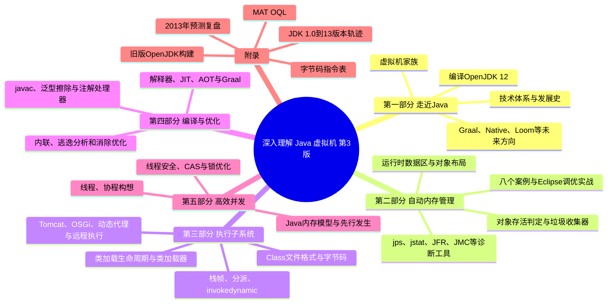
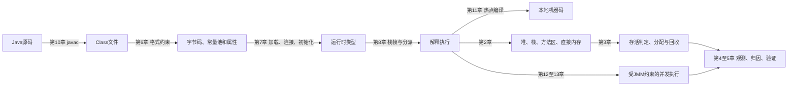
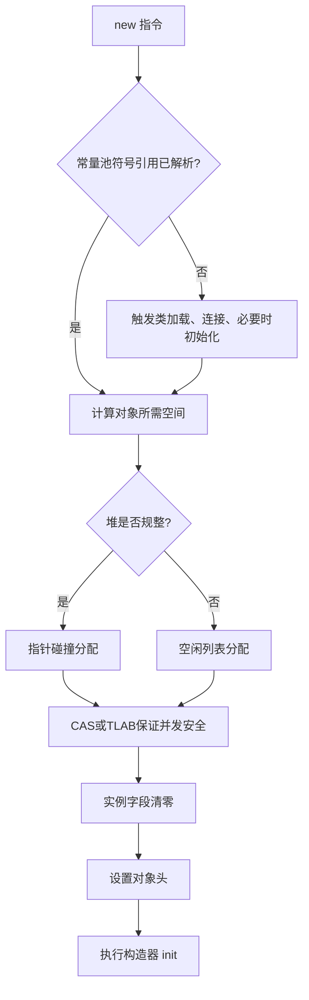
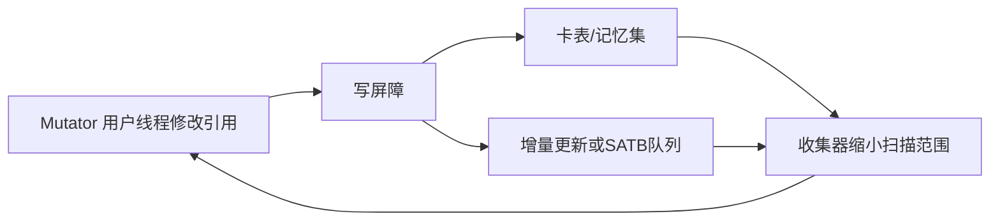
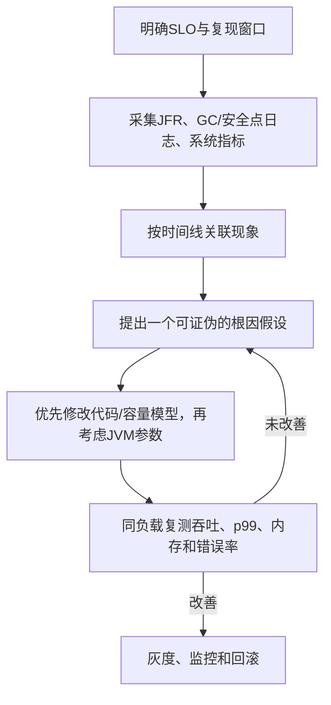

# 《深入理解 Java 虚拟机》第 3 版：从字节码到并发运行时

> **书目信息**：周志明著，《深入理解 Java 虚拟机：JVM 高级特性与最佳实践（第 3 版）》，机械工业出版社 2019 年出版，ISBN `978-7-111-64124-7`。本文的一手文本是题目提供的 716 页电子版；PDF 元数据显示作者为周志明，创建于 2019-12-28，电子版由华章分社制作发行。
>
> **阅读边界**：正文写于 2019 年中期，以 JDK 12 和当时尚未正式发布的 JDK 13 为时间边界。本文按原书的前言、致谢、五部分十三章、附录 A～E 顺序完整覆盖，不用旧文章或网络摘要代替原文。短引文标明章、节，不大段复制原书。
>
> **标记规则**：**【原书】**表示书中明确给出的定义、论证或案例；**【第 3 版变化】**表示前言列明的再版更新；**【当前补充】**表示截至 2026-08-10 依据 OpenJDK/Oracle 一手资料核验的实践；**【纠正】**表示原书中的工具、参数或结论已经失效。没有这些标记的解释，是对相邻原书内容的通俗转述。

## 一、先建立全局模型：JVM 是 Java 的运行时操作系统

### 1.1 作者为什么要把虚拟机单独拿出来讲

【原书】前言先定义 Java 技术体系：它由“支撑 Java 程序运行的虚拟机”、Java 类库、Java 编程语言以及 Spring、MyBatis 等第三方框架共同构成。虚拟机隐藏了硬件和操作系统差异，让开发者通常只靠语言、类库和框架就能完成业务；但作者紧接着指出：

> “如果开发人员不了解虚拟机诸多技术特性的运行原理，就无法写出最适合虚拟机运行和自优化的代码。”（前言）

这句话的适用条件不是“所有 Java 程序员都必须先学 HotSpot 源码”，而是：当系统面对大并发、低延迟、内存溢出、死锁或崩溃时，框架层的抽象已经不足以解释现象。此时必须回答四组问题：

- 一段 Java 代码最终以什么格式存在，为什么同一份 Class 文件能跨平台运行？
- 对象放在哪里，何时算作死亡，垃圾收集为什么会让全部线程停顿？
- 方法调用如何绑定到真正的实现，解释器与即时编译器怎样协作？
- 多线程为何会看见旧值，`volatile`、CAS 和锁分别保证了什么？

通俗地说，JVM 像一层面向 Java 程序的“小型操作系统”：Class 文件是它的可执行文件，字节码是它的指令集，堆和栈是它管理的内存，类加载器是装载与隔离机制，垃圾收集器是内存回收服务，JIT 编译器则会依据运行时画像把热点字节码变成本机机器码。本书不是 Java 语法大全，而是在解释这层运行时怎样工作，以及怎样用这些知识还原生产故障的因果链。

### 1.2 全书的逻辑框架



作者说五个部分彼此“基本上是互相独立的”，但每部分内部章节有先后关系。把它们合起来，可以得到一条故障分析链：



图中按程序生命周期展示关系，正文精读仍严格采用原书第 1～13 章顺序。

### 1.3 JVM 与相关运行时的差异

下表比较的是工程取舍，不是语言优劣。JVM 不是只能运行 Java，GraalVM Native Image 也不是“另一种 JVM 参数”。

| 维度 | HotSpot JVM | C/C++ 原生程序 | .NET CLR | Go 运行时 | GraalVM Native Image |
| --- | --- | --- | --- | --- | --- |
| 交付物 | 平台无关 Class/JAR，目标机安装兼容 JVM | 每个平台各自产生机器码 | IL 与运行时，也可生成原生代码 | 每个平台生成本机可执行文件 | 闭世界分析后为目标平台生成本机映像 |
| 执行策略 | 解释、分层 JIT、去优化协作 | 通常在构建期 AOT | JIT 为主，另有 AOT 方案 | 构建期 AOT | 构建期 AOT，不依赖传统热点预热 |
| 内存管理 | 多种可选 GC，堆外资源仍需显式管理 | 通常由程序或 RAII 管理 | 托管 GC | 内置并发 GC，可调面较小 | 由 Native Image 运行时 GC 管理 |
| 启动与峰值 | 启动、类加载和预热有成本；长期运行可利用真实画像 | 启动直接，构建期无法知道完整运行画像 | 与 JVM 类似但实现不同 | 启动快，单一运行时便于部署 | 启动快、常驻内存通常更小，构建时间更长 |
| 动态能力 | 类加载、反射、代理、运行期重定义能力强 | 取决于语言与链接方式 | 反射与动态加载完善 | 反射存在，但动态装载模型不同 | 反射、资源、代理等动态入口需在可达性分析中被发现或配置 |
| 典型优势 | 跨平台、多语言生态、成熟诊断、运行期自适应优化 | 资源控制直接、延迟可预测性可做得更强 | 与 Windows/.NET 生态整合紧密 | 部署简单、并发模型轻量 | 适合 CLI、函数计算和强调启动速度的服务 |
| 典型代价 | 预热、内存占用、GC 与类加载复杂度 | 内存安全和跨平台成本更多由工程承担 | 同样需要理解托管堆与 JIT | 峰值优化和诊断方式不同于 JVM | 闭世界假设削弱运行期动态性，峰值未必胜过 JIT |

JVM 的独特优势来自“信息保留到运行期”：它不仅执行字节码，还能观察真实类型、分支概率和热点，再以内联、逃逸分析等手段做带假设的优化；假设失效时还可去优化。这换来了很高的长期峰值和动态性，也引入预热、GC、停顿与较大运行时等成本。选择时应先看工作负载：长驻服务通常能利用 JIT，短命 CLI 更看重启动，极端尾延迟要重点评估收集器和资源上限。

## 二、章节地图：每章在解决什么

| 顺序 | 标题 | 核心内容 | 这一单元给出的解决思路 |
| --- | --- | --- | --- |
| 前言 | 为什么要理解 JVM | 读者定位、五部分结构、JDK 13 时间边界与第 3 版更新 | 从“会用 API”进阶到能解释性能、稳定性和扩展性问题 |
| 致谢 | 写作与技术审校来源 | 作者感谢社区读者、出版社与技术同行 | 提醒读者：本书是基于规范、实现和生产经验的工程总结 |
| 第 1 章 | 走近 Java | 技术体系、发展史、虚拟机谱系、未来项目、编译 OpenJDK 12 | 用历史理解兼容性包袱，用源码构建建立实现视角 |
| 第 2 章 | Java 内存区域与内存溢出异常 | 运行时数据区、HotSpot 对象创建与布局、四类 OOM 实验 | 先按内存区域分类，再用异常、堆转储和参数定位资源耗尽位置 |
| 第 3 章 | 垃圾收集器与内存分配策略 | 存活判定、收集算法、写屏障、经典与低延迟收集器、分配规则 | 在吞吐、停顿、内存占用之间按目标选择算法和收集器 |
| 第 4 章 | 虚拟机性能监控、故障处理工具 | `jps`、`jstat`、`jinfo`、`jmap`、`jstack`、JHSDB、JConsole、VisualVM、JFR/JMC | 用低开销观测缩小范围，再获取线程栈、堆转储或飞行记录验证 |
| 第 5 章 | 调优案例分析与实战 | 大堆、堆外、集群缓存、进程、数据结构、交换区、安全点等案例 | 坚持“现象—证据—根因—修改—复测”，不靠参数碰运气 |
| 第 6 章 | 类文件结构 | Class 二进制格式、常量池、字段/方法/属性表和指令分类 | 通过规范化中间格式实现平台、语言与实现解耦 |
| 第 7 章 | 虚拟机类加载机制 | 加载、连接、初始化，类加载器与双亲委派，JPMS | 以命名空间隔离依赖，以委派保证核心类型一致性，以模块声明可读性 |
| 第 8 章 | 虚拟机字节码执行引擎 | 栈帧、解析、静态/动态分派、方法句柄、`invokedynamic`、解释执行 | 用运行时类型和调用点规则找到目标方法，再由栈式引擎执行 |
| 第 9 章 | 类加载及执行子系统案例与实战 | Tomcat、OSGi、动态代理、Backport、远程执行字节码 | 把类加载和字节码改写用于隔离、热替换、代理与诊断 |
| 第 10 章 | 前端编译与优化 | javac 流程、泛型擦除、装箱、遍历、条件编译、注解处理器 | 在生成 Class 前完成语义检查、语法糖还原与代码生成 |
| 第 11 章 | 后端编译与优化 | 分层编译、热点探测、AOT、内联、逃逸分析、Graal | 在启动速度、编译成本与峰值性能之间分层，并用运行画像做激进优化 |
| 第 12 章 | Java 内存模型与线程 | 缓存一致性、JMM、`volatile`、先行发生、线程状态、协程构想 | 用语言级内存模型屏蔽硬件差异，为并发正确性建立可证明规则 |
| 第 13 章 | 线程安全与锁优化 | 安全等级、阻塞/非阻塞同步、无同步方案和锁优化 | 先减少共享可变状态，再按竞争程度选择锁、CAS 或线程封闭 |
| 附录 A | Windows 下编译 OpenJDK 6 | Cygwin、旧工具链和 OpenJDK 6 构建 | 作为历史材料理解早期构建；今天改用 Git 与新版构建系统 |
| 附录 B | 2013 年版未来展望 | 模块化、混合语言、多核、富客户端等预测 | 与第 1 章 2019 年预测对照，训练技术趋势判断 |
| 附录 C | 虚拟机字节码指令表 | 操作码、助记符、操作数与含义速查 | 配合 `javap -c -v` 从反汇编回查语义 |
| 附录 D | 对象查询语言 OQL | `SELECT`、`FROM`、`WHERE`、属性访问器与内置函数 | 在 MAT 中把堆转储对象过滤、投影、聚合成可验证的泄漏假设 |
| 附录 E | JDK 历史版本轨迹 | JDK 1.0 至 JDK 13 的发布日期和关键变化 | 把语法、类库、虚拟机与工具变化放回版本时间线 |

## 三、按原书顺序精读：从平台背景到高效并发

## 第一阶段：理解平台边界——第一部分“走近 Java”

### 第 1 章　走近 Java：先理解它为何成为今天的样子

#### 1.1～1.3　技术体系与历史不是年表，而是兼容性来源

【原书】第 1.2 节把 Java 技术体系按功能拆成四部分：Java 程序设计语言；各种硬件平台上的 JVM；Class 文件格式；Java API 类库以及来自商业机构和开源社区的第三方类库。JDK 是语言、虚拟机和类库的最小开发集合，JRE 是虚拟机和 Java SE API 的标准运行集合。自 JDK 9 起，传统“独立 JRE 安装包”的产品形态已改变，但这个概念划分仍有助于区分开发工具与运行能力。

第 1.3 节从 Oak、Java 1.0、J2SE/J2EE/J2ME、OpenJDK、Oracle 收购 Sun，一直写到半年发布节奏与 JDK 13。真正值得保留的不是每个发布日期，而是三条演化压力：

- **兼容性**：旧 Class 文件和庞大生态使激进重构受到约束，很多设计必须渐进落地。
- **开放治理**：OpenJDK 成为参考实现和主要开发场所，供应商可以基于共同代码提供发行版。
- **交付节奏**：固定半年发布把“大版本豪赌”拆成小步演化；版本号不再等同于一次巨大迁移。

【当前补充】OpenJDK 页面显示 JDK 25 于 2025-09-16 GA，并被多数供应商作为 LTS；JDK 26 于 2026-03-17 GA。本文的现代实验以 JDK 25 LTS 为推荐基线，JDK 26 用来观察最新特性，不能把“最新功能版”和“长期维护版”混为一谈。

#### 1.4　虚拟机家族：规范相同，实现目标不同

原书用大量历史说明“Java 虚拟机”不是 HotSpot 的同义词：

- **Sun Classic VM / Exact VM**：Classic 早期只能在解释器与外挂 JIT 之间二选一；Exact 以准确式内存管理等技术改进它，但很快被 HotSpot 取代。
- **HotSpot VM**：来自 Longview Technologies，核心卖点是热点探测与运行期优化；收购链让它最终成为 Oracle/OpenJDK 的主力实现，也是本书实现细节的主要对象。
- **Mobile / Embedded VM**：CDC-HI、Squawk、Java ME 等实现针对受限设备裁剪能力。它们说明规范兼容与资源预算必须一起考虑。
- **BEA JRockit / IBM J9**：JRockit 面向服务端并放弃解释器；它的 Mission Control 等能力后来进入 HotSpot。J9 延续为 Eclipse OpenJ9，强调不同于 HotSpot 的内存和启动取舍。
- **Liquid VM / Azul VM**：让虚拟机与专用硬件协同，探索大堆、低停顿和资源隔离；Azul 后来把重心转向通用 x86 上的软件运行时。
- **Apache Harmony / Dalvik**：Harmony 没有通过 TCK，不能直接称作合规 JDK；Dalvik 执行寄存器式 DEX，也不是 JVM。Android 5.0 后由支持 AOT/JIT 的 ART 取代 Dalvik。
- **Microsoft JVM**：Windows 平台上的实现因授权和诉讼停止发展，说明“能运行 Java 语法”不等于符合平台兼容承诺。
- **研究型与小众实现**：KVM、Java Card VM、Maxine、Jikes RVM、IKVM 等分别探索嵌入式、元循环、自举和跨运行时互操作。研究价值不等于生产适用性。

判断一个 JVM 时至少要问：通过了哪一版兼容性测试？支持哪些 GC、诊断接口和平台？启动、峰值、内存、停顿分别优化到什么程度？“同为 JVM”只保证规范层的共同语言，不保证内部布局、参数或性能相同。

#### 1.5　2019 年的五个未来方向，哪些已经落地

| 原书小节 | 2019 年讨论的方向 | 截至 2026-08-10 的结果与边界 |
| --- | --- | --- |
| 1.5.1 无语言倾向 | GraalVM、Truffle、Sulong，把多种语言归一到可优化的中间表示 | GraalVM 仍是独立发展的多语言运行时；“能互操作”不代表所有语言组合都无成本 |
| 1.5.2 新一代即时编译器 | Java 编写的 Graal 试图成为 C2 的候选替代者 | 【纠正】JEP 410 在 JDK 16 移除了 OpenJDK 内实验性 Graal JIT 与 `jaotc`，但保留 JVMCI；HotSpot 主线不能再用书中开关把 Graal 当内置实验编译器 |
| 1.5.3 向 Native 迈进 | Substrate VM/Native Image 用闭世界分析换启动与内存 | Native Image 已成为云原生方案之一；它与 HotSpot JIT 是并列取舍，不是全面升级关系 |
| 1.5.4 灵活的胖子 | 模块化、容器感知、低延迟 GC、协程，降低“大运行时”的使用成本 | JPMS、容器资源感知、ZGC/Shenandoah、虚拟线程均已落地；运行时仍需按负载选择配置 |
| 1.5.5 语言持续增强 | Valhalla、Amber、Loom、Panama | Amber 已持续交付 records、模式匹配等；Loom 的虚拟线程在 JDK 21 正式交付；Panama 的 FFM API 在 JDK 22 定稿；Valhalla 的值对象仍应以届时 JEP 状态为准 |

原书最有价值的预测方法是：不只看语法，而是看运行时正承受什么系统压力——启动、内存、延迟、外部内存访问和海量并发。预测是否落地，要用正式 JEP 和 GA 版本验证，不能把实验项目路线图写成已经可用的产品特性。

#### 1.6～1.7　编译 OpenJDK 的目的与限度

原书在 Ubuntu 上获取 OpenJDK 12 源码，准备 Boot JDK 和本地编译工具，执行 `configure`、`make images`，再把源码导入 IDE。这个实战的真正目标是建立三层边界：

1. Java 类库大多是 Java 代码，HotSpot 核心和本地方法则涉及 C/C++ 与平台代码。
2. 编译 JDK 必须先有一个可用的 Boot JDK，自举并不意味着“从零、不依赖任何旧编译器”。
3. IDE 索引能帮助查找调用关系，但性能与并发结论仍要由构建、测试和运行数据验证。

【当前补充】新版可复现步骤集中放在后文“实验环境”一节。附录 A 的 Cygwin、Mercurial、OpenJDK 6 和旧 Visual Studio 依赖只具历史价值，不应与第 1.6 节的 OpenJDK 12 步骤混用。

**本章术语**：

- **JVM（Java Virtual Machine）**：执行 Class 文件的抽象机器规范及其实现。
- **JDK（Java Development Kit）**：包含编译、打包、诊断工具和运行时的开发套件。
- **JRE（Java Runtime Environment）**：传统概念中的 JVM 加标准类库运行集合；现代 JDK 可用 `jlink` 生成定制运行映像。
- **TCK（Technology Compatibility Kit）**：验证实现是否符合相应 Java 平台规范的兼容性测试套件。
- **元循环虚拟机（Meta-Circular VM）**：主要用它所承载的语言来实现自身的虚拟机。
- **Boot JDK**：构建新版 JDK 时用于运行构建工具和编译 Java 源码的已有 JDK。

## 第二阶段：让对象可分配、可回收、可诊断——第二部分“自动内存管理”

### 第 2 章　Java 内存区域与内存溢出异常

#### 2.1～2.2　先按“线程私有/共享”和“规范/实现”划分内存

【原书】本章以一句经典比喻开场：

> “Java 与 C++ 之间有一堵由内存动态分配和垃圾收集技术所围成的高墙，墙外面的人想进去，墙里面的人却想出来。”（2.1 节）

墙内的人不必为每个对象手工 `free`，却也不能在泄漏时直接观察指针。解决办法不是背诵一张“JVM 内存图”，而是把异常映射到资源所有者：

| 区域 | 线程关系 | 放什么 | 规范允许的失败 | 排查重点 |
| --- | --- | --- | --- | --- |
| 程序计数器 | 私有 | 当前线程所执行字节码的地址；执行 Native 方法时可为空 | 规范中唯一未规定 OOM 的区域 | 通常不是容量故障入口 |
| Java 虚拟机栈 | 私有 | 每次方法调用的栈帧：局部变量表、操作数栈、动态连接、返回信息 | `StackOverflowError`；不能扩展时可 `OutOfMemoryError` | 无限递归、过深调用、线程数与 `-Xss` |
| 本地方法栈 | 私有 | 为 Native 方法服务，具体形式由实现决定 | 与虚拟机栈类似 | JNI/本地库调用和线程资源 |
| Java 堆 | 共享 | 绝大多数对象实例和数组，是 GC 管理重点 | `OutOfMemoryError: Java heap space` 等 | 对象是否必要、是否仍被引用、分配速率与 `-Xmx` |
| 方法区 | 共享 | 类型信息、字段、方法、运行时常量池、即时编译代码等逻辑内容 | 无法满足分配时 OOM | 类加载器泄漏、动态生成类、元空间上限 |
| 运行时常量池 | 方法区的一部分 | Class 常量池加载后的字面量与符号引用，也可动态加入 | 受方法区容量约束 | `String.intern()`、动态链接和类数量 |
| 直接内存 | 不属于 JVM 运行时数据区，但受进程资源约束 | NIO `DirectByteBuffer` 背后的堆外缓冲等 | `OutOfMemoryError: Direct buffer memory` 或本地分配失败 | `-XX:MaxDirectMemorySize`、Cleaner 可达性、进程地址空间 |

**【纠正：方法区不等于永久代】**。方法区是《Java 虚拟机规范》的逻辑概念；永久代是旧 HotSpot 的实现。JDK 8 起 HotSpot 移除永久代，用本地内存中的 Metaspace 存放类元数据。字符串常量池、静态字段究竟落在何处也属于实现演化问题，不能用一张旧版 HotSpot 图替代规范。

#### 2.3　HotSpot 创建一个普通对象时发生什么



- **2.3.1 对象创建**：是否使用指针碰撞取决于收集器能否保持堆规整；并发分配可用 CAS 重试，也可先给线程分配 TLAB，再在线程私有缓冲中快速分配。大对象或 TLAB 放不下时仍会走共享分配路径。
- **2.3.2 对象布局**：HotSpot 通常把对象分成对象头、实例数据、对齐填充。对象头包含运行时状态和类型指针；数组还需记录长度。字段排列和填充受实现、压缩指针及对象头模式影响，不是 Java 语言承诺的 ABI。
- **2.3.3 访问定位**：规范只规定引用能定位对象，不规定句柄还是直接指针。HotSpot 主要采用直接指针：访问快，但对象移动时要更新引用；句柄方案的引用稳定，却多一次间接访问。

【当前补充】JEP 519 在 JDK 25 正式交付 Compact Object Headers。它会改变 HotSpot 对象头的具体位布局并降低堆占用，因此书中基于传统 Mark Word/Klass Word 的字节数适合解释机制，不应当作所有 JDK、所有参数下的固定事实。需要精确测量时用 JOL，并同时记录 JDK 构建、压缩指针与紧凑对象头开关。

#### 2.4　四类 OOM 实验：实验目标是留下证据，不是把内存调大

下面把书中实验压缩为一个安全的堆溢出版本。它保留对象引用，使 GC 无法回收；不要在生产进程执行。

```java
// 原书 HeapOOM 思路的缩短版
import java.util.ArrayList;
import java.util.List;

public class HeapOom {
    public static void main(String[] args) {
        List<byte[]> retained = new ArrayList<>();
        while (true) {
            retained.add(new byte[1024 * 1024]);
        }
    }
}
```

```powershell
javac HeapOom.java
java -Xms32m -Xmx32m `
  -XX:+HeapDumpOnOutOfMemoryError `
  -XX:HeapDumpPath=heap-oom.hprof `
  HeapOom
```

预期是 `Java heap space` 并生成堆转储。正确分析顺序是：先确认这是不是堆 OOM；再在 MAT/JMC 等工具中查看支配树、保留大小和 GC Roots；如果对象业务上仍需存活，才考虑容量与分片；若不应存活，就修复引用链。

| 原书实验 | 触发机制 | 重要边界 |
| --- | --- | --- |
| 2.4.1 Java 堆溢出 | 持续创建并保留对象，固定 `-Xms/-Xmx` | “有 dump”不等于自动知道泄漏点，要分析到 GC Root 的路径 |
| 2.4.2 栈溢出 | 递归深度超过栈容量；或大量线程耗尽进程内存 | 书中警告 Windows 线程实验可能导致系统假死；只在隔离环境、限制资源后做 |
| 2.4.3 方法区/常量池溢出 | 旧版永久代、动态代理/CGLIB 大量生成类、类加载器无法卸载 | JDK 8+ 改看 Metaspace；旧 `-XX:MaxPermSize` 已失效，现代参数是 `-XX:MaxMetaspaceSize` |
| 2.4.4 直接内存溢出 | 通过 `Unsafe.allocateMemory` 或直接缓冲持续申请本地内存 | 堆转储未必解释堆外占用；结合 Native Memory Tracking、进程 RSS 与直接缓冲池指标 |

#### 2.5　把异常名称还原为资源模型

本章不是说“所有对象都在堆、所有 OOM 都靠加 `-Xmx`”。同一个进程同时消耗堆、元空间、线程栈、代码缓存、直接内存、映射文件和本地库内存。堆过大还会挤压这些资源。可靠判断需要同时记录：完整异常、JDK/收集器、启动参数、堆转储或 NMT、线程数和操作系统内存。

**本章术语**：

- **OOM（Out of Memory）**：某一内存资源无法满足新的分配请求，不等同于 Java 堆泄漏。
- **Stack Frame（栈帧）**：一次方法调用的数据结构，随线程调用栈入栈、出栈。
- **Metaspace（元空间）**：JDK 8+ HotSpot 用本地内存实现类元数据存储的区域。
- **TLAB（Thread-Local Allocation Buffer）**：线程本地分配缓冲，减少普通小对象分配的共享竞争。
- **CAS（Compare-And-Set）**：比较内存值与期望值，相等时原子更新；失败方通常重试。
- **Mark Word**：HotSpot 传统对象头中承载哈希、年龄、锁状态等运行数据的部分；具体布局是实现细节。
- **NMT（Native Memory Tracking）**：HotSpot 的本地内存分类跟踪功能，可用 `jcmd <pid> VM.native_memory` 查询。

### 第 3 章　垃圾收集器与内存分配策略

#### 3.1～3.2　“对象已死？”要回答的是可达性，不是作用域

【原书】第 3 章把垃圾收集压缩成三个问题：“哪些内存需要回收？什么时候回收？如何回收？”程序计数器和栈帧的生命周期较确定，难点集中在堆与方法区。

**引用计数为什么不够**：给对象维护引用数实现简单、判断快，但相互引用的两个对象即使已与程序其他部分断开，计数仍不为零。原书用两个对象互相赋值后触发 GC 的实验说明 HotSpot 没用单纯引用计数判断存活。

**可达性分析怎样工作**：从一组 GC Roots 出发沿引用关系搜索；不可达对象才进入回收候选。Java 中典型根包括线程栈里的引用、已加载类的静态引用、常量引用、JNI 引用以及 JVM 内部引用。根集合是实现与执行状态共同决定的，不是“所有静态变量永生”。

引用强度影响回收语义：

| 引用 | 回收语义 | 典型用途与误区 |
| --- | --- | --- |
| 强引用 | 只要从根可达就不回收 | 普通对象关系；容器忘记删除元素会形成泄漏 |
| 软引用 `SoftReference` | 内存不足前可回收 | 不应把它当精确容量缓存；行为受收集器和内存压力影响 |
| 弱引用 `WeakReference` | 下一次发现仅弱可达时即可回收 | 规范化映射、监听器等；键被回收不代表值的其他强引用消失 |
| 虚引用 `PhantomReference` | 不提供对象访问，用引用队列接收回收后通知 | 跟踪资源清理；必须配合 `ReferenceQueue`，不是“复活对象” |

原书还讨论 `finalize()` 的两阶段判定：对象第一次不可达时可能进入 F-Queue，由低优先级 Finalizer 线程执行终结方法，并有一次自救机会。**【当前补充】不要把它作为资源管理方案**：执行时机不确定、吞吐差，还可能重新建立引用。文件、Socket 和本地句柄应使用 `try-with-resources`、显式 `close()`，Cleaner 只作兜底。

**回收方法区的条件更苛刻**。废弃常量只需不再被引用；卸载类型则通常要求其全部实例已回收、定义它的类加载器已回收、对应 `Class` 对象不可达。插件、热部署或大量动态类场景中，类加载器泄漏因此尤其常见。

#### 3.3　四种算法是基本积木，不是四个可直接选择的 JVM 开关

原书先给出两个分代假说：多数对象朝生夕灭；熬过越多次收集越难死亡。跨代引用假说进一步说明老年代指向新生代的引用只占少数，于是只需维护记忆集，不必每次扫描整个老年代。

| 算法 | 做法 | 优点 | 代价与适用条件 |
| --- | --- | --- | --- |
| 标记—清除 | 标记存活对象，再清除未标记空间 | 不移动对象，思路直接 | 产生碎片；对象越多，标记和清理成本越高 |
| 标记—复制 | 把存活对象复制到另一块区域，整块释放原区域 | 分配简单、无碎片；存活率低时高效 | 需要复制空间；存活率高时复制昂贵 |
| 标记—整理 | 标记后把存活对象向一端移动，再清理边界外空间 | 得到连续空间，适合高存活率 | 移动对象和更新引用需要停顿或复杂并发屏障 |
| 分代/分区组合 | 按年龄、Region 或回收收益组合算法 | 可针对不同对象群优化 | 需要写屏障、记忆集和更复杂的调度 |

“年轻代用复制、老年代用整理”是常见实现思路，不是规范强制。G1、ZGC、Shenandoah 以 Region、并发转移和读/写屏障重新组合这些积木，不能只用早期连续新生代/老年代图解释。

#### 3.4　HotSpot 的关键难题：怎样在程序继续运行时保持引用图可信

- **3.4.1 根节点枚举**：逐一扫描所有内存既慢又不准确。HotSpot 在可产生停顿的位置借助 OopMap 知道栈和寄存器哪些位置是对象引用。
- **3.4.2 安全点**：JVM 只在调用、循环回跳、异常跳转等具有长时间执行特征的位置记录状态。抢先式中断不可控，HotSpot 主要采用主动式中断：线程轮询标志并自行进入安全点。
- **3.4.3 安全区域**：休眠或阻塞线程暂时不能执行轮询；它先声明一段引用关系不会变化的区域，离开时再确认 GC 是否完成。
- **3.4.4 记忆集与卡表**：记忆集是“哪些非收集区域可能指向收集区域”的抽象结构；卡表是常见实现，以一小段堆为一个卡页，用脏标记把精确引用问题降维成区域问题。
- **3.4.5 写屏障**：在引用赋值前后插入附加逻辑，维护卡表或并发标记状态。它不是 CPU 的内存屏障，虽然两者有时会共同出现在生成代码中。
- **3.4.6 并发可达性分析**：三色标记把对象分为未访问的白色、已访问但子引用未扫完的灰色、全部扫完的黑色。若并发期间“黑对象新增对白对象引用”且“灰对象删除对白对象原引用”同时发生，白对象可能被错删。CMS 用增量更新记录新增引用，G1 等采用原始快照（SATB）记录被删除的旧引用。



并发收集不是“完全不停顿”。初始标记、重定位准备、根处理或某些退化路径仍可能 STW；真正目标是把停顿限制为与堆容量弱相关、可预测的工作。

#### 3.5～3.7　收集器选择：先写服务目标，再看名称

| 收集器 | 原书中的定位 | 关键机制 | 2026 年边界 |
| --- | --- | --- | --- |
| Serial | 单线程新生代，简单高效 | 复制，工作时 STW | 小堆、单核或客户端型工作负载仍可能合适 |
| ParNew | Serial 的多线程新生代版本，主要与 CMS 配合 | 多线程复制 | 随 CMS 退出而失去主要搭配，不是新系统首选 |
| Parallel Scavenge / Parallel Old | 吞吐优先、可自适应调节 | 年轻代复制，老年代整理 | Oracle JDK 25 仍提供 Parallel GC；批处理可评估 |
| Serial Old | Serial 的老年代版本，也曾作 CMS 失败后备 | 标记—整理 | 小堆或特定后备路径 |
| CMS | 以最短回收停顿为目标，并发标记清除 | 初始标记、并发标记、重新标记、并发清除 | **【纠正】JEP 363 已在 JDK 14 移除 CMS**；碎片、并发模式失败等内容用于理解历史 |
| G1 | 面向服务端，把堆划为 Region，按收益选择回收集 | SATB、卡表、并行转移、可预测停顿模型 | JDK 9 起常见默认选择；不是设定 `MaxGCPauseMillis` 就保证硬实时 |
| Shenandoah | 低停顿并发转移 | 转发指针、读/写屏障、并发整理 | JDK 25 交付分代 Shenandoah；具体可用性仍取决于发行版构建 |
| ZGC | 低停顿、可伸缩大堆 | 染色指针、加载屏障、并发转移 | JDK 21 引入分代 ZGC，JDK 23 起分代模式默认；书中的非分代初代实现是历史基线 |
| Epsilon | 只分配不回收 | 达到堆上限后退出 | 性能基线、极短任务或验证分配上限；不适合长驻普通服务 |

选择前至少量化四个目标：

1. **吞吐量**：用户代码时间 / 总运行时间。
2. **停顿时间及尾延迟**：不要只看平均值，要看 p99/p999 与最长暂停。
3. **内存占用**：并发标记、转移预留、记忆集和线程都会消耗额外内存。
4. **可接受复杂度**：默认 G1 是否已经满足？切换 ZGC/Shenandoah 的收益能否覆盖验证成本？

Oracle JDK 25 的 GC 调优指南仍建议从需求选择 Serial、Parallel、G1 或 ZGC。一个可重复的现代日志基线是：

```powershell
java -Xms2g -Xmx2g `
  -Xlog:gc*,safepoint:file=gc.log:time,uptime,level,tags:filecount=5,filesize=20m `
  -jar app.jar
```

书中的 `-XX:+PrintGCDetails`、`-XX:+PrintGCTimeStamps` 与 `-Xloggc` 属于旧日志体系。JDK 9+ 应优先使用统一日志 `-Xlog`。字段含义和标签随版本变化，分析时先记录 `java -version`。

#### 3.8　对象分配规则是观察到的策略，不是 Java 语义

原书以 Serial/Serial Old 组合演示五条规则：

1. **对象优先在 Eden 分配**：空间不足触发 Minor GC；仍放不下时可能晋升或失败。
2. **大对象直接进入老年代**：连续大数组会加剧复制与空间风险；旧参数 `PretenureSizeThreshold` 只对特定收集器有意义。
3. **长期存活对象进入老年代**：对象头年龄随 Survivor 经历增长，达到阈值后晋升。
4. **动态年龄判定**：同龄对象总量占 Survivor 达到条件时，可提前晋升，不必机械等待最大年龄。
5. **空间分配担保**：Minor GC 前要评估老年代能否容纳可能晋升对象，失败时可能 Full GC 或分配失败。

```java
// 原书 AllocationTest 思路的缩短版：用 GC 日志观察，而非断言固定代际位置
public class AllocationTrace {
    private static final int MiB = 1024 * 1024;

    public static void main(String[] args) {
        byte[] a = new byte[2 * MiB];
        byte[] b = new byte[2 * MiB];
        byte[] c = new byte[4 * MiB];
        System.out.println(a.length + b.length + c.length);
    }
}
```

【纠正】G1 的 Humongous Region、ZGC 的分代实现与传统 Eden/Survivor/连续老年代并不完全等价。实验要固定收集器和堆参数，并把结论写成“此 JDK/此收集器下观察到”，不能上升为规范。

#### 3.9　把 GC 当资源调度器，而不是垃圾桶

本章最终建立的不是参数表，而是一套权衡：可达性决定“能否回收”，分配速率与空间决定“何时回收”，算法和收集器决定“以什么成本回收”。当暂停异常时，既可能是存活集太大、屏障负担、晋升失败，也可能是线程迟迟到不了安全点；第 4、5 章将把这些机制变成证据。

**本章术语**：

- **GC Roots**：可达性分析的起始引用集合。
- **STW（Stop The World）**：暂停用户线程以取得一致状态，不等于整个 GC 周期都停止世界。
- **Minor/Major/Full GC**：业界常用但并非跨收集器严格统一的术语，阅读日志应以具体收集集合和阶段为准。
- **Region**：G1、ZGC 等把堆划分出的逻辑/物理分区，用于独立选择或转移。
- **RSet（Remembered Set，记忆集）**：记录其他区域到当前区域的潜在引用。
- **Card Table（卡表）**：用卡页脏标记实现记忆集的常见结构。
- **SATB（Snapshot At The Beginning）**：并发标记按开始时对象图逻辑快照保障不漏标的一种方案。
- **TTSP（Time To Safepoint）**：从请求安全点到全部相关线程到达安全点所花时间。
- **Mutator**：垃圾收集语境中的用户线程，它通过分配和修改引用“改变”对象图。

### 第 4 章　虚拟机性能监控、故障处理工具

#### 4.1～4.2　基础工具：从低扰动概览到证据快照

原书强调：工具大多基于 `libjvm` 暴露的管理接口，命令本身只是包装，所以功能、输出会随 JDK 变化。现代排障可把 `jcmd` 作为入口，但仍应理解书中每个专用工具采集的是什么。

| 工具/小节 | 书中用途 | 常用示例 | 使用风险与现代状态 |
| --- | --- | --- | --- |
| `jps` 4.2.1 | 列出本机 JVM 进程及主类 | `jps -lv` | 容器/权限边界下可能看不全；PID 也可由系统工具获得 |
| `jstat` 4.2.2 | 周期观察类加载、编译、GC 容量和次数 | `jstat -gcutil <pid> 1000 10` | 列名和含义与收集器/JDK 相关；采样只能提示趋势 |
| `jinfo` 4.2.3 | 查看系统属性和 VM 标志，部分标志可动态修改 | `jinfo -flags <pid>` | 动态改旗标会改变生产状态，必须先确认可写和回滚方案 |
| `jmap` 4.2.4 | 生成堆转储、查看对象统计 | `jcmd <pid> GC.heap_dump heap.hprof` | dump 可能触发停顿、I/O 和磁盘爆满；现代优先相应 `jcmd` 命令 |
| `jhat` 4.2.5 | 启动 Web 服务分析堆转储 | 书中 `jhat dump` | **【纠正】JDK 9 已移除 jhat**；使用 Eclipse MAT、VisualVM 等 |
| `jstack` 4.2.6 | 获取线程快照、锁和死锁信息 | `jcmd <pid> Thread.print -l` | 单次快照不能证明持续热点；隔几秒采三次看重复栈 |
| 基础工具总结 4.2.7 | 还列出 `javap`、`jdb`、`jconsole` 等工具族 | `javap -c -v Demo` | JDK 9 模块化后不少工具归属和选项已变化，以对应版本文档为准 |

一条低风险采证路径：

```powershell
jps -lv
jcmd 12345 VM.version
jcmd 12345 VM.command_line
jcmd 12345 GC.heap_info
jcmd 12345 Thread.print -l > threads-1.txt
jstat -gcutil 12345 1000 10
```

若怀疑本地内存，在启动时增加 `-XX:NativeMemoryTracking=summary`，再执行：

```powershell
jcmd 12345 VM.native_memory baseline
# 经过一个稳定观测窗口后
jcmd 12345 VM.native_memory summary.diff
```

NMT 自身有开销，且不覆盖所有第三方本地分配；它是分类证据，不是进程 RSS 的完整替代。

#### 4.3　可视化工具：选择记录数据，而不是只盯实时曲线

- **4.3.1 JHSDB**：基于 Serviceability Agent，可附加存活进程或分析 core dump，能深入查看堆、对象和虚拟机内部结构。附加会暂停目标进程，线上使用前必须评估权限和停顿。
- **4.3.2 JConsole**：通过 JMX 观察内存、线程、类和 MBean，适合快速检查；远程开启 JMX 时要配置认证、TLS 与网络边界，不能裸露管理端口。
- **4.3.3 VisualVM**：插件化的综合工具，可看采样、线程、堆转储。它已从 JDK 独立发布；书中“随 JDK 携带”的历史不适用于现代发行版。
- **4.3.4 JFR/JMC**：JFR（Java Flight Recorder）把 JVM、线程、锁、分配、GC 和 I/O 事件写入时间序列记录；JMC（Java Mission Control）用于查看与分析。相比只看一张当前曲线，JFR 能保留“问题发生前后”的上下文。

```powershell
# 启动时记录 10 分钟，profile 配置开销高于 default
java -XX:StartFlightRecording=filename=app.jfr,duration=10m,settings=profile -jar app.jar

# 对运行中进程开始、检查和停止记录
jcmd 12345 JFR.start name=incident settings=profile filename=incident.jfr
jcmd 12345 JFR.check
jcmd 12345 JFR.stop name=incident
```

#### 4.4～4.5　插件和外部工具：数据源比界面更重要

原书介绍 HSDIS 反汇编插件、JITWatch、BTrace 等外部工具。它们分别回答“JIT 生成了什么机器码”“哪些方法被编译/内联”“能否动态跟踪某个事件”。外部工具要验证 JDK、架构和符号兼容性；动态注入类工具可能改变时序，不应在没有复现基线时先上重探针。

工具选择可以简化为：

- CPU 热点与调用栈：JFR、采样分析器、async-profiler；避免一上来做全量插桩。
- 内存泄漏：类直方图看趋势，必要时堆转储 + MAT 支配树/OQL。
- 死锁/线程阻塞：多份线程转储、JFR Java Monitor Blocked、锁拥有者。
- JVM 崩溃：保留 `hs_err_pid*.log`、core、JDK 符号和同版本二进制。
- 长暂停：统一 GC/safepoint 日志与 JFR 时间线对齐，区分 TTSP 和 GC 工作时间。

**本章术语**：

- **JMX（Java Management Extensions）**：通过 MBean 暴露管理和监控能力的标准体系。
- **SA（Serviceability Agent）**：读取 HotSpot 进程或 core 内部数据结构的服务性代理。
- **JFR（Java Flight Recorder）**：JVM 内置的低开销事件记录基础设施。
- **JMC（Java Mission Control）**：分析 JFR 和管理 JVM 的独立工具套件。
- **Heap Dump**：某时刻 Java 堆中对象和引用关系的快照。
- **Thread Dump**：某时刻线程状态、栈帧和锁关系的快照。
- **HSDIS（HotSpot Disassembler）**：供 HotSpot 打印本地机器码的反汇编插件。

### 第 5 章　调优案例分析与实战

#### 5.1～5.2　八个案例共同证明：异常所在层不一定是根因所在层

| 原书案例 | 表面现象与关键证据 | 根因 | 原书处理与今天应保留的方法 |
| --- | --- | --- | --- |
| 5.2.1 大内存部署 | 16 GB 机器给单 JVM 12 GB 堆，Full GC 停 14 秒 | 大文档对象进入老年代；收集器和大堆目标不匹配 | 评估单大堆配低延迟收集器，或多 JVM 逻辑集群；今天先用 G1/ZGC 实测，不照搬旧收集器结论 |
| 5.2.2 集群同步 OOM | dump 中大量 JGroups `NAKACK` | 高频同步消息在网络不佳时等待确认并积压重传 | 降低广播频率、修复网络/背压；堆只是积压载体，根因是生产速率超过确认速率 |
| 5.2.3 堆外 OOM | Java 堆各代稳定，栈指向 `Unsafe.allocateMemory`/`DirectByteBuffer` | 32 位进程地址空间被 1.6 GB 堆挤占，Direct Memory 缺空间 | 不再盲目加堆；按进程总内存核算堆、直接内存、线程栈和本地库 |
| 5.2.4 外部命令缓慢 | CPU 高，DTrace 显示 `fork` 最重 | 每个请求用 `Runtime.exec()` 建进程取系统信息 | 改用 Java API 或有界工作队列；核心是定位系统调用而非只看 Java 热点 |
| 5.2.5 JVM 进程崩溃 | 大量连接超时、等待线程和 Socket 增长，留下 `hs_err` | 异步调用没有限流，慢 OA 服务导致无界在途请求 | 改为有界生产者/消费者与超时、隔离、背压；“异步”不等于容量无限 |
| 5.2.6 数据结构浪费 | 100 万个 `HashMap<Long,Long>` 条目让 Minor GC 从约 30 ms 升至 500 ms | 包装对象和 Entry 使有效 16 字节数据在书中环境消耗约 88 字节；存活集复制昂贵 | GC 参数只能治标；用紧凑结构/原始类型布局治本。字节数受对象头和压缩指针影响，须实测 |
| 5.2.7 Windows 虚拟内存 | GUI 最小化后偶发约 1 分钟停顿，GC 工作本身很短 | 工作集被换出，GC 前重新换入页面 | 旧 AWT 参数解决特定环境；通用方法是对齐 OS 分页、工作集与 GC 时间线 |
| 5.2.8 安全点长停顿 | GC 仅 0.14 秒，应用停 2.26 秒；安全点日志显示线程迟迟未到 | JDK 8 的大 `int` 可数循环无安全点轮询 | 找出慢线程并修代码；现代 JDK 参数/实现已变化，但必须区分 TTSP 与 GC 时长 |

第 5.2.6 节尤其重要：调优不是默认“换收集器”。当数据结构把 16 字节有效数据扩成大量对象时，GC 看到的是巨大存活图；缩短停顿最有效的办法可能是改变内存表示。Compact Object Headers 能降低头部成本，却不会自动消除装箱、哈希桶和指针追踪。

#### 5.3　Eclipse 实战：保留实验方法，淘汰旧参数答案

原书用 JDK 5/6、32 位 Eclipse 3.5 做完整闭环：

1. **建立基线**：写启动计时插件，以 VisualGC 记录约 15 秒启动、19 次 Full GC、378 次 Minor GC、类加载与 JIT 耗时。
2. **升级并解释回归**：JDK 6 通常更快，却因发行商名称从 Sun 变 Oracle 导致 Eclipse launcher 没传 `MaxPermSize`，出现永久代 OOM。结论是升级要做兼容回归，而非“新版本必然更快”。
3. **分解非业务时间**：测试类验证、类加载和编译。强制 `-Xint` 虽把编译时间降为零，却让总启动增至约 27 秒，证明删除局部成本可能恶化总体。
4. **按证据调堆**：固定代大小减少扩容和频繁 GC，用 `jstat -gccause` 发现 Full GC 来自 `System.gc()`，再验证屏蔽显式 GC 的收益。
5. **按交互目标换收集器**：以 ParNew + CMS 降低停顿，并重新测量启动和暂停。

**【纠正】不能复制最终 `eclipse.ini` 到现代 JDK**：`PermSize/MaxPermSize` 已失效，CMS/ParNew 已移除或不再适合作为推荐，`-Xverify:none`/`-noverify` 已被弃用并削弱安全验证，`-Xnoclassgc` 还可能造成元空间滞留。今天应复用的是实验设计：固定输入、记录基线、一次只改一个因素、同时看吞吐/暂停/内存、能回滚、用同一工作负载复测。

#### 5.4　可迁移的调优闭环



**本章术语**：

- **PV（Page View）**：页面浏览次数，只是流量指标，不能直接代表并发或对象分配速率。
- **Backpressure（背压）**：下游变慢时限制上游生产，避免无界队列把延迟转成 OOM。
- **Working Set（工作集）**：进程近期实际驻留物理内存的页面集合。
- **RSS（Resident Set Size）**：进程当前驻留物理内存的大小，不等于 Java 堆使用量。
- **SLO（Service Level Objective）**：服务级别目标，如 p99 延迟、可用性和错误率。
- **`hs_err_pid` 日志**：HotSpot 致命错误时生成的崩溃报告，包含线程、寄存器、库和 VM 参数等证据。

## 第三阶段：把 Class 变成正在执行的程序——第三部分“虚拟机执行子系统”

### 第 6 章　类文件结构

#### 6.1～6.2　无关性的基石是受规范约束的中间格式

【原书】“实现语言无关性的基础仍然是虚拟机和字节码存储格式。”JVM 不认识 `.java` 源文件，只消费符合规范的 Class 文件；只要其他语言编译器能生成同样的格式，也能复用类库、GC 和 JIT。这把“Java 语言”与“Java 虚拟机”拆成两个演化层。

Class 文件是一组以 8 位字节为单位的二进制流，只有无符号数和表两种基本结构，没有分隔符。遇到可变长数据，只能先读计数再按严格顺序读取。因此解析器必须知道当前 Class 版本和每个表项格式。

#### 6.3　从魔数到属性表逐项读一个 Class 文件

| 顺序 | 结构 | 作用与关键边界 |
| --- | --- | --- |
| 6.3.1 `magic`、版本 | `0xCAFEBABE` 识别 Class；minor/major 表示格式版本 | 高版本 JVM 通常可运行不高于自身支持的 Class；低版本遇高 major 会报 `UnsupportedClassVersionError` |
| 6.3.2 常量池 | 字面量和符号引用的中心表，索引从 1 开始 | 项目类型包括 UTF-8、数值、类/字符串、字段/方法/接口方法引用、MethodHandle、MethodType、InvokeDynamic 等 |
| 6.3.3 访问标志 | 类/接口是 public、final、abstract、annotation、enum、module 等 | 标志组合必须满足规范约束，不是任意位图 |
| 6.3.4 类/父类/接口索引 | 通过常量池索引描述继承关系 | 除 `java.lang.Object` 外都有父类索引；Java 单继承、多接口由这里表达 |
| 6.3.5 字段表 | 名称、描述符、访问标志和字段属性 | 不包含运行时对象实例字段的具体值；编译期常量可由 `ConstantValue` 属性表达 |
| 6.3.6 方法表 | 方法签名、标志和属性 | Java 方法体通常在 `Code` 属性；abstract/native 方法没有 Java 字节码体 |
| 6.3.7 属性表 | 可扩展的附加信息 | `Code`、`Exceptions`、`LineNumberTable`、`LocalVariableTable`、`StackMapTable`、`BootstrapMethods`、模块和 Nest 属性等 |

第 3 版把格式更新到 JDK 12：JDK 9 模块化加入 `CONSTANT_Module_info`、`CONSTANT_Package_info` 与模块属性；JDK 11 为 nestmate 访问加入 `NestHost`、`NestMembers`，并加入 `CONSTANT_Dynamic_info`。这说明格式靠“新增可识别结构”演化，而不是随意改变旧结构语义。

用一个最小类观察源代码到常量池、方法描述符和指令的映射：

```java
public class BytecodeDemo {
    private int value = 1;

    public int add(int delta) {
        return value + delta;
    }
}
```

```powershell
javac -g BytecodeDemo.java
javap -c -v -p BytecodeDemo
```

重点不要从十六进制硬背起，而是依次找：`major version`、常量池里的字段/方法符号引用、字段描述符 `I`、`add` 的描述符 `(I)I`、`Code` 的 `max_stack/max_locals`，以及 `aload_0 → getfield → iload_1 → iadd → ireturn`。

#### 6.4　字节码指令按操作对象分组

- **6.4.1 类型与操作码**：操作码只有一个字节，空间有限，所以大量指令把类型编码在助记符前缀中，如 `iadd`、`ladd`；`boolean/byte/char/short` 常使用 int 类指令处理。
- **6.4.2 加载和存储**：`xload/xstore` 在局部变量表与操作数栈之间搬运，`ldc` 把常量入栈。
- **6.4.3 运算**：加减乘除、位运算和比较；整数除零抛异常，浮点遵循相应浮点规则。
- **6.4.4 类型转换**：宽化通常安全，窄化可能截断；Java 源码规则与字节码可表达能力不完全相同。
- **6.4.5 对象创建与访问**：`new`、`newarray/anewarray`、`getfield/putfield`、`arraylength`、`checkcast` 等。
- **6.4.6 操作数栈管理**：`pop`、`dup`、`swap` 等直接调整栈顶数据。
- **6.4.7 控制转移**：条件分支、比较、`goto`、`tableswitch/lookupswitch`；现代 Class 不再由 javac 生成 `jsr/ret` 实现 finally。
- **6.4.8 调用与返回**：`invokevirtual`、`invokeinterface`、`invokespecial`、`invokestatic`、`invokedynamic` 对应不同绑定机制，返回由 `xreturn/return` 完成。
- **6.4.9 异常**：异常表按字节码区间和处理器地址表达 `try/catch/finally`，`athrow` 主动抛出；不是靠一条“try 指令”。
- **6.4.10 同步**：方法级同步由方法访问标志表达，同步块由 `monitorenter/monitorexit` 表达；编译器必须保证正常和异常路径都退出监视器。

#### 6.5～6.7　公有设计、私有实现

JVM 规范公开 Class 行为和指令语义，具体实现可解释、编译、替换内部表示，只要外部效果符合规范。Class 格式会增长，但“旧虚拟机拒绝未知高版本”比误执行更安全。今天查看 JDK 25/26 生成的 Class 时，应使用同版本 `javap` 和对应版 JVM 规范；JDK 12 属性清单不是永久上限。

**本章术语**：

- **Magic Number（魔数）**：文件开头用于识别格式的固定值，Class 为 `CAFEBABE`。
- **Descriptor（描述符）**：编码字段类型或方法参数/返回类型的字符串，如 `(Ljava/lang/String;)V`。
- **Symbolic Reference（符号引用）**：以名称和描述符表达目标，加载解析后可转为直接引用。
- **Attribute（属性）**：Class 文件的可扩展信息单元，未知属性在规范允许时可被忽略。
- **Opcode（操作码）**：字节码指令的操作部分；Class 中每个操作码占一个字节。
- **Operand Stack（操作数栈）**：栈式执行引擎存放中间操作数的区域。

### 第 7 章　虚拟机类加载机制

#### 7.1～7.2　类的生命周期与六种主动初始化


加载、验证、准备、初始化和卸载按顺序开始，解析可为支持动态绑定而延后；“按顺序开始”不代表阶段绝不交叉。规范严格规定六类主动引用需要初始化：

1. 执行 `new`、`getstatic`、`putstatic`、`invokestatic`，且目标类尚未初始化；编译期常量读取除外。
2. 用反射 API 对类型进行调用。
3. 初始化类时，先初始化尚未初始化的父类。
4. JVM 启动时初始化包含入口 `main()` 的主类。
5. `MethodHandle` 最终解析为特定静态字段、静态方法或构造引用时。
6. 初始化实现类前，先初始化声明了默认方法的接口。

其他是被动引用。原书三个例子分别证明：通过子类读父类静态字段不初始化子类；创建某类型的数组不初始化元素类型；读取已进入调用方常量池的编译期常量不初始化定义类。

```java
class Parent {
    static int value = init();
    static int init() { System.out.println("Parent init"); return 42; }
}
class Child extends Parent {
    static { System.out.println("Child init"); }
}
public class PassiveUse {
    public static void main(String[] args) {
        System.out.println(Child.value); // 只要求初始化真正声明 value 的 Parent
    }
}
```

“未初始化”不等于“绝对未加载”；加载和验证时机有实现自由。观察日志时也要区分 load、link、initialize。

#### 7.3　加载、验证、准备、解析、初始化分别做什么

- **7.3.1 加载**：用类的全限定名取得二进制字节流；把静态存储结构转为方法区运行时结构；生成代表该类型的 `Class` 对象。字节流可来自 JAR、网络、动态代理、运行期计算，不局限于磁盘 `.class`。
- **7.3.2 验证**：文件格式、元数据、字节码和符号引用验证，确保不会破坏虚拟机。`StackMapTable` 等结构让类型检查更高效。验证是 JVM 安全边界的一部分，不应为一点启动时间长期关闭。
- **7.3.3 准备**：为类变量分配存储并设零值；`ConstantValue` 修饰的编译期常量可在准备阶段得到指定值。这里不执行普通 Java 赋值表达式。
- **7.3.4 解析**：把常量池中的类、接口、字段、方法、接口方法、方法类型/句柄和动态调用点等符号引用换成可定位的直接引用，并执行访问检查。
- **7.3.5 初始化**：执行编译器合并静态字段赋值和静态块形成的 `<clinit>()`。父类先于子类；JVM 保证同一类初始化在多线程下被正确同步，静态初始化阻塞也可能造成启动死锁。

#### 7.4　类加载器既加载字节，也定义类型身份

在 JVM 中，“类是否相同”由**类的全限定名 + 定义它的类加载器**共同决定。同名字节由两个加载器定义，是两个不同类型，强转会失败。这是应用隔离、插件、热部署能工作的基础，也是类加载器泄漏与 `ClassCastException` 的来源。

**双亲委派模型**的典型层次：Bootstrap 加载核心模块；Platform 加载平台类；Application 加载应用类。自定义加载器收到请求时先请父加载器处理，父级无法完成才自己查找。收益是 `java.lang.Object` 等核心类型在不同加载路径中保持唯一，避免应用随意替换平台类。

```java
// 推荐只覆盖 findClass，让 ClassLoader.loadClass 保留委派与并发处理
final class BytesClassLoader extends ClassLoader {
    BytesClassLoader(ClassLoader parent) { super(parent); }

    @Override
    protected Class<?> findClass(String name) throws ClassNotFoundException {
        byte[] bytes = loadTrustedBytes(name); // 业务自行实现，必须校验来源
        return defineClass(name, bytes, 0, bytes.length);
    }

    private byte[] loadTrustedBytes(String name) throws ClassNotFoundException {
        throw new ClassNotFoundException(name);
    }
}
```

原书把“破坏”双亲委派分三次历史变化理解：

1. JDK 1.2 前已有的自定义加载代码必须兼容，`loadClass` 留给用户覆盖，后来才建议重写 `findClass`。
2. SPI 接口由平台加载器看见，具体提供者却在应用路径；线程上下文类加载器让父加载器反向请求子加载器资源。
3. OSGi 等追求模块热插拔，加载关系变为网状；委派顺序由包导入/导出关系决定。

“打破委派”不是优化技巧。只有隔离、SPI、容器等明确需求才改变默认路径，并要设计卸载、线程上下文、缓存和资源关闭，否则旧 WebAppClassLoader 会一直被线程、ThreadLocal、驱动或日志框架引用。

#### 7.5～7.6　JPMS 给类路径之外再加一层可靠配置

JDK 9 的 JPMS（Java Platform Module System）用 `module-info.java` 声明模块名称、依赖、导出包、开放反射包、服务使用/提供。它解决类路径长期存在的两个问题：依赖缺失常到运行时才暴露；所有 public 类型默认暴露给所有代码。

```java
module com.example.app {
    requires java.net.http;
    exports com.example.api;
    opens com.example.model to com.fasterxml.jackson.databind;
}
```

JPMS 调整了启动加载器结构与可见性判断，但没有删除类加载器：类仍由加载器定义，模块再约束“是否可读、包是否导出/开放”。静态模块化也不等于 OSGi 的动态生命周期。

**本章术语**：

- **Linking（连接）**：验证、准备、解析三个阶段的统称。
- **`<clinit>`**：编译器为类/接口静态初始化生成的方法，不是开发者可直接调用的普通方法。
- **Class Loader Namespace（类加载器命名空间）**：由加载器及其可见类型共同形成的类型身份范围。
- **Parent Delegation（双亲委派）**：先委托父加载器查找，再由当前加载器尝试的加载策略；“双亲”不是两个父加载器。
- **SPI（Service Provider Interface）**：接口由平台定义、实现由第三方提供的扩展机制。
- **JPMS**：Java Platform Module System，Java 平台模块系统。

### 第 8 章　虚拟机字节码执行引擎

#### 8.1～8.2　栈帧是一次方法执行的工作台

编译期写入 `Code` 属性的 `max_stack`、`max_locals` 决定栈帧主要空间需求；JVM 实现可以优化物理布局，但语义上每个栈帧包含：

- **8.2.1 局部变量表**：以 Slot 存参数和局部变量，`long/double` 传统上占连续两个 Slot，实例方法的 Slot 0 是 `this`。Slot 可复用；变量离开作用域后，如果槽位仍保留引用且没有后续写入，GC 可能暂时不能回收对象。不要为此滥用手写 `null`，先让作用域自然缩小并由 JIT 优化。
- **8.2.2 操作数栈**：指令从栈顶取操作数、把结果压回；相邻方法可在实现中共享部分物理栈空间以减少复制。
- **8.2.3 动态连接**：栈帧持有运行时常量池中当前方法的引用，支持把符号方法引用在装载或运行时解析为目标。
- **8.2.4 方法返回地址**：正常返回由 `xreturn` 带回值；异常返回沿异常表寻找处理器，当前帧可能直接退出。
- **8.2.5 附加信息**：调试、性能等实现数据可与返回地址、动态连接统称帧信息。

#### 8.3　方法调用先解决“调用谁”，再谈“如何执行”

**解析调用**在类加载时就能唯一确定，典型是静态方法、私有方法、实例构造器、父类方法和 final 方法。**分派调用**则与重载、重写和运行时类型有关：

- 静态分派依赖变量的静态类型，典型对应重载选择。重载决议发生在编译期，按精确匹配、基本类型扩宽、装箱、父类型、变长参数等规则选择可适用的最具体方法。
- 动态分派依赖接收者实际类型，典型对应重写。`invokevirtual` 先找实际类中匹配方法，再沿父类查找；虚方法表让常见调用不必每次线性搜索。
- 字段没有多态分派；“子类隐藏父类字段”按声明类型访问，与重写方法不同。
- 单分派/多分派是按“影响目标选择的宗量数量”分类：Java 在静态分派阶段看接收者静态类型与参数类型，在动态阶段主要看接收者实际类型。

```java
class Dispatch {
    static class Parent { String who() { return "parent"; } }
    static class Child extends Parent { @Override String who() { return "child"; } }

    static void pick(Parent p) { System.out.println("Parent overload"); }
    static void pick(Child c)  { System.out.println("Child overload"); }

    public static void main(String[] args) {
        Parent value = new Child();
        pick(value);                  // 编译期静态类型 Parent 决定重载
        System.out.println(value.who()); // 运行时实际类型 Child 决定重写
    }
}
```

#### 8.4　`MethodHandle` 与 `invokedynamic` 把调用规则交给调用点

动态类型语言关注值在运行时能做什么，而不是变量声明时写了什么类型。Java 本身是静态类型语言，但 JDK 7 的 `java.lang.invoke` 为 JVM 上的动态语言提供标准支撑：

- `MethodHandle` 是带方法类型的可执行引用，访问检查通常在创建句柄时完成；它比反射更贴近字节码调用语义，也便于 JIT 优化。
- `MethodType` 描述参数和返回类型。
- `CallSite` 保存调用点目标，可按不变、可变或易变语义更新。
- `invokedynamic` 第一次执行时通过 Bootstrap Method 链接，之后按调用点目标执行。Lambda 表达式常借此链接，不等于“每次都用反射”。

```java
import java.lang.invoke.MethodHandles;
import java.lang.invoke.MethodType;

var lookup = MethodHandles.lookup();
var type = MethodType.methodType(String.class, int.class, int.class);
var handle = lookup.findVirtual(String.class, "substring", type);
String result = (String) handle.invokeExact("abcdef", 1, 4); // bcd
```

原书 8.4.5 用方法句柄改写分派目标，说明字节码调用规则不必永远写死在虚拟机内部；代价是链接逻辑必须维护类型适配和访问边界。

#### 8.5～8.6　基于栈与基于寄存器是指令集取舍

栈式字节码通常更紧凑、易跨平台，指令可能更多且需要频繁入栈出栈；寄存器式指令能用更少指令表达操作，但编码要指定寄存器。JVM 的规范模型基于栈，不代表 HotSpot 生成的机器码仍机械模拟操作数栈：解释器按栈语义执行，JIT 会转成 SSA/图等中间表示，再分配真实寄存器。

对 `1 + 1` 的字节码跟踪价值在于理解每条指令前后的局部变量表和操作数栈，而不是据此断言 Java 一定比寄存器 VM 慢。峰值性能主要取决于 JIT 是否消除抽象成本。

**本章术语**：

- **Slot**：局部变量表的逻辑存储单位，不承诺等于一个机器字。
- **Static Dispatch（静态分派）**：编译期依据静态类型选择目标，典型是重载。
- **Dynamic Dispatch（动态分派）**：运行期依据实际接收者选择重写方法。
- **Vtable/Itable**：虚方法/接口方法的快速分派表实现概念。
- **Method Handle（方法句柄）**：强类型、可组合的方法调用能力。
- **Bootstrap Method（引导方法）**：`invokedynamic`/动态常量首次链接时调用的方法。
- **SSA（Static Single Assignment）**：每个变量只赋值一次的编译器中间表示形式，便于数据流优化。

### 第 9 章　类加载及执行子系统的案例与实战

#### 9.1～9.2　四个案例把规范机制转成架构能力

**9.2.1 Tomcat：隔离与共享同时存在**。一个 Web 容器必须让不同应用可使用同一库的不同版本，又能共享公共库；还要隔离容器自身依赖并支持 JSP 热更新。Tomcat 因此建立 Common、WebApp、Jasper 等加载范围。WebApp 加载器会在特定范围优先本地查找，这不是随意违背委派，而是由应用隔离需求驱动。现代 Tomcat 目录和加载器名称会变化，核心判断仍是“谁可见谁、谁负责卸载”。

**9.2.2 OSGi：网状动态模块化**。Bundle 用 `Import-Package`/`Export-Package` 精确声明包依赖，只有导出的包对外可见；解析后加载器可向导出方委派。OSGi 擅长模块启停和版本并存，但热替换还要处理旧对象、线程、服务注册、缓存和状态，绝非换一个 JAR 就完成。

**9.2.3 动态代理：运行时生成代理类**。JDK `Proxy` 为接口生成实现类，把方法调用交给 `InvocationHandler`。它展示“字节码生成”如何把统一横切逻辑复用于未知接口。

```java
import java.lang.reflect.Proxy;

interface Greeting { void hello(); }
Greeting target = () -> System.out.println("hello");

Greeting proxy = (Greeting) Proxy.newProxyInstance(
    Greeting.class.getClassLoader(),
    new Class<?>[] { Greeting.class },
    (instance, method, args) -> {
        System.out.println("before " + method.getName());
        return method.invoke(target, args);
    });
proxy.hello();
```

实际框架还要处理 `equals/hashCode/toString`、受检异常、默认方法、递归代理和模块访问。JDK 动态代理主要面向接口；对类做代理通常使用生成子类或字节码改写，final 类/方法会限制这种方案。

**9.2.4 Backport：把高版本语法降到旧运行时**。Retrotranslator、Retrolambda 会变换 Class 版本、字节码模式和类库调用，把部分 JDK 5/8 语法放到旧环境。它们只能转换有等价表达的特性：若新版本依赖 VM 指令、类库或语义变化，单改字节码不够。今天主流构建可用 `javac --release N` 限制 API 和目标 Class 版本，但同样不能让旧 JVM 凭空拥有新运行时能力。

#### 9.3　远程执行实战：理解类重载与符号替换，不要部署成后门

原书目标是把客户端编译的临时 Class 发送到服务端执行、重复加载同名类、访问服务端类库，并捕获 `System.out/err`。思路分三步：

1. 客户端编译，服务端接收 `byte[]`，避免依赖服务端 `tools.jar`。
2. 每次使用新的 `HotSwapClassLoader` 调用 `defineClass`，让同名类获得新的类型身份并可随加载器回收。
3. 修改 Class 常量池，把 `java/lang/System` 的符号引用替换为自定义输出类，再反射调用 `main()`，避免全局 `System.setOut()` 污染其他线程。

原书实现的五个角色可概括为：开放 `defineClass` 的加载器、解析/修改 Class 常量池的字节数组工具、收集结果的替代 System、组合加载与执行的执行器，以及用于上传/展示结果的 JSP/IDE 外壳。

**【安全纠正】不要把书中 JSP 上传执行器放进今天的生产系统。**它本质上是远程代码执行入口：类加载器不是安全沙箱，模块也不能隔离文件、网络、进程和本地调用；Security Manager 已不再是可依赖的现代隔离方案。生产诊断应优先使用 JFR、受审计的 `jcmd`、观测平台或在容器/虚拟机级隔离的一次性任务。确需运行用户代码时，使用独立进程、最小 OS 权限、只读文件系统、网络策略、CPU/内存/时间上限、签名与审计，不与业务 JVM 同进程。

#### 9.4　本章边界

类加载器能做名称空间隔离，不能自动做安全隔离；字节码变换能插入行为，也会破坏验证、调试信息和升级兼容。每个方案都要回答：生成类由谁卸载？缓存是否以 Class/Loader 为键导致泄漏？跨模块反射是否允许？失败后能否回滚到原字节码？

**本章术语**：

- **WebApp ClassLoader**：Web 容器为单个应用建立的类加载命名空间。
- **OSGi Bundle**：带模块元数据、可声明包导入/导出与生命周期的 JAR 单元。
- **Dynamic Proxy（动态代理）**：运行期生成代理类型，把调用转交统一处理器。
- **Backport**：把新版本源代码或字节码可表达的特性转换到旧目标平台。
- **HotSwap**：运行期替换或重新加载代码的泛称；JVM TI 类重定义与“新类加载器加载同名类”机制不同。
- **RCE（Remote Code Execution）**：远程代码执行；若缺少严格授权与隔离，属于高危安全漏洞。

## 第四阶段：把源码和热点变成高效机器码——第四部分“程序编译与代码优化”

### 第 10 章　前端编译与优化

#### 10.1　Java 编译有前端，也有后端

原书把 `.java → .class` 的 javac 称为前端编译，把字节码 → 本地机器码的 JIT 称为后端编译。前端优化更接近语法糖、类型检查和代码生成，通常不会依据某台 CPU 做激进机器级优化；真正影响运行速度的许多优化在第 11 章由 JIT 完成。

#### 10.2　javac 的四段流水线


- **10.2.1 源码与调试**：javac 本身用 Java 编写，JDK 9 后属于 `jdk.compiler` 模块。内部包不是稳定公共 API；研究源码时必须对齐 JDK 版本。
- **10.2.2 解析与符号表**：词法分析把字符转为 Token，语法分析构建抽象语法树；Enter 阶段录入类、方法、变量符号，使后续名称解析和类型检查有据可查。
- **10.2.3 注解处理器**：JSR 269 处理器按轮次读取注解与元素模型，可生成新的源文件；生成文件会触发下一轮。处理器不应直接把编译器内部 AST 当稳定接口。
- **10.2.4 语义分析与字节码生成**：标注检查类型、常量折叠与符号绑定；数据流检查变量是否赋值、受检异常是否处理等；随后还原语法糖并生成 Class。实例构造器 `<init>` 和类初始化器 `<clinit>` 也在此组合形成。

#### 10.3　语法糖变甜了源码，没有增加 JVM 指令

**10.3.1 泛型：擦除换来了兼容，也留下运行时空洞。** Java 泛型主要通过类型擦除实现：`List<String>` 和 `List<Integer>` 运行时通常都是 `List`，编译器插入强转并在需要时生成桥接方法保持多态。Class 的 `Signature` 属性可保留部分泛型签名供反射读取，但对象实例没有完整实化类型。

```java
import java.util.ArrayList;
import java.util.List;

List<String> strings = new ArrayList<>();
List<Integer> integers = new ArrayList<>();
System.out.println(strings.getClass() == integers.getClass()); // true
```

由擦除产生的边界包括：不能直接 `new T()`，不能创建普通泛型数组，不能用 `instanceof List<String>`，重载不能只靠泛型实参区分。桥接方法还可能让反射看到源码中没有显式写出的 synthetic 方法。

**10.3.2 装箱、遍历与变长参数**都会改写：

```java
Integer a = 127, b = 127;
Integer c = 128, d = 128;
System.out.println(a == b); // 常见缓存范围内为 true
System.out.println(c == d); // 比较引用，通常为 false
System.out.println(c.equals(d)); // 比较数值，为 true
```

`==` 同时受拆箱和引用比较规则影响，不能用上例推导所有包装类型；数值业务应明确是否允许 `null`，优先基本类型避免无意义分配。增强 `for` 对数组转为索引循环，对 `Iterable` 转为迭代器；循环中结构性修改集合仍可能触发 fail-fast。

**10.3.3 条件编译**：Java 没有 C 的预处理器，但 `if (true)` 这类编译期常量条件可在 javac 阶段消除不可达分支。若条件来自运行期 `static final` 值或配置，就不是同一种条件编译。用它维护平台差异会让代码难读，现代工程更适合模块、构建 profile 或依赖注入。

#### 10.4　插入式注解处理器：在编译期把规则变成错误

原书实现 `NameCheckProcessor`，遍历类、方法、字段名并用 `Messager` 报告不符合 Java 命名惯例的位置。关键结构是：

```java
@javax.annotation.processing.SupportedAnnotationTypes("*")
@javax.annotation.processing.SupportedSourceVersion(javax.lang.model.SourceVersion.RELEASE_21)
public final class NameCheckProcessor
        extends javax.annotation.processing.AbstractProcessor {
    @Override
    public boolean process(
            java.util.Set<? extends javax.lang.model.element.TypeElement> annotations,
            javax.annotation.processing.RoundEnvironment roundEnv) {
        for (var root : roundEnv.getRootElements()) {
            // 通过 ElementScanner 扫描并用 processingEnv.getMessager() 报告诊断
        }
        return false; // 不独占所有注解
    }
}
```

处理器打包后通过 `META-INF/services/javax.annotation.processing.Processor` 注册，或显式使用 `javac -processor`。构建系统中应把处理器放在 annotation processor path，而不是混入应用运行类路径；处理器能在编译时执行代码，因此第三方处理器同样属于供应链执行面。

**10.4.4 其他应用**：Lombok 一类工具会深入修改 AST，能力强但依赖编译器内部结构；标准处理器更适合生成新类型、元数据和错误诊断。生成代码要稳定、可追踪，并避免每轮再次生成同名文件。

#### 10.5　本章判断

看似由 JVM 支持的语言特性，很多实际由 javac 还原。定位问题时先用 `javap -c -v` 问“编译后到底是什么”，再判断是前端类型/脱糖问题，还是运行时加载/JIT 问题。

**本章术语**：

- **AST（Abstract Syntax Tree）**：抽象语法树，表达源码结构而忽略无关文本细节。
- **Symbol Table（符号表）**：保存类型、变量、方法等声明与作用域关系的数据结构。
- **Desugar（解语法糖）**：把高级语法改写为 JVM 已有结构。
- **Type Erasure（类型擦除）**：把泛型类型参数转成上界/`Object` 并插入必要强转的实现策略。
- **Bridge Method（桥接方法）**：编译器为擦除后的重写关系生成的 synthetic 转接方法。
- **JSR 269**：Java 平台的 Pluggable Annotation Processing API 规范。

### 第 11 章　后端编译与优化

#### 11.1～11.2　解释器、C1、C2为何同时存在

解释器几乎无需等待编译，适合启动和冷代码；编译器先付出 CPU/内存成本，再让热点以优化机器码运行。HotSpot 用分层编译组合二者：采集方法调用与循环回边计数，在不同层级用带/不带画像的 C1、C2 编译，并在假设失效时去优化。

- **11.2.1 解释器与编译器**：`-Xint` 强制解释，`-Xcomp` 倾向尽早编译，两者主要用于实验/诊断，不是日常“加速开关”。默认 mixed mode 才能平衡启动和峰值。
- **11.2.2 编译对象与触发**：热点包括被频繁调用的方法和循环体。方法调用计数器与回边计数器衰减/溢出触发编译；循环热点可通过 OSR（栈上替换）在方法尚未返回时切入已编译代码。
- **11.2.3 编译过程**：C1 更快地产生较轻优化代码；C2 构建高级中间表示，做全局价值编号、内联、循环与逃逸等优化，再指令选择和寄存器分配。具体层级阈值受 JDK、负载和参数影响。
- **11.2.4 观察结果**：书中用 `-XX:+PrintCompilation`、`PrintInlining` 和 HSDIS；今天还可通过 JFR Compilation/Deoptimization 事件、JITWatch 或编译日志观察。

```powershell
java -XX:+UnlockDiagnosticVMOptions `
  -XX:+PrintCompilation `
  -XX:+PrintInlining `
  HotLoop
```

输出会被运行环境扰动；微基准应使用 JMH，设置预热、fork 和防止死代码消除，不能用一次 `System.nanoTime()` 比较 JIT 参数。

#### 11.3　AOT 解决启动与预热，但会失去部分运行期信息

原书区分两类 AOT：把 Java 代码直接编成机器码；或把曾经 JIT 的结果缓存起来。优点是启动快、减少运行期编译；代价是构建期不知道真实类型和分支画像，还要处理硬件兼容、类加载动态性和镜像体积。

原书 11.3.2 演示 JDK 9 的 `jaotc`。**【纠正】JEP 410 在 JDK 16 删除实验性 AOT 与内置 Graal JIT，因此命令在现代 OpenJDK 不存在。**替代方向不能混成一个：

- GraalVM Native Image 生成独立原生映像，采用闭世界可达性分析。
- OpenJDK Leyden 在 HotSpot 运行模型内改进启动与预热。JDK 25 已包含 AOT 命令行易用性和方法画像相关 JEP，但这不是恢复 `jaotc`，也不是把普通 JAR 自动变成 Native Image。
- CDS/AppCDS 共享类元数据和归档，主要降低启动与内存，不等同于完整机器码 AOT。

#### 11.4　四种优化如何消除抽象成本

**11.4.1 优化技术概览**还包括公共子表达式、常量传播、无用代码消除、循环展开、范围检查消除、锁消除等。优化彼此依赖，方法内联常是打开后续优化的钥匙。

**11.4.2 方法内联**把被调用方法体复制进调用点，消除调用开销并暴露常量、实际类型。虚方法也可依据类型画像做守护式内联；若后来出现新子类让假设失效，JVM 去优化回解释/低层级代码。过度内联会增加编译时间和代码缓存压力。

**11.4.3 逃逸分析**判断对象是否逃出方法或线程：

- 不逃逸对象可做标量替换，把字段拆成局部标量，甚至不真正分配对象。
- 线程不逃逸对象上的同步可锁消除。
- “栈上分配”是可由逃逸分析支持的思路，但 HotSpot 常通过标量替换让分配直接消失，不能把所有未逃逸对象想成真的存进 Java 栈。

**11.4.4 公共子表达式消除**复用已计算、且操作数未变化的表达式；全局价值编号可跨基本块发现等价值。必须尊重异常、浮点、volatile 和内存别名语义。

**11.4.5 数组边界检查消除**依据循环范围证明索引合法；证明不了就必须保留检查。循环版本化可以生成“快速无检查路径 + 慢速带检查路径”。数组安全语义没有因此被取消。

#### 11.5～11.6　Graal 实战的价值与版本变化

原书从 Graal 历史、构建环境、JVMCI 接口、Sea-of-Nodes 中间表示到 Canonicalizer 等优化阶段，展示“用 Java 写 JVM 编译器”如何快速迭代。JVMCI 把编译请求、元数据、已编译代码安装等能力连接给 Java 编写的编译器。

【纠正】第 3 版把 HotSpot 内实验 Graal 视作 C2 候选；随后 JEP 410 把它从 OpenJDK 主线产品中移除。今天学习本节仍可理解图 IR、优化相位和 JVMCI，但实际实验要选择 GraalVM 对应文档和构建，不能照抄 `-XX:+UseJVMCICompiler` 假定任意 JDK 25/26 都内置可用 Graal。

**本章术语**：

- **JIT（Just-In-Time）**：在运行期把热点代码编成本地机器码。
- **AOT（Ahead-Of-Time）**：在运行前完成部分或全部编译/归档工作。
- **Tiered Compilation（分层编译）**：让解释器和不同优化等级编译器协作。
- **OSR（On-Stack Replacement）**：方法执行中途把正在运行的栈帧切换到已编译版本。
- **Deoptimization（去优化）**：运行假设失效时退回解释或较低层级代码。
- **Escape Analysis（逃逸分析）**：判断对象是否可能被方法/线程之外观察。
- **JVMCI（JVM Compiler Interface）**：让 Java 编写的编译器与 HotSpot 交互的接口。
- **IR（Intermediate Representation）**：编译器优化和代码生成使用的中间表示。

## 第五阶段：让多个执行流仍然正确——第五部分“高效并发”

### 第 12 章　Java 内存模型与线程

#### 12.1～12.2　并发问题从 CPU、缓存和重排序开始

处理器速度远快于内存，于是硬件引入多级缓存、写缓冲和乱序执行。多核各有缓存后，同一地址可能出现多个副本；缓存一致性协议解决一部分可见性，却不会自动给高级语言程序提供“按源码顺序、瞬时可见”的幻觉。编译器和 CPU 都可在不破坏单线程语义时重排。

JMM 的任务不是模拟某一种 CPU，而是定义 Java 读写之间允许观察到什么，再由 JVM 把这些规则映射到 x86、AArch64 等硬件。程序若存在数据竞争，结果可能仍在 JMM 允许范围内却不符合直觉。

#### 12.3　用先行发生关系证明可见性与顺序

**12.3.1 主内存与工作内存**是规范抽象：所有实例字段、静态字段和数组元素存于共享主内存；线程对它们的操作可经自己的工作内存副本。它不等于“主内存就是物理 RAM、工作内存就是 CPU L1 缓存”，映射还包含寄存器和编译器优化。

**12.3.2 内存间交互**用 `lock/unlock/read/load/use/assign/store/write` 八种动作描述变量怎样在主内存、工作内存和执行引擎间移动，并规定成对、顺序与锁相关约束。现代开发通常不直接用八动作推导代码，而用 happens-before 和同步原语证明。

**12.3.3 `volatile` 的两条语义**：对 volatile 变量的写对后续读可见；volatile 读写建立禁止相关重排序的内存语义。它不把复合操作变原子：

```java
final class Counter {
    volatile int value;

    void increment() {
        value++; // 读、加、写三步；多个线程会丢更新
    }
}
```

适合 volatile 的场景是“一个线程发布状态，其他线程只读/据此行动”，且新值不依赖旧值或能接受竞争。计数用 `AtomicInteger.incrementAndGet()`、`LongAdder` 或锁。

**12.3.4 `long/double`**：截至 Java SE 25，JLS 17.7 仍允许非 volatile 的 64 位 `long/double` 写被实现为两个 32 位动作，虽然规范鼓励 JVM 实现原子读写，主流 64 位 HotSpot 也通常如此；将字段声明为 volatile 才有规范保证的原子读写。即使单次读写原子，也不能据此推导可见性或复合不变量。

**12.3.5 三种性质**：

- 原子性：操作不可被观察为中间状态；基本读写、监视器和原子类提供不同层级原子性。
- 可见性：一个线程的写何时能被另一个线程看见；volatile、锁、final 安全发布等提供规则。
- 有序性：观察顺序受 happens-before 约束；源码先后本身不一定构成跨线程顺序。

**12.3.6 八条先行发生规则**：

1. 程序次序：线程内按控制流前面的操作先行发生于后面的操作。
2. 管程锁定：一次 unlock 先行发生于随后对同一锁的 lock。
3. volatile：对变量的写先行发生于随后对它的读。
4. 线程启动：`Thread.start()` 先行发生于被启动线程中的动作。
5. 线程终止：线程内动作先行发生于其他线程从 `join()` 返回或检测到其终止。
6. 线程中断：调用 `interrupt()` 先行发生于目标线程检测到中断事件。
7. 对象终结：构造完成先行发生于其终结方法开始；但不应据此使用 finalization。
8. 传递性：A 先行发生于 B，B 先行发生于 C，则 A 先行发生于 C。

没有 happens-before 路径，并不证明“一定看不见”，而是实现不必向程序保证结果。正确程序要建立关系，不靠“我的机器上总是正常”。

#### 12.4　Java 线程映射与状态

- **12.4.1 实现**：内核线程由 OS 调度，用户线程可在用户态调度并映射到较少内核线程。经典 HotSpot 平台线程主要一对一映射原生线程，所以线程数受到栈与 OS 资源限制。
- **12.4.2 调度**：主流是抢占式调度；Java 优先级会映射到 OS 级别，跨平台行为不一致，不能用优先级证明公平性和正确性。`Thread.yield()` 也只是提示。
- **12.4.3 六种状态**：`NEW`、`RUNNABLE`、`BLOCKED`、`WAITING`、`TIMED_WAITING`、`TERMINATED`。Java 的 RUNNABLE 同时覆盖 OS 意义上的正在运行与可运行；`BLOCKED` 特指等待 monitor，不等于所有“卡住”。

#### 12.5　书中的协程预测已经由虚拟线程兑现

原书从一对一内核线程的栈内存与切换成本出发，回顾协程复苏，并介绍 Project Loom 的 Fiber 设想。JEP 444 已在 JDK 21 正式交付 Virtual Threads：它们仍是 `java.lang.Thread`，由 JVM 调度到较少的平台承载线程，阻塞 I/O 时可卸载，适合大量“每请求一线程”的 I/O 并发。

```java
try (var executor = java.util.concurrent.Executors.newVirtualThreadPerTaskExecutor()) {
    for (int i = 0; i < 10_000; i++) {
        executor.submit(() -> {
            Thread.sleep(100); // 阻塞式写法，虚拟线程可被调度器挂起
            return 1;
        });
    }
}
```

虚拟线程不让 CPU 密集任务凭空变快，也不放大数据库连接池容量；ThreadLocal 大对象会乘以线程规模，固定大小线程池也不应用于“池化虚拟线程”。并发上限仍应由外部资源信号量、连接池和背压控制。它们遵守同一 JMM，不能修复数据竞争。

#### 12.6　本章判断

JMM 是并发程序的契约，线程/虚拟线程是执行载体。先用不可变对象、消息传递和所有权减少共享；必须共享时，再用锁、volatile、并发容器或原子类建立 happens-before。

**本章术语**：

- **JMM（Java Memory Model）**：Java 内存模型，定义线程间读写、同步和可见性规则。
- **Data Race（数据竞争）**：多个线程并发访问同一变量，至少一个写，且缺少适当同步。
- **Memory Barrier/Fence（内存屏障）**：限制编译器/处理器内存重排的底层机制。
- **Happens-Before（先行发生）**：若 A 先行发生于 B，则 A 的结果对 B 可见且顺序受约束。
- **Platform Thread（平台线程）**：通常映射 OS 线程的传统 Java 线程。
- **Virtual Thread（虚拟线程）**：由 JVM 调度、可挂起/恢复的轻量 Thread 实现。
- **Carrier Thread（承载线程）**：实际承载虚拟线程运行的少量平台线程。

### 第 13 章　线程安全与锁优化

#### 13.1～13.2　先定义安全等级，再选择同步手段

原书引用 Brian Goetz 的定义：当多个线程访问对象时，不考虑运行时调度和交替，也不需要额外同步，调用行为都能得到正确结果，这个对象才是线程安全的。它进一步给 Java 操作分五级：

| 等级 | 含义 | 例子与边界 |
| --- | --- | --- |
| 不可变 | 状态创建后不变，正确发布后天然安全 | `String`、记录型值；字段 final 还要保证引用对象本身不被外部修改 |
| 绝对线程安全 | 调用者无论怎样组合操作都不需额外同步 | 很少见；单个线程安全方法不保证复合操作原子 |
| 相对线程安全 | 单次公共操作安全，复合序列需外部同步 | 多数并发集合；“先检查再执行”仍要原子 API |
| 线程兼容 | 对象本身不安全，调用方可正确同步后使用 | `ArrayList`、`HashMap` 等 |
| 线程对立 | 即使外部同步也难保证安全或会干扰其他线程 | `Thread.stop/suspend/resume` 等不应使用的控制方法 |

**13.2.2 三类实现方法**：

1. **互斥同步**：`synchronized` 由 `monitorenter/monitorexit` 或方法标志实现；`ReentrantLock` 提供可中断获取、超时、公平选项和多个 Condition。阻塞、唤醒和竞争有成本，但没有数据证明时不应为“无锁”而无锁。
2. **非阻塞同步**：CAS 在冲突时重试，依赖硬件原子指令。ABA 可用版本戳/`AtomicStampedReference` 处理；高竞争下自旋会烧 CPU，复合多变量不变量也不适合简单 CAS。
3. **无同步方案**：可重入纯函数、线程本地存储、按线程/任务划分所有权。`ThreadLocal` 不是共享数据同步器；在线程池中必须 `remove()`，虚拟线程规模下还要评估每线程状态成本。

```java
final class SafeCounter {
    private final java.util.concurrent.atomic.AtomicLong value =
        new java.util.concurrent.atomic.AtomicLong();

    long increment() {
        return value.incrementAndGet();
    }
}
```

若需求是高并发统计总数且不要求每次读取线性一致，可评估 `LongAdder`；若“扣库存 + 写订单”必须共同满足不变量，单字段原子类就不够。

#### 13.3　锁优化适应竞争，不改变同步语义

- **13.3.1 自旋与自适应自旋**：预计锁很快释放时，线程先占 CPU 等待，避免切换到内核阻塞；等待过久或单核环境反而浪费。自适应策略依据过去成功率调整。
- **13.3.2 锁消除**：逃逸分析证明对象不会被其他线程访问时，JIT 可删除同步。例如局部 `StringBuffer` 的隐式锁可能消失；源码仍保持正确同步语义。
- **13.3.3 锁粗化**：连续小范围地反复获取同一锁时，扩大锁范围可减少进出次数；范围过大又会降低并行度，由编译器权衡。
- **13.3.4 轻量级锁**：无竞争时通过对象头/栈中锁记录和 CAS 获取，失败后视竞争情况膨胀；“轻量”是相对 OS 互斥量，不表示它适合长时间持锁。
- **13.3.5 偏向锁**：旧 HotSpot 在长期无竞争时把对象偏向首个线程，减少 CAS；撤销在现代工作负载中收益下降。**【纠正】JEP 374 从 JDK 15 起默认禁用并弃用偏向锁相关选项。**阅读 Mark Word 状态迁移用于理解历史，不应在 JDK 25 调参时寻找偏向锁开关。

【当前补充】JDK 25 的 Compact Object Headers 会改变对象头和锁位的具体布局。Java 只承诺 `synchronized` 语义，不承诺某个固定 Mark Word 位图；诊断文档、JOL 输出和源码必须与实际 JDK 构建一致。

#### 13.4　优化顺序

1. 判断共享是否必要，优先不可变、复制、分区所有权。
2. 明确临界区保护的不变量，锁对象和生命周期保持稳定。
3. 用 JFR/剖析确认竞争线程、持锁时间和阻塞占比。
4. 缩短锁内 I/O，避免在锁中调用未知外部代码。
5. 最后才比较 `synchronized`、Lock、原子类或数据结构替换，并在真实竞争度下压测。

**本章术语**：

- **Monitor（管程/监视器）**：与对象同步关联的互斥与等待通知机制。
- **Mutex（互斥量）**：同一时刻只允许一个执行者进入临界区的同步原语。
- **CAS**：Compare-And-Set/Swap，比较并交换；Java 原子类的基础操作之一。
- **ABA Problem**：值从 A 变 B 又变回 A，单纯比较值无法发现中间变化。
- **Lock Inflation（锁膨胀）**：轻量同步路径在竞争加剧时转为更重实现的过程。
- **Lock Coarsening/Elimination**：锁粗化/锁消除，JIT 基于语义与逃逸做的优化。
- **Linearizability（线性一致性）**：并发操作看起来在调用与返回之间某一瞬间原子生效的正确性条件。

## 第六阶段：把附录变成可检索的工具箱

### 附录 A　在 Windows 系统下编译 OpenJDK 6

【原书】作者明确说这是第 1 版遗留的 OpenJDK 6 案例，部分内容已经过时，保留只是供旧版本构建参考。它仍按完整顺序覆盖：

- **A.1 获取源码**：从旧 OpenJDK 页面下载源码包，或使用 Mercurial 拉取仓库。
- **A.2 系统需求**：32 位 Windows 7、NTFS、避开中文/空格路径，并预估内存与磁盘。
- **A.3 构建编译环境**：用 Cygwin 提供 GNU Make 等 Unix 工具，安装 Visual Studio 编译器。
- **A.4 准备依赖**：Boot JDK、FreeType、Ant、二进制 Plug 等旧构建依赖。
- **A.5 进行编译**：设置大量环境变量后执行旧 Makefile，并逐项解决依赖检查。

【纠正】今天 OpenJDK 主仓库使用 Git，不再使用 Mercurial；Plug、OpenJDK 6 的目录和环境脚本不能用于新版。真正可迁移的经验只有三条：先读源码同版本 `doc/building.md`，让 `configure` 检查依赖，固定 Boot JDK 与工具链版本。新版实操见后文。

### 附录 B　展望 Java 技术的未来（2013 年版）

这份旧预测被移入附录，正好可以和第 1.5 节的 2019 年预测做回测：

| 小节 | 2013 年判断 | 后来发生了什么 |
| --- | --- | --- |
| B.1 模块化 | Jigsaw 延迟但模块化不可阻挡，OSGi 已形成动态模块方案 | JPMS 在 JDK 9 交付；OSGi 没被完全替代，因为静态可靠配置与动态模块生命周期目标不同 |
| B.2 混合语言 | JVM 会承载 Clojure、JRuby、Groovy 等多语言 | Kotlin、Scala 等继续共享 JVM 生态；GraalVM 又扩展跨语言互操作，但没有一种语言包打天下 |
| B.3 多核并行 | Fork/Join、并发集合与函数式写法会更重要 | ForkJoinPool、parallel stream 已普及；虚拟线程解决的是任务承载成本，不会自动并行化 CPU 算法 |
| B.4 更丰富语法 | Lambda 等语法改善表达力 | Lambda 在 JDK 8 落地，随后 records、sealed classes、模式匹配继续演化 |
| B.5 64 位虚拟机 | 64 位地址解决容量，却增加指针和对象头开销 | 压缩类指针/普通对象指针缓解开销；JDK 25 紧凑对象头继续降低布局成本 |

预测的启示是区分“需求确定”和“实现路径确定”：模块化需求确实存在，但 Jigsaw 的时间会延迟；海量并发需求确定，最终 API 名称从 Fiber 变成 Virtual Thread。

### 附录 C　虚拟机字节码指令表

附录 C 以表格速查操作码、助记符和含义，是第 6、8 章的索引，不适合脱离栈状态硬背。推荐用法：

1. `javap -c -v -p SomeClass` 得到偏移、指令和常量池引用。
2. 在附录表中查不熟悉的指令，如 `invokespecial`、`checkcast`、`monitorenter`。
3. 同时查看当前方法的 descriptor、`max_stack/max_locals`、异常表和 StackMapTable。
4. 手工画出关键指令前后操作数栈；分支汇合处确认栈类型一致。
5. 最后回到源码判断 javac 做了什么改写，避免把指令表当性能排名。

现代 Class 版本可能增加新结构，但 JVM 操作码空间和保留操作码仍以相应版《Java 虚拟机规范》为准；附录的 JDK 12 时间边界必须牢记。

### 附录 D　对象查询语言（OQL）简介

原书以 Eclipse MAT 的 OQL 为对象图查询工具，语法类似 SQL，数据源却是堆对象：

- **D.1 `SELECT`**：投影对象、字段、浅大小、保留大小，可用 `DISTINCT`、`OBJECTS`、`AS RETAINED SET`。
- **D.2 `FROM`**：以类名、正则、对象地址/ID、子查询指定范围；`INSTANCEOF` 包含子类型。
- **D.3 `WHERE`**：用 JavaScript 风格表达式过滤字段或引用关系。
- **D.4 属性访问器**：`@objectId`、`@usedHeapSize`、`@retainedHeapSize` 等读取 MAT 提供的对象元数据。
- **D.5 BNF 范式**：给出语法形式化定义，帮助判断关键字组合，而不是靠试错拼查询。

```sql
-- 原书查询的短化组合：查看 String 的浅大小和保留大小
SELECT toString(s) AS Value,
       s.@usedHeapSize AS "Shallow Size",
       s.@retainedHeapSize AS "Retained Size"
FROM java.lang.String s
```

```sql
-- 包含 Reference 子类；用于检查软/弱/虚引用对象数量
SELECT * FROM INSTANCEOF java.lang.ref.Reference
```

OQL 只能证明 dump 时刻的对象关系。泄漏判断还要比较时间趋势、支配树和到 GC Roots 的路径；地址不是稳定业务 ID，脚本也可能随 MAT 版本变化。

### 附录 E　JDK 历史版本轨迹

附录 E 截止 2019-09 的 JDK 13，列出从 Java 诞生以来各版本发布日期和关键变化。阅读时把历史分成四条线更有用：

- 语言：泛型/注解 → Lambda → 模块 → 局部变量推断等。
- VM：HotSpot 统一、分层编译、G1、低延迟 GC、容器感知。
- 类库：集合与并发包、NIO、HTTP 客户端等。
- 交付治理：闭源到 OpenJDK、慢大版本到半年发布。

【当前补充】时间线应继续到 JDK 21 虚拟线程/分代 ZGC、JDK 22 FFM API、JDK 25 紧凑对象头与分代 Shenandoah，以及 2026-03-17 GA 的 JDK 26。附录的“历史终点”不是“今天推荐使用 JDK 13”。

## 四、搭建今天可用的 JVM 学习环境

以下都是**当前补充**。普通读者先完成 4.1～4.4；只有要调试 HotSpot 源码时才编译 OpenJDK。

### 4.1　在 Windows 安装 JDK 25 LTS

截至核验日，Windows Package Manager 中可找到 `EclipseAdoptium.Temurin.25.JDK`。版本号会更新，不要把补丁号写死。

```powershell
winget search --id EclipseAdoptium.Temurin.25.JDK --exact
winget install --id EclipseAdoptium.Temurin.25.JDK --exact `
  --accept-package-agreements --accept-source-agreements
```

关闭并重新打开终端，然后验证命令实际来自新 JDK：

```powershell
Get-Command java
Get-Command javac
java -version
javac -version
```

若机器同时有多个 JDK，先检查 `PATH` 顺序和 `JAVA_HOME`，不要直接删除旧版本；构建工具可在项目中显式选择 Toolchain。新项目需要最新功能可评估 JDK 26，生产升级则结合供应商支持周期、框架兼容与回归结果选择。

### 4.2　建立实验目录并观察 Class 文件

```powershell
New-Item -ItemType Directory -Force .\jvm-lab
Set-Location .\jvm-lab

@'
public class BytecodeDemo {
    private int value = 1;
    public int add(int delta) { return value + delta; }
    public static void main(String[] args) {
        System.out.println(new BytecodeDemo().add(2));
    }
}
'@ | Set-Content -Encoding utf8 .\BytecodeDemo.java

javac -g BytecodeDemo.java
java BytecodeDemo
javap -c -v -p BytecodeDemo > BytecodeDemo.javap.txt
```

验收标准：程序输出 `3`；反汇编中能找到 major version、常量池、`add:(I)I`、`getfield` 与 `iadd`。如果 `javac` 和 `javap` 来自不同 JDK，先修正 PATH 再解释版本差异。

### 4.3　做一次受控 OOM 与堆转储分析

使用第 2 章的 `HeapOom.java`，在独立终端和实验目录运行：

```powershell
javac HeapOom.java
java -Xms32m -Xmx32m `
  -XX:+HeapDumpOnOutOfMemoryError `
  -XX:HeapDumpPath=.\heap-oom.hprof `
  -Xlog:gc*:file=.\heap-oom-gc.log:time,uptime,level,tags `
  HeapOom
```

确认异常类型和两个文件都存在：

```powershell
Get-Item .\heap-oom.hprof, .\heap-oom-gc.log
```

用 Eclipse MAT 打开 HPROF：先看 Leak Suspects，再看 `ArrayList`/`byte[]` 的 Dominator Tree 和 Path to GC Roots。这里的正确结论应是“`retained` 列表从主线程栈保持所有数组可达”，而不是只写“堆太小”。分析完成后可删除实验 dump；生产 dump 可能包含口令、个人数据和业务内容，必须按敏感数据管理。

### 4.4　记录 JFR 并关联线程、分配与 GC

```powershell
java -XX:StartFlightRecording=filename=.\demo.jfr,duration=30s,settings=profile `
  BytecodeDemo
```

短程序可能在 30 秒前退出，JFR 仍会在正常关闭时写文件。长驻进程则先用 `jps -lv` 找 PID，再运行：

```powershell
jcmd 12345 JFR.start name=lab settings=profile filename=.\lab.jfr duration=2m
jcmd 12345 JFR.check
```

下载与当前 JDK 兼容的 JDK Mission Control，打开 `.jfr`，依次检查 JVM Information、Threads、Memory、Garbage Collections、Method Profiling。先看时间线再看聚合排行，避免把不同时间段事件误认为同一因果链。

### 4.5　安装辅助分析工具

- Eclipse MAT：分析 HPROF、支配树、保留集合和 OQL。
- VisualVM：快速查看本地/远程 JVM、线程和采样；现代版本独立于 JDK 发布。
- JDK Mission Control：分析 JFR。
- async-profiler：在支持的平台采样 CPU、分配和锁；需要匹配操作系统权限与 JVM。
- JOL：测量当前 JDK/参数下的对象布局，避免照抄固定对象头字节数。

工具应从各自官方发布页获取并校验签名/哈希。生产附加前先在同版本预发环境评估权限、暂停和数据敏感性。

### 4.6　在 WSL 2 编译当前 OpenJDK 主线

主线随时变化，下面以 2026 年的 JDK 26 作为 Boot JDK；为复现实验，应在 clone 后记录并固定 Git commit。

1. 以管理员 PowerShell 安装 WSL，按提示重启并创建 Ubuntu 用户：

```powershell
wsl --install -d Ubuntu-24.04
```

2. 在 Ubuntu 终端安装 OpenJDK 构建依赖：

```bash
sudo apt update
sudo apt install -y \
  autoconf build-essential zip unzip git curl ca-certificates \
  libasound2-dev libcups2-dev libfontconfig1-dev \
  libx11-dev libxext-dev libxrender-dev libxrandr-dev \
  libxt-dev libxtst-dev
```

3. 从 OpenJDK 官方 JDK 26 页面自动取得 Linux/x64 GA 包，安装为 Boot JDK：

```bash
BOOT_URL=$(curl -fsSL https://jdk.java.net/26/ \
  | sed -n 's/.*href="\(https:[^"]*openjdk-[^"]*linux-x64_bin.tar.gz\)".*/\1/p' \
  | head -n 1)
test -n "$BOOT_URL"
curl -fL "$BOOT_URL" -o /tmp/openjdk-26.tar.gz
mkdir -p "$HOME/boot-jdk-26"
tar -xzf /tmp/openjdk-26.tar.gz -C "$HOME/boot-jdk-26" --strip-components=1
"$HOME/boot-jdk-26/bin/java" -version
```

如果官方页面已把 JDK 26 移入归档，就从 `https://jdk.java.net/archive/` 选择 JDK 26 Linux/x64，并保持后续目录不变；不要从不明镜像下载 Boot JDK。

4. 拉取源码、固定提交并配置 slowdebug 构建：

```bash
git clone https://github.com/openjdk/jdk.git
cd jdk
git rev-parse HEAD | tee ../openjdk-commit.txt
bash configure \
  --with-boot-jdk="$HOME/boot-jdk-26" \
  --with-debug-level=slowdebug
```

`configure` 最后必须显示成功并给出构建配置名；若报告缺库，安装它点名的 `-dev` 包后重新运行，不要跳过检查。

5. 编译镜像、运行测试并验证产物：

```bash
make images
make test-tier1
build/*-server-slowdebug/images/jdk/bin/java -version
```

`test-tier1` 通过才说明基础构建与核心测试正常；只看到 `java -version` 不等于整个 JDK 测试通过。调试特定 HotSpot 问题前，阅读该源码提交里的 `doc/building.md`，因为 Boot JDK 和依赖要求会随主线版本变化。

## 五、从 JDK 13 走到 JDK 26：哪些技术应当更新

### 5.1　原理仍有效，产品状态已经变化

| 本书时间点 | 当前主流方向 | 应怎样迁移认识 |
| --- | --- | --- |
| G1 已成熟，ZGC/Shenandoah 新出现 | G1 仍是通用选择；分代 ZGC 已默认，JDK 25 有分代 Shenandoah | 继续用可达性、屏障、Region 理解；参数和日志必须查当前发行版 |
| CMS 仍占重要篇幅 | CMS 已从 JDK 14 移除 | 用它学习并发标记、浮动垃圾和碎片问题，不把旧开关用于生产 |
| `jhat`、VisualVM/JMC 随 JDK 历史变化 | `jhat` 已移除；VisualVM/JMC 独立发布；JFR 是核心时间线 | 建立 JFR + GC/safepoint 日志 + OS 指标的统一证据链 |
| `jaotc` 实验 AOT，HotSpot 内置实验 Graal JIT | 两者已由 JEP 410 移除；Native Image 与 Leyden 分别演进 | 区分原生映像、HotSpot AOT 缓存、CDS 和普通 JIT，不共用一个“AOT 更快”结论 |
| Loom 仍是协程/Fiber 构想 | JDK 21 正式交付虚拟线程 | 用阻塞式代码承载海量 I/O 任务，但继续限制数据库、外部 API 等稀缺资源 |
| 传统 Mark Word 与偏向锁 | JDK 15 默认禁用偏向锁；JDK 25 正式交付紧凑对象头 | 锁语义不变，位布局与具体快速路径是版本化实现细节 |
| JNI 是主要本地互操作方式 | FFM API 在 JDK 22 定稿 | 新代码可评估更安全、可组合的外部函数和内存 API；现有 JNI 不会自动迁移 |
| JDK 13 是历史终点 | JDK 25 LTS、JDK 26 GA | 生产基线看供应商维护与生态兼容，学习新特性再使用功能版 |

### 5.2　“更主流/更有优势”必须绑定场景

**低延迟大堆**：先用 G1 建基线；若 p99/p999 停顿仍不满足，评估 ZGC 或发行版提供的 Shenandoah。优势来自并发标记/转移和屏障设计，代价是额外 CPU、内存和更复杂的退化条件。任何“停顿不超过 X 毫秒”都不是对所有负载的硬实时保证。

**毫秒级启动与低常驻内存**：

- GraalVM Native Image 适合闭世界可分析、反射边界可管理的 CLI/函数/服务。
- CDS/AppCDS 与 Leyden 方向尽量保留 HotSpot 动态模型，同时减少装载和预热成本。
- CRaC 通过协调检查点/恢复缩短恢复时间，但文件、Socket、随机数和外部状态必须有恢复协议。

三者不是互换命令：先定义启动 SLO、峰值性能、构建时间、动态能力和部署平台，再做同工作负载对比。

**海量 I/O 并发**：虚拟线程通常比“回调层层传递”更易维护；如果已有成熟事件循环且吞吐满足，不必为追新重写。无论哪种模型，连接池、队列、超时、取消和背压仍是系统容量边界。

**本地内存和外部函数**：FFM API 比手写 JNI 胶水更贴近 Java 类型与生命周期管理，适合新互操作代码；但调用约定、结构体布局、线程安全和本地库崩溃风险仍存在，Java API 不能把不安全 C 库变安全。

**其他 JVM 实现**：Eclipse OpenJ9、Azul 等发行版可能在启动、内存、低延迟或支持服务上有不同优势。书中讲的 Class/JMM/类加载规范可迁移，HotSpot 专有参数、对象头和日志不可直接迁移。切换 JVM 要跑兼容测试、基准和故障演练，而不是只换 `JAVA_HOME`。

## 六、把全书变成解决问题的能力

读完每部分，应能完成一个可验证任务：

1. **第 1 章**：说清 JDK、JVM、Class 规范与实现的边界，并从 `java -version` 识别发行版。
2. **第 2～3 章**：看到 OOM 或长停顿时，先分类资源和阶段，而不是先改 `-Xmx`。
3. **第 4～5 章**：用 JFR、线程转储、堆转储和系统指标建立同一时间线，写出可证伪根因。
4. **第 6～9 章**：能用 `javap` 解释一段调用，能说明两个同名类为何可能不相等，并知道动态执行的安全边界。
5. **第 10～11 章**：分清 javac 脱糖、JIT 优化、AOT/归档，能识别“基准测到的是预热还是稳态”。
6. **第 12～13 章**：用 happens-before 证明并发正确性，按共享状态和竞争选择同步，不依赖调度运气。

全书最重要的迁移能力可以写成一句话：**先确定规范保证什么，再确认当前 JVM 怎样实现，最后用运行证据验证这个实现是否在你的负载下满足目标。**这比背参数更慢起步，却能跨越 JDK 版本、收集器和运行时实现。

## 七、文本与现代校正来源

### 7.1　一手书籍文本

- 周志明：《深入理解 Java 虚拟机：JVM 高级特性与最佳实践（第 3 版）》，机械工业出版社，2019，ISBN `978-7-111-64124-7`。题目提供的本地 PDF 共 716 页，本文逐章核对其目录与正文。

### 7.2　截至 2026-08-10 核验的官方资料

- [OpenJDK JDK 25 项目页](https://openjdk.org/projects/jdk/25/)：GA 日期、LTS 定位与 JEP 清单。
- [OpenJDK JDK 26 项目页](https://openjdk.org/projects/jdk/26/)：2026-03-17 GA 与版本状态。
- [JEP 444: Virtual Threads](https://openjdk.org/jeps/444)：虚拟线程在 JDK 21 正式交付。
- [JEP 439: Generational ZGC](https://openjdk.org/jeps/439/) 与 [JEP 474: ZGC: Generational Mode by Default](https://openjdk.org/jeps/474)：分代 ZGC 的引入及默认化。
- [JEP 521: Generational Shenandoah](https://openjdk.org/jeps/521)：JDK 25 的分代 Shenandoah 状态。
- [JEP 363: Remove the CMS Garbage Collector](https://openjdk.org/jeps/363)：CMS 在 JDK 14 移除。
- [Oracle JDK 25 GC Tuning Guide: Available Collectors](https://docs.oracle.com/en/java/javase/25/gctuning/available-collectors.html)：现代收集器选择边界。
- [JEP 374: Deprecate and Disable Biased Locking](https://openjdk.org/jeps/374)：偏向锁从 JDK 15 默认禁用。
- [JEP 519: Compact Object Headers](https://openjdk.org/jeps/519)：JDK 25 紧凑对象头。
- [JEP 410: Remove the Experimental AOT and JIT Compiler](https://openjdk.org/jeps/410)：移除 `jaotc` 与实验 Graal JIT、保留 JVMCI。
- [JEP 421: Deprecate Finalization for Removal](https://openjdk.org/jeps/421)：终结机制的弃用原因与迁移方向。
- [JEP 454: Foreign Function & Memory API](https://openjdk.org/jeps/454)：JDK 22 定稿 FFM API。
- [Java SE 25 JLS 17.7](https://docs.oracle.com/javase/specs/jls/se25/html/jls-17.html#jls-17.7)：非 volatile `long/double` 的非原子处理边界。
- [JEP 514: Ahead-of-Time Command-Line Ergonomics](https://openjdk.org/jeps/514) 与 [JEP 515: Ahead-of-Time Method Profiling](https://openjdk.org/jeps/515)：JDK 25 的 Leyden/AOT 演进。
- [OpenJDK Build README](https://github.com/openjdk/jdk/blob/master/doc/building.md)：当前源码构建依赖、Boot JDK 与命令。
