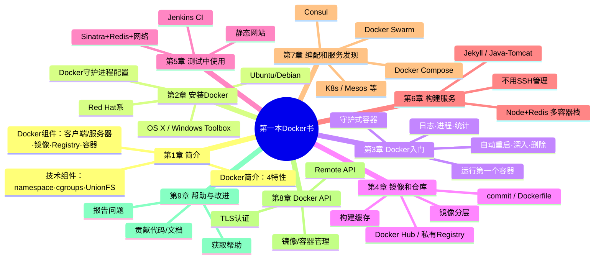
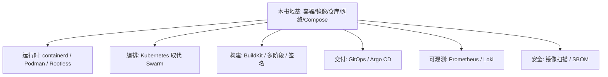

# 第一本 Docker 书（修订版）· 深度阅读指南

> 本文严格基于《第一本 Docker 书（修订版）》（James Turnbull 著，李兆海 / 刘斌 / 巨震 译，人民邮电出版社，2016-04，ISBN 978-7-115-41933-0，264 页）的**真实文本结构**进行解读、分析与延伸，**不整章转载原文**；命令行与配置均作为功能性说明片段引用。
> 因本书以 **Docker 1.9 时代**为蓝本（2016 年出版），文中凡涉及 2016 年之后才出现、书中未覆盖的能力，一律以 **「书后演进」** 明确标注，请读者知悉时效边界。

---

## 一、整体理解与逻辑结构

### 【全局摘要】

**书中/出版社的官方表述（引用）：**

人民邮电出版社对本书的内容简介写道：

> "Docker 是一个开源的应用容器引擎，开发者可以利用 Docker 打包自己的应用以及依赖包到一个可移植的容器中，然后发布到任何流行的 Linux 机器上，也可以实现虚拟化。"

书中第 1 章"Docker 简介"进一步把 Docker 的价值归纳为四个特性（1.1.1–1.1.4）：

- **提供一个简单、轻量的建模方式**（一个容器即一个完整运行环境，Dockerfile 即代码）；
- **职责的逻辑分离**（开发只关心"容器内有什么"，运维只关心"容器外怎么调度"）；
- **快速、高效的开发生命周期**（从构建、测试到部署一致、可重复）；
- **鼓励使用面向服务的架构**（SOA，每个服务一个容器）。

书中对"容器 vs 虚拟机"的原文摘录（第 1 页）非常经典，值得引用：

> "和传统的虚拟化以及半虚拟化（paravirtualization）技术相比，容器运行不需要模拟层（emulation layer）和管理层（hypervisor layer），而是使用操作系统的系统调用接口。这降低了运行单个容器需要的开销，使得宿主机中可以运行更多的窗口。"

以及关于可移植性的边界：

> "由于'客居'于操作系统，容器只能运行于与底层宿主机相同或相似的操作系统……"

英文原版副标题则点出核心定位：**"Containerization is the new virtualization"**（容器化是新的虚拟化）。

**通俗易懂的解释：**

如果把传统虚拟机比作"在一台电脑里装好几台完整电脑"（每台都有独立内核 + 完整操作系统 + 虚拟硬件），那 Docker 容器就是"在同一栋楼里隔出很多独立单间"——大家共用同一套地基（宿主机内核与硬件），但每家的水电、家具、门锁互不干扰。

这样做的好处用大白话讲就是三件事：

1. **跑得多**：省掉"每台虚拟机都带一套操作系统"的浪费，一台机器能塞下更多应用。
2. **搬得动**：把应用和它依赖的环境一起打包成一个镜像，"在我电脑上能跑"= "在你服务器上也能跑"。
3. **拆得开**：天然适合微服务——一个容器干一件事，扩容、回滚、替换都只动那一个。

本书解决的根本问题，正是**"开发、测试、生产三套环境不一致"**与**"应用交付慢、交付重"**这两个老痛点：它让"运行环境"变成可以版本化、可复制、可一键拉起的对象。

### 【逻辑框架图】

下面用两种视角呈现全书骨架：**思维导图**（部分—章节）与**一条容器的生命周期流程图**。

#### 思维导图（Mermaid mindmap）



#### 一条容器从"出生"到"退役"的旅程（生命周期视角）


### 【与其他主流/以往技术的对比】

下面把 Docker 容器与四类"同类或竞争"方案做维度比较。

| 维度            | Docker 容器                          | 传统虚拟机（KVM / VMware）       | LXC / LXD                        | Podman（无守护进程容器） | Vagrant（开发环境 VM）              |
| --------------- | ------------------------------------ | -------------------------------- | -------------------------------- | ------------------------ | ----------------------------------- |
| **隔离级别**    | 进程级，共享宿主机内核               | 硬件级，独立 Guest 内核          | 进程级，共享内核（更"重"的容器） | 进程级，共享内核         | 本质是 VM（依赖 VirtualBox/VMware） |
| **启动速度**    | 秒级（直接起进程）                   | 分钟级（要 boot 内核）           | 秒级                             | 秒级                     | 分钟级                              |
| **资源开销**    | 极低（仅应用 + 少量元数据）          | 高（每 VM 一份 OS + Hypervisor） | 低                               | 极低                     | 高                                  |
| **部署密度**    | 单机可跑数十~数百                    | 单机数台~数十台                  | 数十                             | 数十~数百                | 数台                                |
| **可移植性**    | 强（镜像跨主机/云）                  | 中（镜像大、依赖 Hypervisor）    | 弱（与宿主机耦合深）             | 强（OCI 镜像兼容）       | 弱（环境即 VM 模板）                |
| **生态/工具链** | 极丰富（Compose/Swarm/K8s/Registry） | 成熟（Libvirt/云平台）           | 较窄                             | 兼容 Docker CLI 生态     | 仅开发侧                            |
| **运维心智**    | "一切即容器"                         | "一切即虚拟机"                   | 偏系统管理员视角                 | "无 root 守护进程"更安全 | 偏本地开发                          |
| **典型场景**    | 微服务、CI/CD、云原生交付            | 多租户隔离、异构 OS、强安全      | 系统级容器/Linux 应用隔离        | 安全敏感、Rootless、CI   | 本地统一开发环境                    |

**一段话总结**：Docker 的取舍逻辑非常清晰——它用"共享内核、进程级隔离"换来了虚拟机给不了的**启动速度、资源密度与交付轻便性**，从而成为云原生时代应用交付的事实标准；代价是隔离强度弱于虚拟机（不适合跑不可信的多租户异构 OS）。LXC 是容器的"上古雏形"，Docker 在其上叠加了镜像、仓库、工具链与开发者体验；Podman 则是 Docker 的"平替加强版"（无守护进程、原生 Rootless、CLI 几乎兼容），代表了近年安全与架构演进的方向；Vagrant 解决的是另一类问题（本地开发环境一致性），与 Docker 互补而非替代。本书成文于 Docker 一统江湖前夕，其"容器思维"至今仍是理解整个云原生栈的地基。

---

## 二、分章节解读

> 章节子节号严格对照出版社官方目录（修订版，第 7 章为 Compose/Consul/Swarm 编配版）。

| 章节    | 标题内容                     | 核心内容                                                                                                                                                                                            | 关键例证/数据（如有）                                          |
| ------- | ---------------------------- | --------------------------------------------------------------------------------------------------------------------------------------------------------------------------------------------------- | -------------------------------------------------------------- |
| 序      | 我们走在容器化的大道上       | 点明容器化浪潮与本书定位                                                                                                                                                                            | —                                                              |
| 第 1 章 | 简介                         | Docker 四大特性、四大组件（客户端/服务器、镜像、Registry、容器）、技术组件（namespace、cgroups、Union FS）、与配置管理的关系                                                                        | 1.1.1–1.1.4 四大特性；1.5 技术组件                             |
| 第 2 章 | 安装 Docker                  | 先决条件（64 位、内核 3.8+、cgroups/namespace 支持）；Ubuntu/Debian 与 Red Hat 系安装；OS X / Windows 的 Docker Toolbox；守护进程配置（存储驱动、`-H`、`--dns`）；升级                              | 2.2.3 Docker 与 UFW；2.9 守护进程；2.11 图形界面               |
| 第 3 章 | Docker 入门                  | 运行第一个容器；守护式容器（`-d`）；附着（attach）、`exec` 执行命令；日志（`-f -t`）、`top`、`stats`；`inspect`；自动重启（`--restart`）；删除容器                                                  | 3.2 第一个容器；3.7 守护式容器；3.12 自动重启；3.14 深入容器   |
| 第 4 章 | 使用 Docker 镜像和仓库       | 镜像分层模型（bootfs/rootfs、只读层 + 可写层）；`images/pull/search`；`commit` 与 `Dockerfile` 构建；构建缓存机制；Dockerfile 指令集；推送到 Docker Hub；私有 Registry（`registry:2`）              | 4.5.10 Dockerfile 指令；4.5.6 构建缓存；4.8 私有 Registry      |
| 第 5 章 | 在测试中使用 Docker          | 静态网站 + Nginx 测试；Sinatra + Redis 的 Web 应用与容器互联（`--link`、端口映射、`docker network`）；Docker 用于持续集成（Jenkins 多配置作业）；Drone/Shippable 备选                               | 5.2.5 Docker 内部连网；5.2.6 Docker Networking；5.3 Jenkins CI |
| 第 6 章 | 使用 Docker 构建服务         | Jekyll + Apache 示例站；Java/Tomcat WAR 服务；Node.js + Redis 多容器应用栈（含日志捕获）；"不使用 SSH 管理容器"理念                                                                                 | 6.1 Jekyll；6.2 Java/Tomcat；6.3 Node+Redis 栈；6.4 不用 SSH   |
| 第 7 章 | Docker 编配和服务发现        | Docker Compose（`docker-compose.yml` / 运行 / 使用）；Consul 镜像、集群、自启动、分布式服务；Docker Swarm（安装、集群、过滤器、策略）；其他编配（Fleet+etcd、Kubernetes、Mesos、Helios、Centurion） | 7.1 Compose；7.2 Consul；7.3 Swarm 过滤器/策略                 |
| 第 8 章 | 使用 Docker API              | Docker 三类 API（Daemon/Remote/Web）；Remote API 测试（curl）；用 API 管理镜像/容器；改进 TProv 应用；Remote API 的 TLS 认证（自建 CA、服务端/客户端证书）                                          | 8.3 测试 Remote API；8.5 TLS 认证五步                          |
| 第 9 章 | 获得帮助和对 Docker 进行改进 | 获取帮助（邮件列表 / IRC / GitHub）；报告问题；搭建构建环境、检出源码、贡献文档/PR、维护者机制                                                                                                      | 9.3 构建环境；9.3.8 发起 PR                                    |

---

## 四、以生命周期顺序按照技术点归纳整理分析

> 以下 12 个技术点，按"一条容器从安装到退役"的自然生命周期排序，每个点均按九段式展开：**背景与解决的问题 → 作用与场景 → 使用方法（含代码） → 术语扩展 → 与旧版本变化（新旧对比） → 与主流技术对比优势 → 实际应用（含注释） → 局限性与解决方案 → 通俗概括**。

---

### 技术点 1 · 安装 Docker 与守护进程

**① 背景与解决的问题**
在容器能被使用之前，必须先有一套"容器运行时"。早期 Docker 强依赖 Linux 内核特性（namespace、cgroups）与特定的存储驱动（AUFS/Overlay），安装过程因发行版而异，且守护进程（daemon）配置不当会导致权限、网络、存储等一系列问题。第 2 章要解决的就是"把 Docker 正确装上并跑起来"。

**② 作用与应用场景**

- 作用：提供 `docker` 命令行 + 常驻的 `dockerd` 守护进程，作为所有容器操作的"总调度"。
- 场景：本地开发机、CI 构建节点、生产服务器上基础环境的落地。

**③ 使用方法（书中代码示例）**

```bash
# Ubuntu/Debian 系（书中 2.2.2）
sudo apt-get update
sudo apt-get install -y docker-engine      # 旧包名，见下方"版本变化"
sudo docker info                           # 验证守护进程与系统信息

# Red Hat 系（书中 2.3）
sudo yum install -y docker
sudo systemctl start docker                # 启动守护进程
sudo systemctl enable docker               # 开机自启

# 一键安装脚本（书中 2.7，现代仍有类似用途）
curl -sSL https://get.docker.com/ | sudo sh
```

**④ 专业术语解释**

- **daemon（守护进程）**：后台常驻服务 `dockerd`，真正干"建容器、管镜像"活的进程；CLI 只是它的"遥控器"。
- **cgroups（Control Groups，控制组）**：Linux 内核特性，限制/统计一组进程能用的 CPU、内存、IO——容器的"资源配额"靠它。
- **namespace（命名空间）**：内核隔离机制，让容器以为自己独占 PID、网络、挂载点等——容器的"视界隔离"靠它。
- **AUFS / Overlay（联合文件系统，Union FS）**：把多层只读镜像 + 一层可写层"叠"成一个统一视图，是镜像分层的基础。

**⑤ 与以往版本变化（新旧对比）**

| 项          | 书中（2016，Docker 1.9 时代）                          | 现在（Docker 引擎 v2x）                          |
| ----------- | ------------------------------------------------------ | ------------------------------------------------ |
| 安装包名    | `docker-engine`                                        | `docker-ce`（社区版）/ `docker-ee`               |
| Mac/Windows | **Docker Toolbox**（含 VirtualBox + `docker-machine`） | **Docker Desktop**（原生，基于 HyperKit / WSL2） |
| 启动方式    | `service docker start` 或 `docker daemon`              | `systemctl start docker`（Linux），Desktop 自管  |
| 开发机      | 须装 VirtualBox + boot2docker VM                       | 直接装 Desktop，无需单独 VM                      |

**⑥ 与主流技术对比优势**
相对"手工编译安装"或"各发行版五花八门的包"，`get.docker.com` 脚本与官方仓库提供了一致、可重复的安装路径；相对 Kubernetes 等编排层，先装好单机 Docker 是一切的上游依赖——它是"先有单机容器，才有集群编排"。

**⑦ 实际应用（注释版）**

```bash
# 生产环境常给守护进程加配置：限制默认日志大小、指定存储驱动
# /etc/docker/daemon.json
{
  "storage-driver": "overlay2",      # 现代默认，比旧 AUFS 更稳
  "log-driver": "json-file",
  "log-opts": { "max-size": "10m", "max-file": "3" }
}
sudo systemctl restart docker
```

**⑧ 局限性与解决方案**

- **局限**：守护进程是"单点"，且默认以 root 权限运行，存在被提权风险。
- **方案（书后演进）**：**Rootless 模式**（以普通用户运行 Docker）、**cgroups v2** 支持、以及用 **Podman** 直接替代（无守护进程）。

**⑨ 通俗概括**
装 Docker，就是请来一位"集装箱调度长"（dockerd），再发给他一把遥控器（docker 命令）。本书时代的"Toolbox + VirtualBox"相当于给 Windows/Mac 先造一台迷你 Linux 虚拟机来养这位调度长；如今这一步已被 Docker Desktop 和 WSL2 收编得更顺滑。

---

### 技术点 2 · 容器基础操作（run / 生命周期管理）

**① 背景与解决的问题**
镜像只是"蓝图"，真正干活的是**容器实例**。第 3 章要教会读者：如何从镜像启动容器、让它在后台跑、进进出出、看日志、查状态、设自动重启、最后干净删除——即容器的完整生命周期。

**② 作用与应用场景**

- 作用：创建、运行、监控、停止、清理容器。
- 场景：跑一次性任务、跑常驻服务、进容器排错、批量清理测试容器。

**③ 使用方法（书中代码示例）**

```bash
# 交互式跑一个 Ubuntu 容器（3.2）
docker run --name bob_the_container -i -t ubuntu /bin/bash

# 后台守护式容器（3.7）：持续打印 hello world
docker run --name daemon_dave -d ubuntu /bin/sh -c "while true; do echo hello; sleep 1; done"

# 看日志 / 看进程 / 看资源（3.9-3.11）
docker logs -ft daemon_dave        # -f 跟随, -t 时间戳
docker top  daemon_dave
docker stats daemon_dave

# 进容器里执行命令（3.12），常用于排错
docker exec -t -i daemon_dave /bin/bash

# 自动重启（3.14）：容器挂了自动拉起
docker run --restart=always --name daemon_dave -d ubuntu /bin/sh -c "..."

# 停止并删除（3.16）
docker stop  daemon_dave
docker rm    daemon_dave
docker rm $(docker ps -a -q)       # 一键清理所有已退出容器
```

**④ 专业术语解释**

- **`-i -t`（interactive + tty）**：分配一个可交互的伪终端，等价于"开个能打字的控制台"。
- **`-d`（detached，守护式）**：让容器在后台跑，不占用当前终端。
- **`exec` vs `attach`**：`attach` 是"贴"到容器主进程上（退出可能杀掉容器），`exec` 是"另开一个进程"进去，更安全、可逆。
- **`--restart` 策略**：`no` / `on-failure` / `always` / `unless-stopped`。

**⑤ 与以往版本变化（新旧对比）**

| 操作     | 书中写法         | 现代推荐写法                                     |
| -------- | ---------------- | ------------------------------------------------ |
| 运行容器 | `docker run ...` | `docker container run ...`（子命令分组，v1.13+） |
| 列容器   | `docker ps`      | `docker container ls`                            |
| 删容器   | `docker rm`      | `docker container rm`                            |
| 日志     | `docker logs`    | `docker container logs`                          |

> 说明：旧写法仍 100% 可用（向后兼容），子命令分组只是更清晰。

**⑥ 与主流技术对比优势**
相比"给每个应用开一台 VM 再 SSH 进去启服务"，容器启动是**毫秒~秒级**、且无需 boot 整个 OS——这正是 Docker 在 CI、弹性扩容里碾压虚拟机的根本原因。

**⑦ 实际应用（注释版）**

```bash
# 排错三板斧：看配置 → 看日志 → 进去看
docker inspect --format='{{ .NetworkSettings.IPAddress }}' daemon_dave  # 取 IP（书中 3.15）
docker logs --tail 50 -t daemon_dave                                    # 看最近 50 行
docker exec -it daemon_dave sh                                         # 进去查进程/文件
```

**⑧ 局限性与解决方案**

- **局限**：`docker rm` 不会自动删**数据卷**（有意为之，防误删数据）；`--link` 已废弃。
- **方案**：显式 `docker volume rm` 清理；容器互联改用自定义网络（见技术点 6）。

**⑨ 通俗概括**
容器就像一个"一次性的小房间"：`run` 是开门入住，`exec` 是进去看看，`logs` 是翻它的运行日记，`rm` 是退租。本书把这套"入住—查看—退租"的全流程讲得很细，是后面所有实战的地基。

---

### 技术点 3 · 镜像与 Dockerfile 构建

**① 背景与解决的问题**
"在我机器上能跑"的世界性难题，根源是**运行环境没被打包**。第 4 章给出答案：把环境写成一份**可版本化的菜谱（Dockerfile）**，一键烤出**镜像**，然后镜像到哪都能秒级还原成一致的容器。

**② 作用与应用场景**

- 作用：用分层、只读、可复用的方式固化"应用 + 依赖 + 运行环境"。
- 场景：交付物标准化、CI 中构建可复现镜像、微服务各自独立打包。

**③ 使用方法（书中代码示例）**

```dockerfile
# 一个典型的静态网站镜像（来自第4章 static_web 示例，转述精简）
FROM ubuntu:14.04                       # 基础层：从官方 Ubuntu 起
MAINTAINER James Turnbull <james@example.com>   # 旧写法，现代用 LABEL
ENV REFRESHED_AT 2014-06-01            # 环境变量（构建期求值）
RUN apt-get -yqq update && apt-get -yqq install nginx   # 构建期执行
EXPOSE 80                              # 声明"容器监听80"（仅文档/约定，不自动映射）
CMD ["nginx", "-g", "daemon off;"]     # 容器启动默认命令
```

```bash
docker build -t jamtur01/static_web .   # 用当前目录 Dockerfile 构建
docker history 22d47c                  # 看分层构成
docker run -d -p 8080:80 --name web jamtur01/static_web   # 跑起来并映射端口
```

**④ 专业术语解释**

- **镜像分层（layered image）**：镜像由多层只读文件系统叠加而成，上层只记录与下层的差异；`FROM` 是地基，每条 `RUN` 加一层。
- **构建缓存（build cache）**：若某层及其之前都未变，Docker 直接复用缓存层，大幅加速重建——这就是 4.5.6 节的精髓。
- **`ENTRYPOINT` vs `CMD`**：`ENTRYPOINT` 是"固定入口"（如 `/bin/sh`），`CMD` 是它的默认参数；二者配合可实现"镜像即命令"。
- **`ADD` vs `COPY`**：`COPY` 只拷贝本地文件；`ADD` 还能解压 tar、拉 URL——现代实践**优先 `COPY`**，行为更可预期。

**⑤ 与以往版本变化（新旧对比）**

| 项       | 书中（2016）      | 现代（书后演进）                                                                         |
| -------- | ----------------- | ---------------------------------------------------------------------------------------- |
| 作者信息 | `MAINTAINER` 指令 | 改用 `LABEL maintainer=...`（MAINTAINER 已废弃）                                         |
| 构建引擎 | 传统 builder      | **BuildKit**（`docker buildx build`，更快、并发、可缓存）                                |
| 多阶段   | 无                | **多阶段构建（multi-stage）**：一个 Dockerfile 内用多个 `FROM`，只把产物拷进极小最终镜像 |
| 镜像精简 | 手动              | `FROM alpine` / `scratch` 最小化基础镜像                                                 |

**⑥ 与主流技术对比优势**
对比"手工 `scp` 脚本部署"或"整盘打 VM 镜像"：Dockerfile 让环境**可 diff、可回滚、可 CI 自动构建**，且镜像比 VM 镜像小一到两个数量级。

**⑦ 实际应用（多阶段构建，注释版）**

```dockerfile
# 多阶段：第一阶段编译，第二阶段只带二进制
FROM golang:1.22 AS build
WORKDIR /src
COPY . .
RUN go build -o app .

FROM gcr.io/distroless/base-debian12   # 极简运行时镜像（书后演进）
COPY --from=build /src/app /app
ENTRYPOINT ["/app"]
```

> 这种写法本书出版时尚不存在，是 2017 年后普及的"书后演进"，但完全建立在本书 Dockerfile 指令体系之上。

**⑧ 局限性与解决方案**

- **局限**：`docker commit` 把"当前容器状态"直接存成镜像，等于"黑盒快照"，别人看不出你装了啥。
- **方案（书中 4.5 明确倾向）**：**永远用 Dockerfile 而非 `commit`**——可审计、可复现、可进版本库。

**⑨ 通俗概括**
Dockerfile 就是"做菜菜谱"：基础镜像 `FROM` 是食材，`RUN` 是每一步烹饪，`CMD` 是"出锅后默认怎么吃"。因为每层都留底（构建缓存），改一行代码不用重炒整锅——这就是它比"整台虚拟机克隆"聪明的地方。

---

### 技术点 4 · 仓库与 Registry（分发镜像）

**① 背景与解决的问题**
镜像做出来了，怎么发给别人、发给生产环境？第 4.6–4.9 节给出"镜像的快递网络"：公共仓库 Docker Hub 与自建私有 Registry。

**② 作用与应用场景**

- 作用：集中存储、版本化（tag）、分发镜像。
- 场景：团队共享基础镜像、CI 推送产物镜像、生产节点拉取部署。

**③ 使用方法（书中代码示例）**

```bash
docker login                                  # 登录 Docker Hub（4.6）
docker tag 22d47c jamtur01/static_web:webserver   # 打标签（命名空间/版本）
docker push jamtur01/static_web               # 推送

# 自建私有 Registry（4.8）
docker run -p 5000:5000 registry:2            # 跑一个 registry 容器
docker tag 22d47c localhost:5000/jamtur01/static_web
docker push localhost:5000/jamtur01/static_web
```

**④ 专业术语解释**

- **Registry（仓库服务）**：存镜像的服务；**Repository（仓库）** 是某一镜像的所有版本集合；**Tag（标签）** 是版本号（`latest` 是默认但易误解的标签）。
- **`registry:2`**：Docker 官方的第二代 Registry 实现（HTTP API v2）。

**⑤ 与以往版本变化（新旧对比）**

| 项       | 书中（2016）        | 现代（书后演进）                           |
| -------- | ------------------- | ------------------------------------------ |
| 私有仓库 | `registry:2` 手工起 | 企业级 **Harbor**（带权限/审计/漏洞扫描）  |
| 云仓库   | 主要是 Docker Hub   | 各云厂商 **ECR / GCR / ACR**               |
| 安全     | 基础 `docker login` | **镜像签名（Notary / Cosign）** + 内容信任 |

**⑥ 与主流技术对比优势**
相比"用对象存储传 tar 包"，Registry 支持**增量层传输、版本 tag、访问控制**，是容器交付链的标准枢纽。

**⑦ 实际应用（注释版）**

```bash
# 生产常见：从私有仓库拉取指定版本部署
docker pull registry.internal:5000/order-svc:1.8.3
docker run -d -p 8080:8080 --name order registry.internal:5000/order-svc:1.8.3
```

**⑧ 局限性与解决方案**

- **局限**：`latest` 标签语义模糊，易部署到错误版本；公共 Hub 有拉取频率限制。
- **方案**：**显式打语义化版本 tag**；企业内部署 Harbor 并启用配额与扫描。

**⑨ 通俗概括**
Registry 是镜像的"快递柜 + 版本库"。Docker Hub 是公共快递柜，自己起的 `registry:2` 是公司内部的私密柜。寄之前先贴好标签（`tag`），别老用 `latest` 这种"无名包裹"。

---

### 技术点 5 · 存储卷 Volume（数据持久化）

**① 背景与解决的问题**
容器本身是"易碎品"——`rm` 掉容器，里面写的文件全没了。但数据库、用户上传这些**有状态数据必须活过容器生命周期**。第 5/6 章用 Volume 解决"容器死，数据活"。

**② 作用与应用场景**

- 作用：把宿主机目录或独立卷"挂"进容器，数据独立于容器存在。
- 场景：数据库数据目录、配置文件、日志、需要跨容器共享的文件。

**③ 使用方法（书中代码示例）**

```bash
# 绑定挂载：把宿主当前目录挂进容器（5.1，网站示例）
docker run -d -p 80 --name website \
  -v $PWD/website:/var/www/html:ro \
  jamtur01/nginx

# Dockerfile 中声明卷（6.1 Jekyll 示例的精髓）
VOLUME /var/www/html
```

```bash
# 备份一个卷（书中 6.1.7 "备份Jekyll卷"思路）
docker run --rm --volumes-from jekyll_site -v $(pwd):/backup ubuntu \
  tar czvf /backup/site.tar.gz /var/www/html
```

**④ 专业术语解释**

- **Volume（卷）**：Docker 管理的、独立于容器文件系统的持久化存储单位。
- **bind mount（绑定挂载）**：直接把宿主某个目录挂进容器（如上面 `-v $PWD/website:...`）。
- **`:ro`**：只读挂载，防止容器误改宿主文件。

**⑤ 与以往版本变化（新旧对比）**

| 项       | 书中（2016）               | 现代（书后演进）                                      |
| -------- | -------------------------- | ----------------------------------------------------- |
| 卷类型   | 主要 bind mount + `VOLUME` | 显式**命名卷（named volume）** `docker volume create` |
| 临时数据 | 无专门机制                 | **`tmpfs` 挂载**（仅存内存，不落盘）                  |
| 驱动     | 本地                       | 可插拔卷驱动（NFS、云盘）                             |

**⑥ 与主流技术对比优势**
对比"把数据写进容器可写层"：卷让数据**与容器解耦**，容器重建/升级数据不丢，且可被多个容器同时挂载共享。

**⑦ 实际应用（注释版）**

```bash
docker volume create pgdata                       # 建命名卷
docker run -d --name pg \
  -e POSTGRES_PASSWORD=secret \
  -v pgdata:/var/lib/postgresql/data \
  postgres:16
# 即使 rm 掉 pg 容器，pgdata 卷里的数据仍在；重跑容器挂载同一卷即可恢复
```

**⑧ 局限性与解决方案**

- **局限**：跨主机共享卷需要额外存储方案（本地卷不跨机）。
- **方案（书后演进）**：云原生下用 **PV/PVC（Kubernetes 持久卷）** 或分布式存储（Ceph/NFS）承接。

**⑨ 通俗概括**
容器像租来的临时工棚，推倒就没了；Volume 是在工棚旁另租的"保险柜"，工人换了一批，柜子里的东西还在。记住：**有状态数据，永远进卷，别进容器身体**。

---

### 技术点 6 · 网络与容器互联

**① 背景与解决的问题**
多容器协作必须"能说话"：Web 要连 Redis，前端要暴露端口给用户。第 5.2 节系统讲透端口映射、容器连接与 Docker 网络。

**② 作用与应用场景**

- 作用：让容器访问外网、被外部访问、彼此通信，且互相隔离。
- 场景：Web→DB 内部通信、对外发布服务、微服务间调用。

**③ 使用方法（书中代码示例）**

```bash
# 端口映射：-p 宿主端口:容器端口（5.2，Sinatra 示例）
docker run -p 4567 --name webapp jamtur01/sinatra

# 旧式容器连接（5.2.7，已废弃，仅作历史对照）
docker run -d --name redis jamtur01/redis
docker run -p 4567 --name webapp --link redis:mydb jamtur01/sinatra

# 现代推荐：用户自定义网络（5.2.6 Docker Networking 思路的演进）
docker network create app
docker run -d --net=app --name db  jamtur01/redis
docker run -p 4567 --net=app --name webapp jamtur01/sinatra
# 此时 webapp 可直接用主机名 db 访问 redis，无需 --link
```

**④ 专业术语解释**

- **bridge（桥接网络）**：默认网络，容器连到一个虚拟交换机上，彼此通过 IP/主机名互通。
- **`-p` / `-P`**：`-p` 指定确切映射，`-P` 把容器 `EXPOSE` 的端口随机映射到宿主高位端口。
- **`--link`**：早期"把 A 的地址/环境变量注入 B"的连法，**已废弃**（不安全、仅同主机）。
- **overlay 网络**：跨多主机的容器网络，是 Swarm/K8s 多机通信的基础（书后演进）。

**⑤ 与以往版本变化（新旧对比）**

| 项       | 书中（2016）      | 现代（书后演进）                                     |
| -------- | ----------------- | ---------------------------------------------------- |
| 容器互联 | `--link`（5.2.7） | **用户自定义网络 + 服务发现**（官方已弃用 `--link`） |
| 多机网络 | 基本未涉及        | **overlay 网络** + CNI 标准                          |
| 网络驱动 | bridge 为主       | bridge / host / null / macvlan 多驱动                |

**⑥ 与主流技术对比优势**
相比"把所有进程塞一个容器里"或"用 `--link` 硬编码依赖"：自定义网络实现了**解耦、可发现、可跨主机**，是微服务架构的底座。

**⑦ 实际应用（注释版）**

```bash
docker network create --driver bridge app-net
docker run -d --net=app-net --name redis redis:7
docker run -d --net=app-net -p 8080:8080 --name api my-api:1.0
# api 容器内 `redis:6379` 即可连通，无需知道其 IP
```

**⑧ 局限性与解决方案**

- **局限**：默认 bridge 网络中容器不能用"服务名"互访（得用自定义网络）；`--link` 跨主机无效。
- **方案**：一律使用**用户自定义网络**；跨集群用 overlay/CNI。

**⑨ 通俗概括**
Docker 网络像给容器们装了"内线电话 + 对外门牌"。早期用 `--link` 等于把邻居电话 hardcoded 进你家墙里（僵化），现在改成"大家先加入同一个电话本（自定义网络）"，谁搬家都不影响呼叫。

---

### 技术点 7 · 在测试与 CI 中使用 Docker

**① 背景与解决的问题**
测试环境"脏、慢、不一致"是交付瓶颈。第 5 章展示用 Docker 拉起**一次性、干净、一致**的测试环境，并把 Docker 接进 Jenkins 持续集成。

**② 作用与应用场景**

- 作用：用容器封装测试依赖（DB、中间件），让每次测试从同一干净状态开始。
- 场景：单元测试依赖 Redis/MySQL、端到端测试、CI 流水线构建与跑测。

**③ 使用方法（书中代码示例）**

```bash
# 测试静态网站：挂本地目录，改代码即时生效（5.1）
docker run -d -p 80 -v $PWD/website:/var/www/html:ro jamtur01/nginx

# Jenkins 多配置作业（5.4）：用 Docker 作为"构建从节点/测试环境"
# 思路：Jenkins 作业里调用 docker run 拉起被测服务 + 跑测试，结束即销毁
```

**④ 专业术语解释**

- **CI（Continuous Integration，持续集成）**：频繁把代码合并到主干并自动构建/测试。
- **Jenkins 多配置作业（matrix job）**：对同一套测试在多个环境（如多个语言版本）并行跑。
- **一次性环境（ephemeral environment）**：用完即焚的容器，保证测试无残留状态。

**⑤ 与以往版本变化（新旧对比）**

| 项       | 书中（2016，Jenkins 为主） | 现代（书后演进）                                        |
| -------- | -------------------------- | ------------------------------------------------------- |
| CI 工具  | Jenkins（多配置作业）      | **GitHub Actions / GitLab CI / Drone**（原生容器化 CI） |
| 测试环境 | 手工 `docker run`          | CI 中 **`services:` 直接声明依赖容器**                  |
| 缓存     | 基础镜像复用               | 层缓存 + 制品缓存                                       |

**⑥ 与主流技术对比优势**
相比"在固定共享服务器上跑测试"（易被上次运行的脏数据污染）：容器测试环境**每次都是全新、可复现**的，且用完即焚，CI 稳定性大幅提升。

**⑦ 实际应用（注释版，GitHub Actions 风格书后演进）**

```yaml
# .github/workflows/test.yml —— 用容器提供测试依赖（书中 5.3 思想的现代版）
jobs:
  test:
    runs-on: ubuntu-latest
    services: # 相当于"用 docker run 起一个 redis"
      redis:
        image: redis:7
        ports: ["6379:6379"]
    steps:
      - uses: actions/checkout@v4
      - run: npm test # 测试直接连 redis:6379
```

**⑧ 局限性与解决方案**

- **局限**：容器内跑测试需处理好"被测代码如何进容器"（挂载 vs 构建进镜像）。
- **方案**：CI 中优先**把代码构建进镜像**（可复现），而非 `bind mount` 宿主目录。

**⑨ 通俗概括**
用 Docker 做测试，等于给每次测试发一个"全新的一次性实验室"：仪器（DB/中间件）现拉现用，做完实验连房带仪器一起拆掉，下次再来还是一尘不染。这正是 CI 又快又稳的秘诀。

---

### 技术点 8 · 构建多服务应用栈（Compose 之前的组合实践）

**① 背景与解决的问题**
真实应用从来不是"一个容器"。第 6 章用 Jekyll 站、Java/Tomcat 服务、Node+Redis 栈，演示如何把**多个各司其职的容器**拼成一个完整应用。

**② 作用与应用场景**

- 作用：把"前端 + 后端 + 缓存"等容器按职责拆分又协同工作。
- 场景：本地起一套完整微服务、演示多容器协作、日志统一捕获。

**③ 使用方法（书中代码示例）**

```bash
# 6.3 Node.js + Redis 多容器栈思路
docker run -d --name redis redis:latest
docker run -d --name nodeapp \
  -p 4567:4567 \
  --link redis:redis \            # 旧式连接，见技术点6演进
  -v $PWD/webapp:/opt/webapp \
  jamtur01/nodeapp
# Node 应用通过主机名 redis 访问缓存
```

**④ 专业术语解释**

- **一个容器一个进程（one process per container）**：本书反复强调的哲学——容器不是小虚拟机，而是单一职责的单位。
- **应用栈（application stack）**：由多个协作容器组成的一个完整应用。
- **不使用 SSH 管理容器（6.4）**：容器应靠 `logs`/`exec`/`inspect` 管理，而非塞个 SSH 守护进程进去。

**⑤ 与以往版本变化（新旧对比）**

| 项         | 书中（2016）                 | 现代（书后演进）                                  |
| ---------- | ---------------------------- | ------------------------------------------------- |
| 多容器编排 | 手工 `docker run` + `--link` | **Docker Compose 一个文件声明全部**（见技术点 9） |
| 服务发现   | `--link` 硬编码              | 自定义网络 + DNS                                  |
| 进程管理   | 容器内跑 supervisord 偶见    | **坚决单进程**，编排层管生命周期                  |

**⑥ 与主流技术对比优势**
相比"把所有东西塞进一个巨型容器"：多容器拆分带来**独立伸缩、独立部署、故障隔离**，是微服务与 12-Factor 应用的基础。

**⑦ 实际应用（注释版）**

```bash
# 不用 SSH：进容器查日志/进程的正确姿势
docker logs -f nodeapp
docker exec -it nodeapp sh
# 而非：docker run ... sshd → 连进去（反模式，违反 6.4）
```

**⑧ 局限性与解决方案**

- **局限**：手工 `docker run` 多容器，参数一长就易错、难复现。
- **方案**：用 **Docker Compose**（下一技术点）把整栈写成一份声明式文件。

**⑨ 通俗概括**
一个容器干一件事，像餐厅里"切菜归切菜、炒菜归炒菜"。本书第 6 章教你怎么把这些"厨师容器"组织成一桌菜，并反复提醒：**别给容器偷偷装 SSH 后门**，用标准接口管理它才是正道。

---

### 技术点 9 · Docker Compose 编配（多容器一键编排）

**① 背景与解决的问题**
技术点 8 里手工敲一串 `docker run` 太琐碎。第 7.1 节的 **Docker Compose** 把"多容器应用"写成一份声明式 YAML，一条命令拉起/停止整栈。

**② 作用与应用场景**

- 作用：用 `docker-compose.yml` 定义服务、网络、卷、依赖，统一生命周期管理。
- 场景：本地开发全套环境、单主机多服务部署、演示原型。

**③ 使用方法（书中代码示例）**

```yaml
# docker-compose.yml（第7章示例精简，转述）
version: "2" # 旧版声明；现代用 "3" 或省略
services:
  db:
    image: redis
  web:
    build: ./web # 用目录内 Dockerfile 构建
    ports:
      - "4567:4567"
    links:
      - db # 旧式，现代用 networks
    volumes:
      - ./web:/opt/webapp
```

```bash
docker-compose build            # 构建
docker-compose up -d            # 一键拉起整栈
docker-compose ps               # 看状态
docker-compose down             # 一键关停
```

**④ 专业术语解释**

- **Compose Spec（编排规范）**：描述"有哪些服务、怎么连、挂什么卷"的 YAML 标准。
- **`services`**：组成应用的各个容器角色。
- **`depends_on`**：声明启动顺序依赖（现代还支持 `condition: service_healthy` 等健康门槛）。

**⑤ 与以往版本变化（新旧对比）**

| 项       | 书中（2016）                                 | 现代（书后演进）                                            |
| -------- | -------------------------------------------- | ----------------------------------------------------------- |
| 前身     | **Fig**（早期项目名，7.1 在某些印次称"Fig"） | 被 Docker 收购后改名 **Compose**                            |
| CLI      | `docker-compose`（Python，Compose v1）       | **`docker compose`**（Go 插件，Compose v2，集成进引擎）     |
| 版本字段 | `version: "2"`                               | 现代多用 `version: "3"` 或省略（Compose Spec 已不再强依赖） |
| 进阶     | 基础字段                                     | `profiles`、`depends_on.condition`、`healthcheck`、变量插值 |

**⑥ 与主流技术对比优势**
对比手写 `docker run`：Compose 让多容器应用**可提交、可复现、一键启停**，是单主机编排的事实标准；对比 K8s 它更轻，适合开发/单机。

**⑦ 实际应用（注释版，现代写法）**

```yaml
services:
  web:
    build: .
    ports: ["8080:8080"]
    depends_on:
      db:
        condition: service_healthy # 等 DB 健康再起
  db:
    image: postgres:16
    environment:
      POSTGRES_PASSWORD: secret
    healthcheck:
      test: ["CMD-SHELL", "pg_isready"]
      interval: 5s
```

**⑧ 局限性与解决方案**

- **局限**：Compose 主要面向**单主机**；跨主机、弹性伸缩、自愈得靠编排器。
- **方案（书后演进）**：生产用 **Kubernetes**，或 Swarm（见技术点 10），Compose 仍用于本地。

**⑨ 通俗概括**
Compose 就是"多容器应用的乐高说明书"：以前要一个个手动拼，现在把拼法写进一张纸（YAML），喊一声 `up` 整座小城堡就立起来。注意它从 `fig` 改名而来，且现代已并入 `docker compose` 命令。

---

### 技术点 10 · 服务发现与 Swarm 集群

**① 背景与解决的问题**
单机上"容器能互访"还不够；当应用要跑在多台机器上、要能扩容、要某个节点挂了自动转移，就需要**集群编排 + 服务发现**。第 7.2–7.3 节给出 Consul（服务发现）与 Docker Swarm（集群）。

**② 作用与应用场景**

- 作用：在多个 Docker 主机上统一调度容器、做服务注册/发现、负载均衡。
- 场景：多节点部署、动态扩容、服务间自动寻址。

**③ 使用方法（书中代码示例）**

```bash
# Consul 服务发现（7.2）：先起一个 consul 容器做"通讯录"
docker run -p 8500:8500 -h node1 consul

# Docker Swarm（7.3，书中为独立 swarm 容器方式，已演进）
docker run --rm swarm create                    # 旧：拿到集群 token
docker run -d swarm join --addr=IP:2375 token://<TOKEN>
docker run -d swarm manage    token://<TOKEN>
docker run -d swarm list       token://<TOKEN>  # 看节点
```

**④ 专业术语解释**

- **服务发现（Service Discovery）**：容器启动时自动把自己"登记"到一个中心（如 Consul），别的容器来查就能拿到它的地址。
- **Swarm**：Docker 的原生集群方案，把多台 Docker 主机当作一个"大主机"来调度。
- **过滤器 / 策略（7.3.4 / 7.3.5）**：决定容器"调度到哪台节点"的规则（如按资源、按标签）与策略（spread/binpack/random）。

**⑤ 与以往版本变化（新旧对比）**

| 项         | 书中（2016，独立 swarm 容器）       | 现代（书后演进）                                                  |
| ---------- | ----------------------------------- | ----------------------------------------------------------------- |
| Swarm 形态 | 单独的 `swarm` 镜像 + `manage/join` | **内置 Swarm Mode**：`docker swarm init` / `join`（Docker 1.12+） |
| 服务模型   | 较原始                              | `docker service create` + 副本数 + 滚动更新                       |
| 编排格局   | Swarm/Compose/Mesos/K8s 并存        | **Kubernetes 成为事实标准**，Swarm 退居边缘/特定场景              |

**⑥ 与主流技术对比优势**

- 相对"纯手工在多台机器 `docker run`"：Swarm/Consul 提供**自动调度、服务注册、故障转移**。
- 但需诚实指出：2016 年后 **Kubernetes 胜出**，Swarm 生态已明显收缩（见扩展章节）。

**⑦ 实际应用（注释版，现代 Swarm Mode）**

```bash
docker swarm init --advertise-addr 192.168.1.10   # 主节点
docker swarm join --token <TOKEN> 192.168.1.11:2377   # 工作节点加入
docker service create --replicas 3 -p 80:80 --name web nginx   # 起3副本
```

> 书中独立 `swarm` 容器方式已废弃，上面的 Swarm Mode 是其"书后演进"形态。

**⑧ 局限性与解决方案**

- **局限**：独立 swarm 容器方式已淘汰；Swarm 整体在云原生主流中份额下降。
- **方案（书后演进）**：生产集群首选 **Kubernetes**（见扩展章节），Swarm 仅在简单/边缘场景保留。

**⑨ 通俗概括**
Consul 是"公司通讯录"——新容器入职先登记，别人找它查号即可；Swarm 是"把一堆工人（机器）编成一个班组"，工头（manager）统一派活、谁请假自动换人。只是这套班组体系后来被 Kubernetes 这个"更庞大的集团公司"抢了风头。

---

### 技术点 11 · Docker Remote API 与认证

**① 背景与解决的问题**
不光人要用 Docker，程序也要驱动 Docker（比如调度系统、自建 PaaS）。第 8 章讲如何通过 **Remote API** 用 HTTP 调用来管理镜像与容器，并为其上 TLS 认证。

**② 作用与应用场景**

- 作用：以编程方式（HTTP/JSON）查询与控制 Docker 守护进程。
- 场景：自研调度平台、CI 系统、运维自动化、把 Docker 当"引擎"嵌入产品。

**③ 使用方法（书中代码示例）**

```bash
# 直接 curl 调 Remote API（8.3）
curl -s http://localhost:2375/containers/json        # 列出容器
curl -s http://localhost:2375/images/json            # 列出镜像

# 改进 TProv 应用（8.4）：用 API 动态创建/销毁容器，做轻量 PaaS
```

```bash
# 开启 TLS 认证（8.5 五步法）
# 1) 自建 CA；2) 服务端证书签名请求；3) 配置 dockerd 启用 TLS；
# 4) 客户端证书；5) 客户端开启认证
docker -H tcp://HOST:2376 --tlsverify \
  --tlscacert=ca.pem --tlscert=cert.pem --tlskey=key.pem \
  ps
```

**④ 专业术语解释**

- **Remote API**：Docker 守护进程暴露的 HTTP/JSON 接口（现称 Docker Engine API）。
- **2375 / 2376**：2375 是**未加密**监听端口（危险），2376 是 **TLS 加密**端口。
- **TLS（Transport Layer Security）**：传输层加密与双向证书认证，防止别人随意遥控你的 Docker。

**⑤ 与以往版本变化（新旧对比）**

| 项       | 书中（2016）                 | 现代（书后演进）                                |
| -------- | ---------------------------- | ----------------------------------------------- |
| API 暴露 | 手动 `-H tcp://0.0.0.0:2375` | 默认只监听 **本地 unix socket**，远程须显式 TLS |
| 安全     | 基础 TLS 五步                | **Rootless + Socket 激活 + 权限收紧**           |
| 调用方式 | 手写 curl                    | 官方 SDK（Go/Python/Node）或 `docker context`   |

**⑥ 与主流技术对比优势**
相比"人工敲命令"：Remote API 让 Docker 成为**可被程序编排的引擎**，是 CI、调度器、PaaS 的基石；相比 SSH 远程执行命令，API 更结构化、更安全、可审计。

**⑦ 实际应用（注释版，Python SDK 现代写法）**

```python
import docker
client = docker.from_env()                 # 连本地 socket
client.containers.run("redis:7", detach=True, name="r")
print(client.containers.list())            # 等价于 docker ps
```

> 用官方 SDK 比手写 curl 更稳，是本书 `curl` 示例的现代化承接。

**⑧ 局限性与解决方案**

- **局限**：把 2375 裸奔暴露到公网 = 把服务器 root 权限送人（历史上大量"挖矿劫持"源于此）。
- **方案**：**绝不暴露 2375 到公网**；远程访问必须走 2376 + TLS + 双向证书；或走 SSH 隧道 / `docker context`。

**⑨ 通俗概括**
Remote API 是 Docker 的"遥控接口"：你可以用程序而不是人手去开关容器。但这是个**高能接口**——开着门不锁（2375 裸奔）等于把家门钥匙插在锁上，所以本书 8.5 的 TLS 认证五步，是任何远程调用前的必做功课。

---

### 技术点 12 · 生态贡献与持续改进（含生产化理念）

**① 背景与解决的问题**
第 9 章表面讲"怎么求助、怎么给 Docker 提 PR"，深层传递的是一种**开源协作与生产化素养**：容器不是装完就完，要持续维护、参与社区、把经验反哺生态。

**② 作用与应用场景**

- 作用：获取帮助、报告缺陷、贡献代码/文档，建立可持续的工程实践。
- 场景：遇到诡异 bug 时定位与上报、团队内部沉淀容器最佳实践、跟进 Docker 演进。

**③ 使用方法（书中代码示例）**

```bash
# 第9章：搭建构建环境、检出源码、跑测试、提 PR 的标准流程
git clone https://github.com/docker/docker.git
cd docker
# ... 改代码 / 改文档 ...
make test                       # 跑测试套件
git push my-fork && 发起 Pull Request
```

**④ 专业术语解释**

- **PR（Pull Request）**：向开源项目提交的"合并请求"，是社区协作的基本单元。
- **Upstream（上游）**：你 fork 的那个原始官方仓库。
- **12-Factor（十二要素）**：云原生应用方法论（本书虽未展开，但"无状态容器 + 配置外置"等理念与之相通）。

**⑤ 与以往版本变化（新旧对比）**

| 项       | 书中（2016）                  | 现代（书后演进）                                               |
| -------- | ----------------------------- | -------------------------------------------------------------- |
| 代码托管 | GitHub 单仓库 `docker/docker` | 拆分为 **Moby** 项目 + 各组件（containerd、runc、cli）独立仓库 |
| 治理     | Docker 公司主导               | 容器运行时 **containerd 捐给 CNCF**，生态更去中心化            |

**⑥ 与主流技术对比优势**
本书"一切即容器、用代码描述环境、持续改进"的理念，与后来的 **GitOps / IaC（基础设施即代码）** 一脉相承——它培养的不是"会用一条命令"，而是"把交付当作可版本化、可协作的工程"。

**⑦ 实际应用（注释版，生产化 checklist）**

```
生产化容器落地清单（基于本书理念 + 书后演进）：
☑ 镜像用 Dockerfile + 多阶段构建，基础镜像最小化
☑ 有状态数据全部进 Volume，绝写容器层
☑ 容器间用自定义网络通信，弃用 --link
☑ 用 Compose/K8s 声明式管理，不在 CLI 手工堆参数
☑ 守护进程启用 TLS/Rootless，不暴露 2375
☑ 接入 CI：每次提交自动构建镜像 + 跑测试
☑ 监控/日志接入（Prometheus/Loki，书后演进）
```

**⑧ 局限性与解决方案**

- **局限**：单凭本书（2016）知识已无法覆盖现代生产全栈（缺 K8s、缺可观测性、缺安全扫描）。
- **方案**：以本书打地基，向上承接扩展章节所列的云原生技术栈。

**⑨ 通俗概括**
第 9 章其实在说：容器化不是"装个软件"，而是一种**持续打磨的工程习惯**——环境写成代码、问题回馈社区、实践不断迭代。把这套心态带上，你才真正"毕业"于本书。

---

## 五、格式与风格自检

- **标题层级**：一/二/四/五/六/七 主节，技术点内用 ①②③…与加粗小标题，层级清晰。
- **可视化**：提供 Mermaid mindmap 与生命周期 flowchart 两种框架图；分章节用表格；对比用表格。
- **纠正性/引用标注**：书中引用均标章节/子节号（如 1.1.1、4.5.6、5.2.7、7.3.4）；对比表中"已废弃/书后演进"明确区分。
- **术语扩展**：daemon、cgroups、namespace、AUFS/Overlay、Volume、bridge、`--link`、Compose、`depends_on`、Consul、Swarm、Remote API、TLS、2375/2376、PR 等均有全称与省略含义解释。
- **通俗化**：每个技术点第 ⑨ 项用比喻收口（集装箱/单间、做菜菜谱、保险柜、内线电话、乐高说明书、通讯录等）。
- **版权边界**：仅转述 + 分析 + 功能性片段，未整章转载；命令行为说明性精简。

---

## 六、技术环境搭建（可逐步执行）

> 本书第 2 章以 Docker 1.9 + Toolbox 为蓝本，现代已有更顺滑的路径。以下给出**三种可逐步复制**的搭建方案，让 today 的读者也能跑通书中示例。

### 方案 A · Docker Desktop（Windows / macOS 推荐，10 分钟）

1. 访问 https://www.docker.com/products/docker-desktop/ 下载对应安装包。
2. Windows 用户确保已开启 **WSL2**（设置 → 系统 → 可选功能 → 勾选"虚拟机平台""WSL"），并 `wsl --install`。
3. 安装后启动 Docker Desktop，状态栏鲸鱼图标变绿即就绪。
4. 验证：
   ```bash
   docker version
   docker run --rm hello-world
   ```
5. 跑通本书第 3 章第一个容器：`docker run -it --name bob ubuntu bash`，在容器内 `cat /etc/os-release` 看它其实是 Ubuntu。

### 方案 B · Linux 原生安装（Ubuntu 22.04+/Rocky 9，服务器场景）

```bash
# 1) 卸载旧版（如有）
sudo apt-get remove -y docker docker-engine docker.io containerd runc

# 2) 安装依赖与官方仓库
sudo apt-get update
sudo apt-get install -y ca-certificates curl gnupg
sudo install -m 0755 -d /etc/apt/keyrings
curl -fsSL https://download.docker.com/linux/ubuntu/gpg \
  | sudo gpg --dearmor -o /etc/apt/keyrings/docker.gpg
echo "deb [arch=$(dpkg --print-architecture) signed-by=/etc/apt/keyrings/docker.gpg] \
  https://download.docker.com/linux/ubuntu $(. /etc/os-release && echo "$VERSION_CODENAME") stable" \
  | sudo tee /etc/apt/sources.list.d/docker.list > /dev/null

# 3) 安装
sudo apt-get update
sudo apt-get install -y docker-ce docker-ce-cli containerd.io docker-buildx-plugin docker-compose-plugin

# 4) 启动并把当前用户加入 docker 组（免 sudo）
sudo systemctl enable --now docker
sudo usermod -aG docker $USER
# 重新登录后生效
docker run --rm hello-world
```

### 方案 C · 用本书示例验证"构建 → 运行"闭环（对应第 4 章）

```bash
# 1) 建目录与 Dockerfile（对应第4章 static_web 思路，现代精简版）
mkdir -p ~/docker-demo && cd ~/docker-demo
cat > Dockerfile <<'EOF'
FROM nginx:alpine
COPY <<'HTML' /usr/share/nginx/html/index.html
<h1>Hello from Docker (The Docker Book 实践)</h1>
HTML
EXPOSE 80
EOF

# 2) 构建镜像（体会第4章构建缓存）
docker build -t my-nginx .

# 3) 运行并映射端口
docker run -d -p 8080:80 --name demo my-nginx

# 4) 浏览器访问 http://localhost:8080 应看到页面
# 5) 清理
docker stop demo && docker rm demo
```

> **常见坑（书后）**：① 必须用 Linux 容器（Windows 上 Docker Desktop 默认 Linux 模式）；② 旧书用 `docker-engine`/`docker-compose`(Python)，现已分别是 `docker-ce` 与 `docker compose`(v2)；③ 若 `docker run` 报权限错误，确认用户已加入 `docker` 组并重新登录。

---

## 七、扩展（比书中更主流 / 先进的相关技术）

> 本书止于 2016（Docker 1.9 时代）。以下**明确区分"书中已覆盖"与"书后演进"**，并说明承接关系。

### 7.1 编排层：Kubernetes 全面胜出

| 书中（2016）                                | 书后演进 / 现状                                          | 承接关系                                                               |
| ------------------------------------------- | -------------------------------------------------------- | ---------------------------------------------------------------------- |
| 第 7 章并列讲 Swarm / Compose / Mesos / K8s | **Kubernetes 成为容器编排事实标准**                      | Swarm 的"声明式服务/副本/滚动更新"思想被 K8s Pod/Deployment 吸收并扩展 |
| 独立 `swarm` 容器调度                       | K8s：Pod、Deployment、Service、Ingress、Operator         | 本书"集群调度"概念是理解 K8s 的前置                                    |
| Consul 做服务发现                           | K8s 内置 Service DNS + CoreDNS；Istio/Linkerd 做服务网格 | 服务发现需求不变，实现上移                                             |

> 阅读建议：把本书第 7 章当作"编排思想的启蒙"，真正生产请学 **Kubernetes**（kubeadm 起集群 / 托管版 ACK·EKS·GKE）。

### 7.2 容器运行时与 Rootless

| 书中                              | 书后演进                                                                    |
| --------------------------------- | --------------------------------------------------------------------------- |
| 单一 Docker 守护进程（root 运行） | **containerd**（CNCF 毕业项目，K8s 默认运行时）、**runc**（OCI 标准运行时） |
| —                                 | **Podman**（无守护进程、原生 Rootless、CLI 兼容 Docker，Red Hat 主推）      |
| —                                 | Docker 自身也支持 **Rootless 模式**，缓解提权风险                           |

> Podman 几乎是"Docker 命令换皮"，迁移成本极低，是本书读者应对安全诉求的首选升级。

### 7.3 构建体系：BuildKit 与多阶段

- 书中传统 builder → 现代 **BuildKit**（`docker buildx`），支持并发构建、更细缓存、 secrets 安全注入。
- **多阶段构建**（第 4 章 Dockerfile 的延伸）让最终镜像瘦到极致，是 Go/Java 微服务标配。

### 7.4 镜像供应链安全

| 书中                      | 书后演进                                             |
| ------------------------- | ---------------------------------------------------- |
| `docker login` + 基础信任 | **镜像签名（Cosign / Notary）**、**内容信任（DCT）** |
| 公共 Docker Hub           | 企业级 **Harbor**（漏洞扫描、镜像复制、RBAC）        |
| —                         | **SBOM（软件物料清单）**、**Trivy / Grype** 漏洞扫描 |

### 7.5 可观测性与 GitOps

- 书中止步于 `docker logs/stats` → 现代用 **Prometheus（指标）+ Loki（日志）+ Grafana（看板）**。
- 交付方式从"手工 `docker run`"演进到 **GitOps**（Argo CD / Flux）：Git 仓库即集群期望状态，自动同步——这正是本书"一切即代码"理念的终极形态。

### 7.6 容器生态的"书后"总览图



> **一句话**：本书的价值在于把"容器思维"讲透——镜像即环境、一切皆声明、生命周期可编排。2016 年之后的技术（K8s、Podman、BuildKit、GitOps）无一不是在这套地基上长出来的更高楼层。先吃透本书，再上这几层，会非常顺。

---

## 附：版权与时效声明

- 本文为基于真实书目的**解读与分析**，引用均标注章节，未整章转载原文；命令行与配置为功能性说明片段。
- 本书出版于 2016 年（Docker 1.9 时代），文中所有"**书后演进**"标注均为对原书的时效性补充，阅读时请以当前官方文档为准。
- 封面图 `bookCover` 为 best-effort 推导地址（豆瓣/CDN 哈希不可直接推导），若在你的阅读器/站点中无法加载，请替换为手头的图床或官方封面地址。
