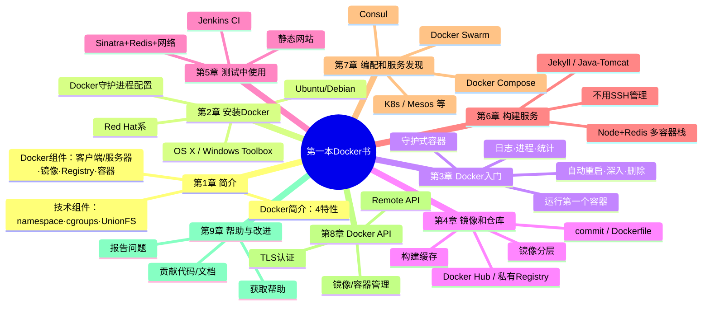
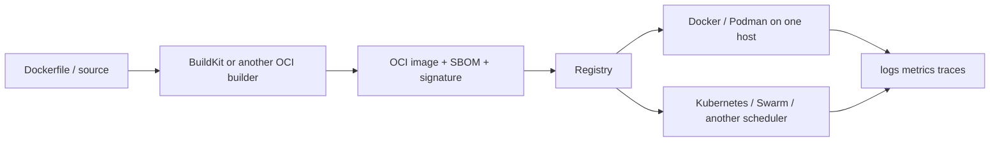

# 《第一本 Docker 书（修订版）》深度阅读：从镜像构建到服务编配

> **文本依据**：《第一本 Docker 书（修订版）》，James Turnbull 著，李兆海、刘斌、巨震译，人民邮电出版社，ISBN 978-7-115-41933-0。所给数字版共 363 个 PDF 页面；纸书页数与电子版分页不是同一口径。电子版“版本”页明确写明：**“本书是 The Docker Book 一书 v1.9.1 版的中文版。”**“本书特色”和内容提要则说明内容面向 **Docker 1.9 及以上版本**。
>
> **标注规则**：`原书代码`只做空格归一化和明显排版修复；无法在当前环境直接运行的旧命令仍予保留，但紧跟“2026 校订”。新增示例一律标作`现代示例`，不冒充原书内容。短引文标注到章或节，避免把出版社内容提要、译者序和作者正文混为一谈。

---

## 一、整体理解与逻辑结构

### Docker 为什么出现：从容器复杂性到可交付的软件单元

本书“内容提要”先给出产品层面的定义：

> "Docker 是一个开源的应用容器引擎，开发者可以利用 Docker 打包自己的应用以及依赖包到一个可移植的容器中，然后发布到任何流行的 Linux 机器上，也可以实现虚拟化。"

作者在第 1 章给出的定义更精确：

> “Docker 是一个能够把开发的应用程序自动部署到容器的开源引擎。”（1.1）

这句话的背景是：容器并非 Docker 发明。第 1 章先追溯 `chroot jail`、OpenVZ、Solaris Zones 和 LXC，再指出现代 Linux 的 cgroups、namespace 与写时复制已经能提供隔离和资源控制，但“容器本身就比较复杂，不易安装，管理和自动化也很困难”，紧接着落到本书的核心判断：

> “而 Docker 就是为改变这一切而生。”（第 1 章导言）

作者随后用四个小节解释 Docker 的目标（1.1.1～1.1.4）：

- **提供一个简单、轻量的建模方式**（依靠写时复制快速修改，容器可在很短时间内启动）；
- **职责的逻辑分离**（开发只关心"容器内有什么"，运维只关心"容器外怎么调度"）；
- **快速、高效的开发生命周期**（从构建、测试到部署一致、可重复）；
- **鼓励使用面向服务的架构**（SOA，每个服务一个容器）。

第 1 章对“容器与虚拟机”的差异有一段直接解释：

> “和传统的虚拟化以及半虚拟化（paravirtualization）相比，容器运行不需要模拟层（emulation layer）和管理层（hypervisor layer），而是使用操作系统的系统调用接口。这降低了运行单个容器所需的开销，也使得宿主机中可以运行更多的容器。”（第 1 章导言）

以及关于可移植性的边界：

> “由于‘客居’于操作系统，容器只能运行与底层宿主机相同或相似的操作系统……”（第 1 章导言）

**通俗易懂的解释：**

通俗地说，虚拟机交付的是一台“虚拟电脑”，容器交付的是一个被隔离的“应用进程及其文件环境”。容器共享宿主机内核，因而轻、快、密度高；镜像又把应用、依赖和默认启动方式固化为同一种交付物。Docker 真正解决的不是“怎样再造一种隔离技术”，而是把零散的内核能力包装成开发者可用的工作流：**构建镜像 → 推送 Registry → 从同一镜像启动容器 → 用统一命令检查和销毁**。

这样做的好处可以归纳为四件事：

1. **交付一致**：测试和生产从同一镜像启动，减少依赖版本与配置漂移。
2. **反馈更快**：容器启动不需要引导一套 Guest OS，适合频繁创建和销毁的测试任务。
3. **职责分离**：开发者定义镜像内的运行环境，运维侧管理镜像外的资源、网络和调度。
4. **组合服务**：一个容器倾向于承载一个服务或进程，再用网络、卷和编排工具组成应用栈。

需要保留边界：镜像可移植不等于任意 CPU、内核和操作系统都能无条件互换；容器隔离也不等于虚拟机级别的安全边界。本书自己已经提醒“只能运行与底层宿主机相同或相似的操作系统”，现代多架构镜像与 Docker Desktop 也没有消除共享内核这一事实。

### 全书的论证路线

下面用两种视角呈现全书骨架：**思维导图**（部分—章节）与**一条容器的生命周期流程图**。

#### 思维导图（Mermaid mindmap）



#### 一条容器从"出生"到"退役"的旅程（生命周期视角）


### Docker 与虚拟机、系统容器和无守护进程容器

| 比较维度 | Docker Engine 应用容器 | KVM / VMware 虚拟机 | LXC / LXD 系统容器 | Podman | Kubernetes |
| --- | --- | --- | --- | --- | --- |
| 抽象对象 | 应用进程与 OCI 镜像 | 虚拟硬件与完整 Guest OS | 接近完整 Linux 用户空间 | 应用进程与 OCI 镜像 | Pod、Deployment、Service 等集群对象 |
| 内核关系 | 与宿主机共享内核 | Guest 拥有自己的内核 | 与宿主机共享内核 | 与宿主机共享内核 | 本身不是运行时，节点仍需 CRI 运行时 |
| 启动与开销 | 通常秒级，开销主要来自进程和镜像层 | 需引导 Guest OS，资源占用通常更高 | 通常秒级，但管理体验更接近一台 Linux 系统 | 与 Docker 同类 | 调度控制面更重，换取自愈、扩缩容与声明式管理 |
| 交付模型 | Dockerfile、分层镜像、Registry | VM 模板或磁盘镜像 | 发行版镜像与实例配置 | 兼容 OCI 镜像，可复用多数 Dockerfile | 部署清单引用 OCI 镜像 |
| 安全边界 | namespace/cgroups 等进程隔离；守护进程权限需治理 | 通常更强，适合异构 OS 或更严格租户边界 | 仍共享内核 | 无中心守护进程，Rootless 体验突出 | 依赖运行时、内核隔离和集群安全策略的组合 |
| 最合适的场景 | 开发交付、CI、单机或编排器下的应用运行 | 不可信工作负载、异构内核、传统整机迁移 | 需要“像主机一样”管理的 Linux 环境 | Rootless、CI、偏 daemonless 的主机管理 | 多节点生产编排；不是 Docker 的同层替代品 |

**结论**：Docker 的优势并不只来自“容器比虚拟机轻”，而来自它把镜像格式、构建 DSL、Registry、容器生命周期和 API 串成了统一的交付体验。LXC/LXD 更像系统级容器；Podman 与 Docker 处在同一层，优势集中在无中心守护进程与 Rootless；Kubernetes 位于更高的编排层，管理的是大规模容器工作负载。安全要求高或需要不同内核时，虚拟机仍然更合适，不能用“容器一定取代虚拟机”概括。

---

## 二、九章如何逐步回答“怎样交付并运行软件”

> 章节名和小节依据所给修订版目录。第 7 章确实包含 Compose、Consul 与独立版 Swarm，这一点是修订版相对早期版本的重要特征。

| 章节 | 标题内容 | 核心内容 | 本章面对的问题与解决路径 |
| --- | --- | --- | --- |
| 序、前言 | 我们走在容器化的大道上；阅读说明 | 交代容器化对开发、测试、交付和部署流程的影响，说明示例代码、勘误与版本范围 | 先建立“交付整个运行环境”的视角，再按章节顺序完成操作闭环 |
| 第 1 章 | 简介 | 容器历史；Docker 的四项目标；客户端/服务器、镜像、Registry、容器；namespace、cgroups、写时复制；Docker 与配置管理 | 容器能力零散、复杂且难自动化。Docker 在隔离能力之上增加应用部署引擎、标准镜像和统一操作接口 |
| 第 2 章 | 安装 Docker | 64 位与内核前提；Ubuntu/Debian、Red Hat、OS X、Windows 安装；Toolbox；守护进程参数、UFW、升级和 UI | 各平台缺少一致运行入口。书中用发行版包、安装脚本或 Toolbox 建立可用的客户端和守护进程；这些具体安装法今天大多已过时 |
| 第 3 章 | Docker 入门 | `info`、`run`、命名、`start`、`attach`、后台容器、日志驱动、`top`、`stats`、`exec`、重启策略、`inspect`、删除 | 容器如何从创建走到销毁。作者围绕一个交互容器和一个守护式循环进程完整演示生命周期 |
| 第 4 章 | 使用 Docker 镜像和仓库 | 分层镜像；拉取和搜索；`commit`；Dockerfile 与构建上下文；缓存；Dockerfile 指令；Docker Hub；私有 Registry | 怎样得到可重复、可分发的运行环境。答案是优先用 Dockerfile 声明构建过程，用 Registry 分发带标签的镜像 |
| 第 5 章 | 在测试中使用 Docker | Nginx 静态网站；Sinatra + Redis；端口映射；内部网络、Docker Networking 与旧式链接；Jenkins CI 和多配置测试 | 测试机反复安装和清理成本高。容器把依赖做成可快速重建的沙盒，并让同一测试环境进入 CI 流水线 |
| 第 6 章 | 使用 Docker 构建服务 | Jekyll + Apache 卷共享；WAR 获取器 + Tomcat；Node.js + Redis 主从应用栈；捕获日志；不使用 SSH 管容器 | 单容器如何组合成服务。作者用卷传递产物、用链接/网络连接进程、用专门容器承担构建和服务职责，并反对把容器当传统主机维护 |
| 第 7 章 | Docker 编配和服务发现 | Compose 的 Flask + Redis 示例；Consul 的 Raft、DNS/API、健康检查和多节点集群；独立版 Swarm 的过滤器与策略；其他编配器 | 手写多条 `docker run` 难复现，动态服务地址难维护，多主机缺统一调度。Compose 声明单机应用，Consul发现服务，Swarm调度主机资源 |
| 第 8 章 | 使用 Docker API | Docker API 分类；Remote API；镜像与容器接口；TProv 示例；自建 CA 与双向 TLS | 人工 CLI 无法支撑平台自动化。HTTP/JSON API 让程序创建和销毁容器，TLS 用来约束远程控制面的访问 |
| 第 9 章 | 获得帮助和改进 Docker | 邮件列表、论坛、IRC、GitHub；高质量问题报告；源码构建与测试；DCO；Pull Request 与维护者 | 使用者遇到缺陷后如何形成可复现报告并回馈上游。作者给出从信息收集、测试到提交签名和评审的开源协作流程 |

---

## 四、从准备主机到安全清理的 Docker 生命周期

> 下文按“准备主机 → 运行容器 → 构建和分发镜像 → 持久化与联网 → 测试和组合服务 → 编配集群 → API 自动化 → 停止与清理”的顺序重组全书。每段都区分原书事实与 2026 校订；原书命令用于理解历史语义，现代命令用于实际操作。

---

### 技术点 1 · 安装 Docker 与守护进程

**① 背景与解决的问题**
在容器能被使用之前，必须先有一套"容器运行时"。早期 Docker 强依赖 Linux 内核特性（namespace、cgroups）与特定的存储驱动（AUFS/Overlay），安装过程因发行版而异，且守护进程（daemon）配置不当会导致权限、网络、存储等一系列问题。第 2 章要解决的就是"把 Docker 正确装上并跑起来"。

**② 作用与应用场景**

- 作用：提供 `docker` 命令行 + 常驻的 `dockerd` 守护进程，作为所有容器操作的"总调度"。
- 场景：本地开发机、CI 构建节点、生产服务器上基础环境的落地。

**③ 使用方法（原书代码，第 2 章）**

```bash
# 原书代码，Ubuntu/Debian（2.2.2）
sudo apt-get update
sudo apt-get install -y docker-engine      # 旧包名，见下方"版本变化"
sudo docker info                           # 验证守护进程与系统信息

# Red Hat 系（书中 2.3）
sudo yum install -y docker
sudo systemctl start docker                # 启动守护进程
sudo systemctl enable docker               # 开机自启

# 原书代码，便捷安装脚本（2.7；生产环境应先审阅脚本）
curl -sSL https://get.docker.com/ | sudo sh
```

**④ 专业术语解释**

- **daemon（守护进程）**：后台常驻服务 `dockerd`，真正干"建容器、管镜像"活的进程；CLI 只是它的"遥控器"。
- **cgroups（Control Groups，控制组）**：Linux 内核特性，限制/统计一组进程能用的 CPU、内存、IO——容器的"资源配额"靠它。
- **namespace（命名空间）**：内核隔离机制，让容器以为自己独占 PID、网络、挂载点等——容器的"视界隔离"靠它。
- **AUFS / Overlay（联合文件系统，Union FS）**：把多层只读镜像 + 一层可写层"叠"成一个统一视图，是镜像分层的基础。

**⑤ 与以往版本变化（新旧对比）**

| 项 | 原书（Docker 1.9） | 2026 校订 |
| --- | --- | --- |
| Linux 包 | `docker-engine` 或发行版的 `docker` 包 | Docker 官方仓库提供 `docker-ce`、CLI、containerd、Buildx 和 Compose 插件 |
| macOS / Windows | Docker Toolbox、VirtualBox、`docker-machine` | Docker Desktop；Windows 的 Linux 容器通常运行于 WSL 2 后端，仍然需要 Linux 内核环境 |
| 守护进程命令 | `docker daemon`，部分示例还是 `docker -d` | `dockerd`，Linux 通常交给 systemd；桌面版由 Docker Desktop 管理 |
| Compose | 另装 Python `docker-compose` | Compose V2 插件，命令为 `docker compose` |

**⑥ 与主流技术对比优势**
Docker Engine 的优势是把客户端、镜像管理、网络、卷和运行时集成在一套 API 下。Kubernetes 不是安装 Docker 的下一条必经步骤：现代 Kubernetes 节点通常直接使用 containerd 或 CRI-O，并不要求 Docker Engine。

**⑦ 实际应用（注释版）**

```bash
# 现代示例：限制默认 json-file 日志大小
# /etc/docker/daemon.json
{
  "log-driver": "json-file",
  "log-opts": { "max-size": "10m", "max-file": "3" }
}
sudo systemctl restart docker
```

**⑧ 局限性与解决方案**

- **局限**：加入 `docker` 组通常等价于获得宿主机 root 级能力；暴露守护进程 socket 也会扩大攻击面。
- **方案（2026 校订）**：最小化组成员；不要把 `/var/run/docker.sock` 随意挂入业务容器；需要时使用 Docker Rootless。Podman 是兼容 OCI 工作流的替代方案，而不是 Docker 守护进程的一个配置项。

**⑨ 通俗概括**
安装 Docker 的实质是准备客户端、守护进程和底层运行时。非 Linux 桌面仍需借助一个 Linux 环境运行 Linux 容器，只是 Docker Desktop 把这层实现隐藏并自动管理了。

---

### 技术点 2 · 容器基础操作（run / 生命周期管理）

**① 背景与解决的问题**
镜像只是"蓝图"，真正干活的是**容器实例**。第 3 章要教会读者：如何从镜像启动容器、让它在后台跑、进进出出、看日志、查状态、设自动重启、最后干净删除——即容器的完整生命周期。

**② 作用与应用场景**

- 作用：创建、运行、监控、停止、清理容器。
- 场景：跑一次性任务、跑常驻服务、进容器排错、批量清理测试容器。

**③ 使用方法（原书代码，第 3 章）**

```bash
# 交互式跑一个 Ubuntu 容器（3.2）
docker run --name bob_the_container -i -t ubuntu /bin/bash

# 后台守护式容器（3.7）：持续打印 hello world
docker run --name daemon_dave -d ubuntu /bin/sh -c "while true; do echo hello world; sleep 1; done"

# 看日志 / 看进程 / 看资源（3.9-3.11）
docker logs -ft daemon_dave        # -f 跟随, -t 时间戳
docker top  daemon_dave
docker stats daemon_dave

# 进容器里执行命令（3.12），常用于排错
docker exec -t -i daemon_dave /bin/bash

# 自动重启（3.14）：容器退出后按策略拉起
docker run --restart=always --name daemon_dave -d ubuntu /bin/sh -c "..."

# 停止并删除（3.16）
docker stop  daemon_dave
docker rm    daemon_dave
docker ps -a                       # 清理前先确认目标
docker rm bob_the_container
```

**④ 专业术语解释**

- **`-i -t`（interactive + tty）**：分配一个可交互的伪终端，等价于"开个能打字的控制台"。
- **`-d`（detached，守护式）**：让容器在后台跑，不占用当前终端。
- **`exec` vs `attach`**：`attach` 是"贴"到容器主进程上（退出可能杀掉容器），`exec` 是"另开一个进程"进去，更安全、可逆。
- **`--restart` 策略**：`no` / `on-failure` / `always` / `unless-stopped`。

**⑤ 与以往版本变化（新旧对比）**

| 语义 | 原书写法 | 2026 校订 |
| --- | --- | --- |
| 查看可写层 | `docker diff` | 仍可用，但不要把容器可写层当持久化存储 |
| 进入容器 | `docker exec -t -i ... /bin/bash` | 常写作 `docker exec -it ... sh`；精简镜像可能没有 Bash |
| 查看 IP | `inspect .NetworkSettings.IPAddress` | 默认 bridge 下仍可查；自定义网络应通过容器名和内置 DNS 访问，不依赖易变 IP |
| 清理 | 命令替换后批量 `docker rm` | 优先按名称或标签选择；`docker container prune` 前先审查影响范围 |

**⑥ 与主流技术对比优势**
相比启动完整 Guest OS，容器直接启动镜像指定的进程，反馈通常更快。但启动速度还取决于镜像拉取、应用初始化和健康检查，不能把所有容器都笼统描述为毫秒级。

**⑦ 实际应用（注释版）**

```bash
# 排错三板斧：看配置 → 看日志 → 进去看
docker inspect --format='{{ .State.Running }}' daemon_dave               # 原书 3.15：取运行状态
docker logs --tail 50 -t daemon_dave                                    # 看最近 50 行
docker exec -it daemon_dave sh                                         # 进去查进程/文件
```

**⑧ 局限性与解决方案**

- **局限**：容器主进程退出，容器就停止；强行在一个容器里常驻多套系统服务，会把生命周期和信号处理重新复杂化。
- **方案**：让前台主进程成为 PID 1，正确处理 `SIGTERM`；调试用 `exec`，服务组合交给 Compose 或编排器；数据放入卷后单独制定保留和删除策略。

**⑨ 通俗概括**
容器就像一个"一次性的小房间"：`run` 是开门入住，`exec` 是进去看看，`logs` 是翻它的运行日记，`rm` 是退租。本书把这套"入住—查看—退租"的全流程讲得很细，是后面所有实战的地基。

---

### 技术点 3 · 镜像与 Dockerfile 构建

**① 背景与解决的问题**
"在我机器上能跑"的世界性难题，根源是**运行环境没被打包**。第 4 章给出答案：把环境写成一份**可版本化的菜谱（Dockerfile）**，一键烤出**镜像**，然后镜像到哪都能秒级还原成一致的容器。

**② 作用与应用场景**

- 作用：用分层、只读、可复用的方式固化"应用 + 依赖 + 运行环境"。
- 场景：交付物标准化、CI 中构建可复现镜像、微服务各自独立打包。

**③ 使用方法（原书代码，4.5.3～4.5.4）**

```dockerfile
# Version: 0.0.1
FROM ubuntu:14.04
MAINTAINER James Turnbull "james@example.com"
RUN apt-get update && apt-get install -y nginx
RUN echo 'Hi, I am in your container' \
  > /usr/share/nginx/html/index.html
EXPOSE 80
```

```bash
docker build -t="jamtur01/static_web" .
docker history jamtur01/static_web
docker run -d -p 8080:80 --name static_web \
  jamtur01/static_web nginx -g "daemon off;"
curl http://localhost:8080
```

原书的 Dockerfile **没有** `CMD`；作者在 `docker run` 末尾显式传入 `nginx -g "daemon off;"`。理解这一点很重要：`EXPOSE 80` 只记录容器预期使用的端口，不会自动发布端口；真正建立宿主机映射的是运行时的 `-p 8080:80`。

**④ 专业术语解释**

- **镜像分层（layered image）**：镜像由内容层和配置组成，容器运行时再叠加可写层。原书用“每条指令创建一层”解释旧构建器；现代 BuildKit 可能重排内部执行，但 Dockerfile 的缓存边界仍需认真设计。
- **构建缓存（build cache）**：若某层及其之前都未变，Docker 直接复用缓存层，大幅加速重建——这就是 4.5.6 节的精髓。
- **`ENTRYPOINT` vs `CMD`**：`ENTRYPOINT` 是"固定入口"（如 `/bin/sh`），`CMD` 是它的默认参数；二者配合可实现"镜像即命令"。
- **`ADD` vs `COPY`**：`COPY` 只拷贝本地文件；`ADD` 还能解压 tar、拉 URL——现代实践**优先 `COPY`**，行为更可预期。

**⑤ 与以往版本变化（新旧对比）**

| 项 | 原书（Docker 1.9） | 2026 校订 |
| --- | --- | --- |
| 作者信息 | `MAINTAINER` | 使用 OCI 风格标签，如 `LABEL org.opencontainers.image.authors="..."` |
| 构建后端 | 传统 builder | BuildKit / Buildx；支持并行阶段、远程缓存、secret 和 SSH mount |
| 产物裁剪 | 一个阶段内安装、构建、运行 | 多阶段构建只复制运行产物；也可选择 distroless，但需权衡调试能力 |
| 构建上下文 | 整个目录发送给 daemon，靠 `.dockerignore` 排除 | 仍需最小化上下文；不要把密钥放进上下文或 `ARG`/镜像层 |

**⑥ 与主流技术对比优势**
对比手工 `scp` 脚本或整盘 VM 模板，Dockerfile 让构建过程可审查、可重复并能进入 CI；分层内容寻址还能复用相同层。回滚仍依赖可靠 tag/digest 与部署策略，不是写了 Dockerfile 就自动具备。

**⑦ 实际应用（多阶段构建，注释版）**

```dockerfile
# 多阶段：第一阶段编译，第二阶段只带二进制
FROM golang:1.24 AS build
WORKDIR /src
COPY . .
RUN go build -o app .

FROM gcr.io/distroless/base-debian12   # 极简运行时镜像（书后演进）
COPY --from=build /src/app /app
ENTRYPOINT ["/app"]
```

> 这是现代示例，不是原书代码。实际项目还应固定基础镜像 digest、创建非 root 用户并生成 SBOM；“镜像小”不自动等于“镜像安全”。

**⑧ 局限性与解决方案**

- **局限**：`docker commit` 把"当前容器状态"直接存成镜像，等于"黑盒快照"，别人看不出你装了啥。
- **方案（原书 4.5 的明确倾向）**：日常构建优先 Dockerfile，因为它“更具备可重复性、透明性以及幂等性”。`commit` 可用于临时取证或保存调试现场，但不应成为发布流水线。

**⑨ 通俗概括**
Dockerfile 就是"做菜菜谱"：基础镜像 `FROM` 是食材，`RUN` 是每一步烹饪，`CMD` 是"出锅后默认怎么吃"。因为每层都留底（构建缓存），改一行代码不用重炒整锅——这就是它比"整台虚拟机克隆"聪明的地方。

---

### 技术点 4 · 仓库与 Registry（分发镜像）

**① 背景与解决的问题**
镜像做出来了，怎么发给别人、发给生产环境？第 4.6–4.9 节给出"镜像的快递网络"：公共仓库 Docker Hub 与自建私有 Registry。

**② 作用与应用场景**

- 作用：集中存储、版本化（tag）、分发镜像。
- 场景：团队共享基础镜像、CI 推送产物镜像、生产节点拉取部署。

**③ 使用方法（原书代码，4.6～4.8）**

```bash
docker login                                  # 登录 Docker Hub（4.6）
docker tag jamtur01/static_web jamtur01/static_web:webserver
docker push jamtur01/static_web

# 自建私有 Registry（4.8）
docker run -p 5000:5000 registry:2
docker tag jamtur01/static_web localhost:5000/jamtur01/static_web
docker push localhost:5000/jamtur01/static_web
```

原书在 4.8 特别要求为本地 HTTP Registry 配置 `--insecure-registry localhost:5000`。这只是当年的本地测试办法；现代生产 Registry 应使用 HTTPS 和身份认证，不能把 `insecure-registries` 当作常规配置。

**④ 专业术语解释**

- **Registry（注册服务器）**：提供镜像内容和清单分发 API 的服务。
- **Repository（仓库）**：同一命名空间下相关镜像版本的集合，例如 `team/order-api`。
- **Tag（标签）**：指向某个 manifest 的可变名字；`latest` 只是省略 tag 时使用的默认名称，不表示时间最新。
- **Digest（摘要）**：内容寻址的不可变标识，例如 `sha256:...`；严格部署比 tag 更适合固定 digest。
- **`registry:2`**：Docker 官方的第二代 Registry 实现（HTTP API v2）。

**⑤ 与以往版本变化（新旧对比）**

| 项 | 原书（Docker 1.9） | 2026 校订 |
| --- | --- | --- |
| 私有仓库 | `registry:2` 手工起 | Harbor 或云托管 Registry，补齐 RBAC、审计、复制与保留策略 |
| 云仓库 | 主要是 Docker Hub，另提 Quay | Docker Hub、GHCR、ECR、Artifact Registry、ACR 等 |
| 供应链 | 登录和私有可见性 | digest 固定、SBOM、漏洞扫描、签名与策略验证；这些能力不是 `docker login` 自动提供的 |

**⑥ 与主流技术对比优势**
相比"用对象存储传 tar 包"，Registry 支持**增量层传输、版本 tag、访问控制**，是容器交付链的标准枢纽。

**⑦ 实际应用（注释版）**

```bash
# 生产常见：从私有仓库拉取指定版本部署
docker pull registry.example.com/order-svc@sha256:<digest>
docker run -d -p 8080:8080 --name order \
  registry.example.com/order-svc@sha256:<digest>
```

**⑧ 局限性与解决方案**

- **局限**：`latest` 标签语义模糊，易部署到错误版本；公共 Hub 有拉取频率限制。
- **方案**：同时保留便于人读的语义化 tag 和用于部署锁定的 digest；配置保留策略、最小权限、签名验证和漏洞门禁。扫描只能发现已知问题，不能替代基础镜像更新和运行时隔离。

**⑨ 通俗概括**
Registry 是镜像的"快递柜 + 版本库"。Docker Hub 是公共快递柜，自己起的 `registry:2` 是公司内部的私密柜。寄之前先贴好标签（`tag`），别老用 `latest` 这种"无名包裹"。

---

### 技术点 5 · 存储卷 Volume（数据持久化）

**① 背景与解决的问题**
容器本身是"易碎品"——`rm` 掉容器，里面写的文件全没了。但数据库、用户上传这些**有状态数据必须活过容器生命周期**。第 5/6 章用 Volume 解决"容器死，数据活"。

**② 作用与应用场景**

- 作用：把宿主机目录或独立卷"挂"进容器，数据独立于容器存在。
- 场景：数据库数据目录、配置文件、日志、需要跨容器共享的文件。

**③ 使用方法（原书代码，5.1 与 6.1）**

```bash
# 绑定挂载：把宿主当前目录挂进容器（5.1，网站示例）
docker run -d -p 80 --name website \
  -v $PWD/website:/var/www/html:ro \
  jamtur01/nginx

# 原书 Jekyll Dockerfile 声明两个卷（6.1.1）
VOLUME /data
VOLUME /var/www/html
```

```bash
# 备份一个卷（书中 6.1.7 "备份Jekyll卷"思路）
docker run --rm --volumes-from james_blog -v "$(pwd):/backup" ubuntu \
  tar cvf /backup/james_blog_backup.tar /var/www/html
```

第 6.1 节的设计不是简单“把网站目录挂进去”：Jekyll 容器从绑定挂载的 `/data` 读取源码，把编译结果写入 `/var/www/html` 卷；Apache 容器再通过 `--volumes-from james_blog` 读取同一份编译产物。它体现了作者的服务拆分思想，但 `--volumes-from` 依赖另一个容器的卷定义，现代 Compose 更适合显式声明命名卷。

**④ 专业术语解释**

- **Volume（卷）**：Docker 管理的、独立于容器文件系统的持久化存储单位。
- **bind mount（绑定挂载）**：直接把宿主某个目录挂进容器（如上面 `-v $PWD/website:...`）。
- **`:ro`**：只读挂载，防止容器误改宿主文件。

**⑤ 与以往版本变化（新旧对比）**

| 项 | 原书（Docker 1.9） | 2026 校订 |
| --- | --- | --- |
| 管理接口 | 已提到 `docker volume create` 和卷插件 | `docker volume` 子命令与 Compose 顶层 `volumes` 已成为常规入口 |
| 共享方式 | `--volumes-from` 依赖数据容器 | 显式命名卷更清楚；绑定挂载适合源码和主机配置 |
| 挂载语法 | 主要使用 `-v` | `--mount type=volume|bind|tmpfs,...` 更长但字段明确，复杂配置更不易写反 |
| 多主机 | 书中已提到 Ceph、Flocker、EMC 等插件 | 需选择与平台匹配的存储驱动；Kubernetes 通过 CSI、PV/PVC 抽象供应与挂载 |

**⑥ 与主流技术对比优势**
对比"把数据写进容器可写层"：卷让数据**与容器解耦**，容器重建/升级数据不丢，且可被多个容器同时挂载共享。

**⑦ 实际应用（注释版）**

```bash
docker volume create pgdata
docker run -d --name pg \
  --env-file .env \
  --mount type=volume,src=pgdata,dst=/var/lib/postgresql/data \
  postgres:16
# 删除 pg 容器不会自动删除 pgdata；但这不等于完成了备份。
```

**⑧ 局限性与解决方案**

- **局限**：卷把数据移出容器可写层，却不会自动带来备份、一致性快照、加密或跨主机可用性。直接 `tar` 一个正在写入的数据库卷可能得到不一致备份。
- **方案（2026 校订）**：数据库优先用自身备份工具或存储快照，并验证恢复；跨节点场景使用云盘、NFS、Ceph 或 Kubernetes CSI/PV/PVC。删除卷前先用 `docker volume inspect` 确认归属。

**⑨ 通俗概括**
容器像租来的临时工棚，推倒就没了；Volume 是在工棚旁另租的"保险柜"，工人换了一批，柜子里的东西还在。记住：**有状态数据，永远进卷，别进容器身体**。

---

### 技术点 6 · 网络与容器互联

**① 背景与解决的问题**
多容器协作必须"能说话"：Web 要连 Redis，前端要暴露端口给用户。第 5.2 节系统讲透端口映射、容器连接与 Docker 网络。

**② 作用与应用场景**

- 作用：让容器访问外网、被外部访问、彼此通信，且互相隔离。
- 场景：Web→DB 内部通信、对外发布服务、微服务间调用。

**③ 使用方法（原书代码，5.2.6～5.2.7）**

```bash
# 端口映射：-p 宿主端口:容器端口（5.2，Sinatra 示例）
docker run -p 4567 --name webapp jamtur01/sinatra

# 原书旧式链接（5.2.7；今天仅作历史对照）
docker run -d --name redis jamtur01/redis
docker run -p 4567 --name webapp --link redis:mydb jamtur01/sinatra

# 原书已经推荐的 Docker Networking（5.2.6）
docker network create app
docker run -d --net=app --name db  jamtur01/redis
docker run -p 4567 --net=app --name webapp jamtur01/sinatra
# 此时 webapp 可直接用主机名 db 访问 redis，无需 --link
```

**④ 专业术语解释**

- **bridge（桥接网络）**：同一宿主机上的软件网桥。默认 `bridge` 与用户自定义 bridge 行为不完全相同，后者提供容器名 DNS 解析和更清楚的隔离边界。
- **`-p` / `-P`**：`-p` 指定确切映射，`-P` 把容器 `EXPOSE` 的端口随机映射到宿主高位端口。
- **`--link`**：早期把目标容器信息注入 `/etc/hosts` 和环境变量的机制。Docker 官方将其归入 legacy links；它只适合同主机旧应用兼容。
- **overlay 网络**：Docker 用于跨多个 daemon 的网络驱动，常与 Swarm 一起使用。Kubernetes 网络通常由 CNI 插件实现，不能简单等同于 Docker overlay。

**⑤ 与以往版本变化（新旧对比）**

| 项 | 原书（Docker 1.9） | 2026 校订 |
| --- | --- | --- |
| 推荐方式 | 5.2.6 已推荐 Docker Networking；5.2.7 为旧版本保留 links | 继续使用用户自定义网络；不为新应用增加 `--link` |
| 寻址 | 网络内用容器名 `db`，links 可注入 `DB_PORT` 等变量 | 使用 Docker 内置 DNS 和稳定服务名，不读取已废弃的 link 环境变量 |
| 发布端口 | `-p 4567` 随机选择宿主端口，`docker port` 查询 | 服务端口固定时写 `-p 127.0.0.1:8080:4567`；是否绑定公网必须显式决定 |
| 集群网络 | 书中以独立 Swarm 和 Consul 为主 | Swarm 使用 overlay；Kubernetes 使用 CNI 插件与 Service，而非 Docker link |

**⑥ 与主流技术对比优势**
用户自定义 bridge 的直接优势是同机容器可按名称发现、可动态加入或离开，而且没有 `--link` 的启动顺序耦合。它本身并不跨主机；跨主机需要 overlay 或编排平台的网络实现。

**⑦ 实际应用（注释版）**

```bash
docker network create --driver bridge app-net
docker run -d --net=app-net --name redis redis:7
docker run -d --net=app-net -p 127.0.0.1:8080:8080 --name api my-api:1.0
# api 容器内 `redis:6379` 即可连通，无需知道其 IP
```

**⑧ 局限性与解决方案**

- **局限**：默认 bridge 网络中容器不能用"服务名"互访（得用自定义网络）；`--link` 跨主机无效。
- **方案**：单机 Compose/Engine 使用用户自定义网络；多节点由 Swarm overlay 或 Kubernetes CNI/Service 接管。只把确实需要外部访问的端口发布到合适的宿主接口，并用防火墙或反向代理控制入口。

**⑨ 通俗概括**
Docker 网络像给容器们装了"内线电话 + 对外门牌"。早期用 `--link` 等于把邻居电话 hardcoded 进你家墙里（僵化），现在改成"大家先加入同一个电话本（自定义网络）"，谁搬家都不影响呼叫。

---

### 技术点 7 · 在测试与 CI 中使用 Docker

**① 背景与解决的问题**
测试环境"脏、慢、不一致"是交付瓶颈。第 5 章展示用 Docker 拉起**一次性、干净、一致**的测试环境，并把 Docker 接进 Jenkins 持续集成。

**② 作用与应用场景**

- 作用：用容器封装测试依赖（DB、中间件），让每次测试从同一干净状态开始。
- 场景：单元测试依赖 Redis/MySQL、端到端测试、CI 流水线构建与跑测。

**③ 使用方法（原书主线，第 5 章）**

```bash
# 测试静态网站：挂本地目录，改代码即时生效（5.1）
docker run -d -p 80 -v $PWD/website:/var/www/html:ro jamtur01/nginx

# Jenkins 多配置作业（5.4）：用 Docker 作为"构建从节点/测试环境"
# 思路：Jenkins 作业里调用 docker run 拉起被测服务 + 跑测试，结束即销毁
```

**④ 专业术语解释**

- **CI（Continuous Integration，持续集成）**：频繁把代码合并到主干并自动构建/测试。
- **Jenkins 多配置作业（matrix job）**：对同一套测试在多个环境（如多个语言版本）并行跑。
- **一次性环境（ephemeral environment）**：任务结束即可删除并重新创建的环境，目的是减少上一次运行留下的状态。

**⑤ 与以往版本变化（新旧对比）**

| 项 | 原书（Docker 1.9） | 2026 校订 |
| --- | --- | --- |
| CI 工具 | Jenkins 普通作业和多配置作业；另列 Drone、Shippable | Jenkins 仍常见，也可用 GitHub Actions、GitLab CI 等 |
| 隔离方法 | Jenkins 运行在容器里，并在其中操作 Docker 来创建测试容器 | 优先使用隔离 runner、CI `services` 或 Testcontainers；谨慎处理 Docker socket 权限 |
| 复用 | 镜像与容器让环境快速重建 | BuildKit 远程层缓存、依赖缓存和测试制品分别管理，缓存不能改变测试结果 |

**⑥ 与主流技术对比优势**
相比在固定共享服务器上反复安装依赖，容器使清理成本更低，也更容易固定数据库、中间件和工具版本。但“使用容器”不自动保证可复现：浮动 tag、外部网络依赖、时间和随机数仍会造成漂移。

**⑦ 实际应用（注释版，GitHub Actions 风格书后演进）**

```yaml
# .github/workflows/test.yml —— 用容器提供测试依赖（书中 5.3 思想的现代版）
jobs:
  test:
    runs-on: ubuntu-latest
    services: # 相当于"用 docker run 起一个 redis"
      redis:
        image: redis:7
        ports: ["6379:6379"]
    steps:
      - uses: actions/checkout@v4
      - run: npm test # runner 通过 localhost:6379 访问已发布的 Redis 端口
```

**⑧ 局限性与解决方案**

- **局限**：把宿主机 Docker socket 挂进 CI 容器，往往给了该作业宿主机级控制权；Docker-in-Docker 还会引入缓存、存储驱动和特权模式问题。
- **方案**：使用隔离 runner；不信任的 PR 不获得生产凭据或特权 socket；集成测试可用 CI service/Testcontainers，发布镜像则在专用构建作业中完成并签名。

**⑨ 通俗概括**
用 Docker 做测试，等于给每次测试发一个"全新的一次性实验室"：仪器（DB/中间件）现拉现用，做完实验连房带仪器一起拆掉，下次再来还是一尘不染。这正是 CI 又快又稳的秘诀。

---

### 技术点 8 · 构建多服务应用栈（Compose 之前的组合实践）

**① 背景与解决的问题**
真实应用从来不是"一个容器"。第 6 章用 Jekyll 站、Java/Tomcat 服务、Node+Redis 栈，演示如何把**多个各司其职的容器**拼成一个完整应用。

**② 作用与应用场景**

- 作用：把"前端 + 后端 + 缓存"等容器按职责拆分又协同工作。
- 场景：本地起一套完整微服务、演示多容器协作、日志统一捕获。

**③ 使用方法（原书代码，6.3.5～6.3.6）**

```bash
# 原书 6.3.5～6.3.6：先建网络，再启动 Redis 主节点与 Node 应用
docker network create express
docker run -d -h redis_primary --net express \
  --name redis_primary jamtur01/redis_primary
docker run -d --name nodeapp -p 3000:3000 \
  --net express jamtur01/nodejs
```

原书随后再起两个 `jamtur01/redis_replica` 容器，让它们按主机名 `redis_primary:6379` 复制数据；最后用挂载日志卷的 Logstash 容器捕获 Node 与 Redis 日志。这展示了网络、卷和专用职责如何组合，但把日志写文件再共享卷不是现代容器日志的唯一或默认答案。

**④ 专业术语解释**

- **一个容器一个关注点**：1.1.4 推荐单个容器运行一个应用或进程，同时明确说并非绝对限制。真正目标是生命周期清晰；辅助子进程是否同容器要按耦合程度判断。
- **应用栈（application stack）**：由多个协作容器组成的一个完整应用。
- **不使用 SSH 管理容器（6.4）**：容器应靠 `logs`/`exec`/`inspect` 管理，而非塞个 SSH 守护进程进去。

**⑤ 与以往版本变化（新旧对比）**

| 项 | 原书（Docker 1.9） | 2026 校订 |
| --- | --- | --- |
| 多容器编排 | 第 6 章手工 `docker run`；第 7 章引入 Compose | Compose 适合本地/单机，Kubernetes 等负责编排多节点生产工作负载 |
| 服务发现 | Docker Networking 的主机名 DNS，旧版本才退回 links | 保留稳定服务名；集群中由 Service/内部 DNS 或专用服务发现提供 |
| 日志 | 应用写文件，Logstash 通过共享卷读取 | 应用优先写 stdout/stderr，由日志驱动或平台采集；避免容器本地日志无限增长 |

**⑥ 与主流技术对比优势**
按不同生命周期拆分容器，才可能独立发布和扩缩容；拆得过细则会增加网络、观测、一致性和运维成本。容器是部署边界，不是要求把每个函数都变成远程服务。

**⑦ 实际应用（注释版）**

```bash
# 不用 SSH：进容器查日志/进程的正确姿势
docker logs -f nodeapp
docker exec -it nodeapp sh
# 而非：docker run ... sshd → 连进去（反模式，违反 6.4）
```

**⑧ 局限性与解决方案**

- **局限**：手工 `docker run` 多容器，参数一长就易错、难复现。
- **方案**：用 **Docker Compose**（下一技术点）把整栈写成一份声明式文件。

**⑨ 通俗概括**
一个容器干一件事，像餐厅里"切菜归切菜、炒菜归炒菜"。本书第 6 章教你怎么把这些"厨师容器"组织成一桌菜，并反复提醒：**别给容器偷偷装 SSH 后门**，用标准接口管理它才是正道。

---

### 技术点 9 · Docker Compose 编配（多容器一键编排）

**① 背景与解决的问题**
技术点 8 里手工敲一串 `docker run` 太琐碎。第 7.1 节的 **Docker Compose** 把"多容器应用"写成一份声明式 YAML，一条命令拉起/停止整栈。

**② 作用与应用场景**

- 作用：用 `docker-compose.yml` 定义服务、网络、卷、依赖，统一生命周期管理。
- 场景：本地开发全套环境、单主机多服务部署、演示原型。

**③ 使用方法（原书代码，7.1.3）**

```yaml
web:
  image: jamtur01/composeapp
  command: python app.py
  ports:
    - "5000:5000"
  volumes:
    - .:/composeapp
  links:
    - redis
redis:
  image: redis
```

```bash
docker-compose up -d
docker-compose ps
docker-compose logs
docker-compose stop
docker-compose rm
```

这是 Compose 1.5 的旧格式：顶层直接是 `web`、`redis`，没有 `services`。原书应用还在 `app.py` 中连接主机名 `redis_1`，依赖当时的命名规则。下面的现代示例才使用 Compose Specification；两种格式不能混写。

**④ 专业术语解释**

- **Compose Specification（Compose 规范）**：描述服务、网络、卷、配置和 secret 的开放规范；现代 Compose V2 按该规范解析文件。
- **`services`**：组成应用的各个容器角色。
- **`depends_on`**：声明启动顺序依赖（现代还支持 `condition: service_healthy` 等健康门槛）。

**⑤ 与以往版本变化（新旧对比）**

| 项 | 原书（Compose 1.5） | 2026 校订 |
| --- | --- | --- |
| CLI | 独立 Python 程序 `docker-compose` | Go 实现的 Compose V2 插件：`docker compose` |
| 文件结构 | 顶层直接写服务，无 `version` 和 `services` | 顶层 `services`；`version` 字段已过时，应省略而非改成 `"3"` |
| 服务连接 | `links`，应用写死生成的容器名 `redis_1` | 同一 Compose 网络按服务名 `redis` 解析，不需要 links，也不依赖实例编号 |
| 生命周期 | `up/ps/logs/stop/rm` | 常用 `up/down/exec/logs/config`，并可使用 profiles、healthcheck、configs、secrets 等 |

**⑥ 与主流技术对比优势**
对比手写 `docker run`：Compose 让多容器应用**可提交、可复现、一键启停**，是单主机编排的事实标准；对比 K8s 它更轻，适合开发/单机。

**⑦ 实际应用（注释版，现代写法）**

```yaml
services:
  web:
    build: .
    ports: ["8080:8080"]
    environment:
      REDIS_URL: redis://db:6379/0
    depends_on:
      db:
        condition: service_healthy
  db:
    image: redis:7-alpine
    healthcheck:
      test: ["CMD", "redis-cli", "ping"]
      interval: 5s
      timeout: 3s
      retries: 10
```

```bash
docker compose config          # 先查看变量展开后的最终配置
docker compose up -d --wait    # 启动并等待服务达到运行/健康状态
docker compose logs -f web
docker compose down            # 默认删除容器和网络，不删除命名卷
```

`depends_on` 能管理 Compose 启动依赖；只有被依赖服务定义了健康检查并使用相应 condition 时，才有“等待健康”的语义。应用本身仍需实现连接重试，不能把启动顺序当作运行期可用性保证。

**⑧ 局限性与解决方案**

- **局限**：Compose 主要管理单个 Docker endpoint，不提供 Kubernetes 那样的多节点调度控制面。明文环境变量也不适合长期保存敏感信息。
- **方案（2026 校订）**：开发、集成测试和简单单机部署继续使用 Compose；多节点、自愈、滚动发布和策略治理按复杂度选择 Swarm、Kubernetes 或托管容器平台。敏感信息使用平台 secret 或外部密钥系统。

**⑨ 通俗概括**
Compose 把多条容器启动参数变成可提交的 YAML：`up` 创建应用，`logs` 汇总日志，`down` 回收本项目资源。原书使用独立 `docker-compose`，现代入口是 `docker compose`。

---

### 技术点 10 · 服务发现与 Swarm 集群

**① 背景与解决的问题**
单机上"容器能互访"还不够；当应用要跑在多台机器上、要能扩容、要某个节点挂了自动转移，就需要**集群编排 + 服务发现**。第 7.2–7.3 节给出 Consul（服务发现）与 Docker Swarm（集群）。

**② 作用与应用场景**

- 作用：在多个 Docker 主机上统一调度容器、做服务注册/发现、负载均衡。
- 场景：多节点部署、动态扩容、服务间自动寻址。

**③ 使用方法（原书代码，第 7 章）**

```bash
# 原书 7.2.2：单节点 Consul 演示
docker run -p 8500:8500 -p 53:53/udp -h node1 \
  jamtur01/consul -server -bootstrap

# Docker Swarm（7.3，书中为独立 swarm 容器方式，已演进）
docker run --rm swarm create                    # 旧：拿到集群 token
docker run -d swarm join --addr=10.0.0.125:2375 token://<CLUSTER_ID>
docker run --rm swarm list token://<CLUSTER_ID>
docker run -d -p 2380:2375 swarm manage token://<CLUSTER_ID>
```

这些命令是历史材料，不能直接作为现代部署步骤：独立 `swarm` 镜像已被 Docker 1.12 引入的内置 Swarm mode 取代，而且原书节点通过未加密的 2375 端口接受控制，今天不应照搬到可信边界之外。

**④ 专业术语解释**

- **服务发现（Service Discovery）**：服务实例注册地址与健康状态，调用方通过 DNS 或 API 查询可用实例。它处理动态地址，不等于负载均衡和鉴权。
- **Raft**：Consul 服务器用于选主和复制一致状态的共识算法。书中强调 Consul 既提供 DNS/HTTP 查询，也提供健康监控。
- **Swarm**：Docker 的原生集群方案，把多台 Docker 主机当作一个"大主机"来调度。
- **过滤器 / 策略（7.3.4 / 7.3.5）**：决定容器"调度到哪台节点"的规则（如按资源、按标签）与策略（spread/binpack/random）。

**⑤ 与以往版本变化（新旧对比）**

| 项 | 原书（独立 Swarm） | 2026 校订 |
| --- | --- | --- |
| Swarm 形态 | 单独的 `swarm` 镜像 + `manage/join` | **内置 Swarm Mode**：`docker swarm init` / `join`（Docker 1.12+） |
| 服务模型   | 较原始                              | `docker service create` + 副本数 + 滚动更新                       |
| 编排格局   | Swarm/Compose/Mesos/K8s 并存        | **Kubernetes 成为事实标准**，Swarm 退居边缘/特定场景              |

**⑥ 与主流技术对比优势**

- 相对"纯手工在多台机器 `docker run`"：Swarm/Consul 提供**自动调度、服务注册、故障转移**。
- 但需诚实指出：2016 年后 **Kubernetes 胜出**，Swarm 生态已明显收缩（见扩展章节）。

**⑦ 实际应用（注释版，现代 Swarm Mode）**

```bash
docker swarm init --advertise-addr 192.168.1.10   # 主节点
docker swarm join --token <WORKER_TOKEN> 192.168.1.10:2377
docker service create --name web --replicas 3 \
  --publish published=80,target=80 nginx:alpine
```

> 书中独立 `swarm` 容器方式已淘汰，上面的 Swarm mode 是现代示例。

**⑧ 局限性与解决方案**

- **局限**：原书的独立 Swarm 发现服务、调度 API 和 Consul 版本都已失去直接实践价值；任何共识集群都还要处理法定人数、网络分区、备份和升级。
- **方案（2026 校订）**：理解过滤器、spread/binpack 和服务发现思想后，重新按当前平台实现。轻量且团队已熟悉 Docker 时可评估 Swarm mode；需要广泛生态、声明式扩展和托管服务时通常选择 Kubernetes。选择依据应是规模与运维能力，不是流行度本身。

**⑨ 通俗概括**
Consul 是"公司通讯录"——新容器入职先登记，别人找它查号即可；Swarm 是"把一堆工人（机器）编成一个班组"，工头（manager）统一派活、谁请假自动换人。只是这套班组体系后来被 Kubernetes 这个"更庞大的集团公司"抢了风头。

---

### 技术点 11 · Docker Remote API 与认证

**① 背景与解决的问题**
不光人要用 Docker，程序也要驱动 Docker（比如调度系统、自建 PaaS）。第 8 章讲如何通过 **Remote API** 用 HTTP 调用来管理镜像与容器，并为其上 TLS 认证。

**② 作用与应用场景**

- 作用：以编程方式（HTTP/JSON）查询与控制 Docker 守护进程。
- 场景：自研调度平台、CI 系统、运维自动化、把 Docker 当"引擎"嵌入产品。

**③ 使用方法（原书代码，第 8 章）**

```bash
# 原书 8.3：守护进程已显式监听 2375 后，用 HTTP 查询
curl http://docker.example.com:2375/info
curl http://docker.example.com:2375/images/json | python -m json.tool
curl -s http://docker.example.com:2375/containers/json | python -m json.tool

# 改进 TProv 应用（8.4）：用 API 动态创建/销毁容器，做轻量 PaaS
```

```bash
# 开启 TLS 认证（8.5 五步法）
# 1) 自建 CA；2) 服务端证书签名请求；3) 配置 dockerd 启用 TLS；
# 4) 客户端证书；5) 客户端开启认证
docker -H=docker.example.com:2376 --tlsverify info
```

原书先建立 CA，再分别签发服务端与客户端证书，并把客户端 `ca.pem`、`key.pem`、`cert.pem` 放入 `~/.docker/`，所以上述命令不必逐项传证书路径。这个顺序说明 TLS 同时解决两个问题：加密传输，以及通过客户端证书限制“谁能控制 daemon”。

**④ 专业术语解释**

- **Remote API**：Docker 守护进程暴露的 HTTP/JSON 接口（现称 Docker Engine API）。
- **2375 / 2376**：Docker 约定俗成的明文/TLS TCP 端口。端口号本身不提供安全性，是否启用 `--tlsverify` 才是关键。
- **TLS（Transport Layer Security）**：传输层加密与双向证书认证，防止别人随意遥控你的 Docker。

**⑤ 与以往版本变化（新旧对比）**

| 项 | 原书（Docker 1.9） | 2026 校订 |
| --- | --- | --- |
| API 暴露 | 手动 `-H tcp://0.0.0.0:2375` | Linux 通常通过本地 Unix socket；远程 endpoint 必须显式配置和保护 |
| API 版本 | 示例直接访问未带版本前缀的 endpoint | 客户端与 daemon 会协商版本；自写客户端应按 Engine API 版本处理兼容性 |
| 认证 | 自建 CA 和双向 TLS | mTLS 仍可用；运维访问也可用 `docker context create --docker host=ssh://...`，减少直接暴露 TCP API |
| 调用方式 | `curl` + JSON | Docker CLI、SDK 或直接 API；SDK 只是封装，不改变 socket 的高权限性质 |

**⑥ 与主流技术对比优势**
Remote API 的主要优势是结构化：请求、响应和错误都能被程序处理，适合 CI 和平台自动化。它并不天然比 SSH 更安全或更可审计；认证、授权、网络边界和操作日志必须另外设计。

**⑦ 实际应用（现代本地 API 与远程 context）**

```bash
# Linux 本机：不开放 TCP，直接查询受文件权限保护的 Unix socket
curl --unix-socket /var/run/docker.sock http://localhost/_ping

# 远程运维：让 Docker CLI 复用 SSH 传输
docker context create prod --docker "host=ssh://ops@docker.example.com"
docker --context prod ps
```

> 能访问 Docker socket 的进程通常可以创建特权容器、挂载宿主目录，效果接近控制宿主机。不要因为它是本地 socket 就把它视为普通应用 API。

**⑧ 局限性与解决方案**

- **局限**：把 2375 裸奔暴露到公网 = 把服务器 root 权限送人（历史上大量"挖矿劫持"源于此）。
- **方案**：不在公网暴露 2375；远程访问使用双向 TLS 或 SSH context，并在防火墙限制来源。对多租户平台还要增加独立授权层，不能把共享 daemon API 直接交给最终用户。

**⑨ 通俗概括**
Remote API 是 Docker 的"遥控接口"：你可以用程序而不是人手去开关容器。但这是个**高能接口**——开着门不锁（2375 裸奔）等于把家门钥匙插在锁上，所以本书 8.5 的 TLS 认证五步，是任何远程调用前的必做功课。

---

### 技术点 12 · 停止、清理、诊断与社区反馈

**① 背景与解决的问题**
生命周期的末端不是盲目执行批量删除：第 3 章先检查、停止和删除容器，第 4 章删除镜像；遇到异常时，第 9 章要求提交包含版本、系统信息、日志和复现步骤的问题报告，再讨论源码、文档和 Pull Request。

**② 作用与应用场景**

- 作用：安全回收临时资源；保留需要持久化的数据；把不可自行解决的问题变成可复现报告。
- 场景：测试环境清理、磁盘空间治理、daemon 异常排查、向上游报告缺陷或贡献修复。

**③ 使用方法（原书代码，第 3、4、9 章）**

```bash
# 原书第 3、4 章：先识别，再停止和删除明确目标
docker ps -a
docker stop daemon_dave
docker rm daemon_dave
docker images
docker rmi jamtur01/static_web

# 原书第 9 章强调运行测试并签署提交
git clone https://github.com/docker/docker.git
cd docker
make test
git commit -s
```

书中的 `docker/docker` 是当年的仓库名，现代 Engine 上游代码主要位于 `moby/moby`，CLI、Compose、Buildx、containerd、runc 也有各自仓库。贡献前应先读取目标仓库当前的 `CONTRIBUTING.md`，不能照抄 2016 年的构建命令。

**④ 专业术语解释**

- **PR（Pull Request）**：向开源项目提交的"合并请求"，是社区协作的基本单元。
- **Upstream（上游）**：你 fork 的那个原始官方仓库。
- **DCO（Developer Certificate of Origin，开发者原创声明）**：通过 `git commit -s` 添加 `Signed-off-by`，声明有权按项目许可证提交该变更。原书 9.3.8 专门解释了这一要求。

**⑤ 与以往版本变化（新旧对比）**

| 项 | 原书（Docker 1.9） | 2026 校订 |
| --- | --- | --- |
| 源码结构 | `docker/docker` 单仓库视角 | Moby Engine、Docker CLI、Compose、Buildx、containerd、runc 等分属不同项目 |
| 报告渠道 | 邮件列表、论坛、IRC、GitHub | 论坛和 GitHub issue 仍常用；具体渠道以目标组件仓库为准 |
| 签署 | 原书展示旧 `Docker-DCO-1.1-Signed-off-by`，并推荐 `git commit -s` | 遵循当前仓库的 DCO/CLA 和提交规范，不假定所有项目相同 |

**⑥ 与主流技术对比优势**
第 9 章的工程价值是“可复现的问题报告”：先给出 Docker 版本、`info`、宿主系统、期望与实际结果、最小复现步骤，再附日志。它比只说“Docker 坏了”更容易得到有效反馈，这一原则至今没有过时。

**⑦ 实际应用（注释版，生产化 checklist）**

```
生产化容器落地清单（基于本书理念 + 书后演进）：
☑ 镜像用 Dockerfile + 多阶段构建，基础镜像最小化
☑ 有状态数据进入受管理的 Volume，并验证备份与恢复
☑ 容器间用自定义网络通信，弃用 --link
☑ 用 Compose 或编排清单记录配置，临时调试命令不冒充部署事实源
☑ 守护进程启用 TLS/Rootless，不暴露 2375
☑ 接入 CI：每次提交自动构建镜像 + 跑测试
☑ 监控/日志接入（Prometheus/Loki，书后演进）
```

**⑧ 局限性与解决方案**

- **局限**：容器、镜像、卷和网络的垃圾回收相互独立，`prune` 可能删除仍想保留但暂未引用的对象；2016 年的社区与构建流程也已变化。
- **方案**：用标签、项目名和保留策略界定所有权；清理前先 `ls/inspect`，关键卷先验证备份。报告或贡献时以当前组件仓库文档为准。

**⑨ 通俗概括**
第 9 章其实在说：容器化不是"装个软件"，而是一种**持续打磨的工程习惯**——环境写成代码、问题回馈社区、实践不断迭代。把这套心态带上，你才真正"毕业"于本书。

---

## 五、在当前环境中安装并跑通本书主线

> 第 2 章的 Toolbox、`boot2docker`、`docker-machine`、`docker-engine` 包名和手工下载 Compose 1.5 都不再适合作为新安装路径。以下步骤按 2026-08-04 可访问的 Docker 官方文档校订。

### Windows 11：Docker Desktop + WSL 2

1. 用管理员 PowerShell 安装或更新 WSL；若系统提示重启，先重启再继续。

   ```powershell
   wsl --install
   wsl --update
   wsl --status
   ```

2. 从 [Docker Desktop for Windows](https://docs.docker.com/desktop/setup/install/windows-install/) 下载并安装。安装时使用 WSL 2 后端；启动 Docker Desktop，等待界面显示 Engine 正常运行。
3. 打开新的 PowerShell，确认客户端和服务端都能响应。

   ```powershell
   docker version
   docker info
   docker compose version
   docker run --rm hello-world
   ```

4. 若 `docker version` 只有 Client 而没有 Server，先检查 Docker Desktop 是否已启动、当前是否处于 Linux containers 模式，再执行 `wsl --status` 检查 WSL。

Docker Desktop 的授权条款与 Docker Engine 开源组件并不完全相同，企业使用前应按组织规模和用途核对当前许可。

### Ubuntu 24.04 / 22.04：Docker 官方 APT 仓库

1. 移除可能冲突的发行版包。没有安装过时，命令提示包不存在不影响继续。

   ```bash
   for pkg in docker.io docker-doc docker-compose docker-compose-v2 \
     podman-docker containerd runc; do
     sudo apt-get remove -y "$pkg"
   done
   ```

2. 添加 Docker 官方签名密钥和 deb822 软件源。

   ```bash
   sudo apt-get update
   sudo apt-get install -y ca-certificates curl
   sudo install -m 0755 -d /etc/apt/keyrings
   sudo curl -fsSL https://download.docker.com/linux/ubuntu/gpg \
     -o /etc/apt/keyrings/docker.asc
   sudo chmod a+r /etc/apt/keyrings/docker.asc

   . /etc/os-release
   codename="${UBUNTU_CODENAME:-$VERSION_CODENAME}"
   printf '%s\n' \
     'Types: deb' \
     'URIs: https://download.docker.com/linux/ubuntu' \
     "Suites: $codename" \
     'Components: stable' \
     'Signed-By: /etc/apt/keyrings/docker.asc' \
     | sudo tee /etc/apt/sources.list.d/docker.sources > /dev/null
   ```

3. 安装 Engine、CLI、containerd、Buildx 和 Compose V2，并运行验证容器。

   ```bash
   sudo apt-get update
   sudo apt-get install -y docker-ce docker-ce-cli containerd.io \
     docker-buildx-plugin docker-compose-plugin
   sudo systemctl enable --now docker
   sudo docker run --rm hello-world
   ```

4. 默认保留 `sudo docker ...` 最容易理解权限边界。若确实要把用户加入 `docker` 组，执行 `sudo usermod -aG docker "$USER"` 后重新登录；必须知道该组通常拥有 root 级宿主机控制能力。安全敏感环境可进一步评估 [Rootless mode](https://docs.docker.com/engine/security/rootless/)。

### 复现“Dockerfile → 镜像 → 容器 → 清理”

新建空目录 `docker-book-demo`，放入两个文件。

`Dockerfile`：

```dockerfile
FROM nginx:alpine
COPY index.html /usr/share/nginx/html/index.html
EXPOSE 80
```

`index.html`：

```html
<!doctype html>
<meta charset="utf-8">
<title>Docker Book Demo</title>
<h1>Hello from a Docker image</h1>
```

在该目录依次执行：

```bash
docker build -t docker-book-demo:1.0 .
docker image inspect docker-book-demo:1.0
docker run -d --name docker-book-demo -p 127.0.0.1:8080:80 docker-book-demo:1.0
docker ps --filter name=docker-book-demo
```

浏览器打开 `http://127.0.0.1:8080`。确认页面后清理明确目标：

```bash
docker logs docker-book-demo
docker rm -f docker-book-demo
docker rmi docker-book-demo:1.0
```

这组命令保留了第 4 章的主线，但换掉 Ubuntu 14.04、`MAINTAINER` 和运行时手传 Nginx 命令，使示例能使用当前官方镜像的默认入口。

---

## 六、从 Docker 1.9 继续学习什么

“更主流”要按技术层次判断。Podman 可以替代一部分 Docker Engine 工作流，Kubernetes 管的是集群，Harbor 管的是镜像仓库，Kata Containers 改善的是隔离边界；它们不是同一种产品的排行榜。

| 层次 | 本书中的入口 | 当前常见选择 | 何时需要 |
| --- | --- | --- | --- |
| 本地容器引擎 | Docker daemon + CLI | Docker Engine/Desktop；Podman；面向 containerd 的 nerdctl | Docker 集成体验完整；Podman 适合 daemonless/Rootless 与 systemd 场景；nerdctl 适合直接管理 containerd 的工程环境 |
| 镜像构建 | 传统 `docker build` | BuildKit/Buildx；Podman/Buildah；CI 托管构建器 | 多平台镜像、远程缓存、secret mount、可重复构建和 provenance |
| 镜像分发 | Docker Hub、`registry:2`、Quay | Harbor、GHCR、ECR、Artifact Registry、ACR 等 | 私有访问、复制、保留、审计、扫描和地域分发 |
| 单机组合 | Compose 1.5 | Compose Specification + Compose V2 | 本地开发、集成测试、演示和边界清晰的单机服务 |
| 多节点编排 | 独立 Swarm、Consul；简述 Kubernetes/Mesos | Kubernetes/托管 Kubernetes；Swarm mode；Nomad 等 | 需要调度、自愈、滚动更新、服务发现、策略和弹性时；小系统不必为流行度强行上集群 |
| 强隔离 | 书中以共享内核容器为主 | 虚拟机、Kata Containers、gVisor、microVM | 运行不可信代码、严格多租户或需要不同内核时 |
| 供应链安全 | 登录、TLS、私有仓库 | digest 固定、SBOM、Cosign/Notary、Trivy/Grype/Docker Scout、准入策略 | 需要知道镜像来源、组成、漏洞与部署授权时 |
| 可观测与交付 | `logs`、`stats`、Logstash | OpenTelemetry、Prometheus、Grafana、Loki/日志后端；Argo CD/Flux 等 GitOps 工具 | 多服务故障定位和声明式集群交付；GitOps 主要解决期望状态同步，不替代 CI 与运行时监控 |



学习顺序可以保持务实：先用 Dockerfile、镜像、卷、网络和 Compose 跑通一个真实应用；再补 OCI、BuildKit 和供应链安全；只有在出现多节点调度、弹性或治理需求时进入 Kubernetes。这样既继承本书的生命周期主线，也不会把 2016 年的具体工具误当成今天的标准答案。

---

## 参考与校订边界

- 原书依据为用户提供的《第一本 Docker 书（修订版）》数字版；短引文均来自内容提要、第 1 章或明确标注的小节，代码按相应代码清单整理。
- 现代安装与行为校订参考 Docker 官方文档：[Ubuntu 安装](https://docs.docker.com/engine/install/ubuntu/)、[Windows 安装](https://docs.docker.com/desktop/setup/install/windows-install/)、[Compose 的 version 字段](https://docs.docker.com/reference/compose-file/version-and-name/)、[legacy container links](https://docs.docker.com/engine/network/links/)、[多阶段构建](https://docs.docker.com/build/building/multi-stage/)、[保护 daemon socket](https://docs.docker.com/engine/security/protect-access/) 与 [Rootless mode](https://docs.docker.com/engine/security/rootless/)，核对日期为 2026-08-04。
- 本文区分“原书代码”和“2026 校订”。旧命令的保留目的是解释设计与演进，不表示它们仍安全、受支持或可直接运行。
- `bookCover` 使用从所给 PDF 第一页提取的本地封面，不依赖会防盗链或返回错误图片的外部 CDN。
