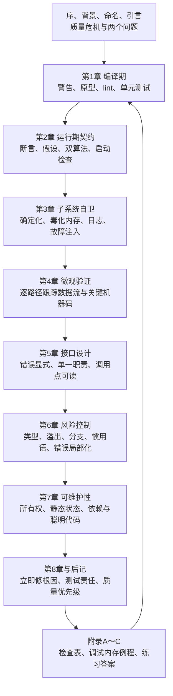

# 《编程精粹》：把 C 程序的错误变成可自动发现的事实

> **文本依据**：本文以用户提供的中文 EPUB《编程精粹：编写高质量C语言代码（英文版）》为主文本。封面署名 Stephen A. Maguire，书内序言署名 Steve Maguire；英文原名为 *Writing Solid Code: Microsoft's Techniques for Developing Bug-Free C Programs*。序言完成于 1992-10-22，英文原著出版于 1993 年。EPUB 书脊依次包含序、背景、命名约定、引言、8 章、后记、附录 A～C、参考文献和电子版整理说明。
>
> **内容标记**：**【原书】**表示书中明确提出的观点；**【原书改写】**表示保留原意、但修正排版或缩短后的代码；**【当前补充】**表示截至 2026-08-08 的现代 C 工程实践；**【纠正】**表示原书受 ANSI C、16/32 位微机或旧工具链限制，今天不宜原样采用的内容。EPUB 存在 `Return`、`chat`、`_LINE_` 等 OCR/录入错误，本文不会把这些错误当成 C 语法。

## 一、这本书真正讨论的不是语法，而是错误反馈回路

### 1.1 从作者的两个问题理解全书

【原书】序言交代了写作背景：作者在 Macintosh Excel 小组见到一种“主要用来对代码进行监视”的内部调试系统；后来微软因错误过多取消了一个尚未发布的产品，他遂把分散在老项目组中的质量经验写成书。引言把全书压缩成两个持续追问的问题：

> “怎样才能自动地查出这个错误？”
>
> “怎样才能避免这个错误？”

后记又把它收束成一句话：

> “决不允许同样错误出现两次。”

这里的“无错代码”不是数学意义上的零缺陷保证。作者在后记中明确承认无法百分之百保证程序没有错误；目标是把偶然的、依赖高手经验的排错，改造成尽早触发、能够复现、可重复执行的工程机制。

通俗地说，这本书要解决的是：C 给了程序员很大的自由，但编译成功只证明程序符合一部分语法规则，并不证明指针有效、整数未溢出、错误分支被处理或接口不易误用。与其等用户碰到崩溃，再靠调试者“猜”，不如让编译器、断言、子系统自检、测试和接口设计在错误进入主干以前就把它暴露出来。

### 1.2 从错误产生到组织学习的逻辑框架



这个回环很重要：附录 A 不是读完即弃的清单。一次真实缺陷应产生一条新的规则、测试或检查，使知识重新进入编译、接口、子系统和评审阶段。

### 1.3 与其他质量技术的关系

| 方法 | 主要观察对象 | 发现错误的时机 | 优势 | 单独使用时的盲区 |
| --- | --- | --- | --- | --- |
| 本书的“自动发现 + 主动预防” | 源码、接口、运行期不变量和开发习惯 | 编码到合入前 | 成本低，反馈快；把缺陷模式固化为机制 | 1993 年工具有限，覆盖不了并发、现代安全攻击面和全程序分析 |
| 黑盒与系统测试 | 外部输入和可观察输出 | 集成或交付前 | 接近真实用户行为，不依赖实现 | 很难证明内部状态正确；路径组合巨大，容易依赖运气 |
| 单元/属性/模糊测试 | 函数性质、边界和大量生成输入 | 开发与 CI | 可重复，适合回归与边界探索 | 测试预言、桩和覆盖范围仍可能错误 |
| 静态分析 | 不执行程序的控制流、数据流和规则 | 编译或 CI | 可发现跨路径的空指针、泄漏、未初始化和规范违规 | 存在误报；建模不完整时也会漏报 |
| Sanitizer 等动态分析 | 一次真实执行中的内存、未定义行为、线程行为 | 测试运行时 | 错误定位精确，特别适合 C/C++ 内存问题 | 只看被执行到的路径；有运行开销，通常不直接用于正式版 |
| 形式化方法 | 规范、模型和证明义务 | 设计到验证 | 在边界明确的模块上可提供强保证 | 规范和证明成本高，错误规范仍会证明出“正确的错误程序” |

这些方法不是互斥替代品。本书最有生命力的贡献，是把质量技术安排成层层收窄的漏斗：类型和警告先挡住廉价错误，接口让误用难以表达，断言与 Sanitizer 暴露内部违约，测试验证行为，评审和缺陷复盘再补上自动化规则。

## 二、从序言到附录的完整章节地图

| 顺序 | 原书标题 | 核心内容 | 问题与解决出口 |
| --- | --- | --- | --- |
| 序 | 写作缘起 | Excel 内部调试系统、微软扩张后的经验断层 | 把少数老项目掌握的质量经验变成可传播方法 |
| 背景 | 某些背景 | Macintosh、Windows、Excel、Word、80x86、680x0 | 帮助读者理解 1990 年代平台案例，不把平台细节误认为普遍结论 |
| 命名 | 命名约定 | 类匈牙利命名、指针前缀、`size_t` | 让读者读懂示例中的 `pch`、`pb`、`pv` 等名字 |
| 引言 | 两个关键问题 | 自动发现、预防错误、规则有例外、示例含故意错误 | 确立全书判断标准和阅读警告 |
| 第 1 章 | 假想的编译程序 | 全警告、函数原型、精确类型、lint、单元测试 | 让机器尽早发现合法但可疑的 C 代码 |
| 第 2 章 | 自己设计并使用断言 | 调试/交付版本、契约、假设、不可能状态、双算法、启动检查 | 将内部不变量变成运行时自动报警器 |
| 第 3 章 | 为子系统设防 | 内存毒化、释放后破坏、强制移动、日志、引用检查、故障注入 | 让随机、稀有、跨模块的内存错误稳定复现 |
| 第 4 章 | 对程序进行逐条跟踪 | 路径覆盖、数据流、源代码与汇编级观察 | 在提交前微观核对实际执行，而非等错误报告 |
| 第 5 章 | 糖果机界面 | 错误值、单一职责、明确参数、避免布尔开关、危险注释 | 设计“难以误用”的函数接口 |
| 第 6 章 | 风险事业 | 可移植类型、溢出、精确实现、特殊分支、危险惯用语 | 以显式、单一路径、低风险写法代替微优化技巧 |
| 第 7 章 | 编码中的假象 | 所有权、静态缓冲、寄生函数、语言滥用、可读性 | 拆穿“更快、更短、更聪明”却更脆弱的代码 |
| 第 8 章 | 剩下来的就是态度问题 | 不消失的错误、立即修根因、功能克制、测试责任、优先级 | 把质量从个人技巧提升为稳定的决策习惯 |
| 后记 | 走向何方 | 缺陷清单、差异检查、持续改进 | 每个错误都留下自动检查或预防措施 |
| 附录 A | 编码检查表 | 合入、实现、设计、修错四组问题 | 将全书原则变成评审入口条件 |
| 附录 B | 内存登录例程 | 分配块链表、大小查询、引用标记、指针确认 | 给第 3 章的调试内存管理思想提供参考实现 |
| 附录 C | 练习答案 | 第 1～7 章练习的推导与扩展示例 | 用优先级、断言、内存标记、接口和风险题补足正文 |
| 参考文献 | 资料来源 | Kernighan、Plauger、Knuth、Simonyi 等 | 指向写作风格、程序验证和命名法背景 |
| 整理说明 | 电子版来源说明 | 网友依据译本整理，少数字句调整 | 提醒读者 EPUB 并非出版社原生电子排版，录入错误需核对 |

## 三、按原书顺序建立高质量 C 的开发闭环

## 阶段一：先统一质量目标与代码语言

### 序：多功能调试系统为何比“漂亮代码”更让作者震动

【原书】作者加入 Macintosh Excel 小组时，首先注意到的不是某种精巧语法，而是类似飞机告警灯的内部调试系统。它持续监视代码状态，主动把错误告诉开发者。这个经历奠定了全书的核心：代码应该携带自证能力，而不是把所有质量责任推给外部测试员。

其适用场景远超桌面软件。数据库连接池可以自检借出/归还数量，网络协议栈可以验证状态迁移，编译器可以验证中间表示，嵌入式系统可以检查寄存器配置。共同点是子系统知道自己的不变量，外部黑盒测试却不知道。

### 某些背景：哪些是时代背景，哪些仍可迁移

原书案例来自 Windows 3.0、经典 Macintosh、MS-DOS、Intel 80x86 与 Motorola 680x0。Excel 和 Word 当时存在多套平台代码，Macintosh Excel 2.2 开始大量共享 Windows Excel 源码。今天的 CPU、操作系统保护、地址空间和构建工具已经改变，但“共享代码会同时放大质量收益与缺陷影响”仍然成立。

- **80x86**：Intel x86 处理器家族的早期统称；今天常见的是 x86-64。
- **680x0**：Motorola 68000 系列处理器，原书用它讨论对齐、字长和汇编级行为。
- **移植（porting）**：把软件迁到不同平台。第 8 章提醒，移植代码应当按新代码重新验证。

### 命名约定：从匈牙利前缀转向语义、所有权与单位

【原书】`ch` 表示字符，`b` 表示字节，`l` 表示长整数；加 `p` 表示指针，所以 `pch` 是字符指针、`ppch` 是字符二级指针。作者进一步用 `str` 表示零结尾字符串，并以 `To`、`From` 等标签区分参数。这是为了让读者不回看声明也能推断类型。

```c
/* 【原书风格】 */
char *strcpy(char *strTo, const char *strFrom);
void *pvResizeBlock(void *pv, size_t sizeNew);
```

【当前补充】现代 IDE 能直接显示静态类型，系统匈牙利命名（把底层类型编码进名字）在重构时容易过期。更可迁移的做法是让名字表达语义、所有权、长度单位和可空性：

```c
bool buffer_resize(struct buffer *buffer, size_t new_size_bytes);
```

这里 `buffer` 比 `pv` 更能表达对象含义，`new_size_bytes` 避免把元素个数误当字节数。对于 C，`size_t` 仍是表示对象大小和数组索引的标准无符号整数类型；不要假定它等于 `unsigned int`。

### 引言：规则有例外，但例外必须有理由

【原书】本书采用“给例子—指出问题—提出一般准则”的形式，同时先声明“每条准则都有例外”。这不是允许随意违背规则，而是要求偏离规则时能说明具体收益、风险和验证方法。

引言还有两条阅读警告：示例中有些错误是故意保留的；书内若干标准库同名函数被作者改过签名，不能直接复制进项目。本文同样把示例当作推理材料，不把“出现在书里”误当成“可生产使用”。

## 阶段二：把最便宜的错误挡在编译和单元测试阶段

### 第 1 章“假想的编译程序”：让合法但可疑的代码无法悄悄通过

#### 1. 从黑盒碰运气转向白盒自动检查

作者设想一种能直接报告差一错误、算法边界和分配失败的编译器。现实编译器做不到全部，但可以通过警告、原型、lint 和单元测试逐步逼近。最小原则是：能在编译期确定的错误，不要留到运行期；能自动重复的检查，不要依赖评审者每次记得。

【原书改写】下面代码中的循环体实际上是一个空语句：

```c
while (size-- > 0);  /* 多余分号 */
    *to++ = *from++;
```

书中建议把故意空循环写成 `NULL;` 以区别误输的分号。

【纠正】`NULL` 是空指针常量宏，不是“空语句”的专用拼写；现代编译器还可能报“语句无效果”。应直接写空复合语句并说明意图：

```c
while (device_is_busy()) {
    /* intentional spin; production code may need timeout/yield */
}
```

#### 2. 警告、原型与静态分析各管一层

【原书】函数原型能发现 `fputc(stderr, '\n')` 这种参数次序和类型错误；更精确的类型还能扩大检查范围。lint 则检查语法合法、却很可能错误或不可移植的结构。作者的工程建议是让主干始终保持“无 lint 错误”，修改者只需检查增量。

【纠正】原书为了强类型检查，把标准 `memchr` 的第二个参数从 `int` 改为 `unsigned char`。项目自有 API 可以采用领域类型，但标准库函数声明必须以 `<string.h>` 为准，不能自行重声明：

```c
void *memchr(const void *s, int c, size_t n); /* 标准接口的语义形态 */
```

今天还应打开原型、转换、遮蔽变量等警告。GCC/Clang 可从下面的基线开始，再按项目噪声和平台约束调整：

```sh
cc -std=c17 -Wall -Wextra -Wpedantic -Wconversion -Wshadow \
   -Wstrict-prototypes -Werror source.c
```

【当前补充】“打开所有警告”不等于机械开启每个实验性诊断。团队应固定一套可执行的警告基线，把 CI 中的该基线视为错误；确需抑制时，在最小范围内写明原因。否则升级编译器后，大量无关新警告会诱使团队整体关闭检查。

#### 3. 单元测试是合入条件，不是可选仪式

【原书】本章以有人未做单元测试、甚至未重新编译便合入为反例。改动“小”并不会降低验证价值，反而容易诱使人跳步骤。

一个针对边界的最小测试比“看起来正确”更有证据力：

```c
#include <assert.h>
#include <limits.h>

static unsigned magnitude_of_int(int value)
{
    /* 避免直接执行 -INT_MIN 的有符号溢出 */
    return value < 0 ? 0u - (unsigned)value : (unsigned)value;
}

static void test_magnitude(void)
{
    assert(magnitude_of_int(0) == 0u);
    assert(magnitude_of_int(-1) == 1u);
    assert(magnitude_of_int(INT_MIN) == (unsigned)INT_MAX + 1u);
}
```

- **lint**：早期 Unix 静态检查工具的名称，后来也泛指比编译器更深入的源码检查。
- **prototype（函数原型）**：声明返回类型和参数类型，使编译器能检查调用。
- **off-by-one error（差一错误）**：循环边界或索引相差 1，常见于 `<` 与 `<=`、长度与末元素下标混淆。
- **CI（Continuous Integration，持续集成）**：每次变更自动完成构建、分析和测试的流程。

局限在于，警告和静态分析只能推断其模型能表达的事实，单元测试也只验证执行到的输入。处理方式不是选一个“最强工具”，而是让多层检查互补。

## 阶段三：把内部假设写成可执行契约

### 第 2 章“自己设计并使用断言”：非法状态必须响亮失败

#### 1. 断言检查程序员违约，错误处理面对现实失败

【原书】作者区分调试版和交付版：调试版用于发现错误，可以携带昂贵检查；交付版用于满足用户的速度和体积要求。断言的对象是“按设计不应发生”的非法情况，而文件不存在、网络中断、用户输入错误和内存不足等正常运行环境中的失败，必须在正式版中处理。

```c
#include <assert.h>
#include <stddef.h>

void fill_bytes(void *destination, unsigned char value, size_t size)
{
    assert(destination != NULL || size == 0);
    /* 对有效输入执行工作；外部输入错误不能只靠 assert 处理。 */
}
```

若定义 `NDEBUG`，标准 `assert` 会被移除，因此断言表达式不能带必要副作用：

```c
/* 错误：发布版可能根本不读取字符。 */
assert((ch = getchar()) != EOF);
```

正确做法是先执行，再断言结果：

```c
ch = getchar();
assert(ch != EOF);
```

#### 2. 自定义宏必须是单条语句

原书展示了基于 `__FILE__`、`__LINE__` 和 `abort()` 的 `ASSERT` 宏。其 `if/else` 多语句形态在嵌套控制流中有悬空 `else` 风险。现代写法优先使用 `<assert.h>`；确需自定义日志时，至少使用 `do { ... } while (0)` 封装：

```c
#ifdef DEBUG
#include <stdio.h>
#include <stdlib.h>
#define CHECK_INVARIANT(condition)                                      \
    do {                                                                \
        if (!(condition)) {                                             \
            fprintf(stderr, "invariant failed: %s (%s:%d)\n",          \
                    #condition, __FILE__, __LINE__);                     \
            abort();                                                    \
        }                                                               \
    } while (0)
#else
#define CHECK_INVARIANT(condition) ((void)0)
#endif
```

`condition` 仍只能求值一次，且不应产生业务必须的副作用。

#### 3. 找出假设、不可达状态和第二种验证算法

本章要求每写一个函数都问：“我做了什么假设？”典型假设包括指针对齐、缓冲区不重叠、枚举值完整、表格按掩码顺序排列、压缩流一定完整。能消除的假设直接消除；不能消除的写成断言。

【原书】在反汇编程序案例中，正式算法按掩码表快速解码，调试版再用不同方式验证输出；启动时还扫描指令表，阻止错误表项一直潜伏。这引出两个实用模式：

- **双算法校验**：生产路径使用快算法，测试/调试路径使用简单、独立的参考算法比较结果。
- **启动检查**：对静态表、注册项、状态迁移表和生成数据做一次完整性验证。

不要用“防御性处理”把不可能状态静默改成某个默认值。那会使上游错误继续传播。可以在正式版安全降级，但调试版必须同时报警并保留诊断上下文。

- **assertion（断言）**：对内部不变量的可执行声明，失败通常说明程序缺陷。
- **invariant（不变量）**：在某个边界或生命周期阶段必须始终成立的条件。
- **undefined behavior（未定义行为，UB）**：C 标准不规定结果的行为；程序可能崩溃，也可能看似正常或被优化成意外结果。
- **defensive programming（防御式编程）**：面对无效输入或异常状态采取保护；若静默吞掉内部违约，也会掩盖根因。

## 阶段四：让子系统主动制造、记录并定位稀有故障

### 第 3 章“为子系统设防”：以内存管理器为例建立自检边界

#### 1. 本章识别的六类内存错误

原书从分配、释放和重分配外壳函数出发，集中处理：未初始化读取、释放后继续使用、遗失内存块、越界访问、遗漏错误处理，以及 `realloc` 移动后仍保留旧指针。这些错误的共同难点是它们依赖堆布局，看似“时有时无”。

#### 2. 把随机行为变成确定信号

【原书】调试版把新分配的内存填成固定的 `0xA3`，把即将释放的空间破坏掉；重分配时故意搬到新地址；用链表记录每个块的地址和大小。这样，未初始化读取、悬空指针和越界不再依赖旧内存“碰巧还可用”。

概念可以保留，但实现方式应更新：

```c
#include <stddef.h>
#include <stdlib.h>
#include <string.h>

static void *debug_malloc(size_t size)
{
    if (size == 0) {
        return NULL; /* 项目契约明确规定；不要依赖实现差异 */
    }
    void *block = malloc(size);
#ifdef DEBUG
    if (block != NULL) {
        memset(block, 0xA3, size); /* 只用于暴露未初始化读取 */
    }
#endif
    return block;
}
```

【纠正】“看到 `0xA3` 就证明错误”的推断并不可靠，业务数据也可能恰好相同；`free` 后再读取永远是 UB，不能因为旧字节仍在就认为安全；编译器还可能删除无可观察效果的清零。现代项目应优先让 AddressSanitizer 检测越界、释放后使用和部分泄漏，让 MemorySanitizer 检测未初始化读取（平台支持有限）。内存填充值适合作为附加诊断，不是内存安全证明。

#### 3. 日志、引用遍历与故障注入

附录 B 的 `blockinfo` 链表记录起始地址、长度和“是否被引用”。调试检查先清空所有引用标记，再遍历符号树、宏、缓存等根对象标记可达块，最后报告未标记块。它实际上是一个项目内的简化可达性检查器。

本章还建议人为制造内存不足：例如按“成功 5 次、失败 7 次”的模式让分配器返回失败，使罕见错误分支频繁执行。今天可以把它实现成可注入的分配器，而不是在全局 `malloc` 周围隐藏魔法：

```c
#include <stddef.h>

struct allocator {
    void *(*allocate)(size_t size, void *context);
    void (*deallocate)(void *block, void *context);
    void *context;
};
```

测试替身可按确定序号失败，正式版绑定系统分配器。失败计划和随机种子必须记录，确保 CI 失败可重现。

#### 4. 子系统自检的迁移方法

把内存案例迁移到其他领域，可以得到同一套模板：

1. 列出调用者最常犯的错误。
2. 在子系统边界验证输入和状态迁移。
3. 保存足以核对一致性的调试元数据。
4. 主动制造超时、断连、容量耗尽等稀有事件。
5. 提供一次全量完整性检查，并在测试中高频调用。
6. 调试成本与正式版成本分开权衡。

- **poisoning（毒化/填毒）**：用醒目的模式覆盖未初始化或失效区域，使误用更容易暴露。
- **dangling pointer（悬空指针）**：指向生命周期已经结束对象的指针。
- **fault injection（故障注入）**：受控制造分配失败、I/O 错误、超时等故障，验证恢复路径。
- **reachability（可达性）**：从已知根对象沿引用能否到达某块内存；不可达且未释放的块可能是泄漏。

## 阶段五：沿真实路径观察数据怎样变化

### 第 4 章“对程序进行逐条跟踪”：在错误发生前做微观验证

【原书】“逐条跟踪”不是收到 bug 后才单步调试，而是代码完成后主动走过每一条路径，观察控制流和数据流。即使 `malloc` 失败分支难以自然触发，也应借助第 3 章的故障注入执行它。

检查时重点观察：

- 循环边界和指针何时越过末端；
- 有符号/无符号转换、截断、上溢和下溢；
- `NULL`、未初始化值和毒化值的传播；
- `=` 与 `==`、优先级和逻辑条件；
- 每个返回点是否保持输出和资源不变量。

原书提醒，源级调试器可能隐藏机器层细节；关键代码应查看汇编。今天这仍适用于原子操作、加密常量时间代码、SIMD、ABI 边界和性能热点。但普通业务函数不必逐条手工看汇编：先用测试覆盖率找未执行路径，用 Sanitizer 执行边界输入，用编译器生成的汇编或反汇编只检查确有机器级风险的部分。

【当前补充】优化会改变变量位置、内联和指令顺序。关闭优化便于初步调试，但还必须至少测试一次接近发布配置的优化构建；只在 `-O0` 正常并不能证明 `-O2` 下没有 UB。

- **control flow（控制流）**：分支、循环、调用和返回构成的执行路径。
- **data flow（数据流）**：值从定义、转换到使用的传播过程。
- **ABI（Application Binary Interface，应用二进制接口）**：调用约定、数据布局和链接符号等二进制层契约。

逐条跟踪的局限是人工成本随路径数爆炸。解决方案是把发现的不变量转成断言，把路径转成自动测试，把数据范围交给静态分析与 Sanitizer；手工跟踪聚焦高风险和新改动。

## 阶段六：让错误在接口层就难以表达

### 第 5 章“糖果机界面”：按钮越含糊，误操作越自然

章节标题来自糖果机式的直觉接口：调用者应一眼知道怎样操作，且不容易忽略失败。作者以 `getchar` 把字符和 `EOF` 混在同一 `int` 返回值、`realloc` 容易丢失旧指针为反例。

#### 1. 状态与数据分离

下面的接口把正常字符和错误类别分开，调用者无法在不检查状态的情况下直接拿到返回字符：

```c
#include <stdio.h>

enum read_status {
    READ_OK,
    READ_END,
    READ_ERROR
};

enum read_status read_byte(FILE *stream, unsigned char *output)
{
    if (stream == NULL || output == NULL) {
        return READ_ERROR;
    }

    int value = fgetc(stream);
    if (value == EOF) {
        return feof(stream) ? READ_END : READ_ERROR;
    }

    *output = (unsigned char)value;
    return READ_OK;
}
```

这里仍需文档说明：只有 `READ_OK` 时 `*output` 才被写入，`stream` 的所有权不转移。

#### 2. 拆分多功能接口，减少布尔和魔法值

【原书】`realloc` 同时承担分配、扩容、缩容和释放等语义，参数组合多，断言难写。作者主张拆为 `ShrinkMemory` 等单一功能函数。类似地：

```c
/* 含糊：调用点看不出 true 的语义。 */
format_unsigned(value, output, true);

/* 清晰：意图进入函数名。 */
format_unsigned_decimal(value, output, output_size);
```

枚举通常比布尔开关更能扩展语义，但若一个函数因模式不同走完全不同的流程，拆函数更好。函数参数也要明确单位、范围、是否允许空指针、缓冲区容量和所有权。

#### 3. “永不失败”不是忽略失败

作者建议在有效输入下尽量设计不会失败的函数，例如只对 `'A'`～`'Z'` 调用的转换函数可以用断言约束前置条件。现代实践还可以由调用者提供缓冲区，避免函数内部临时分配；或在初始化阶段预留资源，把运行时失败局部化。

但不能靠返回假数据宣称成功。不可避免的 I/O、内存和外部服务失败应使用明确状态返回；安全关键代码还要说明失败后的对象是否保持原值。

- **sentinel value（哨兵值）**：占用正常返回类型的特殊值，如 `EOF`；若值域重叠或调用者易忽略，会形成接口陷阱。
- **precondition（前置条件）**：调用前必须成立的条件。
- **ownership（所有权）**：谁负责对象生命周期、释放和修改的契约。
- **reentrant（可重入）**：函数在并发或嵌套调用中不依赖会互相覆盖的共享可变状态。

注释可以警告危险，但不能替代良好接口。API 一旦广泛发布难以修改时，可添加安全包装器，逐步弃用旧入口，并用静态分析规则禁止新代码继续调用。

## 阶段七：消除类型、边界和分支中的隐性风险

### 第 6 章“风险事业”：正确算法也会败给 C 的表示细节

#### 1. 类型的大小、符号和范围不能靠印象

【原书】`char` 是否有符号、位域布局和整数宽度可能随实现变化。例如把 `0xff` 存进普通 `char` 再与整数 `0xff` 比较，结果取决于 `char` 的符号性和整数提升。今天应使用 `<stdint.h>` 的精确宽度类型表达协议/文件布局，使用 `size_t` 表达对象大小，普通文本字符则依据库函数契约转换为 `unsigned char` 后再处理。

```c
#include <ctype.h>

int ascii_like_lower(int ch)
{
    /* ctype 函数只接受 EOF 或可表示为 unsigned char 的值。 */
    return tolower((unsigned char)ch);
}
```

精确宽度类型不是万能药：`uint32_t` 只在实现提供恰好 32 位无填充的整数类型时存在；数组大小和指针差仍应使用 `size_t`/`ptrdiff_t`。

#### 2. 每次计算都问能否溢出

【原书】`itoa` 先执行 `i = -i`，在最小负数上无法得到同类型正值。今天仍必须牢记：无符号运算按模回绕，有符号溢出是 UB。

分配数组前先验证乘法：

```c
#include <stdint.h>
#include <stdlib.h>

void *allocate_array(size_t count, size_t element_size)
{
    if (element_size != 0 && count > SIZE_MAX / element_size) {
        return NULL;
    }
    return malloc(count * element_size);
}
```

还要检查加法、指针差转整数、窄化转换和中间表达式的类型。不要只确认最终变量“够大”；溢出可能早已发生在较窄的中间运算中。

#### 3. 精确实现设计，每个特殊情况只处理一次

本章反对用近似算法代替明确需求，也反对一个任务有多条重复路径。重复处理负号、末尾元素或根窗口会制造两个稍有差异的真相。作者把 `if` 视作重新审视设计的信号：它可能是真实业务分支，也可能说明数据结构迫使代码反复处理特殊情况。

这不意味着追求“零 if”。【纠正】安全边界检查本身不可删除；为消除分支而使用更晦涩的位运算或未验证表索引，风险更高。应消除的是无意义分叉、重复实现和嵌套条件表达式。

#### 4. 不用危险惯用语换取未经测量的速度

原书批评倒序无符号循环、混合运算符、嵌套 `?:`、用移位替代乘除和依赖优先级表的表达式。现代优化器通常能从清楚的 C 生成同样或更好的机器码：

```c
/* 清楚：括号直接表达计算设计。 */
unsigned midpoint = lower + (upper - lower) / 2u;
```

若 `lower <= upper`，这个形式还避免 `lower + upper` 的加法溢出。性能优化应有基准、剖析结果、目标平台和回归测试，而不是凭“行数更少”推断更快。

#### 5. 把错误处理局部化

作者建议尽量避免调用可能失败的函数；无法避免时，把资源获取与回滚集中在一处。现代 C 常用单一清理出口：

```c
#include <stdio.h>
#include <stdlib.h>

int process_file(const char *path)
{
    int result = -1;
    FILE *file = fopen(path, "rb");
    unsigned char *buffer = NULL;

    if (file == NULL) goto cleanup;
    buffer = malloc(4096);
    if (buffer == NULL) goto cleanup;

    /* ...处理并在成功时设置 result = 0... */

cleanup:
    free(buffer);       /* free(NULL) 合法 */
    if (file != NULL) fclose(file);
    return result;
}
```

`goto cleanup` 在这里不是任意跳转，而是让所有失败路径共享逆序释放逻辑。更复杂的对象应提供成对的初始化/销毁 API，保证部分初始化也能安全销毁。

- **integer promotion（整数提升）**：较小整数类型参与表达式时先转换为 `int` 或 `unsigned int` 的规则。
- **bit-field（位域）**：结构体中按位宽声明的成员；布局、对齐和部分符号行为具有实现相关性，不适合作为可移植线协议布局。
- **narrowing conversion（窄化转换）**：把值转换到范围更小的类型，可能截断或改变符号。
- **profiling（性能剖析）**：测量程序把时间或资源花在哪里，为优化提供证据。

## 阶段八：拒绝“聪明代码”制造的假象

### 第 7 章“编码中的假象”：可工作不等于拥有、可维护或可移植

#### 1. 只写入自己拥有且仍在生命周期内的存储

【原书】一个优化版搜索函数把目标值临时写到搜索区末端作为哨兵，以省掉循环边界比较；这会越界写入不属于自己的字节。即使稍后恢复原值，也可能碰到只读内存、别的对象或内存映射 I/O。正确做法是保留显式边界。

同样，释放窗口树时必须先保存下一个兄弟指针，再释放当前节点；不能释放后从已失效对象读取 `next`。释放后把某个局部指针设为 `NULL` 只清除了一个别名，不能自动修复其他悬空指针。

#### 2. 输出数据与工作缓冲区分离

原书展示了把整数转字符串函数的临时缓冲放到调用者输出区，导致调用者缓冲不足；随后又展示静态内部缓冲，导致下一次调用覆盖上一次结果。现代接口应让调用者传入容量，或先查询所需长度：

```c
#include <stdbool.h>
#include <stdio.h>

bool format_unsigned(char *output, size_t capacity, unsigned value)
{
    if (output == NULL || capacity == 0) return false;
    int written = snprintf(output, capacity, "%u", value);
    return written >= 0 && (size_t)written < capacity;
}
```

这个函数没有隐藏的静态可变状态，可重入，也明确报告截断。安全要求更高时，可把“所需长度”作为输出，便于调用者扩容。

#### 3. 不写依赖另一函数内部实现的“寄生函数”

书中的 `FILL` 先写一个字节，再调用本来用于复制的 `CMOVE` 让字节扩散。它依赖 `CMOVE` 的复制方向和重叠行为，一旦实现改变便失败。模块只应依赖公开契约，不能依赖支持函数当前“碰巧怎样写”。

#### 4. 语言技巧和代码压缩不是优化证据

作者反对把比较结果塞进算术、靠函数内部偏移跳转、把多行状态更新压成一行。短代码可能生成更慢机器码，也更难评审。真正的目标是让一般水平的维护者准确预测行为。

【当前补充】这也适用于宏元编程、编译器扩展和无锁技巧：若确实需要，必须隔离在窄模块内，给出内存模型/ABI 前提、基准和专门测试；不要让整个代码库承担认知成本。

- **memory-mapped I/O（内存映射 I/O）**：通过特定地址读写硬件寄存器；一次看似普通的读取也可能触发设备副作用。
- **alias（别名）**：多个表达式或指针引用同一对象；释放或修改一个路径会影响其他路径。
- **static storage duration（静态存储期）**：对象贯穿整个程序运行期存在，不代表并发访问自动安全。
- **implementation detail（实现细节）**：契约未承诺、调用者不应依赖的内部行为。

## 阶段九：用团队态度保证前八章不会被进度吞掉

### 第 8 章“剩下来的就是态度问题”：错误不会自己消失

#### 1. 立即定位根因，而不是修补症状

【原书】错误报告暂时不能复现，不等于错误被修好。应检查版本历史、恢复旧构建、保存输入与环境，直到解释“为什么以前失败、现在不失败”。今天还应保存崩溃转储、提交哈希、编译器版本、配置、随机种子和 Sanitizer 日志。

修复时继续问：当前故障是根因，还是更大问题的症状？一次空指针崩溃可能来自对象生命周期错误；简单加 `if (pointer == NULL) return;` 也许只让数据丢失变得无声。

#### 2. 不为清理、冷门功能和任意灵活性制造缺陷面

作者反对无收益地整理已经工作的代码、实现没有产品战略价值的功能，以及免费加入“以后也许有用”的灵活性。这里不是禁止重构，而是要求重构有目标、有测试、有独立变更范围。安全修复、降低复杂度和为明确需求铺路的重构都有价值；与当前任务混在一起的顺手改写则扩大回归面。

#### 3. 程序员对测试自己的代码负首要责任

测试团队提供独立视角，不是开发者跳过单元测试的理由。书中还提醒不要责怪发现错误的测试员；“轻微”错误的存在可能说明过程缺口。现代团队应把复现用例先固化为失败测试，再修改实现，最后检查相同缺陷模式是否存在于其他模块。

#### 4. 建立明确优先级

原书对比两个优先级表：一个把局部效率、大小和个人方便放得过高，另一个把正确性、可测试性、全局效率、可维护性和一致性放在前面。对大多数通用软件，可采用下面的默认次序：

1. 安全性、数据完整性与正确性。
2. 可测试性、可诊断性与可恢复性。
3. 清晰性、可维护性与接口一致性。
4. 经测量的全局性能和资源目标。
5. 局部微优化与个人风格偏好。

实时系统等场景会把硬时限提升为正确性的一部分，这正是“每条准则都有例外”的正确用法：改变优先级时说明约束，并以测量和测试证明。

### 后记“走向何方”：每个缺陷都要改变系统

作者回忆一次误删源码行并合入的错误。此后他在合入前检查源码差异，五年里又拦住了三次重大错误。今天对应的做法是：小提交、强制 diff、自审、代码评审、分支保护和 CI。缺陷复盘至少留下一个产物：

- 新的编译器/静态分析规则；
- 一个最小回归测试或模糊测试语料；
- 一个更难误用的接口；
- 一条可执行的不变量检查；
- 一项构建、评审或发布门禁。

否则团队只是“修过这次”，没有兑现“决不允许同样错误出现两次”。

## 阶段十：把附录变成日常工具

### 附录 A“编码检查表”：压缩成四道门禁

原表很长，可按使用时机重组：

| 门禁 | 必问问题 |
| --- | --- |
| 设计 API 时 | 错误是否混入正常值？参数是否含糊？职责是否过多？所有权、范围、失败后状态是否明确？ |
| 实现函数/子系统时 | 有哪些假设、UB、溢出、随机性、资源生命周期和特殊分支？能否用断言、自检或第二算法验证？ |
| 合入主干前 | 全警告和静态分析是否通过？所有路径和单元测试是否执行？diff 是否只含预期改动？危险代码是否有说明？ |
| 修复缺陷时 | 是否能稳定复现？找到了根因还是症状？是否补了自动回归检查？同类模式是否扫描全库？ |

检查表的局限是容易仪式化。每一项应尽量映射到工具输出或可展示证据；不适用项记录理由，而不是机械打勾。

### 附录 B“内存登录例程”：理解思想，不复制旧实现

附录 B 给出 `block.h`/`block.c`，核心结构 `BLOCKINFO` 维护单向链表，记录块地址、长度和引用状态；`sizeofBlock` 查询大小，`ClearMemoryRefs`、`NoteMemoryRef`、`CheckMemoryRefs` 完成可达性核对，`fValidPointer` 验证地址区间。

这份代码承载了第 3 章思想，但 EPUB 中存在 `blocinfo`、错误成员名、括号和条件录入问题，算法也是单线程、线性查找的教学实现。不要复制到生产环境。今天优先组合系统分配器、ASan/LSan、平台调试堆和专门内存分析器；只有领域对象需要额外不变量时，再实现小而清晰的调试元数据层。

### 附录 C“练习答案”：正文之外的关键补充

附录按第 1～7 章给出答案，第 8 章没有练习。它补充了运算符优先级警告、`defined(...)` 预处理判断、带消息断言、枚举 `default` 断言、不同内存毒值、块边界哨兵、引用次数/类型、确定性故障注入、接口返回设计、布尔比较、释放树时先保存后继等内容。

答案中仍有电子版录入错误，也有 1990 年代平台假设。正确读法是复现其推理：先指出具体失效条件，再设计机器可执行的检查，而不是背答案代码。

### 参考文献与电子版说明

原书参考文献支撑了 Knuth 的程序信心、Kernighan/Plauger 的示例—规则写法和 Simonyi 的匈牙利命名背景。EPUB 最后一单元说明该电子书由网友依据译本整理，极少数字句调整。涉及签名、标准行为或可编译代码时，应再以 C 标准和实现文档核对。

## 四、当前可执行的 C 质量环境

下面是一套不依赖大型测试框架的最小环境。示例以 C17 保持广泛兼容；采用 C23 特性时，把标准选项改为工具链支持的 `c23`/`c2x`，并先确认编译器版本。

### 4.1 安装编译器与构建工具

Windows 可在 PowerShell 中安装 LLVM、CMake 和 Ninja：

```powershell
winget install --exact --id LLVM.LLVM
winget install --exact --id Kitware.CMake
winget install --exact --id Ninja-build.Ninja
```

安装后重新打开终端，确认：

```powershell
clang --version
cmake --version
ninja --version
```

Ubuntu/Debian：

```sh
sudo apt update
sudo apt install --yes clang cmake ninja-build
```

macOS 可先安装 Apple Command Line Tools：

```sh
xcode-select --install
```

然后从 CMake 官方发行包或可信包管理器安装 CMake/Ninja。安装命令会随平台发行版变化，CI 应固定镜像或工具版本。

### 4.2 建立最小项目

目录：

```text
solid-c/
├── CMakeLists.txt
├── src/
│   └── checked_math.c
└── tests/
    └── checked_math_test.c
```

`src/checked_math.c`：

```c
#include <stdbool.h>
#include <stddef.h>
#include <stdint.h>

bool checked_size_multiply(size_t left, size_t right, size_t *result)
{
    if (result == NULL) return false;
    if (right != 0 && left > SIZE_MAX / right) return false;
    *result = left * right;
    return true;
}
```

`tests/checked_math_test.c`：

```c
#include <assert.h>
#include <stdbool.h>
#include <stddef.h>
#include <stdint.h>

bool checked_size_multiply(size_t, size_t, size_t *);

int main(void)
{
    size_t value = 0;
    assert(checked_size_multiply(3, 7, &value));
    assert(value == 21);
    assert(!checked_size_multiply(SIZE_MAX, 2, &value));
    assert(!checked_size_multiply(1, 1, NULL));
    return 0;
}
```

`CMakeLists.txt`：

```cmake
cmake_minimum_required(VERSION 3.20)
project(solid_c LANGUAGES C)

set(CMAKE_C_STANDARD 17)
set(CMAKE_C_STANDARD_REQUIRED ON)
set(CMAKE_C_EXTENSIONS OFF)

add_executable(checked_math_test
  src/checked_math.c
  tests/checked_math_test.c
)

if(CMAKE_C_COMPILER_ID MATCHES "Clang|GNU")
  target_compile_options(checked_math_test PRIVATE
    -Wall -Wextra -Wpedantic -Wconversion -Wshadow
    -Wstrict-prototypes -Werror
  )
endif()

enable_testing()
add_test(NAME checked_math COMMAND checked_math_test)
```

### 4.3 先做严格构建，再做 Sanitizer 构建

```sh
cmake -S . -B build -G Ninja -DCMAKE_BUILD_TYPE=Debug
cmake --build build
ctest --test-dir build --output-on-failure
```

Clang/GCC 的 AddressSanitizer 与 UndefinedBehaviorSanitizer 构建：

```sh
cmake -S . -B build-sanitize -G Ninja \
  -DCMAKE_BUILD_TYPE=Debug \
  -DCMAKE_C_FLAGS="-fsanitize=address,undefined -fno-omit-frame-pointer"
cmake --build build-sanitize
ctest --test-dir build-sanitize --output-on-failure
```

Sanitizer 测试与优化发布构建都要保留：前者扩大运行期诊断，后者捕捉只在实际优化和配置中暴露的问题。不要把 Sanitizer 二进制直接当正式交付物，除非平台、性能和运行库部署均经过专门评估。

### 4.4 把本书两问落实为 CI 顺序


失败应保留编译器版本、完整命令、提交哈希、测试输入和随机种子。只有可复现的失败，才能稳定转化为下一条自动检查。

## 五、从 1993 年方法迁移到现代工具链

| 原书机制 | 今天的直接继承 | 现代增强 | 不能被工具替代的判断 |
| --- | --- | --- | --- |
| 打开编译器可选警告 | `-Wall -Wextra` 等项目基线、警告即错误 | Clang/GCC 数据流诊断、跨翻译单元静态分析 | 哪些告警是真风险、抑制边界在哪里 |
| lint | clang-tidy、Clang Static Analyzer、商业分析器 | CERT C/MISRA C 规则、定制检查 | 规则是否适合项目平台和风险模型 |
| ASSERT 与 DEBUG 版 | `<assert.h>`、项目契约宏 | ASan、UBSan、TSan、硬化构建 | 哪些是内部违约，哪些必须正式处理 |
| 内存填毒和分配日志 | 调试分配器 | ASan/LSan、Valgrind 类工具、故障注入 | 对象所有权和领域不变量如何定义 |
| 逐路径跟踪 | 调试器、覆盖率、单元测试 | 属性测试、模糊测试、符号执行 | 哪些路径和数据最关键 |
| 第二算法验证 | 参考实现、差分测试 | 多实现交叉验证、模型检查 | 两个算法是否真正独立，预言是否可信 |
| 启动完整性检查 | 配置/表结构验证 | Schema、生成期校验、签名和校验和 | 失败时应拒绝启动还是降级 |
| 合入前检查变更 | `git diff`、评审、分支保护 | CI 门禁、变更风险分析 | 变更范围是否符合需求 |

更加主流的现代方案不是一本书的“替代品”，而是对其反馈回路的自动化扩展：

- **Sanitizer** 适合把内存越界、释放后使用和 UB 变成带栈信息的确定失败。
- **模糊测试（fuzzing）** 适合解析器、协议、编解码器和输入边界，自动探索作者当年只能靠“猴子程序”随机轰炸的空间。
- **属性测试** 不只列举样例，而是声明排序后有序、编码再解码不变等性质。
- **CERT C / MISRA C** 把高风险语言用法整理成可审计规范；安全、汽车、工业等领域可按合规要求选用。
- **Rust、SPARK 等内存/类型约束更强的语言** 能从语言层减少部分 C 缺陷，但 FFI、`unsafe`、需求错误、错误接口和组织态度仍需要本书的方法。已有 C 系统也通常只能渐进迁移。

最终应形成一个习惯：每当看到缺陷，不只问“哪一行要改”，还要问“为什么类型、接口、断言、分析和测试都没更早拦住它”。后一个问题的答案，才是这本三十多年前的书今天仍值得精读的原因。

## 六、来源与版本核验

- Stephen A. Maguire，*Writing Solid Code: Microsoft's Techniques for Developing Bug-Free C Programs*；本文主文本为用户提供的中文 EPUB《编程精粹：编写高质量C语言代码（英文版）》，核对日期：2026-08-08。
- [ISO/IEC 9899:2024 — Programming languages — C](https://www.iso.org/standard/82075.html)：当前 C 标准目录页，用于核对 C23 的正式标准版本。
- [GCC Warning Options](https://gcc.gnu.org/onlinedocs/gcc/Warning-Options.html)：警告选项的官方定义；核验日期：2026-08-08。
- [Clang AddressSanitizer](https://clang.llvm.org/docs/AddressSanitizer.html) 与 [UndefinedBehaviorSanitizer](https://clang.llvm.org/docs/UndefinedBehaviorSanitizer.html)：动态诊断能力、编译选项和限制；核验日期：2026-08-08。
- [Clang Static Analyzer](https://clang.llvm.org/docs/ClangStaticAnalyzer.html)：静态分析能力与调用方式；核验日期：2026-08-08。
- [CMake Tutorial](https://cmake.org/cmake/help/latest/guide/tutorial/)：现代 CMake 构建入口；核验日期：2026-08-08。
- [SEI CERT C Coding Standard](https://wiki.sei.cmu.edu/confluence/display/c/SEI+CERT+C+Coding+Standard)：现代 C 安全编码规则体系；核验日期：2026-08-08。
