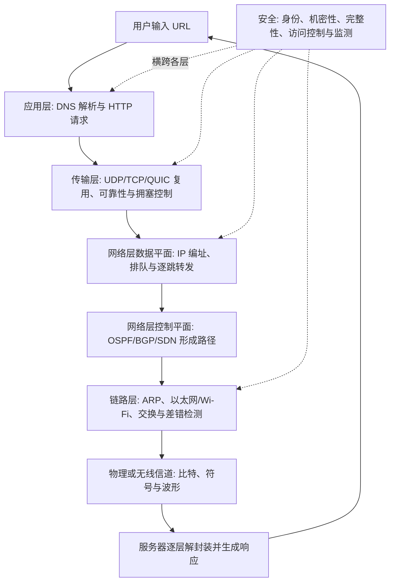
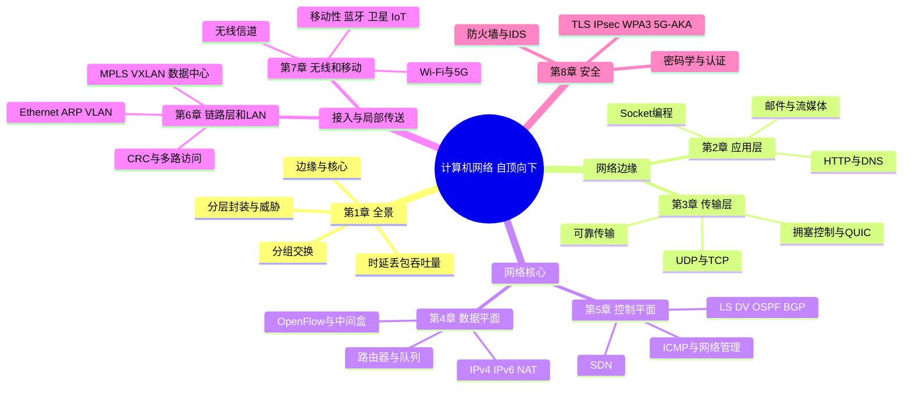
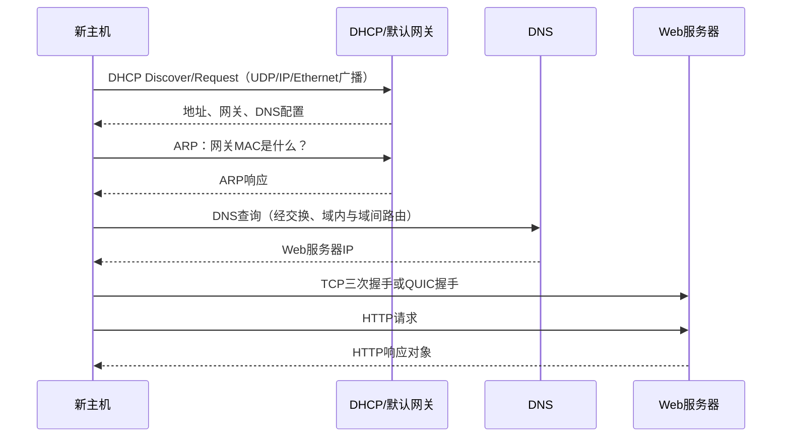

# 《计算机网络：自顶向下方法（第9版）》深度阅读

> **书目信息**：James F. Kurose、Keith W. Ross，_Computer Networking: A Top-Down Approach, 9th Edition_，Pearson，2026；ISBN 978-0-13-542933-4。题目提供的 PDF 是 717 页中英对照中文学习版，包含前言、8 章正文、习题、实验、访谈、参考文献和索引。
>
> **文本依据**：本文逐章核对本地 PDF。`【原书】`表示第 9 版正文的观点、公式或短代码；`【版本变化】`表示作者在前言中明确列出的修订；`【实践补充】`表示为 2026 年常见工具链添加的实验和工程边界。后两类内容不冒充原书结论。
>
> **译文校正**：学习版由机器辅助翻译生成，个别位置把“自顶向下”译为“自上而下”，把 HTTP/3 写作“HTTP 3”，也出现章节号混入页码等排版错误。本文以同页英文正文和标准协议名称校正。IETF 标准中的 QUIC 已是协议专名，不应再强行展开为早期 Google 名称；`MAC` 在第 6 章指介质访问控制，在第 8 章又可指消息认证码，必须结合语境判断。

## 一、全书在解释什么

### 1.1 从官方定义到直观理解

第 1 章先从组成结构定义互联网：

> “互联网是一个互联了遍及全世界的数十亿计算设备的计算机网络。”（第 1.1.1 节，依英文正文校正数量表述）

书中又从服务角度描述互联网：它是“为分布式应用程序提供服务的基础设施”。这两个定义分别回答“它由什么组成”和“它为什么存在”：前者包括端系统、通信链路、分组交换机和相互连接的 ISP；后者强调 Web、消息、视频、游戏、云服务等应用并不自己铺设全球线路，而是通过套接字接口请求网络传送数据。

贯穿全书的另一个定义是协议：

> “协议定义了在两个或多个通信实体之间交换的报文格式和次序，以及在报文发送和/或接收或发生其他事件时所采取的动作。”（第 1.1.3 节）

通俗地说，网络解决的是两个相隔很远、实现可能完全不同的程序如何可靠协作。协议像一份双方都执行的对话规则：先说什么、消息长什么样、多久没收到算失败、失败后如何恢复。分层则把一个巨大问题拆成局部合同：HTTP 关心资源语义，TCP 或 QUIC 关心端到端传送，IP 关心跨网络寻路，以太网或 Wi-Fi 关心一段链路上的帧，物理层最终把比特变成电、光或无线电波。

### 1.2 为什么从应用层向下读

前言明确说明，传统教材常从物理层向应用层讲，而本书从应用层开始。作者给出三个教学理由：应用层是 Web、流媒体等创新最活跃的区域；学生先理解每天使用的应用更容易建立动机；套接字编程能让服务模型和协议概念很早就变得可操作。

这个顺序还隐含了一种工程方法：**先写清楚应用需要什么服务，再判断下一层能提供什么保证**。例如视频会议更关心低延迟，文件下载更关心完整性；应用需求不同，传输协议、缓存策略、拥塞控制和部署位置就不应相同。

### 1.3 一次请求贯穿全书的逻辑框架





### 1.4 五层模型中的数据怎样变形

| 层次 | 本层数据单元 | 典型标识 | 典型协议或设备 | 本层主要承诺 |
| --- | --- | --- | --- | --- |
| 应用层 | 报文（message） | URL、域名、资源路径 | HTTP、DNS、SMTP、DASH、应用进程 | 规定业务消息的语义和对话顺序 |
| 传输层 | 报文段（segment）；UDP 常称数据报 | 端口、连接/流 ID | TCP、UDP；位于 UDP 之上的 QUIC | 进程到进程交付，可选可靠性、流控和拥塞控制 |
| 网络层 | 数据报（datagram） | IP 地址、前缀 | IPv4、IPv6、路由器 | 尽力而为地把包跨多个网络送向目标主机 |
| 链路层 | 帧（frame） | MAC 地址、VLAN ID | Ethernet、802.11、交换机、ARP | 在一条链路或一个局域网内传送，检测局部差错 |
| 物理层 | 比特/符号/波形 | 频率、相位、振幅 | 铜缆、光纤、无线电 | 在介质上传播信号 |

发送端逐层加首部称为**封装**，接收端逐层去首部称为**解封装**。同一份应用数据经过不同层时名称不同，因为每一层观察的是不同合同。交换机通常根据链路层字段工作，路由器通常根据网络层字段工作，服务器进程最终根据传输端口和应用协议处理内容。

### 1.5 与其他组织方式和网络方案的比较

| 比较对象 | 层次/关注点 | 优势 | 局限或适用边界 |
| --- | --- | --- | --- |
| 本书的 Internet 五层模型 | 应用、传输、网络、链路、物理；以真实互联网协议为主 | 理论和部署对应紧密，便于用抓包验证 | 表示、会话等能力合并进应用层，概念边界不如 OSI 细 |
| TCP/IP 四层模型 | 应用、传输、网际、网络接入 | 接近操作系统协议栈和工程文档，简洁 | 链路与物理合并，不利于单独分析信道问题 |
| OSI 七层模型 | 应用、表示、会话、传输、网络、数据链路、物理 | 服务、接口和协议的概念划分清楚 | 完整 OSI 协议族未成为公共互联网主流；七层常被误当作所有实现的硬边界 |
| 传统自底向上教材 | 先信号、编码和链路，再到应用 | 硬件和通信理论依赖关系自然 | 学习早期难把底层机制与应用需求连接起来 |
| 电路交换网络 | 先预留端到端资源 | 性能可预测，持续业务易获得固定带宽 | 突发数据空闲时仍占资源，扩展和利用率受限 |
| 分组交换互联网 | 按包统计复用，共享链路 | 对突发业务利用率高，端系统和网络可独立演化 | 排队导致可变时延和丢包，默认尽力而为不保证带宽 |

结论不是“五层一定优于七层”，而是本书选择了最适合解释现实互联网的抽象。OSI 更像精细词典，TCP/IP 四层更像工程速记，五层模型在两者之间：既保留物理与链路差异，又不把互联网并未独立实现的会话层、表示层硬拆出来。分组交换的优势也不是无条件更快，而是更适合大量间歇、突发且规模持续变化的数据通信。

### 1.6 第 9 版相对旧版更新了什么

| 章节 | 作者在前言中明确说明的第 9 版变化 | 为什么重要 |
| --- | --- | --- |
| 第1章 | 更新互联网覆盖范围；强调从多层 ISP 拓扑转向超大规模数据中心和靠近用户的 CDN | 今天的流量路径越来越可能较早进入云厂商或内容网络，而非穿越完整公共层级 |
| 第2章 | 新增 HTTP/3 与 QUIC；更新 CDN 和 OTT 流媒体 | 应用协议开始直接影响连接建立、加密和多流并发体验 |
| 第3章 | 保留可靠传输主线；增加 BBR 等基于测量时延和吞吐量的拥塞控制；补完 QUIC | “丢包就是拥塞”不再是唯一控制信号，传输能力也可在用户空间演化 |
| 第4章 | 重组互联网架构原则，继续讨论中间盒 | NAT、防火墙和代理说明现实网络并非只有纯粹端到端转发 |
| 第5章 | 全面更新 SDN，加入 Google Orion 案例和控制软件化；精简 SNMP | 控制逻辑从盒内协议进程走向可编程、逻辑集中的软件系统 |
| 第6章 | 新增 VXLAN，更新数据中心网络 | 二层逻辑网络需要跨三层基础设施扩展到大规模虚拟化环境 |
| 第7章 | 全书改动最大：扩展无线物理层、Wi-Fi 6、5G RAN/核心网、调度、节能、移动性、蓝牙、LEO 和 IoT | 无线已从“高级专题”变成绝大多数用户的默认接入方式 |
| 第8章 | 新增 TLS 1.3、WPA3、Wi-Fi 与 5G 鉴权和密钥协商 | 安全不再是应用末端补丁，而是接入、传输和运营的共同基础 |

## 二、八章各自完成哪一段通信

| 章节 | 标题与范围 | 核心内容 | 提出的问题与解决方案 |
| --- | --- | --- | --- |
| 前言 | 方法、读者与版本变化 | 自顶向下、聚焦互联网、原理与实践并重 | 用应用需求驱动底层服务学习，避免先陷入物理细节而看不到整体目的 |
| 第1章 | 计算机网络和互联网 | 端系统、接入网、网络核心、分组交换、时延/丢包/吞吐量、分层、攻击和历史 | 建立全局词汇与定量模型；用分层和统计复用控制互联网规模与复杂度 |
| 第2章 | 应用层 | 客户端-服务器/P2P、进程与套接字、HTTP、邮件、DNS、视频/CDN、UDP/TCP 编程 | 规定跨主机应用如何对话；借助 DNS 定位、CDN 就近服务、Socket 调用传输服务 |
| 第3章 | 传输层 | 复用、UDP、可靠传输、GBN/SR、TCP、流控、拥塞控制、QUIC | 在不可靠 IP 上形成进程到进程服务；用序号、ACK、定时器、窗口和拥塞控制恢复并保护网络 |
| 第4章 | 网络层：数据平面 | 路由器、交换结构、排队调度、IPv4/IPv6、NAT、广义转发、架构原则 | 对每个到达包快速执行逐跳动作；用地址前缀、转发表和 match-action 实现转发及中间处理 |
| 第5章 | 网络层：控制平面 | LS/DV、OSPF、BGP、任播、SDN、ICMP、SNMP、NETCONF/YANG | 决定转发表从哪里来；以分布式路由或逻辑集中控制计算路径并管理设备 |
| 第6章 | 链路层和 LAN | 差错检测、多路访问、ARP、Ethernet、交换机、VLAN、MPLS、VXLAN、数据中心 | 在共享或点到点链路上传帧；检测误码、协调介质、学习局部位置并隔离广播域 |
| 第7章 | 无线和移动网络 | 信道、编码调制、Wi-Fi、5G RAN/核心网、移动性、蓝牙、卫星和 IoT | 处理衰减、干扰、多径、共享频谱、能耗和移动切换；通过调度、重传、波束和核心网状态协作 |
| 第8章 | 计算机网络安全 | 密码学、完整性、认证、PGP、TLS 1.3、IPsec、WPA3、5G-AKA、防火墙和 IDS | 在不可信网络上验证身份、保密、防篡改并限制攻击面；以密码协议和运营控制形成纵深防御 |

## 三、沿一次端到端通信逐章精读

### 3.1 建立全局模型

#### 第 1 章：计算机网络和互联网

##### 边缘、接入和核心分别做什么

网络边缘是运行应用的端系统，例如手机、PC、服务器和物联网设备；接入网把端系统接入第一个路由器，可能使用住宅宽带、企业 Ethernet、Wi-Fi 或 5G；网络核心由互联路由器组成，逐跳存储和转发分组。应用主要在端系统运行，核心通常不理解网页、邮件或视频语义，这种安排降低了在网络中部署新应用的门槛。

“互联网是网络的网络”不是修辞。家庭网、校园网、内容提供商网络、接入 ISP、区域 ISP 和全球 ISP 各自管理，又通过对等、转接和 Internet Exchange Point（IXP）互联。第 9 版特别强调超大规模云和 CDN 自建骨干并靠近用户部署节点，使过去严格分层的结构逐渐扁平。

##### 分组交换为什么能共享线路

分组交换把长消息切成长度有限的包，链路按需为不同连接发送包。路由器通常采用**存储转发**：完整收到一个包后再从输出链路发送。若长度为 `L` bit、链路速率为 `R` bit/s，仅把一个包推上链路需要：

```text
d_trans = L / R
```

电路交换则预先保留端到端链路资源。它适合稳定持续的业务，但在用户沉默时容量也可能闲置。分组交换利用**统计复用**提高突发流量利用率，代价是多个包同时争用输出链路时产生队列。

##### 时延、丢包和吞吐量的定量模型

【原书，第 1.4 节】一个节点上的总时延由四部分组成：

```text
d_nodal = d_proc + d_queue + d_trans + d_prop

d_trans = L / R             # 发送时延：与包长和链路速率有关
d_prop  = d / s             # 传播时延：与距离和介质传播速度有关
traffic_intensity = La / R  # a 为平均到达包速率
```

- 当 `La/R` 接近 0，平均排队时延通常较小。
- 当 `La/R` 接近 1，队列对流量波动极其敏感。
- 当长期 `La/R > 1`，到达速度超过服务速度，队列理论上无界；现实缓冲区有限，因此丢包。
- 一条端到端路径的吞吐量受瓶颈链路约束，简单串联路径可近似为 `min(R1, R2, ..., Rn)`。

发送时延和传播时延经常被混淆。把一个车队开上高速收费口所需时间类似发送时延；最后一辆车沿公路行驶到下一个收费口类似传播时延。升级带宽会减少 `L/R`，却不会改变光纤长度造成的传播下限。

```powershell
# 【实践补充】Windows：观察逐跳 RTT；* 只表示该次探测未收到响应
tracert www.example.com
ping -n 10 www.example.com

# 查看 DNS、连接和路由状态
Resolve-DnsName www.example.com
Get-NetTCPConnection | Select-Object -First 10
route print
```

`ping` 的 RTT 包含往返传播、发送、排队和处理时间，不能直接当作单向传播时延。`traceroute/tracert` 依赖逐步增加 TTL 触发 ICMP，防火墙可能丢弃探测，所以路径缺口不等于路由器故障。

##### 分层、服务与封装

每层向上一层提供服务，并通过同层协议与远端“逻辑对等实体”协作。发送端的应用报文依次加上传输层、网络层和链路层首部；路由器一般只处理到网络层，链路层首部会在每一跳重建；接收端再逐层解封装。

分层的优势是模块化：HTTP 不必知道 Wi-Fi 的调制方式，Wi-Fi 也不必知道载荷是视频还是 DNS。代价是功能可能重复，例如链路层和传输层都可能重传；层间信息隐藏也可能妨碍优化，现实系统因此出现跨层调度、中间盒和协议“僵化”等问题。

##### 攻击不是第 8 章才开始

第 1.6 节提前建立威胁意识：恶意软件可形成僵尸网络；DoS/DDoS 通过资源耗尽阻止合法访问；嗅探器可复制广播介质中的包；源地址欺骗伪造身份。安全问题贯穿每一层，所以第 8 章是系统化回收，而不是第一次出现安全。

- **ISP（Internet Service Provider）**：互联网服务提供商，为用户或其他网络提供接入/转接。
- **IXP（Internet Exchange Point）**：多个自治网络交换流量的物理基础设施。
- **Packet / 分组**：网络传输和交换的有限长度数据块；不同层有更具体名称。
- **Store-and-forward / 存储转发**：交换设备收到完整包后再向下一链路发送。
- **Queuing delay / 排队时延**：包等待输出链路可用的时间，随瞬时负载变化。
- **Throughput / 吞吐量**：单位时间成功传送的数据量，不等同于链路标称带宽。
- **Protocol stack / 协议栈**：按层组织、共同完成通信的一组协议实现。
- **RFC（Request for Comments）**：IETF 发布互联网标准、最佳实践和信息文档的主要系列。

本章的局限是模型刻意简化：平均流量强度不能描述突发分布，`min(Ri)` 未计入共享竞争、协议开销和无线变化，五层也不是所有设备的严格实现结构。它们首先用于建立方向感，后续章节再逐项补足。

### 3.2 在网络边缘定义应用和传输需求

#### 第 2 章：应用层

##### 应用架构、进程和套接字

应用开发者主要选择两类架构：客户端-服务器由持续可达的服务器响应客户端，请求可通过数据中心扩展；P2P 让间歇连接的对等方直接交换，具备自扩展潜力，但管理、安全和可用性更复杂。很多现实系统是混合形态，例如中心服务负责发现和身份，对等连接承担数据传输。

不同主机上的进程通过报文通信。网络中的进程由主机 IP 地址和端口号定位；套接字是应用进程与传输层之间的接口。应用应先说明四类需求，再选传输服务：可靠数据传送、吞吐量、时延和安全。TCP 提供可靠字节流、流控和拥塞控制，但不承诺固定时延或最低带宽；UDP 提供尽可能少的机制；TLS 可在 TCP 之上增加安全；QUIC 在 UDP 之上组合可靠多流、拥塞控制和 TLS 1.3。

##### HTTP 从 1.1 到 3 解决了什么

HTTP 是无状态的请求-响应协议。无状态表示服务器协议本身不必保存每个客户过去的请求；Cookie 和应用会话可以在其上补充状态。HTTP/1.1 持久连接避免为每个对象新建 TCP，但流水线受限；HTTP/2 把对象拆成帧并在一个 TCP 连接上多路复用，还可压缩首部、设置优先级，但一个丢失的 TCP 段仍会阻塞连接内所有流；HTTP/3 改用 QUIC，使丢失通常只阻塞相关流，并把连接、安全握手更紧密地结合。

| 版本 | 主要传输基础 | 并发方式 | 主要改善 | 仍需注意 |
| --- | --- | --- | --- | --- |
| HTTP/1.0 | TCP，常见每对象一连接 | 多 TCP 连接 | 简单、易实现 | 握手多、慢启动重复 |
| HTTP/1.1 | 持久 TCP | 流水线或多连接 | 复用连接 | 响应次序与 TCP 队头阻塞 |
| HTTP/2 | 单 TCP 上二进制多流 | 帧交错 | 首部压缩、优先级、多路复用 | TCP 丢包影响连接全部流 |
| HTTP/3 | QUIC over UDP | QUIC 独立流 | 更少握手、流级恢复、连接迁移 | UDP 受限网络的兼容、实现和运维复杂度 |

```http
GET /index.html HTTP/1.1
Host: www.example.com
Connection: close

```

```powershell
# 查看协商协议、证书、首部和缓存字段
curl.exe -v https://www.example.com/ -o NUL

# curl 构建支持 HTTP/3 时可执行；先以 curl --version 确认 Features
curl.exe --http3-only -I https://cloudflare-quic.com/
```

浏览器缓存通过 `Cache-Control`、`Expires`、`ETag`、`If-None-Match` 等字段减少时延和源站流量。缓存不是“越久越好”：私有数据误入共享缓存会泄露，内容更新而验证策略错误会陈旧，缓存键未包含正确的 `Vary` 维度也会返回错误变体。

##### 电子邮件、DNS 和内容分发

电子邮件是多个协议接力：SMTP 负责邮件服务器之间推送，邮件访问通常使用 IMAP 或 Web API；邮件体和附件由 MIME 定义格式。SMTP 历史上采用 7-bit ASCII 文本命令，现代安全和国际化能力由扩展机制叠加。

DNS 是分布式、层次化的名称系统。客户端通常先问递归解析器；缓存未命中时，解析器沿根、顶级域、权威服务器获取记录。常见记录包括：

| 类型 | 含义 | 示例用途 |
| --- | --- | --- |
| `A` / `AAAA` | 名称映射到 IPv4 / IPv6 地址 | 找到服务器地址 |
| `NS` | 域的权威名称服务器 | 委派子域 |
| `CNAME` | 别名映射到规范名 | 抽象实际服务名 |
| `MX` | 邮件交换服务器 | 为域投递邮件 |
| `TXT` | 任意文本 | SPF、域名验证等 |

DNS 缓存的 TTL 在性能和变更速度之间取舍。UDP 适合多数短查询，响应过大、截断、区域传送等场景可使用 TCP；加密 DNS（DoH/DoT）是书后实践边界，不应误解为 DNS 数据天然保密。

视频点播需要应对带宽随时间变化。DASH（Dynamic Adaptive Streaming over HTTP）把视频编码为多种码率并切段，清单描述可选资源，客户端依据缓冲和测得吞吐量选择下一段。CDN（Content Distribution Network）将副本部署到靠近用户的位置，减少跨域路径和源站压力。OTT（Over-The-Top）表示服务运行在互联网之上而不由接入运营商的专用电视基础设施端到端承载。

##### 保留原书 Socket 示例并理解它

【原书，第 2.6.1 节】UDP 客户端核心代码如下。UDP 不先建立连接，每个数据报独立携带目的地址；`recvfrom()` 同时返回数据和来源地址。

```python
from socket import *

serverName = 'hostname'
serverPort = 12000
clientSocket = socket(AF_INET, SOCK_DGRAM)
message = input('Input lowercase sentence:')
clientSocket.sendto(message.encode(), (serverName, serverPort))
modifiedMessage, serverAddress = clientSocket.recvfrom(2048)
print(modifiedMessage.decode())
clientSocket.close()
```

【原书，第 2.6.1 节】对应服务器：

```python
from socket import *

serverPort = 12000
serverSocket = socket(AF_INET, SOCK_DGRAM)
serverSocket.bind(('', serverPort))
print('The server is ready to receive')
while True:
    message, clientAddress = serverSocket.recvfrom(2048)
    modifiedMessage = message.decode().upper()
    serverSocket.sendto(modifiedMessage.encode(), clientAddress)
```

【原书，第 2.6.2 节】TCP 服务器要先创建欢迎套接字并监听；`accept()` 为每个客户返回新的连接套接字。TCP 是字节流，一次 `recv()` 不保证对应一次 `send()`，实际协议必须自己定义长度、分隔符或固定帧。

```python
from socket import *

serverPort = 12000
serverSocket = socket(AF_INET, SOCK_STREAM)
serverSocket.bind(('', serverPort))
serverSocket.listen(1)
print('The server is ready to receive')
while True:
    connectionSocket, addr = serverSocket.accept()
    sentence = connectionSocket.recv(1024).decode()
    capitalizedSentence = sentence.upper()
    connectionSocket.send(capitalizedSentence.encode())
    connectionSocket.close()
```

这段教学代码有意省略超时、部分发送、并发、输入上限和异常处理，不应原样作为公网服务。至少应使用 `with socket(...)` 自动关闭、`sendall()` 完整发送、设置超时、限制消息长度，并明确文本编码和应用层帧边界。

- **Client-server**：服务器提供稳定地址和服务，客户端主动发起会话。
- **P2P（Peer-to-Peer）**：对等方既可请求也可提供资源。
- **Socket**：进程使用网络传输服务的编程接口，也是操作系统中的通信端点抽象。
- **RTT（Round-Trip Time）**：报文从一端到另一端并返回所需时间。
- **Stateless / 无状态**：协议处理当前请求不依赖服务器保存的先前请求状态。
- **MIME（Multipurpose Internet Mail Extensions）**：描述邮件内容类型、编码和多部分结构的扩展标准。
- **DASH**：基于 HTTP 的动态自适应流媒体方案。
- **CDN**：分布式缓存和服务节点组成的内容分发网络。
- **Head-of-line blocking / 队头阻塞**：前面的缺失或未完成项目阻止后续已到达内容被交付。

#### 第 3 章：传输层

##### 从主机到主机扩展为进程到进程

网络层把数据报送到目标主机，传输层再用端口把数据交给正确进程，这叫解复用；发送端把多个套接字的数据交给网络层叫复用。UDP 套接字通常依据目的 IP 和目的端口分派，TCP 连接通常由源 IP、源端口、目的 IP、目的端口四元组区分，所以同一服务器端口可同时服务大量客户。

UDP 首部很小，包含源端口、目的端口、长度和校验和。它不保证交付、次序、无重复或拥塞控制，但“UDP 更快”不是普遍定律：应用若需要这些能力，就必须自己实现；QUIC 正是在 UDP 之上实现了大量传输功能。

##### 如何在不可靠信道上得到可靠传输

第 3.4 节用 rdt 1.0 到 rdt 3.0 逐步构造协议：比特可能损坏时加入校验和与 ACK/NAK；ACK 也可能损坏时加入序号以识别重复；包可能丢失时加入定时器和重传。核心工具只有几种，却必须组合正确：

- **Checksum** 检测比特错误，但不负责恢复。
- **Sequence number** 区分新包、乱序包和重传副本。
- **ACK（Acknowledgment）** 告诉发送方哪些数据已收到。
- **Timer / timeout** 在反馈长期未到时触发重传。
- **Window** 允许多个未确认包在途，提高带宽时延积较大路径的利用率。

停等协议一次只允许一个包在途，在长肥网络上利用率很低。流水线协议有两种典型恢复方式：

| 机制 | 接收端乱序处理 | ACK | 超时后的重传 | 取舍 |
| --- | --- | --- | --- | --- |
| GBN（Go-Back-N） | 通常丢弃乱序包 | 累积确认 | 从最早未确认包起重传一批 | 接收端简单，单包丢失可能浪费大量带宽 |
| SR（Selective Repeat） | 缓存窗口内乱序包 | 分别确认 | 只重传未确认包 | 带宽效率高，状态、缓存和序号空间推理更复杂 |

##### TCP 把哪些机制组合起来

TCP 提供全双工、面向连接、可靠的有序字节流。三次握手同步双方初始序号并确认双向可达；累计 ACK、超时重传和快速重传恢复丢失；接收窗口 `rwnd` 防止发送方淹没接收端，这是**流量控制**；拥塞窗口 `cwnd` 约束网络中的在途数据，这是**拥塞控制**。实际可发送窗口大体受 `min(rwnd, cwnd)` 限制。

【原书，第 3.5.3 节】TCP 平滑测量 RTT，并让超时随波动变化：

```text
EstimatedRTT = (1 - α) * EstimatedRTT + α * SampleRTT   # 推荐 α = 0.125
DevRTT = (1 - β) * DevRTT + β * |SampleRTT - EstimatedRTT|  # 推荐 β = 0.25
TimeoutInterval = EstimatedRTT + 4 * DevRTT
```

超时太短会制造伪重传，太长则恢复缓慢。指数加权移动平均让最近样本产生影响，又不被单次抖动完全支配。

##### 拥塞控制保护的是整个网络

拥塞不是接收端来不及读，而是网络内链路和队列被过量流量占满。经典 TCP 用慢启动快速探测可用容量，再进入拥塞避免；丢包时乘性减小窗口、无拥塞时加性增加，形成 AIMD（Additive Increase, Multiplicative Decrease）。多个连接经过同一瓶颈时，这种反馈有趋向公平共享的性质，但 RTT、连接数、应用行为和算法差异都会影响实际公平。

第 9 版补充的 BBR（Bottleneck Bandwidth and Round-trip propagation time）不只等丢包，而是估计瓶颈带宽和最小 RTT，试图让在途数据接近带宽时延积。CUBIC 以时间的三次函数增长窗口，是许多系统的常用算法；ECN（Explicit Congestion Notification）允许网络标记拥塞而不必先丢包。没有一种算法在所有网络都最优，尤其无线随机丢失、浅缓冲数据中心和长 RTT 卫星路径的信号含义不同。

##### QUIC 为什么放在应用层实现

QUIC 运行在 UDP 之上，却向应用提供类似传输层的连接、可靠多流、拥塞控制和安全。用户空间实现便于快速升级，连接 ID 支持地址变化后的连接迁移，TLS 1.3 与连接建立结合减少往返，多流避免 TCP 连接级队头阻塞。代价是实现复杂、加密后中间网络可观测性下降、UDP 被限速时可能回退，并且用户空间处理成本需优化。

- **Multiplexing / demultiplexing**：汇聚多个进程的数据并在接收端按标识分发。
- **UDP（User Datagram Protocol）**：提供端口复用、长度和校验和的无连接传输协议。
- **TCP（Transmission Control Protocol）**：面向连接的可靠有序字节流协议。
- **RDT（Reliable Data Transfer）**：书中逐步推导可靠传输机制的抽象协议族。
- **FSM（Finite-State Machine）**：用有限状态、事件和动作描述协议行为。
- **Flow control / 流量控制**：保护接收端缓冲；不要与保护网络的拥塞控制混淆。
- **AIMD**：加性增大、乘性减小的反馈控制策略。
- **ECN**：路由器显式标记拥塞，由端点降速而非必须先丢包。
- **QUIC**：基于 UDP、内置 TLS、支持多流和连接迁移的安全传输协议。

### 3.3 进入网络核心：逐包转发与全网选路

#### 第 4 章：网络层的数据平面

##### 转发和路由不是同一件事

**转发**是单台路由器对每个到达包执行的本地、快速动作：查表后送到某输出端口；**路由**是全网范围计算路径并形成转发表的过程。前者属于数据平面，通常要在线速硬件中完成；后者属于控制平面，可在路由器进程或控制器软件中运行。好比过立交桥时按路牌选择出口是转发，规划整条跨城路线是路由。

##### 路由器内部和队列

路由器由输入端口、交换结构、输出端口和路由处理器组成。输入端口完成物理/链路接收和查表；交换结构可采用内存、总线或互联网络；输出端口排队、调度并发送；路由处理器运行控制功能。高速路由器在输入端口保存转发表副本，避免每个包都经过中央处理器。

输入队列可能出现 HOL 阻塞：队首包等待一个繁忙输出时，后面本可去空闲输出的包也无法前进。输出到达速率瞬时超过链路速率时会形成输出队列。缓冲并非越大越好，过大缓冲会产生 bufferbloat，使交互延迟很高。调度策略包括 FIFO、优先级、轮询和 WFQ（Weighted Fair Queuing）；主动队列管理可在缓冲耗尽前丢包或做 ECN 标记。

##### IPv4 编址、子网、DHCP 和 NAT

IPv4 地址为 32 bit，CIDR 前缀 `a.b.c.d/x` 的前 `x` 位标识网络前缀。路由器使用**最长前缀匹配**选择最具体路由。以 `192.168.10.64/26` 为例，掩码是 `255.255.255.192`，地址范围为 `.64` 到 `.127`；传统 IPv4 子网中网络地址和广播地址不可分给普通主机。

```text
192.168.10.70 = 11000000.10101000.00001010.01000110
/26 mask     = 11111111.11111111.11111111.11000000
network      = 11000000.10101000.00001010.01000000 = 192.168.10.64
```

DHCP（Dynamic Host Configuration Protocol）让主机自动获得地址、掩码、默认网关和 DNS 等配置，经典流程可记为 Discover、Offer、Request、ACK。NAT（Network Address Translation）把内网私有地址/端口映射为公网地址/端口，缓解 IPv4 地址压力并隐藏内部拓扑，但它修改端到端标识、维护状态，增加入站连接、P2P、故障定位和某些安全协议的复杂度。NAT 不等于防火墙，不能把地址转换当成完整访问控制。

IPv6 将地址扩展到 128 bit，简化基础首部，把分片等功能移出路由器快速路径，并通过扩展首部承载可选能力。IPv4 向 IPv6 迁移长期依赖双栈、隧道和翻译；IPv6 地址多不代表部署自动完成，也不代表天然更安全。

```powershell
# 查看接口、地址、邻居缓存与路由
Get-NetIPConfiguration
Get-NetNeighbor
Get-NetRoute -AddressFamily IPv4 | Sort-Object RouteMetric | Select-Object -First 20

# 观察最长前缀匹配：目标会选择前缀更长、随后度量更优的可用路由
route print
```

##### 广义转发、SDN 与中间盒

传统 IP 主要按目的前缀查表；广义转发采用 **match + action**：匹配多个首部字段，执行转发、丢弃、复制、修改或交给控制器等动作。OpenFlow 是这种抽象的代表。它让交换设备成为可编程数据平面，但规则空间、优先级、计数器和表容量需要严格管理。

中间盒包括 NAT、防火墙、负载均衡器、代理和入侵检测设备。它们提供实际价值，却会打破“网络核心只转发”的纯粹模型，并可能阻碍新传输协议部署。QUIC 选择 UDP 封装和加密部分元数据，正是对协议僵化的一种工程回应。

原书用 IP 沙漏概括架构：众多应用在上、众多链路在下，中间共同依赖一个窄腰 IP。窄接口使上下两端可独立创新。端到端原则则指出，只有端系统掌握的信息才能完整实现某些功能；链路层重传可提升性能，却不能替代端到端可靠性，因为包仍可能在别处丢失。

- **Data plane / 数据平面**：对每个包执行的本地高速处理。
- **Control plane / 控制平面**：计算、分发和管理转发状态的全网逻辑。
- **CIDR（Classless Inter-Domain Routing）**：用可变长度前缀分配地址和聚合路由。
- **Longest-prefix matching**：多个路由均匹配时选择前缀最长者。
- **NAT**：在地址域之间改写 IP/端口并维护映射状态。
- **Middlebox / 中间盒**：执行普通 IP 转发以外功能的网络设备或软件功能。
- **SDN（Software-Defined Networking）**：分离并可编程化控制平面和数据平面的网络方法。
- **Bufferbloat**：过大缓冲造成持续高排队时延的现象。

#### 第 5 章：网络层的控制平面

##### 路由算法如何形成路径

链路状态（LS）算法让每个节点获得完整拓扑和链路成本，再以 Dijkstra 算法计算最短路径；距离向量（DV）只与邻居交换到各目的地的成本估计，依据 Bellman-Ford 方程迭代：

```text
D_x(y) = min_v { c(x, v) + D_v(y) }
```

| 维度 | LS / Dijkstra | DV / Bellman-Ford |
| --- | --- | --- |
| 节点已知信息 | 全局拓扑和链路成本 | 到邻居成本及邻居通告的距离向量 |
| 信息传播 | 洪泛链路状态 | 邻居间迭代交换 |
| 收敛特点 | 拓扑一致时计算直接 | 异步分布式，可出现路由环路和无穷计数 |
| 代表 | OSPF、IS-IS 的基础 | RIP 的基础；BGP 有路径向量特征 |

最短并不总是仅按物理距离。链路成本可能表达带宽、管理策略或人工配置；频繁随负载改变成本还可能引发路由振荡。DV 的毒性逆转能减少某些两节点环路，不能解决所有环路。

##### OSPF 管域内，BGP 连接互联网

互联网按自治系统 AS（Autonomous System）组织。OSPF（Open Shortest Path First）是 AS 内链路状态协议，可分层为区域并洪泛链路状态通告。BGP（Border Gateway Protocol）在 AS 之间通告可达前缀及 AS-PATH 等属性，并按策略选择路由。BGP 的目标不是单纯全球最短，而是在商业关系、出口偏好、环路避免和可达性之间执行政策。

BGP 选择通常先应用本地策略，再比较属性；AS-PATH 包含本 AS 可防环。路由聚合改善规模，但错误通告可造成前缀劫持或泄漏。RPKI 可帮助验证“某 AS 是否有权起源该前缀”，却不自动验证完整路径或修复全部配置错误。

IP anycast 让多个地点通告同一 IP 前缀，路由把用户送往拓扑上较合适的实例，常用于 DNS 和 CDN。它适合无状态或可快速迁移的服务；BGP 路由变化可能让长连接切换实例，因此应用仍需处理状态。

##### SDN 把控制写成软件系统

SDN 控制平面可分为：底层设备与状态接口、维护全网视图的控制器平台、其上的路由/访问控制/流量工程应用。控制器“逻辑集中”不等于只有一台服务器；生产系统通常分布式复制以获得容错和规模。南向 API（如 OpenFlow）连接控制器和设备，北向抽象供控制应用使用。

与传统每路由器控制相比，SDN 便于统一策略、验证配置和自动化，但也引入控制器一致性、故障恢复、规则下发延迟、权限边界和供应商互操作问题。第 9 版以 Google Orion 说明大规模生产网络控制需要的并非一个简单中央进程，而是分层、分布式且可观测的软件系统。

##### ICMP 和网络管理形成反馈环

ICMP（Internet Control Message Protocol）携带差错报告和诊断信息，如目标不可达、TTL 超时和 echo request/reply。`ping` 使用 echo，`traceroute` 利用 TTL 超时。ICMP 报错本身不等于可靠交付，也可能被过滤或限速。

SNMP（Simple Network Management Protocol）通过管理信息库 MIB 暴露对象并支持读取、设置和通知，适合监控传统设备；NETCONF 使用结构化 RPC 获取/修改配置，YANG 是描述配置和状态数据模型的语言。现代自动化更强调声明式配置、事务、一致模型和遥测，不能用轮询几个计数器代替完整可观测性。

```powershell
# ICMP 诊断。端口不可达等结果与主机/防火墙策略有关
Test-Connection 1.1.1.1 -Count 4
tracert -d 1.1.1.1

# DNS anycast 的直观观察：不同网络位置可能到达同一服务 IP 的不同站点
Resolve-DnsName one.one.one.one
```

- **AS（Autonomous System）**：由统一管理策略控制的一组 IP 网络和路由器。
- **OSPF**：AS 内使用的链路状态路由协议。
- **BGP**：自治系统之间交换可达性和路径属性的路径向量协议。
- **AS-PATH**：BGP 路由经过的 AS 序列，用于策略和环路检测。
- **Anycast**：多个实例发布同一地址，由路由选择一个实例。
- **OpenFlow**：控制器管理 match-action 流表的协议和抽象之一。
- **ICMP**：承载 IP 控制与差错信息的网络层协议。
- **MIB（Management Information Base）**：按对象标识组织的可管理信息模型。
- **NETCONF / YANG**：网络配置协议与数据建模语言的组合。

### 3.4 在最后一跳和局域网内交付

#### 第 6 章：链路层和 LAN

##### 链路层只负责一段路，却并不简单

链路层在相邻节点间搬运网络层数据报，功能可包括成帧、链路接入、差错检测/纠正和可选可靠交付。服务取决于介质：低误码有线链路未必逐帧重传，高误码无线链路常做局部重传以减少昂贵端到端恢复。即使每条链路都可靠，TCP 仍可能需要端到端可靠性，因为路由器崩溃、路径变化和端系统处理也会丢失数据。

##### 检错、纠错和共享信道

奇偶校验能检测有限错误；二维奇偶可定位某些单比特错误；Internet checksum 计算简单，适合软件；CRC（Cyclic Redundancy Check）把比特串视为多项式，发送方附加余数，使接收码字可被生成多项式整除，检测突发错误能力强，常由硬件完成。

多个节点共享广播信道时，需要多路访问协议：

| 类别 | 代表 | 原理 | 典型取舍 |
| --- | --- | --- | --- |
| 信道划分 | TDMA、FDMA | 按时隙或频段固定分配 | 高负载可预测，空闲节点的份额会浪费 |
| 随机接入 | ALOHA、CSMA/CD、CSMA/CA | 有数据就竞争，冲突后退避 | 低负载灵活，高负载碰撞和退避增加 |
| 轮流使用 | 轮询、令牌传递 | 协调节点依次发送 | 利用率较好，但协调开销和单点/令牌故障需处理 |

Ethernet 早期共享介质使用 CSMA/CD；现代全双工交换 Ethernet 链路没有碰撞，碰撞检测已不再是工作核心。Wi-Fi 无法可靠边发边检测碰撞，因此采用 CSMA/CA、随机退避和 ACK，可选 RTS/CTS 缓解隐藏终端。

##### MAC、ARP、Ethernet 和交换机

接口的链路层地址通常称 MAC 地址。发送 IPv4 数据报前，主机需要把同一子网目标 IP，或下一跳路由器 IP，解析成 MAC 地址；ARP（Address Resolution Protocol）用局域网广播询问并缓存回答。发送到异地服务器时，帧的目的 MAC 是默认网关，不是远端服务器；IP 目的地址则仍是远端服务器。

交换机根据收到帧的源 MAC 自学习“地址在哪个端口”，按目的 MAC 过滤或转发；目的未知时泛洪。转发表有老化时间。交换机透明、即插即用，但冗余二层拓扑可能形成广播环路，需要生成树或更现代的受控结构。

```powershell
# 先产生到网关或同网段主机的流量，再观察邻居缓存
ping -n 1 192.168.1.1
arp -a
Get-NetNeighbor -AddressFamily IPv4
```

##### VLAN、MPLS、VXLAN 与数据中心

VLAN（Virtual LAN）在同一交换基础设施上建立逻辑广播域，802.1Q 标签携带 VLAN ID。它用于隔离、管理和减少广播范围，但 VLAN 不是加密边界；跨 VLAN 通信仍需三层路由和访问策略。

MPLS（Multiprotocol Label Switching）在入口给包加短标签，中间设备按标签交换，可用于流量工程和 VPN。VXLAN（Virtual Extensible LAN）把二层帧封装进 UDP，在三层 IP underlay 上建立二层 overlay，并用 24-bit VNI 支持远多于传统 VLAN 的逻辑网络。它适合多租户数据中心，但封装增加首部开销，控制平面、MTU、BUM 流量和可观测性都需设计。

数据中心通常采用多级 Clos/fat-tree 类拓扑和大量等价路径，让东西向流量扩展；Top-of-Rack 交换机连接机架服务器，负载均衡器把服务映射到后端。传统生成树会关闭冗余链路，不适合充分利用数据中心多路径，三层 ECMP 与 overlay 因而常见。

##### 一次网页请求把前六章串起来

原书第 6.7 节按时间回放新接入主机取网页：



这是全书最值得反复复述的案例：任何一步失败都会表现为“网页打不开”，但故障域完全不同。排查应沿配置、邻居、路由、名称解析、传输连接、TLS、HTTP 逐层缩小，而不是一开始就归因于“网络不好”。

- **NIC（Network Interface Controller）**：实现物理和链路功能的网络接口控制器。
- **CRC**：基于多项式除法的循环冗余校验。
- **MAC（Media Access Control）**：协调共享介质访问的子层；也常泛指链路地址。
- **ARP**：IPv4 邻居 IP 到链路地址的解析协议；IPv6 使用 Neighbor Discovery。
- **VLAN**：在交换网络上划分逻辑二层广播域。
- **MPLS**：依据短标签转发的数据平面技术。
- **VXLAN**：用 UDP 封装 Ethernet 的网络虚拟化 overlay。
- **ECMP（Equal-Cost Multi-Path）**：在多条等成本路径间分担流量。
- **Underlay / overlay**：实际提供 IP 可达性的底层网络与其上构造的逻辑网络。

### 3.5 无线接入、移动和节能

#### 第 7 章：无线和移动网络

##### 为什么本章暂时改成自底向上

原书在总结中坦言，本章先讲物理层，因为无线信道特性决定几乎所有上层设计。无线信号会随距离发生路径损耗，被其他源干扰，并因反射走多条路径到达，产生多径衰落；移动又使信道随时间变化。发送端不能把“无线链路”当成稳定网线。

编码加入冗余以检测/纠正错误，调制把比特映射到载波的振幅、频率或相位变化。高阶 QAM 每个符号携带更多 bit，需要更高信噪比；自适应调制编码在信道好时提高效率、差时增强稳健性。MIMO 可用多天线获得空间分集或并行空间流，波束成形协调相位把能量集中到方向。香农容量给出带宽与信噪比下理论上限，但实际还受编码、调度和法规约束。

##### Wi-Fi 怎样共享无线信道

802.11 Wi-Fi 基本服务集由接入点 AP 和站点组成。站点扫描信道发现 AP，认证/关联后获得链路接入，再通过 DHCP 等取得网络层配置。Wi-Fi 使用 CSMA/CA：发送前侦听，信道空闲仍等待并随机退避，接收端逐帧 ACK；隐藏终端场景可用 RTS/CTS 预约。

Wi-Fi 6 对应 802.11ax，使用 OFDMA、MU-MIMO 等能力改善密集环境效率。实际吞吐量低于标称物理速率，因为竞争、前导、确认、重传、信道宽度、空间流数和干扰都会产生影响。2.4 GHz 传播较远但更拥挤，5/6 GHz 通常有更多带宽但覆盖和终端支持不同。

##### 5G 把接入网和核心网软件化

5G RAN（Radio Access Network）中，gNB 基站通过时间-频率资源块调度 UE。OFDMA 把频谱分为正交子载波并按资源分配；调度器结合信道质量、QoS、公平和队列决定谁何时发送。协议栈中的 RRC 管无线资源控制，PDCP 处理首部压缩、安全和重排序等，RLC 提供分段/重组及可选重传，MAC 负责复用和调度相关功能。

5G Core 由可组合网络功能构成。AMF 处理接入与移动管理，SMF 管会话，UPF 转发用户平面数据，UDM/AUSF 等参与用户数据与认证。控制与用户平面分离、服务化接口和网络切片体现“软件化”，但切片并不是凭名称自动得到的物理隔离和性能保证，仍取决于资源、调度和运维实现。

##### 移动性意味着身份与位置分离

设备从一个 AP 或基站移动到另一个时，希望会话继续。网络需要发现设备当前位置、更新转发或锚点，并在切换期间控制丢包和时延。Wi-Fi 漫游多在同一管理域内切换 AP；5G 核心保存注册和会话状态，协调 RAN 切换与用户平面路径。QUIC 连接 ID 可让端到端连接在 IP 地址变化后继续，是应用/传输层对移动性的补充。

##### 蓝牙、卫星和 IoT 的目标不同

Bluetooth 适合短距离个人区域网络，BLE（Bluetooth Low Energy）强调低功耗、间歇小数据；LEO（Low Earth Orbit）卫星比地球同步卫星传播时延低，但卫星移动导致切换和星间路由；IoT 网络常在功耗、覆盖、数据率、成本之间取舍。不能用“5G 比 Wi-Fi 新”推导所有场景都更优：频谱许可、部署控制、移动范围、功耗和成本才是选择依据。

| 场景 | 更常见选择 | 主要理由 | 主要限制 |
| --- | --- | --- | --- |
| 家庭/办公室高速局域接入 | Wi-Fi | 未授权频谱、部署成本低、LAN 集成直接 | 干扰、漫游和覆盖需规划 |
| 城域移动公网 | 4G/5G | 授权频谱、运营商覆盖、身份与移动核心 | 资费、复杂基础设施、无线负载 |
| 穿戴设备/传感器近距连接 | BLE | 低功耗、终端生态广 | 数据率和范围有限 |
| 偏远区域广覆盖 | 卫星 | 不依赖本地地面接入 | 天线视野、容量、天气与时延 |
| 大量低速长续航设备 | LPWAN/蜂窝 IoT | 小数据、广覆盖、功耗优化 | 下行能力、时延和运营依赖 |

- **AP（Access Point）**：无线局域网站点接入有线分布系统的接入点。
- **RAN**：连接用户设备和移动核心网的无线接入网络。
- **UE（User Equipment）**：手机、模组等蜂窝用户设备。
- **SNR（Signal-to-Noise Ratio）**：信号功率与噪声功率之比。
- **QAM（Quadrature Amplitude Modulation）**：联合改变正交载波幅度来编码符号的调制方式。
- **MIMO（Multiple Input Multiple Output）**：发送和接收使用多天线的技术。
- **OFDMA**：把正交频率资源分配给多个用户的多址方案。
- **CSMA/CA**：载波侦听多路访问/碰撞避免，Wi-Fi 的基本竞争机制。
- **Handover / handoff**：移动设备服务节点变化时迁移连接和转发状态。
- **LEO**：低地球轨道，相较 GEO 传播距离和 RTT 更小但拓扑持续变化。

无线的局限不能仅靠提高发射功率解决：功率会增加邻居干扰并受法规和电池约束。工程方案通常组合频谱规划、小区/AP 密度、速率自适应、调度、MIMO、重传、漫游优化和端到端拥塞控制。

### 3.6 把安全能力横切回每一层

#### 第 8 章：计算机网络安全

##### 先定义安全目标和攻击者能力

原书用 Alice、Bob 和攻击者 Trudy 建模，安全通信至少关心：机密性、消息完整性、端点认证和可用性。加密只解决“看不懂”，不能自动证明发送者身份、阻止篡改或保证服务可用。协议设计还必须考虑窃听、插入、删除、修改、冒充、重放和拒绝服务。

##### 对称、公钥、哈希和签名如何分工

| 工具 | 是否需要秘密 | 主要作用 | 不能单独解决 |
| --- | --- | --- | --- |
| 对称加密 | 双方共享同一秘密密钥 | 高效保密大量数据 | 如何安全分发初始密钥、不可否认性 |
| 公钥加密/密钥协商 | 私钥保密，公钥可公开 | 建立共享秘密、向持私钥者加密 | 公钥属于谁，需要证书或其他信任机制 |
| 密码哈希 | 不需要密钥 | 固定长度摘要、抗篡改构件 | 单独哈希不能认证，攻击者可重算 |
| MAC（Message Authentication Code） | 共享认证密钥 | 验证完整性和共享密钥持有者 | 第三方不可验证谁生成，密钥分发仍存在 |
| 数字签名 | 签名者持私钥 | 完整性、来源认证、可公开验证 | 不提供机密性，私钥和证书生命周期必须管理 |

DES 是原书用于解释分组密码的历史案例，现实新系统不应使用；3DES 也已退出主流。RSA 适合解释公钥原理，但现代协议通常不直接用 RSA 加密大块业务数据，而以（椭圆曲线）密钥协商建立会话密钥，再用 AEAD 对称算法保护记录。

AEAD（Authenticated Encryption with Associated Data）同时提供机密性和完整性，并可认证不加密的首部。常见现代组合包括 AES-GCM 和 ChaCha20-Poly1305。nonce 必须满足算法要求，重复 nonce 可能彻底破坏安全；原书也用随机数 nonce 解释如何抵御录音后重放旧认证消息。

##### 证书解决公钥归属，TLS 1.3 保护连接

CA（Certificate Authority）签发的证书把主体名称、公钥、有效期等绑定并签名。客户端验证签名链、主机名、有效期和撤销/策略条件，才有理由相信拿到的是目标站点公钥。安装一个自签证书不等于所有客户端会信任它。

TLS 1.3 握手协商参数，使用（通常是临时的）Diffie-Hellman 密钥交换产生共享秘密，认证服务器证书并导出各方向流量密钥。应用数据随后由 AEAD 记录保护。相较 TLS 1.2，TLS 1.3 删除大量旧算法和握手分支，常规首次握手约需 1 RTT，并以临时密钥交换提供前向保密。0-RTT 可让恢复会话更快，但早期数据可能被重放，只能用于可安全重试的操作。

```powershell
# 查看证书链和 TLS 握手；Windows 需安装 OpenSSL，或在 WSL/Linux 执行
openssl s_client -connect www.example.com:443 -servername www.example.com -tls1_3

# curl 同时显示 ALPN 协商出的 HTTP 版本和证书验证结果
curl.exe -v https://www.example.com/ -o NUL
```

##### 不同层可以建立不同安全边界

- **PGP** 在应用/消息层保护电子邮件对象，适合端到端签名和加密，但密钥发现、使用体验和元数据保护有限。
- **TLS** 保护进程间连接，HTTP、邮件等应用可复用；它不隐藏端点 IP，终止 TLS 的代理能看到明文。
- **IPsec** 在网络层以 AH/ESP 和安全关联保护 IP 流量，常用于站点到站点或远程访问 VPN；策略、NAT 穿越和密钥管理复杂。
- **WPA3** 保护 Wi-Fi 接入链路。个人模式以 SAE 改善口令握手对离线字典攻击的抵抗，企业模式依赖 802.1X/EAP 等认证体系；它不替代端到端 TLS。
- **5G-AKA** 在用户设备与运营商网络间完成认证和密钥协商，保护接入身份与后续无线安全上下文；它不认证任意互联网应用服务器。

安全层次必须匹配威胁模型。咖啡店 Wi-Fi 即使有 WPA3，访问网站仍需 TLS；企业 VPN 保护到 VPN 网关的路径，网关之后和终端本身仍需防护。

##### 防火墙和 IDS 属于运营安全

防火墙按地址、端口、协议、连接状态或应用信息允许/拒绝流量；IDS（Intrusion Detection System）观察流量并告警，IPS 还可阻断。签名检测对已知模式精确但会漏掉未知变体，异常检测可发现偏离基线的行为但误报较多。加密提升机密性，也减少中间设备可见内容，安全运营需结合端点、身份、流量元数据和应用日志。

【原书，第 8.9.2 节】Snort 规则示例检测从外网进入内网、类型 8 且空载荷的 ICMP 包：

```text
alert icmp $EXTERNAL_NET any -> $HOME_NET any \
    (msg:"ICMP PING NMAP"; dsize:0; itype:8;)
```

规则命中只说明特征匹配，不自动证明攻击成功。生产规则必须结合网络资产、方向、正常基线、例外和响应流程，否则告警数量会压垮分析者。

- **Confidentiality / 机密性**：只有授权主体能理解内容。
- **Integrity / 完整性**：能检测数据是否被未授权修改。
- **Authentication / 认证**：验证通信对端或消息来源身份。
- **Nonce**：一次性或满足唯一性要求的值，用于新鲜性和防重放等目的。
- **PKI（Public Key Infrastructure）**：证书、CA、策略和生命周期管理组成的公钥信任体系。
- **TLS（Transport Layer Security）**：为上层协议提供认证、机密性和完整性的安全协议。
- **IPsec（Internet Protocol Security）**：在 IP 层保护数据报的一组协议。
- **VPN（Virtual Private Network）**：在不可信网络上建立受保护逻辑网络连接的方案。
- **IDS / IPS**：入侵检测系统 / 入侵防御系统。
- **Defense in depth / 纵深防御**：组合独立安全控制，避免单点失败直接失守。

本章最重要的局限提醒是：密码原语正确不代表协议或系统安全。随机数、密钥存储、证书验证、降级、重放、错误消息、依赖更新、端点漏洞和权限配置都可能破坏整体。不要自行设计生产密码协议；使用经过公开分析的标准和成熟库。

## 四、搭建可重复的网络实验环境

原书提供 Wireshark 实验和 Python Socket 作业，但没有围绕现代 Windows 环境给出一条完整安装路径。下面是【实践补充】，命令不固定第三方库小版本，以当前稳定版本为准。

### 4.1 Windows 11 安装

1. 在 Windows Terminal 的 PowerShell 中安装 Python 3.14、Wireshark 和 Git。Wireshark 安装程序同时勾选 Npcap；只在自己拥有或明确获授权的网络中抓包。

```powershell
winget install -e --id Python.Python.3.14
winget install -e --id WiresharkFoundation.Wireshark
winget install -e --id Git.Git
```

2. 关闭并重新打开终端，确认工具身份。`py` 启动器比依赖 PATH 中某个不确定的 `python.exe` 更稳定。

```powershell
py -3.14 --version
git --version
curl.exe --version
Get-Command wireshark -ErrorAction SilentlyContinue
```

3. 创建独立实验目录和虚拟环境。标准 Socket 示例不需要第三方包；`aioquic` 用于后续 QUIC 实验。

```powershell
New-Item -ItemType Directory -Force "$env:USERPROFILE\network-labs" | Out-Null
Set-Location "$env:USERPROFILE\network-labs"
py -3.14 -m venv .venv
.\.venv\Scripts\Activate.ps1
python -m pip install --upgrade pip
python -m pip install aioquic
```

若执行策略阻止激活，不必全局放开策略，可直接调用 `.\.venv\Scripts\python.exe`。生产项目应把依赖写入锁文件，本文实验仅演示协议。

4. 把第 2 章 UDP 服务器和客户端分别放入两个文件，在两个终端激活同一环境。先运行服务器，再把客户端的 `serverName` 改为 `127.0.0.1` 后运行。Windows Defender 第一次询问时只允许所需网络范围，不要为了实验关闭防火墙。

```powershell
python .\udp_server.py
# 在第二个终端
python .\udp_client.py
```

5. 打开 Wireshark，选择 `Npcap Loopback Adapter` 抓本机回环流量，显示过滤器输入 `udp.port == 12000`。若改为两台设备实验，选择实际 Ethernet/Wi-Fi 接口，并确认双方防火墙仅放行 UDP 12000。

### 4.2 Linux 或 WSL 的等价基础环境

```bash
sudo apt update
sudo apt install -y python3 python3-venv wireshark curl dnsutils traceroute openssl
mkdir -p "$HOME/network-labs" && cd "$HOME/network-labs"
python3 -m venv .venv
source .venv/bin/activate
python -m pip install --upgrade pip aioquic
```

WSL2 有虚拟网络边界，Windows 浏览器流量不一定出现在 WSL 接口中；要抓 Windows 应用流量，应使用 Windows Wireshark。普通用户抓包权限按发行版策略配置，不应长期以 root 运行整个桌面会话。

### 4.3 按层执行六个最小实验

| 实验 | 操作 | Wireshark 显示过滤器 | 要回答的问题 |
| --- | --- | --- | --- |
| DNS | `Resolve-DnsName www.example.com` 或 `dig` | `dns` | 查询递归还是迭代？A/AAAA、TTL 和响应码是什么？ |
| HTTP/TLS | `curl.exe -v https://www.example.com/` | `tcp.port == 443 or quic` | 先建立哪种传输？ALPN 协商了哪个 HTTP 版本？ |
| TCP | 运行原书 TCP 客户端/服务器 | `tcp.port == 12000` | SYN、SYN-ACK、ACK 的序号和标志怎样变化？ |
| UDP | 运行原书 UDP 示例 | `udp.port == 12000` | 为什么没有握手和关闭报文？校验和覆盖什么？ |
| ARP | 清空/等待缓存后 ping 同网段设备 | `arp` | 谁在广播询问，谁单播回答？缓存后是否还询问？ |
| ICMP | `tracert -d 1.1.1.1` | `icmp or icmpv6` | TTL 怎样逐跳变化？哪一跳未响应，是否仍能到终点？ |

抓 HTTPS 时看到密文是正确结果。不要通过中间人攻击或导入不受信任根证书来“方便观察”；若需学习 TLS 记录内容，应在自己控制的测试客户端中导出会话密钥，并使用 Wireshark 的 `(Pre)-Master-Secret log filename` 功能。

### 4.4 推荐的故障定位顺序


每一步都要用证据推进：接口配置、邻居表、路由表、DNS 响应、抓包握手、证书错误、HTTP 状态码。`ping` 不通不能证明应用一定不通，`ping` 通也不能证明端口、TLS 和应用正常。

## 五、把知识变成工程判断

### 5.1 四组容易混淆的边界

| 容易混淆 | 正确区分 |
| --- | --- |
| 带宽与吞吐量 | 带宽是链路或信道容量概念；吞吐量是实际成功交付速率，受瓶颈、共享、开销和协议影响 |
| 发送时延与传播时延 | 前者为 `L/R`，升级速率可改善；后者为 `d/s`，主要受距离和介质影响 |
| 流量控制与拥塞控制 | 流量控制保护接收端，拥塞控制保护网络路径；TCP 同时执行两者 |
| 转发与路由 | 转发是设备对单个包的本地动作，路由是生成路径和转发表的全网逻辑 |
| MAC 地址与 IP 地址 | MAC 服务局部链路交付，IP 服务跨网络寻址；每跳帧地址可变，端到端 IP 通常保持 |
| 可靠与安全 | ACK/重传保证交付不等于认证和保密；TLS 加密也不保证服务不会 DoS |

### 5.2 协议选择不是背诵端口号

设计一个新应用时，先回答：消息边界还是连续字节流？允许丢失、重复或乱序吗？首次交互可承受几个 RTT？连接会跨 Wi-Fi/蜂窝切换吗？需要服务器认证、双向认证还是消息级签名？中间缓存是否安全？再选择 HTTP/TCP/TLS、HTTP/3/QUIC、UDP 加成熟应用协议，或消息队列等更高层方案。

不要仅因“实时”就选择裸 UDP。实时媒体通常还需要序号、时间戳、抖动缓冲、丢包反馈、拥塞控制、加密和 NAT 穿越；成熟的 RTP/RTCP、WebRTC 或 QUIC 库比自制协议更可靠。也不要仅因 TCP 可靠就假设业务操作“恰好一次”：连接断开时客户端可能不知道服务器是否已执行请求，幂等键、事务和去重属于应用层职责。

### 5.3 第 9 版之外值得继续学习的方向

| 方向 | 与原书知识的连接 | 优势 | 新问题 |
| --- | --- | --- | --- |
| HTTP/3、MASQUE 与 WebTransport | 延伸 HTTP/3 和 QUIC 多流 | 更适合双向流、隧道和现代 Web 传输 | API、代理、安全边界和部署兼容 |
| eBPF/XDP | 延伸数据平面与观测 | 在内核可编程地观测、过滤和加速包 | 验证、安全、可移植性和调试门槛 |
| P4 可编程交换芯片 | 延伸 OpenFlow match-action | 数据平面协议解析和动作更可编程 | 硬件资源、目标差异、控制平面协同 |
| Segment Routing / SRv6 | 延伸 MPLS、IPv6 与流量工程 | 用路径段表达策略、简化部分状态 | 首部开销、域边界、运维复杂度 |
| DoH/DoT、DNSSEC | 延伸 DNS 与安全 | 传输保密或数据来源验证 | 集中化、缓存、密钥和故障定位；两者解决的问题不同 |
| Zero Trust 与身份感知代理 | 延伸防火墙、TLS 和认证 | 不因网络位置自动信任，按身份和设备状态授权 | 身份基础设施、策略一致性和可用性 |
| 低轨卫星互联网与多路径传输 | 延伸 LEO、移动性、QUIC | 扩大覆盖并利用多条路径 | 动态拓扑、时延变化、公平性和成本 |

这些技术没有淘汰原书基础。eBPF/P4 仍处理包和队列，SRv6 仍依赖路由与转发，DoH 仍要理解 DNS 缓存，Zero Trust 仍建立在认证、TLS 和最小权限上。越新的抽象，越需要能沿协议栈定位它把复杂度移到了哪里。

## 六、最终心智模型

读完本书，应能把“访问一个网站”解释为一串明确合同：应用用 DNS 找地址并用 HTTP 描述资源；TCP 或 QUIC 把进程数据分流并依据反馈控制发送；IP 使用尽力而为数据报跨网络逐跳前进；路由协议和 SDN 预先形成这些逐跳规则；Ethernet、Wi-Fi 或 5G 在每一段介质上传帧；TLS、链路鉴权、防火墙和监测分别保护不同边界。

更重要的是能判断每个保证由谁负责。IP 不保证到达，可靠传输可由 TCP/QUIC 建立；TCP 不理解一次订单是否重复，幂等由应用建立；Wi-Fi 加密不认证网站，TLS 负责该端点；TLS 不阻止服务器过载，容量、限流和运营防护必须补上。所谓自顶向下，不只是阅读顺序，而是从用户需要的结果开始，一层层追问：下一层实际承诺了什么，缺少的保证应在哪里实现，以及怎样用测量和抓包证明它确实发生。
