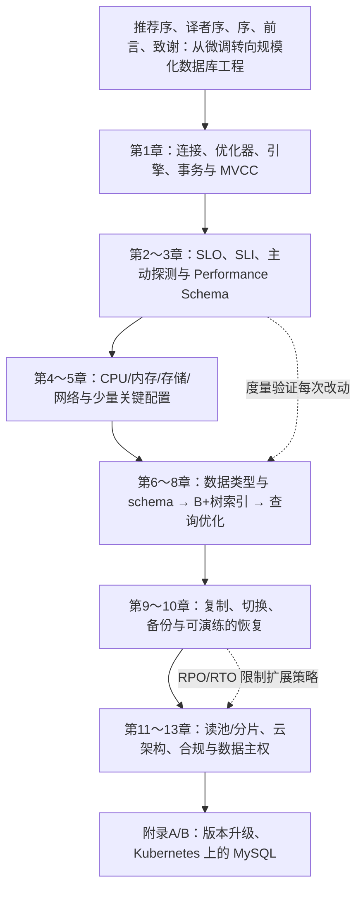

# 《高性能MySQL（第4版）》精读：从单条 SQL 到规模化数据库平台

> **版本与证据**：Silvia Botros、Jeremy Tinley 著，宁海元、周振兴、张新铭译，电子工业出版社 2022 年 10 月出版，ISBN `9787121442575`。本文以用户提供的中文版 EPUB 为主，核对了版权页、EPUB `toc.ncx` 和实际正文；覆盖推荐序、译者序、序、前言、致谢、第 1～13 章及附录 A/B。书的正文以 MySQL 5.7/8.0 的大规模实践为背景。下面的“【原书】”表示对应章节的论证，“【实践改写】”表示为教学重新组织的 SQL，“【当前补充】”表示成书后适用于 MySQL 8.4 LTS 的演示，“【纠正，第 n 章】”表示需要对特定章节收紧版本或条件。书中短引文只用于论证，不复制长篇正文。
>
> **阅读目标**：这不是一张参数调优清单。先建立用户体验指标，再测量、定位、改进访问路径和部署架构，最后验证恢复与安全。示例没有在生产环境执行；第六节 Docker 命令为可自行完成的本地练习。

## 一、全局理解：高性能是约束下的持续交付

### 作者的出发点以及 MySQL 的位置

【原书，前言】直言：“我们认为不应该再将本书的重点放在优化MySQL以将性能提高几个百分点上，而应当是为人们提供他们所需要的信息，以便就如何最好地使用MySQL做出明智的决定。”【原书，第 11 章】进一步定义：“可扩展性是系统支撑不断增长的流量的能力”；它区分最大吞吐量与**在可接受延迟下的可用容量**。

翻译成业务语言：数据库快并不等于一次 `SELECT` 返回快；客户在高峰、节点故障、在线改表或恢复演练期间，能否以约定的延迟和正确性完成关键操作，才是目标。本书解释 MySQL 的连接层、优化器、InnoDB、索引和复制的工作方式，再把可靠性工程（SLO）、可观察性（Performance Schema）、备份、分片、云和合规接到同一条工程链路上。它要解决的不是“找到万能 `my.cnf`”，而是：看见真实瓶颈、控制变更风险、让数据库容量随着业务增长且可恢复。

### 13 章与两个附录的逻辑路线



可把它看成系统生命周期：“弄懂执行路径 → 定义可接受的结果 → 找到瓶颈 → 修改 schema/SQL/资源 → 在副本和备份上保障变更 → 容量增长后选择拓扑 → 升级和合规审计”。章节严格保留原书顺序；阶段标题只是帮助读者把一条工程因果链读通。

### 与替代方案及前几版相比

| 路径或技术 | 擅长的工作 | 对高性能 MySQL 团队的价值 | 不应混淆的边界 |
| --- | --- | --- | --- |
| 第 3 版的传统“深挖内部、手工调参” | 单机引擎细节与参数推理 | 理解机制仍必需 | 第 4 版新增 SLO、schema 变更、云、扩展与合规，不把参数当作交付目标 |
| MySQL/InnoDB | 行事务、二级索引、可运维的主从复制 | 通用 OLTP 与成熟生态 | 高并发写单主会遇到容量上限；副本异步 |
| PostgreSQL | 丰富 SQL、扩展、MVCC | 复杂查询或 PostgreSQL 生态可评估 | 迁移要对比查询语义、驱动与运维；并非自动解决糟糕的 schema |
| Redis | 内存对象和低延迟读取 | 缓存热点、限流；减轻数据库重复读 | 缓存失效、回源风暴及持久性要设计；不能代替交易事实 |
| ClickHouse 等列式分析库 | 批量扫描、聚合 | 让分析任务离开 OLTP 主库 | 不能把报表吞吐换算为事务吞吐 |
| Vitess / 兼容 MySQL 的分布式产品 | 路由、分片、集群控制面 | 写容量突破单主后可选择 | 跨分片事务、join、迁移和成本需要重新设计 |
| 托管 MySQL/Aurora | 自动备份、故障转移、基础设施代管 | 降低值班与维护工作量 | 兼容版本、可观测性、费用、数据主权都依赖具体服务 |

总之，“高性能”不是某个数据库独有的标签。MySQL 的优势是业务 SQL 与成熟运维工具的组合；第 4 版的升级是把这套能力纳入可测量、可恢复且可持续扩展的服务目标。

## 二、逐章地图：原书提出了哪些问题

| 原书顺序 | 标题 | 关键线索 | 作者给出的工程方向 |
| --- | --- | --- | --- |
| 推荐序、译者序、序、前言、致谢 | 从经典调优到现代数据库工程 | MySQL 5.7/8.0、云、安全、DBA 向赋能者转型 | 理解架构与取舍，减少靠经验乱改设置 |
| 第 1 章 | MySQL架构 | 连接/优化/引擎、锁、隔离、MVCC、复制、InnoDB 8.0 | 先理解 SQL 所走的层及事务边界 |
| 第 2 章 | 可靠性工程世界中的监控 | SLI/SLO、可用性、延迟、错误、主动探测 | 从用户体验倒推监控和告警 |
| 第 3 章 | Performance Schema | instrument/consumer、`sys`、语句/锁/内存/错误 | 用服务端证据定位耗时来源 |
| 第 4 章 | 操作系统和硬件优化 | CPU、工作集、SSD、RAID、文件系统和网络 | 测出受限资源再规划硬件 |
| 第 5 章 | 优化服务器设置 | 配置作用域、内存预算、Buffer Pool、I/O、并发、安全 | 从少数关键配置入手，所有更改验证副作用 |
| 第 6 章 | schema设计与管理 | 类型/标识符、NULL/JSON、反模式、schema 迁移 | 让数据模型匹配访问路径并能安全演进 |
| 第 7 章 | 创建高性能的索引 | B+树、选择性、列序、覆盖/聚簇、冗余 | 为真实查询设计索引且控制写放大 |
| 第 8 章 | 查询性能优化 | 多余扫描、优化器、COUNT/join/OFFSET/UNION | 用执行计划与实际行数消除无效工作 |
| 第 9 章 | 复制 | binlog、GTID、延迟、半同步、切换、读池 | 在异步边界下管理副本和失败转移 |
| 第 10 章 | 备份与恢复 | RPO/RTO、逻辑/物理/快照、binlog、工具 | 用恢复演练证明备份有效 |
| 第 11 章 | 扩展MySQL | 读池、排队、功能拆分、写入分片、Vitess/ProxySQL | 先识别读或写瓶颈，再承担相应拓扑成本 |
| 第 12 章 | 云端的MySQL | Aurora、Cloud SQL、托管/VM、磁盘与主机 | 选择控制权和运维成本的平衡点 |
| 第 13 章 | MySQL的合规性 | SOC 2、SOX、PCI、HIPAA、FedRAMP、GDPR | 把凭据、权限、变更和恢复转成可审计控制 |
| 附录 A | 升级MySQL | 漏洞、bug、EOL、发行说明、测试 | 按完整生命周期升级与回滚 |
| 附录 B | Kubernetes上的MySQL | operator、卷、控制平面、故障与恢复 | 在容器化前先界定数据与运维责任 |

## 三、按书中章节顺序贯通数据库生命周期

### 阶段一：建立执行模型和可靠性指标

#### 第 1 章　MySQL 架构：一条请求会穿过哪些层

##### 连接、优化、引擎与持久化

【原书，第 1 章】将逻辑架构分三层：连接管理与权限，查询解析/优化/执行，最后是经存储引擎 API 存取数据。引擎不负责解析 SQL；选择 join 顺序和索引是 SQL 层的职责，InnoDB 负责 B+树页、行事务等。每个连接传统上有服务线程；在线连接多时，线程内存、上下文切换和事务占用均会变成容量限制。

```text
客户端 -> TLS/身份验证 -> SQL 解析 -> 优化器选择访问路径
       -> InnoDB 缓存与聚簇索引 -> redo/undo -> 提交与 binlog -> 返回结果
```

原书继续由读写锁与粒度谈到 ACID、隔离级别、死锁、事务日志及 MVCC（Multi-Version Concurrency Control，多版本并发控制）。普通一致性读通常从 read view 选择历史版本，写冲突和锁定读仍要等锁。`REPEATABLE READ` 不代表所有 SELECT 都是“最新”数据，跨系统读写也不自动原子。

```sql
CREATE TABLE account (
  id BIGINT PRIMARY KEY, balance DECIMAL(12,2) NOT NULL
) ENGINE=InnoDB;
START TRANSACTION;
UPDATE account SET balance = balance - 100 WHERE id = 1 AND balance >= 100;
-- 应用必须检查 ROW_COUNT() 是否为 1，再决定是否进行下一个更新。
COMMIT;
```

第 1 章最后介绍复制及 InnoDB 的 JSON、事务数据字典、原子 DDL。数据字典属于 MySQL 8.0 的现代实现，不能把旧 `.frm` 与它混为一谈。**局限**：原子 DDL 是单条受支持 DDL 在崩溃恢复时原子，不表示多个 DDL 构成一个可回滚的用户事务，也不表示没有元数据锁。

- **ACID**：Atomicity、Consistency、Isolation、Durability，分别是原子性、一致性、隔离性和持久性。
- **MVCC**：通过历史版本和事务可见性规则使读写减少直接冲突，不负责替应用强制全部业务约束。
- **DDL**：Data Definition Language，建表、改表等定义语句；元数据锁会影响并发 DDL/DML。
- **聚簇索引**：InnoDB 主键 B+树叶子节点保存整行，二级索引叶子通常保存主键，查询可能回表。

#### 第 2 章　可靠性工程世界中的监控：先定义“服务好不好”

本章将 DBA 的工作由“盯单机 CPU”提升到 SRE/DBRE：数据库健康应通过用户可感知的可用性、延迟与报错判断。SLI 是统计的指标；SLO 是目标；监控对象可以是请求成功率、关键 SQL 的 p99、复制后数据的新鲜度以及真实端到端探针，而不仅是机器资源。

例：过去 30 天订单创建接口总计 100 万次，成功 999,500 次，成功率 99.95%；若承诺 99.9% 可用性，本期尚有错误预算 500 次。只看“mysqld 仍在运行”会漏掉写请求超时、连接池饱和或从库读到旧订单。

```text
SLI(成功率) = 1 - 失败的合规请求数 / 有效请求总数
SLO(例)     = 30 天内成功率 ≥ 99.9%，订单写入 p99 < 200 ms
告警        = 业务失败率/延迟的消耗速率显著超过错误预算
```

测长期指标时应分清业务节奏、周期性任务、流量峰值和发布窗口；主动探针应测试**真实读写路径**，但要隔离探针数据与生产数据。SLO 应由产品与数据库团队共同确定，不能把书中的示例阈值当通用默认。

- **SRE**：Site Reliability Engineering，站点可靠性工程；**DBRE**：Database Reliability Engineering，数据库可靠性工程。
- **SLI/SLO/SLA**：Service Level Indicator / Objective / Agreement，即服务水平指标/目标/协议；SLA 含对外约定，不能直接拿 CPU 使用率充当用户体验。
- **p99**：99% 请求不超过的延迟分位数；单次慢查询与总体 p99 是不同尺度。
- **错误预算**：允许失败的数量或比例；用它在交付速度与可靠性工作之间做取舍。

#### 第 3 章　Performance Schema：观察工作而不是猜原因

【原书，第 3 章】的核心两个词是 `instrument`（服务端插桩，采样/记录事件）和 `consumer`（消费与存储这些事件的表）；`sys` schema 对原始数据进行可读聚合。本章按书中顺序解释开关/资源开销、线程关联、过滤特定对象/线程，再分别检查 SQL、读写 I/O、元数据锁、内存、服务器变量与错误。

```sql
-- 【实践改写】先识别耗时最多的语句模式，再分析单条 SQL。
SELECT DIGEST_TEXT, COUNT_STAR,
       ROUND(SUM_TIMER_WAIT/1e12, 2) AS total_seconds,
       ROUND(AVG_TIMER_WAIT/1e9, 2) AS avg_ms
FROM performance_schema.events_statements_summary_by_digest
ORDER BY SUM_TIMER_WAIT DESC LIMIT 10;

SELECT * FROM performance_schema.data_lock_waits LIMIT 10;
SELECT * FROM sys.schema_table_statistics_with_buffer LIMIT 10;
```

`SUM_TIMER_WAIT` 原始单位为皮秒；`1e12` 换算秒，`1e9` 换算毫秒。首先确认 `performance_schema`、instrument 和 consumer 是否开启；没有样本**不意味着**没有等待。开启详细历史记录需评估额外 CPU/内存，在线更改后观察开销；只给诊断账号只读权限。

- **Performance Schema / P_S**：MySQL 内建性能事件采集框架，非应用业务库。
- **digest**：把相似 SQL 的常量归一后按模式聚合；同 digest 的数据分布仍可能相差很大。
- **MDL**：Metadata Lock，元数据锁；长事务持有旧表引用时 `ALTER TABLE` 可能排队。
- **sys schema**：便于 DBA 查询的视图与过程，底层依赖 Performance Schema；仪表盘应注明采样窗口。

**局限**：统计往往是累计的，重启会清零且会因工具自身查询产生开销；关联应用 trace ID、时间窗口和实例身份后才能解释“这次发布为什么慢”。

### 阶段二：衡量资源与受控配置

#### 第 4 章　操作系统和硬件优化：容量首先受最短板约束

本章把 CPU、工作集、SSD、RAID、网络、文件系统、I/O 调度器和 swap 看作一个整体。高 CPU 可能是并发查询过多、索引扫描过宽或高频 JSON 处理；高磁盘 IOPS 可能是缓冲池装不下热数据；内存越多不等于越好，连接与排序内存若过量会引发 swap 或 OOM。

##### 先测量工作集而非把全部数据装入内存

工作集是短时间内频繁访问的数据页和索引页，而非数据库总大小。冷热明显时，可允许冷页从 SSD 读取；多实例云盘还需测 IOPS 上限、突发额度和网络限速。原书谈 SSD 垃圾回收与写放大，提醒我们 `fsync` 的尾延迟也会影响提交时延；RAID 写缓存没有断电保护时可能使“提交成功”并不真的耐久。

```sql
SHOW GLOBAL STATUS LIKE 'Innodb_buffer_pool_read%';
SHOW GLOBAL STATUS LIKE 'Threads_running';
SHOW GLOBAL STATUS LIKE 'Created_tmp_disk_tables';
```

【实践改写】先观察一段时间的这些**增量**，再对比相同时间段的请求量和 I/O 延迟；不要单看状态变量绝对值就加内存。`Innodb_buffer_pool_read_requests` 与 `Innodb_buffer_pool_reads` 之比可以帮助估计缓存命中，但命中率很高也不能排除个别关键查询发生慢磁盘读。

##### 成本和边界

CPU 单核频率有助单条 SQL 延迟，多核有助并发吞吐；SSD 减轻随机 I/O 但不能修复扫描百万行的执行计划；RAID10 适合对随机写敏感的自管场景，云托管磁盘不是由用户直接选 RAID 卡。swap 应警惕，但不要不经系统评估就一刀切禁用所有交换空间。

- **SSD/HDD**：Solid-State Drive / Hard Disk Drive，固态盘/机械盘。
- **RAID**：Redundant Array of Independent Disks，独立磁盘冗余阵列；冗余不是备份。
- **IOPS**：每秒输入/输出操作数，与吞吐字节/秒和 p99 I/O 延迟共同决定体验。
- **工作集**：一段时间内真正频繁访问的数据和索引页集合。

#### 第 5 章　优化服务器设置：先找到值得改变的少数变量

【原书，第 5 章】提醒：正确顺序是“理解内部结构和行为 → 与实际状态对照 → 只纠正重要差异”。配置文件通常在 `[mysqld]` 段；变量还区分 GLOBAL/SESSION、动态/启动时设置，`SET PERSIST` 类持久化变更要核对配置来源，防止两套配置冲突。

##### 内存预算与 I/O

示意：主机可用 16 GiB，不应直接给 Buffer Pool 16 GiB。先保留 OS/备份/网络/监控余量，再估算 `max_connections × 连接实际高峰内存` 和线程缓存、排序/临时表开销；剩余预算才分配给 InnoDB Buffer Pool。按队列与请求数而不是仅按数据集大小判断。redo 空间增加可降低刷盘压力，但恢复扫描与空间成本也会增加；`innodb_flush_log_at_trx_commit` 与 `sync_binlog` 联合决定崩溃边界。

```sql
SHOW VARIABLES WHERE Variable_name IN
  ('innodb_buffer_pool_size','innodb_redo_log_capacity',
   'innodb_flush_log_at_trx_commit','sync_binlog','max_connections');
SHOW GLOBAL STATUS WHERE Variable_name IN
  ('Threads_connected','Threads_running','Max_used_connections');
```

【纠正，第 5 章】原书时期惯用的 `innodb_log_file_size` 应按目标 MySQL 版本文档核对；MySQL 8.4 可查看 `innodb_redo_log_capacity`，不能把旧版的文件数和大小原样复制。修改配置前用快照记录 p95/p99 延迟、错误率、刷盘和恢复时间；灰度更改，再确认参数是否在目标平台允许动态变更。性能与数据安全不可互相偷换。

- **Buffer Pool**：InnoDB 的数据页和索引页缓存。
- **redo log**：重做日志，恢复页级修改；与记录逻辑事件的 binlog 不同。
- **fsync**：通知操作系统持久化文件数据/元数据；仍取决于存储设备诚实兑现。
- **GLOBAL / SESSION**：变量在实例或连接范围内生效；持久化设置还需区分重启后的配置来源。

**局限**：连接数设得更高不会增加 CPU、Buffer Pool 或磁盘容量；过多并发往往只会让排队时间更长。应用连接池和服务端资源限制要一起设计。

### 阶段三：让数据模型、索引与查询形成一条访问路径

#### 第 6 章　schema 设计与管理：数据类型决定长期成本

作者依次讨论整数、实数、字符串、日期/时间、位字段、JSON、标识符与特殊类型，原则是准确表达业务、少占空间但留足未来范围。`DECIMAL(12,2)` 用于精确金额而不是 `FLOAT`；时间列考虑时区和跨系统语义；长字符串主键会被复制到二级索引，导致内存和 I/O 放大。

```sql
-- 【实践改写】货币金额用 DECIMAL，时间统一记录 UTC，并显式定义主键
CREATE TABLE purchase (
  id BIGINT UNSIGNED NOT NULL AUTO_INCREMENT PRIMARY KEY,
  customer_id BIGINT UNSIGNED NOT NULL,
  total DECIMAL(12,2) NOT NULL,
  placed_at DATETIME(6) NOT NULL,
  status VARCHAR(16) NOT NULL,
  KEY idx_customer_time (customer_id, placed_at)
) ENGINE=InnoDB;
```

##### 原书提到的典型陷阱

列太多使每行更宽、热点页容纳更少记录；过多联接反映读路径耦合；“全能枚举”把不断变化的业务规则塞进一列；“变相枚举”用无约束字符串暗示状态；`NULL` 不是空串、0 或不存在。JSON 适合稀疏且模式变化快的属性，但需要按查询设计生成列/函数索引；不应靠 JSON 掩盖本应外键关联的实体。

schema 管理是发布流程而非一次性 DDL：测表大小与锁，试验 online/instant 的实际条件，检查外键、复制滞后和回滚方案。原书强调 schema 变更工具与开发者自助；团队需要所有权、审核和发布记录。MySQL 8.4 的 `INSTANT`、`INPLACE`、`COPY` 能力依具体变更而异，不要对所有 `ALTER TABLE` 作“无锁”承诺。

- **schema**：库/表/列/约束构成的数据模式；它和真实查询路径一起设计。
- **DDL**：Data Definition Language，模式定义语句；即使支持在线 DDL 也可能有短暂元数据锁。
- **UTC**：Coordinated Universal Time，协调世界时；`DATETIME` 不自带时区，应用要约定解释规则。
- **反范式**：为特定读路径复制数据或预计算汇总，换取查询速度，但增加写入同步复杂度。

#### 第 7 章　创建高性能的索引：让最常见的过滤先发生

书中先解释 B+树/其他索引，再讨论前缀索引选择性、多列索引列序、聚簇与覆盖索引、用索引顺序避免排序、重复/未使用索引，最后要求更新统计信息、处理碎片与检查损坏。

##### “最左前缀”只是开始，列序还要服务过滤和排序

联合索引 `(tenant_id, status, created_at, id)` 可以先缩小租户和状态范围，再顺序读最近记录。若查询从 `created_at` 开始而没有租户条件，索引未必有效。对唯一值很多的前缀取短前缀可能减少索引大小，但不能做完整字符串唯一性判定，覆盖能力也可能减弱。

```sql
CREATE INDEX idx_purchase_customer_time
  ON purchase(customer_id, placed_at, id);

EXPLAIN ANALYZE
SELECT id, placed_at FROM purchase
WHERE customer_id = 42
ORDER BY placed_at DESC, id DESC
LIMIT 20;
```

本例主键 `id` 随二级索引叶子隐含保存，但实际覆盖与排序能否利用，必须用执行计划确认；查询大量其他列会回表。`EXPLAIN ANALYZE` 不只估算，还会**实际执行**查询，在生产上慎用对数据量巨大的查询。

##### 为什么不能无上限地加索引

每个索引会增加写入维护、缓存占用、redo 和备份量；重复 `(a)` 与 `(a,b)` 未必都必要，但若后者很宽，前者可能仍有价值。只看 `Cardinality` 也不够：范围大小、数据倾斜和排序要求会影响优化器决策。先从第 3 章 SQL digest 中找到重要读路径，再验证读收益是否大于写成本。

- **B+树**：内部页导航、叶子页有序保存键，利于范围检索；不是把每条记录都装进内存的二叉树。
- **覆盖索引**：查询需要的列均可从索引叶子取出，无需读聚簇索引整行。
- **选择性**：索引能够排除的无关行的比例；基数高不意味着组合顺序必然正确。
- **前缀索引**：仅为字符串的前 n 个字符建索引，节省空间但有重名和覆盖局限。

#### 第 8 章　查询性能优化：扫描了多少不必要的行

【原书，第 8 章】从“为什么慢”开始，把多余的返回列、扫描行数和客户端往返拆开判断，再讨论拆大查询/联接、解析与优化器、COUNT、join、GROUP BY、`LIMIT OFFSET`、`UNION` 等特殊问题。

##### 一次诊断应按什么顺序

1. 从第 2 章确定哪条用户路径违反 SLO；从第 3 章找到对应 SQL 模式，记录频率与总耗时。
2. 跑 `EXPLAIN ANALYZE`（只在隔离或可控实例上）看估计/实际行数、循环次数、临时表/排序及返回量。
3. 限定必需字段和结果集；调整谓词、索引顺序和 join 方式，重新测延迟和写入代价。
4. 无法单机满足时，才考虑第 9～11 章的副本、队列、拆分或缓存。

```sql
-- 【实践改写】OFFSET 很大时扫描并丢弃大量行
SELECT id, placed_at FROM purchase
WHERE customer_id = 42
ORDER BY placed_at DESC, id DESC LIMIT 20 OFFSET 100000;

-- 改用稳定的“上次见到的时间 + id”游标。
SELECT id, placed_at FROM purchase
WHERE customer_id = 42
  AND (placed_at < '2026-09-19 10:00:00'
       OR (placed_at = '2026-09-19 10:00:00' AND id < 900))
ORDER BY placed_at DESC, id DESC LIMIT 20;
```

深分页示例要求索引 `(customer_id, placed_at, id)`，并把返回的最后一行作为下一页游标。`COUNT(*)` 的成本取决于过滤与扫描路径，不是“永远有一个常量时间总行数”；把联合查询拆为多个小查询可改善缓存与服务治理，也可能增加往返和破坏一致性，不可一概而论。

【纠正，第 8 章】`SQL_CALC_FOUND_ROWS` 是书中讨论的旧写法，在现代 MySQL 中已弃用；为总数执行独立 `COUNT(*)` 并评估是否真的需要每页精确总数。`UNION ALL` 若允许重复可省去去重代价；普通 `UNION` 保留去重语义。对于“并行执行”局限，也要区分 MySQL 单条查询计划与多个客户端请求可并发执行。

- **EXPLAIN**：展示执行计划；`EXPLAIN ANALYZE` 会运行语句并报告实际观测。
- **keyset pagination**：通过上次最后一行的排序键继续翻页，避免深 OFFSET。
- **回表**：二级索引找到主键后再次读聚簇索引行；覆盖索引可省去这一步。
- **N+1**：应用先查一批对象，再对每个对象独立请求数据库；可适度批量化但也需限流。

### 阶段四：在故障中保持数据可用且可恢复

#### 第 9 章　复制：延迟、切换和读池必须一起设计

##### 数据从源库流到副本

源库把已提交事务写入 binary log（binlog），副本从源端获取并重放。事件格式可为 statement、row、mixed；书中讨论格式选择、GTID（全局事务标识符）、崩溃安全、延迟复制、并行复制、半同步复制和过滤规则。row 格式减少不确定性，但可能放大日志；半同步是“一定数量副本收到日志确认”的协议，**不等于**所有副本已执行，更不是天然零丢失。

```text
客户端写主库 -> 主库提交事务/binlog
          -> 副本获取日志 -> relay log -> 并行/串行回放
          -> 副本允许读取（可能晚于主库）
```

```sql
-- 【实践改写】查看源端与副本侧信息；连接到不同实例分别执行
SHOW BINARY LOG STATUS;
SHOW REPLICA STATUS\G
```

##### 计划内和计划外切换

计划内切换先停止/排空写、确认候选副本追平并测试，切换应用写入口后观察延迟；计划外故障转移要决定**丢失未复制事务还是延长不可用时间**。提升副本前确认 GTID 已执行集合和复制过滤，禁止旧主在隔离失效后继续接受写（fencing）。原书还比较主动/被动、主库加只读池等拓扑，并说明非唯一 `server_id`、日志损坏、巨大包、磁盘满、过滤器、临时表和副本延迟的故障边界。

`Seconds_Behind_Source` 只是粗略指标：暂停、无事件、并行回放和客户端读取时刻都可能使它误导；应用真正关心的是“本次读的值距离已提交写有多新”。高复制延迟的候选副本不得被当作新鲜读取来源。

- **binlog**：MySQL 二进制日志，记录逻辑变更事件；InnoDB redo 则为页级崩溃恢复服务。
- **GTID**：Global Transaction Identifier，跨源/副本跟踪事务的位置标识。
- **relay log**：副本接收源端事件后保存的中继日志。
- **RPO/RTO**：Recovery Point Objective（可接受数据损失时间）/ Recovery Time Objective（可接受业务恢复时间）。
- **fencing**：故障切换后阻止旧主继续写入，避免脑裂。

【当前补充】`SHOW SLAVE STATUS` 和 `CHANGE MASTER TO` 等旧术语在新版本被 `REPLICA` / `SOURCE` 术语替代；复制部署应以目标版本手册核对 TLS、GTID、备份初始化与账号最小权限。**局限**：异步复制不能单独成为备份；误删和加密勒索也会复制给下游。

#### 第 10 章　备份与恢复：必须能在目标时间重新提供服务

【原书，第 10 章】先问“为什么备份”和“恢复需求是什么”，再讨论热/冷、逻辑/物理、全量/增量/差异、binlog、mysqldump/mydumper/XtraBackup/Enterprise Backup，以及恢复逻辑文件、快照、物理备份后的启动。

##### 用 RPO 和 RTO 选方案

如果 RPO 为 5 分钟、RTO 为 30 分钟，每日一次逻辑导出不合格；可以做一致性物理快照+归档 binlog，并确保恢复脚本在 30 分钟内跑完。在线逻辑备份的 `--single-transaction` 依赖 InnoDB 一致性快照，不保证非事务表一致，也不能忽视备份期间并发 DDL。物理备份需匹配 MySQL/工具版本、备份时 redo 与权限；快照要同步磁盘/文件系统和 binlog 位点。

```bash
# 【实践改写】只用于可控制的实验环境；用户名、密码与路径由环境提供
mysqldump -h 127.0.0.1 -u backup -p \
  --single-transaction --routines --triggers --events \
  --databases shop > shop.sql
mysql -h 127.0.0.1 -u restore -p < shop.sql
```

日志恢复须先确定全量备份起点和目标时刻，读取归档 binlog 事件，**先在隔离实例回放**并抽检业务数据，再切流；千万不能把 `mysqlbinlog | mysql` 直接对生产主库盲目执行。`--single-transaction` 不是保险丝：长时间备份可能扩大 undo 压力，且并发非事务写/DDL 会破坏预期。

##### 一个可执行的恢复演练闭环

1. 锁定备份集、日志段、加密密钥和版本；记录校验和与源实例 GTID。
2. 在隔离环境恢复到备份一致点，再应用 binlog 到批准的目标位置或时间。
3. 验证行数、关键约束、应用查询与权限；统计实际耗时和丢失窗口。
4. 写出复盘与改进项，更新值班手册；保留异地、不可变备份副本。

- **PITR**：Point-in-Time Recovery，时间点恢复，需要基准备份和连续 binlog。
- **逻辑备份**：导出 SQL/数据，可跨兼容版本迁移但大库恢复可能很慢。
- **物理备份**：复制表空间等数据文件，通常恢复更快但版本与文件一致性限制更多。
- **复制 ≠ 备份**：副本可帮助故障切换，无法防止复制过去的人为逻辑错误。

### 阶段五：容量增长、云平台和合规边界

#### 第 11 章　扩展 MySQL：在可接受延迟下增加容量

作者区分读限制和写限制工作负载，按风险从小到大讨论功能拆分、只读池、排队机制、分片，以及 Vitess、ProxySQL。增加一台副本不增加源端写能力；业务高峰先做限流和队列，避免把所有写入瞬间冲向主库；真正的单主写入瓶颈才考虑水平分片。

##### 读池与分片的成本账

只读池路由至少需要健康检查、拓扑刷新、`read_only` 校验、最大复制延迟和会话一致性策略（写后读走主库或等待副本追平）。写入分片需要稳定的路由键及迁移规则：用 `tenant_id` 可把租户请求尽量局部化，但全局统计、跨租户查询、跨分片事务都变难。虚拟槽映射或一致性哈希能减轻扩容时数据搬迁，但不能凭算法解决热点大租户。

```text
请求 -> 网关(租户ID -> 分片映射)
     -> 分片 A / B / C：各自有主库、读池和备份
     -> 全局分析：独立 CDC/批量汇总系统
```

Vitess 管理拓扑/路由并提供 MySQL 兼容查询入口；ProxySQL 可作连接路由、读写分离和查询规则，并不凭自身帮你把数据安全地重分片。两者并非“安装后自动扩展写”。

- **sharding**：分片，以路由键把不同数据集放到不同写入节点。
- **读池**：多个只读副本组成的服务入口；必须说明数据允许多旧。
- **CDC**：Change Data Capture，捕获数据库变更，用于异步派生分析数据。
- **backpressure**：下游不足时上游限流/排队，保护数据库而不是无界积压。

**局限**：应用中的外键、跨分片 join 和全局唯一 ID 会反过来限制分片策略；在未压尽 schema/SQL/资源与业务限流之前上分片，通常只是把单机问题复制到多个集群。

#### 第 12 章　云端的 MySQL：托管省掉了什么、还剩什么

【原书，第 12 章】将“托管 MySQL”（例：Aurora for MySQL、GCP Cloud SQL）与自建虚拟机 MySQL 对比。托管方承担部分备份和故障转移工作，却限制 OS/文件系统级排查和高级拓扑；VM 上有完整控制权，同时要自己处理内核、磁盘、升级、备份和夜间故障。选择机器/云盘前仍要观察 CPU、持久 IOPS、突发额度、网络带宽、AZ 故障域和恢复演练。

| 问题 | 托管服务 | 云 VM 自建 |
| --- | --- | --- |
| 快速创建与例行维护 | 提供控制平面，变更窗口受平台约束 | 自行自动化部署和升级 |
| OS/文件系统可见性 | 常受到限制 | 可排查底层与自定义工具 |
| 备份和切换 | 通常有托管能力，恢复范围依合同 | 完全自定义，也完全自负其责 |
| 成本 | 服务溢价、IO/出站流量可能单独计费 | 机器与人力、值班和故障成本显性化 |

【纠正，第 12 章】原书基于出版时点说 Aurora 产品与 MySQL 8.0 不兼容，**不能当作今天所有 Aurora 产品的事实**。AWS 现有 Aurora MySQL 3 系列标注 MySQL 8.0 兼容；迁移必须逐项确认*特定引擎版本*对客户端、SQL、binlog、扩展、参数和回滚的支持，而非仅看“兼容 MySQL”。

- **AZ**：Availability Zone，可用区；同区域不同可用区也有共享依赖。
- **RDS**：Relational Database Service，云托管关系型数据库服务。
- **兼容层**：接受相似 SQL/协议不意味着底层存储、备份语义、故障切换和成本完全相同。

#### 第 13 章　MySQL 的合规性：把规则做成可验证证据

第 13 章把 GRC、SOC 2、SOX、PCI DSS、HIPAA、FedRAMP、GDPR、Schrems II 和数据主权与数据库工程联结。作者明确**不提供法律意见**；控制措施须由法务/合规团队确认。数据库工程师负责证明数据的谁可以访问、谁可以改 schema、哪里留审计日志、备份在哪里、多久删除、如何恢复。

##### 把控制要求写进发布和运维流水线

```text
需求识别(数据类别/地域)
  -> 最小权限账号+临时凭据/密钥轮换
  -> schema/数据变更经审批与审计
  -> 加密传输/静态加密+异地备份访问控制
  -> 定期恢复演练/删除与留存证明
```

生产账号不应共用 root，也不应把密码写入 `my.cnf` 并传播到日志。应用只获必要的 `SELECT/INSERT/UPDATE` 等权限；备份账号、恢复账号和运维账号分离。别把“开了审计日志”误认为合规完成：日志本身可能含个人信息，需要明确留存、访问和清除策略。

- **GRC**：Governance, Risk and Compliance，治理、风险与合规。
- **SOC 2**：System and Organization Controls 2，服务组织控制的审计报告框架。
- **SOX**：Sarbanes–Oxley Act，美国上市公司财务报告内部控制法规。
- **PCI DSS**：Payment Card Industry Data Security Standard，支付卡行业数据安全标准。
- **GDPR**：General Data Protection Regulation，欧盟通用数据保护条例。
- **数据主权**：数据处理/储存所受地域法律与治理边界；跨区备份也可能涉及跨境。

### 阶段六：两个附录是升级与部署的验收标准

#### 附录 A　升级 MySQL：回归测试比追逐最新版本重要

原书给出理由（安全、已知 bug、新功能、支持周期结束）和流程（阅读每个版本的发行说明、升级文档、测试、再升级）。这个顺序同样适用于 MySQL 8.0 到 8.4：先验证客户端认证与驱动、字符集/排序规则、已弃用系统变量、schema、复制拓扑、工具和备份兼容，才安排切换。

建议在源版本的最近一次**可恢复备份**上克隆环境，运行关键查询回归和压测；升级前演练“如何回退流量与数据”。尤其不要假定已经升级的物理数据文件可直接由旧版本打开。升级当天分别观察 SLI/SLO、replication lag、错误、锁、P99，出现不可接受退化按预设回退路径执行。

- **EOL**：End of Life，停止支持；无法继续获得安全修复需要纳入风险台账。
- **回滚**：不只是把服务二进制换回旧版，还包括数据格式、写入期间增量与副本拓扑的处理。

#### 附录 B　Kubernetes 上的 MySQL：控制平面不等于数据安全

原书没有一概否定有状态容器，而是问：你究竟要 K8s 承担资源供应、主备选举、流量路由还是全部？先确定 Operator 范围、存储卷、节点隔离、最大数据集、备份位置和故障时的操作权限，再决定是否上线。容器重启后 PVC 是否仍可挂载、备份能否跨集群恢复、滚动升级会否同时驱逐主从，都比 YAML 行数更重要。

从非关键、小数据集测试；用故障注入验证 Pod/Node/AZ 故障及备份恢复。书中提及 Vitess 作为可学习的控制平面之一，但不是每个团队都必须选它。若托管数据库已经满足 SLO，把 MySQL 再搬入 K8s 可能增加多余的故障面。

- **K8s**：Kubernetes，容器编排平台；**Operator**：用控制器把数据库运维流程编成期望状态协调。
- **PVC**：PersistentVolumeClaim，持久卷声明；Pod 不等于数据卷。
- **StatefulSet**：有状态应用工作负载类型；提供稳定身份，但不能替代备份和一致性恢复。

## 四、可以逐步操作的本地实验（当前补充）

原书重点是运行已有数据库而非从零安装；这里用 MySQL 8.4 LTS 演示第 2～10 章的观察、索引、锁与逻辑恢复。本实验需要 Docker Desktop（Windows 上开启 WSL2 后端）、可用的 Linux 容器、空闲的本机 TCP 3307 端口和至少 2 GiB 可用内存。示例凭据**只能用于本机实验**；容器和卷有独立名称，禁止照搬到生产。

### 1. 启动一个保留数据的实例

在 PowerShell 终端检查 Docker 引擎，然后创建命名卷并启动：

```powershell
docker version
docker volume create hp-mysql-4-lab-data
docker run --name hp-mysql-4-lab `
  --publish 127.0.0.1:3307:3306 `
  --mount type=volume,source=hp-mysql-4-lab-data,target=/var/lib/mysql `
  --env MYSQL_ROOT_PASSWORD=LocalLabOnly_2026 `
  --detach mysql:8.4
docker logs --tail 30 hp-mysql-4-lab
docker exec -it hp-mysql-4-lab mysql -uroot -p
```

最后一个命令在终端输入 `LocalLabOnly_2026`，不要把真实密码写到脚本或 shell 历史。若已存在同名容器/卷，先用 `docker ps -a` 和 `docker volume ls` 确认归属；**不要覆盖或删除不属于此实验的资源**。容器初始化可能需几十秒；连接失败先查日志，再重试。成功进入 `mysql>` 后用 `SELECT VERSION();` 确认实际镜像版本。

### 2. 建表与第 7～8 章的访问路径实验

在上一节的 `mysql>` 中逐条执行：

```sql
CREATE DATABASE hp_mysql_lab;
USE hp_mysql_lab;
CREATE TABLE purchase (
  id BIGINT UNSIGNED NOT NULL AUTO_INCREMENT PRIMARY KEY,
  customer_id BIGINT UNSIGNED NOT NULL,
  total DECIMAL(12,2) NOT NULL,
  placed_at DATETIME(6) NOT NULL,
  status VARCHAR(16) NOT NULL,
  KEY idx_customer_time (customer_id, placed_at, id)
) ENGINE=InnoDB;
INSERT INTO purchase(customer_id,total,placed_at,status) VALUES
  (42,19.90,'2026-09-19 10:00:00','PAID'),
  (42,29.90,'2026-09-19 10:01:00','PAID'),
  (7,99.00,'2026-09-19 10:02:00','PENDING');
EXPLAIN ANALYZE
SELECT id, placed_at FROM purchase
WHERE customer_id=42 ORDER BY placed_at DESC, id DESC LIMIT 20;
```

只有 3 行时运行时和优化器路径都不具有规模代表性；想对比索引收益，需要用生成器导入足够多、与生产分布相似的测试数据，重复执行并统计延迟，不能用这个小样本外推吞吐。

### 3. 第 3、6 章：看可观察性与 schema 状态

```sql
SELECT @@performance_schema, @@innodb_buffer_pool_size;
SELECT DIGEST_TEXT, COUNT_STAR
FROM performance_schema.events_statements_summary_by_digest
ORDER BY SUM_TIMER_WAIT DESC LIMIT 5;
SELECT table_schema, table_name, rows_fetched
FROM sys.schema_table_statistics
WHERE table_schema='hp_mysql_lab';
```

这些累计统计由服务端当前实例维持；若 `@@performance_schema=0`，按官方 `performance_schema` 配置文档重建学习容器，而不是把空结果解释为“查询没有消耗”。

### 4. 回到第 1～3 章：用两个终端复现锁等待

再打开一个 PowerShell 终端，重复 `docker exec -it hp-mysql-4-lab mysql -uroot -p`；两个会话分别输入：

```sql
-- 会话 A
USE hp_mysql_lab;
START TRANSACTION;
SELECT * FROM purchase WHERE id=1 FOR UPDATE;
-- 暂时不要提交

-- 会话 B
USE hp_mysql_lab;
UPDATE purchase SET total=total+1 WHERE id=1;
-- 此命令会等待 A 的行锁；另开第三个会话查看等待
```

在第三个会话执行 `SELECT * FROM performance_schema.data_lock_waits\G`；随后在 A 执行 `ROLLBACK;`，确认 B 结束。不要长时间悬挂事务；与第 2 章 SLO 比较客户端等待时长。

### 5. 第 10 章：从逻辑备份进行隔离恢复

备份示例留在实验容器内，避免把含敏感数据的 SQL 意外重定向到共享目录。先退出 `mysql>`（`exit`），执行命令并输入前述实验密码：

```powershell
docker exec -it hp-mysql-4-lab mysqldump -uroot -p `
  --single-transaction --routines --triggers --events `
  --result-file=/tmp/hp_mysql_lab.sql hp_mysql_lab
docker cp hp-mysql-4-lab:/tmp/hp_mysql_lab.sql .\hp_mysql_lab.sql
docker exec -it hp-mysql-4-lab mysql -uroot -p
```

在 `mysql>` 创建隔离目标并退出：

```sql
CREATE DATABASE hp_mysql_lab_restore;
exit
```

然后将本地文件复制回容器，用 `SOURCE` 在隔离目标库执行；验证关键行数：

```powershell
docker cp .\hp_mysql_lab.sql hp-mysql-4-lab:/tmp/hp_mysql_lab_restore.sql
docker exec -it hp-mysql-4-lab mysql -uroot -p
```

```sql
USE hp_mysql_lab_restore;
SOURCE /tmp/hp_mysql_lab_restore.sql;
SELECT COUNT(*) AS restored_rows FROM purchase;
exit
```

预期 `restored_rows` 为 3（若在锁实验进行了写入，行数仍为 3）。`mysqldump` 的输出未使用 `--databases`，因此 `SOURCE` 在当前隔离库中恢复；不能把带 `CREATE DATABASE`/`USE` 的真实备份这样直接灌进恢复库。`.\hp_mysql_lab.sql` 含有可读数据，按组织数据分级制度保存或删除，生产恢复必须核验 binlog/GTID 和 RPO/RTO。

### 6. 停止实验与可恢复清理

`docker stop hp-mysql-4-lab` 只停止容器；`docker start hp-mysql-4-lab` 可继续使用卷内数据。确认不再需要时，才执行以下**明确指向本实验**的清理：

```powershell
docker rm -f hp-mysql-4-lab
docker volume rm hp-mysql-4-lab-data
```

删除命名卷将不可恢复地删除容器数据；上述命令不会删除工作目录中复制出的 `hp_mysql_lab.sql`，须由实验者自行判断是否保留。

## 五、书中的前沿实践与后续可选技术

本书已将 Vitess、ProxySQL、Aurora、Kubernetes 纳入第 11～12 章/附录 B，不能简单将其列为“更先进的完全替代品”。现实中的可选路线按瓶颈选择：频繁重复读取先用缓存和更好的索引；跨表分析把数据用 CDC 投递至列式仓库；读扩展可用副本但要治理一致性；写扩展才考虑 Vitess 或具备原生水平扩展的数据库产品。每种路线都把问题从一个维度转移到另一个维度，例如分片换来了容量却削弱跨分片事务，托管换来了值班便利却失去 OS 级可见性。

【版本对照】第 3 版偏重单机调优，第 4 版增加了 SRE 指标、现代 Performance Schema、schema 变更、云和合规；在 MySQL 8.4 上继续实践时，`innodb_redo_log_capacity` 等参数、命令弃用信息、认证插件和 Aurora 兼容版本应再次对照部署环境的官方文档，不能将 2022 年的服务版本声称为 2026 年的默认。

## 六、把 13 章变成一次架构评审

- **测量目标**：业务最关键三条链路的 SLO 是什么？如何按用户可见延迟、错误与新鲜度监控？有没有恢复演练的 RTO/RPO？
- **找瓶颈**：哪些 SQL digest 花费最大总时间？锁/MDL、扫描、缓冲池、磁盘延迟与网络各占多少？改动后用同窗口对比了吗？
- **设计访问路径**：主键稳定吗？联合索引列顺序服务真实 `WHERE/ORDER BY` 吗？大 OFFSET 与不必要的 `SELECT *` 是否已移除？
- **配置与发布**：参数默认值是否与目标版本一致？schema 更改是否在副本和备份环境测过执行时间/锁/回滚？
- **复制与灾备**：主库宕机的提升条件、旧主隔离、读写重路由是否演练？副本滞后时写后读怎样保证？备份是否跨故障域、能恢复到批准时间点？
- **增长与合规**：单主容量到顶的指标是什么？分片键和跨分片查询的代价是什么？凭据、审计、数据保留和跨地域复制是否得到安全/法务确认？

## 七、参考来源与边界

- Silvia Botros、Jeremy Tinley：《高性能MySQL（第4版）》，中文译本，电子工业出版社 2022 年，ISBN `9787121442575`。本文章节结构、短引文与书中论点依据用户给定 EPUB 的正文及 `toc.ncx`。同版封面亦由该 EPUB 提取。
- [Oracle 官方 MySQL 8.4 Reference Manual](https://docs.oracle.com/cd/E17952_01/mysql-8.4-en/)：2026-09-19 可访问的版本化查证入口；其中的 [EXPLAIN](https://docs.oracle.com/cd/E17952_01/mysql-8.4-en/explain.html)、[Performance Schema](https://docs.oracle.com/cd/E17952_01/mysql-8.4-en/performance-schema.html)、[redo log](https://docs.oracle.com/cd/E17952_01/mysql-8.4-en/innodb-redo-log.html)、[复制](https://docs.oracle.com/cd/E17952_01/mysql-8.4-en/replication.html)、[备份恢复](https://docs.oracle.com/cd/E17952_01/mysql-8.4-en/backup-and-recovery.html) 页面用于核对现代实践。`dev.mysql.com` 在当前环境返回 403，因此使用同属 Oracle 的镜像文档；部署仍应复核目标小版本。
- [MySQL 官方 Docker 镜像说明](https://hub.docker.com/_/mysql)：核对镜像环境变量、数据卷与启动方式；演示只使用 `mysql:8.4` 大版本标签，并未承诺某个固定补丁版本。
- [AWS Aurora MySQL 版本文档](https://docs.aws.amazon.com/AmazonRDS/latest/AuroraUserGuide/AuroraMySQL.Updates.Versions.html)：2026-09-19 可访问；明确 Aurora MySQL 3.x 的 wire-compatibility 与 MySQL 8.0.23+ 的关系，解释第 12 章历史陈述不再可直接照搬。
- [Kubernetes StatefulSet 文档](https://kubernetes.io/docs/concepts/workloads/controllers/statefulset/)：补充附录 B 的稳定身份与持久卷边界。

全书叙述的是书出版时的大规模 MySQL 工程实践；云服务价格、兼容性与数据库安全默认值变化较快，任何当前补充都要与部署目标版本、驱动和服务商协议再次核对。
