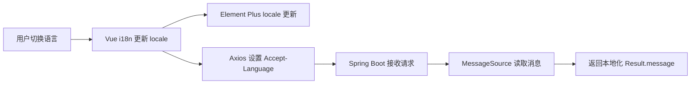
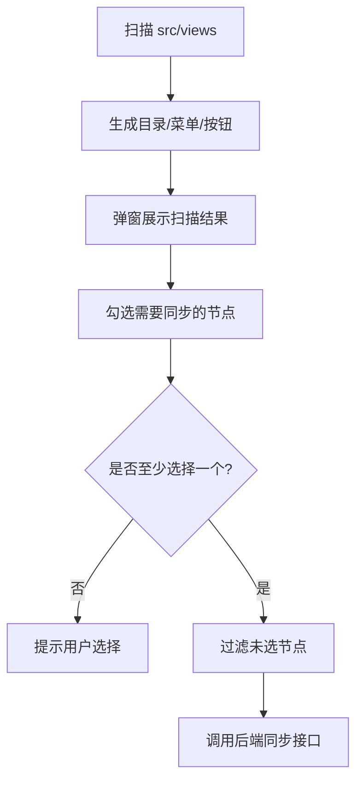

# Spring Boot + Vue 前后端国际化实战：从零改造成中英文切换

## 目标

本文以一个没有国际化能力的前后端项目为例，完成中英文切换能力。

最终效果包括：

- 前端页面可以切换中文和英文。
- Element Plus 的组件文案跟随语言变化。
- Axios 请求自动携带 `Accept-Language`。
- Spring Boot 后端根据请求语言返回中文或英文响应消息。
- 菜单、按钮权限扫描结果可以根据当前语言展示。
- 不修改现有菜单表结构，也不引入额外数据库表。

项目技术栈：

```text
后端：Spring Boot 3.x
前端：Vue 3 + Vite + Element Plus
国际化：vue-i18n + Spring MessageSource
```

## 方案对比

国际化通常有四种落地方式。

| 方案 | 做法 | 优点 | 缺点 | 适合场景 |
| --- | --- | --- | --- | --- |
| 只做前端国际化 | 前端用 `vue-i18n` 管理页面文案 | 实现快，体验好，不影响后端 | 后端错误消息仍然是单语言 | 纯前端站点、后端消息不展示 |
| 只做后端国际化 | 后端用 `MessageSource`，根据 `Accept-Language` 返回消息 | API 消息统一，适合多端 | 前端静态文案仍要自己处理 | API 网关、开放接口、多客户端 |
| 前后端全栈国际化 | 前端 `vue-i18n`，后端 `MessageSource`，请求头传语言 | 体验完整，职责清晰 | 需要前后端同时改造 | 后台管理系统、SaaS、业务系统 |
| 数据库国际化 | 菜单、字典、内容表增加语言列或翻译表 | 动态内容可配置 | 表结构和管理成本更高 | CMS、多租户、多语言运营内容 |

本项目选择第三种：**前后端全栈国际化**。

原因是：页面静态文案天然属于前端，接口响应和异常消息天然属于后端。两边都用各自框架的原生能力，后续维护成本最低。

数据库国际化暂时不选，因为当前只需要中英文 UI 和接口消息，不需要运营人员在线维护多语言内容。

## 整体链路



## 后端改造

### 第一步：配置消息资源

在 `application.yaml` 中增加：

```yaml
spring:
  messages:
    basename: i18n/messages
    encoding: UTF-8
    fallback-to-system-locale: false
```

含义：

- `basename`：消息文件路径，表示读取 `resources/i18n/messages*.properties`。
- `encoding`：使用 UTF-8，避免中文乱码。
- `fallback-to-system-locale`：不跟随服务器操作系统语言，避免部署环境影响业务语言。

### 第二步：创建中英文消息文件

目录结构：

```text
src/main/resources/i18n/
  messages.properties
  messages_zh_CN.properties
  messages_en_US.properties
```

示例内容：

```properties
common.ok=操作成功
common.failed=操作失败
error.forbidden=没有权限执行此操作
error.internal-server-error=服务器内部错误
auth.invalid-credentials=用户名或密码错误
```

英文文件：

```properties
common.ok=OK
common.failed=Failed
error.forbidden=You do not have permission to perform this action
error.internal-server-error=Internal server error
auth.invalid-credentials=Invalid username or password
```

消息键建议按模块组织：

```text
common.*
error.*
auth.*
excel.*
user.*
menu.*
```

不要把完整中文当作 key，例如不要写：

```properties
没有权限执行此操作=You do not have permission
```

这样后续重命名文案会影响代码。更推荐稳定 key：

```properties
error.forbidden=没有权限执行此操作
```

### 第三步：配置语言解析器

使用 Spring MVC 的 `AcceptHeaderLocaleResolver`：

```java
@Configuration
public class I18nConfig {

    @Bean
    public LocaleResolver localeResolver() {
        AcceptHeaderLocaleResolver resolver = new AcceptHeaderLocaleResolver();
        resolver.setDefaultLocale(Locale.SIMPLIFIED_CHINESE);
        resolver.setSupportedLocales(List.of(Locale.SIMPLIFIED_CHINESE, Locale.US));
        return resolver;
    }
}
```

这表示：

- 默认语言是中文。
- 支持 `zh-CN` 和 `en-US`。
- 后端根据 HTTP 请求头 `Accept-Language` 选择语言。

为什么不用 URL 参数 `?lang=en`？

URL 参数适合调试，但后台系统的所有请求都要自动带语言，用 HTTP 头更自然，也更符合浏览器和 API 习惯。

### 第四步：封装消息读取服务

创建 `I18nMessageService`：

```java
@Service
@RequiredArgsConstructor
public class I18nMessageService {

    private final MessageSource messageSource;

    public String get(String code, Object... args) {
        try {
            return messageSource.getMessage(code, args, LocaleContextHolder.getLocale());
        } catch (NoSuchMessageException e) {
            return code;
        }
    }
}
```

`LocaleContextHolder.getLocale()` 会读取当前请求上下文中的语言。

这样 Controller、异常处理器、统一响应包装器都可以通过：

```java
i18n.get("common.ok")
```

拿到当前语言文案。

### 第五步：改造统一响应

如果项目统一返回：

```json
{
  "code": 200,
  "message": "OK",
  "data": {}
}
```

就不要把 `OK` 写死在响应包装器里。

改造前：

```java
return Result.ok(body);
```

改造后：

```java
return new Result<>(HttpStatus.SUCCESS, i18n.get("common.ok"), body);
```

这样前端语言是中文时返回：

```json
{
  "code": 200,
  "message": "操作成功",
  "data": {}
}
```

语言是英文时返回：

```json
{
  "code": 200,
  "message": "OK",
  "data": {}
}
```

### 第六步：改造异常处理

全局异常处理器不要继续写死中文或英文：

```java
@ExceptionHandler(AccessDeniedException.class)
public ResponseEntity<Result<Void>> handleAccessDeniedException(AccessDeniedException e) {
    return ResponseEntity
            .status(HttpStatus.FORBIDDEN)
            .body(Result.fail(403, i18n.get("error.forbidden")));
}
```

未处理异常：

```java
@ExceptionHandler(Exception.class)
public ResponseEntity<Result<Void>> handleException(Exception e) {
    log.error("Unhandled exception", e);
    return ResponseEntity
            .status(HttpStatus.INTERNAL_SERVER_ERROR)
            .body(Result.fail(i18n.get("error.internal-server-error")));
}
```

注意：异常日志可以继续使用固定语言，因为日志主要给开发和运维看；接口响应消息需要国际化，因为它会展示给用户。

### 第七步：改造登录等业务消息

登录失败不要写死：

```java
return Result.fail("Invalid username or password");
```

改成：

```java
return Result.fail(i18n.get("auth.invalid-credentials"));
```

当前用户不存在：

```java
return Result.fail(i18n.get("auth.current-user-not-found"));
```

业务模块迁移时可以逐步做，不需要一次性改完整个系统。建议优先改：

1. 登录、退出、鉴权失败。
2. 全局异常。
3. 导入导出、表单校验等用户能直接看到的错误。
4. 低频后台任务和日志消息。

## 前端改造

### 第一步：安装 vue-i18n

Vue 3 项目使用：

```sh
pnpm add vue-i18n@^11
```

也可以使用 npm：

```sh
npm install vue-i18n@^11
```

如果项目本身已经使用 `pnpm-lock.yaml`，就继续使用 pnpm，避免锁文件混用。

### 第二步：创建消息字典

创建：

```text
src/i18n/messages.ts
```

示例：

```ts
export const messages = {
  zh: {
    common: {
      confirm: "确定",
      cancel: "取消",
    },
    login: {
      username: "用户名",
      password: "密码",
    },
  },
  en: {
    common: {
      confirm: "Confirm",
      cancel: "Cancel",
    },
    login: {
      username: "Username",
      password: "Password",
    },
  },
} as const;
```

推荐按业务域分组，而不是把所有 key 平铺：

```text
app.*
common.*
http.*
layout.*
login.*
menu.*
scanner.*
dashboard.*
```

### 第三步：创建 i18n 实例

创建：

```text
src/i18n/index.ts
```

核心代码：

```ts
export const i18n = createI18n({
  legacy: false,
  locale: getStoredLocale(),
  fallbackLocale: "zh",
  messages,
});
```

这里使用组合式 API 模式，也就是 `legacy: false`。

保存用户选择：

```ts
const STORAGE_KEY = "locale";

export function setLocale(locale: AppLocale) {
  i18n.global.locale.value = locale;
  localStorage.setItem(STORAGE_KEY, locale);
  document.documentElement.lang = locale === "en" ? "en" : "zh-CN";
}
```

语言优先级建议：

```text
localStorage 用户选择 > 浏览器语言 > 默认中文
```

### 第四步：注册 i18n

在 `main.ts` 中注册：

```ts
import { i18n } from "@/i18n";

const app = createApp(App);
app.use(i18n);
app.use(router);
app.mount("#app");
```

如果组件里要使用：

```ts
const { t } = useI18n();
```

模板里使用：

```vue
<el-button>{{ t("common.confirm") }}</el-button>
```

### 第五步：接入 Element Plus 语言包

Element Plus 自带组件文案，例如日期选择器、分页器、弹窗按钮等。

创建一个响应式语言映射：

```ts
import zhCn from "element-plus/es/locale/lang/zh-cn";
import en from "element-plus/es/locale/lang/en";

export const elementLocale = computed(() => (getLocale() === "en" ? en : zhCn));
```

在 `App.vue` 包裹：

```vue
<template>
  <el-config-provider :locale="elementLocale">
    <router-view />
  </el-config-provider>
</template>
```

这样切换语言后，Element Plus 内置组件也会一起切换。

### 第六步：增加语言切换组件

创建：

```text
src/components/language-switcher/LanguageSwitcher.vue
```

示例：

```vue
<template>
  <el-select :model-value="locale" size="small" @change="handleChange">
    <el-option
      v-for="item in localeOptions"
      :key="item.value"
      :label="t(item.labelKey)"
      :value="item.value"
    />
  </el-select>
</template>
```

切换时调用：

```ts
function handleChange(value: AppLocale) {
  setLocale(value);
}
```

语言切换入口建议放两个地方：

- 登录页：用户未登录前也能选择语言。
- 后台顶部栏：用户进入系统后随时切换。

### 第七步：请求自动携带 Accept-Language

在 Axios 请求拦截器里增加：

```ts
service.interceptors.request.use((config) => {
  config.headers["Accept-Language"] = getLocale() === "en" ? "en-US" : "zh-CN";
  return config;
});
```

这一步是前后端国际化的关键。没有这个请求头，后端就不知道当前用户选择了什么语言。

### 第八步：HTTP 错误提示国际化

前端网络错误也要国际化：

```ts
case 403:
  showErrorMessage(serverMessage || t("http.forbidden"));
  break;
case 500:
  showErrorMessage(serverMessage || t("http.serverError"));
  break;
```

原则：

- 后端返回了 `message`：优先展示后端消息。
- 后端没有返回消息：使用前端本地兜底文案。
- 网络失败、请求超时、请求配置错误：只能由前端提示。

## 菜单国际化

菜单有两类来源：

- 后端数据库菜单。
- 前端扫描 `src/views` 目录生成的菜单和按钮权限。

### 菜单标题怎么处理

有两种方案。

| 方案 | 做法 | 优点 | 缺点 |
| --- | --- | --- | --- |
| 数据库增加多语言字段 | `name_zh`、`name_en` 或菜单翻译表 | 后端统一返回当前语言菜单 | 需要改表和管理页面 |
| 前端根据 path/perms 映射标题 | 后端仍返回稳定菜单，前端显示时翻译 | 不改表，改造快 | 只适合系统内置菜单 |

本项目选择第二种。

原因是当前菜单主要是系统内置菜单，路径和权限标识比较稳定，例如：

```text
/system/sys-menu
sys:menu:query
```

前端可以把它们映射到：

```ts
menu: {
  "sys-menu": "菜单管理",
}
```

英文：

```ts
menu: {
  "sys-menu": "Menus",
}
```

展示时调用：

```ts
menuTitle(menu.name, menu.path, menu.perms)
```

### 前端扫描菜单如何国际化

扫描器读取：

```text
src/views/**/*.vue
```

然后生成：

```text
目录
页面菜单
按钮权限
```

按钮名称不要写死：

```ts
{ action: "create", nameKey: "scanner.action.create", patterns: ["handleAdd", "create"] }
```

生成按钮时：

```ts
name: `${page.title}${t(action.nameKey)}`
```

这样中文环境下是：

```text
菜单管理新增
菜单管理修改
菜单管理删除
```

英文环境下是：

```text
Menus Create
Menus Update
Menus Delete
```

### 扫描后选择部分菜单再同步

菜单扫描不应该直接全量写入后端。更合理的流程是：



前端表格增加选择列：

```vue
<el-table-column label="选择" width="80">
  <template #default="{ row }">
    <el-checkbox
      v-model="row.__selected"
      @change="toggleScannedNode(row, row.__selected)"
    />
  </template>
</el-table-column>
```

同步前过滤：

```ts
const selectedMenus = collectSelectedMenus(scanData.value);
if (selectedMenus.length === 0) {
  ElMessage.warning(t("menu.noSelection"));
  return;
}
await syncScannedMenus(selectedMenus);
```

这样用户可以只同步新模块，避免误覆盖暂时不想写入的菜单。

## 前端页面迁移顺序

一个没有国际化的前端项目，不建议一次性全文替换。推荐顺序：

1. 先接入 `vue-i18n`、语言存储、语言切换组件。
2. 改登录页和后台顶部栏，保证切换入口可用。
3. 改 HTTP 错误提示，避免接口异常仍然单语言。
4. 改菜单、侧边栏、面包屑、按钮权限名称。
5. 改核心业务页面：查询表单、表格列、弹窗表单。
6. 改低频页面和帮助文案。
7. 最后清理硬编码文案。

可以用命令查找剩余中文：

```sh
rg -n "[\u4e00-\u9fff]" src
```

不是所有中文都必须替换。例如注释、接口字段说明、测试数据可以暂时保留。真正要优先处理的是用户界面可见文案。

## 后端迁移顺序

后端也建议分批：

1. 配置 `spring.messages` 和消息文件。
2. 增加 `I18nMessageService`。
3. 改造统一响应包装器。
4. 改造全局异常处理器。
5. 改造登录、鉴权、导入导出等高频业务消息。
6. 改造参数校验消息。
7. 按模块逐步替换硬编码 `Result.fail("...")`。

可以用命令查找：

```sh
rg -n "Result\.fail|throw new|Exception\\(\"" src/main/java
```

## 校验方式

### 前端构建

```sh
pnpm run build
```

重点看：

- TypeScript 是否报错。
- `vue-i18n` 是否正常解析。
- Element Plus 语言包是否能被打包。
- 菜单扫描弹窗是否能正常勾选和同步。

### 后端测试

```sh
./mvnw test
```

Windows PowerShell：

```powershell
.\mvnw.cmd test
```

### 接口验证

中文请求：

```sh
curl -H "Accept-Language: zh-CN" http://localhost:8848/api/auth/me
```

英文请求：

```sh
curl -H "Accept-Language: en-US" http://localhost:8848/api/auth/me
```

如果接口进入统一异常或统一响应，`message` 应该随语言变化。

## 常见问题

### 中文 properties 乱码

检查：

```yaml
spring:
  messages:
    encoding: UTF-8
```

同时确认编辑器保存的是 UTF-8。

### 切换语言后 Element Plus 没变化

确认是否使用了：

```vue
<el-config-provider :locale="elementLocale">
  <router-view />
</el-config-provider>
```

只改 `vue-i18n` 不会自动改变 Element Plus 内置文案。

### 后端一直返回中文

检查 Axios 是否带了：

```http
Accept-Language: en-US
```

再检查后端 `LocaleResolver` 是否支持 `Locale.US`。

### 菜单切换语言后不变

如果菜单名称直接来自数据库，前端必须在展示层再调用一次翻译函数，不能只在路由初始化时翻译一次。

推荐展示时翻译：

```vue
{{ menuTitle(menu.name, menu.path, menu.perms) }}
```

这样语言切换后菜单可以重新渲染。

## 本次项目落地结果

本次实际改造包括：

- 前端新增 `vue-i18n`。
- 前端新增 `src/i18n/messages.ts` 和 `src/i18n/index.ts`。
- 前端新增语言切换组件。
- 登录页、后台顶部栏、首页、菜单管理、菜单扫描、HTTP 错误提示接入中英文。
- Axios 自动发送 `Accept-Language`。
- Element Plus 接入 `ElConfigProvider`。
- 后端新增 `I18nConfig` 和 `I18nMessageService`。
- 后端新增中英文 `messages` 文件。
- 后端统一响应、全局异常、登录失败、当前用户不存在、用户导入失败消息接入国际化。
- 前端菜单扫描弹窗支持勾选部分菜单后再同步。

这套方案适合大多数后台管理系统：静态页面文案在前端维护，接口结果和异常消息在后端维护，菜单标题先用前端映射解决，等后续真的有动态内容运营需求时，再升级到数据库国际化。
