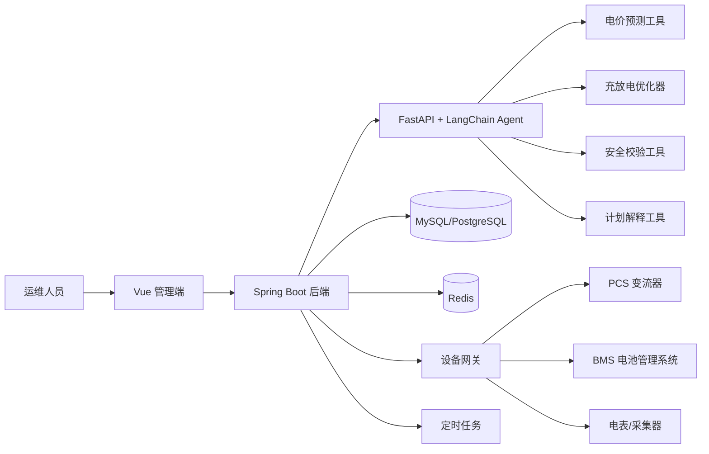
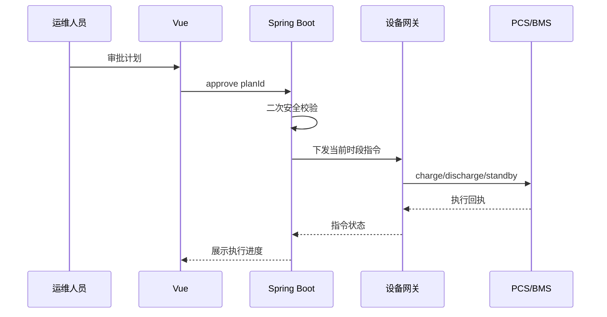

# Spring Boot + Vue 对接 LangChain：电价预测与电池充放电 Agent 实现方案

本文设计一个“电价预测 + 储能电池充放电决策”的 Agent 系统。目标不是让大模型直接控制设备，而是让 Agent 调度预测模型、优化器和安全校验工具，生成可解释、可审批、可回滚的充放电计划。

推荐架构：

```text
Vue 管理端
  -> Spring Boot 业务后端
    -> Python FastAPI + LangChain Agent
      -> 电价预测模型
      -> 优化器
      -> 风险校验工具
    -> EMS/BMS/PCS 设备网关
```

核心原则：

- 电价预测交给时间序列模型，不交给 LLM 瞎猜。
- 充放电计划交给优化算法，不让 LLM 直接下控制指令。
- LangChain Agent 负责编排、解释、调用工具和处理异常。
- Spring Boot 负责权限、审计、调度、设备指令、安全阈值和业务闭环。
- Vue 负责展示预测曲线、计划曲线、收益估算、风险提示和人工审批。

## 业务目标

系统要解决的问题：

1. 预测未来 24 小时或 48 小时分时电价。
2. 结合负荷、光伏发电、电池 SOC、电池容量、充放电功率上限，计算最优充放电计划。
3. 在低价时段充电，高价时段放电，减少购电成本或增加峰谷套利收益。
4. 生成计划前做安全校验，避免过充、过放、超过 PCS 功率、违反并网或合同约束。
5. 支持人工审批，也支持低风险场景自动执行。
6. 执行后持续监控偏差，必要时滚动重算。

典型场景：

- 工商业储能峰谷套利。
- 园区微电网削峰填谷。
- 光伏 + 储能自发自用。
- 数据中心或工厂需量管理。
- 电力现货市场日前/日内价格响应。

## 重要边界

电池充放电会影响真实设备和电网安全。系统必须遵守这些边界：

- Agent 不能绕过 BMS、PCS、EMS 的硬件保护。
- 任何计划都必须经过 Spring Boot 后端安全规则校验。
- 设备指令必须有幂等 ID、审计日志、执行状态回执。
- 高风险操作必须人工确认。
- 预测模型只提供概率判断，不能当成确定事实。
- 现场设备通信异常时，默认进入保守策略或停发新指令。

一句话：LLM 可以解释和编排，不能成为唯一控制源。

## 总体架构



### 模块职责

| 模块 | 技术 | 职责 |
| --- | --- | --- |
| 前端管理端 | Vue 3、Element Plus、ECharts | 展示电价预测、SOC、负荷、计划、执行状态、审批入口 |
| 业务后端 | Spring Boot | 用户权限、站点管理、策略配置、任务调度、审计日志、设备指令 |
| Agent 服务 | Python FastAPI、LangChain、LangGraph | 编排预测、优化、校验、解释、异常处理 |
| 预测模型 | LightGBM/XGBoost/Prophet/LSTM | 输出未来时段电价预测和置信区间 |
| 优化器 | OR-Tools/PuLP/scipy | 根据约束求充放电计划 |
| 数据库 | MySQL/PostgreSQL | 价格、负荷、SOC、计划、指令、审计 |
| 缓存/队列 | Redis/RabbitMQ/Kafka | 实时状态缓存、异步指令、任务事件 |
| 设备网关 | MQTT/Modbus/TCP/HTTP | 对接 PCS、BMS、电表、EMS |

## 为什么不要把 LangChain 直接放进 Spring Boot

LangChain 主生态在 Python，预测模型、优化器、数据科学工具也多在 Python。Spring Boot 更适合做业务系统和设备控制。

推荐拆成两个服务：

```text
Spring Boot：稳定业务后端
Python Agent：AI 编排和算法服务
```

好处：

- Java 和 Python 各做擅长的事。
- 算法服务可以独立升级。
- Agent 异常不会直接拖垮主业务。
- Spring Boot 可以统一做权限、审计和设备安全。
- 后续可把预测模型替换为更专业的时序模型，不影响 Vue 和设备层。

## 核心业务流程

### 1. 每日计划生成

```mermaid
sequenceDiagram
    participant Scheduler as Spring Scheduler
    participant Boot as Spring Boot
    participant Agent as LangChain Agent
    participant Model as Forecast Model
    participant Opt as Optimizer
    participant Risk as Risk Guard
    participant Vue as Vue

    Scheduler->>Boot: 触发日前计划任务
    Boot->>Agent: 请求生成 siteId + 时间范围 + 设备状态
    Agent->>Model: 预测未来电价
    Model-->>Agent: price forecast + confidence
    Agent->>Opt: 求解充放电计划
    Opt-->>Agent: schedule candidates
    Agent->>Risk: 安全校验
    Risk-->>Agent: pass / warnings / reject
    Agent-->>Boot: 返回计划、收益、风险、解释
    Boot->>Boot: 保存计划为 PENDING_APPROVAL
    Boot-->>Vue: 推送待审批计划
```

### 2. 人工审批后执行



### 3. 滚动重算

如果出现这些情况，需要重新生成计划：

- 实时电价偏离预测。
- 负荷偏离预测。
- 光伏出力偏离预测。
- SOC 与计划偏差过大。
- 设备功率受限。
- BMS 报警。
- 人工修改策略。

滚动重算可以每 15 分钟或每小时执行一次。

## 数据输入

### 电价数据

| 字段 | 说明 |
| --- | --- |
| `siteId` | 站点 ID |
| `timestamp` | 时间点 |
| `price` | 电价，单位元/kWh |
| `marketType` | 分时电价、日前、实时、现货 |
| `source` | 数据来源 |
| `quality` | 数据质量 |

如果没有现货电价，可以先使用峰平谷电价表。

### 负荷数据

| 字段 | 说明 |
| --- | --- |
| `loadKw` | 当前负荷功率 |
| `pvKw` | 光伏出力 |
| `gridKw` | 并网点功率 |
| `meterKwh` | 电表读数 |

### 电池状态

| 字段 | 说明 |
| --- | --- |
| `soc` | 当前荷电状态，0-100 |
| `soh` | 健康状态 |
| `capacityKwh` | 可用容量 |
| `maxChargeKw` | 最大充电功率 |
| `maxDischargeKw` | 最大放电功率 |
| `chargeEfficiency` | 充电效率 |
| `dischargeEfficiency` | 放电效率 |
| `minSoc` | 最低 SOC |
| `maxSoc` | 最高 SOC |

## 数据库表设计

### 站点表

```sql
create table energy_site (
    id bigint primary key,
    name varchar(128) not null,
    timezone varchar(64) not null,
    grid_contract_capacity_kw decimal(12, 3),
    created_at timestamp not null,
    updated_at timestamp not null
);
```

### 电价历史表

```sql
create table electricity_price (
    id bigint primary key,
    site_id bigint not null,
    ts timestamp not null,
    price decimal(12, 6) not null,
    price_type varchar(32) not null,
    source varchar(64),
    quality varchar(32),
    unique (site_id, ts, price_type)
);
```

### 电池状态表

```sql
create table battery_snapshot (
    id bigint primary key,
    site_id bigint not null,
    ts timestamp not null,
    soc decimal(8, 4) not null,
    soh decimal(8, 4),
    capacity_kwh decimal(12, 3),
    max_charge_kw decimal(12, 3),
    max_discharge_kw decimal(12, 3),
    alarm_level varchar(32)
);
```

### 充放电计划表

```sql
create table battery_dispatch_plan (
    id bigint primary key,
    site_id bigint not null,
    plan_date date not null,
    horizon_start timestamp not null,
    horizon_end timestamp not null,
    status varchar(32) not null,
    forecast_profit decimal(12, 3),
    risk_level varchar(32),
    explanation text,
    created_by varchar(64),
    approved_by varchar(64),
    created_at timestamp not null,
    approved_at timestamp
);
```

### 计划明细表

```sql
create table battery_dispatch_plan_item (
    id bigint primary key,
    plan_id bigint not null,
    ts timestamp not null,
    action varchar(32) not null,
    power_kw decimal(12, 3) not null,
    expected_soc decimal(8, 4) not null,
    expected_price decimal(12, 6),
    reason varchar(512)
);
```

`action` 建议枚举：

```text
CHARGE
DISCHARGE
STANDBY
HOLD_FOR_RESERVE
```

### 设备指令表

```sql
create table battery_command (
    id bigint primary key,
    command_no varchar(64) not null unique,
    site_id bigint not null,
    plan_item_id bigint,
    action varchar(32) not null,
    power_kw decimal(12, 3) not null,
    status varchar(32) not null,
    request_payload text,
    response_payload text,
    created_at timestamp not null,
    sent_at timestamp,
    finished_at timestamp
);
```

## 预测模型设计

电价预测可以分成两个阶段。

### 阶段一：规则基线

适合没有历史数据的第一版：

- 峰平谷电价表。
- 节假日规则。
- 工作日/周末规则。
- 特殊电价手工导入。

输出未来 24 小时的价格曲线。

### 阶段二：机器学习预测

当有足够历史数据后，引入时序模型：

输入特征：

- 历史电价。
- 小时、星期、月份、节假日。
- 天气温度。
- 历史负荷。
- 光伏预测。
- 市场日前价格。
- 上游燃料或区域负荷数据。

可选模型：

| 模型 | 适合场景 |
| --- | --- |
| LightGBM/XGBoost | 表格特征强，工程落地快 |
| Prophet | 趋势和季节性明显 |
| LSTM/Transformer | 数据量大、波动复杂 |
| 规则 + ML 混合 | 工商业峰谷电价更稳定 |

预测服务返回：

```json
{
  "siteId": 1,
  "horizonStart": "2026-07-28T00:00:00+08:00",
  "intervalMinutes": 15,
  "points": [
    {
      "ts": "2026-07-28T00:00:00+08:00",
      "price": 0.38,
      "lower": 0.35,
      "upper": 0.42,
      "confidence": 0.86
    }
  ]
}
```

## 充放电优化模型

优化目标不是“看低价就充、看高价就放”这么简单。要同时考虑：

- 当前 SOC。
- 充放电效率。
- 最大功率。
- 电池容量。
- 充放电次数。
- 电池衰减成本。
- 备用电量。
- 需量电费。
- 并网功率上限。
- 设备告警。

### 决策变量

每个时间片 `t`：

```text
charge_kw[t]      充电功率
discharge_kw[t]   放电功率
soc[t]            当前 SOC
grid_kw[t]        并网功率
```

### 目标函数

简化目标：

```text
minimize:
  sum(grid_import_kwh[t] * price[t])
  + battery_degradation_cost
  + demand_charge_penalty
  + constraint_violation_penalty
```

如果做峰谷套利，也可以写成最大化收益：

```text
maximize:
  discharge_revenue
  - charge_cost
  - degradation_cost
```

### 约束

```text
min_soc <= soc[t] <= max_soc
0 <= charge_kw[t] <= max_charge_kw
0 <= discharge_kw[t] <= max_discharge_kw
charge_kw[t] 和 discharge_kw[t] 不能同时大于 0
soc[t+1] = soc[t] + charge_energy * charge_efficiency - discharge_energy / discharge_efficiency
grid_kw[t] <= contract_capacity_kw
alarm_level != HIGH
```

第一版可以用启发式规则，第二版再上 MILP/线性规划。

## Agent 设计

Agent 不直接算所有东西，而是调用工具。

```text
Agent
  -> get_site_config
  -> get_battery_snapshot
  -> forecast_price
  -> forecast_load
  -> optimize_dispatch_plan
  -> validate_safety_rules
  -> explain_plan
  -> submit_plan_to_springboot
```

### Agent 输入

```json
{
  "siteId": 1,
  "horizonHours": 24,
  "intervalMinutes": 15,
  "mode": "DAY_AHEAD",
  "allowAutoDispatch": false,
  "operatorInstruction": "优先保证明天 8 点前 SOC 不低于 40%"
}
```

### Agent 输出

```json
{
  "planId": null,
  "riskLevel": "MEDIUM",
  "expectedSaving": 238.62,
  "summary": "建议在 01:00-05:00 低价时段充电，在 18:00-21:00 高价时段放电。",
  "warnings": [
    "20:00 时段预测价格置信度较低，建议人工确认。",
    "计划末端 SOC 为 36%，接近保底阈值 35%。"
  ],
  "items": [
    {
      "ts": "2026-07-28T01:00:00+08:00",
      "action": "CHARGE",
      "powerKw": 250,
      "expectedSoc": 42.5,
      "reason": "低价时段，且夜间负荷低，适合补能。"
    }
  ]
}
```

## Python Agent 服务

### 依赖

```bash
pip install -U fastapi uvicorn langchain langchain-openai langgraph pydantic pandas numpy scikit-learn ortools
```

如果使用阿里百炼 OpenAI 兼容模式：

```bash
set DASHSCOPE_API_KEY=sk-你的Key
```

### FastAPI 入口

```python
from fastapi import FastAPI
from pydantic import BaseModel

from agent.dispatch_agent import run_dispatch_agent


app = FastAPI(title="Energy Dispatch Agent")


class DispatchRequest(BaseModel):
    site_id: int
    horizon_hours: int = 24
    interval_minutes: int = 15
    mode: str = "DAY_AHEAD"
    allow_auto_dispatch: bool = False
    operator_instruction: str | None = None


@app.post("/api/agent/dispatch-plan")
def generate_dispatch_plan(request: DispatchRequest):
    return run_dispatch_agent(request)
```

### LangChain Agent

```python
import os
from typing import Literal

from langchain.agents import create_agent
from langchain_core.tools import tool
from langchain_openai import ChatOpenAI
from pydantic import BaseModel, Field


class PlanItem(BaseModel):
    ts: str
    action: Literal["CHARGE", "DISCHARGE", "STANDBY", "HOLD_FOR_RESERVE"]
    power_kw: float
    expected_soc: float
    reason: str


class DispatchPlanResult(BaseModel):
    risk_level: Literal["LOW", "MEDIUM", "HIGH", "REJECTED"]
    expected_saving: float
    summary: str
    warnings: list[str] = Field(default_factory=list)
    items: list[PlanItem]


@tool
def forecast_price(site_id: int, horizon_hours: int, interval_minutes: int) -> dict:
    """预测指定站点未来电价曲线。"""
    return {
        "points": [
            {"ts": "2026-07-28T01:00:00+08:00", "price": 0.38, "confidence": 0.88},
            {"ts": "2026-07-28T19:00:00+08:00", "price": 1.21, "confidence": 0.81},
        ]
    }


@tool
def optimize_dispatch_plan(site_id: int, price_forecast: dict) -> dict:
    """根据预测电价、电池状态和业务约束生成充放电计划。"""
    return {
        "expected_saving": 238.62,
        "items": [
            {
                "ts": "2026-07-28T01:00:00+08:00",
                "action": "CHARGE",
                "power_kw": 250,
                "expected_soc": 42.5,
                "reason": "低价时段充电",
            },
            {
                "ts": "2026-07-28T19:00:00+08:00",
                "action": "DISCHARGE",
                "power_kw": 220,
                "expected_soc": 55.0,
                "reason": "高价时段放电",
            },
        ],
    }


@tool
def validate_safety_rules(site_id: int, candidate_plan: dict) -> dict:
    """校验 SOC、功率、告警、并网容量和人工审批规则。"""
    return {
        "passed": True,
        "risk_level": "MEDIUM",
        "warnings": ["计划包含晚高峰放电，建议人工审批后执行。"],
    }


def create_energy_agent():
    model = ChatOpenAI(
        model="qwen-plus",
        api_key=os.environ["DASHSCOPE_API_KEY"],
        base_url="https://dashscope.aliyuncs.com/compatible-mode/v1",
        temperature=0.1,
    )

    system_prompt = """
你是储能调度 Agent。你不能直接下发设备指令。
你必须先调用预测工具，再调用优化工具，再调用安全校验工具。
如果安全校验不通过，返回 REJECTED。
输出必须解释计划原因、风险和预计收益。
"""

    return create_agent(
        model=model,
        tools=[forecast_price, optimize_dispatch_plan, validate_safety_rules],
        system_prompt=system_prompt,
        response_format=DispatchPlanResult,
    )


def run_dispatch_agent(request):
    agent = create_energy_agent()
    result = agent.invoke({
        "messages": [
            {
                "role": "user",
                "content": (
                    f"为站点 {request.site_id} 生成未来 {request.horizon_hours} 小时"
                    f"储能充放电计划，时间粒度 {request.interval_minutes} 分钟。"
                    f"运行模式：{request.mode}。"
                    f"人工要求：{request.operator_instruction or '无'}。"
                ),
            }
        ]
    })
    return result["structured_response"].model_dump()
```

这段代码只适合作为骨架。生产环境要把 `forecast_price`、`optimize_dispatch_plan` 和 `validate_safety_rules` 拆成真实服务，并加上超时、重试、日志、链路追踪和权限校验。

## Spring Boot 后端设计

Spring Boot 不直接实现 LangChain，而是通过 HTTP 调用 Python Agent。

### Maven 依赖

```xml
<dependency>
    <groupId>org.springframework.boot</groupId>
    <artifactId>spring-boot-starter-webmvc</artifactId>
</dependency>
<dependency>
    <groupId>org.springframework.boot</groupId>
    <artifactId>spring-boot-starter-validation</artifactId>
</dependency>
<dependency>
    <groupId>org.springframework.boot</groupId>
    <artifactId>spring-boot-starter-data-jpa</artifactId>
</dependency>
<dependency>
    <groupId>org.springframework.boot</groupId>
    <artifactId>spring-boot-starter-actuator</artifactId>
</dependency>
```

如果项目仍是 Spring Boot 3.x，可以继续用：

```xml
<artifactId>spring-boot-starter-web</artifactId>
```

### Agent Client

```java
package com.example.energy.agent;

import org.springframework.stereotype.Component;
import org.springframework.web.client.RestClient;

@Component
public class EnergyAgentClient {

    private final RestClient restClient;

    public EnergyAgentClient(RestClient.Builder builder) {
        this.restClient = builder
                .baseUrl("http://localhost:9000")
                .build();
    }

    public AgentDispatchResponse generatePlan(AgentDispatchRequest request) {
        return restClient.post()
                .uri("/api/agent/dispatch-plan")
                .body(request)
                .retrieve()
                .body(AgentDispatchResponse.class);
    }
}
```

请求对象：

```java
package com.example.energy.agent;

import jakarta.validation.constraints.Max;
import jakarta.validation.constraints.Min;
import jakarta.validation.constraints.NotNull;

public record AgentDispatchRequest(
        @NotNull Long siteId,
        @Min(1) @Max(72) int horizonHours,
        @Min(5) @Max(60) int intervalMinutes,
        String mode,
        boolean allowAutoDispatch,
        String operatorInstruction
) {
}
```

响应对象：

```java
package com.example.energy.agent;

import java.math.BigDecimal;
import java.time.OffsetDateTime;
import java.util.List;

public record AgentDispatchResponse(
        String riskLevel,
        BigDecimal expectedSaving,
        String summary,
        List<String> warnings,
        List<PlanItemResponse> items
) {
    public record PlanItemResponse(
            OffsetDateTime ts,
            String action,
            BigDecimal powerKw,
            BigDecimal expectedSoc,
            String reason
    ) {
    }
}
```

### 后端 Controller

```java
package com.example.energy.dispatch;

import com.example.energy.agent.AgentDispatchRequest;
import jakarta.validation.Valid;
import org.springframework.web.bind.annotation.GetMapping;
import org.springframework.web.bind.annotation.PathVariable;
import org.springframework.web.bind.annotation.PostMapping;
import org.springframework.web.bind.annotation.RequestBody;
import org.springframework.web.bind.annotation.RequestMapping;
import org.springframework.web.bind.annotation.RestController;

import java.util.List;

@RestController
@RequestMapping("/api/energy/sites/{siteId}/dispatch-plans")
public class DispatchPlanController {

    private final DispatchPlanService service;

    public DispatchPlanController(DispatchPlanService service) {
        this.service = service;
    }

    @PostMapping("/generate")
    public DispatchPlanVO generate(
            @PathVariable Long siteId,
            @Valid @RequestBody GeneratePlanRequest request
    ) {
        AgentDispatchRequest agentRequest = new AgentDispatchRequest(
                siteId,
                request.horizonHours(),
                request.intervalMinutes(),
                request.mode(),
                false,
                request.operatorInstruction()
        );
        return service.generatePlan(agentRequest);
    }

    @PostMapping("/{planId}/approve")
    public void approve(@PathVariable Long siteId, @PathVariable Long planId) {
        service.approve(siteId, planId);
    }

    @PostMapping("/{planId}/reject")
    public void reject(@PathVariable Long siteId, @PathVariable Long planId) {
        service.reject(siteId, planId);
    }

    @GetMapping
    public List<DispatchPlanVO> list(@PathVariable Long siteId) {
        return service.list(siteId);
    }
}
```

### Service 核心逻辑

```java
package com.example.energy.dispatch;

import com.example.energy.agent.AgentDispatchRequest;
import com.example.energy.agent.AgentDispatchResponse;
import com.example.energy.agent.EnergyAgentClient;
import org.springframework.stereotype.Service;
import org.springframework.transaction.annotation.Transactional;

@Service
public class DispatchPlanService {

    private final EnergyAgentClient agentClient;
    private final DispatchPlanRepository planRepository;
    private final SafetyRuleService safetyRuleService;

    public DispatchPlanService(
            EnergyAgentClient agentClient,
            DispatchPlanRepository planRepository,
            SafetyRuleService safetyRuleService
    ) {
        this.agentClient = agentClient;
        this.planRepository = planRepository;
        this.safetyRuleService = safetyRuleService;
    }

    @Transactional
    public DispatchPlanVO generatePlan(AgentDispatchRequest request) {
        AgentDispatchResponse response = agentClient.generatePlan(request);

        safetyRuleService.validatePlanBeforeSave(request.siteId(), response);

        DispatchPlan plan = DispatchPlan.fromAgentResponse(request.siteId(), response);
        plan.markPendingApproval();
        planRepository.save(plan);

        return DispatchPlanVO.from(plan);
    }

    @Transactional
    public void approve(Long siteId, Long planId) {
        DispatchPlan plan = planRepository.getBySiteIdAndId(siteId, planId);
        safetyRuleService.validatePlanBeforeApprove(plan);
        plan.approve(CurrentUser.username());
    }
}
```

### 定时任务

```java
package com.example.energy.scheduler;

import com.example.energy.dispatch.DispatchPlanJob;
import org.springframework.scheduling.annotation.Scheduled;
import org.springframework.stereotype.Component;

@Component
public class EnergyDispatchScheduler {

    private final DispatchPlanJob job;

    public EnergyDispatchScheduler(DispatchPlanJob job) {
        this.job = job;
    }

    @Scheduled(cron = "0 5 0 * * *")
    public void generateDayAheadPlan() {
        job.generateDayAheadPlans();
    }

    @Scheduled(cron = "0 */15 * * * *")
    public void rollingReplan() {
        job.replanWhenDeviationTooLarge();
    }
}
```

## 设备指令设计

设备层不要直接暴露给 Agent。Spring Boot 统一生成指令：

```java
public record BatteryCommandRequest(
        Long siteId,
        Long planItemId,
        String action,
        BigDecimal powerKw,
        String commandNo
) {
}
```

指令下发前必须检查：

- 当前计划已审批。
- 当前时间落在计划时间片附近。
- 当前 SOC 未越界。
- BMS 无高等级告警。
- PCS 在线。
- 指令功率未超过限制。
- 同一时间片没有重复执行。

设备网关可以走：

- MQTT：适合物联网设备。
- Modbus TCP：适合工控设备。
- HTTP：适合已有 EMS 网关。
- OPC UA：适合工业系统集成。

## 安全规则

安全规则建议配置化。

```yaml
energy:
  dispatch:
    min-soc: 20
    max-soc: 95
    reserve-soc: 35
    max-charge-kw: 500
    max-discharge-kw: 500
    require-approval-risk-level: MEDIUM
    auto-dispatch-risk-level: LOW
```

规则分三层。

### 1. 硬约束

违反就拒绝：

- SOC 低于 `minSoc`。
- SOC 高于 `maxSoc`。
- BMS 高等级告警。
- PCS 离线。
- 超过最大功率。
- 计划时间已过期。

### 2. 软约束

允许但提示：

- 预测置信度低。
- 收益低于阈值。
- 充放电切换过于频繁。
- 计划末端 SOC 接近保底。

### 3. 审批规则

```text
LOW     -> 可自动执行
MEDIUM  -> 人工审批
HIGH    -> 高级审批
REJECTED -> 禁止执行
```

## Vue 前端页面

### 页面结构

```text
src/views/energy/
  site-dashboard.vue
  price-forecast.vue
  dispatch-plan.vue
  dispatch-approval.vue
  battery-monitor.vue
```

### 关键组件

| 组件 | 展示内容 |
| --- | --- |
| `PriceForecastChart` | 预测电价、置信区间、实际电价 |
| `BatterySocChart` | 计划 SOC、实际 SOC |
| `DispatchPowerChart` | 充电功率、放电功率 |
| `PlanRiskPanel` | 风险等级、警告、审批要求 |
| `PlanItemTable` | 每个时间片动作、功率、原因 |
| `CommandStatusTimeline` | 指令下发和执行回执 |

### Vue API

```ts
import request from "@/utils/request";

export interface GeneratePlanRequest {
  horizonHours: number;
  intervalMinutes: number;
  mode: string;
  operatorInstruction?: string;
}

export function generateDispatchPlan(siteId: number, data: GeneratePlanRequest) {
  return request.post(`/api/energy/sites/${siteId}/dispatch-plans/generate`, data);
}

export function approveDispatchPlan(siteId: number, planId: number) {
  return request.post(`/api/energy/sites/${siteId}/dispatch-plans/${planId}/approve`);
}

export function rejectDispatchPlan(siteId: number, planId: number) {
  return request.post(`/api/energy/sites/${siteId}/dispatch-plans/${planId}/reject`);
}
```

### 页面交互

1. 用户选择站点。
2. 页面加载当前 SOC、负荷、电价、已有计划。
3. 用户点击“生成计划”。
4. Spring Boot 调用 Agent。
5. 页面展示预测曲线和计划曲线。
6. 用户查看 Agent 解释和安全警告。
7. 用户审批或驳回。
8. 执行后页面实时展示指令状态。

## 接口清单

| 方法 | 路径 | 说明 |
| --- | --- | --- |
| `GET` | `/api/energy/sites` | 查询站点 |
| `GET` | `/api/energy/sites/{siteId}/battery/latest` | 查询最新电池状态 |
| `GET` | `/api/energy/sites/{siteId}/prices` | 查询历史/预测电价 |
| `POST` | `/api/energy/sites/{siteId}/dispatch-plans/generate` | 生成充放电计划 |
| `GET` | `/api/energy/sites/{siteId}/dispatch-plans` | 查询计划列表 |
| `GET` | `/api/energy/sites/{siteId}/dispatch-plans/{planId}` | 查询计划详情 |
| `POST` | `/api/energy/sites/{siteId}/dispatch-plans/{planId}/approve` | 审批计划 |
| `POST` | `/api/energy/sites/{siteId}/dispatch-plans/{planId}/reject` | 驳回计划 |
| `GET` | `/api/energy/sites/{siteId}/commands` | 查询设备指令 |

## 状态流转

### 计划状态

```text
GENERATING
PENDING_APPROVAL
APPROVED
REJECTED
EXECUTING
FINISHED
PARTIAL_FAILED
CANCELLED
```

### 指令状态

```text
CREATED
SENT
ACKED
RUNNING
SUCCESS
FAILED
TIMEOUT
CANCELLED
```

## 异常处理

### Agent 服务不可用

策略：

- Spring Boot 返回明确错误。
- 不生成新计划。
- 保留上一版已审批计划。
- 如果当前计划即将过期，进入保守策略。

### 预测置信度低

策略：

- 风险等级提升到 `MEDIUM` 或 `HIGH`。
- 禁止自动执行。
- 前端展示“预测不确定性”。

### 设备状态异常

策略：

- 停止下发新指令。
- 已发送指令等待设备回执。
- BMS 高等级告警时强制切到 `STANDBY`。

### 价格突变

策略：

- 触发滚动重算。
- 比较新旧计划收益差。
- 如果差异超过阈值，生成新计划并要求审批。

## 日志和审计

必须记录：

- 谁生成了计划。
- 输入数据版本。
- Agent 使用的模型名称。
- 预测模型版本。
- 优化器版本。
- 安全规则版本。
- 计划收益估算。
- 审批人和审批时间。
- 每条设备指令的请求和回执。

建议每次 Agent 调用生成一个 `traceId`：

```text
traceId = siteId + planDate + randomSuffix
```

Spring Boot、Agent 服务、设备网关都带上这个 `traceId`。

## 权限设计

角色建议：

| 角色 | 权限 |
| --- | --- |
| `ENERGY_VIEWER` | 查看预测、计划、设备状态 |
| `ENERGY_OPERATOR` | 手动生成计划、提交审批 |
| `ENERGY_APPROVER` | 审批中风险计划 |
| `ENERGY_ADMIN` | 配置策略、安全阈值、设备参数 |
| `SYSTEM_ADMIN` | 系统管理 |

权限点：

```text
energy:site:view
energy:price:view
energy:plan:generate
energy:plan:approve
energy:plan:reject
energy:command:view
energy:config:update
```

## 部署方案

```text
docker-compose / Kubernetes
  springboot-energy-api
  python-langchain-agent
  mysql/postgresql
  redis
  mqtt-broker
  nginx
```

环境变量：

```bash
AGENT_BASE_URL=http://python-langchain-agent:9000
DASHSCOPE_API_KEY=sk-xxx
SPRING_PROFILES_ACTIVE=prod
ENERGY_AUTO_DISPATCH_ENABLED=false
```

生产建议：

- Agent 服务和设备网关内网访问。
- API Key 走密钥管理。
- 数据库定期备份。
- 设备指令表长期留存。
- 接入 Prometheus/Grafana 监控。
- 对计划生成失败、设备指令失败、SOC 越界报警。

## MVP 迭代路线

### 第一阶段：可视化和手动策略

- 接入电价、负荷、SOC 数据。
- Vue 展示曲线。
- 后端保存人工充放电计划。
- 不接 Agent。

### 第二阶段：规则预测和规则调度

- 使用峰平谷电价表生成预测。
- 使用简单规则生成计划。
- 人工审批后执行。

规则示例：

```text
低价时段且 SOC < 80% -> 充电
高价时段且 SOC > 35% -> 放电
其它时段 -> 待机
```

### 第三阶段：LangChain Agent 编排

- Agent 调用预测、优化、安全校验工具。
- 返回结构化计划。
- 前端展示解释和风险。

### 第四阶段：优化器增强

- 引入 OR-Tools/PuLP。
- 加入需量电费、光伏预测、电池衰减成本。
- 支持多目标优化。

### 第五阶段：自动执行和滚动优化

- 低风险计划自动执行。
- 15 分钟滚动重算。
- 设备异常自动降级。

## 项目目录建议

### Spring Boot

```text
energy-api/
  src/main/java/com/example/energy/
    agent/
      EnergyAgentClient.java
      AgentDispatchRequest.java
      AgentDispatchResponse.java
    dispatch/
      DispatchPlanController.java
      DispatchPlanService.java
      DispatchPlan.java
      DispatchPlanItem.java
    battery/
      BatterySnapshot.java
      BatteryService.java
    price/
      ElectricityPrice.java
      ElectricityPriceService.java
    command/
      BatteryCommand.java
      BatteryCommandService.java
    safety/
      SafetyRuleService.java
    scheduler/
      EnergyDispatchScheduler.java
```

### Python Agent

```text
energy-agent/
  app.py
  agent/
    dispatch_agent.py
    prompts.py
  tools/
    price_forecast_tool.py
    load_forecast_tool.py
    optimizer_tool.py
    safety_tool.py
  models/
    price_forecaster.py
    schemas.py
  optimizer/
    battery_optimizer.py
```

### Vue

```text
src/
  api/
    energy.ts
  views/
    energy/
      site-dashboard.vue
      dispatch-plan.vue
      dispatch-approval.vue
  components/
    energy/
      PriceForecastChart.vue
      BatterySocChart.vue
      DispatchPowerChart.vue
      PlanRiskPanel.vue
```

## 生产 Checklist

1. Agent 输出必须是结构化 JSON，并做后端校验。
2. Agent 不能直接访问设备网关。
3. 所有设备指令必须由 Spring Boot 生成并审计。
4. 所有计划执行前必须二次读取最新 SOC 和设备告警。
5. 所有自动执行必须有风险等级限制。
6. 所有预测结果必须保存版本和时间。
7. 所有计划必须支持人工驳回和取消。
8. 所有指令必须有幂等号。
9. 所有异常必须有降级策略。
10. 所有收益统计都要区分“预测收益”和“实际收益”。

## 总结

这个系统的关键不是“让大模型预测电价”，而是把大模型放在正确的位置：

- 预测由专业时序模型完成。
- 调度由优化算法完成。
- 安全由硬规则和设备保护完成。
- Agent 负责编排工具、解释计划、处理上下文和辅助运维决策。

Spring Boot + Vue 提供稳定的业务闭环，LangChain Agent 提供智能编排能力。这样的架构既能体现 AI 的价值，也不会让设备控制失去边界。

## 参考资料

- [LangChain Agents 文档](https://docs.langchain.com/oss/python/langchain/agents)
- [LangChain Structured Output 文档](https://docs.langchain.com/oss/python/langchain/structured-output)
- [LangGraph Persistence 文档](https://docs.langchain.com/oss/python/langgraph/persistence)
- [LangChain Human-in-the-loop 文档](https://docs.langchain.com/oss/python/langchain/human-in-the-loop)
- [Spring Boot REST Client 文档](https://docs.spring.io/spring-boot/reference/io/rest-client.html)
- [Spring Framework RestClient 文档](https://docs.spring.io/spring-framework/reference/integration/rest-clients.html)
