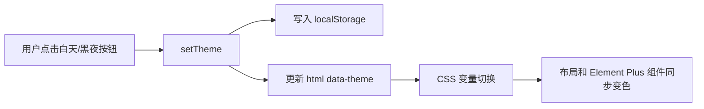

# Vue 3 后台系统白天/黑夜模式从 0 到 1 实战

## 0. 目标

这篇文章记录如何把一个没有主题能力的 Vue 3 后台系统，从 0 到 1 改造成支持白天模式和黑夜模式。

最终效果：

- 右上角有白天/黑夜模式切换按钮。
- 登录页也可以切换白天/黑夜。
- 用户选择会保存到 `localStorage`。
- 刷新页面后保持上次选择。
- 布局、侧边栏、顶部栏、按钮、输入框、表格、弹窗、分页等组件跟随主题变化。
- 样式接近现代后台面板风格：浅色模式清爽，深色模式低亮度、细边框、弱对比、蓝紫强调色。

技术栈：

```text
Vue 3
Vite
Element Plus
TypeScript
CSS Variables
```

## 1. 先确定主题方案

实现白天/黑夜模式常见有四种方案。

| 方案 | 做法 | 优点 | 缺点 |
| --- | --- | --- | --- |
| 复制两套 CSS | `light.css`、`dark.css` 分开写 | 直观，容易理解 | 重复多，维护成本高 |
| CSS 变量 | 用 `--app-bg`、`--app-text` 等变量控制颜色 | 维护简单，组件无需感知主题 | 需要先设计变量体系 |
| CSS 预处理器变量 | Sass/Less 编译时生成主题 | 适合静态主题 | 运行时切换不方便 |
| UI 库内置暗黑模式 | 例如 Element Plus 的 dark css | 组件覆盖少 | 业务布局和自定义组件仍要自己处理 |

本项目选择：**CSS 变量 + 主题状态 + 少量 Element Plus 覆盖**。

原因：

- 后台系统里自定义布局较多，只靠 Element Plus 暗黑模式不够。
- 运行时切换需要立即生效，CSS 变量最合适。
- 主题变量可以逐步扩展，不需要一次性重构所有页面。
- 业务组件只使用变量，不需要知道当前是白天还是黑夜。

## 2. 设计主题变量

不要一开始就写：

```css
.dark .header {
  background: #090c16;
}

.light .header {
  background: #ffffff;
}
```

这样写会让每个组件都关心主题，后期会越来越乱。

更好的做法是先抽象语义变量：

```text
--app-bg             页面背景
--app-sidebar-bg     侧边栏背景
--app-header-bg      顶部栏背景
--app-panel-bg       卡片/面板背景
--app-control-bg     输入框/按钮背景
--app-text           正文颜色
--app-muted          次级文字颜色
--app-border         细边框颜色
--app-accent         强调色
--app-panel-shadow   面板阴影
```

组件只使用这些变量：

```css
.layout-header {
  background: var(--app-header-bg);
  border-bottom: 1px solid var(--app-border);
  color: var(--app-text);
}
```

切换主题时，只需要改变变量值。

## 3. 新增主题状态模块

创建文件：

```text
src/theme/index.ts
```

代码：

```ts
import { computed, ref } from "vue";

export type AppTheme = "light" | "dark";

const STORAGE_KEY = "theme";

function normalizeTheme(theme?: string | null): AppTheme {
  return theme === "dark" ? "dark" : "light";
}

function preferredTheme(): AppTheme {
  const stored = localStorage.getItem(STORAGE_KEY);
  if (stored) return normalizeTheme(stored);
  return "light";
}

export const appTheme = ref<AppTheme>(preferredTheme());
export const isDarkTheme = computed(() => appTheme.value === "dark");

export function applyTheme(theme: AppTheme) {
  document.documentElement.dataset.theme = theme;
  document.documentElement.style.colorScheme = theme;
}

export function setTheme(theme: AppTheme) {
  appTheme.value = theme;
  localStorage.setItem(STORAGE_KEY, theme);
  applyTheme(theme);
}

export function toggleTheme() {
  setTheme(isDarkTheme.value ? "light" : "dark");
}

applyTheme(appTheme.value);
```

这里做了几件事：

- `appTheme` 保存当前主题。
- `setTheme` 负责切换主题并写入缓存。
- `applyTheme` 把主题写到 HTML 根节点。
- `document.documentElement.dataset.theme = theme` 会生成：

```html
<html data-theme="light">
```

或：

```html
<html data-theme="dark">
```

CSS 里就可以通过：

```css
:root[data-theme="dark"] {
  --app-bg: #060812;
}
```

覆盖变量。

## 4. 定义白天模式变量

修改全局样式文件：

```text
src/assets/global.css
```

先写默认主题，也就是白天模式：

```css
:root {
  --app-bg: #f5f6fa;
  --app-sidebar-bg: #ffffff;
  --app-header-bg: rgba(255, 255, 255, 0.88);
  --app-panel-bg: #ffffff;
  --app-panel-muted: #f8f9fc;
  --app-control-bg: #ffffff;
  --app-hover-bg: #eef1f7;
  --app-active-bg: #171b2a;
  --app-active-text: #ffffff;
  --app-text: #202431;
  --app-heading: #0f1320;
  --app-muted: #72798a;
  --app-subtle: #9aa1af;
  --app-border: rgba(28, 34, 51, 0.12);
  --app-strong-border: rgba(28, 34, 51, 0.18);
  --app-accent: #4f46ff;
  --app-accent-hover: #3f37d8;
  --app-table-header: #f5f6fa;
  --app-table-row-hover: #f8f9fd;
  --app-header-shadow: 0 1px 0 rgba(20, 25, 38, 0.04);
  --app-panel-shadow: 0 18px 42px rgba(24, 32, 56, 0.08);
  --app-control-shadow: 0 1px 1px rgba(22, 27, 40, 0.04);
  --app-active-shadow: 0 8px 18px rgba(30, 35, 54, 0.18);
}
```

白天模式的设计重点：

- 页面背景不要纯白，用很浅的灰蓝色。
- 卡片和表格面板用白色。
- 边框用低透明度，不要太重。
- 激活菜单用深色块，形成明确层级。
- 阴影要轻，不要像营销页卡片一样重。

## 5. 定义黑夜模式变量

继续在 `global.css` 中写黑夜变量：

```css
:root[data-theme="dark"] {
  --app-bg: #060812;
  --app-sidebar-bg: #070912;
  --app-header-bg: rgba(13, 18, 38, 0.88);
  --app-panel-bg: #090c16;
  --app-panel-muted: #101528;
  --app-control-bg: rgba(255, 255, 255, 0.07);
  --app-hover-bg: rgba(255, 255, 255, 0.1);
  --app-active-bg: #eef0ff;
  --app-active-text: #111427;
  --app-text: #e8ebf6;
  --app-heading: #ffffff;
  --app-muted: #a1a8bb;
  --app-subtle: #687085;
  --app-border: rgba(217, 224, 255, 0.14);
  --app-strong-border: rgba(217, 224, 255, 0.22);
  --app-accent: #4f46ff;
  --app-accent-hover: #716aff;
  --app-table-header: rgba(255, 255, 255, 0.05);
  --app-table-row-hover: rgba(255, 255, 255, 0.055);
  --app-header-shadow: 0 1px 0 rgba(255, 255, 255, 0.04);
  --app-panel-shadow: 0 22px 54px rgba(0, 0, 0, 0.42);
  --app-control-shadow: 0 1px 0 rgba(255, 255, 255, 0.04) inset;
  --app-active-shadow: 0 8px 22px rgba(79, 70, 255, 0.24);
}
```

黑夜模式注意事项：

- 背景不要用纯黑 `#000`，容易刺眼。
- 面板和页面背景要有层次，例如 `#060812` 和 `#090c16`。
- 文字不要用纯白大面积铺开，正文用低一点的亮度。
- 边框用半透明浅色，不要用纯灰实线。
- 强调色保留蓝紫色，可以让黑夜模式更有识别度。

## 6. 接入 Element Plus 变量

Element Plus 有自己的 CSS 变量。黑夜模式下如果不覆盖，会出现输入框、弹窗、表格仍然偏白的问题。

可以在 `:root[data-theme="dark"]` 中补充：

```css
:root[data-theme="dark"] {
  --el-bg-color: var(--app-panel-bg);
  --el-bg-color-overlay: #121625;
  --el-text-color-primary: var(--app-text);
  --el-text-color-regular: var(--app-muted);
  --el-text-color-secondary: var(--app-subtle);
  --el-border-color: var(--app-border);
  --el-border-color-light: var(--app-border);
  --el-border-color-lighter: rgba(217, 224, 255, 0.09);
  --el-fill-color-blank: transparent;
  --el-mask-color: rgba(0, 0, 0, 0.58);
}
```

同时可以定义主题主色：

```css
:root {
  --el-color-primary: var(--app-accent);
  --el-color-primary-dark-2: var(--app-accent-hover);
}
```

这样按钮、选择器、分页等组件的主色会统一。

## 7. 写全局基础样式

先保证页面占满窗口：

```css
html,
body,
#app {
  width: 100%;
  height: 100%;
  margin: 0;
  overflow: hidden;
}

body {
  min-width: 320px;
  color: var(--app-text);
  background: var(--app-bg);
}

* {
  box-sizing: border-box;
}
```

后台系统一般不希望整个页面出现浏览器滚动条，而是让主内容区域内部滚动。

## 8. 改造按钮样式

项目里常见两类按钮：

- 主要按钮：保存、新增、同步。
- 次要按钮：取消、重置、筛选。

主要按钮：

```css
.btn-black {
  height: 36px;
  padding: 0 16px !important;
  color: var(--app-active-text) !important;
  background: var(--app-active-bg) !important;
  border: 1px solid transparent !important;
  border-radius: 10px !important;
  box-shadow: var(--app-active-shadow);
}

.btn-black:hover {
  color: var(--app-active-text) !important;
  background: var(--app-accent) !important;
}
```

次要按钮：

```css
.btn-transparent {
  height: 36px;
  padding: 0 14px !important;
  color: var(--app-text) !important;
  background: var(--app-control-bg) !important;
  border: 1px solid var(--app-border) !important;
  border-radius: 10px !important;
}

.btn-transparent:hover {
  background: var(--app-hover-bg) !important;
  border-color: var(--app-strong-border) !important;
}
```

这样按钮不需要在每个页面分别判断主题。

## 9. 改造输入框和选择器

输入框、文本域、选择器统一使用控制变量：

```css
.el-input__wrapper,
.el-textarea__wrapper,
.el-select__wrapper {
  min-height: 36px;
  color: var(--app-text);
  background: var(--app-control-bg) !important;
  border: 1px solid var(--app-border);
  border-radius: 10px !important;
  box-shadow: none !important;
}

.el-input__wrapper:hover,
.el-textarea__wrapper:hover,
.el-select__wrapper:hover {
  border-color: var(--app-strong-border);
}

.el-input__wrapper.is-focus,
.el-textarea__wrapper.is-focus,
.el-select__wrapper.is-focused {
  border-color: var(--app-accent);
}
```

占位符也要处理：

```css
.el-input__inner::placeholder,
.el-textarea__inner::placeholder {
  color: var(--app-subtle) !important;
}
```

否则黑夜模式里 placeholder 可能太亮或太暗。

## 10. 改造表格

后台系统最常见的问题是：页面切黑了，表格还是白的。

可以统一覆盖 Element Plus 表格：

```css
.el-table {
  color: var(--app-text) !important;
  background: var(--app-panel-bg) !important;
  border: 1px solid var(--app-border) !important;
  border-radius: 14px;
  overflow: hidden;
  --el-table-border-color: var(--app-border);
  --el-table-header-bg-color: var(--app-table-header);
  --el-table-tr-bg-color: var(--app-panel-bg);
  --el-table-row-hover-bg-color: var(--app-table-row-hover);
  --el-table-text-color: var(--app-text);
  --el-table-header-text-color: var(--app-muted);
}

.el-table th.el-table__cell {
  height: 42px;
  color: var(--app-muted);
  font-weight: 600;
  background: var(--app-table-header) !important;
}

.el-table td.el-table__cell {
  height: 42px;
  background: var(--app-panel-bg);
}
```

表格风格建议：

- 表头不要太重。
- 行高保持紧凑。
- hover 只做轻微变化。
- 边框尽量细。

## 11. 改造弹窗和卡片

弹窗：

```css
.el-dialog {
  background: var(--app-panel-bg) !important;
  border: 1px solid var(--app-border);
  border-radius: 16px !important;
  box-shadow: var(--app-panel-shadow);
}

.el-dialog__header {
  padding: 18px 22px !important;
  border-bottom: 1px solid var(--app-border);
}

.el-dialog__body {
  padding: 22px !important;
  color: var(--app-text);
}

.el-dialog__footer {
  padding: 16px 22px !important;
  border-top: 1px solid var(--app-border);
}
```

卡片和查询面板：

```css
.el-card,
.query-panel {
  color: var(--app-text);
  background: var(--app-panel-bg) !important;
  border: 1px solid var(--app-border) !important;
  border-radius: 16px !important;
  box-shadow: var(--app-panel-shadow);
}
```

## 12. 新增主题切换组件

创建文件：

```text
src/components/theme-switcher/ThemeSwitcher.vue
```

模板：

```vue
<template>
  <div class="theme-switcher" aria-label="主题">
    <button
      type="button"
      class="theme-switcher__button"
      :class="{ active: appTheme === 'light' }"
      aria-label="白天模式"
      @click="setTheme('light')"
    >
      <el-icon><Sunny /></el-icon>
    </button>

    <button
      type="button"
      class="theme-switcher__button"
      :class="{ active: appTheme === 'dark' }"
      aria-label="黑夜模式"
      @click="setTheme('dark')"
    >
      <el-icon><Moon /></el-icon>
    </button>
  </div>
</template>
```

脚本：

```ts
import { appTheme, setTheme } from "@/theme";
```

样式：

```css
.theme-switcher {
  display: inline-flex;
  align-items: center;
  gap: 4px;
  height: 38px;
  padding: 3px;
  border: 1px solid var(--app-border);
  border-radius: 12px;
  background: var(--app-control-bg);
  box-shadow: var(--app-control-shadow);
}

.theme-switcher__button {
  display: inline-flex;
  align-items: center;
  justify-content: center;
  width: 30px;
  height: 30px;
  padding: 0;
  color: var(--app-muted);
  cursor: pointer;
  background: transparent;
  border: 0;
  border-radius: 9px;
}

.theme-switcher__button:hover {
  color: var(--app-text);
  background: var(--app-hover-bg);
}

.theme-switcher__button.active {
  color: var(--app-active-text);
  background: var(--app-active-bg);
  box-shadow: var(--app-active-shadow);
}
```

这里使用图标按钮，不使用“白天模式 / 黑夜模式”大段文字，是因为顶部栏空间有限，图标更适合工具类操作。

## 13. 放到后台右上角

在布局组件中引入：

```ts
import ThemeSwitcher from "@/components/theme-switcher/ThemeSwitcher.vue";
```

放到右上角工具区：

```vue
<div class="header-actions">
  <ThemeSwitcher />
  <LanguageSwitcher />
  <el-dropdown>
    ...
  </el-dropdown>
</div>
```

工具区样式：

```css
.header-actions {
  display: flex;
  align-items: center;
  gap: 10px;
  margin-left: auto;
}
```

这样主题按钮会固定在右上角，并且和语言切换、用户菜单保持同一视觉层级。

## 14. 登录页也要支持主题切换

如果只在后台布局里放主题按钮，用户登录前无法切换主题。

登录页可以在右上角增加：

```vue
<div class="login-tools">
  <ThemeSwitcher />
</div>
```

样式：

```css
.login-tools {
  position: fixed;
  top: 20px;
  right: 24px;
  z-index: 2;
}
```

登录容器也要使用主题变量：

```css
.login-container {
  display: flex;
  justify-content: center;
  align-items: center;
  position: relative;
  height: 100vh;
  overflow: hidden;
  color: var(--app-text);
  background:
    radial-gradient(circle at 50% 0, var(--app-login-glow), transparent 34%),
    var(--app-bg);
}
```

登录卡片：

```css
.login-box {
  width: 360px;
  padding: 32px;
  text-align: center;
  background: var(--app-panel-bg);
  border: 1px solid var(--app-border);
  border-radius: 18px;
  box-shadow: var(--app-panel-shadow);
}
```

## 15. 改造顶部栏

顶部栏要接近现代后台工具条，而不是普通网页导航。

```css
.layout-header {
  height: 68px;
  line-height: 68px;
  background: var(--app-header-bg);
  padding: 0 24px;
  color: var(--app-text);
  border-bottom: 1px solid var(--app-border);
  box-shadow: var(--app-header-shadow);
  backdrop-filter: blur(18px);
}
```

`backdrop-filter` 可以让顶部栏有轻微玻璃质感。注意不要过度使用，大面积模糊会影响性能。

## 16. 改造侧边栏

侧边栏使用单独背景变量：

```css
.sidebar {
  transition: width 0.25s ease;
  overflow: hidden;
  flex-shrink: 0;
  background: var(--app-sidebar-bg);
  border-right: 1px solid var(--app-border);
}
```

菜单整体：

```css
.sidebar-menu {
  height: 100%;
  width: 100%;
  padding: 18px 14px;
  background: transparent;
  --el-menu-bg-color: transparent;
  --el-menu-text-color: var(--app-muted);
  --el-menu-active-color: var(--app-text);
  --el-menu-hover-bg-color: var(--app-hover-bg);
}
```

菜单项：

```css
.sidebar-menu :deep(.el-menu-item),
.sidebar-menu :deep(.el-sub-menu__title) {
  height: 44px;
  margin: 4px 0;
  color: var(--app-muted);
  border: 1px solid transparent;
  border-radius: 12px;
}
```

激活状态：

```css
.sidebar-menu :deep(.el-menu-item.is-active),
.sidebar-menu :deep(.el-sub-menu.is-active > .el-sub-menu__title) {
  color: var(--app-active-text) !important;
  background: var(--app-active-bg) !important;
  border-color: transparent;
  box-shadow: var(--app-active-shadow);
}
```

这样白天模式下激活菜单是深色块，黑夜模式下激活菜单是浅色块，识别度都比较高。

## 17. 改造主内容区域

主区域只负责承载页面，不要写死颜色：

```css
.layout-main {
  min-width: 0;
  min-height: 0;
  padding: 0;
  overflow: hidden;
  background: var(--app-bg);
}
```

页面容器：

```css
.page-container {
  display: flex;
  flex-direction: column;
  height: 100%;
  min-height: 0;
  padding: 20px;
  overflow: hidden;
  color: var(--app-text);
  background:
    radial-gradient(circle at 50% 0, var(--app-login-glow), transparent 30%),
    var(--app-bg);
}
```

这里的径向渐变很轻，只提供一点顶部光感，不要做成明显装饰。

## 18. 处理语言文案

如果项目已经接入国际化，主题按钮文案也要加入语言文件：

```ts
app: {
  theme: "主题",
  lightMode: "白天模式",
  darkMode: "黑夜模式",
}
```

英文：

```ts
app: {
  theme: "Theme",
  lightMode: "Light mode",
  darkMode: "Dark mode",
}
```

按钮上可以使用 `aria-label` 或 tooltip：

```vue
<el-tooltip :content="t('app.lightMode')" placement="bottom">
  <button :aria-label="t('app.lightMode')">
    <el-icon><Sunny /></el-icon>
  </button>
</el-tooltip>
```

这样视觉上保持图标按钮，辅助信息也完整。

## 19. 验证主题是否生效

### 检查 HTML 属性

切换到白天模式：

```html
<html data-theme="light">
```

切换到黑夜模式：

```html
<html data-theme="dark">
```

如果这个属性没有变化，说明主题状态没有成功写入根节点。

### 检查 localStorage

浏览器控制台：

```js
localStorage.getItem("theme")
```

应该得到：

```text
light
```

或：

```text
dark
```

刷新页面后主题应该保持一致。

### 检查构建

执行：

```sh
pnpm run build
```

如果使用 npm：

```sh
npm run build
```

构建通过后，说明 TypeScript、Vue 单文件组件和 CSS 都没有语法问题。

## 20. 常见问题

### 页面背景切换了，表格没切换

原因通常是 Element Plus 表格有自己的变量。

检查是否覆盖了：

```css
--el-table-header-bg-color
--el-table-tr-bg-color
--el-table-row-hover-bg-color
--el-table-border-color
```

### 弹窗仍然是白色

检查：

```css
.el-dialog {
  background: var(--app-panel-bg) !important;
}
```

还要检查 `--el-bg-color-overlay`。

### 输入框边框或背景不对

Element Plus 输入框背景在 `.el-input__wrapper` 上，不是在 `.el-input` 上。

应该改：

```css
.el-input__wrapper {
  background: var(--app-control-bg) !important;
}
```

### 刷新后主题丢失

检查 `setTheme` 是否写入：

```ts
localStorage.setItem("theme", theme);
```

还要检查初始化时是否读取：

```ts
localStorage.getItem("theme")
```

### 登录页不能切换主题

后台系统常见问题是主题按钮只放在后台布局里。

登录页不经过后台布局，所以也要单独放一个 `ThemeSwitcher`。

## 21. 推荐迁移顺序

如果是旧项目，不建议一次改完所有页面。

推荐顺序：

1. 新建 `src/theme/index.ts`。
2. 在根节点写入 `data-theme`。
3. 在 `global.css` 定义白天和黑夜变量。
4. 先改 `body`、顶部栏、侧边栏、主内容背景。
5. 新增右上角 `ThemeSwitcher`。
6. 改登录页主题按钮。
7. 统一覆盖按钮、输入框、选择器。
8. 统一覆盖表格、弹窗、卡片。
9. 逐个检查业务页面里的硬编码颜色。
10. 执行构建和截图检查。

查找硬编码颜色可以用：

```sh
rg -n "#[0-9a-fA-F]{3,8}|rgb\\(|rgba\\(" src
```

不是所有颜色都必须删掉，例如图表颜色、状态标签颜色可以保留。但布局、面板、文字、边框、按钮背景应该尽量走变量。

## 22. 本次项目落地文件

本次实现涉及：

```text
src/theme/index.ts
src/components/theme-switcher/ThemeSwitcher.vue
src/assets/global.css
src/layout/index.vue
src/layout/Sidebar.vue
src/components/query-panel/CollapsibleQuery.vue
src/views/login/index.vue
src/i18n/messages.ts
```

核心思路是：



只要组件样式都使用 `var(--app-*)`，主题切换就会自然生效。后续新增页面时，也只需要继续使用这些语义变量，不需要重新判断当前主题。
