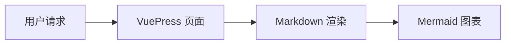
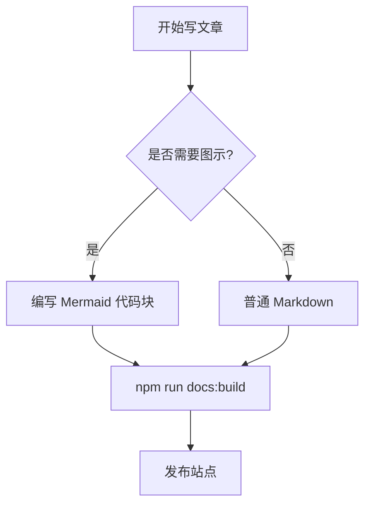
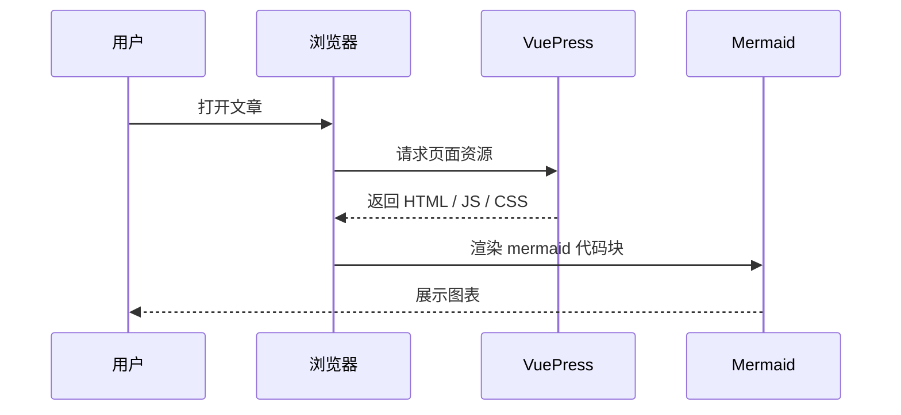
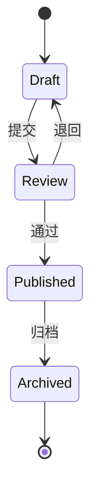
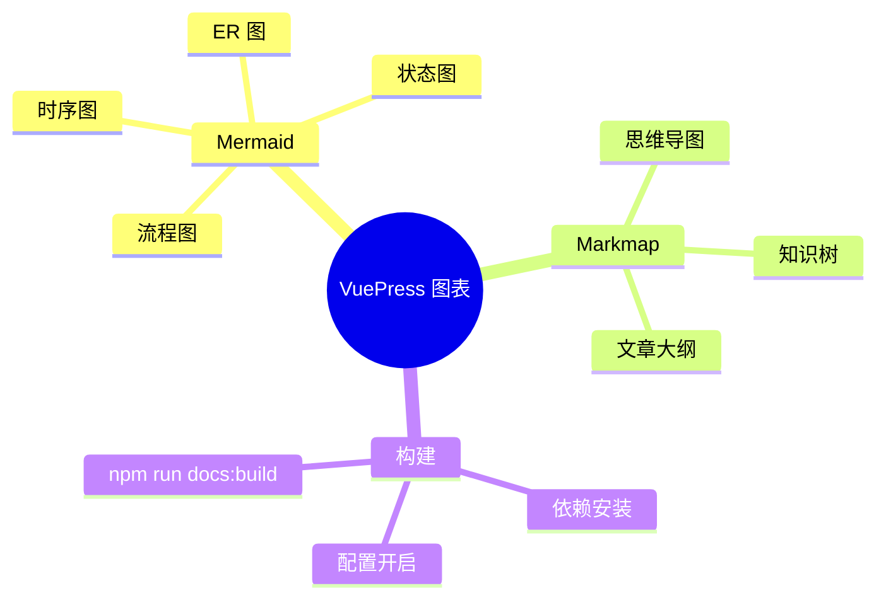
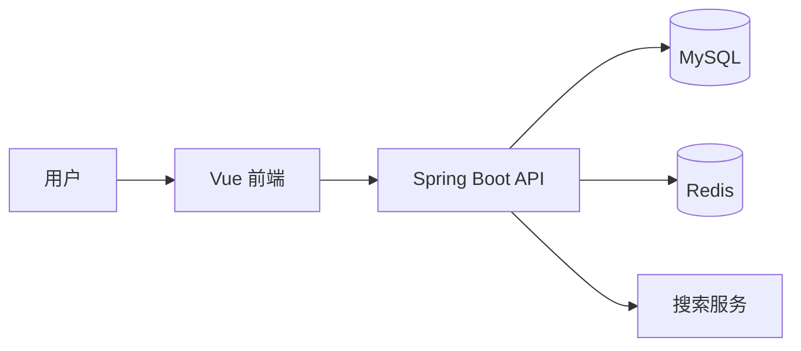
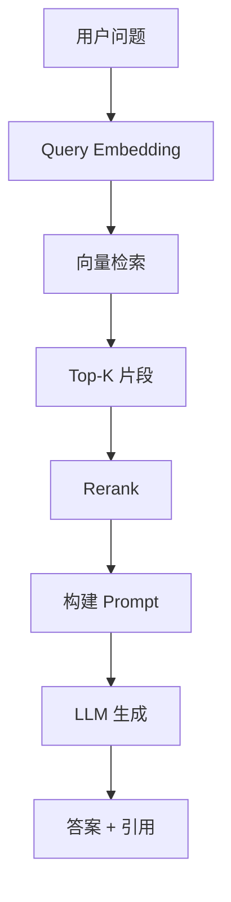
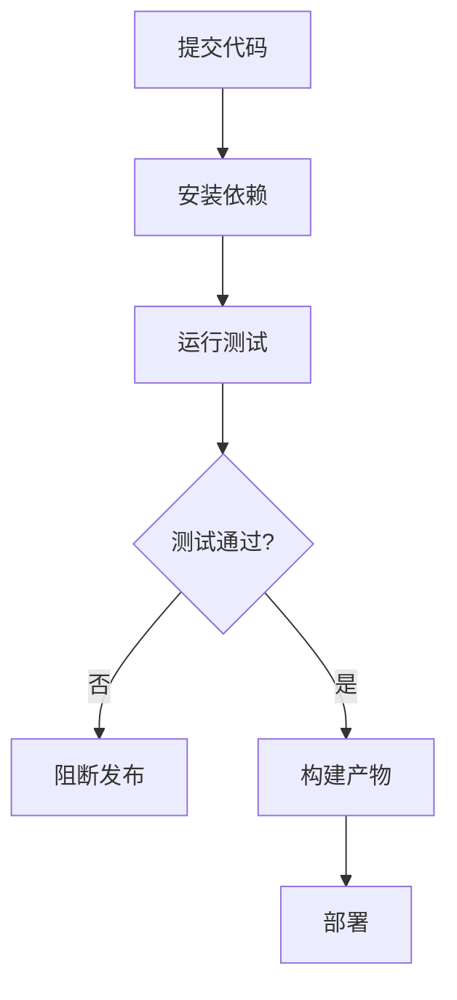
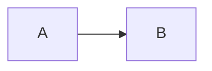

# VuePress 支持 Mermaid：在 Markdown 中画流程图、时序图和架构图

## 背景

技术文章里经常需要说明流程、调用链、状态变化和模块关系。如果每次都截图或手工画图，后续维护会很麻烦。

Mermaid 的优势是：直接用文本描述图表，和 Markdown 一起维护。

适合写：

- 流程图
- 时序图
- 状态图
- 类图
- ER 图
- 甘特图
- mindmap
- 架构关系图

本博客使用的是：

```text
VuePress 2
vuepress-theme-hope
@vuepress/plugin-markdown-chart
Mermaid
```

Theme Hope 已经集成 `@vuepress/plugin-markdown-chart`，只需要安装 Mermaid 依赖并打开配置。

## 安装依赖

Mermaid 是 markdown-chart 插件的可选 peer 依赖，需要手动安装：

```sh
npm install -D mermaid
```

安装后，`package.json` 中会出现：

```json
{
  "devDependencies": {
    "mermaid": "..."
  }
}
```

## 开启 VuePress 配置

修改：

```text
docs/.vuepress/config.js
```

在 `hopeTheme` 中开启：

```js
import { viteBundler } from '@vuepress/bundler-vite'
import { hopeTheme } from 'vuepress-theme-hope'

export default {
  lang: 'zh-CN',
  title: 'My Space',
  bundler: viteBundler(),
  theme: hopeTheme({
    markdown: {
      mermaid: true,
    },
  }),
}
```

如果你已经开启了 Markmap，可以放在一起：

```js
markdown: {
  markmap: true,
  mermaid: true,
},
```

## 基础写法

在 Markdown 中使用 `mermaid` 代码块：

````md

````

渲染效果：


## 流程图 Flowchart

流程图适合说明业务流程、构建流程和排查路径。



常见方向：

| 写法 | 方向 |
| --- | --- |
| `flowchart TD` | 从上到下 |
| `flowchart LR` | 从左到右 |
| `flowchart BT` | 从下到上 |
| `flowchart RL` | 从右到左 |

常见节点：

```text
A[矩形]
B(圆角)
C{判断}
D((圆形))
E[(数据库)]
```

## 时序图 Sequence Diagram

时序图适合表达接口调用、登录流程、微服务调用链。



常用箭头：

| 写法 | 说明 |
| --- | --- |
| `A->>B` | 实线箭头 |
| `A-->>B` | 虚线箭头 |
| `A-xB` | 带叉箭头 |
| `A-)B` | 异步箭头 |

## 状态图 State Diagram

状态图适合说明任务状态、订单状态、部署状态。



## Mermaid Mindmap

Mermaid 也支持 mindmap。如果你主要想写导图，Markmap 更像 Markdown 大纲；如果你已经大量使用 Mermaid，也可以直接使用 Mermaid mindmap。



## 常见使用场景

### 系统架构



### RAG 流程



### CI/CD 流程



## Mermaid 和 Markmap 怎么选

| 需求 | 推荐 |
| --- | --- |
| 流程图、时序图、状态图、ER 图 | Mermaid |
| 学习路线、知识树、文章大纲 | Markmap |
| 需要 Mermaid 生态统一 | Mermaid |
| 想用 Markdown 标题自然生成导图 | Markmap |

当前博客已经同时支持：

````md


```markmap
# 知识树
## 分支 A
## 分支 B
```
````

## 构建验证

修改配置和文章后执行：

```sh
npm run docs:build
```

构建成功后，检查产物：

```text
docs/.vuepress/dist/posts/vuepress-mermaid-guide.html
```

也可以检查临时客户端配置中是否注册了 Mermaid 组件：

```text
docs/.vuepress/.temp/markdown-chart/config.js
```

如果 Mermaid 没有渲染，优先检查：

1. 是否安装了 `mermaid`。
2. 是否配置了 `markdown.mermaid: true`。
3. 代码块语言是否是 `mermaid`。
4. Mermaid 语法是否正确。
5. 浏览器控制台是否有渲染错误。

## 当前项目改动

本次博客项目改动：

```text
package.json
package-lock.json
docs/.vuepress/config.js
docs/posts/vuepress-mermaid-guide.md
docs/posts/README.md
```

核心配置：

```js
theme: hopeTheme({
  markdown: {
    markmap: true,
    mermaid: true,
  },
})
```

之后写文章时，直接使用 ` ```mermaid ` 代码块即可插入流程图、时序图和其他 Mermaid 图表。
